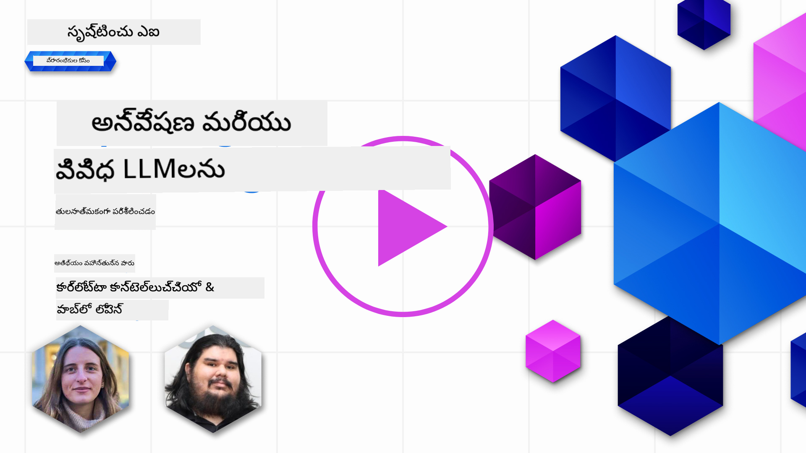
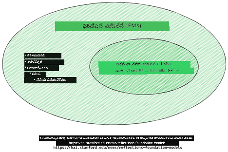
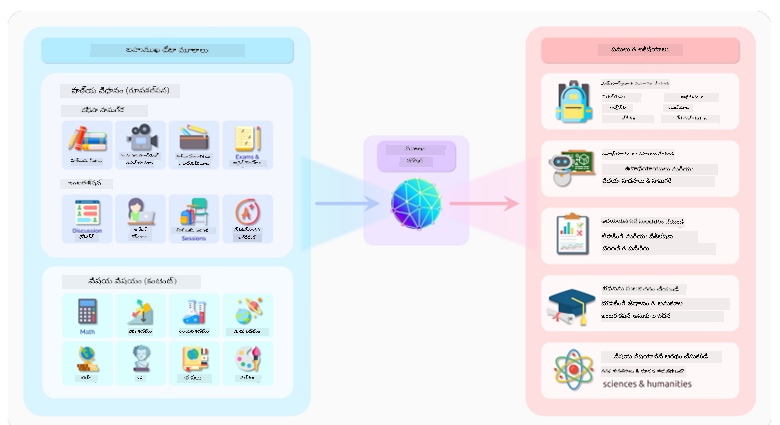
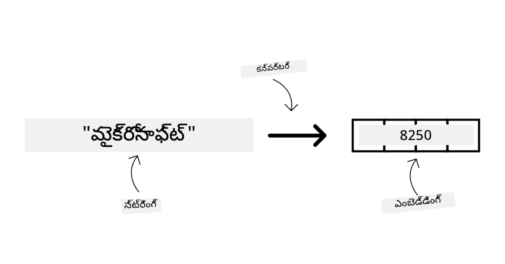
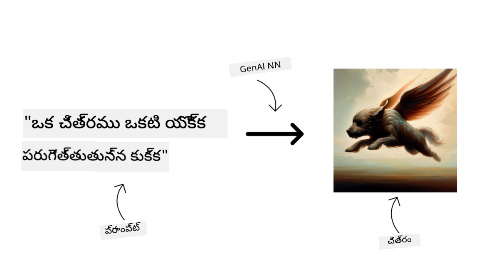
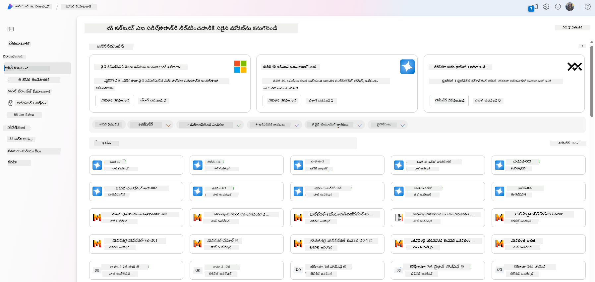
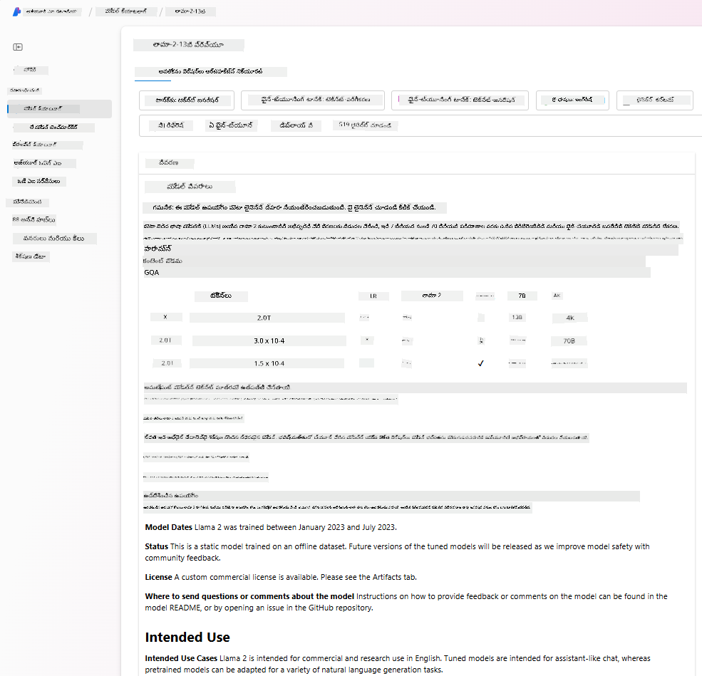
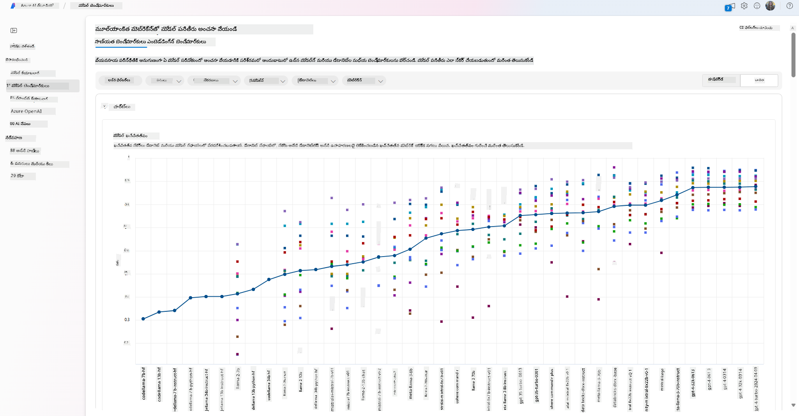
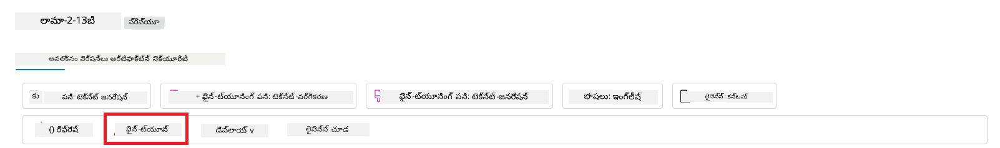
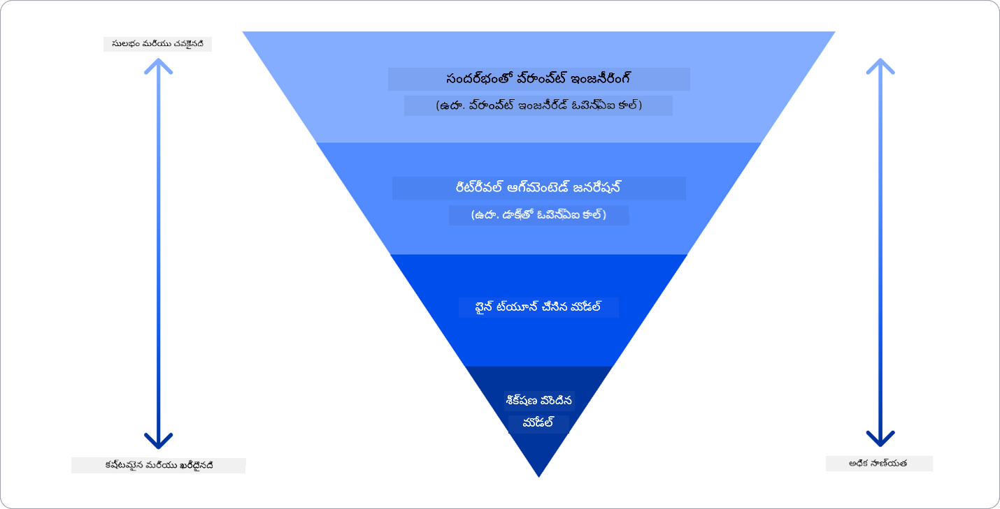

<!--
CO_OP_TRANSLATOR_METADATA:
{
  "original_hash": "6b7629b8ee4d7d874a27213e903d86a7",
  "translation_date": "2025-12-19T19:34:22+00:00",
  "source_file": "02-exploring-and-comparing-different-llms/README.md",
  "language_code": "te"
}
-->
# వివిధ LLMలను అన్వేషించడం మరియు పోల్చడం

> _ఈ పాఠం వీడియోను చూడడానికి పై చిత్రాన్ని క్లిక్ చేయండి_

మునుపటి పాఠంలో, జనరేటివ్ AI సాంకేతిక పరిసరాన్ని ఎలా మార్చుతున్నదో, పెద్ద భాషా నమూనాలు (LLMs) ఎలా పనిచేస్తాయో, మరియు ఒక వ్యాపారం - మన స్టార్టప్ లాంటి - వాటిని తమ వినియోగ సందర్భాలకు ఎలా వర్తింపజేసి అభివృద్ధి చెందవచ్చో చూశాము! ఈ అధ్యాయంలో, వివిధ రకాల పెద్ద భాషా నమూనాలను (LLMs) పోల్చి వారి లాభాలు మరియు నష్టాలను అర్థం చేసుకోవడానికి చూస్తున్నాము.

మన స్టార్టప్ ప్రయాణంలో తదుపరి దశ LLMల ప్రస్తుత పరిసరాన్ని అన్వేషించడం మరియు మన వినియోగ సందర్భానికి ఏవి అనుకూలమో అర్థం చేసుకోవడం.

## పరిచయం

ఈ పాఠం కవర్ చేస్తుంది:

- ప్రస్తుత పరిసరంలో వివిధ రకాల LLMలు.
- Azureలో మీ వినియోగ సందర్భానికి అనుగుణంగా వివిధ నమూనాలను పరీక్షించడం, పునరావృతం చేయడం మరియు పోల్చడం.
- LLMను ఎలా డిప్లాయ్ చేయాలో.

## నేర్చుకునే లక్ష్యాలు

ఈ పాఠం పూర్తి చేసిన తర్వాత, మీరు చేయగలుగుతారు:

- మీ వినియోగ సందర్భానికి సరైన నమూనాను ఎంచుకోవడం.
- మీ నమూనా పనితీరును పరీక్షించడం, పునరావృతం చేయడం మరియు మెరుగుపరచడం ఎలా అనేది అర్థం చేసుకోవడం.
- వ్యాపారాలు నమూనాలను ఎలా డిప్లాయ్ చేస్తాయో తెలుసుకోవడం.

## వివిధ రకాల LLMలను అర్థం చేసుకోండి

LLMలు వారి నిర్మాణం, శిక్షణ డేటా మరియు వినియోగ సందర్భం ఆధారంగా అనేక వర్గీకరణలు కలిగి ఉండవచ్చు. ఈ తేడాలను అర్థం చేసుకోవడం మన స్టార్టప్‌కు సన్నివేశానికి సరైన నమూనాను ఎంచుకోవడంలో, మరియు పరీక్షించడం, పునరావృతం చేయడం, పనితీరును మెరుగుపరచడంలో సహాయపడుతుంది.

చాలా రకాల LLM నమూనాలు ఉన్నాయి, మీరు ఎంచుకునే నమూనా మీరు వాటిని ఏ కోసం ఉపయోగించాలనుకుంటున్నారో, మీ డేటా, మీరు ఎంత చెల్లించడానికి సిద్ధంగా ఉన్నారో మరియు మరిన్ని అంశాలపై ఆధారపడి ఉంటుంది.

మీరు నమూనాలను టెక్స్ట్, ఆడియో, వీడియో, చిత్రం సృష్టి మొదలైన వాటికి ఉపయోగించాలనుకుంటే, మీరు వేరే రకమైన నమూనాను ఎంచుకోవచ్చు.

- **ఆడియో మరియు స్పీచ్ గుర్తింపు**. ఈ ప్రయోజనానికి, Whisper-రకం నమూనాలు గొప్ప ఎంపిక, ఎందుకంటే అవి సాధారణ ప్రయోజనాల కోసం మరియు స్పీచ్ గుర్తింపుకు లక్ష్యంగా ఉంటాయి. ఇవి విభిన్న ఆడియోపై శిక్షణ పొందినవి మరియు బహుభాషా స్పీచ్ గుర్తింపును నిర్వహించగలవు. [Whisper రకం నమూనాల గురించి ఇక్కడ తెలుసుకోండి](https://platform.openai.com/docs/models/whisper?WT.mc_id=academic-105485-koreyst).

- **చిత్ర సృష్టి**. చిత్ర సృష్టికి, DALL-E మరియు Midjourney రెండు బాగా ప్రసిద్ధ ఎంపికలు. DALL-Eని Azure OpenAI అందిస్తుంది. [DALL-E గురించి ఇక్కడ చదవండి](https://platform.openai.com/docs/models/dall-e?WT.mc_id=academic-105485-koreyst) మరియు ఈ పాఠ్యాంశం అధ్యాయం 9లో కూడా.

- **టెక్స్ట్ సృష్టి**. ఎక్కువ నమూనాలు టెక్స్ట్ సృష్టిపై శిక్షణ పొందినవి మరియు GPT-3.5 నుండి GPT-4 వరకు విస్తృత ఎంపికలు ఉన్నాయి. వీటి ఖర్చులు వేరువేరు, GPT-4 అత్యంత ఖరీదైనది. [Azure OpenAI ప్లేగ్రౌండ్](https://oai.azure.com/portal/playground?WT.mc_id=academic-105485-koreyst)లో మీ అవసరాలకు అనుగుణంగా సామర్థ్యం మరియు ఖర్చు పరంగా ఏ నమూనాలు ఉత్తమమో అంచనా వేయడం మంచిది.

- **బహుముఖత**. మీరు ఇన్‌పుట్ మరియు అవుట్‌పుట్‌లో బహుముఖ డేటాను నిర్వహించాలనుకుంటే, [gpt-4 turbo with vision లేదా gpt-4o](https://learn.microsoft.com/azure/ai-services/openai/concepts/models#gpt-4-and-gpt-4-turbo-models?WT.mc_id=academic-105485-koreyst) వంటి నమూనాలను చూడవచ్చు - ఇవి OpenAI యొక్క తాజా విడుదలలు - ఇవి సహజ భాషా ప్రాసెసింగ్‌ను దృశ్య అవగాహనతో కలిపి, బహుముఖ ఇంటర్‌ఫేస్‌ల ద్వారా పరస్పర చర్యలను సాధ్యమవుతాయి.

నమూనా ఎంచుకోవడం అంటే మీరు కొన్ని ప్రాథమిక సామర్థ్యాలను పొందుతారు, కానీ అవి సరిపోవకపోవచ్చు. తరచుగా మీకు కంపెనీ ప్రత్యేక డేటా ఉంటుంది, దానిని LLMకి తెలియజేయాల్సి ఉంటుంది. దానికి అనుసరించి కొన్ని ఎంపికలు ఉన్నాయి, వాటిపై తదుపరి విభాగాల్లో చర్చిస్తాము.

### ఫౌండేషన్ మోడల్స్ మరియు LLMలు

ఫౌండేషన్ మోడల్ అనే పదం [స్టాన్‌ఫోర్డ్ పరిశోధకులు](https://arxiv.org/abs/2108.07258?WT.mc_id=academic-105485-koreyst) రూపొందించారు మరియు ఇది కొన్ని ప్రమాణాలను అనుసరించే AI మోడల్‌గా నిర్వచించబడింది, ఉదాహరణకు:

- **వీరు అనియంత్రిత లేదా స్వీయ-అనియంత్రిత శిక్షణను ఉపయోగించి శిక్షణ పొందుతారు**, అంటే వారు లేబుల్ చేయని బహుముఖ డేటాపై శిక్షణ పొందుతారు, మరియు శిక్షణ ప్రక్రియ కోసం మానవ లేబలింగ్ అవసరం లేదు.
- **వీరు చాలా పెద్ద నమూనాలు**, బిలియన్ల పరామితులపై శిక్షణ పొందిన చాలా లోతైన న్యూరల్ నెట్‌వర్క్‌ల ఆధారంగా ఉంటాయి.
- **వీరు సాధారణంగా ఇతర నమూనాల ‘ఫౌండేషన్’గా పనిచేయడానికి ఉద్దేశించబడ్డారు**, అంటే వీటిని ఇతర నమూనాలు నిర్మించడానికి ప్రారంభ బిందువుగా ఉపయోగించవచ్చు, ఫైన్-ట్యూనింగ్ ద్వారా చేయవచ్చు.

చిత్ర మూలం: [Essential Guide to Foundation Models and Large Language Models | by Babar M Bhatti | Medium](https://thebabar.medium.com/essential-guide-to-foundation-models-and-large-language-models-27dab58f7404)

ఈ తేడాను మరింత స్పష్టంగా చేయడానికి, ChatGPTని ఉదాహరణగా తీసుకుందాం. ChatGPT మొదటి సంస్కరణను నిర్మించడానికి, GPT-3.5 అనే మోడల్ ఫౌండేషన్ మోడల్‌గా పనిచేసింది. అంటే OpenAI చాట్-స్పెసిఫిక్ డేటాను ఉపయోగించి GPT-3.5 యొక్క ట్యూన్ చేసిన సంస్కరణను సృష్టించింది, ఇది చాట్‌బాట్స్ వంటి సంభాషణాత్మక సందర్భాలలో బాగా పనిచేస్తుంది.

చిత్ర మూలం: [2108.07258.pdf (arxiv.org)](https://arxiv.org/pdf/2108.07258.pdf?WT.mc_id=academic-105485-koreyst)

### ఓపెన్ సోర్స్ మరియు ప్రొప్రైటరీ మోడల్స్

LLMలను వర్గీకరించే మరో మార్గం అవి ఓపెన్ సోర్స్ లేదా ప్రొప్రైటరీనా అన్నది.

ఓపెన్ సోర్స్ మోడల్స్ అనేవి ప్రజలకు అందుబాటులో ఉంచబడినవి మరియు ఎవరికైనా ఉపయోగించుకోవచ్చు. వీటిని సాధారణంగా వాటిని సృష్టించిన కంపెనీ లేదా పరిశోధనా సముదాయం అందిస్తుంది. ఈ మోడల్స్ పరిశీలించడానికి, సవరించడానికి మరియు వివిధ LLM వినియోగాలకు అనుకూలీకరించడానికి అనుమతిస్తాయి. అయితే, అవి ఎప్పుడూ ఉత్పత్తి వినియోగానికి ఆప్టిమైజ్ చేయబడవు, మరియు ప్రొప్రైటరీ మోడల్స్ లాగా పనితీరు ఉండకపోవచ్చు. అదనంగా, ఓపెన్ సోర్స్ మోడల్స్‌కు నిధులు పరిమితంగా ఉండవచ్చు, అవి దీర్ఘకాలం నిర్వహించబడకపోవచ్చు లేదా తాజా పరిశోధనతో నవీకరించబడకపోవచ్చు. ప్రసిద్ధ ఓపెన్ సోర్స్ మోడల్స్ ఉదాహరణలు: [Alpaca](https://crfm.stanford.edu/2023/03/13/alpaca.html?WT.mc_id=academic-105485-koreyst), [Bloom](https://huggingface.co/bigscience/bloom) మరియు [LLaMA](https://llama.meta.com).

ప్రొప్రైటరీ మోడల్స్ అనేవి కంపెనీ యాజమాన్యంలో ఉండి ప్రజలకు అందుబాటులో ఉంచబడవు. ఇవి సాధారణంగా ఉత్పత్తి వినియోగానికి ఆప్టిమైజ్ చేయబడ్డాయి. అయితే, వీటిని పరిశీలించడం, సవరించడం లేదా వివిధ వినియోగాలకు అనుకూలీకరించడం అనుమతించబడదు. అదనంగా, ఇవి ఎప్పుడూ ఉచితంగా అందుబాటులో ఉండవు, ఉపయోగించడానికి సబ్‌స్క్రిప్షన్ లేదా చెల్లింపు అవసరం ఉండవచ్చు. అలాగే, వినియోగదారులు మోడల్ శిక్షణకు ఉపయోగించిన డేటాపై నియంత్రణ కలిగి ఉండరు, కాబట్టి వారు డేటా గోప్యత మరియు AI బాధ్యతాయుత వినియోగంపై మోడల్ యజమానికి నమ్మకం పెట్టుకోవాలి. ప్రసిద్ధ ప్రొప్రైటరీ మోడల్స్ ఉదాహరణలు: [OpenAI మోడల్స్](https://platform.openai.com/docs/models/overview?WT.mc_id=academic-105485-koreyst), [Google Bard](https://sapling.ai/llm/bard?WT.mc_id=academic-105485-koreyst) లేదా [Claude 2](https://www.anthropic.com/index/claude-2?WT.mc_id=academic-105485-koreyst).

### ఎంబెడ్డింగ్, చిత్రం సృష్టి, టెక్స్ట్ మరియు కోడ్ సృష్టి

LLMలను అవుట్‌పుట్ ఆధారంగా కూడా వర్గీకరించవచ్చు.

ఎంబెడ్డింగ్స్ అనేవి టెక్స్ట్‌ను సంఖ్యాత్మక రూపంలోకి మార్చగల నమూనాల సమూహం, దీనిని ఎంబెడ్డింగ్ అంటారు, ఇది ఇన్‌పుట్ టెక్స్ట్ యొక్క సంఖ్యాత్మక ప్రాతినిధ్యం. ఎంబెడ్డింగ్స్ యంత్రాలకు పదాలు లేదా వాక్యాల మధ్య సంబంధాలను అర్థం చేసుకోవడాన్ని సులభతరం చేస్తాయి మరియు అవి వర్గీకరణ నమూనాలు లేదా క్లస్టరింగ్ నమూనాలు వంటి ఇతర నమూనాల ఇన్‌పుట్‌గా ఉపయోగించబడతాయి, ఇవి సంఖ్యాత్మక డేటాపై మెరుగైన పనితీరు కలిగి ఉంటాయి. ఎంబెడ్డింగ్ నమూనాలు తరచుగా ట్రాన్స్‌ఫర్ లెర్నింగ్ కోసం ఉపయోగిస్తారు, అంటే ఒక నమూనా ఎక్కువ డేటా ఉన్న ప్రత్యామ్నాయ పనికి నిర్మించబడుతుంది, ఆ తర్వాత నమూనా బరువులు (ఎంబెడ్డింగ్స్) ఇతర డౌన్‌స్ట్రీమ్ పనులకు పునర్వినియోగం చేయబడతాయి. ఈ వర్గానికి ఉదాహరణ [OpenAI ఎంబెడ్డింగ్స్](https://platform.openai.com/docs/models/embeddings?WT.mc_id=academic-105485-koreyst).

చిత్ర సృష్టి నమూనాలు చిత్రాలను సృష్టించే నమూనాలు. ఇవి తరచుగా చిత్రం ఎడిటింగ్, చిత్రం సింథసిస్, మరియు చిత్రం అనువాదానికి ఉపయోగిస్తారు. చిత్ర సృష్టి నమూనాలు పెద్ద చిత్ర డేటాసెట్‌లపై శిక్షణ పొందినవి, ఉదాహరణకు [LAION-5B](https://laion.ai/blog/laion-5b/?WT.mc_id=academic-105485-koreyst), మరియు కొత్త చిత్రాలను సృష్టించడానికి లేదా ఇన్‌పెయింటింగ్, సూపర్-రెసల్యూషన్, మరియు కలర్‌యిజేషన్ సాంకేతికతలతో ఉన్న చిత్రాలను సవరించడానికి ఉపయోగించవచ్చు. ఉదాహరణలు: [DALL-E-3](https://openai.com/dall-e-3?WT.mc_id=academic-105485-koreyst) మరియు [స్టేబుల్ డిఫ్యూషన్ మోడల్స్](https://github.com/Stability-AI/StableDiffusion?WT.mc_id=academic-105485-koreyst).

టెక్స్ట్ మరియు కోడ్ సృష్టి నమూనాలు టెక్స్ట్ లేదా కోడ్ సృష్టించే నమూనాలు. ఇవి తరచుగా టెక్స్ట్ సారాంశం, అనువాదం, మరియు ప్రశ్నలకు సమాధానం ఇవ్వడానికి ఉపయోగిస్తారు. టెక్స్ట్ సృష్టి నమూనాలు పెద్ద టెక్స్ట్ డేటాసెట్‌లపై శిక్షణ పొందినవి, ఉదాహరణకు [BookCorpus](https://www.cv-foundation.org/openaccess/content_iccv_2015/html/Zhu_Aligning_Books_and_ICCV_2015_paper.html?WT.mc_id=academic-105485-koreyst), మరియు కొత్త టెక్స్ట్ సృష్టించడానికి లేదా ప్రశ్నలకు సమాధానం ఇవ్వడానికి ఉపయోగించవచ్చు. కోడ్ సృష్టి నమూనాలు, ఉదాహరణకు [CodeParrot](https://huggingface.co/codeparrot?WT.mc_id=academic-105485-koreyst), పెద్ద కోడ్ డేటాసెట్‌లపై శిక్షణ పొందినవి, ఉదాహరణకు GitHub, మరియు కొత్త కోడ్ సృష్టించడానికి లేదా ఉన్న కోడ్‌లో బగ్స్‌ను సరిచేయడానికి ఉపయోగించవచ్చు.

### ఎంకోడర్-డికోడర్ మరియు డికోడర్-ఒన్లీ

LLMల వివిధ నిర్మాణ రకాల గురించి మాట్లాడడానికి, ఒక ఉపమానం ఉపయోగిద్దాం.

మీ మేనేజర్ మీకు విద్యార్థుల కోసం క్విజ్ రాయమని పని ఇచ్చారు అనుకోండి. మీకు ఇద్దరు సహోద్యోగులు ఉన్నారు; ఒకరు కంటెంట్ సృష్టించడాన్ని పర్యవేక్షిస్తారు, మరొకరు వాటిని సమీక్షిస్తారు.

కంటెంట్ సృష్టికర్త డికోడర్-ఒన్లీ మోడల్ లాంటివారు, వారు విషయం చూసి మీరు ఇప్పటికే రాసినదాన్ని గమనించి, దాని ఆధారంగా కోర్సును రాయగలరు. వారు ఆకట్టుకునే మరియు సమాచారపూర్వక కంటెంట్ రాయడంలో చాలా మంచి వారు, కానీ విషయం మరియు నేర్చుకునే లక్ష్యాలను అర్థం చేసుకోవడంలో అంతగా మంచి వారు కాదు. డికోడర్ మోడల్స్ ఉదాహరణలు GPT కుటుంబ మోడల్స్, ఉదాహరణకు GPT-3.

సమీక్షకుడు ఎంకోడర్-ఒన్లీ మోడల్ లాంటివారు, వారు రాసిన కోర్సు మరియు సమాధానాలను చూస్తారు, వాటి మధ్య సంబంధాన్ని గమనించి సందర్భాన్ని అర్థం చేసుకుంటారు, కానీ కంటెంట్ సృష్టించడంలో మంచి వారు కాదు. ఎంకోడర్-ఒన్లీ మోడల్ ఉదాహరణ BERT.

మనకు ఒకరు క్విజ్ సృష్టించి సమీక్షించగలిగే వారు ఉన్నారని ఊహించండి, ఇది ఎంకోడర్-డికోడర్ మోడల్. ఉదాహరణలు BART మరియు T5.

### సర్వీస్ మరియు మోడల్

ఇప్పుడు, సర్వీస్ మరియు మోడల్ మధ్య తేడా గురించి మాట్లాడుకుందాం. సర్వీస్ అనేది క్లౌడ్ సర్వీస్ ప్రొవైడర్ అందించే ఉత్పత్తి, ఇది తరచుగా మోడల్స్, డేటా మరియు ఇతర భాగాల సమ్మేళనం. మోడల్ అనేది సర్వీస్ యొక్క ప్రధాన భాగం, తరచుగా ఫౌండేషన్ మోడల్, ఉదాహరణకు LLM.

సర్వీసులు సాధారణంగా ఉత్పత్తి వినియోగానికి ఆప్టిమైజ్ చేయబడ్డాయి మరియు మోడల్స్ కంటే ఉపయోగించడానికి సులభంగా ఉంటాయి, గ్రాఫికల్ యూజర్ ఇంటర్‌ఫేస్ ద్వారా. అయితే, సర్వీసులు ఎప్పుడూ ఉచితంగా అందుబాటులో ఉండవు, ఉపయోగించడానికి సబ్‌స్క్రిప్షన్ లేదా చెల్లింపు అవసరం ఉండవచ్చు, ఇది సర్వీస్ యజమాని పరికరాలు మరియు వనరులను ఉపయోగించడంలో, ఖర్చులను ఆప్టిమైజ్ చేయడంలో మరియు సులభంగా స్కేల్ చేయడంలో సహాయపడుతుంది. ఒక సర్వీస్ ఉదాహరణ [Azure OpenAI Service](https://learn.microsoft.com/azure/ai-services/openai/overview?WT.mc_id=academic-105485-koreyst), ఇది పేమెంట్-అస్-యూ-గో రేటు ప్రణాళికను అందిస్తుంది, అంటే వినియోగదారులు సర్వీస్‌ను ఎంత ఉపయోగిస్తారో proporcional గా చెల్లించాలి. అదనంగా, Azure OpenAI Service మోడల్స్ సామర్థ్యాలపై ఎంటర్‌ప్రైజ్-గ్రేడ్ సెక్యూరిటీ మరియు బాధ్యతాయుత AI ఫ్రేమ్‌వర్క్‌ను అందిస్తుంది.

మోడల్స్ కేవలం న్యూరల్ నెట్‌వర్క్, పరామితులు, బరువులు మరియు ఇతర భాగాలు. కంపెనీలు స్థానికంగా నడపడానికి వీలుగా ఉంటాయి, కానీ పరికరాలు కొనుగోలు చేయాలి, స్కేల్ చేయడానికి నిర్మాణం తయారు చేయాలి మరియు లైసెన్స్ కొనుగోలు చేయాలి లేదా ఓపెన్ సోర్స్ మోడల్ ఉపయోగించాలి. LLaMA వంటి మోడల్ అందుబాటులో ఉంది, మోడల్ నడపడానికి కంప్యూటేషనల్ శక్తి అవసరం.

## Azureలో వివిధ మోడల్స్‌తో పనితీరును అర్థం చేసుకోవడానికి ఎలా పరీక్షించాలి మరియు పునరావృతం చేయాలి

మన బృందం ప్రస్తుత LLM పరిసరాన్ని అన్వేషించి వారి సన్నివేశాలకు అనుకూలమైన కొన్ని మంచి అభ్యర్థులను గుర్తించిన తర్వాత, తదుపరి దశ వారి డేటా మరియు వర్క్‌లోడ్‌పై వాటిని పరీక్షించడం. ఇది పునరావృత ప్రక్రియ, ప్రయోగాలు మరియు కొలతల ద్వారా చేయబడుతుంది.
మునుపటి పేరాగ్రాఫ్‌లలో మేము ప్రస్తావించిన చాలా మోడల్స్ (OpenAI మోడల్స్, Llama2 వంటి ఓపెన్ సోర్స్ మోడల్స్, మరియు Hugging Face ట్రాన్స్‌ఫార్మర్స్) [Azure AI Studio](https://ai.azure.com/?WT.mc_id=academic-105485-koreyst)లోని [Model Catalog](https://learn.microsoft.com/azure/ai-studio/how-to/model-catalog-overview?WT.mc_id=academic-105485-koreyst)లో అందుబాటులో ఉన్నాయి.

[Azure AI Studio](https://learn.microsoft.com/azure/ai-studio/what-is-ai-studio?WT.mc_id=academic-105485-koreyst) అనేది డెవలపర్ల కోసం రూపొందించిన క్లౌడ్ ప్లాట్‌ఫారమ్, ఇది జనరేటివ్ AI అప్లికేషన్లను నిర్మించడానికి మరియు ప్రయోగం నుండి మూల్యాంకన వరకు మొత్తం అభివృద్ధి జీవన చక్రాన్ని నిర్వహించడానికి అనుమతిస్తుంది - అన్ని Azure AI సేవలను ఒకే హబ్‌లో సులభ GUIతో కలిపి. Azure AI Studioలోని Model Catalog వినియోగదారునికి ఈ క్రింది సదుపాయాలను అందిస్తుంది:

- క్యాటలాగ్‌లో ఆసక్తికరమైన ఫౌండేషన్ మోడల్‌ను కనుగొనండి - ప్రొప్రైటరీ లేదా ఓపెన్ సోర్స్, టాస్క్, లైసెన్స్ లేదా పేరుతో ఫిల్టర్ చేయవచ్చు. శోధన సౌలభ్యాన్ని మెరుగుపరచడానికి, మోడల్స్‌ను Azure OpenAI కలెక్షన్, Hugging Face కలెక్షన్ మరియు మరిన్ని వంటి కలెక్షన్లుగా ఏర్పాటు చేశారు.

- మోడల్ కార్డ్‌ను సమీక్షించండి, ఇందులో ఉద్దేశించిన ఉపయోగం మరియు శిక్షణ డేటా యొక్క వివరమైన వివరణ, కోడ్ నమూనాలు మరియు అంతర్గత మూల్యాంకన లైబ్రరీపై మూల్యాంకన ఫలితాలు ఉంటాయి.

- వ్యాపార పరిస్థితికి సరిపోయే మోడల్‌ను అంచనా వేయడానికి పరిశ్రమలో అందుబాటులో ఉన్న మోడల్స్ మరియు డేటాసెట్‌లపై బెంచ్‌మార్క్‌లను [Model Benchmarks](https://learn.microsoft.com/azure/ai-studio/how-to/model-benchmarks?WT.mc_id=academic-105485-koreyst) ప్యానెల్ ద్వారా పోల్చండి.

- Azure AI Studio యొక్క ప్రయోగం మరియు ట్రాకింగ్ సామర్థ్యాలను ఉపయోగించి, నిర్దిష్ట వర్క్‌లోడ్‌లో మోడల్ పనితీరును మెరుగుపరచడానికి కస్టమ్ శిక్షణ డేటాపై మోడల్‌ను ఫైన్-ట్యూన్ చేయండి.

- ఒరిజినల్ ప్రీ-ట్రెయిన్డ్ మోడల్ లేదా ఫైన్-ట్యూన్ చేసిన వెర్షన్‌ను రిమోట్ రియల్ టైమ్ ఇన్ఫరెన్స్ - మేనేజ్డ్ కంప్యూట్ - లేదా సర్వర్‌లెస్ API ఎండ్‌పాయింట్ - [pay-as-you-go](https://learn.microsoft.com/azure/ai-studio/how-to/model-catalog-overview#model-deployment-managed-compute-and-serverless-api-pay-as-you-go?WT.mc_id=academic-105485-koreyst) - కు డిప్లాయ్ చేయండి, తద్వారా అప్లికేషన్లు దాన్ని వినియోగించగలవు.

> [!NOTE]
> క్యాటలాగ్‌లోని అన్ని మోడల్స్ ప్రస్తుతం ఫైన్-ట్యూనింగ్ మరియు/లేదా pay-as-you-go డిప్లాయ్‌మెంట్ కోసం అందుబాటులో ఉండవు. మోడల్ సామర్థ్యాలు మరియు పరిమితుల వివరాలకు మోడల్ కార్డ్‌ను తనిఖీ చేయండి.

## LLM ఫలితాలను మెరుగుపరచడం

మేము మా స్టార్టప్ టీమ్‌తో వివిధ రకాల LLMలను మరియు Azure Machine Learning అనే క్లౌడ్ ప్లాట్‌ఫారమ్‌ను అన్వేషించాము, ఇది మాకు వివిధ మోడల్స్‌ను పోల్చడానికి, టెస్ట్ డేటాపై వాటిని మూల్యాంకనం చేయడానికి, పనితీరును మెరుగుపరచడానికి మరియు ఇన్ఫరెన్స్ ఎండ్‌పాయింట్లపై వాటిని డిప్లాయ్ చేయడానికి సహాయపడింది.

కానీ వారు ఎప్పుడు ప్రీ-ట్రెయిన్డ్ మోడల్ ఉపయోగించకుండా ఫైన్-ట్యూనింగ్ చేయాలని పరిగణించాలి? నిర్దిష్ట వర్క్‌లోడ్‌లపై మోడల్ పనితీరును మెరుగుపరచడానికి ఇతర పద్ధతులు ఉన్నాయా?

వ్యాపారం LLM నుండి కావలసిన ఫలితాలను పొందడానికి అనేక పద్ధతులు ఉన్నాయి. మీరు ప్రొడక్షన్‌లో LLMను డిప్లాయ్ చేయేటప్పుడు శిక్షణ స్థాయిలు, సంక్లిష్టత, ఖర్చు మరియు నాణ్యత పరంగా వేరువేరు రకాల మోడల్స్‌ను ఎంచుకోవచ్చు. కొన్ని వేరువేరు పద్ధతులు ఇక్కడ ఉన్నాయి:

- **కాంటెక్స్ట్‌తో ప్రాంప్ట్ ఇంజనీరింగ్**. మీరు అవసరమైన ప్రతిస్పందనలను పొందడానికి ప్రాంప్ట్ ఇచ్చేటప్పుడు సరిపడా కాంటెక్స్ట్ అందించడం.

- **Retrieval Augmented Generation, RAG**. మీ డేటా డేటాబేస్ లేదా వెబ్ ఎండ్‌పాయింట్‌లో ఉండవచ్చు, ప్రాంప్ట్ సమయంలో ఆ డేటా లేదా దాని ఉపసమూహం చేర్చడానికి సంబంధిత డేటాను తీసుకుని వినియోగదారుని ప్రాంప్ట్‌లో భాగంగా చేయవచ్చు.

- **ఫైన్-ట్యూన్ చేసిన మోడల్**. ఇక్కడ మీరు మీ స్వంత డేటాపై మోడల్‌ను మరింత శిక్షణ ఇచ్చారు, ఇది మోడల్‌ను మీ అవసరాలకు మరింత ఖచ్చితంగా మరియు స్పందనాత్మకంగా మార్చింది, కానీ ఇది ఖర్చుతో కూడుకున్నది.

Img మూలం: [Four Ways that Enterprises Deploy LLMs | Fiddler AI Blog](https://www.fiddler.ai/blog/four-ways-that-enterprises-deploy-llms?WT.mc_id=academic-105485-koreyst)

### కాంటెక్స్ట్‌తో ప్రాంప్ట్ ఇంజనీరింగ్

ప్రీ-ట్రెయిన్డ్ LLMలు సాధారణ భాషా పనులపై చాలా బాగా పనిచేస్తాయి, చిన్న ప్రాంప్ట్‌తో కూడా, ఉదాహరణకు పూర్తి చేయాల్సిన వాక్యం లేదా ప్రశ్న – దీనిని “జీరో-షాట్” లెర్నింగ్ అంటారు.

అయితే, వినియోగదారు తన ప్రశ్నను వివరంగా, ఉదాహరణలతో – కాంటెక్స్ట్‌తో – ఫ్రేమ్ చేస్తే, సమాధానం మరింత ఖచ్చితంగా మరియు వినియోగదారుని ఆశలకు దగ్గరగా ఉంటుంది. ఈ సందర్భంలో, ప్రాంప్ట్‌లో ఒకే ఒక ఉదాహరణ ఉంటే “వన్-షాట్” లెర్నింగ్ అంటారు, మరియు అనేక ఉదాహరణలు ఉంటే “ఫ్యూ షాట్ లెర్నింగ్” అంటారు.
కాంటెక్స్ట్‌తో ప్రాంప్ట్ ఇంజనీరింగ్ ప్రారంభించడానికి అత్యంత ఖర్చు-సమర్థమైన పద్ధతి.

### Retrieval Augmented Generation (RAG)

LLMలకు శిక్షణ సమయంలో ఉపయోగించిన డేటా మాత్రమే సమాధానం రూపొందించడానికి ఉపయోగించగలిగే పరిమితి ఉంది. అంటే, శిక్షణ తర్వాత జరిగిన వాస్తవాల గురించి అవగాహన లేదు, మరియు ప్రైవేట్ సమాచారం (ఉదా: కంపెనీ డేటా) యాక్సెస్ చేయలేరు.
ఇది RAG ద్వారా అధిగమించవచ్చు, ఇది ప్రాంప్ట్‌ను డాక్యుమెంట్ల భాగాల రూపంలో బాహ్య డేటాతో పెంపొందిస్తుంది, ప్రాంప్ట్ పొడవు పరిమితులను పరిగణలోకి తీసుకుంటుంది. ఇది [Azure Vector Search](https://learn.microsoft.com/azure/search/vector-search-overview?WT.mc_id=academic-105485-koreyst) వంటి వెక్టర్ డేటాబేస్ టూల్స్ ద్వారా మద్దతు పొందుతుంది, ఇవి వివిధ ముందుగా నిర్వచించిన డేటా మూలాల నుండి ఉపయోగకరమైన భాగాలను తీసుకుని ప్రాంప్ట్ కాంటెక్స్ట్‌లో చేర్చుతాయి.

ఈ పద్ధతి వ్యాపారానికి సరిపడా డేటా, సమయం లేదా వనరులు లేకపోయినా, నిర్దిష్ట వర్క్‌లోడ్‌పై పనితీరును మెరుగుపరచడానికి మరియు వాస్తవానికి విరుద్ధమైన లేదా హానికరమైన కంటెంట్ ప్రమాదాలను తగ్గించడానికి చాలా సహాయపడుతుంది.

### ఫైన్-ట్యూన్ చేసిన మోడల్

ఫైన్-ట్యూనింగ్ అనేది ట్రాన్స్‌ఫర్ లెర్నింగ్‌ను ఉపయోగించి మోడల్‌ను ఒక డౌన్‌స్ట్రీమ్ టాస్క్‌కు లేదా నిర్దిష్ట సమస్యను పరిష్కరించడానికి ‘అడాప్ట్’ చేసే ప్రక్రియ. ఫ్యూ-షాట్ లెర్నింగ్ మరియు RAG కంటే భిన్నంగా, ఇది కొత్త మోడల్‌ను సృష్టిస్తుంది, నవీకరించిన వెయిట్స్ మరియు బైయాసెస్‌తో. ఇది ఒకే ఇన్‌పుట్ (ప్రాంప్ట్) మరియు దానికి సంబంధించిన అవుట్‌పుట్ (కంప్లీషన్) కలిగిన శిక్షణ ఉదాహరణల సెట్ అవసరం.
ఈ పద్ధతి ఇష్టపడదగినది, ఈ సందర్భాల్లో:

- **ఫైన్-ట్యూన్ చేసిన మోడల్స్ ఉపయోగించడం**. వ్యాపారం తక్కువ సామర్థ్యమున్న ఫైన్-ట్యూన్ చేసిన మోడల్స్ (ఉదా: ఎంబెడ్డింగ్ మోడల్స్) ఉపయోగించాలని కోరుకుంటే, ఇది ఖర్చు-సమర్థమైన మరియు వేగవంతమైన పరిష్కారంగా ఉంటుంది.

- **లేటెన్సీ పరిగణలోకి తీసుకోవడం**. నిర్దిష్ట ఉపయోగానికి లేటెన్సీ ముఖ్యం, కాబట్టి చాలా పొడవైన ప్రాంప్ట్‌లు లేదా మోడల్ నుండి నేర్చుకోవాల్సిన ఉదాహరణల సంఖ్య ప్రాంప్ట్ పొడవు పరిమితికి సరిపోలకపోవచ్చు.

- **అప్‌డేట్‌గా ఉండటం**. వ్యాపారానికి అధిక నాణ్యత గల డేటా మరియు గ్రౌండ్ ట్రూత్ లేబుల్స్ ఉన్నాయి మరియు ఈ డేటాను సమయానుకూలంగా నిర్వహించడానికి వనరులు ఉన్నాయి.

### శిక్షణ పొందిన మోడల్

LLMను మొదలుండి శిక్షణ ఇవ్వడం అనేది అనిశ్చితమైన మరియు అత్యంత సంక్లిష్టమైన పద్ధతి, ఇది భారీ డేటా, నైపుణ్యవంతులైన వనరులు మరియు సరైన కంప్యూటేషనల్ శక్తిని అవసరం చేస్తుంది. ఈ ఎంపికను వ్యాపారం డొమైన్-స్పెసిఫిక్ ఉపయోగం మరియు పెద్ద డొమైన్-కేంద్రీకృత డేటా ఉన్న సందర్భంలో మాత్రమే పరిగణించాలి.

## జ్ఞాన పరీక్ష

LLM కంప్లీషన్ ఫలితాలను మెరుగుపరచడానికి మంచి పద్ధతి ఏమిటి?

1. కాంటెక్స్ట్‌తో ప్రాంప్ట్ ఇంజనీరింగ్  
2. RAG  
3. ఫైన్-ట్యూన్ చేసిన మోడల్  

సమాధానం: 3, మీరు సమయం, వనరులు మరియు అధిక నాణ్యత గల డేటా కలిగి ఉంటే, అప్‌డేట్‌గా ఉండటానికి ఫైన్-ట్యూనింగ్ ఉత్తమ ఎంపిక. అయితే, మీరు మెరుగుపరచాలని చూస్తున్నప్పుడు సమయం తక్కువగా ఉంటే ముందుగా RAG పరిగణించవచ్చు.

## 🚀 సవాలు

మీ వ్యాపారానికి [RAG ఎలా ఉపయోగించాలో](https://learn.microsoft.com/azure/search/retrieval-augmented-generation-overview?WT.mc_id=academic-105485-koreyst) మరింత చదవండి.

## అద్భుతమైన పని, మీ అభ్యాసాన్ని కొనసాగించండి

ఈ పాఠం పూర్తి చేసిన తర్వాత, మా [Generative AI Learning collection](https://aka.ms/genai-collection?WT.mc_id=academic-105485-koreyst)ను చూడండి మరియు మీ జనరేటివ్ AI జ్ఞానాన్ని మరింత పెంచుకోండి!

మూడవ పాఠానికి వెళ్లండి, అక్కడ మేము [జనరేటివ్ AIని బాధ్యతగా ఎలా నిర్మించాలో](../03-using-generative-ai-responsibly/README.md?WT.mc_id=academic-105485-koreyst) చూడబోతున్నాము!

---

<!-- CO-OP TRANSLATOR DISCLAIMER START -->
**అస్పష్టత**:  
ఈ పత్రాన్ని AI అనువాద సేవ [Co-op Translator](https://github.com/Azure/co-op-translator) ఉపయోగించి అనువదించబడింది. మేము ఖచ్చితత్వానికి ప్రయత్నించినప్పటికీ, ఆటోమేటెడ్ అనువాదాల్లో పొరపాట్లు లేదా తప్పిదాలు ఉండవచ్చు. అసలు పత్రం దాని స్వదేశీ భాషలోనే అధికారిక మూలంగా పరిగణించాలి. ముఖ్యమైన సమాచారానికి, ప్రొఫెషనల్ మానవ అనువాదం చేయించుకోవడం మంచిది. ఈ అనువాదం వలన కలిగే ఏవైనా అపార్థాలు లేదా తప్పుదారుల బాధ్యత మేము తీసుకోము.
<!-- CO-OP TRANSLATOR DISCLAIMER END -->