# వివిధ LLM‌లను అన్వేషించడం మరియు పోల్చడం

[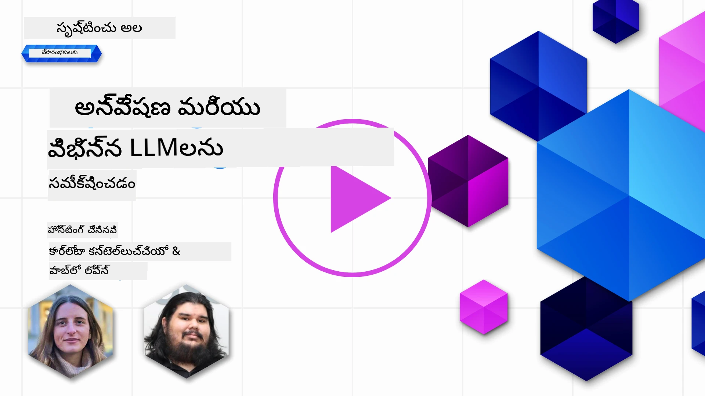](https://youtu.be/KIRUeDKscfI?si=8BHX1zvwzQBn-PlK)

> _ఈ పాఠానికి సంబంధించిన వీడియో చూడటానికి పై చిత్రాన్ని క్లిక్ చేయండి_

గత పాఠంలో, జనరేటివ్ AI సాంకేతిక పరిజ్ఞాన దృశ్యాన్ని ఎలా మార్చుతున్నదో, పెద్ద భాషా నమూనాలు (LLMs) ఎలా పనిచేస్తాయో, మరియు ఒక వ్యాపారం - మన స్టార్టప్ లాంటిది - అవి తమ ఉపయోగ కేసులకు ఎలా వర్తించగలదో చూశాం! ఈ అధ్యాయంలో, మనం వివిధ రకాల పెద్ద భాషా నమూనాలను (LLMs) పోల్చి, వాటి లాభాలు మరియు నష్టాలను అర్థం చేసుకోబోతున్నాం.

మన స్టార్ట‌ప్ ప‌య‌నంలో తదుపరి దశ LLMs యొక్క ప్రస్తుత దృశ్యాన్ని అన్వేషించడం మరియు మన ఉపయోగ కేసుకు తగినవాటినే గుర్తించడం.

## పరిచయం

ఈ పాఠం కవర్ చేయనది:

- ప్రస్తుత దృశ్యంలో వివిధ రకాల LLMలు.
- Azureలో మీ ఉపయోగానికి వివిధ నమూనాలను పరీక్షించడం, పునరావృతం చేయడం, మరియు పోల్చడం.
- LLMని ఎలా అమలు చేయాలో.

## అభ్యాస లక్ష్యాలు

ఈ పాఠం పూర్తి చేసుకున్న తర్వాత, మీరు చేయగలరు:

- మీ ఉపయోగానికి సరైన నమూనా ఎంచుకోవడం.
- మీ నమూనా పనితీరు పరీక్షించడం, పునరావృతం చేయడం మరియు మెరుగుచేయడం ఎలా అన్నదాన్ని అర్థం చేసుకోవడం.
- వ్యాపారాలు నమూనాలను ఎలా అమలు చేస్తున్నాయో తెలుసుకోవడం.

## వివిధ రకాల LLMలను అర్థం చేసుకోండి

LLMలు వాటి నిర్మాణం, శిక్షణ డేటా, మరియు ఉపయోగ కేసు ఆధారంగా అనేక వర్గాలుగా ఉండవచ్చు. ఈ తేడాలను అర్థం చేసుకోవడం ద్వారా మన స్టార్టప్ సందర్భానికి సరైన నమూనాను ఎంచుకోవడంలో, అలాగే పరీక్షించడం, పునరావృతం చేయడం, మరియు పనితీరును మెరుగుపరచడం లో సహాయం జరుగుతుంది.

అనేక రకాల LLM నమూనాలు ఉన్నాయి, మీరు ఏ నమూనాను ఎంచుకోవాలో మీ ఉపయోగం, డేటా, మీరు కేటాయించదలచుకున్న ఖర్చు మరియు మరింత ఆధారపడి ఉంటుంది.

మీరు నమూనాలను వచనం, ఆడియో, వీడియో, చిత్రం ఉత్పత్తి కోసం ఉపయోగించాలనుకుంటే, మీరు వేరొక రకమైన నమూనా ఎంచుకోవచ్చు.

- **ఆడియో మరియు స్పీచ్ గుర్తింపు**. విస్పర్-శైలీ నమూనాలు ఇప్పటికీ సాధారణ ఉద్దేశంతో స్పీచ్ గుర్తింపు నమూనాలుగా ఉపయోగపడతాయి, కానీ ప్రొడక్షన్ ఎంపికల్లో ప్రస్తుతం `gpt-4o-transcribe`, `gpt-4o-mini-transcribe`, మరియు డయరిజేషన్ వేరియంట్ లాంటి నూతన స్పీచ్-టు-టెక్స్ట్ నమూనాలు కూడా ఉన్నాయి. మీ సందర్భం కోసం భాషా కవరేజ్, డయరిజేషన్, రియల్-టైమ్ మద్దతు, లాటెన్సీ మరియు ఖర్చు ను అంచనా వేయండి. మరింత తెలుసుకోండి [OpenAI స్పీచ్-టు-టెక్స్ట్ డాక్యుమెంటేషన్](https://platform.openai.com/docs/guides/speech-to-text?WT.mc_id=academic-105485-koreyst).

- **చిత్ర ఉత్పత్తి**. DALL-E మరియు Midjourney ప్రసిద్ధ చిత్ర ఉత్పత్తి ఎంపికలు, అయితే ప్రస్తుత OpenAI చిత్రం APIలు ప్రధానంగా GPT చిత్రం నమూనాలపైనే (`gpt-image-2` వంటి) కేంద్రీకరించబడ్డాయి, అలాగే Stable Diffusion, Imagen, Flux మరియు ఇతర నమూనా కుటుంబాలు కూడా సాధారణ ఐచ్ఛికాలు. ప్రాంప్ట్ అనుకూలత, ఎడిటింగ్ మద్దతు, శైలి నియంత్రణ, భద్రతా అవసరాలు మరియు లైసెన్సింగ్ ను పోల్చండి. మరింత తెలుసుకోండి [OpenAI చిత్రం ఉత్పత్తి గైడ్](https://platform.openai.com/docs/guides/images?WT.mc_id=academic-105485-koreyst) మరియు ఈ పాఠ్యాంశం 9వ అధ్యాయం.

- **వచన ఉత్పత్తి**. వచన నమూనాలు ఇప్పుడు ఫ్రంటియర్ నమూనాలు, తార్కిక నమూనాలు, చిన్న తక్కువ-లాటెన్సీ నమూనాలు, మరియు ఓపెన్-వెయిట్ నమూనాలు వంటివిగా విస్తరించాయి. ప్రస్తుత ఉదాహరణలు OpenAI GPT-5.x, Anthropic Claude 4.x, Google Gemini 3.x, Meta Llama 4, మరియు Mistral నమూనాలు. విడుదల తేదీ లేదా ధర ఆధారంగా మాత్రమే ఎంచుకోకండి; పనితీరు నాణ్యత, లాటెన్సీ, కాంటెక్స్ట్ విండో, సాధనాలు ఉపయోగం, భద్రతా ప్రవర్తన, ప్రాదేశిక లభ్యత, మరియు మొత్తం ఖర్చును పోల్చండి. [Microsoft Foundry నమూనా క్యాటలాగ్](https://ai.azure.com/catalog?WT.mc_id=academic-105485-koreyst) Azureలో అందుబాటులో ఉన్న నమూనాలను పోల్చడానికి మంచి చోటు.

- **బహు-మాధ్యమికత**. ప్రస్తుత చాలామంది నమూనాలు వచనం తప్ప మరిన్ని కూడా ప్రాసెస్ చేయగలవు. కొంతమంది చిత్రం, ఆడియో, లేదా వీడియో ఇన్‌పుట్స్ ను స్వీకరిస్తారు; కొంతమంది సాధనాలను పిలవగలరు; మరియు ప్రత్యేక నమూనాలు చిత్రం, ఆడియో లేదా వీడియోను ఉత్పత్తి చేయగలవు. ఉదాహరణకు, ప్రస్తుత OpenAI నమూనాలు వచనం మరియు చిత్ర ఇన్‌పుట్ మద్దతు కలిగి ఉంటాయి, Gemini నమూనాలు వెర్షన్ ఆధారంగా వచన, కోడ్, చిత్రం, ఆడియో, మరియు వీడియో ఇన్‌పుట్స్ మద్దతు ఇస్తాయి, మరియు Llama 4 Scout మరియు Maverick ఓపెన్-వెయిట్ స్వాభావిక బహుమాధ్యమ నమూనాలు. వాటికి సంబంధించిన ఇన్‌పుట్ మరియు ఔట్‌పుట్ మాధ్యమాల కోసం ప్రతి నమూనా కార్డును పరిశీలించండి.

ఒక నమూనా ఎంచుకోవడం అంటే మీరు కొంత ప్రాథమిక సామర్థ్యాలు పొందుతారు; అది సరిపోవకపోవచ్చు. తరచుగా మీరు సంస్థకు సంబంధిత డేటాను LLMకి తెలియచేయాల్సి ఉంటుంది. ఆ దిశగా కొన్ని ఎంపికలు ఉన్నాయి, వాటిపై తరువాతి విభాగాలలో చర్చిస్తాము.

### ఫౌండేషన్ నమూనాలు మరియు LLMలు

ఫౌండేషన్ నమూనా అనే పదం [Stanford పరిశోధకులు](https://arxiv.org/abs/2108.07258?WT.mc_id=academic-105485-koreyst) ప్రతిపాదించారు మరియు కొన్నిసտրిక్ట్ ప్రమాణాలను అనుసరించే AI నమూనాగా నిర్వచించారు:

- **వీటిని అనుసూచితికరించిన లేదా స్వీయ-అనుసూచనాత్మక శిక్షణతో శిక్షణపెట్టడము** అంటే ఇవి లేబుల్ కాని బహుమాధ్యమ డేటాపై శిక్షణ పొందతాయి మరియు మనుషుల ద్వారా గుమొటించి లేబులింగ్ అవసరం లేదు.
- **ఇవి చాలా పెద్ద నమూనాలు**, బిలియన్‌ల పరిమాణంలో ఉన్న ప్రామాణికాలపై శిక్షణ పొందిన చాలా లోతైన న్యూరల్ నెట్‌వర్క్‌లు.
- **ఇవి సాధారణంగా ఇతర నమూనాలకు ‘ఫౌండేషన్’ గాను పనిచేయడానికే ఉద్దేశించబడ్డాయి**, అంటే వీటి ఆధారంగా మరికొన్ని నమూనాలు నిర్మించవచ్చు, ఫైన్-టూనింగ్ ద్వారా.

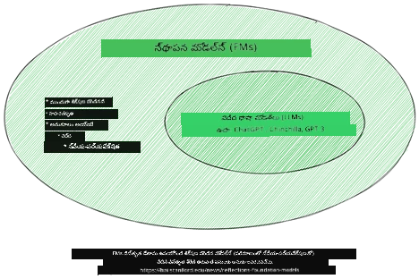

చిత్ర మూలం: [Essential Guide to Foundation Models and Large Language Models | by Babar M Bhatti | Medium
](https://thebabar.medium.com/essential-guide-to-foundation-models-and-large-language-models-27dab58f7404)

ఈ తేడాను మరింత క్లారిఫై చేయడానికి, చార్ట్GPTని ఒక చరిత్రాత్మక ఉదాహరణగా తీసుకుందాం. చార్ట్GPT తొలివార్షన్‌లు GPT-3.5ని ఫౌండేషన్ నమూనాగా ఉపయోగించాయి. OpenAI తర్వాత చాట్-స్పెసిఫిక్ డేటా మరియు అనుగుణత సాంకేతికాలతో మెరుగైన సంభాషణల కోసం ఉంటు ట్యూన్ చేసిన వెర్షన్ రూపొందించింది. ఆధునిక AI సేవలు తరచుగా పలు నమూనా వెర్షన్ల మధ్య మారుతుంటాయి, అందుచేత సేవ పేరు మరియు అంతర్గత నమూనా పేరు ఎప్పుడూ ఒకటే ఉండవు.

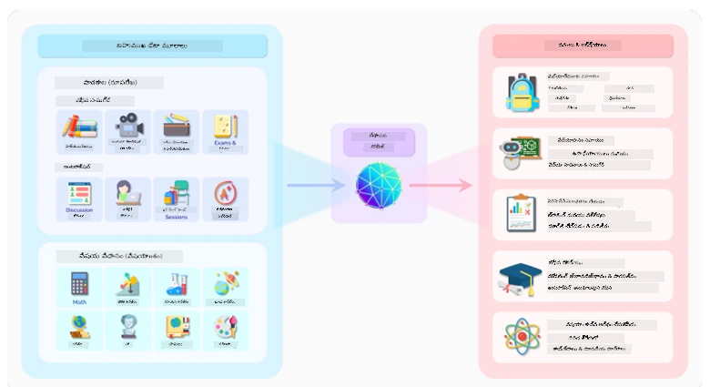

చిత్ర మూలం: [2108.07258.pdf (arxiv.org)](https://arxiv.org/pdf/2108.07258.pdf?WT.mc_id=academic-105485-koreyst)

### ఓపెన్-వెయిట్/ఓపెన్-సోర్స్ మరియు ప్రోప్రియటరీ నమూనాలు

LLMలను వేరుచేయడానికి మరో మార్గం అవి ఓపెన్-వెయిట్, ఓపెన్-సోర్స్ లేదా ప్రోప్రియటరీ వ్యత్యాసం.

ఓపెన్-సోర్స్ మరియు ఓపెన్-వెయిట్ నమూనాలు మోడల్ ఆర్టిఫాక్టులను పరిశీలన, డౌన్‌లోడ్ లేదా అనుకూలీకరణకు అందుబాటులో ఉంచుతాయి, కానీ వారి లైసెన్స్‌లు భిన్నంగా ఉంటాయి. కొన్ని పూర్తిగా ఓపెన్-సోర్స్ కాగా, కొన్ని ఉపయోగానికి పరిమితులతో ఓపెన్-వెయిట్ నమూనాలు. వ్యాపారం డిప్లాయ్‌మెంట్, డేటా స్థానికత, ఖర్చు లేదా అనుకూలీకరణపై మరింత నియంత్రణ కోరినపుడు వీటిని ఉపయోగించవచ్చు. అయితే టీములు ఉత్పత్తిలో ఉపయోగించడానికి ముందుగా లైసెన్స్ నిబంధనలు, సేవింగు ఖర్చులు, నిర్వహణ, భద్రతా అప్‌డేట్లు, మరియు మూల్యాంకన నాణ్యతను సమీక్షించాలి. ఉదాహరణలు: [Meta Llama 4](https://ai.meta.com/blog/llama-4-multimodal-intelligence/?WT.mc_id=academic-105485-koreyst), కొన్ని [Mistral నమూనాలు](https://docs.mistral.ai/models/overview?WT.mc_id=academic-105485-koreyst), మరియు [Hugging Face](https://huggingface.co/models?WT.mc_id=academic-105485-koreyst) లో హోస్ట్ అయిన అనేక నమూనాలు.

ప్రోప్రియటరీ నమూనాలు ఒక ప్రొవైడర్‌కు స్వంతంగా ఉండి అతడే వాటిని హోస్ట్ చేస్తాడు. ఇవి సాధారణంగా మేనేజ్డ్ ప్రొడక్షన్ ఉపయోగానికి ఆప్టిమైజ్ చేయబడ్డాయి మరియు బలమైన మద్దతు, సెక్యూరిటీ వ్యవస్థలు, టూల్ ఇంటిగ్రేషన్ మరియు స్కేలింగ్ అందించగలవు. కానీ వినియోగదారులు ఈ నమూనా వెయిట్‌లను పరిశీలించలేరు లేదా మార్చలేరు, మరియు ప్రొవైడర్ నిబంధనల ప్రకారం గోప్యత, దాచుబడి, అనుకూలత మరియు అనుకూల వినియోగ నియమాలు సమీక్షించాలి. ఉదాహరణలు: [OpenAI నమూనాలు](https://platform.openai.com/docs/models?WT.mc_id=academic-105485-koreyst), [Google Gemini](https://deepmind.google/models/gemini/pro/?WT.mc_id=academic-105485-koreyst), మరియు [Anthropic Claude](https://platform.claude.com/docs/en/about-claude/models/overview?WT.mc_id=academic-105485-koreyst).

### ఎంబెడ్డింగ్ మరియు చిత్ర ఉత్పత్తి మరియు వచన మరియు కోడ్ ఉత్పత్తి

LLMలను అవి ఉత్పత్తి చేసే అవుట్‌పుట్ ఆధారంగా కూడా వర్గీకరించవచ్చు.

ఎంబెడ్డింగ్స్ అనేవి వచనాన్ని సంఖ్యాత్మక రూపంలోకి మార్చగల నమూనాలు, దీనిని ఎంబెడ్డింగ్ అంటారు. ఇది ఇన్‌పుట్ టెక్స్ట్ యొక్క సంఖ్యాత్మక ప్రాతినిధ్యం. ఎంబెడ్డింగ్స్ యంత్రాలకు పదాలు లేదా వాక్యాల మధ్య సంబంధాలను అర్థం చేసుకోవడంలో సులభతరం చేస్తాయి మరియు ఇతర నమూనాలు, వంటి వర్గీకరణ లేదా క్లస్టరింగ్ నమూనాలు, సంఖ్యాత్మక డేటాపై మెరుగు పనితీరుతో ఉపయోగించగలవు. ఎంబెడ్డింగ్ నమూనాలు తరచుగా ట్రాన్స్‌ఫర్ లెర్నింగ్ కోసం ఉపయోగిస్తారు, అంటే ఒక మోడల్ ఎక్కువ డేటా ఉన్న ఉప-పనికి తయారుచేస్తారు, తరువాత ఆ నమూనా వెయిట్‌లు (ఎంబెడ్డింగ్స్) ఇతర డౌన్‌స్ట్రీం పనులకు తిరిగి ఉపయోగపడతాయి. ఒక ఉదాహరణ [OpenAI ఎంబెడ్డింగ్స్](https://platform.openai.com/docs/models/embeddings?WT.mc_id=academic-105485-koreyst).

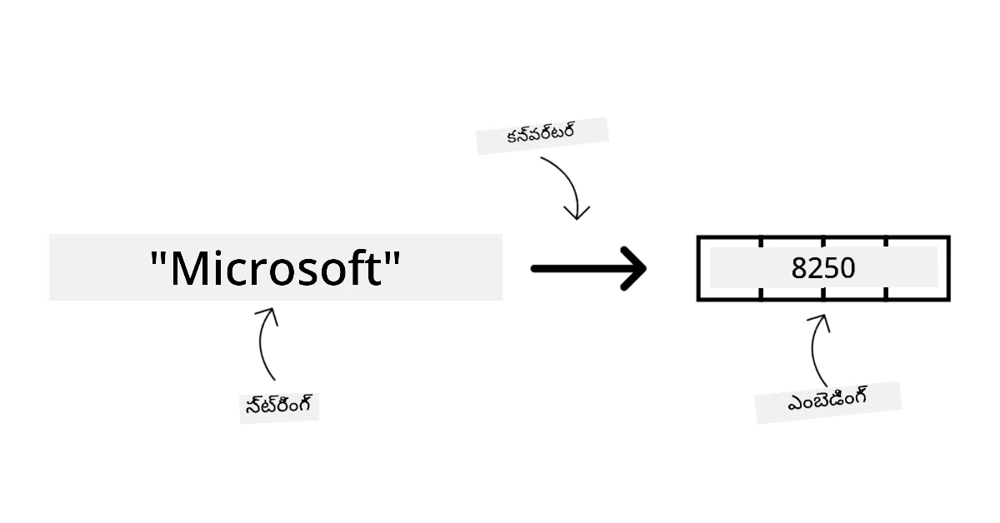

చిత్ర ఉత్పత్తి నమూనాలు చిత్రాలను ఉత్పత్తి చేసే నమూనాలు. ఇవి తరచుగా చిత్రం ఎడిటింగ్, చిత్రం సింథసిస్, మరియు చిత్రం అనువాదం కోసం ఉపయోగిస్తారు. చిత్ర ఉత్పత్తి నమూనాలు పెద్ద చిత్రం డేటాసెట్‌లపై శిక్షణ పొందతాయి, ఉదాహరణకు [LAION-5B](https://laion.ai/blog/laion-5b/?WT.mc_id=academic-105485-koreyst), మరియు కొత్త చిత్రాలను ఉత్పత్తి చేయడానికి లేదా ఇన్‌పెయింటింగ్, సూపర్-రెజల్యూషన్, మరియు కలర్‌యిజేషన్ సాంకేతికతలతో ఉన్న చిత్రాలను సవరించడానికి ఉపయోగించవచ్చు. ఉదాహరణలు: [GPT Image నమూనాలు](https://platform.openai.com/docs/guides/images?WT.mc_id=academic-105485-koreyst), [Stable Diffusion నమూనాలు](https://github.com/Stability-AI/StableDiffusion?WT.mc_id=academic-105485-koreyst), మరియు Imagen నమూనాలు.

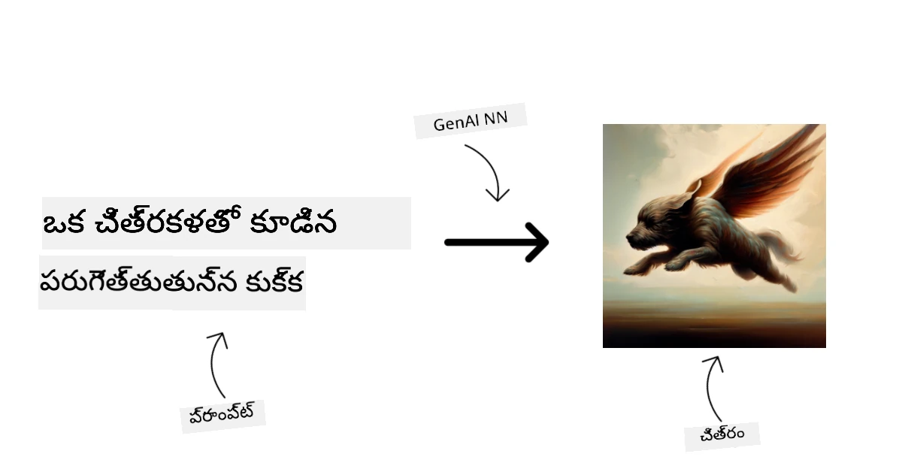

వచన మరియు కోడ్ ఉత్పత్తి నమూనాలు వచన లేదా కోడ్ ఉత్పత్తి చేసే నమూనాలు. ఇవి తరచుగా వచన సారాంశం, అనువాదం, మరియు ప్రశ్నల సమాధానానికి ఉపయోగిస్తారు. వచన నమూనాలు పెద్ద వచన డేటాసెట్‌లపై శిక్షణ పొందతాయి, ఉదాహరణకు [BookCorpus](https://www.cv-foundation.org/openaccess/content_iccv_2015/html/Zhu_Aligning_Books_and_ICCV_2015_paper.html?WT.mc_id=academic-105485-koreyst), మరియు కొత్త వచనం ఉత్పత్తి లేదా ప్రశ్నలకు సమాధానం చెయ్యడానికి ఉపయోగపడ్డవే. కోడ్ ఉత్పత్తి నమూనాలు, ఉదాహరణకు [CodeParrot](https://huggingface.co/codeparrot?WT.mc_id=academic-105485-koreyst), పెద్ద కోడ్ డేటాసెట్‌లపై శిక్షణ పొందుతాయి, ఉదాహరణకు GitHub, మరియు కొత్త కోడ్ ఉత్పత్తి లేదా ఉన్న కోడ్ లో బగ్స్ ని సరిచేసేందుకు ఉపయోగిస్తారు.

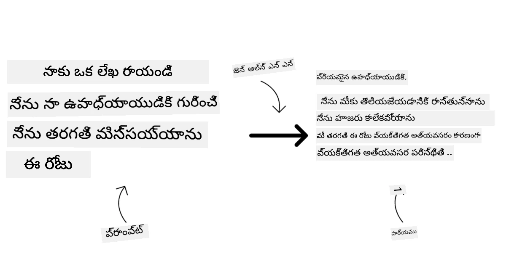

### ఎంకోడర్-డీకోడర్ మరియు డీకోడర్ మాత్రమే

LLMల ప్రత్యేక నిర్మాణ రకాలను చెప్పడానికి, ఒక అనాలజీని ఉపయోగిద్దాం.

మీ మేనేజర్ మీరు విద్యార్థులు కోసం కోశాన్ని రాయమని పని ఇచ్చారని ఊహించండి. మీకు ఇద్దరు సోదరులు ఉన్నారు; ఒకరు కంటెంట్ సృష్టిదారుగా ఉంటారు, మరొకరు సమీక్షకుడుగా ఉంటారు.

కంటెంట్ సృష్టిదారు డీకోడర్ మాత్రమే నమూనా లాంటివారు: వారు అంశాన్ని చూసి, మీరు రాశినదాన్ని గమనించి, ఆ సందర్భంపై ఆధారపడి కంటెంట్ ని రూపొందించగలరు. వీరు ఆసక్తికరమైన మరియు సమాచారమయిన కంటెంట్ రాస్తే చక్కగా పెట్టగలరు, కానీ పని కేవలం వర్గీకరణ, పునరుద్ధరణ లేదా ఇన్కోడింగ్ ఆపు ఉంటే వారు మంచి ఎంపిక కాదా. డీకోడర్ మాత్రమే నమూనా కుటుంబాల్లో GPT మరియు Llama రూపాలు ఉదాహరణలు.

సమీక్షకుడు ఎంకోడర్ మాత్రమే నమూనా లాగే, వారు రాసిన కోర్సును మరియు సమాధానాలను చూస్తూ వాటి మధ్య సంబంధాన్ని గమనించి సందర్భాన్నిఅర్థం చేసుకుంటారు, కానీ కంటెంట్ రూపొందించలేదు. ఎంకోడర్ మాత్రమే నమూనా ఉదాహరణగా BERT ఉంటుంది.

ఊహించండి మనకు ఎవరో ఒకరు ఉంటే, వారు కోశాన్ని సృష్టించి, సమీక్ష కూడా చేయగలరు, ఇది ఎంకోడర్-డీకోడర్ నమూనా. కొన్ని ఉదాహరణలు BART మరియు T5.

### సేవ మరియు నమూనా

ఇప్పుడు, సేవ మరియు నమూనా మధ్య తేడా గురించి మాట్లాడుకుందాం. సేవ అనేది క్లౌడ్ సర్వీస్ ప్రొవైడర్ అందించే ఉత్పత్తి, ఇది తరచుగా నమూనాలు, డేటా మరియు ఇతర భాగాలకు మిశ్రమం. నమూనా ఒక సేవలో మూల భాగం, ఇది తరచుగా ఫౌండేషన్ నమూనా, ఉదాహరణకు LLM.

సేవలు సాధారణంగా ప్రొడక్షన్ ఉపయోగానికి ఆప్టిమైజ్ చేయబడతాయి మరియు సాధారణంగా మోడల్స్ కంటే వినియోగదారులకు సులభంగా ఉండగల్ని గ్రాఫికల్ యూజర్ ఇంటర్‌ఫేస్ ద్వారా. కానీ సేవలు ఎల్లప్పుడూ ఉచితంగా అందుబాటులో ఉండవు, వినియోగానికి సభ్యత్వం లేదా చెల్లింపు అవసరం ఉండవచ్చు, ఎందుకంటే సేవ యజమాని ఉత్పత్తి, వనరులు వాడటం ద్వారా ఖర్చు తగ్గింపును మరియు స్కేలింగ్ సుగమతను అందించే అవకాశం కల్పిస్తాయి. సేవ ఉదాహరణకి [Azure OpenAI Service](https://learn.microsoft.com/azure/ai-services/openai/overview?WT.mc_id=academic-105485-koreyst), ఇది "ఉపయోగించినంత మేరకు చెల్లించు" రేటు ప్రణాళికను కలిగి, అంటే వినియోగదారులు సేవను ఎంత ఉపయోగిస్తారో proportionalగా చెల్లించాలి. Azure OpenAI Service తరఫున మోడళ్ల సామర్థ్యాలపై ఎంటర్ప్రైజ్-స్థాయి భద్రత మరియు బాధ్యతాయుత AI సరళిని కూడా అందిస్తుంది.

మోడళ్లు న్యూరల్ నెట్‌వర్క్ ఆర్టిఫాక్ట్స్: పారామితులు, వెయిట్లు, నిర్మాణం, టోకనైజర్, మరియు మద్దతునిచ్చే కాన్ఫిగరేషన్. స్థానికంగా లేదా ప్రైవేట్ వాతావరణంలో మోడల్ నడపడానికి తగిన హార్డ్‌వేర్, సర్వింగ్ వాతావరణం, పర్యవేక్షణ, మరియు సరిపోయే ఓపెన్-సోర్స్/ఓపెన్-వెయిట్ లైసెన్స్ లేక కమెర్షియల్ లైసెన్స్ అవసరం. ఓపెన్-వెయిట్ నమూనాలు Llama 4 లేదా Mistral వంటి స్వయంగా హోస్ట్ చేయవచ్చు, కానీ కంప్యూటింగ్ శక్తి మరియు ఆపరేషనల్ నైపుణ్యం ఇంకా అవసరం.

## Azureలో వివిధ నమూనాలతో పనితీరు అర్థం చేసుకోవడానికి ఎలా పరీక్షించాలి మరియు పునరావృతం చేయాలి

మన బృందం ప్రస్తుత LLMs పర్యావరణాన్ని అన్వేషించి వారి సందర్భాలకు సరిపోయే కొంత మంచి అభ్యర్ధులను గుర్తించిన తర్వాత, తదుపరి దశ వారి డేటా మరియు వారి లోడ్‌పై పరిక్షించడమే. ఇది ప్రయోగాలు మరియు కొలతల ద్వారా చేయబడే పునరావృత ప్రక్రియ.
మనం గత పేరాలు లో చెప్పిన చాలామంది మోడల్స్ (OpenAI మోడల్స్, Llama 4 మరియు Mistral వంటి ఓపెన్-వెయిట్ మోడల్స్, మరియు Hugging Face మోడల్స్) [Microsoft Foundry Models](https://learn.microsoft.com/azure/foundry/concepts/foundry-models-overview?WT.mc_id=academic-105485-koreyst) లో అందుబాటులో ఉన్నాయి.

[Microsoft Foundry](https://learn.microsoft.com/azure/foundry/what-is-foundry?WT.mc_id=academic-105485-koreyst), పూర్వంలో Azure AI Studio/Azure AI Foundry గా పిలవబడింది, AI అనువర్తనాలు మరియు ఏజెంట్లను నిర్మించడానికి సమగ్ర Azure వేదిక. ఇది అభివృద్ధికర్తలకు ప్రయోగం మరియు మదింపు నుండి పంపిణీ, పర్యవేక్షణ మరియు పాలన వరకు జీవన చక్రాన్ని నిర్వహించడంలో సహాయపడుతుంది. Microsoft Foundryలో మోడల్ క్యాటలాగ్ వినియోగదారునికి ఇనిమితులు అనుమతిస్తుంది:

- క్యాటలాగ్‌లో ఆసక్తికరమైన ఫౌండేషన్ మోడల్‌ను కనుగొనండి, Azure అమ్మే మోడల్స్ మరియు భాగస్వాముల మరియు సంఘం ప్రొవైడర్ల నుంచి మోడల్స్ సహా. వినియోగదారులు టాస్క్, ప్రొవైడర్, లైసెన్స్, పంపిణీ ఎంపిక లేదా పేరుతో ఫిల్టర్ చేయవచ్చు.

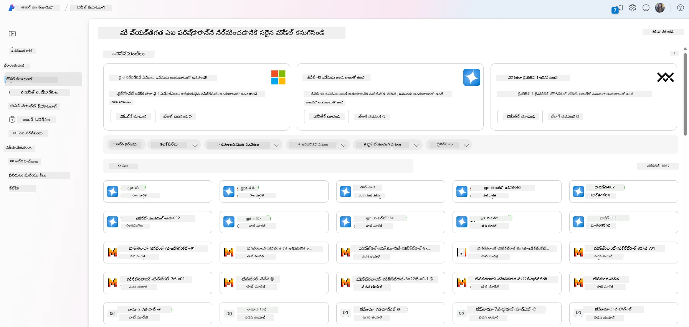

- నిమిషం కార్డ్‌ను సమీక్షించండి, అందులో ఉద్దేశించిన ఉపయోగం మరియు శిక్షణ డేటా వివరణ, కోడ్ నమూనాలు మరియు అంతర్గత మదింపు లైబ్రరీపై మూల్యాంకన ఫలితాలు ఉన్నాయి.

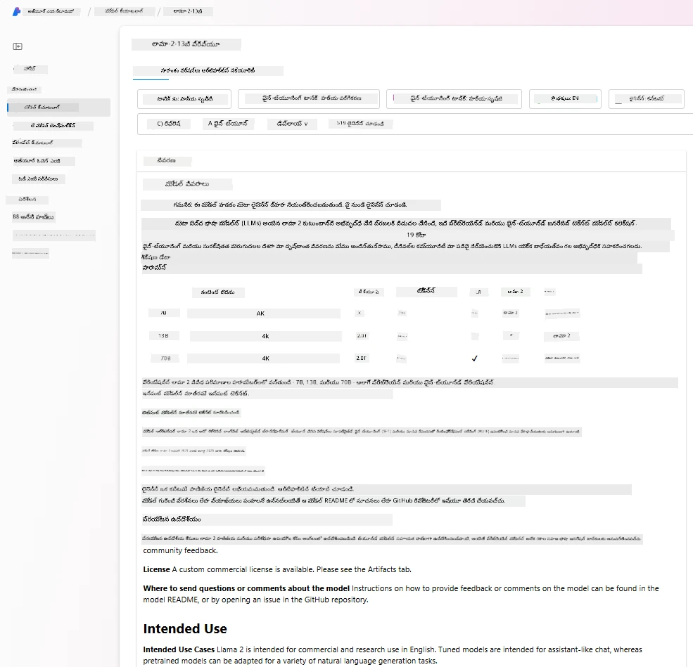

- వ్యాపార సందర్భానికి సరిపోతున్న మోడల్‌ను అంచనా వేసేందుకు పారిశ్రామిక రంగంలో అందుబాటులో ఉన్న మోడల్స్ మరియు డేటాసెట్‌లపై బెంచ్‌మార్కులను [Model Benchmarks](https://learn.microsoft.com/azure/ai-studio/how-to/model-benchmarks?WT.mc_id=academic-105485-koreyst) ప్యానెల్ ద్వారా పోల్చండి.

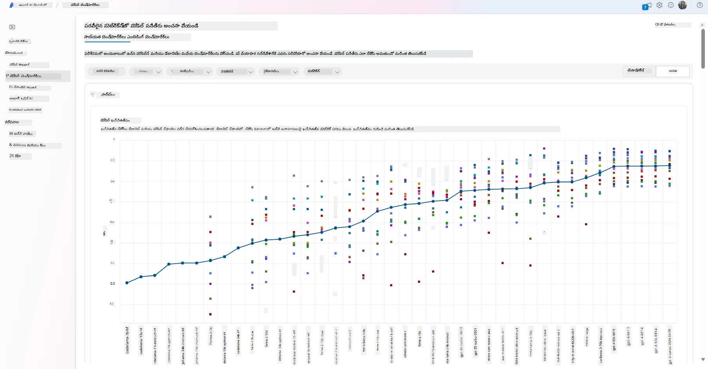

- కસ્ટમర్ శిక్షణ డేటాపై మద్దతు ఉన్న మోడల్స్‌ను ఫైన్-ట్యూన్ చేసి ఒక నిర్దిష్ట పనిలో మోడల్ పనితీరును మెరుగుపరచండి, Microsoft Foundry యొక్క ప్రయోగం మరియు ట్రాకింగ్ సామర్థ్యాలను ఉపయోగించి.

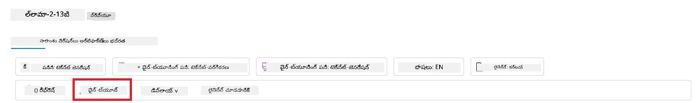

- అసలు ప్రీ-ట్రెయిన్డ్ మోడల్ లేదా ఫైన్-ట్యూన్డ్ వెర్షన్‌ని రిమోట్ రియల్-టైమ్ ఇన్ఫరెన్స్ ఎండ్‌పాయింట్ కు పంపిణీ చేయండి, నిర్వహించబడే కంప్యూట్ లేదా సర్వర్ లేకుండా పంపిణీ ఎంపికలను ఉపయోగించి, అనువర్తనాలు దాన్ని వినియోగించడానికి అనుమతించండి.

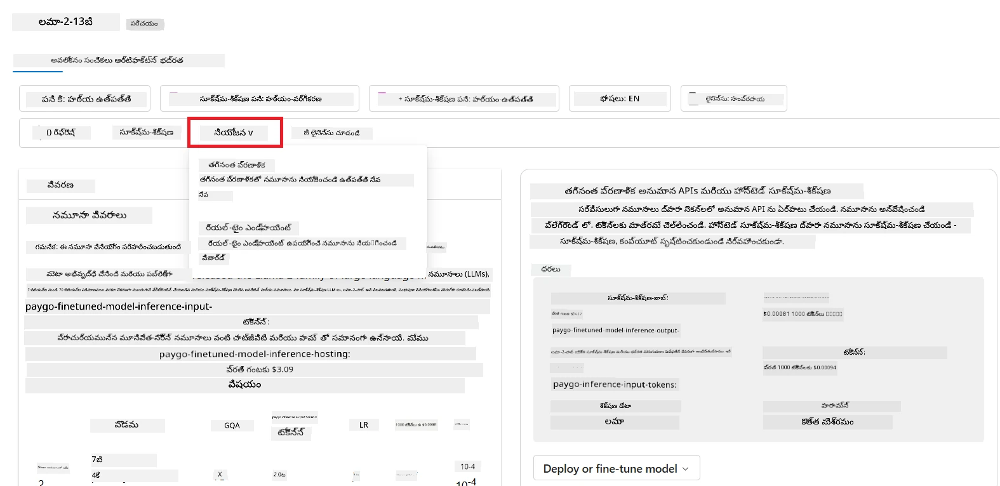

> [!NOTE]
> క్యాటలాగ్‌లోని అన్ని మోడల్స్ ప్రస్తుతానికి ఫైన్-ట్యూనింగ్ మరియు/లేదా పే-యస్-యూ-గో పంపిణీ కోసం అందుబాటులో ఉండవు. మోడల్ సత్తా మరియు పరిమితుల వివరాలకు మోడల్ కార్డ్‌ను తనిఖీ చేయండి.

## LLM ఫలితాలు మెరుగుపర్చడం

మన స్టార్ట్-అప్కు మనం వివిధ రకాల LLMలను మరియు వైవిధ్యమైన మోడల్స్‌ను పోల్చడం, పరీక్ష డేటా పై అంచనా వేయడం, పనితీరును మెరుగుపరచడం మరియు ఇన్ఫరెన్స్ ఎండ్‌పాయింట్లపై పంపిణీ చేయగల మైక్రోసాఫ్ట్ ఫౌండ్రీ క్లౌడ్ వేదికను అన్వేషించాము.

కానీ వారు ప్రీ-ట్రెయిన్డ్ మోడల్ వాడటం కంటే ఎప్పుడు ఫైన్-ట్యూనింగ్ చేయాలని పరిగణించాలి? నిర్దిష్ట లోడ్లపై మోడల్ పనితీరును మెరుగుపరచడంలో ఇతర పద్ధతులున్నాయా?

వ్యాపారం అవసరాలు కోసం LLM నుండి ఫలితాలు పొందటానికి ఉపయోగించే పలు మార్గాలు ఉన్నాయి. మీరు ప్రొడక్షన్‌లో LLM పంపిణీ సమయంలో వివిధ శిక్షణ స్థాయిలతో మరియు భిన్న సూక్ష్మత, ఖర్చు మరియు నాణ్యత లతో వివిధ రకాల మోడల్స్ ఎంపిక చేయవచ్చు. కొన్ని విభిన్న మార్గాలు ఇక్కడ ఉన్నాయి:

- **ప్రాంప్ట్ ఇంజనీరింగ్ కాంటెక్స్ట్‌తో**. మీరు అవసరమైన ప్రతిస్పందనలు పొందడానికి చక్కని సందర్భం అందించడమే ఉద్దేశం.

- **రిట్రీవల్ ఆగ్మెంటెడ్ జనరేషన్, RAG**. మీ డేటా డేటాబేస్ లేదా వెబ్ ఎండ్‌పాయింట్‌లో ఉండవచ్చు, ఆ డేటా లేదా దాని ఉపసమూహం ప్రాంప్టింగ్ సమయంలో చేర్చబడేలా సంబంధిత డేటాను తెచ్చి వినియోగదారు ప్రాంప్ట్‌లో భాగం చేయవచ్చు.

- **ఫైన్-ట్యూన్డ్ మోడల్**. ఇక్కడ మీరు మీ స్వంత డేటాపై మోడల్‌ను మరింత శిక్షణ ఇచ్చారు, ఇది మోడల్ మీ అవసరాలకు మరింత ఖచ్చితంగా మరియు స్పందనాత్మకంగా మార్చింది, కానీ ఇది ఖర్చుతో కూడుకున్నది.

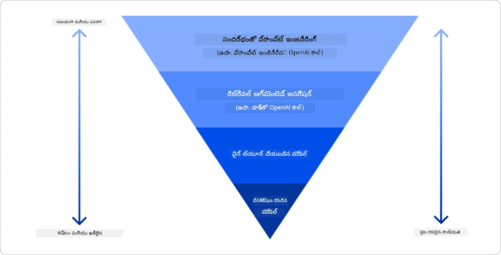

చిత్రం మూలం: [Four Ways that Enterprises Deploy LLMs | Fiddler AI Blog](https://www.fiddler.ai/blog/four-ways-that-enterprises-deploy-llms?WT.mc_id=academic-105485-koreyst)

### కాంటెక్స్ట్‌తో ప్రాంప్ట్ ఇంజనీరింగ్

ప్రీ-ట్రెయిన్డ్ LLMs సాధారణ తాత్త్విక సహజ భాష పనులపై చాలా బాగా పనిచేస్తాయి, చిన్న ప్రాంప్ట్ ద్వారా కూడా, పూర్తి చేయాల్సిన వాక్యమో ప్రశ్నతోనే కాల్ చేయబడితే — దీన్ని "జీరో-షాట్" లెర్నింగ్ అంటారు.

అయితే, వినియోగదారు తమ ప్రశ్నను సవివరమైన అభ్యర్థన మరియు ఉదాహరణలతో - కాంటెక్స్ట్‌తో ఎక్కువగా ఫ్రేమ్ చేస్తే, సమాధానం మరింత సరికొత్తగా మరియు వినియోగదారు ఆశలకు సమీపంగా ఉంటుంది. ఇలాంటి సందర్భంలో, ప్రాంప్ట్ ఒకే ఒక ఉదాహరణ కలిగిఉంటే “వన్-షాట్” లెర్నింగ్ అంటారు, మరియు అనేక ఉదాహరణలు ఉంటే “ఫ్యూల్ షాట్ లెర్నింగ్” అంటారు.
కాంటెక్స్ట్‌తో ప్రాంప్ట్ ఇంజనీరింగ్ ప్రారంభించడానికి అత్యంత ఖర్చు-చేయదగిన పద్ధతి.

### రిట్రీవల్ ఆగ్మెంటెడ్ జనరేషన్ (RAG)

LLMs శిక్షణ సమయంలో ఉపయోగించిన డేటానే వికసించి సమాధానం ఇవ్వగలుగుతాయి. అంటే శిక్షణ అనంతరం జరిగిన సంఘటనలు గురించి అవగాహన లేకపోవచ్చు, మరియు ప్రైవేట్ సమాచారం (కంపెనీ డేటా వంటివి) అందుబాటులో ఉండదు.
ఈ పరిమితిని అధిగమించడానికి RAG ఉపయోగపడుతుంది, ఇది ప్రాంప్టింగ్ సమయంలో డాక్యుమెంట్ల భాగాల రూపంలో బాహ్య డేటాను చేర్చడం, ప్రాంప్ట్ పొడవు పరిమితులను పరిగణలోకి తీసుకుంటుంది. ఇది Vector డేటాబేస్ టూల్స్ (ఉదా: [Azure Vector Search](https://learn.microsoft.com/azure/search/vector-search-overview?WT.mc_id=academic-105485-koreyst)) మద్దతు ఇస్తాయి, ఇవి ఉపయోగకరమైన డేటా భాగాలను వివిధ నిర్వచిత డేటా మూలాల నుండి తిరిగి తెచ్చి ప్రాంప్ట్ కాంటెక్స్ట్‌లో చేర్చతాయి.

ఈ పద్ధతి వ్యాపారానికి సరిపడినంత డేటా, సమయం లేదా వనరులు లేకపోయినా, నిర్దిష్ట లోడ్ పై పనితీరును మెరుగుపరచడానికి మరియు ఊహాజనిత, పాతది లేదా మద్దతు లేని సమాధానాల రిస్కును తగ్గించడానికి ఉపయోగపడుతుంది.

### ఫైన్-ట్యూన్డ్ మోడల్

ఫైన్-ట్యూనింగ్ అనేది బదిలీ-అభ్యాసాన్ని ఉపయోగించి మోడల్‌ని క్రిందనున్న పనికి లేదా నిర్దిష్ట సమస్యను పరిష్కరించేందుకు ‘అనుకూలం’ చేసే ప్రక్రియ. few-shot లెర్నింగ్ మరియు RAG యొక్క భిన్నంగా, ఇది ఒక కొత్త మోడల్‌ను సృష్టిస్తుంది, అప్డేట చేయబడిన వెయిట్లు మరియు బైయాసులతో. ఇది ఒక ప్రాంప్ట్ (ఇన్‌పుట్) మరియు దానికి సంబంధించిన అవుట్‌పుట్ (పూర్తి చేయడం) కలిగిన శిక్షణ ఉదాహరణల సెట్టుతో అవసరం.
ఈ పద్ధతిని క్రింది సందర్భాల్లో ఇష్టపడవచ్చు:

- **చిన్న, పని-నిర్దిష్ట మోడల్స్ ఉపయోగించడం**. ఒక వ్యాపారం పెద్ద ఫ్రంట్‌మోడల్ మళ్లీ మళ్లీ ప్రాంప్ట్ చేయడానికి తక్కువగా, మరింత ఖర్చు-సహజమైన, వేగవంతమైన పరిష్కారంగా, ఒక చిన్న మోడల్‌ను నిర్దిష్ట పని కోసం ఫైన్-ట్యూన్ చేయడం ఇష్టపడవచ్చు.

- **లాటెన్సీ పరిగణలోకి తీసుకోవడం**. నిర్దిష్ట ఉపయోగానికి లాటెన్సీ ముఖ్యం అయితే, చాలా పొడవైన ప్రాంప్ట్‌లు ఉపయోగించడం సాధ్యంకాకపోవచ్చు, లేదా ప్రాంప్ట్ పొడవు పరిమితిని సరిపోల్చుకొనలేని సంక్లిష్టత ఉన్న ఉదాహరణలు ఉండవచ్చు.

- **ధృడమైన ప్రవర్తనను అనుకూలీకరించడం**. ఒక వ్యాపారానికి అధిక క్వాలిటీ ఉదాహరణలు అధిక సంఖ్యలో ఉంటే, మోడల్ ఒక పని నమూనా, అవుట్‌పుట్ ఫార్మాట్, టోన్ లేదా డొమైన్-నిర్దిష్ట శైలి నిరంతరం అనుసరించాలి. తాజా సమాచారాలు లేదా తరచూ మారే ప్రైవేట్ సమాచారం ప్రధాన సమస్య అయితే, ఫైన్-ట్యూనింగ్ మీద మాత్రమే ఆధారపడకుండా RAG వాడండి.

### శిక్షణ పొందిన మోడల్

ఎల్ఎల్ఎం‌ను ప్రారంభం నుండి శిక్షణ ఇవ్వడం అనేది అనుమానాస్పదంగా అత్యంత కష్టం, సంక్లిష్టమైన మార్గం, ఇది భారీ డేటా, నైపుణ్యం గల వనరులు, సరైన గణనాత్మక శక్తిని కోరుతుంది. దీన్ని ఒక వ్యాపారం డొమైన్-నిర్దిష్ట ఉపయోగ కేస్ మరియు పెద్ద పరిమాణం డొమైన్-కేంద్రిత డేటా ఉన్నప్పుడే పరిగణించాలి.

## జ్ఞాన పరీక్ష

LLM పూర్తిచేసే ఫలితాలను మెరుగుపరచటానికి బాగుంటరు మార్గం ఏమిటి?

1. కాంటెక్స్ట్‌తో ప్రాంప్ట్ ఇంజనీరింగ్
1. RAG
1. ఫైన్-ట్యూన్డ్ మోడల్

సమాధానం: మూడు కూడా సహాయపడతాయి. వేగంగా మెరుగుదల కోసం కాంటెక్స్ట్‌తో ప్రాంప్ట్ ఇంజనీరింగ్‌తో ప్రారంభించండి, మోడల్‌కు తాజా వాస్తవాలు లేదా ప్రైవేట్ వ్యాపార డేటా అవసరం అయితే RAG వాడండి. మీకు చాల అధిక-నాణ్యత ఉదాహరణలు ఉంటే, మరియు మోడల్ ఒక పని, ఫార్మాట్, టోన్ లేదా డొమైన్ నమూనాను క్రమంగా అనుసరించాలి అంటే ఫైన్-ట్యూనింగ్ ఎంచుకోండి.

## 🚀 ఛాలెంజ్

మీ వ్యాపారానికి మీరు ఎలా [RAG ఉపయోగించవచ్చో](https://learn.microsoft.com/azure/search/retrieval-augmented-generation-overview?WT.mc_id=academic-105485-koreyst) మరింత చదవండి.

## గొప్ప పని, మీ అభ్యాసాన్ని కొనసాగించండి

ఈ పాఠాన్ని పూర్తిచేసిన తర్వాత, మన [Generative AI Learning collection](https://aka.ms/genai-collection?WT.mc_id=academic-105485-koreyst) ను చూచి మీ Generative AI జ్ఞానాన్ని మెరుగుపర్చుకోండి!

తదుపరి పాఠం 3 వద్ద మనం [సున్నితంగా Generative AIతో ఎలా నిర్మించాలో](../03-using-generative-ai-responsibly/README.md?WT.mc_id=academic-105485-koreyst) చూడబోతున్నాము!

---

<!-- CO-OP TRANSLATOR DISCLAIMER START -->
**అస్వీకరణ**:
ఈ పత్రం AI అనువాద సేవ [Co-op Translator](https://github.com/Azure/co-op-translator) ఉపయోగించి అనువదించబడింది. మేము ఖచ్చితత్వానికి ప్రయత్నిస్తున్నప్పటికీ, ఆటోమేటెడ్ అనువాదాలు తప్పులు లేదా అసమగ్రతలను కలిగి ఉండవచ్చు. దాని స్వదేశ భాషలో ఉన్న అసలు పత్రాన్ని అధికారం కలిగిన మూలంగా పరిగణించాలి. కీలకమైన సమాచారం కోసం, ప్రొఫెషనల్ మానవ అనువాదాన్ని సిఫారసు చేస్తాము. ఈ అనువాదం ఉపయోగం వల్ల కలిగే ఏవైనా అపార్థాలు లేదా తప్పుదారులు కోసం మేము బాధ్యత వహించము.
<!-- CO-OP TRANSLATOR DISCLAIMER END -->