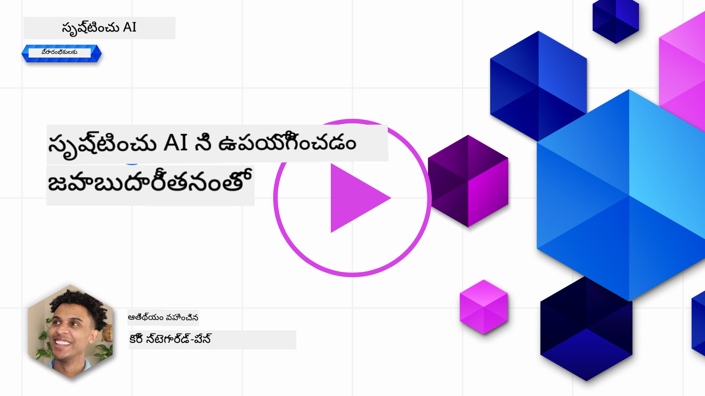
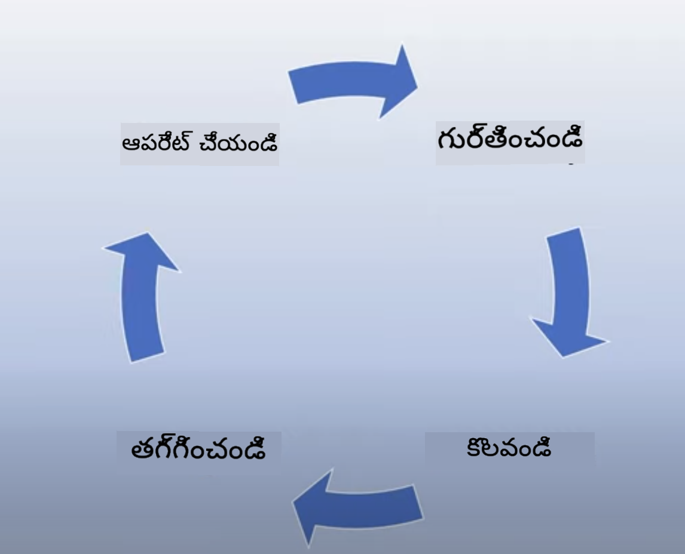
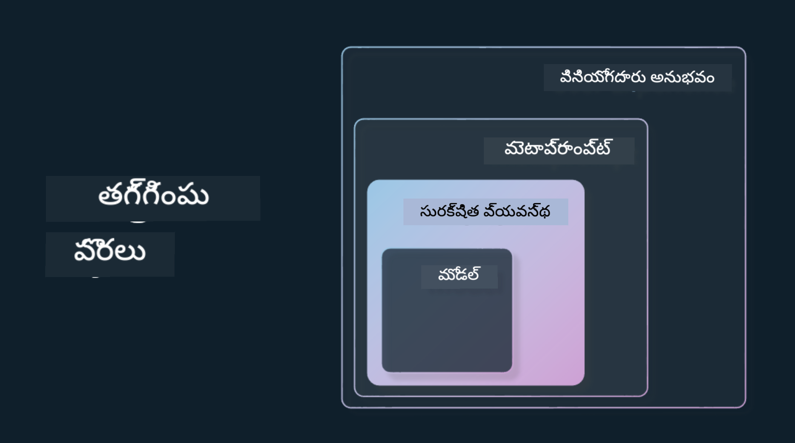

<!--
CO_OP_TRANSLATOR_METADATA:
{
  "original_hash": "4d57fad773cbeb69c5dd62e65c34200d",
  "translation_date": "2025-12-19T19:30:57+00:00",
  "source_file": "03-using-generative-ai-responsibly/README.md",
  "language_code": "te"
}
-->
# జెనరేటివ్ AI ను బాధ్యతగా ఉపయోగించడం

> _ఈ పాఠం వీడియోను చూడడానికి పై చిత్రాన్ని క్లిక్ చేయండి_

AI మరియు ప్రత్యేకంగా జెనరేటివ్ AI తో మంత్రముగ్ధులవడం సులభం, కానీ మీరు దాన్ని బాధ్యతగా ఎలా ఉపయోగించాలో పరిగణించాలి. అవుట్‌పుట్ న్యాయసమ్మతమైనదిగా, హానికరమయినది కాకుండా ఉండేలా ఎలా నిర్ధారించాలో వంటి విషయాలను పరిగణించాలి. ఈ అధ్యాయం మీకు పేర్కొన్న సందర్భం, పరిగణించవలసిన విషయాలు, మరియు మీ AI వినియోగాన్ని మెరుగుపరచడానికి సక్రియ చర్యలు తీసుకోవడం ఎలా అనే విషయాలను అందించడానికి లక్ష్యంగా ఉంది.

## పరిచయం

ఈ పాఠం కవర్ చేస్తుంది:

- జెనరేటివ్ AI అప్లికేషన్లు నిర్మించేటప్పుడు బాధ్యతాయుత AI ను ప్రాధాన్యం ఇవ్వాల్సిన కారణం.
- బాధ్యతాయుత AI యొక్క ప్రాథమిక సూత్రాలు మరియు అవి జెనరేటివ్ AI తో ఎలా సంబంధం కలిగి ఉంటాయో.
- ఈ బాధ్యతాయుత AI సూత్రాలను వ్యూహం మరియు టూలింగ్ ద్వారా ఎలా అమలు చేయాలో.

## నేర్చుకునే లక్ష్యాలు

ఈ పాఠం పూర్తి చేసిన తర్వాత మీరు తెలుసుకుంటారు:

- జెనరేటివ్ AI అప్లికేషన్లు నిర్మించేటప్పుడు బాధ్యతాయుత AI యొక్క ప్రాముఖ్యత.
- జెనరేటివ్ AI అప్లికేషన్లు నిర్మించేటప్పుడు బాధ్యతాయుత AI యొక్క ప్రాథమిక సూత్రాలను ఎప్పుడు ఆలోచించి వర్తింపజేయాలో.
- బాధ్యతాయుత AI భావనను అమలు చేయడానికి మీకు అందుబాటులో ఉన్న టూల్స్ మరియు వ్యూహాలు.

## బాధ్యతాయుత AI సూత్రాలు

జెనరేటివ్ AI ఉత్సాహం ఎప్పుడూ ఇంత ఎక్కువగా ఉండలేదు. ఈ ఉత్సాహం కొత్త డెవలపర్లు, దృష్టి, మరియు నిధులను ఈ రంగానికి తీసుకువచ్చింది. ఇది జెనరేటివ్ AI ఉపయోగించి ఉత్పత్తులు మరియు కంపెనీలు నిర్మించాలనుకునే వారికీ చాలా సానుకూలం, కానీ బాధ్యతగా ముందుకు సాగడం కూడా ముఖ్యమే.

ఈ కోర్సులో, మనం మన స్టార్టప్ మరియు మన AI విద్య ఉత్పత్తిని నిర్మించడంపై దృష్టి పెట్టుతున్నాము. మనం బాధ్యతాయుత AI సూత్రాలు: న్యాయం, సమగ్రత, నమ్మకదారితనం/భద్రత, భద్రత & గోప్యత, పారదర్శకత మరియు బాధ్యతాయుతతను ఉపయోగిస్తాము. ఈ సూత్రాలతో, మన ఉత్పత్తుల్లో జెనరేటివ్ AI వినియోగంతో అవి ఎలా సంబంధం కలిగి ఉంటాయో పరిశీలిస్తాము.

## మీరు బాధ్యతాయుత AI ను ప్రాధాన్యం ఇవ్వాల్సిన కారణం

ఉత్పత్తిని నిర్మించేటప్పుడు, మీ వినియోగదారుల ఉత్తమ ప్రయోజనాన్ని దృష్టిలో ఉంచుకుని మానవ కేంద్రిత దృష్టికోణాన్ని తీసుకోవడం ఉత్తమ ఫలితాలకు దారితీస్తుంది.

జెనరేటివ్ AI యొక్క ప్రత్యేకత అది వినియోగదారులకు సహాయకమైన సమాధానాలు, సమాచారం, మార్గదర్శకత్వం మరియు కంటెంట్ సృష్టించే శక్తి. ఇది అనేక మాన్యువల్ దశలను లేకుండా చేయవచ్చు, ఇది చాలా ప్రభావవంతమైన ఫలితాలకు దారితీస్తుంది. సరైన ప్రణాళికలు మరియు వ్యూహాలు లేకపోతే, ఇది దురదృష్టవశాత్తూ మీ వినియోగదారులకు, మీ ఉత్పత్తికి మరియు సమాజానికి హానికరమైన ఫలితాలు కూడా కలిగించవచ్చు.

కొన్ని (కానీ అన్ని కాదు) ఈ హానికరమైన ఫలితాలను చూద్దాం:

### హల్యూసినేషన్లు

హల్యూసినేషన్లు అనేది ఒక LLM పూర్తిగా అర్థం కాని లేదా ఇతర సమాచారం ఆధారంగా వాస్తవానికి విరుద్ధమైన కంటెంట్ ఉత్పత్తి చేసినప్పుడు ఉపయోగించే పదం.

ఉదాహరణకు మన స్టార్టప్ కోసం ఒక ఫీచర్ నిర్మిద్దాం, ఇది విద్యార్థులు చారిత్రక ప్రశ్నలు అడగడానికి మోడల్‌ను అనుమతిస్తుంది. ఒక విద్యార్థి అడుగుతాడు `టైటానిక్ యొక్క ఏకైక జీవించేవారు ఎవరు?`

మోడల్ క్రింది విధంగా సమాధానం ఇస్తుంది:

> _(మూలం: [Flying bisons](https://flyingbisons.com?WT.mc_id=academic-105485-koreyst))_

ఇది చాలా ఆత్మవిశ్వాసంతో కూడిన మరియు సమగ్ర సమాధానం. దురదృష్టవశాత్తూ, ఇది తప్పు. కొద్దిగా పరిశోధన చేసినా, టైటానిక్ విపత్తులో ఒక కంటే ఎక్కువ మంది జీవించారని తెలుసుకోవచ్చు. ఈ విషయం గురించి మొదటిసారిగా పరిశోధన చేస్తున్న విద్యార్థికి, ఈ సమాధానం ప్రశ్నించకుండా వాస్తవంగా భావించబడే అవకాశం ఉంది. దీని ఫలితంగా AI వ్యవస్థ నమ్మకహీనంగా మారి మన స్టార్టప్ ఖ్యాతికి ప్రతికూల ప్రభావం కలిగించవచ్చు.

ఏదైనా LLM యొక్క ప్రతి సంస్కరణతో, హల్యూసినేషన్లను తగ్గించడంలో పనితీరు మెరుగుదలలు చూశాము. ఈ మెరుగుదలతో కూడా, మనం అప్లికేషన్ నిర్మాణకర్తలు మరియు వినియోగదారులుగా ఈ పరిమితులను గుర్తుంచుకోవాలి.

### హానికరమైన కంటెంట్

ముందటి విభాగంలో LLM తప్పు లేదా అర్థం కాని సమాధానాలు ఇచ్చినప్పుడు చూశాము. మరో ప్రమాదం మోడల్ హానికరమైన కంటెంట్ తో స్పందించినప్పుడు ఉంటుంది.

హానికరమైన కంటెంట్ అంటే:

- స్వీయ హాని లేదా కొన్ని సమూహాలకు హాని చేయడానికి సూచనలు ఇవ్వడం లేదా ప్రోత్సహించడం.
- ద్వేషపూరిత లేదా అవమానకరమైన కంటెంట్.
- ఏదైనా రకమైన దాడి లేదా హింసాత్మక చర్యల ప్రణాళికను మార్గనిర్దేశం చేయడం.
- చట్టవిరుద్ధ కంటెంట్ కనుగొనడం లేదా చట్టవిరుద్ధ చర్యలు చేయడం ఎలా అనే సూచనలు ఇవ్వడం.
- లైంగికంగా స్పష్టమైన కంటెంట్ ప్రదర్శించడం.

మన స్టార్టప్ కోసం, విద్యార్థులు ఈ రకమైన కంటెంట్ చూడకుండా నిరోధించడానికి సరైన టూల్స్ మరియు వ్యూహాలు ఉండాలని మనం కోరుకుంటున్నాము.

### న్యాయసమ్మతత లోపం

న్యాయసమ్మతత అంటే “AI వ్యవస్థ పక్షపాతం మరియు వివక్ష నుండి విముక్తంగా ఉండటం మరియు అందరితో సమానంగా, న్యాయంగా వ్యవహరించడం” అని నిర్వచించబడింది. జెనరేటివ్ AI ప్రపంచంలో, మోడల్ అవుట్‌పుట్ ద్వారా పక్కనపెట్టబడిన సమూహాల విభజనాత్మక ప్రపంచ దృష్టికోణాలు మరింత బలపరచబడకుండా నిర్ధారించాలి.

ఈ రకమైన అవుట్‌పుట్లు మన వినియోగదారులకు సానుకూల ఉత్పత్తి అనుభవాలు నిర్మించడంలో మాత్రమే కాదు, సమాజానికి కూడా మరింత హాని కలిగిస్తాయి. అప్లికేషన్ నిర్మాణకర్తలుగా, జెనరేటివ్ AI తో పరిష్కారాలు నిర్మించేటప్పుడు విస్తృత మరియు వైవిధ్యమైన వినియోగదారుల బేస్‌ను ఎప్పుడూ దృష్టిలో ఉంచాలి.

## జెనరేటివ్ AI ను బాధ్యతగా ఎలా ఉపయోగించాలి

ఇప్పుడు మనం బాధ్యతాయుత జెనరేటివ్ AI ప్రాముఖ్యతను గుర్తించినందున, మన AI పరిష్కారాలను బాధ్యతగా నిర్మించడానికి తీసుకోవచ్చిన 4 దశలను చూద్దాం:

### హానికరమైన అవకాశాలను కొలవండి

సాఫ్ట్‌వేర్ పరీక్షలో, మనం అప్లికేషన్ పై వినియోగదారుల ఆశించిన చర్యలను పరీక్షిస్తాము. అదే విధంగా, వినియోగదారులు ఎక్కువగా ఉపయోగించే వివిధ రకాల ప్రాంప్ట్‌లను పరీక్షించడం హానికరమైన అవకాశాలను కొలవడానికి మంచి మార్గం.

మన స్టార్టప్ విద్య ఉత్పత్తిని నిర్మిస్తున్నందున, విద్య సంబంధిత ప్రాంప్ట్‌ల జాబితాను సిద్ధం చేయడం మంచిది. ఇది ఒక నిర్దిష్ట విషయం, చారిత్రక వాస్తవాలు, మరియు విద్యార్థి జీవితం గురించి ప్రాంప్ట్‌లను కవర్ చేయవచ్చు.

### హానికరమైన అవకాశాలను తగ్గించండి

ఇప్పుడు మోడల్ మరియు దాని ప్రతిస్పందనల వల్ల కలిగే హానిని నివారించడానికి లేదా పరిమితం చేయడానికి మార్గాలను కనుగొనాల్సిన సమయం వచ్చింది. దీన్ని 4 వేర్వేరు పొరలలో చూడవచ్చు:

- **మోడల్**. సరైన ఉపయోగానికి సరైన మోడల్‌ను ఎంచుకోవడం. GPT-4 వంటి పెద్ద మరియు క్లిష్టమైన మోడల్స్ చిన్న మరియు నిర్దిష్ట ఉపయోగాలపై హానికరమైన కంటెంట్ ప్రమాదాన్ని పెంచవచ్చు. మీ శిక్షణ డేటాను ఉపయోగించి ఫైన్-ట్యూన్ చేయడం కూడా హానికరమైన కంటెంట్ ప్రమాదాన్ని తగ్గిస్తుంది.

- **భద్రతా వ్యవస్థ**. భద్రతా వ్యవస్థ అనేది మోడల్‌ను సేవ్ చేసే ప్లాట్‌ఫారమ్‌పై హాని తగ్గించడానికి సహాయపడే టూల్స్ మరియు కాన్ఫిగరేషన్ల సమాహారం. ఉదాహరణకు Azure OpenAI సర్వీస్‌లో కంటెంట్ ఫిల్టరింగ్ వ్యవస్థ. వ్యవస్థలు జైల్బ్రేక్ దాడులు మరియు బాట్ల నుండి వచ్చిన అభ్యర్థనలు వంటి అనవసర కార్యకలాపాలను కూడా గుర్తించాలి.

- **మెటాప్రాంప్ట్**. మెటాప్రాంప్ట్‌లు మరియు గ్రౌండింగ్ అనేవి మోడల్‌ను నిర్దిష్ట ప్రవర్తనలు మరియు సమాచారంపై ఆధారపడి దిశానిర్దేశం చేయడానికి లేదా పరిమితం చేయడానికి మార్గాలు. ఇది సిస్టమ్ ఇన్‌పుట్‌లను ఉపయోగించి మోడల్ యొక్క నిర్దిష్ట పరిమితులను నిర్వచించడం కావచ్చు. అదనంగా, సిస్టమ్ యొక్క పరిధి లేదా డొమైన్‌కు మరింత సంబంధిత అవుట్‌పుట్‌లను అందించడం.

ఇది రిట్రీవల్ ఆగ్మెంటెడ్ జనరేషన్ (RAG) వంటి సాంకేతికతలను ఉపయోగించడం కూడా కావచ్చు, దీని ద్వారా మోడల్ విశ్వసనీయ మూలాల ఎంపిక నుండి మాత్రమే సమాచారం తీసుకుంటుంది. ఈ కోర్సులో [సెర్చ్ అప్లికేషన్లు నిర్మించడం](../08-building-search-applications/README.md?WT.mc_id=academic-105485-koreyst) గురించి పాఠం ఉంది.

- **వినియోగదారుల అనుభవం**. చివరి పొర అనేది వినియోగదారు మన అప్లికేషన్ ఇంటర్‌ఫేస్ ద్వారా మోడల్‌తో ప్రత్యక్షంగా ఎలా పరస్పర చర్య చేస్తాడో. ఈ విధంగా, మేము UI/UX ను డిజైన్ చేసి వినియోగదారులు మోడల్‌కు పంపగల ఇన్‌పుట్‌ల రకాలను మరియు వినియోగదారులకు ప్రదర్శించబడే టెక్స్ట్ లేదా చిత్రాలను పరిమితం చేయవచ్చు. AI అప్లికేషన్‌ను డిప్లాయ్ చేసినప్పుడు, మన జెనరేటివ్ AI అప్లికేషన్ ఏమి చేయగలదో మరియు ఏమి చేయలేనిదో గురించి పారదర్శకంగా ఉండాలి.

మనం [AI అప్లికేషన్ల కోసం UX డిజైనింగ్](../12-designing-ux-for-ai-applications/README.md?WT.mc_id=academic-105485-koreyst) అనే పూర్తి పాఠం కలిగి ఉన్నాము.

- **మోడల్‌ను మూల్యాంకనం చేయండి**. LLMs తో పని చేయడం సవాలు, ఎందుకంటే మోడల్ శిక్షణ పొందిన డేటా పై మనకు ఎప్పుడూ నియంత్రణ ఉండదు. అయినప్పటికీ, మేము ఎప్పుడూ మోడల్ పనితీరు మరియు అవుట్‌పుట్‌లను మూల్యాంకనం చేయాలి. మోడల్ ఖచ్చితత్వం, సారూప్యత, గ్రౌండెడ్‌నెస్, మరియు అవుట్‌పుట్ సంబంధితతను కొలవడం ఇంకా ముఖ్యమే. ఇది వాటాదారులు మరియు వినియోగదారులకు పారదర్శకత మరియు నమ్మకాన్ని అందిస్తుంది.

### బాధ్యతాయుత జెనరేటివ్ AI పరిష్కారాన్ని నిర్వహించండి

మీ AI అప్లికేషన్ల చుట్టూ ఒక ఆపరేషనల్ ప్రాక్టీస్ నిర్మించడం చివరి దశ. ఇందులో మన స్టార్టప్ లోని ఇతర భాగాలతో, ఉదాహరణకు లీగల్ మరియు భద్రతా విభాగాలతో భాగస్వామ్యం చేయడం, అన్ని నియంత్రణ విధానాలకు అనుగుణంగా ఉండటం ఉంటుంది. ప్రారంభించే ముందు, డెలివరీ, సంఘటనల నిర్వహణ, మరియు రోల్బ్యాక్ గురించి ప్రణాళికలు రూపొందించి వినియోగదారులకు హాని పెరగకుండా నిరోధించాలి.

## టూల్స్

బాధ్యతాయుత AI పరిష్కారాలను అభివృద్ధి చేయడం చాలా పని అనిపించవచ్చు, కానీ ఇది చాలా విలువైన పని. జెనరేటివ్ AI విస్తరిస్తున్నందున, డెవలపర్లకు బాధ్యతను వారి వర్క్‌ఫ్లోలో సమర్థవంతంగా చేర్చడానికి మరిన్ని టూల్స్ అభివృద్ధి అవుతాయి. ఉదాహరణకు, [Azure AI Content Safety](https://learn.microsoft.com/azure/ai-services/content-safety/overview?WT.mc_id=academic-105485-koreyst) API అభ్యర్థన ద్వారా హానికరమైన కంటెంట్ మరియు చిత్రాలను గుర్తించడంలో సహాయపడుతుంది.

## జ్ఞాన పరీక్ష

బాధ్యతాయుత AI వినియోగాన్ని నిర్ధారించడానికి మీరు ఏ విషయాలను జాగ్రత్తగా చూసుకోవాలి?

1. సమాధానం సరైనదిగా ఉండాలి.
1. హానికరమైన వినియోగం, AI నేరకార్యాలకు ఉపయోగించబడకూడదు.
1. AI పక్షపాతం మరియు వివక్ష నుండి విముక్తంగా ఉండాలి.

సమాధానం: 2 మరియు 3 సరైనవి. బాధ్యతాయుత AI హానికరమైన ప్రభావాలు మరియు పక్షపాతాలను ఎలా తగ్గించాలో పరిగణించడంలో సహాయపడుతుంది.

## 🚀 సవాలు

[Azure AI Content Safety](https://learn.microsoft.com/azure/ai-services/content-safety/overview?WT.mc_id=academic-105485-koreyst) గురించి చదవండి మరియు మీ వినియోగానికి ఏది అనుకూలమో చూడండి.

## అద్భుతమైన పని, మీ అభ్యాసాన్ని కొనసాగించండి

ఈ పాఠం పూర్తి చేసిన తర్వాత, మన [జెనరేటివ్ AI అభ్యాస సేకరణ](https://aka.ms/genai-collection?WT.mc_id=academic-105485-koreyst) ను చూడండి మరియు మీ జెనరేటివ్ AI జ్ఞానాన్ని మరింత పెంచుకోండి!

పాఠం 4 కి వెళ్లండి, అక్కడ మనం [ప్రాంప్ట్ ఇంజనీరింగ్ ప్రాథమికాలు](../04-prompt-engineering-fundamentals/README.md?WT.mc_id=academic-105485-koreyst) గురించి తెలుసుకుంటాము!

---

<!-- CO-OP TRANSLATOR DISCLAIMER START -->
**అస్పష్టత**:  
ఈ పత్రాన్ని AI అనువాద సేవ [Co-op Translator](https://github.com/Azure/co-op-translator) ఉపయోగించి అనువదించబడింది. మేము ఖచ్చితత్వానికి ప్రయత్నించినప్పటికీ, ఆటోమేటెడ్ అనువాదాల్లో పొరపాట్లు లేదా తప్పిదాలు ఉండవచ్చు. మూల పత్రం దాని స్వదేశీ భాషలో అధికారిక మూలంగా పరిగణించాలి. ముఖ్యమైన సమాచారానికి, ప్రొఫెషనల్ మానవ అనువాదం సిఫార్సు చేయబడుతుంది. ఈ అనువాదం వాడకంలో ఏర్పడిన ఏవైనా అపార్థాలు లేదా తప్పుదారితీసే అర్థాలు కోసం మేము బాధ్యత వహించము.
<!-- CO-OP TRANSLATOR DISCLAIMER END -->