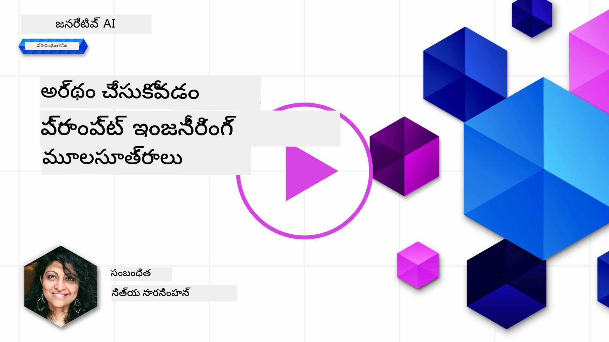
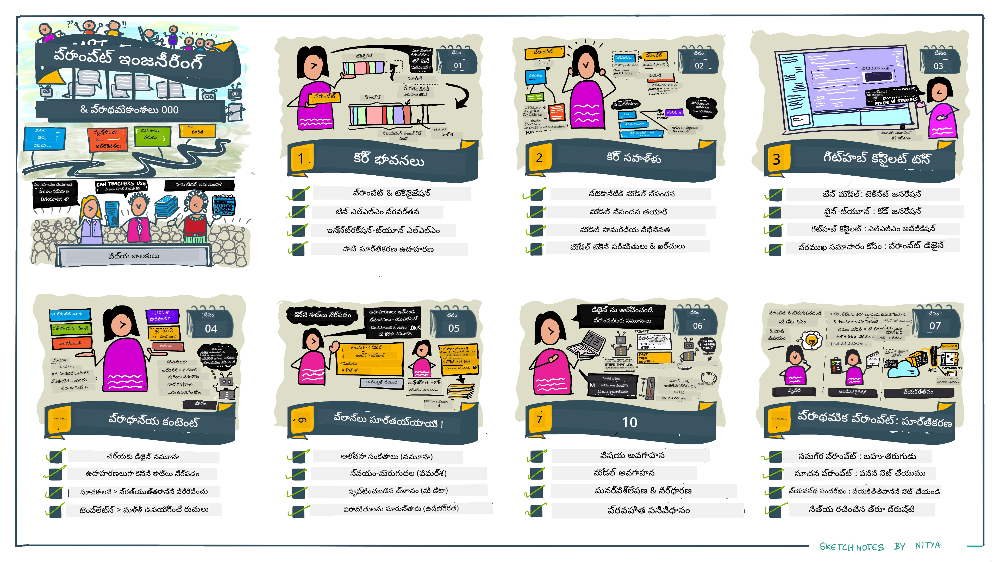
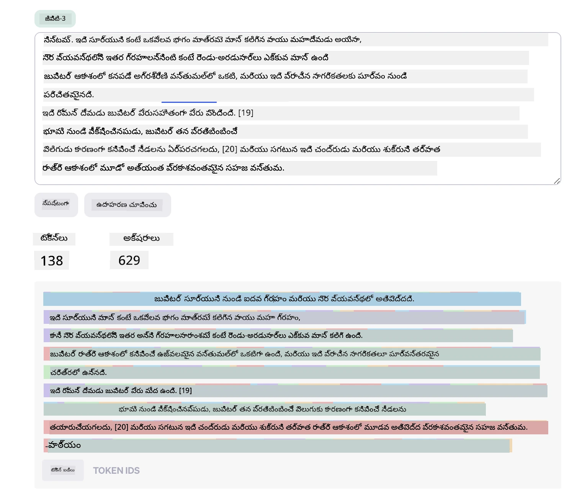
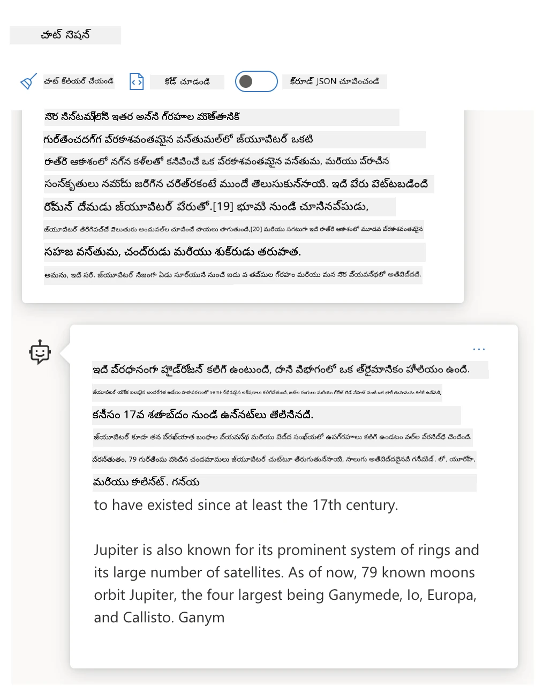
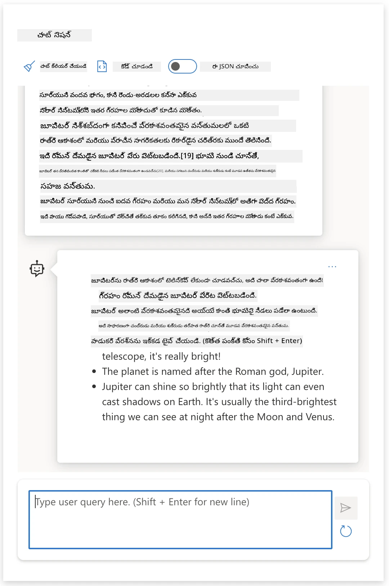
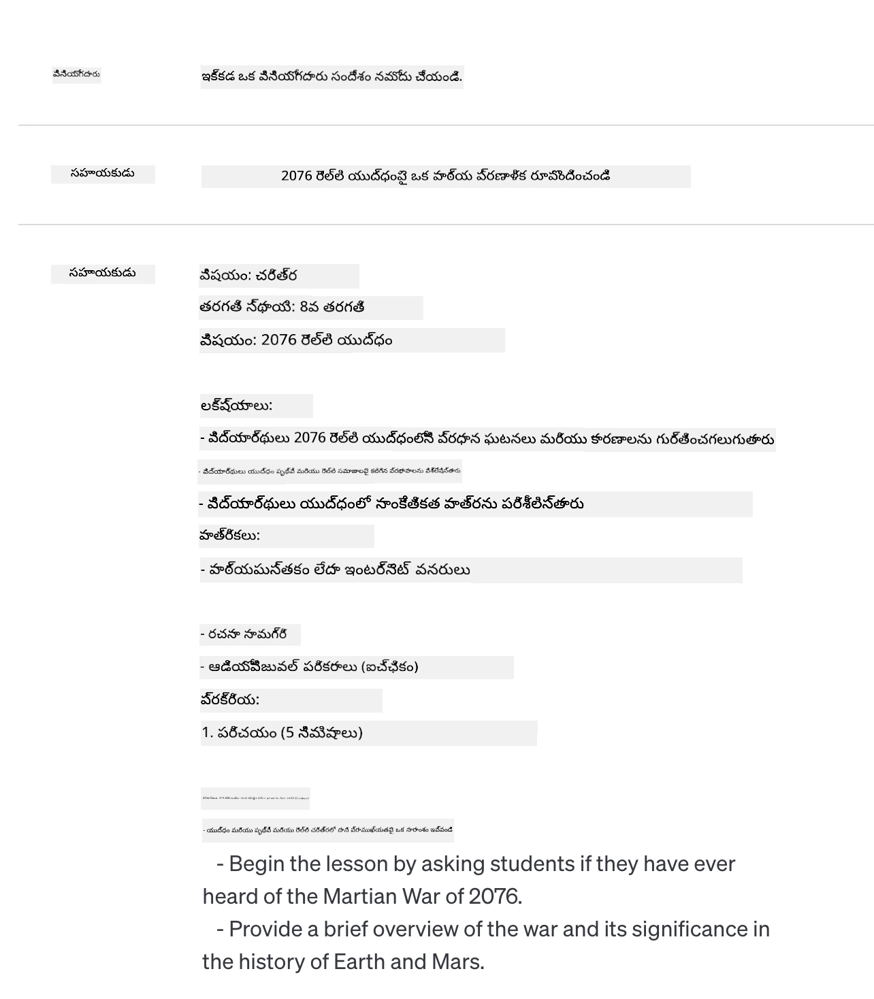
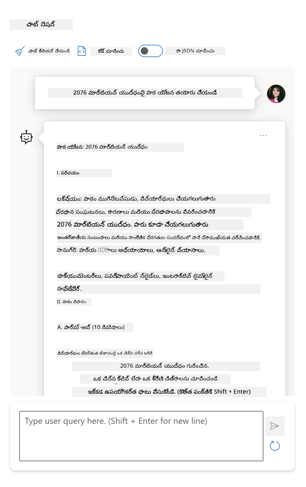
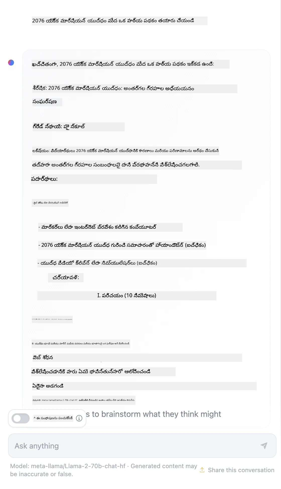

# ప్రాంప్ట్ ఇంజనీరింగ్ ఫండమెంటల్స్

[](https://youtu.be/GElCu2kUlRs?si=qrXsBvXnCW12epb8)

## పరిచయం
ఈ మాడ్యూల్ వాటటువంటి ఆలోచనలు మరియు సాంకేతికతలను కవర్ చేస్తుంది, వాటిని జెరొనేటివ్ AI మోడల్స్ లో సమర్ధవంతమైన ప్రాంప్ట్స్ సృష్టించడానికి ఉపయోగిస్తారు. మీరు LLM కు ప్రాంప్ట్ ఎలా రాస్తారో కూడా ముఖ్యం. జాగ్రత్తగా రూపొందించిన ప్రాంప్ట్ మంచి జవాబు నాణ్యతను సాధించగలదు. కానీ _ప్రాంప్ట్_ మరియు _ప్రాంప్ట్ ఇంజినీరింగ్_ అనే పదాలకు అర్థం ఏమిటి? మరియు నేను LLM కు పంపే ప్రాంప్ట్ _ఇన్‌పుట్_ ను ఎలా మెరుగుపరుస్తాను? ఈ ప్రశ్నలకు ఈ అధ్యాయం మరియు తరువాతివి సమాధానం ఇవ్వడానికి ప్రయత్నిస్తాం.

_జీనరేటివ్ AI_ వినియోగదారుల అభ్యర్థనలకు స్పందించి కొత్త కంటెంట్ (ఉదాహరణకు, టెక్స్, చిత్రాలు, ఆడియో, కోడ్ మొదలయినవి) సృష్టించగలదు. ఇది OpenAI యొక్క GPT ("జీనరేటివ్ ప్రి-ట్రెయిన్‌డ్ ట్రాన్స్‌ఫార్మర్") శ్రేణి లాంటి _లార్జ్ లాంగ్వేజ్ మోడల్స్_ ను ఉపయోగించి సాధిస్తుంది, ఇవి సహజభాష మరియు కోడ్ ఉపయోగానికి శిక్షణ పొందాయి.

వినియోగదారులు టెక్నికల్ నైపుణ్యం లేకుండానే వాతావరణానికి అనుగుణంగా చాట్ వంటి పరోక్షంలో ఈ మోడల్స్‌తో ఇంటరాక్ట్ చేయవచ్చు. ఈ మోడల్స్ _ప్రాంప్ట్ ఆధారిత_ – వినియోగదారులు టెక్స్ట్ ఇన్‌పుట్ (ప్రాంప్ట్) పంపించి AI స్పందన (కంప్లీషన్) అందుకుంటారు. వారు మల్టీ-టర్న్ సంభాషణలలో AIతో "చాట్" చేయవచ్చు, ప్రాంప్ట్‌ను మెరుగుపరిచి తమ ఆశించిన స్పందన వచ్చే వరకూ ప్రయత్నిస్తారు.

ప్రాంప్ట్‌లు ఇప్పుడు జెరొనేటివ్ AI యాప్‌లకు ప్రధాన _ప్రోగ్రామింగ్ ఇంటర్‌ఫేస్_ గా మారాయి, ఇవి మోడల్స్‌కు ఏమి చేయాలో తెలియజేస్తాయి మరియు తిరిగి ఇచ్చే స్పందన నాణ్యతపై ప్రభావం చూపుతాయి. "ప్రాంప్ట్ ఇంజినీరింగ్" అనేది వేగంగా పెరుగుతున్న అధ్యయన శాఖ, ఇది స్థిరమైన మరియు నాణ్యమైన స్పందనలను ప్రదర్శించేలా ప్రాంప్ట్‌లను _నిర్మాణం మరియు ఆప్టిమైజేషన్_ పై కేంద్రీకృతమై ఉంది.

## నేర్చుకునే లక్ష్యాలు

ఈ పాఠంలో, ప్రాంప్ట్ ఇంజినీరింగ్ అంటే ఏమిటో, దాని ప్రాముఖ్యత ఏమిటో, మరియు నిర్దిష్ట మోడల్ మరియు అప్లికేషన్ లక్ష్యానికి అనుగుణంగా మరింత సమర్థవంతమైన ప్రాంప్ట్‌లను ఎలా రూపొందించవచ్చో నేర్చుకుంటాం. ప్రాంప్ట్ ఇంజినీరింగ్‌కు సంబంధించిన ప్రధాన భావనలను మరియు ఉత్తమ ఆచరణలను అర్ధం చేసుకుంటాము - మరియు జూమ్‌లో ఈ భావనలు నిజమైన ఉదాహరణలకు ఎలా వర్తిస్తాయో చూసేందుకు ఇంటరాక్టివ్ Jupyter నోట్బుక్ "సాండ్‌బాక్స్" వాతావరణాన్ని తెలుకుంటాము.

ఈ పాఠాంతంలో మేము చేయగలిగేది:

1. ప్రాంప్ట్ ఇంజినీరింగ్ అంటే ఏమిటో మరియు ఎందుకు ముఖ్యం అనేది వివరణ చేయడం.
2. ఒక ప్రాంప్ట్ యొక్క భాగాలు ఏమిటి మరియు అవి ఎలా ఉపయోగిస్తారో వివరణ చేయడం.
3. ప్రాంప్ట్ ఇంజినీరింగ్‌కు ఉత్తమ ఆచరణలు మరియు సాంకేతికతలను నేర్చుకోవడం.
4. నేర్పిన సాంకేతికతలను వాస్తవ ఉదాహరణలకు, ఒక OpenAI ఎండ్పాయింట్ ఉపయోగించి వర్తించడం.

## ముఖ్య పదాలు

ప్రాంప్ట్ ఇంజినీరింగ్: AI మోడల్స్‌ను కావలసిన అవుట్పుట్స్ ఉత్పత్తి చెయ్యడానికై ఇన్‌పుట్స్ రూపకల్పన మరియు మెరుగుపరిచే ప్రక్రియ.

టోకెనైజేషన్: టెక్స్ట్‌ను చిన్న యూనిట్లుగా, టోకెన్లుగా మార్చే ప్రక్రియ, దీని ద్వారా మోడల్ అర్థం చేసుకొని ప్రాసెస్ చేయగలదు.

ఇన్‌స్ట్రక్షన్-ట్యూన్ చేసిన LLMs: ఖచ్చితమైన సూచనలతో మెరుగుపరిచిన, సమాధాన ఖచ్చితత్వం మరియు సంబంధితత పెరిగిన పెద్ద భాషా మోడల్స్.

## నేర్చుకునే సాండ్‌బాక్స్

ప్రాంప్ట్ ఇంజనీరింగ్ ప్రస్తుతానికి శాస్త్రం కంటే కళ ఎక్కువ. దీని మీద మన అభిరుచిని మెరుగుపర్చుకోవడానికి ఉత్తమ మార్గం _ఇంకా ఎక్కువ ప్రాక్టీస్_ చేయడం మరియు అప్లికేషన్ డొమైన్ నైపుణ్యం, సిఫార్సు చేయబడిన సాంకేతికతలు మరియు మోడల్-పురోగత ఆప్టిమైజేషన్‌లను కలిపే ప్రయోగాత్మక పరిశోధనను ఆచరించడం.

ఈ పాఠం తో పాటు వస్తున్న Jupyter నోట్బుక్ మీకు నేర్చుకున్న దాన్ని పరీక్షించుకునే _సాండ్‌బాక్స్_ వాతావరణాన్ని అందిస్తుంది - మీరు వెళ్లిన వెంటనే లేదా చివరి కోడ్ ఛాలెంజ్ భాగంగా. వ్యాయామాలు అమలు చేయడానికి, మీ దగ్గర ఉండాలి:

1. **Azure OpenAI API కీ** - డిప్లాయ్ చేసిన LLM కు సేవ ఎండ్పాయింట్.
2. **Python రన్‌టైమ్** - నోట్బుక్ అమలు కావడానికి.
3. **లోకల్ ఎన్వ్ వేరియబుల్స్** - ఇప్పుడే [SETUP](./../00-course-setup/02-setup-local.md?WT.mc_id=academic-105485-koreyst) దశలను పూర్తి చేయండి.

నోట్బుక్ తో ప్రారంభ వ్యాయామాలు వస్తాయి - కానీ మీరు స్వయంగా మరిన్ని ఉదాహరణలు లేదా ఆలోచనలు ప్రయత్నించేందుకు మీ యొక్క _Markdown_ (వివరణ) మరియు _Code_ (ప్రాంప్ట్ అభ్యర్థనలు) సెక్షన్లు జోడించుకోవచ్చు - మరియు ప్రాంప్ట్ రూపకల్పనలో మీ అభిరుచిని పెంచుకోండి.

## చిత్రిత గైడ్

మీరు ఈ పాఠం ఏ అంశాలు కవర్ చేస్తుంటాయని పెద్ద దృశ్యం తెలుసుకోవాలనుకుంటున్నారా? ఈ చిత్రిత గైడ్ చూసండి, ఇది ప్రధాన అంశాలు మరియు ప్రతి ఒక్కదాని గురించి మీకు ఆలోచించుకోవాల్సిన ముఖ్యాంశాలను తెలియజేస్తుంది. పాఠం రోడ్‌మ్యాప్ ప్రధాన ఆలోచనలు మరియు సవాళ్ళను అర్థం చేసుకోకుండా, వాటిని సంబంధించిన ప్రాంప్ట్ ఇంజనీరింగ్ సాంకేతికతలు మరియు ఉత్తమ ఆచరణలతో ఎలా పరిష్కరించాలో చూపిస్తుంది. గమనించండి, ఈ గైడ్‌లో "అడ్వాన్స్డ్ సాంకేతికతలు" విభాగం ఈ పాఠ్య ప్రణాళిక యొక్క _తదుపరి_ అధ్యాయంలో ఉన్న విషయం.



## మా స్టార్టప్

ఇప్పుడు, _ఈ విషయము_ మా స్టార్టప్ మిషన్‌కి ఎలా సంబంధించినదో మాట్లాడుకుందాం: [శిక్షణలో AI సృజనను తీసుకురావడం](https://educationblog.microsoft.com/2023/06/collaborating-to-bring-ai-innovation-to-education?WT.mc_id=academic-105485-koreyst). మేము _వ్యక్తిగతీకరించిన నేర్చుకోవడం_ ఆధారిత AI యాప్‌లను సృష్టించాలనుకుంటున్నాము - కనుక మా ఆప్లికేషన్ వినియోగదారులు ఎలా "ప్రాంప్ట్"లను రూపకల్పన చేస్తారో ఆలోచిద్దాం:

- **అడ్మినిస్ట్రేటర్లు** AI ని అడిగి _కరిరికులం డేటాను విశ్లేషించి కవరేజ్ లో లోపాలను గుర్తించాలి_. AI ఫలితాలను సారాంశంగా చెప్తుంది లేదా కోడ్‌తో విజువలైజ్ చేస్తుంది.
- **ఇద్యపకులు**కు AI ను అడిగి _లక్ష్య ప్రేక్షకుల మరియు విషయం కోసం పాఠ్య ప్రణాళిక తయారు చేయించు_. AI ప్రత్యేకమైన ఫార్మాట్‌లో వ్యక్తిగతీకరించిన ప్రణాళికను తయారు చేస్తుంది.
- **విద్యార్థులు**కు AI ను అడిగి _కఠినమైన విషయం లో వారికి ట్యుటర్‌గా పనిచేయించు_. ఇప్పుడు AI విద్యార్థులను వారి స్థాయికి సరిపోయే పాఠాలు, సూచనలు & ఉదాహరణలతో మార్గనిర్దేశనం చేస్తుంది.

ఇది ఒక్క మొదటిది మాత్రమే. [Prompts For Education](https://github.com/microsoft/prompts-for-edu/tree/main?WT.mc_id=academic-105485-koreyst) - విద్యా నిపుణులు సేకరించిన ఓపెన్-సోర్స్ ప్రాంప్ట్‌లు ఉన్న లైబ్రరీని చూసి అవకాశాల పొడవైన భావన పొందండి! _ఆ ప్రాంప్ట్‌లను సాండ్‌బాక్స్‌లో లేదా OpenAI ప్లేగ్రౌండ్‌లో ప్రయత్నించి చూసి ఏం జరుగుతుందో చూడండి!_

<!--
LESSON TEMPLATE:
This unit should cover core concept #1.
Reinforce the concept with examples and references.

CONCEPT #1:
Prompt Engineering.
Define it and explain why it is needed.
-->

## ప్రాంప్ట్ ఇంజినీరింగ్ అంటే ఏమిటి?

మేము ఈ పాఠశాలలో **ప్రాంప్ట్ ఇంజినీరింగ్** ని నిర్వచించాము: నిర్దిష్ట అప్లికేషన్ లక్ష్యానికి మరియు మోడల్‌కు స్థిరమైన మరియు నాణ్యమైన స్పందనలు (కంప్లీషన్లు) అందించేలా టెక్స్ట్ ఇన్‌పుట్స్ (ప్రాంప్ట్‌లు) ను _రూపకల్పన చేసి ఆప్టిమైజ్ చేయుట_ ప్రక్రియ. దీన్ని 2-దశల ప్రక్రియగా తెలుసుకోవచ్చు:

- నిర్దిష్ట మోడల్ మరియు లక్ష్యానికి ప్రారంభ ప్రాంప్ట్ ను _రూపకల్పన_ చేయడం
- స్పందన నాణ్యత మెరుగుపర్చడానికి ప్రాంప్ట్‌ను పునరావృతంగా _మెరుగుపర్చడం_

ఇది తప్పనిసరి గా ప్రయోగాత్మక ప్రక్రియ, ఇది ఉత్తమ ఫలితాల కోసం వినియోగదారుల అభిరుచిని మరియు ప్రయత్నాన్ని కోరుతుంది. ఇది ఎందుకు ముఖ్యం? ఆ ప్రశ్నకు సమాధానం ఇవ్వాలంటే, ముందుగా మూడూ భావనలు అర్థం చేసుకోవాలి:

- _టోకెనైజేషన్_ = మోడల్ ప్రాంప్ట్‌ను ఎలా "చూస్తుంది"
- _బేస్ LLMs_ = ఫౌండేషన్ మోడల్ ప్రాంప్ట్‌ను ఎలా "ప్రాసెస్" చేస్తుంది
- _ఇన్‌స్ట్రక్షన్-ట్యూన్ చేయబడ్డ LLMs_ = మోడల్ స్కిల్స్‌ను ఎలా "టాస్కులు"గా చూడగలదు

### టోకెనైజేషన్

ఒక LLM ప్రాంప్ట్‌లను _టోకెన్ల క్రమంగా_ చూస్తుంది, ఇక్కడ వేర్వేరు మోడల్స్ (లేదా మోడల్ వెర్షన్లు) ఒక్క ప్రాంప్ట్‌ని వేర్వేరు రీతులలో టోకెనైజ్ చేయవచ్చు. LLMలు టోకెన్లపై శిక్షణ పొందినవి (అయినప్పటికీ మ 룽 టెక్స్�్� సార్థకం కాకపోవచ్చు), కాబట్టి ప్రాంప్ట్‌లు టోకెనైజ్ కావడం జెనరేట్ చేసిన జవాబు నాణ్యతపై ప్రత్యక్ష ప్రభావం చూపుతుంది.

టోకెనైజేషన్ ఎలా పనిచేస్తుందో అర్థం చేసుకోవడానికి [OpenAI Tokenizer](https://platform.openai.com/tokenizer?WT.mc_id=academic-105485-koreyst) లాంటి టూల్స్ ఉపయోగించండి. మీ ప్రాంప్ట్‌ను నకలుచేయండి - అలాగే అది టోకెన్లుగా ఎలా మారుతుంది, అంతా గమనించండి, ప్రత్యేకంగా స్పేస్ కీ మరియు పంక్చ్యుయేషన్ గుర్తులు ఎలా తీసుకోబడుతున్నాయో. ఇది ఒక పాత LLM (GPT-3) ఉదాహరణ చూపుతుంది - కాబట్టి కొత్త మోడల్‌తో ప్రయత్నిస్తే పరిణామం భిన్నంగా ఉండవచ్చు.



### భావన: ఫౌండేషన్ మోడల్స్

ఒకసారి ప్రాంప్ట్ టోకెనైజ్ అయిన తర్వాత, ["Base LLM"](https://blog.gopenai.com/an-introduction-to-base-and-instruction-tuned-large-language-models-8de102c785a6?WT.mc_id=academic-105485-koreyst) (లేదా ఫౌండేషన్ మోడల్) ప్రాథమిక పని ఆ క్రమంలోని టోకెన్‌ను అంచనా వేసే పని. LLMలు భారీ టెక్స్ట్ డేటా సెట్‌లపై శిక్షణ పొందినవి, కాబట్టి టోకెన్ల మధ్య గణాంక సంబంధాలను బాగా అర్థం చేసుకుంటాయి మరియు నిశ్చితార్థంతో అంచనా వేస్తాయి. అవి ప్రాంప్ట్‌లో పదాల _అర్థం_ అర్థం చేసుకోవు; కేవలం ఒక నమూనా చూడగలుగుతాయి, దీన్ని తమ తదుపరి అంచనా తో "పూరించగలవు". వాడుకరి మధ్యలో జోక్యం పెట్టలేదు లేదా కింద పేర్కొన్న షరతు చేరేవరకు టోకెన్ల శ్రేణిని అంచనా వేయడం కొనసాగిస్తాయి.

ప్రాంప్ట్ ఆధారిత కంప్లీషన్ ఎలా పనిచేస్తుందో చూడాలనుకుంటున్నారా? పై ప్రాంప్ట్ ను Azure OpenAI Studio [_Chat Playground_](https://oai.azure.com/playground?WT.mc_id=academic-105485-koreyst) లో డిఫాల్ట్ సెట్టింగ్స్ తో ఇన్పుట్ చేయండి. సిస్టమ్ ప్రాంప్ట్‌లను సమాచార అభ్యర్థనలుగా పరిగణించడానికి కట్టుబడి ఉంది – కాబట్టి ఈ సందర్భానికి తగిన కంప్లీషన్ చూడొచ్చు.

పుడు వినియోగదారు ఒక నిర్దిష్ట అవసర లేదా టాస్క్ లక్ష్యాన్ని అందుకోవాలని అనుకుంటే? ఇక్కడ _ఇన్‌స్ట్రక్షన్-ట్యూన్డ్_ LLMs ప్రవేశిస్తాయి.



### భావన: ఇన్‌స్ట్రక్షన్-ట్యూన్డ్ LLMs

ఒక [ఇన్‌స్ట్రక్షన్ ట్యూన్డ్ LLM](https://blog.gopenai.com/an-introduction-to-base-and-instruction-tuned-large-language-models-8de102c785a6?WT.mc_id=academic-105485-koreyst) ఫౌండేషన్ మోడల్ తో ప్రారంభమై, స్పష్టమైన సూచనలు కలిగిన ఉదాహరణలు లేదా ఇన్‌పుట్/అవుట్‌పుట్ జంటలు (ఉదాహరణకు, మల్టీ-టర్న్ "మెసేస్‌లు") ఉపయోగించి మోడల్‌ను మెరుగుపరుస్తుంది – మరియు AI స్పందన ఆ సూచనను అనుసరించే ప్రయత్నం చేస్తుంది.

ఇది Reinforcement Learning with Human Feedback (RLHF) వంటి సాంకేతికతలు ఉపయోగించి మోడల్‌ను _సూచనల్ని అనుసరించేలా_ మరియు _ఫీడ్‌బ్యాక్ నుండి నేర్చుకునేందుకుగాను_ శిక్షణ ఇస్తుంది, తద్వారా ఇది వాస్తవ అప్లికేషన్లకు మరింత అనుగుణమైన మరియు వినియోగదారుల లక్ష్యాలకు మరింత సంబంధించిన జవాబులు ఉత్పత్తి చేస్తుంది.

అయితే ప్రయోగం చేద్దాం -పై ప్రాంప్ట్ కు తిరిగి వెళ్లి, ఇప్పుడు _సిస్టమ్ మెసేజ్_ ను ఈ సూచనతో మార్చండి:

> _మీకి ఇవ్వబడిన విషయాన్ని రెండవ తరగతి విద్యార్థికి సారాంశం చేయండి. ఫలితాన్ని 3-5 బుల్లెట్ పాయింట్స్ తో ఒక పేరా లో ఉంచండి._

ఫలితం ఈ లక్ష్యం మరియు ఫార్మాట్ అనుగుణంగా మార్చబడిందని చూడండి? ఒక విద్యాపరుడు ఈ స్పందనను తురతగా తన క్లాస్ స్లైడ్స్‌లో ఉపయోగించవచ్చు.



## ప్రాంప్ట్ ఇంజినీరింగ్ ఎందుకు అవసరం?

ఇప్పుడు మేము తెలుసుకున్నాం, LLMలు ప్రాంప్ట్‌లను ఎలా ప్రాసెస్ చేస్తాయో, మరియు ఇప్పుడు ప్రాంప్ట్ ఇంజినీరింగ్ ఎందుకు అవసరమో మాట్లాడుకుందాం. సమాధానం కింద ఉన్న సవాళ్లలో ఉంది, ఇవి ప్రస్తుతం ఉన్న LLMల వల్ల _నమ్మదగిన మరియు స్థిరమైన కంప్లీషన్లు_ సాదించడానికి చాలా కష్టతరమవుతాయి, ప్రాంప్ట్ నిర్మాణం మరియు ఆప్టిమైజేషన్ పై శ్రద్ధ పెట్టకపోతే:

1. **మోడల్ స్పందనలు సాందర్భిక (స్టోకాస్టిక్) కావు.** ఒకటే ప్రాంప్ట్ వివిధ మోడల్స్ లేదా మోడల్ వెర్షన్లలో వేర్వేరు స్పందనలు ఇవ్వవచ్చు. అదే మోడల్‌తోనూ సమయానుసారంగా ఫలితాలు భిన్నంగా ఉండొచ్చు. _ప్రాంప్ట్ ఇంజినీరింగ్ సాంకేతికతలు ఈ పరివర్తనలను తగ్గించడంలో సహాయపడతాయి_.

1. **మోడల్స్ కల్పితమైన (ఫాబ్రికేషన్స్) స్పందనలు ఇచ్చే అవకాశమనది.** మోడల్స్ పెద్ద కానీ పరిమిత శిక్షణ డేటాసెట్లతో ముందు నుండి శిక్షణ పొందినవ్వారు, కాబట్టి శిక్షణ పరిధి వెలుపల ఉన్న కాన్సెప్టుల గురించి అవగాహన లేకపోవచ్చు. దాంతో అవాస్తవ, ఊహాజనిత, లేదా స్పష్టంగాKnown నిజాలకి విరుద్ధమైన కంప్లీషన్లు ఇవ్వవచ్చు. _ప్రాంప్ట్ ఇంజినీరింగ్ సాంకేతికతలు వినియోగదారులకు వాడు కల్పితాలను గుర్తించి నివారించడంలో సహాయపడతాయి, ఉదాహరణకు AI ను సూచనములు లేదా తర్కం అడగడం ద్వారా_.

1. **మోడల్ సామర్థ్యాలు మారుతూ ఉంటాయి.** కొత్త మోడల్స్ లేదా కొత్త తరాల మోడల్స్ ఎక్కువ సామర్థ్యాలతో వచ్చే కానీ ఖర్చు & సంక్లిష్టతలో ప్రత్యేకమైన స్వభావాలు మరియు పరిమితులను కలిగి ఉంటాయి. _ప్రాంప్ట్ ఇంజినీరింగ్ మనకు ఉత్తమ ఆచరణలు మరియు పనిముట్లు రూపొందించడంలో సహాయపడుతుంది, ఇవి భిన్నతలను సారాంశం చేస్తాయి మరియు మోడల్-స్పెసిఫిక్ అవసరాలకు అనుగుణంగా మారవచ్చు_.

ఇది OpenAI లేదా Azure OpenAI Playground లో చూసే ప్రయత్నం చేయండి:

- వేర్వేరు LLM డిప్లాయ్‌మెంట్‌లలో (ఉదా: OpenAI, Azure OpenAI, Hugging Face) ఒకే ప్రాంప్ట్ ఉపయోగించి - మీరు భిన్నాలను గమనించారా?
- ఒకే LLM డిప్లాయ్‌మెంట్ లో (ఉదా: Azure OpenAI ప్లేగ్రౌండ్) ఒక్క ప్రాంప్ట్ ను పునరావృతంగా ఉపయోగించి - ఈ మార్పులు ఎలా భిన్నంగా వచ్చాయో చూసారా?

### ఫ్యాబ్రికేషన్స్ ఉదాహరణ

ఈ కోర్సులో, మేము **"ఫ్యాబ్రికేషన్"** అనే పదాన్ని ఉపయోగిస్తాము, దీనర్థం LLMలు శిక్షణ పరిమితుల కారణంగా లేదా ఇతర పరిమితుల వల్ల కొన్నిసార్లు తప్పు సమాచారాన్ని తయారు చేయడం. మీరు దీన్ని ప్రజాదరణ పొందిన ఆర్టికల్స్ లేదా పరిశోధన పత్రాలలో _"హాల్యూసినేషన్స్"_ అని కూడా విన్నవచ్చు. కానీ మేము _"ఫ్యాబ్రికేషన్"_ శబ్దాన్ని ఉపయోగించమని బలంగా సిఫార్సు చేస్తున్నాము ఎందుకంటే మేం మెషీన్-చాలిత ఫలితానికి మానవ-సաբిత స్వభావాన్ని అన్వయించకుండా ఉండాలి. ఇది [బాధ్యతాయుత AI మార్గదర్శకాలు](https://www.microsoft.com/ai/responsible-ai?WT.mc_id=academic-105485-koreyst) ను కూడా terminology పరంగా బలోపేతం చేస్తుంది, కొన్ని సందర్భాలలో అవమానకరమైన లేదా అనుకూలం కాని పదాలను తొలగిస్తుంది.

ఫ్యాబ్రికేషన్స్ ఎలా జరుగుతాయో అర్థం చేసుకోవాలనుకుంటున్నారా? AIకు శిక్షణ డేటాకు లేకుండా ఉన్న ఒక పాఠ్యాంశం కోసం కంటెంట్ సృష్టించాలని సూచించే ఒక ప్రాంప్ట్‌ను ఊహించండి. ఉదాహరణకి – నేను ఈ ప్రాంప్ట్ ను ప్రయత్నించాను:

> **ప్రాంప్ట్:** 2076 మార్థియన్ యుద్ధంపై పాఠ్యక్రమ ప్రణాళిక తయారు చేయండి.
వెబ్ సెర్చ్ నన్ను చూపించిందిMartian యుద్ధాలపై కల్పిత కథనాలు (ఉదాహరణకు, టెలివిజన్ సిరీస్ లేదా పుస్తకాలు) ఉన్నాయని - కానీ 2076 లో ఏవీ లేవు. కామన్స్ెన్స్ కూడా మనకు చెప్తుంది 2076 _భవిష్యత్తులో_ ఉంది కాబట్టి, అది నిజమైన సంఘటనతో సంబంధం ఉండకూడదు.

మరి వివిధ LLM ప్రొవైడర్లతో ఈ ప్రాంప్ట్ నడిపిస్తే ఏమవుతుంది?

> **ప్రతిస్పందన 1**: OpenAI ప్లేగ్రౌండ్ (GPT-35)



> **ప్రతిస్పందన 2**: Azure OpenAI ప్లేగ్రౌండ్ (GPT-35)



> **ప్రతిస్పందన 3**: : హగ్గింగ్ ఫేస్ చాట్ ప్లేగ్రౌండ్ (LLama-2)



అంచనాను తప్పకుండా, ప్రతి మోడల్ (లేదా మోడల్ వర్షన్) స్టోకాస్టిక్ ప్రవర్తన మరియు మోడల్ సామర్థ్య మార్పుల కారణంగా స్వల్ప భిన్నమైన ప్రతిస్పందనలను ఉత్పత్తి చేస్తుంది. ఉదాహరణకు, ఒక మోడల్ 8వ తరగతి వయస్సు గల ప్రేక్షకులను లక్ష్యంగా చేస్తుంది, మరోటి ఉన్నత పాఠశాల విద్యార్థి అని భావిస్తుంది. కానీ ఈ మూడు మోడల్స్ అన్ని ఒక అజ్ఞాత వినియోగదారుని ఈ సంఘటన నిజమని నమ్మించే ప్రతిస్పందనలను సృష్టించాయి.

_మెటాప్రాంప్టింగ్_ మరియు _తాపమానం కాన్ఫిగరేషన్_ వంటి ప్రాంప్ట్ ఇంజనీరింగ్ సాంకేతికతలు కొంత మేరకు మోడల్ కల్పితాలను తగ్గించవచ్చు. కొత్త ప్రాంప్ట్ ఇంజనీరింగ్ _స్వరూపాలు_ కూడా ప్రాంప్ట్ పద్ధతిలో సుగమంగా కొత్త పరికరాలు మరియు సాంకేతికతలను చేర్పిస్తూ ఈ ప్రభావాలను తగ్గించడానికి సహాయపడతాయి.

## కేసు అధ్యయనం: GitHub కాపైలట్

ఈ భాగాన్ని ముగించడానికి, ప్రాంప్ట్ ఇంజనీరింగ్ వాస్తవ ప్రపంచ పరిష్కారాలలో ఎలా ఉపయోగిస్తారో ఒక కేసు స్టడితో గమనిద్దాం: [GitHub Copilot](https://github.com/features/copilot?WT.mc_id=academic-105485-koreyst).

GitHub Copilot మీ "AI జంట ప్రోగ్రామర్" - ఇది టెక్స్ట్ ప్రాంప్ట్‌లను కోడ్ పూర్తిచేసే సూచనలుగా మార్చి మీ అభివృద్ధి వాతావరణంలో (ఉదాహరణకు, Visual Studio Code) సులభమైన ఉపయోగ అనుభవం కోసం ఇన్టిగ్రేటెడ్ ఉంది. క్రింద ఉన్న బ్లాగ్ సిరీస్ లో ప్రదర్శించినట్లుగా, తొలిసారి విడుదలైన వెర్షన్ OpenAI Codex మోడల్ ఆధారంగా ఉండేది - ఇంజనీర్‌లు త్వరగా ఈ మోడల్‌ను మెరుగుపరచడానికి ప్రాంప్ట్ ఇంజనీరింగ్ సాంకేతికతలను అభివృద్ది చేయాల్సిన అవసరం గుర్తించారు, తద్వారా కోడ్ నాణ్యత మెరుగుపడింది. జూలైలో, వారు [Codex కంటే మెరుగైన AI మోడల్‌ను ప్రవేశపెట్టారు](https://github.blog/2023-07-28-smarter-more-efficient-coding-github-copilot-goes-beyond-codex-with-improved-ai-model/?WT.mc_id=academic-105485-koreyst) వేగంగా సూచనలు ఇస్తుంది.

వారి నేర్చుకునే యాత్రను అనుసరించడానికి క్రమంగా పోస్టులని చదవండి.

- **మె 2023** | [GitHub Copilot మీ కోడ్‌ను అర్థం చేసుకోవడంలో మెరుగుపడ్తుంది](https://github.blog/2023-05-17-how-github-copilot-is-getting-better-at-understanding-your-code/?WT.mc_id=academic-105485-koreyst)
- **మే 2023** | [GitHub లో: GitHub Copilot వెనుక LLMs తో పని](https://github.blog/2023-05-17-inside-github-working-with-the-llms-behind-github-copilot/?WT.mc_id=academic-105485-koreyst)
- **జూన్ 2023** | [GitHub Copilot కి మెరుగైన ప్రాంప్ట్‌లు ఎలా రాయాలి](https://github.blog/2023-06-20-how-to-write-better-prompts-for-github-copilot/?WT.mc_id=academic-105485-koreyst)
- **జూలై 2023** | [GitHub Copilot Codex కంటే మెరుగైన AI మోడల్ తో పయనిస్తోంది](https://github.blog/2023-07-28-smarter-more-efficient-coding-github-copilot-goes-beyond-codex-with-improved-ai-model/?WT.mc_id=academic-105485-koreyst)
- **జూలై 2023** | [వికాసకుని గైడ్ - ప్రాంప్ట్ ఇంజనీరింగ్ మరియు LLMs](https://github.blog/2023-07-17-prompt-engineering-guide-generative-ai-llms/?WT.mc_id=academic-105485-koreyst)
- **సెప్టెంబర్ 2023** | [ఎక్కడికీ GitHub Copilot నుండి పాఠాలు తీసుకుని ఎంటర్ప్రైజ్ LLM యాప్‌ను ఎలా నిర్మించాలి](https://github.blog/2023-09-06-how-to-build-an-enterprise-llm-application-lessons-from-github-copilot/?WT.mc_id=academic-105485-koreyst)

మీరు వారి [ఇంజనీరింగ్ బ్లాగ్](https://github.blog/category/engineering/?WT.mc_id=academic-105485-koreyst) లో కూడా ఇంకా పోస్టులను బ్రౌజ్ చేయవచ్చు, ఉదాహరణకి [ఇది](https://github.blog/2023-09-27-how-i-used-github-copilot-chat-to-build-a-reactjs-gallery-prototype/?WT.mc_id=academic-105485-koreyst) చూపిస్తుంది ఈ మోడల్స్ మరియు సాంకేతికతలు వాస్తవ ప్రపంచ పనుల కోసం ఎలా _అప్లై_ చేయబడుతున్నాయో.

---

<!--
LESSON TEMPLATE:
This unit should cover core concept #2.
Reinforce the concept with examples and references.

CONCEPT #2:
Prompt Design.
Illustrated with examples.
-->

## ప్రాంప్ట్ నిర్మాణం

మనం ఇప్పటికే గ్రహించాం ప్రాంప్ట్ ఇంజనీరింగ్ ముఖ్యమేను - ఇప్పుడు వివిధ సాంకేతికతలు మరింత సుస్పష్టమైన ప్రాంప్ట్ డిజైన్ కోసం ఎలా _నిర్మించబడతాయో_ అర్థం చేసుకుందాం.

### ప్రాథమిక ప్రాంప్ట్

ముందుగా ప్రాథమిక ప్రాంప్ట్‌తో ప్రారంభిద్దాం: మోడల్‌కు ఇతర సందర్భం లేకుండా పంపించిన పాఠ్య ఇన్‌పుట్. ఉదాహరణకి - మనం US జాతీయ గీతంలోని మొదటి కొన్ని పదాలను OpenAI [Completion API](https://platform.openai.com/docs/api-reference/completions?WT.mc_id=academic-105485-koreyst) కు పంపిస్తే అది వెంటనే తదుపరి కొన్ని పంక్తులను _పూర్తి_ చేస్తుంది, ప్రాథమిక పూర్వాకాంక్షా ప్రవర్తనను చూపిస్తూ.

| ప్రాంప్ట్ (ఇన్‌పుట్)      | పూర్తి (ఔట్‌పుట్)                                                                                                                               |
| :----------------- | :----------------------------------------------------------------------------------------------------------------------------------------- |
| ఓహ్ చెప్పమని చూస్తున్నావా | మీరు "The Star-Spangled Banner," అమెరికా జాతీయ గీతం యొక్క లిరిక్స్ ఆరంభిస్తున్నారు అనిపిస్తోంది. పూర్తి పాట ఇలా ఉంది ... |

### క్లిష్టమైన ప్రాంప్ట్

ఇప్పుడు ఆ ప్రాథమిక ప్రాంప్ట్‌కు సందర్భం మరియు సూచనలను జోడించుదాం. [చాట్ పూర్తి API](https://learn.microsoft.com/azure/ai-services/openai/how-to/chatgpt?WT.mc_id=academic-105485-koreyst) మాతో కాంప్లెక్స్ ప్రాంప్ట్‌ను _మెసేజ్‌ల_ సేకరణగా నిర్మించనిస్తుంది, ఇందులో:

- ఇన్‌పుట్‌/ఔట్‌పుట్ జంటలు కలిగి ఉంటాయి, అవి _యూజర్_ ఇన్‌పుట్ మరియు _అసిస్టెంట్_ ప్రతిస్పందనను ప్రతిబింబిస్తాయి.
- సిస్టమ్ మెసేజ్ ఒప్పందం కల్పిస్తుంది అసిస్టెంట్ ప్రవర్తన లేదా వ్యక్తిత్వం కోసం.

ఇప్పుడు అభ్యర్థన క్రింది రూపంలో ఉంటుంది, ఇక్కడ _టోకనైజేషన్_ సరైన సమాచారాన్ని సందర్భం మరియు సంభాషణ నుండి సమర్థవంతంగా పొందుతుంది. సిస్టమ్ ఒప్పందాన్ని మార్చటం, యూజర్ ఇన్‌పుట్‌ల కోసం ఎంత ప్రభావవంతంగా ఉంటుందో completion నాణ్యతపై పెద్ద ప్రభావం చూపుతుంది.

```python
response = openai.chat.completions.create(
    model="gpt-3.5-turbo",
    messages=[
        {"role": "system", "content": "You are a helpful assistant."},
        {"role": "user", "content": "Who won the world series in 2020?"},
        {"role": "assistant", "content": "The Los Angeles Dodgers won the World Series in 2020."},
        {"role": "user", "content": "Where was it played?"}
    ]
)
```

### సూచన ప్రాంప్ట్

పై ఉదాహరణల్లో, యూజర్ ప్రాంప్ట్ ఒక సాధారణ టెక్స్ట్ ప్రశ్న మాత్రమే, ఇది సమాచార అభ్యర్థనగా భావించవచ్చు. _సూచన_ ప్రాంప్ట్‌లలో, ఆ టెక్స్ట్‌ను పని వివరించడానికి ఉపయోగించవచ్చు, AI కి మెరుగైన మార్గదర్శకత్వం ఇవ్వడం కోసం. ఇక్కడ ఒక ఉదాహరణ:

| ప్రాంప్ట్ (ఇన్‌పుట్)                                                                                                                                                                                                                         | పూర్తి (ఔట్‌పుట్)                                                                                                        | సూచన రకం    |
| :------------------------------------------------------------------------------------------------------------------------------------------------------------------------------------------------------------------------------------- | :------------------------------------------------------------------------------------------------------------------------- | :------------------ |
| సివిల్ వార్ వివరణను రాయండి                                                                                                                                                                                                   | _సాధారణ ప్యారాగ్రాఫ్ తో స్పందించింది_                                                                                              | సాదారణ              |
| సివిల్ వార్ వివరణను రాయండి. కీలక తేదీలను మరియు సంఘటనలను అందించండి మరియు వాటి ప్రాముఖ్యత వివరించండి                                                                                                                                     | _కీలక సంఘటన తేదీల జాబితా మరియు వివరణలతో ప్యారాగ్రాఫ్ ఇచ్చింది_                                             | క్లిష్టమైన             |
| ఒక పేరా లలో సివిల్ వార్ వివరణ రాయండి. కీలక తేదీలతో మరియు వాటి ప్రాముఖ్యతతో 3 బుల్లెట్ పాయింట్లు ఇవ్వండి. 3 ప్రముఖ చారిత్రక వ్యక్తుల మరియు వారి కృషుల బుల్లెట్ పాయింట్లు ఇవ్వండి. అవుట్‌పుట్‌ను JSON ఫైల్ గా ఇవ్వండి | _సరైన JSON ఫార్మాట్లో మరింత విస్తృత వివరాలను టెక్స్ట్ బాక్స్ లో ఇస్తుంది, మీరు దానిని కాపీ పేస్ట్ చేసి ఫైల్ గా ఉపయోగించి ధ్రువీకరించవచ్చు_ | క్లిష్టమైన. ఫార్మాటెడ్. |

## ప్రధాన విషయాల

పై ఉదాహరణల్లో, ప్రాంప్ట్ ఇంకా比較ologically తెరిచి ఉంది, LLM ఇది దాని ప్రీ-ట్రెయిన్ చేసిన డేటాసెట్‌లో ఎటువంటి భాగం సంబంధించి ఉంది అని నిర్ణయించడానికి అనుమతిస్తుంది. _ప్రధాన విషయాల_ డిజైన్ నమూనాలో, ఇన్‌పుట్ టెక్స్ట్ రెండు భాగాలుగా విభజించబడుతుంది:

- ఒక సూచన (చర్య)
- సంబంధిత విషయం (చర్యపై ప్రభావం చూపుతుంది)

ఇదిగో ఒక ఉదాహరణ, సూచన "దీనిని 2 వాక్యాల్లో సారాంశం చేయండి" అని ఉంది.

| ప్రాంప్ట్ (ఇన్‌పుట్)                                                                                                                                                                                                                                                                                                                                                                                                                                                                                                                                                                                                                                                                                      | పూర్తి (ఔట్‌పుట్)                                                                                                                                                                                                                                                                             |
| :-------------------------------------------------------------------------------------------------------------------------------------------------------------------------------------------------------------------------------------------------------------------------------------------------------------------------------------------------------------------------------------------------------------------------------------------------------------------------------------------------------------------------------------------------------------------------------------------------------------------------------------------------------------------------------------------------- | :---------------------------------------------------------------------------------------------------------------------------------------------------------------------------------------------------------------------------------------------------------------------------------------------- |
| Jupiter నాల్గో సూర్యుని పంచవేల గ్రహం మరియు సోలార్ సిస్టంలో పెద్దది. ఇది గ్యాస్ జెయింట్ మరియు సూర్యుని మాస్‌కి వెయ్యి భాగాల ఒక వేాగై, కానీ సోలార్ సిస్టంలోని మిగిలిన అన్ని గ్రహాలతో కలిపి పొడవైన రెండు ముక్కల మదపు గలది. Jupiter అంధ్రచంద్రుడి దృష్టికి కనిపించే అత్యంత ప్రకాశవంతమైన వస్తువులలో ఒకటి. ఇది రోమనీయ దేవుడు Jupiter పేరుతో పిలవబడుతుంది.[19] భూమి నుండి చూస్తే, Jupiter చీకటి ప్రభావం చూపించే పగలుప్రకాశాన్ని ఇస్తూ,[20] సాధారణంగా చంద్రుడు, శుక్రుడు తర్వాత మూడవ ప్రకాశవంతమైన ప్రకృతి వస్తువు. <br/> **దీనిని 2 తక్కువ వాక్యాల్లో సారాంశం చేయండి** | Jupiter, సూర్యుని నుంచి ఐదవ గ్రహం, సోలార్ సిస్టంలో పెద్దది మరియు రాత్రి ఆకాశంలో అత్యంత ప్రకాశవంతమైన వాటిలో ఒకటి. ఇది రోమెన్ దేవుడు Jupiter పేరు మీద పెట్టబడింది, ఇది ఒక గ్యాస్ జెయింట్ మరియు సోలార్ సిస్టంలోని మిగిలిన అన్ని గ్రహాల కంటే రెండరెట్లు భారీది. |

ప్రధాన విషయాల భాగం వివిధ మార్గాల్లో ఉపయోగించవచ్చు మరింత ప్రభావవంతమైన సూచనలకు:

- **ఉదాహరణలు** - మోడల్ ఏ పని చేయాలో స్పష్టంగా చెప్పటానికి బదులు, దానికి చేయాల్సిన పని నమూనాలను ఇస్తూ, దాని నుంచి ఆ నమూనా గ్రహింపును అనుమతించడం.
- **సూచనలు** - సూచన తరువాత ఒక "క్యూ" ఇవ్వడం, ఇది పూర్తి చేయడంలో ప్రేరేపిస్తుంది, మోడల్‌ను మరింత సంబంధిత ప్రతిస్పందనల వైపు నడిపిస్తుంది.
- **టెంప్లేట్లు** - ఇవి మళ్ళీ మళ్ళీ ఉపయోగించుకునే 'రెసిపిలు', ఇందులో స్థానములు (వరియబుల్స్) ఉంటాయి మరియు ప్రత్యేక సందర్భాలకు అనుగుణంగా మార్చుకోవచ్చు.

ఇది చర్యలో ఎలా ఉన్నదో పరిశీలిద్దాం.

### ఉదాహరణలు ఉపయోగించడం

ఇది ఒక విధానం, ఇందులో మీరు ప్రధాన విషయాలను ఉపయోగించి కోరిన అవుట్‌పుట్ యొక్క కొన్ని ఉదాహరణలను "మోడల్‌కు అందించి" దానికి అవుట్‌పుట్ నమూనా గ్రహింపును అనుమతిస్తారు. ఉదాహరణల సంఖ్య ఆధారంగా, మనకు జీరో-షాట్, వన్-షాట్, ఫ్యూ-షాట్ ప్రాంప్టింగ్ లభ్యమవుతుంది.

ప్రాంప్ట్ ఇప్పుడు మూడు భాగాల కలయిక:

- పని వివరణ
- కొన్నిప్రారంభ ఉదాహరణలు
- కొత్త ఉదాహరణ మొదలు (అది మర్మంగా పని వివరణ అవుతుంది)

| నేర్చుకోవడం రకం | ప్రాంప్ట్ (ఇన్‌పుట్)                                                                                                                                   | పూర్తి (ఔట్‌పుట్)           |
| :------------ | :---------------------------------------------------------------------------------------------------------------------------------------------------- | :-------------------------- |
| జీరో-షాట్     | "The Sun is Shining". ఈవిషయాన్ని స్పానిష్ కి అనువదించండి                                                                                              | "El Sol está brillando".    |
| వన్-షాట్      | "The Sun is Shining" => ""El Sol está brillando". <br> "It's a Cold and Windy Day" =>                                                                  | "Es un día frío y ventoso". |
| ఫ్యూ-షాట్     | The player ran the bases => Baseball <br/> The player hit an ace => Tennis <br/> The player hit a six => Cricket <br/> The player made a slam-dunk =>    | Basketball                  |
|               |                                                                                                                                                      |                             |

జీరో-షాట్ ప్రాంప్టింగ్ లో స్పష్టమైన సూచన ("Spanish కి అనువదించు") ఇవ్వాల్సి వచ్చినది గమనించండి, కానీ వన్-షాట్ ఉదాహరణలో అది అర్థమవుతుంది. ఫ్యూ-షాట్ ఉదాహరణ ఈ మోడల్స్ తప్పులేని అర్థాలు తీసుకోవడంలో ఇంకా ఎక్కువ సహాయపడతాయి.

### ప్రాంప్ట్ సూచనలు

ప్రధాన విషయాలను ఉపయోగించే మరొక సాంకేతికత _సూచనలు_ అందించడం. ఈ సందర్భంలో, మేము మోడల్‌ను సరైన దిశలో గమనిస్తాము ఒక నమూనా snippet ఇచ్చి, ఇది కోరుకున్న ప్రతిస్పందన ఫార్మాట్‌ను ప్రతిబింబిస్తుంది. మోడల్ దానిని "సూచనగా" తీసుకుని ఆ పద్ధతిలో కొనసాగుతుంది.

| సూచనల సంఖ్య | ప్రాంప్ట్ (ఇన్‌పుట్)                                                                                                                                                                                                                                                                                                                                                                                                                                               | పూర్తి (ఔట్‌పుట్)                                                                                                                                                                                                                                                                                       |
| :------------- | :----------------------------------------------------------------------------------------------------------------------------------------------------------------------------------------------------------------------------------------------------------------------------------------------------------------------------------------------------------------------------------------------------------------------------------------------------------- | :-------------------------------------------------------------------------------------------------------------------------------------------------------------------------------------------------------------------------------------------------------------------------------------------------------- |
| 0              | Jupiter సూర్యుని నుంచివారు ఐదవ గ్రహం మరియు సోలార్ సిస్టంలో అతిపెద్దది. ఇది గ్యాస్ జెయింట్ మరియు సూర్యుని మాస్ యొక్క వెయ్యి వంతుల్లో ఒకటి, కానీ సోలార్ సిస్టంలోని అన్ని ఇతర గ్రహాలతో కలిపినది కంటే రెండు ముక్కల వంతుల మాదిరిగా భారీది. Jupiter రాత్రి ఆకాశంలో మనకు కనిపించే అత్యంత ప్రకాశవంతమైన వస్తువులలో ఒకటి, మరియు చరిత్రలో కూడా పురాధికారుల నుంచి తెలిసింది. <br/>**దీనిని సారాంశం చేయండి**                                        | Jupiter సోలార్ సిస్టంలోని అతిపెద్ద గ్రహం మరియు సూర్యుని నుంచి ఐదవ స్థానం ఉన్నది. ఇది సూర్యుని మాస్ యొక్క వందవ భాగం అయినప్పటికీ, మిగతా గ్రహాలతో కలిపిన మాసు కన్నా పెద్దది. పురాతన నాగరికతలు Jupiter గురించి చాలా ఆలస్యంగా తెలుసుకున్నాయి, ఇది రాత్రి ఆకాశంలో స్పష్టంగా కనిపిస్తుంది. |
| 1              | జూపిటర్ సూర్యుని నుండి ఐదవ గ్రహం మరియు సౌరవ్యవస్థలో అతిపెద్ద గ్రహం. ఇది వాయువు ప్రబలమైన గ్రహం, దాని ద్రవ్యరాశి సూర్యునదానికంటే వెయ్యిరోజుల పార్ట్ మాత్రమే, కానీ సౌరవ్యవస్థలో మిగతా గ్రహాల మొత్తం కంటే రెండు రెట్లు ఎక్కువ. జూపిటర్ రాత్రి ఆకాశంలో అvisibilityమైన బోల్డుతున్న వస్తువుల్లో ఒకటి మరియు నేరుగా కనిపించే గ్రహాలలో ఒకటి. మనం నేర్చుకున్న దాని ప్రకారం | జూపిటర్ సూర్యుని నుండి ఐదవ గ్రహం మరియు సౌరవ్యవస్థలో అతిపెద్ద గ్రహం. ఇది వాయువు ప్రబలమైన గ్రహం, దాని ద్రవ్యరాశి సూర్యునదానికంటే వెయ్యిరోజుల పార్ట్ మాత్రమే, కానీ అన్ని ఇతర గ్రహాల ఇష్టమైన కలిపిన వాటికంటే రెండు రెట్లు ఎక్కువ. ఇది సులభంగా నేరుగా కనిపిస్తుంది మరియు ప్రాచీన కాలం నుండి తెలుసుకుంది.                        |
| 2              | జూపిటర్ సూర్యుని నుండి ఐదవ గ్రహం మరియు సౌరవ్యవస్థలో అతిపెద్ద గ్రహం. ఇది వాయువు ప్రబలమైన గ్రహం, దాని ద్రవ్యరాశి సూర్యునదానికంటే వెయ్యిరోజుల పార్ట్ మాత్రమే, కానీ సౌరవ్యవస్థలో మిగతా గ్రహాల మొత్తం కంటే రెండు రెట్లు ఎక్కువ. జూపిటర్ రాత్రి ఆకాశంలో అvisibilityమైన బోల్డుతున్న వస్తువుల్లో ఒకటి మరియు నేరుగా కనిపించే గ్రహాలలో ఒకటి. <br/>**సంక్షిప్తం** <br/> మేము నేర్చుకున్న 3 ముఖ్య విషయాలు:         | 1. జూపిటర్ సూర్యుని నుండి ఐదవ గ్రహం మరియు సౌరవ్యవస్థలో అతిపెద్ద గ్రహం. <br/> 2. అది సూర్యునదాని కన్నా వాయు తీవ్రత కలిగిన గ్రహం...<br/> 3. జూపిటర్ ప్రాచీన కాలం నుండి నేరుగా కనిపిస్తుంది ...                                                                       |
|                |                                                                                                                                                                                                                                                                                                                                                                                                                                                              |                                                                                                                                                                                                                                                                                                           |

### ప్రాంప్ట్ మాదిరులు

ఒక ప్రాంప్ట్ మాదిరి అనగా _ముందుగా నిర్వచించిన ప్రాంప్ట్‌ను రూపొందించే విధానం_, ఇది అవసరానికి అనుగుణంగా నిల్వ చేసి పునఃప్రయోజనానికి ఉపయోగించవచ్చు, దీని వల్ల పెద్ద మొత్తంలో యూజర్ అనుభవాలను ఏకరూపంగా నడిపించవచ్చు. సాదా రూపంలో ఇది కేవలం ప్రాంప్ట్ ఉదాహరణల ముచ్చటగా ఉంటుంది, ఉదాహరణకు [OpenAI నుండి ఈ ఉదాహరణ](https://platform.openai.com/examples?WT.mc_id=academic-105485-koreyst) ఇక్కడ ప్రత్యక్ష ప్రాంప్ట్ భాగాలు (యూజర్ మరియు సిస్టమ్ మెసేజులు) మరియు API ఆధారిత అభ్యర్థన ఫార్మాట్ రెండూ ఉంటాయి - పునఃప్రయోజనాన్ని మద్దతు ఇవ్వడానికి.

ఇంకా సంక్లిష్ట రూపంలో, దీని ముందు _స్థానధారకాలు_ ఉంటాయి, ఇవి వివిధ మూలాల డేటాతో (యూజర్ ఇన్‌పుట్, సిస్టమ్ కాంటెక్స్ట్, బాహ్య డేటా మొదలైనవి) అప్‌డేట్ చేసుకొని ప్రాంప్ట్‌ను డైనమిక్‌గా రూపొందించడానికి ఉపయోగించవచ్చు. దీన్ని ఉపయోగించి మేము పునఃప్రయోజన టెంప్లేట్ల లైబ్రరీని సృష్టించవచ్చు, తద్వారా **ప్రోగ్రామాటిక్గా** పెద్ద స్కేల్‌లో ఒకే తరహా యూజర్ అనుభవాలను అందించగలుగుతాము.

ఇంకా వాస్తవ విలువ టెంప్లేట్లు నిలుపుకునే అప్లికేషన్ విభాగాలకు ప్రత్యేకంగా పబ్లిష్ చేయడంలో ఉంటుంది - అక్కడ ప్రాంప్ట్ మాదిరులు ఇప్పటివరకు అన్వయించు సందర్భాలను, లేదా సాందర్భాలను పరిగణించి మరింత సరిపోయేలా మరియు ఖచ్చితంగా మారతాయి. [Prompts For Edu](https://github.com/microsoft/prompts-for-edu?WT.mc_id=academic-105485-koreyst) ఈ దృక్పథానికి అద్భుతమైన ఉదాహరణ, ఇది విద్యా విభాగానికి సంబంధించిన ముఖ్య లక్ష్యాలపై (పాఠ్య ప్రణాళిక, విద్యా కార్యక్రమం డిజైన్, విద్యార్థి పాఠం) ప్రాంప్ట్ లైబ్రరీని సరసమైన రీతిలో సేకరించింది.

## సపోర్టింగ్ కంటెంట్

ప్రాంప్ట్ నిర్మాణం అనగా ఒక సూచన (టాస్క్) మరియు ఒక లక్ష్యం (ప్రాథమిక కంటెంట్) కలిగి ఉంటుంది అయితే, _పర్యాయ కంటెంట్_ అనేది **ఫలితాన్ని ప్రభావితం చేయడానికి** మేము అందించే అదనపు సందర్భంలా ఉంటుంది. ఇది ట్యూనింగ్ పరామితులు, ఫార్మాటింగ్ సూచనలు, విషయ వర్గీకరణ వంటి అంశాలు ఉండవచ్చు, ఇవి మోడల్ స్పందనను ఉపయోగకరంగా మరియు లక్ష్య యూజర్ ఆశయాలకు అనుగుణంగా మార్చేందుకు సహకరిస్తాయి.

ఉదాహరణకు: ఒక కోర్సు సూచికలో విస్తృత మెటాడేటా (పేరు, వివరణ, స్థాయి, మెటాడేటా ట్యాగ్లు, సూచకుడు మొదలైనవి) ఉంటే:

- మేము "Fall 2023 కోసం కోర్సు సూచిక సంక్షిప్తం"ని సూచనగా నిర్వచించవచ్చు
- ప్రధాన కంటెంట్ ద్వారా కొద్దిగా కావలసిన ఫలిత ఉదాహరణలు నిర్వచించవచ్చు
- పర్యాయ కంటెంట్ ద్వారా ముఖ్యమైన 5 ట్యాగ్లను గుర్తించవచ్చు.

ఇప్పుడు, మోడల్‌కు కొన్ని ఉదాహరణలలో చూపించిన ఫార్మాట్‌లో సంక్షిప్తత అందించవచ్చు - కానీ ఒక ఫలితంలో అనేక ట్యాగ్లు ఉంటే, అది పర్యాయ కంటెంట్‌లో గుర్తించిన 5 ట్యాగ్లపై ప్రాధాన్యత ఇస్తుంది.

---

<!--
LESSన్ TEMPLATE:
ఈ యూనిట్ మూల భావన #1ని కవర్ చేయాలి.
భావనని ఉదాహరణలతో మరియు సూచనలతో బలం చేయండి.

భావన #3:
ప్రాంప్ట్ ఇంజనీరింగ్ సాంకేతికతలు.
ప్రాంప్ట్ ఇంజనీరింగ్ కొరకు కొన్ని ప్రాథమిక సాంకేతికతలు ఏమిటి?
దాన్ని కొన్ని వ్యాయామాలతో వివరించండి.
-->

## ప్రాంప్ట్ బెస్ట్ ప్రాక్టీసెస్

ఇప్పుడు మేము ప్రాంప్ట్‌లను _రూపొదించటం_ ఎలా చేయాలో తెలుసుకున్నందుకనుగుణంగా, వాటిని _డిజైన్_ చేయడానికి ఎలా మంచి పద్ధతులు ఉపయోగించుకోవాలో పరిశీలిద్దాం. దీన్నిది రెండు భాగాలుగా ఆలోచించవచ్చు - సరైన _మైండ్‌సెట్_ కలిగి ఉండటం మరియు సరైన _సాంకేతికతలు_ వర్తింపజేయటం.

### ప్రాంప్ట్ ఇంజనీరింగ్ మైండ్‌సెట్

ప్రాంప్ట్ ఇంజనీరింగ్ అనేది ప్రయత్నం మరియు తప్పు ద్వారా నేర్చుకునే ప్రక్రియ, కాబట్టి ఈ మూడు ప్రధాన మార్గదర్శకాల్ని గుర్తు పెట్టుకోండి:

1. **విశిష్ట విభాగం అవగాహన ముఖ్యం.** స్పందన ఖచ్చితత్వం, సంబంధితత అనేది ఆ అప్లికేషన్ లేదా యూజర్ కార్యకలాపం ఉన్న _విభాగం_ మీద ఆధారపడుతుంది. మీ అనుభవం మరియు పరిశ్రమ నిపుణ్యత ఉపయోగించి **విభాగానుగుణ సాంకేతికతలు**ను మరింత అనుకూలింపచేయండి. ఉదాహరణకు, మీ సిస్టమ్ ప్రాంప్ట్ లో _విభాగానుగుణ వ్యక్తిత్వాలు_ని నిర్వచించండి, లేదా యూజర్ ప్రాంప్ట్‌లలో _విభాగానుగుణ టెంప్లేట్లు_ వాడండి. విభాగానుగుణ సందర్భాలను ఇచ్చే పర్యాయ కంటెంట్ అందించండి, లేదా _విభాగానుగుణ సంకేతాలు, ఉదాహరణలతో_ మోడల్‌ను మంజూరు చేయండి.

2. **మోడల్ అవగాహన ముఖ్యం.** మోడళ్ళు సహజంగా యాదృచ్ఛికంగా ఉంటాయి. కానీ మోడల్ అమలు విధానాలు శిక్షణ డేటాసెట్ (ముందుగా నేర్పిన జ్ఞానం), అందించే సామర్ధ్యాలు (API లేదా SDK ద్వారా), మరియు ఆప్టిమైజ్ చేసిన కంటెంట్ రకం (కోడ్, చిత్రాలు, వచనం) ప్రకారం మారవచ్చు. మీరు ఉపయోగిస్తున్న మోడల్ బలాలు, పరిమితులు తెలుసుకోండి మరియు దాని సామర్ధ్యాలకు సరిపోయే పనులను ప్రాధాన్యత ఇవ్వండి లేదా ప్రత్యేక టెంప్లేట్లు నిర్మించండి.

3. **పునఃసంశీలన & ధ్రువీకరణ ముఖ్యం.** మోడళ్ళు త్వరితంగా అభివృద్ధి చెందుతున్నాయి, అలాగే ప్రాంప్ట్ ఇంజనీరింగ్ సాంకేతికతలు కూడా. మీరు నిపుణులు కాబట్టి, మీ ప్రత్యేక అప్లికేషన్‌కు అనుగుణంగా మరొక సాంకేతికతలు వివరాలుంటే, అవి సామాన్య సమాజానికి వర్తించకపోవచ్చు. ప్రాంప్ట్ ఇంజనీరింగ్ సాధనాలు మరియు సాంకేతికతలు ఉపయోగించి "ప్రాంప్ట్ నిర్మాణం" మొదలు పెట్టండి, తరువాత మీ అనుభవంతో మరల ధ్రువీకరించి మెరుగుపరుచుకోండి. మీ జ్ఞానాన్ని నమోదు చేసి **జ్ఞాన స్థానం** (ఉదాహరణకు, ప్రాంప్ట్ లైబ్రరీలు) సృష్టించండి, తద్వారా భవిష్యత్తులో వేగవంతమైన పునఃప్రయత్నాలకు ఉపయోగపడుతుంది.

## బెస్ట్ ప్రాక్టీసెస్

ఇప్పుడు [OpenAI](https://help.openai.com/en/articles/6654000-best-practices-for-prompt-engineering-with-openai-api?WT.mc_id=academic-105485-koreyst) మరియు [Azure OpenAI](https://learn.microsoft.com/azure/ai-services/openai/concepts/prompt-engineering#best-practices?WT.mc_id=academic-105485-koreyst) నిచ్చెనలను పరిశీలిద్దాం.

| ఏది                              | ఎందుకు                                                                                                                                                                                                                                            |
| :-------------------------------- | :------------------------------------------------------------------------------------------------------------------------------------------------------------------------------------------------------------------------------------------------ |
| తాజా మోడళ్ళను పరిశీలించండి.       | కొత్త మోడల్ తరాలు ఎక్కువ మంచి లక్షణాలు, నాణ్యతలు కలిగి ఉంటాయి - కానీ ఖర్చులు మరింత ఉండొచ్చు. ప్రభావం మరింత తెలుసుకొని మార్పులు చేసుకోండి.                                                                                                                     |
| సూచనలు & సందర్భాన్ని వేరు చేయండి  | మీ మోడల్/సరఫరాదారు సూచనలు, ప్రాథమిక మరియు పర్యాయ కంటెంట్ మధ్య _సరిహద్దులను_ నిర్వచిస్తే పరీక్షించండి. ఇది టోకెన్లకు సరిగ్గా బరువులు కేటాయించడంలో సహాయం చేస్తుంది.                                                                                      |
| స్పష్టంగా మరియు ఖచ్చితంగా ఉండండి        | కావలసిన సందర్భం, ఫలితము, పొడవు, ఫార్మాట్, శైలి మొదలైన వివరాలు ఇవ్వండి. దీంతో ప్రతిస్పందన నాణ్యత మరియు సారూప్యత మెరుగవుతుంది. రీ-యూజ్ టెంప్లేట్లలో రికార్డు చేయండి.                                                                                   |
| వివరణాత్మకంగా ఉండండి, ఉదాహరణలతో చూపించండి | మోడళ్ళు "చూపించు మరియు చెప్పు" విధానాన్ని మెరుగ్గా స్పందించవచ్చు. ముందుగా `జీరో-షాట్` విధానంలో సూచన ఇస్తూ (ఉదాహరణలు లేకుండా), తరువాత `ఫิว-షాట్`గా కొంత ఉదాహరణలు ఇవ్వడం మంచిది. అనలోగీలు ఉపయోగించండి.                                                              |
| ముగింపులను ప్రారంభించడానికి సంకేతాలు ఉపయోగించండి | మోడల్‌ను ఏదైనా మొదటి పదాలు లేదా వాక్యాలతో సూచించి, ఫలితాన్ని ప్రారంభించేందుకు సహాయపడండి.                                                                                                                                                     |
| రెండునిర్ణయాలు చేయండి                   | కొన్నిసార్లు మోడల్‌ను పునఃప్రవేశపెట్టడం అవసరం. సూచనలు ముందు తరువాత ఇవ్వండి, సూచనలు మరియు సంకేతాల వాడకం వంటివి ఉపయోగించండి. ఫలితాన్ని పరిశీలించి ఏమి పనిచేస్తుందో తెలుసుకోండి.                                                                               |
| క్రమం ముఖ్యం                        | మీరు సమాచారాన్ని చూపించే క్రమం ఫలితంపై ప్రభావం చూపవచ్చు, ముఖ్యంగా ఆఖరి ఉదాహరణలలో. వివిధ ఎంపికలు ప్రయత్నించి మంచి మార్గం గుర్తించండి.                                                                                                             |
| మోడల్‌కు “విసర్జన” అవకాశం ఇవ్వండి       | మోడల్ ఏ కారణంగా పనిని పూర్తి చేయలేని సందర్భంలో ఉపయోగించదగిన _చరవణి_ పూర్తి పొందే విధంగా ఇచ్చండి. ఇది తప్పు లేదా కల్పిత సమాచారాన్ని తక్కువగా ఉత్పత్తి చేసే అవకాశాన్ని తగ్గిస్తుంది.                                                                                   |
|                                   |                                                                                                                                                                                                                                                   |

మంచి పద్ధతిగా, _మీ ప్రయాణం మోడల్, టాస్క్, మరియు విభాగం ఆధారంగా మారవచ్చు_. వీటిని ప్రారంభ దశగా ఉపయోగించి, మీకు సరిపోయే విధంగా అన్వయించండి. కొత్త మోడళ్ళు, సాధనాలు వస్తూనే ఉంటాయి కాబట్టి ప్రాంప్ట్ ఇంజనీరింగ్ ప్రక్రియను నిరంతరం తిరిగి ధరారు, స్కేలబిలిటీ మరియు స్పందన నాణ్యతపై దృష్టి పెట్టండి.

<!--
LESSన్ TEMPLATE:
ఈ యూనిట్ అవసరమైతే కోడ్ సవాలు ఇవ్వాలి

సవాలు:
జాపిటర్ నోట్బుక్‌కు లింకు ఇవ్వండి, ఆలోచనలు మాత్రమే ఉన్న కోడ్ సెక్షన్లతో.

పరిష్కారం:
అంతే నోట్బుక్‌కు మరో లింకు ఇవ్వండి, అందులో ప్రాంప్ట్‌లు నింపి, ఒక ఉదాహరణ చూపించండి.
-->

## అసైన్‌మెంట్

అభినందనలు! మీరు పాఠ్యాన్ని ముగించారు! ఇప్పుడు ఆ భావనలు మరియు సాంకేతికతలను నిజమైన ఉదాహరణలతో పరీక్షిద్దాం!

మా అసైన్‌మెంట్ కోసం, మీరు ఇంటరాక్టివ్‌గా పూర్తి చేయగల జుపైటర్ నోట్బుక్ ఉపయోగిస్తాం. మీరు మీకు కావలసిన విధంగా నోట్బుక్‌లో మరిన్ని మార్కడౌన్ మరియు కోడ్ సెల్స్ ని జోడించి పరిశీలించవచ్చు.

### మొదలు పెట్టడానికి, రిపోను ఫోర్క్ చేయండి, తర్వాత

- (భలివంతమైనది) GitHub కోడ్స్పేసెస్‌ను ప్రారంభించండి
- (మరొక విధానం) రిపోను మీ స్థానిక పరికరంలో క్లోన్ చేసి Docker డెస్క్‌టాప్‌తో ఉపయోగించండి
- (మరొక విధానం) మీ ఇష్టమైన నోట్బుక్ రన్‌టైమ్ లో నోట్బుక్ తెరవండి.

### తరువాత, మీ ఎన్విరాన్‌మెంట్ వేరియబుల్స్ ను సెట్ చేయండి

- రిపో రూట్లో `.env.copy` ఫైల్‌ను `.env`లో కాపీ చేసి `AZURE_OPENAI_API_KEY`, `AZURE_OPENAI_ENDPOINT`, `AZURE_OPENAI_DEPLOYMENT` విలువలను పూరించండి. ఇందుకు [లెర్నింగ్ సాండ్‌బాక్స్ విభాగానికి](../../../04-prompt-engineering-fundamentals) తిరిగి రావచ్చు.

### తరువాత, జుపైటర్ నోట్బుక్ తెరవండి

- రన్‌టైమ్ కర్నల్ ఎంచుకోండి. 1 లేదా 2 ఎంపికలు వాడితే, డెవ్ కంటైనర్ ద్వారా అందే డిఫాల్ట్ Python 3.10.x కర్నల్ ఎంచుకోవచ్చు.

మీరు అన్ని సిద్ధంగా ఉన్నారు. ఇక్కడ సరైన లేదా తప్పు జవాబు లేవు - కేవలం ప్రయత్నించి తెలుసుకోవడం మరియు మోడల్, అప్లికేషన్ కోసం ఏమి పని చేస్తుందో అనుభవం సొంతం చేసుకోవడం మాత్రమే.

_కాబట్టి ఈ పాఠ్యంలో కోడ్ సొల్యూషన్ సెగ్మెంట్లు లేవు. బదులుగా, నోట్బుక్‌లో "నాది పరిష్కారం:" అని మార్కడౌన్ సెల్ ఉంటుంది, అందులో ఒక ఉదాహరణ ఫలితాన్ని సూచిస్తుంది._

<!--
LESSన్ TEMPLATE:
ఈ విభాగాన్ని సారాంశం మరియు స్వయం-నిరుద్యోగ నిర్వాహక పాఠ్యాలతో ముగించండి.
-->

## జ్ఞాన పరీక్ష

ఈ క్రింద నుంచి ఏది కొన్ని సరైన మంచి ప్రాంప్ట్‌లలో ఒకటి?

1. నాకు ఎరుపు కారు చిత్రాన్ని చూపించు  
2. నేను వోల్వో తయారీ, XC90 మోడల్‌ గల ఎరుపు కారు చిత్రాన్ని చూపించు, అది ఒక పర్వతం పక్కన నిలబడి ఉండాలి, సూర్యాస్తమయం సమయంలో  
3. నాకు వోల్వో తయారీ, XC90 మోడల్‌ గల ఎరుపు కారు చిత్రాన్ని చూపించు  

జవాబు: 2, ఇది ఉత్తమ ప్రాంప్ట్, ఎందుకంటే ఇది "ఏది" అనే విషయంలో వివరాలతో పాటు ఒక నిర్దిష్ట తయారీ మరియు మోడల్‌ని సూచిస్తుంది, మరియు మొత్తం వాతావరణాన్ని కూడా వివరించింది. 3 రెండవ స్థానంలో ఉంటుంది, ఎందుకంటే అది కొన్ని వివరాలు కలిగి ఉంటుంది.

## 🚀 సవాలు

"Complete the sentence 'Show me an image of red car of make Volvo and '" అని ప్రాంప్ట్ ఉపయోగించి "cue" సాంకేతికతను ఉపయోగించగలరా చూడండి. ఏమి స్పందిస్తుంది? మీరు దాన్ని ఏలా మెరుగుపరుస్తారో చెప్పండి.

## గొప్ప పని! మీ నేర్చుకోవడం కొనసాగించండి

వినూత్న ప్రాంప్ట్ ఇంజనీరింగ్ భావనలు తెలుసుకోవాలనుకుంటున్నారా? ఈ [కొనసాగిన నేర్చుట పేజీకి](https://aka.ms/genai-collection?WT.mc_id=academic-105485-koreyst) వెళ్ళండి, ఇక్కడ ఈ విషయమై మరిన్ని అద్భుత వనరులు ఉన్నాయి.

లెసన్ 5 కి వెళ్ళండి, అక్కడ మనం [అగ్రగామి ప్రాంప్టింగ్ సాంకేతికతలను](../05-advanced-prompts/README.md?WT.mc_id=academic-105485-koreyst) పరిశీలిస్తాము!

---

<!-- CO-OP TRANSLATOR DISCLAIMER START -->
**అస్పష్టత**:
ఈ డాక్యుమెంట్‌ను AI అనువాద సేవ అయిన [Co-op Translator](https://github.com/Azure/co-op-translator) ఉపయోగించి అనువదించబడింది. మేము సత్యసంధత కోసం కృషి చేస్తున్నప్పటికీ, ఆటోమేటెడ్ అనువాదాలలో తప్పులు లేదా అసమర్పకాల ఉండవచ్చు. డాక్యుమెంట్ యొక్క మౌలిక భాషలోని మూల పత్రం అధికారిక మూలంగా పరిగణించాలి. ముఖ్యమైన సమాచారం కోసం, నిపుణుల చేత మానవ అనువాదం సిఫార్సు చేయబడుతుంది. ఈ అనువాదం వలన కలిగే ఏవైనా అపార్థాలు లేదా తప్పుదోవలకు మేము బాధ్యులు కాము.
<!-- CO-OP TRANSLATOR DISCLAIMER END -->