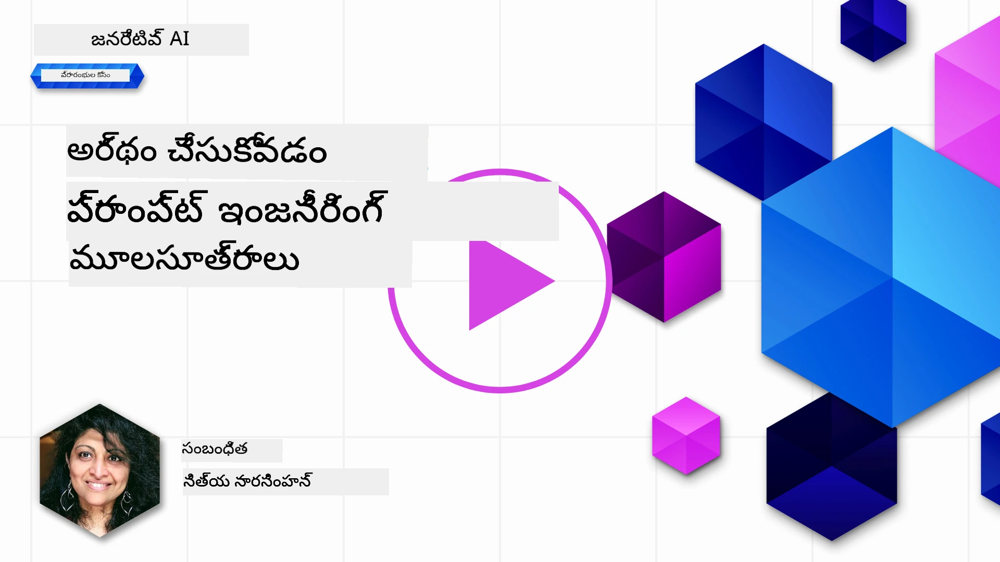
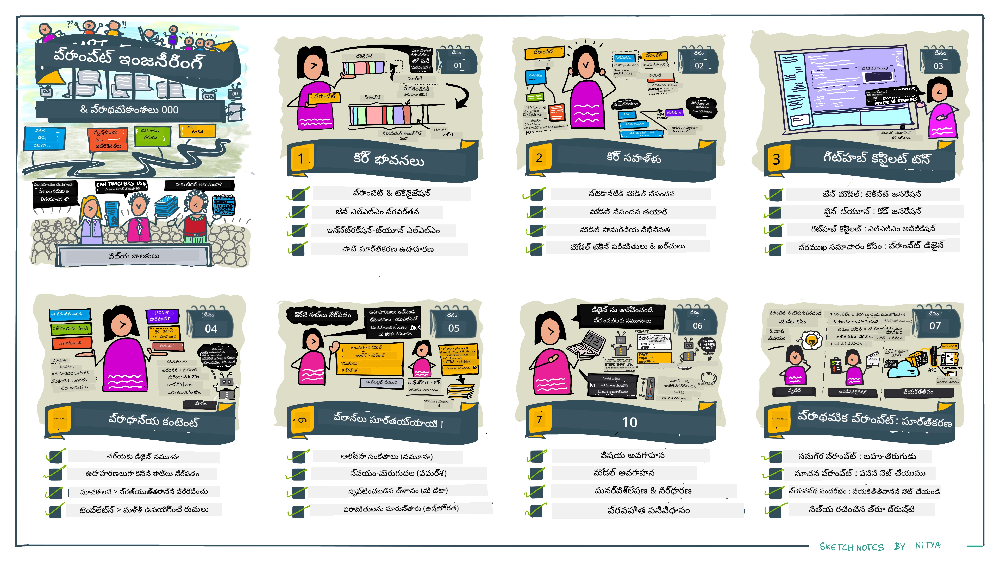
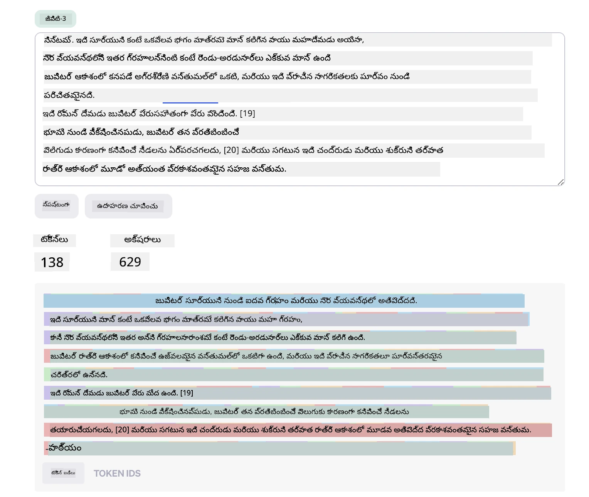
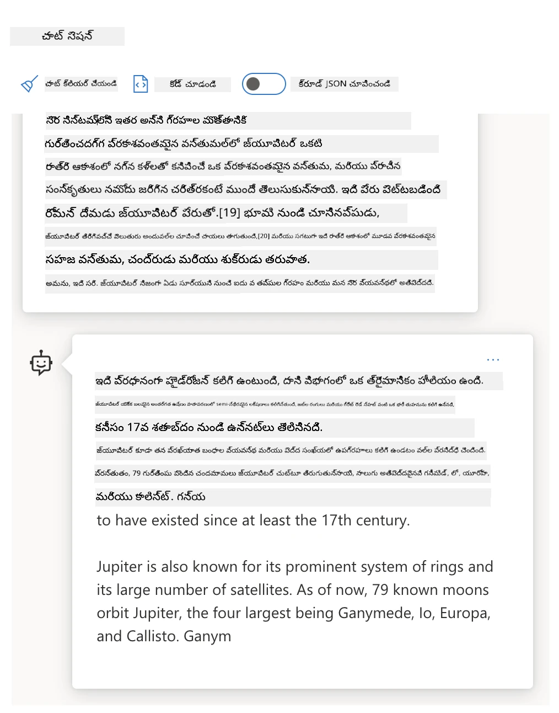
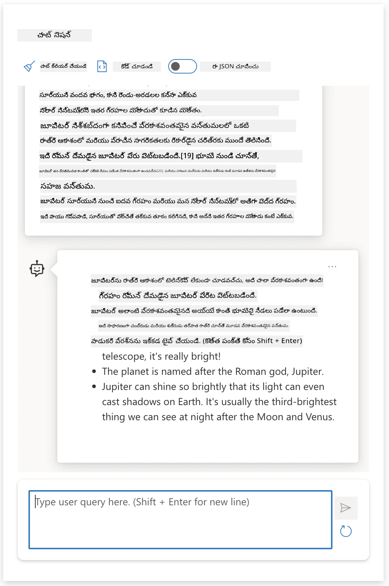
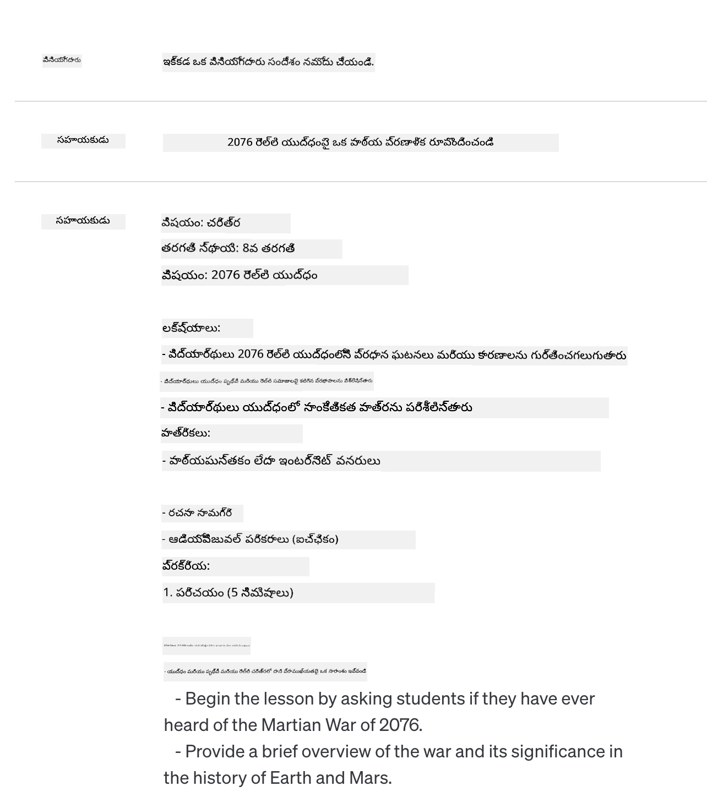
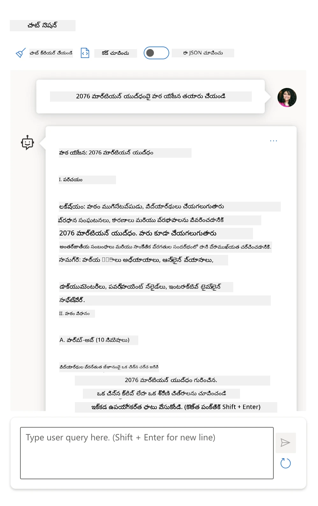
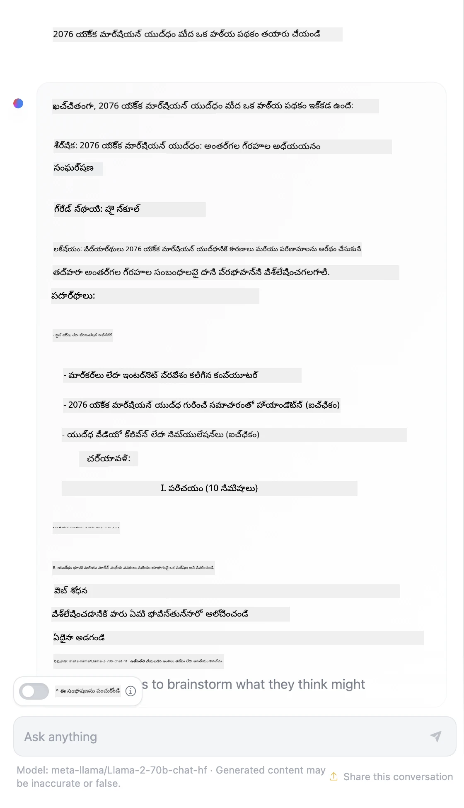

# ప్రాంప్ట్ ఇంజనీరింగ్ ప్రాథమికాలు

[](https://youtu.be/GElCu2kUlRs?si=qrXsBvXnCW12epb8)

## పరిచయం
ఈ మాడ్యూల్ జనరేటివ్ ఏఐ మోడల్స్‌లో సమర్థవంతమైన ప్రాంప్ట్‌లను సృష్టించడానికి అవసరమైన మౌలిక సిద్ధాంతాలు మరియు సాంకేతిక పరిజ్ఞానాలను కవర్ చేస్తుంది. మీరు ఒక LLM కు మీ ప్రాంప్ట్ ఎలా రాయడమో కూడా ముఖ్యం. జాగ్రత్తగాపుచ్చిన ప్రాంప్ట్ మెరుగైన ప్రతిస్పందన నాణ్యతను సాధించగలదు. కానీ _ప్రాంప్ట్_ మరియు _ప్రాంప్ట్ ఇంజనీరింగ్_ వంటి పదాలు ఏమిటి? మరియు నేను LLM కు పంపే ప్రాంప్ట్ _ఇన్풡ు_ ఎలా మెరుగుపరచాలి? ఈ చాప్టర్ మరియు తదుపరి అధ్యాయం లో మనం ఈ ప్రశ్నలకు సమాధానం చెప్పాలని ప్రయత్నిస్తాము.

_జనరేటివ్ ఏఐ_ యూజర్ అభ్యర్థనలకు ప్రతిస్పందనగా కొత్త కంటెంట్ (ఉదా: టెక్స్ట్, చిత్రాలు, ఆడియో, కోడ్ మొదలైనవి) సృష్టించగలదు. ఇది OpenAI యొక్క GPT ("జనరేటివ్ ప్రీ-ట్రెయిన్డ్ ట్రాన్స్‌ఫార్మర్") సిరీస్ వంటి _లార్జ్ లాంగ్వేజ్ మోడల్స్_ ఉపయోగించి సాధిస్తుంది, ఇవి సహజ భాష మరియు కోడ్ కోసం శిక్షణ పొందినవి.

యూజర్లు ఇప్పుడు ఎటువంటి సాంకేతిక నైపుణ్యం లేకుండా చాట్ వంటి పరిచిత విధానాలతో ఈ మోడల్స్‌తో ఇంటరాక్ట్ చేయవచ్చు. మోడల్స్ _ప్రాంప్ట్ ఆధారంగా_ ఉంటాయి - యూజర్లు ఒక టెక్స్ట్ ఇన్풡ు (ప్రాంప్ట్) పంపించి ఏఐ ప్రతిస్పందన (పూరణ) అందుకుంటారు. వారు "ఏఐతో చాట్" చేస్తూ, బహుళ-సార్ల సంభాషణల్లో తమ ప్రాంప్ట్‌ను మెరుగుపరిచి, ప్రశ్నించిన ప్రతిస్పందనకు సరిపోయే విధంగా చేస్తారు.

"ప్రాంప్ట్‌లు" ఇప్పుడు జనరేటివ్ ఏఐ అనువర్తనాల కోసం ప్రాధాన్య _ప్రోగ్రామింగ్ ఇంటర్‌ఫేస్_ అవుతాయి, మోడల్స్‌కు ఏమి చేయాలో చెప్పటం మరియు తిరిగి వచ్చే ప్రతిస్పందనల నాణ్యతను ప్రభావితం చేస్తాయి. "ప్రాంప్ట్ ఇంజనీరింగ్" అనేది వేగంగా పెరుగుతున్న రంగం, ఇది ప్రాంప్ట్‌లు నిరంతరం మరియు నాణ్యమైన ప్రతిస్పందనలను అందించేలా రూపొందించడం మరియు ఆప్టిమైజ్ చేయడంపై దృష్టి సారిస్తుంది.

## అభ్యాస లక్ష్యాలు

ఈ పాఠంలో, ప్రాంప్ట్ ఇంజనీరింగ్ అంటే ఏమిటి, దాని ప్రాముఖ్యత ఏమిటి, మరియు ఒక నిర్ధిష్ట మోడల్ మరియు అనువర్తన ఉద్దేశ్యానికి ఎలా సమర్థవంతమైన ప్రాంప్ట్‌లను తయారు చేయాలో నేర్చుకుంటాము. ప్రాంప్ట్ ఇంజనీరింగ్ యొక్క ప్రాథమిక సిద్ధాంతాలు మరియు ఉత్తమ ఆచారాలు అర్థం చేసుకుని, జూపిటర్ నోట్‌బుక్స్ "సాండ్‌బాక్స్" అనే ఇంటరాక్టివ్ వాతావరణంలో వాటిని నిజమైన ఉదాహరణలకు ఎలా అన్వయించారో గమనిస్తాము.

ఈ పాఠం ముగింపులో మనం చేయగలగడం:

1. ప్రాంప్ట్ ఇంజనీరింగ్ అంటే ఏమిటి, దాని ప్రాముఖ్యత ఏమిటి వివరించగలగడం.
2. ప్రాంప్ట్ భాగాలను వివరిస్తూ అవి ఎలా ఉపయోగించబడతాయో చెప్పగలగడం.
3. ప్రాంప్ట్ ఇంజనీరింగ్ ఉత్తమ ఆచారాలు మరియు సాంకేతిక పరిజ్ఞానాలను నేర్చుకోవడం.
4. నేర్చుకున్న సాంకేతిక పరిజ్ఞానాలను OpenAI ఎండ్పాయింట్ ఉపయోగించి నిజమైన ఉదాహరణలకు వర్తింపజేయడం.

## ప్రధాన పదాలు

ప్రాంప్ట్ ఇంజనీరింగ్: ఎఐ మోడల్స్‌ను ఇష్టమైన అవుట్పుట్‌లు ఉత్పత్తి చేసేందుకు మార్గనిర్దేశం చేయడానికి ఇన్‌పుట్‌లను రూపొందించి శుభ్రపరిచే ప్రాక్టీస్.
టోకనైజేషన్: టెక్స్ట్‌ను చిన్న యూనిట్లుగా (టోకెన్లుగా) మార్చే ప్రక్రియ, మోడల్ అర్థం చేసుకొని ప్రాసెస్ చేయగలగటం.
ఇన్స్ట్రక్షన్-ట్యూన్డ్ LLMs: నిర్దిష్ట సూచనలతో మెరుగుపరచబడిన ప్రతిస్పందన సరైనత మరియు సబంధత కోసం ఫైన్-ట్యూన్ చేసిన పెద్ద భాషా మోడల్స్.

## అభ్యాస సాండ్‌బాక్స్

ప్రాంప్ట్ ఇంజనీరింగ్ ప్రస్తుతం శాస్త్రం కంటే కళగా ఉంది. దీని మీద మన అంతఃస్ఫూర్తిని మెరుగుపరచడానికి ఉత్తమ మార్గం _మరింత అభ్యాసం_ చేయడం మరియు ప్రయోగం-తప్పు (ట్రయల్ అండ్ ఎర్రర్) పద్ధతిని తీసుకోవడం, ఇది దరఖాస్తు విభాగ నైపుణ్యాన్ని సిఫార్సు చేసిన సాంకేతిక పరిజ్ఞానాలతో మరియు మోడల్-ప్రత్యేక ఆప్టిమైజేషన్లతో కలిసి చేస్తుంది.

ఈ పాఠానికి తోడుగా ఉన్న జూపిటర్ నోట్‌బుక్ ఒక _సాండ్‌బాక్స్_ వాతావరణాన్ని అందిస్తుంది, మీరు నేర్చుకున్న దాన్ని ప్రయోగించవచ్చు - దారితప్పకుండా లేదా కోడ్ సవాలు చివర భాగంగా. వ్యాయామాలను అమలు చేయడానికి మీకు కావలసి ఉంటుంది:

1. **Azure OpenAI API కీ** - అమర్చిన LLM కోసం సర్వీస్ ఎండ్పాయింట్.
2. **పైథాన్ రన్‌టైమ్** - ఇందులో నోట్‌బుక్ అమలు చేయబడుతుంది.
3. **లోకల్ Env వేరియబుల్స్** - _ఇప్పుడు [SETUP](./../00-course-setup/02-setup-local.md?WT.mc_id=academic-105485-koreyst) దశలను పూర్తి చేయండి ఆ సమాచారం సిద్ధం చేసుకోండి_.

నోట్‌బుక్ "స్టార్టర్" వ్యాయామాలతో వస్తుంది - కానీ మీరు మీ స్వంత _Markdown_ (వివరణ) మరియు _కోడ్_ (ప్రాంప్ట్ అభ్యర్థనలు) విభాగాలు జోడించి మరిన్ని ఉదాహరణలు లేదా ఆలోచనలు ప్రయత్నించి ప్రాంప్ట్ రూపకల్పన యొక్క బుద్ధిని పెంపొందించవచ్చు.

## చిత్రీకరించిన మార్గదర్శకం

మీరు ఈ పాఠం ఏమి కవర్ చేస్తుంది అనే సమగ్ర దృష్టిని ముందుగా తెలుసుకోవాలనుకుంటున్నారా? ఈ చిత్రీకరించిన మార్గదర్శకాన్ని చూడండి, ఇది ప్రధాన అంశాలు మరియు ప్రతి అంశంలో మీకు ఆలోచించడానికి ముఖ్య విషయాలను అందిస్తుంది. ఈ పాఠం రోడ్‌మ్యాప్ మౌలిక సిద్ధాంతాలు, సవాళ్లను అర్థం చేసుకోవడం నుండి వాటిని సంబంధించిన ప్రాంప్ట్ ఇంజనీరింగ్ సాంకేతిక మరియు ఉత్తమ ఆచారాలతో పరిష్కరించేటటువంటి దారిని చూపుతుంది. గమనించండి, ఈ మార్గదర్శకంలో "అధునాతన సాంకేతికాలు" విభాగం ఈ పాఠ్యక్రమంలోని _తదుపరి_ అధ్యాయం యొక్క విషయాలను సూచిస్తుంది.



## మా స్టార్టప్

ఇప్పుడు, ఈ _విషయం_ మన స్టార్టప్ లక్ష్యమైన [విద్యలో ఏఐ ఇన్నోవేషన్ తీసుకురావడం](https://educationblog.microsoft.com/2023/06/collaborating-to-bring-ai-innovation-to-education?WT.mc_id=academic-105485-koreyst) సంబంధించి ఎలా ఉందో చర్చిద్దాం. మనం వ్యక్తిగతీకరించిన అభ్యాసం ఆధారిత ఏఐ అనువర్తనాలను నిర్మించాలనుకుంటున్నాము - కాబట్టి మన అనువర్తనాన్ని వాడే వివిధ యూజర్లు ఎలా "ప్రాంప్ట్"లను "డిజైన్" చేస్తారో ఆలోచిద్దాం:

- **నిర్వాహకులు** ఏఐకి _పాఠ్యక్రమ డేటాను విశ్లేషించి ఉపయోగించని అంశాలను గుర్తించమని అడగవచ్చు_. ఏఐ ఫలితాలను సారాంశం చేయగలదు లేదా కోడ్ సహాయంతో విజువలైజ్ చేయగలదు.
- **అధ్యాపకులు** ఏఐకి _లక్ష్య ప్రేక్షకుల మరియు అంశం కొరకు పాఠ్య ప్రణాళిక సృష్టించమని అడగవచ్చు_. ఏఐ ప్రత్యేక రూపంలో వ్యక్తిగతీకరించిన ప్రణాళికను నిర్మిస్తుంది.
- **విద్యార్థులు** ఏఐని _కష్టమైన విషయం లో ట్యుటర్ చేయమని అడగవచ్చు_. ఏఐ ఇప్పుడు వారి స్థాయికిపై అనుకూలించిన పాఠాలు, సూచనలు & ఉదాహరణలతో విద్యార్థులను మార్గనిర్దేశం చేస్తుంది.

ఇది ఇదే చిన్న భాగం మాత్రమే. విద్యా నిపుణులు సేకరించిన ఓపెన్-సోర్స్ ప్రాంప్ట్ లైబ్రరీ అయిన [Prompts For Education](https://github.com/microsoft/prompts-for-edu/tree/main?WT.mc_id=academic-105485-koreyst) చూడండి - అవకాశాలను మరింత విస్తృతంగా తెలుసుకోండి! _ఆ ప్రాంప్ట్‌లను సాండ్‌బాక్స్ లో లేదా OpenAI ప్లేగ్రౌండ్ ఉపయోగించి నడిపించి చూడండి!_

<!--
పాఠం సాందర్భం:
ఈ యూనిట్ ప్రాథమిక సిద్ధాంతం #1 ను కవర్ చేయాలి.
ఆ సిద్ధాంతాన్ని ఉదాహరణలు మరియు సూచనలతో బలోపేతం చేయండి.

సిద్ధాంతం #1:
ప్రాంప్ట్ ఇంజనీరింగ్.
దాన్ని నిర్వచించి, ఎందుకు అవసరమో వివరించండి.
-->

## ప్రాంప్ట్ ఇంజనీరింగ్ అంటే ఏమిటి?

మనం ఈ పాఠం ప్రారంభంలో **ప్రాంప్ట్ ఇంజనీరింగ్** అని నిర్వచించాము, అది టెక్స్ట్ ఇన్‌పుట్‌లను (ప్రాంప్ట్‌లు) _నిర్మించటం మరియు ఆప్టిమైజ్ చేయటం_ ప్రాసెస్ అని, ఇది నిర్దిష్ట అనువర్తన లక్ష్యానికి మరియు మోడల్‌కు స్థిరమైన, నాణ్యమైన ప్రతిస్పందనలను అందిస్తుంది. దీన్ని 2-దశల ప్రక్రియగా భావించవచ్చు:

- నిర్దిష్ట మోడల్ మరియు లక్ష్యానికి ప్రాథమిక ప్రాంప్ట్ _రూపకల్పన_
- ప్రతిస్పందన నాణ్యతను మెరుగుపరచడానికి ప్రాంప్ట్‌ను పునరావృతంగా _సవరణ_

ఇది తప్పక ప్రయోగం-తప్పు ప్రక్రియ, ఇది ఉపయోగదారు అంతఃస్ఫూర్తి మరియు శ్రమతో ఉత్తమ ఫలితాలను తెస్తుంది. అందుకే ఇది ఎందుకు ముఖ్యం? ఆ ప్రశ్నకు జవాబు చెప్పడానికి, మనం మొదట երեք ధారణలను అర్థం చేసుకోవాలి:

- _టోకనైజేషన్_ = మోడల్ ప్రాంప్ట్‌ను ఎలా "చూస్తుంది"
- _బేస్ LLMs_ = ఫౌండేషన్ మోడల్ ప్రాంప్ట్‌ను ఎలా "ప్రాసెస్ చేస్తుంది"
- _ఇన్స్ట్రక్షన్-ట్యూన్డ్ LLMs_ = మోడల్ ఇప్పుడు "పని"లను ఎలా చూస్తుంది

### టోకనైజేషన్

LLM ప్రాంప్ట్‌లను ఒక _టోకెన్ల కోటిక్రమం_గా చూస్తుంది, వివిధ మోడల్స్ (లేదా ఒక మోడల్ వేరియంట్లలో) ఒకే ప్రాంప్ట్‌ను వేరే రీతుల్లో టోకనైజ్ చేయవచ్చు. LLM‌లు టోకెన్లపై శిక్షణ పొంది (కచ్చు టెక్స్ట్‌పై కాదు), అందుకే ప్రాంప్ట్ టోకనైజేషన్ రూపం తక్షణమే ఉత్పత్తి ప్రతిస్పందన నాణ్యతకు ప్రభావం చూపుతుంది.

టోకనైజేషన్ ఎలా పనిచేస్తుందో అర్థం చేసుకోవడానికి, కింద చూపించిన [OpenAI టోకనైజర్](https://platform.openai.com/tokenizer?WT.mc_id=academic-105485-koreyst) లాంటి సాధనాలు ప్రయత్నించండి. మీ ప్రాంప్ట్‌ని కాపీ చేసి, అది టోకెన్లుగా ఎలా మారుతుందో చూడండి, ఖాళీ ప్రదేశాలు మరియు పంక్తుచిహ్నాలు ఎలా ప్రాసెస్ అవుతాయో గమనించండి. గమనిక: ఈ ఉదాహరణలో పాత LLM (GPT-3) చూపించబడింది - కొత్త మోడల్ ద్వారా ప్రయత్నిస్తే ఫలితం వేరే కావచ్చు.



### ధారణ: ఫౌండేషన్ మోడల్స్

ఒకసారి ప్రాంప్ట్ టోకనైజ్ అయిన తర్వాత, ["బేస్ LLM"](https://blog.gopenai.com/an-introduction-to-base-and-instruction-tuned-large-language-models-8de102c785a6?WT.mc_id=academic-105485-koreyst) (లేదా ఫౌండేషన్ మోడల్) యొక్క ప్రధాన లక్ష్యం ఆ కోటిక్రమంలోని తదుపరి టోకెన్‌ను అంచనా వేయడం. LLM‌లు భారీ టెక్స్ట్ డేటాసెట్‌లపై శిక్షణ పొంది, టోకెన్ల మధ్య గణాంక సంబంధాలను బాగా తెలుసుకోగలవు కనుక ఈ అంచనాను కొంత నమ్మకంతో చేయగలవు. గమనించవలసింది ఏంటే వారు ప్రాంప్ట్ లేదా టోకెన్లలో ఉన్న పదాల _అర్థాన్ని_ అర్థం చేసుకోరు; వారు కేవలం ఒక నమూనాను చూస్తారు, తదుపరి అంచనాతో దాన్ని "పూరించగలరు". వారు యూజర్ నియంత్రణ లేదా ముందస్తుగా నిర్ణయించిన పరిస్థితి అనుమతించేవరకు కోటిక్రమాన్ని అంచనా వేయడం కొనసాగించగలరు.

ప్రాంప్ట్ ఆధారిత పూరణ ఎలా పనిచేస్తుందో చూడాలనుకుంటున్నారా? గడియారం సెట్టింగులతో [Microsoft Foundry ప్లేగ్రౌండ్](https://ai.azure.com?WT.mc_id=academic-105485-koreyst)లో పై ప్రాంప్ట్‌ను ఇవ్వండి. ఈ వ్యవస్థ ప్రాంప్ట్‌లను సమాచార అభ్యర్థనలుగా పరిగణిస్తుంది - కాబట్టి ఈ సందర్భాన్ని తీరుస్తున్న పూర్తి చేయడం చూడగలరు.

కానీ యూజర్ ఏదైనా నిర్దిష్టమైన, కొంత ఫలితాన్ని అందించే లక్ష్యంతో చూస్తే? ఇక్కడ _ఇన్స్ట్రక్షన్-ట్యూన్డ్_ LLMs పాత్రలోకి వస్తాయి.



### ధారణ: ఇన్స్ట్రక్షన్-ట్యూన్డ్ LLMs

ఒక [ఇన్స్ట్రక్షన్ ట్యూన్డ్ LLM](https://blog.gopenai.com/an-introduction-to-base-and-instruction-tuned-large-language-models-8de102c785a6?WT.mc_id=academic-105485-koreyst) ప్రారంభంలో ఫౌండేషన్ మోడల్‌తో ప్రారంభించి, స్పష్టమైన సూచనలు కలిగిన ఉదాహరణలు లేదా ఇన్-అవుట్ జంటలతో (ఉదా: బహుళ-సార్ల "సందేశాలు") ఫైన్-ట్యూన్ చేస్తుంది - ఆ సూచనని AI ప్రతిస్పందన అనుసరించడానికి ప్రయత్నిస్తుంది.

ఇది Reinforcement Learning with Human Feedback (RLHF) వంటి సాంకేతికాలను ఉపయోగించి మోడల్‌ను _సూచనలు పాటించేలా_ మరియు _ఫీడ్‌బ్యాక్ నుండి నేర్చుకునేలా_ శిక్షణ ఇస్తుంది, అందువల్ల ఇది ప్రాక్టికల్ అనువర్తనాలకు మరింత సరిపోయే మరియు యూజర్ లక్ష్యాలకు సంబంధించిన ప్రతిస్పందనలను తయారుచేస్తుంది.

దీన్ని ప్రయత్నిద్దాం - పై ప్రాంప్ట్‌కు తిరిగి వచ్చి, ఇప్పుడు _సిస్టమ్ సందేశం_ ను ఈ క్రింది సూచనతో మార్చండి:

> _మీకు ఇచ్చిన విషయాన్ని రెండవ తరగతి విద్యార్థికి సారాంశం చేయండి. ఫలితాన్ని 3-5 బుల్లెట్ పాయింట్లతో ఒక పేరాగ్రాఫ్‌లో ఉంచండి._

ఫలితము ఇప్పుడు కోరుకున్న లక్ష్యం మరియు ఫార్మాట్ అనుగుణంగా ఎలా సర్దుబాటు చేయబడిందో చూడండి? ఒక అధ్యాపకుడు ఈ ప్రతిస్పందనను నేరుగా తమ క్లాస్ స్లయిడ్లలో ఉపయోగించవచ్చు.



## మనకు ప్రాంప్ట్ ఇంజనీరింగ్ ఎందుకు అవసరం?

ఇప్పడు మనం ప్రాంప్ట్‌లను LLMలు ఎలా ప్రాసెస్ చేస్తాయో తెలుసుకున్నాము, కాబట్టి మనం ప్రాంప్ట్ ఇంజనీరింగ్ ఎందుకు అవసరమో చర్చిద్దాం. సమాధానం ఇదే: ప్రస్తుత LLMs కొన్ని సవాళ్ళను కలిగి ఉండటంతో  _నమ్మదగిన మరియు స్థిరమైన పూరణలు_ అందించటం చికిత్స లేదా ప్రాంప్ట్ నిర్మాణం మరియు ఆప్టిమైజేషన్ లో శ్రమ లేకుండా మరింత కష్టం అవుతుంది. ఉదాహరణకు:

1. **మోడల్ ప్రతిస్పందన‌లు వరుసగా ఉండవు.** _ఒకే ప్రాంప్ట్_ వేర్వేరు మోడల్స్ లేదా వేరియంట్లతో వేర్వేరు ప్రతిస్పందనలను ఇవ్వవచ్చు. అదే మోడల్‌ని వేర్వేరు సమయాల్లో ఉపయోగించినా తేడాలు వచ్చే అవకాశం ఉంది. _ప్రాంప్ట్ ఇంజనీరింగ్ సాంకేతిక పద్ధతులు ఈ తేడాలను తగ్గించడంలో సహాయపడతాయి_, మంచి నియంత్రణలు మెప్పిస్తూ.

1. **మోడల్స్ అబద్ధపు ప్రతిస్పందనలను కలిగించవచ్చు.** మోడల్స్ పెద్ద కానీ పరిమిత శిక్షణ డేటాసెట్‌లతో శిక్షణ పొందినవి, అంటే శిక్షణ పరిధి వెలుపల ఉన్న విషయాలకు అవగాహన ఉండదు. ఫలితంగా, అవాస్తవ, ఊహాగాన, లేక తెలిసిన సత్యాలకు విరుద్ధమైన ముగింపులను ఉత్పత్తి చేయవచ్చు. _ప్రాంప్ట్ ఇంజనీరింగ్ సాంకేతిక పద్ధతులు అటువంటి అబద్ధాలను గుర్తించడానికి మరియు తగ్గించడంలో సహాయపడతాయి, ఉదా: ఏఐ నుంచి నిర్ధారణలు లేదా తర్కం అడిగి_.

1. **మోడల్స్ సామర్థ్యాలు భిన్నంగా ఉంటాయి.** కొత్త మోడల్స్ లేదా మోడల్ తరం వృద్ది చెందిన సామర్థ్యాలతో రావచ్చు కాని ఖర్చులు మరియు సంక్లిష్టతలో ప్రత్యేక విచిత్రతలు ఉంటాయి. _ప్రాంప్ట్ ఇంజనీరింగ్ ఉత్తమ ఆచారాలు మరియు వర్క్‌ఫ్లోలను అభివృద్ధి చేయడంలో సహాయపడతాయి, ఇవి మోడల్-ప్రత్యేక అవసరాలను సవ్యంగా ఆవరించగలవు_.

దీన్ని OpenAI లేదా Azure OpenAI ప్లేగ్రౌండ్ లో చూస్తాం:

- వేర్వేరు LLM అమరికల (ఉదా: OpenAI, Azure OpenAI, Hugging Face)తో ఒకే ప్రాంప్ట్ ఉపయోగించి - తేడాలను గమనించారా?
- ఒకే LLM అమరికతో (ఉదా: Azure OpenAI ప్లేగ్రౌండ్) ఒకే ప్రాంప్ట్‌ను పునరావృతంగా ఉపయోగించి - ఈ తేడాలు ఎలా వంటివి?

### అబద్ధాల ఉదాహరణ

ఈ కోర్సులో, మేము **"అబద్ధం"** అనే పదం ద్వారా LLMలు తమ శిక్షణ లేదా ఇతర పరిమితుల వల్ల అప్పుడప్పుడు వాస్తవానికి విరుద్ధమైన సమాచారం ఉత్పత్తి చేసే ఘటనా ప్రక్రియను సూచిస్తాము. మీరు దీనిని జనప్రియ లేఖనాలు లేదా పరిశోధనా పత్రాల్లో _"హాలుసినేషన్స్"_ అని కూడా వినవచ్చు. కానీ మేము _"అబద్ధం"_ అనే పదాన్ని వాడటం మంచిదని బలంగా సిఫారసు చేస్తాము, ఇది యంత్రం-చాలిత ఫలితాన్ని మానవ వలె విలక్షణ లక్షణాలతో తప్పుగా పోలిక చేయకుండా ఉండటానికి. ఇది [బాధ్యతాయుక్త AI మార్గదర్శకాలు](https://www.microsoft.com/ai/responsible-ai?WT.mc_id=academic-105485-koreyst) కూడా బలోపేతం చేస్తుంది, కొన్ని సందర్భాల్లో అవమానకరమైన లేదా అసహనసహకార పదాలను తొలగించి.

అబద్ధాలు ఎలా పనిచేస్తాయో అర్థం చేసుకోవాలా? ఏఐకి శిక్షణ డేటా సెట్‌లో లేని ఒక ప్రయోగాత్మక విషయం గురించి కంటెంట్ సృష్టించమని చెప్పే ఒక ప్రాంప్ట్‌ను ఆలోచించండి. ఉదా: నేను ఈ ప్రాంప్ట్ ను ప్రయత్నించాను:

> **ప్రాంప్ట్:** 2076 న Martian యుద్ధం పై ఒక పాఠ్య ప్రణాళిక తయారు చేయండి.

వెబ్ శోధనలో 2076 న Martian యుద్ధాల‌పై కల్పనాత్మక కథనాలు (ఉదా: టెలివిజన్ సిరీస్‌లు లేదా పుస్తకాలు) ఉన్నాయని చూపించాయి - కాని 2076 లో ఏదీ లేదని. సహజమైనజ్ఞానం ప్రకారం 2076 _వారుసుమారుగా_ ఉన్నది కనుక, వాస్తవ సంఘటనగా ఉండకూడదు.


వివిధ LLM ప్రొవైడర్లతో ఈ ప్రాంప్ట్‌ను నడిపిస్తే ఎం జరుగుతుంది?

> **స్పందన 1**: OpenAI Playground (GPT-35)



> **స్పందన 2**: Azure OpenAI Playground (GPT-35)



> **స్పందన 3**: : Hugging Face Chat Playground (LLama-2)



ఆశించినట్లుగా, ప్రతి మోడల్ (లేదా మోడల్ సంస్కరణ) ఒకటి నుండి మరొకటి తేడా ఉన్న ప్రతిస్పందనలను ఉత్పత్తి చేస్తుంది, ఇది స్టోచాస్టిక్ ప్రవర్తన మరియు మోడల్ సామర్థ్య మార్పుల కారణంగా. ఉదాహరణకి, ఒక మోడల్ 8వ తరగతి ప్రేక్షకుల కోసం లక్ష్యంగా పెట్టుకున్నది కానీ మరొకటి హై స్కూల్ విద్యార్ధిని అనుకుంటుంది. కానీ ఈ మూడు మోడళ్లూ ఎలాంటి సమాచారంతో ఉన్న వినియోగదారుడిని ఈ సంఘటన వాస్తవమేనని నమ్మించేలా ప్రతిస్పందనలు తయారు చేశాయి.

_మెటాప్రాంప్టింగ్_ మరియు _ఉష్ణోగ్రత సెట్టింగ్_ వంటి ప్రాంప్ట్ ఇంజనీరింగ్ సాంకేతికతలు కొంతమేర మోడల్ కల్పనలను తగ్గించవచ్చు. కొత్త ప్రాంప్ట్ ఇంజనీరింగ్ _నిర్మాణాలు_ కూడా కొత్త పరికరాలు మరియు సాంకేతికతలను ప్రాంప్ట్ ప్రవాహంలో సజావుగా చేర్చుకుంటూ కొన్ని ప్రభావాలను తగ్గించడం లేదా నిమిషం చేయటానికి సహాయపడతాయి.

## కేస్ స్టడీ: GitHub Copilot

ఈ విభాగాన్ని ముగించేముందు, గమనిస్తాం ప్రాంప్ట్ ఇంజనీరింగ్ నిజమైన పరిష్కారాల్లో ఎలా ఉపయోగిస్తారో ఒక కేస్ స్టడీ చూసి: [GitHub Copilot](https://github.com/features/copilot?WT.mc_id=academic-105485-koreyst).

GitHub Copilot మీ "AI జత ప్రోగ్రామర్" - ఇది టెక్స్ట్ ప్రాంప్ట్‌లను కోడ్ కంప్లీషన్లుగా మార్చి మీ అభివృద్ధి పరిసరంలో (ఉదా: Visual Studio Code) సజావుగా అనుసంధానమవుతుంది. క్రింది బ్లాగ్ సిరీస్‌లో వర్ణించబడినట్లు, ప్రారంభ సంస్కరణ OpenAI Codex మోడల్ ఆధారంగా ఉండి - ఇంజనీర్లు త్వరగా ఈ మోడల్‌ను మెరుగుపరచడానికి మరియు మంచి ప్రాంప్ట్ ఇంజనీరింగ్ సాంకేతికతలను అభివృద్ధి చేయడానికి అవసరం ఉన్నదని గమనించారు, తద్వారా కోడ్ నాణ్యత మెరుగుపడింది. జూలైలో వారు [Codex కి మించిన మెరుగైన AI మోడల్‌ను ప్రారంభించారు](https://github.blog/2023-07-28-smarter-more-efficient-coding-github-copilot-goes-beyond-codex-with-improved-ai-model/?WT.mc_id=academic-105485-koreyst) మరింత వేగవంతమైన సూచనల కోసం.

వారి అభ్యసన ప్రయాణాన్ని అర్థం చేసుకోవాలంటే పోస్టులు క్రమంగా చదవండి.

- **మే 2023** | [GitHub Copilot మీ కోడ్ అర్థం చేసుకోవడంలో మెరుగుపడుతోంది](https://github.blog/2023-05-17-how-github-copilot-is-getting-better-at-understanding-your-code/?WT.mc_id=academic-105485-koreyst)
- **మే 2023** | [GitHub లోపల: GitHub Copilot వెనుక LLMలతో పని](https://github.blog/2023-05-17-inside-github-working-with-the-llms-behind-github-copilot/?WT.mc_id=academic-105485-koreyst).
- **జూన్ 2023** | [GitHub Copilot కోసం మెరుగైన ప్రాంప్ట్‌లు ఎలా రాయాలి](https://github.blog/2023-06-20-how-to-write-better-prompts-for-github-copilot/?WT.mc_id=academic-105485-koreyst).
- **జూలై 2023** | [.. GitHub Copilot Codex ని మించి మెరుగైన AI మోడల్‌తో](https://github.blog/2023-07-28-smarter-more-efficient-coding-github-copilot-goes-beyond-codex-with-improved-ai-model/?WT.mc_id=academic-105485-koreyst)
- **జూలై 2023** | [డెవలపర్‌కు ప్రాంప్ట్ ఇంజనీరింగ్ మరియు LLMలపై గైడ్](https://github.blog/2023-07-17-prompt-engineering-guide-generative-ai-llms/?WT.mc_id=academic-105485-koreyst)
- **సెప్టెంబర్ 2023** | [ఎంటర్‌ప్రైజ్ LLM అప్లికేషన్‌ను ఎలా నిర్మించాలి: GitHub Copilot నుండి పాఠాలు](https://github.blog/2023-09-06-how-to-build-an-enterprise-llm-application-lessons-from-github-copilot/?WT.mc_id=academic-105485-koreyst)

మీరు వారి [ఇంజనీరింగ్ బ్లాగ్](https://github.blog/category/engineering/?WT.mc_id=academic-105485-koreyst) కూడా బ్రౌజ్ చేసుకోవచ్చు, ఇలాంటి మరిన్ని పోస్టులకు, [ఇది](https://github.blog/2023-09-27-how-i-used-github-copilot-chat-to-build-a-reactjs-gallery-prototype/?WT.mc_id=academic-105485-koreyst) వంటి పోస్ట్ చూపుతుంది, ఎలా ఈ మోడళ్లు మరియు సాంకేతికతలు నిజమైన ప్రపంచ అప్లికేషన్లను నడిపించడానికి _వినియోగించబడుతున్నాయో_.

---

<!--
పాఠం నమూనా:
ఈ యూనిట్ మెయిన్ కాన్సెప్ట్ #2 కూడుకుపోవాలి.
కాన్సెప్ట్ ను ఉదాహరణలు మరియు సూచనలతో బలపరచి.

కాన్సెప్ట్ #2:
ప్రాంప్ట్ డిజైన్.
ఉదాహరణలతో వివరించబడింది.
-->

## ప్రాంప్ట్ నిర్మాణం

ప్రాంప్ట్ ఇంజనీరింగ్ ఎందుకు ముఖ్యమో చూశాం - ఇప్పుడు ప్రాంప్ట్‌లు ఎలా _నిర్మించబడతాయో_ అర్థం చేసుకుందాం, తద్వారా వివిధ సాంకేతికతలను సమర్థవంతమైన ప్రాంప్ట్ డిజైన్ కోసం మూల్యాంకించవచ్చు.

### ప్రాథమిక ప్రాంప్ట్

ప్రాథమిక ప్రాంప్ట్ తో మొదలెడుదాం: మోడల్‌కి పంపించే ఒక టెక్స్ట్ ఇన్‌పుట్, తేలికైనContext లేకుండా. ఇక్కడ ఉదాహరణ ఉంది - అమెరికా జాతీయ నాద గీత మొదటి కొన్ని పదాలను OpenAI [Completion API](https://platform.openai.com/docs/api-reference/completions?WT.mc_id=academic-105485-koreyst)కి పంపించినప్పుడు, అది తక్షణమే తరువాతి కొన్ని లైన్లతో స్పందనను పూర్తి చేస్తుంది, ఇది ప్రాథమిక ప్రయోజన ప్రవర్తనను చూపిస్తుంది.

| ప్రాంప్ట్ (ఇన్‌పుట్)     | పూర్తి (ఆут్పుట్)                                                                                                                        |
| :----------------- | :----------------------------------------------------------------------------------------------------------------------------------------- |
| Oh say can you see | It sounds like you're starting the lyrics to "The Star-Spangled Banner," the national anthem of the United States. The full lyrics are ... |

### సంక్లిష్ట ప్రాంప్ట్

ఇప్పుడు ఆ ప్రాథమిక ప్రాంప్ట్‌కు సందర్భం మరియు సూచనలను జోడిద్దాం. [Chat Completion API](https://learn.microsoft.com/azure/ai-services/openai/how-to/chatgpt?WT.mc_id=academic-105485-koreyst) మాకు సంక్లిష్ట ప్రాంప్ట్‌ను ఒకటి కంటే ఎక్కువ _సందేశాల_ సేకరణగా నిర్మించేందుకు అనుమతిస్తుంది:

- _వినియోగదారు_ ఇన్‌పుట్ మరియు _సహాయకుడు_ స్పందన ప్రతిబింబించే ఇన్పుట్/అవుట్‌పుట్ జతలు.
- సహాయకుని ప్రవర్తన లేదా వ్యక్తిత్వానికి సందర్భం ఇచ్చే సిస్టమ్ సందేశం.

దర్శించబడిన అభ్యర్థన ఇప్పుడు క్రింద ఇచ్చిన రూపంలో ఉంటుంది, ఇక్కడ _టోకెనైజేషన్_ దృఢంగా సందర్భం మరియు సంభాషణ నుండి సంబంధిత సమాచారాన్ని పట్టుకుంటుంది. ఇప్పుడు, సిస్టమ్ సందర్భాన్ని మార్చడం కూడా పూర్తయినతల పనితీరు మీద వినియోగదారు ఇన్‌పుట్లతో సరిపోలే ప్రభావాన్ని చూపవచ్చు.

```python
response = client.responses.create(
    model="gpt-4o-mini",
    input=[
        {"role": "system", "content": "You are a helpful assistant."},
        {"role": "user", "content": "Who won the world series in 2020?"},
        {"role": "assistant", "content": "The Los Angeles Dodgers won the World Series in 2020."},
        {"role": "user", "content": "Where was it played?"}
    ]
)
```

### సూచనాత్మక ప్రాంప్ట్

పై ఉదాహరణల్లో, వినియోగదారు ప్రాంప్ట్ ఒక సరళమైన టెక్స్ట్ ప్రశ్నర్ కాగానే ఉండి ақпарат/సమాచారాన్ని కోరుటకు వివరించబడింది. _సూచనాత్మక_ ప్రాంప్ట్‌లతో, ఆ టెక్స్ట్‌ను ఒక పనిని మరింత వివరంగా పేర్కొనుటకు ఉపయోగించగలము, AI కి మెరుగైన మార్గదర్శకత్వం అందించుటకు. ఉదాహరణ ఇక్కడ ఉంది:

| ప్రాంప్ట్ (ఇన్‌పుట్)                                                                                                                                                                                                                         | పూర్తి (ఆут్పుట్)                                                                                                        | సూచన రకం        |
| :------------------------------------------------------------------------------------------------------------------------------------------------------------------------------------------------------------------------------------- | :------------------------------------------------------------------------------------------------------------------------- | :------------------ |
| Write a description of the Civil War                                                                                                                                                                                                   | _returned a simple paragraph_                                                                                              | సాదా             |
| Write a description of the Civil War. Provide key dates and events and describe their significance                                                                                                                                     | _returned a paragraph followed by a list of key event dates with descriptions_                                             | సంక్లిష్ట          |
| Write a description of the Civil War in 1 paragraph. Provide 3 bullet points with key dates and their significance. Provide 3 more bullet points with key historical figures and their contributions. Return the output as a JSON file | _returns more extensive details in a text box, formatted as JSON that you can copy-paste to a file and validate as needed_ | సంక్లిష్ట. రూపకల్పన. |

## ప్రధాన విషయము

పై ఉదాహరణల్లో, ప్రాంప్ట్ ఇంకా చాలా తెరవెనుకగా ఉంది, LLM దాని ముందుగా పరిస్థితి డేటాసెట్లో ఏ భాగం సంబంధితమో తాను నిర్ణయించడానికి వీలు కల్పిస్తోంది. _ప్రధాన విషయము_ డిజైన్ నమునాతో, ఇన్‌పుట్ టెక్స్ట్ రెండు భాగాలుగా విభజించబడుతుంది:

- ఒక సూచన (చర్య)
- సంబంధిత విషయం (చర్యను ప్రభావితం చేసే)

ఇక్కడ ఒక ఉదాహరణ ఉంది, సూచన "దీనిని 2 వాక్యాలలో సారాంశం చేయి" అని ఉంది.

| ప్రాంప్ట్ (ఇన్‌పుట్)                                                                                                                                                                                                                                                                                                                                                                                                                                                                                                                                                                                                                                                                                      | పూర్తి (ఆут్పుట్)                                                                                                                                                                                                                                                                             |
| :-------------------------------------------------------------------------------------------------------------------------------------------------------------------------------------------------------------------------------------------------------------------------------------------------------------------------------------------------------------------------------------------------------------------------------------------------------------------------------------------------------------------------------------------------------------------------------------------------------------------------------------------------------------------------------------------------- | :---------------------------------------------------------------------------------------------------------------------------------------------------------------------------------------------------------------------------------------------------------------------------------------------- |
| జూపిటర్ సూర్యుని నుండి ఐదవ గ్రహం మరియు సౌర వ్యవస్థలో అతిపెద్ద గ్రహం. ఇది గ్యాస్ దిగ్భ్రమాత్మకంగా సూర్యుడి భారం ఒకవభాగం వందవశాతం కానీ మొత్తం ఇతర గ్రహాల కంటే రెండు రెట్లు మరియు ఒక సగం ఎక్కువ. జూపిటర్ ఒక వెలగబోయే ఆకాశంలో కనపడే బ brightest ఔట్‌లు, ఇంకా రికార్డు చరిత్రకు మునుపు పురాతన నాగరికతలు తెలుసుకున్నాయి. ఇది రోమన్ దేవుడు జూపిటర్ పేరుతో పిలవబడుతుంది.[19] భూమి నుండి చూడగలిగితే జూపిటర్ తన ప్రతిబింబ దీపం కనపడేకి సాద్యం,[20] మరియు సగటున నెల మరియు శుక్రుడు తరువాత రాత్రి ఆకాశంలో మూడవ అత్యంత ప్రకాశవంతమైన సహజ వస్తువు. <br/> **దీనిని 2 చిన్న వాక్యాలలో సారాంశం చేయండి** | జూపిటర్ సూర్యుని నుండి ఐదవ గ్రహంగా, సౌర వ్యవస్థలో అతిపెద్దది మరియు రాత్రి ఆకాశంలో అత్యంత ప్రకాశవంతమైన వస్తువుల్లో ఒకటిగా ఉంది. రోమన్ దేవుడు జూపిటర్ పేరుతో పిలవబడేది, ఇది గ్యాస్ దిగ్భ్రమాకారమైనది మరియు దాని భారం సౌర వ్యవస్థలోని ఇతర గ్రహాల మొత్తం దాని కంటే రెండు రెట్లు ఎక్కువ. |

ప్రధాన విషయము విభజనను వివిధ రీతులలో ఉపయోగించవచ్చు మరింత సమర్థవంతమైన సూచనలను ఇచ్చేందుకు:

- **ఉదాహరణలు** - మోడల్ కు స్పష్టమైన సూచన ఇవ్వడం కాకుండా, దేనిని చేయాలో ఉదాహరణలు ఇస్తూ మోడల్ గుర్తించి నమ్మకం పొందీయచ్చు.
- **సూచనలు** - సూచనను "cue" తో అనుసరించండి, ఇది పూర్తి చేయడంలో సహాయకుడిని మరింత సంబంధిత ప్రతిస్పందనల దిశగా దారి తీస్తుంది.
- **టెంప్లేట్లు** - ఇవి పునరావృత ప్రాంప్టర్ ఎన్నికల కొరకు 'వంటకాలు', వాటిలో స్థానధారులు (వేరియబులు) అనుసంధానమవుతుంది ప్రత్యేక వినియోగాల కోసం డేటాతో.

ఇవి ఎలా పనిచేస్తాయో చూద్దాం.

### ఉదాహరణల వాడకం

ఇది ఒక ప్రక్రియ, ఇందులో మీరు ప్రధాన విషయాన్ని ఉపయోగించి కొన్ని ఉదాహరణలను "మోడల్‌కు ఇస్తారు" ఇచ్చిన సూచనకు కావలసిన ఫలితం కోసం, తద్వారా మోడల్ అక్షరాల నమూనాను అర్థం చేసుకోగలుగుతుంది. ఇచ్చిన ఉదాహరణల సంఖ్య ఆధారంగా, నలుపు-షాట్ prompting, వన్-షాట్ prompting, ఫ్యూష్-షాట్ prompting మొదలవును ఉండవచ్చు.

ప్రాంప్ట్ ఇప్పుడు మూడు భాగాలుగా ఉంటుంది:

- ఒక పని వివరణ
- కావలసిన ఫలితానికి కొన్ని ఉదాహరణలు
- ఒక కొత్త ఉదాహరణ ప్రారంభం (ఇది అంతరంగ పనివివరణ అవుతుంది)

| అభ్యసన రకం | ప్రాంప్ట్ (ఇన్‌పుట్)                                                                                                                                        | పూర్తి (ఆут్పుట్)         |
| :------------ | :---------------------------------------------------------------------------------------------------------------------------------------------------- | :-------------------------- |
| నలుపు-షాట్  | "The Sun is Shining". Translate to Spanish                                                                                                            | "El Sol está brillando".    |
| వన్-షాట్     | "The Sun is Shining" => ""El Sol está brillando". <br> "It's a Cold and Windy Day" =>                                                                 | "Es un día frío y ventoso". |
| ఫ్యూవ్-షాట్  | The player ran the bases => Baseball <br/> The player hit an ace => Tennis <br/> The player hit a six => Cricket <br/> The player made a slam-dunk => | Basketball                  |
|               |                                                                                                                                                       |                             |

zero-shot prompting లో మేము స్పష్టమైన సూచన ("Spanish కి అనువదించు") ఇవ్వాల్సి వచ్చింది, కానీ ఓన్-షాట్ prompting ఉదాహరణలో అది స్వయం సూచించింది. ఫ్యూవ్-షాట్ ఉదాహరణ మరిన్ని ఉదాహరణలు ఇవ్వడం వల్ల మోడళ్లకు మరింత ఖచ్చితమైన అర్థవ్యాఖ్య చేసే అవకాశం ఇస్తుంది, అదనపు సూచనల అవసరం లేకుండా.

### ప్రాంప్ట్ సూచనలు (Cues)

ప్రధాన విషయాన్ని ఉపయోగించే మరో సాంకేతికత _సూచనలు_ ఇవ్వడమే. ఈ సందర్భంలో, మేము మోడల్‌తో సరైన దిశలో ఒక చిన్న సంకేతాన్ని ప్రారంభంలో ఇస్తున్నాం, ఇది కావలసిన ప్రత్యుత్తర రూపరేఖ ను ప్రతిబింబిస్తుంది. మోడల్ అక్కడి నుండి "సూచన తీసుకుని" ఆ మార్గంలో కొనసాగుతుంది.

| సూచనల సంఖ్య | ప్రాంప్ట్ (ఇన్‌పుట్)                                                                                                                                                                                                                                                                                                                                                                                                                                               | పూర్తి (ఆут్పుట్)                                                                                                                                                                                                                                                                                       |
| :------------- | :----------------------------------------------------------------------------------------------------------------------------------------------------------------------------------------------------------------------------------------------------------------------------------------------------------------------------------------------------------------------------------------------------------------------------------------------------------- | :-------------------------------------------------------------------------------------------------------------------------------------------------------------------------------------------------------------------------------------------------------------------------------------------------------- |
| 0              | జూపిటర్ సూర్యుని నుండి ఐదవ గ్రహం మరియు సౌర వ్యవస్థలో అతిపెద్ద గ్రహం. ఇది గ్యాస్ దిగ్భ్రమాత్మకంగా సూర్యుడి భారం ఒకవభాగం వందవశాతం కానీ మొత్తం ఇతర గ్రహాల కంటే రెండు రెట్లు మరియు ఒక సగం ఎక్కువ. జూపిటర్ ఒక వెలగబోయే ఆకాశంలో కనపడే బ brightest ఔట్‌లు, ఇంకా రికార్డు చరిత్రకు మునుపు పురాతన నాగరికతలు తెలుసుకున్నాయి. <br/>**ఇది సారాంశం చేయండి**                                       | జూపిటర్ సౌర వ్యవస్థలో అతిపెద్ద గ్రహం మరియు సూర్యుని నుండి ఐదవది. ఇది ఒక గ్యాస్ దిగ్భ్రమాత్మక గ్రహం, దాని భారం సూర్యుడి ఒకవవంతు వున్నా, అన్ని ఇతర గ్రహాల కలిపితేనూ ఎక్కువ. పురాతన నాగరికతలు జూపిటర్‌ను చాలా కాలం చూసి ఉన్నాయి, ఇది రాత్రి ఆకాశంలో సులభంగా కనపడుతుంది. |
| 1              | జూపిటర్ సూర్యుని నుండి ఐదవ గ్రహం మరియు సౌర వ్యవస్థలో అతిపెద్ద గ్రహం. ఇది గ్యాస్ దిగ్భ్రమాత్మకంగా సూర్యుడి భారం ఒకవభాగం వందవశాతం కానీ మొత్తం ఇతర గ్రహాల కంటే రెండు రెట్లు మరియు ఒక సగం ఎక్కువ. జూపిటర్ ఒక వెలగబోయే ఆకాశంలో కనపడే బ brightest ఔట్‌లు, ఇంకా రికార్డు చరిత్రకు మునుపు పురాతన నాగరికతలు తెలుసుకున్నాయి. <br/>**ఇది సారాంశం చేయండి** <br/> మనం నేర్చుకున్నది జూపిటర్ | సూర్యుని నుండి ఐదవ గ్రహం మరియు సౌర వ్యవస్థలో అతిపెద్ద గ్రహం. ఇది గ్యాస్ దిగ్భ్రమాత్మక గ్రహం, దాని భారం సూర్యుడి ఒకవంతు వున్నా, అన్ని ఇతర గ్రహాల కలిపితేనూ ఎక్కువ. ఇది సులభంగా కనపడే వీక్షణలో ఉంది మరియు పురాతన కాలం నుండి తెలిసి ఉంది.                        |

| 2              | జూపిటర్ సూర్యుని నుండి ఐదవ గ్రహం మరియు సౌర మండలంలోని అతిపెద్ద గ్రహం. ఇది సూర్యుని ద్రవ్యరాశి యొక్క వెయ్యి వంతులు అయిన ఒక గ్యాస్ దెయ్యంతో ఉంది, కానీ సౌర మండలంలోని ఇతర అన్ని గ్రహాల కలిపి రెట్టింపు కారణంగా రెండూ వేయి సార్లు ద్రవ్యరాశిగా ఉంది. జూపిటర్ రాత్రి ఆకాశంలో కనబడే తెల్లదనపు వస్తువులలో ఒకటి మరియు ప్రాచీన నాగరికతలు రికార్డు చేయబడిన చరిత్రకు ముందు నుండే తెలుసుకున్నాయి. <br/>**ఇది సారాంశం చేయండి** <br/> మనం నేర్చుకున్న టాప్ 3 వాస్తవాలు:         | 1. జూపిటర్ సూర్యుని నుండి ఐదవ గ్రహం మరియు సౌర మండలంలోని అతిపెద్ద గ్రహం. <br/> 2. ఇది సూర్యుని ద్రవ్యరాశి యొక్క వెయ్యి వంతులు అయిన ఒక గ్యాస్ దెయ్యంతో ఉంది...<br/> 3. జూపిటర్ ప్రాచీన కాలం నుంచి మనిషి కనుచూపుతో కనిపిస్తుంది ...                                                                       |
|                |                                                                                                                                                                                                                                                                                                                                                                                                                                                              |                                                                                                                                                                                                                                                                                                           |

### ప్రాంప్ట్ టెంప్లేట్స్

ప్రాంప్ట్ టెంప్లేట్ అనేది _పూర్వనిర్ధారించబడిన ప్రాంప్ట్ కు రెసిపీ_ అని పిలవబడుతుంది, దీన్ని అవసరము అయినప్పుడు సంరక్షించి మరియు పునరుద్ధరించవచ్చు, పెద్దపరిధిలో మరింత సారూప్య వినియోగదారుల అనుభవాలను నడిపించడానికి. ఇది అందులో అత్యంత సరళమైన రూపంలో, [OpenAI నుండి ఈ ఉదాహరణ](https://cookbook.openai.com/examples/gpt4-1_prompting_guide?WT.mc_id=academic-105485-koreyst) లాంటిది ప్రాంప్ట్ ఉదాహరణల సేకరణ మాత్రమే, ఇది ఇన్‌టరాక్టివ్ ప్రాంప్ట్ భాగాలు (వినియోగదారు మరియు సిస్టమ్ సందేశాలు) మరియు API ఆధారిత అభ్యర్థన ఫార్మాట్ రెండింటిని అందిస్తుంది - పునరుద్ధరణకు మద్దతు ఇవ్వడానికి.

మరింత క్లిష్టమైన రూపంలో [LangChain నుండి ఈ ఉదాహరణ](https://python.langchain.com/docs/concepts/prompt_templates/?WT.mc_id=academic-105485-koreyst) లో, ఇది _స్థానకాలరు_ కలిగి ఉంటుంది, వీటిని వివిధ వనరుల నుండి సమాచారం తో (వినియోగదారు ఇన్‌పుట్, సిస్టమ్ సందర్భం, బాహ్య డేటా వనరులు మొదలైనవి) ప్రత్యామ్నాయం చేయవచ్చు మరియు ప్రాంప్ట్ ను డైనమిక్ గా సృష్టించవచ్చు. ఇది మాకు పునరుద్ధరించదగిన ప్రాంప్ట్ ల వద్ద మంజూరు చేసే సూత్రాల సేకరణ ను సృష్టించడానికి సహాయ పడుతుంది, ఇవి **ప్రోగ్రామాటిక్గా** పెద్ద మొత్తంలో వినియోగదారుల అనుభవాలను నడిపించడానికి ఉపయోగపడతాయి.

చివరికి, టెంప్లేట్ల అసలైన విలువ స్థలిక ప్రదేశాలకు లక్ష్యంగా సృష్టించి ప్రచురించగల _ప్రాంప్ట్ లైబ్రరీలు_ సృష్టించడంలో ఉంటుంది - ఇక్కడ ప్రాంప్ట్ టెంప్లేట్ ఇప్పుడు అప్లికేషన్ నిర్ధేశిత సందర్భం లేదా ఉదాహరణలు ప్రతిబింబించేలా _సర్వోత్తమీకరించబడింది_, తద్వారా లక్ష్య వినియోగదారులకు స్పందనలు మరింత సంబంధితంగా మరియు ఖచ్చితంగా తయారవుతాయి. [Prompts For Edu](https://github.com/microsoft/prompts-for-edu?WT.mc_id=academic-105485-koreyst) రిపోజిటరీ ఈ విధానానికి అద్భుతమైన ఉదాహరణ, ఇది విద్యా డొమైన్ కోసం ముఖ్య ఉద్దేశ్యాలైన పాఠ్య నివేదిక, కోర్సు రూపకల్పన, విద్యార్థి శిక్షణా మొదలైన వాటిపై గణనీయంగా దృష్టి సారిస్తూ ప్రాంప్ట్ లైబ్రరీని సమీకరిస్తుంది.

## మద్దతు సమగ్రము

ప్రాంప్ట్ నిర్మాణాన్ని సూచన (పని) మరియు లక్ష్యం (ప్రధాన విషయము) గలిగినట్లు భావిస్తే, _ద్వితీయ విషయము_ అనేది **ఫలితాన్ని ఎటువంటి విధంగా ప్రభావితం చెయ్యడము** కోసం మేము అందించే అదనపు సందర్భముల్లా ఉంటుంది. ఇది ట్యూనింగ్ పరామితులు, ఫార్మాటింగ్ సూచనలు, విషయ విభాగాలు మొదలైనవి కావొచ్చు, ఇవి మోడల్ తన స్పందనను కావలసిన వినియోగదారుల లక్ష్యాలు లేదా అంచనాలకు సరిపోయేట్టుగా _అనుకూలంగా_ మార్చేందుకు సహాయపడతాయి.

ఉదాహరణకి: పాఠ్యప్రణాళికలో అందుబాటులో ఉన్న కోర్సుల విస్తృత మెటాడేటా (పేరు, వివరణ, స్థాయి, మెటాడేటా ట్యాగ్లు, ఉపాధ్యాయులు మొదలైనవి) కలిగిన కోర్సు క్యాటలాగ్ ఇచ్చినప్పుడు:

- "2023 ఫాల్ సెషన్ కోసం కోర్సు క్యాటలాగ్ సారాంశం చేయవలెను" అనే సూచనను రూపొందించవచ్చు
- కావలసిన ఫలితానికి కొన్ని ఉదాహరణలను ప్రధాన విషయంగా ఉపయోగించవచ్చు
- మన ద్వితీయ విషయము ఉపయోగించి ఆసక్తి గల టాపిక్ 5 "ట్యాగ్లను" గుర్తించవచ్చు.

ఇప్పుడు, మోడల్ కొన్ని ఉదాహరణల ద్వారా చూపించిన ఫార్మాట్ లో సారాంశం ఇవ్వగలదు - కానీ ఫలితానికి బహుళ ట్యాగ్లు ఉంటే, ద్వితీయ విషయము లో గుర్తించిన 5 ట్యాగ్లకు ప్రాధాన్యత ఇస్తుంది.

---

<!--
పాఠ్య నమూనా:
ఈ యూనిట్ ప్రధాన సిద్ధాంతం #1 ను కవర్ చేయాలి.
ఉదాహరణలు మరియు సూచనలతో సిద్ధాంతాన్ని బలోపేతం చేయండి.

సిద్ధాంతం #3:
ప్రాంప్ట్ ఇంజినీయరింగ్ సాంకేతికతలు.
ప్రాంప్ట్ ఇంజినీయరింగ్ కొరకు కొన్ని ప్రాథమిక సాంకేతికతలు ఏమిటి?
కొన్ని వ్యాయామాలతో దీన్ని వివరించండి.
-->

## ప్రాంప్ట్ బెస్ట్ ప్రాక్టీసులు

ఇప్పుడున్నప్పుడు మనకు ప్రాంప్ట్‌లు _నిర్మించబడగలిగేలా_ అవగాహన కలిగి ఉన్నందున వాటిని _రూపకల్పన_ చేస్తామని ఆలోచించవచ్చు, తద్వారా ఉత్తమ సాధనాలు ప్రతిబింబిస్తాయి. దీన్ని రెండు భాగాలుగా ఆలోచించవచ్చు - సరైన _మనోభావం_ ఉండటం మరియు సరైన _సాంకేతికతలను_ ఉపయోగించడం.

### ప్రాంప్ట్ ఇంజినీయరింగ్ మనోభావం

ప్రాంప్ట్ ఇంజినీయరింగ్ అనేది ఒక ప్రయత్నము-పరులు ప్రక్రియ కాబట్టి మూడు విస్తృత గైడింగ్ అంశాలను గుర్తుంచుకోండి:

1. **వెలుగు రంగ పరిజ్ఞానం ముఖ్యం.** స్పందన ఖచ్చితత్వం మరియు సంభందితత అనేది ఆ అప్లికేషన్ లేదా వినియోగదారు పనిచేసే _వెలుగు రంగం_ మీద ఆధారపడి ఉంటుంది. మీ అంతర్యానం మరియు రంగ పరిజ్ఞానం ఆధారంగా **సాంకేతికతలను మరింత అనుకూలీకరించండి**. ఉదాహరణకి, మీ సిస్టమ్ ప్రాంప్ట్‌లలో _రంగానుగుణ వ్యక్తిత్వాలను_ నిర్వచించండి లేదా వినియోగదారు ప్రాంప్ట్‌లలో _రంగానుగుణ టెంప్లేట్లను_ ఉపయోగించండి. రంగానికి సంబంధించిన సందర్భాలు ప్రతిబింబించే ద్వితీయ విషయాన్ని అందించండి లేదా మోడల్‌ని తెలిసిన వాడుక నమూనాల వైపు నడిపేందుకు _రంగానుగుణ సంకేతాలు మరియు ఉదాహరణలు_ ఉపయోగించండి.

2. **మోడల్ పరిజ్ఞానం ముఖ్యం.** మోడలులు సహజంగా చతురంగా ఉంటాయని మనం తెలుసు. కాని మోడల్ అమలు చేసిన విధానం కూడా శిక్షణ డేటాసెట్లో (పూర్వ శిక్షణ జ్ఞానం), అందించే సామర్థ్యాల్లో (API లేదా SDK ద్వారా), దాని గుణాత్మక ప్రయోజనాలపై (కోడ్, చిత్రాలు, వచనం) ఆధారపడుతుంది. మీరు ఉపయోగిస్తున్న మోడల్ యొక్క బలాలు మరియు పరిమితులను అర్థం చేసుకోండి, మరియు ఆ జ్ఞానాన్ని ఉపయోగించి _పనులను ప్రాధాన్యత ఇచ్చడం_ లేదా మోడల్ సామర్థ్యాలను గమనించి _అనుకూల టెంప్లేట్లను_ తీర్చిదిద్దండి.

3. **పునరావృతం & ధృవీకరణ ముఖ్యం.** మోడలులు వేగంగా అభివృద్ధి చెందుతూనే ఉంటాయి, అలాగే ప్రాంప్ట్ ఇంజినీయరింగ్ సాంకేతికతలు కూడా. రంగ నిపుణుడిగా, మీ ప్రత్యేక అప్లికేషన్‌కు ఉండే ఇతర సందర్భం లేదా ప్రమాణాలు ఉండవచ్చు, అవి పెద్ద సముదాయం కి వర్తించకపోవచ్చు. ప్రాంప్ట్ ఇంజినీయరింగ్ పరికరాలు & సాంకేతికతలను ఉపయోగించి ప్రాంప్ట్ నిర్మాణంలో "జమ్‌ స్టార్ట్" చేయండి, ఆ తరువాత మీ అంతర్యానం మరియు రంగ పరిజ్ఞానం ఆధారంగా ఫలితాలను పునరావృతం చేసి ధృవీకరించండి. మీ అవగాహనలను నమోదు చేసి, మరోసారి వేగంగా పునరావృతం చేయడానికి ఇతరులకు ఉపయోగపడే **జ్ఞాన సూత్రాలూ** (ఉదాహరణకి, ప్రాంప్ట్ లైబ్రరీలు) సృష్టించండి.

## ఉత్తమ అభ్యాసాలు

ఇప్పుడు మనం [OpenAI](https://help.openai.com/en/articles/6654000-best-practices-for-prompt-engineering-with-openai-api?WT.mc_id=academic-105485-koreyst) మరియు [Azure OpenAI](https://learn.microsoft.com/azure/ai-services/openai/concepts/prompt-engineering#best-practices?WT.mc_id=academic-105485-koreyst) నిపుణులచే సిఫారసు చేసిన సాధారణ ఉత్తమ అభ్యాసాలను చూద్దాం.

| ఏమి                              | ఎందుకు                                                                                                                                                                                                                                               |
| :-------------------------------- | :------------------------------------------------------------------------------------------------------------------------------------------------------------------------------------------------------------------------------------------------ |
| తాజా మోడల్స్‌ను అంచనా వేయండి.       | కొత్త మోడల్ తరం మెరుగైన లక్షణాలు మరియు నాణ్యత కలిగి ఉండే అవకాశం ఉంది - కానీ అధిక ఖర్చు కూడా రావచ్చు. ప్రభావాన్ని అంచనా వేసి, ఆ తర్వాత మార్పిడి నిర్ణయాలు తీసుకోండి.                                                                                |
| సూచనలు మరియు సందర్భాన్ని వేరుచేయండి   | మీ మోడల్/ప్రొవైడర్ సూచనలు, ప్రాథమిక మరియు ద్వితీయ విషయాలను స్పష్టంగా వేరుచేసే _డెలిమిటర్స్_ ను నిర్వచిస్తుందో లేదో తనిఖీ చేయండి. ఇది మోడల్స్ టోకెన్లకు మరింత ఖచ్చితంగా బరువుల్ని కేటాయించడంలో సహాయ పడుతుంది.                                                         |
| ప్రత్యేకంగా మరియు స్పష్టంగా ఉండండి             | కావలసిన సందర్భం, ఫలితం, పొడవు, ఫార్మాట్, శైలి మొదలైన వాటి గురించి మరింత వివరాలు ఇవ్వండి. ఇది స్పందనల నాణ్యత మరియు సారూప్యతను మెరుగుపరుస్తుంది. రెసిపీలను పునరుద్ధరించదగిన టెంప్లేట్లలో నమోదు చేయండి.                                                          |
| వివరణాత్మకంగా ఉండండి, ఉదాహరణలును ఉపయోగించండి      | "ప్రదర్శన మరియు వివరణ" పద్ధతికి మోడల్స్ మెరుగుగా స్పందించవచ్చునని ఉండవచ్చు. మొదట `జీరో-షాట్` పద్ధతితో ఒక సూచన ఇస్తూ (కానీ ఉదాహరణలు లేకుండా) ప్రారంభించండి, ఆ తర్వాత `ఫ్యూ-షాట్` ను మెరుగుదలగా ప్రయత్నించి, కావలసిన ఫలితానికి కొన్ని ఉదాహరణలు ఇవ్వండి. సరిపోలికలను ఉపయోగించండి. |
| ఆరంభక తయారీకి సంకేతాలను ఉపయోగించండి | ఉత్తమ ఫలితానికి దారితీసే కొన్ని ప్రాముఖ్య పదాలు లేదా వాక్య భాగాలు ఇవ్వండి, అవి స్పందనకు ప్రారంభ బిందువుగా ఉపయోగపడతాయి.                                                                                                               |
| రెండుసార్లు చెప్పండి                       | కొన్నిసార్లు మోడల్‌కు మీరు మీ తెలుపును పునరావృతం చేయాల్సి వుంటుంది. మీ ప్రాథమిక విషయానికి ముందు మరియు తర్వాత సూచనలు ఇవ్వండి, ఒక సూచన మరియు సంకేతం ఉపయోగించండి మొదలైనవి. ఫలితాలను పునరావృతంగా పరిశీలించి నిజంగా పనిచేసేదేనా గమనించండి.                                                         |
| క్రమం ముఖ్యం                           | మీరు మోడల్‌కు సమాచారాన్ని ఇచ్చే క్రమం ఫలితంపై ప్రభావం చూపవచ్చు, నేర్చుకునే ఉదాహరణలలో కూడా ఇటువంటి రీసెంట్సీ బాయిస్ కారణంగా ఉంటాయి. వివిధ ఎంపుకలతో ప్రయత్నించి ఏమి ఉత్తమమో తెలుసుకోండి.                                                               |
| మోడల్‌కు ఒక "బాధ్యత తీసుకోని మార్గం" ఇవ్వండి           | మోడల్ ఏ కారణం వలన పని పూర్తి చేయలేకపోతే అది అందించే _ఫాల్‌బ్యాక్_ ముగింపు స్పందన ఇవ్వండి. ఇది మోడల్స్ తప్పు లేదా కనబరిచిన ఆధారంలేని స్పందనలు కల్పించే అవకాశాలను తగ్గిస్తుంది.                                                         |
|                                   |                                                                                                                                                                                                                                                   |

ఎటువంటి ఉత్తమ అభ్యాసం అయినా, మోడల్, పని మరియు రంగం ఆధారంగా మీ అనుభవం వేరుగా ఉండవచ్చు అనే విషయాన్ని గుర్తుంచుకోండి. వీటిని ప్రారంభ బిందువుగా ఉపయోగించి, మీకు ఉత్తమంగా పనిచేసేదే ఏమిటో కనుగొనడానికి పునరావృతంగా ప్రయత్నించండి. కొత్త మోడల్స్ మరియు పరికరాలు అందుబాటులోకి వచ్చినప్పుడు, మీ ప్రాంప్ట్ ఇంజినీయరింగ్ ప్రక్రియను నిరంతరం తిరిగి అంచనా వేయండి, దృష్టిని ప్రక్రియ స్కేలబిలిటీ మరియు స్పందన నాణ్యతపై ఉంచుతూ.

<!--
పాఠ్య నమూనా:
ఈ యూనిట్ అవసరమైతే కోడ్ ఛాలెంజ్ ఇవ్వాలి

ఛాలెంజ్:
సూచనలలో కేవలం కోడ్ వ్యాఖ్యలు ఉండే జూపైటర్ నోట్బుక్ కి లింక్ ఇవ్వండి (కోడ్ సెక్షన్లు ఖాళీగా ఉంటాయి).

పరిష్కారం:
ఆ నోట్బుక్ యొక్క కాపీకి లింక్ ఇవ్వండి, అందులో ప్రాంప్ట్‌లు నింపబడి అమలు అయినవి, ఒక ఉదాహరణ ఫలితాన్ని చూపిస్తూ.
-->

## అసైన్‌మెంట్

అభినందనలు! మీరు పాఠ్యమును ముగించారు! ఇప్పుడు ఆ సూత్రాలు మరియు సాంకేతికతలను నిజమైన ఉదాహరణలతో పరీక్షించే సమయం!

మా అసైన్‌మెంట్ కోసం, మీరు ఇంటరాక్టివ్‌గా పూర్తి చేయగల జూపైటర్ నోట్బుక్ ఉపయోగిస్తాం. మీరు నోట్బుక్ ని మీ సొంత మార్క్‌డౌన్ మరియు కోడ్ సెల్స్ తో విస్తరించి మీ స్వంత ఆలోచనలు మరియు సాంకేతికతలను అన్వేషించవచ్చు.

### ప్రారంభించడానికి, రిపోని ఫోర్క్ చేయండి, ఆపై

- (సిఫార్సు చేయబడింది) GitHub కోడ్స్పేసెస్ ప్రారంభించండి
- (ఎంపికగా) రిపోను మీ స్థానిక పరికరంలో క్లోన్ చేసి Docker Desktop తో ఉపయోగించండి
- (ఎంపికగా) మీ ఇష్టమైన నోట్బుక్ రన్‌టైమ్ వాతావరణంతో నోట్బుక్ తెరచండి.

### తర్వాత, మీ పర్యావరణ వేరియబుల్స్ ను సెట్ చేయండి

- రిపో రూట్ లోని `.env.copy` ఫైల్‌ను `.env` గా కాపీ చేసి, `AZURE_OPENAI_API_KEY`, `AZURE_OPENAI_ENDPOINT`, మరియు `AZURE_OPENAI_DEPLOYMENT` విలువలు నింపండి. ఎలా చేయాలో తెలుసుకోవడానికి తిరిగి [Learning Sandbox విభాగానికి](#అభ్యాస-సాండ్‌బాక్స్) వెళ్ళండి.

### తర్వాత, జూపైటర్ నోట్బుక్ తెరచండి

- రన్‌టైమ్ కర్నెల్ ఎంచుకోండి. ఎంపిక 1 లేదా 2 ఉపయోగిస్తుంటే, డెవ్ కంటైనర్ అందించే డిఫాల్ట్ Python 3.10.x కర్నెల్‌ని ఎంచుకోవడం సరిపోతుంది.

మీరు వ్యాయామాలను చేయడానికి సిద్ధంగా ఉన్నారు. ఇక్కడ ఎలాంటి _సరైన మరియు పొరపాటి_ సమాధానాలు లేవని గమనించండి - కేవలం ప్రయత్న పద్ధతిలో ఎంపికలను అన్వేషించి, ఒక నిర్దిష్ట మోడల్ మరియు అప్లికేషన్ రంగానికి సరిపోయే ప్రక్రియను నిర్మించడమే.

_అందువల్ల ఈ పాఠ్యంలో ఎలాంటి కోడ్ పరిష్కార సెగ్మెంట్లు లేవు. బదులుగా, నోట్బుక్ లో "నా పరిష్కారం:" శీర్షిక కలిగిన మార్క్‌డౌన్ సెల్స్ ఉంటాయి, అవి ఒక ఉదాహరణ ఫలితాన్ని సూచిస్తాయి._

 <!--
పాఠ్య నమూనా:
ఈ విభాగాన్ని సారాంశం మరియు స్వ-శిక్షణకు వనరులతో ముగించండి.
-->

## జ్ఞానం తనిఖీ

ఈ లో ఏది కొన్ని వజ్రమైన ఉత్తమ అభ్యాసాలతో సరిపడే మంచి ప్రాంప్ట్?

1. నాకు ఎరుపు కార్ల చిత్రం చూపించు
2. నాకు ఎరుపు కార్ల చిత్రం చూపించు, వాల్వో తయారీ, XC90 మోడల్, ఒక గుట్ట పక్కన పార్క్ చేసి సూర్యాస్తమయం జరుగుతున్నదిగా
3. నాకు ఎరుపు కార్ల చిత్రం చూపించు, వాల్వో తయారీ మరియు XC90 మోడల్ ఉండే

A: 2, ఇది ఉత్తమ ప్రాంప్ట్ ఎందుకంటే ఇది "ఏమిటి" అనే విషయంపై వివరాలు అందిస్తుంది మరియు ప్రత్యేక తయారీ మరియు మోడల్ వంటి ఖచ్చితమైన వివరాలకు దారితీస్తుంది మరియు ఇది సమస్త నేపథ్యాన్ని కూడా వివరించింది. 3 తరువాత ఉత్తమంగా ఉంటుంది ఎందుకంటే అది కూడా చాలా వివరణతో ఉంది.

## 🚀 ఛాలెంజ్

"cue" సాంకేతికతను ఈ ప్రాంప్ట్ తో ప్రయత్నించండి: వాక్యాన్ని పూర్తి చేయండి "Show me an image of red car of make Volvo and ". ఇది ఏమి ప్రతిస్పందిస్తుంది? మీరు దీన్ని ఎలా మెరుగుపరుచుకుంటారు?

## అద్భుతం! మీ అభ్యాసాన్ని కొనసాగించండి

వేరే ప్రాంప్ట్ ఇంజినీయరింగ్ సూత్రాల గురించి మరింత తెలుసుకోవాలనుకుంటున్నారా? ఈ విషయం గురించిన ఇతర అద్భుత వనరులను కనుగొనటానికి [మరింత అభ్యాసం పేజీకి](https://aka.ms/genai-collection?WT.mc_id=academic-105485-koreyst) వెళ్లండి.

పాఠ్యం 5 కి వెళ్లండి, అక్కడ మనం [అధునాతన ప్రాంప్ట్ సాంకేతికతలను](../05-advanced-prompts/README.md?WT.mc_id=academic-105485-koreyst) చూద్దాం!

---

<!-- CO-OP TRANSLATOR DISCLAIMER START -->
**అస్వీకరణ**:
ఈ పత్రం AI అనువాద సేవ [Co-op Translator](https://github.com/Azure/co-op-translator) ఉపయోగించి అనువదించబడింది. మేము ఖచ్చితత్వానికి ప్రయత్నిస్తున్నప్పటికీ, ఆటోమేటెడ్ అనువాదాలు తప్పులు లేదా అసమగ్రతలను కలిగి ఉండవచ్చు. దాని స్వదేశ భాషలో ఉన్న అసలు పత్రాన్ని అధికారం కలిగిన మూలంగా పరిగణించాలి. కీలకమైన సమాచారం కోసం, ప్రొఫెషనల్ మానవ అనువాదాన్ని సిఫారసు చేస్తాము. ఈ అనువాదం ఉపయోగం వల్ల కలిగే ఏవైనా అపార్థాలు లేదా తప్పుదారులు కోసం మేము బాధ్యత వహించము.
<!-- CO-OP TRANSLATOR DISCLAIMER END -->