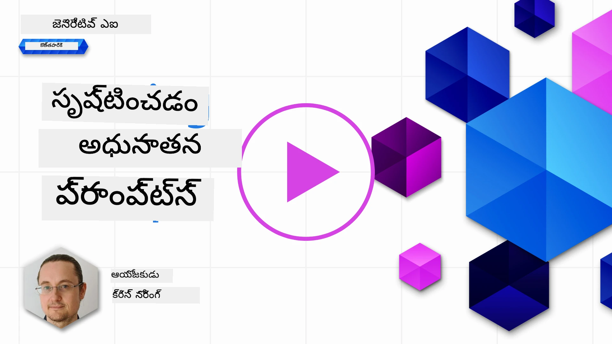

# అధునాతన ప్రాంప్ట్‌ల సృష్టి

[](https://youtu.be/BAjzkaCdRok?si=NmUIyRf7-cDgbjtt)

ముందటి అధ్యాయం నుండి కొన్ని నేర్చుకున్న విషయాలను మళ్లీ చూద్దాం:

> ప్రాంప్ట్ _ఇంజనీరింగ్_ అనేది మోడల్‌ను మరింత సంబంధిత ప్రతిస్పందనల వైపు **నిర్దేశించడానికి** ఉపయోగకరమైన సూచనలు లేదా సందర్భాన్ని అందించడం ద్వారా చేసే ప్రక్రియ.

ప్రాంప్ట్‌లు రాయడంలో రెండు దశలు ఉంటాయి: సంబంధిత సందర్భాన్ని అందించడం ద్వారా ప్రాంప్ట్‌ను నిర్మించడం, మరియు _ఆప్టిమైజేషన్_, అంటే ప్రాంప్ట్‌ను క్రమంగా మెరుగుపరచడం.

ఈ దశలో, ప్రాంప్ట్‌లు ఎలా రాయాలో మాకు కొంత ప్రాథమిక అవగాహన ఉంది, కానీ మేము మరింత లోతుగా వెళ్లాలి. ఈ అధ్యాయంలో, మీరు వివిధ ప్రాంప్ట్‌లను ప్రయత్నించడం నుండి ఒక ప్రాంప్ట్ మరొకదానికంటే ఎందుకు మెరుగైనదో అర్థం చేసుకోవడం వరకు వెళ్తారు. మీరు ఏదైనా LLMకు వర్తించగల కొన్ని ప్రాథమిక సాంకేతికతలను అనుసరించి ప్రాంప్ట్‌లను ఎలా నిర్మించాలో నేర్చుకుంటారు.

## పరిచయం

ఈ అధ్యాయంలో, మేము క్రింది విషయాలను కవర్ చేస్తాము:

- మీ ప్రాంప్ట్ ఇంజనీరింగ్ జ్ఞానాన్ని విస్తరించి, వివిధ సాంకేతికతలను మీ ప్రాంప్ట్‌లపై వర్తింపజేయడం.
- మీ ప్రాంప్ట్‌లను కాని అవుట్పుట్‌ను మార్పు చేయడానికి కాని కాన్ఫిగర్ చేయడం.

## నేర్చుకునే లక్ష్యాలు

ఈ పాఠం పూర్తి చేసిన తర్వాత, మీరు చేయగలుగుతారు:

- మీ ప్రాంప్ట్‌ల ఫలితాన్ని మెరుగుపరచే ప్రాంప్ట్ ఇంజనీరింగ్ సాంకేతికతలను వర్తింపజేయడం.
- మార్పు చెందగలిగే లేదా నిర్దిష్టమైన ప్రాంప్ట్ చేయడం.

## ప్రాంప్ట్ ఇంజనీరింగ్

ప్రాంప్ట్ ఇంజనీరింగ్ అనేది కావలసిన ఫలితాన్ని ఉత్పత్తి చేసే ప్రాంప్ట్‌లను సృష్టించే ప్రక్రియ. కేవలం టెక్స్ట్ ప్రాంప్ట్ రాయడమే కాకుండా, ప్రాంప్ట్ ఇంజనీరింగ్ అనేది ఒక ఇంజనీరింగ్ శాస్త్రం కాదు, ఇది కావలసిన ఫలితాన్ని పొందడానికి మీరు వర్తింపచేసే సాంకేతికతల సమాహారం.

### ఒక ప్రాంప్ట్ ఉదాహరణ

ఇలా ఒక ప్రాథమిక ప్రాంప్ట్ తీసుకుందాం:

> భూగోళ శాస్త్రంపై 10 ప్రశ్నలు రూపొందించండి.

ఈ ప్రాంప్ట్‌లో, మీరు వాస్తవానికి వివిధ ప్రాంప్ట్ సాంకేతికతలను వర్తింపజేస్తున్నారు.

దీనిని విడగొడదాం.

- **సందర్భం**, మీరు "భూగోళ శాస్త్రం" గురించి ఉండాలని పేర్కొంటారు.
- **ఫలితాన్ని పరిమితం చేయడం**, మీరు 10 ప్రశ్నలకంటే ఎక్కువ కావద్దని కోరుకుంటారు.

### సాదా ప్రాంప్ట్‌ల పరిమితులు

మీకు కావలసిన ఫలితం రావచ్చు లేదా రాకపోవచ్చు. మీరు మీ ప్రశ్నలు రూపొందించబడతాయని పొందుతారు, కానీ భూగోళ శాస్త్రం ఒక పెద్ద విషయం కాబట్టి మీరు కోరుకున్నది రాకపోవచ్చు, కారణాలు:

- **పెద్ద విషయం**, ఇది దేశాలు, రాజధానులు, నదులు మొదలైన వాటి గురించి ఉంటుందో తెలియదు.
- **ఫార్మాట్**, మీరు ప్రశ్నలు ఒక నిర్దిష్ట విధంగా ఉండాలని కోరుకుంటే?

చూడగలిగినట్లుగా, ప్రాంప్ట్‌లను సృష్టించేటప్పుడు చాలా విషయాలు పరిగణించాలి.

ఇప్పటివరకు, మేము ఒక సాదా ప్రాంప్ట్ ఉదాహరణ చూశాము, కానీ జనరేటివ్ AI అనేక పాత్రలు మరియు పరిశ్రమలలో ప్రజలకు సహాయం చేయగలదు. ఇప్పుడు కొన్ని ప్రాథమిక సాంకేతికతలను పరిశీలిద్దాం.

### ప్రాంప్ట్ చేయడానికి సాంకేతికతలు

ముందుగా, ప్రాంప్టింగ్ అనేది LLM యొక్క _ఉద్భవించే_ లక్షణం అని అర్థం చేసుకోవాలి, అంటే ఇది మోడల్‌లో నిర్మించబడిన ఫీచర్ కాదు, కానీ మోడల్‌ను ఉపయోగించేటప్పుడు మనం కనుగొంటున్నది.

LLM ప్రాంప్ట్ చేయడానికి కొన్ని ప్రాథమిక సాంకేతికతలు ఉన్నాయి. వాటిని పరిశీలిద్దాం.

- **జీరో-షాట్ ప్రాంప్టింగ్**, ఇది ప్రాథమికమైన ప్రాంప్టింగ్ రూపం. ఇది LLM యొక్క శిక్షణ డేటాపై ఆధారపడి ఒకే ఒక ప్రాంప్ట్ ద్వారా ప్రతిస్పందన కోరుతుంది.
- **ఫ్యూ-షాట్ ప్రాంప్టింగ్**, ఈ రకం ప్రాంప్టింగ్ LLMకు 1 లేదా అంతకంటే ఎక్కువ ఉదాహరణలు అందించి దాని ప్రతిస్పందనను రూపొందించడానికి మార్గనిర్దేశం చేస్తుంది.
- **చెయిన్-ఆఫ్-థాట్**, ఈ రకం ప్రాంప్టింగ్ LLMకు సమస్యను దశలుగా విభజించడం ఎలా చేయాలో చెప్పుతుంది.
- **జనరేటెడ్ నాలెడ్జ్**, ప్రాంప్ట్ ప్రతిస్పందనను మెరుగుపరచడానికి, మీరు ప్రాంప్ట్‌కు అదనంగా జనరేటెడ్ వాస్తవాలు లేదా జ్ఞానాన్ని అందించవచ్చు.
- **లీస్ట్ టు మోస్ట్**, చెయిన్-ఆఫ్-థాట్ లాగా, ఈ సాంకేతికత సమస్యను దశలుగా విభజించి ఆ దశలను క్రమంగా చేయమని అడగడం.
- **సెల్ఫ్-రీఫైన్**, ఈ సాంకేతికత LLM యొక్క అవుట్పుట్‌ను విమర్శించి దాన్ని మెరుగుపరచమని అడగడం.
- **మైయూటిక్ ప్రాంప్టింగ్**. మీరు ఇక్కడ కోరేది LLM సమాధానం సరైనదని నిర్ధారించడం మరియు సమాధానంలోని వివిధ భాగాలను వివరించమని అడగడం. ఇది సెల్ఫ్-రీఫైన్ యొక్క ఒక రూపం.

### జీరో-షాట్ ప్రాంప్టింగ్

ఈ ప్రాంప్టింగ్ శైలి చాలా సాదా, ఇది ఒకే ఒక ప్రాంప్ట్ ఉంటుంది. మీరు LLMలను నేర్చుకోవడం ప్రారంభించినప్పుడు ఈ సాంకేతికతను ఉపయోగిస్తున్నట్లే ఉంటుంది. ఉదాహరణ:

- ప్రాంప్ట్: "అల్జీబ్రా అంటే ఏమిటి?"
- సమాధానం: "అల్జీబ్రా అనేది గణిత చిహ్నాలు మరియు వాటిని నిర్వహించే నియమాలను అధ్యయనం చేసే గణిత శాఖ."

### ఫ్యూ-షాట్ ప్రాంప్టింగ్

ఈ ప్రాంప్టింగ్ శైలి మోడల్‌కు కొన్ని ఉదాహరణలు అందించి దాని ప్రతిస్పందనను మార్గనిర్దేశం చేస్తుంది. ఇది ఒకే ఒక ప్రాంప్ట్ మరియు అదనపు టాస్క్-స్పెసిఫిక్ డేటా కలిగి ఉంటుంది. ఉదాహరణ:

- ప్రాంప్ట్: "షేక్స్పియర్ శైలిలో ఒక కవిత రాయండి. ఇక్కడ షేక్స్పియర్ సోనెట్‌ల కొన్ని ఉదాహరణలు ఉన్నాయి:
  సోనెట్ 18: 'Shall I compare thee to a summer's day? Thou art more lovely and more temperate...'
  సోనెట్ 116: 'Let me not to the marriage of true minds Admit impediments. Love is not love Which alters when it alteration finds...'
  సోనెట్ 132: 'Thine eyes I love, and they, as pitying me, Knowing thy heart torment me with disdain,...'
  ఇప్పుడు, చంద్రుని అందం గుర
మీరు చూడగలిగినట్లుగా, ఫలితాలు మరింత విభిన్నంగా ఉండలేవు.

> గమనిక, మీరు అవుట్‌పుట్‌ను విభిన్నంగా మార్చడానికి మార్చగల మరిన్ని పారామితులు ఉన్నాయి, ఉదాహరణకు top-k, top-p, repetition penalty, length penalty మరియు diversity penalty కానీ ఇవి ఈ పాఠ్యాంశం పరిధికి బయట ఉన్నాయి.

## మంచి ఆచారాలు

మీరు కోరుకున్నదాన్ని పొందడానికి అనేక ఆచారాలను మీరు అనుసరించవచ్చు. మీరు ప్రాంప్టింగ్‌ను ఎక్కువగా ఉపయోగించుకుంటూ మీ స్వంత శైలిని కనుగొంటారు.

మేము కవర్ చేసిన సాంకేతికతలకు అదనంగా, LLM ను ప్రాంప్ట్ చేయడంలో పరిగణించవలసిన కొన్ని మంచి ఆచారాలు ఉన్నాయి.

ఇక్కడ పరిగణించవలసిన కొన్ని మంచి ఆచారాలు ఉన్నాయి:

- **సందర్భాన్ని నిర్దేశించండి**. సందర్భం ముఖ్యం, మీరు డొమైన్, విషయం మొదలైన వాటిని ఎంతగా నిర్దేశిస్తే అంత మంచిది.
- అవుట్‌పుట్‌ను పరిమితం చేయండి. మీరు నిర్దిష్ట సంఖ్యలో అంశాలు లేదా నిర్దిష్ట పొడవు కావాలనుకుంటే, దాన్ని నిర్దేశించండి.
- **ఏమి మరియు ఎలా రెండింటినీ నిర్దేశించండి**. మీరు ఏమి కావాలో మరియు ఎలా కావాలో రెండింటినీ చెప్పడం మర్చిపోకండి, ఉదాహరణకు "products మరియు customers రూట్లతో Python Web API సృష్టించండి, దాన్ని 3 ఫైళ్లుగా విభజించండి".
- **టెంప్లేట్లను ఉపయోగించండి**. తరచుగా, మీరు మీ కంపెనీ నుండి డేటాతో మీ ప్రాంప్ట్‌లను సమృద్ధిగా చేయాలనుకుంటారు. దీని కోసం టెంప్లేట్లను ఉపయోగించండి. టెంప్లేట్లలో మీరు వాస్తవ డేటాతో మార్చే వేరియబుల్స్ ఉండవచ్చు.
- **సరైన వర్ణన చేయండి**. LLMలు సరైన ప్రతిస్పందన ఇవ్వవచ్చు, కానీ మీరు సరైన వర్ణన చేస్తే, మీరు మెరుగైన ప్రతిస్పందన పొందుతారు.

## అసైన్‌మెంట్

Flask ఉపయోగించి సింపుల్ API ఎలా నిర్మించాలో చూపించే Python కోడ్ ఇక్కడ ఉంది:

```python
from flask import Flask, request

app = Flask(__name__)

@app.route('/')
def hello():
    name = request.args.get('name', 'World')
    return f'Hello, {name}!'

if __name__ == '__main__':
    app.run()
```

GitHub Copilot లేదా ChatGPT వంటి AI సహాయకుడిని ఉపయోగించి "self-refine" సాంకేతికతను వర్తింపజేసి కోడ్‌ను మెరుగుపరచండి.

## పరిష్కారం

దయచేసి కోడ్‌కు అనుకూలమైన ప్రాంప్ట్‌లను జోడించి అసైన్‌మెంట్‌ను పరిష్కరించడానికి ప్రయత్నించండి.

> [!TIP]
> మెరుగుపరచడానికి అడగడానికి ఒక ప్రాంప్ట్‌ను రూపొందించండి, మెరుగుదలల సంఖ్యను పరిమితం చేయడం మంచి ఆలోచన. మీరు దీన్ని నిర్దిష్ట విధంగా మెరుగుపరచమని కూడా అడగవచ్చు, ఉదాహరణకు ఆర్కిటెక్చర్, పనితీరు, భద్రత మొదలైనవి.

[పరిష్కారం](../../../05-advanced-prompts/python/aoai-solution.py)

## జ్ఞాన పరీక్ష

నేను chain-of-thought prompting ఎందుకు ఉపయోగిస్తాను? నాకు 1 సరైన ప్రతిస్పందన మరియు 2 తప్పు ప్రతిస్పందనలు చూపించండి.

1. సమస్యను ఎలా పరిష్కరించాలో LLMకి బోధించడానికి.
1. B, కోడ్‌లో లోపాలను కనుగొనడానికి LLMకి బోధించడానికి.
1. C, LLMకి వేరే వేరే పరిష్కారాలను సూచించడానికి.

A: 1, ఎందుకంటే chain-of-thought అనేది LLMకి సమస్యను పరిష్కరించడానికి దశల శ్రేణిని, సమానమైన సమస్యలు మరియు అవి ఎలా పరిష్కరించబడ్డాయో చూపించడం గురించి.

## 🚀 సవాలు

మీరు అసైన్‌మెంట్‌లో self-refine సాంకేతికతను ఉపయోగించారు. మీరు నిర్మించిన ఏదైనా ప్రోగ్రామ్ తీసుకుని దానిపై మీరు ఏ మెరుగుదలలు చేయాలనుకుంటున్నారో పరిగణించండి. ఇప్పుడు self-refine సాంకేతికతను ఉపయోగించి ప్రతిపాదించిన మార్పులను వర్తింపజేయండి. ఫలితం మీకు ఎలా అనిపించింది, మెరుగైనదా లేక చెడైనదా?

## అద్భుతమైన పని! మీ అభ్యాసాన్ని కొనసాగించండి

ఈ పాఠం పూర్తి చేసిన తర్వాత, మా [Generative AI Learning collection](https://aka.ms/genai-collection?WT.mc_id=academic-105485-koreyst) ను పరిశీలించి మీ Generative AI జ్ఞానాన్ని మరింత పెంచుకోండి!

మేము Prompt Engineering జ్ఞానాన్ని ఉపయోగించి [టెక్స్ట్ జనరేషన్ యాప్స్ నిర్మించడం](../06-text-generation-apps/README.md?WT.mc_id=academic-105485-koreyst) పై పాఠం 6కి వెళ్లండి.

---

<!-- CO-OP TRANSLATOR DISCLAIMER START -->
**అస్పష్టత**:  
ఈ పత్రాన్ని AI అనువాద సేవ [Co-op Translator](https://github.com/Azure/co-op-translator) ఉపయోగించి అనువదించబడింది. మేము ఖచ్చితత్వానికి ప్రయత్నించినప్పటికీ, ఆటోమేటెడ్ అనువాదాల్లో పొరపాట్లు లేదా తప్పిదాలు ఉండవచ్చు. మూల పత్రం దాని స్వదేశీ భాషలో అధికారిక మూలంగా పరిగణించాలి. ముఖ్యమైన సమాచారానికి, ప్రొఫెషనల్ మానవ అనువాదం సిఫార్సు చేయబడుతుంది. ఈ అనువాదం వాడకంలో ఏర్పడిన ఏవైనా అపార్థాలు లేదా తప్పుదారితీసే అర్థాలు కోసం మేము బాధ్యత వహించము.
<!-- CO-OP TRANSLATOR DISCLAIMER END -->