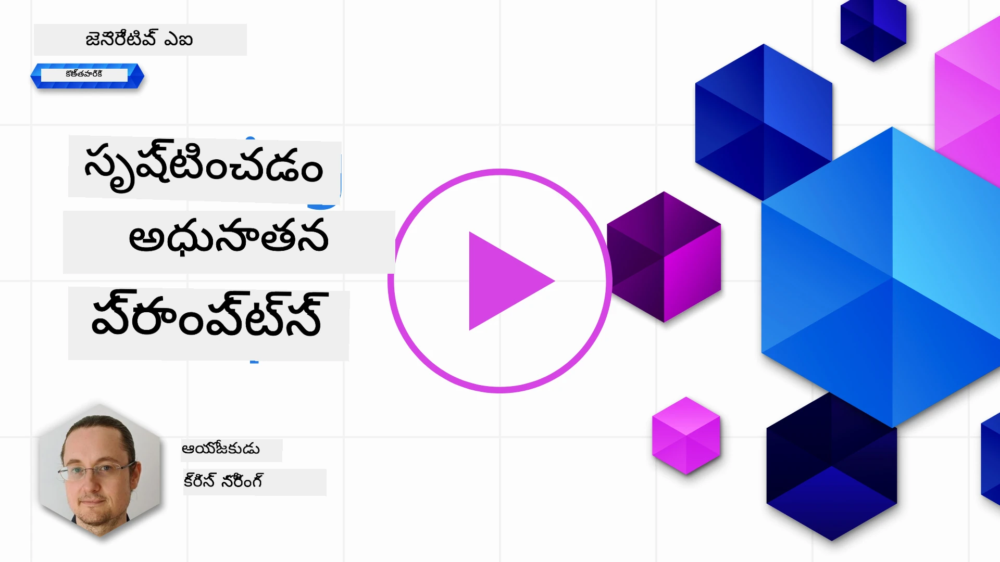

# ఆధునిక ప్రాంప్ట్స్ సృష్టించడం

[](https://youtu.be/BAjzkaCdRok?si=NmUIyRf7-cDgbjtt)

గత అధ్యాయం నుండి కొంత పరిజ్ఞానం పునరావృతం చేద్దాం:

> ప్రాంప్ట్ _అభియంత్రణ_ అనేది మనం **మోడల్‌ను మరింత సంబంధిత స్పందనలకు దారి తీసే ప్రక్రియ** ఉపయోగకరమైన సూచనలు లేదా సందర్భం అందించడం ద్వారా.

ప్రాంప్ట్‌లు రాయడంలో రెండు దశలు ఉంటాయి: సంబంధిత సందర్భాన్ని అందించడం ద్వారా ప్రాంప్ట్ నిర్మించడం మరియు _అభ్యాసం_, అంటే ప్రాంప్ట్‌ను క్రమంగా మెరుగుపరచడం.

ఈ సమయంలో, ప్రాంప్ట్‌లు ఎలా రాయాలో మనకు కొంత ప్రాథమిక అవగాహన ఉంది, కాని మనం లోతుగా వెళ్ళాల్సి ఉంటుంది. ఈ అధ్యాయంలో, మీరు వివిధ ప్రాంప్ట్‌లను ప్రయోగించడం నుంచి ఒకటి మరొకటి కంటే ఎందుకు మంచి ఉన్నదో అర్థం చేసుకోవడం వరకు వెళ్లుతారు. మీరు ఏమైనా LLMకు వర్తించే కొంత ప్రాథమిక సాంకేతికతలను అనుసరించి ప్రాంప్ట్‌లను ఎలా నిర్మించాలో నేర్చుకుంటారు.

## పరిచయం

ఈ అధ్యాయంలో మనం ఈ విషయాలు కవర్ చేస్తాము:

- మీ ప్రాంప్ట్ అభియంత్రణ పరిజ్ఞానాన్ని విస్తరించి వివిధ సాంకేతికతలను మీ ప్రాంప్ట్‌లపై వర్తింపజేయండి.
- మీ ప్రాంప్ట్‌లను కస్టమైజ్ చేసి అవుట్పుట్‌ను మార్చడం.

## అభ్యాస లక్ష్యాలు

ఈ పాఠం పూర్తి చేసిన తర్వాత, మీరు చేయగలుగుతారు:

- మీ ప్రాంప్ట్‌ల ఫలితాన్ని మెరుగుపర్చే ప్రాంప్ట్ అభియంత్రణ సాంకేతికతలను వర్తింపజేయండి.
- వైవిభవమహితమైన లేదా డిటర్మినిస్టిక్ ప్రాంప్టింగ్ నిర్వహించండి.

## ప్రాంప్ట్ అభియంత్రణ

ప్రాంప్ట్ అభియంత్రణ అనేది కావలసిన ఫలితాన్ని ఇస్తున్న ప్రాంప్ట్‌లను సృష్టించే ప్రక్రియ. కేవలం టెక్స్ట్ ప్రాంప్ట్ రాయడమే కాకుండా చాలా ఉంది. ప్రాంప్ట్ అభియంత్రణ ఒక ఆభియంత్రణ శాస్త్రం కాదు, ఇది కావలసిన ఫలితాన్ని పొందటానికి మీరు అనుసరించగల సాంకేతికతల సమాహారం.

### ప్రాంప్ట్ ఉదాహరణ

ఇలా బేసిక్ ప్రాంప్ట్ తీసుకుందాము:

> భూగోళ శాస్త్రంపై 10 ప్రశ్నల్ని రూపొందించండి.

ఈ ప్రాంప్ట్‌లో, మీరు వాస్తవానికి విభిన్న ప్రాంప్ట్ సాంకేతికతలను వర్తింపజేస్తున్నారు.

వివరణ చేద్దాం.

- **సందర్భం**, మీరు "భూగోళం" గురించి ఉండాలని నిర్దేశిస్తున్నారు.
- **ఫలితాలను పరిమితం చేయడం**, మీరు 10 ప్రశ్నలకంటే ఎక్కువకు ఆమోదం ఇవ్వనివ్వరు.

### సాదారణ ప్రాంప్టింగ్ పరిమితులు

మీరు కావలసిన ఫలితాన్ని పొందకపోవచ్చు లేదా లభించవచ్చు. మీరు మీ ప్రశ్నలు సృష్టించినప్పటికీ, భూగోళం ఒక పెద్ద విషయం కావడంతో మీకు కావలసినట్లుగా ఉండకపోవచ్చు, ఈ కారణాలు కొన్ని:

- **పెద్ద విషయం**, ఇది దేశాలు, రాజధానులు, నదులు మొదలైనవి గురించినదా అనే క్లారిటీ లేదు.
- **ఫార్మాట్**, మీరు ప్రశ్నలను నిర్దిష్ట శైలిలో కావాలనుకుంటే ఎట్లా?

వీటన్నింటినీ పరిగణనలోకి తీసుకుని ప్రాంప్ట్‌లు సృష్టించడం చాలా కష్టమైన విషయం.

ఇప్పటివరకు, మనం ఒక సాదారణ ప్రాంప్ట్ ఉదాహరణ చూశాము, కానీ జనరేటివ్ AI అనేక విభిన్న పాత్రలలో మరియు పరిశ్రమలలో ప్రజలకు సహాయపడగలదు. ఇప్పుడు కొంత ప్రాథమిక సాంకేతికతలను పరిశీలిద్దాం.

### ప్రాంప్టింగ్ సాంకేతికతలు

ముందుగా, ప్రాంప్టింగ్ అనేది ఒక LLM యొక్క _ఉత్పన్న_ లక్షణం అని మనం అర్థం చేసుకోవాలి, అంటే ఇది మోడల్‌లో నిర్మితమైన ఫీచర్ కాకుండా మోడల్ ఉపయోగించే సమయంలో మనం కనుగొనే విషయం.

LLMను ప్రాంప్ట్ చేయడానికి ఉపయోగించే కొన్ని ప్రాథమిక సాంకేతికతలు ఉన్నాయి. వీటిని పరిశీలిద్దాం.

- **జీరో-షాట్ ప్రాంప్టింగ్**, ఇది ప్రాంప్టింగ్ యొక్క అత్యంత సాదారణ రూపం. ఇది ఒకే ప్రాంప్ట్ ద్వారా LLM నుండి ఆమోదం కోరుతుంది, ఇది అంతా మోడల్ శిక్షణ డేటాపై ఆధారపడి ఉంటుంది.
- **ఫ్యూల్-షాట్ ప్రాంప్టింగ్**, ఈ రకమైన ప్రాంప్టింగ్ LLMకు ఒకటి లేదా అంతకన్నా ఎక్కువ ఉదాహరణలు ఇస్తుంది, ఇవి దాని ప్రతిస్పందనని తయారు చేయడానికి ఆధారంగా ఉపయోగపడతాయి.
- **చైన్-ఆఫ్-థాట్**, ఈ రకమైన ప్రాంప్టింగ్ LLMకు సమస్యను దశల వారీగా ఎలా విరగబెట్టాలో చెబుతుంది.
- **సృష్టించబడిన జ్ఞానం**, ప్రాంప్ట్ ఫలితాన్ని మెరుగుపరచడానికి, మీరు సృష్టించిన వాస్తవాలు లేదా జ్ఞానాన్ని ప్రాంప్ట్‌తో పాటు ఇవ్వవచ్చు.
- **లీస్ట్ టు మోస్ట్**, చైన్-ఆఫ్-థాట్ లాగే, ఈ సాంకేతికత పెద్ద సమస్యను దశలైన ఉపసమస్యలుగా విభజించి వాటిని క్రమంగా పరిష్కరించమని అడుగుతుంది.
- **సెల్ఫ్-రిఫైన్**, ఈ సాంకేతికత LLM ఫలితాన్ని విమర్శించి దాన్ని మెరుగుపరచమని అడగడం గురించి.
- **మైయుటిక్ ప్రాంప్టింగ్**. ఇక్కడ మీరు LLM సమాధానం సరైనదైందని నిర్ధారించడానికి దాని వివరణను వివిధ భాగాలపై అడుగుతారు. ఇది సెల్ఫ్-రిఫైన్ రకం.

### జీరో-షాట్ ప్రాంప్టింగ్

ఈ రకమైన ప్రాంప్టింగ్ చాలా సాదారణం, ఇది ఒకే ఒక్క ప్రాంప్ట్ ఉంటుంది. ఈ సాంకేతికత, మీరు LLMల గురించి ప్రారంభంగా నేర్చుకుంటున్నప్పుడు ఉపయోగించే సాధారణ విధానం. ఉదాహరణ:

- ప్రాంప్ట్: "అల్గెబ్రా అంటే ఏమిటి?"
- సమాధానం: "అల్గెబ్రా అనేది గణిత చిహ్నాలను మరియు వాటి నియమాలను అధ్యయనం చేసే గణిత శాఖ."

### ఫ్యూల్-షాట్ ప్రాంప్టింగ్

ఈ రకమైన ప్రాంప్టింగ్ మోడల్‌కు కొన్ని ఉదాహరణలను అభ్యర్థనతో పాటు ఇస్తుంది. ఇది ఒకే ప్రాంప్ట్ కేవలం అద్ది టాస్క్-స్పెసిఫిక్ డేటాతో ఉంటుంది. ఉదాహరణ:

- ప్రాంప్ట్: "షేక్స్పియర్ శైలిలో ఒక కవిత రాయండి. ఇక్కడ కొన్ని షేక్స్పియర్ సోన్నెట్లు ఉన్నాయి:
  సోన్నెట్ 18: 'నన్ను నీకు వేసుకునేదిగా వేసుకుందా గ్రీష్మ దినానికి? నీవు మరింత అందంగా, మరింత సమతుల్యంగా ఉన్నావు...'
  సోన్నెట్ 116: 'సత్యమయ మనసుల సంకీర్తనకు అడ్డుకట్టలు కాదు అనుమతించకు. ప్రేమ అనేది మార్వు కాకపోయిన ప్రేమ కాదు...'
  సోన్నెట్ 132: 'నేను నీ కళ్ళను ప్రేమిస్తాను, అవి నాకు అనుకంపిస్తున్నట్లు, నీ హృదయం నన్ను నిర్లక్ష్యంతో బాధిస్తున్నట్లుగా...'
  ఇప్పుడు, చంద్రుని మనోహారత గురించి ఒక సోన్నెట్ రాయండి."
- సమాధానం: "ఆకాశంలో చంద్రుడు మృదువుగా మెరిసిపోతోంది, వెండి వెచ్చటి కాంతిలో దయ చూపిస్తుంది,..."

ఉదాహరణలు LLMకు సంబంధించిన సందర్భం, ఫార్మాట్ లేదా శైలి అందించి, అది నిర్దిష్ట పనిని అర్థం చేసుకొని మరింత సరైన/సంబంధిత ప్రతిస్పందనలను తయారుచేస్తుంది.

### చైన్-ఆఫ్-థాట్

చైన్-ఆఫ్-థాట్ ఒక ఆసక్తికరమైన సాంకేతికత, ఇది LLMని ఒక సీరీస్ ఆఫ్ స్టెప్స్ ద్వారా తీసుకెళ్తుంది. భావన LLMకు ఏదైనా పని ఎలా చేయాలో సూచించడం. క్రింద ఉదాహరణ చూడండి, చైన్-ఆఫ్-థాట్ తో మరియు లేకుండా:

    - ప్రాంప్ట్: "ఆలిస్ దగ్గర 5 ఆపుల్స్ ఉన్నాయి, 3 ఆపుల్స్ విసురు, 2 బాబుకు ఇస్తుంది మరియు బాబ్ ఒకటి తిరిగి ఇస్తాడు, ఆలిస్ దగ్గర ఇప్పుడు ఎన్ని ఆపుల్స్ ఇస్తున్నాయి?"
    - సమాధానం: 5

LLM 5 అని సమాధానం ఇస్తుంది, ఇది తప్పు. సరి అయిన సమాధానం: 1 ఆపిల్, గణన ప్రకారం (5 - 3 - 2 + 1 = 1).

ఇక LLMకి ఇది సరిగ్గా నేర్పిస్తాం ఎలా?

చైన్-ఆఫ్-థాట్ ప్రయత్నిద్దాం. దీని అర్ధం:

1. LLMకి సమానమైన ఒక ఉదాహరణ ఇవ్వండి.
1. గణన చూపండి, మరియు దానిని సరిగా ఎలా గణించాలో చూపండి.
1. అసలు ప్రాంప్ట్ అందించండి.

దీంతో:

- ప్రాంప్ట్: "లిసాకు 7 ఆపుల్స్ ఉన్నాయి, 1 ఆపిల్ విసురుతుంది, 4 ఆపుల్స్ బార్ట్ కి ఇస్తుంది మరియు బార్ట్ ఒకటి తిరిగి ఇస్తాడు:
  7 -1 = 6
  6 -4 = 2
  2 +1 = 3  
  ఆలిస్ దగ్గర 5 ఆపుల్స్ ఉన్నాయి, 3 ఆపుల్స్ విసురుతుంది, 2 బాబుకు ఇస్తుంది మరియు బాబ్ ఒకటి తిరిగి ఇస్తాడు, ఎన్ని ఆపుల్స్ ఆలిస్ దగ్గర ఉన్నాయి?"
  సమాధానం: 1

మరొక ఉదాహరణ, గణన మొదలు మరియు అసలు ప్రాంప్ట్ తో చాలా పొడవుగా ప్రాంప్ట్‌లను రాసి సరైన సమాధానం 1 దొరకడం గమనించండి.

చైన్-ఆఫ్-థాట్ చాలా శక్తివంతమైన సాంకేతికత.

### సృష్టించబడిన జ్ఞానం

మీరు ప్రాంప్ట్ సృష్టించేటప్పుడు మీ స్వంత కంపెనీ డేటా ఉపయోగించాలనుకుంటున్నారు అనుకుందాం. ప్రాంప్ట్ యొక్క ఒక భాగం కంపెనీ నుండి ఉండాలి, మరొక భాగం మీరు ఆసక్తి ఉన్న ప్రాంప్ట్ ఉండవచ్చు.

ఉదాహరణకి, మీరు ఇన్సూరెన్స్ వ్యాపారంలో ఉన్నట్లయితే మీ ప్రాంప్ట్ ఇలా ఉండవచ్చు:

```text
{{company}}: {{company_name}}
{{products}}:
{{products_list}}
Please suggest an insurance given the following budget and requirements:
Budget: {{budget}}
Requirements: {{requirements}}
```

ముందు ఉన్న టెంప్లేట్ ఉపయోగించి ప్రాంప్ట్ ఎలా నిర్మిస్తారో చూడండి. టెంప్లేట్‌లో `{{variable}}` లాంటి వేరియబుల్స్ ఉంటాయి, ఇవి కంపెనీ API నుండి అసలు విలువలతో మార్చబడతాయి.

ఈ వేరియబుల్స్ ఏ విధంగా మార్పు చేసుకున్న తర్వాత ప్రాంప్ట్ ఇలా ఉండొచ్చు:

```text
Insurance company: ACME Insurance
Insurance products (cost per month):
- Car, cheap, 500 USD
- Car, expensive, 1100 USD
- Home, cheap, 600 USD
- Home, expensive, 1200 USD
- Life, cheap, 100 USD

Please suggest an insurance given the following budget and requirements:
Budget: $1000
Requirements: Car, Home, and Life insurance
```

ఈ ప్రాంప్ట్ ఒక LLM ద్వారా నడిపించినప్పుడు లభించే స్పందన ఇలా ఉంటుంది:

```output
Given the budget and requirements, we suggest the following insurance package from ACME Insurance:
- Car, cheap, 500 USD
- Home, cheap, 600 USD
- Life, cheap, 100 USD
Total cost: $1,200 USD
```

దీన్ని 보면, లైఫ్ ఇన్సూరెన్స్ కూడా సూచిస్తుంది, ఇది లేదు కావాలి. దీని అర్థం ప్రాంప్ట్ మెరుగుపరచాల్సి ఉంది, స్పష్టతతో _restrict_ వంటి కీవర్డ్స్ ఉపయోగించి. కొన్ని ప్రయత్నాలు చేసిన తర్వాత ఈ క్రింది ప్రాంప్ట్ వచ్చేసింది:

```text
Insurance company: ACME Insurance
Insurance products (cost per month):
- type: Car, cheap, cost: 500 USD
- type: Car, expensive, cost: 1100 USD
- type: Home, cheap, cost: 600 USD
- type: Home, expensive, cost: 1200 USD
- type: Life, cheap, cost: 100 USD

Please suggest an insurance given the following budget and requirements:
Budget: $1000 restrict choice to types: Car, Home
```

_type_ మరియు _cost_ అదనంగా యాడ్ చేసి మరియు _restrict_ కీవర్డ్ ఉపయోగించడం LLMకి మన భవిష్య ప్రాంప్ట్ గమనింపజేస్తుంది.

ఇప్పుడు ఈ ఫలితం వస్తుంది:

```output
Given the budget and requirements, we suggest the Car, Cheap insurance product which costs 500 USD per month.
```

ఈ ఉదాహరణ ద్వారా చెప్పదలచింది, సృష్టించిన జ్ఞానం వంటి ప్రాథమిక సాంకేతికత ఉపయోగించినప్పటికీ, చాలాసార్లు, మనం కావలసిన ఫలితం పొందటానికి ప్రాంప్ట్‌ను మెరుగుపరచుకోవాలి.

### లీస్ట్-టు-మోస్ట్

లీస్ట్-టు-మోస్ట్ ప్రాంప్టింగ్ యొక్క భావన పెద్ద సమస్యను చిన్న ఉపసమస్యలుగా విభజించడం. దీని వల్ల మీరు LLMని పెద్ద సమస్యను ఎలా పరిష్కరించాలో మార్గదర్శకాలు ఇస్తారు. డేటా సైన్స్ వంటి సారి ఈ విధంగా అడగవచ్చు:

> ప్రాంప్ట్: 5 దశల్లో డేటా సైన్స్ ఎలా చేయాలి?

మీ AI సహాయకుడు:

1. డేటా సేకరించండి  
1. డేటాను శుభ్రపరచండి  
1. డేటాను విశ్లేషించండి  
1. డేటాను ప్లాట్ చేయండి  
1. డేటాను సమర్పించండి

### సెల్ఫ్-రిఫైన్, ఫలితాలను విమర్శించండి

జనరేటివ్ AIలు మరియు LLMలపై మీరు నేరుగా విశ్వసించరాదు. మీరు ఫలితాలను ధృవీకరించాలి. LLM వలన ప్రదర్శించబడేది కరెక్ట్ కాదని, ఇది కేవలం చెప్పదగిన తదుపరి సాధ్యమైన విషయం. అందుచేత, ఒక మంచి ఆలోచన LLMని తనను తాను విమర్శించాలని అడగడం, అంటే సెల్ఫ్-రిఫైన్.

ఇది ఎలా పనిచేస్తుంది:

1. మొదటి ప్రాంప్ట్‌తో LLMని ఒక సమస్య పరిష్కరించమని అడగండి  
1. LLM సమాధానం ఇస్తుంది  
1. మీరు సమాధానాన్ని విమర్శించి AIని మెరుగుపరచమని అడగండి  
1. LLM విమర్శను పరిగణలోకి తీసుకొని మరోసారి సమాధానం ఇస్తుంది  

ఈ ప్రక్రియను ఎన్నడైనా మళ్ళీ చేయవచ్చు.

ఈ సాంకేతికత ఉపయోగించి ఉదాహరణ:

> ప్రాంప్ట్: "ప్రోడక్ట్స్ మరియు కస్టమర్స్ రూట్లతో పythన్ వెబ్ API ని సృష్టించండి"

AI సమాధానం:

```python
import flask
app = Flask(__name__)

@app.route('/products')
def products():
    return 'Products'

@app.route('/customers')
def customers():
    return 'Customers'
```

> ప్రాంప్ట్: పై కోడ్ 3 మెరుగుపరచులను సూచించు

AI సమాధానం:

```text
Sure, here are three suggestions to improve the code:

Import the correct module: The first line should import Flask instead of flask. The correct import statement should be from flask import Flask.

Add a main function: Add a if __name__ == '__main__': block to the end of the file to run the application when the file is executed.

Use f-strings: Use f-strings to format the return statements in the route functions. For example, return 'Products' can be changed to return f'This is the {request.path} page'.
```

```python
from flask import Flask, request

app = Flask(__name__)

@app.route('/products')
def products():
    return f'This is the {request.path} page'

@app.route('/customers')
def customers():
    return f'This is the {request.path} page'

if __name__ == '__main__':
    app.run()
```

మీరు గమనిస్తారు, పై AI స్పందన మొదటి సమాధానాన్ని విమర్శించి మెరుగుపరిచింది.

### మైయుటిక్ ప్రాంప్టింగ్

మైయుటిక్ ప్రాంప్టింగ్ సెల్ఫ్-రిఫైన్ కి సమానమైన సాంకేతికత అయితే ఇది LLMను తన సమాధానాన్ని వివరించమని అడగడం గురించి. లక్ష్యం LLM ఫలితాల్లో అసంగతులను తగ్గించి సరైన సమాధానం దిశగా తీసుకెళ్ళడం. పని విధానం:

1. LLMని ఒక ప్రశ్నకు సమాధానం ఇవ్వమని అడగండి  
1. సమాధానంలోని ప్రతి భాగానికీ ఎక్కువగా వివరణ అడగండి  
1. అసంగతులు ఉన్న భాగాలను నిరాకరించండి  

2, 3 దశలను 반복ించండి వారం పూర్తి చేసిన తరువాత మీరు సమాధానంతో సంతృప్తి చెందే వరకు.

ఉదాహరణ ప్రాంప్ట్:

> ప్రాంప్ట్: మహా ప్రాణాంతక వ్యాధి సమయములో 5 దశల్లో సంక్షోభ యోజనను ఎలా సృష్టించాలి?
> LLM సమాధానం:

```text
1. Identify the risks
1. Identify the stakeholders
1. Identify the resources
1. Identify the actions
1. Identify the communication channels
```

5 దశలను గుర్తించింది, కానీ ఇది సరైనదా అని నిర్ణయించవచ్చా? ప్రతి దశను LLMకి వివరించమని అడగండి:

> ప్రాంప్ట్: మొదటి దశను వైరగాకుండా వివరించండి, మహా ప్రాణాంతక వ్యాధి ప్రమాదాలు ఏమిటి?

```text
The risks are the following:

- Loss of life
- Loss of business
- Loss of reputation
- Loss of customers
- Loss of employees
```

ఇప్పటికే LLM సరైనదిగా ఉందో చూడాలో, మొదటి ప్రమాదాన్ని మరింత వివరించమని అడగండి, పై సమాధానంతో బహుశా సరిపోయేలా:

> ప్రాంప్ట్: మహా ప్రాణాంతక వ్యాధిలో ఏది అతిపెద్ద ప్రమాదం అట్టి ఎందుకు?

```text
The biggest risk is loss of life because it's the most important thing to protect.
```

> మహా ప్రాణాంతక వ్యాధిలో రెండు అతిపెద్ద ప్రమాదాలు ఏమిటి?

```text
The two biggest risks are loss of life and loss of business.
```

ఇప్పటికే LLM సుఖంగా ఉన్నందున "జీవితం" మరియు "వ్యవసాయం" అని రెండు ప్రధాన ప్రమాదాలను పేర్కొంటుంది. మీరు తదుపరి దశకు వెళ్లి బాగా నమ్మకంగా ఉండవచ్చు. అయినప్పటికీ, LLMని అనూహ్యంగా విశ్వసించకూడదు, ఫలితాలను ఎప్పుడూ ధృవీకరించాలి.

## మీ అవుట్పుట్‌ను మార్చండి

LLMలు సహజంగా నాన్-డిటర్మినిస్టిక్ గా ఉంటాయి, అంటే మీరు అదే ప్రాంప్ట్‌ను ప్రతిసారీ నడపగానే వేరు ఫలితాలు వస్తాయి. ఈ క్రింది ప్రాంప్ట్ ప్రయత్నించి చూడండి:

> "పython వెబ్ API కోసం 코드 రూపొందించండి"

```python
# అవసరమైన మాడ్యూల్స్‌ని దిగుమతి చేసుకోండి
import flask
from flask import request, jsonify

# ఒక ఫ్లాస్క్ యాప్‌ను సృష్టించండి
app = flask.Flask(__name__)

# API కోసం ఒక రౌట్‌ను సృష్టించండి
@app.route('/api', methods=['GET'])
def api():
    # అభ్యర్థన నుండి డేటాను పొందండి
    data = request.args

    # డేటాను ప్రాసెస్ చేయండి
    result = process_data(data)

    # ఫలితాన్ని JSONగా తిరిగి ఇవ్వండి
    return jsonify(result)

# డేటాను ప్రాసెస్ చేసే ఫంక్షన్
def process_data(data):
    # డేటాతో ఏదో చేయండి
    result = data + 1

    # ఫలితాన్ని తిరిగి ఇవ్వండి
    return result

# యాప్ నడపండి
if __name__ == '__main__':
    app.run()

```

మళ్ళీ అదే ప్రాంప్ట్ నడిపిస్తే కొంత తేడాతో ఫలితం వస్తుంది:

```python
#అవసరమైన ప్యాకేజీలను దిగుమతి చేసుకోండి
import flask
from flask import request, jsonify

#Flask అనువర్తనం సృష్టించండి
app = flask.Flask(__name__)
app.config["DEBUG"] = True

#పుస్తకాల జాబితా సృష్టించండి
books = [
    {'id': 0,
     'title': 'A Fire Upon the Deep',
     'author': 'Vernor Vinge',
     'first_sentence': 'The coldsleep itself was dreamless.',
     'year_published': '1992'},
    {'id': 1,
     'title': 'The Ones Who Walk Away From Omelas',
     'author': 'Ursula K. Le Guin',
     'first_sentence': 'With a clamor of bells that set the swallows soaring, the Festival of Summer came to the city Omelas, bright-towered by the sea.',
     'published': '1973'},
    {'id': 2,
     'title': 'Dhalgren',
     'author': 'Samuel R. Delany',
     'first_sentence': 'to wound the autumnal city.',
     'published': '1975'}
]

#API కోసం ఒక ఎండ్‌పాయింట్ సృష్టించండి
@app.route('/', methods=['GET'])
def home():
    return '''<h1>Books API</h1>
<p>A prototype API for retrieving books.</p>'''

#అన్ని పుస్తకాలను తిరిగి ఇవ్వడానికి ఒక ఎండ్‌పాయింట్ సృష్టించండి
@app.route('/api/v1/resources/books/all', methods=['GET'])
def api_all():
    return jsonify(books)

#ఒకే పుస్తకాన్ని తిరిగి ఇవ్వడానికి ఒక ఎండ్‌పాయింట్ సృష్టించండి
@app.route('/api/v1/resources/books', methods=['GET'])
def api_id():
    #URL భాగంగా ID ఇవ్వబడినదేనా అని చెక్ చేయండి
    #ID ఇవ్వబడినట్లయితే, దాన్ని ఒక వెరియబుల్‌కు అప్పగించండి
    #ID ఇవ్వబడకపోతే, ఒక లోపాన్ని ప్రదర్శించండి
    if 'id' in request.args:
        id = int(request.args['id'])
    else:
        return "Error: No id field provided. Please specify an id."

    #మా ఫలితాల కోసం ఒక ఖాళీ జాబితా సృష్టించండి
    results = []

    #డేటా ద్వారా లూప్ చేసి, కోరిన IDకి సరిపోయే ఫలితాలను మ్యాచ్ చేయండి
    #IDలు ప్రత్యేకంగా ఉంటాయి, కానీ ఇతర ఫీల్డ్లు అనేక ఫలితాలను ఇవ్వవచ్చు
    for book in books:
        if book['id'] == id:
            results.append(book)

    #మా జాబితాను మార్చడానికి Flask యొక్క jsonify ఫంక్షన్ ఉపయోగించండి
    #Python డిక్షనరీలను JSON ఫార్మాట్‌లోకి మార్చండి
    return jsonify(results)

app.run()
```

> మరియూ, వైవిధ్యభరిత అవుట్పుట్ సమస్యనా?

మీరు ఏం చేయాలనుకుంటున్నారో అనేది కీలకం. మీరు ప్రత్యేక ప్రతిస్పందన కావాలనుకుంటే ఇది సమస్య. మీరు "భూగోళ అంశాలపై ఏ 3 ప్రశ్నలు సృష్టించండి" లాంటి వైవిధ్యభరిత అవుట్పుట్ ని ఇష్టపడితే, సమస్య కాదు.

### ఆవుట్పుట్ మార్చడానికి టెంపరేచర్ ఉపయోగించడం

సరే, మనం అవుట్పుట్‌ను ఎక్కువగా ఖచ్చితముగా (డిటర్మినిస్టిక్) మార్చాలని నిర్ణయించుకున్నాము. ఎలా చేయాలి?

టెంపరేచర్ 0 నుండి 1 మధ్య విలువ. 0 అతి ఖచ్చితమైనది, 1 అత్యంత వైవిధ్యమైనది. డిఫాల్ట్ విలువు 0.7. ఇప్పుడు అదే ప్రాంప్ట్‌ను టెంపరేచర్ 0.1తో రెండు సార్లు నడిపితే ఏమవుతుందో చూద్దాం:

> "పython వెబ్ API కోసం 코드 రూపొందించండి"

```python
#అవసరమైన లైబ్రరీలను దిగుమతి చేసుకోండి
import flask
from flask import request, jsonify

#Flask తరగతి యొక్క ఒక ఉదాహరణను సృష్టించండి
app = flask.Flask(__name__)

#API కోసం ఒక ఎండ్పాయింట్ సృష్టించండి
@app.route('/api/v1/endpoint', methods=['GET'])
def api_endpoint():
    #అభ్యర్థన డేటాను పొందండి
    data = request.get_json()

    #డేటాను ప్రాసెస్ చేయండి
    result = process_data(data)

    #ఫలితాన్ని తిరిగి ఇవ్వండి
    return jsonify(result)

#డేటాను ప్రాసెస్ చేయడానికి ఫంక్షన్
def process_data(data):
    #డేటాను ప్రాసెస్ చేయండి
    result = {'result': 'success'}

    #ఫలితాన్ని తిరిగి ఇవ్వండి
    return result

#Flask అప్లికేషన్ ను నడపండి
if __name__ == '__main__':
    app.run()

```

మళ్ళీ నడిపితే ఫలితం ఇలా ఉంటుంది:

```python
#అవసరమైన లైబ్రరీలను దిగుమతి చేసుకోండి
import flask
from flask import request, jsonify

#ఒక Flask యాప్‌ను సృష్టించండి
app = flask.Flask(__name__)

#API కోసం ఒక రూట్ సృష్టించండి
@app.route('/api', methods=['GET'])
def api_call():
    #అభ్యర్థన నుండి డేటాను పొందండి
    data = request.get_json()

    #డేటాను ప్రాసెస్ చేయండి
    result = process_data(data)

    #ఫలితాన్ని తిరిగి పంపండి
    return jsonify(result)

#process_data ఫంక్షన్‌ను นิర్ిస్త کنید
def process_data(data):
    #డేటాతో ఏదైనా చేయండి
    result = data + 1

    #ఫలితాన్ని తిరిగి పంపండి
    return result

#యాప్‌ను నడిపించండి
if __name__ == '__main__':
    app.run()

```

ఈ రెండు అవుట్పుట్స్ మధ్య చాలా తక్కువ తేడా ఉంది. ఈసారి తలంచుకోండి, టెంపరేచర్ 0.9గా సెట్ చేసి మళ్లీ ప్రయత్నిద్దాం:

```python
# అవసరమైన లైబ్రరీలను దిగుమతి చేసుకోండి
import flask
from flask import request, jsonify

# ఒక ఫ్లాస్క్ యాప్ సృష్టించండి
app = flask.Flask(__name__)

# API కోసం ఒక రూట్ సృష్టించండి
@app.route('/api', methods=['GET'])
def api_call():
    # అభ్యర్థన నుండి డేటాను పొందండి
    data = request.args

    # డేటాను ప్రాసెస్ చేయండి
    result = process_data(data)

    # ఫలితాన్ని తిరిగి ఇవ్వండి
    return jsonify(result)

# డేటాను ప్రాసెస్ చేసే ఫంక్షన్
def process_data(data):
    # డేటాతో ఏదైనా చేయండి
    result = data + 1

    # ఫలితాన్ని తిరిగి ఇవ్వండి
    return result

# యాప్‌ను চালించండి
if __name__ == '__main__':
    app.run()

```

రెండవ ప్రయత్నం 0.9 టెంపరేచర్‌తో:

```python
import flask
from flask import request, jsonify

# ఫ్లాస్క్ యాప్ ను సృష్టించండి
app = flask.Flask(__name__)
app.config['DEBUG'] = True

# కొంత పరీక్ష డేటా సృష్టించండి
books = [
    {'id': 0, 'title': 'A Fire Upon The Deep', 'author': 'Vernor Vinge', 'first_sentence': 'The coldsleep itself was dreamless.', 'year_published': '1992'},
    {'id': 1, 'title': 'The Ones Who Walk Away From Omelas', 'author': 'Ursula K. Le Guin', 'first_sentence': 'With a clamor of bells that set the swallows soaring, the Festival of Summer came to the city Omelas, bright-towered by the sea.', 'published': '1973'},
    {'id': 2, 'title': 'Dhalgren', 'author': 'Samuel R. Delany', 'first_sentence': 'to wound the autumnal city.', 'published': '1975'}
]

# ఒక ఎండ్పాయింట్ సృష్టించండి
@app.route('/', methods=['GET'])
def home():
    return '''<h1>Welcome to our book API!</h1>'''

@app.route('/api/v1/resources/books

```

మీరు గమనించగలరు, ఫలితాలు చాలా వైవిధ్యమైనవి అయ్యాయి.
> గమనిక, మీరు output ను మార్చడానికి మార్చుకోవచ్చునని మరిన్ని పారామితులు ఉన్నాయి, ఉదాహరణకు top-k, top-p, repetition penalty, length penalty మరియు diversity penalty కానీ ఇవి ఈ పాఠ్యక్రమం పరిధికి బాహ్యంగా ఉన్నాయి.

## మంచి పరిస్థితులు

మీరు ఆశిస్తున్నది సాధించడానికి అనేక విధానాలు ఉన్నాయి. మీరు ఎక్కువగా prompting ఉపయోగించేటప్పుడు మీ స్వంత శైలి కనిపెట్టుకుంటారు.

మేము చర్చించిన సాంకేతికతలకు అదనంగా, LLM ప్రాంప్ట్ చేయగలిగే సమయంలో పరిగణించాల్సిన కొన్ని మంచి ఆచారాలు ఉన్నాయి.

ఇక్కడ కొన్ని మంచి ఆచారాలు సూచిస్తున్నాము:

- **సందర్భాన్ని నిర్దేశించండి**. సందర్భం ముఖ్యం, మీరు డొమైన్, టాపిక్, మొదలైన విషయాలను ఎంత స్పష్టంగా చెప్పగలరో అంత మంచిది.
- అవుట్పుట్ పరిమితం చేయండి. మీరు నిర్దిష్ట సంఖ్యలో అంశాలు లేదా నిర్దిష్ట పొడవు కోరుకుంటే, దాన్ని స్పష్టంగా తెలియజేయండి.
- **ఏమి కావాలో మరియు ఎలా కావాలో రెండింటినీ పేర్కొనండి**. మీరు ఏమి కావాలో మరియు ఎలా కావాలో రెండింటినీ జప్తిచేయండి, ఉదాహరణకు "ప్రొడక్ట్స్ మరియు కస్టమర్స్ రూట్స్ తో Python Web API రూపొందించండి, దానిని 3 ఫైళ్లుగా విభజించండి".
- **టెంప్లేట్లను ఉపయోగించండి**. తరచూ, మీరు మీ కంపెనీ డేటాను ఉపయోగించి prompting ను సుసంపన్నం చేయాలి. దీని కోసం టెంప్లేట్లను ఉపయోగించండి. టెంప్లేట్లలో మీరు నిజమైన డేటాతో భర్తీ చేసే వేరియబుల్స్ ఉండొచ్చు.
- **తప్పులు లేకుండా వ్రాయండి**. LLMs సరైన స్పందన ఇస్తాయని కాని మీరు తప్పులు లేకుండా వ్రాస్తే మెరుగు ప్రతిస్పందన మీరు పొందగలుగుతారు.

## అసైన్మెంట్

Flask ఉపయోగించి సింపుల్ API ను ఎలా నిర్మించాలో చూపించే Python కోడ్ ఇక్కడ ఉంది:

```python
from flask import Flask, request

app = Flask(__name__)

@app.route('/')
def hello():
    name = request.args.get('name', 'World')
    return f'Hello, {name}!'

if __name__ == '__main__':
    app.run()
```

GitHub Copilot లేదా ChatGPT వంటి AI సహాయకునిని ఉపయోగించి "self-refine" సాంకేతికతను ప్రయోగించి కోడ్ మెరుగుపరుచండి.

## పరిష్కారం

దయచేసి కోడ్ కు సరైన prompts జతచేసి అసైన్మెంట్ ను పరిష్కరించడానికి ప్రయత్నించండి.

> [!TIP]
> మెరుగుపర్చమని అడగడానికి prompt ను రూపొందించండి, ఎన్ని మెరుగుదలలు అనుమతించాలో పరిమితి పెట్టడం మంచి ఆలోచన. మీరు అలాగే ఇది ఆర్కిటెక్టర్, పనితీరుకు, భద్రతకు వంటి దిశగా మెరుగుపరచమని కూడా అడగవచ్చు.

[పరిష్కారం](../../../05-advanced-prompts/python/aoai-solution.py)

## జ్ఞాన పరీక్ష

నేను chain-of-thought prompting ఎందుకు ఉపయోగిస్తాను? నేను 1 సరైన స్పందన మరియు 2 తప్పు స్పందనలను చూపించండి.

1. సమస్యను ఎలా పరిష్కరించాలో LLM కు నేర్పడానికి.
1. బి, LLM కు కోడ్ లో తప్పులను ఎలా కనుగొనాలో నేర్పడానికి.
1. సి, LLM కు విభిన్న పరిష్కారాలను తీయమని ఆదేశించడానికి.

సమాధానం: 1, ఎందుకంటే chain-of-thought అనేది LLM కు సమస్యను పరిష్కరించడానికి దశల వరుస మరియు వంటి సమస్యలు, అవి ఎలా పరిష్కరించబడ్డాయో చూపించడం.

## 🚀 సవాలు

మీరు అసైన్మెంట్ లో self-refine సాంకేతికతను ఉపయోగించారు. మీరు నిర్మించిన ఏదైనా ప్రోగ్రామ్ ను తీసుకుని దానిని మెరుగుపరచాలనుకునే మార్పుల గురించి ఆలోచించండి. ఇప్పుడు self-refine సాంకేతికతను ఉపయోగించి ఆ సూచించిన మార్పులను అమలు చేయండి. ఫలితం ఎలా అనిపించింది, మెరుగైందా లేదా చెడిపోతుందో?

## అద్భుతమైన పని! మీ అభ్యాసం కొనసాగించండి

ఈ పాఠాన్ని పూర్తి చేసిన తర్వాత, మా [Generative AI Learning collection](https://aka.ms/genai-collection?WT.mc_id=academic-105485-koreyst) ను పరిశీలించి Generative AI జ్ఞానాన్ని మరింత మెరుగుపర్చుకోండి!

మరో నైపుణ్యం కోసం, మా Lesson 6 కి వెళ్లండి, అంటే [పాఠ్య తరం జనరేషన్ యాప్స్](../06-text-generation-apps/README.md?WT.mc_id=academic-105485-koreyst) రూపొందించడం ద్వారా Prompt Engineering పై బ్లాగ్ చేయడం.

---

<!-- CO-OP TRANSLATOR DISCLAIMER START -->
**అస్వీకరణ**:
ఈ పత్రం AI అనువాద సేవ [Co-op Translator](https://github.com/Azure/co-op-translator) ఉపయోగించి అనువదించబడింది. మేము ఖచ్చితత్వానికి ప్రయత్నిస్తున్నప్పటికీ, ఆటోమేటెడ్ అనువాదాలు తప్పులు లేదా అసమగ్రతలను కలిగి ఉండవచ్చు. దాని స్వదేశ భాషలో ఉన్న అసలు పత్రాన్ని అధికారం కలిగిన మూలంగా పరిగణించాలి. కీలకమైన సమాచారం కోసం, ప్రొఫెషనల్ మానవ అనువాదాన్ని సిఫారసు చేస్తాము. ఈ అనువాదం ఉపయోగం వల్ల కలిగే ఏవైనా అపార్థాలు లేదా తప్పుదారులు కోసం మేము బాధ్యత వహించము.
<!-- CO-OP TRANSLATOR DISCLAIMER END -->