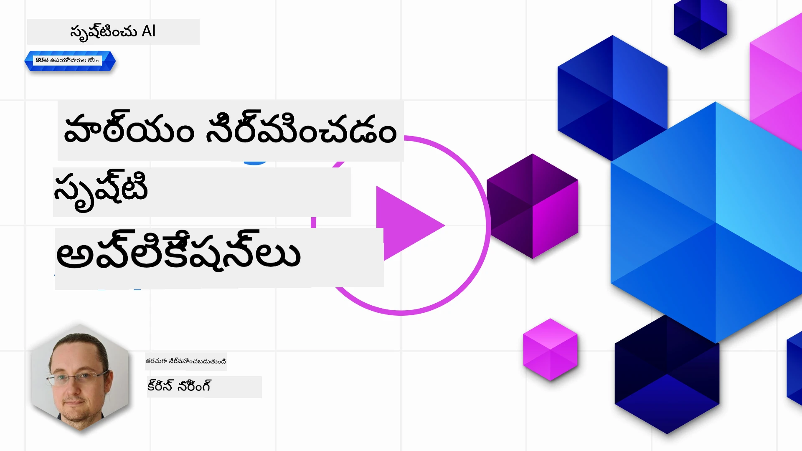

# టెక్స్ట్ జనరేషన్ అప్లికేషన్ల నిర్మాణం

[](https://youtu.be/0Y5Luf5sRQA?si=t_xVg0clnAI4oUFZ)

> _(ఈ పాఠం వీడియోను వీక్షించేందుకు పై చిత్రం క్లిక్ చేయండి)_

మీరు ఈ పాఠ్యాంశం వరకు చూసినట్లు, ప్రాంప్ట్‌లు మరియు "ప్రాంప్ట్ ఇంజనీరింగ్" అనే పూర్తిగా ఒక శాస్త్రం ఉన్న ముఖ్యమైన కాన్సెప్ట్‌లు ఉన్నాయి. మీరు వ్యవహరించగల అనేక టూల్స్ ఉంటాయి, ఉదాహరణకు ChatGPT, Office 365, Microsoft Power Platform మరియు మరెన్నో, ఇవి పని చేయడానికి ప్రాంప్ట్‌లను ఉపయోగిస్తాయి.

అలాంటి అనుభవాన్ని ఒక యాప్‌లో చేర్చేందుకు, ప్రాంప్ట్‌లు, కంప్లీషన్స్ వంటి భావాలను అర్థం చేసుకోవాలి మరియు ఒక లైబ్రరీని ఎంచుకోవాలి. ఇదే ఈ అధ్యాయంలో మీరు నేర్చుకోబోతున్నది.

## పరిచయం

ఈ అధ్యాయం లో, మీరు:

- openai లైబ్రరీ మరియు దాని ముఖ్య భావాలను నేర్చుకుంటారు.
- openai ఉపయోగించి టెక్స్ట్ జనరేషన్ యాప్‌ను రూపొందిస్తారు.
- ప్రాంప్ట్, టెంపరేచర్, టోకెన్స్ వంటి భావాలను ఉపయోగించి టెక్స్ట్ జనరేషన్ యాప్‌ రూపొందించడం ఎలా అనేదిని అర్థం చేసుకుంటారు.

## అభ్యాస లక్ష్యాలు

ఈ పాఠం తుదికి, మీరు చేయగలుగుతారు:

- టెక్స్ట్ జనరేషన్ యాప్ అంటే ఏమిటి అనేదిని వివరించగలగడం.
- openai ఉపయోగించి టెక్స్ట్ జనరేషన్ యాప్ నిర్మించగలగడం.
- మీ యాప్‌ను ఎక్కువ లేదా తక్కువ టోకెన్స్ ఉపయోగించేటట్లు మరియు టెంపరేచర్ మార్చే విధంగా కాన్ఫిగర్ చేయగలగడం, వేరే విధంగా ఆఉట్పుట్ పొందడం కోసం.

## టెక్స్ట్ జనరేషన్ యాప్ అంటే ఏమిటి?

సాధారణంగా మీరు యాప్ నిర్మించేటప్పుడు దానికి ఈ క్రింది విధమైన ఇంటర్‌ఫేస్ ఉంటుంది:

- ఆదేశం-ఆధారిత (కమాండ్ ఆధారిత). కన్సోల్ అప్లికేషన్లు సాధారణ యాప్స్, మీరు ఒక ఆదేశం టైప్ చేస్తారు, అది ఆ పని చేయుతుంది. ఉదాహరణకు `git` ఒక కమాండ్ ఆధారిత యాప్.
- యూజర్ ఇంటర్‌ఫేస్ (UI). కొంత యాప్స్ కు గ్రాఫికల్ యూజర్ ఇంటర్‌ఫేస్ (GUIs) ఉంటాయి, అక్కడ మీరు బటన్లు క్లిక్ చేస్తారు, టెక్స్ట్ ఇన్పుట్ చేస్తారు, ఎంపికలను ఎంచుకుంటారు.

### కన్సోల్ మరియు UI యాప్స్ పరిమితులు

కమాండ్-ఆధారిత యాప్‌తో పోల్చండి, మీరు ఆదేశం టైప్ చేస్తారు:

- **ఇది పరిమితి**. మీరు ఏమైనా ఆదేశం టైప్ చేయలేరు, యాప్ మద్దతు ఇస్తున్న ఆదేశాలు మాత్రమే పనిచేస్తాయి.
- **భాషా నిర్ధిష్టంగా ఉంటుంది**. కొన్ని యాప్స్ అనేక భాషలు మద్దతు ఇస్తాయి, కానీ మౌలికంగా ఒక నిర్ధిష్ట భాష కోసం యాప్ నిర్మించబడింది, మరిన్ని భాషల మద్దతు ఇవ్వడమైనా సాధ్యమే.

### టెక్స్ట్ జనరేషన్ యాప్స్ లాభాలు

మరి టెక్స్ట్ జనరేషన్ యాప్ ఎలా భిన్నం?

టెక్స్ట్ జనరేషన్ యాప్‌లో, మీకు ఎక్కువ స్వేచ్ఛ ఉంటుంది, మీరు ఆదేశాల సమూహానికి లేదా ఒక నిర్ధిష్ట ఇన్‌పుట్ భాషకు పరిమితం కాబోవడం లేదు. దాన్ని బదులుగా, మీరు సహజ భాష ఉపయోగించి యాప్‌తో సంభాషించగలుగుతారు. మరో లాభం ఏమిటంటే, మీరు ఇప్పటికే భారీ వస్తువుల సమాచారాన్ని శిక్షణ ఇచ్చిన డేటా మూలంపై వ్యవహరిస్తున్నారు, సాధారణ యాప్ డేటాబేసులో ఉన్నదానిపై పరిమితం కావచ్చు.

### టెక్స్ట్ జనరేషన్ యాప్‌తో నేను ఏమి తయారు చేయవచ్చు?

మీరు ఎన్నో విషయాలు తయారు చేయవచ్చు. ఉదాహరణకు:

- **చాట్‌బాట్**. మీ కంపెనీ మరియు దాని ఉత్పత్తుల గురించి ప్రశ్నలకు సమాధానం చెప్పే చాట్‌బాట్ మంచి సరిపోయే.
- **హెల్పర్**. LLMs టెక్స్ట్ సారాంశం చేయడం, టెక్స్ట్ నుండి ఆసక్తికర విషయాలు తెలుసుకోవడం, రిజ్యూమేలు వంటి టెక్స్ట్ తయారు చేయడం గొప్పగా చేస్తాయి.
- **కోడ్ అసిస్టెంట్**. మీరు ఉపయోగించే భాషా నమూనా ఆధారంగా, మీరు కోడ్ రాయడంలో సహాయపడే కోడ్ అసిస్టెంట్ తయారు చేయవచ్చు. ఉదాహరణకు GitHub Copilot మరియు ChatGPT ను ఉపయోగించి కోడ్ రాయడంలో సహాయం పొందవచ్చు.

## నేను ఎలా ప్రారంభించగలను?

బాగుంటుంది, మీరు లార్జ్ లాంగ్వేజ్ మోడల్(LLM)తో ఏదో ఒక విధంగా అనుసంధానించాల్సి ఉంటుంది, ఇది సాధారణంగా కింద ఉన్న రెండు మార్గాలను సూచిస్తుంది:

- API ఉపయోగించండి. మీరు మీ ప్రాంప్ట్‌తో వెబ్ అభ్యర్థనలు తయారు చేసి, తయారైన టెక్స్ట్ తిరిగి పొందుతారు.
- లైబ్రరీ ఉపయోగించండి. లైబ్రరీలు API కాల్స్ ను కవరూ చేసి ఉపయోగించడాన్ని సులభతరం చేస్తాయి.

## లైబ్రరీలు/SDKలు

LLMs తో పనిచేసేందుకు కొన్ని ప్రసిద్ధ లైబ్రరీలు ఉన్నాయి, ఉదాహరణకు:

- **openai**, ఈ లైబ్రరీ మీ మోడల్‌తో కనెక్ట్ అవ్వడానికి మరియు ప్రాంప్ట్‌లు పంపడానికి సులభం చేస్తుంది.

మరి ఉన్నత స్థాయి లైబ్రరీలు కూడా ఉన్నాయి, ఉదాహరణకు:

- **Langchain**. Langchain ప్రాచుర్యం పొందింది మరియు Python మద్దతు ఇస్తుంది.
- **Semantic Kernel**. Semantic Kernel మైక్రోసాఫ్ట్ యొక్క లైబ్రరీ, ఇది C#, Python మరియు Java భాషలను మద్దతు ఇస్తుంది.

## openai ఉపయోగించి మొదటి యాప్

మన మొట్టమొదటి యాప్ ఎలా తయారుచేసుకోవచ్చో చూద్దాం, మనకి ఎలాంటి లైబ్రరీలు అవసరం, ఎంత కావాలి మొదలైనవి.

### openai ఇన్‌స్టాల్ చేయండి

OpenAI లేదా Azure OpenAIతో సంభాషించేందుకు అనేక లైబ్రరీలు ఉన్నాయి. మీరు అనేక ప్రోగ్రామింగ్ భాషలు C#, Python, JavaScript, Java మరియు మరిన్ని కూడా ఉపయోగించవచ్చు. మేము `openai` Python లైబ్రరీని ఎంచుకున్నాము, కాబట్టి దీనిని `pip` ద్వారా ఇన్‌స్టాల్ చేసుకుందాము.

```bash
pip install openai
```

### రీసోర్స్ సృష్టించండి

మీరు ఈ స్టెప్స్ చేయాలి:

- Azureలో అకౌంట్ సృష్టించండి [https://azure.microsoft.com/free/](https://azure.microsoft.com/free/?WT.mc_id=academic-105485-koreyst).
- Azure OpenAI కి ప్రాప్యత పొందండి. ఈ లింక్ కి వెళ్ళి [https://learn.microsoft.com/azure/ai-foundry/openai/overview#how-do-i-get-access-to-azure-openai](https://learn.microsoft.com/azure/ai-foundry/openai/overview#how-do-i-get-access-to-azure-openai?WT.mc_id=academic-105485-koreyst) ప్రాప్యత కోరండి.

  > [!NOTE]
  > కొంత సమయానికి, మీరు Azure OpenAI కి ప్రాప్యత కోసం దరఖాస్తు చేయాలి.

- Python ఇన్‌స్టాల్ చేయండి <https://www.python.org/>
- Azure OpenAI సర్వీస్ రీసోర్స్ సృష్టించండి. ఎలా సృష్టించాలో ఈ గైడ్ చూడండి [create a resource](https://learn.microsoft.com/azure/ai-foundry/openai/how-to/create-resource?pivots=web-portal?WT.mc_id=academic-105485-koreyst).

### API కీ మరియు ఎండ్‌పాయింట్‌ను కనుగొనండి

ఇప్పుడు మీరు `openai` లైబ్రరీకి ఏ API కీ ఉపయోగించాలో చెప్పాల్సి ఉంది. మీ API కీ కనుగొనడానికి, Azure OpenAI రీసోర్స్ లోని "Keys and Endpoint" సెక్షన్‌కు వెళ్లి "Key 1" విలువను కాపీ చేసుకోండి.


ఇప్పుడు మీరు ఈ సమాచారాన్ని కాపీ చేసుకున్నారని, లైబ్రరీలను దీన్ని వాడమని సూచిస్తాము.

> [!NOTE]
> మీ API కీని మీ కోడ్ నుండి వేరు చేయడం మంచిది. మీరు వాతావరణ చరాలు ఉపయోగించి దీన్ని చేయవచ్చు.
>
> - వాతావరణ చరంగా `OPENAI_API_KEY` ని మీ API కీకి సెట్ చేయండి.
>   `export OPENAI_API_KEY='sk-...'`

### Azure కాన్ఫిగరేషన్ సెటప్ చేయండి

మీరు Azure OpenAI (ఇప్పుడు Microsoft Foundry భాగం) ఉపయోగిస్తుంటే, ఎలా కాన్ఫిగర్ చేయాలో ఇక్కడ ఉంది. మేము సాంప్రదాయ `OpenAI` క్లయింట్ ని Azure OpenAI `/openai/v1/` ఎండ్‌పాయింట్ వద్ద సూచిస్తున్నాము, ఇది Responses API తో పనిచేస్తుంది మరియు `api_version` అవసరం లేదు:

```python
import os
from openai import OpenAI

client = OpenAI(
    api_key=os.environ["AZURE_OPENAI_API_KEY"],
    base_url=f"{os.environ['AZURE_OPENAI_ENDPOINT'].rstrip('/')}/openai/v1/",
)
```

పైన మేము కింది వాటిని సెట్ చేస్తున్నాము:

- `api_key`, ఇది Azure పోర్టల్ లేదా Microsoft Foundry పోర్టల్ లో ఉన్న మీ API కీ.
- `base_url`, ఇది మీ Foundry రీసోర్స్ ఎండ్‌పాయింట్, చివరికి `/openai/v1/` జోడించబడింది. స్థిరమైన v1 ఎండ్‌పాయింట్ OpenAI మరియు Azure OpenAI రెండింటిని కొవర్ చేస్తుంది, `api_version` నిర్వహణ అవసరం లేదు.

> [!NOTE] > `os.environ` వాతావరణ చరాలు చదవడానికి ఉపయోగిస్తారు. మీరు దీన్ని `AZURE_OPENAI_API_KEY` మరియు `AZURE_OPENAI_ENDPOINT` వంటి వాతావరణ చరాలు చదవడానికి ఉపయోగించవచ్చు. టెర్మినల్ లేదా `dotenv` వంటి లైబ్రరీ ఉపయోగించి వీటిని సెట్ చేయండి.

## టెక్స్ట్ జనరేట్ చేయండి

టెక్స్ట్ జనరేట్ చేయడానికి Responses APIలోని `responses.create` పద్ధతిని ఉపయోగించాలి. ఉదాహరణ ఇక్కడ ఉంది:

```python
prompt = "Complete the following: Once upon a time there was a"

response = client.responses.create(
    model="gpt-5-mini",  # ఇది మీ నమూనా పంపిణీ పేరు
    input=prompt,
    store=False,
)
print(response.output_text)
```

పై కోడ్‌లో, మేము ఒక సమాధానం సృష్టించి, ఉపయోగించదలిచిన మోడల్ మరియు ప్రాంప్ట్‌ను ఇస్తాము. తరువాత `response.output_text` ద్వారా రూపొందించిన టెక్స్ట్‌ను ప్రింట్ చేస్తాము.

### బహుళ-తిరుగుల సంభాషణలు

Responses API ఒక్కటే తిరుగుడి టెక్స్ట్ జనరేషన్ మరియు బహుళ-తిరుగుల చాట్‌బాట్స్ కోసం బాగా సరిపోతుంది – మీరు సంభాషణను నిర్మించటానికి `input` లో సందేశాల జాబితా ఇస్తారు:

```python
from openai import OpenAI

client = OpenAI(api_key="sk-...")

response = client.responses.create(model="gpt-5-mini", input="Hello world", store=False)
print(response.output_text)
```

ఈ ఫంక్షనాలిటీ గురించి మరిన్ని వివరాలు రాబోయే అధ్యాయంలో ఉంటుంది.

## వ్యాయామం - మీ మొదటి టెక్స్ట్ జనరేషన్ యాప్

మనం openai ఎలా సెటప్ చేసి, కాన్ఫిగర్ చేయాలో నేర్చుకున్నాక, ఇప్పుడు మీ మొదటి టెక్స్ట్ జనరేషన్ యాప్ నిర్మించే సమయం. మీ యాప్ తయారుచేయడానికి ఈ దశలు అనుసరించండి:

1. వర్చువల్ ఎన్విరాన్‌మెంట్ సృష్టించి openai ఇన్‌స్టాల్ చేయండి:

   ```bash
   python -m venv venv
   source venv/bin/activate
   pip install openai
   ```

   > [!NOTE]
   > మీరు విండోస్ ఉపయోగిస్తుంటే `source venv/bin/activate` స్థానంలో `venv\Scripts\activate` టైప్ చేయండి.

   > [!NOTE]
   > Azure OpenAI కీని కనుగొనడానికి [https://portal.azure.com/](https://portal.azure.com/?WT.mc_id=academic-105485-koreyst)కి వెళ్లి `Open AI` అన్వేషించండి, `Open AI resource` ఎంచుకొని తరువాత `Keys and Endpoint` లోని `Key 1` విలువను కాపీ చేసుకోండి.

1. ఒక _app.py_ ఫైల్ సృష్టించి ఈ క్రింది కోడ్ ఇవ్వండి:

   ```python
   import os
   from openai import OpenAI

   client = OpenAI(
       api_key="<replace this value with your Azure OpenAI key>",
       base_url="<endpoint found in Azure Portal>/openai/v1/",
   )
   deployment_name = "<deployment name>"

   # మీ పూర్తి కోడ్‌ని చేర్చండి
   prompt = "Complete the following: Once upon a time there was a"

   # Responses API ఉపయోగించి అభ్యర్థన చేయండి
   response = client.responses.create(model=deployment_name, input=prompt, store=False)

   # ప్రతిస్పందనను ముద్రించండి
   print(response.output_text)
   ```

   > [!NOTE]
   > మీరు సాదా OpenAI (Azure కాదు) ఉపయోగిస్తుంటే, `client = OpenAI(api_key="<మీ OpenAI కీ ఇక్కడ పెట్టండి>")` (base_url లేదు) ఉపయోగించి, డిప్లాయ్‌మెంట్ పేరును కాకుండా `gpt-5-mini` మోడల్ పేరు ఇవ్వండి.

   మీరు క్రింది లాంటి అవుట్పుట్ చూడగలరు:

   ```output
    very unhappy _____.

   Once upon a time there was a very unhappy mermaid.
   ```

## వివిధ రకాల ప్రాంప్ట్‌లు, వివిధ పనుల కోసం

ఇప్పుడు మీరు ప్రాంప్ట్ ఉపయోగించి టెక్స్ట్ ఎలా జనరేట్ చేయాలో చూశారు. మీ దగ్గర ఒక ప్రోగ్రామ్ ఉంది, దాన్ని మార్చి, మిమ్మల్ని తృప్తిపరచే అధ్యాయాలు మరియు వేరే రకాల టెక్స్ట్ రూపొందించవచ్చు.

ప్రాంప్ట్‌లను వివిధ పనుల కోసం ఉపయోగించవచ్చు. ఉదాహరణకు:

- **ఒక రకమైన టెక్స్ట్ తయారు చేయండి**. ఉదాహరణకు, కవితా, క్విజ్ ప్రశ్నలు వంటివి.
- **సమాచారం చూడండి**. మీరు 'వెబ్ డెవలప్‌మెంట్లో CORS అంటే ఏమిటి?' వంటి సమాచారం కోసం ప్రాంప్ట్ ఉపయోగించవచ్చు.
- **కోడ్ తయారు చేయండి**. మీరు కోడ్ రూపొందించడంలో ప్రాంప్ట్‌లు ఉపయోగించవచ్చు, ఉదాహరణకు ఈమెయిల్స్ సరిగ్గా ఉన్నాయా చెక్ చేసే రెగ్యులర్ ఎక్స్‌ప్రెషన్ తయారుచేయడం లేదా పూర్ణంగా ఒక వెబ్ యాప్ ప్రోగ్రామ్ తయారుచేయడం.

## మరింత సాధారణ ఉపయోగం: రెసిపీ జనరేటర్

మీ వద్ద ఇన్‌గ్రెడియెంట్స్ ఉన్నాయని ఊహించండి, మీరు తినేందుకు ఏదైనా వంటకం చేయాలి. అందుకు రెసిపీ అవసరం. రెసిపీలు కనుగొనడానికి సర్చ్ ఇంజిన్ ఉపయోగించవచ్చు లేదా LLM ఉపయోగించవచ్చు.

మీరు ఇలా ఒక ప్రాంప్ట్ రాయవచ్చు:

> "ఈ క్రింది పదార్థాలతో చేసిన వంటకానికి 5 రెసిపీలు చూపించండి: చికెన్, ఆలుగడ్డలు, క్యారెట్‌లు. ఒక్కో రెసిపీకి ఉపయోగించిన అన్ని పదార్థాల వివరాలు ఇవ్వండి"

పైన స్టేట్ చేసిన ప్రాంప్ట్‌కు సమాధానం ఇలాగే ఉండవచ్చు:

```output
1. Roasted Chicken and Vegetables:
Ingredients:
- 4 chicken thighs
- 2 potatoes, cut into cubes
- 2 carrots, cut into cubes
- 2 tablespoons olive oil
- 2 cloves garlic, minced
- 1 teaspoon dried thyme
- 1 teaspoon dried oregano
- Salt and pepper, to taste

2. Chicken and Potato Stew:
Ingredients:
- 2 tablespoons olive oil
- 1 onion, diced
- 2 cloves garlic, minced
- 2 chicken breasts, cut into cubes
- 2 potatoes, cut into cubes
- 2 carrots, cut into cubes
- 1 teaspoon dried oregano
- 1 teaspoon dried thyme
- 1 cup chicken broth
- Salt and pepper, to taste

3. Chicken and Potato Bake:
Ingredients:
- 2 tablespoons olive oil
- 2 chicken breasts, cut into cubes
- 2 potatoes, cut into cubes
- 2 carrots, cut into cubes
- 1 onion, diced
- 2 cloves garlic, minced
- 1 teaspoon dried oregano
- 1 teaspoon dried thyme
- 1 cup chicken broth
- Salt and pepper, to taste

4. Chicken and Potato Soup:
Ingredients:
- 2 tablespoons olive oil
- 1 onion, diced
- 2 cloves garlic, minced
- 2 chicken breasts, cut into cubes
- 2 potatoes, cut into cubes
- 2 carrots, cut into cubes
- 1 teaspoon dried oregano
- 1 teaspoon dried thyme
- 4 cups chicken broth
- Salt and pepper, to taste

5. Chicken and Potato Hash:
Ingredients:
- 2 tablespoons olive oil
- 2 chicken breasts, cut into cubes
- 2 potatoes, cut into cubes
- 2 carrots, cut into cubes
- 1 onion, diced
- 2 cloves garlic, minced
- 1 teaspoon dried oregano
```

ఈ ఫలితం అద్భుతం, నేను ఏమి వండాలో తెలుసుకున్నాను. ప్రస్తుతం, ఉపయోగకరమైన మెరుగుదలలు ఏమిటంటే:

- నాకు ఇష్టమ olmayan లేదా అలర్జీ ఉన్న పదార్థాలను తీసివేయడం.
- నా దగ్గర అన్ని పదార్థాలు లేకపోతే షాపింగ్ జాబితా తయారుచేయడం.

పై కేసులకు, నేను అదనపు ప్రాంప్ట్ ఇస్తాను:

> "దయచేసి వెల్లుల్లి కలిగిన రెసిపీలను తీసివేయండి, ఎందుకంటే నాకు అలర్జీ ఉంది మరియు దానిని మరో పదార్థంతో మార్చండి. ఇంకా, నేను ఇప్పటికే ఇల్లు లో చికెన్, ఆలుగడ్డలు, క్యారెట్‌లు ఉన్నాయనే దృష్ట్యా రెసిపీల కోసం షాపింగ్ జాబితా కూడా తయారుచేయండి."

ఇప్పుడు మీరు కొత్త ఫలితాన్ని పొందుతారు, అంటే:

```output
1. Roasted Chicken and Vegetables:
Ingredients:
- 4 chicken thighs
- 2 potatoes, cut into cubes
- 2 carrots, cut into cubes
- 2 tablespoons olive oil
- 1 teaspoon dried thyme
- 1 teaspoon dried oregano
- Salt and pepper, to taste

2. Chicken and Potato Stew:
Ingredients:
- 2 tablespoons olive oil
- 1 onion, diced
- 2 chicken breasts, cut into cubes
- 2 potatoes, cut into cubes
- 2 carrots, cut into cubes
- 1 teaspoon dried oregano
- 1 teaspoon dried thyme
- 1 cup chicken broth
- Salt and pepper, to taste

3. Chicken and Potato Bake:
Ingredients:
- 2 tablespoons olive oil
- 2 chicken breasts, cut into cubes
- 2 potatoes, cut into cubes
- 2 carrots, cut into cubes
- 1 onion, diced
- 1 teaspoon dried oregano
- 1 teaspoon dried thyme
- 1 cup chicken broth
- Salt and pepper, to taste

4. Chicken and Potato Soup:
Ingredients:
- 2 tablespoons olive oil
- 1 onion, diced
- 2 chicken breasts, cut into cubes
- 2 potatoes, cut into cubes
- 2 carrots, cut into cubes
- 1 teaspoon dried oregano
- 1 teaspoon dried thyme
- 4 cups chicken broth
- Salt and pepper, to taste

5. Chicken and Potato Hash:
Ingredients:
- 2 tablespoons olive oil
- 2 chicken breasts, cut into cubes
- 2 potatoes, cut into cubes
- 2 carrots, cut into cubes
- 1 onion, diced
- 1 teaspoon dried oregano

Shopping List:
- Olive oil
- Onion
- Thyme
- Oregano
- Salt
- Pepper
```

ఇవి మీ ఐదు రెసిపీలు, ఇందులో వెల్లుల్లి లేదు మరియు మీరు ఇల్లు లో ఎన్నింటిని కలిగి ఉన్నారో దృష్టిలో ఉంచుకుని షాపింగ్ జాబితా కూడా ఉంది.

## వ్యాయామం - రెసిపీ జనరేటర్‌ నిర్మించండి

మనం ఒక సన్నివేశం ఆడుకున్నాం, ఇప్పుడు చూపించిన సందర్భానికి సరిపడిన కోడ్ వ్రాయండి. ఇలా చేయండి:

1. ఉన్న _app.py_ ఫైలును ప్రారంభ బిందువుగా ఉపయోగించండి
1. `prompt` వేరియబుల్‌ని కనుగొని దాని కోడును క్రింది విధంగా మార్చండి:

   ```python
   prompt = "Show me 5 recipes for a dish with the following ingredients: chicken, potatoes, and carrots. Per recipe, list all the ingredients used"
   ```

   ఇప్పుడు కోడ్ నడపితే, అలాంటి అవుట్పుట్ చూడొచ్చు:

   ```output
   -Chicken Stew with Potatoes and Carrots: 3 tablespoons oil, 1 onion, chopped, 2 cloves garlic, minced, 1 carrot, peeled and chopped, 1 potato, peeled and chopped, 1 bay leaf, 1 thyme sprig, 1/2 teaspoon salt, 1/4 teaspoon black pepper, 1 1/2 cups chicken broth, 1/2 cup dry white wine, 2 tablespoons chopped fresh parsley, 2 tablespoons unsalted butter, 1 1/2 pounds boneless, skinless chicken thighs, cut into 1-inch pieces
   -Oven-Roasted Chicken with Potatoes and Carrots: 3 tablespoons extra-virgin olive oil, 1 tablespoon Dijon mustard, 1 tablespoon chopped fresh rosemary, 1 tablespoon chopped fresh thyme, 4 cloves garlic, minced, 1 1/2 pounds small red potatoes, quartered, 1 1/2 pounds carrots, quartered lengthwise, 1/2 teaspoon salt, 1/4 teaspoon black pepper, 1 (4-pound) whole chicken
   -Chicken, Potato, and Carrot Casserole: cooking spray, 1 large onion, chopped, 2 cloves garlic, minced, 1 carrot, peeled and shredded, 1 potato, peeled and shredded, 1/2 teaspoon dried thyme leaves, 1/4 teaspoon salt, 1/4 teaspoon black pepper, 2 cups fat-free, low-sodium chicken broth, 1 cup frozen peas, 1/4 cup all-purpose flour, 1 cup 2% reduced-fat milk, 1/4 cup grated Parmesan cheese

   -One Pot Chicken and Potato Dinner: 2 tablespoons olive oil, 1 pound boneless, skinless chicken thighs, cut into 1-inch pieces, 1 large onion, chopped, 3 cloves garlic, minced, 1 carrot, peeled and chopped, 1 potato, peeled and chopped, 1 bay leaf, 1 thyme sprig, 1/2 teaspoon salt, 1/4 teaspoon black pepper, 2 cups chicken broth, 1/2 cup dry white wine

   -Chicken, Potato, and Carrot Curry: 1 tablespoon vegetable oil, 1 large onion, chopped, 2 cloves garlic, minced, 1 carrot, peeled and chopped, 1 potato, peeled and chopped, 1 teaspoon ground coriander, 1 teaspoon ground cumin, 1/2 teaspoon ground turmeric, 1/2 teaspoon ground ginger, 1/4 teaspoon cayenne pepper, 2 cups chicken broth, 1/2 cup dry white wine, 1 (15-ounce) can chickpeas, drained and rinsed, 1/2 cup raisins, 1/2 cup chopped fresh cilantro
   ```

   > గమనిక, మీ LLM ఫలితాలు నాన్‌డిటర్మినిస్టిక్ గా ఉంటాయి, ప్రోగ్రామ్ ప్రతి సారి నడిపినప్పుడు వేరే ఫలితాలు రావచ్చు.

   అద్భుతం, ఇప్పుడు మెరుగులు ఎలా చేయాలో చూద్దాం. మెరుగులు చేయడానికి కోడ్ ఫ్లెక్సిబుల్ గా ఉండాలి, அதாவது పదార్థాలు మరియు రెసిపీల సంఖ్య మార్చుకోవచ్చు.

1. కోడ్‌ను ఈ విధంగా మార్చండి:

   ```python
   no_recipes = input("No of recipes (for example, 5): ")

   ingredients = input("List of ingredients (for example, chicken, potatoes, and carrots): ")

   # రెసిపీల సంఖ్యను ప్రాంప్ట్ మరియు składników లో అనుసంధానించండి
   prompt = f"Show me {no_recipes} recipes for a dish with the following ingredients: {ingredients}. Per recipe, list all the ingredients used"
   ```

   టెస్ట్ రన్ కోసం కోడ్ ఇలా ఉండొచ్చు:

   ```output
   No of recipes (for example, 5): 3
   List of ingredients (for example, chicken, potatoes, and carrots): milk,strawberries

   -Strawberry milk shake: milk, strawberries, sugar, vanilla extract, ice cubes
   -Strawberry shortcake: milk, flour, baking powder, sugar, salt, unsalted butter, strawberries, whipped cream
   -Strawberry milk: milk, strawberries, sugar, vanilla extract
   ```

### ఫిల్టర్ మరియు షాపింగ్ జాబితా జోడించి మెరుగుపర్చడం

ఇప్పుడు మన దగ్గర రెసిపీలు తయారుచేసే యాప్ ఉంది, ఇది వినియోగదారుని ఇన్‌పుట్ పై ఆధారపడి ఉందని ఫ్లెక్సిబుల్ కూడా.

దాన్ని మరింత మెరుగుపర్చడానికి ఇలా చేయాలి:

- **పదార్థాలు ఫిల్టర్ చేయడం**. మనం ఇష్టపడని లేదా అలర్జీ ఉన్న పదార్థాలను తీసివేయగలగాలి. దీన్ని చేయడానికి మన ప్రాంప్ట్ చివర `{filter}` జోడించి, యూజర్ నుండి ఫిల్టర్ విలువను పొందగలుగుతాము.

  ```python
  filter = input("Filter (for example, vegetarian, vegan, or gluten-free): ")

  prompt = f"Show me {no_recipes} recipes for a dish with the following ingredients: {ingredients}. Per recipe, list all the ingredients used, no {filter}"
  ```

  పైన, మనం ప్రాంప్ట్ చివర `{filter}` జతపరచాము మరియు వాడుకరి నుంచి ఫిల్టర్ విలువను కూడా క్యాప్చర్ చేసాము.

  ప్రోగ్రామ్ నడిపేటప్పుడు ఇలాంటివి ఇన్‌పుట్ కాబోవచ్చు:

  ```output
  No of recipes (for example, 5): 3
  List of ingredients (for example, chicken, potatoes, and carrots): onion,milk
  Filter (for example, vegetarian, vegan, or gluten-free): no milk

  1. French Onion Soup

  Ingredients:

  -1 large onion, sliced
  -3 cups beef broth
  -1 cup milk
  -6 slices french bread
  -1/4 cup shredded Parmesan cheese
  -1 tablespoon butter
  -1 teaspoon dried thyme
  -1/4 teaspoon salt
  -1/4 teaspoon black pepper

  Instructions:

  1. In a large pot, sauté onions in butter until golden brown.
  2. Add beef broth, milk, thyme, salt, and pepper. Bring to a boil.
  3. Reduce heat and simmer for 10 minutes.
  4. Place french bread slices on soup bowls.
  5. Ladle soup over bread.
  6. Sprinkle with Parmesan cheese.

  2. Onion and Potato Soup

  Ingredients:

  -1 large onion, chopped
  -2 cups potatoes, diced
  -3 cups vegetable broth
  -1 cup milk
  -1/4 teaspoon black pepper

  Instructions:

  1. In a large pot, sauté onions in butter until golden brown.
  2. Add potatoes, vegetable broth, milk, and pepper. Bring to a boil.
  3. Reduce heat and simmer for 10 minutes.
  4. Serve hot.

  3. Creamy Onion Soup

  Ingredients:

  -1 large onion, chopped
  -3 cups vegetable broth
  -1 cup milk
  -1/4 teaspoon black pepper
  -1/4 cup all-purpose flour
  -1/2 cup shredded Parmesan cheese

  Instructions:

  1. In a large pot, sauté onions in butter until golden brown.
  2. Add vegetable broth, milk, and pepper. Bring to a boil.
  3. Reduce heat and simmer for 10 minutes.
  4. In a small bowl, whisk together flour and Parmesan cheese until smooth.
  5. Add to soup and simmer for an additional 5 minutes, or until soup has thickened.
  ```

  మీరు గమనించగలరు, పాల కలిగిన రెసిపీలన్నీ ఫిల్టర్ అయ్యాయి. అయితే, మీరు లాక్టోస్ అంతరించిపోయినవారైతే, పన్నీరు కలిగిన రెసిపీలను కూడా ఫిల్టర్ చేయవచ్చు, అందుకే స్పష్టత అవసరం.


- **కనుకరించుట కొరకు ఒక షాపింగ్ జాబితా తయారుచేయండి**. మనం ఇప్పటికే ఇంట్లో ఉన్న వాటిని పరిగణనలోకి తీసుకొని ఒక షాపింగ్ జాబితాను తయారుచేయదలచుకున్నాము.

  ఈ కార్యాచరణ కోసం, మనం ఒక ప్రాంప్ట్‌లోనే అన్ని పరిష్కరించగలము లేదా రెండు ప్రాంప్ట్‌లుగా విడగొట్టి చేయవచ్చు. రెండవ పద్ధతిని ప్రయత్నిద్దాం. ఇక్కడ మేము అదనంగా ఒక ప్రాంప్ట్ జోడించాలని సలహా ఇస్తున్నాము, కానీ అది పనిచేయడంతో పాటు, మొదటి ప్రాంప్ట్ ఫలితాన్ని రెండవ ప్రాంప్ట్ కి సందర్భంగా చేర్చాలి.

  మొదటి ప్రాంప్ట్ ఫలితాన్ని ముద్రించే భాగాన్ని కోడ్‌లో గుర్తించి, క్రింది కోడ్‌ను అందులో చేర్పించండి:

  ```python
  old_prompt_result = response.output_text
  prompt = "Produce a shopping list for the generated recipes and please don't include ingredients that I already have."

  new_prompt = f"{old_prompt_result} {prompt}"
  response = client.responses.create(model=deployment_name, input=new_prompt, max_output_tokens=1200, store=False)

  # ప్రతిస్పందనను ప్రింట్ చేయండి
  print("Shopping list:")
  print(response.output_text)
  ```

  క్రింది విషయాలు గమనించండి:

  1. మేము కొత్త ప్రాంప్ట్‌ను నిర్మిస్తున్నాము, మొదటి ప్రాంప్ట్ ఫలితాన్ని కొత్త ప్రాంప్ట్‌కి జతపరచడం ద్వారా:

     ```python
     new_prompt = f"{old_prompt_result} {prompt}"
     ```

  1. మేము కొత్త అభ్యర్థన చేస్తున్నాము, కానీ మొదటి ప్రాంప్ట్‌లో అడిగిన టోకన్ల సంఖ్యను పరిగణలోకి తీసుకుని, ఈ సారి `max_output_tokens` ను 1200గా చెప్పాము.

     ```python
     response = client.responses.create(model=deployment_name, input=new_prompt, max_output_tokens=1200, store=False)
     ```

     ఈ కోడ్‌ను నడుపుతూ, ఇప్పుడు క్రింది అవుట్పుట్ వస్తుంది:

     ```output
     No of recipes (for example, 5): 2
     List of ingredients (for example, chicken, potatoes, and carrots): apple,flour
     Filter (for example, vegetarian, vegan, or gluten-free): sugar


     -Apple and flour pancakes: 1 cup flour, 1/2 tsp baking powder, 1/2 tsp baking soda, 1/4 tsp salt, 1 tbsp sugar, 1 egg, 1 cup buttermilk or sour milk, 1/4 cup melted butter, 1 Granny Smith apple, peeled and grated
     -Apple fritters: 1-1/2 cups flour, 1 tsp baking powder, 1/4 tsp salt, 1/4 tsp baking soda, 1/4 tsp nutmeg, 1/4 tsp cinnamon, 1/4 tsp allspice, 1/4 cup sugar, 1/4 cup vegetable shortening, 1/4 cup milk, 1 egg, 2 cups shredded, peeled apples
     Shopping list:
     -Flour, baking powder, baking soda, salt, sugar, egg, buttermilk, butter, apple, nutmeg, cinnamon, allspice
     ```

## మీ సెటప్ మెరుగుపరచుకోండి

ఇప్పటివరకు మన దగ్గర పని చేసే కోడ్ ఉంది, కానీ ఇంకా మెరుగుపరచడానికి కొంత మార్పులు చేయాల్సివుంది. మనం చేయవలసిన కొన్ని పనులు ఇవి:

- **గోప్య సమాచారాన్ని కోడ్ నుంచి వేరుచేయండి**, ఉదాహరణకు API కీ. గోప్య సమాచారాన్ని కోడ్‌లో ఉంచకూడదు, మరియు అది సురక్షితమైన ప్రదేశంలో నిల్వ చేయాలి. గోప్య సమాచారాన్ని కోడ్ నుంచి వేరుచేయడానికి, మేము ఈ సేవలను ఆధారపడి `python-dotenv` లాంటి లైబ్రరీలు వాడవచ్చు, ఇవి ఫైల్ నుంచి అందిన వాతావరణ వేరియబుల్స్ ని లోడ్ చేస్తాయి.కోడ్ లో ఇది ఇలా ఉంటుంది:

  1. క్రింది విధంగా `.env` ఫైల్ సృష్టించండి:

     ```bash
     OPENAI_API_KEY=sk-...
     ```

     > గమనిక: మైక్రోసాఫ్ట్ ఫౌండ్రీలో Azure OpenAI కోసం క్రింది వాతావరణ వేరియబుల్స్‌ని సెట్ చేయాలి:

     ```bash
     AZURE_OPENAI_API_KEY=<replace>
     AZURE_OPENAI_ENDPOINT=<replace>
     AZURE_OPENAI_API_VERSION=2024-10-21
     ```

     కోడ్‌లో, మీరు వాతావరణ వేరియబుల్స్ ను ఇలా లోడ్ చేస్తారు:

     ```python
     import os
     from dotenv import load_dotenv
     from openai import OpenAI

     load_dotenv()

     client = OpenAI(api_key=os.environ["OPENAI_API_KEY"])
     ```

- **టోకన్ల పొడవు గురించి ఒక మాట**. మనం ఎంత టోకన్లు ఉపయోగించి మనకు కావలసిన టెక్స్ట్ ను తీయవచ్చో పరిగణించాలి. టోకన్లు ఖర్చు పడతాయి, అందుకే సాధించినంత తక్కువ టోకన్లు ఉపయోగించడంపై దృష్టి పెట్టాలి. ఉదాహరణకు, మనం ప్రాంప్ట్ నిర్మాణంలో మార్చి, తక్కువ టోకన్లు ఉపయోగించేలా చేయగలమా?

  టోకన్ల సంఖ్య మార్చేందుకు `max_output_tokens` పారామీటర్ను ఉపయోగించవచ్చు. ఉదాహరణకు, 100 టోకన్లు ఉపయోగించాలనుకుంటే, ఇలా చేయాలి:

  ```python
  response = client.responses.create(model=deployment, input=prompt, max_output_tokens=100, store=False)
  ```

- **తాపన (temperature) పై ప్రయోగాలు**. ఈ విషయం ఇప్పటివరకు చెప్పకపోయాం కానీ ఇది మన ప్రోగ్రామ్ పనిచేసే విధానంలో ముఖ్యమైన పాత్ర వహిస్తుంది. తాపన విలువ ఎక్కువైతే అవుట్‌పుట్ బహుళంగా రాండమ్‌గా ఉంటుంది. తాపన తక్కువగా ఉంటే అవుట్‌పుట్ ఎక్కువగా ఊహించదగిన విధంగా ఉంటుంది. మీరు అవుట్‌పుట్ లో వైవిధ్యాన్ని కోరుకుంటున్నారా లేదా కాదు అనేది పరిగణించండి.

  తాపన మార్చడానికి `temperature` పారామీటర్ను ఉపయోగించవచ్చు. ఉదాహరణకు 0.5 తాపనగా ఉపయోగించాలనుకుంటే, ఇలా చేయాలి:

  ```python
  response = client.responses.create(model=deployment, input=prompt, temperature=0.5, store=False)
  ```

  > గమనిక: 1.0 కు దగ్గరగా ఉంటే అవుట్‌పుట్ ఎక్కువగా వైవిధ్యంతో ఉంటుంది.

- **రీజనింగ్ (యుక్తి) మోడల్స్ `temperature` ఉపయోగించవు**. ఇది 2026 లో జరిగిన ముఖ్యమైన మార్పు. మైక్రోసాఫ్ట్ ఫౌండ్రీలో ప్రస్తుతం ఉన్న, డిప్రికేటెడ్ కాకపోయిన మోడల్స్ (GPT-5 ఫ్యామిలీ, o-series) **రీజనింగ్ మోడల్స్** - ఇవి `temperature` లేదా `top_p` ను **మద్దతు ఇవ్వవు** (మరియు `max_tokens` కాకుండా `max_output_tokens` వాడాలి). మీరు `gpt-5-mini` కు `temperature` పంపితే "parameter not supported" లోపాన్ని పొందుతారు. అందువలన పై తాపన ఉదాహరణని ప్రయత్నించాలంటే, సాంప్లింగ్ నియంత్రణల్ని మద్దతు ఇస్తున్న మోడల్, ఉదాహరణకు ఓపెన్ **Llama** మోడల్, `Llama-3.3-70B-Instruct` ని [Microsoft Foundry మోడల్స్ క్యాటలాగ్](https://ai.azure.com/catalog/models?WT.mc_id=academic-105485-koreyst)నుండి తీసుకుని, Foundry Models / Azure AI Inference ఎండ్‌పాయింట్ ద్వారా పిలవండి (గట్‌హబ్ నమూనాలకు సమానం). GPT-5 లాంటి రీజనింగ్ మోడల్స్ కోసం అవుట్‌పుట్ ను భిన్నంగా నడిపిస్తారు:
  - **ప్రాంప్ట్ ఇంజనీరింగ్** - స్పష్టమైన సూచనలు, ఉదాహరణలు, మరియు నిర్మించిన అవుట్‌పుట్ (పాఠం [04 - Prompt Engineering](../04-prompt-engineering-fundamentals/README.md?WT.mc_id=academic-105485-koreyst)) సాంప్లింగ్ నియంత్రణలు చేసే పని చేస్తాయి.
  - **రీజనింగ్ నియంత్రణలు** - రీజనింగ్ ప్రయత్నం/వ verbosity వంటి పారామీటర్లు రీజనింగ్ లో లోతు, ప్రయోజనము, మరియు ఖర్చును సమతుల్యం చేస్తాయి.

  సారాంశం: `temperature`/`top_p` అనేవి చాలామంది మోడల్స్ (Llama, Mistral, Phi, మరియు GPT-4.x ఫ్యామిలీ - కానీ GPT-4.x నెమ్మదిగా డిప్రీకేట్ అవుతోంది)లో ఇంకా చెల్లుబాటు అయ్యాయి, కానీ దిశ ప్రాంప్ట్ ఇంజనీరింగ్ + రీజనింగ్ నియంత్రణలై ఉన్న రీజనింగ్ మోడల్స్ (GPT-5 లాంటి)పై కేంద్రీకృతమవుతోంది.

## అసైన్‌మెంట్

ఈ అసైన్‌మెంట్ కు మీరు ఏమి తయారుచేయాలో మీరే ఎంచుకోవచ్చు.

కొన్ని సూచనలు ఇవి:

- రెసిపీ జనరేటర్ యాప్‌ను ఇంకా మెరుగుపరచండి. తాపన విలువలు, మరియు ప్రాంప్ట్‌లను మార్పు చేసి పరీక్షించండి.
- "స్టడి బడీ"ను రూపొందించండి. ఈ యాప్ ఒక విషయం గురించి ప్రశ్నలకు సమాధానం ఇవ్వగలుగుతుంది, ఉదాహరణకి Python ఆన్ చేసిన ప్రాంప్ట్‌లు ఇలా ఉండవచ్చు: "Python లో ఒక నిర్దిష్ట విషయం ఏమిటి?", లేదా "కోడ్ చూపించు" వంటివి.
- హిస్టరీ బాట్, చరిత్రను సజీవం చేయండి, బాట్‌ను ఒక చరిత్రాత్మక పాత్రగా మారుస్తూ దాని జీవితం మరియు కాలం గురించి ప్రశ్నలు అడగండి.

## పరిష్కారం

### స్టడి బడీ

క్రింద ఒక స్టార్టర్ ప్రాంప్ట్ ఉంది, మీరు దీన్ని ఎలా ఉపయోగించి మీ అభిరుచికి అనుగుణంగా మార్చుకోవచ్చో చూడండి.

```text
- "You're an expert on the Python language

    Suggest a beginner lesson for Python in the following format:

    Format:
    - concepts:
    - brief explanation of the lesson:
    - exercise in code with solutions"
```

### హిస్టరీ బాట్

మీరు ఉపయోగించగల కొన్ని ప్రాంప్ట్‌లు ఇవి:

```text
- "You are Abe Lincoln, tell me about yourself in 3 sentences, and respond using grammar and words like Abe would have used"
- "You are Abe Lincoln, respond using grammar and words like Abe would have used:

   Tell me about your greatest accomplishments, in 300 words"
```

## జ్ఞాన పరీక్ష

తాపన (temperature) సూత్రం ఏమిటి?

1. అవుట్‌పుట్ ఎంత రాండమ్ అవుతుందో నియంత్రిస్తుంది.
1. ప్రతిస్పందన ఎత్తు ఎంత ఉండాలో నియంత్రిస్తుంది.
1. ఎంతమంది టోకన్లు వాడకమంటో నియంత్రిస్తుంది.

## 🚀 సవాలు

అసైన్‌మెంట్ పై పనిచేస్తున్నప్పుడు తాపనను విభిన్నంగా సెట్ చేయండి, 0, 0.5, మరియు 1 కు సెట్ చేయండి. 0 అంటే తక్కువ వైవిధ్యం మరియు 1 అంటే అత్యధిక వైవిధ్యం. మీ యాప్ కు ఏ విలువ మంచి ఫలితాలను ఇస్తుందో పరిశీలించండి.

## అద్భుత పని! మీ అభ్యాసం కొనసాగించండి

ఈ పాఠం పూర్తి చేసిన తర్వాత, మా [Generative AI Learning collection](https://aka.ms/genai-collection?WT.mc_id=academic-105485-koreyst) ని పరిశీలించి మీ Generative AI జ్ఞానాన్ని మరింత పెంపొందించుకోండి!

పాఠం 7 కి వెళ్లి ఎలా [చాట్ అప్లికేషన్లు నిర్మించాలో](../07-building-chat-applications/README.md?WT.mc_id=academic-105485-koreyst) తెలుసుకోండి!

---

<!-- CO-OP TRANSLATOR DISCLAIMER START -->
**అస్వీకరణ**:
ఈ పత్రం AI అనువాద సేవ [Co-op Translator](https://github.com/Azure/co-op-translator) ఉపయోగించి అనువదించబడింది. మేము ఖచ్చితత్వానికి ప్రయత్నిస్తున్నప్పటికీ, ఆటోమేటెడ్ అనువాదాలు తప్పులు లేదా అసమగ్రతలను కలిగి ఉండవచ్చు. దాని స్వదేశ భాషలో ఉన్న అసలు పత్రాన్ని అధికారం కలిగిన మూలంగా పరిగణించాలి. కీలకమైన సమాచారం కోసం, ప్రొఫెషనల్ మానవ అనువాదాన్ని సిఫారసు చేస్తాము. ఈ అనువాదం ఉపయోగం వల్ల కలిగే ఏవైనా అపార్థాలు లేదా తప్పుదారులు కోసం మేము బాధ్యత వహించము.
<!-- CO-OP TRANSLATOR DISCLAIMER END -->