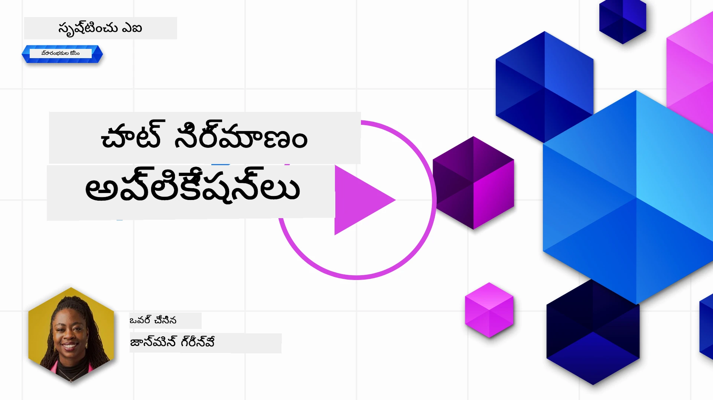
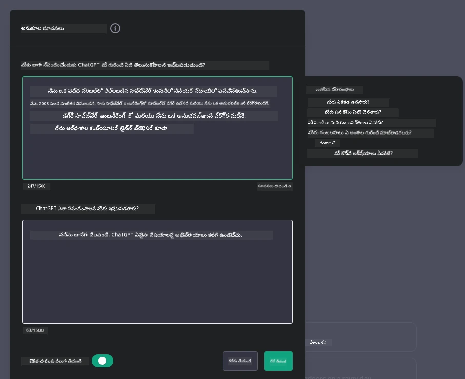

# జనరేటివ్ AI-చేత నడిపించే చాట్ అప్లికేషన్లు నిర్మాణం

[](https://youtu.be/R9V0ZY1BEQo?si=IHuU-fS9YWT8s4sA)

> _(ఈ పాఠం వీడియోను చూడడానికి పై చిత్రాన్ని క్లిక్ చేయండి)_

ఇప్పుడు మనం టెక్స్ట్-జనరేషన్ యాప్స్ ఎలా నిర్మించాలో చూశాం, కాబట్టి చాట్ అప్లికేషన్లను పరిశీలిద్దాం.

చాట్ అప్లికేషన్లు మన దైనందిన జీవితాల్లో అనుసంధానమయ్యాయి, కేవలం సాధారణ సంభాషణకు మాత్రమే కాకుండా. అవి కస్టమర్ సర్వీస్, సాంకేతిక మద్దతు, మరియు సున్నితమైన సలహా వ్యవస్థలలో కీలక భాగాలు. మీరు కొద్ది కాలం క్రితం చాట్ అప్లికేషన్ నుండి సహాయం పొందినట్లే ఉంటుంది. జనరేటివ్ AI వంటి అధునాతన సాంకేతికతలను ఈ వేదికలలో అనుసంధానించగా, సంక్లిష్టత పెరుగుతుంది మరియు సవాళ్లు కూడా పెరుగుతాయి.

మనం సమాధానం పొందవలసిన కొన్ని ప్రశ్నలు:

- **యాప్ నిర్మాణం**. నిర్దిష్ట ఉపయోగాల కోసం ఈ AI-చేత నడిపించే అప్లికేషన్లను సమర్థవంతంగా ఎలా నిర్మించి సజావుగా అనుసంధానించాలి?
- **మానిటరింగ్**. ఒకసారి అమలు చేసిన తర్వాత, అప్లికేషన్లు ఫంక్షనాలిటీ మరియు [బాధ్యతాయుత AI ఆరు సూత్రాలు](https://www.microsoft.com/ai/responsible-ai?WT.mc_id=academic-105485-koreyst) పాటించడం పరంగా అత్యున్నత నాణ్యత స్థాయిలో పనిచేస్తున్నాయా అని ఎలా పర్యవేక్షించాలి?

ఆటోమేషన్ మరియు సజావుగా మానవ-యంత్ర పరస్పర చర్యల యుగంలో ముందుకు పోతూ, జనరేటివ్ AI చాట్ అప్లికేషన్ల పరిధి, లోతు, మరియు అనుకూలతను ఎలా మార్చుతుందో అర్థం చేసుకోవడం అవసరం. ఈ పాఠం ఈ సంక్లిష్ట వ్యవస్థలను మద్దతు ఇచ్చే ఆర్కిటెక్చర్ అంశాలను పరిశీలిస్తుంది, డొమైన్-స్పెసిఫిక్ పనుల కోసం వాటిని ఫైన్-ట్యూన్ చేయడానికి పద్ధతులను లోతుగా చూస్తుంది, మరియు బాధ్యతాయుత AI అమలుకు సంబంధించిన ప్రమాణాలు మరియు పరిగణనలను అంచనా వేస్తుంది.

## పరిచయం

ఈ పాఠం కవర్ చేస్తుంది:

- చాట్ అప్లికేషన్లను సమర్థవంతంగా నిర్మించడం మరియు అనుసంధానించడం కోసం సాంకేతికతలు.
- అప్లికేషన్లకు అనుకూలీకరణ మరియు ఫైన్-ట్యూనింగ్ ఎలా చేయాలో.
- చాట్ అప్లికేషన్లను సమర్థవంతంగా పర్యవేక్షించడానికి వ్యూహాలు మరియు పరిగణనలు.

## నేర్చుకునే లక్ష్యాలు

ఈ పాఠం ముగిసిన తర్వాత, మీరు చేయగలుగుతారు:

- చాట్ అప్లికేషన్లను నిర్మించడం మరియు ఉన్న వ్యవస్థల్లో అనుసంధానించడంపై పరిగణనలు వివరించగలగడం.
- నిర్దిష్ట ఉపయోగాల కోసం చాట్ అప్లికేషన్లను అనుకూలీకరించడం.
- AI-చేత నడిపించే చాట్ అప్లికేషన్ల నాణ్యతను సమర్థవంతంగా పర్యవేక్షించడానికి ముఖ్యమైన ప్రమాణాలు మరియు పరిగణనలను గుర్తించడం.
- చాట్ అప్లికేషన్లు AIని బాధ్యతాయుతంగా ఉపయోగించేటట్లు నిర్ధారించడం.

## జనరేటివ్ AIని చాట్ అప్లికేషన్లలో అనుసంధానం

జనరేటివ్ AI ద్వారా చాట్ అప్లికేషన్లను మెరుగుపరచడం కేవలం వాటిని తెలివైనవిగా మార్చడమే కాదు; ఇది వారి ఆర్కిటెక్చర్, పనితీరు, మరియు వినియోగదారుల ఇంటర్‌ఫేస్‌ను మెరుగుపరచి ఉత్తమ వినియోగదార అనుభవాన్ని అందించడం. ఇది ఆర్కిటెక్చర్ ఆధారాలు, API అనుసంధానాలు, మరియు వినియోగదారుల ఇంటర్‌ఫేస్ పరిగణనలను పరిశీలించడం అవసరం. ఈ విభాగం మీకు ఈ సంక్లిష్ట భూభాగాలను సులభంగా నావిగేట్ చేయడానికి సమగ్ర మార్గదర్శకాన్ని అందించడానికి లక్ష్యంగా ఉంది, మీరు వాటిని ఉన్న వ్యవస్థల్లో అనుసంధానిస్తున్నారా లేదా స్వతంత్ర వేదికలుగా నిర్మిస్తున్నారా అన్నది.

ఈ విభాగం ముగిసినప్పుడు, మీరు చాట్ అప్లికేషన్లను సమర్థవంతంగా నిర్మించి అనుసంధానించడానికి కావలసిన నైపుణ్యాలతో సన్నద్ధమవుతారు.

### చాట్‌బాట్ లేదా చాట్ అప్లికేషన్?

చాట్ అప్లికేషన్లు నిర్మించడానికి ముందుగా, 'చాట్‌బాట్లు' మరియు 'AI-చేత నడిపించే చాట్ అప్లికేషన్లు' మధ్య తేడాలను చూద్దాం, ఇవి వేర్వేరు పాత్రలు మరియు ఫంక్షనాలిటీలను అందిస్తాయి. చాట్‌బాట్ ప్రధాన ఉద్దేశ్యం నిర్దిష్ట సంభాషణ పనులను ఆటోమేట్ చేయడం, ఉదాహరణకు తరచుగా అడిగే ప్రశ్నలకు సమాధానం ఇవ్వడం లేదా ప్యాకేజీ ట్రాకింగ్ చేయడం. ఇది సాధారణంగా నియమాల ఆధారిత లాజిక్ లేదా సంక్లిష్ట AI అల్గోరిథమ్స్ ద్వారా నియంత్రించబడుతుంది. విరుద్ధంగా, AI-చేత నడిపించే చాట్ అప్లికేషన్ అనేది విస్తృతమైన వాతావరణం, ఇది మానవ వినియోగదారుల మధ్య టెక్స్ట్, వాయిస్, మరియు వీడియో చాట్ల వంటి వివిధ రకాల డిజిటల్ కమ్యూనికేషన్‌ను సులభతరం చేస్తుంది. దీని ప్రత్యేక లక్షణం జనరేటివ్ AI మోడల్ అనుసంధానం, ఇది వివిధ ఇన్‌పుట్ మరియు సందర్భ సూచనల ఆధారంగా సున్నితమైన, మానవ-లాగే సంభాషణలను అనుకరించి ప్రతిస్పందనలు సృష్టిస్తుంది. జనరేటివ్ AI-చేత నడిపించే చాట్ అప్లికేషన్ ఓపెన్-డొమైన్ చర్చల్లో పాల్గొనగలదు, అభివృద్ధి చెందుతున్న సంభాషణ సందర్భాలకు అనుగుణంగా మారగలదు, మరియు సృజనాత్మక లేదా సంక్లిష్ట సంభాషణలను కూడా ఉత్పత్తి చేయగలదు.

కింది పట్టిక వాటి ప్రత్యేక పాత్రలను అర్థం చేసుకోవడానికి ముఖ్య తేడాలు మరియు సమానతలను వివరించును.

| చాట్‌బాట్                               | జనరేటివ్ AI-చేత నడిపించే చాట్ అప్లికేషన్ |
| ------------------------------------- | -------------------------------------- |
| పనిపై దృష్టి మరియు నియమాల ఆధారిత     | సందర్భాన్ని గ్రహించే                     |
| తరచుగా పెద్ద వ్యవస్థల్లో అనుసంధానించబడుతుంది | ఒకటి లేదా అనేక చాట్‌బాట్లను హోస్ట్ చేయవచ్చు |
| ప్రోగ్రామ్ చేసిన ఫంక్షన్లకు పరిమితం   | జనరేటివ్ AI మోడల్స్‌ను కలిగి ఉంటుంది       |
| ప్రత్యేక మరియు నిర్మిత సంభాషణలు        | ఓపెన్-డొమైన్ చర్చలకు సామర్థ్యం కలిగి ఉంది |

### SDKలు మరియు APIలతో ముందుగా నిర్మించిన ఫంక్షనాలిటీలను ఉపయోగించడం

చాట్ అప్లికేషన్ నిర్మించేటప్పుడు, ముందుగా ఉన్న వాటిని అంచనా వేయడం మంచి మొదటి దశ. SDKలు మరియు APIలను ఉపయోగించి చాట్ అప్లికేషన్లను నిర్మించడం అనేక కారణాల వల్ల ప్రయోజనకరం. బాగా డాక్యుమెంటెడ్ SDKలు మరియు APIలను అనుసంధానించడం ద్వారా, మీరు మీ అప్లికేషన్‌ను దీర్ఘకాలిక విజయానికి వ్యూహాత్మకంగా సిద్ధం చేస్తారు, స్కేలబిలిటీ మరియు నిర్వహణ సమస్యలను పరిష్కరిస్తారు.

- **అభివృద్ధి ప్రక్రియను వేగవంతం చేసి ఓవర్‌హెడ్ తగ్గిస్తుంది**: స్వయంగా నిర్మించడంలో ఖర్చు ఎక్కువగా ఉండే ఫంక్షనాలిటీలను ఉపయోగించడం ద్వారా, మీరు మీ అప్లికేషన్‌లో మరింత ముఖ్యమైన అంశాలపై, ఉదాహరణకు వ్యాపార లాజిక్, దృష్టి పెట్టవచ్చు.
- **మంచి పనితీరు**: ఫంక్షనాలిటీని మొదలుండి నిర్మిస్తున్నప్పుడు, "ఇది ఎలా స్కేల్ అవుతుంది? ఈ అప్లికేషన్ అకస్మాత్తుగా ఎక్కువ వినియోగదారులను ఎలా నిర్వహిస్తుంది?" అని మీరు అడగవచ్చు. బాగా నిర్వహించబడిన SDKలు మరియు APIలు ఈ సమస్యలకు అంతర్గత పరిష్కారాలను కలిగి ఉంటాయి.
- **సులభమైన నిర్వహణ**: నవీకరణలు మరియు మెరుగుదలలు సులభంగా నిర్వహించవచ్చు, ఎందుకంటే ఎక్కువ APIలు మరియు SDKలు కొత్త వెర్షన్ విడుదలైనప్పుడు లైబ్రరీని మాత్రమే నవీకరించాల్సి ఉంటుంది.
- **అత్యాధునిక సాంకేతికతకు ప్రాప్తి**: విస్తృత డేటాసెట్‌లపై ఫైన్-ట్యూన్ చేయబడిన మరియు శిక్షణ పొందిన మోడల్స్‌ను ఉపయోగించడం ద్వారా మీ అప్లికేషన్‌కు సహజ భాషా సామర్థ్యాలు లభిస్తాయి.

SDK లేదా API యొక్క ఫంక్షనాలిటీకి ప్రాప్తి సాధారణంగా అందించిన సేవలను ఉపయోగించడానికి అనుమతి పొందడం ద్వారా జరుగుతుంది, ఇది సాధారణంగా ప్రత్యేక కీ లేదా ఆథెంటికేషన్ టోకెన్ ద్వారా ఉంటుంది. మనం OpenAI Python లైబ్రరీని ఉపయోగించి దీన్ని ఎలా చేయాలో పరిశీలిస్తాము. మీరు ఈ పాఠం కోసం క్రింది [OpenAI కోసం నోట్బుక్](./python/oai-assignment.ipynb?WT.mc_id=academic-105485-koreyst) లేదా [Azure OpenAI సేవల కోసం నోట్బుక్](./python/aoai-assignment.ipynb?WT.mc_id=academic-105485-koreys)లో కూడా ప్రయత్నించవచ్చు.

```python
import os
from openai import OpenAI

API_KEY = os.getenv("OPENAI_API_KEY","")

client = OpenAI(
    api_key=API_KEY
    )

chat_completion = client.chat.completions.create(model="gpt-3.5-turbo", messages=[{"role": "user", "content": "Suggest two titles for an instructional lesson on chat applications for generative AI."}])
```

పై ఉదాహరణలో GPT-3.5 Turbo మోడల్‌ను ప్రాంప్ట్ పూర్తి చేయడానికి ఉపయోగించారు, కానీ API కీ ముందుగా సెట్ చేయబడింది. మీరు కీ సెట్ చేయకపోతే తప్పు వస్తుంది.

## వినియోగదార అనుభవం (UX)

సాధారణ UX సూత్రాలు చాట్ అప్లికేషన్లకు వర్తిస్తాయి, కానీ యంత్ర అభ్యాస భాగాలు ఉన్నందున కొన్ని అదనపు పరిగణనలు ముఖ్యమవుతాయి.

- **అస్పష్టతను పరిష్కరించే యంత్రాంగం**: జనరేటివ్ AI మోడల్స్ కొన్నిసార్లు అస్పష్ట సమాధానాలు ఉత్పత్తి చేస్తాయి. వినియోగదారులు స్పష్టత కోసం అడగగలిగే ఫీచర్ ఉంటే ఇది సహాయకరం.
- **సందర్భం నిలుపుకోవడం**: అధునాతన జనరేటివ్ AI మోడల్స్ సంభాషణలో సందర్భాన్ని గుర్తుంచుకునే సామర్థ్యం కలిగి ఉంటాయి, ఇది వినియోగదార అనుభవానికి అవసరమైన ఆస్తి. వినియోగదారులకు సందర్భాన్ని నియంత్రించడానికి మరియు నిర్వహించడానికి అవకాశం ఇవ్వడం అనుభవాన్ని మెరుగుపరుస్తుంది, కానీ సున్నితమైన వినియోగదార సమాచారం నిలుపుకోవడంలో ప్రమాదాన్ని కలిగిస్తుంది. ఈ సమాచారాన్ని ఎంతకాలం నిలుపుకోవాలో, ఉదాహరణకు నిలుపుదల విధానాన్ని ప్రవేశపెట్టడం వంటి పరిగణనలు, సందర్భం అవసరాన్ని గోప్యతతో సమతుల్యం చేస్తాయి.
- **వ్యక్తిగతీకరణ**: నేర్చుకుని అనుకూలమయ్యే సామర్థ్యంతో, AI మోడల్స్ వినియోగదారునికి వ్యక్తిగత అనుభవాన్ని అందిస్తాయి. వినియోగదార ప్రొఫైల్స్ వంటి ఫీచర్ల ద్వారా అనుభవాన్ని అనుకూలీకరించడం వినియోగదారుని అర్థం చేసుకున్నట్లు భావింపజేస్తుంది, అలాగే నిర్దిష్ట సమాధానాలను కనుగొనడంలో సహాయపడుతుంది, ఇది మరింత సమర్థవంతమైన మరియు సంతృప్తికరమైన పరస్పర చర్యను సృష్టిస్తుంది.

అటువంటి వ్యక్తిగతీకరణ ఉదాహరణగా OpenAI యొక్క ChatGPTలో "Custom instructions" సెట్టింగ్స్ ఉన్నాయి. ఇది మీ ప్రాంప్ట్‌లకు ముఖ్యమైన సందర్భం కావచ్చు అని మీ గురించి సమాచారం అందించడానికి అనుమతిస్తుంది. కింది ఉదాహరణ ఒక కస్టమ్ సూచన.



ఈ "ప్రొఫైల్" ChatGPTని లింక్డ్ లిస్టులపై పాఠ్య ప్రణాళిక రూపొందించమని ప్రేరేపిస్తుంది. వినియోగదారుని అనుభవం ఆధారంగా మరింత లోతైన పాఠ్య ప్రణాళిక కావాలని ChatGPT పరిగణలోకి తీసుకుంటుంది.


### Microsoft యొక్క పెద్ద భాషా మోడల్స్ కోసం సిస్టమ్ మెసేజ్ ఫ్రేమ్‌వర్క్

[Microsoft సూచనలు అందించింది](https://learn.microsoft.com/azure/ai-services/openai/concepts/system-message#define-the-models-output-format?WT.mc_id=academic-105485-koreyst) LLMల నుండి ప్రతిస్పందనలు సృష్టించేటప్పుడు సమర్థవంతమైన సిస్టమ్ మెసేజ్‌లు రాయడానికి, ఇది 4 ప్రాంతాలుగా విభజించబడింది:

1. మోడల్ ఎవరికో, దాని సామర్థ్యాలు మరియు పరిమితులు నిర్వచించడం.
2. మోడల్ అవుట్‌పుట్ ఫార్మాట్ నిర్వచించడం.
3. మోడల్ ఉద్దేశించిన ప్రవర్తనను చూపించే నిర్దిష్ట ఉదాహరణలు అందించడం.
4. అదనపు ప్రవర్తనా రక్షణలు అందించడం.

### ప్రాప్యత

వినియోగదారుని దృష్టి, శ్రవణ, మోటార్, లేదా జ్ఞాన సంబంధ ఇబ్బందులు ఉన్నా, బాగా రూపకల్పన చేసిన చాట్ అప్లికేషన్ అందరికీ ఉపయోగపడాలి. క్రింది జాబితా వివిధ వినియోగదారుల ఇబ్బందులకు ప్రాప్యతను మెరుగుపరచడానికి లక్ష్యంగా ఉన్న ప్రత్యేక ఫీచర్లను వివరించును.

- **దృష్టి ఇబ్బందులకు ఫీచర్లు**: హై కాంట్రాస్ట్ థీమ్స్ మరియు పరిమాణం మార్చగల టెక్స్ట్, స్క్రీన్ రీడర్ అనుకూలత.
- **శ్రవణ ఇబ్బందులకు ఫీచర్లు**: టెక్స్ట్-టు-స్పీచ్ మరియు స్పీచ్-టు-టెక్స్ట్ ఫంక్షన్లు, ఆడియో నోటిఫికేషన్లకు దృశ్య సూచనలు.
- **మోటార్ ఇబ్బందులకు ఫీచర్లు**: కీబోర్డ్ నావిగేషన్ మద్దతు, వాయిస్ కమాండ్లు.
- **జ్ఞాన ఇబ్బందులకు ఫీచర్లు**: సరళీకృత భాషా ఎంపికలు.

## డొమైన్-స్పెసిఫిక్ భాషా మోడల్స్ కోసం అనుకూలీకరణ మరియు ఫైన్-ట్యూనింగ్

మీ కంపెనీ జార్గాన్‌ను అర్థం చేసుకునే, మరియు దాని వినియోగదారుల సాధారణ ప్రశ్నలను ముందుగానే ఊహించే చాట్ అప్లికేషన్‌ను ఊహించండి. కొన్ని పద్ధతులు ఉన్నాయి:

- **DSL మోడల్స్‌ను ఉపయోగించడం**. DSL అంటే డొమైన్ స్పెసిఫిక్ లాంగ్వేజ్. మీరు నిర్దిష్ట డొమైన్‌పై శిక్షణ పొందిన DSL మోడల్‌ను ఉపయోగించి దాని భావాలు మరియు పరిస్థితులను అర్థం చేసుకోవచ్చు.
- **ఫైన్-ట్యూనింగ్ చేయడం**. ఫైన్-ట్యూనింగ్ అనేది మీ మోడల్‌ను నిర్దిష్ట డేటాతో మరింత శిక్షణ ఇవ్వడం.

## అనుకూలీకరణ: DSL ఉపయోగించడం

డొమైన్-స్పెసిఫిక్ భాషా మోడల్స్ (DSL మోడల్స్) వినియోగదారుల పాల్గొనుటను పెంచుతాయి మరియు ప్రత్యేక, సందర్భానుగుణ సంభాషణలను అందిస్తాయి. ఇది ఒక మోడల్, ఇది నిర్దిష్ట రంగం, పరిశ్రమ, లేదా విషయం సంబంధిత టెక్స్ట్‌ను అర్థం చేసుకోవడానికి లేదా ఉత్పత్తి చేయడానికి శిక్షణ పొందింది లేదా ఫైన్-ట్యూన్ చేయబడింది. DSL మోడల్ ఉపయోగించే ఎంపికలు మొదలుండి శిక్షణ ఇవ్వడం నుండి SDKలు మరియు APIల ద్వారా ఇప్పటికే ఉన్న వాటిని ఉపయోగించడం వరకు ఉంటాయి. మరో ఎంపిక ఫైన్-ట్యూనింగ్, అంటే ఇప్పటికే శిక్షణ పొందిన మోడల్‌ను తీసుకుని నిర్దిష్ట డొమైన్ కోసం అనుకూలీకరించడం.

## అనుకూలీకరణ: ఫైన్-ట్యూనింగ్ చేయడం

ఫైన్-ట్యూనింగ్ సాధారణంగా ఒక ప్రీ-ట్రెయిన్ చేసిన మోడల్ ప్రత్యేక డొమైన్ లేదా నిర్దిష్ట పనిలో తక్కువగా పనిచేస్తున్నప్పుడు పరిగణించబడుతుంది.

ఉదాహరణకు, వైద్య ప్రశ్నలు సంక్లిష్టమైనవి మరియు చాలా సందర్భాన్ని అవసరం చేస్తాయి. వైద్య నిపుణుడు రోగిని నిర్ధారణ చేసే సమయంలో జీవనశైలి లేదా ముందస్తు పరిస్థితులు వంటి వివిధ అంశాలను పరిగణలోకి తీసుకుంటాడు, మరియు ఇటీవల వైద్య జర్నల్స్ ఆధారంగా తన నిర్ధారణను ధృవీకరించవచ్చు. ఇలాంటి సున్నితమైన సందర్భాల్లో, సాధారణ AI చాట్ అప్లికేషన్ నమ్మదగిన వనరు కాదు.

### సందర్భం: వైద్య అప్లికేషన్

వైద్య నిపుణులకు చికిత్స మార్గదర్శకాలు, ఔషధ పరస్పర చర్యలు, లేదా తాజా పరిశోధన ఫలితాలకు త్వరిత సూచనలు అందించే చాట్ అప్లికేషన్‌ను పరిగణించండి.

సాధారణ మోడల్ ప్రాథమిక వైద్య ప్రశ్నలకు సమాధానం ఇవ్వడంలో లేదా సాధారణ సలహా అందించడంలో సరిపోవచ్చు, కానీ ఈ క్రింది వాటిలో ఇబ్బంది పడవచ్చు:

- **అత్యంత నిర్దిష్ట లేదా సంక్లిష్ట కేసులు**. ఉదాహరణకు, న్యూరాలజిస్ట్ అప్లికేషన్‌ను అడగవచ్చు, "పిల్లల రోగుల్లో ఔషధ-ప్రతిరోధక మూర్ఛల నిర్వహణకు ప్రస్తుత ఉత్తమ పద్ధతులు ఏమిటి?"
- **తాజా అభివృద్ధులు లేమి**. సాధారణ మోడల్ న్యూరాలజీ మరియు ఫార్మకోలజీలో తాజా అభివృద్ధులను కలిగి సమాధానం ఇవ్వడంలో ఇబ్బంది పడవచ్చు.

ఇలాంటి సందర్భాల్లో, ప్రత్యేక వైద్య డేటాసెట్‌తో మోడల్‌ను ఫైన్-ట్యూన్ చేయడం ఈ సంక్లిష్ట వైద్య ప్రశ్నలను మరింత ఖచ్చితంగా మరియు నమ్మదగిన విధంగా నిర్వహించగల సామర్థ్యాన్ని గణనీయంగా మెరుగుపరుస్తుంది. దీనికి పెద్ద మరియు సంబంధిత డేటాసెట్‌కు ప్రాప్తి అవసరం, ఇది డొమైన్-స్పెసిఫిక్ సవాళ్లు మరియు ప్రశ్నలను ప్రతిబింబిస్తుంది.

## ఉన్నత నాణ్యత AI-చేత నడిపించే చాట్ అనుభవం కోసం పరిగణనలు

ఈ విభాగం "ఉన్నత నాణ్యత" చాట్ అప్లికేషన్ల కోసం ప్రమాణాలను వివరించును, వీటిలో కార్యాచరణ ప్రమాణాల సేకరణ మరియు AI సాంకేతికతను బాధ్యతాయుతంగా ఉపయోగించే ఫ్రేమ్‌వర్క్ పాటించడం ఉన్నాయి.

### ముఖ్యమైన ప్రమాణాలు

అప్లికేషన్ యొక్క ఉన్నత నాణ్యత పనితీరును నిలబెట్టుకోవడానికి, ముఖ్యమైన ప్రమాణాలు మరియు పరిగణనలను పర్యవేక్షించడం అవసరం. ఈ కొలతలు అప్లికేషన్ యొక్క ఫంక్షనాలిటీని మాత్రమే కాకుండా AI మోడల్ మరియు వినియోగదార అనుభవం నాణ్యతను కూడా అంచనా వేస్తాయి. క్రింద ప్రాథమిక, AI, మరియు వినియోగదార అనుభవ ప్రమాణాలను పరిగణించాల్సిన జాబితా ఉంది.

| ప్రమాణం                      | నిర్వచనం                                                                                                               | చాట్ డెవలపర్ కోసం పరిగణనలు                                         |
| ---------------------------- | ---------------------------------------------------------------------------------------------------------------------- | ------------------------------------------------------------------- |
| **ఉపలభ్యత (Uptime)**       | అప్లికేషన్ పనిచేస్తున్న మరియు వినియోగదారులకు అందుబాటులో ఉన్న సమయం కొలుస్తుంది.                                         | డౌన్‌టైమ్‌ను ఎలా తగ్గిస్తారు?                                       |
| **ప్రతిస్పందన సమయం**        | వినియోగదారుని ప్రశ్నకు అప్లికేషన్ స్పందించడానికి తీసుకునే సమయం.                                                         | ప్రతిస్పందన సమయాన్ని మెరుగుపరచడానికి ప్రశ్న ప్రాసెసింగ్‌ను ఎలా ఆప్టిమైజ్ చేస్తారు? |
| **నిర్దిష్టత (Precision)**   | నిజమైన పాజిటివ్ అంచనాల నిష్పత్తి మొత్తం పాజిటివ్ అంచనాలపై.                                                             | మీ మోడల్ యొక్క నిర్దిష్టతను ఎలా ధృవీకరిస్తారు?                      |
| **రికాల్ (సెన్సిటివిటీ)**    | నిజమైన పాజిటివ్ అంచనాల నిష్పత్తి నిజమైన పాజిటివ్‌ల సంఖ్యపై.                                                            | రికాల్‌ను ఎలా కొలుస్తారు మరియు మెరుగుపరుస్తారు?                      |
| **F1 స్కోరు**                | నిర్దిష్టత మరియు రికాల్ యొక్క హార్మోనిక్ సగటు, రెండింటి మధ్య సమతుల్యతను కలిగి ఉంటుంది.                                    | మీ లక్ష్య F1 స్కోరు ఏమిటి? నిర్దిష్టత మరియు రికాల్‌ను ఎలా సమతుల్యం చేస్తారు? |
| **పర్ప్లెక్సిటీ**            | మోడల్ అంచనా వేయబడిన ప్రాబబిలిటీ పంపిణీ నిజమైన డేటా పంపిణీకి ఎంత దగ్గరగా ఉందో కొలుస్తుంది.                                | పర్ప్లెక్సిటీని ఎలా తగ్గిస్తారు?                                     |
| **వినియోగదార సంతృప్తి ప్రమాణాలు** | వినియోగదారుని అప్లికేషన్ పట్ల అభిప్రాయాన్ని కొలుస్తుంది. సాధారణంగా సర్వేలు ద్వారా సేకరించబడుతుంది.                        | వినియోగదార అభిప్రాయాన్ని ఎంత తరచుగా సేకరిస్తారు? దాని ఆధారంగా ఎలా అనుకూలిస్తారు? |
| **లోపాల రేటు**              | మోడల్ అర్థం చేసుకోవడంలో లేదా అవుట్‌పుట్‌లో తప్పులు చేసే రేటు.                                                              | లోపాల రేటును తగ్గించడానికి మీ వద్ద ఏ వ్యూహాలు ఉన్నాయి?                 |
| **మళ్లీ శిక్షణ సైకిళ్లు**   | కొత్త డేటా మరియు అవగాహనలను చేర్చడానికి మోడల్‌ను ఎన్ని సార్లు నవీకరిస్తారు.                                                | మీరు ఎంత తరచుగా మోడల్‌ను మళ్లీ శిక్షణ ఇస్తారు? మళ్లీ శిక్షణ సైకిల్‌ను ఏం ప్రేరేపిస్తుంది? |
| **అసాధారణ గుర్తింపు**         | ఆశించిన ప్రవర్తనకు అనుగుణంగా లేని అసాధారణ నమూనాలను గుర్తించడానికి టూల్స్ మరియు సాంకేతికతలు.                        | అసాధారణాలకు మీరు ఎలా స్పందిస్తారు?                                        |

### చాట్ అప్లికేషన్లలో బాధ్యతాయుత AI ఆచరణలను అమలు చేయడం

Microsoft యొక్క బాధ్యతాయుత AI దృష్టికోణం ఆరు సూత్రాలను గుర్తించింది, ఇవి AI అభివృద్ధి మరియు ఉపయోగానికి మార్గదర్శకంగా ఉండాలి. క్రింద సూత్రాలు, వాటి నిర్వచనం, మరియు చాట్ డెవలపర్ ఏమి పరిగణించాలి మరియు ఎందుకు వాటిని గంభీరంగా తీసుకోవాలి అనే విషయాలు ఉన్నాయి.

| సూత్రాలు             | Microsoft నిర్వచనం                                | చాట్ డెవలపర్ కోసం పరిగణనలు                                      | ఇది ఎందుకు ముఖ్యమైనది                                                                     |
| ---------------------- | ----------------------------------------------------- | ---------------------------------------------------------------------- | -------------------------------------------------------------------------------------- |
| న్యాయం               | AI వ్యవస్థలు అందరితో సమానంగా వ్యవహరించాలి.            | చాట్ అప్లికేషన్ వినియోగదారుల డేటా ఆధారంగా వివక్ష చేయకూడదు.  | వినియోగదారుల మధ్య నమ్మకం మరియు సమగ్రతను నిర్మించడానికి; చట్టపరమైన పరిణామాలను నివారించడానికి.                |
| నమ్మకదారితనం మరియు భద్రత | AI వ్యవస్థలు నమ్మకదారిగా మరియు భద్రంగా పనిచేయాలి.        | లోపాలు మరియు ప్రమాదాలను తగ్గించడానికి పరీక్షలు మరియు ఫెయిల్-సేఫ్‌లు అమలు చేయండి.         | వినియోగదారుల సంతృప్తిని నిర్ధారిస్తుంది మరియు సంభవించే హానిని నివారిస్తుంది.                                 |
| గోప్యత మరియు భద్రత   | AI వ్యవస్థలు భద్రంగా ఉండాలి మరియు గోప్యతను గౌరవించాలి.      | బలమైన ఎన్‌క్రిప్షన్ మరియు డేటా రక్షణ చర్యలను అమలు చేయండి.              | సున్నితమైన వినియోగదారుల డేటాను రక్షించడానికి మరియు గోప్యతా చట్టాలను పాటించడానికి.                         |
| సమగ్రత          | AI వ్యవస్థలు అందరినీ శక్తివంతం చేయాలి మరియు ప్రజలను పాల్గొననివ్వాలి. | విభిన్న ప్రేక్షకుల కోసం సులభంగా ఉపయోగించదగిన UI/UX డిజైన్ చేయండి. | విస్తృత శ్రేణి ప్రజలు అప్లికేషన్‌ను సమర్థవంతంగా ఉపయోగించగలుగుతారు.                   |
| పారదర్శకత           | AI వ్యవస్థలు అర్థమయ్యేలా ఉండాలి.                  | AI ప్రతిస్పందనలకు స్పష్టమైన డాక్యుమెంటేషన్ మరియు కారణాలను అందించండి.            | నిర్ణయాలు ఎలా తీసుకోబడుతున్నాయో వినియోగదారులు అర్థం చేసుకుంటే వారు వ్యవస్థపై ఎక్కువ నమ్మకం పెడతారు. |
| బాధ్యతాయుతత్వం         | AI వ్యవస్థల కోసం ప్రజలు బాధ్యత వహించాలి.          | AI నిర్ణయాలను ఆడిట్ చేయడం మరియు మెరుగుపరచడం కోసం స్పష్టమైన ప్రక్రియను ఏర్పాటు చేయండి.     | తప్పుల సందర్భంలో నిరంతర మెరుగుదల మరియు సవరణ చర్యలను సాధ్యం చేస్తుంది.               |

## అసైన్‌మెంట్

[assignment](../../../07-building-chat-applications/python) చూడండి. ఇది మీ మొదటి చాట్ ప్రాంప్ట్‌లను నడిపించడం, వర్గీకరణ మరియు టెక్స్ట్ సారాంశం చేయడం మరియు మరిన్ని వ్యాయామాల సిరీస్ ద్వారా మీను తీసుకుపోతుంది. అసైన్‌మెంట్‌లు వివిధ ప్రోగ్రామింగ్ భాషలలో అందుబాటులో ఉన్నాయని గమనించండి!

## అద్భుతమైన పని! ప్రయాణాన్ని కొనసాగించండి

ఈ పాఠం పూర్తి చేసిన తర్వాత, మా [Generative AI Learning collection](https://aka.ms/genai-collection?WT.mc_id=academic-105485-koreyst) ను చూడండి, మీ Generative AI జ్ఞానాన్ని మరింత పెంచుకోవడానికి!

[building search applications](../08-building-search-applications/README.md?WT.mc_id=academic-105485-koreyst) ఎలా ప్రారంభించాలో తెలుసుకోవడానికి పాఠం 8 కి వెళ్లండి!

---

<!-- CO-OP TRANSLATOR DISCLAIMER START -->
**అస్పష్టత**:  
ఈ పత్రాన్ని AI అనువాద సేవ [Co-op Translator](https://github.com/Azure/co-op-translator) ఉపయోగించి అనువదించబడింది. మేము ఖచ్చితత్వానికి ప్రయత్నించినప్పటికీ, ఆటోమేటెడ్ అనువాదాల్లో పొరపాట్లు లేదా తప్పిదాలు ఉండవచ్చు. మూల పత్రం దాని స్వదేశీ భాషలో అధికారిక మూలంగా పరిగణించాలి. ముఖ్యమైన సమాచారానికి, ప్రొఫెషనల్ మానవ అనువాదం సిఫార్సు చేయబడుతుంది. ఈ అనువాదం వాడకం వల్ల కలిగే ఏవైనా అపార్థాలు లేదా తప్పుదారుల బాధ్యత మేము తీసుకోము.
<!-- CO-OP TRANSLATOR DISCLAIMER END -->