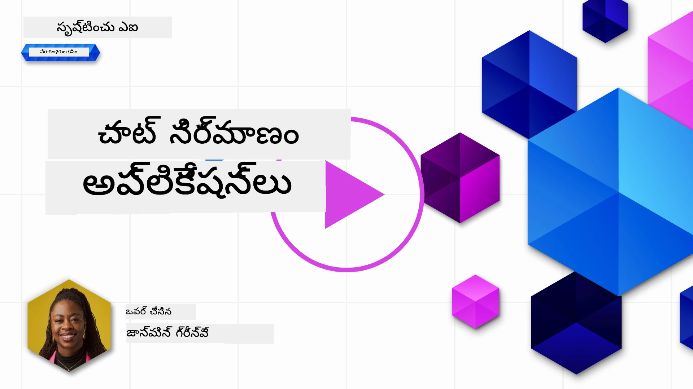
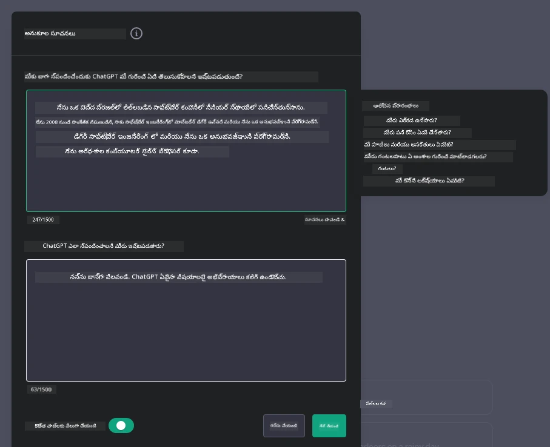

# జనరేటివ్ AI-సక్తిగల చాట్ అప్లికేషన్లు నిర్మించడం

[](https://youtu.be/R9V0ZY1BEQo?si=IHuU-fS9YWT8s4sA)

> _(ఈ పాఠం వీడియో చూడటానికి పై చిత్రాన్ని క్లిక్ చేయండి)_

మనం టెక్స్ట్-జనరేషన్ ఆప్స్ ఎలా నిర్మించాలో చూసినప్పుడు, ఇప్పుడు చాట్ అప్లికేషన్లను పరిశీలిద్దాం.

చాట్ అప్లికేషన్లు మన రోజువారీ జీవితాలలో భాగమవుతున్నాయి, కేవలం సాధారణ సంభాషణ కోసం మాత్రమే కాకుండా. అవి కస్టమర్ సర్వీస్, టెక్నికల్ సపోర్ట్ మరియు మిన్ను సలహా వ్యవస్థల ముఖ్య భాగాలు. మీరు ప్రతిష్టాత్మకంగా ఇటీవలి కాలంలో ఒక చాట్ అప్లికేషన్ ద్వారా సహాయం పొందవచ్చు. మనం ఈ ప్లాట్‌ఫారమ్‌లలో జనరేటివ్ AI వంటి అధునాతన సాంకేతికతలను అనుసంధానించినప్పుడు, ఆ జటిలత పెరుగుతుంది మరియు సవాళ్లూ పెరుగుతాయి.

మనం సమాధానం తెలుసుకోవాల్సిన కొన్ని ప్రశ్నలు ఉన్నాయి:

- **అప్లికేషన్ నిర్మాణం**. ఈ AI-శక్తిగల అప్లికేషన్లను సమర్థవంతంగా ఎలా నిర్మించాలి మరియు నిరవధికంగా ప్రత్యేక ఉపయోగ సందర్భాలకు ఎలా అనుసంధానం చేసుకోవాలి?
- **మానిటరింగ్**. దీనిని ప్రవేశపెట్టిన వెంటనే, అప్లికేషన్లు ఎక్కువ శ్రేణి నాణ్యతతో పనిచేస్తున్నాయని ఎలా పర్యవేక్షించగలం, పనితీరు మరియు [సమగ్ర బాధ్యతాయుత AI ఆపద్ధతులు](https://www.microsoft.com/ai/responsible-ai?WT.mc_id=academic-105485-koreyst) పాటిస్తాయో ఎలా నిర్ధారించాలి?

ఆటోమేషన్ మరియు సజీవ మానవ-యంత్ర సూచికల యుగంలో ముందుకు సాగుతున్నప్పుడు, జనరేటివ్ AI చాట్ అప్లికేషన్ల స్థాయి, లోతు మరియు అనుకూలత ఎలా మార్చుతుందో అర్థం చేసుకోవడం అవసరం. ఈ పాఠం ఆ ఆర్కిటెక్చర్ వాలోపల జరిగే వివరాలపై పరిశోధన చేయనుంది, డొమైన్-స్పెసిఫిక్ పనుల కోసం బాగుచేసే విధానాలను వివరించనుంది, అలాగే బాధ్యతాయుత AI ప్రవేశపెట్టడంలో సంబంధించిన మాపదండాలు మరియు ఆలోచనలను పరిశీలిస్తుంది.

## పరిచయం

ఈ పాఠం కింద తెలిపిన అంశాలను కవర్ చేస్తుంది:

- చాట్ అప్లికేషన్లను సమర్థవంతంగా నిర్మించడం మరియు అనుసంధానం చేయడానికి విధానాలు.
- అప్లికేషన్లకు కస్టమైజేషన్ మరియు ఫైన్-ట్యూనింగ్‌ను ఎలా వర్తింపజేయాలి.
- చాట్ అప్లికేషన్లను సమర్థవంతంగా పర్యవేక్షించడానికి వ్యూహాలు మరియు ఆలోచనలు.

## అభ్యాస లక్ష్యాలు

ఈ పాఠం ముగింపు వద్ద, మీరు చేయగలిగేదిలా ఉంటారు:

- చాట్ అప్లికేషన్లను నిర్మించడం మరియు గల نظامాలలో అనుసంధానం చేయడంలో గుర్తించదగిన విషయాలు వివరించగలగడం.
- నిర్దిష్ట వినియోగ సందర్భాల కోసం చాట్ అప్లికేషన్లను కస్టమైజ్ చేయడం.
- AI-శక్తిగల చాట్ అప్లికేషన్ల నాణ్యతను సమర్థవంతంగా పర్యవేక్షించడానికి కీలకమైన మాప్ మరియు ఆలోచనలను గుర్తించడం.
- చాట్ అప్లికేషన్లు AIని బాధ్యతాయుతంగా ఉపయోగిస్తున్నాయనే విషయాన్ని నిర్ధారించడం.

## జనరేటివ్ AIని చాట్ అప్లికేషన్లలో ఏకీకృతం చేయడం

జనరేటివ్ AIతో చాట్ అప్లికేషన్లను మెరుగుపరచడం కేవలం వాటిని తెలివిగలవిగా చేయడమే కాకుండా, ఆర్కిటెక్చర్, పనితీరు మరియు యూజర్ ఇంటర్‌ఫేస్‌ను ఆప్టిమైజ్ చేయడం వల్ల ఉత్తమ వినియోగదారు అనుభవాన్ని అందించడంలో ఉంది. ఇందులో ఆర్కిటెక్చరల్ మూలాలు, API అనుసంధానాలు, మరియు యూజర్ ఇంటర్‌ఫేస్ ఆలోచనలు ఉన్నాయి. ఈ విభాగం, మీరు వాటిని ఉన్నత వ్యవస్థలలో అనుసంధానం చేయాలనుకుంటున్నారా లేదా స్వతంత్ర ప్లాట్‌ఫారమ్‌గా నిర్మించాలనుకుంటున్నారా, ఈ సంక్లిష్ట పరిసరాలలో సులభంగా నావిగేట్ చేయడానికి పూర్తిస్థాయి మార్గదర్శకాన్ని అందించడానికి లక్ష్యం.

ఈ విభాగం ముగింపు వరకు, మీరు చాట్ అప్లికేషన్లను సమర్థవంతంగా నిర్మించి, ఏకీకృతం చేయడానికి అవసరమైన నైపుణ్యాలను అందుకుంటారు.

### చాట్‌బాట్ లేదా చాట్ అప్లికేషన్?

చాట్ అప్లికేషన్లను నిర్మించడం ప్రారంభించడానికి ముందు, 'చాట్‌బాట్'లు మరియు 'AI-శక్తిగల చాట్ అప్లికేషన్లు' మధ్య తేడాలను మరియు ప్రత్యేక పాత్రలను పోల్చుకుందాం. చాట్‌బాట్ ప్రధాన ప్రయోజనం నిర్దిష్ట సంభాషణ పనుల ఆటోమేషన్, ఉదాహరణకు తరచుగా అడిగే ప్రశ్నలకు సమాధానమివ్వడం లేదా ప్యాకేజ్ ట్రాకింగ్. ఇది సాధారణంగా నియమాల ఆధారిత లాజిక్ లేదా సంక్లిష్ట AI అల్గోరిథమ్ల দ্বারা నియంత్రించబడుతుంది. విరుద్ధంగా, AI-శక్తిగల చాట్ అప్లికేషన్ అనేది మెటనపాటి డిజిటల్ కమ్యూనికేషన్ ఫారాలపై సహాయం చేయడానికి రూపొందించిన విస్తృత పరిసరమైన వాతావరణం, ఉదాహరణకు టెక్స్ట్, వాయిస్ మరియు వీడియో చాట్‌లు. దీని ముఖ్య లక్షణం జనరేటివ్ AI మోడల్ అనుసంధానం, ఇది నాజూకైన, మానవోపమ సంభాషణలను అనుకరిస్తుంది, విస్తృత రకాల ఇన్పుట్ మరియు పరిసర సూచనల ఆధారంగా ప్రతిస్పందనలు ఉత్పత్తి చేస్తుంది. జనరేటివ్ AI-శక్తిగల చాట్ అప్లికేషన్ తెరిచి-డొమైన్ చర్చల్లో పాల్గొనగలదు, పరివర్తన ఆధ్యాత్మాలను అనుసరించగలదు, సృజనాత్మక లేదా సంక్లిష్ట సంభాషణలను కూడా ఉత్పత్తి చేయగలదు.

క్రింద పట్టికలో వాటి ప్రత్యేక పాత్రలను అర్థం చేసుకోవడం కోసం ప్రధాన తేడాలు మరియు సమానతలు వివరించబడ్డాయి.

| చాట్‌బాట్                            | జనరేటివ్ AI-శక్తిగల చాట్ అప్లికేషన్          |
| --------------------------------- | -------------------------------------------- |
| పని-ఆధారిత మరియు నియమాల ఆధారిత     | పరిసర-జ్ఞానంతో                                   |
| తరచుగా పెద్ద వ్యవస్థలో అనుసంధానించబడును | ఒకటి లేదా అనేక చాట్‌బాట్లను హోస్ట్ చేయవచ్చు          |
| ప్రోగ్రామ్డ్ ఫంక్షన్లతో పరిమితమవుతుంది  | జనరేటివ్ AI మోడళ్లు అనుసంధానం చేయబడును             |
| స్పెషలైజ్డ్ & నిర్మాణాత్మక పరస్పర చర్యలు | తెరిచి-డొమైన్ చర్చలను నిర్వహించగలదు                 |

### SDKs మరియు APIs తో ముందుగానే నిర్మించిన ఫంక్షనాలిటీలను ఉపయోగించడం

చాట్ అప్లికేషన్ నిర్మించేటప్పుడు, ముందుగానే ఏవి అందుబాటులో ఉన్నాయో అంచనా వేయడం మంచి మొదటి దశ. SDKs మరియు APIs ఉపయోగించి చాట్ అప్లికేషన్లను తయారు చేయడం అనేక కారణాల వల్ల ప్రయోజనకరం. బాగా డాక్యుమెంట్ చేయబడిన SDKలు మరియు APIsని ఉపయోగించడం ద్వారా, మీరు మీ అప్లికేషన్‌ను దీర్ఘకాలిక విజయానికి అనుసంధానించడం, స్కేలబిలిటీ మరియు నిర్వహణా సమస్యలను పరిష్కరించడం సాధ్యం అవుతుంది.

- **అభివృద్ధి ప్రక్రియను వేగవంతం చేసి భారం తగ్గిస్తుంది**: స్వయంగా భారీ వ్యయం పెట్టకుండా ముందుగా రూపొందించిన పనులను ఆధారపడి ఉండడం, మీరు మీ అప్లికేషన్‌లో మరింత ముఖ్యమైన ఇతర అంశాలపై, ఉదాహరణకు వ్యాపార లాజిక్ పై దృష్టి పెట్టే అవకాశం ఇస్తుంది.
- **మంచి పనితీరు**: ఫంక్షనాలిటీని మొదట నుండి నిర్మిస్తున్నపుడు, "ఇది ఎలా స్కేల్ అవుతుంది? ఈ అప్లికేషన్ ఆకస్మికంగా వినియోగదారుల స్రవంతిని ఎలా నిర్వహిస్తుంది?" అన్న ప్రశ్నలు వస్తాయి. బాగా నిర్వహించిన SDKలు మరియు APIsలో ఈ అంశాలకు పరిష్కారాలు అంతర్గతంగా ఉంటుంది.
- **సులభమైన నిర్వహణ**: కొత్త వెర్షన్ విడుదలైనప్పుడు లైబ్రరీ అప్‌డేట్ చేయడం ద్వారా చాలా APIs మరియు SDKలు అప్డేట్లను సులభంగా నిర్వహిస్తాయి.
- **కట్టింగ్ ఎంజ్ సాంకేతికతకు ప్రాప్తి**: విస్తృత డేటాసెట్లపై ఫైన్-ట్యూన్ చేసిన మరియు శిక్షణ పొందిన మోడళ్లను ఉపయోగించడం ద్వారా మీ అప్లికేషన్‌కు సహజ భాషా సామర్థ్యాలు అందిస్తుంది.

SDK లేదా API ఫంక్షనాలిటీలను పొందటానికి సాధారణంగానే ప్రత్యేక కీ లేదా ఆథెంటికేషన్ టోకెన్ ద్వారా అనుమతి పొందటం అవసరం. మనం OpenAI Python లైబ్రరీని ఉపయోగించి దీన్ని ఎలా చేయాలో పరిశీలిస్తాము. మీరు కూడా ఈ పాఠం కోసం క్రింది [OpenAI కోసం నోట్బుక్](./python/oai-assignment.ipynb?WT.mc_id=academic-105485-koreyst) లేదా [Azure OpenAI సేవల కోసం నోట్బుక్](./python/aoai-assignment.ipynb?WT.mc_id=academic-105485-koreys) ప్రయత్నించవచ్చు.

```python
import os
from openai import OpenAI

API_KEY = os.getenv("OPENAI_API_KEY","")

client = OpenAI(
    api_key=API_KEY
    )

response = client.responses.create(model="gpt-5-mini", input="Suggest two titles for an instructional lesson on chat applications for generative AI.", store=False)
print(response.output_text)
```

పై ఉదాహరణలో GPT-5 మినీ మోడల్‌ను Responses APIతో ఉపయోగించి ప్రశ్న పూర్తి చేస్తారు, కానీ API కీ ముందుగా సెట్ చేయబడింది గమనించండి. మీరు కీ సెట్ చేయకపోతే ఎర్రర్ వస్తుంది.

## యూజర్ అనుభవం (UX)

సాధారణ UX సూత్రాలు చాట్ అప్లికేషన్లకు వర్తిస్తాయి, కానీ యంత్ర అభ్యాస భాగాలు ఉన్నందున కొన్ని అదనపు ఆలోచనలు ముఖ్యమవుతాయి.

- **అస్పష్టతకు సమాధానం ఇస్తే విధానం**: జనరేటివ్ AI మోడళ్లు కొన్నిసార్లు అస్పష్ట సమాధానాలు తయారు చేస్తాయి. ఇలాంటి సమస్య వచ్చినప్పుడు యూజర్లు వివరణ అడగడానికి సహాయం చేసే ఫీచర్ ఉండటం ప్రయోజనకరం.
- **పరిసరాన్ని జ్ఞాపకం ఉంచడం**: ఆధునిక జనరేటివ్ AI మోడళ్లు సంభాషణలో పరిసరాన్ని గుర్తుంచే సామర్థ్యం కలిగి ఉంటాయి, ఇది యూజర్ అనుభవానికి అవసరం కావచ్చు. యూజర్లకు పరిసరాన్ని నియంత్రించడానికి అవకాశం ఇవ్వడం అనుభవాన్ని మెరుగుపరుస్తుంది, అయితే కనీసం సున్నితమైన సమాచారాన్ని నిల్వ చేసే ప్రమాదం ఉంటుంది. ఇలాంటి సమాచారం ఎంతకాలం నిల్వ ఉంటుందో, నిల్వ విధానం ప్రవేశపెట్టడం ద్వారా గోప్యత అవసరంతో పరస్పర సంభ్రమం సరిచేయవచ్చు.
- **వ్యక్తిగతరణ**: నేర్చుకునే మరియు అనుకూలమయ్యే సామర్థ్యం కలిగిన AI మోడళ్లు యూజర్‌కు వ్యక్తిగత అనుభవాన్ని ఇస్తాయి. యూజర్ ప్రొఫైల్స్ వంటి ఫీచర్ల ద్వారా అనుభవాన్ని వ్యక్తిగతీకరించడం, యూజర్‌ను అర్థం చేసుకున్నట్టు అనిపించే విధంగా చేస్తుంది, అలాగే వారు నిర్దిష్ట సమాధానాలను కనుగొనటానికి సహాయపడుతుంది, దీనివల్ల మరింత సమర్థవంతమైన మరియు సంతృప్తికర అనుసంధానం ఏర్పడుతుంది.

ఒక అలాంటి వ్యక్తిగతరణ ఉదాహరణ OpenAI యొక్క ChatGPTలో "Custom instructions" సెట్టింగ్. ఇది మీ గురించి ముఖ్యమైన పరిసర సమాచారం అందించడానికి అనుమతిస్తుంది. కింది ఉదాహరణను చూడండి.



ఈ "ప్రొఫైల్" ChatGPTని లింక్డ్ లిస్ట్‌లపై పాఠ్య ప్రణాళికను తయారు చేయమని సూచిస్తుంది. ChatGPT యూజర్ అనుభవాన్ని పరిగణలోకి తీసుకొని లోతైన పాఠ్య ప్రణాళిక కోరుతుందని గమనించండి.


### పెద్ద భాషా మోడళ్ల కోసం Microsoft యొక్క సిస్టమ్ మెసేజ్ ఫ్రేమ్‌వర్క్

[Microsoft సూచనలు ఇచ్చింది](https://learn.microsoft.com/azure/ai-foundry/openai/concepts/system-message#define-the-models-output-format?WT.mc_id=academic-105485-koreyst) LLMల నుండి ప్రతిస్పందనలు సృష్టించే సమయం సరైన సిస్టమ్ మెసేజ్‌లను రాత కోసమే, ఇది 4 ప్రాంతాలుగా విభజించబడింది:

1. మోడల్ ఎవరికోసం, దాని సామర్థ్యాలు మరియు పరిమితులు నిర్వచించడం.
2. మోడల్ అవుట్పుట్ ఫార్మాట్ నిర్వచనం.
3. మోడల్ ఉద్దేశించిన ప్రవర్తనను చూపే ప్రత్యేక ఉదాహరణలు అందించడం.
4. అదనపు ప్రవర్తనా నియమాలు అందించడం.

### ప్రాప్యత

యూజర్ చూపిచే దృష్టి, శ్రవణ, మోటార్ లేదా జ్ఞాపక సంబంధ సమస్యలు ఉన్నా, బాగా రూపుదిద్దిన చాట్ అప్లికేషన్ అందరికీ ఉపయోగపడే విధంగా ఉండాలి. క్రింది జాబితా విభిన్న వినియోగదారుల లోపాలకు అనుగుణంగా ప్రాప్యత పెంపొందించే లక్ష్యంతో ప్రత్యేక ఫీచర్లను విభజిస్తుంది.

- **దృష్టి లోపం ఉన్న వారికి ఫీచర్లు**: అధిక విరుద్ధత థీమ్స్, పాఠ్యాన్ని పునర్ని కొనుగోలు చేయగల ఉపకరణాలు, స్క్రీన్ రీడర్ సరంజామా.
- **శ్రవణ లోపం ఉన్న వారికి ఫీచర్లు**: టెక్స్ట్-টু-స్పీచ్ మరియు స్పీచ్-టూ-టెక్స్ట్ ఫంక్షన్లు, ఆడియో అలర్ట్లకు దృశ్య సూచనలు.
- **మోటార్ లోపం ఉన్న వారికి ఫీచర్లు**: కీబోర్డ్ నావిగేషన్ మద్దతు, వాయిస్ కమాండ్లు.
- **జ్ఞాపక లోపం ఉన్న వారికి ఫీచర్లు**: సులభతరమైన భాషా ఎంపికలు.

## డొమైన్-స్పెసిఫిక్ భాషా మోడళ్ల కోసం కస్టమైజేషన్ మరియు ఫైన్-ట్యూనింగ్

మీ కంపెనీ దృష్టాంతాలు అర్థం చేసుకునే చాట్ అప్లికేషన్ మరియు దాని వినియోగదారులు తరచుగా ఉంటే ప్రశ్నలకు ముందస్తుగానే స్పందించే విధంగా ఊహించండి. కొన్ని విధానాలు ప్రసిద్ధి చెందుతున్నాయి:

- **DSL మోడల్స్ ఉపయోగించడం**. DSL అంటే డొమైన్ స్పెసిఫిక్ లాంగ్వేజ్. మీరు ఒక DSL మోడల్‌ను ఉపయోగించి నిర్దిష్ట డొమైన్ విద్యను తెలుసుకోవచ్చు.
- **ఫైన్-ట్యూనింగ్ వర్తించడం**. ఫైన్-ట్యూనింగ్ అనేది మీ మోడల్‌ను నిర్దిష్ట డేటాతో మరింత శిక్షణ పొందించడం.

## కస్టమైజేషన్: DSL ఉపయోగించడం

డొమైన్-స్పెసిఫిక్ భాషా మోడళ్లు (DSL మోడల్స్) వినియోగదారు పాల్గొనటాన్ని పెంచడంలో సహాయపడతాయి, స్పెషలైజ్డ్ మరియు పరిసర సంబంధిక పరస్పర చర్యలను అందించడం ద్వారా. ఇది ఏదైనా నిర్దిష్ట రంగం, పరిశ్రమ లేదా అంశానికి సంబంధించిన టెక్స్ట్‌ను అర్థం చేసుకునే మరియు ఉత్పత్తి చేసే విధంగా శిక్షణ పొందగా లేదా ఫైన్-ట్యూన్ చేయబడిన మోడల్. DSL మోడల్ ఉపయోగించే ఎంపికలు మొదట నుండి శిక్షణ ఇవ్వడం, లేదా SDKలు మరియు APIs ద్వారా ఇప్పటికే ఉన్న వాటిని ఉపయోగించడం విరుచుకుపడవచ్చు. మరో ఎంపిక ఫైన్-ట్యూనింగ్, ఇది ఇప్పటికే శిక్షణ పొందిన మోడల్‌ను ప్రత్యేక డొమైన్ కోసం సర్దుబాటు చేయడం.

## కస్టమైజేషన్: ఫైన్-ట్యూనింగ్ వర్తించడం

ఒక నిర్దిష్ట రంగం లేదా పని కోసం ప్రీ-ట్రెయిన్డ్ మోడల్ తగినంత శక్తివంతంగా లేకపోతే ఫైన్-ట్యూనింగ్ భావించబడుతుంది.

ఉదాహరణకు, వైద్య ప్రశ్నలు సంక్లిష్టమైనవి మరియు విస్తృత పరిసరాలను అవసరం పడతాయి. ఒక వైద్యుడు రుగ్మతను నిర్ధారించేటప్పుడు జీవనశైలి లేదా ఇప్పటికే ఉన్న పరిస్థితులు, ఇటీవల జర్నల్స్ ఆధారంగా తన నిర్ధారణను ధృవీకరిస్తుంటారు. ఇలాంటి సన్నివేశాల్లో సాధారణ AI చాట్ అప్లికేషన్ విశ్వసనీయ వనరు కాదు.

### సన్నివేశం: ఒక వైద్య అప్లికేషన్

చికిత్స మార్గదర్శకాల, ఔషధ పరస్పర క్రియాశీలతల, లేదా ఇటీవల పరిశోధన ఫలితాలపై మీ వైద్య నిపుణులకు సహాయం చేయడానికి రూపొందించిన చాట్ అప్లికేషన్‌ను పరిగణించండి.

సాధారణ మోడల్ ప్రాథమిక వైద్య ప్రశ్నలకు సమాధానం ఇవ్వడానికి సరిపోతుంది లేదా సాధారణ సలహా అందిస్తుంది, కానీ క్రింది వాటికి అది బాగా సరిపోకపోవచ్చు:

- **కష్టం గల లేదా సంక్లిష్ట కేటగిరీలు**. ఉదాహరణకు, ఒక న్యూరాలజిస్ట్ "పిల్లలలో ఔషధ-ప్రతిది ముర్ల epilepsy నిర్వహణకు తాజా ఉత్తమ పద్ధతులు ఏవి?" అని అడిగితే.
- **తాజా పరిణామాలు లేమి**. సాధారణ మోడల్ న్యూరాలజీ మరియు ఫార్మకాలజీలో తాజా అభివృద్ధులను ప్రస్తుత సమాధానంలో చేర్చడం కష్టమవుతుంది.

ఇలాంటి సందర్భాల్లో ప్రత్యేక వైద్య డేటాసెట్‌తో మోడల్‌ను ఫైన్-ట్యూన్ చేయడం దీని సంక్లిష్ట వైద్య ప్రశ్నలను మరింత ఖచ్చితంగా మరియు విశ్వసనీయంగా నిర్వహించడానికి సహాయపడుతుంది. దీనికి పెద్ద మరియు సంబంధిత డేటాసెట్ అవసరం, ఇది డొమైన్-స్పెసిఫిక్ సవాళ్లను మరియు ప్రశ్నలను ప్రతిబింబిస్తుంది.

## అధిక నాణ్యత గల AI నడిపించే చాట్ అనుభవానికి ఆలోచనలు

ఈ విభాగం “అధిక నాణ్యత” చాట్ అప్లికేషన్ల కొరకు ప్రమాణాలను వివరిస్తుంది, వీటిలో చర్యీయ మాపకాలను పట్టుకోవడం మరియు AI సాంకేతికతను బాధ్యతాయుతో ఉపయోగించే ప్రణాళిక పాటించడం ఉన్నాయి.

### కీలకమైన మాపకాలు

ఒక అప్లికేషన్ యొక్క అధిక నాణ్యత పనితీరును నిలబెట్టుకోవటానికి, కీలకమైన మాపకాలు మరియు ఆలోచనలు పర్యవేక్షించడం అవసరం. ఈ కొలతలు కేవలం అప్లికేషన్ పనితీరును మాత్రమే కాకుండా AI మోడల్ నాణ్యత మరియు యూజర్ అనుభవాన్ని కూడా మదింపు చేస్తాయి. క్రింద ఉన్న జాబితా ప్రాథమిక, AI, మరియు యూజర్ అనుభవ మాపకాలను కవర్ చేస్తుంది.

| మాపకం                 | నిర్వచనం                                                                                                               | చాట్ అభివృద్ధిదారుడికి ఆలోచనల                                    |
| --------------------- | -------------------------------------------------------------------------------------------------------------------- | ------------------------------------------------------------------ |
| **ఉపయోగ సమయం**      | అప్లికేషన్ వినియోగదారులకు లభించు సమయం మరియు పనిచేసే కాలాన్ని కొలుస్తుంది.                                                  | మీరు డౌన్‌టైమ్‌ను ఎలా తగ్గిస్తారు?                               |
| **ప్రతిస్పందన సమయం**  | యూజర్ ప్రశ్నకు అప్లికేషన్ స్పందించడానికి తీసుకునే సమయం.                                                                         | ప్రతిస్పందన సమయాన్ని మెరుగుపర్చేందుకు మీరు ప్రశ్న ప్రాసెసింగ్‌ను ఎలా ఆప్టిమైజ్ చేసుకుంటారు?           |
| **ఖచ్చితత్వం**        | నిజమైన పాజిటివ్ అంచనాల తులనలో మొత్తం పాజిటివ్ అంచనాల నిష్పత్తి.                                                                 | మీ మోడల్ ఖచ్చితత్వాన్ని ఎలా ధృవీకరిస్తారు?                         |
| **హृదయపూర్వకత (సెన్సిటివిటీ)** | నిజమైన పాజిటివ్ అంచనాలకు సంబంధించి నిజమైన పాజిటివ్‌ల యొక్క నిష్పత్తి.                                                               | మీరు హృదయపూర్వకతను ఎలా కొలుస్తారు మరియు మెరుగుపరుస్తారు?       |
| **F1 స్కోరు**          | ఖచ్చితత్వం మరియు హృదయపూర్వకత యొక్క హార్మోనిక్ మాధ్యమం, రెండు బీట్వీన్ సమతుల్యతను అందిస్తుంది.                                       | మీ లక్ష్య F1 స్కోరు ఎలాంటిది? ఖచ్చితత్వం మరియు హృదయపూర్వకత మధ్య మీరు ఎలా సమతుల్యాన్ని ఇస్తారు?       |
| **పెర్ప్లెక్సిటీ**     | మోడల్ అంచనా వేయడం చేసిన ప్రాబబిలిటీ పంపిణీ నిజమైన డేటా పంపిణీతో ఎంత బాగా సరిపోతుందో కొలుస్తుంది.                                        | మీరు పెర్ప్లెక్సిటీని ఎలా తగ్గిస్తారు?                              |
| **వినియోగదారు సంతృప్తి మాపకాలు** | అప్లికేషనుపై వినియోగదారు అభిప్రాయాన్ని కొలుస్తుంది. సాధారణంగా సర్వేల ద్వారా సేకరించబడుతుంది.                                           | మీరు ఎంత సేపు వినియోగదారు ఫీడ్‌బ్యాక్ ను సేకరిస్తారు? దానికి అనుగుణంగా మీరు ఎలా మార్పులు будете?   |
| **పొరపాట్ల రేటు**    | మోడల్ అర్థం చేసుకోవడంలో లేదా అవుట్పుట్ లో పొరపాట్లు చేసే సమయం.                                                                  | మీరు పొరపాట్ల రేటును తగ్గించేకి ఏ వ్యూహాలు కలిగి ఉన్నారు?           |
| **రీసెట్టింగ్ సైకిల్స్** | మోడల్‌ను కొత్త డేటా మరియు సమాచారం చేర్చడానికి ఎప్పటికప్పుడు నవీకరించడము.                                                             | మీరు ఒకసారి పూర్తయ్యే రీసెట్టింగ్ సైకిల్ చేయడానికి ఏ సమయం నిర్ణయిస్తారు? ఏ కారణాలతో రీసెట్టింగ్ జరుపుతారు?  |

| **అసాధారణత గుర్తింపు**         | ఆశించిన ప్రవర్తనకు అనుగుణంగా కాని విభిన్న నమూనాలను గుర్తించడానికి ఉపకరణాలు మరియు పద్ధతులు.                        | అసాధారణతలకు మీరు ఎలా ప్రతిస్పందిస్తారు?                                        |

### చాట్ అనువర్తనాల్లో బాధ్యతాయుత AI ఆచరణలను అమలు చేయటం

Microsoft's బాధ్యతాయుత AI దృష్టికోణం ఆరు సూత్రాలను గుర్తించింది, ఇవి AI అభివృద్ధి మరియు వినియోగానికి మార్గనిర్దేశం చేయాలి. క్రింద సూత్రాలు, వాటి నిర్వచనం, మరియు చాట్ డెవలపర్ గమనించవలసిన అంశాలు మరియు ఎందుకు వాటిని గంభীরంగా తీసుకోవాలి అనేది ఇవ్వబడింది.

| సూత్రాలు             | Microsoft's నిర్వచనం                                | చాట్ డెవలపర్ కోసం పరిగణనలు                                      | ఎందుకు ఇది ముఖ్యమో                                                                     |
| ---------------------- | ----------------------------------------------------- | ---------------------------------------------------------------------- | -------------------------------------------------------------------------------------- |
| సమానత్వం               | AI వ్యవస్థలు అందరితో సమానంగా వ్యవహరించాలి.            | చాట్ అనువర్తనం వినియోగదారుల డేటాను ఆధారంగా వివక్ష అనేది కలగకుండా చూసుకోవాలి.  | వినియోగదారుల మధ్య నమ్మకం మరియు సమావేశాన్ని పెంచడానికి; చట్టపరమైన సమస్యలు నివారించడానికి.                |
| నమ్మకదర్హత మరియు భద్రత | AI వ్యవస్థలు నమ్మకంగా మరియు భద్రతగా పని చేయాలి.        | తప్పిదాలు మరియు ప్రమాదాలను తగ్గించడానికి పరీక్షలు మరియు ఫెయిల్-సేఫ్‌లను అమలు చేయండి.         | వినియోగదారుల సంతృప్తిని నిర్ధారిస్తూ సాధ్యమైన నష్టాలు ఎదురుదలవకుండా చేయడం.                                 |
| గోప్యత మరియు భద్రత   | AI వ్యవస్థలు భద్రతగా ఉండాలి మరియు గోప్యతను గౌరవించాలి.      | బలమైన సంకేతీకరణ మరియు డేటా రక్షణ చర్యలను అమలు చేయండి.              | సున్నితమైన వినియోగదారుల డేటాను రక్షించడం మరియు గోప్యత చట్టాలతో సహకరించడానికి.                         |
| సహభాగిత్వం          | AI వ్యవస్థలు అందరినీ శక్తివంతం చేయాలి మరియు ప్రజలను ఆకర్షించాలి. | విభిన్న ప్రేక్షకుల కోసం సులభంగా ఉపయోగించదగిన UI/UX డిజైన్ చేయండి. | అనువర్తనం సమర్థవంతంగా విస్తృత ప్రజలకు ఉపయోగపడేలా నిర్ధారిస్తుంది.                   |
| పారదర్శకత           | AI వ్యవస్థలు అర్థగర్భంగా ఉండాలి.                  | AI ప్రతిస్పందనలకు స్పష్టమైన డాక్యుమెంటేషన్ మరియు కారణాలు ఇవ్వండి.            | నీసంఖ్యలో వినియోగదారులు నిర్ణయాలు ఎలా తీసుకున్నారో అర్థం చేసుకుంటే వ్యవస్థపై ఎక్కువ నమ్మకం పెరుగుతుంది. |
| బాధ్యతాయుతత         | AI వ్యవస్థల కోసం ప్రజలు బాధ్యతాయుతులుగా ఉండాలి.          | AI నిర్ణయాలను ఆడిట్ చేయటం మరియు మెరుగుపర్చుట కోసం స్పష్టమైన ప్రక్రియను స్థాపించండి.     | తప్పిదాల విషయంలో కొనసాగుతున్న మెరుగుదల మరియు సరిజేయు చర్యలను సాధ్యంగా చేస్తుంది.               |

## అసైన్‌మెంట్

[assignment](../../../07-building-chat-applications/python) చూడండి. ఇది మీ మొదటి చాట్ ప్రాంప్ట్లను నిర్వహించడం, వర్గీకరించడం మరియు టెక్స్ట్‌ను సారాంశం చేయడం వంటి పరిజ్ఞానాలను మరిన్ని వ్యాయామాలుగా తీసుకెళుతుంది. అసైన్‌మెంట్లు వివిధ ప్రోగ్రామింగ్ భాషల్లో అందుబాటులో ఉన్నట్లు గమనించండి!

## అద్భుతమైన పని! ప్రయాణం కొనసాగించండి

ఈ పాఠాన్ని పూర్తిచేసిన తర్వాత, మా [Generative AI Learning collection](https://aka.ms/genai-collection?WT.mc_id=academic-105485-koreyst) ను చూడండి మరియు మీ Generative AI పరిజ్ఞానాన్ని మెరుగుపర్చుకోండి!

పాఠం 8 వెళ్ళి మీరు ఎలా [సెర్చ్ అనువర్తనాలు నిర్మించవచ్చో](../08-building-search-applications/README.md?WT.mc_id=academic-105485-koreyst) చూడండి!

---

<!-- CO-OP TRANSLATOR DISCLAIMER START -->
**అస్వీకరణ**:
ఈ పత్రం AI అనువాద సేవ [Co-op Translator](https://github.com/Azure/co-op-translator) ఉపయోగించి అనువదించబడింది. మేము ఖచ్చితత్వానికి ప్రయత్నిస్తున్నప్పటికీ, ఆటోమేటెడ్ అనువాదాలు తప్పులు లేదా అసమగ్రతలను కలిగి ఉండవచ్చు. దాని స్వదేశ భాషలో ఉన్న అసలు పత్రాన్ని అధికారం కలిగిన మూలంగా పరిగణించాలి. కీలకమైన సమాచారం కోసం, ప్రొఫెషనల్ మానవ అనువాదాన్ని సిఫారసు చేస్తాము. ఈ అనువాదం ఉపయోగం వల్ల కలిగే ఏవైనా అపార్థాలు లేదా తప్పుదారులు కోసం మేము బాధ్యత వహించము.
<!-- CO-OP TRANSLATOR DISCLAIMER END -->