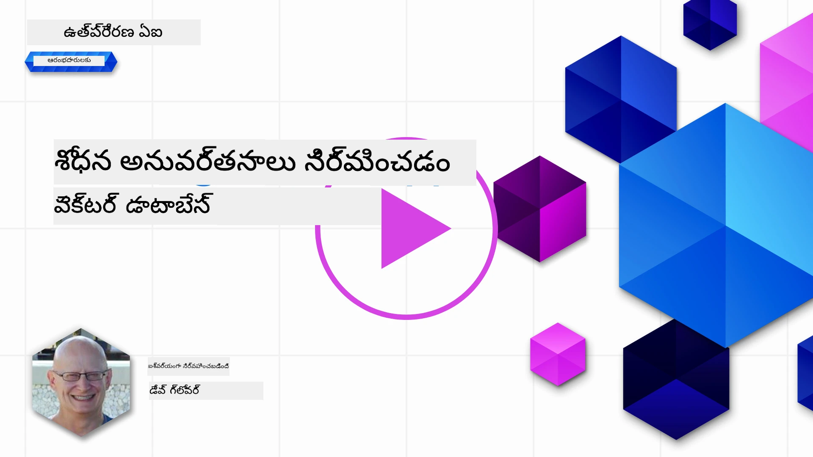
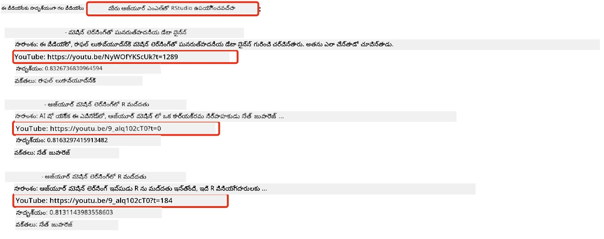
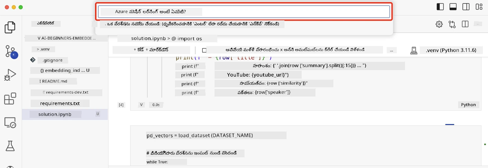

# శోధన అనువర్తనాలు నిర్మించడం

[](https://youtu.be/W0-nzXjOjr0?si=GcsqiTTvd7RKbo7V)

> > _ఈ పాఠం వీడియోను చూడడానికి పై చిత్రాన్ని క్లిక్ చేయండి_

LLMs అంటే కేవలం చాట్‌బాట్లు మరియు టెక్స్ట్ ఉత్పత్తి మాత్రమే కాదు. ఎంబెడ్డింగ్స్ ఉపయోగించి శోధన అనువర్తనాలను కూడా నిర్మించవచ్చు. ఎంబెడ్డింగ్స్ అనేవి డేటా యొక్క సంఖ్యాత్మక ప్రాతినిధ్యాలు, వీటిని వెక్టర్లు అని కూడా పిలుస్తారు, మరియు డేటా కోసం సేమాంటిక్ శోధనకు ఉపయోగించవచ్చు.

ఈ పాఠంలో, మన విద్యా స్టార్టప్ కోసం శోధన అనువర్తనం నిర్మించబోతున్నాం. మన స్టార్టప్ అభివృద్ధి చెందుతున్న దేశాలలో విద్యార్థులకు ఉచిత విద్యను అందించే లాభాపేక్షలేని సంస్థ. మన స్టార్టప్ వద్ద విద్యార్థులు AI గురించి నేర్చుకోవడానికి ఉపయోగించే అనేక YouTube వీడియోలు ఉన్నాయి. మన స్టార్టప్ విద్యార్థులు ప్రశ్న టైప్ చేసి YouTube వీడియోలను శోధించగలిగే శోధన అనువర్తనం నిర్మించాలనుకుంటుంది.

ఉదాహరణకు, ఒక విద్యార్థి 'Jupyter Notebooks అంటే ఏమిటి?' లేదా 'Azure ML అంటే ఏమిటి?' అని టైప్ చేస్తే, శోధన అనువర్తనం ఆ ప్రశ్నకు సంబంధించి ఉన్న YouTube వీడియోల జాబితాను తిరిగి ఇస్తుంది, ఇంకా మంచిదిగా, ఆ ప్రశ్నకు సమాధానం ఉన్న వీడియోలోని స్థానానికి లింక్ కూడా ఇస్తుంది.

## పరిచయం

ఈ పాఠంలో, మనం కవర్ చేయబోతున్నవి:

- సేమాంటిక్ మరియు కీవర్డ్ శోధన మధ్య తేడా.
- టెక్స్ట్ ఎంబెడ్డింగ్స్ అంటే ఏమిటి.
- టెక్స్ట్ ఎంబెడ్డింగ్స్ సూచిక సృష్టించడం.
- టెక్స్ట్ ఎంబెడ్డింగ్స్ సూచికలో శోధించడం.

## నేర్చుకునే లక్ష్యాలు

ఈ పాఠం పూర్తి చేసిన తర్వాత, మీరు చేయగలుగుతారు:

- సేమాంటిక్ మరియు కీవర్డ్ శోధన మధ్య తేడాను చెప్పగలగడం.
- టెక్స్ట్ ఎంబెడ్డింగ్స్ అంటే ఏమిటి వివరించగలగడం.
- ఎంబెడ్డింగ్స్ ఉపయోగించి డేటా కోసం శోధించే అనువర్తనం సృష్టించగలగడం.

## శోధన అనువర్తనం ఎందుకు నిర్మించాలి?

శోధన అనువర్తనం సృష్టించడం ద్వారా మీరు ఎంబెడ్డింగ్స్ ఉపయోగించి డేటా శోధన ఎలా చేయాలో అర్థం చేసుకుంటారు. అలాగే, విద్యార్థులు త్వరగా సమాచారాన్ని కనుగొనడానికి ఉపయోగించే శోధన అనువర్తనం ఎలా నిర్మించాలో నేర్చుకుంటారు.

ఈ పాఠంలో Microsoft [AI Show](https://www.youtube.com/playlist?list=PLlrxD0HtieHi0mwteKBOfEeOYf0LJU4O1) YouTube ఛానెల్ యొక్క ట్రాన్స్క్రిప్ట్‌ల ఎంబెడ్డింగ్ సూచిక ఉంది. AI Show అనేది AI మరియు మెషీన్ లెర్నింగ్ గురించి నేర్పించే YouTube ఛానెల్. ఎంబెడ్డింగ్ సూచికలో 2023 అక్టోబర్ వరకు ఉన్న ప్రతి YouTube ట్రాన్స్క్రిప్ట్ కోసం ఎంబెడ్డింగ్స్ ఉన్నాయి. మీరు ఈ ఎంబెడ్డింగ్ సూచికను ఉపయోగించి మన స్టార్టప్ కోసం శోధన అనువర్తనం నిర్మిస్తారు. శోధన అనువర్తనం ప్రశ్నకు సమాధానం ఉన్న వీడియోలోని స్థానానికి లింక్ ఇస్తుంది. ఇది విద్యార్థులకు అవసరమైన సమాచారాన్ని త్వరగా కనుగొనడానికి గొప్ప మార్గం.

క్రింది ఉదాహరణ 'can you use rstudio with azure ml?' అనే ప్రశ్నకు సేమాంటిక్ క్వెరీ. YouTube URL చూడండి, URLలో టైమ్‌స్టాంప్ ఉంటుంది, ఇది ప్రశ్నకు సమాధానం ఉన్న వీడియోలోని స్థానానికి తీసుకెళ్తుంది.



## సేమాంటిక్ శోధన అంటే ఏమిటి?

ఇప్పుడు మీరు ఆశ్చర్యపోతున్నారా, సేమాంటిక్ శోధన అంటే ఏమిటి? సేమాంటిక్ శోధన అనేది ఒక శోధన సాంకేతికత, ఇది క్వెరీలోని పదాల అర్థం లేదా సేమాంటిక్స్ ఉపయోగించి సంబంధిత ఫలితాలను తిరిగి ఇస్తుంది.

ఇది సేమాంటిక్ శోధన ఉదాహరణ. మీరు కారు కొనాలనుకుంటున్నారని అనుకుందాం, మీరు 'my dream car' అని శోధిస్తే, సేమాంటిక్ శోధన మీరు కారు గురించి `కనిపించే కలలు` గురించి కాదు, మీరు మీ `ఆదర్శ` కారు కొనాలనుకుంటున్నారని అర్థం చేసుకుంటుంది. సేమాంటిక్ శోధన మీ ఉద్దేశ్యాన్ని అర్థం చేసుకుని సంబంధిత ఫలితాలను ఇస్తుంది. ప్రత్యామ్నాయం `కీవర్డ్ శోధన` ఇది అక్షరశః కలల గురించి శోధించి అనవసర ఫలితాలను ఇస్తుంది.

## టెక్స్ట్ ఎంబెడ్డింగ్స్ అంటే ఏమిటి?

[టెక్స్ట్ ఎంబెడ్డింగ్స్](https://en.wikipedia.org/wiki/Word_embedding?WT.mc_id=academic-105485-koreyst) అనేవి [నేచురల్ లాంగ్వేజ్ ప్రాసెసింగ్](https://en.wikipedia.org/wiki/Natural_language_processing?WT.mc_id=academic-105485-koreyst)లో ఉపయోగించే టెక్స్ట్ ప్రాతినిధ్య సాంకేతికత. టెక్స్ట్ ఎంబెడ్డింగ్స్ అనేవి టెక్స్ట్ యొక్క సేమాంటిక్ సంఖ్యాత్మక ప్రాతినిధ్యాలు. ఎంబెడ్డింగ్స్ డేటాను యంత్రం సులభంగా అర్థం చేసుకునే విధంగా ప్రాతినిధ్యం చేయడానికి ఉపయోగిస్తారు. టెక్స్ట్ ఎంబెడ్డింగ్స్ సృష్టించడానికి అనేక మోడల్స్ ఉన్నాయి, ఈ పాఠంలో మనం OpenAI ఎంబెడ్డింగ్ మోడల్ ఉపయోగించి ఎంబెడ్డింగ్స్ సృష్టించడంపై దృష్టి పెట్టబోతున్నాం.

ఇది ఒక ఉదాహరణ, క్రింది టెక్స్ట్ AI Show YouTube ఛానెల్ యొక్క ఒక ఎపిసోడ్ ట్రాన్స్క్రిప్ట్‌లో ఉందని ఊహించండి:

```text
Today we are going to learn about Azure Machine Learning.
```

మనం టెక్స్ట్‌ను OpenAI ఎంబెడ్డింగ్ APIకి పంపిస్తాము, ఇది 1536 సంఖ్యలతో కూడిన ఎంబెడ్డింగ్‌ను తిరిగి ఇస్తుంది, దీనిని వెక్టర్ అని కూడా పిలుస్తారు. వెక్టర్‌లో ప్రతి సంఖ్య టెక్స్ట్ యొక్క వేరే అంశాన్ని సూచిస్తుంది. సారాంశంగా, వెక్టర్‌లో మొదటి 10 సంఖ్యలు ఇక్కడ ఉన్నాయి.

```python
[-0.006655829958617687, 0.0026128944009542465, 0.008792596869170666, -0.02446001023054123, -0.008540431968867779, 0.022071078419685364, -0.010703742504119873, 0.003311325330287218, -0.011632772162556648, -0.02187200076878071, ...]
```

## ఎంబెడ్డింగ్ సూచిక ఎలా సృష్టించబడింది?

ఈ పాఠం కోసం ఎంబెడ్డింగ్ సూచికను పలు Python స్క్రిప్ట్‌లతో సృష్టించారు. మీరు ఈ పాఠం 'scripts' ఫోల్డర్‌లో ఉన్న [README](./scripts/README.md?WT.mc_id=academic-105485-koreyst)లో స్క్రిప్ట్‌లు మరియు సూచనలను కనుగొనవచ్చు. ఈ పాఠం పూర్తి చేయడానికి మీరు ఈ స్క్రిప్ట్‌లను నడపాల్సిన అవసరం లేదు, ఎందుకంటే ఎంబెడ్డింగ్ సూచిక మీకు అందించబడింది.

స్క్రిప్ట్‌లు ఈ క్రింది పనులు చేస్తాయి:

1. [AI Show](https://www.youtube.com/playlist?list=PLlrxD0HtieHi0mwteKBOfEeOYf0LJU4O1) ప్లేలిస్ట్‌లోని ప్రతి YouTube వీడియో ట్రాన్స్క్రిప్ట్‌ను డౌన్లోడ్ చేస్తాయి.
2. [OpenAI Functions](https://learn.microsoft.com/azure/ai-services/openai/how-to/function-calling?WT.mc_id=academic-105485-koreyst) ఉపయోగించి, YouTube ట్రాన్స్క్రిప్ట్ మొదటి 3 నిమిషాల నుండి స్పీకర్ పేరు తీసేందుకు ప్రయత్నం చేస్తాయి. ప్రతి వీడియో స్పీకర్ పేరు `embedding_index_3m.json` అనే ఎంబెడ్డింగ్ సూచికలో నిల్వ చేయబడుతుంది.
3. ట్రాన్స్క్రిప్ట్ టెక్స్ట్‌ను **3 నిమిషాల టెక్స్ట్ సెగ్మెంట్ల**గా విభజిస్తాయి. ఈ సెగ్మెంట్‌లో తదుపరి సెగ్మెంట్ నుండి సుమారు 20 పదాలు ఓవర్‌ల్యాప్ చేయబడతాయి, తద్వారా సెగ్మెంట్ ఎంబెడ్డింగ్ కట్ అవ్వకుండా మరియు మెరుగైన శోధన సందర్భం అందించడానికి.
4. ప్రతి టెక్స్ట్ సెగ్మెంట్‌ను OpenAI చాట్ APIకి పంపించి 60 పదాల సారాంశం తయారు చేస్తుంది. సారాంశం కూడా `embedding_index_3m.json`లో నిల్వ చేయబడుతుంది.
5. చివరగా, సెగ్మెంట్ టెక్స్ట్‌ను OpenAI ఎంబెడ్డింగ్ APIకి పంపిస్తారు. ఎంబెడ్డింగ్ API 1536 సంఖ్యల వెక్టర్‌ను తిరిగి ఇస్తుంది, ఇది సెగ్మెంట్ యొక్క సేమాంటిక్ అర్థాన్ని సూచిస్తుంది. సెగ్మెంట్ మరియు OpenAI ఎంబెడ్డింగ్ వెక్టర్ `embedding_index_3m.json` అనే ఎంబెడ్డింగ్ సూచికలో నిల్వ చేయబడతాయి.

### వెక్టర్ డేటాబేసులు

పాఠం సౌలభ్యం కోసం, ఎంబెడ్డింగ్ సూచిక `embedding_index_3m.json` అనే JSON ఫైల్‌లో నిల్వ చేయబడింది మరియు Pandas DataFrameలో లోడ్ చేయబడింది. అయితే, ప్రొడక్షన్‌లో ఎంబెడ్డింగ్ సూచికను [Azure Cognitive Search](https://learn.microsoft.com/training/modules/improve-search-results-vector-search?WT.mc_id=academic-105485-koreyst), [Redis](https://cookbook.openai.com/examples/vector_databases/redis/readme?WT.mc_id=academic-105485-koreyst), [Pinecone](https://cookbook.openai.com/examples/vector_databases/pinecone/readme?WT.mc_id=academic-105485-koreyst), [Weaviate](https://cookbook.openai.com/examples/vector_databases/weaviate/readme?WT.mc_id=academic-105485-koreyst) వంటి వెక్టర్ డేటాబేసుల్లో నిల్వ చేస్తారు.

## కోసైన్ సాదృశ్యం అర్థం చేసుకోవడం

మనం టెక్స్ట్ ఎంబెడ్డింగ్స్ గురించి నేర్చుకున్నాం, తదుపరి దశ టెక్స్ట్ ఎంబెడ్డింగ్స్ ఉపయోగించి డేటా శోధించడం మరియు ప్రత్యేకంగా కోసైన్ సాదృశ్యం ఉపయోగించి ఇచ్చిన క్వెరీకి అత్యంత సాదృశ్యమైన ఎంబెడ్డింగ్స్ కనుగొనడం.

### కోసైన్ సాదృశ్యం అంటే ఏమిటి?

కోసైన్ సాదృశ్యం అనేది రెండు వెక్టర్ల మధ్య సాదృశ్యాన్ని కొలిచే ప్రమాణం, దీనిని `నియరెస్ట్ నైబర్ శోధన` అని కూడా పిలుస్తారు. కోసైన్ సాదృశ్యం శోధన చేయడానికి, మీరు OpenAI ఎంబెడ్డింగ్ API ఉపయోగించి క్వెరీ టెక్స్ట్‌ను వెక్టరైజ్ చేయాలి. తరువాత, క్వెరీ వెక్టర్ మరియు ఎంబెడ్డింగ్ సూచికలోని ప్రతి వెక్టర్ మధ్య కోసైన్ సాదృశ్యాన్ని లెక్కించాలి. గుర్తుంచుకోండి, ఎంబెడ్డింగ్ సూచికలో ప్రతి YouTube ట్రాన్స్క్రిప్ట్ టెక్స్ట్ సెగ్మెంట్‌కు ఒక వెక్టర్ ఉంటుంది. చివరగా, ఫలితాలను కోసైన్ సాదృశ్యంతో క్రమబద్ధీకరించి, అత్యధిక కోసైన్ సాదృశ్యం ఉన్న టెక్స్ట్ సెగ్మెంట్లు క్వెరీకి అత్యంత సాదృశ్యమైనవి.

గణిత పరంగా, కోసైన్ సాదృశ్యం అనేది బహుముఖ స్థలంలో ప్రాజెక్ట్ చేయబడిన రెండు వెక్టర్ల మధ్య కోణం యొక్క కోసైన్‌ను కొలుస్తుంది. ఈ కొలత ఉపయోగకరంగా ఉంటుంది, ఎందుకంటే రెండు డాక్యుమెంట్లు యూక్లిడియన్ దూరం ద్వారా దూరంగా ఉన్నా, వాటి మధ్య కోణం తక్కువగా ఉండి, అందువల్ల కోసైన్ సాదృశ్యం ఎక్కువగా ఉండవచ్చు. కోసైన్ సాదృశ్యం సమీకరణల గురించి మరింత సమాచారం కోసం, [Cosine similarity](https://en.wikipedia.org/wiki/Cosine_similarity?WT.mc_id=academic-105485-koreyst) చూడండి.

## మీ మొదటి శోధన అనువర్తనం నిర్మించడం

తదుపరి, మనం ఎంబెడ్డింగ్స్ ఉపయోగించి శోధన అనువర్తనం ఎలా నిర్మించాలో నేర్చుకుంటాం. శోధన అనువర్తనం విద్యార్థులు ప్రశ్న టైప్ చేసి వీడియో శోధించడానికి అనుమతిస్తుంది. శోధన అనువర్తనం ప్రశ్నకు సంబంధించి ఉన్న వీడియోల జాబితాను తిరిగి ఇస్తుంది. శోధన అనువర్తనం ప్రశ్నకు సమాధానం ఉన్న వీడియోలోని స్థానానికి లింక్ కూడా ఇస్తుంది.

ఈ పరిష్కారం Windows 11, macOS, మరియు Ubuntu 22.04 పై Python 3.10 లేదా తరువాతి వెర్షన్ ఉపయోగించి నిర్మించి పరీక్షించారు. మీరు Pythonని [python.org](https://www.python.org/downloads/?WT.mc_id=academic-105485-koreyst) నుండి డౌన్లోడ్ చేసుకోవచ్చు.

## అసైన్‌మెంట్ - విద్యార్థులకు శోధన అనువర్తనం నిర్మించడం

ఈ పాఠం ప్రారంభంలో మన స్టార్టప్‌ను పరిచయం చేసాము. ఇప్పుడు విద్యార్థులు తమ అసెస్మెంట్ల కోసం శోధన అనువర్తనం నిర్మించడానికి వీలు కల్పించాలి.

ఈ అసైన్‌మెంట్‌లో, మీరు శోధన అనువర్తనం నిర్మించడానికి ఉపయోగించే Azure OpenAI సేవలను సృష్టిస్తారు. మీరు క్రింది Azure OpenAI సేవలను సృష్టించాలి. ఈ అసైన్‌మెంట్ పూర్తి చేయడానికి Azure సబ్‌స్క్రిప్షన్ అవసరం.

### Azure క్లౌడ్ షెల్ ప్రారంభించండి

1. [Azure పోర్టల్](https://portal.azure.com/?WT.mc_id=academic-105485-koreyst)లో సైన్ ఇన్ అవ్వండి.
2. Azure పోర్టల్ పై-కుడి మూలలో ఉన్న క్లౌడ్ షెల్ ఐకాన్‌ను ఎంచుకోండి.
3. వాతావరణ రకంగా **Bash** ఎంచుకోండి.

#### రిసోర్స్ గ్రూప్ సృష్టించండి

> ఈ సూచనల కోసం, మనం "semantic-video-search" అనే రిసోర్స్ గ్రూప్‌ను East USలో ఉపయోగిస్తున్నాం.
> మీరు రిసోర్స్ గ్రూప్ పేరును మార్చవచ్చు, కానీ వనరుల స్థానాన్ని మార్చేటప్పుడు,
> [మోడల్ అందుబాటు పట్టిక](https://aka.ms/oai/models?WT.mc_id=academic-105485-koreyst)ను తనిఖీ చేయండి.

```shell
az group create --name semantic-video-search --location eastus
```

#### Azure OpenAI సర్వీస్ వనరును సృష్టించండి

Azure క్లౌడ్ షెల్ నుండి, Azure OpenAI సర్వీస్ వనరును సృష్టించడానికి క్రింది కమాండ్ నడపండి.

```shell
az cognitiveservices account create --name semantic-video-openai --resource-group semantic-video-search \
    --location eastus --kind OpenAI --sku s0
```

#### ఈ అనువర్తనంలో ఉపయోగించడానికి ఎండ్‌పాయింట్ మరియు కీలు పొందండి

Azure క్లౌడ్ షెల్ నుండి, Azure OpenAI సర్వీస్ వనరుకు ఎండ్‌పాయింట్ మరియు కీలు పొందడానికి క్రింది కమాండ్లు నడపండి.

```shell
az cognitiveservices account show --name semantic-video-openai \
   --resource-group  semantic-video-search | jq -r .properties.endpoint
az cognitiveservices account keys list --name semantic-video-openai \
   --resource-group semantic-video-search | jq -r .key1
```

#### OpenAI ఎంబెడ్డింగ్ మోడల్‌ను డిప్లాయ్ చేయండి

Azure క్లౌడ్ షెల్ నుండి, OpenAI ఎంబెడ్డింగ్ మోడల్‌ను డిప్లాయ్ చేయడానికి క్రింది కమాండ్ నడపండి.

```shell
az cognitiveservices account deployment create \
    --name semantic-video-openai \
    --resource-group  semantic-video-search \
    --deployment-name text-embedding-ada-002 \
    --model-name text-embedding-ada-002 \
    --model-version "2"  \
    --model-format OpenAI \
    --sku-capacity 100 --sku-name "Standard"
```

## పరిష్కారం

GitHub Codespacesలో [solution notebook](./python/aoai-solution.ipynb?WT.mc_id=academic-105485-koreyst)ని తెరవండి మరియు Jupyter Notebookలో సూచనలను అనుసరించండి.

మీరు నోట్‌బుక్ నడిపినప్పుడు, మీరు ఒక క్వెరీని ఎంటర్ చేయమని అడుగుతారు. ఇన్‌పుట్ బాక్స్ ఇలా కనిపిస్తుంది:



## అద్భుతమైన పని! మీ అభ్యాసాన్ని కొనసాగించండి

ఈ పాఠం పూర్తి చేసిన తర్వాత, మన [జనరేటివ్ AI అభ్యాస సేకరణ](https://aka.ms/genai-collection?WT.mc_id=academic-105485-koreyst)ను చూడండి మరియు మీ జనరేటివ్ AI జ్ఞానాన్ని మరింత పెంచుకోండి!

పాఠం 9కి వెళ్లండి, అక్కడ మనం [చిత్ర ఉత్పత్తి అనువర్తనాలు ఎలా నిర్మించాలో](../09-building-image-applications/README.md?WT.mc_id=academic-105485-koreyst) చూడబోతున్నాం!

---

<!-- CO-OP TRANSLATOR DISCLAIMER START -->
**అస్పష్టత**:  
ఈ పత్రాన్ని AI అనువాద సేవ [Co-op Translator](https://github.com/Azure/co-op-translator) ఉపయోగించి అనువదించబడింది. మేము ఖచ్చితత్వానికి ప్రయత్నించినప్పటికీ, ఆటోమేటెడ్ అనువాదాల్లో పొరపాట్లు లేదా తప్పిదాలు ఉండవచ్చు. మూల పత్రం దాని స్వదేశీ భాషలోనే అధికారిక మూలంగా పరిగణించాలి. ముఖ్యమైన సమాచారానికి, ప్రొఫెషనల్ మానవ అనువాదం సిఫార్సు చేయబడుతుంది. ఈ అనువాదం వాడకంలో ఏర్పడిన ఏవైనా అపార్థాలు లేదా తప్పుదారులు కోసం మేము బాధ్యత వహించము.
<!-- CO-OP TRANSLATOR DISCLAIMER END -->