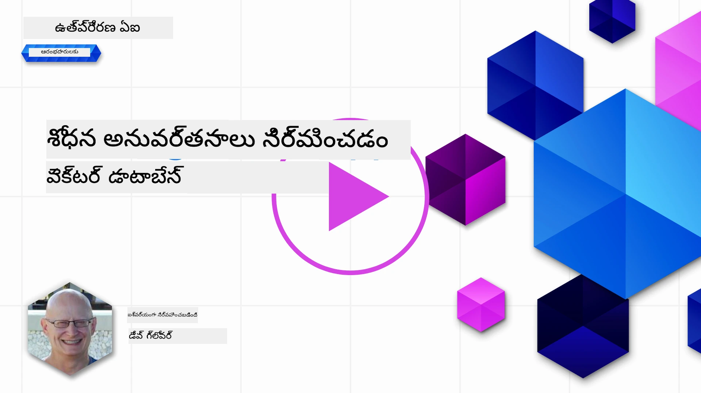
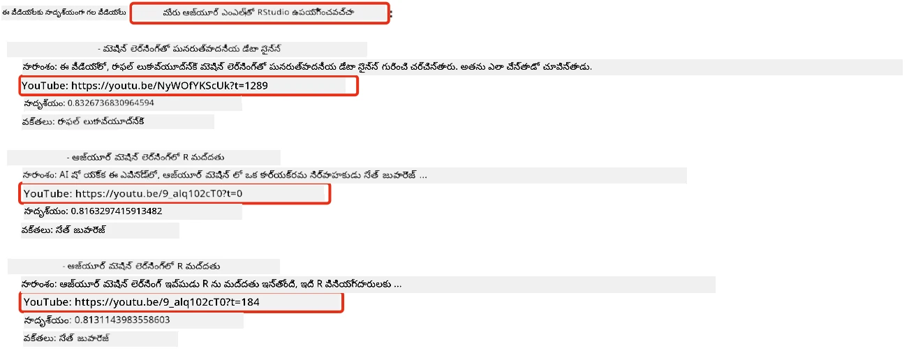
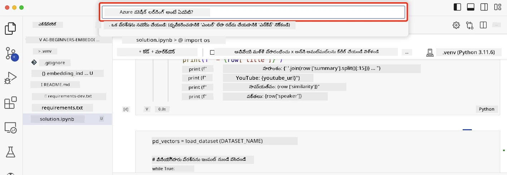

# శోధన అనువర్తనాలను నిర్మించడం

[](https://youtu.be/W0-nzXjOjr0?si=GcsqiTTvd7RKbo7V)

> > _ఈ పాఠం వీడియోను చూడటానికి పై చిత్రాన్ని క్లిక్ చేయండి_

LLM లకు చాట్‌బాట్‌లు మరియు గ్రంథ రచన కంటే ఎక్కువగానే ఉంది. ఎంబెడింగ్‌లు ఉపయోగించి శోధన అనువర్తనాలను కూడా నిర్మించవచ్చు. ఎంబెడింగ్‌లు డేటా యొక్క సంఖ్యా ప్రతినిధులు, వీటిని వెక్టర్లు అనిపించవచ్చు, మరియు డేటా కోసం భావోద్వేగ శోధనకు ఉపయోగించవచ్చు.

ఈ పాఠంలో, మీరు మా విద్యా స్టార్టప్‌ కోసం శోధన అనువర్తనం నిర్మించబోతున్నారు. మా స్టార్టప్ అభివృద్ధి చెందుతున్న దేశాలలోని విద్యార్థులకు ఉచిత విద్య అందించే లాభాపేక్షేతర సంస్థ. మా స్టార్టప్‌లో చాలా YouTube వీడియోలు ఉన్నాయి, వీటిని విద్యార్థులు AI గురించి తెలుసుకోవడానికి ఉపయోగించుకోవచ్చు. విద్యార్థులు ప్రశ్న టైపు చేయడం ద్వారా YouTube వీడియోలను వెతకడానికి వీలు కల్పించే శోధన అనువర్తనం మా స్టార్ట్‌ప్ బిల్డ్ చేయాలని కోరుకుంటోంది.

ఉదాహరణకి, ఒక విద్యార్థి 'జూపిటర్ నోట్బుక్స్ అంటే ఏమిటి?' లేదా 'ఆజ్యూర్ ML అంటే ఏమిటి?' అని టైప్ చేస్తాడని అనుకుంటే, శోధన అనువర్తనం ప్రశ్నకి సంబంధించిన YouTube వీడియోల జాబితాను తిరిగిచ్చుతుంది, మరింతగా, శోధన అనువర్తనం ప్రశ్నకు సమాధానం ఉన్న వీడియో భాగానికి లింక్ కూడా ఇస్తుంది.

## పరిచయం

ఈ పాఠంలో, మేము కవర్ చేయబోతున్నది:

- భావోద్వేగ శోధన vs కీవర్డ్ శోధన.
- టెక్స్ట్ ఎంబెడింగ్‌లు ఏమిటి.
- టెక్స్ట్ ఎంబెడింగ్ సూచిక సృష్టించడం.
- టెక్స్ట్ ఎంబెడింగ్ సూచికలో శోధించడం.

## నేర్చుకునే లక్ష్యాలు

ఈ పాఠాన్ని పూర్తి చేసిన తరువాత, మీరు చేయగలుగుతారు:

- భావోద్వేగ మరియు కీవర్డ్ శోధన మధ్య తేడాను చెప్పడం.
- టెక్స్ట్ ఎంబెడింగ్‌లు ఏమిటి వివరించడం.
- డేటా కోసం శోధించడానికి ఎంబెడింగ్‌లు ఉపయోగించి అనువర్తనాన్ని సృష్టించడం.

## శోధన అనువర్తనం ఎందుకు నిర్మించాలి?

శోధన అనువర్తనం నిర్మించడం ద్వారా మీరు ఎంబెడింగ్‌లను ఎలా ఉపయోగించి డేటాను శోధించాలో అర్థం చేసుకోగలుగుతారు. మీరు విద్యార్థులు సమాచారం వేగంగా కనుగొనడానికి ఉపయోగించే శోధన అనువర్తనం ఎలా నిర్మించాలో కూడా నేర్చుకుంటారు.

ఈ పాఠంలో, మైక్రోసాఫ్ట్ [AI షో](https://www.youtube.com/playlist?list=PLlrxD0HtieHi0mwteKBOfEeOYf0LJU4O1) YouTube చానెల్ యొక్క అనువాదాల కోసం ఒక ఎంబెడింగ్ సూచిక ఉంటుంది. AI షో AI మరియు మెషీన్ లర్నింగ్ గురించి మీకు నేర్పించే YouTube చానెల్. ఎంబెడింగ్ సూచిక ఏకం 2023 అక్టోబర్ వరకు ప్రతి YouTube అనువాదాలకు సంబంధించిన ఎంబెడింగ్‌లను కలిగి ఉంటుంది. మీరు ఈ ఎంబెడింగ్ సూచికను మా స్టార్టప్ కోసం శోధన అనువర్తనం నిర్మించడానికి ఉపయోగించుకుంటారు. శోధన అనువర్తనం ప్రశ్నకు సమాధానం ఉన్న వీడియో భాగానికి లింక్‌ని తిరిగి ఇస్తుంది. ఇది విద్యార్థులకు అవసరమైన సమాచారాన్ని వేగంగా కనుగొనడానికి అద్భుతమైన మార్గం.

'మీరు rstudio ను ఆజ్యూర్ ML తో ఉపయోగించవచ్చా?' అనే ప్రశ్నకు Sematic శోదన యొక్క ఒక ఉదాహరణ దిగువన ఉంది. YouTube url చూడండి, ఇందులో టైమ్ స్టాంప్ ఉంది, ఇది వీడియోలో ప్రశ్నకు సమాధానం ఉన్న ఆ చోటుకే తీసుకెళ్తుంది.



## భావోద్వేగ శోధన అంటే ఏమిటి?

మిమ్మల్ని ఆశ్చర్యానికి గురిచేయవచ్చు, భావోద్వేగ శోధన అంటే ఏమిటి? భావోద్వేగ శోధన అనేది ఒక శోధన పద్ధతి, ఇది ప్రశ్నలో ఉన్న పదాల భావమును ఉపయోగించి సంబంధిత ఫలితాలను అందిస్తుంది.

భావోద్వేగ శోధన కోసం ఒక ఉదాహరణ ఇది. మీరు కారు కొనాలని భావిస్తే, మీరు 'నా కల కారు' అని శోధించవచ్చు, భావోద్వేగ శోధన అర్థం చేసుకుంటుంది మీరు కారు గురించి కలల కదా, కానీ మీరు మీ 'ఆదర్శ' కారును కొనాలని అనుకుంటున్నారన్నది. భావోద్వేగ శోధన మీ ఉద్దేశ్యాన్ని అర్థం చేసుకుంటుంది మరియు సంబంధిత ఫలితాలను ఇస్తుంది. ప్రత్యామ్నాయం 'కీవర్డ్ శోధన' వల్ల పదాల అక్షరాత్మక అర్ధంతో శోధన జరుగుతుంది, ఇది చాలాసార్లు సంబంధంలేని ఫలితాలను ఇస్తుంది.

## టెక్స్ట్ ఎంబెడింగ్‌లు ఏమిటి?

[టెక్స్ట్ ఎంబెడింగ్‌లు](https://en.wikipedia.org/wiki/Word_embedding?WT.mc_id=academic-105485-koreyst) అనేవి [నేచురల్ లాంగ్వేజ్ ప్రాసెసింగ్](https://en.wikipedia.org/wiki/Natural_language_processing?WT.mc_id=academic-105485-koreyst)లో ఉపయోగించే ఒక టెక్స్ట్ ప్రతినిధి పద్ధతి. టెక్స్ట్ ఎంబెడింగ్‌లు టెక్స్ట్ యొక్క భావోద్వేగ సంఖ్యా ప్రతినిధులు. ఎంబెడింగ్‌లు మెషిన్ కోసం అర్థం చేసుకోవడానికి సులభంగా ఉండే విధంగా డేటాను ప్రాతినిధ్యం చేస్తాయి. టెక్స్ట్ ఎంబెడింగ్‌లను రూపొందించడానికి అనేక నమూనాలు ఉన్నాయి, ఈ పాఠంలో, మేము OpenAI ఎంబెడింగ్ మోడల్ ఉపయోగించి ఎంబెడింగ్‌లను సృష్టించడంపై దృష్టి పెడతాము.

ఉదాహరణకి, ఈ క్రింది టెక్స్ట్ AI షో YouTube చానెల్లో ఒక ఎపిసోడ్ యొక్క ట్రాన్స్క్రిప్ట్ నుండి వచ్చింది అని ఊహించండి:

```text
Today we are going to learn about Azure Machine Learning.
```

మేము ఈ టెక్స్ట్‌ను OpenAI ఎంబెడింగ్ APIకి పంపించగా, ఇది 1536 సంఖ్యలతో కూడిన ఇలా ఒక ఎంబెడింగ్‌ను (వెక్టర్) తిరిగి ఇస్తుంది. వెక్టర్‌లో ప్రతి సంఖ్య టెక్స్ట్ యొక్క ఒక వేరువేరు పరిమాణాన్ని సూచిస్తుంది. సంక్షిప్తత కోసం, ఇక్కడ వెక్టర్‌లో మొదటి 10 సంఖ్యలు చూపబడ్డాయి.

```python
[-0.006655829958617687, 0.0026128944009542465, 0.008792596869170666, -0.02446001023054123, -0.008540431968867779, 0.022071078419685364, -0.010703742504119873, 0.003311325330287218, -0.011632772162556648, -0.02187200076878071, ...]
```

## ఎంబెడింగ్ సూచిక ఎలా సృష్టించబడుతుంది?

ఈ పాఠానికి ఎంబెడింగ్ సూచిక పలు Python స్క్రిప్ట్‌లతో సృష్టించబడింది. మీరు ఈ పాఠం యొక్క 'scripts' ఫోల్డర్‌లోని [README](./scripts/README.md?WT.mc_id=academic-105485-koreyst)లో స్క్రిప్ట్‌లు మరియు సూచనలను కనుగొనవచ్చు. ఈ పాఠాన్ని పూర్తి చేయడానికి మీరు ఈ స్క్రిప్ట్‌లను నడపాల్సిన అవసరం లేదని గమనించండి, ఎందుకంటే ఎంబెడింగ్ సూచిక మీకు అందించబడింది.

స్క్రిప్ట్‌లు క్రింది కార్యాలు చేస్తాయి:

1. [AI Show](https://www.youtube.com/playlist?list=PLlrxD0HtieHi0mwteKBOfEeOYf0LJU4O1) ప్లేలిస్టులోని ప్రతి YouTube వీడియో యొక్క ట్రాన్స్క్రిప్ట్ డౌన్‌లోడ్ చేయబడుతుంది.
2. [OpenAI ఫంక్షన్స్](https://learn.microsoft.com/azure/ai-foundry/openai/how-to/function-calling?WT.mc_id=academic-105485-koreyst) ఉపయోగించి, YouTube ట్రాన్స్క్రిప్ట్ మొదటి 3 నిమిషాల నుండి స్పీకర్ పేరు పొందే ప్రయత్నం జరుగుతుంది. ప్రతి వీడియోకు సంబంధించిన స్పీకర్ పేరు `embedding_index_3m.json` అనే ఎంబెడింగ్ సూచికలో నిల్వ చేయబడుతుంది.
3. ట్రాన్స్క్రిప్ట్ టెక్స్ట్‌ను **3 నిమిషాల టెక్స్ట్ సెగ్మెంట్ల**లో విడగొడతారు. ఈ సెగ్మెంట్లో తదుపరి సెగ్మెంట్ నుండి సుమారు 20 పదాలు మళ్ళీ కలిపి ఉంటాయి, దీని వల్ల సెగ్మెంట్ ఎంబెడింగ్ కట్ కాకుండా మంచి శోధన సూత్రం ఏర్పడుతుంది.
4. ప్రతి టెక్స్ట్ సెగ్మెంట్‌ను OpenAI చాట్ APIకి పంపించి 60 పదాలలో సారాంశం చేయించబడుతుంది. ఈ సారాంశం కూడా `embedding_index_3m.json`లో నిల్వ చేయబడుతుంది.
5. చివరికి, సెగ్మెంట్ టెక్స్ట్‌ను OpenAI ఎంబెడింగ్ APIకి పంపించి, సెగ్మెంట్ భావాన్ని సూచించే 1536 సంఖ్యల వెక్టర్‌ను తిరిగి పొందబడుతుంది. సెగ్మెంట్ టెక్స్ట్ మరియు OpenAI ఎంబెడింగ్ వెక్టర్ కలిపి `embedding_index_3m.json` అనే ఎంబెడింగ్ సూచికలో నిల్వకు ఉంచబడతాయి.

### వెక్టర్ డేటాబేస్‌లు

పాఠం సౌలభ్యం కొరకు, ఎంబెడింగ్ సూచిక JSON ఫైల్ `embedding_index_3m.json`లో నిల్వ చేయబడింది మరియు Pandas DataFrameలో లోడ్ చేయబడింది. కానీ, ప్రొడక్షన్‌లో ఎంబెడింగ్ సూచికను [Azure Cognitive Search](https://learn.microsoft.com/training/modules/improve-search-results-vector-search?WT.mc_id=academic-105485-koreyst), [Redis](https://cookbook.openai.com/examples/vector_databases/redis/readme?WT.mc_id=academic-105485-koreyst), [Pinecone](https://cookbook.openai.com/examples/vector_databases/pinecone/readme?WT.mc_id=academic-105485-koreyst), [Weaviate](https://cookbook.openai.com/examples/vector_databases/weaviate/readme?WT.mc_id=academic-105485-koreyst) వంటి వెక్టర్ డేటాబేస్‌లలో నిల్వ చేస్తారు.

## కోసైన్ సాదృశ్యత అర్థం చేసుకోవడం

మేము టెక్స్ట్ ఎంబెడింగ్‌ల గురించి నేర్చుకున్నాం, తదుపరి దశలో, టెక్స్ట్ ఎంబెడింగ్‌లను ఉపయోగించి డేటాను శోధించడం మరియు ప్రత్యేకంగా ఇవ్వబడిన ప్రశ్నకు అత్యంత సాదృశ్యమైన ఎంబెడింగ్‌లను కోసైన్ సాదృశ్యతతో ఎలా కనుగొనాలో నేర్చుకుందాం.

### కోసైన్ సాదృశ్యత అంటే ఏమిటి?

కోసైన్ సాదృశ్యత అనేది రెండు వెక్టర్ల మధ్య సాదృశ్యత కొలవడం, దీనిని `నేరిస్ట్ నెయిబర్ శోధన` అని కూడా అంటారు. కోసైన్ సాదృశ్యత శోధన చేయడానికి, మీరు OpenAI ఎంబెడింగ్ API ఉపయోగించి ప్రశ్న టెక్స్ట్ కోసం వెక్టరైజ్ చేయాలి. తరువాత, ప్రశ్న వెక్టర్ మరియు ఎంబెడింగ్ సూచికలోని ప్రతి వెక్టర్ మధ్య కోసైన్ సాదృశ్యతను లెక్కించాలి. గుర్తుంచుకోండి, ఎంబెడింగ్ సూచికలో ప్రతి YouTube ట్రాన్స్క్రిప్ట్ టెక్స్ట్ సెగ్మెంట్‌కి ఒక వెక్టర్ ఉంటుంది. చివరగా, ఫలితాలను కోసైన్ సాదృశ్యత క్ర‌మంలో సర్దుబాటు చేయండి, అత్యుత్తమ కోసైన్ సాదృశ్యత కలిగిన టెక్స్ట్ సెగ్మెంట్లు ప్రశ్నకు అత్యంత సాదృశ్యంలుగా ఉంటాయి.

గణిత శాస్త్రదృష్ట్యా, కోసైన్ సాదృశ్యత అనేది బహుముఖి స్పేసులో ప్రొజెక్ట్ చేసిన రెండు వెక్టర్ల మధ్య కోణం కోసైన్ కొలుస్తుంది. ఇది ఉపయోగకరం, ఎందువల్ల రెండు పత్రాలు యూక్లిడియన్ దూరం ద్వారా చాలా దూరంగా ఉంటే కూడా, వాటి మధ్య కోణం తక్కువగా ఉండవచ్చు, అందుకే కోసైన్ సాదృశ్యత ఎక్కువ ఉంటుందని అర్థం. కోసైన్ సాదృశ్యత సమీకరణాల గురించి మ‌రింత సమాచారం కొరకు, [Cosine similarity](https://en.wikipedia.org/wiki/Cosine_similarity?WT.mc_id=academic-105485-koreyst) చూడండి.

## మీ మొదటి శోధన అనువర్తనాన్ని నిర్మించడం

తదుపరి, మేము ఎంబెడింగ్‌లను ఉపయోగించి శోధన అనువర్తనం ఎలా నిర్మించాలో నేర్చుకుంటాము. ఈ శోధన అనువర్తనం విద్యార్థులు ప్రశ్న టైప్ చేసి వీడియోలను శోధించడానికి అనుమతిస్తుంది. ఇది ప్రశ్నకు సంబంధించిన వీడియోల జాబితాను మరియు సమాధానం ఉన్న వీడియో భాగానికి లింక్ కూడా అందిస్తుంది.

ఈ పరిష్కారం Windows 11, macOS, మరియు Ubuntu 22.04లపై Python 3.10 లేదా తరువాతి వెర్షన్ ఉపయోగించి నిర్మించబడినది మరియు పరీక్షించబడింది. మీరు Pythonని [python.org](https://www.python.org/downloads/?WT.mc_id=academic-105485-koreyst) నుండి డౌన్లోడ్ చేసుకోవచ్చు.

## అసైన్‌మెంట్ - విద్యార్థులకు శోధన అనువర్తనం నిర్మించడం боломжు కల్పించడం

ఈ పాఠం ప్రారంభంలో మా స్టార్టప్‌ను పరిచయం చేసాము. ఇప్పుడు విద్యార్థులు తమ అసైన్మెంట్లకు శోధన అనువర్తనం నిర్మించగలిగేలా చేయుట సమయం వచ్చింది.

ఈ అసైన్‌మెంట్‌లో, మీరు శోధన అనువర్తనం నిర్మించడానికి ఉపయోగించే Azure OpenAI సేవలను సృష్టిస్తారు. మీరు క్రింది Azure OpenAI సేవలను సృష్టించాలి. ఈ అసైన్‌మెంట్ పూర్తి చేసేందుకు Azure సబ్‌స్క్రిప్షన్ అవసరం.

### Azure క్లౌడ్ షెల్ ప్రారంభించండి

1. [Azure పోర్టల్](https://portal.azure.com/?WT.mc_id=academic-105485-koreyst)లో లాగిన్ అవ్వండి.
2. Azure పోర్టల్ యొక్క పై-కుడి మూలలోని క్లౌడ్ షెల్ చిహ్నాన్ని ఎంచుకోండి.
3. వాతావరణ రకంగా **Bash** ఎంచుకోండి.

#### ఒక రిసోర్స్ గ్రూప్ సృష్టించండి

> ఈ సూచనల కోసం, మేము "semantic-video-search" అనే పేరుతో East US వద్ద రిసోర్స్ గ్రూప్ ఉపయోగిస్తున్నాము.
> మీరు రిసోర్స్ గ్రూప్ పేరును మార్చవచ్చు, కానీ వనరుల స్థానాన్ని మార్చేటప్పుడు,
> [మోడల్ అందుబాటు పట్టిక](https://aka.ms/oai/models?WT.mc_id=academic-105485-koreyst)ని చూసుకోండి.

```shell
az group create --name semantic-video-search --location eastus
```

#### Azure OpenAI సేవ రిసోర్స్ సృష్టించండి

Azure క్లౌడ్ షెల్ నుండి క్రింది ఆజ్ఞను అమలు చేసి Azure OpenAI సేవ రిసోర్స్‌ను సృష్టించండి.

```shell
az cognitiveservices account create --name semantic-video-openai --resource-group semantic-video-search \
    --location eastus --kind OpenAI --sku s0
```

#### ఈ అనువర్తనంలో ఉపయోగంకోసం ఎండ్‌పాయింట్ మరియు కీస్ పొందండి

Azure క్లౌడ్ షెల్ నుండి క్రింది ఆజ్ఞలను అమలు చేసి Azure OpenAI సేవ రిసోర్స్ కోసం ఎండ్‌పాయింట్ మరియు కీస్ పొందండి.

```shell
az cognitiveservices account show --name semantic-video-openai \
   --resource-group  semantic-video-search | jq -r .properties.endpoint
az cognitiveservices account keys list --name semantic-video-openai \
   --resource-group semantic-video-search | jq -r .key1
```

#### OpenAI ఎంబెడింగ్ మోడల్‌ను డిప్లాయ్ చేయండి

Azure క్లౌడ్ షెల్ నుండి క్రింది ఆజ్ఞను నడిపి OpenAI ఎంబెడింగ్ మోడల్‌ను డిప్లాయ్ చేయండి.

```shell
az cognitiveservices account deployment create \
    --name semantic-video-openai \
    --resource-group  semantic-video-search \
    --deployment-name text-embedding-ada-002 \
    --model-name text-embedding-ada-002 \
    --model-version "2"  \
    --model-format OpenAI \
    --sku-capacity 100 --sku-name "Standard"
```

## పరిష్కారం

GitHub Codespacesలోని [solution notebook](./python/aoai-solution.ipynb?WT.mc_id=academic-105485-koreyst)ను తెరవండి మరియు Jupyter Notebookలో సూచనలను అనుసరించండి.

మీరు notebook నడుపుతున్నప్పుడు, మీరు ఒక ప్రశ్నను ఎంటర్ చేయమని అడగబడుతుంది. ఇన్‌పుట్ బాక్స్ ఈ విధంగా ఉంటుంది:



## అద్భుత పని! మీ అభ్యాసాన్ని కొనసాగించండి

ఈ పాఠాన్ని పూర్తి చేసిన తరువాత, మా [సృష్టించు AI అభ్యాస సంకలనం](https://aka.ms/genai-collection?WT.mc_id=academic-105485-koreyst)చూడండి మరియు మీ సృష్టించు AI జ్ఞానాన్ని పెంచుకుందం!

మా తొమ్మదో పాఠానికి వెళ్లి [చిత్ర సృష్టి అనువర్తనాలను నిర్మించడం ఎలా](../09-building-image-applications/README.md?WT.mc_id=academic-105485-koreyst) అనేట మాడ్యూల్‌ను చూడండి!

---

<!-- CO-OP TRANSLATOR DISCLAIMER START -->
**అస్వీకరణ**:
ఈ పత్రం AI అనువాద సేవ [Co-op Translator](https://github.com/Azure/co-op-translator) ఉపయోగించి అనువదించబడింది. మేము ఖచ్చితత్వానికి ప్రయత్నిస్తున్నప్పటికీ, ఆటోమేటెడ్ అనువాదాలు తప్పులు లేదా అసమగ్రతలను కలిగి ఉండవచ్చు. దాని స్వదేశ భాషలో ఉన్న అసలు పత్రాన్ని అధికారం కలిగిన మూలంగా పరిగణించాలి. కీలకమైన సమాచారం కోసం, ప్రొఫెషనల్ మానవ అనువాదాన్ని సిఫారసు చేస్తాము. ఈ అనువాదం ఉపయోగం వల్ల కలిగే ఏవైనా అపార్థాలు లేదా తప్పుదారులు కోసం మేము బాధ్యత వహించము.
<!-- CO-OP TRANSLATOR DISCLAIMER END -->