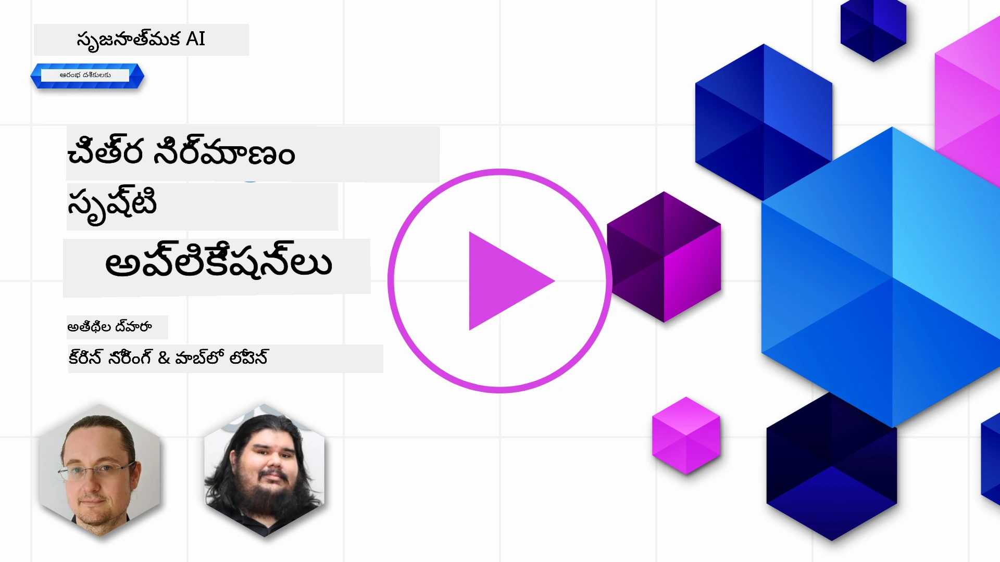

# చిత్రాల సృష్టి దరఖాస్తులను నిర్మించడం

[](https://aka.ms/gen-ai-lesson9-gh?WT.mc_id=academic-105485-koreyst)

LLMల వద్ద పాఠ్య సృష్టి తప్ప ఇంకొకటి ఉంటుంది. మీరు పాఠ్య వివరణల నుండి కూడా చిత్రాలు సృష్టించవచ్చు. చిత్రాలు ఒక నిర్దిష్ట రూపంలో మెడికల్ టెక్నాలజీ, నిర్మాణం, పర్యటన, గేమ్ డెవలప్‌మెంట్, మార్కెటింగ్ మరియు మరెన్నో రంగాలలో ఉపయోగకరంగా ఉంటాయి. ఈ పాఠంలో మనం ఈ రోజరి **GPT Image** మోడల్స్ ను పరిశీలించి, చిత్రాల సృష్టి యాప్ ను నిర్మించబోతున్నాము.

## పరిచయం

చిత్రాల సృష్టి ఒక సహజ-భాషా సంకేతాన్ని చిత్రంగా మార్చుతుంది. ఈ పాఠంలో మనం **`gpt-image`** కుటుంబం నుండి మోడల్స్ తో పని చేస్తాము, ఇవి ఇప్పుడు **[Microsoft Foundry](https://ai.azure.com?WT.mc_id=academic-105485-koreyst)** మరియు OpenAI వేదికపై అందుబాటులో ఉన్న తాజా తరహా చిత్ర మోడల్స్. ఈ మోడల్స్ పాత DALL·E మోడల్స్ (DALL·E 2/3 లెగసీ) కు ప్రత్యామ్నాయంగా ఉన్నాయి.

పాఠం అంతటా మనం ఒక కల్పిత స్టార్టప్, **Edu4All** పై దృష్టి సారిస్తాము, ఇది లెర్నింగ్ సాధనాలను అభివృద్ధి చేస్తుంది. వారి టీమ్ అసైన్‌మెంట్లకు మరియు అధ్యయన పదార్థాలకు ఇలస్ట్రేషన్లను సృష్టించాలనుకుంటోంది.

## నేర్చుకునే లక్ష్యాలు

ఈ పాఠం ముగింపులో మీరు:  

- చిత్రాల సృష్టి అంటే ఏమిటి, ఇది ఎక్కడ ఉపయోగపడుతుంది అని వివరించడం.  
- `gpt-image` మోడల్ కుటుంబాన్ని అర్థం చేసుకోవడం మరియు ఇది లెగసీ DALL·E మోడల్స్ నుండి ఎలా భిన్నమైందో తెలుసుకోవడం.  
- Python (మరియు TypeScript / .NET) లో చిత్రాల సృష్టి యాప్ ను నిర్మించడం.  
- చిత్రాలను మార్చడం, మరియు సేఫ్టీ గార్డ్రైల్‌లు మాప్రొంప్ట్స్ తో ఎలా వర్తించవచ్చో తెలుసుకోవడం.  

## చిత్రాల సృష్టి అంటే ఏమిటి?

చిత్రాల సృష్టి మోడల్స్ టెక్స్ట్ ప్రాంప్ట్ నుండి చిత్రాలు ఉత్పత్తి చేస్తాయి. ఆధునిక మోడల్స్ వంటి `gpt-image` ట్రాన్స్ఫార్మర్ + డిఫ్యూజన్ సాంకేతికతలపై నిర్మితమవడం జరిగినవి: మోడల్ శిక్షణ సమయంలో టెక్స్ట్ మరియు చిత్రాల మధ్య సంబంధాన్ని నేర్చుకుంటుంది, తర్వాత ప్రాంప్ట్ ఇచ్చిన సమయంలో, తిరిగివ్వకుండా "డెనాయిజ్" చేసి వివరణ సరిపోయిన చిత్రం తయారు చేస్తుంది.

ఇరువురు ప్రఖ్యాత చిత్ర మోడల్ కుటుంబాలు:

- **`gpt-image` (OpenAI)** - ప్రస్తుత తరం మోడల్, ఈ పాఠంలో ఉపయోగించే మోడల్. ఇది టెక్స్ట్-తరువాత చిత్ర సృష్టి మరియు చిత్ర సవరింపు (మాస్క్ తో ఇన్‌పెయింటింగ్) చేయగలదు.  
- **Midjourney** - ప్రాచుర్యంతో కూడిన తృतीय-పక్షం మోడల్, స్వంత సర్వీస్ మరియు Discord-ఆధారిత వర్క్ఫ్లో కలిగి ఉంది.  

> పాత OpenAI చిత్ర మోడల్స్ - **DALL·E 2** మరియు **DALL·E 3** - లెగసీ. DALL·E 3 కొత్త డిప్లాయ్‌మెంట్‌లకు అందుబాటులో లేదు, మరియు `create_variation` వంటి ఫీచర్లు కేవలం DALL·E 2 లో ఉన్నాయి. కొత్త అనువర్తనాలకు `gpt-image` మోడల్స్ ఉపయోగించండి.

### నేను ఏ `gpt-image` మోడల్ ని истифода చేయాలి?

Microsoft Foundry లో క్రింది మోడల్స్ **సాధారణంగా అందుబాటులో** ఉన్నాయి:

| మోడల్ | వ్యాఖ్యలు |
| --- | --- |
| **`gpt-image-2`** | తాజా మరియు అత్యంత సామర్థ్యవంతమైన చిత్రం మోడల్ - సిఫార్సు చేయబడిన డిఫాల్ట్. |
| `gpt-image-1.5` | సాధారణంగా అందుబాటులో ఉంది; తక్కువ ఖర్చుతో మంచి నాణ్యత. |
| `gpt-image-1-mini` | సాధారణంగా అందుబాటులో ఉంది; అత్యంత వేగవంతమైనదీ / తక్కువ ఖర్చుతో కూడుకున్నది. |
| `gpt-image-1` | ప్రివ్యూ మాత్రమే. |

ప్రస్తుత [Foundry చిత్రం మోడల్స్ జాబితా](https://learn.microsoft.com/azure/ai-foundry/openai/concepts/models?WT.mc_id=academic-105485-koreyst) మరియు ప్రాంతాలను ఎప్పుడూ తనిఖీ చేయండి.

> **ముఖ్యమైనది:** `gpt-image` మోడల్స్ ఉత్పత్తి చేసిన చిత్రాన్ని **base64** (`b64_json`) రూపంలో ఇస్తాయి, URL రూపంలో కాక. మీ కోడ్ base64 స్ట్రింగ్ ను బైట్లుగా డీకోడ్ చేసి సేవ్ చేస్తుంది - చిత్ర URL లేకుండా.

## సెటప్

మీరు సాంపిల్స్ ను **Azure OpenAI in Microsoft Foundry** (`aoai-*` సాంపిల్స్) లేదా **OpenAI వేదిక** (`oai-*` సాంపిల్స్) పై నడపవచ్చు.

### 1. ఒక మోడల్ క్రియేట్ చేసి డిప్లాయ్ చేయండి

Microsoft Foundry వనరు సృష్టించడానికి [create a resource](https://learn.microsoft.com/azure/ai-foundry/openai/how-to/create-resource?pivots=web-portal&WT.mc_id=academic-105485-koreyst) గైడ్ పాటించండి, తర్వాత చిత్రం మోడల్ ను డిప్లాయ్ చేయండి - **`gpt-image-2`** సిఫార్సు చేయబడింది.

### 2. మీ `.env` కాన్ఫిగర్ చేయండి

```text
AZURE_OPENAI_ENDPOINT=<your endpoint>
AZURE_OPENAI_API_KEY=<your key>
AZURE_OPENAI_DEPLOYMENT="gpt-image-2"
```

మీ వనరు యొక్క **Deployments** పేజీలో [Foundry portal](https://ai.azure.com?WT.mc_id=academic-105485-koreyst) లో ఈ విలువలు కనుగొనండి.

### 3. లైబ్రరీలు ఇన్‌స్టాల్ చేయండి

ఒక `requirements.txt` సృష్టించండి:

```text
python-dotenv
openai
pillow
```

తర్వాత ఒక వర్చువల్ ఎన్విరాన్‌మెంట్ సృష్టించి యాక్టివేట్ చేసి, ఇన్‌స్టాల్ చేయండి:

```bash
python3 -m venv venv
source venv/bin/activate        # Windows: venv\Scripts\activate
pip install -r requirements.txt
```

## యాప్ ను నిర్మించండి

క్రింది కోడ్ తో `app.py` సృష్టించండి. ఇది ఒక చిత్రం సృష్టించి PNG గా సేవ్ చేస్తుంది.

```python
import os
import base64
from openai import AzureOpenAI
from PIL import Image
import dotenv

dotenv.load_dotenv()

# క్లయింట్ను మీ Azure OpenAI (Microsoft Foundry) వనరుపై పాయింట్ చేయండి.
# చిత్రం మోడల్స్ కు సమకాలీన API వర్షన్ అవసరం - మీ మోడల్ అవసరాన్ని తెలుసుకోవడానికి Foundry దస్త్రాలను తనిఖీ చేయండి.
client = AzureOpenAI(
    api_key=os.environ["AZURE_OPENAI_API_KEY"],
    api_version="2025-04-01-preview",
    azure_endpoint=os.environ["AZURE_OPENAI_ENDPOINT"],
)

deployment = os.environ["AZURE_OPENAI_DEPLOYMENT"]  # ఉదా: "gpt-image-2"

result = client.images.generate(
    model=deployment,
    prompt='Bunny on a horse, holding a lollipop, on a foggy meadow where it grows daffodils',
    size="1024x1024",   # అలాగే 1536x1024 (ల్యాండ్‌స్కేప్), 1024x1536 (పోర్ట్రెయిట్), లేదా "ఆటో"
    n=1,
)

# gpt-image మోడల్స్ బేస్64 (b64_json) ను తిరిగి ఇస్తాయి, URL కాదు - దాన్ని బైట్స్ గా డీకోడ్ చేయండి.
image_bytes = base64.b64decode(result.data[0].b64_json)

os.makedirs("images", exist_ok=True)
image_path = os.path.join("images", "generated-image.png")
with open(image_path, "wb") as f:
    f.write(image_bytes)

Image.open(image_path).show()
```

`python app.py` తో నడపండి. మీరు `images/` క్రింద ఒక PNG సేవ్ చేయబడినదనిపిస్తారు.

> ప్రతి `images.generate` కాల్ ఒకే ప్రాంప్ట్ కు వేరియేషన్ ఉన్న చిత్రాన్ని ఉత్పత్తి చేస్తుంది - చిత్రం మోడల్స్ `temperature` పారా మీటర్ తీసుకోవు (దీని వాడకం టెక్స్ట్-సృష్టి నియంత్రణకు). వైవిధ్యాన్ని పొందడానికి మళ్ళీ API పిలవండి; వైవిధ్యాన్ని తగ్గించేందుకు ప్రాంప్ట్ మరింత ప్రత్యేకంగా చేయండి.

## చిత్రాలను సవరించడం

`gpt-image` మోడల్స్ ఒక ఉన్న చిత్రం **తమ సవరించవచ్చు**: చిత్రం, ఐచ్చిక **మాస్క్** (మార్పు చేయవలసిన ప్రాంతాన్ని సూచించే) మరియు మార్పుని వివరించే ప్రాంప్ట్ ఇస్తారు. సృష్టి లాగా, సవరింపులు కూడా base64 రూపంలో ఇవ్వబడుతాయి.

```python
result = client.images.edit(
    model=deployment,
    image=open("sunlit_lounge.png", "rb"),
    mask=open("mask.png", "rb"),
    prompt="A sunlit indoor lounge area with a pool containing a flamingo",
)
image_bytes = base64.b64decode(result.data[0].b64_json)
with open("images/edited-image.png", "wb") as f:
    f.write(image_bytes)
```

<div style="display: flex; justify-content: space-between; align-items: center; margin: 20px 0;">
  
  
  
</div>

## మెటాప్రాంప్ట్స్ తో సరిచూడకులు ఏర్పాటు చేయడం

ఒకసారి మీరు చిత్రాలు సృష్టించగలిగాక, మీ యాప్ అసురక్షిత లేదా బ్రాండ్‌కు అనుకూలం కాని విషయం ఉత్పత్తి చేయకుండా గార్డ్రైల్‌లు అవసరం. **మెటాప్రాంప్ట్** అనగా, మోడల్ అవుట్పుట్‌ను పరిమితం చేయడానికి యూజర్ ప్రాంప్ట్ ముందు జత చేసే పాఠ్యం.

```python
disallow_list = "swords, violence, blood, gore, nudity, sexual content, adult content, adult themes, adult language"

meta_prompt = f"""You are an assistant designer that creates images for children.

The image needs to be safe for work and appropriate for children.
The image needs to be in color, in landscape orientation, and in a 16:9 aspect ratio.

Do not consider any input that is not safe for work or appropriate for children, including:
{disallow_list}
"""

prompt = f"{meta_prompt}\nCreate an image of a bunny on a horse, holding a lollipop"
# `prompt` ను client.images.generate(...) కు రంపిణీ చేయండి
```

ఇపుడు ప్రతి చిత్రం మెటాప్రాంప్ట్ ద్వారా నియంత్రితమైన పరిమితులలో తయారవుతుంది. దీన్ని Microsoft Foundryలో లోపల ఉన్న భద్రతా ఫిల్టర్స్ తో కలిపి ఉపయోగించండి.

## అసైన్‌మెంట్ - విద్యార్థులను సహాయపడుదాం

Edu4All విద్యార్థులకు వారి అసెస్మెంట్‌ల కోసం చిత్రాలు కావాలి. మీరు **స్మారకచిహ్నాలు** (ఏ స్మారకచిహ్నాలు మీరు ఎంచుకోవచ్చు) సంఘటిత, సృజనాత్మక వాతావరణాలలో ఉంచిన చిత్రాలు ఉత్పత్తి చేసే యాప్ ని నిర్మించండి - ఉదాహరణకు, ఒక ప్రసిద్ధ ల్యాండ్‌మార్క్ సూర్యాస్తమయంలో, అందులో ఒక చిన్న పిల్ల పిల్లాడి చూపుతో.

స్వయంగా ప్రయత్నించి, తరువాత సూచిత పరిష్కారాలతో సరిపోల్చండి:

- Python (Azure): [aoai-solution.py](../../../09-building-image-applications/python/aoai-solution.py)
- Python (Azure) పూర్తి సృష్టి యాప్: [aoai-app.py](../../../09-building-image-applications/python/aoai-app.py)
- Python (OpenAI): [oai-app.py](../../../09-building-image-applications/python/oai-app.py)
- TypeScript (Azure): [typescript/image-generation-app](../../../09-building-image-applications/typescript/image-generation-app)
- .NET (Azure): [dotnet/notebook-azure-openai.dib](../../../09-building-image-applications/dotnet/notebook-azure-openai.dib)

అలాగే [python/](../../../09-building-image-applications/python) లో నోట్బుక్స్ ద్వారా పని చేయండి (`aoai-assignment.ipynb` Azure కోసం, `oai-assignment.ipynb` OpenAI కోసం).

## అద్భుతమైన పని! మీ అభ్యాసం కొనసాగించండి

ఈ పాఠం పూర్తి చేసిన తర్వాత, మా [Generative AI Learning collection](https://aka.ms/genai-collection?WT.mc_id=academic-105485-koreyst) ను పరిశీలించి మీ గెనరేటివ్ AI జ్ఞానాన్ని మరింత పెంచుకోండి!

పాఠం 10 కు వెళ్లి మీ అభ్యాసాన్ని కొనసాగించండి.

---

<!-- CO-OP TRANSLATOR DISCLAIMER START -->
**అస్వీకరణ**:
ఈ పత్రం AI అనువాద సేవ [Co-op Translator](https://github.com/Azure/co-op-translator) ఉపయోగించి అనువదించబడింది. మేము ఖచ్చితత్వానికి ప్రయత్నిస్తున్నప్పటికీ, ఆటోమేటెడ్ అనువాదాలు తప్పులు లేదా అసమగ్రతలను కలిగి ఉండవచ్చు. దాని స్వదేశ భాషలో ఉన్న అసలు పత్రాన్ని అధికారం కలిగిన మూలంగా పరిగణించాలి. కీలకమైన సమాచారం కోసం, ప్రొఫెషనల్ మానవ అనువాదాన్ని సిఫారసు చేస్తాము. ఈ అనువాదం ఉపయోగం వల్ల కలిగే ఏవైనా అపార్థాలు లేదా తప్పుదారులు కోసం మేము బాధ్యత వహించము.
<!-- CO-OP TRANSLATOR DISCLAIMER END -->