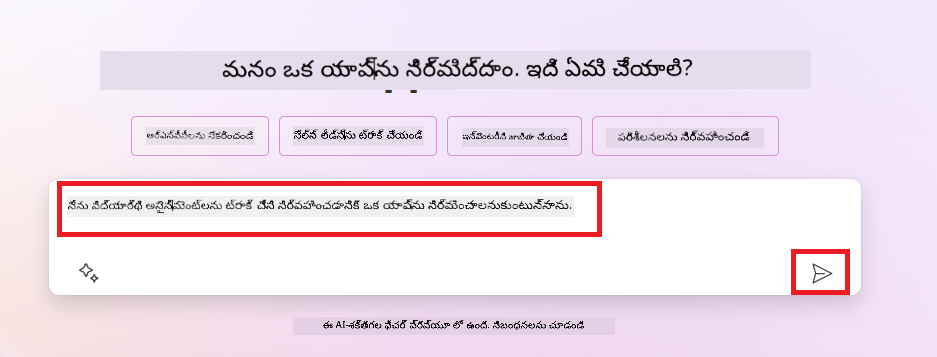
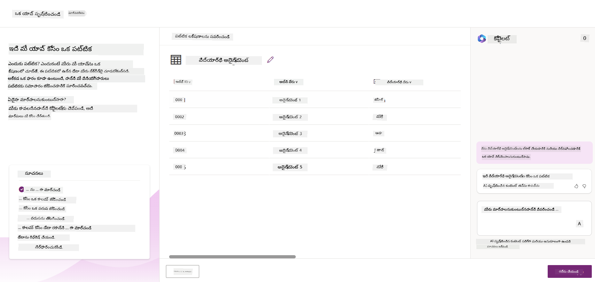

<!--
CO_OP_TRANSLATOR_METADATA:
{
  "original_hash": "846ac8e3b7dcfb697d3309fec05f0fea",
  "translation_date": "2025-12-19T20:30:26+00:00",
  "source_file": "10-building-low-code-ai-applications/README.md",
  "language_code": "te"
}
-->
# లో కోడ్ AI అప్లికేషన్లు నిర్మించడం

> _(ఈ పాఠం వీడియోను చూడడానికి పై చిత్రాన్ని క్లిక్ చేయండి)_

## పరిచయం

ఇమేజ్ జనరేట్ చేసే అప్లికేషన్లు ఎలా నిర్మించాలో నేర్చుకున్న తర్వాత, ఇప్పుడు లో కోడ్ గురించి మాట్లాడుకుందాం. జనరేటివ్ AI ను లో కోడ్ సహా వివిధ విభాగాల్లో ఉపయోగించవచ్చు, కానీ లో కోడ్ అంటే ఏమిటి మరియు దానిలో AI ను ఎలా జోడించవచ్చు?

లో కోడ్ డెవలప్‌మెంట్ ప్లాట్‌ఫారమ్‌ల ఉపయోగంతో సంప్రదాయ డెవలపర్లు మరియు నాన్-డెవలపర్లు కోసం యాప్స్ మరియు పరిష్కారాలను నిర్మించడం సులభమైంది. లో కోడ్ డెవలప్‌మెంట్ ప్లాట్‌ఫారమ్‌లు మీకు తక్కువ లేదా కోడ్ లేకుండా యాప్స్ మరియు పరిష్కారాలను నిర్మించడానికి సహాయపడతాయి. ఇది యాప్స్ మరియు పరిష్కారాలను నిర్మించడానికి భాగాలను డ్రాగ్ అండ్ డ్రాప్ చేయగల విజువల్ డెవలప్‌మెంట్ వాతావరణాన్ని అందించడం ద్వారా సాధించబడుతుంది. ఇది యాప్స్ మరియు పరిష్కారాలను వేగంగా మరియు తక్కువ వనరులతో నిర్మించడానికి సహాయపడుతుంది. ఈ పాఠంలో, లో కోడ్ ను ఎలా ఉపయోగించాలో మరియు పవర్ ప్లాట్‌ఫారమ్ ఉపయోగించి AI తో లో కోడ్ డెవలప్‌మెంట్‌ను ఎలా మెరుగుపరచాలో లోతుగా తెలుసుకుంటాము.

పవర్ ప్లాట్‌ఫారమ్ సంస్థలకు తమ బృందాలను సులభమైన లో-కోడ్ లేదా నో-కోడ్ వాతావరణంలో తమ స్వంత పరిష్కారాలను నిర్మించడానికి శక్తివంతం చేసే అవకాశం ఇస్తుంది. ఈ వాతావరణం పరిష్కారాలను నిర్మించే ప్రక్రియను సులభతరం చేస్తుంది. పవర్ ప్లాట్‌ఫారమ్‌తో, పరిష్కారాలను నెలలు లేదా సంవత్సరాల బదులు రోజులు లేదా వారాల్లో నిర్మించవచ్చు. పవర్ ప్లాట్‌ఫారమ్‌లో ఐదు ముఖ్య ఉత్పత్తులు ఉన్నాయి: పవర్ యాప్స్, పవర్ ఆటోమేట్, పవర్ BI, పవర్ పేజెస్ మరియు కోపైలట్ స్టూడియో.

ఈ పాఠం కవర్ చేస్తుంది:

- పవర్ ప్లాట్‌ఫారమ్‌లో జనరేటివ్ AI పరిచయం
- కోపైలట్ పరిచయం మరియు దాన్ని ఎలా ఉపయోగించాలో
- పవర్ ప్లాట్‌ఫారమ్‌లో యాప్స్ మరియు ఫ్లోలను నిర్మించడానికి జనరేటివ్ AI ఉపయోగించడం
- AI బిల్డర్‌తో పవర్ ప్లాట్‌ఫారమ్‌లో AI మోడల్స్‌ను అర్థం చేసుకోవడం

## నేర్చుకునే లక్ష్యాలు

ఈ పాఠం ముగిసిన తర్వాత, మీరు చేయగలుగుతారు:

- పవర్ ప్లాట్‌ఫారమ్‌లో కోపైలట్ ఎలా పనిచేస్తుందో అర్థం చేసుకోవడం.

- మా విద్యా స్టార్టప్ కోసం స్టూడెంట్ అసైన్‌మెంట్ ట్రాకర్ యాప్ నిర్మించడం.

- ఇన్వాయిస్ నుండి సమాచారాన్ని తీసుకునేందుకు AI ఉపయోగించే ఇన్వాయిస్ ప్రాసెసింగ్ ఫ్లో నిర్మించడం.

- GPT AI మోడల్‌తో టెక్స్ట్ సృష్టించేటప్పుడు ఉత్తమ పద్ధతులను వర్తింపజేయడం.

ఈ పాఠంలో మీరు ఉపయోగించే టూల్స్ మరియు సాంకేతికతలు:

- **పవర్ యాప్స్**, స్టూడెంట్ అసైన్‌మెంట్ ట్రాకర్ యాప్ కోసం, ఇది డేటాను ట్రాక్ చేయడానికి, నిర్వహించడానికి మరియు ఇంటరాక్ట్ చేయడానికి లో-కోడ్ డెవలప్‌మెంట్ వాతావరణాన్ని అందిస్తుంది.

- **డేటావర్స్**, స్టూడెంట్ అసైన్‌మెంట్ ట్రాకర్ యాప్ డేటాను నిల్వ చేయడానికి, ఇది యాప్ డేటాను నిల్వ చేయడానికి లో-కోడ్ డేటా ప్లాట్‌ఫారమ్‌ను అందిస్తుంది.

- **పవర్ ఆటోమేట్**, ఇన్వాయిస్ ప్రాసెసింగ్ ఫ్లో కోసం, ఇది ఇన్వాయిస్ ప్రాసెసింగ్ ప్రక్రియను ఆటోమేట్ చేయడానికి లో-కోడ్ వర్క్‌ఫ్లోలను నిర్మించడానికి వాతావరణాన్ని అందిస్తుంది.

- **AI బిల్డర్**, ఇన్వాయిస్ ప్రాసెసింగ్ AI మోడల్ కోసం, ఇది మా స్టార్టప్ కోసం ఇన్వాయిస్‌లను ప్రాసెస్ చేయడానికి ప్రీబిల్ట్ AI మోడల్స్‌ను ఉపయోగిస్తుంది.

## పవర్ ప్లాట్‌ఫారమ్‌లో జనరేటివ్ AI

జనరేటివ్ AI తో లో-కోడ్ డెవలప్‌మెంట్ మరియు అప్లికేషన్‌ను మెరుగుపరచడం పవర్ ప్లాట్‌ఫారమ్ యొక్క ముఖ్యమైన దృష్టి ప్రాంతం. లక్ష్యం ఎవరైనా AI-శక్తివంతమైన యాప్స్, సైట్లు, డాష్‌బోర్డ్లు మరియు AI తో ప్రక్రియలను ఆటోమేట్ చేయగలగడం, _ఏ డేటా సైన్స్ నైపుణ్యం అవసరం లేకుండా_. ఈ లక్ష్యం పవర్ ప్లాట్‌ఫారమ్‌లో లో-కోడ్ డెవలప్‌మెంట్ అనుభవంలో జనరేటివ్ AI ను కోపైలట్ మరియు AI బిల్డర్ రూపంలో సమగ్రపరచడం ద్వారా సాధించబడుతుంది.

### ఇది ఎలా పనిచేస్తుంది?

కోపైలట్ అనేది AI సహాయకుడు, ఇది సహజ భాషలో సంభాషణాత్మక దశల ద్వారా మీ అవసరాలను వివరించడం ద్వారా పవర్ ప్లాట్‌ఫారమ్ పరిష్కారాలను నిర్మించడానికి సహాయపడుతుంది. ఉదాహరణకు, మీరు మీ AI సహాయకుడికి మీ యాప్ ఉపయోగించే ఫీల్డ్స్ ఏమిటి అని చెప్పవచ్చు, అది యాప్ మరియు అంతర్గత డేటా మోడల్ రెండింటినీ సృష్టిస్తుంది లేదా మీరు పవర్ ఆటోమేట్‌లో ఫ్లో ఎలా సెట్ చేయాలో పేర్కొనవచ్చు.

మీ యాప్ స్క్రీన్లలో కోపైలట్ ఆధారిత ఫంక్షనాలిటీలను ఉపయోగించి వినియోగదారులు సంభాషణాత్మక ఇంటరాక్షన్ల ద్వారా అవగాహనలను కనుగొనగలుగుతారు.

AI బిల్డర్ అనేది పవర్ ప్లాట్‌ఫారమ్‌లో అందుబాటులో ఉన్న లో-కోడ్ AI సామర్థ్యం, ఇది AI మోడల్స్ ఉపయోగించి ప్రక్రియలను ఆటోమేట్ చేయడంలో మరియు ఫలితాలను అంచనా వేయడంలో సహాయపడుతుంది. AI బిల్డర్‌తో మీరు డేటావర్స్ లేదా షేర్‌పాయింట్, వన్‌డ్రైవ్ లేదా అజ్యూర్ వంటి వివిధ క్లౌడ్ డేటా మూలాల డేటాతో కనెక్ట్ అయ్యే యాప్స్ మరియు ఫ్లోలకు AI తీసుకురాగలరు.

కోపైలట్ పవర్ ప్లాట్‌ఫారమ్‌లోని అన్ని ఉత్పత్తులలో అందుబాటులో ఉంది: పవర్ యాప్స్, పవర్ ఆటోమేట్, పవర్ BI, పవర్ పేజెస్ మరియు పవర్ వర్చువల్ ఏజెంట్స్. AI బిల్డర్ పవర్ యాప్స్ మరియు పవర్ ఆటోమేట్‌లో అందుబాటులో ఉంది. ఈ పాఠంలో, మా విద్యా స్టార్టప్ కోసం పరిష్కారం నిర్మించడానికి పవర్ యాప్స్ మరియు పవర్ ఆటోమేట్‌లో కోపైలట్ మరియు AI బిల్డర్‌ను ఎలా ఉపయోగించాలో మనం దృష్టి పెట్టబోతున్నాము.

### పవర్ యాప్స్‌లో కోపైలట్

పవర్ ప్లాట్‌ఫారమ్ భాగంగా, పవర్ యాప్స్ డేటాను ట్రాక్ చేయడానికి, నిర్వహించడానికి మరియు ఇంటరాక్ట్ చేయడానికి యాప్స్ నిర్మించడానికి లో-కోడ్ డెవలప్‌మెంట్ వాతావరణాన్ని అందిస్తుంది. ఇది స్కేలబుల్ డేటా ప్లాట్‌ఫారమ్ మరియు క్లౌడ్ సేవలు మరియు ఆన్-ప్రెమైసెస్ డేటాతో కనెక్ట్ అయ్యే సామర్థ్యంతో కూడిన యాప్ డెవలప్‌మెంట్ సేవల సూట్. పవర్ యాప్స్ బ్రౌజర్లు, టాబ్లెట్లు మరియు ఫోన్లపై నడిచే యాప్స్‌ను నిర్మించడానికి మరియు సహోద్యోగులతో పంచుకోవడానికి అనుమతిస్తుంది. పవర్ యాప్స్ సులభమైన ఇంటర్‌ఫేస్‌తో యాప్ డెవలప్‌మెంట్‌ను సులభతరం చేస్తుంది, అందువల్ల ప్రతి వ్యాపార వినియోగదారు లేదా ప్రొ డెవలపర్ కస్టమ్ యాప్స్‌ను నిర్మించగలుగుతారు. జనరేటివ్ AI ద్వారా కోపైలట్‌తో యాప్ డెవలప్‌మెంట్ అనుభవం కూడా మెరుగుపడింది.

పవర్ యాప్స్‌లో కోపైలట్ AI సహాయకుడు ఫీచర్ మీరు ఏ రకమైన యాప్ కావాలో మరియు మీ యాప్ ఏ సమాచారాన్ని ట్రాక్ చేయాలో, సేకరించాలో లేదా చూపించాలో వివరించడానికి అనుమతిస్తుంది. కోపైలట్ మీ వివరణ ఆధారంగా స్పందనాత్మక కాన్వాస్ యాప్‌ను సృష్టిస్తుంది. మీరు ఆ యాప్‌ను మీ అవసరాలకు అనుగుణంగా అనుకూలీకరించవచ్చు. AI కోపైలట్ డేటావర్స్ టేబుల్‌ను కూడా సృష్టించి సూచిస్తుంది, ఇందులో మీరు ట్రాక్ చేయదలచిన డేటాను నిల్వ చేయడానికి అవసరమైన ఫీల్డ్స్ మరియు కొన్ని నమూనా డేటా ఉంటాయి. ఈ పాఠంలో తరువాత డేటావర్స్ అంటే ఏమిటి మరియు మీరు పవర్ యాప్స్‌లో దాన్ని ఎలా ఉపయోగించాలో చూద్దాం. మీరు ఆ టేబుల్‌ను AI కోపైలట్ సహాయకుడు ఫీచర్ ద్వారా సంభాషణాత్మక దశలతో మీ అవసరాలకు అనుగుణంగా అనుకూలీకరించవచ్చు. ఈ ఫీచర్ పవర్ యాప్స్ హోమ్ స్క్రీన్ నుండి సులభంగా అందుబాటులో ఉంటుంది.

### పవర్ ఆటోమేట్‌లో కోపైలట్

పవర్ ప్లాట్‌ఫారమ్ భాగంగా, పవర్ ఆటోమేట్ వినియోగదారులకు అప్లికేషన్లు మరియు సేవల మధ్య ఆటోమేటెడ్ వర్క్‌ఫ్లోలను సృష్టించడానికి అనుమతిస్తుంది. ఇది కమ్యూనికేషన్, డేటా సేకరణ మరియు నిర్ణయ ఆమోదాల వంటి పునరావృత వ్యాపార ప్రక్రియలను ఆటోమేట్ చేయడంలో సహాయపడుతుంది. దీని సులభమైన ఇంటర్‌ఫేస్ ప్రతి సాంకేతిక నైపుణ్యం కలిగిన వినియోగదారులకు (ప్రారంభ దశ నుండి అనుభవజ్ఞుల వరకు) పనులను ఆటోమేట్ చేయడానికి అనుమతిస్తుంది. వర్క్‌ఫ్లో డెవలప్‌మెంట్ అనుభవం కూడా జనరేటివ్ AI ద్వారా కోపైలట్‌తో మెరుగుపడింది.

పవర్ ఆటోమేట్‌లో కోపైలట్ AI సహాయకుడు ఫీచర్ మీరు ఏ రకమైన ఫ్లో కావాలో మరియు మీ ఫ్లో ఏ చర్యలు చేయాలో వివరించడానికి అనుమతిస్తుంది. కోపైలట్ మీ వివరణ ఆధారంగా ఫ్లోను సృష్టిస్తుంది. మీరు ఆ ఫ్లోను మీ అవసరాలకు అనుగుణంగా అనుకూలీకరించవచ్చు. AI కోపైలట్ మీరు ఆటోమేట్ చేయదలచిన పనిని చేయడానికి అవసరమైన చర్యలను కూడా సృష్టించి సూచిస్తుంది. ఈ పాఠంలో తరువాత ఫ్లోలు అంటే ఏమిటి మరియు మీరు పవర్ ఆటోమేట్‌లో వాటిని ఎలా ఉపయోగించాలో చూద్దాం. మీరు ఆ చర్యలను AI కోపైలట్ సహాయకుడు ఫీచర్ ద్వారా సంభాషణాత్మక దశలతో మీ అవసరాలకు అనుగుణంగా అనుకూలీకరించవచ్చు. ఈ ఫీచర్ పవర్ ఆటోమేట్ హోమ్ స్క్రీన్ నుండి సులభంగా అందుబాటులో ఉంటుంది.

## అసైన్‌మెంట్: మా స్టార్టప్ కోసం విద్యార్థి అసైన్‌మెంట్లు మరియు ఇన్వాయిస్లను కోపైలట్ ఉపయోగించి నిర్వహించండి

మా స్టార్టప్ విద్యార్థులకు ఆన్‌లైన్ కోర్సులను అందిస్తుంది. స్టార్టప్ వేగంగా పెరిగింది మరియు ఇప్పుడు కోర్సుల డిమాండ్‌ను తట్టుకోలేకపోతుంది. స్టార్టప్ పవర్ ప్లాట్‌ఫారమ్ డెవలపర్‌గా మీను నియమించి, వారి విద్యార్థి అసైన్‌మెంట్లు మరియు ఇన్వాయిస్లను నిర్వహించడానికి లో కోడ్ పరిష్కారాన్ని నిర్మించమని కోరింది. వారి పరిష్కారం యాప్ ద్వారా విద్యార్థి అసైన్‌మెంట్లను ట్రాక్ చేయడంలో మరియు వర్క్‌ఫ్లో ద్వారా ఇన్వాయిస్ ప్రాసెసింగ్ ప్రక్రియను ఆటోమేట్ చేయడంలో సహాయపడాలి. మీరు జనరేటివ్ AI ఉపయోగించి పరిష్కారాన్ని అభివృద్ధి చేయమని అడిగారు.

కోపైలట్ ఉపయోగించడం ప్రారంభించినప్పుడు, మీరు [Power Platform Copilot Prompt Library](https://github.com/pnp/powerplatform-prompts?WT.mc_id=academic-109639-somelezediko) ఉపయోగించి ప్రాంప్ట్‌లతో ప్రారంభించవచ్చు. ఈ లైబ్రరీలో కోపైలట్‌తో యాప్స్ మరియు ఫ్లోలను నిర్మించడానికి ఉపయోగించే ప్రాంప్ట్‌ల జాబితా ఉంటుంది. మీరు మీ అవసరాలను కోపైలట్‌కు ఎలా వివరించాలో ఆలోచించడానికి కూడా ఈ లైబ్రరీలోని ప్రాంప్ట్‌లను ఉపయోగించవచ్చు.

### మా స్టార్టప్ కోసం స్టూడెంట్ అసైన్‌మెంట్ ట్రాకర్ యాప్ నిర్మించండి

మా స్టార్టప్‌లో విద్యా నిపుణులు విద్యార్థి అసైన్‌మెంట్లను ట్రాక్ చేయడంలో ఇబ్బంది పడుతున్నారు. వారు అసైన్‌మెంట్లను ట్రాక్ చేయడానికి స్ప్రెడ్షీట్ ఉపయోగిస్తున్నారు, కానీ విద్యార్థుల సంఖ్య పెరగడంతో ఇది నిర్వహించడానికి కష్టం అయింది. వారు విద్యార్థి అసైన్‌మెంట్లను ట్రాక్ చేయడానికి మరియు నిర్వహించడానికి సహాయపడే యాప్‌ను మీరు నిర్మించాలని కోరారు. యాప్ కొత్త అసైన్‌మెంట్లను జోడించడానికి, అసైన్‌మెంట్లను వీక్షించడానికి, అప్డేట్ చేయడానికి మరియు తొలగించడానికి అనుమతించాలి. యాప్ విద్యా నిపుణులు మరియు విద్యార్థులు గ్రేడ్ చేసిన అసైన్‌మెంట్లు మరియు గ్రేడ్ చేయని అసైన్‌మెంట్లను వీక్షించడానికి కూడా అనుమతించాలి.

కోపైలట్ ఉపయోగించి పవర్ యాప్స్‌లో క్రింది దశలను అనుసరించి యాప్‌ను నిర్మించండి:

1. [Power Apps](https://make.powerapps.com?WT.mc_id=academic-105485-koreyst) హోమ్ స్క్రీన్‌కు వెళ్లండి.

1. హోమ్ స్క్రీన్‌లోని టెక్స్ట్ ఏరియాలో మీరు నిర్మించదలచిన యాప్‌ను వివరించండి. ఉదాహరణకు, **_నేను విద్యార్థి అసైన్‌మెంట్లను ట్రాక్ చేయడానికి మరియు నిర్వహించడానికి యాప్ నిర్మించాలనుకుంటున్నాను_**. AI కోపైలట్‌కు ప్రాంప్ట్ పంపడానికి **Send** బటన్‌ను క్లిక్ చేయండి.

1. AI కోపైలట్ మీరు ట్రాక్ చేయదలచిన డేటాను నిల్వ చేయడానికి అవసరమైన ఫీల్డ్స్ మరియు కొన్ని నమూనా డేటాతో డేటావర్స్ టేబుల్‌ను సూచిస్తుంది. మీరు ఆ టేబుల్‌ను AI కోపైలట్ సహాయకుడు ఫీచర్ ద్వారా సంభాషణాత్మక దశలతో మీ అవసరాలకు అనుగుణంగా అనుకూలీకరించవచ్చు.

   > **ముఖ్యమైనది**: డేటావర్స్ పవర్ ప్లాట్‌ఫారమ్ కోసం అంతర్గత డేటా ప్లాట్‌ఫారమ్. ఇది యాప్ డేటాను నిల్వ చేయడానికి లో-కోడ్ డేటా ప్లాట్‌ఫారమ్. ఇది మైక్రోసాఫ్ట్ క్లౌడ్‌లో డేటాను సురక్షితంగా నిల్వ చేసే పూర్తిగా నిర్వహించబడే సేవ మరియు మీ పవర్ ప్లాట్‌ఫారమ్ వాతావరణంలో ప్రొవిజన్ చేయబడుతుంది. ఇది డేటా వర్గీకరణ, డేటా లినియేజ్, సున్నితమైన యాక్సెస్ నియంత్రణ వంటి బిల్ట్-ఇన్ డేటా గవర్నెన్స్ సామర్థ్యాలతో వస్తుంది. మీరు డేటావర్స్ గురించి మరింత తెలుసుకోవచ్చు [ఇక్కడ](https://docs.microsoft.com/powerapps/maker/data-platform/data-platform-intro?WT.mc_id=academic-109639-somelezediko).

   

1. విద్యా నిపుణులు తమ అసైన్‌మెంట్లు సమర్పించిన విద్యార్థులకు ఇమెయిల్స్ పంపడానికి కోరుకుంటున్నారు. మీరు విద్యార్థి ఇమెయిల్ నిల్వ చేయడానికి టేబుల్‌కు కొత్త ఫీల్డ్ జోడించడానికి కోపైలట్ ఉపయోగించవచ్చు. ఉదాహరణకు, మీరు ఈ క్రింది ప్రాంప్ట్ ఉపయోగించి టేబుల్‌కు కొత్త కాలమ్ జోడించవచ్చు: **_నేను విద్యార్థి ఇమెయిల్ నిల్వ చేయడానికి కాలమ్ జోడించాలనుకుంటున్నాను_**. AI కోపైలట్‌కు ప్రాంప్ట్ పంపడానికి **Send** బటన్‌ను క్లిక్ చేయండి.

1. AI కోపైలట్ కొత్త ఫీల్డ్‌ను సృష్టిస్తుంది, మీరు ఆ ఫీల్డ్‌ను మీ అవసరాలకు అనుగుణంగా అనుకూలీకరించవచ్చు.

1. టేబుల్‌తో పని పూర్తయిన తర్వాత, యాప్ సృష్టించడానికి **Create app** బటన్‌ను క్లిక్ చేయండి.

1. AI కోపైలట్ మీ వివరణ ఆధారంగా స్పందనాత్మక కాన్వాస్ యాప్‌ను సృష్టిస్తుంది. మీరు ఆ యాప్‌ను మీ అవసరాలకు అనుగుణంగా అనుకూలీకరించవచ్చు.

1. విద్యా నిపుణులు విద్యార్థులకు ఇమెయిల్స్ పంపడానికి, మీరు యాప్‌కు కొత్త స్క్రీన్ జోడించడానికి కోపైలట్ ఉపయోగించవచ్చు. ఉదాహరణకు, మీరు ఈ క్రింది ప్రాంప్ట్ ఉపయోగించి యాప్‌కు కొత్త స్క్రీన్ జోడించవచ్చు: **_నేను విద్యార్థులకు ఇమెయిల్స్ పంపడానికి స్క్రీన్ జోడించాలనుకుంటున్నాను_**. AI కోపైలట్‌కు ప్రాంప్ట్ పంపడానికి **Send** బటన్‌ను క్లిక్ చేయండి.

1. AI కోపైలట్ కొత్త స్క్రీన్‌ను సృష్టిస్తుంది, మీరు ఆ స్క్రీన్‌ను మీ అవసరాలకు అనుగుణంగా అనుకూలీకరించవచ్చు.

1. యాప్‌తో పని పూర్తయిన తర్వాత, యాప్‌ను సేవ్ చేయడానికి **Save** బటన్‌ను క్లిక్ చేయండి.

1. యాప్‌ను విద్యా నిపుణులతో పంచుకోవడానికి, **Share** బటన్‌ను క్లిక్ చేసి, మళ్లీ **Share** బటన్‌ను క్లిక్ చేయండి. మీరు వారి ఇమెయిల్ చిరునామాలు నమోదు చేసి యాప్‌ను పంచుకోవచ్చు.

> **మీ హోంవర్క్**: మీరు ఇప్పుడే నిర్మించిన యాప్ మంచి ప్రారంభం కానీ మెరుగుపరచవచ్చు. ఇమెయిల్ ఫీచర్‌తో, విద్యా నిపుణులు విద్యార్థులకు ఇమెయిల్స్‌ను మాన్యువల్‌గా మాత్రమే పంపగలరు, అంటే వారి ఇమెయిల్స్ టైప్ చేయాల్సి ఉంటుంది. మీరు కోపైలట్ ఉపయోగించి విద్యా నిపుణులు అసైన్‌మెంట్లు సమర్పించినప్పుడు విద్యార్థులకు ఆటోమేటిక్‌గా ఇమెయిల్స్ పంపే ఆటోమేషన్‌ను నిర్మించగలరా? సరైన ప్రాంప్ట్‌తో మీరు పవర్ ఆటోమేట్‌లో కోపైలట్ ఉపయోగించి దీన్ని నిర్మించవచ్చు.

### మా స్టార్టప్ కోసం ఇన్వాయిస్ల సమాచారం టేబుల్ నిర్మించండి

మా స్టార్టప్ ఫైనాన్స్ బృందం ఇన్వాయిస్లను ట్రాక్ చేయడంలో ఇబ్బంది పడుతోంది. వారు ఇన్వాయిస్లను ట్రాక్ చేయడానికి స్ప్రెడ్షీట్ ఉపయోగిస్తున్నారు, కానీ ఇన్వాయిస్ల సంఖ్య పెరగడంతో ఇది నిర్వహించడానికి కష్టం అయింది. వారు అందుకున్న ఇన్వాయిస్ల సమాచారాన్ని నిల్వ చేయడానికి, ట్రాక్ చేయడానికి మరియు నిర్వహించడానికి సహాయపడే టేబుల్‌ను మీరు నిర్మించాలని కోరారు. ఆ టేబుల్‌ను ఉపయోగించి అన్ని ఇన్వాయిస్ సమాచారాన్ని తీసుకునే ఆటోమేషన్‌ను కూడా నిర్మించాలి. టేబుల్ ఫైనాన్స్ బృందానికి చెల్లించిన ఇన్వాయిస్లను మరియు చెల్లించని ఇన్వాయిస్లను వీక్షించడానికి అనుమతించాలి.

పవర్ ప్లాట్‌ఫారమ్‌లో డేటావర్స్ అనే అంతర్గత డేటా ప్లాట్‌ఫారమ్ ఉంది, ఇది మీ యాప్స్ మరియు పరిష్కారాల కోసం డేటాను నిల్వ చేయడానికి అనుమతిస్తుంది. డేటావర్స్ యాప్ డేటాను నిల్వ చేయడానికి లో-కోడ్ డేటా ప్లాట్‌ఫారమ్‌ను అందిస్తుంది. ఇది మైక్రోసాఫ్ట్ క్లౌడ్‌లో డేటాను సురక్షితంగా నిల్వ చేసే పూర్తిగా నిర్వహించబడే సేవ మరియు మీ పవర్ ప్లాట్‌ఫారమ్ వాతావరణంలో ప్రొవిజన్ చేయబడుతుంది. ఇది డేటా వర్గీకరణ, డేటా లినియేజ్, సున్నితమైన యాక్సెస్ నియంత్రణ వంటి బిల్ట్-ఇన్ డేటా గవర్నెన్స్ సామర్థ్యాలతో వస్తుంది. మీరు డేటావర్స్ గురించి మరింత తెలుసుకోవచ్చు [ఇక్కడ](https://docs.microsoft.com/powerapps/maker/data-platform/data-platform-intro?WT.mc_id=academic-109639-somelezediko).
మా స్టార్టప్ కోసం Dataverse ను ఎందుకు ఉపయోగించాలి? Dataverse లోని స్టాండర్డ్ మరియు కస్టమ్ టేబుల్స్ మీ డేటా కోసం సురక్షితమైన మరియు క్లౌడ్ ఆధారిత నిల్వ ఎంపికను అందిస్తాయి. టేబుల్స్ ద్వారా మీరు వివిధ రకాల డేటాను నిల్వ చేయవచ్చు, ఇది మీరు ఒకే Excel వర్క్‌బుక్‌లో అనేక వర్క్‌షీట్లను ఉపయోగించే విధంగా ఉంటుంది. మీరు టేబుల్స్‌ను మీ సంస్థ లేదా వ్యాపార అవసరాలకు ప్రత్యేకమైన డేటాను నిల్వ చేయడానికి ఉపయోగించవచ్చు. Dataverse ఉపయోగించడం ద్వారా మా స్టార్టప్ పొందగల కొన్ని లాభాలు ఇవి, కానీ ఇవి మాత్రమే కాకుండా:

- **సులభంగా నిర్వహించగలిగేది**: మెటాడేటా మరియు డేటా రెండూ క్లౌడ్‌లో నిల్వ చేయబడతాయి, కాబట్టి అవి ఎలా నిల్వ చేయబడతాయో లేదా నిర్వహించబడతాయో గురించి మీరు ఆందోళన చెందాల్సిన అవసరం లేదు. మీరు మీ యాప్స్ మరియు పరిష్కారాలను నిర్మించడంపై దృష్టి పెట్టవచ్చు.

- **సురక్షితం**: Dataverse మీ డేటా కోసం సురక్షితమైన మరియు క్లౌడ్ ఆధారిత నిల్వ ఎంపికను అందిస్తుంది. మీరు టేబుల్స్‌లోని డేటాకు ఎవరు యాక్సెస్ కలిగి ఉన్నారో మరియు వారు దానిని ఎలా యాక్సెస్ చేయగలరో రోల్ ఆధారిత భద్రత ఉపయోగించి నియంత్రించవచ్చు.

- **సంపన్నమైన మెటాడేటా**: డేటా రకాలు మరియు సంబంధాలు Power Apps లో నేరుగా ఉపయోగించబడతాయి

- **లాజిక్ మరియు ధృవీకరణ**: వ్యాపార నియమాలు, లెక్కించిన ఫీల్డ్స్, మరియు ధృవీకరణ నియమాలను ఉపయోగించి వ్యాపార లాజిక్‌ను అమలు చేయవచ్చు మరియు డేటా ఖచ్చితత్వాన్ని నిర్వహించవచ్చు.

ఇప్పుడు మీరు Dataverse అంటే ఏమిటి మరియు దాన్ని ఎందుకు ఉపయోగించాలో తెలుసుకున్నారనుకుంటే, మా ఫైనాన్స్ టీమ్ అవసరాలను తీర్చడానికి Dataverse లో టేబుల్‌ను సృష్టించడానికి Copilot ను ఎలా ఉపయోగించాలో చూద్దాం.

> **గమనిక** : మీరు ఈ టేబుల్‌ను తదుపరి విభాగంలో ఉపయోగించి అన్ని ఇన్వాయిస్ సమాచారాన్ని తీసుకుని టేబుల్‌లో నిల్వ చేసే ఆటోమేషన్‌ను నిర్మించాలి.

Copilot ఉపయోగించి Dataverse లో టేబుల్ సృష్టించడానికి, క్రింది దశలను అనుసరించండి:

1. [Power Apps](https://make.powerapps.com?WT.mc_id=academic-105485-koreyst) హోమ్ స్క్రీన్‌కు వెళ్లండి.

2. ఎడమ నావిగేషన్ బార్‌లో **Tables** ఎంచుకుని, తరువాత **Describe the new Table** పై క్లిక్ చేయండి.

3. **Describe the new Table** స్క్రీన్‌లో, మీరు సృష్టించాలనుకునే టేబుల్‌ను వివరించడానికి టెక్స్ట్ ఏరియా ఉపయోగించండి. ఉదాహరణకు, **_నేను ఇన్వాయిస్ సమాచారాన్ని నిల్వ చేయడానికి ఒక టేబుల్ సృష్టించాలనుకుంటున్నాను_**. AI Copilot కు ప్రాంప్ట్ పంపడానికి **Send** బటన్ పై క్లిక్ చేయండి.

4. AI Copilot మీరు ట్రాక్ చేయాలనుకునే డేటాను నిల్వ చేయడానికి అవసరమైన ఫీల్డ్స్‌తో Dataverse టేబుల్‌ను సూచిస్తుంది మరియు కొన్ని నమూనా డేటాను కూడా చూపిస్తుంది. మీరు AI Copilot అసిస్టెంట్ ఫీచర్ ద్వారా సంభాషణాత్మక దశల ద్వారా టేబుల్‌ను మీ అవసరాలకు అనుగుణంగా అనుకూలీకరించవచ్చు.

5. ఫైనాన్స్ టీమ్ సరఫరాదారునికి వారి ఇన్వాయిస్ ప్రస్తుత స్థితిని అప్‌డేట్ చేయడానికి ఇమెయిల్ పంపాలనుకుంటుంది. మీరు Copilot ఉపయోగించి సరఫరాదారు ఇమెయిల్ నిల్వ చేయడానికి టేబుల్‌కు కొత్త ఫీల్డ్‌ను జోడించవచ్చు. ఉదాహరణకు, టేబుల్‌కు కొత్త కాలమ్ జోడించడానికి ఈ క్రింది ప్రాంప్ట్ ఉపయోగించవచ్చు: **_నేను సరఫరాదారు ఇమెయిల్ నిల్వ చేయడానికి ఒక కాలమ్ జోడించాలనుకుంటున్నాను_**. AI Copilot కు ప్రాంప్ట్ పంపడానికి **Send** బటన్ పై క్లిక్ చేయండి.

6. AI Copilot కొత్త ఫీల్డ్‌ను సృష్టిస్తుంది, మీరు ఆ ఫీల్డ్‌ను మీ అవసరాలకు అనుగుణంగా అనుకూలీకరించవచ్చు.

7. టేబుల్‌తో పని పూర్తయిన తర్వాత, టేబుల్ సృష్టించడానికి **Create** బటన్ పై క్లిక్ చేయండి.

## Power Platform లో AI మోడల్స్ AI Builder తో

AI Builder అనేది Power Platform లో అందుబాటులో ఉన్న లో-కోడ్ AI సామర్థ్యం, ఇది AI మోడల్స్ ఉపయోగించి ప్రక్రియలను ఆటోమేట్ చేయడంలో మరియు ఫలితాలను అంచనా వేయడంలో సహాయపడుతుంది. AI Builder తో మీరు Dataverse లేదా SharePoint, OneDrive, Azure వంటి వివిధ క్లౌడ్ డేటా మూలాల డేటాతో కనెక్ట్ అయ్యే యాప్స్ మరియు ఫ్లోస్‌లో AIని తీసుకురాగలరు.

## ప్రీబిల్ట్ AI మోడల్స్ vs కస్టమ్ AI మోడల్స్

AI Builder రెండు రకాల AI మోడల్స్ అందిస్తుంది: ప్రీబిల్ట్ AI మోడల్స్ మరియు కస్టమ్ AI మోడల్స్. ప్రీబిల్ట్ AI మోడల్స్ Microsoft ద్వారా శిక్షణ పొందిన, Power Platform లో అందుబాటులో ఉన్న రెడీ-టు-యూజ్ AI మోడల్స్. ఇవి మీ యాప్స్ మరియు ఫ్లోస్‌లకు ఇంటెలిజెన్స్ జోడించడంలో సహాయపడతాయి, మీరు డేటా సేకరించి, మీ స్వంత మోడల్స్‌ను నిర్మించి, శిక్షణ ఇచ్చి, ప్రచురించాల్సిన అవసరం లేకుండా. మీరు ఈ మోడల్స్‌ను ప్రక్రియలను ఆటోమేట్ చేయడానికి మరియు ఫలితాలను అంచనా వేయడానికి ఉపయోగించవచ్చు.

Power Platform లో అందుబాటులో ఉన్న కొన్ని ప్రీబిల్ట్ AI మోడల్స్:

- **Key Phrase Extraction**: ఈ మోడల్ టెక్స్ట్ నుండి కీలక పదాలను తీసుకుంటుంది.
- **Language Detection**: ఈ మోడల్ టెక్స్ట్ భాషను గుర్తిస్తుంది.
- **Sentiment Analysis**: ఈ మోడల్ టెక్స్ట్‌లో సానుకూల, ప్రతికూల, న్యూట్రల్ లేదా మిశ్రమ భావాలను గుర్తిస్తుంది.
- **Business Card Reader**: ఈ మోడల్ బిజినెస్ కార్డుల నుండి సమాచారాన్ని తీసుకుంటుంది.
- **Text Recognition**: ఈ మోడల్ చిత్రాల నుండి టెక్స్ట్‌ను తీసుకుంటుంది.
- **Object Detection**: ఈ మోడల్ చిత్రాల నుండి వస్తువులను గుర్తించి తీసుకుంటుంది.
- **Document processing**: ఈ మోడల్ ఫారమ్‌ల నుండి సమాచారాన్ని తీసుకుంటుంది.
- **Invoice Processing**: ఈ మోడల్ ఇన్వాయిస్ల నుండి సమాచారాన్ని తీసుకుంటుంది.

కస్టమ్ AI మోడల్స్‌తో మీరు మీ స్వంత మోడల్‌ను AI Builder లోకి తీసుకురాగలరు, తద్వారా అది ఏదైనా AI Builder కస్టమ్ మోడల్‌లా పనిచేస్తుంది, మీ స్వంత డేటాతో మోడల్‌ను శిక్షణ ఇవ్వగలుగుతారు. మీరు ఈ మోడల్స్‌ను Power Apps మరియు Power Automate రెండింటిలోనూ ప్రక్రియలను ఆటోమేట్ చేయడానికి మరియు ఫలితాలను అంచనా వేయడానికి ఉపయోగించవచ్చు. మీ స్వంత మోడల్ ఉపయోగించినప్పుడు కొన్ని పరిమితులు వర్తిస్తాయి. ఈ పరిమితుల గురించి మరింత చదవండి [limitations](https://learn.microsoft.com/ai-builder/byo-model#limitations?WT.mc_id=academic-105485-koreyst).

## అసైన్‌మెంట్ #2 - మా స్టార్టప్ కోసం ఇన్వాయిస్ ప్రాసెసింగ్ ఫ్లో నిర్మించండి

ఫైనాన్స్ టీమ్ ఇన్వాయిస్లను ప్రాసెస్ చేయడంలో ఇబ్బందులు పడుతోంది. వారు ఇన్వాయిస్లను ట్రాక్ చేయడానికి స్ప్రెడ్షీట్ ఉపయోగిస్తున్నారు, కానీ ఇన్వాయిస్ల సంఖ్య పెరిగినందున ఇది నిర్వహించడానికి కష్టం అయింది. వారు AI ఉపయోగించి ఇన్వాయిస్లను ప్రాసెస్ చేయడంలో సహాయపడే వర్క్‌ఫ్లోను మీరు నిర్మించాలని కోరారు. వర్క్‌ఫ్లో ఇన్వాయిస్ల నుండి సమాచారాన్ని తీసుకుని Dataverse టేబుల్‌లో నిల్వ చేయగలగాలి. అలాగే, వర్క్‌ఫ్లో ఫైనాన్స్ టీమ్‌కు తీసుకున్న సమాచారంతో ఇమెయిల్ పంపగలగాలి.

ఇప్పుడు మీరు AI Builder అంటే ఏమిటి మరియు దాన్ని ఎందుకు ఉపయోగించాలో తెలుసుకున్నారనుకుంటే, ముందుగా కవర్ చేసిన ఇన్వాయిస్ ప్రాసెసింగ్ AI మోడల్‌ను ఉపయోగించి ఫైనాన్స్ టీమ్ ఇన్వాయిస్లను ప్రాసెస్ చేయడానికి వర్క్‌ఫ్లోను ఎలా నిర్మించాలో చూద్దాం.

AI Builder లోని ఇన్వాయిస్ ప్రాసెసింగ్ AI మోడల్ ఉపయోగించి ఫైనాన్స్ టీమ్ ఇన్వాయిస్లను ప్రాసెస్ చేయడానికి వర్క్‌ఫ్లోను నిర్మించడానికి క్రింది దశలను అనుసరించండి:

1. [Power Automate](https://make.powerautomate.com?WT.mc_id=academic-105485-koreyst) హోమ్ స్క్రీన్‌కు వెళ్లండి.

2. హోమ్ స్క్రీన్‌లోని టెక్స్ట్ ఏరియాలో మీరు నిర్మించాలనుకునే వర్క్‌ఫ్లోను వివరించండి. ఉదాహరణకు, **_నా మెయిల్‌బాక్స్‌లో ఇన్వాయిస్ వచ్చినప్పుడు దాన్ని ప్రాసెస్ చేయండి_**. AI Copilot కు ప్రాంప్ట్ పంపడానికి **Send** బటన్ పై క్లిక్ చేయండి.

   

3. AI Copilot మీరు ఆటోమేట్ చేయదలచుకున్న పనిని నిర్వహించడానికి అవసరమైన చర్యలను సూచిస్తుంది. తదుపరి దశల కోసం **Next** బటన్ పై క్లిక్ చేయండి.

4. తదుపరి దశలో, Power Automate ఫ్లో కోసం అవసరమైన కనెక్షన్లను సెటప్ చేయమని సూచిస్తుంది. పూర్తి చేసిన తర్వాత, ఫ్లో సృష్టించడానికి **Create flow** బటన్ పై క్లిక్ చేయండి.

5. AI Copilot ఫ్లోను రూపొందిస్తుంది, మీరు ఆ ఫ్లోను మీ అవసరాలకు అనుగుణంగా అనుకూలీకరించవచ్చు.

6. ఫ్లో ట్రిగ్గర్‌ను అప్‌డేట్ చేసి, ఇన్వాయిస్లు నిల్వ చేయబడే ఫోల్డర్‌ను **Folder** గా సెట్ చేయండి. ఉదాహరణకు, ఫోల్డర్‌ను **Inbox** గా సెట్ చేయవచ్చు. **Show advanced options** క్లిక్ చేసి, **Only with Attachments** ను **Yes** గా సెట్ చేయండి. ఇది ఫ్లో కేవలం అటాచ్మెంట్ ఉన్న ఇమెయిల్ వచ్చినప్పుడు మాత్రమే నడవడానికి నిర్ధారిస్తుంది.

7. ఫ్లో నుండి ఈ క్రింది చర్యలను తీసివేయండి: **HTML to text**, **Compose**, **Compose 2**, **Compose 3**, మరియు **Compose 4** ఎందుకంటే మీరు వాటిని ఉపయోగించరు.

8. ఫ్లో నుండి **Condition** చర్యను తీసివేయండి ఎందుకంటే మీరు దాన్ని ఉపయోగించరు. ఇది క్రింది స్క్రీన్‌షాట్‌లా కనిపించాలి:

   

9. **Add an action** బటన్ పై క్లిక్ చేసి **Dataverse** కోసం శోధించండి. **Add a new row** చర్యను ఎంచుకోండి.

10. **Extract Information from invoices** చర్యలో, **Invoice File** ను ఇమెయిల్ నుండి **Attachment Content** కు పాయింట్ చేయండి. ఇది ఫ్లో ఇన్వాయిస్ అటాచ్మెంట్ నుండి సమాచారాన్ని తీసుకోవడానికి నిర్ధారిస్తుంది.

11. మీరు ముందుగా సృష్టించిన **Table** ను ఎంచుకోండి. ఉదాహరణకు, **Invoice Information** టేబుల్‌ను ఎంచుకోవచ్చు. క్రింది ఫీల్డ్స్‌ను పూరించడానికి గత చర్య నుండి డైనమిక్ కంటెంట్ ఎంచుకోండి:

    - ID
    - Amount
    - Date
    - Name
    - Status - **Status** ను **Pending** గా సెట్ చేయండి.
    - Supplier Email - **When a new email arrives** ట్రిగ్గర్ నుండి **From** డైనమిక్ కంటెంట్ ఉపయోగించండి.

    

12. ఫ్లో పూర్తి అయిన తర్వాత, ఫ్లో సేవ్ చేయడానికి **Save** బటన్ పై క్లిక్ చేయండి. మీరు ట్రిగ్గర్‌లో పేర్కొన్న ఫోల్డర్‌కు ఇన్వాయిస్ ఉన్న ఇమెయిల్ పంపి ఫ్లోను పరీక్షించవచ్చు.

> **మీ హోంవర్క్**: మీరు ఇప్పుడే నిర్మించిన ఫ్లో మంచి ప్రారంభం, ఇప్పుడు మీరు ఆలోచించాల్సింది ఏమిటంటే, మా ఫైనాన్స్ టీమ్ ఇన్వాయిస్ ప్రస్తుత స్థితిని అప్‌డేట్ చేయడానికి సరఫరాదారునికి ఇమెయిల్ పంపే ఆటోమేషన్‌ను ఎలా నిర్మించవచ్చు. మీ సూచన: ఇన్వాయిస్ స్థితి మారినప్పుడు ఫ్లో నడవాలి.

## Power Automate లో టెక్స్ట్ జనరేషన్ AI మోడల్ ఉపయోగించండి

AI Builder లో Create Text with GPT AI Model ప్రాంప్ట్ ఆధారంగా టెక్స్ట్‌ను ఉత్పత్తి చేయడానికి Microsoft Azure OpenAI Service ద్వారా శక్తివంతమైనది. ఈ సామర్థ్యంతో, మీరు GPT (Generative Pre-Trained Transformer) సాంకేతికతను మీ యాప్స్ మరియు ఫ్లోస్‌లో చేర్చి వివిధ ఆటోమేటెడ్ ఫ్లోస్ మరియు అవగాహనాత్మక అప్లికేషన్లను నిర్మించవచ్చు.

GPT మోడల్స్ విస్తృత డేటా మీద శిక్షణ పొందినవి, అందువల్ల ప్రాంప్ట్ ఇచ్చినప్పుడు మానవ భాషకు సమీపంగా ఉన్న టెక్స్ట్‌ను ఉత్పత్తి చేయగలవు. వర్క్‌ఫ్లో ఆటోమేషన్‌తో సమన్వయంగా, GPT వంటి AI మోడల్స్ విస్తృత పనులను సులభతరం చేసి ఆటోమేట్ చేయడానికి ఉపయోగించవచ్చు.

ఉదాహరణకు, మీరు వివిధ ఉపయోగాల కోసం ఆటోమేటిక్‌గా టెక్స్ట్‌ను ఉత్పత్తి చేసే ఫ్లోస్‌ను నిర్మించవచ్చు, ఉదాహరణకు: ఇమెయిల్ డ్రాఫ్ట్స్, ఉత్పత్తి వివరణలు, మరియు మరిన్ని. మీరు చాట్‌బాట్స్ మరియు కస్టమర్ సర్వీస్ యాప్స్ వంటి అనేక యాప్స్ కోసం కూడా ఈ మోడల్‌ను ఉపయోగించి కస్టమర్ ప్రశ్నలకు సమర్థవంతంగా మరియు సమర్థవంతంగా స్పందించగల కస్టమర్ సర్వీస్ ఏజెంట్లకు సహాయం చేయవచ్చు.

Power Automate లో ఈ AI మోడల్‌ను ఎలా ఉపయోగించాలో తెలుసుకోవడానికి, [Add intelligence with AI Builder and GPT](https://learn.microsoft.com/training/modules/ai-builder-text-generation/?WT.mc_id=academic-109639-somelezediko) మాడ్యూల్‌ను చూడండి.

## అద్భుతమైన పని! మీ అభ్యాసాన్ని కొనసాగించండి

ఈ పాఠం పూర్తి చేసిన తర్వాత, మా [Generative AI Learning collection](https://aka.ms/genai-collection?WT.mc_id=academic-105485-koreyst) ను సందర్శించి మీ Generative AI జ్ఞానాన్ని మరింత పెంచుకోండి!

మనం Lesson 11 కి వెళ్లి [Generative AI ని Function Calling తో ఎలా సమన్వయించాలో](../11-integrating-with-function-calling/README.md?WT.mc_id=academic-105485-koreyst) చూద్దాం!

---

<!-- CO-OP TRANSLATOR DISCLAIMER START -->
**అస్పష్టత**:  
ఈ డాక్యుమెంట్‌ను AI అనువాద సేవ [Co-op Translator](https://github.com/Azure/co-op-translator) ఉపయోగించి అనువదించబడింది. మేము ఖచ్చితత్వానికి ప్రయత్నించినప్పటికీ, ఆటోమేటెడ్ అనువాదాల్లో పొరపాట్లు లేదా తప్పిదాలు ఉండవచ్చు. మూల భాషలో ఉన్న అసలు డాక్యుమెంట్‌ను అధికారిక మూలంగా పరిగణించాలి. ముఖ్యమైన సమాచారానికి, ప్రొఫెషనల్ మానవ అనువాదం సిఫార్సు చేయబడుతుంది. ఈ అనువాదం వలన కలిగే ఏవైనా అపార్థాలు లేదా తప్పుదారితీసే అర్థాలు కోసం మేము బాధ్యత వహించము.
<!-- CO-OP TRANSLATOR DISCLAIMER END -->