# లో కోడ్ AI అనువర్తనాలు నిర్మించడం

[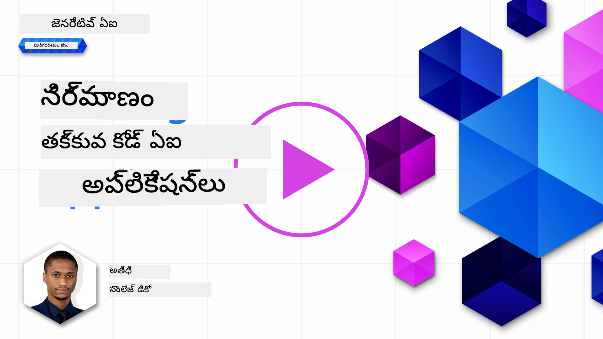](https://youtu.be/1vzq3Nd8GBA?si=h6LHWJXdmqf6mhDg)

> _(ఈ పాఠంలో వీడియోను చూడటానికి పై చిత్రాన్ని క్లిక్ చేయండి)_

## పరిచయం

ఇప్పుడు మనం చిత్రాల‌ను సృష్టించే అప్లికేషన్‌లు ఎలా తయారుచేయాలో నేర్చుకున్నాము, కాబట్టి లో కోడ్ గురించి మాట్లాడుకుందాం. జనరేటివ్ AI అనేది వివిధ ప్రాంతాలలో ఉపయోగించవచ్చు, అణు లో కోడ్ కూడా ఉండగలదు, కానీ లో కోడ్ అంటే ఏమిటి మరియు దానిలో AIని ఎలా జోడించవచ్చు?

సంప్రదాయ డెవలపర్లు మరియు డెవలపర్ కానివారికి లో కోడ్ డెవలప్‌మెంట్ ప్లాట్‌ఫారమ్‌ల ఆధారంగా అప్లికేషన్‌లను మరియు పరిష్కారాలను సులభంగా నిర్మించవచ్చు. లో కోడ్ డెవలప్‌మెంట్ ప్లాట్‌ఫారమ్‌లు మీకు చాలా తక్కువ లేదా ఎటువంటి కోడ్ ఉపయోగించకుండానే అప్లికేషన్‌లు మరియు పరిష్కారాలను నిర్మించుకోవడానికి సహాయపడతాయి. ఇది మీరు కంపోనెంట్లను డ్రాగ్ & డ్రాప్ చేసి అప్లికేషన్‌లు మరియు పరిష్కారాలను నిర్మించేందుకు వీలుగా సృష్టించిన విజువల్ డెవలప్‌మెంట్ వాతావరణం ద్వారా సాధ్యమవుతుంది. ఇది మీకు వేగంగా మరియు తక్కువ వనరులతో అప్లికేషన్‌లు మరియు పరిష్కారాలను నిర్మించడానికి సహాయపడుతుంది. ఈ పాఠంలో మనం లో కోడ్‌ని ఎలా ఉపయోగించాలో మరియు పవర్ ప్లాట్‌ఫారమ్ ఉపయోగించి AIతో లో కోడ్ డెవలపీ మెంట్‌ను ఎలా మెరుగుపరుచుకోవచ్చో లోతుగా గమనిస్తాము.

పవర్ ప్లాట్‌ఫారమ్ సంస్థలకు వారి జట్లు సొంత పరిష్కారాలు intuitively లో-కోడ్ లేదా నో-కోడ్ వాతావరణంలో నిర్మించుకునే అవకాశాన్ని కల్పిస్తుంది. ఈ వాతావరణం పరిష్కార నిర్మాణ ప్రక్రియను సులభతరం చేయడంలో సహాయపడుతుంది. పవర్ ప్లాట్‌ఫారమ్‌తో పరిష్కారాలు నెలల లేదా సంవత్సరాలకంటే రోజులు లేదా వారాల్లో నిర్మించే అవకాశం ఉంది. పవర్ ప్లాట్‌ఫారమ్ ఐదు ముఖ్య ఉత్పత్తులు కలిగి ఉంది: పవర్ యాప్స్, పవర్ ఆటోమేట్, పవర్ BI, పవర్ పేజెస్ మరియు కోపైలట్ స్టూడియో.

ఈ పాఠంలో కవర్ చేయబడింది:

- పవర్ ప్లాట్‌ఫారమ్‌లో జనరేటివ్ AIకి పరిచయం
- కోపైలట్ పరిచయం మరియు దాన్ని ఎలా ఉపయోగించాలో
- పవర్ ప్లాట్‌ఫారమ్‌లో అప్లికేషన్‌లు మరియు ఫ్లోలను నిర్మించడానికి జనరేటివ్ AI వినియోగం
- AI బిల్డర్‌తో పవర్ ప్లాట్‌ఫారమ్‌లో AI మోడల్స్ అవగాహన
- Microsoft కోపైలట్ స్టూడియోతో బుద్ధిసంపన్న ఏజెంట్ల నిర్మాణం

## నేర్చుకునే లక్ష్యాలు

ఈ పాఠం ముగుస్తుండగా, మీరు చేయగలుగుతారు:

- పవర్ ప్లాట్‌ఫారమ్‌లో కోపైలట్ ఎలా పని చేస్తుందో అర్థం చేసుకోండి.

- మాకు విద్యా స్టార్టప్ కోసం స్టూడెంట్ అసైన్‌మెంట్ ట్రాకర్ యాప్ నిర్మించండి.

- ఇన్వాయిస్ నుండి సమాచారాన్ని AI ఉపయోగించి ఎక్స్‌ట్రాక్ట్ చేసే ఇన్వాయిస్ ప్రాసెసింగ్ ఫ్లో నిర్మించండి.

- GPT AI మోడల్‌తో టెక్స్ట్ సృష్టి సమయంలో ఉత్తమ ఆచార పద్ధతులను ప్రవర్తించండి.

- Microsoft కోపైలట్ స్టూడియో ఏమిటి మరియు దాని సహాయంతో బుద్ధిసంపన్న ఏజెంట్లను ఎలా నిర్మించాలో అర్థం చేసుకోండి.

ఈ పాఠంలో మీరు ఉపయోగించే టూల్స్ మరియు సాంకేతిక దృష్టాంతాలు:

- **Power Apps**, స్టూడెంట్ అసైన్‌మెంట్ ట్రాకర్ యాప్ కోసం, ఇది డేటాను ట్రాక్, నిర్వహణ మరియు ఇంటరాక్ట్ చేయడానికి లో కోడ్ డెవలప్‌మెంట్ వాతావరణాన్ని అందిస్తుంది.

- **Dataverse**, స్టూడెంట్ అసైన్‌మెంట్ ట్రాకర్ యాప్ డేటాను నిల్వ చేయడానికి, Dataverse అప్లికేషన్ డేటాను నిల్వ చేయడానికి లో కోడ్ డేటా ప్లాట్‌ఫారమ్ అందిస్తుంది.

- **Power Automate**, ఇన్వాయిస్ ప్రాసెసింగ్ ఫ్లో కోసం, ఇది ఇన్వాయిస్ ప్రాసెసింగ్ ప్రక్రియ ఆటోమేటింగ్ కోసం లో కోడ్ వర్క్‌ఫ్లో తయారీ వాతావరణం అందిస్తుంది.

- **AI Builder**, ఇన్వాయిస్ ప్రాసెసింగ్ AI మోడల్ కోసం, మన స్టార్టప్ కోసం ఇన్వాయిస్లను ప్రాసెస్ చేయడానికి ప్రీబిల్ట్ AI మోడల్స్‌ను ఉపయోగిస్తారు.

## పవర్ ప్లాట్‌ఫారమ్‌లో జనరేటివ్ AI

జనరేటివ్ AIతో లో-కోడ్ డెవలప్‌మెంట్ మరియు అనువర్తనలు మెరుగుపరచడం పవర్ ప్లాట్‌ఫారమ్ యొక్క ప్రధాన దృష్టి ప్రాంతం. లక్ష్యం, ప్రతి ఒక్కరూ AI శక్తివంతమైన యాప్‌లు, సైట్లు, డాష్‌బోర్డ్లు మరియు AI తో పనులను ఆటోమేట్ చేయగలగాలి, _మరియు ఎటువంటి డేటా సైన్స్ నైపుణ్యాలు అవసరం లేకుండా_. ఈ లక్ష్యం, పవర్ ప్లాట్‌ఫారమ్‌లో కోపైలట్ మరియు AI బిల్డర్ రూపంలో జనరేటివ్ AIను లో-కోడ్ డెవలప్‌మెంట్ అనుభవంలో ఏకీకృతం చేయడం ద్వారా సాధ్యం అవుతుంది.

### ఇది ఎలా పనిచేస్తుంది?

కోపైలట్ అనేది AI సహాయకుడు, ఇది మీ అవసరాలను సహజభాషలో సంభాషణాత్మక దశల సిరీస్‌లో వివరిస్తూ పవర్ ప్లాట్‌ఫారమ్ పరిష్కారాలను రూపొందించడానికి అనుమతిస్తుంది. ఉదాహరణకు, మీరు మీ AI సహాయకుడికి చెప్పవచ్చు మీ యాప్ ఎలాంటి ఫీల్డులను ఉపయోగించాలో, అప్పుడు అది యాప్ మరియు ఆధారిత డేటా మోడల్ రెండింటినీ సృష్టిస్తుంది లేదా మీరు పవర్ ఆటోమేట్‌లో ఫ్లో ఏర్పాటుచేసే విధానాన్ని నిర్దేశించవచ్చు.

మీరు కోపైలట్ ఆధారిత ఫంక్షనాలిటీలను మీ యాప్ స్క్రీన్‌లలో ఫీచర్‌గా ఉపయోగించి, సంభాషణాత్మక ఇంటరాక్షన్‌ల ద్వారా ఇన్సైట్స్‌ను కనుగొనటానికి వినియోగదారులను సులభతరం చేయవచ్చు.

AI బిల్డర్ అనేది పవర్ ప్లాట్‌ఫారమ్‌లో అందుబాటులో ఉన్న లో-కోడ్ AI సామర్థ్యం, ఇది మీరు AI మోడల్స్ ఉపయోగించి ప్రాసెస్‌లను ఆటోమేట్ చేయడానికి మరియు ఫలితాలను గమనించడానికి సహాయపడుతుంది. AI బిల్డర్‌తో మీరు Dataverse లేదా షేర్‌పాయింట్, వన్‌డ్రైవ్ లేదా అజ్యూర్ లాంటి వివిధ క్లౌడ్ డేటా మూలాల డేటాకు కనెక్ట్ అయ్యే మీ యాప్‌లు మరియు ఫ్లోలకు AIను తీసుకురాగలరు.

కోపైలట్ పవర్ ప్లాట్‌ఫారమ్ ఉత్పత్తులైన పవర్ యాప్స్, పవర్ ఆటోమేట్, పవర్ BI, పవర్ పేజెస్ మరియు కోపైలట్ స్టూడియో (పూర్వంలో పవర్ వర్చువల్ ఏజెంట్స్)లో అందుబాటులో ఉంటుంది. AI బిల్డర్ పవర్ యాప్స్ మరియు పవర్ ఆటోమేట్‌లో అందుబాటులో ఉంటుంది. ఈ పాఠంలో మనం కోపైలట్ మరియు AI బిల్డర్‌ను పవర్ యాప్స్ మరియు పవర్ ఆటోమేట్‌లో ఎలా ఉపయోగించాలో, మన విద్యా స్టార్టప్ కోసం పరిష్కారం నిర్మించడంపై దృష్టి సారించాం.

### పవర్ యాప్స్‌లో కోపైలట్

పవర్ ప్లాట్‌ఫారమ్ భాగంగా, పవర్ యాప్స్ డేటాను ట్రాక్ చేయడానికి, నిర్వహించడానికి మరియు ఇంటరాక్ట్ చేయడానికి లో-కోడ్ డెవలప్‌మెంట్ వాతావరణాన్ని అందిస్తుంది. ఇది స్కేలబుల్ డేటా ప్లాట్‌ఫారమ్‌తో కూడిన యాప్ డెవలప్‌మెంట్ సేవల సూట్, క్లౌడ్ సేవలు మరియు ఆన్-ప్రెమైసెస్ డేటాతో కనెక్ట్ అయ్యే సామర్థ్యం కలిగి ఉంటుంది. పవర్ యాప్స్ ద్వారా బ్రౌజర్లు, టాబ్లెట్లు మరియు ఫోన్లపై నడిచే యాప్‌లు నిర్మించవచ్చు మరియు సహ ఉద్యోగులతో పంచుకోవచ్చు. సులభ ఇంటర్‌ఫేస్‌తో పవర్ యాప్స్ యూజర్లకు యాప్ డెవలప్‌మెంట్‌లో దిశనిర్దేశం చేస్తుంది, అందువల్ల ప్రతి వ్యాపార యజమాని లేదా ప్రొ డెవలపర్ అనుకూలమైన అనుకూల యాప్‌లు నిర్మించగలుగుతాడు. జనరేటివ్ AI ద్వారా కోపైలట్‌తో యాప్ డెవలప్‌మెంట్ అనుభవం మెరుగుపడుతుంది.

పవర్ యాప్స్‌లో కోపైలట్ AI సహాయక వదన ఫీచర్ మీరు కావలసిన యాప్ రకాన్ని మరియు ఇచ్చే ఆప్ ట్రాక్ చేయదలచిన సమాచారం ఏమిటి అనేదిని వివరించవచ్చు. అప్పుడు కోపైలట్ మీ వివరణ ఆధారంగా స్పందించే క్యాన్వాస్ యాప్ సృష్టిస్తుంది. మీరు తర్వాత మీ అవసరాల కోసం యాప్‌ను అనుకూలీకరించవచ్చు. AI కోపైలట్ డేటాను నిల్వ చేయడానికి అవసరమైన ఫీల్డులతో Dataverse టేబుల్‌ను కూడా సృష్టిస్తుంది మరియు కొంత నమూనా డేటాను ఉత్పత్తి చేస్తుంది. ఈ పాఠంలో తర్వాత మేము Dataverse ఏమిటి, మరియు పవర్ యాప్స్‌లో దాన్ని ఎలా ఉపయోగించాలో పరిశీలిస్తాము. AI కోపైలట్ సహాయక వదన ఫీచర్ ద్వారా సంభాషణాత్మక దశలలో టేబుల్‌ను అనుకూలీకరించవచ్చు. ఈ ఫీచర్ పవర్ యాప్స్ హోమ్ స్క్రీన్ నుండి సులభంగా అందుబాటులో ఉంటుంది.

### పవర్ ఆటోమేట్‌లో కోపైలట్

పవర్ ప్లాట్‌ఫారమ్ భాగంగా, పవర్ ఆటోమేట్ యూజర్లు అప్లికేషన్‌లు మరియు సేవల మధ్య ఆటోమేటెడ్ వర్క్‌ఫ్లోలను సృష్టించడానికి అనుమతిస్తుంది. ఇది కమ్యూనికేషన్, డేటా సేకరణ, నిర్ణయ ఆమోదాల వంటి పునరావృత వ్యాపార ప్రక్రియలను ఆటోమేట్ చేయడంలో సహాయపడుతుంది. దీని సులభమైన ఇంటర్‌ఫేస్ ప్రారంభ దశలో ఉన్నవారు నుండి అనుభవం గల డెవలపర్ల వరకు ప్రతి సాంకేతిక నైపుణ్యం కలిగిన వారు పనులను ఆటోమేట్ చేయగలుగుతారు. జనరేటివ్ AI సహాయంతో వర్క్‌ఫ్లో అభివృద్ధి అనుభవం మెరుగుపడుతుంది.

పవర్ ఆటోమేట్‌లో కోపైలట్ AI సహాయక వదన ఫీచర్ మీరు కావలసిన ఫ్లో రకాన్ని మరియు ఫ్లో ఏ చర్యలు చేపట్టాలని కోరుకుంటున్నారో వివరించవచ్చు. అప్పుడు కోపైలట్ మీ వివరణ ఆధారంగా ఫ్లో తయారుచేస్తుంది. మీరు తర్వాత మీ అవసరాలకు అనుగుణంగా ఫ్లోని అనుకూలీకరించవచ్చు. AI కోపైలట్ ఈ పనిని ఆటోమేట్ చేయడానికి కావలసిన చర్యలను కూడా సూచిస్తుంది. ఈ పాఠంలో తర్వాత మనం ఫ్లోలు ఏమిటి మరియు పవర్ ఆటోమేట్‌లో దాన్ని ఎలా ఉపయోగించాలో పరిశీలిస్తాము. AI కోపైలట్ సహాయక వదన ఫీచర్ ద్వారా సంభాషణాత్మక దశలలో చర్యలను అనుకూలీకరించవచ్చు. ఈ ఫీచర్ పవర్ ఆటోమేట్ హోమ్ స్క్రీన్ నుండి సులభంగా అందుబాటులో ఉంటుంది.

## Microsoft కోపైలట్ స్టూడియోతో బుద్ధిసంపన్న ఏజెంట్లు నిర్మించడం

[Microsoft Copilot Studio](https://learn.microsoft.com/microsoft-copilot-studio/fundamentals-what-is-copilot-studio?WT.mc_id=academic-105485-koreyst) (పూర్వ పేరు పవర్ వర్చువల్ ఏజెంట్స్) పవర్ ప్లాట్‌ఫారమ్‌లో లో-కోడ్ సభ్యుడు, ఇది **AI ఏజెంట్లు** - సంభాషణాత్మక కోపైలట్‌లను నిర్మించడానికి ఉపయోగిస్తారు, ఇవి ప్రశ్నలకు జవాబిచ్చడానికి, చర్యలు తీసుకోవడానికి మరియు మీ వినియోగదారుల behalfలో పనులను ఆటోమేట్ చేయగలవు. పవర్ ప్లాట్‌ఫారమ్ మిగతా భాగాల మాదిరిగానే, మీరు వీటిని విజువల్, సహజ భాష-ప్రథమ అనుభవంలో నిర్మిస్తారు: మీరు ఏజెంట్లను ఏమి చేయాలని కోరుకుంటున్నారో వివరించండి, కోపైలట్ స్టూడియో దాని సూచనలు, జ్ఞానం మరియు చర్యలను scaffolding చేయడంలో సహాయపడుతుంది.

మా విద్యా స్టార్టప్ కోసం, మీరు ఒక ఏజెంట్ను నిర్మించవచ్చు, ఇది కోర్సుల గురించి విద్యార్థి ప్రశ్నలకు జవాబు చెప్పగలదు, అసైన్‌మెంట్ ముగింపు తేదీలను పరిశీలించగలదు, మరియు ఇన్‌స్ట్రక్టర్ను ఇమెయిల్ ద్వారా కూడా అప్డేట్ చేయగలదు - అన్నీ కోడ్ రాయకుండా.

కోపైలట్ స్టూడియోని ప్రభావవంతంగా చేసే తాజా సామర్థ్యాలు కొన్ని ఇవి:

- **మీ జ్ఞానంతో జనరేటివ్ జవాబులు**. ప్రతి సంభాషణను చేతితో రచించకుండా, మీరు **జ్ఞాన మూలాలను** - పబ్లిక్ వెబ్‌సైట్లను, షేర్‌పాయింట్, వన్‌డ్రైవ్, Dataverse, అప్లోడ్ చేసిన ఫైళ్లను లేదా కనెక్టర్ల ద్వారా ఎంటర్ప్రైజ్ డేటాను కనెక్ట్ చేయవచ్చు - మరియు ఏజెంట్ వాటి నుండి పూరితమైన జవాబులను ఉత్పత్తి చేస్తుంది.

- **జనరేటివ్ ఆర్కెస్ట్రేషన్**. కఠినమైన ట్రిగ్గర్ ఫ్రేజెస్‌పై ఆధారపడకుండా, ఏజెంట్ AIని ఉపయోగించి అభ్యర్థనను అర్థం చేసుకుని దానిని నెరవేరుటకు జ్ఞానం, అంశాలు, చర్యలను సమ్మిళితం చేయమని డైనమిక్‌గా నిర్ణయిస్తుంది, అనేక దశలను కనెక్ట్ చేయడాన్ని కూడా ఉన్నతిస్తుంది.

- **చర్యలు మరియు కనెక్టర్లు**. ఏజెంట్లు కేవలం చాట్ చేయడం కాదు, వారు పనులు కూడా చేస్తారు. మీరు ఏజెంటుకు 1,500+ ప్రీబిల్ట్ పవర్ ప్లాట్‌ఫారమ్ కనెక్టర్ల ద్వారా మద్దతు పొందిన చర్యలను, పవర్ ఆటోమేట్ ఫ్లోలు, కస్టమ్ REST APIలు, ప్రాంప్ట్‌లు లేదా **మోడల్ కాంట్రాక్ట్ ప్రోటోకాల్ (MCP)** సర్వర్‌లను ఇవ్వవచ్చు.

- **స్వతంత్ర ఏజెంట్లు**. ఏజెంట్లు కేవలం చాట్ విండోలో ప్రతిస్పందించడం అనేది పరిమితం కాదు. మీరు **స్వతంత్ర ఏజెంట్లు**ను నిర్మించవచ్చు, ఇవి ఈవెంట్ల ద్వారా ట్రిగ్గర్ అవుతాయి - ఉదాహరణకు కొత్త ఇమెయిల్, Dataverseలో కొత్త రికార్డు లేదా ఫైలు అప్లోడ్ అవుట్ - తరువాత బ్యాక్‌గ్రౌండ్‌లో ఒక పని పూర్తిచేస్తాయి.

- **బహుళ-ఏజెంట్ ఆర్కెస్ట్రేషన్**. ఏజెంట్లు ఇతర ఏజెంట్లను పిలవగలవు. కోపైలట్ స్టూడియో ఏజెంట్ మరో ఏజెంట్‌కు హ్యాండ్ ఆఫ్ చేయగలదు లేదా దాని ద్వారా విస్తరించవచ్చు, ఇందులో Microsoft 365 కోపైలట్‌కు ప్రచురించిన ఏజెంట్లు మరియు Microsoft Foundryలో నిర్మించిన ఏజెంట్లు కూడా ఉన్నాయి.

- **మోడల్ ఎంపిక**. అంతర్గత మోడల్స్‌కు మించి, మీరు Microsoft Foundry మోడల్ క్యాటలాగ్ నుండి మోడల్స్ తీసుకుని మీ ఏజెంట్ రీజనింగ్ మరియు ప్రతిస్పందనలను అనుకూలీకరించవచ్చు.

- **ఎక్కడైనా ప్రచురించు**. నిర్మించిన తర్వాత, ఏజెంట్‌ను బహుళ ఛానల్స్‌కు - Microsoft Teams, Microsoft 365 కోపైలట్, వెబ్‌సైట్ లేదా కస్టమ్ యాప్ మరియు మరిన్నింటికి - ప్రచురించవచ్చు, మరియు సెక్యూరిటీ, ఆథెంటికేషన్, మరియు యానాలిటిక్స్‌ను పవర్ ప్లాట్‌ఫారమ్ అడ్మిన్ అనుభవంలో నిర్వహించవచ్చు.

మీరు మొదటి ఏజెంట్‌ను [copilotstudio.microsoft.com](https://copilotstudio.microsoft.com?WT.mc_id=academic-105485-koreyst) వద్ద ప్రారంభించవచ్చు మరియు [Microsoft Copilot Studio డాక్యుమెంటేషన్](https://learn.microsoft.com/microsoft-copilot-studio/?WT.mc_id=academic-105485-koreyst)లో మరిన్ని వివరాలను తెలుసుకోండి.

## పనిమ‌నుగు: మా స్టార్టప్ కోసం విద్యార్థి అసైన్‌మెంట్లు మరియు ఇన్వాయిస్లను Copilot ఉపయోగించి నిర్వహించండి

మా స్టార్టప్ విద్యార్థులకు ఆన్‌లైన్ కోర్సులు అందిస్తోంది. స్టార్టప్ వేగంగా పెరిగింది మరియు ఇప్పుడు దాని కోర్సుల డిమాండ్‌ను నిర్వహించడంలో క్లిష్టతలు ఎదుర్కొంటోంది. స్టార్టప్ మీతో పవర్ ప్లాట్‌ఫారమ్ డెవలపర్‌గా సంప్రదించింది, వారు విద్యార్థి అసైన్‌మెంట్లు మరియు ఇన్వాయిస్లను నిర్వహించటానికి లో కోడ్ పరిష్కారాన్ని నిర్మించడంలో సహాయం అందించమని. వారి పరిష్కారం యాప్ ద్వారా విద్యార్థుల అసైన్‌మెంట్లను ట్రాక్ చేయడం మరియు నిర్వహించడం సహాయంగా ఉండాలి మరియు వర్క్‌ఫ్లో ద్వారా ఇన్వాయిస్ ప్రాసెసింగ్ ప్రక్రియను ఆటోమేట్ చేయగలగాలి. మీరు జనరేటివ్ AI ఉపయోగించి పరిష్కారాన్ని అభివృద్ధి చేయమని కోరబడింది.

కోపైలట్ ఉపయోగంలో ప్రారంభమవుతున్నప్పుడు, మీరు [Power Platform Copilot Prompt Library](https://github.com/pnp/powerplatform-prompts?WT.mc_id=academic-109639-somelezediko)ని పెట్టుకుని ప్రాంప్ట్లతో ప్రారంభించవచ్చు. ఈ లైబ్రరీలో కోпайిలట్‌తో యాప్‌లు మరియు ఫ్లోలను నిర్మించడానికి ఉపయోగించే ప్రాంప్ట్‌ల జాబితా ఉంది. మీరు కోపైలట్‌కు మీ అవసరాలను వివరించడాన్ని ఎలా చేయాలో ఆలోచన పొందడానికి కూడా ఈ లైబ్రరీలోని ప్రాంప్ట్‌లు ఉపయోగించవచ్చు.

### మా స్టార్టప్ కోసం స్టూడెంట్ అసైన్‌మెంట్ ట్రాకర్ యాప్ నిర్మించండి

మా స్టార్టప్ వద్ద విద్యార్హులు విద్యార్థి అసైన్‌మెంట్లను ట్రాక్ చేయడంలో కష్టపడుతున్నారు. వారు అప్పటివరకు అసైన్‌మెంట్‌లను ట్రాక్ చేయడానికి స్ప్రెడ్‌షీట్‌ను ఉపయోగిస్తున్నారు కానీ విద్యార్థుల సంఖ్య పెరగడంతో అది నిర్వహించటం కష్టం అయింది. వారు మీరు ఒక యాప్‌ను నిర్మించాలని కోరుకున్నారు, ఇది విద్యార్థి అసైన్‌మెంట్లను ట్రాక్ చేయడానికి మరియు నిర్వహించడానికి సహాయపడాలి. యాప్ కొత్త అసైన్‌మెంట్‌లను జోడించేందుకు, అసైన్‌మెంట్‌లను వీక్షించడానికి, అప్డేట్ చేయడానికి మరియు తొలగించేందుకు వీలుగా ఉండాలి. యాప్ విద్యార్హులు మరియు విద్యార్థులు గ్రేడ్ చేసిన అసైన్‌మెంట్‌లు మరియు గ్రేడ్ చేయని అసైన్‌మెంట్‌లను వీక్షించేందుకు కూడా వీలుగా ఉండాలి.

మీరు పవర్ యాప్స్‌లో కోపైలట్ ఉపయోగించి క్రింది దశలను అనుసరించి యాప్‌ను నిర్మించవచ్చు:

1. [Power Apps](https://make.powerapps.com?WT.mc_id=academic-105485-koreyst) హోమ్ స్క్రీన్‌కు వెళ్లండి.

1. హోమ్ స్క్రీన్‌లోని టెక్స్ట్ ఏరియాలో మీరు నిర్మించదలచుకున్న యాప్‌ను వివరించండి. ఉదాహరణకు, **_నేను విద్యార్థి అసైన్‌మెంట్‌లను ట్రాక్ చేయడానికి మరియు నిర్వహించడానికి ఒక యాప్ నిర్మించాలనుకుంటున్నాను_**. AI కోపైలట్‌కు ప్రాంప్ట్ పంపడానికి **Send** బటన్‌ను క్లిక్ చేయండి.

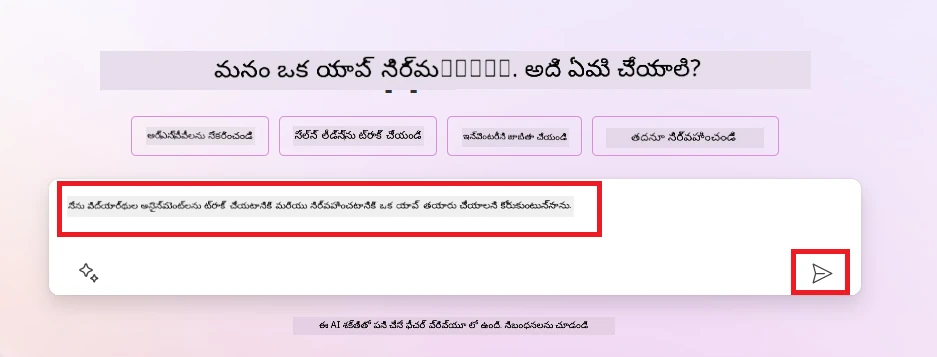

1. AI కోపైలట్ మీ ట్రాక్ చేయదలచిన డేటాను నిల్వ చేయడానికి అవసరమైన ఫీల్డులతో Dataverse టేబుల్‌ను సూచిస్తుంది మరియు కొంత నమూనా డేటాను కూడా సృష్టిస్తుంది. మీరు తర్వాత మీ అవసరాలకు అనుగుణంగా AI కోపైలట్ సహాయక వదన ఫీచర్ ద్వారా టేబుల్‌ను సంభాషణాత్మక దశలలో అనుకూలీకరించవచ్చు.

   > **ముఖ్యము**: Dataverse పవర్ ప్లాట్‌ఫారమ్ యొక్క మౌలిక డేటా ప్లాట్‌ఫారమ్. ఇది యాప్ డేటాను నిల్వ చేయడానికి లో-కోడ్ డేటా ప్లాట్‌ఫారమ్. ఇది Microsoft క్లౌడ్‌లో డేటాను సురక్షితంగా నిల్వ చేసే పూర్తి నిర్వహిత సేవ. ఇది మీ పవర్ ప్లాట్‌ఫారమ్ వాతావరణంలో ప్రొవిజన్ చేయబడుతుంది. దీనిలో డేటా వర్గీకరణ, డేటా లీనియేజ్, సూక్ష్మ రీతిలో యాక్సెస్ నియంత్రణ వంటి డేటా గవర్నెన్స్ సామర్థ్యాలు ఉంటాయి. మీరు Dataverse గురించి ఇక్కడ మరింత తెలుసుకోవచ్చు [ఇక్కడ](https://docs.microsoft.com/powerapps/maker/data-platform/data-platform-intro?WT.mc_id=academic-109639-somelezediko).

   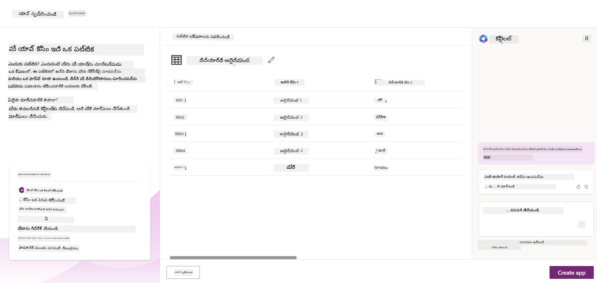

1. విద్యార్థులు తమ అసైన్‌మెంట్‌లు సమర్పించిన వారు అప్‌డేట్‌ల కోసం విద్యార్థులకు ఇమెయిల్‌లు పంపాలనుకుంటున్నారు. మీరు టేబుల్‌లో విద్యార్థి ఇమెయిల్ నిల్వ చేసేందుకు కొత్త కాలమ్ చేర్చడానికి కోపైలట్ ఉపయోగించవచ్చు. ఉదాహరణకు, మీరు ఈ క్రింది ప్రాంప్ట్‌ను ఉపయోగించవచ్చు: **_నేను విద్యార్థి ఇమెయిల్ నిల్వ కోసం ఒక కాలమ్ జోడించాలనుకుంటున్నాను_**. AI కోపైలట్‌కు ప్రాంప్ట్ పంపడానికి **Send** బటన్‌ను క్లిక్ చేయండి.

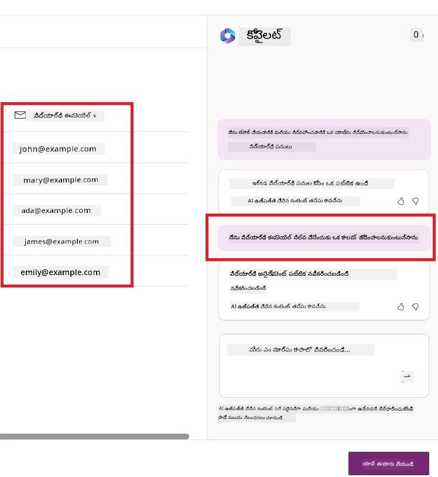

1. AI కోపైలట్ ఒక కొత్త ఫీల్డ్‌ను ఉత్పత్తి చేస్తుంది, తరువాత మీరు మీ అవసరాలకు అనుగుణంగా ఫీల్డ్‌ను అనుకూలీకరించవచ్చు.

1. మీరు పట్టికతో పూర్తయిన తర్వాత, ఆప్ సృష్టించడానికి **Create app** బటన్ పై క్లిక్ చేయండి.

1. AI కొపైలట్ మీ వివరణ ఆధారంగా స్పందనశీలమైన Canvas ఆాప్ ను సృష్టిస్తుంది. మీరు ఆప్‌ను మీ అవసరాలకు అనుగుణంగా కస్టమైజ్ చేయవచ్చు.

1. విద్యార్థులకు ఇమెయిళ్లు పంపడానికి విద్యాసంస్థలకు, మీరు ఆప్‌లో కొత్త తెర (screen) ని చేర్చడానికి కొపైలట్‌ను ఉపయోగించవచ్చు. ఉదాహరణకు, మీరు ఈ కింద ఇచ్చిన ప్రాంప్ట్‌ను ఉపయోగించి ఆప్‌లో కొత్త తెర చేర్చవచ్చు: **_నేను విద్యార్థులకు ఇమెయిళ్లు పంపడానికి ఒక తెర జోడించాలనుకుంటున్నాను_**. ఈ ప్రాంప్ట్‌ని AI కొపైలట్‌కు పంపడానికి **Send** బటన్‌పై క్లిక్ చేయండి.

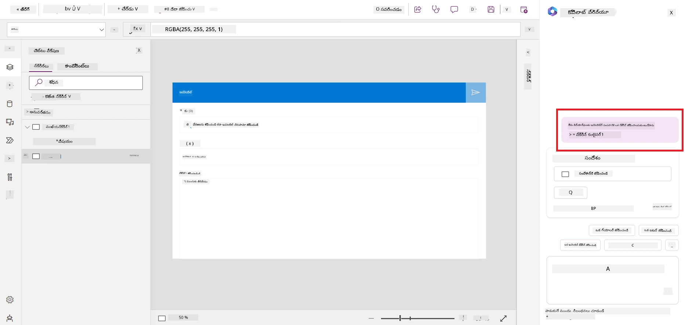

1. AI కొపైలట్ కొత్త తెరను సృష్టిస్తుంది మరియు మీరు ఆ తెరను మీ అవసరాలకు అనుగుణంగా కస్టమైజ్ చేయవచ్చు.

1. మీరు ఆప్ తో పూర్తయిన తర్వాత, ఆప్‌ను సేవ్ చేయడానికి **Save** బటన్‌పై క్లిక్ చేయండి.

1. ఆప్ను విద్యాసంస్థలతో పంచుకోవడానికి, **Share** బటన్‌పై క్లిక్ చేసి, మళ్ళీ **Share** బటన్‌పై క్లిక్ చేయండి. తర్వాత మీరు వారి ఇమెయిల్ చిరునామాలను నమోదు చేసి ఆప్‌ను పంచుకోవచ్చు.

> **మీ ఇంటి పనులు**: మీరు ఇప్పుడు తయారుచేసిన ఆప్ మంచి ఆరంభం అయినప్పటికీ మెరుగుపరచవలసినది. ఇమెయిల్ ఫీచర్ తో, విద్యాసంస్థలు విద్యార్థులకు ఇమెయిళ్లు మానవీయంగా మాత్రమే పంపవచ్చు, అందరు ఇమెయిల్ ను టైప్ చేయాల్సి ఉంటుంది. మీరా కొపైలట్ ఉపయోగించి విద్యాసంస్థలు తమ అసైన్మెంట్లు సబ్మిట్ చేసినప్పుడు ఆటోమేటిక్ గా విద్యార్థులకు ఇమెయిళ్ళు పంపించే ఆటోమేషన్ నిర్మించగలరా? మీ సూచన: సరైన ప్రాంప్ట్ తో మీరు Power Automate లో కొపైలట్ ఉపయోగించి దీన్ని నిర్మించవచ్చు.

### మా స్టార్టప్ కోసం ఇన్వాయిస్ సమాచారం పట్టికను నిర్మించండి

మా స్టార్టప్ యొక్క ఆర్థిక బృందం ఇన్వాయిస్లను ట్రాక్ చేయడానికి సంబంధించి సమస్యలు ఎదుర్కొంటోంది. వారు ఇన్వాయిస్లను ట్రాక్ చేయడానికి స్ప్రెడ్షీట్‌ను ఉపయోగిస్తున్నారు, కానీ ఇన్వాయిస్ల సంఖ్య పెరిగినందున ఇది నిర్వహించడం కష్టంగా మారిపోయింది. వారు అందుకున్న ఇన్వాయిస్ల సమాచారం నిల్వ, ట్రాక్ మరియు నిర్వహించడానికి సహాయపడే పట్టికను మీరు నిర్మించాలని కోరుకున్నారు. ఈ పట్టిక ఆటోమేషన్ నిర్మించడానికి ఉపయోగించబడాలి, అది అన్ని ఇన్వాయిస్ సమాచారాన్ని వెలికి తీయగలగాలి మరియు పట్టికలో నిల్వ చేయగలగాలి. ఆర్థిక బృందానికి చెల్లించిన ఇన్వాయిస్లను మరియు చెల్లించని ఇన్వాయిస్లను వీక్షించడానికి కూడా ఈ పట్టిక సహాయపడాలి.

Power Platform లో Dataverse అనే తల్లిదండ్రి డేటా ప్లాట్‌ఫాం ఉంది, ఇది మీ ఆప్‌లు మరియు పరిష్కారాల కోసం డేటా నిల్వ చేయడానికి సహాయపడుతుంది. Dataverse హై కోడ్ లేని డేటా ప్లాట్‌ఫాం, ఇది Microsoft క్లౌడ్‌లో భద్రపరచబడిన డేటాను సురక్షితంగా నిల్వ చేస్తుంది మరియు మీ Power Platform పరిసరంలో ప్రొవిషన్ చేయబడుతుంది. ఇది డేటా వర్గీకరణ, డేటా లీనియేజ్, సురక్షిత అక్సెస్ నియంత్రణ వంటి అంతర్లీన డేటా పాలన సామర్థ్యాలను కలిగి ఉంటుంది. మీరు [ఇక్కడ Dataverse గురించి మరింత తెలుసుకోండి](https://docs.microsoft.com/powerapps/maker/data-platform/data-platform-intro?WT.mc_id=academic-109639-somelezediko).

మా స్టార్టప్ కోసం Dataverse ఎందుకు ఉపయోగించాలి? Dataverse లో స్టాండర్డ్ మరియు కస్టమ్ పట్టికలు మీ డేటాకు సురక్షితం మరియు క్లౌడ్ ఆధారిత నిల్వ ఎంపికను అందిస్తాయి. పట్టికలు వివిధ రకాల డేటాను నిల్వ చేయగలవు, మీరు ఒక ఎక్స్‌ల్ వర్క్‌బుక్‌లో అనేక వర్క్షీట్లు ఉపయోగించే విధంగా. మీరు మీ సంస్థ లేదా వ్యాపారం అవసరాలకు సంబంధించిన డేటాను నిల్వ చేయడానికి పట్టికలను ఉపయోగించవచ్చు. Dataverse ఉపయోగించి మా స్టార్టప్ పొందగల కొన్ని లాభాలు క్రింది విధంగా ఉంటాయి:

- **సులభంగా నిర్వహణ**: మెటాడేటా మరియు డేటా రెండూ క్లౌడ్‌లో నిల్వ చేయబడటం వలన, వాటి నిర్వహణ గురించి మీరు ఆందోళన చెందాల్సిన అవసరం లేదు. మీరు మీ ఆప్‌లు మరియు పరిష్కారాల నిర్మాణంపై దృష్టి పెడతారు.

- **సురక్షితం**: Dataverse మీ డేటాకు సురక్షితమైన క్లౌడ్ ఆధారిత నిల్వను అందిస్తుంది. మీరు మీ పట్టికలలో డేటాకు ఎవరు మరియు ఎలా యాక్సెస్ చేయగలరో పాత్ర ఆధారిత భద్రత ద్వారా నియంత్రించవచ్చు.

- **ధనాత్మక మెటాడేటా**: డేటా రకాలూ మరియు సంబంధాలు Power Apps లో నేరుగా ఉపయోగించబడతాయి.

- **తర్కం మరియు నిర్ధారణ**: వ్యాపార నియమాలు, లెక్కింపుల ఫీల్డ్లు మరియు నిర్ధారణ నియమాలను ఉపయోగించి వ్యాపార తర్కాన్ని గట్టిపడచటానికి మరియు డేటా ఖచ్చితత్వాన్ని నిలిపివేయడానికి వీలు కల్పిస్తుంది.

ఇప్పుడు మీరు Dataverse ఏమిటి, ఎందుకు ఉపయోగించాలో తెలుసుకున్నాం, రాబోయే ఆర్థిక బృంద అవసరాలకు అనుగుణంగా Dataverse లో పట్టికను కొపైలట్ ఉపయోగించి ఎలా సృష్టించాలో చూద్దాం.

> **గమనిక** : మీరు ఈ పట్టికను తదుపరి విభాగంలో ఉపయోగించి అన్ని ఇన్వాయిస్ సమాచారం వెలికి తీయటానికి మరియు పట్టికలో నిల్వ చేయటానికి ఆటోమేషన్ నిర్మిస్తారు.

Dataverse లో పట్టికను కొపైలట్ ఉపయోగించి సృష్టించడానికి, ఈ క్రింది దశలను అనుసరించండి:

1. [Power Apps](https://make.powerapps.com?WT.mc_id=academic-105485-koreyst) హోమ్ స్క్రీన్ కి వెళ్ళండి.

2. ఎడమ వైపు నావిగేషన్ బార్ లో **Tables** ఎంచుకుని, ఆపై **Describe the new Table** పై క్లిక్ చేయండి.

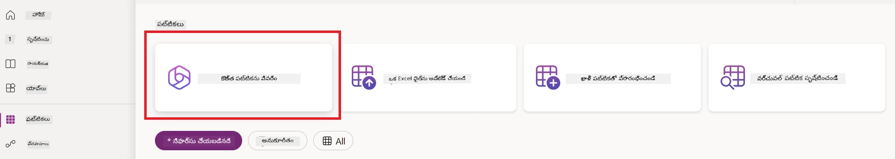

1. **Describe the new Table** తెరపై, మీరు సೃజించదలచిన పట్టికను వర్ణించడానికి టెక్స్ట్ ఏరియాను ఉపయోగించండి. ఉదాహరణకు, **_నేను ఇన్వాయిస్ సమాచారాన్ని నిల్వ చేయడానికి ఒక పట్టిక సృష్టించాలనుకుంటున్నాను_**. ఈ ప్రాంప్ట్‌ను AI కొపైలట్‌కు పంపేందుకు **Send** బటన్ పై క్లిక్ చేయండి.

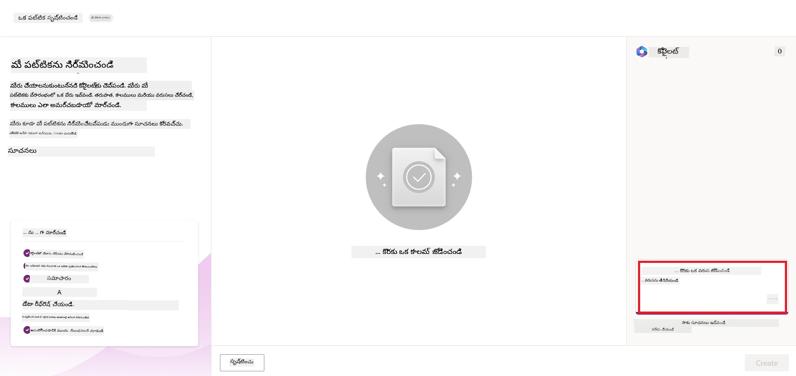

1. AI కొపైలట్ మీకు అవసరమైన డేటా నిల్వ చేయడానికి, మరియు ట్రాక్ చేయడానికి అవసరమైన ఫీల్డ్లు మరియు కొంత నమూనా డేటా తో Dataverse పట్టికను సూచిస్తుంది. మీరు ఆ పట్టికను మీ అవసరాలకు దగ్గరగా మార్చుకోవచ్చు, AI కొపైలట్ సహాయక ఫీచర్ ద్వారా సంభాషణాత్మక దశల్లో.

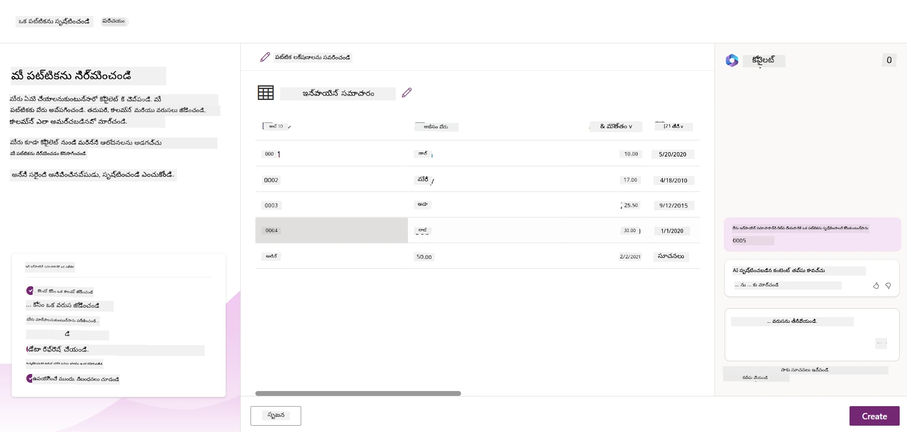

1. ఆర్థిక బృందం సరఫరాదారుని ఇమెయిల్ ద్వారా వారి ఇన్వాయిస్ ప్రస్తుత స్థితి గురించి అప్‌డేట్ చేయాలనుకుంటున్నారు. మీరు కొపైలట్‌ను ఉపయోగించి ఈ పట్టికలో సరఫరాదారుని ఇమెయిల్ నిల్వ కోసం కొత్త ఫీల్డ్ జోడించవచ్చు. ఉదాహరణకు, ఈ ప్రాంప్ట్‌ను ఉపయోగించవచ్చు: **_నేను సరఫరాదారు ఇమెయిల్ నిల్వ చేయడానికి ఒక కాలమ్ జోడించాలనుకుంటున్నాను_**. AI కొపైలట్‌కు ప్రాంప్ట్ పంపడానికి **Send** బటన్ పై క్లిక్ చేయండి.

1. AI కొపైలట్ కొత్త ఫీల్డ్ సృష్టిస్తుంది, మీరు ఆ ఫీల్డ్‌ను మీ అవసరాలకు అనుగుణంగా మార్చవచ్చు.

1. పట్టికతో పూర్తయిన తర్వాత, పట్టిక సృష్టించడానికి **Create** బటన్‌పై క్లిక్ చేయండి.

## Power Platform లో AI మోడల్స్ - AI బిల్డర్ తో

AI బిల్డర్ అనేది Power Platform లో అందుబాటులో ఉన్న తక్కువ కోడ్ AI సామర్థ్యం, ఇది AI మోడల్స్ ఉపయోగించి మీ ప్రక్రియలను ఆటోమేట్ చేయడంలో మరియు ఫలితాలను ఊహించడంలో సహాయపడుతుంది. AI బిల్డర్‌తో Dataverse లేదా SharePoint, OneDrive లేదా Azure వంటి వివిధ క్లౌడ్ డేటా మూలాల డేటాతో కనెక్ట్ అయ్యే మీ ఆప్‌లు మరియు ఫ్లోలకు AI ని తీసుకువచ్చవచ్చు.

## ప్రీబిల్ట్ AI మోడల్స్ మరియు కస్టమ్ AI మోడల్స్

AI బిల్డర్ రెండు రకాల AI మోడల్స్ అందిస్తుంది: ప్రీబిల్ట్ AI మోడల్స్ మరియు కస్టమ్ AI మోడల్స్. ప్రీబిల్ట్ AI మోడల్స్ Microsoft ద్వారా శిక్షణ పొందిన, Power Platform లో అందుబాటు లో ఉన్న తయారుచేసిన మోడల్స్. ఇవి మీకు డేటా సేకరించి, మీ స్వంత మోడల్ని తయారు చేయాల్సిన అవసరం లేకుండా మీ ఆప్‌లు మరియు ఫ్లోలకి తెలివితేటలు జోడించడంలో సహాయపడతాయి. మీరు ఈ మోడల్స్ ఉపయోగించి ప్రక్రియలను ఆటోమేట్ చేసి ఫలితాలను ఊహించగలరు.

Power Platform లో అందుబాటులో ఉన్న కొన్ని ప్రీబిల్ట్ AI మోడల్స్:

- **Key Phrase Extraction**: ఈ మోడల్ టెక్స్ట్ నుండి ముఖ్య పదబంధాలను వెలికితీయిస్తుంది.
- **Language Detection**: ఈ మోడల్ టెక్స్ట్ యొక్క భాషను గుర్తిస్తుంది.
- **Sentiment Analysis**: ఈ మోడల్ టెక్స్ట్ లో పాజిటివ్, నెగటివ్, న్యూట్రల్ లేదా మిక్స్డ్ భావాలను గుర్తిస్తుంది.
- **Business Card Reader**: ఈ మోడల్ బిజినెస్ కార్డుల నుండి సమాచారాన్ని వెలికితీయిస్తుంది.
- **Text Recognition**: ఈ మోడల్ చిత్రాల నుండి టెక్స్ట్ తీసుకుంటుంది.
- **Object Detection**: ఈ మోడల్ చిత్రాలలోని వస్తువులను గుర్తించి వెలికితీయిస్తుంది.
- **Document processing**: ఈ మోడల్ ఫారమ్‌ల నుండి సమాచారాన్ని వెలికితీయిస్తుంది.
- **Invoice Processing**: ఈ మోడల్ ఇన్వాయిస్ల నుండి సమాచారాన్ని వెలికితీయిస్తుంది.

కస్టమ్ AI మోడల్స్ తో మీరు మీ స్వంత మోడల్ ని AI బిల్డర్ లోకి கொண்டு వచ్చి, అదే విధంగా ఉపయోగించవచ్చు, మీరు మీ డేటాతో మోడల్ శిక్షణ ఇవ్వవచ్చు. ఈ మోడల్స్ ను Power Apps మరియు Power Automate లోని ప్రక్రియలను ఆటోమేట్ చేయడానికి మరియు ఫలితాలను ఊహించడానికి ఉపయోగించవచ్చు. మీ స్వంత మోడల్ ఉపయోగించినప్పుడు పరిమితులు జరుగుతాయి. ఈ పరిమితులు గురించి మరింత చదవండి [ఇక్కడ](https://learn.microsoft.com/ai-builder/byo-model#limitations?WT.mc_id=academic-105485-koreyst).

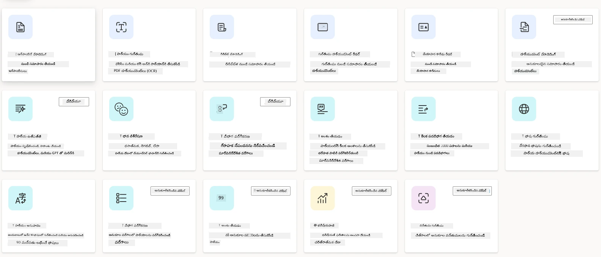

## అసైన్‌మెంట్ #2 - మా స్టార్టప్ కోసం ఇన్వాయిస్ ప్రాసెసింగ్ ఫ్లో నిర్మించండి

ఆర్థిక బృందం ఇన్వాయిస్లను ప్రాసెస్ చేయడంలో సమస్యలు ఎదుర్కొంటోంది. వారు ఇన్వాయిస్లను ట్రాక్ చేయడానికి స్ప్రెడ్షీట్ ఉపయోగిస్తున్నారు, కానీ ఇన్వాయిస్ల సంఖ్య పెరిగి ఇది నిర్వహించటం కష్టంగా మారింది. వారు AI ఉపయోగించి ఇన్వాయిస్లను ప్రాసెస్ చేయడంలో సహాయం చేసే వర్క్‌ఫ్లోను మీరు నిర్మించాలని కోరుకున్నారు. వర్క్‌ఫ్లో ఇన్వాయిస్ల నుండి సమాచారాన్ని వెలికి తీయగలగాలి మరియు Dataverse పట్టికలో సమాచారాన్ని నిల్వ చేయగలగాలి. వర్క్‌ఫ్లో ఆర్థిక బృందానికి వెలికి తీయబడిన సమాచారంతో ఇమెయిల్ పంపడానికి కూడా వీలు కల్పించాలి.

ఇప్పుడు మీరు AI బిల్డర్ ఏమిటి మరియు ఎందుకు ఉపయోగించాలో తెలుసుకున్నందున, ఇన్వాయిస్ ప్రాసెసింగ్ AI మోడల్ ఎలా ఉపయోగించి వర్క్‌ఫ్లో నిర్మించాలో చూద్దాం.

ఇన్వాయిస్లను ప్రాసెస్ చేయడానికి ఇన్వాయిస్ ప్రాసెసింగ్ AI మోడల్ ఉపయోగించి వర్క్‌ఫ్లోను నిర్మించడానికి క్రింది దశలను అనుసరించండి:

1. [Power Automate](https://make.powerautomate.com?WT.mc_id=academic-105485-koreyst) హోమ్ స్క్రీన్ కి వెళ్ళండి.

2. హోమ్ స్క్రీన్ పై టెక్స్ట్ ఏరియాలో మీరు నిర్మించాలనుకునే వర్క్‌ఫ్లోని వర్ణించండి. ఉదాహరణకు, **_నా మెయిల్‌బాక్స్‌లో ఇన్వాయిస్ వచ్చినప్పుడు దాన్ని ప్రాసెస్ చేయాలి_**. AI కొపైలట్‌కు ప్రాంప్ట్ పంపేందుకు **Send** బటన్ పై క్లిక్ చేయండి.

   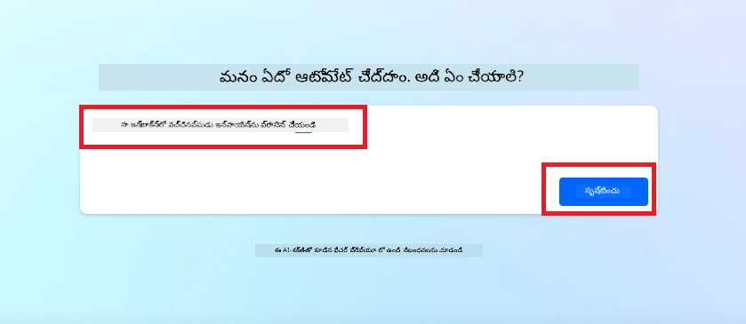

3. AI కొపైలట్, మీరు ఆటోమేట్ చేయదలచుకున్న పని కోసం అవసరమైన చర్యలను సూచిస్తుంది. తదుపరి దశల కోసం **Next** బటన్ పై క్లిక్ చేయండి.

4. Power Automate ఫ్లోకి అవసరమైన కనెక్షన్లను సెటప్ చేయమని మీకు అడుగుతంది. పూర్తి చేసిన తర్వాత **Create flow** బటన్ పై క్లిక్ చేసి ఫ్లో ని సృష్టించండి.

5. AI కొపైలట్ ఒక ఫ్లోని సృష్టిస్తుంది, దీనిని మీ అవసరాలకు తగునట్లు అనुकूलీకరించవచ్చు.

6. ఫ్లో ట్రిగ్గర్‌ని అప్‌డేట్ చేసి, ఇన్వాయిస్లు నిల్వయ్యే ఫోల్డ్‌ను సెట్చేయండి. ఉదాహరణకు, ఫోల్డ్‌ని **Inbox** గా సెట్ చేయవచ్చు. **Show advanced options** ను క్లిక్ చేసి **Only with Attachments** ను **Yes** గా సెట్ చేయండి. ఇది, ఫ్లో కేవలం అటాచ్‌మెంట్ ఉన్న ఇమెయిల్స్ వస్తేనే నడవడానికి సరిపోతుంది.

7. ఫ్లో నుండి ఈ క్రింది చర్యలను తొలగించండి: **HTML to text**, **Compose**, **Compose 2**, **Compose 3**, మరియు **Compose 4** ఎందుకంటే మీరు వీటిని ఉపయోగించం.

8. ఫ్లో నుండి **Condition** చర్యను తొలగించండి, ఎందుకంటే మీరు దీన్ని ఉపయోగించరు. ఫ్లో ఈ క్రింది స్క్రీన్‌షాట్‌లా కనిపించాలి:

   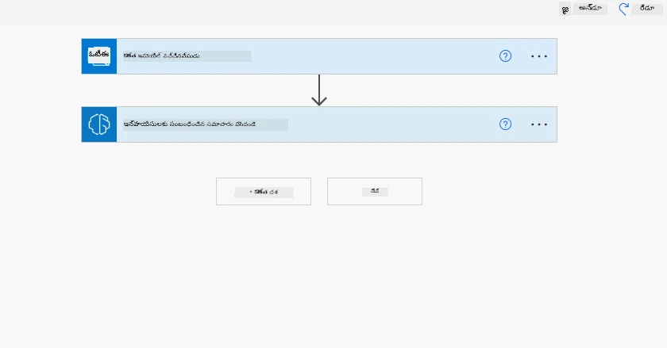

9. **Add an action** బటన్ పై క్లిక్ చేసి **Dataverse** కోసం శోధించండి. ఆపై **Add a new row** చర్యను ఎంచుకోండి.

10. **Extract Information from invoices** చర్యలో, **Invoice File** ను ఇమెయిల్ నుంచి **Attachment Content** కి పాయింట్ చేయండి. ఇది ఫ్లో ఇన్వాయిస్ అటాచ్‌మెంట్ నుండి సమాచారాన్ని వెలికితీయడాన్ని నిర్ధారిస్తుంది.

11. మీరు ముందుగా సృష్టించిన **Table** ను ఎంచుకోండి. ఉదాహరణకి, **Invoice Information** పట్టికను ఎంచుకోవచ్చు. క్రింది ఫీల్డ్‌లను పూరించడానికి గత చర్యల నుండి డైనమిక్ కంటెంట్ ఎంచుకోండి:

    - ID
    - మొత్తం (Amount)
    - తేది (Date)
    - పేరు (Name)
    - స్థితి (Status) - **Status** ను **Pending** గా సెట్ చేయండి.
    - సరఫరాదారు ఇమెయిల్ (Supplier Email) - **When a new email arrives** ట్రిగ్గర్ నుండి **From** డైనమిక్ కంటెంట్ ఉపయోగించండి.

    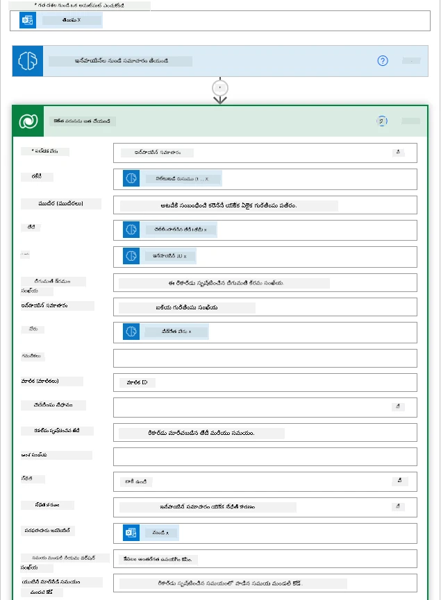

12. ఫ్లో తో పూర్తయిన తర్వాత, ఫ్లోని సేవ్ చేయడానికి **Save** బటన్ పై క్లిక్ చేయండి. మీరు సృష్టించిన ట్రిగ్గర్ ఫోల్డర్‌కు ఇన్వాయిస్ ఉన్న ఇమెయిల్ పంపి ఫ్లో ని పరీక్షించవచ్చు.

> **మీ ఇంటి పనులు**: మీరు ఇప్పుడు నిర్మించిన ఫ్లో మంచి ప్రారంభం, ఇప్పుడు ఆర్థిక బృందం సరఫరాదారునికి వారి ఇన్వాయిస్ స్థితి మార్చుకున్నప్పుడు ఆటోమాటిక్ ఇమెయిల్ పంపే ఆటోమేషన్‌ను ఎలా నిర్మించాలో ఆలోచించాలి. మీ సూచన: ఇన్వాయిస్ స్థితి మారినప్పుడు ఫ్లో నడవాలి.

## Power Automate లో టెక్స్ట్ జనరేషన్ AI మోడల్ ఉపయోగించండి

AI బిల్డర్ లో Create Text with GPT AI మోడల్ ప్రాంప్ట్ ఆధారంగా టెక్స్ట్ ఉత్పత్తి చేయగలదు మరియు ఇది Microsoft Azure OpenAI సర్వీస్ ద్వారా శక్తివంతంగా ఉంటుంది. ఈ సామర్థ్యంతో, మీరు GPT (Generative Pre-Trained Transformer) సాంకేతికతను మీ ఆప్‌లలో మరియు ఫ్లోల్లో చేర్చి వివిధ ఆటోమేటెడ్ ఫ్లోలను మరియు ఉపయోగకరమైన అనువర్తనాలను నిర్మించవచ్చు.

GPT మోడల్స్ విస్తృత డేటా పై శిక్షణ పొందుతాయి, దాంతో ప్రాంప్ట్ ఇచ్చినప్పుడు మానవ భాషకు దగ్గరగా ఉన్న టెక్స్ట్ ని ఉత్పత్తి చేయగలవు. వర్క్‌ఫ్లో ఆటోమేషన్ లో ఇంటిగ్రేట్ చేసినప్పుడు, GPT వంటి AI మోడల్స్ విస్తృత పనులను సులభతరం చేసి ఆటోమేట్ చేయడానికి ఉపయోగపడతాయి.

ఉదాహరణకు, మీరు ఆటోమేటిక్‌గా ఇమెయిల్ డ్రాఫ్ట్‌లు, ఉత్పత్తి వివరణలు, మరియు మరిన్ని ఉద్యోగాల కోసం టెక్స్ట్ ఉత్పత్తి చేసే ఫ్లోలను నిర్మించవచ్చు. మీరు ఈ మోడల్‌ను చాట్‌బాట్స్ మరియు కస్టమర్ సర్వీస్ యాప్స్ వంటి అనువర్తనాల కోసం కూడా ఉపయోగించవచ్చు, ఇది కస్టమర్ ప్రశ్నలకు సమర్థవంతంగా మరియు సమయపూర్వకంగా స్పందించడానికి సహాయపడుతుంది.

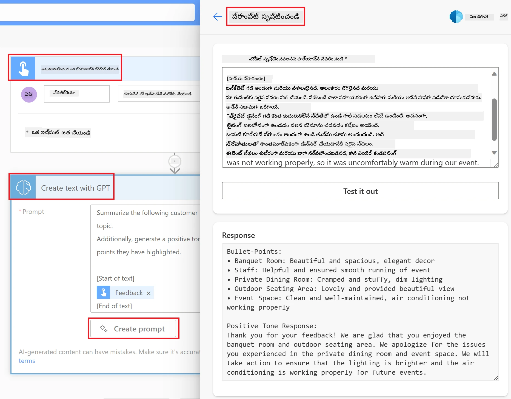

Power Automate లో ఈ AI మోడెల్ ను ఎలా ఉపయోగించాలో తెలుసుకోవడానికి, [Add intelligence with AI Builder and GPT](https://learn.microsoft.com/training/modules/ai-builder-text-generation/?WT.mc_id=academic-109639-somelezediko) మాడ్యూల్ ను పరిశీలించండి.

## అద్భుతమైన పని! మీ అభ్యాసం కొనసాగించండి

ఈ పాఠం పూర్తిచేసిన తర్వాత, మీ Generative AI పరిజ్ఞానాన్ని పెంచేందుకు మా [Generative AI Learning collection](https://aka.ms/genai-collection?WT.mc_id=academic-105485-koreyst) ను చూడండి!

Copilot ను అనుకూలీకరించి మరింత ఉపయోగించాలనుకుంటున్నారా? GitHub Copilot ని మెరుగ్గా ఉపయోగించడానికి సహాయపడే సూచనలు, ఏజెంట్లు, నైపుణ్యాలు, మరియు కాన్ఫిగరేషన్ల సమాహారంగా ఉన్న [Awesome Copilot](https://github.com/github/awesome-copilot?WT.mc_id=academic-105485-koreyst) ను అన్వేషించండి.

మేము [Function Calling తో Generative AI ని ఏకీకృతం చేయడం](../11-integrating-with-function-calling/README.md?WT.mc_id=academic-105485-koreyst) ఎలా చేయాలో చూసే పాఠం 11 కి వెళ్ళండి!

---

<!-- CO-OP TRANSLATOR DISCLAIMER START -->
**అస్వీకరణ**:
ఈ పత్రం AI అనువాద సేవ [Co-op Translator](https://github.com/Azure/co-op-translator) ఉపయోగించి అనువదించబడింది. మేము ఖచ్చితత్వానికి ప్రయత్నిస్తున్నప్పటికీ, ఆటోమేటెడ్ అనువాదాలు తప్పులు లేదా అసమగ్రతలను కలిగి ఉండవచ్చు. దాని స్వదేశ భాషలో ఉన్న అసలు పత్రాన్ని అధికారం కలిగిన మూలంగా పరిగణించాలి. కీలకమైన సమాచారం కోసం, ప్రొఫెషనల్ మానవ అనువాదాన్ని సిఫారసు చేస్తాము. ఈ అనువాదం ఉపయోగం వల్ల కలిగే ఏవైనా అపార్థాలు లేదా తప్పుదారులు కోసం మేము బాధ్యత వహించము.
<!-- CO-OP TRANSLATOR DISCLAIMER END -->