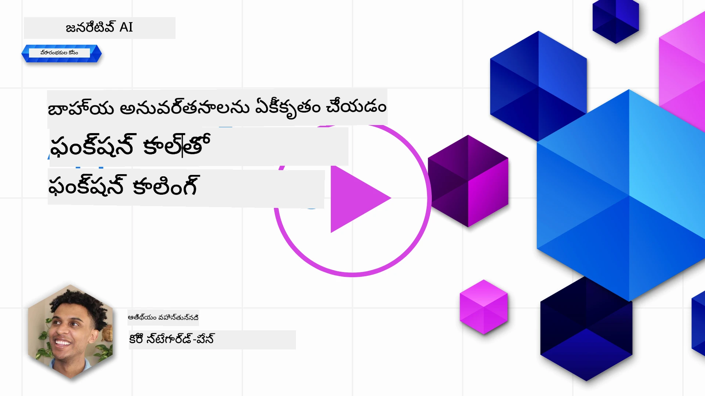
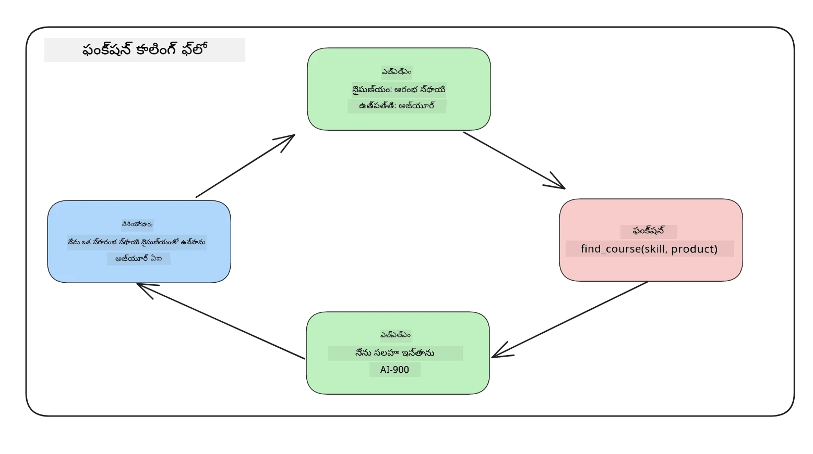

<!--
CO_OP_TRANSLATOR_METADATA:
{
  "original_hash": "f6f84f9ef2d066cd25850cab93580a50",
  "translation_date": "2025-12-19T20:02:52+00:00",
  "source_file": "11-integrating-with-function-calling/README.md",
  "language_code": "te"
}
-->
# ఫంక్షన్ కాలింగ్‌తో ఇంటిగ్రేషన్

[](https://youtu.be/DgUdCLX8qYQ?si=f1ouQU5HQx6F8Gl2)

మీరు ఇప్పటివరకు గత పాఠాలలో మంచి పరిజ్ఞానం పొందారు. అయితే, మేము ఇంకా మెరుగుపరచుకోవచ్చు. కొన్ని విషయాలు మేము పరిష్కరించవచ్చు, అవి ఎలా ఉంటాయంటే, ప్రతిస్పందనను క్రమబద్ధీకరించిన ఫార్మాట్‌లో పొందడం, తద్వారా ప్రతిస్పందనను తరువాతి దశలో సులభంగా ఉపయోగించుకోవచ్చు. అలాగే, మేము ఇతర మూలాల నుండి డేటాను జోడించి మా అప్లికేషన్‌ను మరింత సమృద్ధిగా చేయవచ్చు.

పైన పేర్కొన్న సమస్యలు ఈ అధ్యాయం పరిష్కరించడానికి చూస్తోంది.

## పరిచయం

ఈ పాఠం కవర్ చేస్తుంది:

- ఫంక్షన్ కాలింగ్ అంటే ఏమిటి మరియు దాని ఉపయోగాలు ఏమిటి అని వివరించడం.
- Azure OpenAI ఉపయోగించి ఫంక్షన్ కాల్ సృష్టించడం.
- ఫంక్షన్ కాల్‌ను అప్లికేషన్‌లో ఎలా ఇంటిగ్రేట్ చేయాలో.

## నేర్చుకునే లక్ష్యాలు

ఈ పాఠం ముగిసిన తర్వాత, మీరు చేయగలుగుతారు:

- ఫంక్షన్ కాలింగ్ ఉపయోగించే ఉద్దేశ్యాన్ని వివరించగలగడం.
- Azure OpenAI సర్వీస్ ఉపయోగించి ఫంక్షన్ కాల్ సెటప్ చేయడం.
- మీ అప్లికేషన్ యొక్క ఉపయోగ కేసుకు అనుగుణంగా సమర్థవంతమైన ఫంక్షన్ కాల్స్ డిజైన్ చేయడం.

## సన్నివేశం: ఫంక్షన్లతో మా చాట్‌బాట్‌ను మెరుగుపరచడం

ఈ పాఠం కోసం, మేము మా విద్యా స్టార్టప్ కోసం ఒక ఫీచర్‌ను నిర్మించాలనుకుంటున్నాము, ఇది వినియోగదారులు టెక్నికల్ కోర్సులను కనుగొనడానికి చాట్‌బాట్‌ను ఉపయోగించడానికి అనుమతిస్తుంది. మేము వారి నైపుణ్య స్థాయి, ప్రస్తుత పాత్ర మరియు ఆసక్తి ఉన్న సాంకేతికత ఆధారంగా కోర్సులను సిఫారసు చేస్తాము.

ఈ సన్నివేశాన్ని పూర్తి చేయడానికి, మేము కింది మిశ్రమాన్ని ఉపయోగిస్తాము:

- `Azure OpenAI` వినియోగదారులకు చాట్ అనుభవం సృష్టించడానికి.
- `Microsoft Learn Catalog API` వినియోగదారుల అభ్యర్థన ఆధారంగా కోర్సులను కనుగొనడంలో సహాయం చేయడానికి.
- `Function Calling` వినియోగదారుల ప్రశ్నను తీసుకుని API అభ్యర్థన చేయడానికి ఫంక్షన్‌కు పంపడానికి.

ప్రారంభించడానికి, మేము మొదట ఫంక్షన్ కాలింగ్ ఎందుకు ఉపయోగించాలో చూద్దాం:

## ఫంక్షన్ కాలింగ్ ఎందుకు

ఫంక్షన్ కాలింగ్ ముందు, LLM నుండి వచ్చిన ప్రతిస్పందనలు నిర్మాణరహితంగా మరియు అసమానంగా ఉండేవి. డెవలపర్లు ప్రతిస్పందన యొక్క ప్రతి వేరియేషన్‌ను నిర్వహించడానికి సంక్లిష్టమైన ధృవీకరణ కోడ్ రాయాల్సి ఉండేది. వినియోగదారులు "స్టాక్‌హోమ్‌లో ప్రస్తుత వాతావరణం ఏమిటి?" వంటి ప్రశ్నలకు సమాధానం పొందలేకపోయారు. ఇది ఎందుకంటే మోడల్స్ శిక్షణ పొందిన డేటా సమయం వరకు పరిమితమయ్యాయి.

ఫంక్షన్ కాలింగ్ అనేది Azure OpenAI సర్వీస్ యొక్క ఒక ఫీచర్, ఇది క్రింది పరిమితులను అధిగమిస్తుంది:

- **క్రమబద్ధమైన ప్రతిస్పందన ఫార్మాట్**. ప్రతిస్పందన ఫార్మాట్‌ను మెరుగ్గా నియంత్రించగలిగితే, మేము ప్రతిస్పందనను ఇతర వ్యవస్థలతో సులభంగా ఇంటిగ్రేట్ చేయవచ్చు.
- **బాహ్య డేటా**. చాట్ సందర్భంలో అప్లికేషన్ యొక్క ఇతర మూలాల నుండి డేటాను ఉపయోగించే సామర్థ్యం.

## సన్నివేశం ద్వారా సమస్యను వివరించడం

> మీరు క్రింద ఉన్న సన్నివేశాన్ని నడపాలనుకుంటే, [చేర్చిన నోట్‌బుక్](./python/aoai-assignment.ipynb?WT.mc_id=academic-105485-koreyst) ఉపయోగించమని మేము సిఫారసు చేస్తున్నాము. మీరు కేవలం చదవవచ్చు, ఎందుకంటే మేము ఫంక్షన్లు సమస్యను ఎలా పరిష్కరించగలవో చూపించడానికి ప్రయత్నిస్తున్నాము.

ప్రతిస్పందన ఫార్మాట్ సమస్యను వివరించే ఉదాహరణను చూద్దాం:

మనం ఒక విద్యార్థి డేటాబేస్ సృష్టించాలనుకుంటున్నాము, తద్వారా సరైన కోర్సును సూచించగలుగుతాము. క్రింద రెండు విద్యార్థుల వివరణలు ఉన్నాయి, అవి డేటాలో చాలా సమానంగా ఉంటాయి.

1. Azure OpenAI వనరుతో కనెక్షన్ సృష్టించండి:

   ```python
   import os
   import json
   from openai import AzureOpenAI
   from dotenv import load_dotenv
   load_dotenv()

   client = AzureOpenAI(
   api_key=os.environ['AZURE_OPENAI_API_KEY'],  # ఇది కూడా డిఫాల్ట్, ఇది వదిలేయవచ్చు
   api_version = "2023-07-01-preview"
   )

   deployment=os.environ['AZURE_OPENAI_DEPLOYMENT']
   ```

   క్రింద Azure OpenAI కనెక్షన్‌ను కాన్ఫిగర్ చేయడానికి కొంత Python కోడ్ ఉంది, ఇందులో `api_type`, `api_base`, `api_version` మరియు `api_key` సెట్ చేయబడతాయి.

1. రెండు విద్యార్థుల వివరణలను `student_1_description` మరియు `student_2_description` వేరియబుల్స్ ఉపయోగించి సృష్టించడం.

   ```python
   student_1_description="Emily Johnson is a sophomore majoring in computer science at Duke University. She has a 3.7 GPA. Emily is an active member of the university's Chess Club and Debate Team. She hopes to pursue a career in software engineering after graduating."

   student_2_description = "Michael Lee is a sophomore majoring in computer science at Stanford University. He has a 3.8 GPA. Michael is known for his programming skills and is an active member of the university's Robotics Club. He hopes to pursue a career in artificial intelligence after finishing his studies."
   ```

   పై విద్యార్థి వివరణలను LLM కు పంపించి డేటాను పార్స్ చేయాలనుకుంటున్నాము. ఈ డేటాను తర్వాత మా అప్లికేషన్‌లో ఉపయోగించి API కి పంపవచ్చు లేదా డేటాబేస్‌లో నిల్వ చేయవచ్చు.

1. LLM కు ఏ సమాచారం కావాలో సూచించే రెండు సమానమైన ప్రాంప్ట్‌లను సృష్టిద్దాం:

   ```python
   prompt1 = f'''
   Please extract the following information from the given text and return it as a JSON object:

   name
   major
   school
   grades
   club

   This is the body of text to extract the information from:
   {student_1_description}
   '''

   prompt2 = f'''
   Please extract the following information from the given text and return it as a JSON object:

   name
   major
   school
   grades
   club

   This is the body of text to extract the information from:
   {student_2_description}
   '''
   ```

   పై ప్రాంప్ట్‌లు LLM కు సమాచారాన్ని తీసుకుని JSON ఫార్మాట్‌లో ప్రతిస్పందన ఇవ్వమని సూచిస్తున్నాయి.

1. ప్రాంప్ట్‌లు మరియు Azure OpenAI కనెక్షన్ సెట్ చేసిన తర్వాత, ఇప్పుడు `openai.ChatCompletion` ఉపయోగించి ప్రాంప్ట్‌లను LLM కు పంపుతాము. ప్రాంప్ట్‌ను `messages` వేరియబుల్‌లో నిల్వ చేసి, పాత్రను `user` గా కేటాయిస్తాము. ఇది వినియోగదారుని సందేశం చాట్‌బాట్‌కు రాయబడుతున్నట్లు అనుకరించడానికి.

   ```python
   # ప్రాంప్ట్ ఒకటి నుండి స్పందన
   openai_response1 = client.chat.completions.create(
   model=deployment,
   messages = [{'role': 'user', 'content': prompt1}]
   )
   openai_response1.choices[0].message.content

   # ప్రాంప్ట్ రెండు నుండి స్పందన
   openai_response2 = client.chat.completions.create(
   model=deployment,
   messages = [{'role': 'user', 'content': prompt2}]
   )
   openai_response2.choices[0].message.content
   ```

ఇప్పుడు రెండు అభ్యర్థనలను LLM కు పంపి, `openai_response1['choices'][0]['message']['content']` లాగా పొందిన ప్రతిస్పందనను పరిశీలించవచ్చు.

1. చివరగా, ప్రతిస్పందనను JSON ఫార్మాట్‌లోకి మార్చడానికి `json.loads` ను పిలవండి:

   ```python
   # ప్రతిస్పందనను JSON ఆబ్జెక్టుగా లోడ్ చేస్తోంది
   json_response1 = json.loads(openai_response1.choices[0].message.content)
   json_response1
   ```

   ప్రతిస్పందన 1:

   ```json
   {
     "name": "Emily Johnson",
     "major": "computer science",
     "school": "Duke University",
     "grades": "3.7",
     "club": "Chess Club"
   }
   ```

   ప్రతిస్పందన 2:

   ```json
   {
     "name": "Michael Lee",
     "major": "computer science",
     "school": "Stanford University",
     "grades": "3.8 GPA",
     "club": "Robotics Club"
   }
   ```

   ప్రాంప్ట్‌లు ఒకే విధంగా ఉండి, వివరణలు సమానంగా ఉన్నప్పటికీ, `Grades` ప్రాపర్టీ విలువలు వేరుగా ఫార్మాట్ అయ్యాయి, ఉదాహరణకు కొన్నిసార్లు `3.7` లేదా `3.7 GPA` లాగా వస్తున్నాయి.

   ఈ ఫలితం ఎందుకంటే LLM రాసిన ప్రాంప్ట్ రూపంలో నిర్మాణరహిత డేటాను తీసుకుని, తిరిగి కూడా నిర్మాణరహిత డేటాను ఇస్తుంది. మాకు ఒక నిర్మాణబద్ధమైన ఫార్మాట్ అవసరం, తద్వారా ఈ డేటాను నిల్వ చేయడం లేదా ఉపయోగించడం సమయంలో ఏమి ఆశించాలో తెలుసుకోవచ్చు.

అప్పుడు ఫార్మాటింగ్ సమస్యను ఎలా పరిష్కరిస్తాం? ఫంక్షనల్ కాలింగ్ ఉపయోగించి, మేము నిర్మాణబద్ధమైన డేటాను తిరిగి పొందగలుగుతాము. ఫంక్షన్ కాలింగ్ ఉపయోగించినప్పుడు, LLM నిజంగా ఏ ఫంక్షన్లను కాల్ చేయదు లేదా నడపదు. బదులుగా, మేము LLM అనుసరించాల్సిన నిర్మాణాన్ని సృష్టిస్తాము. ఆ నిర్మాణబద్ధమైన ప్రతిస్పందనలను ఉపయోగించి, మా అప్లికేషన్లలో ఏ ఫంక్షన్ నడపాలో తెలుసుకుంటాము.



మేము ఆ ఫంక్షన్ నుండి తిరిగి వచ్చినదాన్ని తీసుకుని LLM కు తిరిగి పంపవచ్చు. LLM ఆ తర్వాత సహజ భాషలో స్పందించి వినియోగదారుని ప్రశ్నకు సమాధానం ఇస్తుంది.

## ఫంక్షన్ కాల్స్ ఉపయోగించే సందర్భాలు

ఫంక్షన్ కాల్స్ మీ యాప్‌ను మెరుగుపరచగల అనేక వేర్వేరు సందర్భాలు ఉన్నాయి, ఉదాహరణకు:

- **బాహ్య టూల్స్‌ను కాల్ చేయడం**. చాట్‌బాట్లు వినియోగదారుల ప్రశ్నలకు సమాధానాలు ఇవ్వడంలో అద్భుతంగా ఉంటాయి. ఫంక్షన్ కాలింగ్ ఉపయోగించి, చాట్‌బాట్లు వినియోగదారుల సందేశాలను ఉపయోగించి కొన్ని పనులను పూర్తి చేయవచ్చు. ఉదాహరణకు, ఒక విద్యార్థి చాట్‌బాట్‌ను అడగవచ్చు "నా ఇన్‌స్ట్రక్టర్‌కు ఈ విషయం గురించి నాకు మరింత సహాయం కావాలని ఇమెయిల్ పంపించు". ఇది `send_email(to: string, body: string)` అనే ఫంక్షన్ కాల్ చేయవచ్చు.

- **API లేదా డేటాబేస్ క్వెరీలు సృష్టించడం**. వినియోగదారులు సహజ భాషలో సమాచారాన్ని కనుగొనవచ్చు, అది ఫార్మాటెడ్ క్వెరీ లేదా API అభ్యర్థనగా మారుతుంది. ఉదాహరణకు, ఒక ఉపాధ్యాయుడు అడగవచ్చు "గత అసైన్‌మెంట్ పూర్తి చేసిన విద్యార్థులు ఎవరు?" ఇది `get_completed(student_name: string, assignment: int, current_status: string)` అనే ఫంక్షన్‌ను కాల్ చేయవచ్చు.

- **నిర్మాణబద్ధమైన డేటా సృష్టించడం**. వినియోగదారులు ఒక టెక్స్ట్ బ్లాక్ లేదా CSV తీసుకుని LLM ఉపయోగించి ముఖ్యమైన సమాచారాన్ని తీసుకోవచ్చు. ఉదాహరణకు, ఒక విద్యార్థి శాంతి ఒప్పందాల గురించి వికీపీడియా వ్యాసాన్ని AI ఫ్లాష్‌కార్డ్స్ సృష్టించడానికి మార్చవచ్చు. ఇది `get_important_facts(agreement_name: string, date_signed: string, parties_involved: list)` అనే ఫంక్షన్ ఉపయోగించి చేయవచ్చు.

## మీ మొదటి ఫంక్షన్ కాల్ సృష్టించడం

ఫంక్షన్ కాల్ సృష్టించే ప్రక్రియలో 3 ప్రధాన దశలు ఉంటాయి:

1. మీ ఫంక్షన్ల జాబితా మరియు వినియోగదారుని సందేశంతో Chat Completions API ను కాల్ చేయడం.
2. మోడల్ ప్రతిస్పందనను చదవడం, అంటే ఫంక్షన్ లేదా API కాల్‌ను అమలు చేయడం.
3. మీ ఫంక్షన్ నుండి వచ్చిన ప్రతిస్పందనతో మరోసారి Chat Completions API ను కాల్ చేసి, ఆ సమాచారాన్ని వినియోగదారునికి ప్రతిస్పందన సృష్టించడానికి ఉపయోగించడం.


### దశ 1 - సందేశాలు సృష్టించడం

మొదటి దశ వినియోగదారుని సందేశాన్ని సృష్టించడం. ఇది డైనమిక్‌గా టెక్స్ట్ ఇన్‌పుట్ విలువ తీసుకుని కేటాయించవచ్చు లేదా మీరు ఇక్కడ విలువను కేటాయించవచ్చు. ఇది Chat Completions API తో మీ మొదటి సారి పని అయితే, మేము సందేశం యొక్క `role` మరియు `content` ను నిర్వచించాలి.

`role` అనేది `system` (నియమాలు సృష్టించడం), `assistant` (మోడల్) లేదా `user` (చివరి వినియోగదారు) కావచ్చు. ఫంక్షన్ కాలింగ్ కోసం, మేము దీన్ని `user` గా కేటాయించి ఒక ఉదాహరణ ప్రశ్న ఇస్తాము.

```python
messages= [ {"role": "user", "content": "Find me a good course for a beginner student to learn Azure."} ]
```

వివిధ పాత్రలను కేటాయించడం ద్వారా, LLM కు ఇది సిస్టమ్ మాట్లాడుతున్నదా లేదా వినియోగదారుని సందేశమా అనేది స్పష్టమవుతుంది, ఇది LLM చర్చా చరిత్రను నిర్మించడంలో సహాయపడుతుంది.

### దశ 2 - ఫంక్షన్లు సృష్టించడం

తర్వాత, మేము ఒక ఫంక్షన్ మరియు ఆ ఫంక్షన్ యొక్క పారామితులను నిర్వచిస్తాము. ఇక్కడ మేము `search_courses` అనే ఒకే ఒక ఫంక్షన్ ఉపయోగిస్తాము, కానీ మీరు బహుళ ఫంక్షన్లు సృష్టించవచ్చు.

> **ముఖ్యమైనది** : ఫంక్షన్లు LLM కు పంపే సిస్టమ్ సందేశంలో చేర్చబడి, మీరు అందుబాటులో ఉన్న టోకెన్ల పరిమితిలో ఉంటాయి.

క్రింద, మేము ఫంక్షన్లను ఐటెమ్‌ల అర్రేగా సృష్టిస్తాము. ప్రతి ఐటెమ్ ఒక ఫంక్షన్ మరియు దానికి `name`, `description` మరియు `parameters` ప్రాపర్టీలు ఉంటాయి:

```python
functions = [
   {
      "name":"search_courses",
      "description":"Retrieves courses from the search index based on the parameters provided",
      "parameters":{
         "type":"object",
         "properties":{
            "role":{
               "type":"string",
               "description":"The role of the learner (i.e. developer, data scientist, student, etc.)"
            },
            "product":{
               "type":"string",
               "description":"The product that the lesson is covering (i.e. Azure, Power BI, etc.)"
            },
            "level":{
               "type":"string",
               "description":"The level of experience the learner has prior to taking the course (i.e. beginner, intermediate, advanced)"
            }
         },
         "required":[
            "role"
         ]
      }
   }
]
```

ప్రతి ఫంక్షన్ ఉదాహరణను క్రింద వివరంగా వివరించుకుందాం:

- `name` - మేము కాల్ చేయదలచిన ఫంక్షన్ పేరు.
- `description` - ఫంక్షన్ ఎలా పనిచేస్తుందో వివరణ. ఇక్కడ స్పష్టంగా మరియు నిర్దిష్టంగా ఉండటం ముఖ్యం.
- `parameters` - మోడల్ తన ప్రతిస్పందనలో ఉత్పత్తి చేయాల్సిన విలువలు మరియు ఫార్మాట్ జాబితా. పారామితుల అర్రేలోని ఐటెమ్‌లు క్రింది ప్రాపర్టీలను కలిగి ఉంటాయి:
  1.  `type` - ప్రాపర్టీల డేటా రకం.
  1.  `properties` - మోడల్ తన ప్రతిస్పందనలో ఉపయోగించే నిర్దిష్ట విలువల జాబితా
      1. `name` - ప్రాపర్టీ పేరు, ఉదాహరణకు `product`.
      1. `type` - ఆ ప్రాపర్టీ యొక్క డేటా రకం, ఉదాహరణకు `string`.
      1. `description` - ఆ నిర్దిష్ట ప్రాపర్టీ వివరణ.

ఐచ్ఛికంగా `required` అనే ప్రాపర్టీ కూడా ఉంటుంది - ఫంక్షన్ కాల్ పూర్తి కావడానికి అవసరమైన ప్రాపర్టీ.

### దశ 3 - ఫంక్షన్ కాల్ చేయడం

ఫంక్షన్ నిర్వచించిన తర్వాత, ఇప్పుడు దాన్ని Chat Completion API కాల్‌లో చేర్చాలి. మేము అభ్యర్థనలో `functions` ను జోడిస్తాము. ఈ సందర్భంలో `functions=functions`.

`function_call` ను `auto` గా సెట్ చేసే ఎంపిక కూడా ఉంది. దీని అర్థం, వినియోగదారుని సందేశం ఆధారంగా ఏ ఫంక్షన్ కాల్ చేయాలో LLM నిర్ణయిస్తుంది, మేము స్వయంగా కేటాయించము.

క్రింద కొంత కోడ్ ఉంది, ఇందులో `ChatCompletion.create` ను కాల్ చేస్తున్నాము, గమనించండి `functions=functions` మరియు `function_call="auto"` సెట్ చేయడం ద్వారా LLM కు ఎప్పుడు ఫంక్షన్లు కాల్ చేయాలో ఎంపిక ఇస్తున్నాము:

```python
response = client.chat.completions.create(model=deployment,
                                        messages=messages,
                                        functions=functions,
                                        function_call="auto")

print(response.choices[0].message)
```

ఇప్పుడు తిరిగి వచ్చే ప్రతిస్పందన ఇలా ఉంటుంది:

```json
{
  "role": "assistant",
  "function_call": {
    "name": "search_courses",
    "arguments": "{\n  \"role\": \"student\",\n  \"product\": \"Azure\",\n  \"level\": \"beginner\"\n}"
  }
}
```

ఇక్కడ `search_courses` ఫంక్షన్ ఎలా కాల్ చేయబడిందో, మరియు ఏ ఆర్గ్యుమెంట్లతో కాల్ చేయబడిందో JSON ప్రతిస్పందనలో `arguments` ప్రాపర్టీలో చూడవచ్చు.

LLM ఆర్గ్యుమెంట్లకు సరిపోయే డేటాను కనుగొనగలిగింది, ఎందుకంటే అది చాట్ కంప్లీషన్ కాల్‌లో `messages` పారామీటర్‌కు అందించిన విలువ నుండి డేటాను తీసుకుంటోంది. క్రింద `messages` విలువ గుర్తు చేసుకోండి:

```python
messages= [ {"role": "user", "content": "Find me a good course for a beginner student to learn Azure."} ]
```

మీరు చూడగలుగుతారు, `student`, `Azure` మరియు `beginner` `messages` నుండి తీసుకుని ఫంక్షన్ ఇన్‌పుట్‌గా సెట్ చేయబడ్డాయి. ఈ విధంగా ఫంక్షన్లు ఉపయోగించడం ప్రాంప్ట్ నుండి సమాచారాన్ని తీసుకోవడానికి మరియు LLM కు నిర్మాణాన్ని అందించడానికి, అలాగే పునర్వినియోగయోగ్యమైన ఫంక్షనాలిటీ కలిగించడానికి గొప్ప మార్గం.

తర్వాత, దీన్ని మా యాప్‌లో ఎలా ఉపయోగించాలో చూద్దాం.

## ఫంక్షన్ కాల్స్‌ను అప్లికేషన్‌లో ఇంటిగ్రేట్ చేయడం

LLM నుండి ఫార్మాటెడ్ ప్రతిస్పందనను పరీక్షించిన తర్వాత, ఇప్పుడు దీన్ని అప్లికేషన్‌లో ఇంటిగ్రేట్ చేయవచ్చు.

### ఫ్లో నిర్వహణ

దీనిని మా అప్లికేషన్‌లో ఇంటిగ్రేట్ చేయడానికి, క్రింది దశలను తీసుకుందాం:

1. మొదట, OpenAI సర్వీసులకు కాల్ చేసి, సందేశాన్ని `response_message` అనే వేరియబుల్‌లో నిల్వ చేయండి.

   ```python
   response_message = response.choices[0].message
   ```

1. ఇప్పుడు Microsoft Learn API ను కాల్ చేసి కోర్సుల జాబితాను పొందే ఫంక్షన్ నిర్వచిద్దాం:

   ```python
   import requests

   def search_courses(role, product, level):
     url = "https://learn.microsoft.com/api/catalog/"
     params = {
        "role": role,
        "product": product,
        "level": level
     }
     response = requests.get(url, params=params)
     modules = response.json()["modules"]
     results = []
     for module in modules[:5]:
        title = module["title"]
        url = module["url"]
        results.append({"title": title, "url": url})
     return str(results)
   ```

   ఇప్పుడు మేము `functions` వేరియబుల్‌లో పరిచయమైన ఫంక్షన్ పేర్లకు మ్యాప్ అయ్యే నిజమైన Python ఫంక్షన్ సృష్టిస్తున్నాము. మేము నిజమైన బాహ్య API కాల్స్ చేసి అవసరమైన డేటాను తీసుకుంటున్నాము. ఈ సందర్భంలో, Microsoft Learn API పై శిక్షణ మాడ్యూల్స్ కోసం శోధిస్తున్నాము.

సరే, మేము `functions` వేరియబుల్ మరియు అనుగుణమైన Python ఫంక్షన్ సృష్టించాము, ఇప్పుడు LLM కు ఈ రెండు ఎలా మ్యాప్ చేయాలో ఎలా చెప్పాలి, తద్వారా మా Python ఫంక్షన్ కాల్ అవుతుంది?

1. Python ఫంక్షన్ కాల్ చేయాల్సిన అవసరం ఉందో లేదో చూడటానికి, LLM ప్రతిస్పందనలో `function_call` భాగమా అని చూడాలి మరియు సూచించిన ఫంక్షన్‌ను కాల్ చేయాలి. క్రింద ఈ తనిఖీ ఎలా చేయాలో ఉంది:

   ```python
   # మోడల్ ఫంక్షన్‌ను పిలవాలనుకుంటుందో లేదో తనిఖీ చేయండి
   if response_message.function_call.name:
    print("Recommended Function call:")
    print(response_message.function_call.name)
    print()

    # ఫంక్షన్‌ను పిలవండి.
    function_name = response_message.function_call.name

    available_functions = {
            "search_courses": search_courses,
    }
    function_to_call = available_functions[function_name]

    function_args = json.loads(response_message.function_call.arguments)
    function_response = function_to_call(**function_args)

    print("Output of function call:")
    print(function_response)
    print(type(function_response))


    # సహాయకుడు స్పందన మరియు ఫంక్షన్ స్పందనను సందేశాలకు జోడించండి
    messages.append( # సహాయకుడు స్పందనను సందేశాలకు జోడించడం
        {
            "role": response_message.role,
            "function_call": {
                "name": function_name,
                "arguments": response_message.function_call.arguments,
            },
            "content": None
        }
    )
    messages.append( # ఫంక్షన్ స్పందనను సందేశాలకు జోడించడం
        {
            "role": "function",
            "name": function_name,
            "content":function_response,
        }
    )
   ```

   ఈ మూడు లైన్లు ఫంక్షన్ పేరు, ఆర్గ్యుమెంట్లు తీసుకుని కాల్ చేస్తాయి:

   ```python
   function_to_call = available_functions[function_name]

   function_args = json.loads(response_message.function_call.arguments)
   function_response = function_to_call(**function_args)
   ```

   క్రింద మా కోడ్ నడిపిన అవుట్‌పుట్ ఉంది:

   **అవుట్‌పుట్**

   ```Recommended Function call:
   {
     "name": "search_courses",
     "arguments": "{\n  \"role\": \"student\",\n  \"product\": \"Azure\",\n  \"level\": \"beginner\"\n}"
   }

   Output of function call:
   [{'title': 'Describe concepts of cryptography', 'url': 'https://learn.microsoft.com/training/modules/describe-concepts-of-cryptography/?
   WT.mc_id=api_CatalogApi'}, {'title': 'Introduction to audio classification with TensorFlow', 'url': 'https://learn.microsoft.com/en-
   us/training/modules/intro-audio-classification-tensorflow/?WT.mc_id=api_CatalogApi'}, {'title': 'Design a Performant Data Model in Azure SQL
   Database with Azure Data Studio', 'url': 'https://learn.microsoft.com/training/modules/design-a-data-model-with-ads/?
   WT.mc_id=api_CatalogApi'}, {'title': 'Getting started with the Microsoft Cloud Adoption Framework for Azure', 'url':
   'https://learn.microsoft.com/training/modules/cloud-adoption-framework-getting-started/?WT.mc_id=api_CatalogApi'}, {'title': 'Set up the
   Rust development environment', 'url': 'https://learn.microsoft.com/training/modules/rust-set-up-environment/?WT.mc_id=api_CatalogApi'}]
   <class 'str'>
   ```

1. ఇప్పుడు నవీకరించిన సందేశం `messages` ను LLM కు పంపి సహజ భాషలో ప్రతిస్పందన పొందుదాం, API JSON ఫార్మాట్ ప్రతిస్పందన కాకుండా.

   ```python
   print("Messages in next request:")
   print(messages)
   print()

   second_response = client.chat.completions.create(
      messages=messages,
      model=deployment,
      function_call="auto",
      functions=functions,
      temperature=0
         )  # ఫంక్షన్ స్పందనను చూడగలిగే GPT నుండి కొత్త స్పందనను పొందండి


   print(second_response.choices[0].message)
   ```

   **అవుట్‌పుట్**

   ```python
   {
     "role": "assistant",
     "content": "I found some good courses for beginner students to learn Azure:\n\n1. [Describe concepts of cryptography] (https://learn.microsoft.com/training/modules/describe-concepts-of-cryptography/?WT.mc_id=api_CatalogApi)\n2. [Introduction to audio classification with TensorFlow](https://learn.microsoft.com/training/modules/intro-audio-classification-tensorflow/?WT.mc_id=api_CatalogApi)\n3. [Design a Performant Data Model in Azure SQL Database with Azure Data Studio](https://learn.microsoft.com/training/modules/design-a-data-model-with-ads/?WT.mc_id=api_CatalogApi)\n4. [Getting started with the Microsoft Cloud Adoption Framework for Azure](https://learn.microsoft.com/training/modules/cloud-adoption-framework-getting-started/?WT.mc_id=api_CatalogApi)\n5. [Set up the Rust development environment](https://learn.microsoft.com/training/modules/rust-set-up-environment/?WT.mc_id=api_CatalogApi)\n\nYou can click on the links to access the courses."
   }

   ```

## అసైన్‌మెంట్

Azure OpenAI ఫంక్షన్ కాలింగ్ నేర్చుకోవడం కొనసాగించడానికి మీరు నిర్మించవచ్చు:

- విద్యార్థులకు మరిన్ని కోర్సులు కనుగొనడంలో సహాయపడే ఫంక్షన్ యొక్క మరిన్ని పారామితులు.
- విద్యార్థి వారి స్వదేశీ భాష వంటి మరిన్ని సమాచారాన్ని తీసుకునే మరో ఫంక్షన్ కాల్ సృష్టించడం.
- ఫంక్షన్ కాల్ మరియు/లేదా API కాల్ సరైన కోర్సులను తిరిగి ఇవ్వకపోతే ఎర్రర్ హ్యాండ్లింగ్ సృష్టించండి

సూచన: ఈ డేటా ఎక్కడ మరియు ఎలా అందుబాటులో ఉందో చూడటానికి [Learn API reference documentation](https://learn.microsoft.com/training/support/catalog-api-developer-reference?WT.mc_id=academic-105485-koreyst) పేజీని అనుసరించండి.

## అద్భుతమైన పని! ప్రయాణాన్ని కొనసాగించండి

ఈ పాఠాన్ని పూర్తి చేసిన తర్వాత, మా [Generative AI Learning collection](https://aka.ms/genai-collection?WT.mc_id=academic-105485-koreyst) ను పరిశీలించి మీ Generative AI జ్ఞానాన్ని మరింత పెంచుకోండి!

పాఠం 12 కి వెళ్లండి, అక్కడ మేము [AI అనువర్తనాల కోసం UX ఎలా డిజైన్ చేయాలో](../12-designing-ux-for-ai-applications/README.md?WT.mc_id=academic-105485-koreyst) చూడబోతున్నాము!

---

<!-- CO-OP TRANSLATOR DISCLAIMER START -->
**అస్పష్టత**:  
ఈ పత్రాన్ని AI అనువాద సేవ [Co-op Translator](https://github.com/Azure/co-op-translator) ఉపయోగించి అనువదించబడింది. మేము ఖచ్చితత్వానికి ప్రయత్నించినప్పటికీ, ఆటోమేటెడ్ అనువాదాల్లో పొరపాట్లు లేదా తప్పిదాలు ఉండవచ్చు. అసలు పత్రం దాని స్వదేశీ భాషలోనే అధికారిక మూలంగా పరిగణించాలి. ముఖ్యమైన సమాచారానికి, ప్రొఫెషనల్ మానవ అనువాదం సిఫార్సు చేయబడుతుంది. ఈ అనువాదం వాడకంలో ఏర్పడిన ఏవైనా అపార్థాలు లేదా తప్పుదారితీసే అర్థాలు కోసం మేము బాధ్యత వహించము.
<!-- CO-OP TRANSLATOR DISCLAIMER END -->