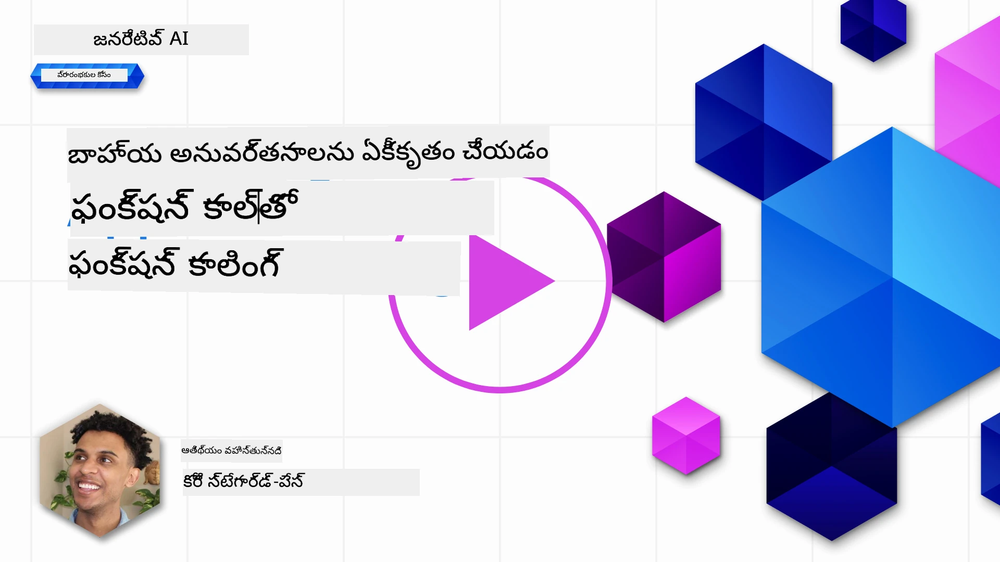
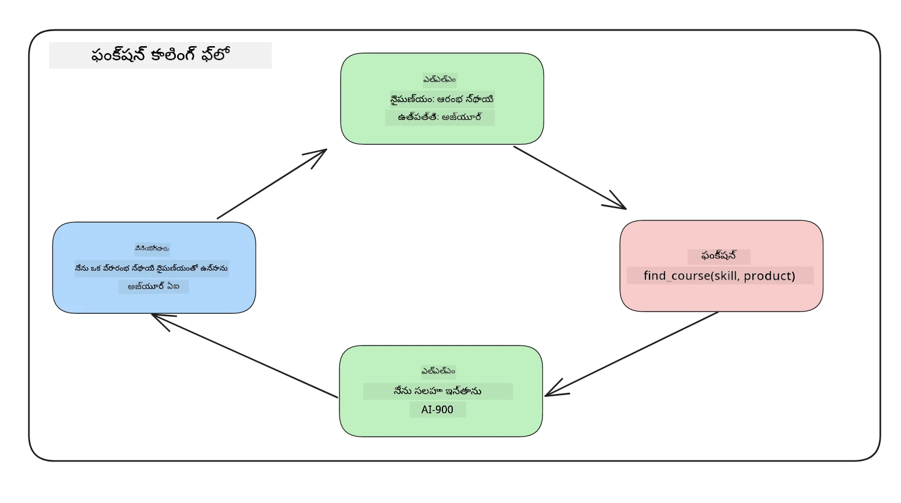
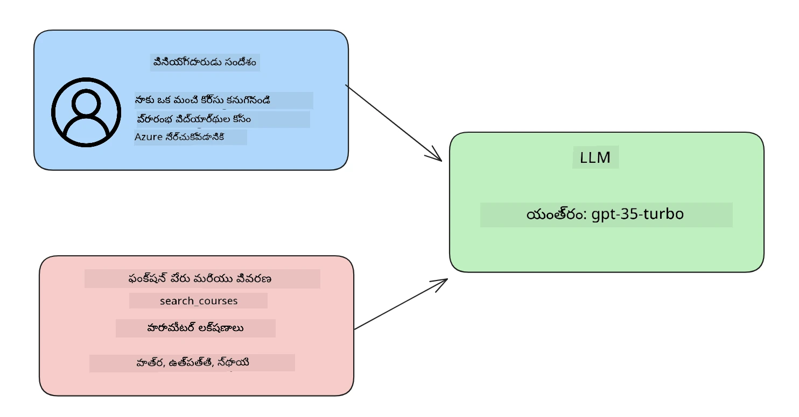

# ఫంక్షన్ కాలింగ్‌తో సమన్వయం

[](https://youtu.be/DgUdCLX8qYQ?si=f1ouQU5HQx6F8Gl2)

మీరు ఇంతవరకు గత పాఠాలలో చాలాడిగా నేర్చుకున్నారు. అయితే, మేము మరింత మెరుగుపరచవచ్చు. ప్రతిస్పందనను డౌన్స్ట్రీమ్‌లో పనిచేయడానికి సులభతరం చేసే ఒక నిరంతరమైన ఫార్మాట్‌ను ఎలా పొందడం గురించి మనం చూడవచ్చు. అలాగే, మన యాప్లికేషన్‌ను మరింత పుష్కలీకరించడానికి ఇతర మూలాల నుండి డేటాను జతచేయాలనుకొనవచ్చు.

పైన పేర్కొన్న సమస్యలను ఈ అధ్యాయం పరిష్కరించడానికి చూస్తోంది.

## పరిచయం

ఈ పాఠం కవర్ చేస్తుంది:

- ఫంక్షన్ కాలింగ్ అంటే ఏమిటి మరియు దీని ఉపయోగాల గురించి వివరించడం.
- Azure OpenAI ను ఉపయోగించి ఫంక్షన్ కాల్ సృష్టించడం.
- యాప్లికేషన్‌లో ఫంక్షన్ కాల్‌ను ఎలా సమన్వయించాలో.

## నేర్చుకునే లక్ష్యాలు

ఈ పాఠం చివరికి, మీరు చేయగలరు:

- ఫంక్షన్ కాలింగ్ ఉపయోగించే ఉద్దేశ్యాన్ని వివరించడం.
- Azure OpenAI సేవను ఉపయోగించి ఫంక్షన్ కాల్ సెటప్ చేయడం.
- మీ యాప్లికేషన్ వినియోగానికి సమర్థవంతమైన ఫంక్షన్ కాల్‌లను రూపకల్పన చేయడం.

## దృశ్యం: ఫంక్షన్‌లతో మన చాట్బాట్‌ను మెరుగుపరచడం

ఈ పాఠం కోసం, మన విద్యా స్టార్టప్ కోసం ఒక ఫీచర్‌ని నిర్మించాలని ఉంది, ఇది వినియోగదారులు ఒక చాట్బాట్ ఉపయోగించి సాంకేతిక కోర్సులను కనుగొనేటట్లు అనుమతిస్తుంది. మనం వారి నైపుణ్య స్థాయి, ప్రస్తుత పాత్ర మరియు ఆసక్తి ఉన్న సాంకేతికతను బట్టి కోర్సులను సూచిస్తాము.

ఈ దృశ్యాన్ని పూర్తిచేయడానికి, మనం క్రిందివి ఉపయోగిస్తాము:

- `Azure OpenAI` వినియోగదారుకు చాట్ అనుభవం సృష్టించడానికి.
- `Microsoft Learn Catalog API` వినియోగదారుల అభ్యర్థన ఆధారంగా కోర్సులు కనుగొనడానికి సహాయం చేయడానికి.
- `Function Calling` వినియోగదారుల ప్రశ్నను తీసుకుని దానిని ఫంక్షన్‌కు పంపి API అభ్యర్థన చేసుకోవడానికి.

ప్రారంభించడానికి, మనం మొదట ఫంక్షన్ కాలింగ్ ఎందుకు ఉపయోగించాలనుకొంటున్నామో చూద్దాం:

## ఫంక్షన్ క్లాలింగ్ అవసరం ఎందుకు

ఫంక్షన్ కాలింగ్ ముందు, LLM నుండి వచ్చిన ప్రతిస్పందనలు అసంరచిత మరియు నిరంతరం ఉండేవి. డెవలపర్లు ప్రతిస్పందన యొక్క ప్రతి భిన్నత్వం నిర్వహించేందుకు క్లిష్టమైన ధ్రువీకరణ కోడ్ రాయాల్సి ఉండేది. "స్టాక్ హోమ్‌లో ప్రస్తుత వాతావరణం ఏమిటి?" అనే ప్రశ్నలకు కూడా వినియోగదారులు జవాబులు పొందలేరు. ఇది ఎందుకంటే నమూనాలు శిక్షణ పొందిన సమయంలో ఉన్న డేటాకు పరిమితం అయ్యాయి.

ఫంక్షన్ కాలింగ్ అనేది Azure OpenAI సేవ యొక్క ఒక ఫీచర్, ఇది క్రింది పరిమితులను అధిగమిస్తుంది:

- **నిరంతర ప్రతిస్పందన ఫార్మాట్**. ప్రతిస్పందన ఫార్మాట్‌ను మెరుగ్గా నియంత్రించడం ద్వారా మనం ప్రతిస్పందనను ఇతర వ్యవస్థలతో సులభంగా సమన్వయించగలము.
- **బాహ్య డేటా**. చాట్ సందర్భంలో యాప్లికేషన్ యొక్క ఇతర మూలాల నుండి డేటాను ఉపయోగించే సామర్థ్యం.

## ఒక దృశ్యంతో సమస్యను వివరించడం

> మీరు క్రింద ఇవ్వబడిన [నోట్‌బుక్](./python/aoai-assignment.ipynb?WT.mc_id=academic-105485-koreyst) ను ఉపయోగించాలని సిఫార్సు చేస్తున్నాము. మీరు క్రింది దృశ్యం రాసుకున్న సమస్యను సూచిస్తున్నాము, దీనిపై ఫంక్షన్‌లు ఎలా సహాయపడతాయో అర్థం చేసుకోవడానికి.

ప్రతిస్పందన ఫార్మాట్ సమస్యను వివరించే ఉదాహరణను చూద్దాం:

మనం విద్యార్థుల డేటాబేస్ సృష్టించాలనుకుందాం, తద్వారా సరైన కోర్సును సూచించవచ్చు. క్రింద మనకు రెండు విద్యార్థుల వివరణలు ఉన్నాయి, అవి డేటా ఆధారంగా చాలా సమానమైనవి.

1. మన Azure OpenAI వనరుతో కనెక్షన్ సృష్టించండి:

   ```python
   import os
   import json
   from openai import OpenAI
   from dotenv import load_dotenv
   load_dotenv()

   # Responses API Azure OpenAI (Microsoft Foundry) v1 ఎండి నుండి సర్వ్ చేయబడుతుంది
   # endpoint, అందువల్ల OpenAI క్లయింట్‌ను <your-endpoint>/openai/v1/ వద్దకు చూపిస్తాము.
   endpoint = os.environ['AZURE_OPENAI_ENDPOINT']
   client = OpenAI(
   api_key=os.environ['AZURE_OPENAI_API_KEY'],
   base_url=f"{endpoint.rstrip('/')}/openai/v1/",
   )

   deployment=os.environ['AZURE_OPENAI_DEPLOYMENT']
   ```

   క్రింద ఉన్నది Azure OpenAI తో మన కనెక్షన్‌ని కాన్ఫిగర్ చేయడానికి కొన్ని పిథాన్ కోడ్. మనం v1 ఎండ్‌పాయింట్ ఉపయోగించేముకాక `api_key` మరియు `base_url` మాత్రమే సెట్ చేయాలి (`api_version` అవసరం లేదు).

1. వేరియబుల్స్ `student_1_description` మరియు `student_2_description` ఉపయోగించి రెండు విద్యార్థుల వివరణలు సృష్టించడం.

   ```python
   student_1_description="Emily Johnson is a sophomore majoring in computer science at Duke University. She has a 3.7 GPA. Emily is an active member of the university's Chess Club and Debate Team. She hopes to pursue a career in software engineering after graduating."

   student_2_description = "Michael Lee is a sophomore majoring in computer science at Stanford University. He has a 3.8 GPA. Michael is known for his programming skills and is an active member of the university's Robotics Club. He hopes to pursue a career in artificial intelligence after finishing his studies."
   ```

   పై విద్యార్థుల వివరణలను LLM కి పంపి ఈ డేటాను వివరించాల్సి ఉంది. ఈ డేటా తర్వాత మన యాప్లికేషన్‌లో ఉపయోగించబడుతుంది మరియు API కి పంపబడవచ్చు లేదా డేటాబేస్‌లో నిల్వ చేయబడవచ్చు.

1. మనం LLM కి చూడాల్సిన సమాచారాన్ని సూచించే రెండు సమానమైన ప్రాంప్ట్‌లను సృష్టిద్దాం:

   ```python
   prompt1 = f'''
   Please extract the following information from the given text and return it as a JSON object:

   name
   major
   school
   grades
   club

   This is the body of text to extract the information from:
   {student_1_description}
   '''

   prompt2 = f'''
   Please extract the following information from the given text and return it as a JSON object:

   name
   major
   school
   grades
   club

   This is the body of text to extract the information from:
   {student_2_description}
   '''
   ```

   పై ప్రాంప్ట్‌లు LLM కి సమాచారాన్ని తీయమని మరియు JSON ఫార్మాట్‌లో ప్రతిస్పందన ఇవ్వమని సూచిస్తాయి.

1. ప్రాంప్ట్‌లు మరియు Azure OpenAI కనెక్షన్ సెటప్ చేసిన తర్వాత, మనం ఇప్పుడు `client.responses.create` ను ఉపయోగించి ప్రాంప్ట్‌లను LLM కి పంపుతాము. ప్రాంప్ట్‌ని `input` వేరియబుల్‌లో నిల్వ చేసి, భూమికను `user` గా అడ్డుకుంటుంది. ఇది ఒక వినియోగదారుడు చాట్బాట్‌కి సन्दేశం రాయడం మాదిరిగానే ఉంటుంది.

   ```python
   # ప్రాంప్ట్ ఒకటి నుండి స్పందన
   openai_response1 = client.responses.create(
   model=deployment,
   input = [{'role': 'user', 'content': prompt1}],
   store=False,
   )
   openai_response1.output_text

   # ప్రాంప్ట్ రెండు నుండి స్పందన
   openai_response2 = client.responses.create(
   model=deployment,
   input = [{'role': 'user', 'content': prompt2}],
   store=False,
   )
   openai_response2.output_text
   ```

ఇప్పుడు మనం రెండు అభ్యర్థనలను LLM కి పంపి పొందిన ప్రతిస్పందనను ఇలా చూడవచ్చు: `openai_response1.output_text`.

1. చివరిగా, `json.loads` ను పిలిచి ప్రతిస్పందనను JSON ఫార్మాట్‌కు మారుస్తాము:

   ```python
   # ప్రతిస్పందనను JSON ఆబ్జెక్టుగా లోడ్ చేస్తోంది
   json_response1 = json.loads(openai_response1.output_text)
   json_response1
   ```

   ప్రతిస్పందన 1:

   ```json
   {
     "name": "Emily Johnson",
     "major": "computer science",
     "school": "Duke University",
     "grades": "3.7",
     "club": "Chess Club"
   }
   ```

   ప్రతిస్పందన 2:

   ```json
   {
     "name": "Michael Lee",
     "major": "computer science",
     "school": "Stanford University",
     "grades": "3.8 GPA",
     "club": "Robotics Club"
   }
   ```

   ప్రాంప్ట్‌లు అదే మరియు వివరణలు సమానం అయినప్పటికీ, మనం `Grades` ప్రాపర్టీ విలువలు వేరే రీతిగా ఉంటున్నాయి, ఉదాహరణకు కొన్ని సార్లు `3.7` లేదా `3.7 GPA` అని వస్తుంది.

   ఈ ఫలితం ఎందుకంటే LLM గాక్రహించిన డేటా నిర్మాణం లేని ప్రాంప్ట్ రూపంలో ఉంటుంది మరియు అసంరచిత డేటాను తిరిగి ఇస్తుంది. మనం ఒక నిర్మిత ఫార్మాట్ అవసరం లేదా మనం ఈ డేటాను నిల్వచేయేటప్పుడు లేదా ఉపయోగించినప్పుడు ఏమి ఆశించాలో తెలుసుకోవడానికి.

కాబట్టి, ఫార్మాటింగ్ సమస్యను మనం ఎలా పరిష్కరిస్తాము? ఫంక్షన్ కాలింగ్ ఉపయోగించడం ద్వారా, మనం నిర్మిత డేటాను తిరిగి పొందగలుగుతాము. ఫంక్షన్ కాలింగ్ ఉపయోగిస్తున్నప్పుడు, LLM యావత్తుగా ఎటువంటి ఫంక్షన్‌లను కాల్ చేయదు లేదా నడిపించదు. దాని ప్రతిస్పందనలకు అనుగుణంగా ఒక నిర్మాణం (స्ट्रక్చర్) సృష్టిస్తాము. ఆ నిర్మిత ప్రతిస్పందనలను ఉపయోగించి మన యాప్లికేషన్లలో ఏ ఫంక్షన్ నడపాలో తెలుసుకుంటాము.



మనం తర్వాత ఫంక్షన్ నుండి వచ్చిన వాటిని తీసుకుని తిరిగి LLM కు పంపవచ్చు. LLM మళ్లీ సహజ భాషలో ప్రతిస్పందించి వినియోగదారుడి ప్రశ్నకు జవాబు ఇస్తుంది.

## ఫంక్షన్ కాల్స్ ఉపయోగించే సందర్భాలు

ఫంక్షన్ కాల్స్ మీ యాప్‌ను మెరుగుపరచగల అనేక సందర్భాలు ఉన్నవి:

- **బాహ్య టూల్‌లను కాల్ చేయడం**. చాట్బాట్‌లు వినియోగదారుల ప్రశ్నలకు సమాధానాలు ఇవ్వడంలో బాగా ఉంటాయి. ఫంక్షన్ కాలింగ్ ఉపయోగించి, చాట్బాట్లు వినియోగదారుల సందేశాలను కొన్ని పనులను పూర్తి చేయడానికి ఉపయోగించగలవు. ఉదాహరణకు, ఒక విద్యార్థి చాట్బాట్‌కి "నా ఇన్‌స్ట్రక్టర్‌కు ఇమెయిల్ పంపించు నేను ఈ విషయం మీద మరిన్ని సహాయం కావాలి" అని అడగవచ్చు. ఇది `send_email(to: string, body: string)` అనే ఫంక్షన్‌ను కాల్ చేయవచ్చు.

- **API లేదా డేటాబేస్ క్వెరీస్ సృష్టించడం**. వినియోగదారులు సహజ భాష ఉపయోగించి సమాచారాన్ని కనుగొనవచ్చు, అది ఫార్మాటెడ్ క్వెరీ లేదా API అభ్యర్థనగా మారుతుంది. ఉదాహరణకు ఒక ఉపాధ్యాయుడు "వారసత్వం పూర్తి చేసిన విద్యార్థులు ఎవరు?" అని అడగవచ్చు, ఇది `get_completed(student_name: string, assignment: int, current_status: string)` అనే ఫంక్షన్‌ను కాల్ చేస్తుంది.

- **నిర్మిత డేటా సృష్టించడం**. వినియోగదారులు ఒక టెక్స్ట్ బ్లాక్ లేదా CSV తీసుకుని LLM ను ఉపయోగించి ముఖ్యమైన సమాచారాన్ని తీసుకోవచ్చు. ఉదాహరణకు, ఒక విద్యార్థి Wikipedia వ్యాసాన్ని శాంతి ఒప్పందాల గురించి మార్చి AI ఫ్లాష్‌కార్డ్స్ సృష్టించవచ్చు. ఇది `get_important_facts(agreement_name: string, date_signed: string, parties_involved: list)` అనే ఫంక్షన్ ఉపయోగించి చేయవచ్చు.

## మీ మొదటి ఫంక్షన్ కాల్ సృష్టించడం

ఫంక్షన్ కాల్ సృష్టించే ప్రక్రియలో మూడు ముఖ్యమైన దశలు ఉంటాయి:

1. మీ ఫంక్షన్‌ల (టూల్‌లు) జాబితాతో మరియు ఒక వినియోగదారు సందేశంతో Responses API ని **కాలింగ్** చేయడం.
2. ఒక చర్యను చేయడానికి మోడల్ ప్రతిస్పందనను **చదవడం**, అంటే ఒక ఫంక్షన్ లేదా API కాల్ ను నడపడం.
3. మీ ఫంక్షన్ నుంచి వచ్చిన ప్రతిస్పందనతో ఇంకొకసారి Responses API ని **పిలవడం**, ఆ సమాచారాన్ని ఉపయోగించి వినియోగదారుకు ప్రతిస్పందన సృష్టించడం.



### దశ 1 - సందేశాలు సృష్టించడం

మొదటి దశ వినియోగదారుని సందేశం సృష్టించడం. ఇది డైనమిక్గా టెక్స్ట్ ఇన్‌పుట్ విలువ తీసుకోవచ్చు లేదా ఇక్కడ విలువను కేటాయించవచ్చు. మీరు Responses API తో మొదటి సారి పని చేస్తుంటే, మేము `role` మరియు `content` నిర్వచించాలి.

`role` అంటే `system` (నియమాలు సృష్టించడం), `assistant` (మోడల్) లేదా `user` (ముగింపు వినియోగదారు) కావచ్చు. ఫంక్షన్ కాలింగ్ కోసం, మేము దీన్ని `user` గా కేటాయిస్తాము మరియు ఒక ఉదాహరణ ప్రశ్నను ఇస్తాము.

```python
messages= [ {"role": "user", "content": "Find me a good course for a beginner student to learn Azure."} ]
```

వేర్వేరు రోల్స్ కేటాయించడం ద్వారా, ఇది LLM కు స్పష్టం అవుతుంది ఇది సిస్టమ్ మాట్లాడుతోందా లేదా వినియోగదారు, ఇది LLM కి సంభాషణ చరిత్రను నిర్మించడంలో సహాయపడుతుంది.

### దశ 2 - ఫంక్షన్‌లు సృష్టించడం

తదుపరి, మనం ఒక ఫంక్షన్ మరియు ఆ ఫంక్షన్ పరామితులను నిర్వచిస్తాము. ఇక్కడ మేము `search_courses` అనే ఒకటే ఫంక్షన్ ఉపయోగిస్తాము, కానీ మీరు చాలా ఫంక్షన్‌లు సృష్టించవచ్చు.

> **గుర్తుంచుకోండి** : ఫంక్షన్‌లు LLM కి ఇచ్చే సిస్టమ్ సందేశంలో చేర్చబడతాయి మరియు మీరు అందుబాటులో ఉంచిన టోకెన్ల పరిమాణంలో వాటి మొత్తం కూడా ఉంటుంది.

క్రింద, నేమ్స్, వివరణ మరియు పారామీటర్లు కలిగిన వస్తువుల శ్రేణి రూపంలో ఫంక్షన్‌లను సృష్టిస్తున్నాం:

```python
functions = [
   {
      "type":"function",
      "name":"search_courses",
      "description":"Retrieves courses from the search index based on the parameters provided",
      "parameters":{
         "type":"object",
         "properties":{
            "role":{
               "type":"string",
               "description":"The role of the learner (i.e. developer, data scientist, student, etc.)"
            },
            "product":{
               "type":"string",
               "description":"The product that the lesson is covering (i.e. Azure, Power BI, etc.)"
            },
            "level":{
               "type":"string",
               "description":"The level of experience the learner has prior to taking the course (i.e. beginner, intermediate, advanced)"
            }
         },
         "required":[
            "role"
         ]
      }
   }
]
```

కింద ప్రతి ఫంక్షన్ ఉదాహరణని మరింత విశదంగా వివరిద్దాం:

- `name` - మనం కాల్ చేయదలచిన ఫంక్షన్ పేరు.
- `description` - ఈ ఫంక్షన్ ఎలా పని చేస్తుందో వివరణ. ఇక్కడ స్పష్టంగా ఉండటం చాలా ముఖ్యం.
- `parameters` - మోడల్ తన ప్రతిస్పందనలో ఉత్పత్తి చేయాల్సిన విలువల జాబితా మరియు ఫార్మాట్. పారామీటర్లు వాటి యొక్క క్రింది లక్షణాలున్న అంశాల జాబితాగా ఉంటుంది:
  1.  `type` - ఈ లక్షణాలు నిల్వ చేసే డేటా టైప్.
  1.  `properties` - మోడల్ తన ప్రతిస్పందనలో ఉపయోగించే ప్రత్యేక విలువల జాబితా
      1. `name` - కీ, ఇది నమూనా తన ఫార్మాట్ చేసిన ఫలితంలో ఉపయోగించే లక్షణం పేరు, ఉదా: `product`.
      1. `type` - దీనికి సంబంధించిన డేటా టైప్ ఉదా: `string`.
      1. `description` - లక్షణం యొక్క వివరణ.

ఒక అదనపు గుణం `required` కూడా ఉంటుంది - ఇది ఫంక్షన్ కాల్ నెరవేరాలంటే అవసరమైన గుణం.

### దశ 3 - ఫంక్షన్ కాల్ చేయడం

ఒక ఫంక్షన్ నిర్వచించిన తర్వాత, మనం దానిని Responses API కాల్ లో చేర్చాలి. ఇది మనం `tools` ను కోరుతాలో చేర్చి చేస్తాము. ఇక్కడ `tools=functions`.

`tool_choice` ని `auto` గా సెట్ చేసే అవకాశమూ ఉంది. అర్థం ఏంటంటే, వినియోగదారుని సందేశం ఆధారంగా ఏ ఫంక్షన్ కాల్ చేయాలో LLM నిర్ణయిస్తుంది, మనం కేటాయించవద్దు.

క్రింద ఇచ్చిన కోడ్‌లో, మనం `client.responses.create` ను కాల్ చేస్తున్నాం, ఇందులో `tools=functions` మరియు `tool_choice="auto"`గా సెట్ చేసి, ఫంక్షన్లను కాల్ చేయడంలో LLMకి ఎరుగును ఇస్తున్నాం:

```python
response = client.responses.create(model=deployment,
                                        input=messages,
                                        tools=functions,
                                        tool_choice="auto",
                                        store=False)

print(response.output)
```

ఇప్పుడు ప్రతిస్పందనలో `response.output` లో `function_call` అంశం ఉంటుంది, దీని రూపం ఇలా ఉంటుంది:

```json
{
  "type": "function_call",
  "name": "search_courses",
  "call_id": "call_abc123",
  "arguments": "{\n  \"role\": \"student\",\n  \"product\": \"Azure\",\n  \"level\": \"beginner\"\n}"
}
```

ఇక్కడ మనం చూశాం, `search_courses` ఫంక్షన్ ఎలా మరియు ఏ arguments తో కాల్ అయ్యింది, ఇవి JSON ప్రతిస్పందనలో `arguments` ప్రాపర్టీగా ఉన్నాయి.

LLM డేటాను `input` పారామీటర్ విలువల నుండి తీసుకుని, ఫంక్షన్ ఆర్గుమెంట్లకు సరిపోయే విధంగా కనుగొన్నట్లు తీర్మానం చేసింది. క్రింద `messages` విలువ దృష్టిలో ఉంచుకోండి:

```python
messages= [ {"role": "user", "content": "Find me a good course for a beginner student to learn Azure."} ]
```

మీరు చూస్తున్నట్లయితే, `student`, `Azure` మరియు `beginner` `messages` నుండి తీసుకుని ఫంక్షన్ కు ఇన్‌పుట్ గా ఇవ్వబడ్డాయి. ఈ విధంగా ఫంక్షన్‌లను ఉపయోగించడం ఒక ప్రాంప్ట్ నుండి సమాచారాన్ని తీయడానికి గొప్ప మార్గం మరియు LLM కి నిర్మాణాన్ని ఇవ్వడం మరియు పునర్వినియోగపరచదగిన ఫంక్షన్‌లను కలిగియుండడం.

తరువాత, మన యాప్‌లో దీనిని ఎలా ఉపయోగించవచ్చో చూద్దాం.

## యాప్లికేషన్‌లో ఫంక్షన్ కాల్స్‌ను సమన్వయించడం

LLM నుండి పట్టిన నిర్మిత ప్రతిస్పందనను పరీక్షించాక, ఇప్పుడు దీనిని ఒక యాప్లికేషన్‌లో సమన్వయించవచ్చు.

### ప్రవాహం నిర్వహణ

దీనిని యాప్లికేషన్‌లో సమన్వయించడానికి, కింది దశలను తీసుకుందాం:

1. ముందుగా OpenAI సేవలకు కాల్ చేసి, ప్రతిస్పందన `output` నుండి ఫంక్షన్ కాల్ అంశాలను తీసుకుందాం.

   ```python
   response_items = response.output
   tool_calls = [item for item in response_items if item.type == "function_call"]
   ```

1. ఇప్పుడు మనం Microsoft Learn APIను కాల్ చేసే ఫంక్షన్ నిర్వచిస్తాము, ఇది కోర్సుల జాబితా తెస్తుంది:

   ```python
   import requests

   def search_courses(role, product, level):
     url = "https://learn.microsoft.com/api/catalog/"
     params = {
        "role": role,
        "product": product,
        "level": level
     }
     response = requests.get(url, params=params)
     modules = response.json()["modules"]
     results = []
     for module in modules[:5]:
        title = module["title"]
        url = module["url"]
        results.append({"title": title, "url": url})
     return str(results)
   ```

   ఇప్పుడు మనం ఒక వాస్తవ పిథాన్ ఫంక్షన్ సృష్టిస్తున్నాము, ఇది `functions` వేరియబుల్స్ లోని ఫంక్షన్ పేర్లకు మ్యాపు అవుతుంది. అలాగే, మనం అవసరమైన డేటాను పొందడానికి నిజమైన బాహ్య API కాల్స్ చేయడం జరుగుతుంది. ఈ సందర్భంలో మనం Microsoft Learn API కి వెళ్ళి ట్రైనింగ్ మాడ్యూల్స్ కోసం శోధిస్తున్నాము.

సరే, మనం `functions` వేరియబుల్స్ మరియు ఒక సరుకు పిథాన్ ఫంక్షన్ సృష్టించాము, ఇప్పుడు మనం LLMకు వీటిని ఎలా మ్యాప్ చేసి పిలవాలనే చెప్పాలి.

1. మనం ఒక పిథాన్ ఫంక్షన్ కాల్ చేయాలా అన్న విషయం తెలుసుకోవడానికి, LLM ప్రతిస్పందనలో `function_call` అంశం ఉందా అని చూద్దాం, అప్పుడు సూచించిన ఫంక్షన్‌ని పిలవాలి. కింది దానిని ఎలా చెయ్యాలో చూద్దాం:

   ```python
   # మోడల్ ఫంక్షన్‌ను కాల్ చేయాలనుకుంటున్నదాని తనిఖీ చేయండి
   if tool_calls:
    for tool_call in tool_calls:
     print("Recommended Function call:")
     print(tool_call.name)
     print()

     # ఫంక్షన్‌ను కాల్ చేయండి.
     function_name = tool_call.name

     available_functions = {
             "search_courses": search_courses,
     }
     function_to_call = available_functions[function_name]

     function_args = json.loads(tool_call.arguments)
     function_response = function_to_call(**function_args)

     print("Output of function call:")
     print(function_response)
     print(type(function_response))

     # ఫంక్షన్ కాల్ మరియు దాని ఫలితాన్ని సంభాషణకు తిరిగి జోడించండి.
     # మోడల్ యొక్క function_call అంశం దాని అవుట్పుట్ ముందుగా జోడించబడాల్సి ఉంటుంది.
     messages.append(tool_call)  # అసిస్టెంట్ యొక్క function_call అంశం
     messages.append( # ఫంక్షన్ ఫలితం
         {
             "type": "function_call_output",
             "call_id": tool_call.call_id,
             "output": function_response,
         }
     )
   ```

   ఈ మూడు లైన్లు, ఫంక్షన్ పేరు, ఆర్గుమెంట్లు తీసుకొని కాల్ చేస్తాయి:

   ```python
   function_to_call = available_functions[function_name]

   function_args = json.loads(tool_call.arguments)
   function_response = function_to_call(**function_args)
   ```

   క్రింద మన కోడ్ రన్ చేయడం ద్వారా వచ్చిన అవుట్పుట్ ఉంది:

**అవుట్పుట్**

   ```Recommended Function call:
   {
     "name": "search_courses",
     "arguments": "{\n  \"role\": \"student\",\n  \"product\": \"Azure\",\n  \"level\": \"beginner\"\n}"
   }

   Output of function call:
   [{'title': 'Describe concepts of cryptography', 'url': 'https://learn.microsoft.com/training/modules/describe-concepts-of-cryptography/?
   WT.mc_id=api_CatalogApi'}, {'title': 'Introduction to audio classification with TensorFlow', 'url': 'https://learn.microsoft.com/en-
   us/training/modules/intro-audio-classification-tensorflow/?WT.mc_id=api_CatalogApi'}, {'title': 'Design a Performant Data Model in Azure SQL
   Database with Azure Data Studio', 'url': 'https://learn.microsoft.com/training/modules/design-a-data-model-with-ads/?
   WT.mc_id=api_CatalogApi'}, {'title': 'Getting started with the Microsoft Cloud Adoption Framework for Azure', 'url':
   'https://learn.microsoft.com/training/modules/cloud-adoption-framework-getting-started/?WT.mc_id=api_CatalogApi'}, {'title': 'Set up the
   Rust development environment', 'url': 'https://learn.microsoft.com/training/modules/rust-set-up-environment/?WT.mc_id=api_CatalogApi'}]
   <class 'str'>
   ```

1. ఇప్పుడు మనం అప్‌డేట్ చేసిన సందేశం `messages` ను LLM కి పంపుతాము, తద్వారా మనకు సహజ భాషలో స్పందన వస్తుంది, API JSON ఫార్మాట్ ప్రతిస్పందన కాకుండా.

   ```python
   print("Messages in next request:")
   print(messages)
   print()

   second_response = client.responses.create(
      input=messages,
      model=deployment,
      tool_choice="auto",
      tools=functions,
      temperature=0,
      store=False,
         )  # ఫంక్షన్ స్పందనను చూడగలిగే కొత్త ప్రతిస్పందనను మోడల్ నుండి పొందండి


   print(second_response.output_text)
   ```

**అవుట్పుట్**

   ```text
   I found some good courses for beginner students to learn Azure:

   1. [Describe concepts of cryptography](https://learn.microsoft.com/training/modules/describe-concepts-of-cryptography/?WT.mc_id=api_CatalogApi)
   2. [Introduction to audio classification with TensorFlow](https://learn.microsoft.com/training/modules/intro-audio-classification-tensorflow/?WT.mc_id=api_CatalogApi)
   3. [Design a Performant Data Model in Azure SQL Database with Azure Data Studio](https://learn.microsoft.com/training/modules/design-a-data-model-with-ads/?WT.mc_id=api_CatalogApi)
   4. [Getting started with the Microsoft Cloud Adoption Framework for Azure](https://learn.microsoft.com/training/modules/cloud-adoption-framework-getting-started/?WT.mc_id=api_CatalogApi)
   5. [Set up the Rust development environment](https://learn.microsoft.com/training/modules/rust-set-up-environment/?WT.mc_id=api_CatalogApi)

   You can click on the links to access the courses.
   ```

## అసైన్‌మెంట్

Azure OpenAI ఫంక్షన్ కాలింగ్ చదువును కొనసాగించేందుకు మీరు నిర్మించవచ్చు:

- కోర్సుల గురించి మరింత తెలుసుకోవడానికి సహాయం చేసే ఫంక్షన్ యొక్క మరిన్ని పారామిటర్లను.

- నేర్చుకునేవారి స్థానిక భాష వంటి మరిన్ని సమాచారాన్ని తీసుకునే మరో ఫంక్షన్ కాల్‌ని సృష్టించుకోండి
- ఫంక్షన్ కాల్ మరియు/లేదా API కాల్ సరైన కోర్సులను రిటర్న్ చేసుకోలేనప్పుడు లోప నిర్వహణను సృష్టించండి

సూచన: ఈ డేటా ఎక్కడ మరియు ఎలా అందుబాటులో ఉందో చూడటానికి [Learn API reference documentation](https://learn.microsoft.com/training/support/catalog-api-developer-reference?WT.mc_id=academic-105485-koreyst) పేజీని అనుసరించండి.

## అద్భుతమైన పని! ప్రయాణం కొనసాగించండి

ఈ పాఠం పూర్తయిన తర్వాత, మీ Generative AI జ్ఞానాన్ని మెరుగుపరచేందుకు మా [Generative AI Learning collection](https://aka.ms/genai-collection?WT.mc_id=academic-105485-koreyst)ని పరిశీలించండి!

పాఠం 12వ దిశగా వెళ్లండి, అక్కడ మనం [AI అప్లికేషన్ల కోసం UX డిజైన్ ఎలా చేయాలో](../12-designing-ux-for-ai-applications/README.md?WT.mc_id=academic-105485-koreyst) తెలుసుకుంటాం!

---

<!-- CO-OP TRANSLATOR DISCLAIMER START -->
**అస్వీకరణ**:
ఈ పత్రం AI అనువాద సేవ [Co-op Translator](https://github.com/Azure/co-op-translator) ఉపయోగించి అనువదించబడింది. మేము ఖచ్చితత్వానికి ప్రయత్నిస్తున్నప్పటికీ, ఆటోమేటెడ్ అనువాదాలు తప్పులు లేదా అసమగ్రతలను కలిగి ఉండవచ్చు. దాని స్వదేశ భాషలో ఉన్న అసలు పత్రాన్ని అధికారం కలిగిన మూలంగా పరిగణించాలి. కీలకమైన సమాచారం కోసం, ప్రొఫెషనల్ మానవ అనువాదాన్ని సిఫారసు చేస్తాము. ఈ అనువాదం ఉపయోగం వల్ల కలిగే ఏవైనా అపార్థాలు లేదా తప్పుదారులు కోసం మేము బాధ్యత వహించము.
<!-- CO-OP TRANSLATOR DISCLAIMER END -->