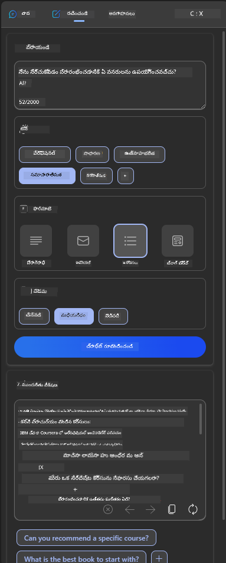
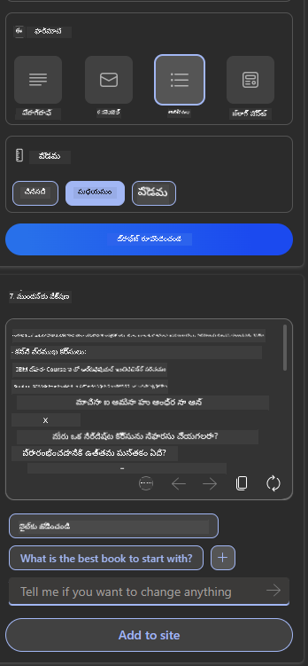

<!--
CO_OP_TRANSLATOR_METADATA:
{
  "original_hash": "78bbeed50fd4dc9fdee931f5daf98cb3",
  "translation_date": "2025-12-19T18:59:17+00:00",
  "source_file": "12-designing-ux-for-ai-applications/README.md",
  "language_code": "te"
}
-->
# AI అనువర్తనాల కోసం UX డిజైన్ చేయడం

> _(ఈ పాఠం వీడియోను చూడడానికి పై చిత్రాన్ని క్లిక్ చేయండి)_

యూజర్ అనుభవం అనేది యాప్‌లను నిర్మించడంలో చాలా ముఖ్యమైన అంశం. యూజర్లు మీ యాప్‌ను పనులను సమర్థవంతంగా నిర్వహించడానికి ఉపయోగించగలగాలి. సమర్థవంతంగా ఉండటం ఒక విషయం, కానీ మీరు యాప్‌లను అందరికీ ఉపయోగించదగినవిగా, అంటే _అందుబాటులో_ ఉండేలా డిజైన్ చేయాలి. ఈ అధ్యాయం ఈ ప్రాంతంపై దృష్టి సారిస్తుంది కాబట్టి మీరు ప్రజలు ఉపయోగించగలిగే మరియు ఉపయోగించాలనుకునే యాప్‌ను డిజైన్ చేయగలుగుతారు.

## పరిచయం

యూజర్ అనుభవం అనేది ఒక యూజర్ ఒక నిర్దిష్ట ఉత్పత్తి లేదా సేవతో ఎలా పరస్పరం చేస్తాడు మరియు ఉపయోగిస్తాడు, అది ఒక సిస్టమ్, సాధనం లేదా డిజైన్ కావచ్చు. AI అనువర్తనాలను అభివృద్ధి చేయడంలో, డెవలపర్లు యూజర్ అనుభవం సమర్థవంతంగా ఉండేలా కాకుండా నైతికంగా ఉండేలా కూడా దృష్టి సారిస్తారు. ఈ పాఠంలో, యూజర్ అవసరాలను తీర్చే ఆర్టిఫిషియల్ ఇంటెలిజెన్స్ (AI) అనువర్తనాలను ఎలా నిర్మించాలో చర్చిస్తాము.

ఈ పాఠం కింద పేర్కొన్న ప్రాంతాలను కవర్ చేస్తుంది:

- యూజర్ అనుభవం పరిచయం మరియు యూజర్ అవసరాలను అర్థం చేసుకోవడం
- నమ్మకం మరియు పారదర్శకత కోసం AI అనువర్తనాలను డిజైన్ చేయడం
- సహకారం మరియు అభిప్రాయం కోసం AI అనువర్తనాలను డిజైన్ చేయడం

## నేర్చుకునే లక్ష్యాలు

ఈ పాఠం తీసుకున్న తర్వాత, మీరు చేయగలుగుతారు:

- యూజర్ అవసరాలను తీర్చే AI అనువర్తనాలను ఎలా నిర్మించాలో అర్థం చేసుకోవడం.
- నమ్మకం మరియు సహకారాన్ని ప్రోత్సహించే AI అనువర్తనాలను డిజైన్ చేయడం.

### ముందస్తు అవసరం

కొంత సమయం తీసుకుని [యూజర్ అనుభవం మరియు డిజైన్ థింకింగ్ గురించి](https://learn.microsoft.com/training/modules/ux-design?WT.mc_id=academic-105485-koreyst) మరింత చదవండి.

## యూజర్ అనుభవం పరిచయం మరియు యూజర్ అవసరాలను అర్థం చేసుకోవడం

మన కల్పిత విద్యా స్టార్టప్‌లో, మనకు రెండు ప్రధాన యూజర్లు ఉన్నారు, ఉపాధ్యాయులు మరియు విద్యార్థులు. ఈ రెండు యూజర్లకు ప్రత్యేక అవసరాలు ఉన్నాయి. యూజర్-కేంద్రీకృత డిజైన్ యూజర్‌ను ప్రాధాన్యం ఇస్తుంది, ఉత్పత్తులు వాటి ఉద్దేశించిన వారికి సంబంధించి మరియు లాభదాయకంగా ఉండేలా చూసుకుంటుంది.

యాప్ **ఉపయోగకరమైన, నమ్మదగిన, అందుబాటులో ఉండే మరియు సంతోషకరమైన**దిగా ఉండాలి మంచి యూజర్ అనుభవం అందించడానికి.

### ఉపయోగకరత

ఉపయోగకరంగా ఉండటం అంటే యాప్ దాని ఉద్దేశించిన ప్రయోజనానికి సరిపోయే ఫంక్షనాలిటీ కలిగి ఉండటం, ఉదాహరణకు గ్రేడింగ్ ప్రక్రియను ఆటోమేటిక్ చేయడం లేదా పునఃసమీక్ష కోసం ఫ్లాష్‌కార్డులను సృష్టించడం. గ్రేడింగ్ ప్రక్రియను ఆటోమేటిక్ చేసే యాప్ ముందుగా నిర్వచించిన ప్రమాణాల ఆధారంగా విద్యార్థుల పనికి ఖచ్చితంగా మరియు సమర్థవంతంగా స్కోర్లు కేటాయించగలగాలి. అలాగే, పునఃసమీక్ష ఫ్లాష్‌కార్డులను సృష్టించే యాప్ దాని డేటా ఆధారంగా సంబంధిత మరియు విభిన్న ప్రశ్నలను సృష్టించగలగాలి.

### నమ్మదగినత

నమ్మదగినదిగా ఉండటం అంటే యాప్ తన పనిని నిరంతరం మరియు తప్పుల్లేకుండా చేయగలగడం. అయితే, AI కూడా మనుషుల్లా పరిపూర్ణం కాదు మరియు తప్పులు జరగవచ్చు. యాప్‌లు తప్పులు లేదా అనూహ్య పరిస్థితులను ఎదుర్కొనవచ్చు, ఇవి మానవ జోక్యం లేదా సవరణ అవసరం. మీరు తప్పులను ఎలా నిర్వహిస్తారు? ఈ పాఠం చివరి భాగంలో, AI సిస్టమ్స్ మరియు యాప్‌లు సహకారం మరియు అభిప్రాయం కోసం ఎలా డిజైన్ చేయబడ్డాయో చర్చిస్తాము.

### అందుబాటు

అందుబాటులో ఉండటం అంటే వివిధ సామర్థ్యాలున్న యూజర్లకు, దివ్యాంగుల సహా, యూజర్ అనుభవాన్ని విస్తరించడం, ఎవరూ బయటపడకుండా చూసుకోవడం. అందుబాటు మార్గదర్శకాలు మరియు సూత్రాలను అనుసరించడం ద్వారా, AI పరిష్కారాలు మరింత సమగ్రంగా, ఉపయోగకరంగా మరియు అన్ని యూజర్లకు లాభదాయకంగా మారతాయి.

### సంతోషకరం

సంతోషకరంగా ఉండటం అంటే యాప్ ఉపయోగించడానికి ఆనందదాయకంగా ఉండటం. ఆకర్షణీయమైన యూజర్ అనుభవం యూజర్‌పై సానుకూల ప్రభావం చూపుతుంది, వారు యాప్‌కు తిరిగి రావడానికి ప్రేరేపిస్తుంది మరియు వ్యాపార ఆదాయాన్ని పెంచుతుంది.

ప్రతి సవాలు AIతో పరిష్కరించలేము. AI మీ యూజర్ అనుభవాన్ని పెంపొందించడానికి వస్తుంది, అది మాన్యువల్ పనులను ఆటోమేటింగ్ చేయడం లేదా యూజర్ అనుభవాలను వ్యక్తిగతీకరించడం కావచ్చు.

## నమ్మకం మరియు పారదర్శకత కోసం AI అనువర్తనాలను డిజైన్ చేయడం

AI అనువర్తనాలను డిజైన్ చేయడంలో నమ్మకం నిర్మించడం అత్యంత ముఖ్యమైనది. నమ్మకం యూజర్ ఆ యాప్ పనిని పూర్తి చేస్తుందని, ఫలితాలను నిరంతరం అందిస్తుందని, మరియు ఫలితాలు యూజర్ అవసరాలకు సరిపోతాయని నమ్మకాన్ని కలిగిస్తుంది. ఈ ప్రాంతంలో ఒక ప్రమాదం మిస్ట్రస్ట్ మరియు ఓవర్‌ట్రస్ట్. మిస్ట్రస్ట్ అంటే యూజర్ AI సిస్టమ్‌పై తక్కువ లేదా ఎలాంటి నమ్మకమూ లేకపోవడం, ఇది యూజర్ మీ యాప్‌ను తిరస్కరించడానికి దారితీస్తుంది. ఓవర్‌ట్రస్ట్ అంటే యూజర్ AI సిస్టమ్ సామర్థ్యాన్ని అధికంగా అంచనా వేయడం, ఇది యూజర్లు AI సిస్టమ్‌పై ఎక్కువ నమ్మకం పెట్టుకోవడానికి దారితీస్తుంది. ఉదాహరణకు, ఆటోమేటెడ్ గ్రేడింగ్ సిస్టమ్‌లో ఓవర్‌ట్రస్ట్ ఉన్నప్పుడు ఉపాధ్యాయుడు కొన్ని పేపర్లను పరిశీలించకపోవచ్చు, ఇది విద్యార్థులకు అన్యాయమైన లేదా తప్పు గ్రేడ్‌లు రావడానికి లేదా అభిప్రాయం మరియు మెరుగుదల అవకాశాలు కోల్పోవడానికి కారణమవుతుంది.

నమ్మకాన్ని డిజైన్‌లో కేంద్రంలో ఉంచడానికి రెండు మార్గాలు ఉన్నాయి: వివరణాత్మకత మరియు నియంత్రణ.

### వివరణాత్మకత

AI భవిష్యత్తు తరాలకు జ్ఞానం అందించడంలో సహాయపడినప్పుడు, ఉపాధ్యాయులు మరియు తల్లిదండ్రులు AI నిర్ణయాలు ఎలా తీసుకుంటున్నాయో అర్థం చేసుకోవడం చాలా ముఖ్యం. దీన్ని వివరణాత్మకత అంటారు - AI అనువర్తనాలు ఎలా నిర్ణయాలు తీసుకుంటాయో అర్థం చేసుకోవడం. వివరణాత్మకత కోసం డిజైన్ చేయడం అంటే AI ఎలా ఫలితానికి చేరిందో వివరించే వివరాలను జోడించడం. ప్రేక్షకులు ఫలితం AI ద్వారా ఉత్పత్తి చేయబడిందని మరియు మనుష్యుడు కాదు అని తెలుసుకోవాలి. ఉదాహరణకు, "ఇప్పుడు మీ ట్యూటర్‌తో చాట్ చేయడం ప్రారంభించండి" అని చెప్పడం బదులు "మీ అవసరాలకు అనుగుణంగా మారే మరియు మీ వేగంతో నేర్చుకోవడంలో సహాయపడే AI ట్యూటర్‌ను ఉపయోగించండి" అని చెప్పండి.

మరొక ఉదాహరణ AI యూజర్ మరియు వ్యక్తిగత డేటాను ఎలా ఉపయోగిస్తుందో. ఉదాహరణకు, విద్యార్థి వ్యక్తిత్వం ఉన్న యూజర్‌కు వారి వ్యక్తిత్వం ఆధారంగా పరిమితులు ఉండవచ్చు. AI ప్రశ్నలకు సమాధానాలు వెల్లడించకపోవచ్చు కానీ యూజర్ సమస్యను ఎలా పరిష్కరించాలో ఆలోచించడానికి మార్గనిర్దేశం చేయవచ్చు.

వివరణాత్మకతలో చివరి ముఖ్య భాగం వివరణలను సరళీకరించడం. విద్యార్థులు మరియు ఉపాధ్యాయులు AI నిపుణులు కాకపోవచ్చు, కాబట్టి యాప్ చేయగలిగే లేదా చేయలేని విషయాల వివరణలు సరళమైనవి మరియు అర్థం చేసుకోవడానికి సులభమైనవి కావాలి.

### నియంత్రణ

జనరేటివ్ AI AI మరియు యూజర్ మధ్య సహకారాన్ని సృష్టిస్తుంది, ఉదాహరణకు యూజర్ వివిధ ఫలితాల కోసం ప్రాంప్ట్‌లను మార్చవచ్చు. అదనంగా, ఒకసారి ఫలితం ఉత్పత్తి అయిన తర్వాత, యూజర్లు ఫలితాలను మార్చగలగాలి, ఇది వారికి నియంత్రణ భావన ఇస్తుంది. ఉదాహరణకు, Bing ఉపయోగిస్తున్నప్పుడు, మీరు ఫార్మాట్, టోన్ మరియు పొడవు ఆధారంగా మీ ప్రాంప్ట్‌ను అనుకూలీకరించవచ్చు. అదనంగా, మీరు మీ ఫలితానికి మార్పులు జోడించి, ఫలితాన్ని మార్చవచ్చు, క్రింద చూపినట్లుగా:

Bingలో మరొక ఫీచర్ యూజర్‌కు యాప్‌పై నియంత్రణ కల్పిస్తుంది, అది AI ఉపయోగించే డేటాను ఆప్ట్-ఇన్ మరియు ఆప్ట్-అవుట్ చేయగల సామర్థ్యం. ఒక పాఠశాల యాప్‌లో, ఒక విద్యార్థి తన నోట్స్ మరియు ఉపాధ్యాయుల వనరులను పునఃసమీక్ష పదార్థంగా ఉపయోగించాలనుకోవచ్చు.

> AI అనువర్తనాలను డిజైన్ చేయడంలో, యూజర్లు దాని సామర్థ్యాలపై అధిక నమ్మకం పెట్టుకోకుండా, అసాధ్యమైన ఆశయాలను సృష్టించకుండా ఉండటం కోసం ఉద్దేశపూర్వకత కీలకం. దీని కోసం ఒక మార్గం ప్రాంప్ట్‌లు మరియు ఫలితాల మధ్య ఘర్షణ సృష్టించడం. యూజర్‌కు ఇది AI మాత్రమే, సహచర మనిషి కాదు అని గుర్తు చేయడం.

## సహకారం మరియు అభిప్రాయం కోసం AI అనువర్తనాలను డిజైన్ చేయడం

ముందుగా చెప్పినట్లుగా, జనరేటివ్ AI యూజర్ మరియు AI మధ్య సహకారాన్ని సృష్టిస్తుంది. ఎక్కువ భాగం యూజర్ ప్రాంప్ట్ ఇన్‌పుట్ చేసి AI ఫలితం ఉత్పత్తి చేయడం. ఫలితం తప్పు అయితే? యాప్ తప్పులు సంభవిస్తే ఎలా నిర్వహిస్తుంది? AI యూజర్‌ను తప్పు కోసం దోషారోపణ చేస్తుందా లేదా తప్పును వివరించడానికి సమయం తీసుకుంటుందా?

AI అనువర్తనాలు అభిప్రాయం అందుకోవడం మరియు ఇవ్వడం కోసం నిర్మించబడాలి. ఇది AI సిస్టమ్ మెరుగుపడటానికి మాత్రమే కాకుండా యూజర్లతో నమ్మకం పెంచడానికి కూడా సహాయపడుతుంది. డిజైన్‌లో అభిప్రాయం లూప్ ఉండాలి, ఉదాహరణకు ఫలితంపై సింపుల్ థంబ్స్ అప్ లేదా డౌన్.

ఇంకో మార్గం సిస్టమ్ సామర్థ్యాలు మరియు పరిమితులను స్పష్టంగా తెలియజేయడం. యూజర్ AI సామర్థ్యాలకు మించి ఏదైనా అభ్యర్థించినప్పుడు, దీన్ని నిర్వహించడానికి కూడా ఒక మార్గం ఉండాలి, క్రింద చూపినట్లుగా.

సిస్టమ్ తప్పులు సాధారణం, యూజర్ AI పరిధి వెలుపల సమాచారం కోసం సహాయం అవసరం కావచ్చు లేదా యాప్ యూజర్ ఎంత ప్రశ్నలు/విషయాల సారాంశాలు సృష్టించగలదో పరిమితి ఉండవచ్చు. ఉదాహరణకు, చరిత్ర మరియు గణితం వంటి పరిమిత విషయాల డేటాతో శిక్షణ పొందిన AI యాప్ భూగోళ శాస్త్రం గురించి ప్రశ్నలను నిర్వహించలేకపోవచ్చు. దీన్ని తగ్గించడానికి, AI సిస్టమ్ ఇలా స్పందించవచ్చు: "క్షమించండి, మా ఉత్పత్తి క్రింది విషయాల డేటాతో శిక్షణ పొందింది....., మీరు అడిగిన ప్రశ్నకు నేను సమాధానం ఇవ్వలేను."

AI అనువర్తనాలు పరిపూర్ణం కావు, కాబట్టి తప్పులు తప్పకుండా జరుగుతాయి. మీ అనువర్తనాలను డిజైన్ చేయడంలో, యూజర్ల నుండి అభిప్రాయం మరియు తప్పుల నిర్వహణ కోసం సులభంగా అర్థమయ్యే విధంగా గది సృష్టించాలి.

## అసైన్‌మెంట్

ఇప్పటివరకు మీరు నిర్మించిన ఏ AI యాప్ అయినా తీసుకుని, మీ యాప్‌లో క్రింది దశలను అమలు చేయాలని పరిగణించండి:

- **సంతోషకరం:** మీ యాప్‌ను మరింత సంతోషకరంగా ఎలా చేయగలరో పరిగణించండి. మీరు ఎక్కడైనా వివరణలు జోడిస్తున్నారా? మీరు యూజర్‌ను అన్వేషించడానికి ప్రోత్సహిస్తున్నారా? మీరు తప్పు సందేశాలను ఎలా వ్రాస్తున్నారు?

- **ఉపయోగకరత:** వెబ్ యాప్ నిర్మించడం. మీ యాప్ మౌస్ మరియు కీబోర్డ్ రెండింటితోనూ నావిగేట్ చేయదగినదిగా ఉండాలి.

- **నమ్మకం మరియు పారదర్శకత:** AI మరియు దాని ఫలితంపై పూర్తిగా నమ్మకముంచకండి, ఫలితాన్ని ధృవీకరించడానికి ఒక మనిషిని ప్రాసెస్‌లో ఎలా చేర్చాలో పరిగణించండి. అలాగే, నమ్మకం మరియు పారదర్శకత సాధించడానికి ఇతర మార్గాలను పరిగణించి అమలు చేయండి.

- **నియంత్రణ:** యూజర్ యాప్‌కు అందించే డేటాపై నియంత్రణ ఇవ్వండి. AI యాప్‌లో డేటా సేకరణకు యూజర్ ఆప్ట్-ఇన్ మరియు ఆప్ట్-అవుట్ చేయగల మార్గాన్ని అమలు చేయండి.

<!-- ## [Post-lecture quiz](../../../12-designing-ux-for-ai-applications/quiz-url) -->

## మీ నేర్చుకోవడాన్ని కొనసాగించండి!

ఈ పాఠం పూర్తి చేసిన తర్వాత, మా [జనరేటివ్ AI నేర్చుకునే సేకరణ](https://aka.ms/genai-collection?WT.mc_id=academic-105485-koreyst)ను చూడండి మరియు మీ జనరేటివ్ AI జ్ఞానాన్ని మరింత పెంపొందించుకోండి!

పాఠం 13కి వెళ్లండి, అక్కడ మనం [AI అనువర్తనాలను సురక్షితం చేయడం](../13-securing-ai-applications/README.md?WT.mc_id=academic-105485-koreyst) ఎలా చేయాలో చూడబోతున్నాం!

---

<!-- CO-OP TRANSLATOR DISCLAIMER START -->
**అస్పష్టత**:  
ఈ పత్రాన్ని AI అనువాద సేవ [Co-op Translator](https://github.com/Azure/co-op-translator) ఉపయోగించి అనువదించబడింది. మేము ఖచ్చితత్వానికి ప్రయత్నించినప్పటికీ, ఆటోమేటెడ్ అనువాదాల్లో పొరపాట్లు లేదా తప్పిదాలు ఉండవచ్చు. మూల పత్రం దాని స్వదేశీ భాషలో అధికారిక మూలంగా పరిగణించాలి. ముఖ్యమైన సమాచారానికి, ప్రొఫెషనల్ మానవ అనువాదం సిఫార్సు చేయబడుతుంది. ఈ అనువాదం వాడకంలో ఏర్పడిన ఏవైనా అపార్థాలు లేదా తప్పుదారితీసే అర్థాలు కోసం మేము బాధ్యత వహించము.
<!-- CO-OP TRANSLATOR DISCLAIMER END -->