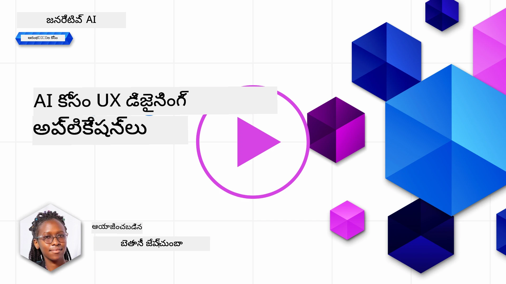
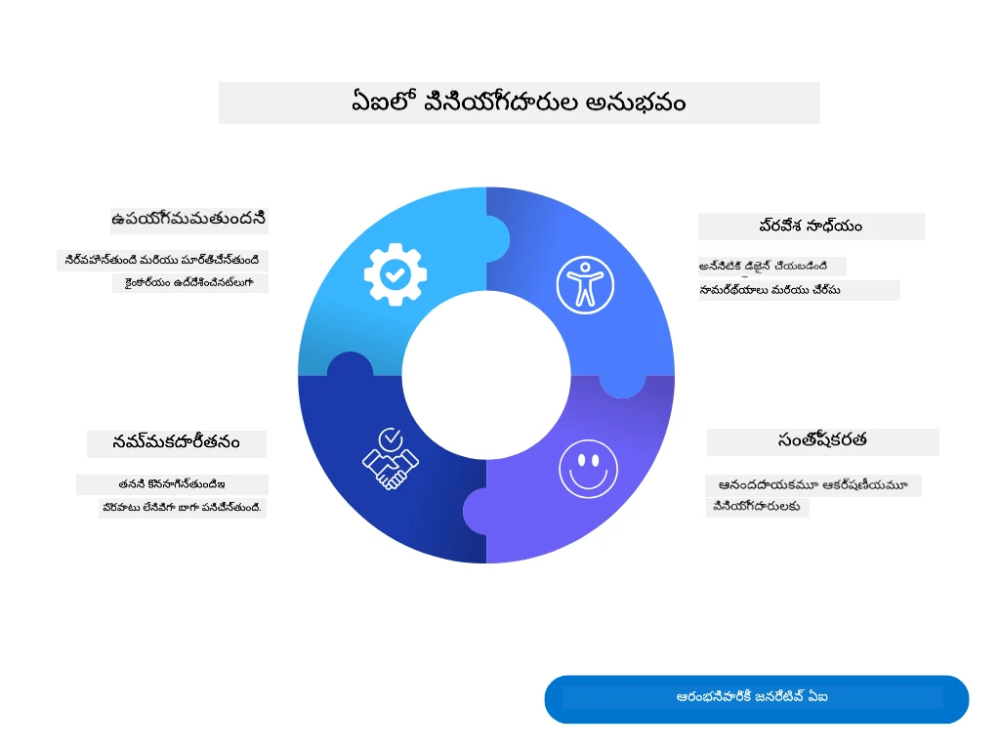
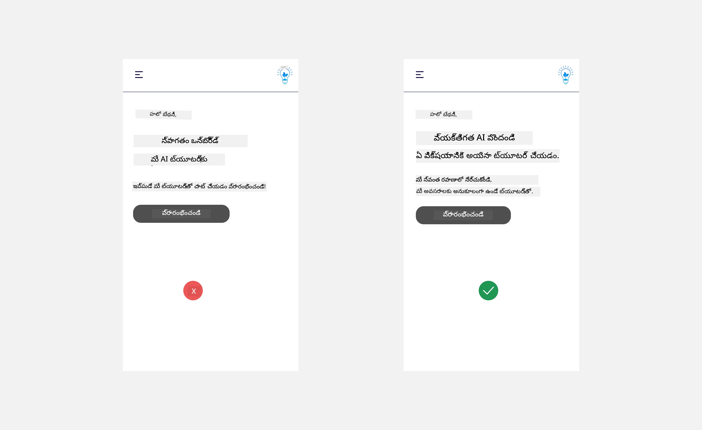
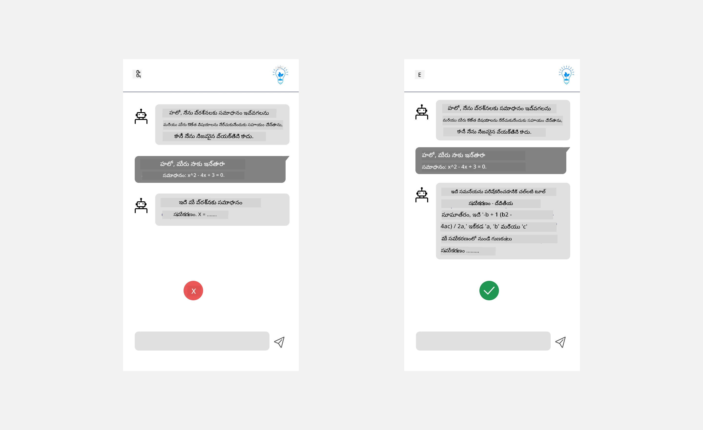
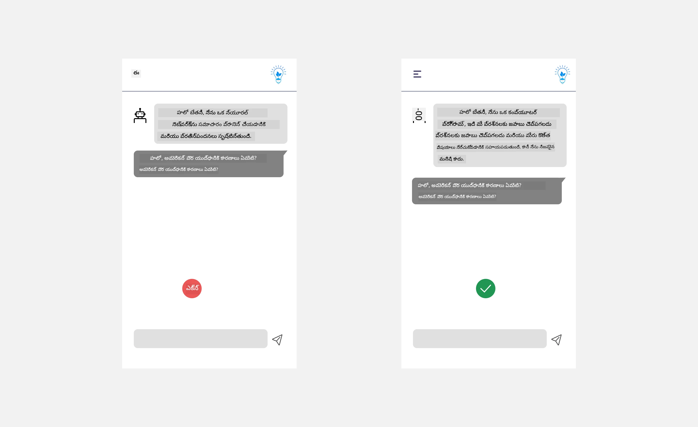
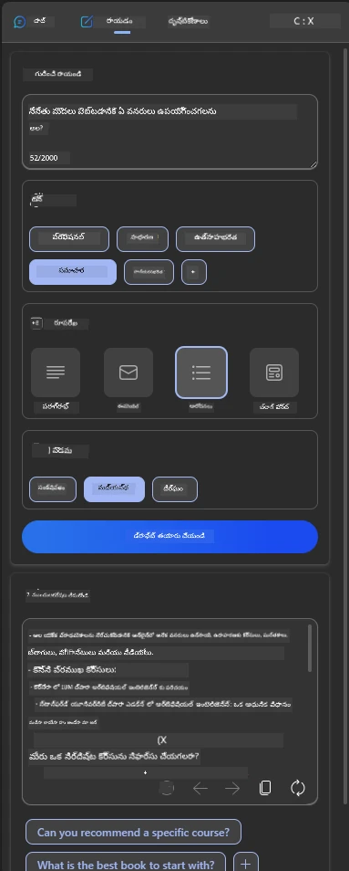
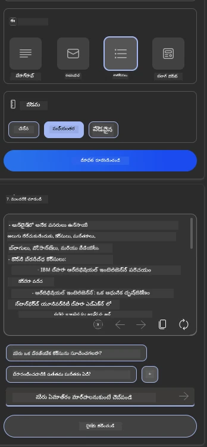
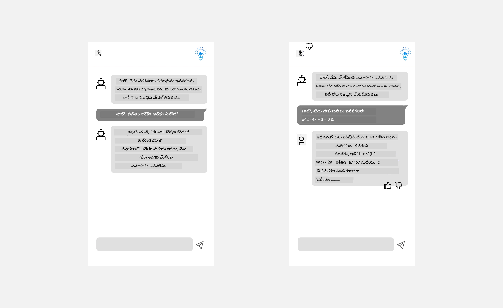

# AI అనువర్తనాల కోసం UX డిజైన్ చేయడం

> _(ఈ పాఠం వీడియోను వీక్షించడానికి పై చిత్రాన్ని క్లిక్ చేయండి)_

యూజర్ అనుభవం అనేది అనువర్తనాలను రూపొందించడంలో చాలా ముఖ్యమైన అంశం. వినియోగదారులు మీ అనువర్తనాన్ని సమర్థవంతంగా ఉపయోగించి పనులను నిర్వహించగలగాలి. సమర్థవంతంగా ఉండటం ఒక విషయం అయితే, అనువర్తనాలను అందరికీ ఉపయోగించదగినట్లు డిజైన్ చేయాల్సిన అవసరం కూడా ఉంది, దీన్ని _ఆక్సెస్‌తో చేయడం_ అని అంటారు. ఈ అధ్యాయము ఈ ప్రాంతాన్ని కేంద్రంగా తీసుకుని మీరు ప్రజలు ఉపయోగించాలని మరియు ఉపయోగించగలిగేలా ఒక అనువర్తనాన్ని డిజైన్ చెయ్యగలుగుతారని ఆశిస్తున్నాము.

## పరిచయం

యూజర్ అనుభవం అనేది ఒక యూజర్ ప్రత్యేకమైన ఉత్పత్తి లేదా సేవతో ఎలా పారదర్శకంగా వాడుతాడో సూచిస్తుంది, అది సిస్టమ్, సాధనం లేదా డిజైన్ కావచ్చు. AI అనువర్తనాలను అభివృద్ధి చేస్తున్నప్పుడు, అభివృద్ధిపరిచే వారు యూజర్ అనుభవం సమర్థవంతంగా ఉండటమే కాకుండా నైతికంగా కూడా ఉండేలా చూసుకుంటారు. ఈ పాఠంలో, యూజర్ అవసరాలను తీర్చగల కృత్రిమ మేధస్సు (AI) అనువర్తనాలు ఎలా రూపొందించాలో చూస్తాము.

ఈ పాఠం కింది అంశాలను ఆశించబోతుంది:

- యూజర్ అనుభవ పరిచయం మరియు యూజర్ అవసరాల అవగాహన
- నమ్మకం మరియు పారదర్శకత కోసం AI అనువర్తనాల డిజైన్
- సహకారం మరియు అభిప్రాయం కోసం AI అనువర్తనాల డిజైన్

## నేర్చుకునే లక్ష్యాలు

ఈ పాఠం పూర్తి చేసిన తర్వాత, మీరు చేయగలుగుతారు:

- యూజర్ అవసరాలను తీర్చే AI అనువర్తనాలు ఎలా నిర్మించాలో అర్థం చేసుకోండి.
- నమ్మకం మరియు సహకారం ప్రేరేపించే AI అనువర్తనాలను డిజైన్ చేయండి.

### మునుపు అవసరాలు

కొంత సమయాన్ని తీసుకుని [యూజర్ అనుభవం మరియు డిజైన్ తిలకణం గురించి](https://learn.microsoft.com/training/modules/ux-design?WT.mc_id=academic-105485-koreyst) మరింత చదవండి.

## యూజర్ అనుభవ పరిచయం మరియు యూజర్ అవసరాలను అర్థం చేసుకోవడం

మా కల్పిత విద్యా స్టార్ట్ అప్‌లో, మా రెండు ప్రధాన యూజర్లు, ఉపాధ్యాయులు మరియు విద్యార్థులు ఉన్నారు. ప్రతి ఒకరి ప్రత్యేకమైన అవసరాలు ఉంటాయి. యూజర్ కేంద్రీకృత డిజైన్ యూజర్‌ను ప్రాధాన్యం ఇస్తుంది, తద్వారా ఉత్పత్తులు వాటి ఉద్దేశించిన వారికి సంబంధించి మరియు ఉపయోగకరంగా ఉంటాయి.

అనువర్తనం **ఉపయోగకరమైన, నమ్మకమున్న, అందుబాటులో ఉన్న మరియు సుఖకరమైన**ది కావాల్సి ఉంటుంది, మంచి యూజర్ అనుభవం అందించడానికి.

### ఉపయోగకరత

ఉపయోగకరంగా ఉండడం అంటే అనువర్తనంలో దాని ఉద్దేశించిన ప్రయోజనంతో తగిన ఫంక్షనాలిటీ ఉండటం, ఉదాహరణకు గ్రేడింగ్ ప్రక్రియను ఆటోమేషన్ చేయడం లేదా రివిజన్ కోసం ఫ్లాష్ కార్డులను తయారుచేయడం. గ్రేడింగ్ ప్రక్రియని ఆటోమేటు చేసే అనువర్తనం ముందుగా నిర్ణయించిన ప్రమాణాల ఆధారంగా విద్యార్థుల పనులను తక్కువ తప్పులుతో సమర్థవంతంగా గణించగలగాలి. అలాగే, రివిజన్ ఫ్లాష్ కార్డులను తయారుచేసే అనువర్తనం సంబంధిత మరియు వివిధ ప్రశ్నలను దాని డేటాగా ఉపయోగించి సృష్టించగలగాలి.

### నమ్మకమున్నది

నమ్మకమున్నదని అంటే అనువర్తనం తన పనిని నిరంతరంగా తప్పులు లేకుండా చేయగలగడం. అయితే, AI కూడా మానుషుల్లాగా పూర్ణంగా ఉండదు మరియు తప్పులు జరుగవచ్చు. అనువర్తనాల్లో తప్పులు లేదా అనుకోని పరిస్థితులు చోటు చేసుకోవచ్చు, వాటికి మానవ సహాయం లేదా సవరణ అవసరం అవుతుంది. మీరు తప్పులను ఎలా నిర్వహిస్తారు? ఈ పాఠం చివరి భాగంలో, AI సిస్టమ్‌లు మరియు అనువర్తనాలు సహకారం మరియు అభిప్రాయం కోసం ఎలా రూపొందించబడతాయో చర్చించబడుతుంది.

### అందుబాటు

అందుబాటులో ఉండటం అంటే అనువర్తనాన్ని వివిధ సామర్ధ్యాల ఉన్న వినియోగదారులకి, ముక్తదిన అభివృద్ధి కలిగినవారుకుంటే వారిని కూడా అందుబాటులో ఉంచడం, ఒకరూ బయట కాకుండా చూసుకోవడం. అందుబాటు మార్గదర్శకాల మరియు సూత్రాలను పాటించడం ద్వారా, AI పరిష్కారాలు మరింత సమగ్రంగా, ఉపయోగకరంగా మరియు అన్ని యూజర్లకు ప్రయోజనకరంగా మారతాయి.

### సుకుమారంగా ఉండటం

సుకుమారంగా ఉండటం అంటే అనువర్తనం వాడటం సంతోషకరంగా ఉండటం. ఆకర్షణీయమైన యూజర్ అనుభవం యూజర్‌పై మంచి ప్రభావం కలిగించి వారు అనువర్తనాన్ని మళ్ళీ వాడడానికి ప్రోత్సహిస్తుంది మరియు వ్యాపార ఆదాయం పెరుగుతుంది.

ప్రతీ సమస్యను AIతోనే పరిష్కరించలేరు. AI మీ యూజర్ అనుభవాన్ని పెంచడానికి సహాయం చేస్తుంది, అవి చేతితో చేయాల్సిన పనులను ఆటోమేట్ చేయడం లేదా యూజర్ అనుభవాలను వ్యక్తిగతీకరించడం కావచ్చు.

## నమ్మకం మరియు పారదర్శకత కోసం AI అనువర్తనాల డిజైన్

AI అనువర్తనాలను డిజైన్ చేస్తునప్పుడు నమ్మకం నిర్మించడం అత్యంత ముఖ్యం. నమ్మకం అంటే యూజర్ అనువర్తనం పనిని పూర్తి చేస్తుందని, ఫలితాలు నిరంతరంగా వస్తాయని మరియు ఫలితాలు యూజర్ అవసరాలకు తగినవని విశ్వసించగలగడం. ఈ ప్రాంతంలో ప్రమాదం మిత్‌రస్ట్ (నమ్మక లోపం) మరియు ఓవర్‌ట్రస్ట్ (అధిక నమ్మకం). మిత్‌రస్ట్ అనేది యూజర్ AI సిస్టమ్‌పై నమ్మకం లేకపోవడం, దీని వల్ల యూజర్ మీ అనువర్తనాన్ని తిరస్కరిస్తాడు. ఓవర్‌ట్రస్ట్ అనేది యూజర్ AI సిస్టమ్ సామర్ధ్యాన్ని అధికంగా అంచనా వేయడం, దీని వల్ల యూజర్ AI ను ఎక్కువగా విశ్వసిస్తాడు. ఉదాహరణకు, ఆటోమేటెడ్ గ్రేడింగ్ సిస్టమ్‌పై ఓవర్‌ట్రస్ట్ ఉంటే ఉపాధ్యాయుడు కొన్ని పత్రాలను సమీక్షించకపోవచ్చు, తద్వారా విద్యార్థులకు అన్యాయమైన లేదా తప్పుడు గ్రేడ్‌లు వచ్చే అవకాశం ఉంటుంది, లేదా అభిప్రాయం మరియు మెరుగుదల అవకాశం కోల్పోవచ్చు.

నమ్మకాన్ని డిజైన్ కేంద్రంలో ఉంచడానికి రెండు మార్గాలు వివరణాత్మకత మరియు నియంత్రణ.

### వివరణాత్మకత

AI భవిష్యత్తు తరం కోసం జ్ఞానాన్ని అందించే నిర్ణయాలలో సహాయపడితే, ఉపాధ్యాయులు మరియు తల్లితండ్రులు AI నిర్ణయాలు ఎలా తీసుకుంటాయో అర్థం చేసుకోవటం అవసరం. దీన్ని వివరణాత్మకత అంటారు. వివరణాత్మకత కోసం డిజైన్ చేయడం అంటే AI ఎలా ఫలితానికి చేర కుంటున్నదో వివరాలను చేర్చడం. ప్రేక్షకులకు ఫలితం AI ద్వారా ఉత్పత్తి అయిందని తెలియాలి, ఇది మానవునిచేత కాదు. ఉదాహరణకి "ఇప్పుడు మీ ట్యూటర్‌తో చాట్ ప్రారంభించండి" అన్నదానికి బదులు "మీ అవసరాలకు సరిపోయే మరియు మీ వేగానికి అనుగుణంగా అభ్యసన సహాయం చేసే AI ట్యూటర్ ఉపయోగించండి" అని చెప్పడం.

మరో ఉదాహరణ AI ఎలా యూజర్ మరియు వ్యక్తిగత డేటాను ఉపయోగిస్తుందో. ఉదాహరణకి, విద్యార్థి వ్యక్తిత్వంతో ఉన్న యూజర్ persona ఆ persona ఆధారంగా పరిమితులు ఉంటాయి. AI ప్రశ్నలకు సమాధానాలు ఇవ్వలేరు కానీ సమస్యను ఎలా పరిష్కరించాలో యూజర్ ఆలోచించేందుకు మార్గదర్శనం చేయవచ్చు.

వివరణాత్మకతలో చివరి కీలక భాగం యది వివరణలను సరళీకృతం చేయడం. విద్యార్థులు మరియు ఉపాధ్యాయులు AI నిపుణులు కాకపోవచ్చు, కాబట్టి అనువర్తనం ఏమి చేయగలదో లేదా చేయలేదో వివరించడం సరళంగా మరియు సులభంగా అర్థం అయ్యేటట్లుగా ఉండాలి.

### నియంత్రణ

జనరేటివ్ AI AI మరియు యూజర్ మధ్య సహకారాన్ని సృష్టిస్తుంది, ఉదాహరణకి యూజర్ వేర్వేరు ఫలితాలకు ప్రాంప్ట్స్ మార్చవచ్చు. అదనంగా, ఒకసారి ఫలితం ఉత్పత్తి అయిన తర్వాత, యూజర్లు ఫలితాలను సవరించగలగాలి, ఇది వారికి నియంత్రణ భావన ఇస్తుంది. ఉదాహరణకు, Microsoft Copilot (మునుపటి Bing Chat) ఉపయోగించినప్పుడు, మీరు ఫార్మాట్, టోన్ మరియు పొడవు ఆధారంగా మీ ప్రాంప్ట్‌ను సవరించవచ్చు. అదనంగా, మీరు మీ ఫలితాల్లో మార్పులు చేర్చి దిగువ న విధంగా మార్చవచ్చు:

Microsoft Copilot లో మరొక ఫీచర్ యూజర్‌కు అనువర్తనం పై నియంత్రణ ఇచ్చేది డేటాను AI వాడే విషయములో ఒప్పుకోవడం లేదా ఒప్పుకోకపోవడం. ఒక పాఠశాల అనువర్తనంలో, ఒక విద్యార్థి తన గమనికలు మరియు ఉపాధ్యాయుల వనరులను రివిజన్ మెటీరియల్‌గా ఉపయోగించాలని కోరవచ్చు.

> AI అనువర్తనాలను డిజైన్ చేస్తున్నప్పుడు, యూజర్లు అదనపు నమ్మకం పెట్టకుండ ఉండేందుకు, దాని సామర్ధ్యాలపై నిజమైన ఆశలతో ఉండేందుకు ఉద్దేశపూర్వకత ముఖ్యం. దీని కోసం ఒక మార్గం ప్రాంప్ట్‌లు మరియు ఫలితాల మధ్య frictions సృష్టించడం. యూజర్‌కు ఇది AI మాత్రమే మరియు సహచర మానవుడు కాదని గుర్తుచేయడం.

## సహకారం మరియు అభిప్రాయం కోసం AI అనువర్తనాల డిజైన్

ముందు చెప్పినట్లుగా, జనరేటివ్ AI యూజర్ మరియు AI మధ్య సహకారాన్ని సృష్టిస్తుంది. ఎక్కువ కేసుల్లో యూజర్ ఒక ప్రాంప్ట్ ఇస్తాడు, AI ఫలితాన్ని రూపొందిస్తుంది. ఫలితం తప్పు అయితే ఎలా? అనువర్తనం తప్పులు వచ్చినప్పుడు ఎలా నిర్వహిస్తుంది? AI యూజర్‌ను తప్పు అడుగుతుందా లేక తప్పును వివరించడానికి సమయం తీసుకుంటుందా?

AI అనువర్తనాలు అభిప్రాయం తీసుకోవడానికి మరియు ఇవ్వడానికి నిర్మించబడాలి. ఇది AI సిస్టమ్ మెరుగుదలకు సహాయపడితేనే కాకుండా, యూజర్లతో నమ్మకాన్ని కూడా నిర్మిస్తుంది. అభిప్రాయం లూప్ డిజైన్‌లో భాగంగా ఉండాలి, ఉదాహరణకి ఫలితమిప్పటికే సింపుల్‌గా అంగుళి ఎగువ లేదా దిగువ ఇవ్వడం.

మరో మార్గం సిస్టమ్ సామర్ధ్యాలు మరియు పరిమితులను స్పష్టంగా తెలియజేయడం. యూజర్ AI సామర్ధ్యాల కంటే మించి ఏదైనా అభ్యర్థించినప్పుడు, దీన్ని ఎలా నిర్వహించాలో కూడా ఉండాలి, కింద చూపిన విధంగా.

సిస్టమ్ తప్పులు సాధారణం, ఇక్కడ యూజర్ AI పరిధి వెలుపల సమాచారం సహాయం కోరవలసిన పరిస్థితులు ఉండవచ్చు లేదా అనువర్తనం ఒక యూజర్ కి ఎంత ప్రశ్నలను లేదా విషయాలను సరాంశాలుగా తయారుచేయగలదో పరిమితి ఉండొచ్చు. ఉదాహరణకి, చరిత్ర మరియు గణితం విషయాలనే ఆధారంగా శిక్షణ పొందిన AI అనువర్తనం భౌగోళిక విషయాలపై ప్రశ్నలకి సమాధానం ఇవ్వలేకపోవచ్చు. దీన్ని తట్టుకోవడానికి AI సిస్టమ్ ఇలా స్పందించవచ్చు: "క్షమించండి, మా ఉత్పత్తి ఈ క్రింది విషయాలపై శిక్షణ పొందింది....., మీరు అడిగిన ప్రశ్నకు నేను సమాధానం ఇవ్వలేను."

AI అనువర్తనాలు పూర్ణంగా ఉండవు, అందుకే తప్పులు చేయడం ఖాయం. మీ అనువర్తనాలను డిజైన్ చేస్తున్నప్పుడు, యూజర్ల నుండి అభిప్రాయం కోసం అవకాశాన్ని మరియు తప్పుల నిర్వహణను సులభంగా వివరించే విధంగా కలుపుకోవాలి.

## అసైన్‌మెంట్

మీరు ఇప్పటివరకు నిర్మించిన ఏ AI అనువర్తనాన్ని తీసుకుని, కింది దశలను మీ అనువర్తనంలో అమలు చేయడం గురించి ఆలోచించండి:

- **సుకుమారత:** మీ అనువర్తనం మరింత సుఖదాయకంగా ఎలా చేయగలరు? మీరు ఎక్కడన్నా వివరణలు చేర్చుతున్నారా? యూజర్‌ను అన్వేషించమని ప్రోత్సహిస్తున్నారా? తప్పు సందేశాలను ఎలా రచిస్తున్నారు?

- **ఉపయోగకరత:** ఒక వెబ్ అనువర్తనం తయారు చేస్తూ ఉన్నా, మీ అనువర్తనం మౌస్ మరియు కీబోర్డ్ రెండింటితో కూడా నావిగేట్ చేయగలగాలి.

- **నమ్మకం మరియు పారదర్శకత:** AI మరియు దాని ఫలితంపై పూర్తిగా నమ్మకంగా ఉండకండి, ఫలితాలు సరైనవేనా అని నిర్దారించుకోడానికి ప్రాసెస్‌లో మనుష్యుడిని చేర్చే విధానాన్ని ఆలోచించండి. అలాగే, నమ్మకం మరియు పారదర్శకత సాధించడానికి ఇతర మార్గాలను ఆలోచించి అమలు చేయండి.

- **నియంత్రణ:** యూజర్ అనువర్తనాన్ని ఇచ్చే డేటాపై నియంత్రణ కల్పించండి. AI అనువర్తనంలో డేటా సేకరణకు యూజర్ ఒప్పుకోవడం లేదా ఒప్పుకోకపోవడం కోసం మార్గాన్ని అమలు చేయండి.

<!-- ## [Post-lecture quiz](../../../12-designing-ux-for-ai-applications/quiz-url) -->

## మీ బోధన కొనసాగించండి!

ఈ పాఠం పూర్తయిన తర్వాత, మన [జనరేటివ్ AI నేర్చుకునే సేకరణ](https://aka.ms/genai-collection?WT.mc_id=academic-105485-koreyst) చూడండి, మీ జనరేటివ్ AI పరిజ్ఞానాన్ని మరింత పెంపొందించుకోండి!

తరువాతి పాఠం 13కి వెళ్లండి, అక్కడ మనం [AI అనువర్తనాలను భద్రపరిచే విధానాల గురించి](../13-securing-ai-applications/README.md?WT.mc_id=academic-105485-koreyst) చూస్తాము!

---

<!-- CO-OP TRANSLATOR DISCLAIMER START -->
**అస్వీకరణ**:
ఈ పత్రం AI అనువాద సేవ [Co-op Translator](https://github.com/Azure/co-op-translator) ఉపయోగించి అనువదించబడింది. మేము ఖచ్చితత్వానికి ప్రయత్నిస్తున్నప్పటికీ, ఆటోమేటెడ్ అనువాదాలు తప్పులు లేదా అసమగ్రతలను కలిగి ఉండవచ్చు. దాని స్వదేశ భాషలో ఉన్న అసలు పత్రాన్ని అధికారం కలిగిన మూలంగా పరిగణించాలి. కీలకమైన సమాచారం కోసం, ప్రొఫెషనల్ మానవ అనువాదాన్ని సిఫారసు చేస్తాము. ఈ అనువాదం ఉపయోగం వల్ల కలిగే ఏవైనా అపార్థాలు లేదా తప్పుదారులు కోసం మేము బాధ్యత వహించము.
<!-- CO-OP TRANSLATOR DISCLAIMER END -->