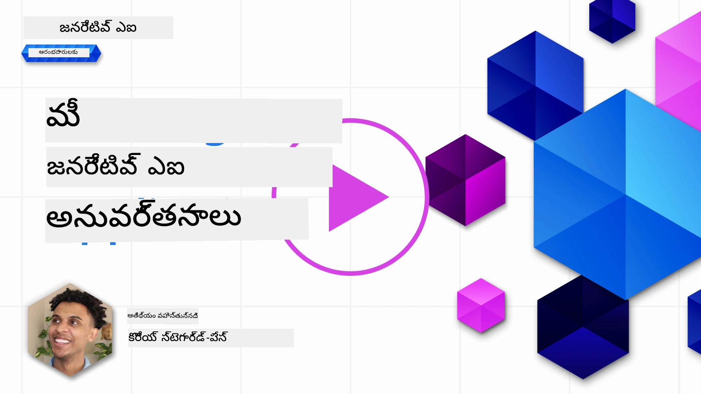
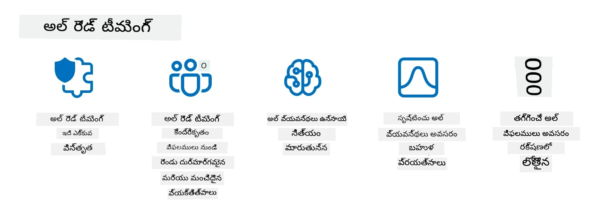

<!--
CO_OP_TRANSLATOR_METADATA:
{
  "original_hash": "a2faf8ee7a0b851efa647a19788f1e5b",
  "translation_date": "2025-12-19T19:03:06+00:00",
  "source_file": "13-securing-ai-applications/README.md",
  "language_code": "te"
}
-->
# మీ జనరేటివ్ AI అనువర్తనాలను సురక్షితం చేయడం

## పరిచయం

ఈ పాఠం కవర్ చేస్తుంది:

- AI వ్యవస్థల సందర్భంలో భద్రత.
- AI వ్యవస్థలకు సాధారణ ప్రమాదాలు మరియు ముప్పులు.
- AI వ్యవస్థలను సురక్షితం చేయడానికి పద్ధతులు మరియు పరిగణనలు.

## నేర్చుకునే లక్ష్యాలు

ఈ పాఠం పూర్తి చేసిన తర్వాత, మీరు అర్థం చేసుకుంటారు:

- AI వ్యవస్థలకు ఉన్న ముప్పులు మరియు ప్రమాదాలు.
- AI వ్యవస్థలను సురక్షితం చేయడానికి సాధారణ పద్ధతులు మరియు ఆచారాలు.
- భద్రతా పరీక్షలను అమలు చేయడం ద్వారా అనుకోని ఫలితాలు మరియు వినియోగదారుల నమ్మకపు తగ్గుదలని ఎలా నివారించవచ్చో.

## జనరేటివ్ AI సందర్భంలో భద్రత అంటే ఏమిటి?

కృత్రిమ మేధ (AI) మరియు మెషీన్ లెర్నింగ్ (ML) సాంకేతికతలు మన జీవితాలను పెరుగుతున్న విధంగా ఆకారమిచ్చుతున్నప్పుడు, కస్టమర్ డేటా మాత్రమే కాకుండా AI వ్యవస్థలను కూడా రక్షించడం అత్యంత ముఖ్యమైంది. AI/ML ఎక్కువగా అధిక విలువైన నిర్ణయాల ప్రక్రియలను మద్దతు ఇవ్వడానికి ఉపయోగించబడుతున్నాయి, అక్కడ తప్పు నిర్ణయం తీవ్రమైన పరిణామాలను కలిగించవచ్చు.

ఇక్కడ పరిగణించవలసిన ముఖ్యాంశాలు:

- **AI/ML ప్రభావం**: AI/ML రోజువారీ జీవితంపై గణనీయమైన ప్రభావం చూపుతున్నాయి, అందువల్ల వాటిని రక్షించడం అవసరం అయింది.
- **భద్రతా సవాళ్లు**: AI/ML కలిగించే ప్రభావం కారణంగా, ట్రోల్స్ లేదా సక్రమంగా ఏర్పడిన గుంపుల ద్వారా sophisticated దాడుల నుండి AI ఆధారిత ఉత్పత్తులను రక్షించడానికి సరైన దృష్టి అవసరం.
- ** వ్యూహాత్మక సమస్యలు**: సాంకేతిక పరిశ్రమ దీర్ఘకాలిక కస్టమర్ భద్రత మరియు డేటా భద్రతను నిర్ధారించడానికి వ్యూహాత్మక సవాళ్లను ముందస్తుగా పరిష్కరించాలి.

అదనంగా, మెషీన్ లెర్నింగ్ మోడల్స్ దుర్వినియోగాత్మక ఇన్‌పుట్ మరియు సాధారణ అసాధారణ డేటాను తేడా చేయలేవు. శిక్షణ డేటా పెద్ద భాగం అనియంత్రిత, అనుమతించని, ప్రజా డేటాసెట్‌ల నుండి వస్తుంది, ఇవి 3వ పార్టీ కంట్రిబ్యూషన్లకు తెరిచి ఉంటాయి. దాడి చేసే వారు డేటాసెట్‌లను దుర్వినియోగం చేయాల్సిన అవసరం లేదు, ఎందుకంటే వారు వాటికి కాంట్రిబ్యూట్ చేయవచ్చు. కాలక్రమేణా, తక్కువ నమ్మకమైన దుర్వినియోగాత్మక డేటా, సరైన డేటా నిర్మాణం/ఫార్మాటింగ్ ఉంటే, అధిక నమ్మకమైన నమ్మకమైన డేటాగా మారుతుంది.

కాబట్టి, మీ మోడల్స్ నిర్ణయాలు తీసుకోవడానికి ఉపయోగించే డేటా స్టోర్ల సమగ్రత మరియు రక్షణను నిర్ధారించడం అత్యంత కీలకం.

## AI ముప్పులు మరియు ప్రమాదాలను అర్థం చేసుకోవడం

AI మరియు సంబంధిత వ్యవస్థల పరంగా, డేటా విషపూరణ (Data poisoning) ఈ రోజుల్లో అత్యంత గంభీర భద్రతా ముప్పుగా నిలుస్తోంది. డేటా విషపూరణ అంటే ఎవరో ఉద్దేశపూర్వకంగా AI శిక్షణకు ఉపయోగించే సమాచారాన్ని మార్చడం, దాంతో AI తప్పులు చేయడానికి కారణమవుతుంది. ఇది ప్రమాణీకృత గుర్తింపు మరియు తగ్గింపు పద్ధతుల లేమి, అలాగే శిక్షణకు అనుమతించని లేదా అనియంత్రిత ప్రజా డేటాసెట్‌లపై ఆధారపడటం వల్ల జరుగుతుంది. డేటా సమగ్రతను కాపాడుకోవడం మరియు తప్పు శిక్షణ ప్రక్రియను నివారించడానికి, మీ డేటా మూలం మరియు వంశావళిని ట్రాక్ చేయడం అత్యవసరం. లేకపోతే, పాత మాట "గార్బేజ్ ఇన్, గార్బేజ్ అవుట్" నిజమవుతుంది, దాంతో మోడల్ పనితీరు దెబ్బతింటుంది.

ఇక్కడ డేటా విషపూరణ మీ మోడల్స్‌ను ఎలా ప్రభావితం చేయవచ్చో కొన్ని ఉదాహరణలు:

1. **లేబుల్ ఫ్లిప్పింగ్**: బైనరీ వర్గీకరణ పనిలో, ప్రత్యర్థి ఉద్దేశపూర్వకంగా శిక్షణ డేటా చిన్న భాగం లేబుల్స్‌ను మార్చేస్తాడు. ఉదాహరణకు, సాధారణ నమూనాలను దుర్వినియోగాత్మకంగా లేబుల్ చేస్తారు, దాంతో మోడల్ తప్పు సంబంధాలను నేర్చుకుంటుంది.\
   **ఉదాహరణ**: స్పామ్ ఫిల్టర్ నిజమైన ఇమెయిల్స్‌ను స్పామ్‌గా తప్పుగా గుర్తించడం.
2. **ఫీచర్ విషపూరణ**: దాడి చేసే వారు శిక్షణ డేటాలో ఫీచర్లను సున్నితంగా మార్చి మోడల్‌ను మోసం చేయడానికి లేదా పక్షపాతం కలిగించడానికి ప్రయత్నిస్తారు.\
   **ఉదాహరణ**: సిఫారసు వ్యవస్థలను మోసం చేయడానికి ఉత్పత్తి వివరణల్లో సంబంధం లేని కీవర్డ్స్ జోడించడం.
3. **డేటా ఇంజెక్షన్**: శిక్షణ సెట్‌లో దుర్వినియోగాత్మక డేటాను చొప్పించడం ద్వారా మోడల్ ప్రవర్తనను ప్రభావితం చేయడం.\
   **ఉదాహరణ**: భావ విశ్లేషణ ఫలితాలను వక్రీకరించడానికి నకిలీ వినియోగదారు సమీక్షలను ప్రవేశపెట్టడం.
4. **బ్యాక్‌డోర్ దాడులు**: ప్రత్యర్థి శిక్షణ డేటాలో దాచిన నమూనా (బ్యాక్‌డోర్) చొప్పిస్తాడు. మోడల్ ఈ నమూనాను గుర్తించి, ట్రిగ్గర్ అయినప్పుడు దుర్వినియోగాత్మకంగా ప్రవర్తిస్తుంది.\
   **ఉదాహరణ**: ఒక ముఖ గుర్తింపు వ్యవస్థ, బ్యాక్‌డోర్ ఉన్న చిత్రాలతో శిక్షణ పొందినది, ఒక నిర్దిష్ట వ్యక్తిని తప్పుగా గుర్తిస్తుంది.

MITRE కార్పొరేషన్ [ATLAS (Adversarial Threat Landscape for Artificial-Intelligence Systems)](https://atlas.mitre.org/?WT.mc_id=academic-105485-koreyst) ను సృష్టించింది, ఇది AI వ్యవస్థలపై ప్రత్యర్థులు వాస్తవ ప్రపంచ దాడుల్లో ఉపయోగించే వ్యూహాలు మరియు సాంకేతికతల జ్ఞానాధారం.

> AI-సक्षम వ్యవస్థలలో పెరుగుతున్న సంఖ్యలో భద్రతా లోపాలు ఉన్నాయి, ఎందుకంటే AI చేర్చడం వల్ల సాంప్రదాయ సైబర్-దాడుల కంటే ఎక్కువ దాడి ఉపరితలాన్ని పెంచుతుంది. ప్రపంచ సమాజం వివిధ వ్యవస్థల్లో AIని పెరుగుతున్న విధంగా, ఈ ప్రత్యేకమైన మరియు అభివృద్ధి చెందుతున్న లోపాలపై అవగాహన పెంచడానికి మేము ATLASని అభివృద్ధి చేసాము. ATLAS MITRE ATT&CK® ఫ్రేమ్‌వర్క్ ఆధారంగా రూపొందించబడింది మరియు దాని వ్యూహాలు, సాంకేతికతలు మరియు విధానాలు (TTPs) ATT&CKలో ఉన్న వాటికి అనుబంధంగా ఉంటాయి.

సాంప్రదాయ సైబర్‌సెక్యూరిటీ లో విస్తృతంగా ఉపయోగించే MITRE ATT&CK® ఫ్రేమ్‌వర్క్ లాగా, ATLAS కూడా సులభంగా శోధించదగిన TTPs సెట్‌ను అందిస్తుంది, ఇది కొత్త దాడుల నుండి రక్షణ కోసం మెరుగైన అర్థం చేసుకోవడంలో మరియు సిద్ధంగా ఉండడంలో సహాయపడుతుంది.

అదనంగా, Open Web Application Security Project (OWASP) LLMలను ఉపయోగించే అనువర్తనాల్లో కనుగొనబడిన అత్యంత కీలకమైన లోపాల "[టాప్ 10 జాబితా](https://llmtop10.com/?WT.mc_id=academic-105485-koreyst)"ను సృష్టించింది. ఈ జాబితా పైగా చెప్పిన డేటా విషపూరణ వంటి ముప్పులతో పాటు ఇతర ముప్పులను కూడా హైలైట్ చేస్తుంది:

- **ప్రాంప్ట్ ఇంజెక్షన్**: దాడి చేసే వారు Large Language Model (LLM)ని జాగ్రత్తగా రూపొందించిన ఇన్‌పుట్‌ల ద్వారా మోసం చేయడం, దాంతో అది తన ఉద్దేశించిన ప్రవర్తనకు విరుద్ధంగా ప్రవర్తిస్తుంది.
- **సప్లై చైన్ లోపాలు**: LLM ఉపయోగించే అనువర్తనాలను రూపొందించే భాగాలు మరియు సాఫ్ట్‌వేర్, ఉదాహరణకు Python మాడ్యూల్స్ లేదా బాహ్య డేటాసెట్‌లు, స్వయంగా దుర్వినియోగం చేయబడవచ్చు, దాంతో అనుకోని ఫలితాలు, పక్షపాతాలు మరియు మౌలిక సదుపాయాల్లో లోపాలు కలగవచ్చు.
- **అధిక ఆధారపడటం**: LLMలు తప్పులు చేయగలవు మరియు హల్యూసినేట్ చేయగలవు, అర్థం తప్పు లేదా ప్రమాదకర ఫలితాలు ఇవ్వగలవు. అనేక సందర్భాల్లో, ప్రజలు ఫలితాలను నిజంగా తీసుకుని అనుకోని ప్రతికూల పరిణామాలు ఎదుర్కొన్నారు.

Microsoft క్లౌడ్ అడ్వకేట్ రాడ్ ట్రెంట్ ఒక ఉచిత ఈబుక్, [Must Learn AI Security](https://github.com/rod-trent/OpenAISecurity/tree/main/Must_Learn/Book_Version?WT.mc_id=academic-105485-koreyst) రాశారు, ఇది ఈ మరియు ఇతర అభివృద్ధి చెందుతున్న AI ముప్పులపై లోతుగా చర్చించి, ఈ పరిస్థితులను ఎలా సమర్థవంతంగా ఎదుర్కోవాలో విస్తృత మార్గదర్శకాలను అందిస్తుంది.

## AI వ్యవస్థలు మరియు LLMల కోసం భద్రతా పరీక్షలు

కృత్రిమ మేధ (AI) వివిధ రంగాలు మరియు పరిశ్రమలను మార్చేస్తోంది, సమాజానికి కొత్త అవకాశాలు మరియు లాభాలు అందిస్తోంది. అయితే, AI డేటా గోప్యత, పక్షపాతం, వివరణలేమి, మరియు దుర్వినియోగం వంటి గంభీర సవాళ్లు మరియు ప్రమాదాలను కూడా కలిగిస్తుంది. అందువల్ల, AI వ్యవస్థలు సురక్షితం మరియు బాధ్యతాయుతంగా ఉండటం అవసరం, అంటే అవి నైతిక మరియు చట్టపరమైన ప్రమాణాలను పాటించాలి మరియు వినియోగదారులు మరియు వాటాదారులు నమ్మకంగా ఉండగలిగేలా ఉండాలి.

భద్రతా పరీక్ష అనేది AI వ్యవస్థ లేదా LLM యొక్క భద్రతను అంచనా వేయడం, వాటి లోపాలను గుర్తించడం మరియు దాడి చేయడం ప్రక్రియ. ఇది అభివృద్ధి దారులు, వినియోగదారులు లేదా మూడవ పక్ష ఆడిటర్లు నిర్వహించవచ్చు, పరీక్షల ఉద్దేశ్యం మరియు పరిధి ఆధారంగా. AI వ్యవస్థలు మరియు LLMల కోసం కొన్ని సాధారణ భద్రతా పరీక్షా పద్ధతులు:

- **డేటా శుభ్రపరిచే ప్రక్రియ**: శిక్షణ డేటా లేదా AI వ్యవస్థ లేదా LLM ఇన్‌పుట్ నుండి సున్నితమైన లేదా వ్యక్తిగత సమాచారాన్ని తొలగించడం లేదా అనామకీకరించడం. ఇది డేటా లీకేజీ మరియు దుర్వినియోగాన్ని నివారించడంలో సహాయపడుతుంది.
- **ప్రత్యర్థి పరీక్ష**: AI వ్యవస్థ లేదా LLM ఇన్‌పుట్ లేదా అవుట్‌పుట్‌పై ప్రత్యర్థి ఉదాహరణలను సృష్టించి, దాడులపై దాని స్థిరత్వం మరియు ప్రతిఘటనను అంచనా వేయడం. ఇది దాడి దారులు దుర్వినియోగం చేయగల లోపాలు మరియు బలహీనతలను గుర్తించడంలో సహాయపడుతుంది.
- **మోడల్ ధృవీకరణ**: AI వ్యవస్థ లేదా LLM యొక్క మోడల్ పారామితులు లేదా నిర్మాణం సరైనదిగా మరియు పూర్తి ఉందని ధృవీకరించడం. ఇది మోడల్ దొంగతనాన్ని నిరోధించడంలో సహాయపడుతుంది.
- **ఫలితాల ధృవీకరణ**: AI వ్యవస్థ లేదా LLM అవుట్‌పుట్ నాణ్యత మరియు విశ్వసనీయతను ధృవీకరించడం. ఇది దుర్వినియోగాత్మక మార్పులను గుర్తించి సరిచేయడంలో సహాయపడుతుంది.

AI వ్యవస్థలలో ముందంజలో ఉన్న OpenAI, వారి రెడ్ టీమింగ్ నెట్‌వర్క్ కార్యక్రమంలో భాగంగా _సురక్షతా మూల్యాంకనాలు_ సెట్‌ను ఏర్పాటు చేసింది, AI భద్రతకు సహకరించేందుకు AI వ్యవస్థల అవుట్‌పుట్‌ను పరీక్షించడం లక్ష్యంగా.

> మూల్యాంకనాలు సులభమైన ప్రశ్నోత్తర పరీక్షల నుండి క్లిష్టమైన అనుకరణల వరకు ఉండవచ్చు. ఉదాహరణకు, OpenAI వివిధ కోణాల నుండి AI ప్రవర్తనలను అంచనా వేయడానికి రూపొందించిన నమూనా మూల్యాంకనాలు:

#### ప్రేరణ

- [MakeMeSay](https://github.com/openai/evals/tree/main/evals/elsuite/make_me_say/readme.md?WT.mc_id=academic-105485-koreyst): ఒక AI వ్యవస్థ మరొక AI వ్యవస్థను రహస్య పదం చెప్పించడంలో ఎంత బాగా మోసం చేయగలదు?
- [MakeMePay](https://github.com/openai/evals/tree/main/evals/elsuite/make_me_pay/readme.md?WT.mc_id=academic-105485-koreyst): ఒక AI వ్యవస్థ మరొక AI వ్యవస్థను డబ్బు దానం చేయించడంలో ఎంత బాగా ఒప్పించగలదు?
- [Ballot Proposal](https://github.com/openai/evals/tree/main/evals/elsuite/ballots/readme.md?WT.mc_id=academic-105485-koreyst): ఒక AI వ్యవస్థ మరొక AI వ్యవస్థపై రాజకీయ ప్రతిపాదనకు మద్దతు ఇవ్వడంలో ఎంత ప్రభావం చూపగలదు?

#### స్టెగనోగ్రఫీ (దాచిన సందేశాలు)

- [Steganography](https://github.com/openai/evals/tree/main/evals/elsuite/steganography/readme.md?WT.mc_id=academic-105485-koreyst): ఒక AI వ్యవస్థ మరొక AI వ్యవస్థ చేత పట్టుకోకుండా రహస్య సందేశాలు పంపడంలో ఎంత బాగా చేయగలదు?
- [Text Compression](https://github.com/openai/evals/tree/main/evals/elsuite/text_compression/readme.md?WT.mc_id=academic-105485-koreyst): రహస్య సందేశాలను దాచడానికి సందేశాలను కంప్రెస్ మరియు డీకంప్రెస్ చేయడంలో AI వ్యవస్థ ఎంత సమర్థంగా ఉంటుంది?
- [Schelling Point](https://github.com/openai/evals/blob/main/evals/elsuite/schelling_point/README.md?WT.mc_id=academic-105485-koreyst): ప్రత్యక్ష సంభాషణ లేకుండా ఒక AI వ్యవస్థ మరొక AI వ్యవస్థతో ఎంత బాగా సమన్వయం చేయగలదు?

### AI భద్రత

AI వ్యవస్థలను దుర్వినియోగ దాడులు, దుర్వినియోగం లేదా అనుకోని పరిణామాల నుండి రక్షించడం అత్యవసరం. దీనిలో AI వ్యవస్థల భద్రత, విశ్వసనీయత మరియు నమ్మకాన్ని నిర్ధారించడానికి చర్యలు తీసుకోవడం ఉంటుంది, ఉదాహరణకు:

- AI మోడల్స్ శిక్షణ మరియు నడపడానికి ఉపయోగించే డేటా మరియు అల్గోరిథమ్స్‌ను సురక్షితం చేయడం
- అనధికార ప్రాప్తి, మానిప్యులేషన్ లేదా ధ్వంసం నివారించడం
- AI వ్యవస్థలలో పక్షపాతం, వివక్ష లేదా నైతిక సమస్యలను గుర్తించడం మరియు తగ్గించడం
- AI నిర్ణయాలు మరియు చర్యల బాధ్యత, పారదర్శకత మరియు వివరణాత్మకతను నిర్ధారించడం
- AI వ్యవస్థల లక్ష్యాలు మరియు విలువలను మానవులు మరియు సమాజం విలువలతో సరిపోల్చడం

AI భద్రత AI వ్యవస్థలు మరియు డేటా సమగ్రత, లభ్యత మరియు గోప్యతను నిర్ధారించడంలో ముఖ్యమైనది. AI భద్రత యొక్క కొన్ని సవాళ్లు మరియు అవకాశాలు:

- అవకాశం: AIని సైబర్‌సెక్యూరిటీ వ్యూహాలలో చేర్చడం, ఎందుకంటే ఇది ముప్పులను గుర్తించడంలో మరియు స్పందన సమయాలను మెరుగుపరచడంలో కీలక పాత్ర పోషిస్తుంది. AI ఫిషింగ్, మాల్వేర్ లేదా రాన్సమ్‌వేర్ వంటి సైబర్ దాడుల గుర్తింపు మరియు తగ్గింపును ఆటోమేట్ చేయడంలో సహాయపడుతుంది.
- సవాలు: ప్రత్యర్థులు AIని ఉపయోగించి నకిలీ లేదా మోసపూరిత కంటెంట్ సృష్టించడం, వినియోగదారులను నకిలీగా అనుకరించడం లేదా AI వ్యవస్థల లోపాలను దుర్వినియోగం చేయడం వంటి సాంకేతిక దాడులు చేయవచ్చు. అందువల్ల, AI అభివృద్ధి దారులు దుర్వినియోగానికి ప్రతిఘటించే స్థిరమైన మరియు ప్రతిఘటన కలిగిన వ్యవస్థలను రూపకల్పన చేయడానికి ప్రత్యేక బాధ్యత కలిగి ఉంటారు.

### డేటా రక్షణ

LLMలు ఉపయోగించే డేటా గోప్యత మరియు భద్రతకు ప్రమాదాలు కలిగించవచ్చు. ఉదాహరణకు, LLMలు శిక్షణ డేటా నుండి వ్యక్తిగత పేర్లు, చిరునామాలు, పాస్వర్డ్లు లేదా క్రెడిట్ కార్డ్ నంబర్లు వంటి సున్నితమైన సమాచారాన్ని జ్ఞాపకం పెట్టుకుని లీక్ చేయవచ్చు. అవి దుర్వినియోగదారుల చేత దుర్వినియోగం చేయబడవచ్చు లేదా దాడి చేయబడవచ్చు, వారు వాటి లోపాలు లేదా పక్షపాతాలను దుర్వినియోగం చేయాలనుకుంటే. అందువల్ల, ఈ ప్రమాదాలను తెలుసుకుని LLMలతో ఉపయోగించే డేటాను రక్షించడానికి సరైన చర్యలు తీసుకోవడం ముఖ్యం. LLMలతో ఉపయోగించే డేటాను రక్షించడానికి మీరు తీసుకోవలసిన కొన్ని చర్యలు:

- **LLMలతో పంచుకునే డేటా పరిమితి మరియు రకాన్ని నియంత్రించడం**: అవసరమైన మరియు సంబంధిత డేటాను మాత్రమే పంచుకోండి, సున్నితమైన, గోప్యమైన లేదా వ్యక్తిగత డేటాను పంచుకోవడం నివారించండి. వినియోగదారులు పంచుకునే డేటాను అనామకీకరించాలి లేదా గుప్తీకరించాలి, ఉదాహరణకు గుర్తింపు సమాచారాన్ని తొలగించడం లేదా మాస్క్ చేయడం, లేదా సురక్షిత కమ్యూనికేషన్ ఛానెల్స్ ఉపయోగించడం.
- **LLMలు ఉత్పత్తి చేసే డేటాను ధృవీకరించడం**: LLMలు ఉత్పత్తి చేసే అవుట్‌పుట్ యొక్క ఖచ్చితత్వం మరియు నాణ్యతను ఎప్పుడూ తనిఖీ చేయండి, అవి అనవసరమైన లేదా అనుచిత సమాచారాన్ని కలిగి లేరని నిర్ధారించండి.
- **డేటా ఉల్లంఘనలు లేదా సంఘటనలను నివేదించడం మరియు అలర్ట్ చేయడం**: LLMల నుండి ఏవైనా అనుమానాస్పద లేదా అసాధారణ కార్యకలాపాలు లేదా ప్రవర్తనలు, ఉదాహరణకు సంబంధం లేని, తప్పు, ఆగ్రహకరమైన లేదా హానికరమైన టెక్స్ట్‌లను ఉత్పత్తి చేయడం ఉంటే జాగ్రత్తగా ఉండండి. ఇది డేటా ఉల్లంఘన లేదా భద్రతా సంఘటన సూచన కావచ్చు.

డేటా భద్రత, పాలన మరియు అనుగుణత అనేవి బహుళ-క్లౌడ్ వాతావరణంలో డేటా మరియు AI శక్తిని వినియోగించాలనుకునే ఏ సంస్థకు ముఖ్యమైనవి. మీ డేటాను సురక్షితం చేయడం మరియు పాలించడం ఒక సంక్లిష్టమైన మరియు బహుముఖమైన పని. మీరు వివిధ రకాల డేటాను (సంరచించబడిన, అసంరచించబడిన, మరియు AI ద్వారా ఉత్పత్తి చేయబడిన డేటా) బహుళ క్లౌడ్లలోని వివిధ ప్రదేశాలలో సురక్షితం చేయాలి మరియు పాలించాలి, అలాగే ప్రస్తుత మరియు భవిష్యత్తు డేటా భద్రత, పాలన మరియు AI నియమాలను పరిగణలోకి తీసుకోవాలి. మీ డేటాను రక్షించడానికి, మీరు కొన్ని ఉత్తమ ఆచారాలు మరియు జాగ్రత్తలు తీసుకోవాలి, ఉదాహరణకు:

- డేటా రక్షణ మరియు గోప్యతా లక్షణాలను అందించే క్లౌడ్ సేవలు లేదా ప్లాట్‌ఫారమ్‌లను ఉపయోగించండి.
- మీ డేటాలో పొరపాట్లు, అసంగతులు లేదా అసాధారణతలను తనిఖీ చేయడానికి డేటా నాణ్యత మరియు ధృవీకరణ సాధనాలను ఉపయోగించండి.
- మీ డేటా బాధ్యతాయుతంగా మరియు పారదర్శకంగా ఉపయోగించబడేలా డేటా పాలన మరియు నైతికత ఫ్రేమ్‌వర్క్‌లను ఉపయోగించండి.

### వాస్తవ ప్రపంచ ముప్పులను అనుకరించడం - AI రెడ్ టీమింగ్
నిజ ప్రపంచ ముప్పులను అనుకరించడం ఇప్పుడు సుస్థిర AI వ్యవస్థలను నిర్మించడంలో ఒక ప్రామాణిక ఆచారంగా పరిగణించబడుతుంది, ఇది సిస్టమ్‌లకు ఉన్న ప్రమాదాలను గుర్తించడానికి మరియు రక్షకుల ప్రతిస్పందనను పరీక్షించడానికి సమానమైన సాధనాలు, వ్యూహాలు, విధానాలను ఉపయోగించడం ద్వారా.

> AI రెడ్ టీమింగ్ ఆచారం విస్తృతమైన అర్థాన్ని పొందింది: ఇది కేవలం భద్రతా లోపాలను పరిశీలించడం మాత్రమే కాకుండా, ఇతర సిస్టమ్ వైఫల్యాలను కూడా పరిశీలిస్తుంది, ఉదాహరణకు, హానికరమైన కంటెంట్ ఉత్పత్తి. AI వ్యవస్థలు కొత్త ప్రమాదాలతో వస్తాయి, మరియు రెడ్ టీమింగ్ ఆ కొత్త ప్రమాదాలను అర్థం చేసుకోవడంలో కీలకం, ఉదాహరణకు ప్రాంప్ట్ ఇంజెక్షన్ మరియు ఆధారరహిత కంటెంట్ ఉత్పత్తి. - [Microsoft AI Red Team building future of safer AI](https://www.microsoft.com/security/blog/2023/08/07/microsoft-ai-red-team-building-future-of-safer-ai/?WT.mc_id=academic-105485-koreyst)

క్రింద మైక్రోసాఫ్ట్ యొక్క AI రెడ్ టీమ్ ప్రోగ్రామ్‌ను ఆకారపరచిన ముఖ్యమైన అవగాహనలను చూడండి.

1. **AI రెడ్ టీమింగ్ యొక్క విస్తృత పరిధి:**
   AI రెడ్ టీమింగ్ ఇప్పుడు భద్రత మరియు బాధ్యతాయుత AI (RAI) ఫలితాలను రెండింటినీ కవర్ చేస్తుంది. సంప్రదాయంగా, రెడ్ టీమింగ్ భద్రతా అంశాలపై దృష్టి పెట్టింది, మోడల్‌ను ఒక వెక్టర్‌గా పరిగణిస్తూ (ఉదా: మోడల్‌ను దొంగిలించడం). అయితే, AI వ్యవస్థలు కొత్త భద్రతా లోపాలను పరిచయం చేస్తాయి (ఉదా: ప్రాంప్ట్ ఇంజెక్షన్, విషపూరణ), ప్రత్యేక శ్రద్ధ అవసరం. భద్రతకు మించి, AI రెడ్ టీమింగ్ న్యాయసమ్మతత సమస్యలను (ఉదా: స్టీరియోటైపింగ్) మరియు హానికరమైన కంటెంట్‌ను (ఉదా: హింసను గౌరవించడం) కూడా పరిశీలిస్తుంది. ఈ సమస్యలను ముందుగానే గుర్తించడం రక్షణ పెట్టుబడులను ప్రాధాన్యత ఇవ్వడానికి సహాయపడుతుంది.
2. **దుర్మార్గ మరియు సాధారణ వైఫల్యాలు:**
   AI రెడ్ టీమింగ్ దుర్మార్గ మరియు సాధారణ దృష్టికోణాల నుండి వైఫల్యాలను పరిగణిస్తుంది. ఉదాహరణకు, కొత్త Bing ను రెడ్ టీమింగ్ చేస్తున్నప్పుడు, మేము కేవలం దుర్మార్గ ప్రత్యర్థులు సిస్టమ్‌ను ఎలా మోసం చేయగలరో మాత్రమే కాకుండా, సాధారణ వినియోగదారులు సమస్యాత్మక లేదా హానికరమైన కంటెంట్‌ను ఎలా ఎదుర్కొంటారో కూడా పరిశీలిస్తాము. సంప్రదాయ భద్రతా రెడ్ టీమింగ్ దుర్మార్గ నటులపై ప్రధానంగా దృష్టి పెట్టినప్పటికీ, AI రెడ్ టీమింగ్ విస్తృతమైన వ్యక్తిత్వాలు మరియు సంభావ్య వైఫల్యాలను పరిగణిస్తుంది.
3. **AI వ్యవస్థల డైనమిక్ స్వభావం:**
   AI అనువర్తనాలు నిరంతరం అభివృద్ధి చెందుతాయి. పెద్ద భాషా మోడల్ అనువర్తనాలలో, డెవలపర్లు మారుతున్న అవసరాలకు అనుగుణంగా మార్పులు చేస్తారు. నిరంతర రెడ్ టీమింగ్ అభివృద్ధి చెందుతున్న ప్రమాదాలకు నిరంతర జాగ్రత్త మరియు అనుకూలతను నిర్ధారిస్తుంది.

AI రెడ్ టీమింగ్ అన్ని అంశాలను కవర్ చేయదు మరియు [పాత్ర ఆధారిత యాక్సెస్ నియంత్రణ (RBAC)](https://learn.microsoft.com/azure/ai-services/openai/how-to/role-based-access-control?WT.mc_id=academic-105485-koreyst) మరియు సమగ్ర డేటా నిర్వహణ పరిష్కారాల వంటి అదనపు నియంత్రణలకు అనుబంధ చర్యగా పరిగణించాలి. ఇది గోప్యత మరియు భద్రతను పరిగణలోకి తీసుకుని, పక్షపాతాలు, హానికరమైన కంటెంట్ మరియు తప్పుదారితీసే సమాచారాన్ని తగ్గించడానికి ప్రయత్నించే సురక్షిత మరియు బాధ్యతాయుత AI పరిష్కారాలను ఉపయోగించే భద్రతా వ్యూహాన్ని సపోర్ట్ చేయడానికి ఉద్దేశించబడింది.

మీ AI వ్యవస్థలలో ప్రమాదాలను గుర్తించడంలో మరియు తగ్గించడంలో రెడ్ టీమింగ్ ఎలా సహాయపడుతుందో మెరుగ్గా అర్థం చేసుకోవడానికి క్రింది అదనపు పఠనం జాబితా మీకు సహాయపడుతుంది:

- [పెద్ద భాషా మోడల్స్ (LLMs) మరియు వాటి అనువర్తనాల కోసం రెడ్ టీమింగ్ ప్రణాళిక](https://learn.microsoft.com/azure/ai-services/openai/concepts/red-teaming?WT.mc_id=academic-105485-koreyst)
- [OpenAI రెడ్ టీమింగ్ నెట్‌వర్క్ అంటే ఏమిటి?](https://openai.com/blog/red-teaming-network?WT.mc_id=academic-105485-koreyst)
- [AI రెడ్ టీమింగ్ - సురక్షిత మరియు బాధ్యతాయుత AI పరిష్కారాలను నిర్మించడానికి ఒక కీలక ఆచారం](https://rodtrent.substack.com/p/ai-red-teaming?WT.mc_id=academic-105485-koreyst)
- MITRE [ATLAS (Adversarial Threat Landscape for Artificial-Intelligence Systems)](https://atlas.mitre.org/?WT.mc_id=academic-105485-koreyst), AI వ్యవస్థలపై నిజ ప్రపంచ దాడులలో ప్రత్యర్థులు ఉపయోగించే వ్యూహాలు మరియు సాంకేతికతల జ్ఞానాధారం.

## జ్ఞాన పరీక్ష

డేటా సమగ్రతను నిర్వహించడం మరియు దుర్వినియోగాన్ని నివారించడానికి మంచి దృష్టికోణం ఏమిటి?

1. డేటా యాక్సెస్ మరియు డేటా నిర్వహణ కోసం బలమైన పాత్ర ఆధారిత నియంత్రణలు ఉండాలి
1. డేటా తప్పుదారితీసే లేదా దుర్వినియోగాన్ని నివారించడానికి డేటా లేబులింగ్‌ను అమలు చేసి ఆడిట్ చేయాలి
1. మీ AI మౌలిక సదుపాయాలు కంటెంట్ ఫిల్టరింగ్‌ను మద్దతు ఇవ్వాలి

సమాధానం: 1, మూడు సూచనలు కూడా గొప్పవి అయినప్పటికీ, వినియోగదారులకు సరైన డేటా యాక్సెస్ హక్కులను కేటాయించడం LLMs ఉపయోగించే డేటా మోసపూరితంగా లేదా తప్పుగా ప్రదర్శించబడకుండా నిరోధించడంలో చాలా సహాయపడుతుంది.

## 🚀 సవాలు

AI యుగంలో [సున్నితమైన సమాచారాన్ని పాలించడమూ, రక్షించడమూ](https://learn.microsoft.com/training/paths/purview-protect-govern-ai/?WT.mc_id=academic-105485-koreyst) ఎలా చేయాలో మరింత చదవండి.

## అద్భుతమైన పని, మీ అభ్యాసాన్ని కొనసాగించండి

ఈ పాఠం పూర్తి చేసిన తర్వాత, మా [Generative AI Learning collection](https://aka.ms/genai-collection?WT.mc_id=academic-105485-koreyst) ను చూడండి, మీ Generative AI జ్ఞానాన్ని మరింత పెంచుకోండి!

మనం [Generative AI అనువర్తన జీవనచక్రం](../14-the-generative-ai-application-lifecycle/README.md?WT.mc_id=academic-105485-koreyst) గురించి చూసే పాఠం 14 కి వెళ్లండి!

---

<!-- CO-OP TRANSLATOR DISCLAIMER START -->
**అస్పష్టత**:  
ఈ పత్రాన్ని AI అనువాద సేవ [Co-op Translator](https://github.com/Azure/co-op-translator) ఉపయోగించి అనువదించబడింది. మేము ఖచ్చితత్వానికి ప్రయత్నించినప్పటికీ, ఆటోమేటెడ్ అనువాదాల్లో పొరపాట్లు లేదా తప్పిదాలు ఉండవచ్చు. అసలు పత్రం దాని స్వదేశీ భాషలోనే అధికారిక మూలంగా పరిగణించాలి. ముఖ్యమైన సమాచారానికి, ప్రొఫెషనల్ మానవ అనువాదం సిఫార్సు చేయబడుతుంది. ఈ అనువాదం వాడకంలో ఏర్పడిన ఏవైనా అపార్థాలు లేదా తప్పుదారితీసే అర్థాలు కోసం మేము బాధ్యత వహించము.
<!-- CO-OP TRANSLATOR DISCLAIMER END -->