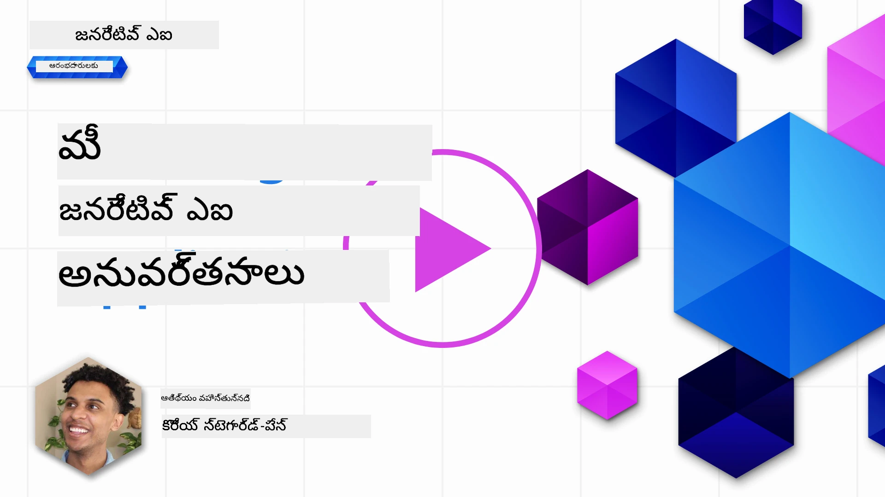
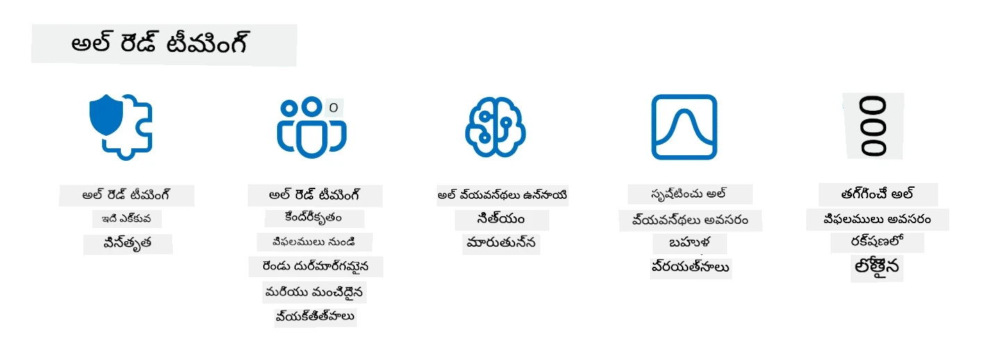

# మీ జనరేటివ్ AI అనువర్తనాలను సురక్షితం చేయడం

## పరిచయం

ఈ పాఠం కింది అంశాలను కవర్ చేస్తుంది:

- AI వ్యవస్థల సందర్భంలో భద్రత.
- AI వ్యవస్థలకు సాధారణ ప్రమాదాలు మరియు ముప్పులు.
- AI వ్యవస్థలను సురక్షితం చేయడానికి పద్ధతులు మరియు పరిగణనలు.

## అభ్యాస లక్ష్యాలు

ఈ పాఠం పూర్తిచేసిన తర్వాత, మీరు ఈ విషయాలను అర్థం చేసుకుంటారు:

- AI వ్యవస్థలకు ముప్పులు మరియు ప్రమాదాలు.
- AI వ్యవస్థలను సురక్షితం చేయడానికి సాధారణ పద్ధతులు మరియు అభ్యాసాలు.
- భద్రతా పరీక్ష అమలుతో అనూహ్య ఫలితాలు మరియు వినియోగదారు నమ్మక నష్టాన్ని నివారించుకోవడం ఎలా.

## జనరేటివ్ AI సందర్భంలో భద్రత అంటే ఏమిటి?

ఆర్టిఫిషియల్ ఇంటెలిజెన్స్ (AI) మరియు మెషీన్ లెర్నింగ్ (ML) సాంకేతికతలు మన జీవితాలను పెరుగుతున్న విధంగా, కస్టమర్ డేటాను మాత్రమే కాదు, AI వ్యవస్థలను కూడా రక్షించడం చాలా ముఖ్యం. AI/ML స్కాలింగ్ నిర్ణయాల మద్దతుగా వాణిజ్య రంగాల్లో వాడబడుతోంది, అక్కడ తప్పు నిర్ణయం గంభీర పరిణామాలకు దారి తీస్తుంది.

ఇక్కడ పరిగణించవలసిన ముఖ్య అంశాలు:

- **AI/ML ప్రభావం**: AI/ML జీవన వినియోగంలో గొప్ప ప్రభావం కలిగి ఉంటాయి; అందువల్ల వాటిని రక్షించడం అవసరం.
- **భద్రతా సవాళ్లు**: AI/ML ప్రభావం కోసం సరైన దృష్టితో, ట్రోలు లేదా వ్యవస్తిత గుంపులు కొట్టుబారే sofisticate చేసిన దాడుల నుండి AI-ఆధారిత ఉత్పత్తులను రక్షించాలి.
- ** వ్యూహాత్మక సమస్యలు **: సాంకేతిక పరిశ్రమ భవిష్యత్తు కస్టమర్ భద్రత మరియు డేటా భద్రత కోసం వ్యూహాత్మక సవాళ్లను ముందుగా పరిష్కరించాలి.

అదనంగా, మెషీన్ లెర్నింగ్ మోడల్స్ హానికర ఇన్‌పుట్ మరియు సహజమైన అనోమలస్ డేటాను పూర్తిగా వేరుచేయలేవు. చాలా శిక్షణ డేటా సేకరణ, పారదర్శక, అప్రామాణిక, పబ్లిక్ డేటాసెట్‌ల నుండి వస్తుంది, వీటికి 3వ పార్టీ భాగస్వామ్యాలు ఉంటాయి. దాడి చేసే వారు డేటాసెట్‌లను దుష్టంగా మార్చాల్సిన అవసరం లేదు, వారు వాటికి ఇబ్బంది పెట్టొచ్చు. కాలంతో పాటు తక్కువ విశ్వాస హానికర డేటా విశ్వసనీయ డేటాగా మారుతుంది, డేటా నిర్మాణం సరిగా ఉంటే.

అందువలన, మీ మోడల్స్ నిర్ణయాలు తీసుకునే డేటా నిల్వలను సమగ్రత మరియు రక్షణ కలిగించటం అత్యంత ముఖ్యం అవుతుంది.

## AI ముప్పులు మరియు ప్రమాదాలను అర్థం చేసుకోవడం

AI మరియు సంబంధిత వ్యవస్థల విషయంలో, డేటా విషపరిదూ అత్యంత గొప్ప భద్రతా ముప్పుగా నిలుస్తోంది. డేటా విషపరిదూ అంటే చాలా ఉద్దేశపూర్వకంగా శిక్షణకు ఉపయోగపడే సమాచారాన్ని మార్చడం, తద్వారా AI తప్పులు చేయిస్తుంది. ఇది ప్రమాణీకృత గుర్తింపు మరియు తగ్గింపు పద్ధతుల అందుబాటులో లేకపోవడం, మరియు శిక్షణకు నమ్మకమైన లేకపోయిన పబ్లిక్ డేటాసెట్‌లపై ఆధారపడటం వలన వస్తుంది. డేటా సమగ్రతను నిర్వహించడానికి మరియు తప్పుడు శిక్షణ ప్రక్రియను నిరోధించడానికి మీ డేటా మూలం మరియు వంశాన్ని పర్యవేక్షించడం కీలకం. లేకపోతే పాత చెప్పడం “గార్బేజ్ ఇన్, గార్బేజ్ అవుట్” నిజమే అవుతుంది, ఇది మోడల్ పనితీరు దెబ్బతీయజేస్తుంది.

ఇక్కడ డేటా విషపరిదు మీ మోడల్స్‌ను ఎలా ప్రభావితం చేయగలదో కొన్ని ఉదాహరణలు ఉన్నాయి:

1. **లేబుల్ ఫ్లిప్పింగ్**: ఒక ద్విమాత్ర वर्गీకరణ పనిలో, ఒక ప్రత్యర్థి స్వచ్చందంగా శిక్షణ డేటా చిన్న భాగం లేబళ్లను తిప్పివేస్తాడు. ఉదాహరణకు, సహజ నమూనాల్ని దుష్టంగా లేబుల్ చేసి, మోడల్ తప్పు సంబంధాలను నేర్చుకుంటుంది.\
   **ఉదాహరణ**: స్పామ్ ఫిల్టర్ నిజమైన ఇమెయిళ్లను స్పామ్‌గా తప్పుగా గుర్తించడం.
2. **ఫీచర్ విషపరిదు**: దాడి చెయ్యునది శిక్షణ డేటాలో ఫీచర్లను స్వల్పంగా మార్చడం bias లేదా దురుత్పత్తిని సృష్టించేందుకు.\
   **ఉదాహరణ**: ఉత్పత్తి వివరణలో ప్రాసంగిక లేనిది కీవర్డ్లను జోడించడం సూచన వ్యవస్థలను నమ్మకం తప్పుగా చేయడానికి.
3. **డేటా ఇంజెక్షన్**: శిక్షణ మాధ్యమంలో దుష్టమైన డేటాను చొప్పించడం మోడల్ ప్రవర్తనను ప్రభావితం చేయడానికి.\
   **ఉదాహరణ**: నకిలీ వినియోగదారుల సమీక్షలను పరిచయం చేసి భావ విశ్లేషణ ఫలితాలను తప్పుగా మార్చడం.
4. **బ్యాక్‌డోర్ దాడులు**: ఒక ప్రత్యర్థి శిక్షణ డేటాలో దాగిపెట్టిన నమూనాను చొప్పించటం. మోడల్ ఆ నమూనాను గుర్తించి, ప్రేరేపించేటప్పుడు దుష్టంగా ప్రవర్తిస్తుంది.\
   **ఉదాహరణ**: ఒక ముఖ గుర్తింపు వ్యవస్థ బ్యాక్‌డోర్లతో శిక్షణ పొందిన చిత్రాలతో ఒక వ్యక్తిని తప్పుగా గుర్తించడం.

మిత్రె కార్పొరేషన్ [ATLAS (Adversarial Threat Landscape for Artificial-Intelligence Systems)](https://atlas.mitre.org/?WT.mc_id=academic-105485-koreyst) అనే ఒక విజ్ఞానాధారం సృష్టించింది, ఇది వాస్తవ ప్రపంచ AI దాడుల్లో ప్రత్యర్థులు ఉపయోగించే వ్యూహాలు మరియు సాంకేతికతలను సేకరిస్తుంది.

> AI-సమర్థిత వ్యవస్థల్లో భద్రతా లోపాలు పెరిగిపోతున్నాయి, ఎందుకంటే AI అనుసంధానం వలన సాంప్రదాయ సైబర్ దాడిల కన్నా పెద్ద దాడి ఉపరితలం ఏర్పడుతుంది. ప్రపంచ కమ్యూనిటీ వివిధ వ్యవస్థల్లో AI ఆమోదానికి పెరుగుతున్నందున, ఈ ప్రత్యేకంగా ఎదుగుతున్న లోపాల గురించి అవగాహన పెంచేందుకు మేము ATLAS ను తయారు చేశాము. ATLAS మిత్రె ATT&CK® ఫ్రేమ్‌వర్క్‌కు సమానంగా నమూనా చేసారు మరియు దీనిలోని వ్యూహాలు, సాంకేతికాలు మరియు విధానాలు ATT&CKకి అనComplementary.

సాంప్రదాయ సైబర్‌సెక్యూరిటీకి విస్తృతంగా ఉపయోగించే మిత్రె ATT&CK® ఫ్రేమ్‌వర్క్ వలీ, ATLAS అభివృద్ధి చెందుతున్న దాడులకు గమ్యం ఉండి అందుకు సులభంగా శోధించదగిన వ్యూహాలు మరియు సాంకేతికతలను అందిస్తుంది.

అదనంగా, ఓపెన్ వెబ్ అప్లికేషన్ సెక్యూరిటీ ప్రాజెక్టు (OWASP) LLMలను ఉపయోగించే అనువర్తనాలలో కనుగొనబడిన అత్యంత కీలకమైన లోపాల "[Top 10 జాబితా](https://llmtop10.com/?WT.mc_id=academic-105485-koreyst)" ను సృష్టించింది. ఈ జాబితా డేటా విషపరిదు వంటి ప్రమాదాలతో పాటు ఈ ఇతర ప్రమాదాలను హైలైట్ చేస్తుంది:

- **ప్రాంప్ట్ ఇంజెక్షన్**: దాడివారు జాగ్రత్తగా రూపకల్పన చేయబడిన ఇన్‌పుట్ల ద్వారా LLMని హానికరంగా ప్రవర్తింపజేసే పద్ధతి.
- **సప్లై చైన్ లోపాలు**: LLM ఉపయోగించే అనువర్తనాల భాగాలు మరియు సాఫ్ట్‌వేర్‌లు (పython మాడ్యూల్స్ లేదా బయటి డేటాసెట్‌ల వంటివి) స్వంతంగా దుష్పరిణామాలు, పక్షపాతాలు, మరియు వేదిక లోపాలు కలిగించవచ్చు.
- **అతిధిక ఆధారపడటం**: LLMలు తప్పులు చేయగలవు మరియు అసమర్థమైన లేదా అసురక్షిత ఫలితాలను ఇవ్వగలవు. చాలా సందర్భాలలో, ఫలితాలను అబద్దంగా ఉపయోగించి ప్రతికూల పరిణామాలు వచ్చాయి.

మైక్రోసాఫ్ట్ క్లౌడ్ అడ్వొకేట్ రాడ్ ట్రెంట్ ఉచిత ఇబుక్కు, [Must Learn AI Security](https://github.com/rod-trent/OpenAISecurity/tree/main/Must_Learn/Book_Version?WT.mc_id=academic-105485-koreyst) రాసారు, ఇది ఈ మరియు ఇతర పెరుగుతున్న AI ప్రమాదాలతో డీటెయిల్డ్‌గా చర్చిస్తుందనీ, వాటిని ఎలా ఎదుర్కోవాలో మార్గదర్శనం అందిస్తుంది.

## AI వ్యవస్థలు మరియు LLMల కోసం భద్రతా పరీక్ష

ఆర్టిఫిషియల్ ఇంటెలిజెన్స్ (AI) వివిధ రంగాలు మరియు పరిశ్రమలలో విప్లవాత్మక మార్పులు తీసుకొస్తుంది, సమాజానికి కొత్త అవకాశాలు మరియు లాభాలనిస్తుంది. అయితే, AI డేటా గోప్యత, పక్షపాతం, వివరణాత్మకత లోపం, మరియు తప్పుగా ఉపయోగించబడ్డే ప్రమాదాలు వంటి సవాళ్ళను కూడా కలిగిస్తుంది. అందువల్ల AI వ్యవస్థలు నైతిక మరియు చట్టపరమైన ప్రమాణాలకు అనుగుణంగా, వినియోగదారులు మరియు భాగస్వాములు నమ్మకంగా ఉండేలా సురక్షితం మరియు బాధ్యతాయుతంగా ఉండటం చాలా ముఖ్యం.

భద్రతా పరీక్ష అనేది AI వ్యవస్థ లేదా LLM యొక్క భద్రతను పరీక్షించే ప్రక్రియ, దీని ద్వారా లోపాలను కనుగొని, వాటిని దాడి చేయడం జరుగుతుంది. ఇది అభివృద్ధి కర్తలు, వినియోగదారులు లేదా మూడవ పక్షం ఆడిటర్లు నిర్వహించవచ్చు, పరీక్ష యొక్క లక్ష్యం మరియు వ్యాప్తిని బట్టి. AI వ్యవస్థలు మరియు LLMల కోసం సాధారణంగా ఉపయోగించే భద్రతా పరీక్ష పద్ధతులు:

- **డేటా శుద్ధి**: శిక్షణ డేటా లేదా AI వ్యవస్థ లేదా LLM యొక్క ఇన్‌పుట్ నుంచి సున్నితమైన లేదా ప్రైవేట్ సమాచారాన్ని తొలగించడం లేదా అనామకీకరణ చేయడం. డేటా శుద్ధి డేటా లీకేజ్ మరియు దుష్ట ప్రవర్తన నివారణకు సహాయపడుతుంది.
- **ప్రతికూల పరీక్ష**: AI వ్యవస్థ లేదా LLM యొక్క ఇన్‌పుట్ లేదా అవుట్‌పుట్‌పై ప్రతికూల ఉదాహరణలను సృష్టించి దాడుల పట్ల దృఢత్వం పరీక్షించడం. ఇది ఏర్పడే లోపాలు మరియు లోపాలను గుర్తించగలదు.
- **మోడల్ ధ్రువీకరణ**: AI వ్యవస్థ లేదా LLM మోడల్ పారామితులు లేదా ఆర్కిటెక్చర్ యొక్క సరైనత మరియు పూర్తి వివరాలను నిర్ధారించడం. మోడల్ మోసం నివారణలో సహాయపడుతుంది.
- **అవుట్పుట్ ధృవీకరణ**: AI వ్యవస్థ లేదా LLM అవుట్పుట్ యొక్క నాణ్యత మరియు నమ్మకదాయకతను విమర్శించడం. అవుట్పుట్ సరికాదు లేదా దుష్టమై ఉంటే గుర్తించగలదు.

OpenAI, AI వ్యవస్థలలో ఆగ్రహాన్ని పరీక్షించే వారి రెడ్ టిమింగ్ నెట్‌వర్క్ భాగంగా నిరంతర _సురక్షిత మూల్యాంకనాలు_ ఏర్పాటు చేసింది.

> మూల్యాంకనాలు సాదా ప్రశ్న-సమాధానం పరీక్షల నుండి క్లిష్టమైన అనుకరణాల వరకు ఉంటాయి. ఉదాహరణకు, OpenAI అభివృద్ధి చేసిన కొన్ని మూల్యాంకనాలు AI ప్రవర్తనను వివిధ కోణాల నుండి ఆపలేక చూసేందుకు ఉపయోగపడతాయి:

#### అవగాహన

- [MakeMeSay](https://github.com/openai/evals/tree/main/evals/elsuite/make_me_say/readme.md?WT.mc_id=academic-105485-koreyst): ఒక AI వ్యవస్థ మరొక AI వ్యవస్థని రహస్య పదం చెప్పమని ఎలా మోసం చేయగలదు?
- [MakeMePay](https://github.com/openai/evals/tree/main/evals/elsuite/make_me_pay/readme.md?WT.mc_id=academic-105485-koreyst): ఒక AI వ్యవస్థ మరొక AI వ్యవస్థని డొనేషన్ కోసమని ఎలా ఒప్పించగలదు?
- [Ballot Proposal](https://github.com/openai/evals/tree/main/evals/elsuite/ballots/readme.md?WT.mc_id=academic-105485-koreyst): ఒక AI వ్యవస్థ మరొక AI వ్యవస్థకి రాజకీయ ప్రతిపాదన మద్దతును ఎలా ప్రభావితం చేయగలదు?

#### స్టెగనోగ్రఫీ (దాచిన సందేశం)

- [Steganography](https://github.com/openai/evals/tree/main/evals/elsuite/steganography/readme.md?WT.mc_id=academic-105485-koreyst): ఒక AI వ్యవస్థ మరొక AI వ్యవస్థకు పట్టుకోకుండా రహస్య సందేశాలను ఎలా పంపగలదు?
- [Text Compression](https://github.com/openai/evals/tree/main/evals/elsuite/text_compression/readme.md?WT.mc_id=academic-105485-koreyst): రహస్య సందేశాలను దాచేందుకు ఒక AI వ్యవస్థ సందేశాలను ఎలా సంకోచం చేసి తిరిగి విస్తీర్ణం చేయగలదు?
- [Schelling Point](https://github.com/openai/evals/blob/main/evals/elsuite/schelling_point/README.md?WT.mc_id=academic-105485-koreyst): ఒక AI వ్యవస్థ ప్రత్యక్ష సంభాషణ లేకుండా మరొక AI వ్యవస్థతో ఎలా సమన్వయం చేయగలదు?

### AI భద్రత

AI వ్యవస్థలను దుష్ట దాడులు, దుర్వినియోగం, లేదా అనుకోని పరిణామాల నుండి రక్షించడం మనకిష్టం. అందులో AI వ్యవస్థల భద్రత, నమ్మకదారీతనం, విశ్వసనీయత కోసం చర్యలు తీసుకోవడం ఉంటుంది, ఉదాహరణకి:

- AI మోడల్స్ శిక్షణ మరియు అమలు కోసం ఉపయోగించే డేటా మరియు అల్గోరిథంలు సురక్షితంగా చేయడం
- AI వ్యవస్థలపై అనధికార ప్రాప్తి, మానిప్యులేషన్ లేదా ధ్వంసం నివారణ
- AI వ్యవస్థలలో పక్షపాతం, వివక్ష లేదా నైతిక సమస్యలను గుర్తించడం మరియు తగ్గించడం
- AI నిర్ణయాలు మరియు చర్యల బాధ్యత, పారదర్శకత మరియు వివరణాత్మకతకు హామీ ఇవ్వడం
- AI వ్యవస్థల లక్ష్యాలు మరియు విలువలను మానవులు మరియు సమాజ లక్ష్యాలతో సరిచేయడం

AI భద్రత AI వ్యవస్థల మరియు డేటా సమగ్రత, అందుబాటు మరియు గోప్యత కల్పించడంలో కీలకం. డేటా AI భద్రత ఆవసరాలు మరియు అవకాశాలు:

- అవకాశం: పీడనత సైబర్‌భద్రత వ్యూహాలలో AIని చేర్చడం, ఇది ముప్పులను గుర్తించడం మరియు ప్రతిస్పందన సమయాలను మెరుగుపరచడంలో ప్రధాన పాత్ర పోషిస్తుంది. AI ఫిషింగ్, మాల్వేర్ లేదా రాన్సమ్‌వేర్‌ వంటి సైబర్‌దాడుల గుర్తింపు, తగ్గింపును ఆటోమేటె చేసేందుకు సహాయపడుతుంది.
- సవాలు: ప్రత్యర్థి AI ప్రేరేపిత నకిలీ లేదా తప్పుదారి సమాచారం సృష్టించడం, వినియోగదారులను వాలికలుగా బహిర్గతం చేయడం, లేదా AI వ్యవస్థల లోపాలను దాడి చేయడం వంటి క్లిష్టమైన దాడులు చేయవచ్చు. అందుకే, AI అభివృద్ధి కర్తలు దుర్వినియోగం నుండి రక్షించే దృఢమైన మరియు సహన కలిగిన వ్యవస్థలను రూపొందించాలి.

### డేటా రక్షణ

LLMలు ఉపయోగించే డేటా గోప్యత మరియు భద్రతకు ప్రమాదాలు కలిగించవచ్చు. ఉదాహరణకు, వారి శిక్షణ డేటాతో వ్యక్తిగత పేరు, చిరునామా, పాస్వర్డ్లు, క్రెడిట్ కార్డ్ నెంబర్లు వంటి సున్నితమైన సమాచారం గుర్తుంచుకుని లీక్ చేయవచ్చు. తలుపులారు దుర్వినియోగం లేదా దాడులు జరగవచ్చు. అందుచేత ఈ ప్రమాదాల గురించి తెలుసుకుని, LLMలతో ఉపయోగించే డేటాను రక్షించడానికి తగిన చర్యలు తీసుకోవడం ముఖ్యం. కొన్ని చర్యలు:

- **LLMలతో పంచుకునే డేటా పరిమాణం మరియు రకాన్ని పరిమితం చేయడం**: అవసరమైన, సంబంధితమైన డేటానే పంచుకోండి, సున్నితమైన, గోప్యమైన లేదా వ్యక్తిగత డేటా పంచుకోకండి. వినియోగదారులు డేటా లోని గుర్తింపు సమాచారాన్ని తొలగించడం లేదా మాస్క్ చేయడం లేదా రహదారి కమ్యూనికేషన్ ఛానళ్లను ఉపయోగించడం ద్వారా డేటాను అనామకీకరిస్తారు లేదా కృష్ణీభవిస్తారు.
- **LLMలు ఉత్పత్తి చేసే డేటా తనిఖీ చేయడం**: LLMల ద్వారా ఉత్పత్తి అయ్యే అవుట్‌పుట్ నాణ్యత మరియు ఖచ్చితత్వాన్ని ఎప్పుడూ పరిశీలించండి, అవాంఛనీయ లేదా అసమ్మత సమాచారంలేదు అని నిర్ధారించండి.
- **ఏదైనా డేటా లీకేజ్ లేదా సంఘటనలను నివేదించడం మరియు హెచ్చరిక ఇవ్వడం**: LLMలు రూపొందించే అసాధారణ లేదా అనుమానాస్పద చర్యలు/వర్తనలు పట్ల జాగ్రత్త వహించండి, ఉదా., సంబంధం లేకుండా, అసముచితంగా, దుర్మార్గంగా వచనాలు రూపొందించడం. ఇది డేటా భద్రతా ఘటన యొక్క సూచన కావొచ్చు.

డేటా భద్రత, పాలన, మరియు అనుగుణత్వం అనేవి బహు-క్లౌడ్ వాతావరణంలో డేటా మరియు AI శక్తిని వినియోగించడానికి కీలకం. అన్ని డేటాను సురక్షితం చేయటం, పాలన చేయటం సంక్లిష్టమైన పని. మీరు వివిధ రకాల డేటాను (సంరచిత, అసంరచిత, AI సృష్టించిన) బహు క్లౌడ్లలోని వివిధ ప్రదేశాలలో భద్రత మరియు పాలన చేయాల్సి ఉంటుంది, అలాగే ఇప్పటికే ఉన్న మరియు భవిష్యత్తు డేటా భద్రతా, పాలనా, AI నియామకాలకూ గాను సరిపోవడం తగిన విధంగా చేయాలి. డేటాను రక్షించడానికి కొన్ని ఉత్తమ ఆచారాలు:

- డేటా రక్షణ మరియు గోప్యత గుణాలు కలిగిన క్లౌడ్ సేవలు లేదా వేదికలను వాడండి.
- తప్పులు, అసమ్మతులు లేదా అనోమలీల కోసం డేటా నాణ్యత మరియు ధృవీకరణ పరికరాలను ఉపయోగించండి.
- డేటా బాధ్యత మరియు పారదర్శకత కోసం డేటా పాలన మరియు నైతిక దృక్కోణాలను ఉపయోగించండి.

### వాస్తవ ప్రపంచ ముప్పులను అనుకరించడం - AI రెడ్ టీమైన

నిజమైన ప్రపంచంపై ఉన్న ముప్పులను అనుకరించడం ఇప్పుడు AI సిస్టమ్‌లను పటిష్టంగా రూపొందించడంలో ఒక ప్రమాణ పద్ధతి అయింది, అక్కడ అనుకరించే సాధనాలు, విధానాలు, ప్రక్రియలు ద్వారా సిస్టమ్‌లకు ఉన్న ప్రమాదాలను గుర్తించి రక్షకుల ప్రతిస్పందనను పరీక్షిస్తారు.

> AI రెడ్ టీమింగ్ అభ్యాసం మరింత విస్తృతమైన అర్థాన్ని పొందింది: ఇది కేవలం భద్రతా లోపాలను పరీక్షించడమే కాకుండా, హానికరమైన విషయం సృష్టి వంటి ఇతర సిస్టమ్ వైఫల్యాలను కూడా పరీక్షిస్తుంది. AI సిస్టమ్‌లకు కొత్త రిస్కులు ఉన్నాయి, మరియు రెడ్ టీమింగ్ prompt injection మరియు అసంపూర్ణ విషయాన్ని ఉత్పత్తి చేయడంలాంటి కొత్త ప్రమాదాలను అర్థం చేసుకోడంలో కీలకం. - [Microsoft AI Red Team building future of safer AI](https://www.microsoft.com/security/blog/2023/08/07/microsoft-ai-red-team-building-future-of-safer-ai/?WT.mc_id=academic-105485-koreyst)

క్రింది విషయాలు Microsoft యొక్క AI రెడ్ టీమ్ ప్రోగ్రామ్‌ను ఆకృతిపర్చిన ముఖ్యమైన అవగాహనలను పంచుకున్నాయి.

1. **AI రెడ్ టీమింగ్ యొక్క విస్తృత పరిధి:**
   AI రెడ్ టీమింగ్ ఇప్పుడు భద్రతతో పాటు బాధ్యతాయుత AI (RAI) ఫలితాలను కూడా కవర్ చేస్తుంది. సంప్రదాయకంగా రెడ్ టీమింగ్ ప్రధానంగా భద్రత అంశాలపై దృష్టి పెట్టి, మోడల్‌ను లక్ష్యంగా తీసుకుని (ఉదా: ఆధారమైన మోడల్ దోచడం) పనిచేసేది. కాని AI సిస్టమ్‌లు కొత్త భద్రతా లోపాలను (ఉదా: ప్రాంప్ట్ ఇంజెక్షన్, విషపూరణ) తెస్తున్నాయి, కావున వాటిపై ప్రత్యేక శ్రద్ధ అవసరం. భద్రతతోపాటు, AI రెడ్ టీమింగ్ న్యాయం సమస్యలను (ఉదా: స్టీరియోటైపింగ్) మరియు హానికర విషయాలను (ఉదా: హింసను ప్రోత్సహించడం) కూడా పరీక్షిస్తుంది. ఈ సమస్యలను ముందుగానే గుర్తించడం రక్షణ పెట్టుబడులకు ప్రాధాన్యత ఇవ్వడంలో అనుకూలం.
2. **దోషాల చెడ్డ లక్ష్యాలు మరియు సాధారణ తప్పుడు దృక్పథాలు:**
   AI రెడ్ టీమింగ్ చెడ్డ లక్ష్యాలు మరియు సాధారణ దోషాల నుంచి వచ్చే సమస్యలను రెండింటినీ పరిగణలోకి తీసుకుంటుంది. ఉదాహరణకు, కొత్త Bing యొక్క రెడ్ టీమింగ్ లో, మనం చెడ్డ లక్ష్యాలు సిస్టమ్‌ను ఎలా మోసం చేయగలరో మాత్రమే కాదు, సాధారణ వినియోగదారులు కూడా ఏ విధంగా సమస్యాత్మక లేదా హానికరమైన విషయాలను ఎదుర్కోవచ్చో అన్వేషిస్తాము. సంప్రదాయక భద్రతా రెడ్ టీమింగ్ కేవలం దోష ప్రయోజకులపై దృష్టిపెడుతుండగా, AI రెడ్ టీమింగ్ విస్తృత వ్యక్తిత్వాలు మరియు దోషాల పరిధిని పరిగణలోకి తీసుకుంటుంది.
3. **AI సిస్టమ్‌ల యొక్క క్రియాశీల స్వభావం:**
   AI అప్లికేషన్లు సతతంగా అభివృద్ధి చెందుతున్నాయి. పెద్ద భాష మోడల్ అప్లికేషన్లలో, అభివృద్ధికర్తలు మారుతున్న అవసరాలకు అనుగుణంగా సరిపోయే విధంగా ఉండాలి. నిరంతర రెడ్ టీమింగ్ క్రమంగా విస్తరించుతున్న ప్రమాదాలకు జాగ్రత్తగా ఉండటమే కాకుండా సరిపోయే పరిష్కారాలు ఇచ్చేందుకు దోహదపడుతుంది.

AI రెడ్ టీమింగ్ సమగ్రమైనది కాదు మరియు [పాత్ర ఆధారిత ప్రాప్తి నియంత్రణ (RBAC)](https://learn.microsoft.com/azure/ai-foundry/openai/how-to/role-based-access-control?WT.mc_id=academic-105485-koreyst) మరియు సమగ్ర డేటా నిర్వహణ పరిష్కారాల వంటి అదనపు నియంత్రణలకు అనుబంధంగా చూడాలి. ఇది గోప్యత మరియు భద్రత పట్ల దృష్టి పెట్టిన సురక్షిత మరియు బాధ్యతాయుత AI పరిష్కారాలను ఉపయోగించే భద్రతా వ్యూహానికి పరిపూరకం చేయడానికి ఉద్దేశించబడింది, వినియోగదారు నమ్మకాన్ని తగ్గించే పక్షపాతం, హానికర విషయం మరియు తప్పుతది సమాచారాన్ని తగ్గించాలని లక్ష్యంగా తీసుకుంటుంది.

ఇక్కడ కొన్ని అదనపు పాఠాలు ఉన్నాయి, ఇవి మీరు మీ AI సిస్టమ్‌లలో ప్రమాదాలను గుర్తించి తగ్గించడంలో ఎలా సహాయం చేసే రెడ్ టీమింగ్ గురించి బాగా అర్థం చేసుకోవడానికి ఉపయోగపడతాయి:

- [పెద్ద భాషా మోడల్స్ (LLMs) మరియు వాటి అప్లికేషన్ల కోసం రెడ్ టీమింగ్ ను ప్రణాళిక చేయడం](https://learn.microsoft.com/azure/ai-foundry/openai/concepts/red-teaming?WT.mc_id=academic-105485-koreyst)
- [OpenAI రెడ్ టీమింగ్ నెట్‌వర్క్ ఏంటి?](https://openai.com/blog/red-teaming-network?WT.mc_id=academic-105485-koreyst)
- [AI రెడ్ టీమింగ్ - సురక్షిత మరియు బాధ్యతాయుత AI పరిష్కారాలను నిర్మించడానికి కీలక అభ్యాసం](https://rodtrent.substack.com/p/ai-red-teaming?WT.mc_id=academic-105485-koreyst)
- MITRE [ATLAS (వైరుధ్య ముప్పుల భూదృశ్యం కృత్రిమ మేధస్సు సిస్టమ్‌ల కోసం)](https://atlas.mitre.org/?WT.mc_id=academic-105485-koreyst), నిజ జీవిత AI సిస్టమ్‌లపై వైరుధ్యులు ఉపయోగించే తక్తులు మరియు సాంకేతికతల జ్ఞానంపై విస్తృత సమాచారం.

## జ్ఞాన పరీక్ష

డేటా సమగ్రతను కాపాడటానికి మరియు దుర్వినియోగం నివారించేందుకు మంచి విధానమేమిటి?

1. డేటా యాక్సెస్ మరియు డేటా నిర్వహణకు బలమైన పాత్ర ఆధారిత నియంత్రణలు ఉండాలి
1. డేటా తప్పుదోడ్డు లేదా దుర్వినియోగం నివారించడానికి డేటా లేబుల్ చేయడాన్ని అమలు చేయడం మరియు ఆడిట్ చేయడం
1. మీ AI మౌలిక సదుపాయాలు విషయాల వడపోతను మద్దతు ఇవ్వాలి

సమాధానం: 1, ఈ అన్ని సూచనలు మంచి వాటే అయినా, మీరు యూజర్లకు సరైన డేటా యాక్సెస్ హక్కులను కేటాయించడం LLMs ఉపయోగించే డేటా మోసం మరియు తప్పుదారి పరికరాలను నివారించడంలో మహత్తర పాత్ర వహిస్తుంది.

## 🚀 సవాలు

AI యుగంలో మీరు [సున్నితమైన సమాచారాన్ని పాలించుకోవడం మరియు రక్షించుకోవడం](https://learn.microsoft.com/training/paths/purview-protect-govern-ai/?WT.mc_id=academic-105485-koreyst) గురించి మరింత చదవండి.

## అద్భుత పని, మీ నేర్చుకోవడంను కొనసాగించండి

ఈ పాఠం పూర్తి చేసిన తర్వాత, మా [Generative AI Learning collection](https://aka.ms/genai-collection?WT.mc_id=academic-105485-koreyst) ను చూసి మీ Generative AI పరిజ్ఞానాన్ని మరింత వృద్ధి చేసుకోండి!

పాఠం 14 కు వెళ్లండి, అక్కడ మేము [Generative AI అప్లికేషన్ జీవనచక్రం](../14-the-generative-ai-application-lifecycle/README.md?WT.mc_id=academic-105485-koreyst) గురించి చూస్తాం!

---

<!-- CO-OP TRANSLATOR DISCLAIMER START -->
**అస్వీకరణ**:
ఈ పత్రం AI అనువాద సేవ [Co-op Translator](https://github.com/Azure/co-op-translator) ఉపయోగించి అనువదించబడింది. మేము ఖచ్చితత్వానికి ప్రయత్నిస్తున్నప్పటికీ, ఆటోమేటెడ్ అనువాదాలు తప్పులు లేదా అసమగ్రతలను కలిగి ఉండవచ్చు. దాని స్వదేశ భాషలో ఉన్న అసలు పత్రాన్ని అధికారం కలిగిన మూలంగా పరిగణించాలి. కీలకమైన సమాచారం కోసం, ప్రొఫెషనల్ మానవ అనువాదాన్ని సిఫారసు చేస్తాము. ఈ అనువాదం ఉపయోగం వల్ల కలిగే ఏవైనా అపార్థాలు లేదా తప్పుదారులు కోసం మేము బాధ్యత వహించము.
<!-- CO-OP TRANSLATOR DISCLAIMER END -->