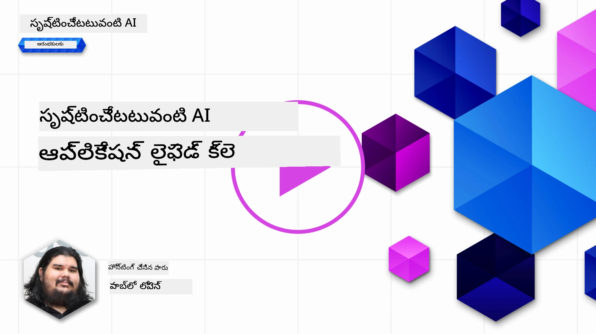
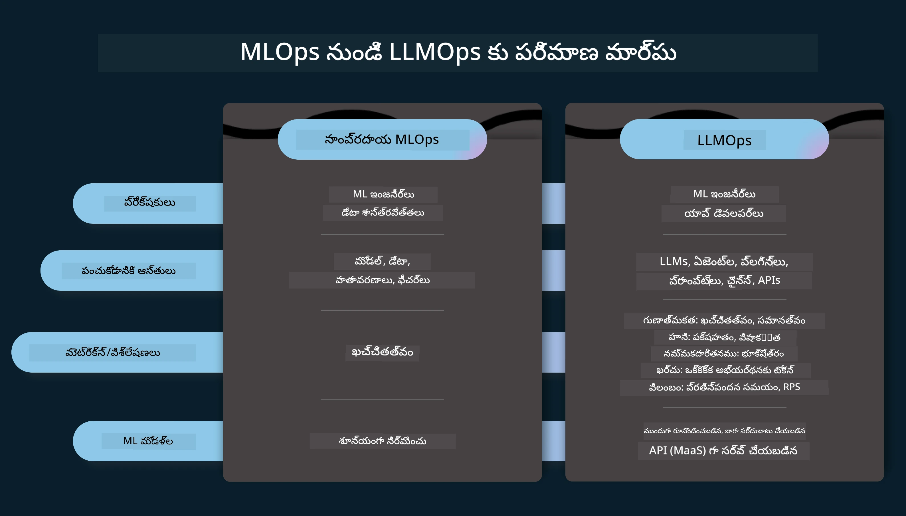
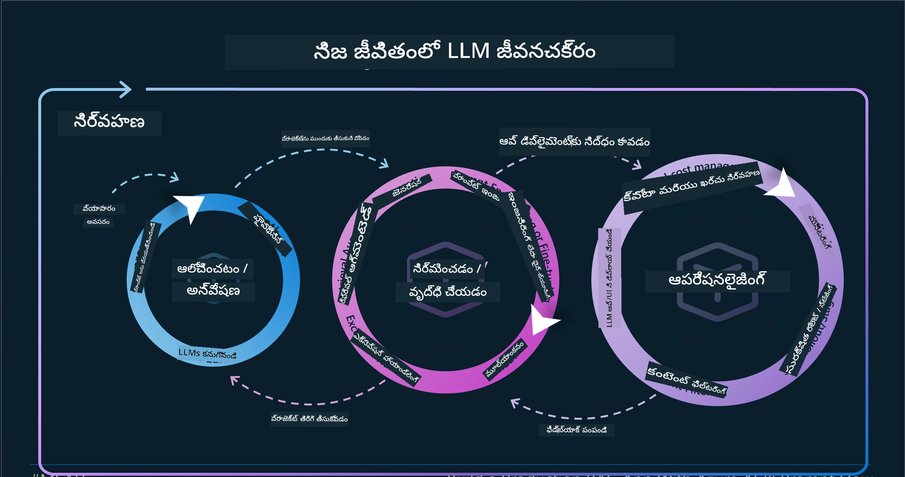
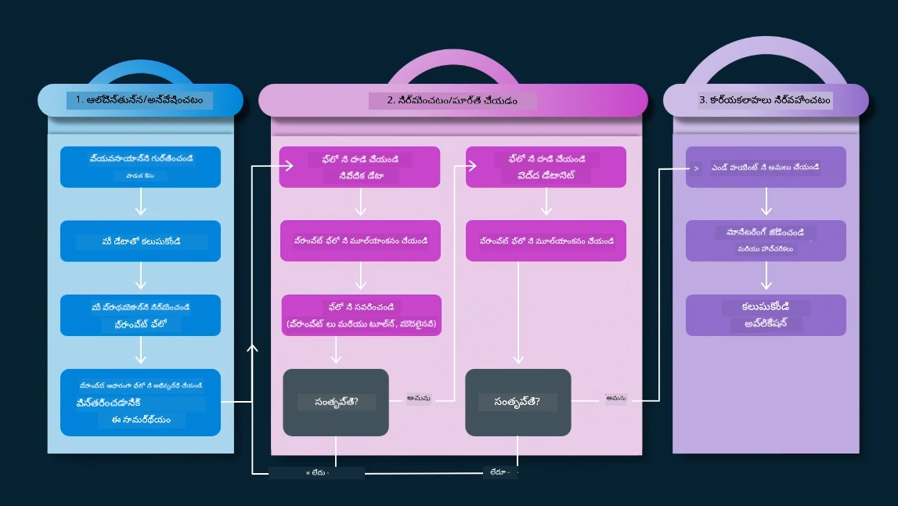
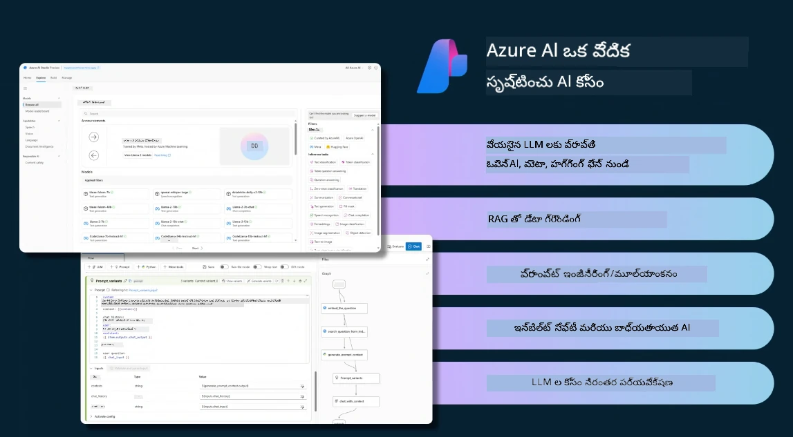
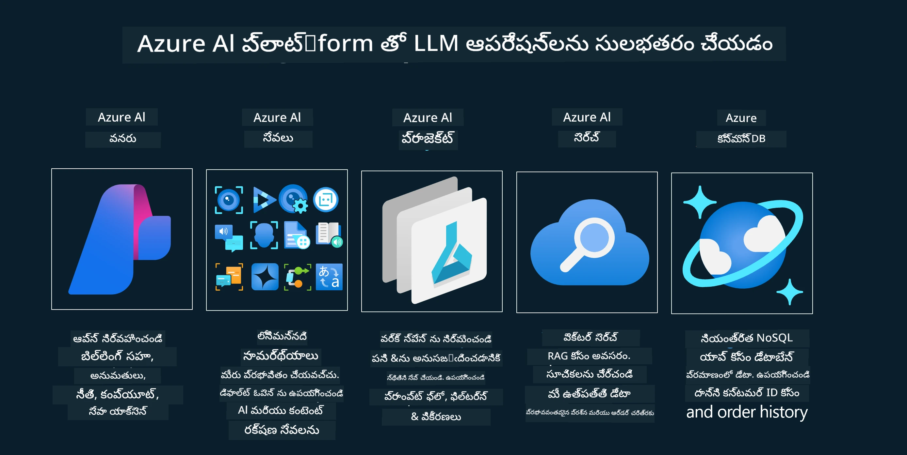
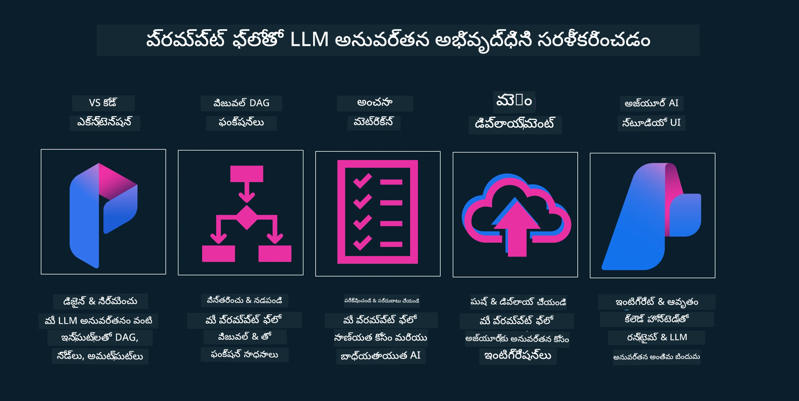

# జెనరేటివ్ AI అనువర్తన జీవనచక్రం

అన్ని AI అనువర్తనాలకు ఒక ముఖ్యమైన ప్రశ్న AI ఫీచర్ల ప్రాసంగికత, ఎందుకంటే AI ఒక వేగంగా అభివృద్ధి చెందుతున్న రంగం, మీ అనువర్తనం ప్రాసంగికంగా, నమ్మదగినదిగా మరియు బలంగా ఉండేందుకు, మీరు దానిని నిరంతరం పర్యవేక్షించి, మూల్యాంకనం చేసి, మెరుగుపరచాలి. ఇక్కడే జెనరేటివ్ AI జీవనచక్రం ప్రవేశిస్తుంది.

జెనరేటివ్ AI జీవనచక్రం అనేది మీరు జెనరేటివ్ AI అనువర్తనాన్ని అభివృద్ధి చేయడం, విడుదల చేయడం మరియు నిర్వహించడంలో దశల వారీగా మార్గనిర్దేశం చేసే మూస. ఇది మీ లక్ష్యాలను నిర్వచించడంలో, మీ పనితీరును కొలవడంలో, మీ సవాళ్లను గుర్తించడంలో మరియు మీ పరిష్కారాలు అమలు చేయడంలో సహాయపడుతుంది. ఇది మీ అనువర్తనాన్ని నీతిశాస్త్ర, చట్టపరమైన ప్రమాణాలకు మరియు మీ ఇంటరెస్టుల హోల్డర్లకు అనుగుణంగా ఉంచడంలో కూడా సహాయపడుతుంది. జెనరేటివ్ AI జీవనచక్రాన్ని అనుసరించడం ద్వారా, మీ అనువర్తనం నిరంతరం విలువ సృష్టిస్తూ మరియు వినియోగదారులను సంతృప్తిపరిచే విధంగా ఉంటుంది అని మీరు నిర్ధారించుకోవచ్చు.

## పరిచయం

ఈ అధ్యాయంలో, మీరు:

- MLOps నుండి LLMOps కి ఉన్న ప్యారడైమ్ మార్పును అర్థం చేసుకోవడం
- LLM జీవనచక్రం
- జీవనచక్ర මෙటూలింగ్
- జీవనచక్ర మేట్రిఫికేషన్ మరియు మూల్యాంకనం

## MLOps నుండి LLMOps కి ఉన్న ప్యారడైమ్ మార్పును అర్థం చేసుకోవడం

LLMలు ఆర్టిఫిషియల్ ఇంటెలిజెన్స్ ఆయుధాలలో కొత్త సాధనాలు, ఇవి అనువర్తనాల విశ్లేషణ మరియు ఉత్పత్తి పనులలో అద్భుతంగా శక్తివంతమైనవి, అయితే ఈ శక్తికి AI మరియు క్లాసిక్ మెషీన్ లెర్నింగ్ పనులను సరళీకృతం చేసే విధానాల్లో కొన్ని ఫలితాలు ఉన్నాయి.

దరు, ఈ సాధనాన్ని డైనమిక్‌గా మరియు సరైన ప్రోత్సాహాలతో అనుకూలం చేసుకోవడానికి ఒక కొత్త ప్యారడైమ్ అవసరం. మేము పాత AI అనువర్తనాలను "ML అనువర్తనాలు" గా, తాజా AI అనువర్తనాలను "GenAI అనువర్తనాలు" లేదా కేవలం "AI అనువర్తనాలు"గా వర్గీకరించవచ్చు, ఆ సమయంలో ప్రధాన సాంకేతికత మరియు పద్ధతులను ప్రతిబింబిస్తూ. ఇది మన కథనాన్ని అనేక రకాలుగా మార్చుతుంది, క్రింది పోలికను చూడండి.

LLMOpsలో, మనం అనువర్తన డెవలపర్లపై ఎక్కువగా దృష్టిపెట్టుతున్నాము, ఇంటిగ్రేషన్లను ముఖ్యాంశంగా ఉపయోగిస్తూ, "మోడల్స్-అజ్-సర్వీస్" ను ఉపయోగిస్తూ, కింది విషయాల్లో మేట్రిక్స్ గురించి ఆలోచిస్తూ.

- నాణ్యత: ప్రతిస్పందన నాణ్యత
- హాని: బాధ్యతాయుత AI
- నిజాయితీ: ప్రతిస్పందన ఆధారితత్వం (అర్థమవుతుందా? ఇది సరియైనదేనా?)
- ఖర్చు: పరిష్కారం బడ్జెట్
- ఆలస్యం: టోకెన్ ప్రతిస్పందనకి సగటు సమయం

## LLM జీవనచక్రం

మొదట, జీవనచక్రాన్ని మరియు మార్పులను అర్థం చేసుకోవడానికి, తరువాతి ఇన్ఫోగ్రాఫిక్‌ను గమనించండి.

మీరు గమనించవచ్చు, ఇది MLOps యొక్క సాధారణ జీవనచక్రాల నుండి భిన్నంగా ఉంటుంది. LLMలకు అనేక కొత్త అవసరాలు ఉన్నాయి, అవి ప్రాంప్టింగ్, నాణ్యత మెరుగుపరచడానికి వివిధ పద్ధతులు (ఫైన్-ట్యూనింగ్, RAG, మెటా-ప్రాంప్ట్స్), బాధ్యతాయుత AIతో పాటు వివిధ మేట్రిక్స్‌లు (నాణ్యత, హాని, నిజాయితీ, ఖర్చు మరియు ఆలస్యం).

ఉదాహరణకు, మేము ఎలా ఆలోచిస్తామో చూడండి. వివిధ LLMలతో ప్రయోగం చేసే ప్రాంప్ట్ ఇంజినీరింగ్ ఉపయోగించి, వారి హైపోథసిస్ సరైనదై ఉండవచ్చా అని పరిశీలించడం.

గమనించండి ఇది రేఖీయంగా కాదు, కానీ సమగ్ర లూపులు, పునరావృత మరియు సామగ్రి చక్రంతో కూడినది.

ఆ దశలను ఎలా పరిశీలించవచ్చు? జీవనచక్రాన్ని ఎలా నిర్మించవచ్చో వివరానికి అడుగు పెడదాం.

ఇది కొంత క్లిష్టంగా కనిపించవచ్చు, ముందుగా మూడు ప్రధాన దశలపై దృష్టి సారిద్దాం.

1. ఆలోచన/పరిశోధన: అన్వేషణ, ఇక్కడ మనం వ్యాపార అవసరాలకు అనుగుణంగా పరిశీలించవచ్చు. ప్రోటోటైపింగ్, [PromptFlow](https://microsoft.github.io/promptflow/index.html?WT.mc_id=academic-105485-koreyst) సృష్టించి మన హైపోథసిస్కి సమర్థవంతమైనదా అన్నది పరీక్షించటం.
1. నిర్మాణం/పుష్కలీకరణ: అమలు, ఇప్పుడు, పెద్ద డేటాసెట్ల కోసం మాన్యమైన పరీక్ష చేయడం, ఫైన్-ట్యూనింగ్ మరియు RAG వంటి సాంకేతికతలను అమలు చేయడం మా పరిష్కార బలాన్ని పరిశీలించండి. ఇది తగినంత కాకపోతే, తిరిగి అమలు చేయాలి, కొత్త దశలను జోడించాలి లేదా డేటాను పునఃరచన చేయాలి. మా వర్క్‌ఫ్లో, మా స్కేల్ పరీక్షల తరువాత, ఇది పనిచేస్తే మరియు మా మేట్రిక్స్‌ని ఆల్ చేస్తే తదుపరి దశకు సిద్ధంగా ఉంది.
1. ఆపరేషనలైజింగ్: ఇంటిగ్రేషన్, ఇప్పుడు మన వ్యవస్థకు మానిటరింగ్ మరియు అలర్ట్ సిస్టమ్స్ జోడించటం, విడుదల మరియు అనువర్తన ఇంటిగ్రేషన్.

తరువాత, మేనేజ్‌మెంట్ అనే సమగ్ర చక్రం ఉంది, ఇది భద్రత, అనుగుణత మరియు పాలన పై దృష్టి పెడుతుంది.

అభినందనలు, ఇప్పుడు మీ AI అనువర్తనం వాడుకకు సిద్ధంగా ఉంది. ప్రత్యక్ష అనుభూతి కోసం, [Contoso చాట్ డెమో.](https://nitya.github.io/contoso-chat/?WT.mc_id=academic-105485-koreyst) ను చూడండి

ఇప్పుడు, మనం ఏ టూల్స్ ఉపయోగించవచ్చు?

## జీవనచక్ర మెటూలింగ్

మెటూలింగ్ కోసం, మైక్రోసాఫ్ట్ [Azure AI ప్లాట్‌ఫారమ్](https://azure.microsoft.com/solutions/ai/?WT.mc_id=academic-105485-koreyst) మరియు [PromptFlow](https://microsoft.github.io/promptflow/index.html?WT.mc_id=academic-105485-koreyst) మీ జీవనచక్రాన్ని సులభతరం చేస్తాయి మరియు అమలు చేయడానికి సన్నద్ధం చేస్తాయి.

[Azure AI ప్లాట్‌ఫారమ్](https://azure.microsoft.com/solutions/ai/?WT.mc_id=academic-105485-koreyst) ద్వారా మీరు [AI స్టూడియో](https://ai.azure.com/?WT.mc_id=academic-105485-koreyst) ఉపయోగించవచ్చు. AI స్టూడియో అనేది ఒక వెబ్ పోర్టల్, ఇది మోడల్స్, నమూనాలు మరియు మెటూల్స్ అన్వేషించడానికి ఏర్పాటుచేస్తుంది. మీ వనరులను నిర్వహించడం, UI అభివృద్ధి వర్క్‌ఫ్లోలు మరియు కోడ్-మొదటి అభివృద్ధికి SDK/CLI ఎంపికలను అందిస్తుంది.

Azure AI, మీరు అనేక వనరులను ఉపయోగించడానికి అనుమతిస్తుంది, నిర్వాహన, సేవలు, ప్రాజెక్టులు, వెక్టర్ శోధన మరియు డేటాబేస్ అవసరాలను నిర్వహించడానికి.

ప్రూఫ్-ఆఫ్- కాన్సెప్ట్(POC) నుండి పెద్ద స్థాయి అనువర్తనాల వరకు PromptFlowతో నిర్మించండి:

- విజువల్ మరియు ఫంక్షనల్ టూల్స్‌తో VS కోడ్ నుండి అనువర్తనాలను డిజైన్ మరియు నిర్మించండి
- మీ అనువర్తనాలు నాణ్యమైన AI కోసం పరిగణించండి మరియు ఫైన్-ట్యూన్ చేయండి, సులభంగా.
- Azure AI స్టూడియో ఉపయోగించి క్లౌడ్‌తో ఇంటిగ్రేట్ చేయడం మరియు పుష్ చేసి, వేగంగా విడుదల చేయండి.

## చక్కగా! మీరు మీ అభ్యాసాన్ని కొనసాగించండి!

అద్భుతం, ఇప్పుడు మనం ఒక అనువర్తనం ఎలా నిర్మించామో [Contoso చాట్ అనువర్తనం](https://nitya.github.io/contoso-chat/?WT.mc_id=academic-105485-koreyst) ద్వారా తెలుసుకోండి, అది క్లౌడ్ అడ్వొకసీ ఆ యొక్క కాన్సెప్ట్ లను డెమో లో ఎలా చేర్చిందో పరీక్షించండి. మరిన్ని విషయాల కోసం, మా [Ignite బ్రేక్అవుట్ సెషన్!](https://www.youtube.com/watch?v=DdOylyrTOWg) ను చూడండి

ఇప్పుడు, జెనరేటివ్ AIపై [Retrieval Augmented Generation మరియు వెక్టర్ డేటాబేస్‌లు](../15-rag-and-vector-databases/README.md?WT.mc_id=academic-105485-koreyst) ఎలా ప్రభావం చూపిస్తాయో తెలుసుకోడానికి పాఠం 15ని పరిశీలించండి మరియు మరింత ఆకర్షణీయమైన అనువర్తనాలను సృష్టించండి!

---

<!-- CO-OP TRANSLATOR DISCLAIMER START -->
**డిస్క్లెయిమర్**:
ఈ డాక్యుమెంట్‌ను AI అనువాద సేవ [Co-op Translator](https://github.com/Azure/co-op-translator) ఉపయోగించి అనువదించబడింది. మేము ఖచ్చితత్వానికి ప్రయత్నిస్తుండగా, ఆటోమేటెడ్ అనువాదాలలో పొరపాట్లు లేదా తప్పులుండే అవకాశం ఉందని దయచేసి గమనించండి. స్థానిక భాషలో ఉన్న الأصلي డాక్యుమెంట్‌ను అధికారిక మూలంగా చూడాలి. ముఖ్యమైన సమాచారం కోసం, ప్రొఫెషనల్ మానవ అనువాదం సిఫార్సు చేయబడుతుంది. ఈ అనువాదం వాడకంలో వచ్చిన ఏవైనా سوءవ్యతిరేక అస్పష్టతలకు మేము బాధ్యత వహించము.
<!-- CO-OP TRANSLATOR DISCLAIMER END -->