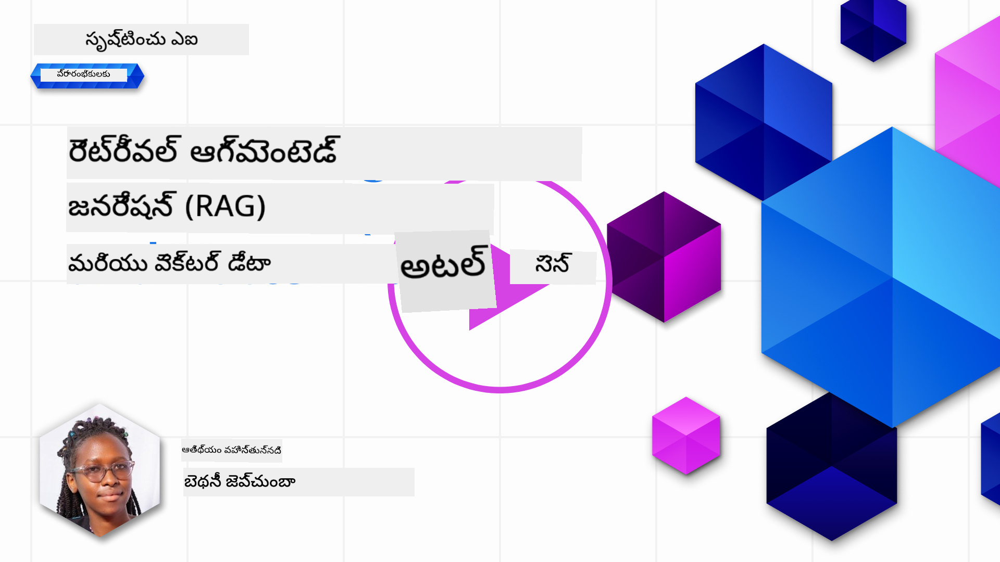
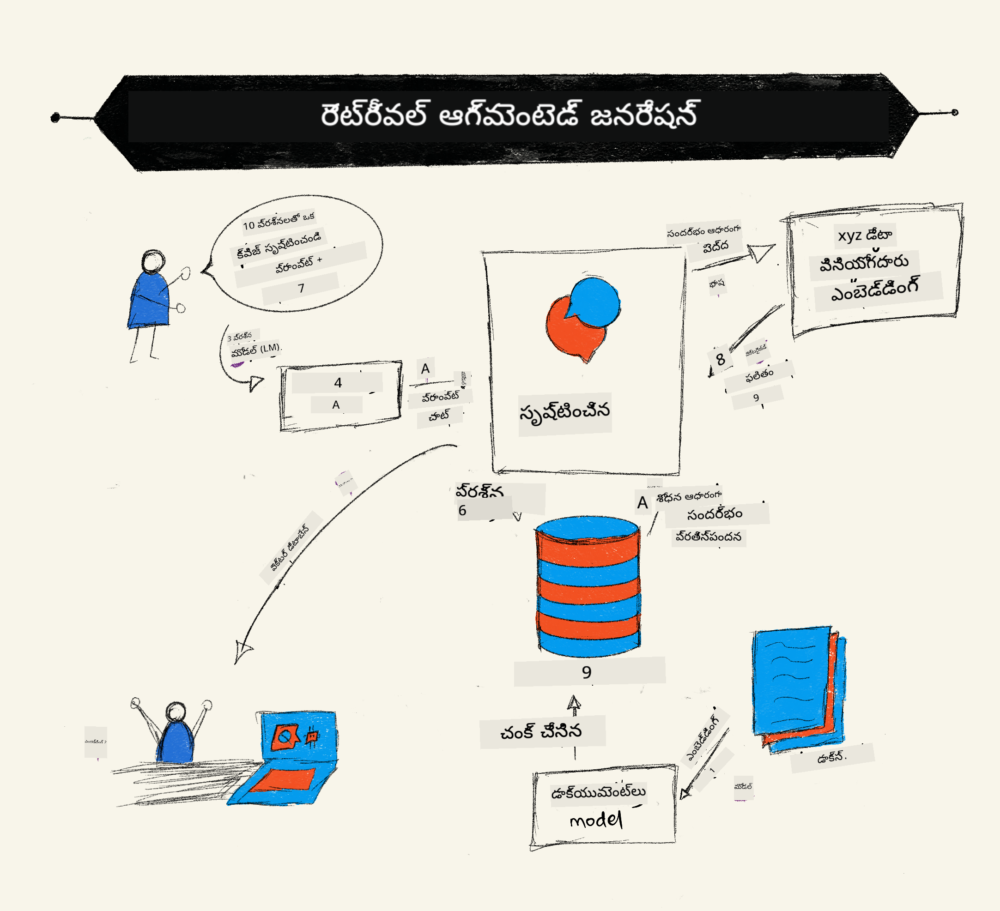
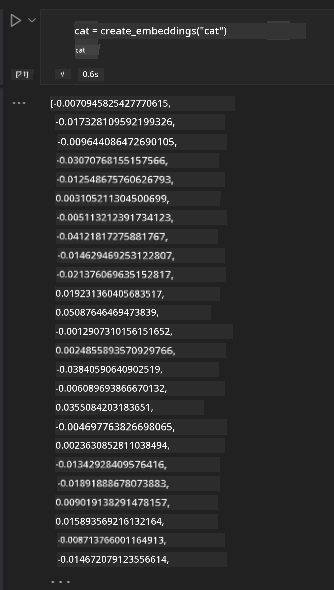

<!--
CO_OP_TRANSLATOR_METADATA:
{
  "original_hash": "b4b0266fbadbba7ded891b6485adc66d",
  "translation_date": "2025-12-19T20:36:20+00:00",
  "source_file": "15-rag-and-vector-databases/README.md",
  "language_code": "te"
}
-->
# రిట్రీవల్ ఆగ్మెంటెడ్ జనరేషన్ (RAG) మరియు వెక్టర్ డేటాబేసులు

[](https://youtu.be/4l8zhHUBeyI?si=BmvDmL1fnHtgQYkL)

సెర్చ్ అప్లికేషన్ల పాఠంలో, మీ స్వంత డేటాను లార్జ్ లాంగ్వేజ్ మోడల్స్ (LLMs) లో ఎలా ఇంటిగ్రేట్ చేయాలో మేము సంక్షిప్తంగా నేర్చుకున్నాము. ఈ పాఠంలో, మీ LLM అప్లికేషన్‌లో మీ డేటాను గ్రౌండింగ్ చేయడం, ప్రక్రియ యొక్క యాంత్రికత మరియు డేటాను నిల్వ చేయడానికి పద్ధతులు, ఎంబెడ్డింగ్స్ మరియు టెక్స్ట్ రెండింటినీ కలిపి, మరింత లోతుగా తెలుసుకుంటాము.

> **వీడియో త్వరలో వస్తోంది**

## పరిచయం

ఈ పాఠంలో మేము కింది విషయాలను కవర్ చేస్తాము:

- RAG అంటే ఏమిటి మరియు AI (కృత్రిమ మేధస్సు) లో ఇది ఎందుకు ఉపయోగిస్తారు అనే పరిచయం.

- వెక్టర్ డేటాబేసులు ఏమిటి మరియు మా అప్లికేషన్ కోసం ఒకటి సృష్టించడం.

- RAG ను ఒక అప్లికేషన్‌లో ఎలా ఇంటిగ్రేట్ చేయాలో ఒక ప్రాక్టికల్ ఉదాహరణ.

## నేర్చుకునే లక్ష్యాలు

ఈ పాఠం పూర్తి చేసిన తర్వాత, మీరు చేయగలుగుతారు:

- డేటా రిట్రీవల్ మరియు ప్రాసెసింగ్‌లో RAG యొక్క ప్రాముఖ్యతను వివరించండి.

- RAG అప్లికేషన్ సెటప్ చేసి మీ డేటాను LLM కు గ్రౌండ్ చేయండి.

- LLM అప్లికేషన్లలో RAG మరియు వెక్టర్ డేటాబేసుల సమర్థవంతమైన ఇంటిగ్రేషన్.

## మా సన్నివేశం: మా స్వంత డేటాతో మా LLMలను మెరుగుపరచడం

ఈ పాఠం కోసం, విద్యా స్టార్టప్‌లో మా స్వంత నోట్స్‌ను జోడించాలని కోరుకుంటున్నాము, ఇది చాట్‌బాట్‌కు వివిధ విషయాలపై మరింత సమాచారం పొందడానికి అనుమతిస్తుంది. మా వద్ద ఉన్న నోట్స్ ఉపయోగించి, అభ్యాసకులు మెరుగ్గా చదవగలుగుతారు మరియు వివిధ విషయాలను అర్థం చేసుకోవచ్చు, వారి పరీక్షలకు సులభంగా రివైజ్ చేయడానికి. మా సన్నివేశాన్ని సృష్టించడానికి, మేము ఉపయోగిస్తాము:

- `Azure OpenAI:` మా చాట్‌బాట్ సృష్టించడానికి ఉపయోగించే LLM

- `AI for beginners' lesson on Neural Networks`: ఇది మా LLM ను గ్రౌండ్ చేసే డేటా

- `Azure AI Search` మరియు `Azure Cosmos DB:` మా డేటాను నిల్వ చేయడానికి మరియు సెర్చ్ ఇండెక్స్ సృష్టించడానికి వెక్టర్ డేటాబేస్

వినియోగదారులు తమ నోట్స్ నుండి ప్రాక్టీస్ క్విజ్‌లు, రివిజన్ ఫ్లాష్ కార్డులు సృష్టించగలుగుతారు మరియు వాటిని సంక్షిప్త సమీక్షలుగా సారాంశం చేయగలుగుతారు. ప్రారంభించడానికి, RAG అంటే ఏమిటి మరియు అది ఎలా పనిచేస్తుందో చూద్దాం:

## రిట్రీవల్ ఆగ్మెంటెడ్ జనరేషన్ (RAG)

ఒక LLM ఆధారిత చాట్‌బాట్ వినియోగదారుల ప్రాంప్ట్‌లను ప్రాసెస్ చేసి ప్రతిస్పందనలు సృష్టిస్తుంది. ఇది ఇంటరాక్టివ్‌గా ఉండేలా రూపొందించబడింది మరియు వినియోగదారులతో విస్తృత అంశాలపై సంభాషిస్తుంది. అయితే, దాని ప్రతిస్పందనలు అందించిన సందర్భం మరియు ప్రాథమిక శిక్షణ డేటాకు పరిమితమవుతాయి. ఉదాహరణకు, GPT-4 జ్ఞాన కట్ ఆఫ్ సెప్టెంబర్ 2021, అంటే, ఆ కాలం తర్వాత జరిగిన సంఘటనల గురించి దానికి జ్ఞానం లేదు. అదనంగా, LLMలను శిక్షణ ఇచ్చేందుకు ఉపయోగించిన డేటాలో వ్యక్తిగత నోట్స్ లేదా కంపెనీ ఉత్పత్తి మాన్యువల్ వంటి గోప్యమైన సమాచారం ఉండదు.

### RAGs (Retrieval Augmented Generation) ఎలా పనిచేస్తాయి



మీ నోట్స్ నుండి క్విజ్‌లు సృష్టించే చాట్‌బాట్‌ను మీరు డిప్లాయ్ చేయాలనుకుంటే, మీకు జ్ఞాన బేస్‌కు కనెక్షన్ అవసరం. ఇక్కడ RAG సహాయం చేస్తుంది. RAGs ఈ విధంగా పనిచేస్తాయి:

- **జ్ఞాన బేస్:** రిట్రీవల్‌కు ముందు, ఈ డాక్యుమెంట్లను ఇంజెస్ట్ చేసి ప్రీప్రాసెస్ చేయాలి, సాధారణంగా పెద్ద డాక్యుమెంట్లను చిన్న భాగాలుగా విభజించి, వాటిని టెక్స్ట్ ఎంబెడ్డింగ్స్‌గా మార్చి డేటాబేస్‌లో నిల్వ చేస్తారు.

- **వినియోగదారుడి ప్రశ్న:** వినియోగదారు ఒక ప్రశ్న అడుగుతాడు

- **రిట్రీవల్:** వినియోగదారు ప్రశ్న అడిగినప్పుడు, ఎంబెడ్డింగ్ మోడల్ మా జ్ఞాన బేస్ నుండి సంబంధిత సమాచారాన్ని రిట్రీవ్ చేసి, ప్రాంప్ట్‌లో చేర్చడానికి మరింత సందర్భాన్ని అందిస్తుంది.

- **ఆగ్మెంటెడ్ జనరేషన్:** LLM రిట్రీవ్ చేసిన డేటా ఆధారంగా దాని ప్రతిస్పందనను మెరుగుపరుస్తుంది. ఇది ప్రీ-ట్రెయిన్ చేసిన డేటా మాత్రమే కాకుండా, జోడించిన సందర్భం నుండి సంబంధిత సమాచారాన్ని కూడా ఉపయోగించి ప్రతిస్పందనను సృష్టిస్తుంది. LLM ఆ తర్వాత వినియోగదారుడి ప్రశ్నకు సమాధానం ఇస్తుంది.


RAGs ఆర్కిటెక్చర్ ట్రాన్స్‌ఫార్మర్స్ ఉపయోగించి అమలు చేయబడింది, ఇది రెండు భాగాలుగా ఉంటుంది: ఎంకోడర్ మరియు డీకోడర్. ఉదాహరణకు, వినియోగదారు ప్రశ్న అడిగినప్పుడు, ఇన్‌పుట్ టెక్స్ట్ పదాల అర్థాన్ని పట్టుకునే వెక్టర్లుగా 'ఎంకోడ్' చేయబడుతుంది మరియు ఆ వెక్టర్లు మా డాక్యుమెంట్ ఇండెక్స్‌లో 'డీకోడ్' చేయబడతాయి మరియు వినియోగదారుడి ప్రశ్న ఆధారంగా కొత్త టెక్స్ట్ సృష్టిస్తాయి. LLM అవుట్‌పుట్ సృష్టించడానికి ఎంకోడర్-డీకోడర్ మోడల్‌ను ఉపయోగిస్తుంది.

ప్రతిపాదిత పేపర్ [Retrieval-Augmented Generation for Knowledge intensive NLP (natural language processing software) Tasks](https://arxiv.org/pdf/2005.11401.pdf?WT.mc_id=academic-105485-koreyst) ప్రకారం RAG అమలు చేసే రెండు విధానాలు:

- **_RAG-Sequence_**: రిట్రీవ్ చేసిన డాక్యుమెంట్లను ఉపయోగించి వినియోగదారుడి ప్రశ్నకు ఉత్తమ సమాధానాన్ని అంచనా వేయడం

- **RAG-Token**: డాక్యుమెంట్లను ఉపయోగించి తదుపరి టోకెన్‌ను సృష్టించడం, ఆ తర్వాత వాటిని రిట్రీవ్ చేసి వినియోగదారుడి ప్రశ్నకు సమాధానం ఇవ్వడం

### మీరు RAGs ఎందుకు ఉపయోగిస్తారు?

- **సమాచార సంపద:** టెక్స్ట్ ప్రతిస్పందనలు తాజా మరియు ప్రస్తుతంగా ఉండేలా నిర్ధారిస్తుంది. అందువల్ల, అంతర్గత జ్ఞాన బేస్‌ను యాక్సెస్ చేయడం ద్వారా డొమైన్-స్పెసిఫిక్ పనులపై పనితీరును మెరుగుపరుస్తుంది.

- వినియోగదారుల ప్రశ్నలకు సందర్భం అందించడానికి జ్ఞాన బేస్‌లోని **నిర్ధారించదగిన డేటా** ఉపయోగించడం ద్వారా కల్పన తగ్గిస్తుంది.

- LLM ను ఫైన్-ట్యూన్ చేయడం కంటే **ఖర్చు తక్కువ**గా ఉంటుంది.

## జ్ఞాన బేస్ సృష్టించడం

మా అప్లికేషన్ మా వ్యక్తిగత డేటా ఆధారంగా ఉంటుంది, అంటే AI For Beginners పాఠ్యాంశంలోని న్యూరల్ నెట్‌వర్క్ పాఠం.

### వెక్టర్ డేటాబేసులు

సాంప్రదాయ డేటాబేసుల కంటే భిన్నంగా, వెక్టర్ డేటాబేస్ అనేది ఎంబెడ్డెడ్ వెక్టర్లను నిల్వ చేయడానికి, నిర్వహించడానికి మరియు శోధించడానికి ప్రత్యేకంగా రూపొందించిన డేటాబేస్. ఇది డాక్యుమెంట్ల యొక్క సంఖ్యాత్మక ప్రాతినిధ్యాలను నిల్వ చేస్తుంది. డేటాను సంఖ్యాత్మక ఎంబెడ్డింగ్స్‌గా విభజించడం మా AI సిస్టమ్‌కు డేటాను అర్థం చేసుకోవడం మరియు ప్రాసెస్ చేయడం సులభం చేస్తుంది.

మేము మా ఎంబెడ్డింగ్స్‌ను వెక్టర్ డేటాబేసుల్లో నిల్వ చేస్తాము ఎందుకంటే LLMs కి అవి ఇన్‌పుట్‌గా తీసుకునే టోకెన్ల పరిమితి ఉంటుంది. మీరు మొత్తం ఎంబెడ్డింగ్స్‌ను LLM కు పంపలేరు, కాబట్టి వాటిని భాగాలుగా విభజించాలి మరియు వినియోగదారు ప్రశ్న అడిగినప్పుడు, ప్రశ్నకు అత్యంత సమీపమైన ఎంబెడ్డింగ్స్ ప్రాంప్ట్‌తో పాటు తిరిగి ఇవ్వబడతాయి. భాగాలుగా విభజించడం LLM ద్వారా పంపే టోకెన్ల సంఖ్యపై ఖర్చును కూడా తగ్గిస్తుంది.

కొన్ని ప్రాచుర్యం పొందిన వెక్టర్ డేటాబేసులు Azure Cosmos DB, Clarifyai, Pinecone, Chromadb, ScaNN, Qdrant మరియు DeepLake. మీరు Azure CLI ఉపయోగించి Azure Cosmos DB మోడల్‌ను క్రింది కమాండ్‌తో సృష్టించవచ్చు:

```bash
az login
az group create -n <resource-group-name> -l <location>
az cosmosdb create -n <cosmos-db-name> -r <resource-group-name>
az cosmosdb list-keys -n <cosmos-db-name> -g <resource-group-name>
```

### టెక్స్ట్ నుండి ఎంబెడ్డింగ్స్ వరకు

మా డేటాను నిల్వ చేయడానికి ముందు, దాన్ని వెక్టర్ ఎంబెడ్డింగ్స్‌గా మార్చాలి. మీరు పెద్ద డాక్యుమెంట్లు లేదా పొడవైన టెక్స్ట్‌లతో పని చేస్తుంటే, మీరు ఆశించే ప్రశ్నల ఆధారంగా వాటిని భాగాలుగా విభజించవచ్చు. భాగాలుగా విభజించడం వాక్య స్థాయిలో లేదా పేరాగ్రాఫ్ స్థాయిలో చేయవచ్చు. భాగాలుగా విభజించడం పదాల చుట్టూ ఉన్న అర్థాలను తీసుకుంటుంది, కాబట్టి మీరు భాగానికి మరింత సందర్భం జోడించవచ్చు, ఉదాహరణకు, డాక్యుమెంట్ శీర్షికను జోడించడం లేదా భాగం ముందు లేదా తర్వాత కొంత టెక్స్ట్ చేర్చడం. మీరు డేటాను ఈ విధంగా భాగాలుగా విభజించవచ్చు:

```python
def split_text(text, max_length, min_length):
    words = text.split()
    chunks = []
    current_chunk = []

    for word in words:
        current_chunk.append(word)
        if len(' '.join(current_chunk)) < max_length and len(' '.join(current_chunk)) > min_length:
            chunks.append(' '.join(current_chunk))
            current_chunk = []

    # చివరి భాగం కనీస పొడవు చేరకపోతే కూడా దాన్ని జోడించండి
    if current_chunk:
        chunks.append(' '.join(current_chunk))

    return chunks
```

భాగాలుగా విభజించిన తర్వాత, మేము మా టెక్స్ట్‌ను వివిధ ఎంబెడ్డింగ్ మోడల్స్ ఉపయోగించి ఎంబెడ్ చేయవచ్చు. మీరు ఉపయోగించగల కొన్ని మోడల్స్: word2vec, OpenAI యొక్క ada-002, Azure కంప్యూటర్ విజన్ మరియు మరిన్ని. మోడల్ ఎంపిక మీరు ఉపయోగించే భాషలు, ఎంకోడ్ చేసే కంటెంట్ రకం (టెక్స్ట్/చిత్రాలు/ఆడియో), అది ఎంకోడ్ చేయగల ఇన్‌పుట్ పరిమాణం మరియు ఎంబెడ్డింగ్ అవుట్‌పుట్ పొడవు ఆధారంగా ఉంటుంది.

OpenAI యొక్క `text-embedding-ada-002` మోడల్ ఉపయోగించి ఎంబెడ్డింగ్ చేసిన టెక్స్ట్ ఉదాహరణ:


## రిట్రీవల్ మరియు వెక్టర్ సెర్చ్

వినియోగదారు ప్రశ్న అడిగినప్పుడు, రిట్రీవర్ దాన్ని క్వెరీ ఎంకోడర్ ఉపయోగించి వెక్టర్‌గా మార్చుతుంది, ఆ తర్వాత మా డాక్యుమెంట్ సెర్చ్ ఇండెక్స్‌లో ఇన్‌పుట్‌కు సంబంధించి ఉన్న సంబంధిత వెక్టర్ల కోసం శోధిస్తుంది. పూర్తయిన తర్వాత, ఇన్‌పుట్ వెక్టర్ మరియు డాక్యుమెంట్ వెక్టర్లను టెక్స్ట్‌గా మార్చి LLM ద్వారా పంపుతుంది.

### రిట్రీవల్

రిట్రీవల్ అనేది సిస్టమ్ శోధన ప్రమాణాలను తీరుస్తున్న డాక్యుమెంట్లను త్వరగా కనుగొనడానికి ప్రయత్నించే ప్రక్రియ. రిట్రీవర్ లక్ష్యం, సందర్భం అందించడానికి మరియు LLM ను మీ డేటాపై గ్రౌండ్ చేయడానికి ఉపయోగించే డాక్యుమెంట్లను పొందడం.

మా డేటాబేస్‌లో శోధన చేయడానికి అనేక మార్గాలు ఉన్నాయి:

- **కీవర్డ్ సెర్చ్** - టెక్స్ట్ శోధనలకు ఉపయోగిస్తారు

- **సెమాంటిక్ సెర్చ్** - పదాల సెమాంటిక్ అర్థాన్ని ఉపయోగిస్తుంది

- **వెక్టర్ సెర్చ్** - డాక్యుమెంట్లను టెక్స్ట్ నుండి వెక్టర్ ప్రాతినిధ్యాలుగా మార్చి ఎంబెడ్డింగ్ మోడల్స్ ఉపయోగించి శోధిస్తుంది. రిట్రీవల్ వినియోగదారుడి ప్రశ్నకు అత్యంత సమీపమైన వెక్టర్ ప్రాతినిధ్యాలున్న డాక్యుమెంట్లను క్వెరీ చేయడం ద్వారా జరుగుతుంది.

- **హైబ్రిడ్** - కీవర్డ్ మరియు వెక్టర్ శోధనల కలయిక.

రిట్రీవల్‌లో ఒక సవాలు ఏమిటంటే, డేటాబేస్‌లో ప్రశ్నకు సమానమైన ప్రతిస్పందన లేకపోతే, సిస్టమ్ అందుబాటులో ఉన్న ఉత్తమ సమాచారాన్ని తిరిగి ఇస్తుంది, అయితే మీరు సంబంధితతకు గరిష్ట దూరం సెట్ చేయడం లేదా కీవర్డ్ మరియు వెక్టర్ శోధనలను కలిపిన హైబ్రిడ్ శోధనను ఉపయోగించవచ్చు. ఈ పాఠంలో మేము హైబ్రిడ్ శోధనను ఉపయోగిస్తాము, ఇది వెక్టర్ మరియు కీవర్డ్ శోధనల కలయిక. మేము మా డేటాను చంక్స్ మరియు ఎంబెడ్డింగ్స్ కలిగిన కాలమ్స్‌తో డేటాఫ్రేమ్‌లో నిల్వ చేస్తాము.

### వెక్టర్ సాదృశ్యం

రిట్రీవర్ జ్ఞాన డేటాబేస్‌లో సమీపంగా ఉన్న ఎంబెడ్డింగ్స్ కోసం శోధిస్తుంది, సమీప పొరుగువారు, ఎందుకంటే అవి సమానమైన టెక్స్ట్‌లు. ఒక వినియోగదారు ప్రశ్న అడిగిన సందర్భంలో, అది మొదట ఎంబెడ్ చేయబడుతుంది, ఆపై సమానమైన ఎంబెడ్డింగ్స్‌తో సరిపోల్చబడుతుంది. వేర్వేరు వెక్టర్ల సాదృశ్యాన్ని కొలవడానికి సాధారణంగా ఉపయోగించే కొలమానం కోసైన్ సాదృశ్యం, ఇది రెండు వెక్టర్ల మధ్య కోణంపై ఆధారపడి ఉంటుంది.

మేము సాదృశ్యాన్ని కొలవడానికి ఉపయోగించగల ఇతర ప్రత్యామ్నాయాలు యూక్లిడియన్ దూరం (వెక్టర్ ఎండ్పాయింట్ల మధ్య నేరుగా గీత) మరియు డాట్ ప్రొడక్ట్ (రెండు వెక్టర్ల సంబంధిత అంశాల ఉత్పత్తుల సమాహారం) ఉన్నాయి.

### సెర్చ్ ఇండెక్స్

రిట్రీవల్ చేయడానికి ముందు, మా జ్ఞాన బేస్ కోసం సెర్చ్ ఇండెక్స్ నిర్మించాలి. ఒక ఇండెక్స్ మా ఎంబెడ్డింగ్స్‌ను నిల్వ చేస్తుంది మరియు పెద్ద డేటాబేస్‌లో కూడా అత్యంత సమానమైన చంక్స్‌ను త్వరగా రిట్రీవ్ చేయగలదు. మేము మా ఇండెక్స్‌ను లోకల్‌గా క్రింది విధంగా సృష్టించవచ్చు:

```python
from sklearn.neighbors import NearestNeighbors

embeddings = flattened_df['embeddings'].to_list()

# శోధన సూచికను సృష్టించండి
nbrs = NearestNeighbors(n_neighbors=5, algorithm='ball_tree').fit(embeddings)

# సూచికను ప్రశ్నించడానికి, మీరు kneighbors పద్ధతిని ఉపయోగించవచ్చు
distances, indices = nbrs.kneighbors(embeddings)
```

### రీ-రాంకింగ్

మీరు డేటాబేస్‌ను క్వెరీ చేసిన తర్వాత, ఫలితాలను అత్యంత సంబంధిత వాటి నుండి క్రమబద్ధీకరించాల్సి ఉండవచ్చు. రీ-రాంకింగ్ LLM మెషీన్ లెర్నింగ్ ఉపయోగించి శోధన ఫలితాల సంబంధితతను మెరుగుపరుస్తుంది. Azure AI Search ఉపయోగించి, రీ-రాంకింగ్ మీ కోసం ఆటోమేటిక్‌గా సెమాంటిక్ రీ-రాంకర్ ద్వారా జరుగుతుంది. సమీప పొరుగువారి ఉపయోగంతో రీ-రాంకింగ్ ఎలా పనిచేస్తుందో ఉదాహరణ:

```python
# అత్యంత సాదృశ్యమైన డాక్యుమెంట్లను కనుగొనండి
distances, indices = nbrs.kneighbors([query_vector])

index = []
# అత్యంత సాదృశ్యమైన డాక్యుమెంట్లను ముద్రించండి
for i in range(3):
    index = indices[0][i]
    for index in indices[0]:
        print(flattened_df['chunks'].iloc[index])
        print(flattened_df['path'].iloc[index])
        print(flattened_df['distances'].iloc[index])
    else:
        print(f"Index {index} not found in DataFrame")
```

## అన్నింటినీ కలిపి

చివరి దశ మా LLM ను చేర్చడం, మా డేటాపై గ్రౌండ్ అయిన ప్రతిస్పందనలు పొందడానికి. మేము దీన్ని ఈ విధంగా అమలు చేయవచ్చు:

```python
user_input = "what is a perceptron?"

def chatbot(user_input):
    # ప్రశ్నను క్వెరీ వెక్టర్‌గా మార్చండి
    query_vector = create_embeddings(user_input)

    # అత్యంత సాదృశ్యమైన డాక్యుమెంట్లను కనుగొనండి
    distances, indices = nbrs.kneighbors([query_vector])

    # సందర్భం అందించడానికి డాక్యుమెంట్లను క్వెరీకి జోడించండి
    history = []
    for index in indices[0]:
        history.append(flattened_df['chunks'].iloc[index])

    # చరిత్ర మరియు వినియోగదారు ఇన్‌పుట్‌ను కలపండి
    history.append(user_input)

    # ఒక సందేశం ఆబ్జెక్ట్‌ను సృష్టించండి
    messages=[
        {"role": "system", "content": "You are an AI assistant that helps with AI questions."},
        {"role": "user", "content": history[-1]}
    ]

    # ప్రతిస్పందనను ఉత్పత్తి చేయడానికి చాట్ కంప్లీషన్‌ను ఉపయోగించండి
    response = openai.chat.completions.create(
        model="gpt-4",
        temperature=0.7,
        max_tokens=800,
        messages=messages
    )

    return response.choices[0].message

chatbot(user_input)
```

## మా అప్లికేషన్‌ను మూల్యాంకనం చేయడం

### మూల్యాంకన ప్రమాణాలు

- సరఫరా చేసిన ప్రతిస్పందనల నాణ్యత: సహజమైన, ప్రవాహమైన మరియు మానవీయమైన శబ్దం ఉన్నదా

- డేటా గ్రౌండెడ్‌నెస్: అందించిన డాక్యుమెంట్ల నుండి వచ్చిన ప్రతిస్పందనను మూల్యాంకనం చేయడం

- సంబంధితత: ప్రతిస్పందన ప్రశ్నకు సరిపోతుందా మరియు సంబంధితమా అని మూల్యాంకనం చేయడం

- ప్రవాహం - ప్రతిస్పందన వ్యాకరణపరంగా అర్థం చేసుకునేలా ఉందా

## RAG (Retrieval Augmented Generation) మరియు వెక్టర్ డేటాబేసులు ఉపయోగించే ఉపయోగకరమైన సందర్భాలు

ఫంక్షన్ కాల్స్ మీ యాప్‌ను మెరుగుపరచగల అనేక వేర్వేరు సందర్భాలు ఉన్నాయి, ఉదాహరణకు:

- ప్రశ్న మరియు సమాధానం: మీ కంపెనీ డేటాను గ్రౌండ్ చేసి ఉద్యోగులు ప్రశ్నలు అడగగల చాట్ సృష్టించడం.

- సిఫార్సు వ్యవస్థలు: మీరు అత్యంత సమానమైన విలువలను సరిపోల్చే వ్యవస్థను సృష్టించవచ్చు, ఉదా: సినిమాలు, రెస్టారెంట్లు మరియు మరిన్ని.

- చాట్‌బాట్ సేవలు: చాట్ చరిత్రను నిల్వ చేసి వినియోగదారుల డేటా ఆధారంగా సంభాషణను వ్యక్తిగతీకరించడం.

- వెక్టర్ ఎంబెడ్డింగ్స్ ఆధారంగా చిత్రం శోధన, ఇది చిత్రం గుర్తింపు మరియు అసాధారణ గుర్తింపు సమయంలో ఉపయోగకరం.

## సారాంశం

మేము RAG యొక్క ప్రాథమిక ప్రాంతాలను కవర్ చేసాము, మా డేటాను అప్లికేషన్‌లో జోడించడం, వినియోగదారుడి ప్రశ్న మరియు అవుట్‌పుట్. RAG సృష్టిని సులభతరం చేయడానికి, మీరు Semanti Kernel, Langchain లేదా Autogen వంటి ఫ్రేమ్‌వర్క్‌లను ఉపయోగించవచ్చు.

## అసైన్‌మెంట్

Retrieval Augmented Generation (RAG) నేర్చుకోవడం కొనసాగించడానికి మీరు నిర్మించవచ్చు:

- మీ ఇష్టమైన ఫ్రేమ్‌వర్క్ ఉపయోగించి అప్లికేషన్ కోసం ఫ్రంట్-ఎండ్ నిర్మించండి

- LangChain లేదా Semantic Kernel ఫ్రేమ్‌వర్క్ ఉపయోగించి మీ అప్లికేషన్‌ను పునఃసృష్టించండి.

పాఠం పూర్తి చేసినందుకు అభినందనలు 👏.

## నేర్చుకోవడం ఇక్కడ ఆగదు, ప్రయాణం కొనసాగించండి

ఈ పాఠం పూర్తి చేసిన తర్వాత, మా [Generative AI Learning collection](https://aka.ms/genai-collection?WT.mc_id=academic-105485-koreyst) ను చూడండి మరియు మీ Generative AI జ్ఞానాన్ని మరింత పెంచుకోండి!

---

<!-- CO-OP TRANSLATOR DISCLAIMER START -->
**అస్పష్టత**:  
ఈ పత్రాన్ని AI అనువాద సేవ [Co-op Translator](https://github.com/Azure/co-op-translator) ఉపయోగించి అనువదించబడింది. మేము ఖచ్చితత్వానికి ప్రయత్నించినప్పటికీ, ఆటోమేటెడ్ అనువాదాల్లో పొరపాట్లు లేదా తప్పిదాలు ఉండవచ్చు. అసలు పత్రం దాని స్వదేశీ భాషలోనే అధికారిక మూలంగా పరిగణించాలి. ముఖ్యమైన సమాచారానికి, ప్రొఫెషనల్ మానవ అనువాదం సిఫార్సు చేయబడుతుంది. ఈ అనువాదం వాడకంలో ఏర్పడిన ఏవైనా అపార్థాలు లేదా తప్పుదారితీసే అర్థాలు కోసం మేము బాధ్యత వహించము.
<!-- CO-OP TRANSLATOR DISCLAIMER END -->