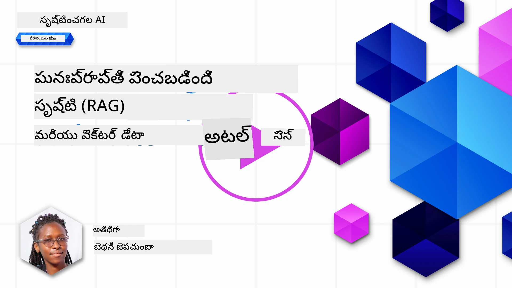
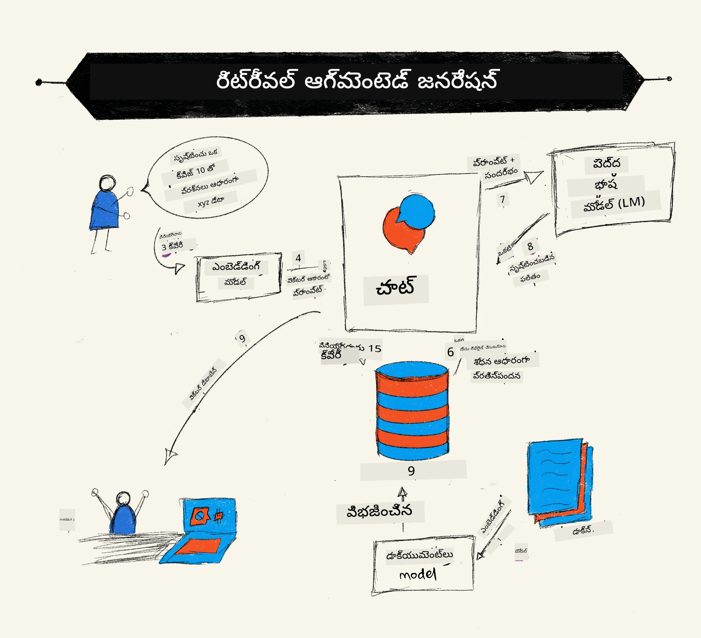
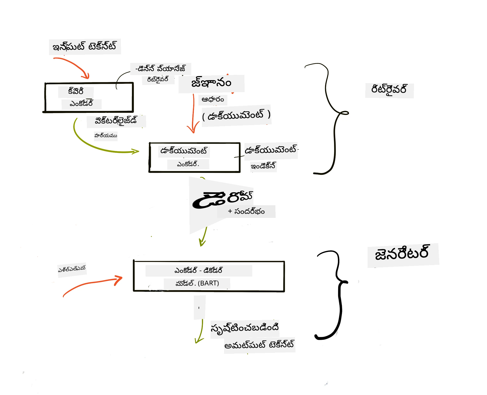
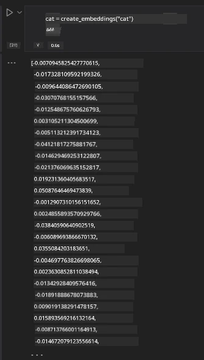

# రిట్రీవల్ ఆగ్మెంటెడ్ జనరేషన్ (RAG) మరియు వెక్టార్ డేటాబేస్‌లు

[](https://youtu.be/4l8zhHUBeyI?si=BmvDmL1fnHtgQYkL)

సెర్చ్ అప్లికేషన్ల పాఠంలో, మీ స్వంత డేటాను లార్జ్ లాంగ్వేజ్ మోడల్స్ (LLMs)లో ఎలా ఇంటిగ్రేట్ చేయాలో మేము సంక్షిప్తంగా నేర్చుకున్నాము. ఈ పాఠంలో, మీ డేటాను LLM అప్లికేషన్‌లో గ్రౌండింగ్ చేసే సంయుక్తాలు, ప్రక్రియ యొక్క యాంత్రికత మరియు డేటాను నిల్వ చేయడంవంటి పద్ధతులు, ఇందులో ఎంబెడ్డింగ్స్ మరియు టెక్స్ట్ రెండింటినీ కవర్ చేస్తాము.

> **వీడియో త్వరలో రాబోతోంది**

## పరిచయం

ఈ పాఠంలో మేము కింది విషయాలను కవర్ చేస్తాము:

- RAG కు పరిచయం, ఇది ఏమిటి మరియు ఇది AI (కృత్రిమ మేధస్సు)లో ఎందుకు ఉపయోగిస్తారు.

- వెక్టార్ డేటాబేస్‌లు ఏమిటి అర్థం చేసుకోవడం మరియు మా అప్లికేషన్ కోసం ఒకటి సృష్టించడం.

- RAG ని ఒక అప్లికేషన్‌లో ఎలా ఇంటిగ్రేట్ చేయాలో ప్రాక్టికల్ ఉదాహరణ.

## నేర్చుకునే లక్ష్యాలు

ఈ పాఠం పూర్తి చేసిన తరువాత, మీరు చేయగలుగుతారు:

- డేటా రిట్రీవల్ మరియు ప్రాసెసింగ్‌లో RAG ప్రాముఖ్యతను వివరించండి.

- RAG అప్లికేషన్ సెటప్ చేయడం మరియు మీ డేటాను LLM కి గ్రౌండ్ చేయడం

- LLM అప్లికేషన్లలో RAG మరియు వెక్టార్ డేటాబేస్‌ల సమర్థవంతమైన ఇంటిగ్రేషన్.

## మన పరిస్థితి: మన LLMలను మా స్వంత డేటాతో మెరుగుపరచడం

ఈ పాఠం కోసం, చాట్‌బాట్‌కు వివిధ విషయాల గురించి మరింత సమాచారం అందించేలా విద్యా స్టార్టప్‌లో మా స్వంత గమనికలను జోడించాలని మేము కోరుతున్నాము. మా చేత ఉన్న గమనికలను ఉపయోగించి, అభ్యాసకులు మెరుగ్గా అధ్యయనం చేసి, వివిధ అంశాలను అర్ధం చేసుకుని, తమ పరీక్షలకు మరింత సులభంగా సమీక్షించగలుగుతారు. మా పరిస్థితి సృష్టించడానికి, మేము ఉపయోగించబోతున్నాం:

- `Azure OpenAI:` మా చాట్‌బాట్ సృష్టించడానికి ఉపయోగించే LLM

- `AI for beginners' lesson on Neural Networks`: ఈ డేటా మా LLM ని గ్రౌండ్ చేయడానికి ఉంటుంది

- `Azure AI Search` మరియు `Azure Cosmos DB:` డేటాను నిల్వ చేయడానికి మరియు సెర్చ్ ఇండెక్స్ సృష్టించడానికి వెక్టార్ డేటాబేస్‌లు

వినియోగదారులు తమ గమనికల నుండి ప్రాక్టీస్ క్విజ్‌లు సృష్టించగలుగుతారు, రివిజన్ ఫ్లాష్ కార్డ్స్ తయారు చేసి, వాటిని సంక్షిప్త సమీక్షలుగా మార్చవచ్చు. ఆరంభించడానికి, RAG ఏమిటి మరియు అది ఎలా పని చేస్తుందో చూద్దాం:

## రిట్రీవల్ ఆగ్మెంటెడ్ జనరేషన్ (RAG)

LLM ఆధారిత చాట్‌బాట్ వినియోగదారు ప్రాంప్ట్‌లను ప్రాసెస్ చేసి స్పందనలు సృష్టిస్తుంది. ఇది ఇంటరాక్టివ్ గాను, వినియోగదారులతో విస్తృతమైన విషయాలపై చర్చించగలదిగాను రూపకల్పన చేయబడింది. అయితే, దీని స్పందనలు అందించిన సందర్భం మరియు ప్రాథమిక శిక్షణ డేటాని పరిమితం అవుతాయి. ఉదాహరణకు, GPT-4 జ్ఞాన కట్-ఆఫ్ సెప్టెంబర్ 2021 వరకు ఉంది, అంటే, ఆ కాలం తర్వాత జరిగిన సంఘటనల గురించి అది తెలుసుకోదు. అదనంగా, LLMల శిక్షణకు ఉపయోగించే డేటాలో వ్యక్తిగత గమనికలు లేదా సంస్థ ఉత్పత్తి మాన్యువల్ వంటి గోప్యమైన సమాచారం ఉండదు.

### RAGs (రిట్రీవల్ ఆగ్మెంటెడ్ జనరేషన్) ఎలా పని చేస్తాయో



మీరు మీ గమనికల నుండి క్విజ్‌లు సృష్టించే చాట్‌బాట్‌ను నడపాలని అనుకుంటే, మీరు జ్ఞాన బేస్‌కు కనెక్షన్ అవసరం అవుతుంది. ఇక్కడ RAG సహాయం చేస్తుంది. RAGలు ఈ విధంగా పనిచేస్తాయి:

- **జ్ఞాన బేస్:** రిట్రీవల్‌కు ముందు, ఈ పత్రాలను అందించి ప్రీప్రాసెస్ చేయాలి, సాధారణంగా పెద్ద పత్రాలను చిన్న భాగాలుగా విడగొట్టి, వాటిని టెక్స్ట్ ఎంబెడ్డింగ్‌లుగా మార్చి డేటాబేస్‌లో నిల్వ చేయడం జరుగుతుంది.

- **వినియోగదారు ప్రశ్న:** వినియోగదారు ఒక ప్రశ్న అడుగుతాడు

- **రిట్రీవల్:** వినియోగదారు ప్రశ్న అడిగినప్పుడు, ఎంబెడ్డింగ్ మోడల్ మన జ్ఞాన బేస్ నుండి సార్ధకమైన సమాచారాన్ని తీసుకుని, ప్రాంప్ట్‌లో చేర్చేందుకు మరింత సందర్భాన్ని అందిస్తుంది.

- **ఆగ్మెంటెడ్ జనరేషన్:** LLM తన స్పందనను తీసుకున్న డేటా ఆధారంగా మెరుగుపరుస్తుంది. ఇది అందించే ప్రతిస్పందన కేవలం ప్రీ-శిక్షణ డేటాపై కాకుండా, జోడించిన సందర్భం నుండి సంబంధిత సమాచారంతో కూడి ఉంటుంది. ఈ రిట్రీవ్ చేసిన డేటా LLM యొక్క ప్రతిస్పందనలను పెంచడానికి ఉపయోగించబడుతుంది. LLM తర్వాత వినియోగదారు ప్రశ్నకి జవాబు ఇస్తుంది.



RAGs రిట్రీవల్ ఆర్గిటెక్చర్ ట్రాన్స్‌ఫార్మర్స్‌తో అమలు చేయబడుతుంది, ఇది రెండు భాగాలతో ఉంటుంది: ఎంకోడర్ మరియు డీకోడర్. ఉదాహరణకి, వినియోగదారు ఒక ప్రశ్న అడిగితే, ఇన్‌పుట్ టెక్స్ట్‌ని వర్ణాల అర్థాన్ని సామరస్యంగా పట్టుకునే వెక్టర్లలో 'ఎంకోడ్' చేస్తారు, ఆ వెక్టర్లను మన డాక్యుమెంట్ ఇండెక్స్‌లో 'డీకోడ్' చేసి, వినియోగదారు ప్రశ్న ఆధారంగా కొత్త టెక్స్ట్ ఉత్పత్తి చేస్తుంది. LLM రెండు భాగాల ఎంకోడర్-డీకోడర్ మోడల్‌ని ఉపయోగించి అవుట్‌పుట్‌ సృష్టిస్తుంది.

ప్రతిపాదిత పేపర్ ప్రకారం RAG అమలులో రెండు విధానాలు: [Retrieval-Augmented Generation for Knowledge intensive NLP (natural language processing software) Tasks](https://arxiv.org/pdf/2005.11401.pdf?WT.mc_id=academic-105485-koreyst) ఉన్నాయి:

- **_RAG-Sequence_** - రిట్రీవ్ చేసిన పత్రాలను ఉపయోగించి వినియోగదారుని ప్రశ్నకు ఉత్తమ సమాధానాన్ని ఊహించడం

- **RAG-Token** - పత్రాలను ఉపయోగించి తదుపరి టోకెన్ ను జనరేట్ చేసి, తరువాత వాటిని రిట్రీవ్ చేసి వినియోగదారు ప్రశ్నకు జవాబు ఇవ్వడం

### మీరు RAGలు ఎందుకు ఉపయోగిస్తారు? 

- **సమాచారం యొక్క సంపద:** టెక్స్ట్ సమాధానాలు తాజా మరియు ప్రస్తుతంగా ఉండేలా చూస్తుంది. దీనివల్ల, స్పెసిఫిక్ డొమైన్స్ పనితీరును మెరుగుపరచడం కోసం లోపలి జ్ఞాన బేస్‌కు ప్రాప్తి లభిస్తుంది.

- వినియోగదారు ప్రశ్నలకు సందర్భం అందించడానికి జ్ఞాన బేస్‌లోని **పరిశీలించదగిన డేటా**ను ఉపయోగించి నक्कాలు తగ్గిస్తుంది.

- ఫైన్-ట్యూనింగ్ LLM కంటే ఇది **ఖర్చును తగ్గిస్తుంది** మరియు ఆర్థికంగా మంచిది.

## జ్ఞాన బేస్ సృష్టించడం

మా అప్లికేషన్ మా వ్యక్తిగత డేటా ఆధారంగా ఉంటుంది, అంటే AI For Beginners పాఠ్యक्रमంలోని న్యూరల్ నెట్‌వర్క్ పాఠం.

### వెక్టార్ డేటాబేస్‌లు

వెక్టార్ డేటాబేస్ అనేది సంప్రదాయ డేటాబేస్‌లతో పోల్చితే ప్రత్యేకమైనది, ఇది ఎంబెడ్డింగ్ చేసిన వెక్టర్లను నిల్వ చేయడానికి, నిర్వహించడానికి మరియు వెతకడానికి రూపొందించబడింది. ఇది డాక్యుమెంట్ల యొక్క సంఖ్యతాత్మక ప్రతినిధ్యాలను నిల్వ చేస్తుంది. డేటాను సంఖ్యాలుగా విడగొట్టడం మాకు AI వ్యవస్థకు డేటాను అర్థం చేసుకోవడం మరియు ప్రాసెస్ చేయడం సులభం చేస్తుంది.

LLMలకు వారు స్వీకరించగల టోకెన్ల సంఖ్య పరిమితి ఉన్నందున మనం ఎంబెడ్డింగ్స్‌ను వెక్టార్ డేటాబేస్‌లలో నిల్వ చేస్తాము. మొత్తం ఎంబెడ్డింగ్స్‌ని LLMకి పంపలేకపోయే వారు, వాటిని చిన్న భాగాలుగా విడగొట్టి, వినియోగదారు ప్రశ్న అడిగినప్పుడు ప్రశ్నకి అత్యంత సార్ధక మాదిరి ఎంబెడ్డింగ్స్‌తో పాటు ప్రాంప్ట్ ను తిరిగి ఇచ్చుతారు. చంకింగ్ ద్వారా LLMకి పంపే టోకెన్ల సంఖ్య ఖర్చు కూడా తగ్గుతుంది.

కొన్ని ప్రాచుర్యం పొందిన వెక్టార్ డేటాబేస్‌లు Azure Cosmos DB, Clarifyai, Pinecone, Chromadb, ScaNN, Qdrant మరియు DeepLake. మీరు క్రింది ఆజూర్ CLI కమాండ్ ఉపయోగించి Azure Cosmos DB మోడల్‌ని సృష్టించవచ్చు:

```bash
az login
az group create -n <resource-group-name> -l <location>
az cosmosdb create -n <cosmos-db-name> -r <resource-group-name>
az cosmosdb list-keys -n <cosmos-db-name> -g <resource-group-name>
```

### టెక్స్ట్ నుండి ఎంబెడ్డింగ్స్ వరకు

డేటా నిల్వ చేసేముందు, దాన్ని వెక్టార్ ఎంబెడ్డింగ్స్‌లోకి మార్చాల్సి ఉంటుంది. మీరు పెద్ద పత్రాలను లేదా పొడవైన టెక్స్ట్స్ అందుకుంటే, మీరు వాటిని మీ అనుమానాల ఆధారంగా చంక్‌లు చేస్తారు. చంకింగ్ చేయడం వాక్యస్థాయిలో లేదా పేరాగ్రాఫ్ స్థాయిలో చేయవచ్చు. చంకింగ్周ల చుట్టూ ఉన్న మాటల నుంచి అర్థాలు తీసుకుంటుంది కనుక, మీరు చంక్ కు అదనపు సందర్భం కూడా జోడించవచ్చు, ఉదాహరణకు పత్రం శీర్షికను లేదా చంక్ ముందు లేదా తర్వాత కొంత టెక్స్ట్ చేర్చడం. మీరు డేటాను క్రింద చూపిన విధంగా చంక్ చేయవచ్చు:

```python
def split_text(text, max_length, min_length):
    words = text.split()
    chunks = []
    current_chunk = []

    for word in words:
        current_chunk.append(word)
        if len(' '.join(current_chunk)) < max_length and len(' '.join(current_chunk)) > min_length:
            chunks.append(' '.join(current_chunk))
            current_chunk = []

    # చివరి భాగం కనీస పొడవు చేరకపోయినా, దాన్ని ఏమైనా జత చేయండి
    if current_chunk:
        chunks.append(' '.join(current_chunk))

    return chunks
```

చంక్ చేసిన తర్వాత, మేము మా టెక్స్ట్‌ను వేరువేరు ఎంబెడ్డింగ్ మోడల్స్ ఉపయోగించి ఎంబెడ్ చేస్తాము. మీరు ఉపయోగించగల కొన్ని మోడల్స్‌లో word2vec, OpenAI యొక్క ada-002, Azure కంప్యూటర్ విజన్ మరియు మరిన్ని ఉన్నాయి. మోడల్ ఎంపిక మీరు ఉపయోగించే భాషలు, ఎలం కోడ్ చేసే కంటెంట్ రకం (టెక్స్ట్/ఇమేజెస్/ఆడియో), ఇన్‌పుట్ పరిమాణం మరియు ఎంబెడ్డింగ్ అవుట్‌పుట్ పొడవు ఆధారంగా ఉంటుంది.

OpenAI యొక్క `text-embedding-ada-002` మోడల్ ఉపయోగించి ఎంబెడ్డింగ్ చేసిన టెక్స్ట్ యొక్క ఉదాహరణ ఇక్కడ ఉంది:


## రిట్రీవల్ మరియు వెక్టార్ సెర్చ్

వినియోగదారు ప్రశ్న అడిగినప్పుడు, రిట్రీవర్ దాన్ని క్వరీ ఎంకోడర్ ద్వారా వెక్టార్‌గా మార్చి, మన డాక్యుమెంట్ సెర్చ్ ఇండెక్స్‌లో సంభందిత వెక్టార్‌ల కోసం అన్వేషిస్తుంది. పూర్తి అయిన తర్వాత, ఇది ఇన్‌పుట్ వెక్టార్ మరియు డాక్యుమెంట్ వెక్టార్లను టెక్స్ట్‌గా మార్చి LLMకి పంపుతుంది.

### రిట్రీవల్

రిట్రీవల్ అంటే మనం సెర్చ్ క్రైటీరియాను తీర్చే పత్రాలను ఇండెక్స్ నుండి త్వరగా కనుగొనడానికి జరిగిన ప్రయత్నం. రిట్రీవర్ లక్ష్యం పత్రాలను తీసుకుని కాంటెక్ట్ అనుభందం చేయడం మరియు LLMని మీ డేటా పై గ్రౌండ్ చేయడం.

మన డేటాబేస్‌లో సెర్చ్ చేయడానికి పలు మార్గాలు ఉన్నాయి, ఉదాహరణకు:

- **కీవర్డ్ సెర్చ్** - టెక్స్ట్ సెర్చ్‌ల కోసం ఉపయోగిస్తారు

- **వెక్టార్ సెర్చ్** - డాక్యుమెంట్లను ఎంబెడ్డింగ్ మోడల్స్ ఉపయోగించి టెక్స్ట్ నుండి వెక్టార్ ప్రాతినిధ్యాలుగా మార్చి, పదాల అర్థం ఆధారంగా **సేమాంటిక్ సెర్చ్** చేయగలదు. రిట్రీవల్ వినియోగదారు ప్రశ్నకు అత్యంత సన్నిహితమైన వెక్టార్‌లను ప్రశ్ననబట్టి సాధించబడుతుంది.

- **హైబ్రిడ్** - కీవర్డ్ మరియు వెక్టార్ సెర్చ్ కలయిక.

రిట్రీవల్‌లో ఒక సమస్య ఏమిటంటే, డేటాబేస్‌లో ప్రశ్నకు సమానమైన ప్రత్యుత్తరములు లేకపోతే, సిస్టం ఉత్తమ సమాచారం ఇవ్వాలని ప్రయత్నిస్తుంది. కానీ మీరు సంబంధితత కోసం గరిష్ట దూరాన్ని సెట్ చేయడం లేదా కీవర్డ్ మరియు వెక్టార్ సెర్చ్ కలిపిన హైబ్రిడ్ సెర్చ్ ఉపయోగించవచ్చు. ఈ పాఠంలో మనం హైబ్రిడ్ సెర్చ్‌ని ఉపయోగిస్తాము, అంటే రెండు విధానాలు కలిపి. మన డేటాను చంక్స్ మరియు ఎంబెడ్డింగ్స్ కలిగిన కాలమ్స్ ఉన్న డేటాఫ్రేమ్‌లో నిల్వ చేస్తాము.

### వెక్టార్ సాదృశ్యం

రిట్రీవర్ జ్ఞాన డేటాబేస్‌లో సమీపించి ఉండే ఎంబెడ్డింగ్స్ కోసం అన్వేషిస్తుంది, ఇవి లొకేషన్ పరంగా తక్కువ దూరంలో ఉన్న సహచర లక్ష్యాలు, అంటే తత్వం పరంగా సమానమైన వచనాలు. వినియోగదారు ప్రశ్న అడిగినపుడు, అదనంగా ఆ ప్రశ్న ఎంబెడ్ చేసి సమానమైన ఎంబెడ్డింగ్స్‌తో సరిపోల్చబడుతుంది. వెక్టార్‌ల మధ్య సారూప్యతను కొలిచే సాధారణ ప్రమాణం కోసైన్ సాపేక్షత (cosine similarity), ఇది రెండు వెక్టార్‌ల మధ్య కోణంపై ఆధారపడి ఉంటుంది.

సాదృశ్యత కొలవడానికి మరో ఎంపికలు కూడా ఉన్నాయి, ఉదాహరణకు యూక్లిడియన్ దూరం (vector endpoints మధ్య సరళరకేరి), మరియు డాట్ ప్రొడక్ట్ (రెండు వెక్టార్‌ల సంబంధిత అంశాల ఫలితాల సమాహారం).

### సెర్చ్ ఇండెక్స్

రిట్రీవల్ చేసేటప్పుడు, సెర్చ్ నిర్వహించడానికి మన జ్ఞాన బేస్ కోసం సెర్చ్ ఇండెక్స్ నిర్మించాలి. ఇండెక్స్ మన ఎంబెడ్డింగ్స్ నిల్వ చేసి, పెద్ద డాటాబేస్‌లో కూడా అత్యంత సమీప చంక్సను త్వరగా రిట్రీవ్ చేస్తుంది. మనం స్థానికంగా ఇండెక్స్ సృష్టించవచ్చు:

```python
from sklearn.neighbors import NearestNeighbors

embeddings = flattened_df['embeddings'].to_list()

# శోధన సూచికను సృష్టించండి
nbrs = NearestNeighbors(n_neighbors=5, algorithm='ball_tree').fit(embeddings)

# సూచికను ప్రశ్నించడానికి, మీరు kneighbors ఫంక్షన్‌ని ఉపయోగించవచ్చు
distances, indices = nbrs.kneighbors(embeddings)
```

### రీ-రాకింగ్

డేటాబేస్‌లో ప్రశ్న వేసిన తర్వాత, ఫలితాలను ముఖ్యమైనదిగా శ్రేణి పెడతారు. ఒక రీ-రాంకింగ్ LLM మెషిన్ లెర్నింగ్ ఉపయోగించి సెర్చ్ ఫలితాల సంబంధితతను మెరుగుపరుస్తుంది. Azure AI Search ఉపయోగించి రీ-రాంకింగ్ ఆటోమేటిక్‌గా సెమాంటిక్ రీ-రాంకర్ ద్వారా జరుగుతుంది. నేరెస్ట్ నెయిబర్లను ఉపయోగించి రీ-రాంకింగ్ ఎలా జరుగుతుందో ఉదాహరణ:

```python
# అతి సమానమైన డాక్యుమెంట్లను కనుగొనండి
distances, indices = nbrs.kneighbors([query_vector])

index = []
# అతి సమానమైన డాక్యుమెంట్లను ముద్రించండి
for i in range(3):
    index = indices[0][i]
    for index in indices[0]:
        print(flattened_df['chunks'].iloc[index])
        print(flattened_df['path'].iloc[index])
        print(flattened_df['distances'].iloc[index])
    else:
        print(f"Index {index} not found in DataFrame")
```

## మొత్తం సమ్మేళనం

చివరి దశలో మా LLMని ఈ నిర్మాణంలో చేర్చడం ద్వారా మన డేటాపై ఆధారపడిన స్పందనలను పొందగలుగుతాము. దీన్ని క్రింద చూపిన విధంగా అమలు చేయవచ్చు:

```python
user_input = "what is a perceptron?"

def chatbot(user_input):
    # ప్రశ్నను ఒక క్వరీ వెక్టరుగా మార్చండి
    query_vector = create_embeddings(user_input)

    # అత్యంత సమానమైన డాక్యుమెంట్లను కనుగొనండి
    distances, indices = nbrs.kneighbors([query_vector])

    # సందర్భం అందించడానికి డాక్యుమెంట్లను క్వరీకి జోడించండి
    history = []
    for index in indices[0]:
        history.append(flattened_df['chunks'].iloc[index])

    # చరిత్ర మరియు వినియోగదారు ఇన్పుట్‌ను కలపండి
    history.append(user_input)

    # ఒక సందేశం ఆబ్జెక్ట్‌ని సృష్టించండి
    messages=[
        {"role": "system", "content": "You are an AI assistant that helps with AI questions."},
        {"role": "user", "content": "\n\n".join(history) }
    ]

    # ప్రతిస్పందనను ఉత్పత్తి చేయడానికి Responses APIని ఉపయోగించండి
    response = client.responses.create(
        model="gpt-5-mini",
        max_output_tokens=800,
        input=messages,
        store=False,
    )

    return response.output_text

chatbot(user_input)
```

## మన అప్లికేషన్‌ను మూల్యాంకనం చేయడం

### మూల్యాంకన ప్రమాణాలు

- సరఫరా చేసిన స్పందనల నాణ్యత: అది సహజమైన, ప్రవాహమైన మరియు మానవార్ధకంగా శబ్దిస్తుందో లేదో నిర్ధారించడం

- డేటా గ్రౌండెడ్‌నెస్: అందించిన డాక్యుమెంట్ల నుంచి వచ్చిన స్పందన గానీ లేదో మూల్యాంకనం

- సంబంధితత: స్పందన ప్రశ్నకు సరిపోతుందో, సంబంధం కలిగినదిగా ఉందో పరీక్షించడం

- ప్రవాహం: స్పందన వ్యాకరణపరంగా అర్థవంతమైందో లేదో

## RAG (రిట్రీవల్ ఆగ్మెంటెడ్ జనరేషన్) మరియు వెక్టార్ డేటాబేస్‌ల ఉపయోగాల సందర్భాలు

అనేక విభిన్న ఉపయోగాలు ఉన్నాయి, ఫంక్షన్ కాల్స్ తో మీ అప్లికేషన్ మెరుగుపడుతుంది:

- ప్రశ్న-జవాబు: మీ సంస్థ డేటాను చాట్‌లో గ్రౌండ్ చేసి, ఉద్యోగులు ప్రశ్నల అడగడానికి ఉపయోగించేలా చేయడం.

- సిఫార్సు వ్యవస్థలు: మీరు సినిమాలు, రెస్టారెంట్లు మరియు మరిన్ని వంటి అత్యంత సమాన విలువలు సరిపోల్చే వ్యవస్థ ను సృష్టించవచ్చు.

- చాట్‌బాట్ సేవలు: చాట్ చరిత్ర నిల్వ చేసి, వినియోగదారు డేటా ఆధారంగా సంభాషణను వ్యక్తిగతీకరించగలుగుతారు.

- వెక్టార్ ఎంబెడ్డింగ్స్ ఆధారంగా ఇమేజ్ సెర్చ్, ఇది ఇమేజ్ గుర్తింపు మరియు అసాధారణత గుర్తింపు కోసం ఉపయోగకరం.

## సారాంశం

మేము RAG యొక్క ప్రాథమిక ప్రాంతాలను కవర్ చేశాము, అప్లికేషన్ లో మా డేటా జోడించడం, వినియోగదారు ప్రశ్న మరియు అవుట్‌పుట్. RAG సృష్టించడం సులభంగా చేయడానికి, మీరు Semanti Kernel, Langchain లేదా Autogen లాంటి ఫ్రేమ్‌వర్కులను ఉపయోగించవచ్చు.

## అసైన్‌మెంట్

రిట్రీవల్ ఆగ్మెంటెడ్ జనరేషన్ (RAG) నేర్చుకోవడం కొనసాగించడానికి మీరు నిర్మించవచ్చు:

- మీ ఇష్టమైన ఫ్రేమ్‌వర్క్ ఉపయోగించి అప్లికేషన్ కోసం ఫ్రంట్-ఎండ్ సృష్టించండి

- LangChain లేదా Semantic Kernel లాంటి ఫ్రేమ్‌వర్క్ ఉపయోగించి మీ అప్లికేషన్‌ను మళ్లీ సృష్టించండి.

పాఠం పూర్తి చేసినందుకు అభినందనలు 👏.

## నేర్చడం ఇక్కడే నిలిచిపోవదు, ప్రయాణం కొనసాగించండి

ఈ పాఠం పూర్తి చేసిన తరువాత, మా [సృష్టించు AI నేర్చుకోవడం సేకరణ](https://aka.ms/genai-collection?WT.mc_id=academic-105485-koreyst)ను చూసి, మీ జనరేటివ్ AI జ్ఞానాన్ని పెంచుకునే ప్రయత్నం కొనసాగించండి!

---

<!-- CO-OP TRANSLATOR DISCLAIMER START -->
**అస్వీకరణ**:
ఈ పత్రం AI అనువాద సేవ [Co-op Translator](https://github.com/Azure/co-op-translator) ఉపయోగించి అనువదించబడింది. మేము ఖచ్చితత్వానికి ప్రయత్నిస్తున్నప్పటికీ, ఆటోమేటెడ్ అనువాదాలు తప్పులు లేదా అసమగ్రతలను కలిగి ఉండవచ్చు. దాని స్వదేశ భాషలో ఉన్న అసలు పత్రాన్ని అధికారం కలిగిన మూలంగా పరిగణించాలి. కీలకమైన సమాచారం కోసం, ప్రొఫెషనల్ మానవ అనువాదాన్ని సిఫారసు చేస్తాము. ఈ అనువాదం ఉపయోగం వల్ల కలిగే ఏవైనా అపార్థాలు లేదా తప్పుదారులు కోసం మేము బాధ్యత వహించము.
<!-- CO-OP TRANSLATOR DISCLAIMER END -->