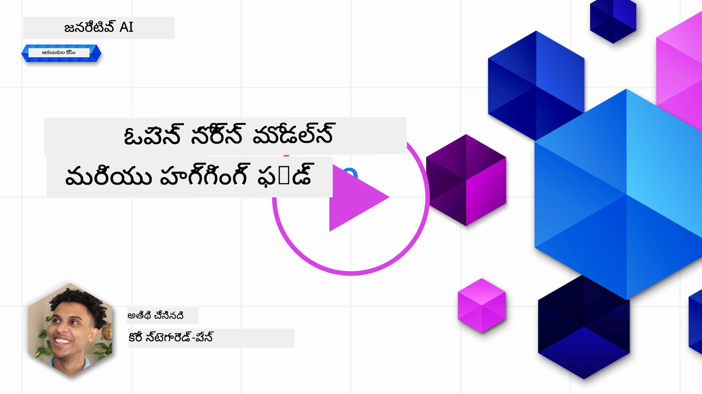
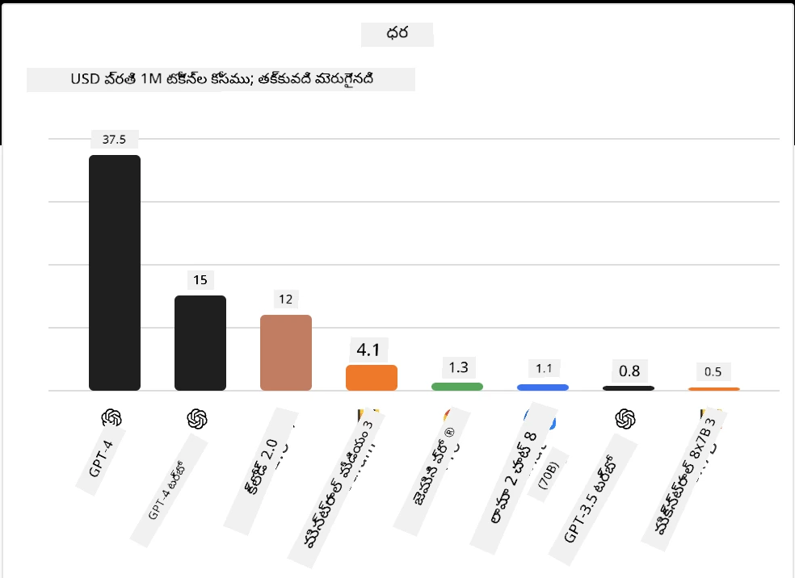
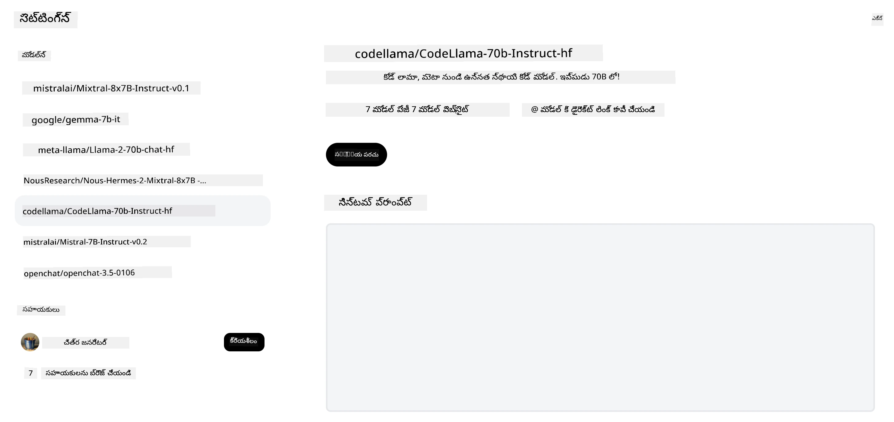
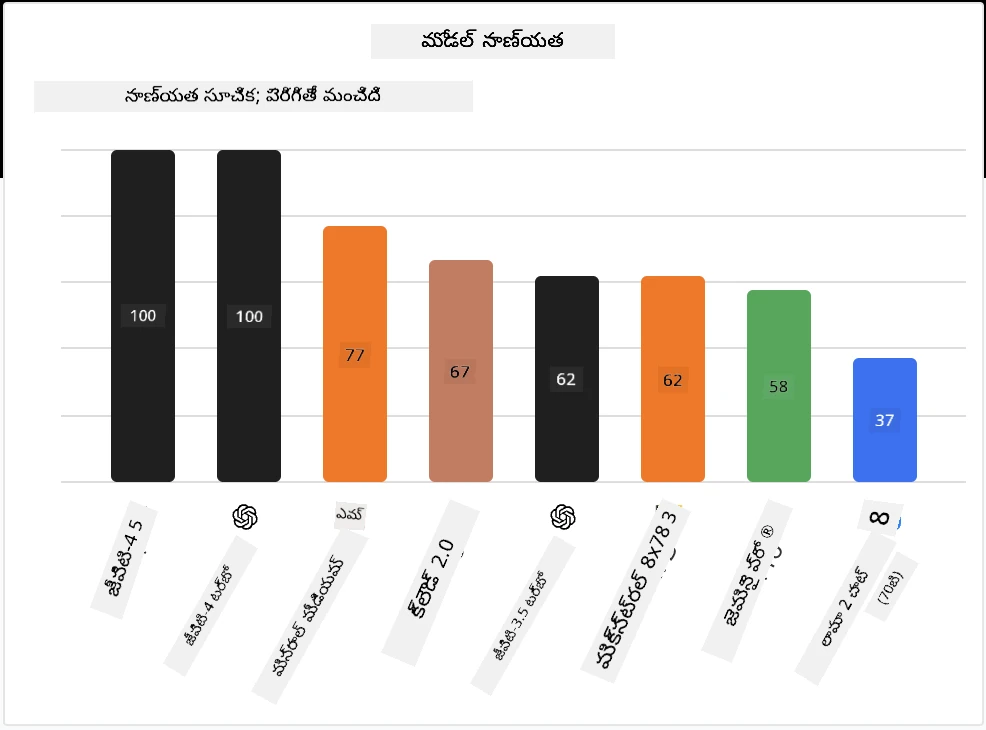

<!--
CO_OP_TRANSLATOR_METADATA:
{
  "original_hash": "85b754d4dc980f270f264d17116d9a5f",
  "translation_date": "2025-12-19T18:37:38+00:00",
  "source_file": "16-open-source-models/README.md",
  "language_code": "te"
}
-->

## పరిచయం

ఓపెన్-సోర్స్ LLMల ప్రపంచం ఉత్సాహభరితంగా మరియు నిరంతరం అభివృద్ధి చెందుతోంది. ఈ పాఠం ఓపెన్ సోర్స్ మోడల్స్‌పై లోతైన అవగాహనను అందించడానికి లక్ష్యంగా ఉంది. మీరు ప్రొప్రైటరీ మోడల్స్ ఓపెన్ సోర్స్ మోడల్స్‌తో ఎలా పోల్చబడతాయో తెలుసుకోవాలనుకుంటే, ["Exploring and Comparing Different LLMs" పాఠం](../02-exploring-and-comparing-different-llms/README.md?WT.mc_id=academic-105485-koreyst)కి వెళ్లండి. ఈ పాఠం ఫైన్-ట్యూనింగ్ అంశాన్ని కూడా కవర్ చేస్తుంది, కానీ మరింత వివరమైన వివరణను ["Fine-Tuning LLMs" పాఠం](../18-fine-tuning/README.md?WT.mc_id=academic-105485-koreyst)లో చూడవచ్చు.

## నేర్చుకునే లక్ష్యాలు

- ఓపెన్ సోర్స్ మోడల్స్ గురించి అవగాహన పొందడం  
- ఓపెన్ సోర్స్ మోడల్స్‌తో పని చేయడంలో లాభాలు అర్థం చేసుకోవడం  
- Hugging Face మరియు Azure AI Studioలో అందుబాటులో ఉన్న ఓపెన్ మోడల్స్‌ను అన్వేషించడం  

## ఓపెన్ సోర్స్ మోడల్స్ అంటే ఏమిటి?

ఓపెన్ సోర్స్ సాఫ్ట్‌వేర్ వివిధ రంగాలలో సాంకేతికత అభివృద్ధిలో కీలక పాత్ర పోషించింది. ఓపెన్ సోర్స్ ఇనిషియేటివ్ (OSI) [సాఫ్ట్‌వేర్ కోసం 10 ప్రమాణాలు](https://web.archive.org/web/20241126001143/https://opensource.org/osd?WT.mc_id=academic-105485-koreyst) నిర్వచించింది, అవి ఓపెన్ సోర్స్‌గా వర్గీకరించబడటానికి అవసరం. సోర్స్ కోడ్ OSI ఆమోదించిన లైసెన్స్ కింద స్పష్టంగా పంచబడాలి.

LLMల అభివృద్ధి సాఫ్ట్‌వేర్ అభివృద్ధికి సమానమైన అంశాలు కలిగి ఉన్నప్పటికీ, ప్రక్రియ పూర్తిగా అదే కాదు. LLMల సందర్భంలో ఓపెన్ సోర్స్ నిర్వచనంపై సమాజంలో చాలా చర్చలు జరిగాయి. ఒక మోడల్ సంప్రదాయ ఓపెన్ సోర్స్ నిర్వచనానికి అనుగుణంగా ఉండాలంటే, క్రింది సమాచారం ప్రజలకు అందుబాటులో ఉండాలి:

- మోడల్ శిక్షణకు ఉపయోగించిన డేటాసెట్‌లు  
- శిక్షణలో భాగంగా పూర్తి మోడల్ వెయిట్స్  
- మూల్యాంకన కోడ్  
- ఫైన్-ట్యూనింగ్ కోడ్  
- పూర్తి మోడల్ వెయిట్స్ మరియు శిక్షణ మెట్రిక్స్  

ప్రస్తుతం ఈ ప్రమాణాలకు సరిపోయే కొన్ని మోడల్స్ మాత్రమే ఉన్నాయి. [Allen Institute for Artificial Intelligence (AllenAI) రూపొందించిన OLMo మోడల్](https://huggingface.co/allenai/OLMo-7B?WT.mc_id=academic-105485-koreyst) ఈ వర్గంలోకి వస్తుంది.

ఈ పాఠంలో, మేము "ఓపెన్ మోడల్స్" అని పిలుస్తాము, ఎందుకంటే రాయబడిన సమయంలో అవి పై ప్రమాణాలకు పూర్తిగా సరిపోవకపోవచ్చు.

## ఓపెన్ మోడల్స్ లాభాలు

**అత్యంత అనుకూలీకరణ సాధ్యం** - ఓపెన్ మోడల్స్ శిక్షణ వివరాలతో విడుదల చేయబడినందున, పరిశోధకులు మరియు అభివృద్ధికర్తలు మోడల్ అంతర్గతాలను మార్చవచ్చు. ఇది నిర్దిష్ట పనికి లేదా అధ్యయన రంగానికి ఫైన్-ట్యూన్ చేయబడిన ప్రత్యేక మోడల్స్ సృష్టించడానికి సహాయపడుతుంది. ఉదాహరణకు కోడ్ జనరేషన్, గణిత చర్యలు మరియు జీవశాస్త్రం.

**ఖర్చు** - ఈ మోడల్స్ ఉపయోగించడం మరియు అమలు చేయడం కోసం టోకెన్‌కు ఖర్చు ప్రొప్రైటరీ మోడల్స్ కంటే తక్కువ. జనరేటివ్ AI అప్లికేషన్లు నిర్మిస్తున్నప్పుడు, మీ ఉపయోగానికి ఈ మోడల్స్ పనితీరు మరియు ధరను పరిశీలించడం అవసరం.

  
మూలం: Artificial Analysis

**సౌలభ్యం** - ఓపెన్ మోడల్స్‌తో పని చేయడం ద్వారా మీరు వివిధ మోడల్స్ ఉపయోగించడంలో లేదా వాటిని కలపడంలో సౌలభ్యం పొందుతారు. ఉదాహరణకు [HuggingChat Assistants](https://huggingface.co/chat?WT.mc_id=academic-105485-koreyst)లో యూజర్ ఇంటర్‌ఫేస్‌లో నేరుగా మోడల్ ఎంచుకోవచ్చు:

## వివిధ ఓపెన్ మోడల్స్ అన్వేషణ

### Llama 2

[LLama2](https://huggingface.co/meta-llama?WT.mc_id=academic-105485-koreyst), మెటా అభివృద్ధి చేసిన ఓపెన్ మోడల్, చాట్ ఆధారిత అప్లికేషన్ల కోసం ఆప్టిమైజ్ చేయబడింది. దీని ఫైన్-ట్యూనింగ్ పద్ధతి పెద్ద పరిమాణంలో సంభాషణ మరియు మానవ అభిప్రాయాన్ని కలిగి ఉంది. ఈ పద్ధతితో, మోడల్ మానవ అంచనాలకు అనుగుణంగా ఫలితాలు ఇస్తుంది, ఇది మెరుగైన యూజర్ అనుభవాన్ని అందిస్తుంది.

Llama యొక్క ఫైన్-ట్యూన్ చేసిన కొన్ని ఉదాహరణలు [Japanese Llama](https://huggingface.co/elyza/ELYZA-japanese-Llama-2-7b?WT.mc_id=academic-105485-koreyst), జపనీస్‌లో ప్రత్యేకత కలిగినది మరియు [Llama Pro](https://huggingface.co/TencentARC/LLaMA-Pro-8B?WT.mc_id=academic-105485-koreyst), బేస్ మోడల్ మెరుగుపరిచిన వెర్షన్.

### Mistral

[Mistral](https://huggingface.co/mistralai?WT.mc_id=academic-105485-koreyst) ఒక ఓపెన్ మోడల్, ఇది అధిక పనితీరు మరియు సామర్థ్యంపై దృష్టి పెట్టింది. ఇది Mixture-of-Experts పద్ధతిని ఉపయోగిస్తుంది, ఇది ప్రత్యేక నిపుణుల మోడల్స్ సమూహాన్ని ఒక సిస్టమ్‌గా కలిపి, ఇన్‌పుట్ ఆధారంగా కొన్ని మోడల్స్‌ను ఎంచుకుంటుంది. ఇది గణనను మరింత సమర్థవంతంగా చేస్తుంది, ఎందుకంటే మోడల్స్ తమ ప్రత్యేకత ఉన్న ఇన్‌పుట్‌లను మాత్రమే ప్రాసెస్ చేస్తాయి.

Mistral యొక్క ఫైన్-ట్యూన్ చేసిన కొన్ని ఉదాహరణలు [BioMistral](https://huggingface.co/BioMistral/BioMistral-7B?text=Mon+nom+est+Thomas+et+mon+principal?WT.mc_id=academic-105485-koreyst), వైద్య రంగంపై దృష్టి పెట్టినది మరియు [OpenMath Mistral](https://huggingface.co/nvidia/OpenMath-Mistral-7B-v0.1-hf?WT.mc_id=academic-105485-koreyst), గణిత గణన చేస్తుంది.

### Falcon

[Falcon](https://huggingface.co/tiiuae?WT.mc_id=academic-105485-koreyst) టెక్నాలజీ ఇన్నోవేషన్ ఇనిస్టిట్యూట్ (**TII**) రూపొందించిన LLM. Falcon-40B 40 బిలియన్ పారామీటర్లపై శిక్షణ పొందింది, ఇది GPT-3 కంటే తక్కువ కంప్యూట్ బడ్జెట్‌తో మెరుగైన పనితీరు చూపిస్తుంది. ఇది FlashAttention అల్గోరిథం మరియు మల్టిక్వెరీ అటెన్షన్ ఉపయోగంతో సాధ్యమైంది, ఇది ఇన్ఫరెన్స్ సమయంలో మెమరీ అవసరాలను తగ్గిస్తుంది. ఈ తగ్గిన ఇన్ఫరెన్స్ సమయంతో, Falcon-40B చాట్ అప్లికేషన్లకు అనుకూలంగా ఉంటుంది.

Falcon యొక్క ఫైన్-ట్యూన్ చేసిన కొన్ని ఉదాహరణలు [OpenAssistant](https://huggingface.co/OpenAssistant/falcon-40b-sft-top1-560?WT.mc_id=academic-105485-koreyst), ఓపెన్ మోడల్స్‌పై నిర్మించిన అసిస్టెంట్ మరియు [GPT4ALL](https://huggingface.co/nomic-ai/gpt4all-falcon?WT.mc_id=academic-105485-koreyst), బేస్ మోడల్ కంటే మెరుగైన పనితీరు అందిస్తుంది.

## ఎలా ఎంచుకోవాలి

ఓపెన్ మోడల్ ఎంచుకోవడానికి ఒకే సమాధానం లేదు. ప్రారంభించడానికి మంచి స్థలం Azure AI Studio యొక్క టాస్క్ ఫిల్టర్ ఫీచర్ ఉపయోగించడం. ఇది మోడల్ శిక్షణ పొందిన పనుల రకాలను అర్థం చేసుకోవడంలో సహాయపడుతుంది. Hugging Face కూడా కొన్ని మెట్రిక్స్ ఆధారంగా ఉత్తమ పనితీరు చూపే మోడల్స్‌ను చూపించే LLM లీడర్బోర్డ్ నిర్వహిస్తుంది.

వివిధ రకాల LLMలను పోల్చాలనుకుంటే, [Artificial Analysis](https://artificialanalysis.ai/?WT.mc_id=academic-105485-koreyst) మరో గొప్ప వనరు:

  
మూలం: Artificial Analysis

ఒక నిర్దిష్ట ఉపయోగానికి పని చేస్తున్నప్పుడు, అదే రంగంపై దృష్టి పెట్టిన ఫైన్-ట్యూన్ చేసిన వెర్షన్లను వెతకడం సమర్థవంతం. మీ మరియు మీ వినియోగదారుల అంచనాల ప్రకారం ఎలా పనితీరు చూపిస్తాయో చూడటానికి అనేక ఓపెన్ మోడల్స్‌తో ప్రయోగించడం మంచి ఆచారం.

## తదుపరి దశలు

ఓపెన్ మోడల్స్ గురించి మంచి విషయం ఏమిటంటే, వాటితో త్వరగా పని ప్రారంభించవచ్చు. ఇక్కడ చర్చించిన మోడల్స్ కలిగిన ప్రత్యేక Hugging Face సేకరణను కలిగిన [Azure AI Foundry Model Catalog](https://ai.azure.com?WT.mc_id=academic-105485-koreyst)ని చూడండి.

## నేర్చుకోవడం ఇక్కడ ఆగదు, ప్రయాణం కొనసాగించండి

ఈ పాఠం పూర్తి చేసిన తర్వాత, మా [Generative AI Learning collection](https://aka.ms/genai-collection?WT.mc_id=academic-105485-koreyst)ని చూడండి, మీ జనరేటివ్ AI జ్ఞానాన్ని మరింత పెంచుకోండి!

---

<!-- CO-OP TRANSLATOR DISCLAIMER START -->
**అస్పష్టత**:  
ఈ పత్రాన్ని AI అనువాద సేవ [Co-op Translator](https://github.com/Azure/co-op-translator) ఉపయోగించి అనువదించబడింది. మేము ఖచ్చితత్వానికి ప్రయత్నించినప్పటికీ, ఆటోమేటెడ్ అనువాదాల్లో పొరపాట్లు లేదా తప్పిదాలు ఉండవచ్చు. మూల పత్రం దాని స్వదేశీ భాషలో అధికారిక మూలంగా పరిగణించాలి. ముఖ్యమైన సమాచారానికి, ప్రొఫెషనల్ మానవ అనువాదం సిఫార్సు చేయబడుతుంది. ఈ అనువాదం వాడకంలో ఏర్పడిన ఏవైనా అపార్థాలు లేదా తప్పుదారుల కోసం మేము బాధ్యత వహించము.
<!-- CO-OP TRANSLATOR DISCLAIMER END -->