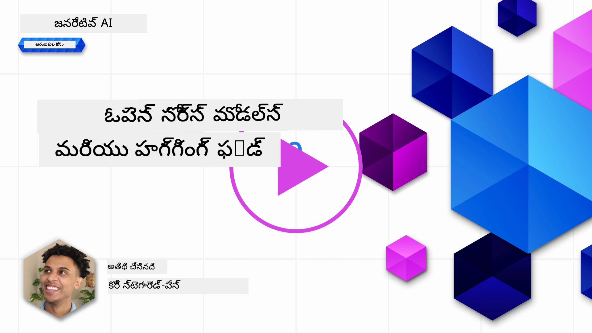
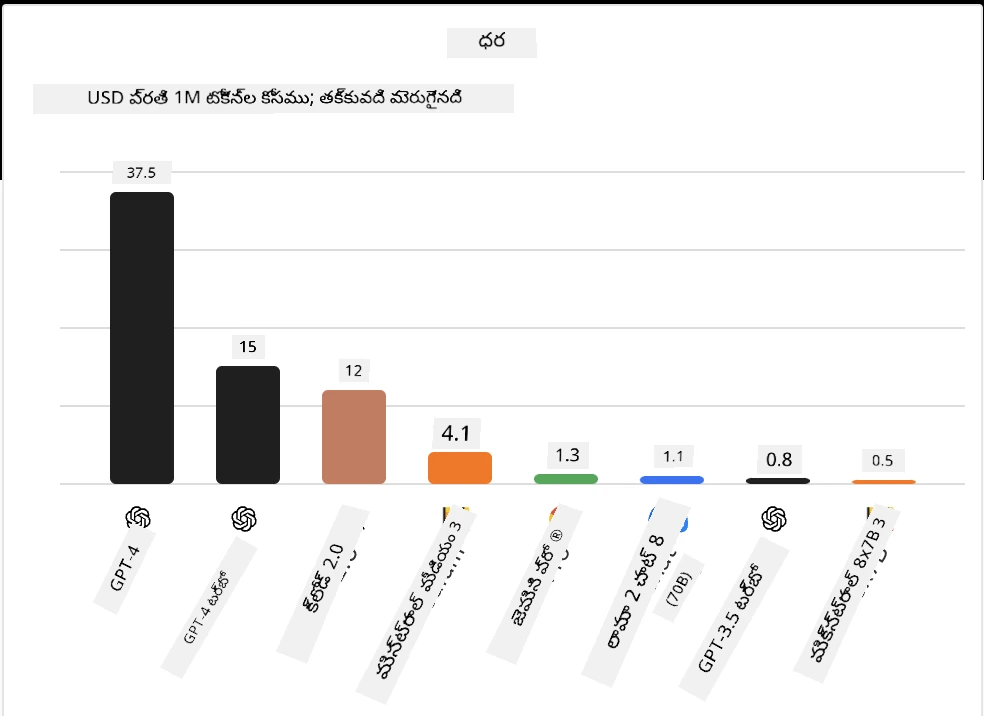
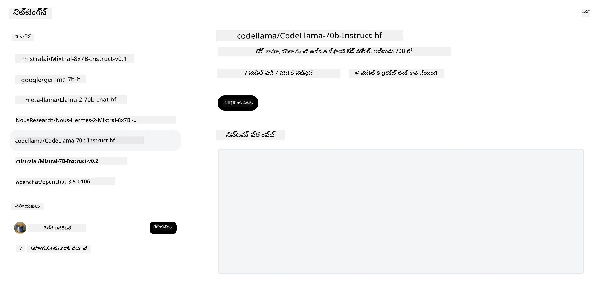
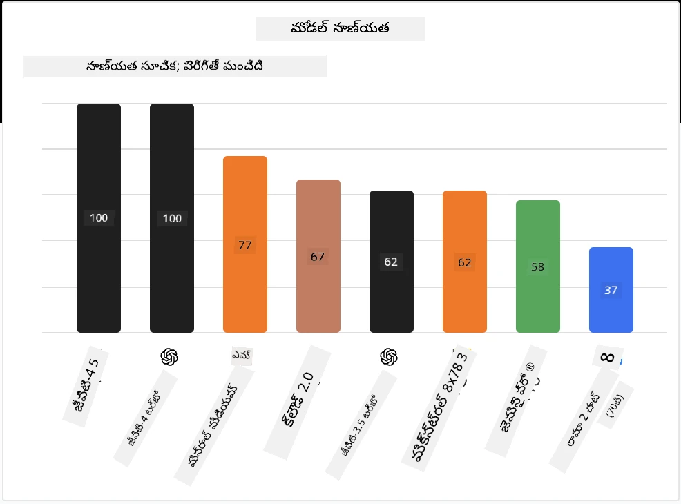

## ప్రవేశం

ఓపెన్ సోర్స్ LLM ల ప్రపంచం సార్థకంగా మారుతున్నది మరియు నిరంతరం అభివృద్ధి చెందుతోంది. ఈ పాఠం ఓపెన్ సోర్స్ మోడల్స్ గురించి లోతైన అవగాహనను అందించడమే లక్ష్యం. మీరు ప్రొప్రైటరీ మోడల్స్ ఓపెన్ సోర్స్ మోడల్స్ తో ఎలా పోల్చుకుంటాయో తెలుసుకోవాలనుకుంటే, ["Exploring and Comparing Different LLMs" పాఠం](../02-exploring-and-comparing-different-llms/README.md?WT.mc_id=academic-105485-koreyst) కోసమే చూడండి. ఈ పాఠం ఫైన్-ట్యూనింగ్ అంశాన్ని కూడా కవర్ చేస్తుంది కానీ మరింత వివరణాత్మక వివరాలు ["Fine-Tuning LLMs" పాఠం](../18-fine-tuning/README.md?WT.mc_id=academic-105485-koreyst) లో లభిస్తాయి.

## నేర్చుకునే లక్ష్యాలు

- ఓపెన్ సోర్స్ మోడల్స్ గురించి అవగాహన పొందడం
- ఓపెన్ సోర్స్ మోడల్స్ తో పనిచేయడంలో లభించే ప్రయోజనాలు అర్థం చేసుకోవడం
- Hugging Face మరియు Microsoft Foundry మోడల్ క్యాటలాగ్ లో అందుబాటులో ఉన్న ఓపెన్ మోడల్స్ ను అన్వేషించడం

## ఓపెన్ సోర్స్ మోడల్స్ అంటే ఏమిటి?

ఓపెన్ సోర్స్ సాఫ్ట్‌వేర్ వివిధ రంగాలలో సాంకేతికత అభివృద్ధిలో కీలక పాత్రను పోషించింది. ఓపెన్ సోర్స్ ఇనిషియేటివ్ (OSI) ఓపెన్ సోర్స్ గా తరగతీకరించబడే సాఫ్ట్‌వేర్‌కి [10 ప్రమాణాలు](https://web.archive.org/web/20241126001143/https://opensource.org/osd?WT.mc_id=academic-105485-koreyst) నిర్వచించింది. సోర్స్ కోడ్ OSI ఆమోదించిన లైసెన్స్ కింద స్పష్టంగా పంచబడాలి.

LLM ల అభివృద్ధి సాఫ్ట్‌వేర్ అభివృద్ధికి సమానమైన అంశాలున్నప్పటికీ, ప్రక్రియ పూర్తిగా అదే కాదు. దీని మాదిరిగా LLM ల యొక్క కంటెక్స్టులో ఓపెన్ సోర్స్ నిర్వచనం గురించి కమ్యూనిటీ లో చాల చర్చలు ఉన్నాయి. ఒక మోడల్ సాంప్రదాయ ఓపెన్ సోర్స్ నిర్వచనానికి సరిపోవాలంటే, క్రింది సమాచారం అందుబాటులో ఉండాలి:

- మోడల్ శిక్షణ కోసం ఉపయోగించిన డేటాసెట్లు.
- శిక్షణలో భాగంగా పూర్తి మోడల్ వెయిట్లు.
- మూల్యాంకన కోడ్.
- ఫైన్-ట్యూనింగ్ కోడ్.
- పూర్తి మోడల్ వెయిట్లు మరియు శిక్షణ ప్రమాణాలు.

ప్రస్తుతం ఈ ప్రమాణాలకు సరిపడే కొద్ది మోడల్స్ మాత్రమే ఉన్నాయి. [అలెన్ ఇన్స్టిట్యూట్ ఫర్ ఆర్టిఫిషియల్ ఇంటెలిజెన్స్ (AllenAI) రూపొందించిన OLMo మోడల్](https://huggingface.co/allenai/OLMo-7B?WT.mc_id=academic-105485-koreyst) ఈ వర్గంలోని ఒకటి.

ఈ పాఠం లో, ముందుకు ఈ మోడల్స్ ను "ఓపెన్ మోడల్స్" గా సూచిస్తాము ఎందుకంటే ప్రస్తుతం వాటి పై పేర్కొన్న ప్రమాణాలు అన్ని సరిపోదు.

## ఓపెన్ మోడల్స్ ల ప్రయోజనాలు

**అత్యంత అనుకూలీకరించగలిగే** - ఓపెన్ మోడల్స్ లో శిక్షణ సమాచారాన్ని వివరంగా విడుదల చేస్తారు కాబట్టి, పరిశోధకులు మరియు అభివృద్ధిదారులు మోడల్ అంతర్గతాలను మార్చవచ్చు. ఇది ఒక నిర్దిష్ట పని లేదా అధ్యయన ప్రాంతానికి ఫైన్-ట్యూన్ చేసిన ప్రత్యేక మోడల్స్ సృష్టించడానికి అనుమతిస్తుంది. ఉదాహరణలకు కోడ్ జనరేషన్, గణిత చర్యలు మరియు జీవశాస్త్రం ఉన్నాయి.

**ఖర్చు** - ఈ మోడల్స్ ఉపయోగించడం మరియు అమలు చేయడానికి టోకెన్ ప్రకారం ఖర్చు ప్రొప్రైటరీ మోడల్స్ కంటే తక్కువ. జనరేటివ్ AI అప్లికేషన్ లను నిర్మించినప్పుడు, పనితనాన్ని ధరతో పోల్చుతూ మీ ఉపయోగ సందర్భంలో ఈ మోడల్స్ తో పనిచేసే సమయంలో చూసుకోవాలి.

మూలం: ఆర్టిఫిషియల్ అనాలిసిస్

**లవచికత** - ఓపెన్ మోడల్స్ తో పనిచేయడం ద్వారా మీరు విభిన్న మోడల్స్ ఉపయోగించడంలో లేదా వాటిని కలిపి ఉపయోగించడంలో సరళత కలుగుతుంది. ఉదాహరణకి [HuggingChat అసిస్టెంట్స్](https://huggingface.co/chat?WT.mc_id=academic-105485-koreyst) ఉన్నాయి, ఇక్కడ వినియోగదారు ఇంటర్‌ఫేస్లో నేరుగా ఉపయోగించే మోడల్ ఎంచుకోవచ్చు:

## విభిన్న ఓపెన్ మోడల్స్ అన్వేషణ

### Llama 2

[Llama2](https://huggingface.co/meta-llama?WT.mc_id=academic-105485-koreyst), మెటా అభివృద్ధి చేసిన ఓపెన్ మోడల్, చాట్ ఆధారిత అప్లికేషన్‌ల కోసం సదుపాయపర్చబడింది. దీని ఫైన్-ట్యూనింగ్ విధానం, పెద్ద పరిమాణం డైలాగ్ మరియు మానవ ఫీడ్‌బ్యాక్ ఆధారంగా ఉండటంతో, మోడల్ మానవ అంచనాలకు మరింత దగ్గరగా ఫలితాలు ఇస్తుంది, ఇది మెరుగైన వినియోగదార అనుభవాన్ని కలిగిస్తుంది.

Llama యొక్క ఫైన్-ట్యూన్ చేసిన కొన్ని సంస్కరణలలో [జపనీస్ Llama](https://huggingface.co/elyza/ELYZA-japanese-Llama-2-7b?WT.mc_id=academic-105485-koreyst) ఉంది, ఇది జపనీస్ లో ప్రత్యేకత కలిగి ఉంటుంది మరియు [Llama Pro](https://huggingface.co/TencentARC/LLaMA-Pro-8B?WT.mc_id=academic-105485-koreyst) ఉంది, ఇది బేస్ మోడల్ యొక్క అభివృద్ధిపరిచిన సంస్కరణ.

### Mistral

[Mistral](https://huggingface.co/mistralai?WT.mc_id=academic-105485-koreyst) ఒక ఓపెన్ మోడల్, ఇది అధిక పనితనం మరియు సామర్థ్యంపై ముక్య కేంద్రీకరణ కలిగి ఉంది. ఇది Mixture-of-Experts పద్ధతిని ఉపయోగిస్తుంది, ఇది ఒక ప్రత్యేకత కలిగిన నిపుణుల మోడల్స్ గుంపును ఒక వ్యవస్థగా కలిపి, ఇన్‌పుట్ ఆధారంగా కొన్ని మోడల్స్‌ను ఎంచుకుంటుంది. దీని కారణంగా కంప్యూటేషన్ మరింత సమర్థవంతంగా మారుతుంది, ఎందుకంటే మోడల్స్ తమ ప్రత్యేకత ఉన్న ఇన్‌పుట్‌లపై మాత్రమే పని చేస్తాయి.

Mistral యొక్క కొన్ని ఫైన్-ట్యూన్ సంస్కరణలలో [BioMistral](https://huggingface.co/BioMistral/BioMistral-7B?text=Mon+nom+est+Thomas+et+mon+principal?WT.mc_id=academic-105485-koreyst) ఉంది, ఇది వైద్య రంగంపై దృష్టి సారించింది మరియు [OpenMath Mistral](https://huggingface.co/nvidia/OpenMath-Mistral-7B-v0.1-hf?WT.mc_id=academic-105485-koreyst) ఉంది, ఇది గణిత గణనలను నిర్వహిస్తుంది.

### Falcon

[Falcon](https://huggingface.co/tiiuae?WT.mc_id=academic-105485-koreyst) ఒక LLM, టెక్నాలజీ ఇన్నోవేషన్ ఇన్‌స్టిట్యూట్ (**TII**) రూపొందించింది. Falcon-40B 40బిలియన్ పారామీటర్లపై శిక్షణ పొందింది, ఇది GPT-3 కన్నా తక్కువ కంప్యూట్ బడ్జెట్‌తో మెరుగ్గా పనిచేస్తుంది అని చూపించారు. ఇది FlashAttention ఆల్గోరిథం మరియు మల్టిక్వెరీ అటెన్షన్ ఉపయోగంతో సాధ్యం చేయబడింది, ఇది ఇన్ఫెరెన్స్ సమయంలో మెమరీ అవసరాలను తగ్గిస్తుంది. తగ్గిన ఇన్ఫెరెన్స్ సమయంతో Falcon-40B చాట్ అప్లికేషన్‌లకు అనుకూలంగా ఉంటుంది.

Falcon యొక్క కొన్ని ఫైన్-ట్యూన్ సంస్కరణలలో [OpenAssistant](https://huggingface.co/OpenAssistant/falcon-40b-sft-top1-560?WT.mc_id=academic-105485-koreyst) ఉంది, ఇది ఓపెన్ మోడల్స్ మీద నిర్మించిన అసిస్టెంట్ మరియు [GPT4ALL](https://huggingface.co/nomic-ai/gpt4all-falcon?WT.mc_id=academic-105485-koreyst) ఉంది, ఇది బేస్ మోడల్ కంటే అధిక పనితనాన్ని అందిస్తుంది.

## ఎంచుకోవటం ఎలా

ఓపెన్ మోడల్ ఎంచుకోవటానికి ఏకైక సమాధానం లేదు. Microsoft Foundry మోడల్ క్యాటలాగ్ లో టాస్క్ ద్వారా ఫిల్టర్ ఉపయోగించడం మొదలు పెట్టడానికి మంచి స్థలం. ఇది మోడల్ శిక్షణ పొందిన పనుల రకాలను అర్థం చేసుకోవడంలో సహాయపడుతుంది. Hugging Face కూడా కొన్ని ప్రమాణాల ఆధారంగా ఉత్తమ ప్రదర్శన మోడల్స్ చూపించే LLM లీడర్బోర్డ్ ను ఉంచుతుంది.

వేర్వేరు రకాల LLM లను పోల్చుకునే సమయంలో, [Artificial Analysis](https://artificialanalysis.ai/?WT.mc_id=academic-105485-koreyst) మరొక గొప్ప వనరు:

మూలం: ఆర్టిఫిషియల్ అనాలిసిస్

ఒక నిర్దిష్ట ఉపయోగ సందర్భంలో పనిచేస్తున్నప్పుడు, అదే రంగంలో కేంద్రీకరించిన ఫైన్-ట్యూన్ సంస్కరణలను వెతకడం సమర్థవంతంగా ఉంటుంది. మీ మరియు మీ వినియోగదారుల అంచనాలతో పోల్చి చూడటానికి అనేక ఓపెన్ మోడల్స్ పై ప్రయోగాలు చేయడం కూడా మంచిది.

## తదుపరి దశలు

ఓపెన్ మోడల్స్ గురించి ఉత్తమ విషయం ఏమంటే మీరు వీటితో త్వరగా పనిచేయడం ప్రారంభించవచ్చు. [Microsoft Foundry మోడల్ క్యాటలాగ్](https://ai.azure.com?WT.mc_id=academic-105485-koreyst) చూడండి, ఇందులో మనం ఇక్కడ చర్చించిన మోడల్స్ తో కూడిన ప్రత్యేక Hugging Face సేకరణ ఉంది.

## నేర్చుకోవడం ఇక్కడ ముగిసిపోలేదు, ప్రయాణం కొనసాగించండి

ఈ పాఠం పూర్తిచేసిన తరువాత, మీ జనరేటివ్ AI జ్ఞానాన్ని మరింత మెరుగుపర్చేందుకు మా [Generative AI Learning collection](https://aka.ms/genai-collection?WT.mc_id=academic-105485-koreyst) ను చూడండి!

---

<!-- CO-OP TRANSLATOR DISCLAIMER START -->
**అస్వీకరణ**:
ఈ పత్రం AI అనువాద సేవ [Co-op Translator](https://github.com/Azure/co-op-translator) ఉపయోగించి అనువదించబడింది. మేము ఖచ్చితత్వానికి ప్రయత్నిస్తున్నప్పటికీ, ఆటోమేటెడ్ అనువాదాలు తప్పులు లేదా అసమగ్రతలను కలిగి ఉండవచ్చు. దాని స్వదేశ భాషలో ఉన్న అసలు పత్రాన్ని అధికారం కలిగిన మూలంగా పరిగణించాలి. కీలకమైన సమాచారం కోసం, ప్రొఫెషనల్ మానవ అనువాదాన్ని సిఫారసు చేస్తాము. ఈ అనువాదం ఉపయోగం వల్ల కలిగే ఏవైనా అపార్థాలు లేదా తప్పుదారులు కోసం మేము బాధ్యత వహించము.
<!-- CO-OP TRANSLATOR DISCLAIMER END -->