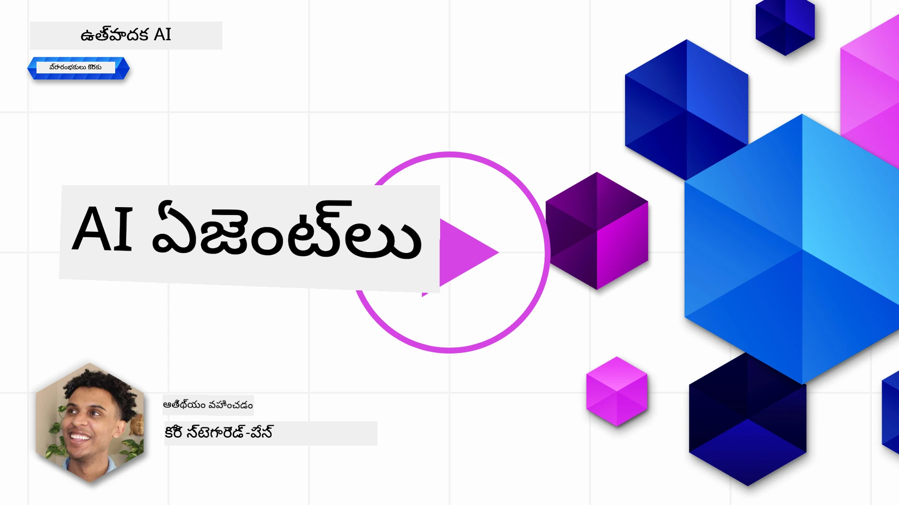
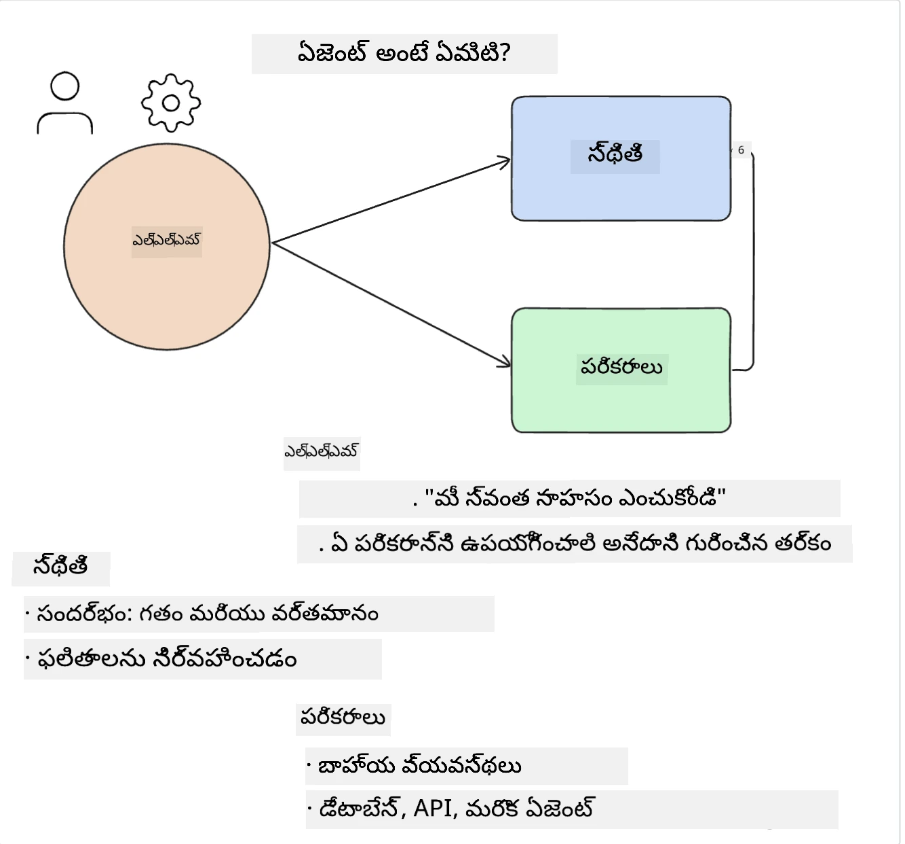
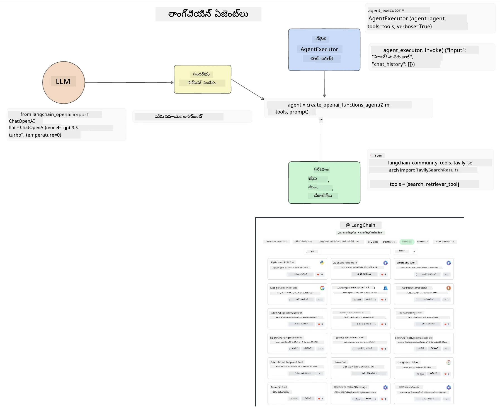
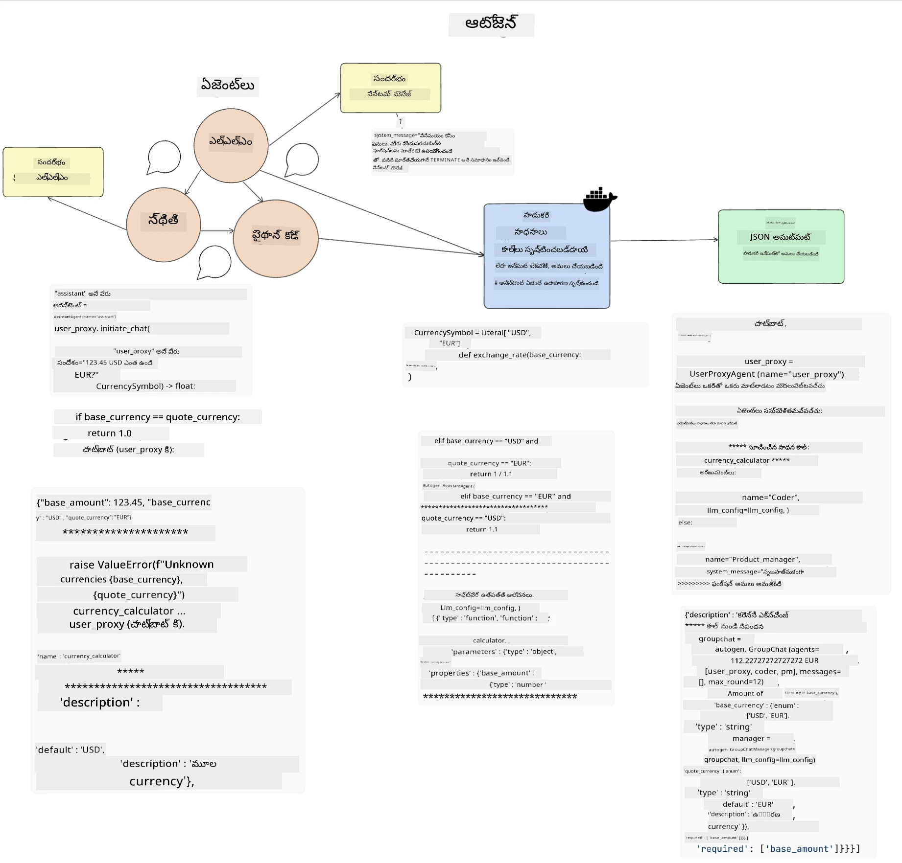
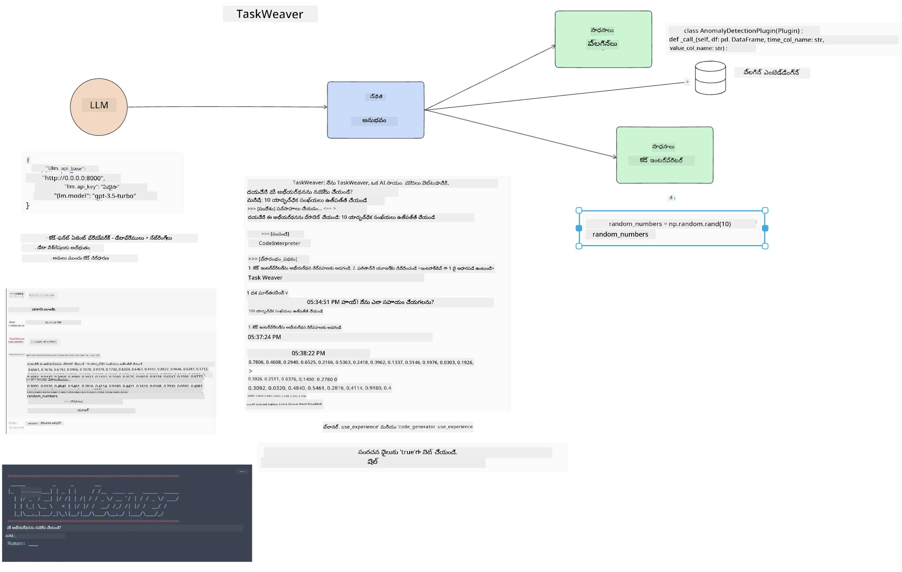
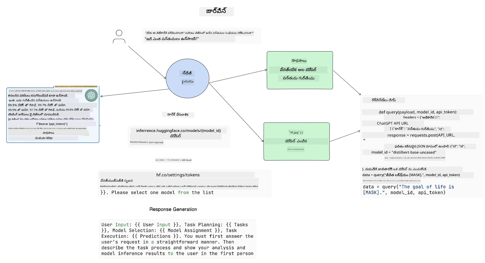

[](https://youtu.be/yAXVW-lUINc?si=bOtW9nL6jc3XJgOM)

## పరిచయం

AI ఏజెంట్లు జనరేటివ్ AIలో ఒక ఆసక్తికరమైన అభివృద్ధిని సూచిస్తాయి, ఇవి పెద్ద భాషా మోడల్స్ (LLMs) ను సహాయకుల నుండి చర్యలు తీసుకునే ఏజెంట్లుగా అభివృద్ధి చెందడానికి అనుమతిస్తాయి. AI ఏజెంట్ ఫ్రేమ్‌వర్క్‌లు డెవలపర్లకు LLMs కు టూల్స్ మరియు స్టేట్ మేనేజ్‌మెంట్‌కి ప్రాప్తి కల్పించే అప్లికేషన్లను సృష్టించడానికి సహాయపడతాయి. ఈ ఫ్రేమ్‌వర్క్‌లు కూడా విజిబిలిటీని మెరుగుపరుస్తాయి, తద్వారా వినియోగదారులు మరియు డెవలపర్లు LLMs ప్లాన్ చేసిన చర్యలను పర్యవేక్షించగలుగుతారు, తద్వారా అనుభవ నిర్వహణ మెరుగుపడుతుంది.

ఈ పాఠం క్రింది అంశాలను కవర్ చేస్తుంది:

- AI ఏజెంట్ అంటే ఏమిటి అనే విషయాన్ని అర్థం చేసుకోవడం - AI ఏజెంట్ అంటే నిజంగా ఏమిటి?
- నాలుగు వేర్వేరు AI ఏజెంట్ ఫ్రేమ్‌వర్క్‌లను అన్వేషించడం - వాటి ప్రత్యేకత ఏమిటి?
- ఈ AI ఏజెంట్లను వేర్వేరు ఉపయోగాలపై ఎలా వర్తింపజేయాలి - ఎప్పుడు AI ఏజెంట్లను ఉపయోగించాలి?

## నేర్చుకునే లక్ష్యాలు

ఈ పాఠం తీసుకున్న తర్వాత, మీరు చేయగలుగుతారు:

- AI ఏజెంట్లు ఏమిటి మరియు అవి ఎలా ఉపయోగించబడతాయో వివరించగలగడం.
- కొన్ని ప్రముఖ AI ఏజెంట్ ఫ్రేమ్‌వర్క్‌ల మధ్య తేడాలను అర్థం చేసుకోవడం మరియు అవి ఎలా భిన్నంగా ఉంటాయో తెలుసుకోవడం.
- AI ఏజెంట్లు ఎలా పనిచేస్తాయో అర్థం చేసుకుని వాటితో అప్లికేషన్లను నిర్మించడం.

## AI ఏజెంట్లు అంటే ఏమిటి?

AI ఏజెంట్లు జనరేటివ్ AI ప్రపంచంలో చాలా ఆసక్తికరమైన రంగం. ఈ ఉత్సాహంతో కొన్నిసార్లు పదాలు మరియు వాటి అన్వయంపై గందరగోళం కూడా ఉంటుంది. AI ఏజెంట్లను సూచించే చాలా టూల్స్‌ను సులభంగా మరియు సమగ్రంగా కవర్ చేయడానికి, మేము ఈ నిర్వచనాన్ని ఉపయోగించబోతున్నాము:

AI ఏజెంట్లు పెద్ద భాషా మోడల్స్ (LLMs) కు **స్టేట్** మరియు **టూల్స్** కి ప్రాప్తి కల్పించడం ద్వారా పనులు చేయడానికి అనుమతిస్తాయి.



ఈ పదాలను నిర్వచిద్దాం:

**పెద్ద భాషా మోడల్స్** - ఈ కోర్సులో సూచించిన మోడల్స్, ఉదాహరణకు GPT-3.5, GPT-4, Llama-2 మొదలైనవి.

**స్టేట్** - ఇది LLM పని చేస్తున్న సందర్భాన్ని సూచిస్తుంది. LLM తన గత చర్యల సందర్భం మరియు ప్రస్తుత సందర్భాన్ని ఉపయోగించి తదుపరి చర్యల కోసం నిర్ణయాలు తీసుకుంటుంది. AI ఏజెంట్ ఫ్రేమ్‌వర్క్‌లు డెవలపర్లకు ఈ సందర్భాన్ని సులభంగా నిర్వహించడానికి సహాయపడతాయి.

**టూల్స్** - వినియోగదారు అభ్యర్థించిన మరియు LLM ప్లాన్ చేసిన పనిని పూర్తి చేయడానికి LLM కు టూల్స్ అవసరం. కొన్ని ఉదాహరణలు డేటాబేస్, API, బాహ్య అప్లికేషన్ లేదా మరొక LLM కూడా కావచ్చు!

ఈ నిర్వచనాలు మీరు ముందుకు వెళ్లేటప్పుడు అవి ఎలా అమలు చేయబడతాయో అర్థం చేసుకోవడానికి మంచి పునాది ఇస్తాయి. ఇప్పుడు కొన్ని వేర్వేరు AI ఏజెంట్ ఫ్రేమ్‌వర్క్‌లను పరిశీలిద్దాం:

## LangChain ఏజెంట్లు

[LangChain ఏజెంట్లు](https://python.langchain.com/docs/how_to/#agents?WT.mc_id=academic-105485-koreyst) మేము పైగా ఇచ్చిన నిర్వచనాల అమలు.

**స్టేట్** ను నిర్వహించడానికి, ఇది `AgentExecutor` అనే బిల్ట్-ఇన్ ఫంక్షన్‌ను ఉపయోగిస్తుంది. ఇది నిర్వచించిన `agent` మరియు అందుబాటులో ఉన్న `tools` ను స్వీకరిస్తుంది.

`Agent Executor` చాట్ చరిత్రను కూడా నిల్వ చేస్తుంది, తద్వారా చాట్ సందర్భం అందించబడుతుంది.



LangChain మీ అప్లికేషన్‌లో దిగుమతి చేసుకోవడానికి [టూల్స్ క్యాటలాగ్](https://integrations.langchain.com/tools?WT.mc_id=academic-105485-koreyst) ను అందిస్తుంది, ఇందులో LLM ప్రాప్తి పొందవచ్చు. ఇవి కమ్యూనిటీ మరియు LangChain టీమ్ తయారు చేసినవి.

మీరు ఈ టూల్స్‌ను నిర్వచించి `Agent Executor` కు పంపవచ్చు.

విజిబిలిటీ కూడా AI ఏజెంట్ల గురించి మాట్లాడేటప్పుడు ఒక ముఖ్యమైన అంశం. అప్లికేషన్ డెవలపర్లు LLM ఏ టూల్ ఉపయోగిస్తున్నదో మరియు ఎందుకు అనేది అర్థం చేసుకోవడం ముఖ్యం. అందుకు LangChain టీమ్ LangSmith ను అభివృద్ధి చేసింది.

## AutoGen

మరుసటి AI ఏజెంట్ ఫ్రేమ్‌వర్క్ [AutoGen](https://microsoft.github.io/autogen/?WT.mc_id=academic-105485-koreyst). AutoGen ప్రధానంగా సంభాషణలపై దృష్టి సారిస్తుంది. ఏజెంట్లు **సంభాషణాత్మక** మరియు **అనుకూలీకరించదగినవి**.

**సంభాషణాత్మక -** LLMs ఒక పని పూర్తి చేయడానికి మరొక LLMతో సంభాషణ ప్రారంభించి కొనసాగించగలవు. ఇది `AssistantAgents` సృష్టించి వారికి ప్రత్యేక సిస్టమ్ సందేశం ఇవ్వడం ద్వారా జరుగుతుంది.

```python

autogen.AssistantAgent( name="Coder", llm_config=llm_config, ) pm = autogen.AssistantAgent( name="Product_manager", system_message="Creative in software product ideas.", llm_config=llm_config, )

```

**అనుకూలీకరించదగినవి** - ఏజెంట్లు కేవలం LLMలుగా కాకుండా వినియోగదారు లేదా టూల్ గా కూడా నిర్వచించబడవచ్చు. డెవలపర్‌గా, మీరు `UserProxyAgent` ను నిర్వచించవచ్చు, ఇది పనిని పూర్తి చేయడంలో వినియోగదారుతో ఫీడ్‌బ్యాక్ కోసం బాధ్యత వహిస్తుంది. ఈ ఫీడ్‌బ్యాక్ పని కొనసాగించడానికి లేదా ఆపడానికి ఉపయోగపడుతుంది.

```python
user_proxy = UserProxyAgent(name="user_proxy")
```

### స్టేట్ మరియు టూల్స్

స్టేట్ మార్చడానికి మరియు నిర్వహించడానికి, అసిస్టెంట్ ఏజెంట్ పనిని పూర్తి చేయడానికి Python కోడ్‌ను ఉత్పత్తి చేస్తుంది.

ప్రక్రియ ఉదాహరణ ఇక్కడ ఉంది:



#### సిస్టమ్ సందేశంతో నిర్వచించిన LLM

```python
system_message="For weather related tasks, only use the functions you have been provided with. Reply TERMINATE when the task is done."
```

ఈ సిస్టమ్ సందేశం ఈ ప్రత్యేక LLMకి ఏ ఫంక్షన్లు సంబంధించి ఉన్నాయో సూచిస్తుంది. AutoGenతో మీరు వేర్వేరు సిస్టమ్ సందేశాలతో అనేక AssistantAgents ను నిర్వచించవచ్చు.

#### వినియోగదారు ద్వారా చాట్ ప్రారంభం

```python
user_proxy.initiate_chat( chatbot, message="I am planning a trip to NYC next week, can you help me pick out what to wear? ", )

```

వినియోగదారు_proxy (మానవుడు) నుండి వచ్చిన ఈ సందేశం ఏజెంట్ ప్రారంభించాల్సిన ఫంక్షన్లను అన్వేషించడానికి ప్రేరేపిస్తుంది.

#### ఫంక్షన్ అమలు

```bash
chatbot (to user_proxy):

***** Suggested tool Call: get_weather ***** Arguments: {"location":"New York City, NY","time_periond:"7","temperature_unit":"Celsius"} ******************************************************** --------------------------------------------------------------------------------

>>>>>>>> EXECUTING FUNCTION get_weather... user_proxy (to chatbot): ***** Response from calling function "get_weather" ***** 112.22727272727272 EUR ****************************************************************

```

ప్రాథమిక చాట్ ప్రాసెస్ అయిన తర్వాత, ఏజెంట్ సూచించిన టూల్‌ను పిలవడానికి పంపుతుంది. ఈ సందర్భంలో, ఇది `get_weather` అనే ఫంక్షన్. మీ కాన్ఫిగరేషన్ ఆధారంగా, ఈ ఫంక్షన్ ఆటోమేటిక్‌గా అమలు కావచ్చు లేదా వినియోగదారు ఇన్‌పుట్ ఆధారంగా అమలు కావచ్చు.

మరింతగా ప్రారంభించడానికి [AutoGen కోడ్ నమూనాలు](https://microsoft.github.io/autogen/docs/Examples/?WT.mc_id=academic-105485-koreyst) చూడవచ్చు.

## Taskweaver

మరుసటి ఏజెంట్ ఫ్రేమ్‌వర్క్ [Taskweaver](https://microsoft.github.io/TaskWeaver/?WT.mc_id=academic-105485-koreyst). ఇది "కోడ్-ఫస్ట్" ఏజెంట్ గా పిలవబడుతుంది ఎందుకంటే ఇది కేవలం `strings` తో కాకుండా Pythonలో DataFrames తో కూడా పని చేయగలదు. ఇది డేటా విశ్లేషణ మరియు జనరేషన్ పనులకు చాలా ఉపయోగకరం. ఉదాహరణకు గ్రాఫ్‌లు, చార్ట్‌లు సృష్టించడం లేదా యాదృచ్ఛిక సంఖ్యలు ఉత్పత్తి చేయడం.

### స్టేట్ మరియు టూల్స్

సంభాషణ స్టేట్‌ను నిర్వహించడానికి, TaskWeaver `Planner` అనే కాన్సెప్ట్‌ను ఉపయోగిస్తుంది. `Planner` అనేది వినియోగదారుల అభ్యర్థనలను తీసుకుని ఆ అభ్యర్థనను నెరవేర్చడానికి అవసరమైన పనులను మ్యాప్ చేసే LLM.

పనులను పూర్తి చేయడానికి `Planner` కు `Plugins` అనే టూల్స్ సేకరణ అందుబాటులో ఉంటుంది. ఇవి Python క్లాసులు లేదా సాధారణ కోడ్ ఇంటర్‌ప్రెటర్ కావచ్చు. ఈ ప్లగిన్లు ఎంబెడ్డింగ్స్‌గా నిల్వ చేయబడతాయి, తద్వారా LLM సరైన ప్లగిన్‌ను సులభంగా వెతుకుతుంది.



అనామలీ డిటెక్షన్ నిర్వహించడానికి ప్లగిన్ ఉదాహరణ ఇక్కడ ఉంది:

```python
class AnomalyDetectionPlugin(Plugin): def __call__(self, df: pd.DataFrame, time_col_name: str, value_col_name: str):
```

కోడ్ అమలు ముందు ధృవీకరించబడుతుంది. Taskweaverలో సందర్భాన్ని నిర్వహించడానికి మరో ఫీచర్ `experience`. అనుభవం సంభాషణ సందర్భాన్ని దీర్ఘకాలికంగా YAML ఫైల్‌లో నిల్వ చేయడానికి అనుమతిస్తుంది. ఇది కాన్ఫిగర్ చేయవచ్చు, తద్వారా LLM గత సంభాషణలకు ప్రాప్తి కలిగి ఉండటం వల్ల కొన్ని పనులపై కాలక్రమేణా మెరుగుపడుతుంది.

## JARVIS

చివరి ఏజెంట్ ఫ్రేమ్‌వర్క్ [JARVIS](https://github.com/microsoft/JARVIS?tab=readme-ov-file?WT.mc_id=academic-105485-koreyst). JARVIS ప్రత్యేకత ఏమిటంటే ఇది సంభాషణ `స్టేట్` ను నిర్వహించడానికి LLM ను ఉపయోగిస్తుంది మరియు `టూల్స్` గా ఇతర AI మోడల్స్ ఉంటాయి. ప్రతి AI మోడల్ ప్రత్యేక పనులు చేస్తుంది, ఉదాహరణకు ఆబ్జెక్ట్ డిటెక్షన్, ట్రాన్స్క్రిప్షన్ లేదా ఇమేజ్ క్యాప్షనింగ్.



LLM, ఒక సాధారణ ప్రయోజన మోడల్‌గా, వినియోగదారుని అభ్యర్థనను స్వీకరించి నిర్దిష్ట పని మరియు ఆ పని పూర్తి చేయడానికి అవసరమైన ఆర్గ్యుమెంట్లు/డేటాను గుర్తిస్తుంది.

```python
[{"task": "object-detection", "id": 0, "dep": [-1], "args": {"image": "e1.jpg" }}]
```

తర్వాత LLM అభ్యర్థనను ప్రత్యేక AI మోడల్ అర్థం చేసుకునే విధంగా JSON వంటి ఫార్మాట్‌లో మార్చుతుంది. AI మోడల్ పని ఆధారంగా తన అంచనాను ఇచ్చిన తర్వాత, LLM స్పందనను స్వీకరిస్తుంది.

పని పూర్తి చేయడానికి అనేక మోడల్స్ అవసరమైతే, అవి ఇచ్చిన ప్రతిస్పందనలను కూడా LLM అర్థం చేసుకుని వాటిని కలిపి వినియోగదారునికి సమాధానం రూపొందిస్తుంది.

క్రింది ఉదాహరణలో, వినియోగదారు ఒక చిత్రంలో ఉన్న వస్తువుల వివరణ మరియు సంఖ్య కోరినప్పుడు ఇది ఎలా పనిచేస్తుందో చూపిస్తుంది:

## అసైన్‌మెంట్

AI ఏజెంట్లపై మీ నేర్చుకోవడాన్ని కొనసాగించడానికి AutoGen తో మీరు నిర్మించవచ్చు:

- విద్యా స్టార్టప్ యొక్క వేర్వేరు విభాగాలతో వ్యాపార సమావేశాన్ని అనుకరించే అప్లికేషన్.
- LLMs కు వేర్వేరు వ్యక్తిత్వాలు మరియు ప్రాధాన్యతలను అర్థం చేసుకునే విధంగా సిస్టమ్ సందేశాలను సృష్టించి, వినియోగదారుని కొత్త ఉత్పత్తి ఆలోచనను ప్రస్తావించడానికి అనుమతించడం.
- ఆ తర్వాత LLM ప్రతి విభాగం నుండి ఫాలో-అప్ ప్రశ్నలను ఉత్పత్తి చేసి ఆలోచనను మెరుగుపరచడం.

## నేర్చుకోవడం ఇక్కడ ఆగదు, ప్రయాణాన్ని కొనసాగించండి

ఈ పాఠం పూర్తి చేసిన తర్వాత, మా [జనరేటివ్ AI నేర్చుకునే సేకరణ](https://aka.ms/genai-collection?WT.mc_id=academic-105485-koreyst) ను చూడండి మరియు మీ జనరేటివ్ AI జ్ఞానాన్ని మరింత పెంచుకోండి!

---

<!-- CO-OP TRANSLATOR DISCLAIMER START -->
**అస్పష్టత**:  
ఈ పత్రాన్ని AI అనువాద సేవ [Co-op Translator](https://github.com/Azure/co-op-translator) ఉపయోగించి అనువదించబడింది. మేము ఖచ్చితత్వానికి ప్రయత్నించినప్పటికీ, ఆటోమేటెడ్ అనువాదాల్లో పొరపాట్లు లేదా తప్పిదాలు ఉండవచ్చు. అసలు పత్రం దాని స్వదేశీ భాషలో ఉన్నది అధికారిక మూలంగా పరిగణించాలి. ముఖ్యమైన సమాచారానికి, ప్రొఫెషనల్ మానవ అనువాదం సిఫార్సు చేయబడుతుంది. ఈ అనువాదం వాడకంలో ఏర్పడిన ఏవైనా అపార్థాలు లేదా తప్పుదారితీసే అర్థాలు కోసం మేము బాధ్యత వహించము.
<!-- CO-OP TRANSLATOR DISCLAIMER END -->