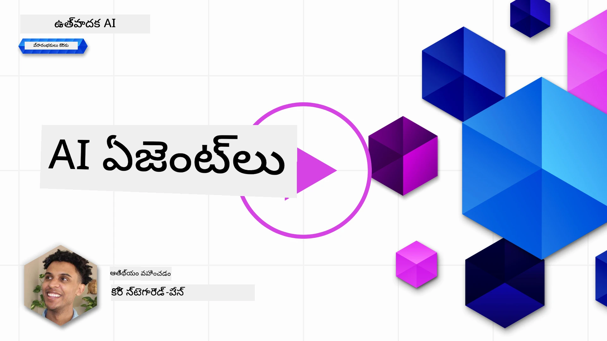
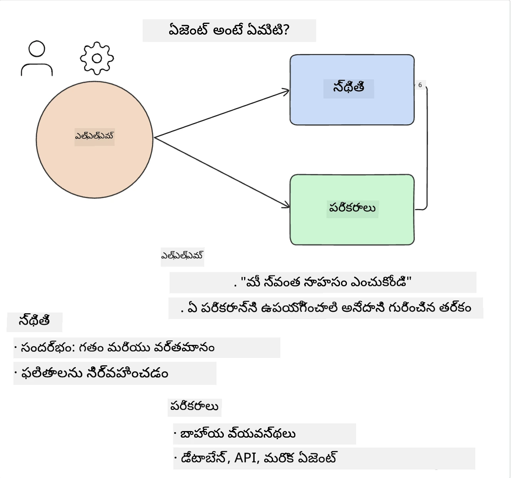
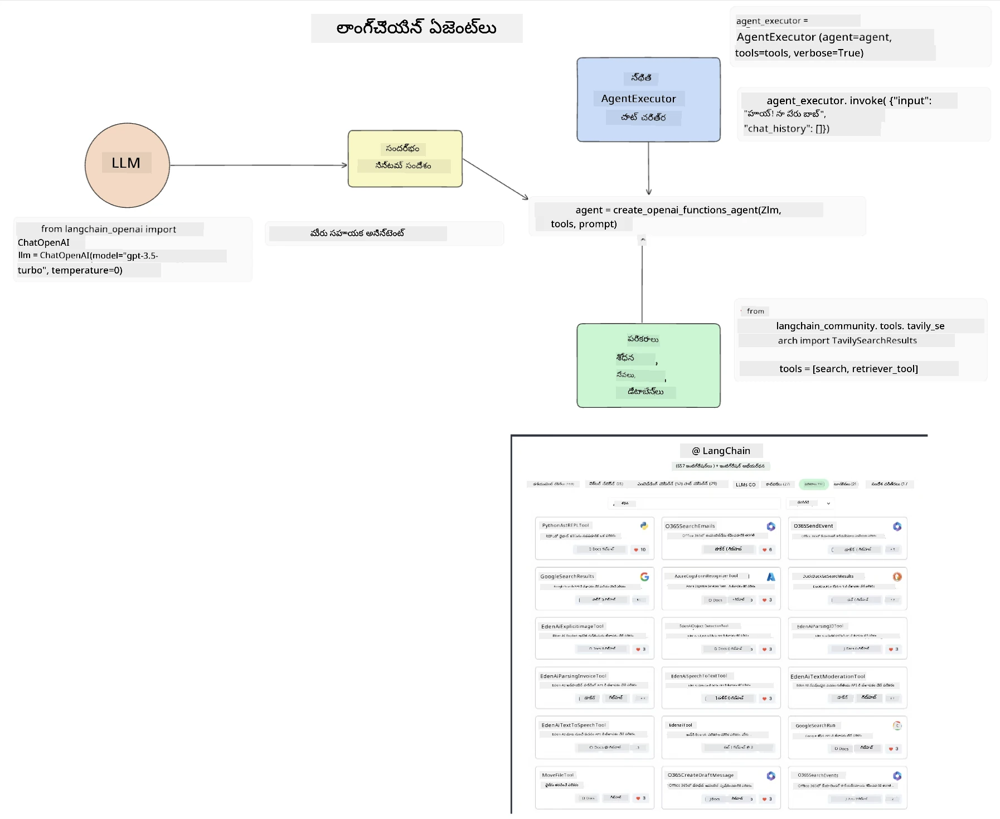
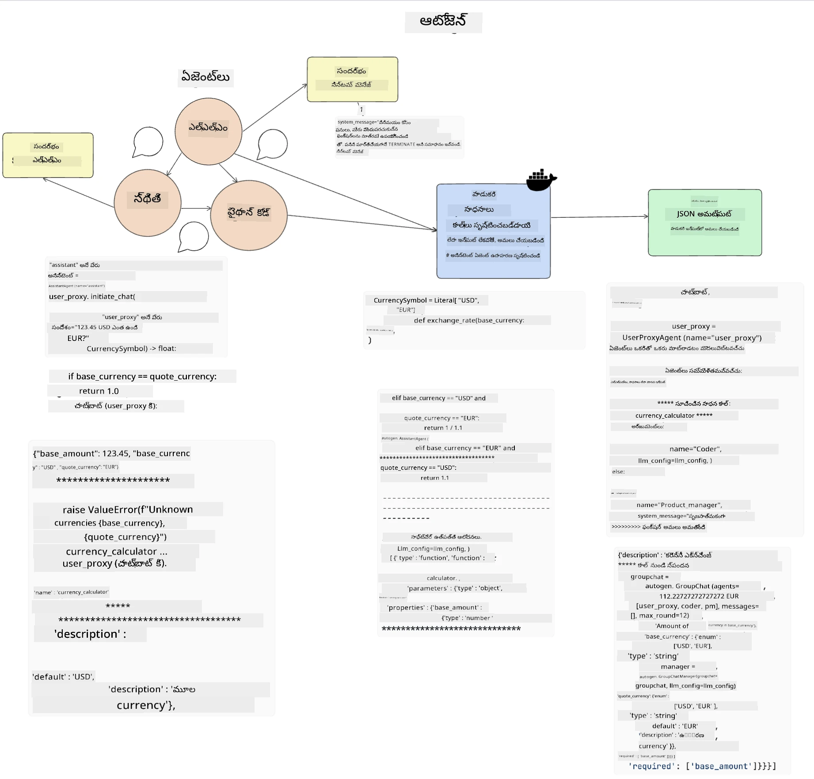
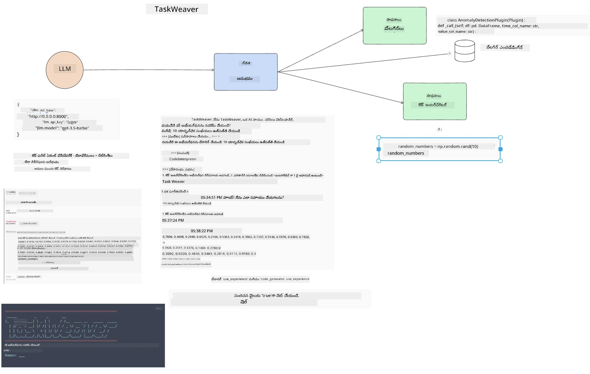
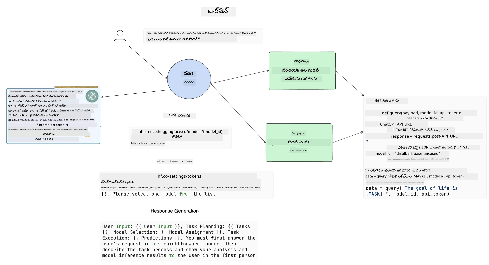

[](https://youtu.be/yAXVW-lUINc?si=bOtW9nL6jc3XJgOM)

## పరిచయం

AI ఏజెంట్స్ జనరేటివ్ AIలో ఒక ఉత్తేజకరమైన అభివృద్ధిని సూచిస్తాయి, ఇవి పెద్ద భాషా నమూనాలు (LLMs) సహాయకుల నుండి చర్యలు తీసుకోగల ఏజెంట్లుగా అభివృద్ధి చెందేందుకు వీలుగా చేస్తాయి. AI ఏజెంట్ ఫ్రేమ్‌వర్క్‌లు డెవలపర్లకు LLMలకు టూల్స్ మరియు స్టేట్ మేనేజ్మెంటుకి యాక్సెస్ ఇవ్వగల అప్లికేషన్లను సృష్టించేందుకు అనుమతిస్తాయి. ఈ ఫ్రేమ్‌వర్క్‌లు మరింత విజిబిలిటీని పెంచి, యూజర్లు మరియు డెవలపర్లు LLMల ద్వారా ప్లాన్ చేసిన చర్యలను పర్యవేక్షించగలుగుతారు, తద్వారా అనుభవం నిర్వహణ మెరుగ్గుతుంది.

పాఠం కింద పేర్కొన్న ప్రాంతాలను కవర్ చేస్తుంది:

- AI ఏజెంట్ అంటే ఏమిటి అనే అవగాహన - AI ఏజెంట్ నిజంగా ఏమిటి?
- నాలుగు విభిన్న AI ఏజెంట్ ఫ్రేమ్‌వర్క్‌లు - వాటి ప్రత్యేకత ఏమిటి?
- వివిధ సందర్భాల్లో ఈ AI ఏజెంట్లను ఎలా ఉపయోగించాలి - ఎప్పుడు AI ఏజెంట్లను ఉపయోగించాలి?

## అభ్యాస లక్ష్యాలు

ఈ పాఠం తీసుకున్న తర్వాత, మీరు:

- AI ఏజెంట్లు ఏమిటి మరియు వాటిని ఎలా ఉపయోగించవచ్చో వివరించగలుగుతారు.
- కొన్ని ప్రాచుర్యం పొందిన AI ఏజెంట్ ఫ్రేమ్‌వర్క్‌ల మధ్య తేడాలు మరియు అవి ఎలా విభిన్నమై ఉంటాయో అర్థం చేసుకోగలుగుతారు.
- AI ఏజెంట్లు ఎలా పనిచేస్తాయో అర్థం చేసుకుని వాటితో అప్లికేషన్లను నిర్మించగలుగుతారు.

## AI ఏజెంట్లు అంటే ఏమిటి?

AI ఏజెంట్లు జనరేటివ్ AI ప్రపంచంలో非常 ఉద్రేకపరిచే రంగం. ఈ ఉత్సాహంతో విభ్రమాలు మరియు పదాల ఉపయోగంలో అయోమయం వస్తుంది. అత్యంత సాదా మరియు చాలా AI ఏజెంట్లు సూచించే సాధనాలను కలిపి, మేము ఈ నిర్వచనాన్ని ఉపయోగించబోతున్నాము:

AI ఏజెంట్లు పెద్ద భాషా నమూనాలకు (LLMs) **స్టేట్** మరియు **టూల్స్** యాక్సెస్ ఇచ్చి పనులు చేయడానికి అనుమతిస్తాయి.



ఈ పదాలను నిర్వచిద్దాం:

**పెద్ద భాషా నమూనాలు** - ఈ కోర్సులో ఎల్లప్పుడూ సూచించిన మోడల్స్, ఉదాహరణకు GPT-3.5, GPT-4, Llama-2 మరియు ఇతరులు.

**స్టేట్** - ఇది LLM పనిచేస్తున్న సన్నివేశం. LLM గత చర్యల మరియు ప్రస్తుత సాత్వికతను ఉపయోగించి తదుపరి చర్యలకు మార్గదర్శనం చేస్తుంది. AI ఏజెంట్ ఫ్రేమ్‌వర్క్‌లు ఈ సన్నివేశాన్ని సులభంగా నిర్వహించేటటు డెవలపర్లకు సహాయపడతాయి.

**టూల్స్** - యూజర్ అభ్యర్థించిన పనిని LLM ప్లాన్ చేశాక పూర్తి చేయడానికి LLMకు టూల్స్ అవసరం. ఉదాహరణకు డేటాబేస్, API, బాహ్య అప్లికేషన్ లేదా మరొక LLM!

వీటి నిర్వచనాలు, అవి ఎలా అమలవుతాయో అర్థం చేసుకోవడానికి మీకు బేస్ ఇస్తాయి. మనం కొన్ని వివిధ AI ఏజెంట్ ఫ్రేమ్‌వర్క్‌లను పరిశీలిద్దాం:

## LangChain ఏజెంట్లు

[LangChain ఏజెంట్లు](https://python.langchain.com/docs/how_to/#agents?WT.mc_id=academic-105485-koreyst) మేము ఇచ్చిన నిర్వచనాల అమలుగా ఉన్నాయి.

**స్టేట్** నిర్వహణ చేయటానికి ఇది `AgentExecutor` అనే బిల్ట్-ఇన్ ఫంక్షన్‌ను ఉపయోగిస్తుంది. ఇది నిర్వచించిన `agent` మరియు అందుబాటులో ఉన్న `tools`ను అంగీకరిథ్తుంది.

`Agent Executor` చాట్ చరిత్రను కూడా భద్రపరచి చాట్ సన్నివేశాన్ని అందిస్తుంది.



LangChainలో LLM యాక్సెస్ పొందగల [టూల్స్ క్యాటలాగ్](https://integrations.langchain.com/tools?WT.mc_id=academic-105485-koreyst) ఉంది. ఇవి కమ్యూనిటీ మరియు LangChain బృందం చేత తయారుచేయబడినవి.

మీరు ఈ టూల్స్ ను నిర్వచించి, వాటిని `Agent Executor` కు పంపవచ్చు.

AI ఏజెంట్లను చర్చిస్తే, విజిబిలిటీ కూడా ముఖ్యం. యాప్ డెవలపర్లు LLM ఏ టూల్ ఉపయోగిస్తోందో, ఎందుకు ఉపయోగిస్తోందో తెలుసుకోవడం ముఖ్యం. అందుకు LangChain బృందం LangSmithని అభివృద్ధి చేసింది.

## AutoGen

తదుపరి AI ఏజెంట్ ఫ్రేమ్‌వర్క్ [AutoGen](https://microsoft.github.io/autogen/?WT.mc_id=academic-105485-koreyst). AutoGen ప్రధానంగా సంభాషణలపై దృష్టి పెట్టింది. ఏజెంట్లు **కన్వర్సబుల్** మరియు **కస్టమైజబుల్**.

**కన్వర్సబుల్ -** LLMలు మరొక LLMతో సంభాషణ ఆరంభించి కొనసాగించవచ్చు పనిని పూర్తి చేయడానికి. ఇది `AssistantAgents` సృష్టించి వారికి నిర్దిష్ట సిస్టమ్ సందేశం ఇవ్వడం ద్వారా చేస్తారు.

```python

autogen.AssistantAgent( name="Coder", llm_config=llm_config, ) pm = autogen.AssistantAgent( name="Product_manager", system_message="Creative in software product ideas.", llm_config=llm_config, )

```

**కస్టమైజబుల్** - ఏజెంట్లను LLM లా కాకుండా యూజర్ లేదా టూల్‌గా కూడా నిర్వచించవచ్చు. డెవలపర్‌గా మీరు `UserProxyAgent`ని నిర్వచించవచ్చు, ఇది యూజర్‌తో ఫీడ్బ్యాక్ కోసం ఇన్‌టరాక్ట్ అవుతుంది. ఈ ఫీడ్బ్యాక్ సాధనం యొక్క అమలును కొనసాగించవచ్చు లేదా నిలిపివేయవచ్చు.

```python
user_proxy = UserProxyAgent(name="user_proxy")
```

### స్టేట్ మరియు టూల్స్

స్థితిని మార్చడానికి మరియు నిర్వహించడానికి, అసిస్టెంట్ ఏజెంట్ పైథాన్ కోడ్ ఉత్పత్తి చేస్తుంది పనిని పూర్తి చేయడానికి.

ఈ ప్రక్రియ ఉదాహరణ:



#### LLMను సిస్టమ్ సందేశంతో నిర్వచించడం

```python
system_message="For weather related tasks, only use the functions you have been provided with. Reply TERMINATE when the task is done."
```

ఈ సిస్టమ్ సందేశం నిర్దిష్ట LLMకి సంబంధిత ఫంక్షన్లను సూచిస్తుంది. AutoGenతో మీరు వివిధ సిస్టమ్ సందేశాలు ఉన్న అనేక AssistantAgents కలిగి ఉండవచ్చు.

#### చాట్ యూజర్ ద్వారా ప్రారంభం

```python
user_proxy.initiate_chat( chatbot, message="I am planning a trip to NYC next week, can you help me pick out what to wear? ", )

```

ఈ యూజర్_ప్రాక్సీ (మానవ) పంపిన సందేశం ఏజెంట్ ప్రారంభించి పరీక్షించవలసిన ఫంక్షన్లను అన్వేషించేందుకు అనుమతిస్తుంది.

#### ఫంక్షన్ అమలు

```bash
chatbot (to user_proxy):

***** Suggested tool Call: get_weather ***** Arguments: {"location":"New York City, NY","time_periond:"7","temperature_unit":"Celsius"} ******************************************************** --------------------------------------------------------------------------------

>>>>>>>> EXECUTING FUNCTION get_weather... user_proxy (to chatbot): ***** Response from calling function "get_weather" ***** 112.22727272727272 EUR ****************************************************************

```

ప్రారంభ చాట్ సిద్దమైన తర్వాత, ఏజెంట్ సూచించిన టూల్ ను పిలవడానికి పంపుతుంది, ఈ ఉదాహరణలో `get_weather` అనే ఫంక్షన్. మీరు సెట్టింగ్స్ ఆధారంగా ఈ ఫంక్షన్ ఆటోమేటిగ్గా అమలు కావచ్చు లేక యూజర్ ఇన్పుట్ ఆధారంగా అమలు కావచ్చు.

మరింత తెలుసుకోవడానికి [AutoGen కోడ్ నమూనాలు](https://microsoft.github.io/autogen/docs/Examples/?WT.mc_id=academic-105485-koreyst) చూడవచ్చు.

## Taskweaver

తదుపరి ఏజెంట్ ఫ్రేమ్‌వర్క్ [Taskweaver](https://microsoft.github.io/TaskWeaver/?WT.mc_id=academic-105485-koreyst). ఇది "కోడ్-ఫస్ట్" ఏజెంట్ అని పిలవబడుతుంది, ఎందుకంటే ఇది కేవలం `strings`తో కాకుండా Pythonలో DataFramesతో పని చేయగలదు. ఇది డేటా విశ్లేషణకు మరియు జనరేషన్ పనులకి చాలా ఉపయోగకరం అవుతుంది, ఉదాహరణకు గ్రాఫ్‌లు, చార్ట్‌లు తయారీ లేదా రాండం సంఖ్యల ఉత్పత్తి.

### స్టేట్ మరియు టూల్స్

కథనం స్టేట్ నిర్వహించటానికి TaskWeaver `Planner` కాన్సెప్ట్ ఉపయోగిస్తుంది. `Planner` అనేది LLM, ఇది యూజర్ల అభ్యర్థన తీసుకుని ఆ అభ్యర్థనను పూర్తి చేయడానికి అవసరమైన పనులను మ్యాప్ చేస్తుంది.

పనులు పూర్తి చేయడానికి `Planner` `Plugins` అనే సేకరణకు యాక్సెస్ ఉంటుంది. ఇవి Python క్లాసులు లేదా సాధారణ కోడ్ ఇంటర్‌ప్రెటర్ కావచ్చు. ఈ ప్లగిన్లు ఎంబెడింగ్‌లుగా నిల్వ చేయబడి సరైన ప్లగిన్ కోసం LLM త్వరిగా శోధించగలదు.



అనోమలీ డిటెక్షన్ నిర్వహించేందుకు ఒక ప్లగిన్ ఉదాహరణ:

```python
class AnomalyDetectionPlugin(Plugin): def __call__(self, df: pd.DataFrame, time_col_name: str, value_col_name: str):
```

కోడ్ అమలు ముందు సరిచూడబడుతుంది. Taskweaverలో పద్దతి మరొక ముఖ్యమైన అంశం `experience`. అనుభవం సంభాషణ సన్నివేశాన్ని YAML ఫైల్‌లో దీర్ఘకాలంగా నిల్వ చేస్తుంది. దీన్ని సెట్ చేస్తే LLM ముందటి సంభాషణలకు సంబంధించిన టాస్కులపై సమయానుసారంగా మెరుగుపడుతుంది.

## JARVIS

చివరి ఏజెంట్ ఫ్రేమ్‌వర్క్ మనం చూడబోతున్నది [JARVIS](https://github.com/microsoft/JARVIS?tab=readme-ov-file&WT.mc_id=academic-105485-koreyst). JARVIS ప్రత్యేకత ఏమంటే, ఇది సంభాషణ యొక్క `state`ని నిర్వహించడానికి LLMను ఉపయోగించి, `tools`గా ఇతర AI మోడల్స్ ఉపయోగిస్తుంది. ప్రతి AI మోడల్ ప్రత్యేక పనులు చేస్తుంది, ఉదాహరణకు ఆబ్జెక్ట్ డిటెక్షన్, ట్రాన్స్‌క్రిప్షన్ లేదా ఇమేజిగ్రహణ.



LLM, ఒక జనరల్ పర్పస్ మోడల్, యూజర్ నుండి అభ్యర్థనను స్వీకరించి ప్రత్యేక టాస్క్ మరియు పూర్తి చేయడానికి అవసరమైన డేటాను గుర్తిస్తుంది.

```python
[{"task": "object-detection", "id": 0, "dep": [-1], "args": {"image": "e1.jpg" }}]
```

తర్వాత LLM ఆ అభ్యర్థనను ప్రత్యేక AI మోడల్ అర్థం చేసుకునేలా ఫార్మాట్ చేస్తుంది, ఉదాహరణకు JSONగా. AI మోడల్ టాస్క్ ఆధారంగా ప్రిడిక్షన్ ఇచ్చిన తర్వాత LLM స్పందన అందుకుంటుంది.

పనులు పూర్తి చేయడానికి అనేక మోడల్స్ అవసరమైతే, LLM ఆ మోడల్స్ స్పందనలను ప్రతిఫలించి వాటిని సమన్వయ పరుస్తుంది, తద్వారా యూజర్‌కు సమాధానం తయారవుతుంది.

కింద ఇచ్చిన ఉదాహరణలో యూజర్ ఒక ఆబ్జెక్టుల వివరణ మరియు లెక్కింపు అడగగా ఇది ఎలా పని చేస్తుందో చూపబడింది:

## అసైన్‌మెంట్

ఆటోజెన్‌తో AI ఏజెంట్ల పొందుపోవడం కొనసాగించడానికి మీరు క్రింది ప్రాజెక్టులు చేయవచ్చు:

- ఒక విద్యా స్టార్టప్ యొక్క వివిధ శాఖలతో వ్యాపార సమావేశాన్ని ప్రతిరూపించే అప్లికేషన్ అభివృద్ధి చేయండి.
- వేర్వేరు వ్యక్తిత్వాలు మరియు ప్రాధాన్యతలను అర్థం చేసుకోగలిగేటటు LLMలకు మార్గనిర్దేశం చేసే సిస్టమ్ సందేశాలను సృష్టించండి, మరియు యూజర్‌కు కొత్త ప్రొడక్ట్ ఐడియాను సూచించటానికి అవకాశం ఇవ్వండి.
- ఆపై ప్రతి శాఖ నుండి ఫాలో అప్ ప్రశ్నలను ఉత్పత్తి చేయించి ఆ పిచ్ మరియు ప్రొడక్ట్ ఐడియాను మెరుగుపరచండి.

## నేర్చుకోవడం ఇక్కడ ఆగదు, ప్రయాణం కొనసాగించండి

ఈ పాఠం పూర్తి చేసిన తర్వాత, మా [Generative AI Learning collection](https://aka.ms/genai-collection?WT.mc_id=academic-105485-koreyst) ను చూసి మీ Generative AI జ్ఞానాన్ని మరింత మెరుగుపరుచుకోండి!

---

<!-- CO-OP TRANSLATOR DISCLAIMER START -->
**తప్పిదిరండి**:
ఈ డాక్యుమెంట్‌ను AI అనువాద సేవ [Co-op Translator](https://github.com/Azure/co-op-translator) ఉపయోగించి అనువదించబడింది. మేము ఖచ్చితత్వానికి ప్రయత్నిస్తూనే ఉన్నప్పటికీ, ఆటోమేటిక్ అనువాదాల్లో పొరపాట్లు లేదా తప్పుడు సమాచారాలు ఉండవచ్చు అని దయచేసి గమనించండి. అసలు డాక్యుమెంట్ మరియు native భాషలో ఉన్నది అధికారం కలిగిన మూలం గా తీసుకోవాలి. ముఖ్యమైన సమాచారానికి, నిపుణుల చేత చేసిన మానవ అనువాదం సూచిస్తాము. ఈ అనువాదం వాడకం ద్వారా కలిగే ఏవైనా అపార్థాలు లేదా తప్పుదారులు మనం బాధ్యత వహించము.
<!-- CO-OP TRANSLATOR DISCLAIMER END -->