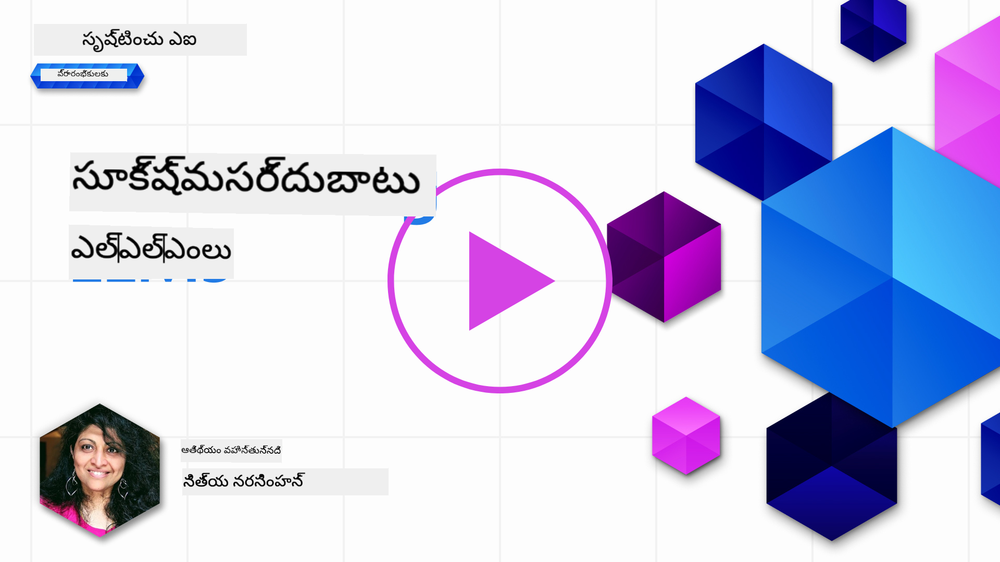
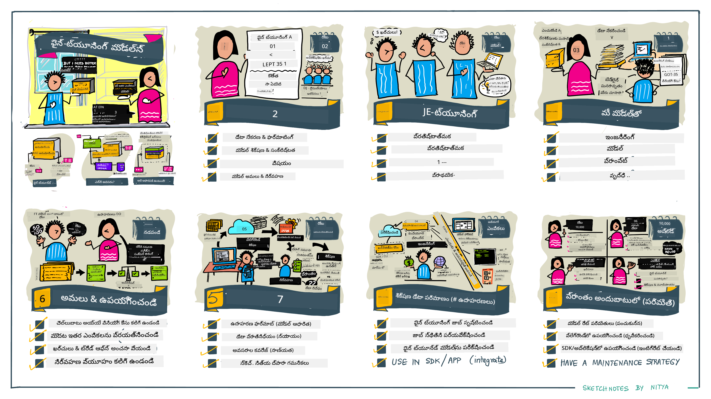

<!--
CO_OP_TRANSLATOR_METADATA:
{
  "original_hash": "807f0d9fc1747e796433534e1be6a98a",
  "translation_date": "2025-12-19T20:26:51+00:00",
  "source_file": "18-fine-tuning/README.md",
  "language_code": "te"
}
-->

# మీ LLM ను ఫైన్-ట్యూన్ చేయడం

సృష్టించు AI అనువర్తనాలను నిర్మించడానికి పెద్ద భాషా మోడల్స్ ఉపయోగించడం కొత్త సవాళ్లతో వస్తుంది. ఒక ముఖ్యమైన సమస్య మోడల్ ద్వారా ఒక నిర్దిష్ట వినియోగదారు అభ్యర్థనకు ఉత్పత్తి చేయబడిన కంటెంట్‌లో ప్రతిస్పందన నాణ్యత (ఖచ్చితత్వం మరియు సంబంధితత) ను నిర్ధారించడం. గత పాఠాలలో, మేము ప్రాంప్ట్ ఇంజనీరింగ్ మరియు రిట్రీవల్-ఆగ్మెంటెడ్ జనరేషన్ వంటి సాంకేతికతలను చర్చించాము, ఇవి ఉన్న మోడల్‌కు _ప్రాంప్ట్ ఇన్‌పుట్‌ను మార్చడం_ ద్వారా సమస్యను పరిష్కరించడానికి ప్రయత్నిస్తాయి.

ఈ రోజు పాఠంలో, మేము మూడవ సాంకేతికత అయిన **ఫైన్-ట్యూనింగ్** గురించి చర్చిస్తాము, ఇది అదనపు డేటాతో _మోడల్‌ను స్వయంగా మళ్లీ శిక్షణ ఇవ్వడం_ ద్వారా సవాలు పరిష్కరించడానికి ప్రయత్నిస్తుంది. వివరాల్లోకి వెళ్దాం.

## నేర్చుకునే లక్ష్యాలు

ఈ పాఠం ముందుగా శిక్షణ పొందిన భాషా మోడల్స్ కోసం ఫైన్-ట్యూనింగ్ కాన్సెప్ట్‌ను పరిచయం చేస్తుంది, ఈ దృష్టికోణం యొక్క లాభాలు మరియు సవాళ్లను అన్వేషిస్తుంది, మరియు మీ సృష్టించు AI మోడల్స్ పనితీరును మెరుగుపరచడానికి ఫైన్-ట్యూనింగ్ ఎప్పుడు మరియు ఎలా ఉపయోగించాలో మార్గదర్శకత్వం అందిస్తుంది.

ఈ పాఠం ముగింపు వరకు, మీరు ఈ క్రింది ప్రశ్నలకు సమాధానం చెప్పగలుగుతారు:

- భాషా మోడల్స్ కోసం ఫైన్-ట్యూనింగ్ అంటే ఏమిటి?
- ఎప్పుడు, మరియు ఎందుకు, ఫైన్-ట్యూనింగ్ ఉపయోగకరంగా ఉంటుంది?
- నేను ముందుగా శిక్షణ పొందిన మోడల్‌ను ఎలా ఫైన్-ట్యూన్ చేయగలను?
- ఫైన్-ట్యూనింగ్ పరిమితులు ఏమిటి?

సిద్దమా? మొదలుపెట్టుదాం.

## చిత్రాలతో గైడ్

మేము ఏం కవర్ చేయబోతున్నామో పెద్ద దృశ్యాన్ని ముందుగా తెలుసుకోవాలనుకుంటున్నారా? ఈ చిత్ర గైడ్‌ను చూడండి, ఇది ఫైన్-ట్యూనింగ్ కోసం ప్రాథమిక భావాలు మరియు ప్రేరణ నేర్చుకోవడం నుండి ఫైన్-ట్యూనింగ్ ప్రక్రియ మరియు ఉత్తమ పద్ధతులను అర్థం చేసుకోవడం వరకు నేర్చుకునే ప్రయాణాన్ని వివరిస్తుంది. ఇది అన్వేషణకు ఆసక్తికరమైన విషయం, కాబట్టి మీ స్వీయ మార్గదర్శక నేర్చుకునే ప్రయాణానికి మద్దతుగా అదనపు లింకుల కోసం [సంపదలు](./RESOURCES.md?WT.mc_id=academic-105485-koreyst) పేజీని చూడడం మర్చిపోకండి!

## భాషా మోడల్స్ కోసం ఫైన్-ట్యూనింగ్ అంటే ఏమిటి?

నిర్వచన ప్రకారం, పెద్ద భాషా మోడల్స్ అనేవి ఇంటర్నెట్ సహా విభిన్న మూలాల నుండి సేకరించిన పెద్ద పరిమాణంలో టెక్స్ట్‌పై _ముందుగా శిక్షణ పొందినవి_. గత పాఠాలలో నేర్చుకున్నట్లుగా, మోడల్ యొక్క వినియోగదారు ప్రశ్నలకు ("ప్రాంప్ట్‌లు") ప్రతిస్పందన నాణ్యతను మెరుగుపరచడానికి మాకు _ప్రాంప్ట్ ఇంజనీరింగ్_ మరియు _రిట్రీవల్-ఆగ్మెంటెడ్ జనరేషన్_ వంటి సాంకేతికతలు అవసరం.

ప్రాంప్ట్ ఇంజనీరింగ్‌లో ఒక ప్రాచుర్యం పొందిన పద్ధతి మోడల్‌కు ప్రతిస్పందనలో ఏమి ఆశించాలో మరింత మార్గదర్శకత్వం ఇవ్వడం, ఇది _సూచనలు_ (స్పష్ట మార్గదర్శకత్వం) ఇవ్వడం లేదా _కొన్ని ఉదాహరణలు ఇవ్వడం_ (అస్పష్ట మార్గదర్శకత్వం) ద్వారా చేయబడుతుంది. దీనిని _ఫ్యూ-షాట్ లెర్నింగ్_ అంటారు, కానీ దీనికి రెండు పరిమితులు ఉన్నాయి:

- మోడల్ టోకెన్ పరిమితులు మీరు ఇవ్వగల ఉదాహరణల సంఖ్యను పరిమితం చేస్తాయి, మరియు ప్రభావాన్ని తగ్గిస్తాయి.
- మోడల్ టోకెన్ ఖర్చులు ప్రతి ప్రాంప్ట్‌కు ఉదాహరణలు జోడించడం ఖరీదైనది చేస్తాయి, మరియు సౌలభ్యాన్ని తగ్గిస్తాయి.

ఫైన్-ట్యూనింగ్ అనేది యంత్ర అభ్యాస వ్యవస్థలలో సాధారణ ఆచారం, ఇందులో మేము ముందుగా శిక్షణ పొందిన మోడల్‌ను తీసుకుని కొత్త డేటాతో మళ్లీ శిక్షణ ఇస్తాము, ఒక నిర్దిష్ట పనిపై దాని పనితీరును మెరుగుపరచడానికి. భాషా మోడల్స్ సందర్భంలో, మేము ముందుగా శిక్షణ పొందిన మోడల్‌ను _ఒక నిర్దిష్ట పని లేదా అనువర్తన డొమైన్ కోసం శ్రద్ధగా ఎంపిక చేసిన ఉదాహరణల సెట్‌తో_ ఫైన్-ట్యూన్ చేయవచ్చు, తద్వారా ఆ నిర్దిష్ట పని లేదా డొమైన్ కోసం మరింత ఖచ్చితమైన మరియు సంబంధిత **కస్టమ్ మోడల్** సృష్టించవచ్చు. ఫైన్-ట్యూనింగ్ యొక్క పక్క ప్రయోజనం ఏమిటంటే, ఇది ఫ్యూ-షాట్ లెర్నింగ్‌కు అవసరమైన ఉదాహరణల సంఖ్యను కూడా తగ్గించవచ్చు - టోకెన్ వినియోగం మరియు సంబంధిత ఖర్చులను తగ్గించడం.

## ఎప్పుడు మరియు ఎందుకు మోడల్స్‌ను ఫైన్-ట్యూన్ చేయాలి?

_ఈ_ సందర్భంలో, ఫైన్-ట్యూనింగ్ గురించి మాట్లాడేటప్పుడు, మేము **సూపర్వైజ్డ్** ఫైన్-ట్యూనింగ్‌ను సూచిస్తున్నాము, ఇందులో మళ్లీ శిక్షణ కొత్త డేటా జోడించడం ద్వారా జరుగుతుంది, ఇది అసలు శిక్షణ డేటాసెట్‌లో భాగం కాదు. ఇది అసంప్రదాయ ఫైన్-ట్యూనింగ్ పద్ధతితో భిన్నం, ఇందులో మోడల్ అసలు డేటాపై మళ్లీ శిక్షణ పొందుతుంది, కానీ వేరే హైపర్‌పారామీటర్లతో.

గుర్తుంచుకోవలసిన ముఖ్య విషయం ఏమిటంటే, ఫైన్-ట్యూనింగ్ ఒక అభివృద్ధి చెందిన సాంకేతికత, ఇది కావలసిన ఫలితాలను పొందడానికి ఒక నిర్దిష్ట స్థాయి నైపుణ్యాన్ని అవసరం చేస్తుంది. తప్పుగా చేస్తే, ఇది ఆశించిన మెరుగుదలలను ఇవ్వకపోవచ్చు, మరియు మీ లక్ష్య డొమైన్ కోసం మోడల్ పనితీరును కూడా తగ్గించవచ్చు.

కాబట్టి, మీరు "ఎలా" భాషా మోడల్స్‌ను ఫైన్-ట్యూన్ చేయాలో నేర్చుకునే ముందు, మీరు "ఎందుకు" ఈ మార్గాన్ని తీసుకోవాలో, మరియు "ఎప్పుడు" ఫైన్-ట్యూనింగ్ ప్రక్రియను ప్రారంభించాలో తెలుసుకోవాలి. ఈ ప్రశ్నలను మీకు అడిగి ప్రారంభించండి:

- **వినియోగం**: ఫైన్-ట్యూనింగ్ కోసం మీ _వినియోగం_ ఏమిటి? ప్రస్తుత ముందుగా శిక్షణ పొందిన మోడల్‌లో మీరు ఏ అంశాన్ని మెరుగుపరచాలనుకుంటున్నారు?
- **వికల్పాలు**: మీరు _ఇతర సాంకేతికతలను_ ప్రయత్నించారా కావలసిన ఫలితాలను సాధించడానికి? వాటిని పోలిక కోసం బేస్‌లైన్‌గా ఉపయోగించండి.
  - ప్రాంప్ట్ ఇంజనీరింగ్: సంబంధిత ప్రాంప్ట్ ప్రతిస్పందనల ఉదాహరణలతో ఫ్యూ-షాట్ ప్రాంప్టింగ్ వంటి సాంకేతికతలను ప్రయత్నించండి. ప్రతిస్పందనల నాణ్యతను అంచనా వేయండి.
  - రిట్రీవల్ ఆగ్మెంటెడ్ జనరేషన్: మీ డేటాను శోధించి పొందిన క్వెరీ ఫలితాలతో ప్రాంప్ట్‌లను ఆగ్మెంటు చేయండి. ప్రతిస్పందనల నాణ్యతను అంచనా వేయండి.
- **ఖర్చులు**: ఫైన్-ట్యూనింగ్ ఖర్చులను మీరు గుర్తించారా?
  - ట్యూనబిలిటీ - ముందుగా శిక్షణ పొందిన మోడల్ ఫైన్-ట్యూనింగ్ కోసం అందుబాటులో ఉందా?
  - శ్రమ - శిక్షణ డేటా సిద్ధం చేయడం, మోడల్‌ను అంచనా వేయడం & మెరుగుపరచడం.
  - కంప్యూట్ - ఫైన్-ట్యూనింగ్ జాబ్స్ నడపడం, మరియు ఫైన్-ట్యూన్ చేసిన మోడల్‌ను డిప్లాయ్ చేయడం.
  - డేటా - ఫైన్-ట్యూనింగ్ ప్రభావం కోసం సరిపడిన నాణ్యత ఉదాహరణలకు ప్రాప్తి.
- **లాభాలు**: ఫైన్-ట్యూనింగ్ లాభాలను మీరు నిర్ధారించారా?
  - నాణ్యత - ఫైన్-ట్యూన్ చేసిన మోడల్ బేస్‌లైన్‌ను మించి ఉందా?
  - ఖర్చు - ఇది ప్రాంప్ట్‌లను సరళీకృతం చేసి టోకెన్ వినియోగాన్ని తగ్గిస్తుందా?
  - విస్తరణ సామర్థ్యం - మీరు బేస్ మోడల్‌ను కొత్త డొమైన్‌ల కోసం మళ్లీ ఉపయోగించగలరా?

ఈ ప్రశ్నలకు సమాధానం ఇచ్చి, మీరు ఫైన్-ట్యూనింగ్ మీ వినియోగానికి సరైన దృష్టికోణమా కాదా నిర్ణయించగలుగుతారు. సిద్దంగా ఉంటే, లాభాలు ఖర్చులను మించి ఉంటే మాత్రమే ఈ దృష్టికోణం సరైనది. మీరు ముందుకు సాగాలని నిర్ణయించుకున్న తర్వాత, ముందుగా శిక్షణ పొందిన మోడల్‌ను _ఎలా_ ఫైన్-ట్యూన్ చేయాలో ఆలోచించాల్సి ఉంటుంది.

నిర్ణయ ప్రక్రియపై మరింత అవగాహన కావాలా? [ఫైన్-ట్యూన్ చేయాలా లేదా చేయకూడదా](https://www.youtube.com/watch?v=0Jo-z-MFxJs) చూడండి

## ముందుగా శిక్షణ పొందిన మోడల్‌ను ఎలా ఫైన్-ట్యూన్ చేయగలం?

ముందుగా శిక్షణ పొందిన మోడల్‌ను ఫైన్-ట్యూన్ చేయడానికి, మీకు కావలసినవి:

- ఫైన్-ట్యూన్ చేయడానికి ముందుగా శిక్షణ పొందిన మోడల్
- ఫైన్-ట్యూనింగ్ కోసం ఉపయోగించే డేటాసెట్
- ఫైన్-ట్యూనింగ్ జాబ్ నడపడానికి శిక్షణ వాతావరణం
- ఫైన్-ట్యూన్ చేసిన మోడల్‌ను డిప్లాయ్ చేయడానికి హోస్టింగ్ వాతావరణం

## ఫైన్-ట్యూనింగ్ ప్రాక్టీస్

క్రింది వనరులు ఒక ఎంపిక చేసిన మోడల్ మరియు శ్రద్ధగా ఎంపిక చేసిన డేటాసెట్ ఉపయోగించి ఒక నిజమైన ఉదాహరణ ద్వారా మీకు దశలవారీ ట్యుటోరియల్స్ అందిస్తాయి. ఈ ట్యుటోరియల్స్‌ను అనుసరించడానికి, మీరు నిర్దిష్ట ప్రొవైడర్‌పై ఖాతా కలిగి ఉండాలి, అలాగే సంబంధిత మోడల్ మరియు డేటాసెట్‌లకు ప్రాప్తి ఉండాలి.

| ప్రొవైడర్     | ట్యుటోరియల్                                                                                                                                                                       | వివరణ                                                                                                                                                                                                                                                                                                                                                                                                                        |
| ------------ | ------------------------------------------------------------------------------------------------------------------------------------------------------------------------------ | ---------------------------------------------------------------------------------------------------------------------------------------------------------------------------------------------------------------------------------------------------------------------------------------------------------------------------------------------------------------------------------------------------------------------------------- |
| OpenAI       | [చాట్ మోడల్స్‌ను ఫైన్-ట్యూన్ చేయడం ఎలా](https://github.com/openai/openai-cookbook/blob/main/examples/How_to_finetune_chat_models.ipynb?WT.mc_id=academic-105485-koreyst)                | ఒక నిర్దిష్ట డొమైన్ ("రెసిపీ అసిస్టెంట్") కోసం `gpt-35-turbo` ను ఫైన్-ట్యూన్ చేయడం నేర్చుకోండి, శిక్షణ డేటా సిద్ధం చేయడం, ఫైన్-ట్యూనింగ్ జాబ్ నడపడం, మరియు ఫైన్-ట్యూన్ చేసిన మోడల్‌ను ఇన్ఫరెన్స్ కోసం ఉపయోగించడం.                                                                                                                                                                                                                                              |
| Azure OpenAI | [GPT 3.5 Turbo ఫైన్-ట్యూనింగ్ ట్యుటోరియల్](https://learn.microsoft.com/azure/ai-services/openai/tutorials/fine-tune?tabs=python-new%2Ccommand-line?WT.mc_id=academic-105485-koreyst) | **Azure** పై `gpt-35-turbo-0613` మోడల్‌ను ఫైన్-ట్యూన్ చేయడం నేర్చుకోండి, శిక్షణ డేటా సృష్టించడం & అప్‌లోడ్ చేయడం, ఫైన్-ట్యూనింగ్ జాబ్ నడపడం, కొత్త మోడల్‌ను డిప్లాయ్ చేసి ఉపయోగించడం.                                                                                                                                                                                                                                                                 |
| Hugging Face | [Hugging Face తో LLMs ఫైన్-ట్యూనింగ్](https://www.philschmid.de/fine-tune-llms-in-2024-with-trl?WT.mc_id=academic-105485-koreyst)                                               | ఈ బ్లాగ్ పోస్ట్ ఒక _ఓపెన్ LLM_ (ఉదా: `CodeLlama 7B`) ను [transformers](https://huggingface.co/docs/transformers/index?WT.mc_id=academic-105485-koreyst) లైబ్రరీ & [Transformer Reinforcement Learning (TRL)](https://huggingface.co/docs/trl/index?WT.mc_id=academic-105485-koreyst) ఉపయోగించి, Hugging Face పై ఓపెన్ [datasets](https://huggingface.co/docs/datasets/index?WT.mc_id=academic-105485-koreyst) తో ఫైన్-ట్యూన్ చేయడం చూపిస్తుంది. |
|              |                                                                                                                                                                                |                                                                                                                                                                                                                                                                                                                                                                                                                                    |
| 🤗 AutoTrain | [AutoTrain తో LLMs ఫైన్-ట్యూనింగ్](https://github.com/huggingface/autotrain-advanced/?WT.mc_id=academic-105485-koreyst)                                                         | AutoTrain (లేదా AutoTrain Advanced) అనేది Hugging Face అభివృద్ధి చేసిన పython లైబ్రరీ, ఇది LLM ఫైన్-ట్యూనింగ్ సహా అనేక పనుల కోసం ఫైన్-ట్యూనింగ్ చేయడానికి అనుమతిస్తుంది. AutoTrain ఒక నో-కోడ్ పరిష్కారం మరియు ఫైన్-ట్యూనింగ్ మీ స్వంత క్లౌడ్, Hugging Face స్పేసెస్ లేదా లోకల్‌గా చేయవచ్చు. ఇది వెబ్-ఆధారిత GUI, CLI మరియు yaml కాన్ఫిగ్ ఫైళ్ల ద్వారా శిక్షణను మద్దతు ఇస్తుంది.                                                                               |
|              |                                                                                                                                                                                |                                                                                                                                                                                                                                                                                                                                                                                                                                    |

## అసైన్‌మెంట్

పై ట్యుటోరియల్స్‌లో ఒకటిని ఎంచుకుని దాన్ని అనుసరించండి. _మేము ఈ ట్యుటోరియల్స్ యొక్క ఒక సంస్కరణను ఈ రిపోలో Jupyter నోట్బుక్స్‌లో సూచన కోసం ప్రతిరూపించవచ్చు. తాజా సంస్కరణలను పొందడానికి దయచేసి అసలు మూలాలను నేరుగా ఉపయోగించండి_.

## అద్భుతమైన పని! మీ నేర్చుకోవడాన్ని కొనసాగించండి.

ఈ పాఠం పూర్తి చేసిన తర్వాత, మా [సృష్టించు AI నేర్చుకునే సేకరణ](https://aka.ms/genai-collection?WT.mc_id=academic-105485-koreyst) ను చూడండి, మీ సృష్టించు AI జ్ఞానాన్ని మరింత మెరుగుపరచుకోండి!

అభినందనలు!! మీరు ఈ కోర్సు యొక్క v2 సిరీస్ నుండి చివరి పాఠాన్ని పూర్తి చేసారు! నేర్చుకోవడం మరియు నిర్మించడం ఆపకండి. \*\*ఈ విషయం కోసం అదనపు సూచనల జాబితా కోసం [సంపదలు](RESOURCES.md?WT.mc_id=academic-105485-koreyst) పేజీని చూడండి.

మా v1 సిరీస్ పాఠాలు కూడా మరిన్ని అసైన్‌మెంట్లు మరియు కాన్సెప్ట్‌లతో నవీకరించబడ్డాయి. కాబట్టి మీ జ్ఞానాన్ని రిఫ్రెష్ చేసుకోండి - మరియు దయచేసి [మీ ప్రశ్నలు మరియు అభిప్రాయాలను పంచుకోండి](https://github.com/microsoft/generative-ai-for-beginners/issues?WT.mc_id=academic-105485-koreyst) మా పాఠాలను సమాజం కోసం మెరుగుపరచడానికి సహాయం చేయండి.

---

<!-- CO-OP TRANSLATOR DISCLAIMER START -->
**అస్పష్టత**:  
ఈ పత్రాన్ని AI అనువాద సేవ [Co-op Translator](https://github.com/Azure/co-op-translator) ఉపయోగించి అనువదించబడింది. మేము ఖచ్చితత్వానికి ప్రయత్నించినప్పటికీ, ఆటోమేటెడ్ అనువాదాల్లో పొరపాట్లు లేదా తప్పిదాలు ఉండవచ్చు. మూల పత్రం దాని స్వదేశీ భాషలోనే అధికారిక మూలంగా పరిగణించాలి. ముఖ్యమైన సమాచారానికి, ప్రొఫెషనల్ మానవ అనువాదం సిఫార్సు చేయబడుతుంది. ఈ అనువాదం వాడకం వల్ల కలిగే ఏవైనా అపార్థాలు లేదా తప్పుదారుల బాధ్యత మేము తీసుకోము.
<!-- CO-OP TRANSLATOR DISCLAIMER END -->