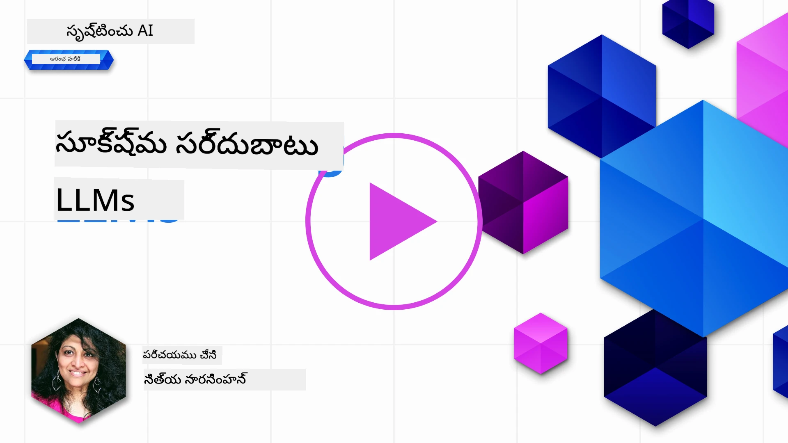
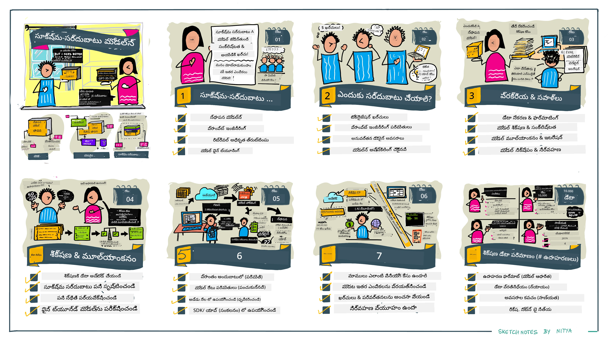

# మీ LLM ని ఫైన్-ట్యూన్ చేయడం

సృజనాత్మక AI అప్లికేష‌న్లు నిర్మించడానికి పెద్ద భాషా నమూనాలను ఉపయోగించడం కొత్త సవాళ్లతో వస్తుంది. ఒక ముఖ్యమైన ఇష్యూ ఒక నిర్దిష్ట వినియోగదారు అభ్యర్థనకు నమూనా సృష్టించిన సమగ్రతలో (ఖచ్చితత్వం మరియు సంబంధితత) నిర్ధారణ చేయడమే. గత పాఠాలలో, మేము ప్రాంప్ట్ ఇంజనీరింగ్ మరియు రిట్రీవల్-ఆగ్మెంటెడ్ జనరేషన్ వంటి సాంకేతికతలను చర్చించాము, ఇవి ఉన్న నమూనాకు _ప్రాంప్ట్ ఇన్పుట్ ను సవరించడం_ ద్వారా సమస్యను పరిష్కరించడానికి ప్రయత్నిస్తాయి.

ఈ రోజు పాఠంలో, మూడవ సాంకేతికత అయిన **ఫైన్-ట్యూనింగ్** గురించి చర్చిస్తాము, ఇది అదనపు డేటాతో నమూనాను _మరల శిక్షణ చేయడం_ ద్వారా సవాలు పరిష్కరించడానికి ప్రయత్నిస్తుంది. వివరాల్లోకి వెళ్దాం.

## అభ్యాస లక్ష్యాలు

ఈ పాఠం ముందస్తుగా శిక్షణ పొందిన భాషా నమూనాలకు ఫైన్-ట్యూనింగ్ అనే భావనను పరిచయం చేస్తుంది, ఈ దశలో ప్రయోజనాలు మరియు సవాళ్లను పరిశీలిస్తూ, సృజనాత్మక AI నమూనాల పనితీరును మెరుగుపరచడానికి ఫైన్-ట్యూనింగ్‌ను ఎప్పుడు, ఎలా ఉపయోగించాలో మార్గనిర్దేశం అందిస్తుంది.

ఈ పాఠం చివరిలో, మీరు ఈ క్రింది ప్రశ్నలకు సమాధానం చెప్పగలుగుతారు:

- భాషా నమూనాల కోసం ఫైన్-ట్యూనింగ్ అంటే ఏమిటి?
- ఎప్పుడు మరియు ఎందుకు ఫైన్-ట్యూనింగ్ ఉపయోగకరమవుతుంది?
- నేను ముందస్తు శిక్షణ పొందిన నమూనాను ఎలా ఫైన్-ట్యూన్ చేయగలను?
- ఫైన్-ట్యూనింగ్ యొక్క పరిమితులు ఏమిటి?

సిద్దమా? మొదలెత్తుదాం.

## చిత్రణ గైడ్

మనం ఏం కవర్ చేయబోతున్నామో పెద్ద చిత్రం పొందాలా? ఫైన్-ట్యూనింగ్ కొరకు ప్రధాన భావాలు మరియు ప్రేరణ నేర్చుకోవడం నుండి, ఫైన్-ట్యూనింగ్ ప్రక్రియ మరియు ఉత్తమ అభ్యాసాలను అర్థం చేసుకోవడం వరకు పాఠ యాత్ర వివరించిన ఈ చిత్రితమైన గైడ్‌ను పరిశీలించండి. ఇది అన్వేషణకు ఆసక్తికరమైన అంశం, కాబట్టి మీ స్వీయ-నిర్దేశిత అభ్యాస యాత్రకు మద్దతుగా అదనపు లింకులతో కూడిన [సంపత్తులు](./RESOURCES.md?WT.mc_id=academic-105485-koreyst) పేజీని చూడడం మర్చిపోకండి!

## భాషా నమూనాల ఫైన్-ట్యూనింగ్ అంటే ఏమిటి?

స్వభావం ప్రకారం, పెద్ద భాషా నమూనాలు ఇన్టర్నెట్ సహా విభిన్న వనరుల నుండి పెద్ద మొత్తంలో టెక్స్ట్‌తో _ముందస్తుగా శిక్షణ పొందుతాయి_. గత పాఠాలలో నేర్చుకున్నట్లుగానే, వినియోగదారుల ప్రశ్నలకు ("ప్రాంప్ట్‌ లకు") నమూనా ప్రతిస్పందనల నాణ్యతను మెరుగుపరచడానికి మాకు _ప్రాంప్ట్ ఇంజనీరింగ్_ మరియు _రిట్రీవల్-ఆగ్మెంటెడ్ జనరేషన్_ వంటి సాంకేతికతలు అవసరం.

ప్రసిద్ధమైన ప్రాంప్ట్ ఇంజనీరింగ్ సాంకేతికత ఒక నిర్దిష్ట డొమైన్ కోసం నమూనా ఎలా స్పందించాలో మోడల్ కు మరింత మార్గనిర్దేశనం ఇవ్వడం, అంటే _సూచనలు_ (స్పష్ట మార్గనిర్దేశనం) లేదా _కొన్ని ఉదాహరణలు ఇవ్వడం_ (అస్పష్ట మార్గనిర్దేశనం) అందించడం. దీన్ని _ఫ్యూస్-షాట్ లెర్నింగ్_ అని పిలుస్తారు, కానీ దీనికీ రెండు పరిమితులు ఉన్నాయి:

- నమూనా టోకెన్ పరిమితులు మీకు ఇవ్వగల ఉదాహరణల సంఖ్యను పరిమితం చేస్తాయి, ఫలితంగా ప్రభావం తగ్గుతుంది.
- నమూనా టోకెన్ ఖర్చులు ప్రతి ప్రాంప్ట్ కు ఉదాహరణలను జోడించడం ఖరీదుగా మారుస్తాయి, ఫలితంగా సౌకర్యం తగ్గుడుతుంది.

ఫైన్-ట్యూనింగ్ అనేది మెషీన్ లెర్నింగ్ వ్యవస్థల్లో సాధారణంగా ఉపయోగించే పద్ధతి, దీనిలో ముందస్తుగా శిక్షణ పొందిన నమూనాను కొత్త డేటాతో మరల శిక్షణ ఇవ్వడం ద్వారా నిర్దిష్ట పనిలో దాని పనితీరును మెరుగుపర్చటం జరుగుతుంది. భాషా నమూనాల సందర్భంలో, మేము ముందస్తుగా శిక్షణ పొందిన నమూనాను _కొత్త పని లేదా అప్లికేషన్ డొమైన్ కొరకు ఎంపిక చేసిన ఉదాహరణల సెట్‌తో ఫైన్-ట్యూన్_ చేసి, ఆ పని లేదా డొమేనుకు కచ్చితమైన మరియు సంబంధిత **అనుకూల నమూనాను** సృష్టించవచ్చు. ఫైన్-ట్యూనింగ్ యొక్క పక్కఫలితం ఏమిటంటే, ఇది ఫ్యూస్-షాట్ లెర్నింగ్‌కి కావలసిన ఉదాహరణల సంఖ్యను తగ్గించి టోకెన్ వినియోగాన్ని మరియు సంబంధిత ఖర్చులను తగ్గిస్తుంది.

## మేము ఎప్పుడు మరియు ఎందుకు నమూనాలను ఫైన్-ట్యూన్ చేయాలి?

_ఈ_ సందర్భంలో, ఫైన్-ట్యూనింగ్ అనగా మేము సూచిస్తున్నది **సూపర్వైజ్డ్** ఫైన్-ట్యూనింగ్, అంటే మొదటి శిక్షణ డేటాసెట్‌లో భాగంగా లేని **కొత్త డేటా**ని జతచేసి మరల శిక్షణ ఇవ్వటం. ఇది అసూపర్వైజ్డ్ ఫైన్-ట్యూనింగ్ నుండి భిన్నం, అందులో నమూనా మొదటి డేటాపై but వేరే హైపర్‌పరామితులు ఉపయోగించి శిక్షణ పొందుతుంది.

ముఖ్యంగా గుర్తుంచుకోవవలసిన విషయం ఏమిటంటే, ఫైన్-ట్యూనింగ్ ఒక అధునాతన సాంకేతికత కావడంతో అవసరమైన ఫలితాల కోసం నిర్దిష్ట నైపుణ్యం అవసరం. తప్పుగా చేస్తే, మీరు ఆశించిన మెరుగుదల రాలేదు, ఇంకా లక్ష్యంగా పెట్టుకున్న డొమైన్ లో నమూనా పనితీరు మందగించవచ్చు.

కాబట్టి, మీరు భాషా నమూనాలను "ఎలా" ఫైన్-ట్యూన్ చేయాలో నేర్చుకోకుండా ముందుగా "ఎందుకు" ఈ మార్గాన్ని తీసుకోవాలో తెలుసుకోవాలి, అలాగే ఫైన్-ట్యూనింగ్ ప్రారంభించడానికి "ఎప్పుడు" సమయం వచ్చిందో తెలుసుకోవాలి. ఈ ప్రశ్నలను కచ్చితంగా మీరు మీకు అడగండి:

- **వినియోగ కేసు**: ఫైన్-ట్యూనింగ్ కోసం మీ _వినియోగ కేసు_ ఏమిటి? ప్రస్తుత ముందస్తు శిక్షణ పొందిన నమూనాలో మీరు ఏ అంశాలను మెరుగుపరచాలనుకుంటున్నారు?
- **వికల్పాలు**: మీరు లక్ష్యించిన ఫలితాల సాధనకు _ఇతర సాంకేతిక పద్ధతులు_ ప్రయత్నించారా? అవి ఒక బేస్‌లైన్‌ తయారు చేయడానికి ఉపయోగించండి.
  - ప్రాంప్ట్ ఇంజనీరింగ్: సంబంధిత ప్రాంప్ట్ స్పందనల ఉదాహరణలతో ఫ్యూస్-షాట్ ప్రాంప్ట్‌ చేయడం ప్రయత్నించండి. ప్రతిస్పందనల నాణ్యతను మూల్యాంకనం చేయండి.
  - రిట్రీవల్ ఆగ్మెంటెడ్ జనరేషన్: మీ డేటాను శోధిస్తూ కలిగిన క్వెరీ ఫలితాలతో ప్రాంప్ట్‌లను మరియు అవి యే విధంగా ప్రతిస్పందనలను మెరుగుపరుస్తాయో చూడండి.
- **ఖర్చులు**: ఫైన్-ట్యూనింగ్ ఖర్చులను గుర్తించారా?
  - ట్యూనబిలిటీ - ముందస్తు శిక్షణ పొందిన నమూనా ఫైన్-ట్యూనింగ్ కోసం అందుబాటులో ఉందా?
  - శ్రమ - శిక్షణ డేటా సిద్ధం చేయడం, నమూనాను ఆలోచించడం మరియు మెరుగుపరచడం.
  - కంప్యూట్ - ఫైన్-ట్యూనింగ్ పనులను నడిపించడం మరియు ఫైన్-ట్యూన్ చేసిన నమూనాను నడపడం.
  - డేటా - ఫైన్-ట్యూనింగ్ ప్రభావం కోసం సరిపడే నాణ్యతల ఉదాహరణలు.
- **ప్రయోజనాలు**: ఫైన్-ట్యూనింగ్ ఆస్వాదనలను నిర్ధారించారా?
  - నాణ్యత - ఫైన్-ట్యూన్ చేసిన నమూనా బేస్‌లైన్‌ను మించిందా?
  - ఖర్చు - ఇది ప్రాంప్ట్‌లను సరళీకరించి టోకెన్ వినియోగాన్ని తగ్గిస్తుందా?
  - విస్తరింపుకి తగిన - మీరు ప్రాథమిక నమూనాను కొత్త డొమేన్ల కోసం పునర్వినియోగం చేయగలరా?

ఈ ప్రశ్నలకు సమాధానం చెప్పగలగడం ద్వారా, మీరు మీ వినియోగ కేసుకు ఫైన్-ట్యూనింగ్ సరైన దారిగా ఉందో లేదో నిర్ణయించుకోవచ్చు. సిద్దంగా ఉంటే, ప్రయోజనాలు ఖర్చుల కంటే ఎక్కువగా ఉన్నప్పుడు ఈ పద్ధతి సరైనది. మీరు ముందుకు సాగాలని నిర్ణయించిన తర్వాత, మునుపటి శిక్షణ పొందిన నమూనాను మీరు _ఎలా_ ఫైన్-ట్యూన్ చేయాలో ఆలోచించాల్సి ఉంటుంది.

నిర్ణయం తీసుకునే ప్రక్రియ యొక్క మరిన్ని అవగాహనల కోసం [To fine-tune or not to fine-tune](https://www.youtube.com/watch?v=0Jo-z-MFxJs) వీడియో చూడండి.

## ముందస్తు శిక్షణ పొందిన నమూనాను ఎలా ఫైన్-ట్యూన్ చేయవచ్చు?

ముందస్తు శిక్షణ పొందిన నమూనాను ఫైన్-ట్యూన్ చేయడానికి, మీ వద్ద ఉండాలి:

- ఫైన్-ట్యూన్ చేయడానికి ముందస్తుగా శిక్షణ పొందిన నమూనా
- ఫైన్-ట్యూనింగ్ కొరకు డేటాసెట్
- ఫైన్-ట్యూనింగ్ పనిని నడిపించే శిక్షణ వాతావరణం
- ఫైన్-ట్యూన్ చేసిన నమూనాను నిక్షేపించడానికి హోస్టింగ్ వాతావరణం

## ఫైన్-ట్యూనింగ్ ఆక్షన్ లో

కింది వనరులు ఎంచుకున్న నమూనాతో మరియు ఎంపిక చేసిన డేటాసెట్‌తో ఒక వాస్తవ ఉదాహరణను చూపిస్తూ దశల వారీ ట్యుటోరియల్స్ అందిస్తాయి. ఈ ట్యుటోరియల్స్ ద్వారా పని చేయడానికి మీరు ప్రొవైడర్ ఖాతా మరియు సంబంధిత నమూనా మరియు డేటాసెట్‌లకు యాక్సెస్ ఉండాలి.

| ప్రొవైడర్       | ట్యుటోరియల్                                                                                                                                                                       | వివరణ                                                                                                                                                                                                                                                                                                                                                                                                                             |
| -------------- | ------------------------------------------------------------------------------------------------------------------------------------------------------------------------------ | ---------------------------------------------------------------------------------------------------------------------------------------------------------------------------------------------------------------------------------------------------------------------------------------------------------------------------------------------------------------------------------------------------------------------------------- |
| ఓపెన్‌ఏఐ       | [ఎస్‌ఎంపెల్స్: చాట్ మోడల్స్ ఫైన్-ట్యూన్ చేయడం](https://github.com/openai/openai-cookbook/blob/main/examples/How_to_finetune_chat_models.ipynb?WT.mc_id=academic-105485-koreyst)                | ఒక ప్రత్యేక డొమైన్ ("recipe assistant") కోసం `gpt-35-turbo` ని ఫైన్-ట్యూన్ చేయడం నేర్చుకోండి — శిక్షణ డేటాను తయారు చేయడం, ఫైన్-ట్యూనింగ్ పనిని నడపడం మరియు ఫైన్-ట్యూన్ చేసిన నమూనాను సందర్శన కోసం ఉపయోగించడం.                                                                                                                                                                                                                          |
| ఆజూర్ ఓపెన్‌ఏఐ | [GPT 3.5 Turbo ఫైన్-ట్యూనింగ్ ట్యుటోరియల్](https://learn.microsoft.com/azure/ai-services/openai/tutorials/fine-tune?tabs=python-new%2Ccommand-line&WT.mc_id=academic-105485-koreyst) | **ఆజూర్‌పై** `gpt-35-turbo-0613` మోడల్‌కు ఫైన్-ట్యూన్ చేయడం నేర్చుకోండి — శిక్షణ డేటాను రూపొందించి అప్‌లోడ్ చేయడం, ఫైన్-ట్యూనింగ్ పని ప్రారంభించడం. కొత్త నమూనాను నిక్షేపించి ఉపయోగించడం.                                                                                                                                                                                                                                       |
| హగింగ్ ఫేస్      | [హగింగ్ ఫేస్ తో LLMs ఫైన్-ట్యూనింగ్](https://www.philschmid.de/fine-tune-llms-in-2024-with-trl?WT.mc_id=academic-105485-koreyst)                                               | ఈ బ్లాగ్ పోస్టులో మీరు ఓపెన్ LLM (ఉదా: `CodeLlama 7B`) ని [transformers](https://huggingface.co/docs/transformers/index?WT.mc_id=academic-105485-koreyst) మరియు [Transformer Reinforcement Learning (TRL)](https://huggingface.co/docs/trl/index?WT.mc_id=academic-105485-koreyst) ఉపయోగించి హగింగ్ ఫేస్‌కు చెందిన తెరిచిన [datasets](https://huggingface.co/docs/datasets/index?WT.mc_id=academic-105485-koreyst) తో ఫైన్-ట్యూన్ చేస్తారు. |
|                |                                                                                                                                                                                |                                                                                                                                                                                                                                                                                                                                                                                                                                    |
| 🤗 AutoTrain      | [AutoTrain తో LLMs ఫైన్-ట్యూనింగ్](https://github.com/huggingface/autotrain-advanced/?WT.mc_id=academic-105485-koreyst)                                                         | AutoTrain (లేదా AutoTrain Advanced) అనేది హగింగ్ ఫేస్ అభివృద్ధి చేసిన పైథాన్ లైబ్రరీ, ఇది LLM ఫైన్-ట్యూనింగ్ సహా వివిధ పనుల కోసం ఫైన్-ట్యూనింగ్ చేయడానికి ఉపయోగపడుతుంది. AutoTrain అనేది కోడ్ రాబట్టి విధానం, ఇది మీ ఇష్టమైన క్లౌడ్, హగింగ్ ఫేస్ స్పేసెస్ లేదా లోకల్ నిగా ఫైన్-ట్యూనింగ్ చేయడానికి అనుమతిస్తుంది. ఇది వెబ్ GUI, CLI మరియు yaml కాన్ఫిగరేషన్ ఫైళ్ళ ద్వారా శిక్షణను మద్దతిస్తోంది.                                                                               |
|                |                                                                                                                                                                                |                                                                                                                                                                                                                                                                                                                                                                                                                                    |
| 🦥 Unsloth       | [Unsloth తో LLMs ఫైన్-ట్యూనింగ్](https://github.com/unslothai/unsloth)                                                         | Unsloth ఓపెన్ సోర్స్ ఫ్రేమ్‌వర్క్, LLMs ఫైన్-ట్యూనింగ్ మరియు రీయిన్‌ఫోర్స్‌మెంట్ లెర్నింగ్ (RL) మద్దతు ఇస్తుంది. Unsloth లోకల్ శిక్షణ, మూల్యాంకనం మరియు నిక్షేపణను సులభతరం చేస్తుంది [notebooks](https://github.com/unslothai/notebooks) తో. ఇది టెక్స్ట్-టు-స్పీచ్ (TTS), BERT మరియు మల్టీమోడల్ నమూనాలనూ మద్దతిస్తుంది. మొదలయ్యేందుకు, వారి దశల వారీ [Fine-tuning LLMs గైడ్](https://docs.unsloth.ai/get-started/fine-tuning-llms-guide) చదవండి.                                                                           |
|                |                                                                                                                                                                                |                                                                                                                                                                                                                                                                                                                                                                                                                                    |
## అసైన్‌మెంట్

పై ట్యుటోరియల్స్ లో ఒకటిని ఎంచుకుని వాటి ద్వారా నడవండి. _మేము ఈ ట్యుటోరియల్స్ వెర్షన్‌ను జూపిటర్ నోటบุక్స్ లో దృశ్యీకరణ కోసం ప్రతిసారంగా అనుకరించవచ్చు. కాబట్టి తాజా వెర్షన్ కోసం అసలు స్రోతులను ఉపయోగించండి_.

## అద్భుతం! మీ అభ్యాసం కొనసాగించండి.

ఈ పాఠాన్ని పూర్తి చేసిన తర్వాత, మా [Generative AI Learning collection](https://aka.ms/genai-collection?WT.mc_id=academic-105485-koreyst) ను పరిశీలించి మీ సృజనాత్మక AI జ్ఞానాన్ని మరింత అభివృద్ధి చేసుకోండి!

అభినందనలు!! మీరు ఈ కోర్సు v2 సిరీస్ నుండి చివరి పాఠాన్ని పూర్తిచేశారు! నేర్చుకోవడం మరియు నిర్మించడం ఆపకండి. \*\*ఈ అంశానికి సంబంధించిన అదనపు సూచనల కోసం [RESOURCES](RESOURCES.md?WT.mc_id=academic-105485-koreyst) పేజీని చూడండి.

మా v1 సిరీస్ పాఠాలు కూడా మరిన్ని అసైన్‌మెంట్లు మరియు భావనలతో నవీకరించబడ్డాయి. కాబట్టి మీ జ్ఞానాన్ని రిఫ్రెష్ చేసుకోడానికి ఒక నిమిషం కుట్టండి - మరియు కమ్యూనిటీ కోసం ఈ పాఠాలను మెరుగుపరచడానికి దయచేసి [మీ ప్రశ్నలు మరియు అభిప్రాయాలు](https://github.com/microsoft/generative-ai-for-beginners/issues?WT.mc_id=academic-105485-koreyst) పంచుకోండి.

---

<!-- CO-OP TRANSLATOR DISCLAIMER START -->
**అస్పష్టత**:
ఈ డాక్యుమెంట్ [Co-op Translator](https://github.com/Azure/co-op-translator) అనే AI అనువాద సేవ ఉపయోగించి అనువదించబడింది. మేము ఖచ్చితత్వానికి యత్నిస్తూనే ఉన్నప్పటికీ, ఆటోమేటెడ్ అనువాదాల్లో తప్పులు లేదా అపూర్వతలు ఉండవచ్చు అని దయచేసి గమనించండి. స్థానిక భాషలో ఉన్న అసలు డాక్యుమెంట్ authoritative మూలంగా భావించాలి. ముఖ్యమైన సమాచారానికి, వృత్తిపరమైన మానవ అనువాదం సూచించబడుతుంది. ఈ అనువాద ఉపయోగం నుంచి ఏవైనా అపార్థాలు లేదా తప్పు అర్థం చేసుకోవడం కోసం మేము బాధ్యులు కాదని గమనించండి.
<!-- CO-OP TRANSLATOR DISCLAIMER END -->