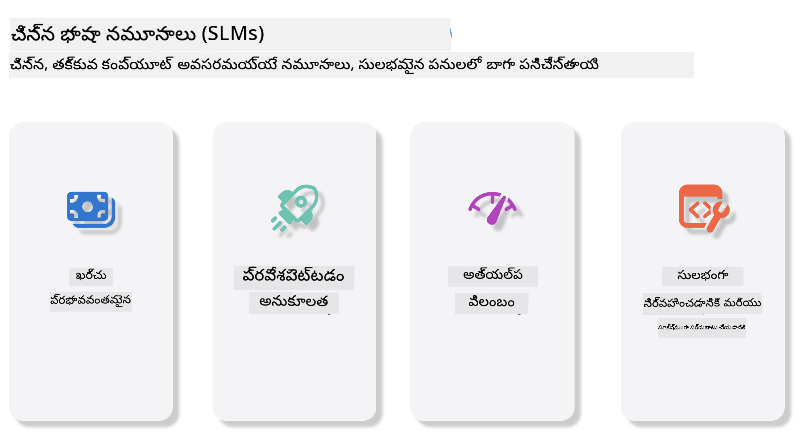
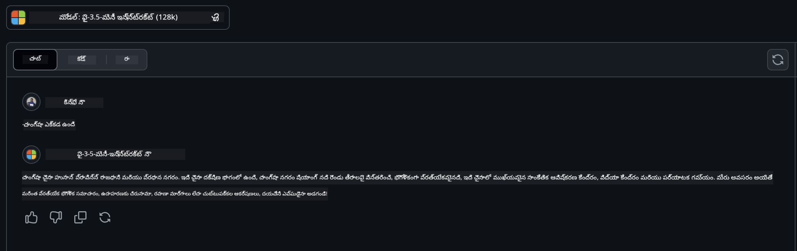

<!--
CO_OP_TRANSLATOR_METADATA:
{
  "original_hash": "124ad36cfe96f74038811b6e2bb93e9d",
  "translation_date": "2025-12-19T19:25:48+00:00",
  "source_file": "19-slm/README.md",
  "language_code": "te"
}
-->
# జనరేటివ్ AI కోసం చిన్న భాషా మోడల్స్ పరిచయం ప్రారంభకులకు
జనరేటివ్ AI అనేది కొత్త కంటెంట్ సృష్టించగల వ్యవస్థలను సృష్టించడంపై దృష్టి సారించే ఆర్టిఫిషియల్ ఇంటెలిజెన్స్ యొక్క ఒక ఆసక్తికరమైన రంగం. ఈ కంటెంట్ టెక్స్ట్ మరియు చిత్రాల నుండి సంగీతం మరియు మొత్తం వర్చువల్ వాతావరణాల వరకు విస్తరించవచ్చు. జనరేటివ్ AI యొక్క అత్యంత ఆసక్తికరమైన అనువర్తనాలలో ఒకటి భాషా మోడల్స్ రంగంలో ఉంది.

## చిన్న భాషా మోడల్స్ అంటే ఏమిటి?

చిన్న భాషా మోడల్ (SLM) అనేది పెద్ద భాషా మోడల్ (LLM) యొక్క స్కేల్-డౌన్ వెర్షన్, LLMల ఆర్కిటెక్చరల్ సూత్రాలు మరియు సాంకేతికతలను ఉపయోగిస్తూ, గణనీయంగా తక్కువ కంప్యూటేషనల్ ఫుట్‌ప్రింట్‌ను ప్రదర్శిస్తుంది.

SLMలు మానవుల్లాంటి టెక్స్ట్‌ను ఉత్పత్తి చేయడానికి రూపొందించిన భాషా మోడల్స్ ఉపసమూహం. GPT-4 వంటి పెద్ద మోడల్స్‌తో పోలిస్తే, SLMలు మరింత సన్నని మరియు సమర్థవంతమైనవి, కంప్యూటేషనల్ వనరులు పరిమితమైన అనువర్తనాలకు అనుకూలంగా ఉంటాయి. చిన్న పరిమాణం ఉన్నప్పటికీ, అవి వివిధ పనులను నిర్వహించగలవు. సాధారణంగా, SLMలు LLMలను కంప్రెస్ చేయడం లేదా డిస్టిల్ చేయడం ద్వారా నిర్మించబడతాయి, అసలు మోడల్ యొక్క ఫంక్షనాలిటీ మరియు భాషా సామర్థ్యాల పెద్ద భాగాన్ని నిలుపుకోవడానికి లక్ష్యంగా. ఈ మోడల్ పరిమాణం తగ్గింపు మొత్తం సంక్లిష్టతను తగ్గిస్తుంది, SLMలను మెమరీ వినియోగం మరియు కంప్యూటేషనల్ అవసరాల పరంగా మరింత సమర్థవంతంగా చేస్తుంది. ఈ ఆప్టిమైజేషన్లతో కూడి, SLMలు ఇంకా విస్తృత శ్రేణి సహజ భాషా ప్రాసెసింగ్ (NLP) పనులను నిర్వహించగలవు:

- టెక్స్ట్ ఉత్పత్తి: సారాంశంగా మరియు సందర్భానుగుణంగా సంబంధిత వాక్యాలు లేదా పేరాగ్రాఫ్‌లను సృష్టించడం.
- టెక్స్ట్ పూర్తి చేయడం: ఇచ్చిన ప్రాంప్ట్ ఆధారంగా వాక్యాలను అంచనా వేయడం మరియు పూర్తి చేయడం.
- అనువాదం: ఒక భాష నుండి మరొక భాషకు టెక్స్ట్ మార్చడం.
- సారాంశం: పొడవైన టెక్స్ట్‌ను చిన్న, సులభంగా గ్రహించగల సారాంశాలుగా సంక్షిప్తం చేయడం.

పెద్ద మోడల్స్‌తో పోలిస్తే పనితీరు లేదా అర్థం లోతు విషయంలో కొంత తేడా ఉండవచ్చు.

## చిన్న భాషా మోడల్స్ ఎలా పనిచేస్తాయి?
SLMలు విస్తృత టెక్స్ట్ డేటా మీద శిక్షణ పొందుతాయి. శిక్షణ సమయంలో, అవి భాషా నమూనాలు మరియు నిర్మాణాలను నేర్చుకుంటాయి, తద్వారా వ్యాకరణపరంగా సరైన మరియు సందర్భానుగుణమైన టెక్స్ట్‌ను ఉత్పత్తి చేయగలవు. శిక్షణ ప్రక్రియలో:

- డేటా సేకరణ: వివిధ మూలాల నుండి పెద్ద టెక్స్ట్ డేటాసెట్‌లను సేకరించడం.
- ప్రీప్రాసెసింగ్: శిక్షణకు అనుకూలంగా డేటాను శుభ్రపరచడం మరియు ఏర్పాటు చేయడం.
- శిక్షణ: మోడల్‌ను టెక్స్ట్‌ను అర్థం చేసుకోవడం మరియు ఉత్పత్తి చేయడం నేర్పించడానికి మెషీన్ లెర్నింగ్ అల్గోరిథమ్స్ ఉపయోగించడం.
- ఫైన్-ట్యూనింగ్: నిర్దిష్ట పనులపై పనితీరును మెరుగుపరచడానికి మోడల్‌ను సర్దుబాటు చేయడం.

SLMల అభివృద్ధి వనరులు పరిమితమైన వాతావరణాలలో, ఉదాహరణకు మొబైల్ పరికరాలు లేదా ఎడ్జ్ కంప్యూటింగ్ ప్లాట్‌ఫారమ్‌లలో, పూర్తి స్థాయి LLMలు భారీ వనరుల అవసరాల కారణంగా అనుకూలం కాకపోవచ్చు అనే పెరుగుతున్న అవసరానికి అనుగుణంగా ఉంది. సమర్థవంతతపై దృష్టి పెట్టడం ద్వారా, SLMలు పనితీరు మరియు ప్రాప్యత మధ్య సమతుల్యతను సాధిస్తాయి, వివిధ రంగాలలో విస్తృత అనువర్తనాన్ని సాధ్యమవుతాయి.



## నేర్చుకునే లక్ష్యాలు

ఈ పాఠంలో, మేము SLM గురించి జ్ఞానం పరిచయం చేసి, దాన్ని Microsoft Phi-3 తో కలిపి టెక్స్ట్ కంటెంట్, విజన్ మరియు MoEలో వివిధ సన్నివేశాలను నేర్చుకోవాలని ఆశిస్తున్నాము.

ఈ పాఠం ముగింపు నాటికి, మీరు ఈ క్రింది ప్రశ్నలకు సమాధానం చెప్పగలుగుతారు:

- SLM అంటే ఏమిటి
- SLM మరియు LLM మధ్య తేడా ఏమిటి
- Microsoft Phi-3/3.5 కుటుంబం అంటే ఏమిటి
- Microsoft Phi-3/3.5 కుటుంబాన్ని ఎలా ఇన్ఫరెన్స్ చేయాలి

సిద్దమా? మొదలుపెట్టుదాం.

## పెద్ద భాషా మోడల్స్ (LLMs) మరియు చిన్న భాషా మోడల్స్ (SLMs) మధ్య తేడాలు

LLMలు మరియు SLMలు రెండూ ప్రాబబిలిస్టిక్ మెషీన్ లెర్నింగ్ యొక్క ప్రాథమిక సూత్రాలపై నిర్మించబడి ఉంటాయి, వాటి ఆర్కిటెక్చరల్ డిజైన్, శిక్షణ విధానాలు, డేటా ఉత్పత్తి ప్రక్రియలు మరియు మోడల్ మూల్యాంకన సాంకేతికతలలో సమానమైన దృక్పథాలను అనుసరిస్తాయి. అయితే, ఈ రెండు రకాల మోడల్స్‌ను వేరుచేసే కొన్ని ముఖ్యమైన అంశాలు ఉన్నాయి.

## చిన్న భాషా మోడల్స్ అనువర్తనాలు

SLMలకు విస్తృత అనువర్తనాలు ఉన్నాయి, వాటిలో:

- చాట్‌బాట్లు: కస్టమర్ సపోర్ట్ అందించడం మరియు వినియోగదారులతో సంభాషణాత్మకంగా వ్యవహరించడం.
- కంటెంట్ సృష్టి: రచయితలకు ఆలోచనలు సృష్టించడంలో లేదా మొత్తం వ్యాసాలను డ్రాఫ్ట్ చేయడంలో సహాయం చేయడం.
- విద్య: విద్యార్థులకు రచనా పనులలో లేదా కొత్త భాషలు నేర్చుకోవడంలో సహాయం చేయడం.
- ప్రాప్యత: అంగవైకల్యాలు ఉన్న వ్యక్తులకు టెక్స్ట్-టు-స్పీచ్ వ్యవస్థల వంటి సాధనాలు సృష్టించడం.

**పరిమాణం**

LLMలు మరియు SLMల మధ్య ప్రధాన తేడా మోడల్స్ పరిమాణంలో ఉంటుంది. ChatGPT (GPT-4) వంటి LLMలు సుమారు 1.76 ట్రిలియన్ పరామితులతో ఉండవచ్చు, అయితే Mistral 7B వంటి ఓపెన్-సోర్స్ SLMలు సుమారు 7 బిలియన్ పరామితులతో రూపొందించబడ్డాయి. ఈ వ్యత్యాసం ప్రధానంగా మోడల్ ఆర్కిటెక్చర్ మరియు శిక్షణ ప్రక్రియలలో తేడాల కారణంగా ఉంటుంది. ఉదాహరణకు, ChatGPT ఎన్‌కోడర్-డీకోడర్ ఫ్రేమ్‌వర్క్‌లో స్వీయ-అటెన్షన్ మెకానిజాన్ని ఉపయోగిస్తే, Mistral 7B డీకోడర్-ఒన్లీ మోడల్‌లో స్లైడింగ్ విండో అటెన్షన్ ఉపయోగించి మరింత సమర్థవంతమైన శిక్షణను సాధిస్తుంది. ఈ ఆర్కిటెక్చరల్ భేదం మోడల్స్ సంక్లిష్టత మరియు పనితీరుపై గాఢ ప్రభావం చూపుతుంది.

**అర్థం చేసుకోవడం**

SLMలు సాధారణంగా నిర్దిష్ట డొమైన్‌లలో పనితీరును మెరుగుపరచడానికి ఆప్టిమైజ్ చేయబడ్డాయి, అవి అత్యంత ప్రత్యేకత కలిగినవి కానీ విస్తృత పరిధిలో విభిన్న రంగాలపై సారాంశ అర్థం ఇవ్వడంలో పరిమితంగా ఉండవచ్చు. దీని విరుద్ధంగా, LLMలు మరింత సమగ్ర స్థాయిలో మానవుల్లాంటి మేధస్సును అనుకరించడానికి లక్ష్యంగా ఉంటాయి. విస్తృత, వైవిధ్యమైన డేటాసెట్‌లపై శిక్షణ పొందిన LLMలు వివిధ రంగాలలో బాగా పనిచేయడానికి రూపొందించబడ్డాయి, ఎక్కువ అనువర్తన సామర్థ్యం మరియు అనుకూలతను అందిస్తాయి. అందువల్ల, LLMలు సహజ భాషా ప్రాసెసింగ్ మరియు ప్రోగ్రామింగ్ వంటి విస్తృత శ్రేణి డౌన్‌స్ట్రీమ్ పనులకు మరింత అనుకూలంగా ఉంటాయి.

**కంప్యూటింగ్**

LLMల శిక్షణ మరియు అమలు వనరుల పరంగా భారమైన ప్రక్రియలు, పెద్ద స్థాయి GPU క్లస్టర్లను అవసరం చేస్తాయి. ఉదాహరణకు, ChatGPT వంటి మోడల్‌ను మొదలుండి శిక్షణ ఇవ్వడానికి వేలాది GPUలు అనేక నెలల పాటు అవసరం కావచ్చు. దీని విరుద్ధంగా, SLMలు తక్కువ పరామితుల కారణంగా కంప్యూటేషనల్ వనరుల పరంగా మరింత సులభంగా అందుబాటులో ఉంటాయి. Mistral 7B వంటి మోడల్స్ మధ్యస్థ GPU సామర్థ్యాలతో కూడిన స్థానిక యంత్రాలలో శిక్షణ మరియు అమలు చేయవచ్చు, అయితే శిక్షణకు ఇంకా అనేక గంటలు మరియు బహుళ GPUలు అవసరం.

**పక్షపాతం**

LLMలలో పక్షపాతం ఒక తెలిసిన సమస్య, ఇది ప్రధానంగా శిక్షణ డేటా స్వభావం కారణంగా ఉంటుంది. ఈ మోడల్స్ ఎక్కువగా ఇంటర్నెట్ నుండి అందుబాటులో ఉన్న ముడి డేటాను ఆధారంగా తీసుకుంటాయి, ఇది కొన్ని సమూహాలను తక్కువగా లేదా తప్పుగా ప్రాతినిధ్యం వహించవచ్చు, తప్పు లేబులింగ్‌ను పరిచయం చేయవచ్చు లేదా భాషా పక్షపాతాలను ప్రతిబింబించవచ్చు, ఇవి బోధన ప్రాంతీయ భేదాలు, భౌగోళిక వేరియేషన్లు మరియు వ్యాకరణ నియమాల ప్రభావంతో ఉంటాయి. అదనంగా, LLMల సంక్లిష్ట ఆర్కిటెక్చర్ పక్షపాతాన్ని అనుకోకుండా పెంచవచ్చు, ఇది జాగ్రత్తగా ఫైన్-ట్యూనింగ్ లేకుండా గమనించబడకపోవచ్చు. మరోవైపు, SLMలు మరింత పరిమిత, డొమైన్-స్పెసిఫిక్ డేటాసెట్‌లపై శిక్షణ పొందినందున, అలాంటి పక్షపాతాలకు తక్కువగా గురవుతాయి, అయినప్పటికీ పూర్తిగా రక్షితంగా ఉండవు.

**ఇన్ఫరెన్స్**

SLMల తక్కువ పరిమాణం వారికి ఇన్ఫరెన్స్ వేగం విషయంలో గణనీయమైన లాభాన్ని ఇస్తుంది, ఇది స్థానిక హార్డ్వేర్‌పై సమర్థవంతంగా అవుట్పుట్‌లను ఉత్పత్తి చేయడానికి అనుమతిస్తుంది, విస్తృత సమాంతర ప్రాసెసింగ్ అవసరం లేకుండా. LLMలు, వారి పరిమాణం మరియు సంక్లిష్టత కారణంగా, అంగీకారయోగ్యమైన ఇన్ఫరెన్స్ సమయాలను సాధించడానికి భారీ సమాంతర కంప్యూటేషనల్ వనరులను తరచుగా అవసరం చేస్తాయి. బహుళ సమకాలీన వినియోగదారుల ఉనికి LLMల ప్రతిస్పందన సమయాలను మరింత మందగింపజేస్తుంది, ముఖ్యంగా పెద్ద స్థాయిలో అమలు చేసినప్పుడు.

సారాంశంగా, LLMలు మరియు SLMలు రెండూ మెషీన్ లెర్నింగ్‌లో ప్రాథమిక ఆధారాన్ని పంచుకున్నప్పటికీ, మోడల్ పరిమాణం, వనరు అవసరాలు, సందర్భ అర్థం, పక్షపాతం ప్రభావం మరియు ఇన్ఫరెన్స్ వేగం విషయంలో గణనీయంగా భిన్నంగా ఉంటాయి. ఈ తేడాలు వాటి వేర్వేరు ఉపయోగాల అనుకూలతను ప్రతిబింబిస్తాయి, LLMలు ఎక్కువ అనువర్తన సామర్థ్యం కలిగి కానీ వనరుల పరంగా భారమైనవి, SLMలు మరింత డొమైన్-స్పెసిఫిక్ సమర్థవంతతను తక్కువ కంప్యూటేషనల్ అవసరాలతో అందిస్తాయి.

***గమనిక: ఈ అధ్యాయంలో, మేము Microsoft Phi-3 / 3.5 ను ఉదాహరణగా తీసుకుని SLMను పరిచయం చేస్తాము.***

## Phi-3 / Phi-3.5 కుటుంబం పరిచయం

Phi-3 / 3.5 కుటుంబం ప్రధానంగా టెక్స్ట్, విజన్ మరియు ఏజెంట్ (MoE) అనువర్తన సన్నివేశాలను లక్ష్యంగా పెట్టుకుంది:

### Phi-3 / 3.5 ఇన్‌స్ట్రక్ట్

ప్రధానంగా టెక్స్ట్ ఉత్పత్తి, చాట్ పూర్తి చేయడం, మరియు కంటెంట్ సమాచారం తీయడం వంటి పనులకు.

**Phi-3-మినీ**

3.8B పరామితుల భాషా మోడల్ Microsoft Azure AI Studio, Hugging Face, మరియు Ollamaలో అందుబాటులో ఉంది. Phi-3 మోడల్స్ సమాన మరియు పెద్ద పరిమాణాల భాషా మోడల్స్‌ను కీలక బెంచ్‌మార్క్‌లలో గణనీయంగా అధిగమిస్తాయి (క్రింద బెంచ్‌మార్క్ సంఖ్యలు చూడండి, ఎక్కువ సంఖ్యలు మెరుగైనవి). Phi-3-మినీ తన పరిమాణం రెండింతల మోడల్స్‌ను అధిగమిస్తుంది, Phi-3-స్మాల్ మరియు Phi-3-మీడియం పెద్ద మోడల్స్‌ను, GPT-3.5 సహా, అధిగమిస్తాయి.

**Phi-3-స్మాల్ & మీడియం**

కేవలం 7B పరామితులతో, Phi-3-స్మాల్ వివిధ భాషా, తర్కం, కోడింగ్, మరియు గణిత బెంచ్‌మార్క్‌లలో GPT-3.5Tని అధిగమిస్తుంది.

14B పరామితులతో Phi-3-మీడియం ఈ ధోరణిని కొనసాగించి Gemini 1.0 Proని అధిగమిస్తుంది.

**Phi-3.5-మినీ**

దాన్ని Phi-3-మినీ యొక్క అప్‌గ్రేడ్‌గా భావించవచ్చు. పరామితులు మారకుండా ఉండగా, ఇది బహుభాషా మద్దతును మెరుగుపరుస్తుంది (20+ భాషలను మద్దతు ఇస్తుంది: అరబిక్, చైనీస్, చెక్, డానిష్, డచ్, ఇంగ్లీష్, ఫినిష్, ఫ్రెంచ్, జర్మన్, హీబ్రూ, హంగేరియన్, ఇటాలియన్, జపనీస్, కొరియన్, నార్వేజియన్, పోలిష్, పోర్చుగీస్, రష్యన్, స్పానిష్, స్వీడిష్, థాయ్, టర్కిష్, ఉక్రెయిన్) మరియు దీర్ఘ సందర్భానికి బలమైన మద్దతును జోడిస్తుంది.

3.8B పరామితులతో Phi-3.5-మినీ అదే పరిమాణం ఉన్న భాషా మోడల్స్‌ను అధిగమిస్తుంది మరియు రెండింతల పరిమాణం ఉన్న మోడల్స్‌కు సమానంగా ఉంటుంది.

### Phi-3 / 3.5 విజన్

Phi-3/3.5 ఇన్‌స్ట్రక్ట్ మోడల్‌ను Phi యొక్క అర్థం చేసుకునే సామర్థ్యంగా భావించవచ్చు, మరియు విజన్ Phiకి ప్రపంచాన్ని అర్థం చేసుకునే కళ్ళను ఇస్తుంది.

**Phi-3-విజన్**

4.2B పరామితులతో Phi-3-విజన్ ఈ ధోరణిని కొనసాగించి Claude-3 Haiku మరియు Gemini 1.0 Pro V వంటి పెద్ద మోడల్స్‌ను సాధారణ దృశ్య తర్కం పనులు, OCR, పట్టిక మరియు డయాగ్రామ్ అర్థం చేసుకోవడంలో అధిగమిస్తుంది.

**Phi-3.5-విజన్**

Phi-3.5-విజన్ కూడా Phi-3-విజన్ యొక్క అప్‌గ్రేడ్, ఇది బహుళ చిత్రాలకు మద్దతు జోడిస్తుంది. దీన్ని విజన్‌లో మెరుగుదలగా భావించవచ్చు, మీరు చిత్రాలు మాత్రమే కాకుండా వీడియోలను కూడా చూడగలుగుతారు.

Phi-3.5-విజన్ Claude-3.5 Sonnet మరియు Gemini 1.5 Flash వంటి పెద్ద మోడల్స్‌ను OCR, పట్టిక మరియు చార్ట్ అర్థం చేసుకోవడంలో అధిగమిస్తుంది మరియు సాధారణ దృశ్య జ్ఞాన తర్కం పనులలో సమానంగా ఉంటుంది. బహుళ ఫ్రేమ్ ఇన్‌పుట్‌ను మద్దతు ఇస్తుంది, అంటే బహుళ ఇన్‌పుట్ చిత్రాలపై తర్కం చేయగలదు.

### Phi-3.5-MoE

***మిక్చర్ ఆఫ్ ఎక్స్‌పర్ట్స్ (MoE)*** మోడల్స్‌ను తక్కువ కంప్యూట్‌తో ప్రీట్రెయిన్ చేయడానికి అనుమతిస్తుంది, అంటే మీరు అదే కంప్యూట్ బడ్జెట్‌తో మోడల్ లేదా డేటాసెట్ పరిమాణాన్ని గణనీయంగా పెంచవచ్చు. ముఖ్యంగా, MoE మోడల్ తన డెన్స్ సమానమైన మోడల్ కంటే ప్రీట్రెయినింగ్ సమయంలో చాలా వేగంగా అదే నాణ్యతను సాధించాలి.

Phi-3.5-MoE 16x3.8B ఎక్స్‌పర్ట్ మాడ్యూల్స్ కలిగి ఉంటుంది. 6.6B యాక్టివ్ పరామితులతో Phi-3.5-MoE చాలా పెద్ద మోడల్స్‌తో సమానమైన స్థాయి తర్కం, భాషా అర్థం మరియు గణితాన్ని సాధిస్తుంది.

మేము వివిధ సన్నివేశాల ఆధారంగా Phi-3/3.5 కుటుంబ మోడల్స్‌ను ఉపయోగించవచ్చు. LLMతో పోలిస్తే, మీరు Phi-3/3.5-మినీ లేదా Phi-3/3.5-విజన్‌ను ఎడ్జ్ పరికరాలపై అమలు చేయవచ్చు.

## Phi-3/3.5 కుటుంబ మోడల్స్‌ను ఎలా ఉపయోగించాలి

మేము Phi-3/3.5ని వివిధ సన్నివేశాలలో ఉపయోగించాలని ఆశిస్తున్నాము. తదుపరి, మేము వివిధ సన్నివేశాల ఆధారంగా Phi-3/3.5ను ఉపయోగిస్తాము.


### క్లౌడ్ API ఇన్ఫరెన్స్ తేడా

**GitHub మోడల్స్**

GitHub మోడల్స్ అత్యంత ప్రత్యక్ష మార్గం. మీరు త్వరగా Phi-3/3.5-ఇన్‌స్ట్రక్ట్ మోడల్‌ను GitHub మోడల్స్ ద్వారా యాక్సెస్ చేయవచ్చు. Azure AI ఇన్ఫరెన్స్ SDK / OpenAI SDKతో కలిపి, మీరు కోడ్ ద్వారా API యాక్సెస్ చేసి Phi-3/3.5-ఇన్‌స్ట్రక్ట్ కాల్‌ను పూర్తి చేయవచ్చు. మీరు ప్లేగ్రౌండ్ ద్వారా వివిధ ఫలితాలను కూడా పరీక్షించవచ్చు.

- డెమో: చైనీస్ సన్నివేశాలలో Phi-3-మినీ మరియు Phi-3.5-మినీ ప్రభావాల తులన




**Azure AI స్టూడియో**

లేదా, మీరు విజన్ మరియు MoE మోడల్స్ ఉపయోగించాలనుకుంటే, Azure AI స్టూడియో ద్వారా కాల్‌ను పూర్తి చేయవచ్చు. మీరు ఆసక్తి ఉంటే, Phi-3 కుక్‌బుక్ చదవవచ్చు, Azure AI స్టూడియో ద్వారా Phi-3/3.5 ఇన్‌స్ట్రక్ట్, విజన్, MoE కాల్ చేయడం ఎలా తెలుసుకోవడానికి [ఈ లింక్ క్లిక్ చేయండి](https://github.com/microsoft/Phi-3CookBook/blob/main/md/02.QuickStart/AzureAIStudio_QuickStart.md?WT.mc_id=academic-105485-koreyst)

**NVIDIA NIM**

Azure మరియు GitHub అందించే క్లౌడ్ ఆధారిత మోడల్ క్యాటలాగ్ పరిష్కారాల పక్కన, మీరు [NVIDIA NIM](https://developer.nvidia.com/nim?WT.mc_id=academic-105485-koreyst) ఉపయోగించి సంబంధిత కాల్‌లను పూర్తి చేయవచ్చు. మీరు NVIDIA NIM సందర్శించి Phi-3/3.5 కుటుంబ API కాల్‌లను పూర్తి చేయవచ్చు. NVIDIA NIM (NVIDIA ఇన్ఫరెన్స్ మైక్రోసర్వీసెస్) అనేది వివిధ వాతావరణాలలో, క్లౌడ్స్, డేటా సెంటర్లు, మరియు వర్క్‌స్టేషన్లలో AI మోడల్స్‌ను సమర్థవంతంగా అమలు చేయడానికి డెవలపర్లకు సహాయపడే వేగవంతమైన ఇన్ఫరెన్స్ మైక్రోసర్వీసెస్ సెట్.

NVIDIA NIM ముఖ్య లక్షణాలు:

- **అమలు సౌలభ్యం:** NIM ఒక కమాండ్‌తో AI మోడల్స్ అమలు చేయడానికి అనుమతిస్తుంది, ఇది ఉన్న వర్క్‌ఫ్లోలలో సులభంగా సమీకరించడానికి సహాయపడుతుంది.
- **ఆప్టిమైజ్డ్ పనితీరు:** ఇది NVIDIA యొక్క ముందుగా ఆప్టిమైజ్ చేసిన ఇన్ఫరెన్స్ ఇంజిన్లను, ఉదాహరణకు TensorRT మరియు TensorRT-LLM, ఉపయోగించి తక్కువ లేటెన్సీ మరియు అధిక థ్రూపుట్‌ను నిర్ధారిస్తుంది.
- **స్కేలబిలిటీ:** NIM కుబెర్నెటిస్‌పై ఆటోస్కేలింగ్‌ను మద్దతు ఇస్తుంది, ఇది మారుతున్న వర్క్‌లోడ్లను సమర్థవంతంగా నిర్వహించడానికి అనుమతిస్తుంది.
- **భద్రత మరియు నియంత్రణ:** సంస్థలు తమ డేటా మరియు అప్లికేషన్లపై నియంత్రణను తమ స్వంత నిర్వహణలో ఉన్న మేనేజ్ చేసిన ఇన్‌ఫ్రాస్ట్రక్చర్‌పై NIM మైక్రోసర్వీసులను స్వీయ-హోస్టింగ్ ద్వారా నిర్వహించవచ్చు.
- **స్టాండర్డ్ APIలు:** NIM పరిశ్రమ-స్థాయి APIలను అందిస్తుంది, ఇది చాట్‌బాట్లు, AI అసిస్టెంట్లు మరియు మరిన్ని వంటి AI అప్లికేషన్లను సులభంగా నిర్మించడానికి మరియు సమగ్రపరచడానికి సహాయపడుతుంది.

NIM NVIDIA AI ఎంటర్ప్రైజ్ భాగంగా ఉంది, ఇది AI మోడల్స్‌ను సులభంగా డిప్లాయ్ చేయడం మరియు ఆపరేషనలైజ్ చేయడం లక్ష్యంగా పెట్టుకుని, అవి NVIDIA GPUలపై సమర్థవంతంగా నడవడానికి నిర్ధారిస్తుంది.

- డెమో: Nividia NIM ఉపయోగించి Phi-3.5-Vision-APIని కాల్ చేయడం [[ఈ లింక్‌పై క్లిక్ చేయండి](./python/Phi-3-Vision-Nividia-NIM.ipynb?WT.mc_id=academic-105485-koreyst)]


### స్థానిక వాతావరణంలో Phi-3/3.5 ఇన్ఫరెన్స్
Phi-3 లేదా GPT-3 వంటి ఏదైనా భాషా మోడల్‌కు సంబంధించిన ఇన్ఫరెన్స్ అనగా, అందుకున్న ఇన్‌పుట్ ఆధారంగా ప్రతిస్పందనలు లేదా అంచనాలు రూపొందించే ప్రక్రియ. మీరు Phi-3కి ప్రాంప్ట్ లేదా ప్రశ్నను అందించినప్పుడు, అది తన శిక్షణ పొందిన న్యూరల్ నెట్‌వర్క్‌ను ఉపయోగించి శిక్షణ పొందిన డేటాలోని నమూనాలు మరియు సంబంధాలను విశ్లేషించి అత్యంత సంభావ్యమైన మరియు సంబంధిత ప్రతిస్పందనను అంచనా వేస్తుంది.

**Hugging Face Transformer**  
Hugging Face Transformers అనేది సహజ భాషా ప్రాసెసింగ్ (NLP) మరియు ఇతర మెషీన్ లెర్నింగ్ పనుల కోసం రూపొందించిన శక్తివంతమైన లైబ్రరీ. దీని గురించి కొన్ని ముఖ్యమైన అంశాలు:

1. **ప్రీట్రెయిన్డ్ మోడల్స్:** ఇది వేర్వేరు పనుల కోసం ఉపయోగించగల వేలాది ప్రీట్రెయిన్డ్ మోడల్స్‌ను అందిస్తుంది, ఉదాహరణకు టెక్స్ట్ వర్గీకరణ, నేమ్డ్ ఎంటిటీ రికగ్నిషన్, ప్రశ్నోత్తరాలు, సారాంశం, అనువాదం, మరియు టెక్స్ట్ జనరేషన్.

2. **ఫ్రేమ్‌వర్క్ ఇంటరొపరబిలిటీ:** ఈ లైబ్రరీ PyTorch, TensorFlow, JAX వంటి అనేక డీప్ లెర్నింగ్ ఫ్రేమ్‌వర్క్‌లను మద్దతు ఇస్తుంది. ఇది ఒక ఫ్రేమ్‌వర్క్‌లో మోడల్‌ను శిక్షణ ఇచ్చి, మరొక ఫ్రేమ్‌వర్క్‌లో ఉపయోగించడానికి అనుమతిస్తుంది.

3. **మల్టిమోడల్ సామర్థ్యాలు:** NLPతో పాటు, Hugging Face Transformers కంప్యూటర్ విజన్ (ఉదా: ఇమేజ్ వర్గీకరణ, ఆబ్జెక్ట్ డిటెక్షన్) మరియు ఆడియో ప్రాసెసింగ్ (ఉదా: స్పీచ్ రికగ్నిషన్, ఆడియో వర్గీకరణ) పనులను కూడా మద్దతు ఇస్తుంది.

4. **సులభంగా ఉపయోగించగలిగే విధానం:** ఈ లైబ్రరీ మోడల్స్‌ను సులభంగా డౌన్లోడ్ చేసి ఫైన్-ట్యూన్ చేయడానికి APIలు మరియు టూల్స్ అందిస్తుంది, ఇది ప్రారంభకులు మరియు నిపుణుల ఇద్దరికీ సులభంగా అందుబాటులో ఉంటుంది.

5. **కమ్యూనిటీ మరియు వనరులు:** Hugging Faceకి చురుకైన కమ్యూనిటీ, విస్తృత డాక్యుమెంటేషన్, ట్యుటోరియల్స్ మరియు గైడ్స్ ఉన్నాయి, ఇవి వినియోగదారులకు ప్రారంభించడంలో మరియు లైబ్రరీను సమర్థవంతంగా ఉపయోగించడంలో సహాయపడతాయి. [అధికారిక డాక్యుమెంటేషన్](https://huggingface.co/docs/transformers/index?WT.mc_id=academic-105485-koreyst) లేదా వారి [GitHub రిపోజిటరీ](https://github.com/huggingface/transformers?WT.mc_id=academic-105485-koreyst).

ఇది అత్యంత సాధారణంగా ఉపయోగించే పద్ధతి, కానీ GPU యాక్సిలరేషన్ అవసరం. ముఖ్యంగా Vision మరియు MoE వంటి సన్నివేశాలు చాలా లెక్కింపులు అవసరం, అవి క్వాంటైజ్ చేయకపోతే CPUలో చాలా పరిమితంగా ఉంటాయి.


- డెమో: Transformer ఉపయోగించి Phi-3.5-Instuctని కాల్ చేయడం [ఈ లింక్‌పై క్లిక్ చేయండి](./python/phi35-instruct-demo.ipynb?WT.mc_id=academic-105485-koreyst)

- డెమో: Transformer ఉపయోగించి Phi-3.5-Visionని కాల్ చేయడం [ఈ లింక్‌పై క్లిక్ చేయండి](./python/phi35-vision-demo.ipynb?WT.mc_id=academic-105485-koreyst)

- డెమో: Transformer ఉపయోగించి Phi-3.5-MoEని కాల్ చేయడం [ఈ లింక్‌పై క్లిక్ చేయండి](./python/phi35_moe_demo.ipynb?WT.mc_id=academic-105485-koreyst)

**Ollama**  
[Ollama](https://ollama.com/?WT.mc_id=academic-105485-koreyst) అనేది మీ యంత్రంలో స్థానికంగా పెద్ద భాషా మోడల్స్ (LLMs) నడపడం సులభతరం చేసే ప్లాట్‌ఫారమ్. ఇది Llama 3.1, Phi 3, Mistral, Gemma 2 వంటి వివిధ మోడల్స్‌ను మద్దతు ఇస్తుంది. ఈ ప్లాట్‌ఫారమ్ మోడల్ వెయిట్స్, కాన్ఫిగరేషన్, డేటాను ఒకే ప్యాకేజీలో బండిల్ చేయడం ద్వారా ప్రక్రియను సులభతరం చేస్తుంది, వినియోగదారులు తమ స్వంత మోడల్స్‌ను అనుకూలీకరించడానికి మరియు సృష్టించడానికి మరింత సులభతరం చేస్తుంది. Ollama macOS, Linux, Windows కోసం అందుబాటులో ఉంది. మీరు క్లౌడ్ సేవలపై ఆధారపడకుండా LLMsతో ప్రయోగాలు చేయాలనుకుంటే లేదా వాటిని డిప్లాయ్ చేయాలనుకుంటే ఇది గొప్ప సాధనం. Ollama అత్యంత ప్రత్యక్ష మార్గం, మీరు కేవలం క్రింది స్టేట్‌మెంట్‌ను అమలు చేయాలి.


```bash

ollama run phi3.5

```


**GenAI కోసం ONNX రన్‌టైమ్**

[ONNX Runtime](https://github.com/microsoft/onnxruntime-genai?WT.mc_id=academic-105485-koreyst) అనేది క్రాస్-ప్లాట్‌ఫారమ్ ఇన్ఫరెన్స్ మరియు శిక్షణ మెషీన్ లెర్నింగ్ యాక్సిలరేటర్. Generative AI (GENAI) కోసం ONNX Runtime అనేది వివిధ ప్లాట్‌ఫారమ్‌లపై జనరేటివ్ AI మోడల్స్‌ను సమర్థవంతంగా నడపడానికి సహాయపడే శక్తివంతమైన సాధనం.

## ONNX Runtime అంటే ఏమిటి?
ONNX Runtime అనేది ఓపెన్-సోర్స్ ప్రాజెక్ట్, ఇది మెషీన్ లెర్నింగ్ మోడల్స్ యొక్క హై-పర్ఫార్మెన్స్ ఇన్ఫరెన్స్‌ను సాధ్యమవుతుంది. ఇది Open Neural Network Exchange (ONNX) ఫార్మాట్‌లో ఉన్న మోడల్స్‌ను మద్దతు ఇస్తుంది, ఇది మెషీన్ లెర్నింగ్ మోడల్స్‌ను ప్రాతినిధ్యం వహించే ఒక ప్రమాణం. ONNX Runtime ఇన్ఫరెన్స్ వేగవంతమైన కస్టమర్ అనుభవాలు మరియు తక్కువ ఖర్చులను సాధించగలదు, PyTorch, TensorFlow/Keras వంటి డీప్ లెర్నింగ్ ఫ్రేమ్‌వర్క్‌ల నుండి మోడల్స్ మరియు scikit-learn, LightGBM, XGBoost వంటి క్లాసికల్ మెషీన్ లెర్నింగ్ లైబ్రరీలను మద్దతు ఇస్తుంది. ONNX Runtime వివిధ హార్డ్‌వేర్, డ్రైవర్లు, ఆపరేటింగ్ సిస్టమ్స్‌తో అనుకూలంగా ఉంటుంది, మరియు హార్డ్‌వేర్ యాక్సిలరేటర్లను ఉపయోగించి గరిష్ట పనితీరును అందిస్తుంది, అలాగే గ్రాఫ్ ఆప్టిమైజేషన్లు మరియు ట్రాన్స్‌ఫార్మ్స్‌ను కూడా ఉపయోగిస్తుంది.

## Generative AI అంటే ఏమిటి?
Generative AI అనగా శిక్షణ పొందిన డేటా ఆధారంగా కొత్త కంటెంట్ (టెక్స్ట్, చిత్రాలు, సంగీతం) సృష్టించగల AI సిస్టమ్స్. ఉదాహరణకు GPT-3 వంటి భాషా మోడల్స్ మరియు Stable Diffusion వంటి చిత్రం జనరేషన్ మోడల్స్. ONNX Runtime for GenAI లైబ్రరీ ONNX మోడల్స్ కోసం జనరేటివ్ AI లూప్‌ను అందిస్తుంది, ఇందులో ONNX Runtime ఇన్ఫరెన్స్, లాజిట్స్ ప్రాసెసింగ్, సెర్చ్ మరియు శాంప్లింగ్, KV క్యాష్ నిర్వహణ ఉన్నాయి.

## ONNX Runtime for GENAI
ONNX Runtime for GENAI ONNX Runtime సామర్థ్యాలను విస్తరించి జనరేటివ్ AI మోడల్స్‌కు మద్దతు ఇస్తుంది. కొన్ని ముఖ్యమైన లక్షణాలు:

- **విస్తృత ప్లాట్‌ఫారమ్ మద్దతు:** Windows, Linux, macOS, Android, iOS వంటి వివిధ ప్లాట్‌ఫారమ్‌లపై పనిచేస్తుంది.
- **మోడల్ మద్దతు:** LLaMA, GPT-Neo, BLOOM వంటి అనేక ప్రాచుర్యం పొందిన జనరేటివ్ AI మోడల్స్‌కు మద్దతు ఇస్తుంది.
- **పర్ఫార్మెన్స్ ఆప్టిమైజేషన్:** NVIDIA GPUలు, AMD GPUలు మరియు మరిన్ని వంటి వివిధ హార్డ్‌వేర్ యాక్సిలరేటర్ల కోసం ఆప్టిమైజేషన్లు ఉన్నాయి.
- **సులభంగా ఉపయోగించగల విధానం:** అప్లికేషన్లలో సులభంగా సమగ్రపరచడానికి APIలను అందిస్తుంది, కనీస కోడ్‌తో టెక్స్ట్, చిత్రాలు మరియు ఇతర కంటెంట్‌ను సృష్టించడానికి అనుమతిస్తుంది.
- వినియోగదారులు generate() అనే హై లెవల్ మెథడ్‌ను కాల్ చేయవచ్చు, లేదా మోడల్ యొక్క ప్రతి ఇటరేషన్‌ను లూప్‌లో నడిపి ఒక్కో టోకెన్‌ను ఒకటిగా ఉత్పత్తి చేయవచ్చు, మరియు ఆ లూప్‌లో జనరేషన్ పరామితులను అవసరమైతే నవీకరించవచ్చు.
- ONNX రన్‌టైమ్ గ్రీడీ/బీమ్ సెర్చ్ మరియు TopP, TopK శాంప్లింగ్‌ను మద్దతు ఇస్తుంది, టోకెన్ సీక్వెన్స్‌లను ఉత్పత్తి చేయడానికి మరియు పునరావృత దండనల వంటి బిల్ట్-ఇన్ లాజిట్స్ ప్రాసెసింగ్‌ను అందిస్తుంది. మీరు సులభంగా కస్టమ్ స్కోరింగ్‌ను కూడా జోడించవచ్చు.

## ప్రారంభించడానికి
ONNX Runtime for GENAIతో ప్రారంభించడానికి, మీరు ఈ దశలను అనుసరించవచ్చు:

### ONNX Runtime ఇన్‌స్టాల్ చేయండి:
```Python
pip install onnxruntime
```
### Generative AI ఎక్స్‌టెన్షన్లను ఇన్‌స్టాల్ చేయండి:
```Python
pip install onnxruntime-genai
```

### మోడల్ నడపండి: Pythonలో ఒక సులభమైన ఉదాహరణ ఇక్కడ ఉంది:
```Python
import onnxruntime_genai as og

model = og.Model('path_to_your_model.onnx')

tokenizer = og.Tokenizer(model)

input_text = "Hello, how are you?"

input_tokens = tokenizer.encode(input_text)

output_tokens = model.generate(input_tokens)

output_text = tokenizer.decode(output_tokens)

print(output_text) 
```
### డెమో: ONNX Runtime GenAI ఉపయోగించి Phi-3.5-Visionని కాల్ చేయడం


```python

import onnxruntime_genai as og

model_path = './Your Phi-3.5-vision-instruct ONNX Path'

img_path = './Your Image Path'

model = og.Model(model_path)

processor = model.create_multimodal_processor()

tokenizer_stream = processor.create_stream()

text = "Your Prompt"

prompt = "<|user|>\n"

prompt += "<|image_1|>\n"

prompt += f"{text}<|end|>\n"

prompt += "<|assistant|>\n"

image = og.Images.open(img_path)

inputs = processor(prompt, images=image)

params = og.GeneratorParams(model)

params.set_inputs(inputs)

params.set_search_options(max_length=3072)

generator = og.Generator(model, params)

while not generator.is_done():

    generator.compute_logits()
    
    generator.generate_next_token()

    new_token = generator.get_next_tokens()[0]
    
    code += tokenizer_stream.decode(new_token)
    
    print(tokenizer_stream.decode(new_token), end='', flush=True)

```


**ఇతరాలు**

ONNX Runtime మరియు Ollama సూచన పద్ధతులకు అదనంగా, వివిధ తయారీదారులు అందించే మోడల్ సూచన పద్ధతుల ఆధారంగా క్వాంటిటేటివ్ మోడల్స్ సూచనను కూడా పూర్తి చేయవచ్చు. ఉదాహరణకు Apple MLX ఫ్రేమ్‌వర్క్ Apple Metalతో, Qualcomm QNN NPUతో, Intel OpenVINO CPU/GPUతో, మొదలైనవి. మీరు మరిన్ని విషయాలు [Phi-3 Cookbook](https://github.com/microsoft/phi-3cookbook?WT.mc_id=academic-105485-koreyst) నుండి కూడా పొందవచ్చు.


## మరిన్ని

మేము Phi-3/3.5 కుటుంబం యొక్క ప్రాథమికాలను నేర్చుకున్నాము, కానీ SLM గురించి మరింత తెలుసుకోవడానికి మరింత జ్ఞానం అవసరం. మీరు సమాధానాలను Phi-3 Cookbookలో కనుగొనవచ్చు. మీరు మరింత తెలుసుకోవాలనుకుంటే, దయచేసి [Phi-3 Cookbook](https://github.com/microsoft/phi-3cookbook?WT.mc_id=academic-105485-koreyst) ను సందర్శించండి.

---

<!-- CO-OP TRANSLATOR DISCLAIMER START -->
**అస్పష్టత**:  
ఈ పత్రాన్ని AI అనువాద సేవ [Co-op Translator](https://github.com/Azure/co-op-translator) ఉపయోగించి అనువదించబడింది. మేము ఖచ్చితత్వానికి ప్రయత్నించినప్పటికీ, ఆటోమేటెడ్ అనువాదాల్లో పొరపాట్లు లేదా తప్పిదాలు ఉండవచ్చు. మూల పత్రం దాని స్వదేశీ భాషలో అధికారిక మూలంగా పరిగణించాలి. ముఖ్యమైన సమాచారానికి, ప్రొఫెషనల్ మానవ అనువాదం సిఫార్సు చేయబడుతుంది. ఈ అనువాదం వాడకం వల్ల కలిగే ఏవైనా అపార్థాలు లేదా తప్పుదారితీసే అర్థాలు కోసం మేము బాధ్యత వహించము.
<!-- CO-OP TRANSLATOR DISCLAIMER END -->