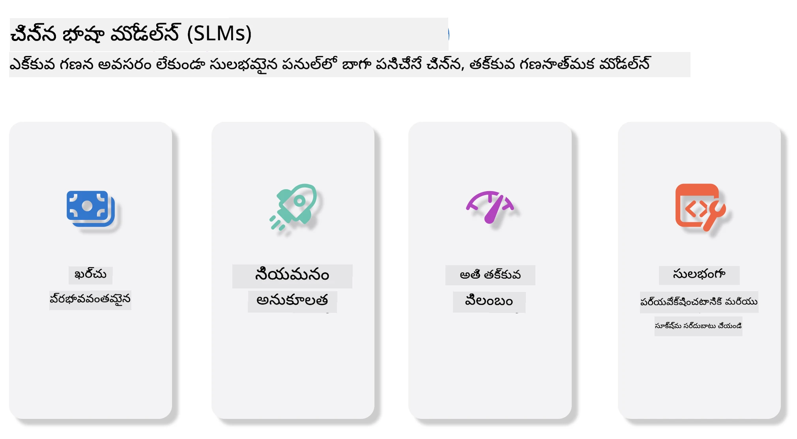
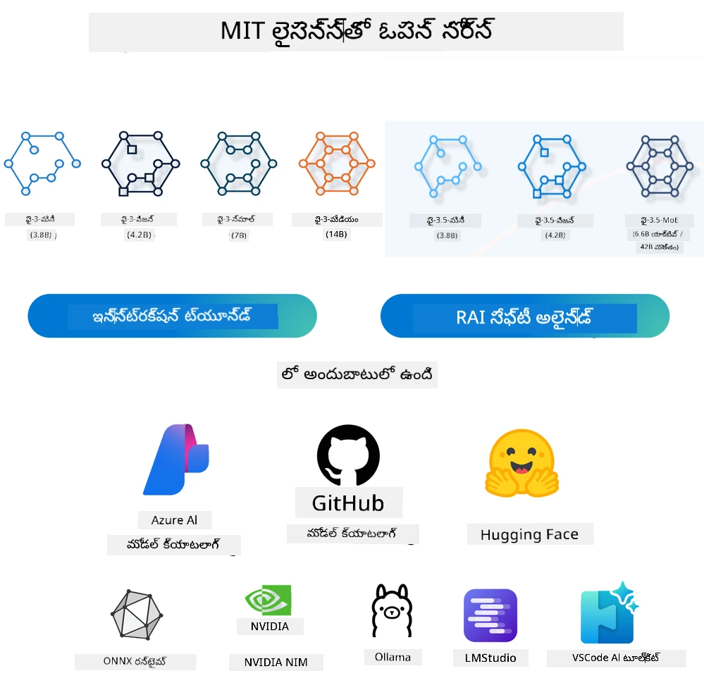
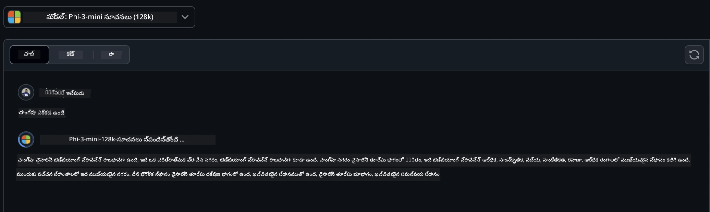
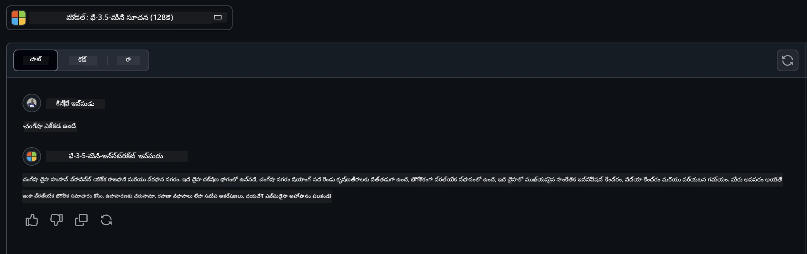

# జనరేటివ్ AI కోసం చిన్న భాషా నమూనాల పరిచయం - ప్రారంభకులు కోసం
జనరేటివ్ AI అనేది కొత్త కంటెంట్ను సృష్టించగల సిస్టమ్స్ ను తయారుచేసే ఆర్టిఫిషియల్ ఇంటెలిజెన్స్ యొక్క ఒక ఆకర్షణీయ రంగం. ఈ కంటెంట్ టెక్ట్స్, చిత్రాలు, సంగీతం మరియు మొత్తం వర్చువల్ వాతావరణాల వరకు విస్తరించవచ్చు. జనరేటివ్ AI యొక్క అత్యంత ఉత్సాహకరమైన అనువర్తనాలలో ఒకటి భాషా నమూనాల రంగంలో ఉంది.

## చిన్న భాషా నమూనాలు అంటే ఏమిటి?

చిన్న భాషా నమూనా (SLM) ఒక పెద్ద భాషా నమూనా (LLM) యొక్క తగ్గించిన రూపాన్ని సూచిస్తుంది, LLMs యొక్క అథికారిక సూత్రాలు మరియు సాంకేతికాలను ఉపయోగించి, కానీ గణనీయంగా తక్కువ కంప్యూటేషనల్ ప్రభావంతో ఉంటుంది.

SLMs మానవ వలే టెక్ట్స్ ఉత్పత్తి చేయడానికై రూపకల్పన చేయబడిన భాషా నమూనాల ఉపసమూహం. GPT-4 వంటి పెద్ద సహోద్యోగులతో పోల్చితే, SLMs మరింత కాంపాక్ట్ మరియు సమర్థవంతమైనవి, కాబట్టి కంప్యూటేషనల్ వనరులు పరిమితమైన అనువర్తనాలకు అనుకూలంగా ఉంటాయి. వాటి చిన్న పరిమాణం ఉన్నప్పటికీ, అవి వివిధ పనులను నిర్వహించగలవు. సాధారణంగా, SLMs LLMs ను కాంప్రెస్ చేయడం లేదా డిస్టిల్ చేయడం ద్వారా నిర్మించబడతాయి, మొదటి నమూనా యొక్క ఫంక్షనాలిటీ మరియు భాషా సామర్థ్యాల ప్రధాన భాగాన్ని నిలుపుకోవడానికి లక్ష్యం. నమూనా పరిమాణం తగ్గించడం మొత్తం సంక్లిష్టతను తగ్గిస్తుంది, తద్వారా స్మాల్ భాషా నమూనాలు మెమొరీ వినియోగం మరియు గణన అవసరాల పరంగా మరింత సమర్థవంతంగా ఉంటాయి. ఈ ఆప్టిమైజేషన్లతో కూడి, SLMs సహజ భాషా ప్రాసెసింగ్ (NLP) పనుల విస్తృత శ్రేణిని నిర్వహించగలవు:

- టెక్ట్స్ ఉత్పత్తి: సుసంపన్నమైన మరియు సందర్భానుకూలమైన వాక్యాలు లేదా పేరాలను సృష్టించడం.
- టెక్ట్స్ పూర్తి చేయడం: ఇచ్చిన ప్రాంప్ట్ ఆధారంగా వాక్యాలను భవిష్యది చెప్పడం మరియు పూర్తి చేయడం.
- అనువాదం: ఒక భాష నుండి మరొక భాషలో టెక్ట్స్ మార్చడం.
- సారాంశం: పొడవైన టెక్ట్స్ ను చిన్న, సులభంగా గ్రహించగల సమ్మరీలకు కుదరించడం.

పని సామర్ధ్యం లేదా అర్ధం లోతు పరంగా కొంత వ్యత్యాసమూ ఉంటెనూ, పెద్ద నమూనాలకు పోల్చితే.

## చిన్న భాషా నమూనాలు ఎలా పనిచేస్తాయి?
SLMs విస్తృత టెక్ట్స్ డేటా మీద శిక్షణ పొందతాయి. శిక్షణ సమయంలో, అవి భాష యొక్క నమూనాలు మరియు నిర్మాణాలు నేర్చుకుంటాయి, ఇందులో వ్యాకరణపరంగా సరైన మరియు సందర్భానుకూల టెక్ట్స్ ఉత్పత్తి చేయగలవు. శిక్షణ ప్రక్రియలో:

- డేటా సేకరణ: వివిధ మూలాల నుండి పెద్ద టెక్ట్స్ డేటాసెట్స్ సేకరించడం.
- ప్రీప్రాసెసింగ్: శిక్షణకు తగిన విధంగా డేటాను శుభ్రపరచడం మరియు ఏర్పాటు చేయడం.
- శిక్షణ: యంత్రం నేర్చుకునే ఆల్గోరిథమ్స్ ఉపయోగించి నమూనాకు టెక్ట్స్ అర్థం చేసుకోవడం మరియు సృష్టించడం నేర్పించడం.
- ఫైన్-ట్యూనింగ్: నిర్దిష్ట పనులపై పనితీరు మెరుగుపరచడానికి నమూనాను సర్దుబాటు చేయడం.

SLMs అభివృద్ధి ప్రత్యేకించి వనరు పరిమిత వాతావరణాలలో, ఉదాహరణకు మొబైల్ పరికరాలు లేదా ఎడ్జ్ కంప్యూటింగ్ ప్లాట్‌ఫామ్‌ల వంటి చోట్ల ఉపయోగించేందుకు అవసరం పెరుగుతోందని అనుగుణంగా ఉంటుంది, అక్కడ పెద్ద LLMs తమ భారీ వనరుల డిమాండ్ల కారణంగా అనుకూలంగా ఉండకపోవచ్చు. సమర్థతపై దృష్టి పెడుతూ, SLMs పనితీరు మరియు ప్రాప్తి మధ్య సమతౌల్యాన్ని అందిస్తూ విస్తృత అనువర్తనాలకు వీలుగా ఉంటాయి.



## నేర్చుకోవాల్సిన లక్ష్యాలు

ఈ పాఠంలో, మనం SLM యొక్క జ్ఞానాన్ని పరిచయం చేసి, Microsoft Phi-3 తో కలిపి టెక్ట్స్, విజన్ మరియు MoE లో భిన్న సందర్భాలను నేర్చుకుంటాము.

ఈ పాఠం చివరికి, మీరు ఈ ప్రశ్నలకి సమాధానమివ్వగలగాలి:

- SLM అంటే ఏమిటి?
- SLM మరియు LLM మధ్య వ్యత్యాసం ఏమిటి?
- Microsoft Phi-3/3.5 కుటుంబం అంటే ఏమిటి?
- Microsoft Phi-3/3.5 కుటుంబంతో ఎలా ఇన్ఫరెన్స్ చేయాలి?

సిద్ది కావడమా? మొదలు పెడదాం.

## పెద్ద భాషా నమూనాలు (LLMs) మరియు చిన్న భాషా నమూనాలు (SLMs) మధ్య తేడాలు

LLMs మరియు SLMs రెండూ పరిమాణాత్మక యంత్ర శిక్షణ సూత్రాలపై ఆధారపడి, వారి నిర్మాణ రూపకల్పన, శిక్షణ పద్ధతులు, డేటా ఉత్పత్తి ప్రక్రియలు మరియు నమూనా మూల్యాంకన సాంకేతికాలలో సమానమైన విధానాలను అనుసరిస్తాయి. అయితే, ఈ రెండు నమూనాల మధ్య కొన్ని ముఖ్యమైన భేదాలు ఉన్నాయి.

## చిన్న భాషా నమూనాల అనువర్తనాలు

SLMs విస్తృతంగా అనువర్తిస్తాయి, వాటిలో:

- చాట్ బాట్స్: వినియోగదారులకు సహాయం చేసి వారితో సంభాషించే విధానం.
- కంటెంట్ సృష్టి: రచయితలకు ఆలోచనలు అందించడం లేదా పూర్తిగా వ్యాసాలు తయారుచేయడం.
- విద్య: విద్యార్థులు రాయడం లేదా కొత్త భాషలు నేర్చుకోవడంలో సహాయం చేయడం.
- ప్రాప్యత: మరీ కొందరు వికలాంగులకు సహాయకరమైన టెక్ట్-టు-స్పీచ్ వంటి సాధనాలు సృష్టించడం.

**పరిమాణం**

LLMs మరియు SLMs మధ్య ప్రాథమిక తేడా నమూనాల పరిమాణంలో ఉంది. ChatGPT (GPT-4) వంటి LLMs సుమారు 1.76 ట్రిలియన్ పరామితులు కలిగి ఉంటే, Mistral 7B వంటి ఓపెన్ సోర్స్ SLMs సుమారు 7 బిలియన్ పరామితులతో రూపొందించబడతాయి. ఈ తేడా ప్రధానంగా నమూనా నిర్మాణం మరియు శిక్షణ ప్రక్రియల వ్యత్యాసాలకు కారణం. ఉదాహరణకు, ChatGPT ఒక ఎన్‌కోಡర్-డికోడర్ ఫ్రేమ్‌వర్క్‌లో సెల్ఫ్-అటెన్షన్ మెకానిజం ఉపయోగిస్తే, Mistral 7B స్లయిడింగ్ విండో అటెన్షన్ ఉపయోగించి డికోడర్ మాత్రమే ఉన్న నమూనాలో సమర్థవంతమైన శిక్షణను సులభతరం చేస్తుంది. ఈ నిర్మాణాత్మక తేడా నమూనాల సంక్లిష్టత మరియు పనితీర్పు మీద గంభీర ప్రభావం చూపుతుంది.

**అర్థం చేసుకోవడం**

SLMs సాధారణంగా నిర్దిష్ట డొమైన్‌లలో పనితీరు కోసం ఆప్టిమైజ్ చేస్తారు, కావడంతో అవి అత్యంత ప్రత్యేకత కలిగినవి అవుతాయి కానీ విస్తృతమైన పరిధిలో సార్వత్రిక అర్థం ఇవ్వడంలో పరిమితమైనవి అయి ఉండవచ్చు. విరుద్ధంగా, LLMs మరింత సమగ్ర స్థాయిలో మానవ వంటి బుద్ధి అనుకరణ చేయడంపై దృష్టి పెడతాయి. విస్తృతమైన, బహుముఖ డేటాసెట్స్ పై శిక్షణ పొందిన LLMలు పలు రంగాలలో మంచి పనితీరు అందించడానికి రూపకల్పన చేయబడ్డాయి, ఎక్కువ అనుకూలత మరియు అనువర్తనాన్ని కలిగి ఉంటాయి. కాబట్టి, LLMలు సహజ భాషా ప్రాసెసింగ్, ప్రోగ్రామింగ్ వంటి విస్తృత డౌన్ స్ట్రీమ్ పనులకు అత్యుత్తమమైనవి.

**కంప్యూటింగ్**

LLMs శిక్షణ మరియు అమలు తీర్లు వనరు అధికంగా డిమాండ్ చేస్తాయి, పెద్ద స్కేల్ GPU క్లస్టర్స్ అవసరం. ఉదాహరణకు, ChatGPT వంటి నమూనా ప్రారంభం నుండి శిక్షణకు వేల కొద్దీ GPUs గంటల తరవాత అవసరమవుతుంది. విరుద్ధంగా, SLMs, వాటి చిన్న పరామితుల కారణంగా, కంప్యూటింగ్ వనరుల పరంగా మరింత సులభంగా అందుబాటులో ఉంటాయి. Mistral 7B వంటి నమూనాలు మధ్యస్థాయి GPU సహకారం కలిగిన స్థానిక యంత్రాలలో శిక్షణ, అమలు చేయగలవు, అయితే శిక్షణ కొంత గంటల పాటు బహువిధ GPUలలో కొనసాగుతుంది.

**పక్షపాతం**

LLMs లో పక్షపాతం ఒక పరిచిత సమస్య, ముఖ్యంగా శిక్షణ డేటా స్వభావం కారణంగా. ఈ నమూనాలు చాలాసార్లు ఇంటర్నెట్ నుండి సేకరించిన మూల డేటా ఆధారపడి ఉంటాయి, దీని వల్ల కొన్ని సంఘాలు తక్కువ ప్రాతినిథ్యం కలిగి ఉండటం, తప్పుదారిత labeling, భాషా భిన్నాలు - బోధనా భాష, భౌగోళిక విభిన్నతలు, వ్యాకరణ నియమాలు వల్ల పక్షపాతాలు కలుగుతాయి. అదనంగా, LLMలు నిర్మాణం సంక్లిష్టత ద్వారా పక్షపాతాలు అనుకోకుండా పెరుగుతాయనేది కూడా ఉంది, దీన్ని జాగ్రత్తగా ఫైన్-ట్యూనింగ్ లేక పోతే గుర్తించలేరు. మరోవైపు, SLMలు మరింత ఆంక్షిత, డొమైన్-కేంద్రీకృత డేటాహితాలు మీద శిక్షణ పొందటం వలన తక్కువ పక్షపాతాలకు గురి గానుగలవు, అయితే పక్షపాతాలు పూర్తిగా తప్పవు.

**ఇన్ఫరెన్స్**

SLMs తగ్గిన పరిమాణంతో గణనీయమైన ఇన్ఫరెన్స్ వేగం కలిగి ఉంటాయి, చాలా పెద్ద పారా‌లల్ ప్రాసెసింగ్ అవసరం లేకుండా లోకల్ హార్డ్వేర్ పై సమర్థవంతంగా అవుట్పుట్ ఇవ్వగలవు. విరుద్ధంగా, LLMలు వారి పరిమాణం మరియు సంక్లిష్టత కారణంగా సముచిత ఇన్ఫరెన్స్ సమయానికి భారీ పారా‌లల్ కంప్యూటేషనల్ వనరులు అవసరం. ఒకేసారి అనేక వినియోగదారులు ఉపయోగిస్తే LLMల స్పందన సమయం మరింత మందగిస్తుంది, ముఖ్యంగా పెద్ద పర్యావరణంలో అమలులో ఉంటే.

సారాంశంగా, LLM మరియు SLM రెండూ యంత్రం నేర్చుకోవడంలో ఆధ్యాత్మిక ప్రాతిపదికను పంచుకున్నప్పటికీ, నమూనాల పరిమాణం, వనరు అవసరాలు, సందర్భపు అర్థం, పక్షపాతం బాధ్యత, మరియు ఇన్ఫరెన్స్ వేగం పరంగా గణనీయంగా భిన్నంగా ఉంటాయి. ఈ తేడాలు వాటి విభిన్న ఉపయోగాలకు అనుకూలతను సూచిస్తాయి, LLMలు విస్తృతమైనవి కానీ వనరు తీవ్రంగా అవసరం ఉంటే, SLMలు మరింత డొమైన్-ప్రత్యేక సమర్థతతో తక్కువ గణన అవసరాలను అందిస్తాయి.

***గమనిక: ఈ పాఠంలో, Microsoft Phi-3 / 3.5 ఉపయోగించి SLM ని పరిచయం చేయుకుంటాము.***

## Phi-3 / Phi-3.5 కుటుంబ పరిచయం

Phi-3 / 3.5 కుటుంబం ప్రధానంగా టెక్ట్స్, విజన్, మరియు ఏజెంట్ (MoE) అప్లికేషన్ సందర్భాలపై దృష్టి సారిస్తుంది:

### Phi-3 / 3.5 ఇన్స్‌స్ట్రక్ట్

ప్రధానంగా టెక్ట్స్ ఉత్పత్తి, చాట్ పూర్తి, మరియు కంటెంట్ సమాచారం తీసుకునే పనులకు.

**Phi-3-మినీ**

3.8B పరామితుల భాషా నమూనా Microsoft Azure AI Studio, Hugging Face, మరియు Ollama లో అందుబాటులో ఉంది. Phi-3 నమూనాలు సమాన లేదా పెద్ద పరిమాణ భాషా నమూనాల కంటే కీలక బెంచ్‌మార్క్‌లలో గణనీయంగా మెరుగ్గా పనిచేస్తాయి (క్రింది బెంచ్‌మార్క్ సంఖ్యలు చూడండి, ఎక్కువ అయితే మెరుగైంది). Phi-3-మినీ తన పరిమాణం రెట్టింపు అయిన నమూనాలను అధిగమిస్తుంది, కాగా Phi-3-స్మాల్ మరియు Phi-3-మీడియం పెద్ద నమూనాలను, GPT-3.5 సహా, అధిగమిస్తాయి.

**Phi-3-స్మాల్ & మీడియం**

మట్టికి కేవలం 7B పరామితులతో, Phi-3-స్మాల్ వివిధ భాషా, తార్కిక, కోడింగ్ మరియు గణిత బెంచ్‌మార్క్‌లపై GPT-3.5T ను అధిగమిస్తుంది.

14B పరామితులతో Phi-3-మీడియం ఈ ధోరణి కొనసాగించి Gemini 1.0 Pro ను అధిగమిస్తుంది.

**Phi-3.5-మినీ**

దాన్ని Phi-3-మినీకు అప్‌గ్రేడ్ గా భావించవచ్చు. పరామితులు మార్చకపోయినా, ఇది బహుభాషల (20+ భాషలు: అరబిక్, చైనీస్, చెక్రీ, డానిష్, డచ్, ఇంగ్లీష్, ఫినిష్, ఫ్రెంచ్, జర్మన్, హెబ్రూ, హంగేరియన్, ఇటాలియన్, జపనీస్, కొరియన్, నార్వైజియన్, పోలిష్, పోర్చుగీస్, రషియన్, స్పానిష్, స్వీడిష్, థాయ్, టర్కిష్, ఉక్రైనియన్) మద్దతుతో పాటు పొడుగు సందర్భం మద్దతు పెంచుతుంది.

3.8B పరామితులతో Phi-3.5-మినీ అదే పరిమాణ భాషా నమూనాలతో పోలిస్తే మెరుగ్గా ఉంటుంది మరియు తన పరిమాణం రెట్టింపు అయిన నమూనాలతో సమానంగా ఉంటుంది.

### Phi-3 / 3.5 విజన్

Phi-3/3.5 ఇన్స్‌స్ట్రక్ట్ నమూనా Phi యొక్క అర్థం చేసుకోవడంలో సామర్థ్యం అయితే, విజన్ Phi కి ప్రపంచాన్ని చూడగల ప్రత్యక్ష దృష్టిని ఇస్తుంది.

**Phi-3-విజన్**

కేవలం 4.2B పరామితులతో Phi-3-విజన్ ఈ ధోరణిని కొనసాగించి Claude-3 Haiku మరియు Gemini 1.0 Pro V వంటి పెద్ద నమూనాలను సామాన్య దృశ్య తర్కపు పనులు, OCR, పట్టికలు మరియు డయాగ్రామ్ అర్థం చేసుకోవడంలో అధిగమిస్తుంది.

**Phi-3.5-విజన్**

Phi-3.5-విజన్ కూడా Phi-3-విజన్ అప్‌గ్రేడ్, మల్టిపుల్ ఇమేజ్ల మద్దతును జోడిస్తుంది. దీన్ని విజన్ లో అభివృద్ధిగా భావించవచ్చు, మీరు చిత్రాలతో పాటు వీడియోలను కూడా చూడగలుగుతారు.

Phi-3.5-విజన్ Claude-3.5 సాన్‌నెట్ మరియు Gemini 1.5 ఫ్లాష్ వంటి పెద్ద నమూనాలను OCR, పట్టికలు మరియు చార్ట్ అర్థం చేసుకునే పనుల్లో అధిగమిస్తుంది మరియు సామాన్య దృశ్య జ్ఞాన తర్కపు పనుల్లో సమానంగా ఉంటుంది. బహుఫ్రేమ్ ఇన్‌పుట్ మద్దతు ఇస్తుంది, అంటే బహుళ ఇన్పుట్ చిత్రాలపై తర్కం చేస్తుంది.

### Phi-3.5-MoE

***మిక్స్చర్ ఆఫ్ ఎక్స్పర్ట్స్ (MoE)*** నమూనాలను తక్కువ కంప్యూట్ తో ప్రీట్రెయిన్ చేయగలగటం సామర్థ్యాన్ని ఇస్తుంది, దీని అర్థం మీరు ఒకే కంప్యూట్ బడ్జెట్ తో నమూనా లేదా డేటాసెట్ పరిమాణం గణనీయంగా పెంచవచ్చు. ముఖ్యంగా, ఒక MoE నమూనా తన డెన్స్ సహోద్యోగి సామర్థ్యాన్ని ప్రీట్రెయినింగ్ సమయంలో చాలా వేగంగా సాధించగలదు.

Phi-3.5-MoE లో 16x3.8B నిపుణ మాడ్యూల్స్ ఉంటాయి. Phi-3.5-MoE, 6.6B సక్రియ పరామితులతో పెద్ద నమూనాలతో సమానమైన తర్కం, భాషా అర్థం మరియు గణితం సామర్థ్యాన్ని కలిగి ఉంటుంది.

మనం వివిధ సందర్భాల ఆధారంగా Phi-3/3.5 కుటుంబ నమూనాను ఉపయోగించవచ్చు. LLMతో భిన్నంగా, మీరు Phi-3/3.5-మినీ లేదా Phi-3/3.5-విజన్‌ను ఎడ్జ్ పరికరాల్లో అమలు చేయగలరు.

## Phi-3/3.5 కుటుంబ నమూనాలు ఎలా ఉపయోగించాలి

మనం Phi-3/3.5 ని వివిధ సందర్భాలలో ఉపయోగించాలని ఆశిస్తున్నాము. తరువాత, వివిధ సందర్భాల తో Phi-3/3.5 ని ఉపయోగిస్తాము.



### క్లౌడ్ APIల ద్వారా ఇన్ఫరెన్స్

**GitHub Models**

GitHub Models అత్యంత ప్రత్యక్ష మార్గం. మీరు త్వరగా Phi-3/3.5-ఇన్స్‌స్ట్రక్ట్ నమూనాను GitHub Models ద్వారా యాక్సెస్ చేయవచ్చు. Azure AI ఇన్ఫరెన్స్ SDK / OpenAI SDK తో కలిపి, మీరు కోడ్ ద్వారా API ను యాక్సెస్ చేసి Phi-3/3.5-ఇన్‌స్ట్రక్ట్ కాల్ పూర్తి చేయవచ్చు. మీరు ప్లేగ్రౌండ్ ద్వారా వేర్వేరు ఫలితాలను పరీక్షించవచ్చు.

- డెమో: చైనీస్ సందర్భాల్లో Phi-3-మినీ మరియు Phi-3.5-మినీ ప్రభావాల తులనాత్మక విశ్లేషణ






**Azure AI Studio**

లేదా మీరు విజన్ మరియు MoE నమూనాలను ఉపయోగించాలనుకుంటే Azure AI Studio ద్వారా కాల్ పూర్తి చేయవచ్చు. ఆసక్తి ఉంటే, Azure AI Studio ద్వారా Phi-3/3.5 ఇన్‌స్ట్రక్ట్, విజన్, MoE కాల్ ఎలా చేయాలో తెలుసుకోవడానికి Phi-3 కుక్బుక్ చదవండి [ఈ లింక్ క్లిక్ చేయండి](https://github.com/microsoft/Phi-3CookBook/blob/main/md/02.QuickStart/AzureAIStudio_QuickStart.md?WT.mc_id=academic-105485-koreyst)


**NVIDIA NIM**

Azure మరియు GitHub అందించే క్లౌడ్ ఆధారిత మోడల్ క్యాటలాగ్ పరిష్కారాల తో పాటు, మీరు [NVIDIA NIM](https://developer.nvidia.com/nim?WT.mc_id=academic-105485-koreyst) ని కూడా ఉపయోగించి సంబంధిత కాల్స్ పూర్తి చేయవచ్చు. మీరు NVIDIA NIM ను సందర్శించి Phi-3/3.5 కుటుంబ API కాల్స్ పూర్తి చేయవచ్చు. NVIDIA NIM (NVIDIA ఇన్ఫరెన్స్ మైక్రోసర్వీసెస్) అనేది విస్తృత వాతావరణాలలో, క్లోడ్లు, డేటా సెంటర్లు మరియు వర్క్‌స్టేషన్ లలో AI నమూనాలు సమర్థవంతంగా అమలుచేసేందుకు రూపొంది వేగవంతమైన ఇన్ఫరెన్స్ మైక్రోసర్వీసుల సమితి.

ఇది NVIDIA NIM కొన్ని ముఖ్యమైన లక్షణాలు:
- **పరివేశంలో సౌలభ్యం:** NIM ఏఐ మోడల్స్‌ను ఒకే ఆదేశంతో అమర్చగలదు, దీని ద్వారా ప్రస్తుతం ఉన్న వర్క్‌ఫ్లోలలో సులభంగా ఏకీకృతం చేయవచ్చు.
- **అనుకూలత ప్రదర్శన:** ఇది NVIDIA యొక్క ముందుగా అనుకూలీకరించిన ఇన్ఫరెన్స్ ఇంజన్లను, ఉదాహరణకు TensorRT మరియు TensorRT-LLM, తక్కువ ఆలస్యం మరియు అధిక థ్రూపుట్ కోసం ఉపయోగిస్తుంది.
- **విస్తరణ సామర్థ్యం:** NIM Kubernetes పై ఆటో స్కేలింగ్‌ను మద్దతు ఇస్తుంది, తద్వారా వేరే వేరే పనిభారాలను సమర్థవంతంగా నెరవేరుస్తుంది.
- **భద్రత మరియు నియంత్రణ:** సంస్థలు తమ డేటా మరియు అప్లికేషన్లపై నియంత్రణను తమ సొంత నిర్వహించిన మౌలిక సదుపాయంలో NIM మైక్రోసర్వీసులను స్వయం-హోస్టింగ్ చేయడం ద్వారా కొనసాగించవచ్చు.
- **స్టాండర్డ్ API లు:** NIM పరిశ్రమ ప్రమాణాల API లను అందిస్తుంది, ఇది చాట్‌బాట్స్, ఏఐ అసిస్టెంట్లు వంటి ఏఐ అప్లికేషన్లను సులభంగా అభివృద్ధి చేసి ఏకీకృతం చేయడానికి అనుకూలంగా ఉంటుంది.

NIM NVIDIA AI ఎంటర్‌ప్రైజ్ భాగమే, ఇది ఏఐ మోడల్స్ అమరిక మరియు ఆపరేషన్ సులభత చేయడం లక్ష్యంతో ఉంది, వాటిని NVIDIA GPU లపై సమర్థవంతంగా నడపడం ఖాయం చేస్తుంది.

- డెమో: NVIDIA NIM ఉపయోగించి Phi-3.5-Vision-API పిలవడం  [[ఈ లింక్‌ను క్లిక్ చేయండి](./python/Phi-3-Vision-Nividia-NIM.ipynb?WT.mc_id=academic-105485-koreyst)]


### Phi-3/3.5 స్థానికంగా నడిపించడం
Phi-3 లేదా GPT-3 వంటి ఏదైన భాషా మోడల్‌తో అన్వయించే ఇన్ఫరెన్స్ అనగా, అందుకు ఇచ్చిన ఇన్‌పుట్ ఆధారంగా స్పందనలు లేదా అంచనాలు తయారు చేసే ప్రక్రియ. మీరు Phi-3కు ప్రాంప్ట్ లేదా ప్రశ్న ఇచ్చినప్పుడు, అది శిక్షణ పొందిన న్యూరల్ నెట్‌వర్క్‌ను ఉపయోగించి ట్రైనింగ్ డేటాలోని నమూనాలు మరియు సంబంధాలను విశ్లేషించి అత్యంత సంభావ్యమైన మరియు సంబంధిత ప్రతిస్పందనను అంచనా వేస్తుంది.

**Hugging Face Transformer**  
Hugging Face Transformers అనేది స్వభావ భాషా ప్రాసెసింగ్ (NLP) మరియు ఇతర యంత్ర అభ్యాస పనుల కోసం రూపొందించిన శక్తివంతమైన లైబ్రరీ. దీని గురించి ముఖ్యాంశాలు:

1. **మునుపే శిక్షణ పొందిన మోడల్స్**: పాఠ్య వర్గీకరణ, పేరు గుర్తింపు, ప్రశ్న సమాధానం, సారాంశం, అనువాదం, పాఠ్య ఉత్పత్తి వంటి వివిధ పనుల కోసం వేలాది మునుపే శిక్షణ పొందిన మోడల్స్ అందజేస్తుంది.

2. **ఫ్రేమ్‌వర్క్ సహకారం**: లైబ్రరీ PyTorch, TensorFlow, JAX వంటి అనేక లోతైన అభ్యాస ఫ్రేమ్‌వర్క్‌లను మద్దతు ఇస్తుంది. దీని వల్ల మీరు ఒక ఫ్రేమ్‌వర్క్‌లో మోడల్ శిక్షణ ఇచ్చి మరొక ఫ్రేమ్‌వర్క్‌లో ఉపయోగించవచ్చు.

3. **బహుముఖ సామర్థ్యాలు**: NLP తప్ప మరియూ కంప్యూటర్ విజన్ (ఉదా., చిత్రం వర్గీకరణ, వస్తువు గుర్తింపు) మరియు ఆడియో ప్రాసెసింగ్ (ఉదా., స్పీచ్ గుర్తింపు, ఆడియో వర్గీకరణ) పనులకూ మద్దతు ఇస్తుంది.

4. **భోగానికి సౌలభ్యం**: మోడల్స్‌ను సులభంగా డౌన్‌లోడ్ చేసి ఫైన్-ట్యూన్ చేసుకోవడానికి API లు మరియు ఉపకరణాలు అందిస్తుంది, ఇది మొదటి సారి వాడేవారికి మరియు నిపుణులకు కూడా సౌకర్యవంతంగా ఉంటుంది.

5. **సముదాయం మరియు వనరులు**: Hugging Faceకు జీవన్ముఖ సముదాయం, విస్తృత డాక్యుమెంటేషన్, ట్యుటోరియల్స్, మరియు మార్గనిర్దేశకాలు ఉన్నాయి, వాడకదారుల్ని ప్రారంభం నుండి తోడ్పడేందుకు.

[అధికారిక డాక్యుమెంటేషన్](https://huggingface.co/docs/transformers/index?WT.mc_id=academic-105485-koreyst) లేదా వారి [GitHub రిపోజిటరీ](https://github.com/huggingface/transformers?WT.mc_id=academic-105485-koreyst).

ఇది అత్యంత సాధారణంగా వాడే విధానం, కాని GPU యాక్సిలరేషన్ అవసరం. ఎందుకంటే, విజన్, MoE వంటి సందర్భాలలో గణనებმა ఉన్నత ప్రాముఖ్యత కలిగి ఉండడంతో CPUపై అవి చాలా నెమ్మదిగా నడుస్తాయి, గణనల కోల్పోతే తప్ప.

- డెమో: Transformer ఉపయోగించి Phi-3.5-Instruct పిలవడం [ఈ లింక్ క్లిక్ చేయండి](./python/phi35-instruct-demo.ipynb?WT.mc_id=academic-105485-koreyst)

- డెమో: Transformer ఉపయోగించి Phi-3.5-Vision పిలవడం [ఈ లింక్ క్లిక్ చేయండి](./python/phi35-vision-demo.ipynb?WT.mc_id=academic-105485-koreyst)

- డెమో: Transformer ఉపయోగించి Phi-3.5-MoE పిలవడం [ఈ లింక్ క్లిక్ చేయండి](./python/phi35_moe_demo.ipynb?WT.mc_id=academic-105485-koreyst)

**Ollama**  
[Ollama](https://ollama.com/?WT.mc_id=academic-105485-koreyst) మీ యంత్రంలో స్థానికంగా పెద్ద భాషా మోడల్స్ (LLMs) నడపడం సులభతరం చేసే ప్లాట్‌ఫారం. ఇది Llama 3.1, Phi 3, Mistral, Gemma 2 తదితర మోడల్స్‌ను మద్దతు ఇస్తుంది. ఈ ప్లాట్‌ఫారం మోడల్ వెయిట్స్, కాన్ఫిగరేషన్, డేటాను ఒకే ప్యాకేజీ లో ప్యాక్ చేయడంతో యూజర్ల సొంతంగా మోడల్స్‌ని కస్టమైజ్ చేయడం మరియు సృష్టించడం సులభం అవుతుంది. Ollama macOS, Linux, Windows కోసం అందుబాటులో ఉంది. క్లౌడ్ సర్వీసులపై ఆధారపడకుండా LLMలను ప్రయోగించడానికి లేదా అమర్చడానికి ఇది మంచి సాధనం. మీరు కింద ఇచ్చిన ఆదేశాన్ని అమలు చేయడం మాత్రమె Ollama కి అవసరం.

```bash

ollama run phi3.5

```


**GENAI కోసం ONNX Runtime**

[ONNX Runtime](https://github.com/microsoft/onnxruntime-genai?WT.mc_id=academic-105485-koreyst) ఒక క్రాస్-ప్లాట్‌ఫామ్ ఇన్ఫరెన్స్ మరియు శిక్షణ యంత్ర అభ్యాస యాక్సిలరేటర్. ONNX Runtime for Generative AI (GENAI) అనేది వివిధ ప్లాట్‌ఫామ్స్‌లో జనరేటివ్ AI మోడల్స్‌ను సమర్థవంతంగా నడపడానికి సహాయపడే శక్తివంతమైన ఉపకరణం.

## ONNX Runtime అంటే ఏమిటి?
ONNX Runtime అనేది ఓపెన్-సోర్స్ ప్రాజెక్ట్, ఇది యంత్ర అభ్యాస మోడల్స్ అధిక పనితీరు ఇన్ఫరెన్స్‌ను సాధ్యం చేస్తుంది. ఇది Open Neural Network Exchange (ONNX) ఫార్మాట్‌లో ఉన్న మోడల్స్‌ను మద్దతు ఇస్తుంది, ఇది యంత్ర అభ్యాస మోడల్స్ ప్రతినిధత్వానికి ఒక ప్రమాణం. ONNX Runtime ఇన్ఫరెన్స్ వేగవంతమైన గ్రాహక అనుభవాలు మరియు తక్కువ ఖర్చులను అందించడంలో సహాయపడుతుంది, ఇది PyTorch, TensorFlow/Keras వంటి లోతైన అభ్యాస ఫ్రేమ్‌వర్క్‌లతో పాటు scikit-learn, LightGBM, XGBoost వంటి క్లాసికల్ యంత్ర అభ్యాస లైబ్రరీలకు మద్దతును కలిగి ఉంటుంది. ONNX Runtime వివిధ హార్డ్వేర్, డ్రైవర్లు, ఆపరేటింగ్ సిస్టమ్స్‌తో అనుకూలంగా ఉంటుంది, మరియు హార్డ్వేర్ యాక్సిలరేటర్లను వినియోగించి గ్రాఫ్ ఆప్టిమైజేషన్లు మరియు ట్రాన్స్‌ఫార్మ్స్ ద్వారా ఉత్తమ పనితీర్పును అందిస్తుంది.

## జనరేటివ్ AI అంటే ఏమిటి?
జనరేటివ్ AI అంటే శిక్షణ పొందిన డేటా ఆధారంగా పాఠ్యం, చిత్రాలు లేదా సంగీతం వంటి కొత్త కంటెంట్‌ను సృష్టించగల AI సిస్టమ్స్. ఉదాహరణకు GPT-3 వంటి భాషా మోడల్స్, Stable Diffusion వంటి చిత్ర సాధనా మోడల్స్ ఉన్నాయి. ONNX Runtime for GenAI లైబ్రరీ ONNX మోడల్స్ కోసం జనరేటివ్ AI లూప్ ను అందిస్తుంది, ఇందులో ONNX Runtime తో ఇన్ఫరెన్స్, లాజిట్స్ ప్రాసెసింగ్, సెర్చ్ మరియు సెంప్లింగ్, KV క్యాష్ నిర్వహణ ఉన్నాయి.

## ONNX Runtime for GENAI  
ONNX Runtime for GENAI ONNX Runtime యొక్క సామర్థ్యాలను పెంచి జనరేటివ్ AI మోడల్స్‌కు మద్దతు ఇస్తుంది. ముఖ్యాంశాలు:

- **వ్యాపక ప్లాట్‌ఫారం మద్దతు:** Windows, Linux, macOS, Android, iOS వంటి అనేక ప్లాట్‌ఫామ్స్‌లో పని చేస్తుంది.
- **మోడల్ మద్దతు:** LLaMA, GPT-Neo, BLOOM వంటి ప్రముఖ జనరేటివ్ AI మోడల్స్‌కి మద్దతు ఇస్తుంది.
- **పనితీరు ఆప్టిమైజేషన్:** NVIDIA GPUలు, AMD GPUలు వంటి హార్డ్వేర్ యాక్సిలరేటర్లకు ప్రత్యేక ఆప్టిమైజేషన్లు ఉన్నాయి.
- **భోగానికి సౌలభ్యం:** అప్లికేషన్లలో సులభంగా ఏకీకృతం చేయడానికి API లను ఇస్తుంది, తక్కువ కోడ్‌తో పాఠ్యం, చిత్రాలు మరియు ఇతర కంటెంట్‌లను సృష్టించడానికి అనువుగా ఉంటుంది.
- వినియోగదారులు generate() అనే ఉన్నత స్థాయి విధానాన్ని పిలవవచ్చు లేదా మోడల్ యొక్క ప్రతి పునరావృతిని ఒక లూప్‌లో నడుపుతూ ఒక టోకెన్‌ని సృష్టించి, కావలసినట్లుగా జనరేషన్ పరామితులను లూప్ లోపల నవీకరించవచ్చు.
- ONNX Runtimeలో greedy/beam సెర్చ్ మరియు TopP, TopK సెంప్లింగ్ మద్దతు ఉంది, టోకెన్ వరుసలను సృష్టించడానికి మరియు లాజిట్స్ ప్రాసెసింగ్ వంటి మరియూ మళ్లీ మళ్ళీ రావడం పట్ల శిక్షలు కూడా ఉన్నాయి. మీరు తక్కువ కష్టం తో అనుకూల స్కోరింగ్ కూడా జోడించవచ్చు.

## ప్రారంభించడం  
ONNX Runtime for GENAI ఉపయోగాన్ని ప్రారంభించడానికి, ఈ దశలను అనుసరించండి:

### ONNX Runtime సంస్థాపన:
```Python
pip install onnxruntime
```
  
### జనరేటివ్ AI అభివృద్ధులు సంస్థాపన:
```Python
pip install onnxruntime-genai
```
  
### మోడల్ నడపడం: Python లో సరళ ఉదాహరణ:
```Python
import onnxruntime_genai as og

model = og.Model('path_to_your_model.onnx')

tokenizer = og.Tokenizer(model)

input_text = "Hello, how are you?"

input_tokens = tokenizer.encode(input_text)

output_tokens = model.generate(input_tokens)

output_text = tokenizer.decode(output_tokens)

print(output_text) 
```
  
### డెమో: ONNX Runtime GenAI ఉపయోగించి Phi-3.5-Vision పిలవడం

```python

import onnxruntime_genai as og

model_path = './Your Phi-3.5-vision-instruct ONNX Path'

img_path = './Your Image Path'

model = og.Model(model_path)

processor = model.create_multimodal_processor()

tokenizer_stream = processor.create_stream()

text = "Your Prompt"

prompt = "<|user|>\n"

prompt += "<|image_1|>\n"

prompt += f"{text}<|end|>\n"

prompt += "<|assistant|>\n"

image = og.Images.open(img_path)

inputs = processor(prompt, images=image)

params = og.GeneratorParams(model)

params.set_inputs(inputs)

params.set_search_options(max_length=3072)

generator = og.Generator(model, params)

while not generator.is_done():

    generator.compute_logits()
    
    generator.generate_next_token()

    new_token = generator.get_next_tokens()[0]
    
    output = tokenizer_stream.decode(new_token)
    
    print(tokenizer_stream.decode(new_token), end='', flush=True)

```


**ఇతరాలు**

ONNX Runtime మరియు Ollama సూచనా పద్ధతులతో పాటు, వివిధ తయారీదారుల ఇచ్చిన మోడల్ సూచనా పద్ధతుల ఆధారంగా అంచనా మోడల్స్ సూచనను కూడా పూర్తి చేయవచ్చు. ఉదాహరణకు Apple Metalతో Apple MLX ఫ్రేమ్‌వర్క్, Qualcomm QNN తో NPU, Intel OpenVINO తో CPU/GPU వంటి వాటి. ఇంకా ఎక్కువ సమాచారానికి [Phi-3 Cookbook](https://github.com/microsoft/phi-3cookbook?WT.mc_id=academic-105485-koreyst) చూడండి.


## మరిన్ని

మేము Phi-3/3.5 కుటుంబ ప్రాథమిక అంశాలను తెలుసుకున్నాం, కాని SLM గురించి మరింత తెలుసుకోవడానికి మరిన్ని జ్ఞానాలు అవసరం. సమాధానాలను Phi-3 Cookbookలో పొందవచ్చు. మీరు మరింత తెలుసుకోవాలనుకుంటే, దయచేసి [Phi-3 Cookbook](https://github.com/microsoft/phi-3cookbook?WT.mc_id=academic-105485-koreyst) సందర్శించండి.

---

<!-- CO-OP TRANSLATOR DISCLAIMER START -->
**అహ్వానం**:  
ఈ డాక్యూమెంట్‌ను AI అనువాద సర్వీస్ [Co-op Translator](https://github.com/Azure/co-op-translator) ఉపయోగించి అనువదించబడింది. మేము ఖచ్చితత్వానికి ప్రయత్నిస్తేను, ఆటోమెటిక్గా చేసిన అనువాదాల్లో పొరపాట్లు లేదా తప్పిదాలు ఉండవచ్చు. మౌలిక భాషలో ఉన్న అసలు డాక్యూమెంట్‌ను అధికారిక స్రోతస్స్తుడిగా పరిగణించాలి. ముఖ్యమైన సమాచారం కోసం, ప్రొఫెషనల్ మానవ అనువాదం చేయించుకోవాలని సూచించబడుతుంది. ఈ అనువాదం వలన కలిగే ఏ బైరుగా సంబంధించిన అవగాహన లోపాలు లేదా తప్పుపాఠాల కోసం మేము బాధ్యత వహించము.
<!-- CO-OP TRANSLATOR DISCLAIMER END -->