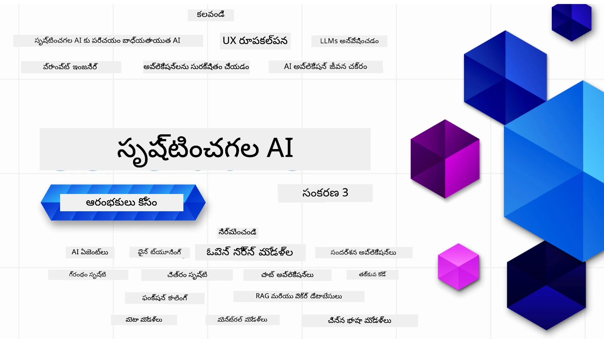

### జనరేటివ్ AI అప్లికేషన్లను నిర్మించడం ప్రారంభించడానికి మీరు తెలుసుకోవలసిన ప్రతి విషయాన్ని బోధించే 21 పాఠాలు

[](https://github.com/microsoft/Generative-AI-For-Beginners/blob/master/LICENSE?WT.mc_id=academic-105485-koreyst)
[](https://GitHub.com/microsoft/Generative-AI-For-Beginners/graphs/contributors/?WT.mc_id=academic-105485-koreyst)
[](https://GitHub.com/microsoft/Generative-AI-For-Beginners/issues/?WT.mc_id=academic-105485-koreyst)
[](https://GitHub.com/microsoft/Generative-AI-For-Beginners/pulls/?WT.mc_id=academic-105485-koreyst)
[](http://makeapullrequest.com?WT.mc_id=academic-105485-koreyst)

[](https://GitHub.com/microsoft/Generative-AI-For-Beginners/watchers/?WT.mc_id=academic-105485-koreyst)
[](https://GitHub.com/microsoft/Generative-AI-For-Beginners/network/?WT.mc_id=academic-105485-koreyst)
[](https://GitHub.com/microsoft/Generative-AI-For-Beginners/stargazers/?WT.mc_id=academic-105485-koreyst)

[](https://discord.gg/nTYy5BXMWG)

### 🌐 బహుభాషా మద్దతు

#### GitHub చర్య ద్వారా మద్దతు (ఆటోమేటెడ్ & ఎప్పుడూ తాజా)

<!-- CO-OP TRANSLATOR LANGUAGES TABLE START -->
[Arabic](../ar/README.md) | [Bengali](../bn/README.md) | [Bulgarian](../bg/README.md) | [Burmese (Myanmar)](../my/README.md) | [Chinese (Simplified)](../zh-CN/README.md) | [Chinese (Traditional, Hong Kong)](../zh-HK/README.md) | [Chinese (Traditional, Macau)](../zh-MO/README.md) | [Chinese (Traditional, Taiwan)](../zh-TW/README.md) | [Croatian](../hr/README.md) | [Czech](../cs/README.md) | [Danish](../da/README.md) | [Dutch](../nl/README.md) | [Estonian](../et/README.md) | [Finnish](../fi/README.md) | [French](../fr/README.md) | [German](../de/README.md) | [Greek](../el/README.md) | [Hebrew](../he/README.md) | [Hindi](../hi/README.md) | [Hungarian](../hu/README.md) | [Indonesian](../id/README.md) | [Italian](../it/README.md) | [Japanese](../ja/README.md) | [Kannada](../kn/README.md) | [Korean](../ko/README.md) | [Lithuanian](../lt/README.md) | [Malay](../ms/README.md) | [Malayalam](../ml/README.md) | [Marathi](../mr/README.md) | [Nepali](../ne/README.md) | [Nigerian Pidgin](../pcm/README.md) | [Norwegian](../no/README.md) | [Persian (Farsi)](../fa/README.md) | [Polish](../pl/README.md) | [Portuguese (Brazil)](../pt-BR/README.md) | [Portuguese (Portugal)](../pt-PT/README.md) | [Punjabi (Gurmukhi)](../pa/README.md) | [Romanian](../ro/README.md) | [Russian](../ru/README.md) | [Serbian (Cyrillic)](../sr/README.md) | [Slovak](../sk/README.md) | [Slovenian](../sl/README.md) | [Spanish](../es/README.md) | [Swahili](../sw/README.md) | [Swedish](../sv/README.md) | [Tagalog (Filipino)](../tl/README.md) | [Tamil](../ta/README.md) | [Telugu](./README.md) | [Thai](../th/README.md) | [Turkish](../tr/README.md) | [Ukrainian](../uk/README.md) | [Urdu](../ur/README.md) | [Vietnamese](../vi/README.md)

> **స్థానికంగా క్లోన్ చేయాలనుకుంటున్నారా?**
>
> ఈ రిపోజిటరీ 50+ భాషా అనువాదాలను కలిగి ఉంది, ఇది డౌన్‌లోడ్ పరిమాణాన్ని గణనీయంగా పెంచుతుంది. అనువాదాలున్నా లేకుండా క్లోన్ చేసుకోవాలంటే, స్పార్స్ చెక్ఔట్ను ఉపయోగించండి:
>
> **Bash / macOS / Linux:**
> ```bash
> git clone --filter=blob:none --sparse https://github.com/microsoft/generative-ai-for-beginners.git
> cd generative-ai-for-beginners
> git sparse-checkout set --no-cone '/*' '!translations' '!translated_images'
> ```
>
> **CMD (Windows):**
> ```cmd
> git clone --filter=blob:none --sparse https://github.com/microsoft/generative-ai-for-beginners.git
> cd generative-ai-for-beginners
> git sparse-checkout set --no-cone "/*" "!translations" "!translated_images"
> ```
>
> ఇది కోర్స్ పూర్తి చేసుకోవడానికి అవసరమైన ఆ వివరాలను మీకు మరింత వేగంగా డౌన్‌లోడ్ చేస్తుంది.
<!-- CO-OP TRANSLATOR LANGUAGES TABLE END -->

# ప్రారంభకర్తల కోసం జనరేటివ్ AI (సెషన్ 3) - ఒక కోర్స్

మైక్రోసాఫ్ట్ క్లౌడ్ అడ్వకేట్స్ ద్వారా 21 పాఠాల సమగ్ర కోర్స్ తో జనరేటివ్ AI అప్లికేషన్ల నిర్మాణపు మూలాలను నేర్చుకోండి.

## 🌱 ప్రారంభించడం

ఈ కోర్స్ 21 పాఠాలు ఉన్నాయి. ప్రతి పాఠం స్వతంత్ర విషయం పై ఉంటుంది కాబట్టి మీరు ఇష్టం ఉన్న చోటుంచ మొదలెట్టవచ్చు!

పాఠాలు, జనరేటివ్ AI కాన్సెప్ట్ ను వివరించే "Learn" పాఠాలు లేదా ఒక కాన్సెప్ట్ తో కోడ్ ఉదాహరణలైన **Python** మరియు **TypeScript** లో ఇస్తున్న "Build" పాఠాలుగా లేబుల్ అయి ఉంటాయి.

.NET డెవలపర్లు కోసం [Generative AI for Beginners (.NET Edition)](https://github.com/microsoft/Generative-AI-for-beginners-dotnet?WT.mc_id=academic-105485-koreyst) చూడండి!

ప్రతి పాఠంలో అదనంగా "Keep Learning" విభాగం ఉంటుంది అదనపు నేర్చుకునే టూల్స్ కోసం.

## మీరు ఏమైనా కావాలి
### ఈ కోర్స్ కోడ్ ను రన్ చేయడానికి మీరు ఈ వాటిలో ఏదైనా ఉపయోగించవచ్చు:
 - [Azure OpenAI Service](https://aka.ms/genai-beginners/azure-open-ai?WT.mc_id=academic-105485-koreyst) - **పాఠాలు:** "aoai-assignment"
 - [GitHub Marketplace Model Catalog](https://aka.ms/genai-beginners/gh-models?WT.mc_id=academic-105485-koreyst) - **పాఠాలు:** "githubmodels"
 - [OpenAI API](https://aka.ms/genai-beginners/open-ai?WT.mc_id=academic-105485-koreyst) - **పాఠాలు:** "oai-assignment"
   
- Python లేదా TypeScript ప్రథమ జ్ఞానం అవసరమవుతుంది - \*మొత్తం ప్రారంభకర్తల కోసం ఈ [Python](https://aka.ms/genai-beginners/python?WT.mc_id=academic-105485-koreyst) మరియు [TypeScript](https://aka.ms/genai-beginners/typescript?WT.mc_id=academic-105485-koreyst) కోర్సులను చూడండి
- మీ స్వంత GitHub అకౌంట్ కి [ఈ మొత్తం రిపోను fork చేయడానికి](https://aka.ms/genai-beginners/github?WT.mc_id=academic-105485-koreyst) ఒక GitHub అకౌంట్ అవసరం

మీ డెవలప్‌మెంట్ వాతావరణాన్ని సెట్ చేయడానికి మేము **[Course Setup](./00-course-setup/README.md?WT.mc_id=academic-105485-koreyst)** అనే పాఠాన్ని రూపొందించాము.

తరువాత ఈ రిపోని సులభంగా కనుగొనేందుకు [స్టార్ (🌟) చేయడం](https://docs.github.com/en/get-started/exploring-projects-on-github/saving-repositories-with-stars?WT.mc_id=academic-105485-koreyst) మరచిపోకండి.

## 🧠 అమలుకు సిద్ధమా?

మరింత సవరణతో కూడిన కోడ్ నమూనాల కోసం, మా [జనరేటివ్ AI కోడ్ నమూనాల సేకరణ](https://aka.ms/genai-beg-code?WT.mc_id=academic-105485-koreyst) ను Python మరియు TypeScript రెండులోనూ చూడండి.

## 🗣️ ఇతర విద్యార్థులను కలుసుకోండి, మద్దతు పొందండి

ఈ కోర్స్ తీసుకునే ఇతర విద్యార్థులతో కలసి కమ్యూనికేట్ చేసుకోవడానికి మరియు మద్దతు పొందడానికి మా [అధికారిక Azure AI Foundry Discord సర్వర్](https://aka.ms/genai-discord?WT.mc_id=academic-105485-koreyst) లో చేరండి.

GitHubలో మా [Azure AI Foundry Developer Forum](https://aka.ms/azureaifoundry/forum) లో ప్రశ్నలు అడగండి లేదా ఉత్పత్తి అభిప్రాయాలు పంపండి.

## 🚀 స్టార్ట్-అప్‌ను నిర్మిస్తునారా?

ఈ రోజు ఆజూర్ క్రెడిట్లతో ప్రారంభించడానికి [Microsoft for Startups](https://www.microsoft.com/startups)ని సందర్శించండి.

## 🙏 సహాయం చేయాలనుకుంటున్నారా?

మీకు సూచనలు లేదా వ్రాసిన తప్పులున్నా లేదా కోడ్ లో లోపమేఉంటే [అంశాన్ని రేపండి](https://github.com/microsoft/generative-ai-for-beginners/issues?WT.mc_id=academic-105485-koreyst) లేదా [పుల్ రిక్వెస్ట్ క్రియేట్ చేయండి](https://github.com/microsoft/generative-ai-for-beginners/pulls?WT.mc_id=academic-105485-koreyst)

## 📂 ప్రతి పాఠంలో ఉన్నాయి:

- అంశానికి సంబంధించిన ఒక చిన్న వీడియో పరిచయం
- README లో ఒక లిఖిత పాఠం
- Azure OpenAI మరియు OpenAI API మద్దతుతో Python మరియు TypeScript కోడ్ ఉదాహరణలు
- మీ విద్యను కొనసాగించడానికి అదనపు వనరుల లింకులు

## 🗃️ పాఠాలు

| #   | **పాఠం లింకు**                                                                                                                              | **వివరణ**                                                                                 | **వీడియో**                                                                   | **అదనపు నేర్చుకునే పదార్థం**                                                             |
| --- | -------------------------------------------------------------------------------------------------------------------------------------------- | ----------------------------------------------------------------------------------------------- | --------------------------------------------------------------------------- | ------------------------------------------------------------------------------ |
| 00  | [Course Setup](./00-course-setup/README.md?WT.mc_id=academic-105485-koreyst)                                                                 | **నెర్చుకోండి:** మీ డెవలప్మెంట్ ఎన్విరాన్మెంట్ సెటప్ చేయడం ఎలా                               | వీడియో త్వరలో వచ్చేస్తోంది                                                                 | [మరింత తెలుసుకోండి](https://aka.ms/genai-collection?WT.mc_id=academic-105485-koreyst) |
| 01  | [Generative AI మరియు LLMs పరిచయం](./01-introduction-to-genai/README.md?WT.mc_id=academic-105485-koreyst)                              | **నెర్చుకోండి:** జనరేటివ్ AI అంటే ఏమిటి మరియు భారీ భాషా మోడల్స్ (LLMs) ఎలా పనిచేస్తాయో తెలుసుకోవడం       | [వీడియో](https://aka.ms/gen-ai-lesson-1-gh?WT.mc_id=academic-105485-koreyst) | [మరింత తెలుసుకోండి](https://aka.ms/genai-collection?WT.mc_id=academic-105485-koreyst) |
| 02  | [వివిధ LLMs అన్వేషించడం మరియు సరిపోల్చడం](./02-exploring-and-comparing-different-llms/README.md?WT.mc_id=academic-105485-koreyst)             | **నెర్చుకోండి:** మీ వినియోగ కేసుకు సరైన మోడల్‌ను ఎలా ఎంచుకోవాలో                              | [వీడియో](https://aka.ms/gen-ai-lesson2-gh?WT.mc_id=academic-105485-koreyst)  | [మరింత తెలుసుకోండి](https://aka.ms/genai-collection?WT.mc_id=academic-105485-koreyst) |
| 03  | [జనరేటివ్ AI ని జాగ్రత్తగా ఉపయోగించడం](./03-using-generative-ai-responsibly/README.md?WT.mc_id=academic-105485-koreyst)                           | **నెర్చుకోండి:** జనరేటివ్ AI అప్లికేషన్లను జాగ్రత్తగా ఎలా నిర్మించాలో                        | [వీడియో](https://aka.ms/gen-ai-lesson3-gh?WT.mc_id=academic-105485-koreyst)  | [మరింత తెలుసుకోండి](https://aka.ms/genai-collection?WT.mc_id=academic-105485-koreyst) |
| 04  | [ప్రాంప్ట్ ఇంజినీరింగ్ మౌలికాంశాలను అర్థం చేసుకోవడం](./04-prompt-engineering-fundamentals/README.md?WT.mc_id=academic-105485-koreyst)             | **నేరుగా నేర్చుకోండి:** ప్రాంప్ట్ ఇంజినీరింగ్ ఉత్తమ రీతులు                                   | [వీడియో](https://aka.ms/gen-ai-lesson4-gh?WT.mc_id=academic-105485-koreyst)  | [మరిన్ని తెలుసుకోండి](https://aka.ms/genai-collection?WT.mc_id=academic-105485-koreyst) |
| 05  | [అత్యాధునిక ప్రాంప్ట్‌ల సృష్టి](./05-advanced-prompts/README.md?WT.mc_id=academic-105485-koreyst)                                                | **నేరుగా నేర్చుకోండి:** మీ ప్రాంప్ట్‌ల ఫలితాన్ని మెరుగుపరచే ప్రాంప్ట్ ఇంజినీరింగ్ సాంకేతికతల వినియోగం | [వీడియో](https://aka.ms/gen-ai-lesson5-gh?WT.mc_id=academic-105485-koreyst)  | [మరిన్ని తెలుసుకోండి](https://aka.ms/genai-collection?WT.mc_id=academic-105485-koreyst) |
| 06  | [టెక్స్ట్ ఉత్పత్తి అప్లికేషన్ల నిర్మాణం](./06-text-generation-apps/README.md?WT.mc_id=academic-105485-koreyst)                                | **నిర్మించండి:** Azure OpenAI / OpenAI API ఉపయోగించి టెక్స్ట్ ఉత్పత్తి యాప్                     | [వీడియో](https://aka.ms/gen-ai-lesson6-gh?WT.mc_id=academic-105485-koreyst)  | [మరిన్ని తెలుసుకోండి](https://aka.ms/genai-collection?WT.mc_id=academic-105485-koreyst) |
| 07  | [చాట్ అప్లికేషన్లు రూపొందించటం](./07-building-chat-applications/README.md?WT.mc_id=academic-105485-koreyst)                                     | **నిర్మించండి:** చాట్ అప్లికేషన్లను సమర్థవంతంగా నిర్మించడం మరియు ఇంటిగ్రేట్ చేయడం సాంకేతికతలు| [వీడియో](https://aka.ms/gen-ai-lessons7-gh?WT.mc_id=academic-105485-koreyst) | [మరిన్ని తెలుసుకోండి](https://aka.ms/genai-collection?WT.mc_id=academic-105485-koreyst) |
| 08  | [సర్చి ఆప్స్ వెక్టర్ డేటాబేస్‌ల నిర్మాణం](./08-building-search-applications/README.md?WT.mc_id=academic-105485-koreyst)                        | **నిర్మించండి:** డేటాను వెతకడానికి ఎంబెడింగ్స్ ఉపయోగించే సర్చి అప్లికేషన్                      | [వీడియో](https://aka.ms/gen-ai-lesson8-gh?WT.mc_id=academic-105485-koreyst)  | [మరిన్ని తెలుసుకోండి](https://aka.ms/genai-collection?WT.mc_id=academic-105485-koreyst) |
| 09  | [ఇమేజ్ ఉత్పత్తి అప్లికేషన్ల నిర్మాణం](./09-building-image-applications/README.md?WT.mc_id=academic-105485-koreyst)                        | **నిర్మించండి:** ఇమేజ్ ఉత్పత్తి అప్లికేషన్                                                      | [వీడియో](https://aka.ms/gen-ai-lesson9-gh?WT.mc_id=academic-105485-koreyst)  | [మరిన్ని తెలుసుకోండి](https://aka.ms/genai-collection?WT.mc_id=academic-105485-koreyst) |
| 10  | [లో కోడ్ AI అప్లికేషన్ల నిర్మాణం](./10-building-low-code-ai-applications/README.md?WT.mc_id=academic-105485-koreyst)                       | **నిర్మించండి:** లో కోడ్ టూల్స్ ఉపయోగించి జనరేటివ్ AI అప్లికేషన్                              | [వీడియో](https://aka.ms/gen-ai-lesson10-gh?WT.mc_id=academic-105485-koreyst) | [మరిన్ని తెలుసుకోండి](https://aka.ms/genai-collection?WT.mc_id=academic-105485-koreyst) |
| 11  | [ఫంక్షన్ కాలింగ్‌తో బయటి అప్లికేషన్ల ఇంటిగ్రేషన్](./11-integrating-with-function-calling/README.md?WT.mc_id=academic-105485-koreyst) | **నిర్మించండి:** ఫంక్షన్ కాలింగ్ అంటే ఏమిటి మరియు అప్లికేషన్లకు దాని వినియోగాలు                | [వీడియో](https://aka.ms/gen-ai-lesson11-gh?WT.mc_id=academic-105485-koreyst) | [మరిన్ని తెలుసుకోండి](https://aka.ms/genai-collection?WT.mc_id=academic-105485-koreyst) |
| 12  | [AI అప్లికేషన్ల కోసం UX డిజైన్ చేయడం](./12-designing-ux-for-ai-applications/README.md?WT.mc_id=academic-105485-koreyst)                         | **నేరుగా నేర్చుకోండి:** జనరేటివ్ AI అప్లికేషన్‌ల అభివృద్ధి సమయంలో UX డిజైన్ సూత్రాలను ఎలాగు అన్వయించాలి | [వీడియో](https://aka.ms/gen-ai-lesson12-gh?WT.mc_id=academic-105485-koreyst) | [మరిన్ని తెలుసుకోండి](https://aka.ms/genai-collection?WT.mc_id=academic-105485-koreyst) |
| 13  | [మీ జనరేటివ్ AI అప్లికేషన్ల సురక్షితం చేయడం](./13-securing-ai-applications/README.md?WT.mc_id=academic-105485-koreyst)                         | **నేరుగా నేర్చుకోండి:** AI వ్యవస్థలపై తీసుకునే ముప్పులు మరియు ప్రమాదాలు మరియు ఈ వ్యవస్థలను సురక్షితం చేసిన విధానాలు | [వీడియో](https://aka.ms/gen-ai-lesson13-gh?WT.mc_id=academic-105485-koreyst) | [మరిన్ని తెలుసుకోండి](https://aka.ms/genai-collection?WT.mc_id=academic-105485-koreyst) |
| 14  | [జనరేటివ్ AI అప్లికేషన్ జీవితచక్రం](./14-the-generative-ai-application-lifecycle/README.md?WT.mc_id=academic-105485-koreyst)           | **నేరుగా నేర్చుకోండి:** LLM జీవితచక్రం మరియు LLMOps నిర్వహణ కోసం టూల్స్ మరియు పరిమాణాలు      | [వీడియో](https://aka.ms/gen-ai-lesson14-gh?WT.mc_id=academic-105485-koreyst) | [మరిన్ని తెలుసుకోండి](https://aka.ms/genai-collection?WT.mc_id=academic-105485-koreyst) |
| 15  | [రిట్రీవల్ ఆగ్మెంటెడ్ జనరేషన్ (RAG) మరియు వెక్టర్ డేటాబేస్లు](./15-rag-and-vector-databases/README.md?WT.mc_id=academic-105485-koreyst)        | **నిర్మించండి:** వెక్టర్ డేటాబేస్‌ల నుండి ఎంబెడింగ్స్‌ను తీసుకునేందుకు RAG ఫ్రేమ్‌వర్క్ ఉపయోగించే అప్లికేషన్ | [వీడియో](https://aka.ms/gen-ai-lesson15-gh?WT.mc_id=academic-105485-koreyst) | [మరిన్ని తెలుసుకోండి](https://aka.ms/genai-collection?WT.mc_id=academic-105485-koreyst) |
| 16  | [ఓపెన్ సోర్స్ మోడల్స్ మరియు హగ్గింగ్ ఫేస్](./16-open-source-models/README.md?WT.mc_id=academic-105485-koreyst)                                    | **నిర్మించండి:** Hugging Faceలో అందుబాటులో ఉన్న ఓపెన్ సోర్స్ మోడల్స్ ఉపయోగించే అప్లికేషన్      | [వీడియో](https://aka.ms/gen-ai-lesson16-gh?WT.mc_id=academic-105485-koreyst) | [మరిన్ని తెలుసుకోండి](https://aka.ms/genai-collection?WT.mc_id=academic-105485-koreyst) |
| 17  | [AI ఏజెంట్స్](./17-ai-agents/README.md?WT.mc_id=academic-105485-koreyst)                                                                       | **నిర్మించండి:** AI ఏజెంట్ ఫ్రేమ్‌వర్క్ ఉపయోగించే అప్లికేషన్                                  | [వీడియో](https://aka.ms/gen-ai-lesson17-gh?WT.mc_id=academic-105485-koreyst) | [మరిన్ని తెలుసుకోండి](https://aka.ms/genai-collection?WT.mc_id=academic-105485-koreyst) |
| 18  | [LLM‌ల ఫైన్-ట్యూనింగ్](./18-fine-tuning/README.md?WT.mc_id=academic-105485-koreyst)                                                              | **నేరుగా నేర్చుకోండి:** ఫైన్-ట్యూనింగ్ LLMల అంటే ఏమిటి, ఎందుకు మరియు ఎలా చేస్తారు             | [వీడియో](https://aka.ms/gen-ai-lesson18-gh?WT.mc_id=academic-105485-koreyst) | [మరిన్ని తెలుసుకోండి](https://aka.ms/genai-collection?WT.mc_id=academic-105485-koreyst) |
| 19  | [SLMలతో నిర్మాణం](./19-slm/README.md?WT.mc_id=academic-105485-koreyst)                                                              | **నేరుగా నేర్చుకోండి:** చిన్న భాషా మోడల్స్‌తో నిర్మించే లాభాలు                                  | Video Coming Soon | [మరిన్ని తెలుసుకోండి](https://aka.ms/genai-collection?WT.mc_id=academic-105485-koreyst) |
| 20  | [మిస్ట్రాల్ మోడల్స్‌తో నిర్మాణం](./20-mistral/README.md?WT.mc_id=academic-105485-koreyst)                                                              | **నేరుగా నేర్చుకోండి:** మిస్ట్రాల్ ఫ్యామిలీ మోడల్స్ యొక్క లక్షణాలు మరియు తేడాలు                  | Video Coming Soon | [మరిన్ని తెలుసుకోండి](https://aka.ms/genai-collection?WT.mc_id=academic-105485-koreyst) |
| 21  | [మెటా మోడల్స్‌తో నిర్మాణం](./21-meta/README.md?WT.mc_id=academic-105485-koreyst)                                                              | **నేరుగా నేర్చుకోండి:** మెటా ఫ్యామిలీ మోడల్స్ యొక్క లక్షణాలు మరియు తేడాలు                       | Video Coming Soon | [మరిన్ని తెలుసుకోండి](https://aka.ms/genai-collection?WT.mc_id=academic-105485-koreyst) |

### 🌟 ప్రత్యేక కృతజ్ఞతలు

GitHub చర్యలు మరియు వర్క్‌ఫ్లోలను సృష్టించినందుకు [**John Aziz**](https://www.linkedin.com/in/john0isaac/) కు ప్రత్యేక కృతజ్ఞతలు 

ప్రతి పాఠానికి సంబంధించి అభ్యాసకుడు మరియు కోడ్ అనుభవాన్ని మెరుగుపరచడానికి కీలక ఆటుపోటులు చేసినందుకు [**Bernhard Merkle**](https://www.linkedin.com/in/bernhard-merkle-738b73/) కు ప్రత్యేక కృతజ్ఞతలు.

## 🎒 ఇతర కోర్సులు

మా బృందం ఇతర కోర్సులు కూడా తయారు చేస్తోంది! వీటిని చూడండి:

<!-- CO-OP TRANSLATOR OTHER COURSES START -->
### LangChain
[](https://aka.ms/langchain4j-for-beginners)
[](https://aka.ms/langchainjs-for-beginners?WT.mc_id=m365-94501-dwahlin)
[](https://github.com/microsoft/langchain-for-beginners?WT.mc_id=m365-94501-dwahlin)
---

### Azure / Edge / MCP / ఏజెంట్లు
[](https://github.com/microsoft/AZD-for-beginners?WT.mc_id=academic-105485-koreyst)
[](https://github.com/microsoft/edgeai-for-beginners?WT.mc_id=academic-105485-koreyst)
[](https://github.com/microsoft/mcp-for-beginners?WT.mc_id=academic-105485-koreyst)
[](https://github.com/microsoft/ai-agents-for-beginners?WT.mc_id=academic-105485-koreyst)

---
 
### జనరేటివ్ AI సిరీస్
[](https://github.com/microsoft/generative-ai-for-beginners?WT.mc_id=academic-105485-koreyst)
[-9333EA?style=for-the-badge&labelColor=E5E7EB&color=9333EA)](https://github.com/microsoft/Generative-AI-for-beginners-dotnet?WT.mc_id=academic-105485-koreyst)
[-C084FC?style=for-the-badge&labelColor=E5E7EB&color=C084FC)](https://github.com/microsoft/generative-ai-for-beginners-java?WT.mc_id=academic-105485-koreyst)
[-E879F9?style=for-the-badge&labelColor=E5E7EB&color=E879F9)](https://github.com/microsoft/generative-ai-with-javascript?WT.mc_id=academic-105485-koreyst)

---
 
### ప్రాథమిక అభ్యాసం
[](https://aka.ms/ml-beginners?WT.mc_id=academic-105485-koreyst)
[](https://aka.ms/datascience-beginners?WT.mc_id=academic-105485-koreyst)
[](https://aka.ms/ai-beginners?WT.mc_id=academic-105485-koreyst)
[](https://github.com/microsoft/Security-101?WT.mc_id=academic-96948-sayoung)
[](https://aka.ms/webdev-beginners?WT.mc_id=academic-105485-koreyst)
[](https://aka.ms/iot-beginners?WT.mc_id=academic-105485-koreyst)
[](https://github.com/microsoft/xr-development-for-beginners?WT.mc_id=academic-105485-koreyst)

---
 
### కోపైలట్ సిరీస్
[](https://aka.ms/GitHubCopilotAI?WT.mc_id=academic-105485-koreyst)
[](https://github.com/microsoft/mastering-github-copilot-for-dotnet-csharp-developers?WT.mc_id=academic-105485-koreyst)
[](https://github.com/microsoft/CopilotAdventures?WT.mc_id=academic-105485-koreyst)
<!-- CO-OP TRANSLATOR OTHER COURSES END -->

## సహాయం పొందడం

AI యాప్స్ నిర్మించడం గురించి మీరు అవరోధానికి లోనైతే లేదా మీకు ఎటువంటి ప్రశ్నలు ఉన్నా, MCP గురించి చర్చలలో సహపాఠులు మరియు అనుభవజ్ఞులైన డెవలపర్లతో చేరండి. ఇది ప్రశ్నలు స్వాగతించబడే మరియు జ్ఞానం స్వేచ్ఛగా పంచుకునే మద్దతుతో కూడిన సమాజం.

[](https://discord.gg/nTYy5BXMWG)

మీకు ప్రొడక్ట్ అభిప్రాయం లేదా నిర్మాణ సమయంలో లోపాలు ఉంటే మీరు సందర్శించవచ్చు:

[](https://aka.ms/foundry/forum)

---

<!-- CO-OP TRANSLATOR DISCLAIMER START -->
**వ్యాఖ్యలేఖ**:
ఈ పత్రం AI అనువాద సేవ [Co-op Translator](https://github.com/Azure/co-op-translator) ఉపయోగించి అనువదించబడింది. మేము ఖచ్చితత్వం కోసం ప్రయత్నించినప్పటికీ, ఆటోమేటెడ్ అనువాదాలలో పొరపాట్లు లేదా అసత్యతలు ఉండవచ్చు. దీనికి మూల పత్రం స్థానిక భాషలో ఉన్నది అధికారిక మూలం గా పరిగణించాలి. ముఖ్యం అయిన సమాచారం కోసం, నిపుణుల మానవ అనువాదం చేయించుకోవాలని సలహా ఇవ్వబడుతుంది. ఈ అనువాదం వలన ఏవైనా అపార్థాలు లేదా తప్పుదోవ పట్టుకోవడంలో మేము బాధ్యత వహించము.
<!-- CO-OP TRANSLATOR DISCLAIMER END -->