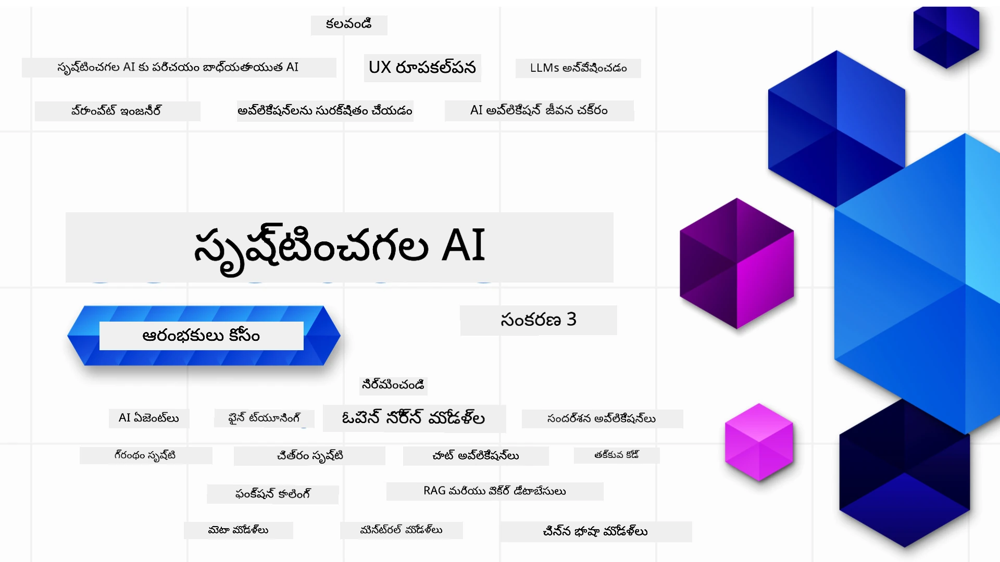

### జనరేటివ్ AI అభ్యాసకార్యక్రమాలు ప్రారంభించేందుకు మీకు అవసరమైన ప్రతిదీ నేర్చించే 21 పాఠాలు

[](https://github.com/microsoft/Generative-AI-For-Beginners/blob/master/LICENSE?WT.mc_id=academic-105485-koreyst)
[](https://GitHub.com/microsoft/Generative-AI-For-Beginners/graphs/contributors/?WT.mc_id=academic-105485-koreyst)
[](https://GitHub.com/microsoft/Generative-AI-For-Beginners/issues/?WT.mc_id=academic-105485-koreyst)
[](https://GitHub.com/microsoft/Generative-AI-For-Beginners/pulls/?WT.mc_id=academic-105485-koreyst)
[](http://makeapullrequest.com?WT.mc_id=academic-105485-koreyst)

[](https://GitHub.com/microsoft/Generative-AI-For-Beginners/watchers/?WT.mc_id=academic-105485-koreyst)
[](https://GitHub.com/microsoft/Generative-AI-For-Beginners/network/?WT.mc_id=academic-105485-koreyst)
[](https://GitHub.com/microsoft/Generative-AI-For-Beginners/stargazers/?WT.mc_id=academic-105485-koreyst)

[](https://discord.gg/nTYy5BXMWG)

### 🌐 బహుభాషా మద్దతు

#### GitHub యాక్షన్ ద్వారా మద్దతు (ఆటోమేటెడ్ & ఎప్పుడూ తాజా)

<!-- CO-OP TRANSLATOR LANGUAGES TABLE START -->
[Arabic](../ar/README.md) | [Bengali](../bn/README.md) | [Bulgarian](../bg/README.md) | [Burmese (Myanmar)](../my/README.md) | [Chinese (Simplified)](../zh-CN/README.md) | [Chinese (Traditional, Hong Kong)](../zh-HK/README.md) | [Chinese (Traditional, Macau)](../zh-MO/README.md) | [Chinese (Traditional, Taiwan)](../zh-TW/README.md) | [Croatian](../hr/README.md) | [Czech](../cs/README.md) | [Danish](../da/README.md) | [Dutch](../nl/README.md) | [Estonian](../et/README.md) | [Finnish](../fi/README.md) | [French](../fr/README.md) | [German](../de/README.md) | [Greek](../el/README.md) | [Hebrew](../he/README.md) | [Hindi](../hi/README.md) | [Hungarian](../hu/README.md) | [Indonesian](../id/README.md) | [Italian](../it/README.md) | [Japanese](../ja/README.md) | [Kannada](../kn/README.md) | [Khmer](../km/README.md) | [Korean](../ko/README.md) | [Lithuanian](../lt/README.md) | [Malay](../ms/README.md) | [Malayalam](../ml/README.md) | [Marathi](../mr/README.md) | [Nepali](../ne/README.md) | [Nigerian Pidgin](../pcm/README.md) | [Norwegian](../no/README.md) | [Persian (Farsi)](../fa/README.md) | [Polish](../pl/README.md) | [Portuguese (Brazil)](../pt-BR/README.md) | [Portuguese (Portugal)](../pt-PT/README.md) | [Punjabi (Gurmukhi)](../pa/README.md) | [Romanian](../ro/README.md) | [Russian](../ru/README.md) | [Serbian (Cyrillic)](../sr/README.md) | [Slovak](../sk/README.md) | [Slovenian](../sl/README.md) | [Spanish](../es/README.md) | [Swahili](../sw/README.md) | [Swedish](../sv/README.md) | [Tagalog (Filipino)](../tl/README.md) | [Tamil](../ta/README.md) | [Telugu](./README.md) | [Thai](../th/README.md) | [Turkish](../tr/README.md) | [Ukrainian](../uk/README.md) | [Urdu](../ur/README.md) | [Vietnamese](../vi/README.md)

> **స్థానికంగా క్లోన్ చేసుకోవాలనుకుంటున్నారా?**
>
> ఈ రిపోజిటరీ 50+ భాషల అనువాదాలను కలిగి ఉంది, ఇది డౌన్‌లోడ్ పరిమాణాన్ని గణనీయంగా పెరుగుతుంది. అనువాదాలు లేకుండా క్లోన్ చేయడానికి స్పార్స్ చెకౌట్ వాడండి:
>
> **Bash / macOS / Linux:**
> ```bash
> git clone --filter=blob:none --sparse https://github.com/microsoft/generative-ai-for-beginners.git
> cd generative-ai-for-beginners
> git sparse-checkout set --no-cone '/*' '!translations' '!translated_images'
> ```
>
> **CMD (Windows):**
> ```cmd
> git clone --filter=blob:none --sparse https://github.com/microsoft/generative-ai-for-beginners.git
> cd generative-ai-for-beginners
> git sparse-checkout set --no-cone "/*" "!translations" "!translated_images"
> ```
>
> ఇది మీరు కోర్సును పూర్తి చేయడానికి అవసరమైన అన్ని విషయాలను చాలా వేగంగా డౌన్‌లోడ్ చేసుకోవడానికి సహాయపడుతుంది.
<!-- CO-OP TRANSLATOR LANGUAGES TABLE END -->

# ప్రారంభికుల కొరకు జనరేటివ్ AI (సమీక్ష 3) - ఒక కోర్సు

మైక్రోసాఫ్ట్ క్లౌడ్ అడ్వొకేట్స్ ఉపయోగించి జనరేటివ్ AI అప్లికేషన్‌లు నిర్మించడం యొక్క ప్రాథమికాంశాలను మా 21 పాఠాల సమగ్ర కోర్సుతో నేర్చుకోండి.

## 🌱 ప్రారంభించడం

ఈ కోర్సుకు 21 పాఠాలు ఉన్నాయి. ప్రతి పాఠం తన స్వంత విషయాన్ని కవరిస్తుంది కాబట్టి మీరు ఇష్టమైన చోటుంచి ప్రారంభించండి!

పాఠాలు "Learn" (కలుసుకునే) పాఠాలు లేదా "Build" (నిర్మించు) పాఠాలుగా లేబుల్ చేయబడ్డాయి, ఇవి జనరేటివ్ AI కాన్సెప్ట్‌ను వివరిస్తాయి లేదా కాన్సెప్ట్ మరియు కోడ్ ఉదాహరణలను **Python** మరియు **TypeScript** లో సరయిన సందర్భాల్లో చూపిస్తాయి.

.NET డెవలపర్ల కోసం [Generative AI for Beginners (.NET Edition)](https://github.com/microsoft/Generative-AI-for-beginners-dotnet?WT.mc_id=academic-105485-koreyst) చూడండి!

ప్రతి పాఠంలో అదనపు అధ్యయన సాధనాలతో కూడిన "Keep Learning" సెక్షన్ ఉంటుంది.

## మీకు అవసరం ఏమిటి
### ఈ కోర్సు కోడ్ నడపడానికి, మీరు క్రింది వాటిలో ఒకదానిని ఉపయోగించవచ్చు: 
 - [Azure OpenAI Service](https://aka.ms/genai-beginners/azure-open-ai?WT.mc_id=academic-105485-koreyst) - **పాఠాలు:** "aoai-assignment"
 - [GitHub Marketplace Model Catalog](https://aka.ms/genai-beginners/gh-models?WT.mc_id=academic-105485-koreyst) - **పాఠాలు:** "githubmodels"
 - [OpenAI API](https://aka.ms/genai-beginners/open-ai?WT.mc_id=academic-105485-koreyst) - **పాఠాలు:** "oai-assignment" 
   
- Python లేదా TypeScript యొక్క ప్రాధమిక జ్ఞానం ఉపయోగా - \*పూర్తి మొదటిరోజుల్లో ఉన్నవారికి ఈ [Python](https://aka.ms/genai-beginners/python?WT.mc_id=academic-105485-koreyst) మరియు [TypeScript](https://aka.ms/genai-beginners/typescript?WT.mc_id=academic-105485-koreyst) కోర్సులను చూడండి
- మీ GitHub ఖాతాలో ఈ మొత్తం రిపోజిటరీని [fork](https://aka.ms/genai-beginners/github?WT.mc_id=academic-105485-koreyst) చేసుకోవడానికి GitHub ఖాతా అవసరం

మీ అభివృద్ధి పరిసరాన్ని ఏర్పరచుకోడానికి మేము **[Course Setup](./00-course-setup/README.md?WT.mc_id=academic-105485-koreyst)** పాఠాన్ని సృష్టించాము.

తర్వాత కనుక ఈ రిపోని సులభంగా కనుగొనటానికి [స్టార్ (🌟) ఇవ్వడం తప్పనిసరి](https://docs.github.com/en/get-started/exploring-projects-on-github/saving-repositories-with-stars?WT.mc_id=academic-105485-koreyst) కాదు.

## 🧠 ఏర్పాటు చేసేందుకు సిద్ధంగా ఉన్నారా?

మరింత సుదీర్ఘ కోడ్ నమూనాలు కావాలంటే, మా [జనరేటివ్ AI కోడ్ నమూనాల సేకరణను](https://aka.ms/genai-beg-code?WT.mc_id=academic-105485-koreyst) Python మరియు TypeScript లో చూడండి.

## 🗣️ ఇతర అభ్యాసకులను కలుసుకోండి, మద్దతు పొందండి

ఈ కోర్సు తీసుకుంటున్న ఇతర అభ్యాసకులతో కలవడానికి మరియు మద్దతు పొందటానికి మా [అధికారిక Azure AI Foundry Discord సర్వర్](https://aka.ms/genai-discord?WT.mc_id=academic-105485-koreyst) లో చేరండి.

GitHubలో మా [Azure AI Foundry Developer Forum](https://aka.ms/azureaifoundry/forum)లో ప్రశ్నలు అడగండి లేదా ఉత్పత్తి ఫీడ్బ్యాక్ పంచుకోండి.

## 🚀 ఒక స్టార్టప్ నిర్మిస్తున్నారా?

ఇప్పుడు.azure క్రెడిట్లతో ఎలా ప్రారంభించాలో తెలుసుకోడానికి [Microsoft for Startups](https://www.microsoft.com/startups) సందర్శించండి.

## 🙏 సహాయం చేయాలనుకుంటున్నారా?

మీకు సూచనలు లేదా తప్పులు లేదా కోడ్ లోపాలు కనిపిస్తే, [ఇష్యూ వేయండి](https://github.com/microsoft/generative-ai-for-beginners/issues?WT.mc_id=academic-105485-koreyst) లేదా [పుల్ రిక్వెస్ట్ సృష్టించండి](https://github.com/microsoft/generative-ai-for-beginners/pulls?WT.mc_id=academic-105485-koreyst)

## 📂 ప్రతి పాఠంలో ఉన్నాయి:

- విషయానికి సంబంధించిన చిన్న వీడియో పరిచయం
- README లో ఉన్న రాత పాఠం
- Python మరియు TypeScript కోడ్ నమూనాలు Azure OpenAI మరియు OpenAI API మద్దతుతో
- మీ అభ్యాసాన్ని కొనసాగించేందుకు అదనపు వనరుల లింకులు

## 🗃️ పాఠాలు

| #   | **పాఠం లింక్**                                                                                                                              | **వివరణ**                                                                                     | **వీడియో**                                                                 | **అదనపు అభ్యాసం**                                                             |
| --- | -------------------------------------------------------------------------------------------------------------------------------------------- | --------------------------------------------------------------------------------------------- | ------------------------------------------------------------------------- | -------------------------------------------------------------------------------- |
| 00  | [Course Setup](./00-course-setup/README.md?WT.mc_id=academic-105485-koreyst)                                                                 | **Learn:** మీ అభివృద్ధి పరిసరాన్ని ఎలా సెట్టప్ చేయాలో                                           | వీడియో త్వరలో వస్తోంది                                                           | [ఇంకా తెలుసుకోండి](https://aka.ms/genai-collection?WT.mc_id=academic-105485-koreyst) |
| 01  | [జనరేటివ్ AI మరియు LLMs పరిచయం](./01-introduction-to-genai/README.md?WT.mc_id=academic-105485-koreyst)                                        | **Learn:** జనరేటివ్ AI ఏమిటి మరియు లార్జ్ భాషా మోడల్స్ (LLMs) ఎలా పని చేస్తాయో అర్థం చేసుకోండి | [వీడియో](https://aka.ms/gen-ai-lesson-1-gh?WT.mc_id=academic-105485-koreyst) | [ఇంకా తెలుసుకోండి](https://aka.ms/genai-collection?WT.mc_id=academic-105485-koreyst) |
| 02  | [వివిధ LLMలను అన్వేషించటం మరియు తులన చేయటం](./02-exploring-and-comparing-different-llms/README.md?WT.mc_id=academic-105485-koreyst)         | **Learn:** మీ ఉపయోగానికి సరైన మోడల్ ఎలా ఎంచుకోవాలి                                          | [వీడియో](https://aka.ms/gen-ai-lesson2-gh?WT.mc_id=academic-105485-koreyst)  | [ఇంకా తెలుసుకోండి](https://aka.ms/genai-collection?WT.mc_id=academic-105485-koreyst) |
| 03  | [జనరేటివ్ AIని బాధ్యతతో ఉపయోగించడం](./03-using-generative-ai-responsibly/README.md?WT.mc_id=academic-105485-koreyst)                      | **Learn:** జనరేటివ్ AI అప్లికేషన్‌లను బాధ్యతగా ఎలా నిర్మించాలి                                | [వీడియో](https://aka.ms/gen-ai-lesson3-gh?WT.mc_id=academic-105485-koreyst)  | [ఇంకా తెలుసుకోండి](https://aka.ms/genai-collection?WT.mc_id=academic-105485-koreyst) |
| 04  | [ప్రాంప్ట్ ఇంజనీరింగ్ పునాది అవగాహన](./04-prompt-engineering-fundamentals/README.md?WT.mc_id=academic-105485-koreyst)             | **కల్పించుకోండి:** ప్రాంప్ట్ ఇంజనీరింగ్ ఉత్తమ ప్రయోజనాలతో ప్రాక్టికల్ పాఠాలు                                           | [వీడియో](https://aka.ms/gen-ai-lesson4-gh?WT.mc_id=academic-105485-koreyst)  | [ఇంకా తెలుసుకోండి](https://aka.ms/genai-collection?WT.mc_id=academic-105485-koreyst) |
| 05  | [అదనపు ప్రాంప్ట్‌ల సృష్టి](./05-advanced-prompts/README.md?WT.mc_id=academic-105485-koreyst)                                                | **కల్పించుకోండి:** మీ ప్రాంప్ట్‌ల ఫలితాన్ని మెరుగుపరిచే ప్రాంప్ట్ ఇంజనీరింగ్ విధానాలను ఎలా వర్తింపజేసుకోవచ్చో తెలుసుకోండి. | [వీడియో](https://aka.ms/gen-ai-lesson5-gh?WT.mc_id=academic-105485-koreyst)  | [ఇంకా తెలుసుకోండి](https://aka.ms/genai-collection?WT.mc_id=academic-105485-koreyst) |
| 06  | [టెక్స్ట్ జనరేషన్ అప్లికేషన్స్ నిర్మాణం](./06-text-generation-apps/README.md?WT.mc_id=academic-105485-koreyst)                                | **నిర్మించండి:** Azure OpenAI / OpenAI API ఉపయోగించి టెక్స్ట్ జనరేషన్ యాప్                                     | [వీడియో](https://aka.ms/gen-ai-lesson6-gh?WT.mc_id=academic-105485-koreyst)  | [ఇంకా తెలుసుకోండి](https://aka.ms/genai-collection?WT.mc_id=academic-105485-koreyst) |
| 07  | [చాట్ అప్లికేషన్స్ నిర్మాణం](./07-building-chat-applications/README.md?WT.mc_id=academic-105485-koreyst)                                     | **నిర్మించండి:** చాట్ అప్లికేషన్స్‌ను సమర్థవంతంగా నిర్మించడం మరియు సమగ్రత చేసే కార్యపద్ధతులు.               | [వీడియో](https://aka.ms/gen-ai-lessons7-gh?WT.mc_id=academic-105485-koreyst) | [ఇంకా తెలుసుకోండి](https://aka.ms/genai-collection?WT.mc_id=academic-105485-koreyst) |
| 08  | [సర్చ్ యాప్స్ వెక్టర్ డేటాబేస్‌ల నిర్మాణం](./08-building-search-applications/README.md?WT.mc_id=academic-105485-koreyst)                        | **నిర్మించండి:** డేటాను వెతకడానికి ఎంబెడ్డింగ్లను ఉపయోగించే సెర్చ్ అప్లికేషన్                              | [వీడియో](https://aka.ms/gen-ai-lesson8-gh?WT.mc_id=academic-105485-koreyst)  | [ఇంకా తెలుసుకోండి](https://aka.ms/genai-collection?WT.mc_id=academic-105485-koreyst) |
| 09  | [పట చిత్ర ఉత్పత్తి అప్లికేషన్స్ నిర్మాణం](./09-building-image-applications/README.md?WT.mc_id=academic-105485-koreyst)                        | **నిర్మించండి:** చిత్ర ఉత్పత్తి అప్లికేషన్                                                       | [వీడియో](https://aka.ms/gen-ai-lesson9-gh?WT.mc_id=academic-105485-koreyst)  | [ఇంకా తెలుసుకోండి](https://aka.ms/genai-collection?WT.mc_id=academic-105485-koreyst) |
| 10  | [లో కోడ్ AI అప్లికేషన్స్ నిర్మాణం](./10-building-low-code-ai-applications/README.md?WT.mc_id=academic-105485-koreyst)                       | **నిర్మించండి:** లో కోడ్ టూల్స్ ఉపయోగించి జనరేటివ్ AI అప్లికేషన్                                     | [వీడియో](https://aka.ms/gen-ai-lesson10-gh?WT.mc_id=academic-105485-koreyst) | [ఇంకా తెలుసుకోండి](https://aka.ms/genai-collection?WT.mc_id=academic-105485-koreyst) |
| 11  | [ఫంక్షన్ కాలింగ్‌తో బాహ్య అప్లికేషన్స్ కాలమేళం](./11-integrating-with-function-calling/README.md?WT.mc_id=academic-105485-koreyst) | **నిర్మించండి:** ఫంక్షన్ కాలింగ్ అంటే ఏమిటి, మరియు అప్లికేషన్స్ కోసం దాని ఉపయోగాలు                          | [వీడియో](https://aka.ms/gen-ai-lesson11-gh?WT.mc_id=academic-105485-koreyst) | [ఇంకా తెలుసుకోండి](https://aka.ms/genai-collection?WT.mc_id=academic-105485-koreyst) |
| 12  | [AI అప్లికేషన్ల కోసం UX రూపకల్పన](./12-designing-ux-for-ai-applications/README.md?WT.mc_id=academic-105485-koreyst)                         | **కల్పించుకోండి:** జనరేటివ్ AI అప్లికేషన్లను అభివృద్ధి చేసేటప్పుడు UX రూపకల్పనా సూత్రాలను ఎలా వర్తించాలి         | [వీడియో](https://aka.ms/gen-ai-lesson12-gh?WT.mc_id=academic-105485-koreyst) | [ఇంకా తెలుసుకోండి](https://aka.ms/genai-collection?WT.mc_id=academic-105485-koreyst) |
| 13  | [మీ జనరేటివ్ AI అప్లికేషన్లకు సెక్యూర్ చేయడం](./13-securing-ai-applications/README.md?WT.mc_id=academic-105485-koreyst)                         | **కల్పించుకోండి:** AI సిస్టమ్స్‌కు ఉన్న ముప్పులు మరియు ప్రమాదాలు, మరియు ఈ సిస్టమ్స్‌ను సురక్షితం చేసేందుకు విధానాలు.             | [వీடியோ](https://aka.ms/gen-ai-lesson13-gh?WT.mc_id=academic-105485-koreyst) | [ఇంకా తెలుసుకోండి](https://aka.ms/genai-collection?WT.mc_id=academic-105485-koreyst) |
| 14  | [జనరేటివ్ AI అప్లికేషన్ జీవన చక్రం](./14-the-generative-ai-application-lifecycle/README.md?WT.mc_id=academic-105485-koreyst)           | **కల్పించుకోండి:** LLM జీవన చక్రం మరియు LLMOps మేనేజ్ చేయడానికి టూల్స్ మరియు సూత్రాలు                         | [వీడియో](https://aka.ms/gen-ai-lesson14-gh?WT.mc_id=academic-105485-koreyst) | [ఇంకా తెలుసుకోండి](https://aka.ms/genai-collection?WT.mc_id=academic-105485-koreyst) |
| 15  | [రిట్రీవల్ ఆగ్మెంట్ జనరేషన్ (RAG) మరియు వెక్టర్ డేటాబేస్‌లు](./15-rag-and-vector-databases/README.md?WT.mc_id=academic-105485-koreyst)        | **నిర్మించండి:** వెక్టర్ డేటాబేస్‌ల నుండి ఎంబెడ్డింగ్లను రిట్రీవ్ చేయడానికి RAG ఫ్రేమ్‌వర్క్ ఉపయోగించే అప్లికేషన్  | [వీడియో](https://aka.ms/gen-ai-lesson15-gh?WT.mc_id=academic-105485-koreyst) | [ఇంకా తెలుసుకోండి](https://aka.ms/genai-collection?WT.mc_id=academic-105485-koreyst) |
| 16  | [ఓపెన్ సోర్స్ మోడల్స్ మరియు హగ్గింగ్ ఫేస్](./16-open-source-models/README.md?WT.mc_id=academic-105485-koreyst)                                    | **నిర్మించండి:** హగ్గింగ్ ఫేస్‌లో అందుబాటులో ఉన్న ఓపెన్ సోర్స్ మోడల్స్ ఉపయోగించే అప్లికేషన్                    | [వీడియో](https://aka.ms/gen-ai-lesson16-gh?WT.mc_id=academic-105485-koreyst) | [ఇంకా తెలుసుకోండి](https://aka.ms/genai-collection?WT.mc_id=academic-105485-koreyst) |
| 17  | [AI ఏజెంట్లు](./17-ai-agents/README.md?WT.mc_id=academic-105485-koreyst)                                                                       | **నిర్మించండి:** AI ఏజెంట్ ఫ్రేమ్‌వర్క్ ఉపయోగించే అప్లికేషన్                                           | [వీడియో](https://aka.ms/gen-ai-lesson17-gh?WT.mc_id=academic-105485-koreyst) | [ఇంకా తెలుసుకోండి](https://aka.ms/genai-collection?WT.mc_id=academic-105485-koreyst) |
| 18  | [LLM‌ల ఫైన్-ట్యూనింగ్](./18-fine-tuning/README.md?WT.mc_id=academic-105485-koreyst)                                                              | **కల్పించుకోండి:** LLM‌లను ఫైన్-ట్యూన్ చేయడంలో ఏమిటి, ఎందుకు మరియు ఎలా అనే అంశాలు                                            | [వీడియో](https://aka.ms/gen-ai-lesson18-gh?WT.mc_id=academic-105485-koreyst) | [ఇంకా తెలుసుకోండి](https://aka.ms/genai-collection?WT.mc_id=academic-105485-koreyst) |
| 19  | [SLMలతో నిర్మాణం](./19-slm/README.md?WT.mc_id=academic-105485-koreyst)                                                              | **కల్పించుకోండి:** చిన్న భాషా మోడల్స్‌తో నిర్మించేటప్పుడు లభించే ప్రయోజనాలు                                            | వీడియో త్వరలో ఉద్భవిస్తుంది | [ఇంకా తెలుసుకోండి](https://aka.ms/genai-collection?WT.mc_id=academic-105485-koreyst) |
| 20  | [మిస్ట్రాల్ మోడల్స్‌తో నిర్మాణం](./20-mistral/README.md?WT.mc_id=academic-105485-koreyst)                                                              | **కల్పించుకోండి:** మిస్ట్రాల్ కుటుంబ మోడల్స్ యొక్క లక్షణాలు మరియు తేడాలు                                           | వీడియో త్వరలో ఉద్భవిస్తుంది | [ఇంకా తెలుసుకోండి](https://aka.ms/genai-collection?WT.mc_id=academic-105485-koreyst) |
| 21  | [మెటా మోడల్స్‌తో నిర్మాణం](./21-meta/README.md?WT.mc_id=academic-105485-koreyst)                                                              | **కల్పించుకోండి:** మెటా కుటుంబ మోడల్స్ యొక్క లక్షణాలు మరియు తేడాలు                                           | వీడియో త్వరలో ఉద్భవిస్తుంది | [ఇంకా తెలుసుకోండి](https://aka.ms/genai-collection?WT.mc_id=academic-105485-koreyst) |

### 🌟 ప్రత్యేక ధన్యవాదాలు

అన్ని GitHub యాక్షన్లు మరియు వర్క్‌ఫ్లోలను సృష్టించినందుకు [**జాన్ అదీజ్**](https://www.linkedin.com/in/john0isaac/) కు ప్రత్యేక ధన్యవాదాలు

ప్రతి పాఠానికి కీలక సహకారాలు అందించి నేర్చుకునే వారు మరియు కోడ్ అనుభవాన్ని మెరుగుపరిచినందుకు [**బెర్న్‌హార్డ్ మర్కిల్**](https://www.linkedin.com/in/bernhard-merkle-738b73/) గారికి ప్రత్యేక ధన్యవాదాలు.

## 🎒 ఇతర కోర్సులు

మా బృందం ఇతర కోర్సులు కూడా రూపొందిస్తోంది! పరిశీలించండి:

<!-- CO-OP TRANSLATOR OTHER COURSES START -->
### లాంగ్‌చెయిన్  
[](https://aka.ms/langchain4j-for-beginners)  
[](https://aka.ms/langchainjs-for-beginners?WT.mc_id=m365-94501-dwahlin)  
[](https://github.com/microsoft/langchain-for-beginners?WT.mc_id=m365-94501-dwahlin)  
---

### Azure / Edge / MCP / ఏజెంట్లు  
[](https://github.com/microsoft/AZD-for-beginners?WT.mc_id=academic-105485-koreyst)  
[](https://github.com/microsoft/edgeai-for-beginners?WT.mc_id=academic-105485-koreyst)  
[](https://github.com/microsoft/mcp-for-beginners?WT.mc_id=academic-105485-koreyst)  
[](https://github.com/microsoft/ai-agents-for-beginners?WT.mc_id=academic-105485-koreyst)  

---
 
### జనరేటివ్ఐ సిరీస్  
[](https://github.com/microsoft/generative-ai-for-beginners?WT.mc_id=academic-105485-koreyst)  
[-9333EA?style=for-the-badge&labelColor=E5E7EB&color=9333EA)](https://github.com/microsoft/Generative-AI-for-beginners-dotnet?WT.mc_id=academic-105485-koreyst)  
[-C084FC?style=for-the-badge&labelColor=E5E7EB&color=C084FC)](https://github.com/microsoft/generative-ai-for-beginners-java?WT.mc_id=academic-105485-koreyst)
[-E879F9?style=for-the-badge&labelColor=E5E7EB&color=E879F9)](https://github.com/microsoft/generative-ai-with-javascript?WT.mc_id=academic-105485-koreyst)

---
 
### కోర్ లెర్నింగ్
[](https://aka.ms/ml-beginners?WT.mc_id=academic-105485-koreyst)
[](https://aka.ms/datascience-beginners?WT.mc_id=academic-105485-koreyst)
[](https://aka.ms/ai-beginners?WT.mc_id=academic-105485-koreyst)
[](https://github.com/microsoft/Security-101?WT.mc_id=academic-96948-sayoung)
[](https://aka.ms/webdev-beginners?WT.mc_id=academic-105485-koreyst)
[](https://aka.ms/iot-beginners?WT.mc_id=academic-105485-koreyst)
[](https://github.com/microsoft/xr-development-for-beginners?WT.mc_id=academic-105485-koreyst)

---
 
### కోపైలట్ సిరీస్
[](https://aka.ms/GitHubCopilotAI?WT.mc_id=academic-105485-koreyst)
[](https://github.com/microsoft/mastering-github-copilot-for-dotnet-csharp-developers?WT.mc_id=academic-105485-koreyst)
[](https://github.com/microsoft/CopilotAdventures?WT.mc_id=academic-105485-koreyst)
<!-- CO-OP TRANSLATOR OTHER COURSES END -->

## సహాయం పొందడం

మీరు చిక్కుకున్నట్లయితే లేదా AI యాప్స్ రూపొందించడంపై ఏవైనా ప్రశ్నలు ఉన్నట్లయితే. MCP గురించి చర్చలలో fellow learners మరియు అనుభవజ్ఞులైన డెవలపర్లతో చేరండి. ఇది ఒక మద్దతు కలిగిన కమ్యూనిటీ ఉంటుంది, ఇక్కడ ప్రశ్నలు స్వాగతించబడతాయి మరియు జ్ఞానం స్వేచ్ఛగా పంచుకోబడుతుంది.

[](https://discord.gg/nTYy5BXMWG)

మీకు ఉత్పత్తి అభిప్రాయం లేదా నిర్మాణ సమయంలో లోపాలు ఉన్నట్లయితే సందర్శించండి:

[](https://aka.ms/foundry/forum)

---

<!-- CO-OP TRANSLATOR DISCLAIMER START -->
**అస్పష్టత**:
ఈ డాక్యుమెంట్‌ను AI అనువాద సేవ [Co-op Translator](https://github.com/Azure/co-op-translator) ఉపయోగించి అనువదించబడింది. మేము ఖచ్చితత్వం కోసం ప్రయత్నిస్తున్నప్పటికి, సజీవ అనువాదాల్లో పొరపాట్లు లేదా తప్పులతో ఉండవచ్చు. అసలు డాక్యుమెంట్ దాని స్వదేశ భాషలో అధికారిక మూలంగా పరిగణించాలి. కీలక సమాచారం కోసం, ప్రొఫెషనల్ మానవ అనువాదం సూచించబడుతుంది. ఈ అనువాదం వాడుకలో ఉండే ఏదైనా అపార్థాలు లేదా తప్పువారి బాధ్యత మాకు లేదు.
<!-- CO-OP TRANSLATOR DISCLAIMER END -->