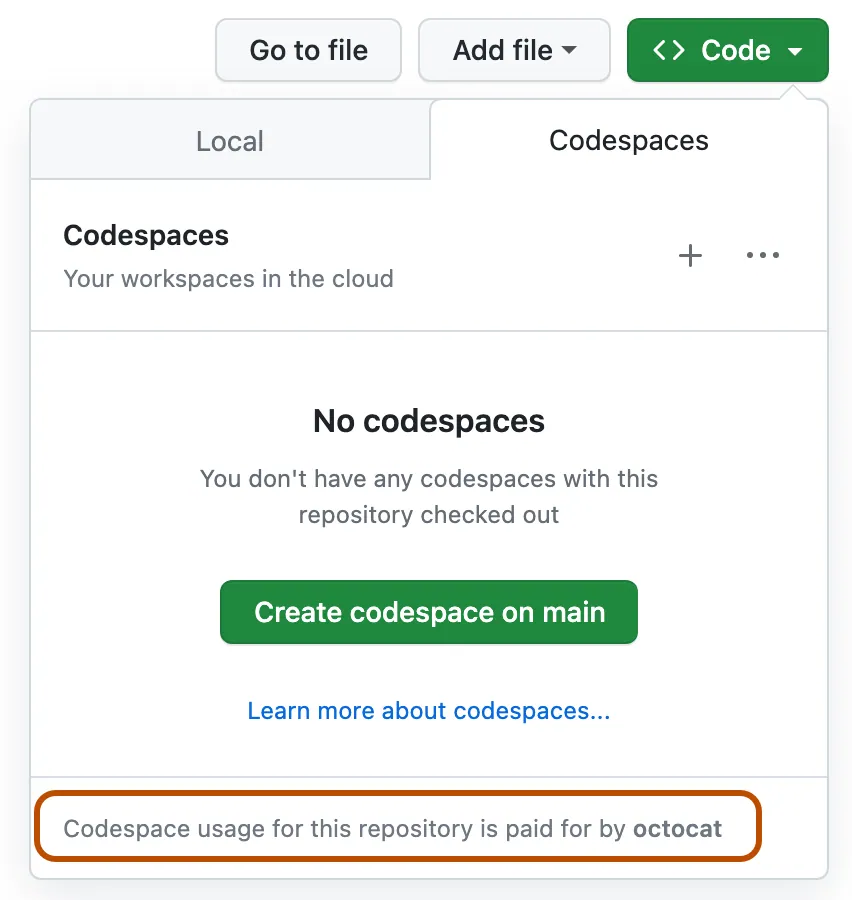

<!--
CO_OP_TRANSLATOR_METADATA:
{
  "original_hash": "9f4785899ee92500f524b4acb26e3bb3",
  "translation_date": "2025-05-19T12:27:03+00:00",
  "source_file": "00-course-setup/README.md",
  "language_code": "th"
}
-->
# เริ่มต้นกับคอร์สนี้

เราตื่นเต้นมากที่คุณจะเริ่มคอร์สนี้และดูว่าคุณจะได้รับแรงบันดาลใจในการสร้างอะไรกับ Generative AI!

เพื่อให้คุณประสบความสำเร็จ หน้านี้จะอธิบายขั้นตอนการตั้งค่า ข้อกำหนดทางเทคนิค และวิธีการขอความช่วยเหลือหากจำเป็น

## ขั้นตอนการตั้งค่า

เพื่อเริ่มคอร์สนี้ คุณจะต้องทำตามขั้นตอนต่อไปนี้

### 1. Fork Repo นี้

[Fork repo ทั้งหมดนี้](https://github.com/microsoft/generative-ai-for-beginners/fork?WT.mc_id=academic-105485-koreyst) ไปยังบัญชี GitHub ของคุณเองเพื่อให้สามารถเปลี่ยนแปลงโค้ดและทำภารกิจได้ คุณยังสามารถ [star (🌟) repo นี้](https://docs.github.com/en/get-started/exploring-projects-on-github/saving-repositories-with-stars?WT.mc_id=academic-105485-koreyst) เพื่อให้ค้นหาและ repo ที่เกี่ยวข้องได้ง่ายขึ้น

### 2. สร้าง codespace

เพื่อหลีกเลี่ยงปัญหาการพึ่งพาเมื่อรันโค้ด เราแนะนำให้รันคอร์สนี้ใน [GitHub Codespaces](https://github.com/features/codespaces?WT.mc_id=academic-105485-koreyst)

คุณสามารถสร้างได้โดยเลือกตัวเลือก `Code` บนเวอร์ชันที่คุณ fork ของ repo นี้และเลือกตัวเลือก **Codespaces**



### 3. การจัดเก็บ API Keys ของคุณ

การรักษาความปลอดภัยและความปลอดภัยของ API keys ของคุณเป็นสิ่งสำคัญเมื่อสร้างแอปพลิเคชันใด ๆ เราแนะนำไม่ให้เก็บ API keys ใด ๆ ไว้ในโค้ดของคุณ การคอมมิตข้อมูลเหล่านี้ไปยัง repo สาธารณะอาจทำให้เกิดปัญหาด้านความปลอดภัยและค่าใช้จ่ายที่ไม่พึงประสงค์หากถูกใช้โดยผู้ไม่หวังดี
นี่คือคำแนะนำทีละขั้นตอนเกี่ยวกับวิธีการสร้างไฟล์ `.env` สำหรับ Python และเพิ่ม `GITHUB_TOKEN`:

1. **ไปที่ไดเรกทอรีโปรเจกต์ของคุณ**: เปิด terminal หรือ command prompt และไปที่ไดเรกทอรีรากของโปรเจกต์ที่คุณต้องการสร้างไฟล์ `.env`

   ```bash
   cd path/to/your/project
   ```

2. **สร้างไฟล์ `.env`**: ใช้ text editor ที่คุณชื่นชอบเพื่อสร้างไฟล์ใหม่ชื่อ `.env` หากคุณใช้ command line คุณสามารถใช้ `touch` (on Unix-based systems) or `echo` (บน Windows):

   ระบบ Unix-based:
   ```bash
   touch .env
   ```

   Windows:
   ```cmd
   echo . > .env
   ```

3. **แก้ไขไฟล์ `.env`**: เปิดไฟล์ `.env` ใน text editor (เช่น VS Code, Notepad++ หรือ editor อื่น ๆ) เพิ่มบรรทัดต่อไปนี้ลงในไฟล์ โดยแทนที่ `your_github_token_here` ด้วย GitHub token ของคุณจริง ๆ:

   ```env
   GITHUB_TOKEN=your_github_token_here
   ```

4. **บันทึกไฟล์**: บันทึกการเปลี่ยนแปลงและปิด text editor

5. **ติดตั้งแพ็คเกจ `python-dotenv`**: If you haven't already, you'll need to install the `python-dotenv` เพื่อโหลด environment variables จากไฟล์ `.env` เข้าสู่แอปพลิเคชัน Python ของคุณ คุณสามารถติดตั้งได้โดยใช้ `pip`:

   ```bash
   pip install python-dotenv
   ```

6. **โหลด Environment Variables ในสคริปต์ Python ของคุณ**: ในสคริปต์ Python ของคุณ ใช้แพ็คเกจ `python-dotenv` เพื่อโหลด environment variables จากไฟล์ `.env`:

   ```python
   from dotenv import load_dotenv
   import os

   # Load environment variables from .env file
   load_dotenv()

   # Access the GITHUB_TOKEN variable
   github_token = os.getenv("GITHUB_TOKEN")

   print(github_token)
   ```

เสร็จแล้ว! คุณได้สร้างไฟล์ `.env` สำเร็จแล้ว เพิ่ม GitHub token ของคุณ และโหลดมันเข้าสู่แอปพลิเคชัน Python ของคุณ

## วิธีการรันบนคอมพิวเตอร์ของคุณ

เพื่อรันโค้ดบนคอมพิวเตอร์ของคุณ คุณจะต้องมี [Python ติดตั้งอยู่บางเวอร์ชัน](https://www.python.org/downloads/?WT.mc_id=academic-105485-koreyst)

จากนั้นในการใช้ repository คุณต้อง clone มัน:

```shell
git clone https://github.com/microsoft/generative-ai-for-beginners
cd generative-ai-for-beginners
```

เมื่อคุณมีทุกอย่างแล้ว คุณก็สามารถเริ่มได้เลย!

## ขั้นตอนเสริม

### การติดตั้ง Miniconda

[Miniconda](https://conda.io/en/latest/miniconda.html?WT.mc_id=academic-105485-koreyst) เป็นตัวติดตั้งขนาดเบาสำหรับติดตั้ง [Conda](https://docs.conda.io/en/latest?WT.mc_id=academic-105485-koreyst), Python และแพ็คเกจบางส่วน
Conda เองเป็น package manager ที่ทำให้การตั้งค่าและสลับระหว่าง [**virtual environments**](https://docs.python.org/3/tutorial/venv.html?WT.mc_id=academic-105485-koreyst) และแพ็คเกจต่าง ๆ ของ Python เป็นเรื่องง่าย นอกจากนี้ยังมีประโยชน์ในการติดตั้งแพ็คเกจที่ไม่สามารถใช้ได้ผ่าน `pip`.

You can follow the [MiniConda installation guide](https://docs.anaconda.com/free/miniconda/#quick-command-line-install?WT.mc_id=academic-105485-koreyst) to set it up.

With Miniconda installed, you need to clone the [repository](https://github.com/microsoft/generative-ai-for-beginners/fork?WT.mc_id=academic-105485-koreyst) (if you haven't already)

Next, you need to create a virtual environment. To do this with Conda, go ahead and create a new environment file (_environment.yml_). If you are following along using Codespaces, create this within the `.devcontainer` directory, thus `.devcontainer/environment.yml`

ไปข้างหน้าและเติมไฟล์ environment ของคุณด้วยโค้ดด้านล่าง:

```yml
name: <environment-name>
channels:
 - defaults
 - microsoft
dependencies:
- python=<python-version>
- openai
- python-dotenv
- pip
- pip:
    - azure-ai-ml

```

หากคุณพบข้อผิดพลาดเมื่อใช้ conda คุณสามารถติดตั้ง Microsoft AI Libraries ด้วยตนเองโดยใช้คำสั่งต่อไปนี้ใน terminal

```
conda install -c microsoft azure-ai-ml
```

ไฟล์ environment ระบุ dependencies ที่เราต้องการ `<environment-name>` refers to the name you would like to use for your Conda environment, and `<python-version>` is the version of Python you would like to use, for example, `3` คือเวอร์ชันหลักล่าสุดของ Python

เมื่อเสร็จสิ้นแล้ว คุณสามารถสร้าง environment ของ Conda ได้โดยรันคำสั่งด้านล่างใน command line/terminal ของคุณ

```bash
conda env create --name ai4beg --file .devcontainer/environment.yml # .devcontainer sub path applies to only Codespace setups
conda activate ai4beg
```

ดู [คู่มือ Conda environments](https://docs.conda.io/projects/conda/en/latest/user-guide/tasks/manage-environments.html?WT.mc_id=academic-105485-koreyst) หากคุณพบปัญหาใด ๆ

### การใช้ Visual Studio Code กับส่วนขยายสนับสนุน Python

เราแนะนำให้ใช้ [Visual Studio Code (VS Code)](https://code.visualstudio.com/?WT.mc_id=academic-105485-koreyst) editor พร้อมติดตั้ง [ส่วนขยายสนับสนุน Python](https://marketplace.visualstudio.com/items?itemName=ms-python.python&WT.mc_id=academic-105485-koreyst) สำหรับคอร์สนี้ อย่างไรก็ตาม นี่เป็นเพียงคำแนะนำและไม่ใช่ข้อกำหนดที่แน่นอน

> **หมายเหตุ**: โดยการเปิด repository ของคอร์สใน VS Code คุณมีตัวเลือกในการตั้งค่าโปรเจกต์ภายใน container นี่เป็นเพราะไดเรกทอรี [พิเศษ `.devcontainer`](https://code.visualstudio.com/docs/devcontainers/containers?itemName=ms-python.python&WT.mc_id=academic-105485-koreyst) ที่พบใน repository ของคอร์ส รายละเอียดเพิ่มเติมในภายหลัง

> **หมายเหตุ**: เมื่อคุณ clone และเปิดไดเรกทอรีใน VS Code มันจะแนะนำให้คุณติดตั้งส่วนขยายสนับสนุน Python โดยอัตโนมัติ

> **หมายเหตุ**: หาก VS Code แนะนำให้คุณเปิด repository ใน container ให้ปฏิเสธคำขอนี้เพื่อใช้เวอร์ชัน Python ที่ติดตั้งในเครื่อง

### การใช้ Jupyter ในเบราว์เซอร์

คุณยังสามารถทำงานกับโปรเจกต์โดยใช้ [สภาพแวดล้อม Jupyter](https://jupyter.org?WT.mc_id=academic-105485-koreyst) ภายในเบราว์เซอร์ของคุณ ทั้ง Jupyter คลาสสิกและ [Jupyter Hub](https://jupyter.org/hub?WT.mc_id=academic-105485-koreyst) มอบสภาพแวดล้อมการพัฒนาที่น่าพอใจพร้อมคุณสมบัติต่าง ๆ เช่น การเติมอัตโนมัติ การไฮไลต์โค้ด เป็นต้น

เพื่อเริ่ม Jupyter ในเครื่อง ให้ไปที่ terminal/command line ไปที่ไดเรกทอรีของคอร์สและรัน:

```bash
jupyter notebook
```

หรือ

```bash
jupyterhub
```

นี่จะเริ่มต้น Jupyter instance และ URL เพื่อเข้าถึงจะถูกแสดงในหน้าต่าง command line

เมื่อคุณเข้าถึง URL คุณจะเห็นโครงร่างคอร์สและสามารถไปยังไฟล์ `*.ipynb` file. For example, `08-building-search-applications/python/oai-solution.ipynb`.

### Running in a container

An alternative to setting everything up on your computer or Codespace is to use a [container](https://en.wikipedia.org/wiki/Containerization_(computing)?WT.mc_id=academic-105485-koreyst). The special `.devcontainer` folder within the course repository makes it possible for VS Code to set up the project within a container. Outside of Codespaces, this will require the installation of Docker, and quite frankly, it involves a bit of work, so we recommend this only to those with experience working with containers.

One of the best ways to keep your API keys secure when using GitHub Codespaces is by using Codespace Secrets. Please follow the [Codespaces secrets management](https://docs.github.com/en/codespaces/managing-your-codespaces/managing-secrets-for-your-codespaces?WT.mc_id=academic-105485-koreyst) guide to learn more about this.

## Lessons and Technical Requirements

The course has 6 concept lessons and 6 coding lessons.

For the coding lessons, we are using the Azure OpenAI Service. You will need access to the Azure OpenAI service and an API key to run this code. You can apply to get access by [completing this application](https://azure.microsoft.com/products/ai-services/openai-service?WT.mc_id=academic-105485-koreyst).

While you wait for your application to be processed, each coding lesson also includes a `README.md` ใด ๆ ที่คุณสามารถดูโค้ดและผลลัพธ์ได้

## การใช้บริการ Azure OpenAI เป็นครั้งแรก

หากนี่เป็นครั้งแรกที่คุณทำงานกับบริการ Azure OpenAI โปรดทำตามคำแนะนำเกี่ยวกับวิธีการ [สร้างและปรับใช้ทรัพยากรบริการ Azure OpenAI](https://learn.microsoft.com/azure/ai-services/openai/how-to/create-resource?pivots=web-portal&WT.mc_id=academic-105485-koreyst)

## การใช้ OpenAI API เป็นครั้งแรก

หากนี่เป็นครั้งแรกที่คุณทำงานกับ OpenAI API โปรดทำตามคำแนะนำเกี่ยวกับวิธีการ [สร้างและใช้ Interface](https://platform.openai.com/docs/quickstart?context=pythont&WT.mc_id=academic-105485-koreyst)

## พบปะกับผู้เรียนคนอื่น ๆ

เราได้สร้างช่องทางใน [เซิร์ฟเวอร์ AI Community Discord อย่างเป็นทางการของเรา](https://aka.ms/genai-discord?WT.mc_id=academic-105485-koreyst) สำหรับพบปะกับผู้เรียนคนอื่น ๆ นี่เป็นวิธีที่ดีในการสร้างเครือข่ายกับผู้ประกอบการที่มีความคิดเหมือนกัน ผู้สร้าง นักเรียน และใครก็ตามที่ต้องการพัฒนาทักษะใน Generative AI

[](https://aka.ms/genai-discord?WT.mc_id=academic-105485-koreyst)

ทีมโปรเจกต์จะอยู่ในเซิร์ฟเวอร์ Discord นี้เพื่อช่วยเหลือผู้เรียนทุกคน

## การมีส่วนร่วม

คอร์สนี้เป็นโครงการโอเพนซอร์ส หากคุณเห็นจุดที่ต้องปรับปรุงหรือปัญหา โปรดสร้าง [Pull Request](https://github.com/microsoft/generative-ai-for-beginners/pulls?WT.mc_id=academic-105485-koreyst) หรือบันทึก [ปัญหาใน GitHub](https://github.com/microsoft/generative-ai-for-beginners/issues?WT.mc_id=academic-105485-koreyst)

ทีมโปรเจกต์จะติดตามการมีส่วนร่วมทั้งหมด การมีส่วนร่วมในโอเพนซอร์สเป็นวิธีที่ยอดเยี่ยมในการสร้างอาชีพใน Generative AI

การมีส่วนร่วมส่วนใหญ่ต้องการให้คุณยอมรับข้อตกลงใบอนุญาตผู้ร่วม (CLA) ที่ประกาศว่าคุณมีสิทธิ์และจริง ๆ แล้วให้สิทธิ์เราใช้การมีส่วนร่วมของคุณ สำหรับรายละเอียดเพิ่มเติม โปรดเยี่ยมชม [เว็บไซต์ข้อตกลงใบอนุญาตผู้ร่วม (CLA)](https://cla.microsoft.com?WT.mc_id=academic-105485-koreyst)

เมื่อคุณส่ง pull request CLA-bot จะตรวจสอบโดยอัตโนมัติว่าคุณจำเป็นต้องให้ CLA หรือไม่และตกแต่ง PR ให้เหมาะสม (เช่น label, comment) เพียงทำตามคำแนะนำที่บอทให้ไว้ คุณจะต้องทำเพียงครั้งเดียวสำหรับ repo ทั้งหมดที่ใช้ CLA ของเรา

โครงการนี้ได้นำ [Microsoft Open Source Code of Conduct](https://opensource.microsoft.com/codeofconduct/?WT.mc_id=academic-105485-koreyst) มาใช้ สำหรับข้อมูลเพิ่มเติมอ่าน Code of Conduct FAQ หรือ ติดต่อ [Email opencode](opencode@microsoft.com) หากมีคำถามหรือความคิดเห็นเพิ่มเติม

## เริ่มกันเลย

ตอนนี้คุณได้ทำตามขั้นตอนที่จำเป็นเพื่อทำคอร์สนี้เสร็จสิ้นแล้ว มาเริ่มกันด้วยการรับ [แนะนำเกี่ยวกับ Generative AI และ LLMs](../01-introduction-to-genai/README.md?WT.mc_id=academic-105485-koreyst)

**คำปฏิเสธความรับผิดชอบ**:  
เอกสารนี้ได้รับการแปลโดยใช้บริการแปลภาษา AI [Co-op Translator](https://github.com/Azure/co-op-translator) แม้ว่าเราจะพยายามให้แปลอย่างถูกต้อง แต่โปรดทราบว่าการแปลโดยอัตโนมัติอาจมีข้อผิดพลาดหรือความไม่ถูกต้อง เอกสารต้นฉบับในภาษาต้นฉบับควรถือเป็นแหล่งข้อมูลที่เชื่อถือได้ สำหรับข้อมูลสำคัญ แนะนำให้ใช้บริการแปลภาษามนุษย์มืออาชีพ เราจะไม่รับผิดชอบต่อความเข้าใจผิดหรือการตีความผิดที่เกิดจากการใช้การแปลนี้