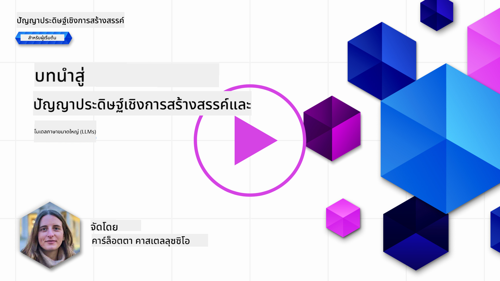
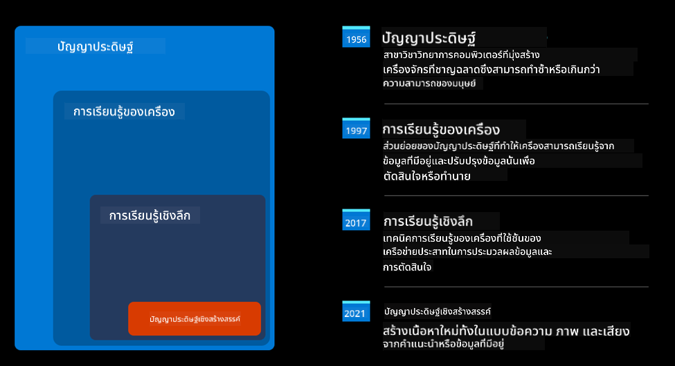
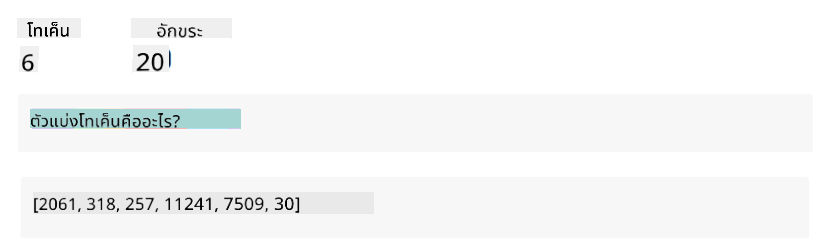
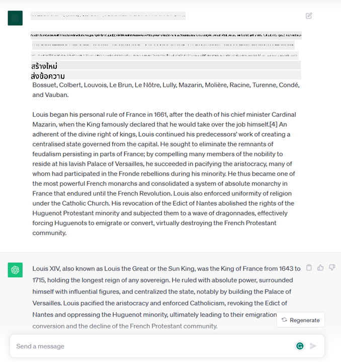
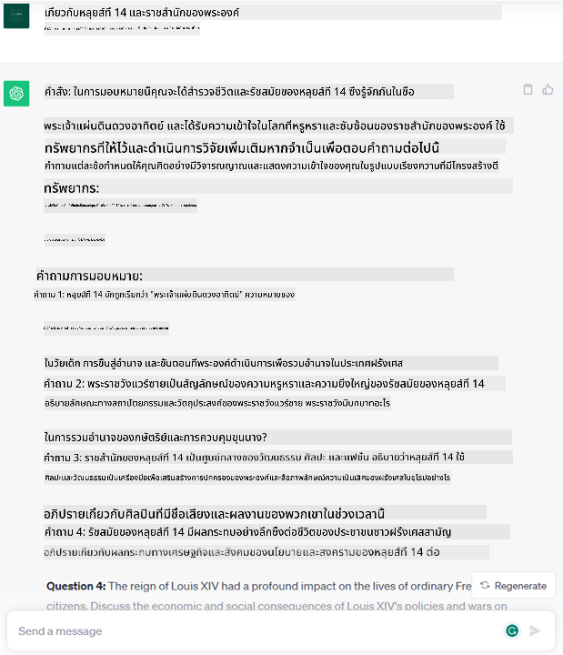
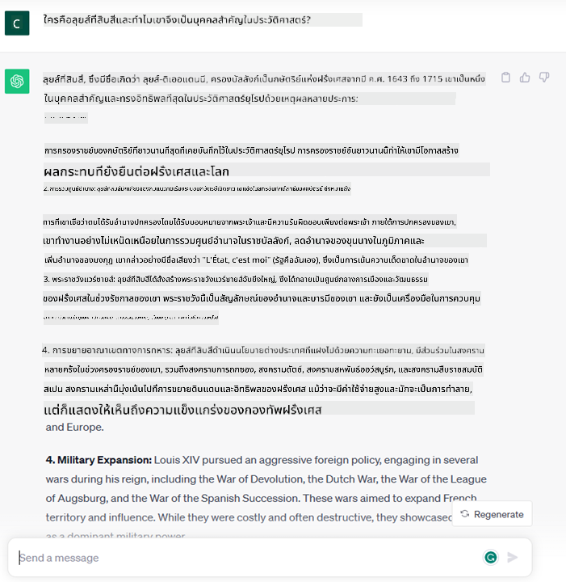
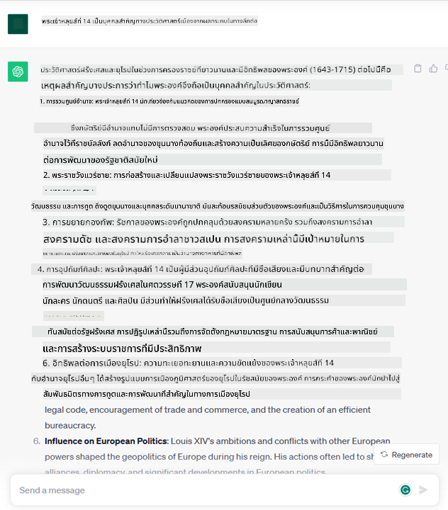
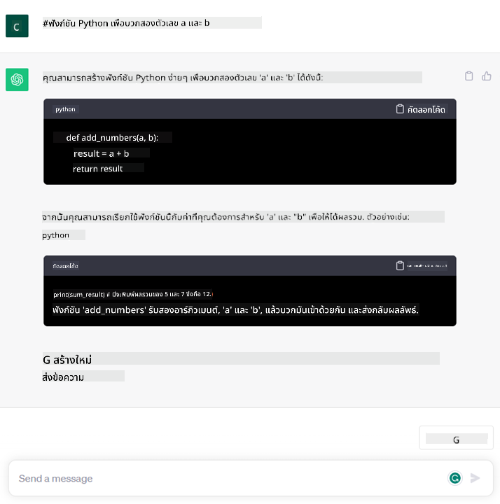

<!--
CO_OP_TRANSLATOR_METADATA:
{
  "original_hash": "f53ba0fa49164f9323043f1c6b11f2b1",
  "translation_date": "2025-05-19T13:20:50+00:00",
  "source_file": "01-introduction-to-genai/README.md",
  "language_code": "th"
}
-->
# บทนำสู่ AI เชิงสร้างสรรค์และโมเดลภาษาขนาดใหญ่

_(คลิกที่ภาพด้านบนเพื่อดูวิดีโอของบทเรียนนี้)_

AI เชิงสร้างสรรค์คือปัญญาประดิษฐ์ที่สามารถสร้างข้อความ รูปภาพ และเนื้อหาประเภทอื่น ๆ สิ่งที่ทำให้มันเป็นเทคโนโลยีที่ยอดเยี่ยมคือการทำให้ AI เข้าถึงได้ง่าย ใคร ๆ ก็สามารถใช้ได้ด้วยเพียงแค่คำสั่งข้อความหรือประโยคที่เขียนด้วยภาษาธรรมชาติ คุณไม่จำเป็นต้องเรียนรู้ภาษาอย่าง Java หรือ SQL เพื่อทำสิ่งที่มีค่า สิ่งที่คุณต้องทำคือใช้ภาษาของคุณ ระบุสิ่งที่คุณต้องการ และ AI จะให้คำแนะนำออกมา การใช้งานและผลกระทบของสิ่งนี้มีมากมาย คุณสามารถเขียนหรือเข้าใจรายงาน เขียนแอปพลิเคชัน และอื่น ๆ อีกมากมายได้ในเวลาไม่กี่วินาที

ในหลักสูตรนี้ เราจะสำรวจว่าบริษัทสตาร์ทอัพของเราใช้ AI เชิงสร้างสรรค์ในการเปิดโอกาสใหม่ ๆ ในโลกการศึกษาอย่างไร และเราจัดการกับความท้าทายที่หลีกเลี่ยงไม่ได้ที่เกี่ยวข้องกับผลกระทบทางสังคมของการใช้งานและข้อจำกัดทางเทคโนโลยีอย่างไร

## บทนำ

บทเรียนนี้จะครอบคลุม:

- บทนำสู่สถานการณ์ธุรกิจ: ไอเดียและภารกิจของสตาร์ทอัพของเรา
- AI เชิงสร้างสรรค์และวิธีที่เรามาถึงภูมิทัศน์เทคโนโลยีในปัจจุบัน
- การทำงานภายในของโมเดลภาษาขนาดใหญ่
- ความสามารถหลักและกรณีการใช้งานที่เป็นประโยชน์ของโมเดลภาษาขนาดใหญ่

## เป้าหมายการเรียนรู้

หลังจากจบบทเรียนนี้ คุณจะเข้าใจ:

- AI เชิงสร้างสรรค์คืออะไรและโมเดลภาษาขนาดใหญ่ทำงานอย่างไร
- วิธีที่คุณสามารถใช้ประโยชน์จากโมเดลภาษาขนาดใหญ่สำหรับกรณีการใช้งานต่าง ๆ โดยเน้นไปที่สถานการณ์การศึกษา

## สถานการณ์: สตาร์ทอัพด้านการศึกษาของเรา

ปัญญาประดิษฐ์เชิงสร้างสรรค์ (AI) เป็นสุดยอดของเทคโนโลยี AI ที่ผลักดันขอบเขตของสิ่งที่เคยคิดว่าเป็นไปไม่ได้ โมเดล AI เชิงสร้างสรรค์มีความสามารถและการใช้งานหลายอย่าง แต่สำหรับหลักสูตรนี้เราจะสำรวจว่ามันปฏิวัติการศึกษาอย่างไรผ่านสตาร์ทอัพที่สมมติขึ้น เราจะเรียกสตาร์ทอัพนี้ว่า _สตาร์ทอัพของเรา_ สตาร์ทอัพของเราทำงานในโดเมนการศึกษาด้วยภารกิจที่มีความทะเยอทะยานคือ

> _ปรับปรุงการเข้าถึงการเรียนรู้ในระดับโลก เพื่อให้มั่นใจว่าทุกคนสามารถเข้าถึงการศึกษาได้อย่างเท่าเทียม และให้ประสบการณ์การเรียนรู้ที่ปรับให้เหมาะสมกับความต้องการของผู้เรียนแต่ละคน_

ทีมสตาร์ทอัพของเราตระหนักว่าเราจะไม่สามารถบรรลุเป้าหมายนี้ได้หากไม่ได้ใช้ประโยชน์จากหนึ่งในเครื่องมือที่ทรงพลังที่สุดในยุคปัจจุบัน – โมเดลภาษาขนาดใหญ่ (LLMs)

AI เชิงสร้างสรรค์คาดว่าจะปฏิวัติวิธีที่เราเรียนรู้และสอนในปัจจุบัน โดยที่นักเรียนมีครูเสมือนที่พร้อมให้บริการตลอด 24 ชั่วโมงทุกวัน ซึ่งให้ข้อมูลและตัวอย่างมากมาย และครูสามารถใช้เครื่องมือที่เป็นนวัตกรรมใหม่ในการประเมินนักเรียนและให้ข้อเสนอแนะ

เริ่มต้นด้วยการกำหนดแนวคิดพื้นฐานและคำศัพท์ที่เราจะใช้ตลอดหลักสูตรนี้

## เราได้ AI เชิงสร้างสรรค์มาได้อย่างไร?

แม้จะมี _กระแส_ ที่ยอดเยี่ยมที่สร้างขึ้นเมื่อเร็ว ๆ นี้จากการประกาศของโมเดล AI เชิงสร้างสรรค์ เทคโนโลยีนี้ได้พัฒนามาหลายสิบปีแล้ว โดยเริ่มจากความพยายามในการวิจัยครั้งแรกในทศวรรษ 60s ตอนนี้เราอยู่ในจุดที่ AI มีความสามารถทางปัญญาเชิงมนุษย์ เช่น การสนทนา อย่างที่เห็นได้จาก [OpenAI ChatGPT](https://openai.com/chatgpt) หรือ [Bing Chat](https://www.microsoft.com/edge/features/bing-chat?WT.mc_id=academic-105485-koreyst) ซึ่งใช้โมเดล GPT สำหรับการค้นหาบนเว็บในการสนทนา Bing

ย้อนกลับไปสักหน่อย โปรโตไทป์ AI แรก ๆ ประกอบด้วยแชทบอทที่พิมพ์ด้วยเครื่องพิมพ์ดีด โดยอิงจากฐานความรู้ที่สกัดจากกลุ่มผู้เชี่ยวชาญและแทนค่าเข้าไปในคอมพิวเตอร์ คำตอบในฐานความรู้ถูกกระตุ้นโดยคำสำคัญที่ปรากฏในข้อความที่ป้อนเข้าไป อย่างไรก็ตาม ในไม่ช้าก็เห็นได้ชัดว่าแนวทางนี้ ซึ่งใช้แชทบอทที่พิมพ์ด้วยเครื่องพิมพ์ดีด ไม่สามารถขยายตัวได้ดี

### วิธีการทางสถิติสู่ AI: การเรียนรู้ของเครื่อง

จุดเปลี่ยนมาถึงในช่วงทศวรรษ 90s ด้วยการประยุกต์ใช้วิธีการทางสถิติกับการวิเคราะห์ข้อความ สิ่งนี้นำไปสู่การพัฒนาอัลกอริธึมใหม่ ๆ ที่รู้จักกันในชื่อการเรียนรู้ของเครื่อง ซึ่งสามารถเรียนรู้รูปแบบจากข้อมูลโดยไม่ต้องถูกโปรแกรมอย่างชัดเจน วิธีการนี้ทำให้เครื่องสามารถจำลองความเข้าใจภาษามนุษย์ได้: โมเดลทางสถิติได้รับการฝึกอบรมจากคู่ข้อความ-ป้ายกำกับ ทำให้โมเดลสามารถจำแนกข้อความที่ไม่รู้จักด้วยป้ายกำกับที่กำหนดไว้ล่วงหน้าซึ่งแสดงถึงความตั้งใจของข้อความ

### เครือข่ายประสาทและผู้ช่วยเสมือนยุคใหม่

ในช่วงไม่กี่ปีที่ผ่านมา การพัฒนาเทคโนโลยีฮาร์ดแวร์ที่สามารถจัดการกับข้อมูลจำนวนมากขึ้นและการคำนวณที่ซับซ้อนมากขึ้น ได้สนับสนุนการวิจัยใน AI นำไปสู่การพัฒนาอัลกอริธึมการเรียนรู้ของเครื่องขั้นสูงที่รู้จักกันในชื่อเครือข่ายประสาทหรืออัลกอริธึมการเรียนรู้เชิงลึก

เครือข่ายประสาท (โดยเฉพาะอย่างยิ่ง Recurrent Neural Networks – RNNs) ได้ปรับปรุงการประมวลผลภาษาธรรมชาติอย่างมีนัยสำคัญ ทำให้สามารถแสดงความหมายของข้อความได้อย่างมีความหมายมากขึ้น โดยให้ความสำคัญกับบริบทของคำในประโยค

นี่คือเทคโนโลยีที่เป็นพลังขับเคลื่อนผู้ช่วยเสมือนที่เกิดขึ้นในทศวรรษแรกของศตวรรษใหม่ มีความสามารถในการตีความภาษามนุษย์ ระบุความต้องการ และดำเนินการเพื่อสนองความต้องการนั้นได้อย่างมีประสิทธิภาพ – เช่น การตอบด้วยสคริปต์ที่กำหนดไว้ล่วงหน้าหรือการใช้บริการของบุคคลที่สาม

### ปัจจุบัน, AI เชิงสร้างสรรค์

นั่นคือวิธีที่เรามาถึง AI เชิงสร้างสรรค์ในปัจจุบัน ซึ่งสามารถมองเห็นได้ว่าเป็นส่วนหนึ่งของการเรียนรู้เชิงลึก

หลังจากการวิจัยในสาขา AI มาหลายสิบปี สถาปัตยกรรมโมเดลใหม่ – ที่เรียกว่า _Transformer_ – ได้เอาชนะข้อจำกัดของ RNNs โดยสามารถรับลำดับข้อความที่ยาวขึ้นมากเป็นอินพุต Transformers อิงตามกลไกความสนใจ ช่วยให้โมเดลสามารถให้ความสำคัญกับอินพุตที่ได้รับ 'ให้ความสนใจมากขึ้น' ในที่ที่ข้อมูลที่เกี่ยวข้องมากที่สุดถูกเน้น ไม่ว่าลำดับของข้อมูลนั้นในลำดับข้อความจะเป็นอย่างไร

โมเดล AI เชิงสร้างสรรค์ล่าสุดส่วนใหญ่ – หรือที่รู้จักกันในชื่อโมเดลภาษาขนาดใหญ่ (LLMs) เนื่องจากพวกมันทำงานกับอินพุตและเอาต์พุตที่เป็นข้อความ – จริง ๆ แล้วอิงตามสถาปัตยกรรมนี้ สิ่งที่น่าสนใจเกี่ยวกับโมเดลเหล่านี้ – ซึ่งได้รับการฝึกอบรมจากข้อมูลที่ไม่มีป้ายกำกับจำนวนมหาศาลจากแหล่งต่าง ๆ เช่น หนังสือ บทความ และเว็บไซต์ – คือพวกมันสามารถปรับให้เข้ากับงานที่หลากหลายและสร้างข้อความที่ถูกต้องตามหลักไวยากรณ์พร้อมกับความคิดสร้างสรรค์บางอย่าง ดังนั้น พวกมันไม่เพียงเพิ่มความสามารถของเครื่องในการ 'เข้าใจ' ข้อความอินพุตได้อย่างมาก แต่ยังทำให้พวกมันสามารถสร้างการตอบสนองที่เป็นต้นฉบับในภาษามนุษย์ได้

## โมเดลภาษาขนาดใหญ่ทำงานอย่างไร?

ในบทถัดไปเราจะสำรวจประเภทต่าง ๆ ของโมเดล AI เชิงสร้างสรรค์ แต่ตอนนี้มาดูกันว่าโมเดลภาษาขนาดใหญ่ทำงานอย่างไร โดยเน้นไปที่โมเดล GPT (Generative Pre-trained Transformer) ของ OpenAI

- **Tokenizer, ข้อความเป็นตัวเลข**: โมเดลภาษาขนาดใหญ่รับข้อความเป็นอินพุตและสร้างข้อความเป็นเอาต์พุต อย่างไรก็ตาม เนื่องจากเป็นโมเดลทางสถิติ พวกมันทำงานได้ดีกับตัวเลขมากกว่าลำดับข้อความ นั่นคือเหตุผลที่ทุกอินพุตของโมเดลจะถูกประมวลผลโดย tokenizer ก่อนที่จะถูกใช้โดยโมเดลหลัก โทเค็นคือชิ้นส่วนของข้อความ – ประกอบด้วยจำนวนตัวอักษรที่เปลี่ยนแปลงได้ ดังนั้นงานหลักของ tokenizer คือการแบ่งอินพุตออกเป็นอาร์เรย์ของโทเค็น จากนั้นแต่ละโทเค็นจะถูกจับคู่กับดัชนีโทเค็นซึ่งเป็นการเข้ารหัสจำนวนเต็มของชิ้นส่วนข้อความต้นฉบับ

- **การทำนายโทเค็นเอาต์พุต**: เมื่อได้รับโทเค็น n เป็นอินพุต (โดยที่ max n แตกต่างกันไปในแต่ละโมเดล) โมเดลสามารถทำนายโทเค็นหนึ่งเป็นเอาต์พุต โทเค็นนี้จะถูกรวมเข้ากับอินพุตของการวนซ้ำถัดไป ในรูปแบบหน้าต่างขยาย ช่วยให้ประสบการณ์ผู้ใช้ดีขึ้นโดยได้รับประโยคหนึ่ง (หรือหลายประโยค) เป็นคำตอบ นี่อธิบายได้ว่าทำไม หากคุณเคยเล่นกับ ChatGPT คุณอาจสังเกตเห็นว่าบางครั้งมันดูเหมือนหยุดกลางประโยค

- **กระบวนการคัดเลือก, การแจกแจงความน่าจะเป็น**: โทเค็นเอาต์พุตถูกเลือกโดยโมเดลตามความน่าจะเป็นของการเกิดขึ้นหลังจากลำดับข้อความปัจจุบัน เนื่องจากโมเดลทำนายการแจกแจงความน่าจะเป็นเหนือโทเค็น ‘ถัดไป’ ที่เป็นไปได้ทั้งหมด ซึ่งคำนวณจากการฝึกอบรมของมัน อย่างไรก็ตาม ไม่ได้เลือกโทเค็นที่มีความน่าจะเป็นสูงสุดจากการแจกแจงที่ได้เสมอไป องค์ประกอบของความสุ่มจะถูกเพิ่มเข้าไปในการเลือกนี้ ในลักษณะที่โมเดลทำงานในรูปแบบที่ไม่เป็นเชิงกำหนด - เราไม่ได้รับเอาต์พุตเดียวกันทุกครั้งสำหรับอินพุตเดียวกัน องค์ประกอบของความสุ่มนี้ถูกเพิ่มเข้าไปเพื่อจำลองกระบวนการคิดสร้างสรรค์และสามารถปรับได้โดยใช้พารามิเตอร์โมเดลที่เรียกว่าอุณหภูมิ

## สตาร์ทอัพของเราจะใช้ประโยชน์จากโมเดลภาษาขนาดใหญ่ได้อย่างไร?

ตอนนี้ที่เราเข้าใจการทำงานภายในของโมเดลภาษาขนาดใหญ่ดีขึ้นแล้ว มาดูตัวอย่างการใช้งานที่พบมากที่สุดที่พวกมันสามารถทำได้ดี โดยมองในแง่ของสถานการณ์ธุรกิจของเรา
เรากล่าวว่าความสามารถหลักของโมเดลภาษาขนาดใหญ่คือ _การสร้างข้อความจากศูนย์ โดยเริ่มจากอินพุตที่เป็นข้อความที่เขียนด้วยภาษาธรรมชาติ_

แต่ข้อความอินพุตและเอาต์พุตชนิดใด?
อินพุตของโมเดลภาษาขนาดใหญ่รู้จักกันในชื่อคำสั่ง (prompt) ขณะที่เอาต์พุตรู้จักกันในชื่อการเติมเต็ม (completion) ซึ่งหมายถึงกลไกของโมเดลในการสร้างโทเค็นถัดไปเพื่อเติมเต็มอินพุตปัจจุบัน เรากำลังจะลงลึกในสิ่งที่เป็นคำสั่งและวิธีการออกแบบเพื่อให้ได้ประโยชน์สูงสุดจากโมเดลของเรา แต่ตอนนี้ขอกล่าวเพียงว่าคำสั่งอาจรวมถึง:

- **คำสั่ง** ที่ระบุประเภทของเอาต์พุตที่เราคาดหวังจากโมเดล คำสั่งนี้บางครั้งอาจฝังตัวอย่างหรือข้อมูลเพิ่มเติมบางอย่าง

  1. การสรุปบทความ หนังสือ รีวิวสินค้า และอื่น ๆ พร้อมกับการสกัดข้อมูลเชิงลึกจากข้อมูลที่ไม่มีโครงสร้าง
    
    
  
  2. การสร้างสรรค์ไอเดียและการออกแบบบทความ เรียงความ การมอบหมายงาน หรืออื่น ๆ
      
     

- **คำถาม** ที่ถามในรูปแบบของการสนทนากับตัวแทน
  
  

- ชิ้นส่วนของ **ข้อความเพื่อเติมเต็ม** ซึ่งโดยปริยายคือการขอความช่วยเหลือในการเขียน
  
  

- ชิ้นส่วนของ **โค้ด** พร้อมกับการขออธิบายและเอกสารประกอบ หรือความคิดเห็นที่ขอให้สร้างโค้ดเพื่อทำงานเฉพาะ
  
  

ตัวอย่างข้างต้นค่อนข้างง่ายและไม่ได้ตั้งใจให้เป็นการสาธิตความสามารถของโมเดลภาษาขนาดใหญ่อย่างครอบคลุม พวกมันมีจุดประสงค์เพื่อแสดงศักยภาพของการใช้ AI เชิงสร้างสรรค์ โดยเฉพาะอย่างยิ่งแต่ไม่จำกัดเฉพาะบริบททางการศึกษา

นอกจากนี้ เอาต์พุตของโมเดล AI เชิงสร้างสรรค์ไม่สมบูรณ์แบบและบางครั้งความคิดสร้างสรรค์ของโมเดลอาจทำงานตรงข้าม ส่งผลให้ได้เอาต์พุตที่เป็นการผสมผสานของคำที่ผู้ใช้มนุษย์อาจตีความว่าเป็นการบิดเบือนความจริง หรืออาจเป็นการล่วงละเมิด AI เชิงสร้างสรรค์ไม่ใช่ปัญญา - อย่างน้อยก็ในความหมายที่ครอบคลุมของปัญญา ซึ่งรวมถึงการใช้เหตุผลเชิงวิพากษ์และเชิงสร้างสรรค์หรือปัญญาทางอารมณ์ มันไม่เป็นเชิงกำหนด และไม่เชื่อถือได้ เนื่องจากการสร้างที่ไม่ถูกต้อง เช่น การอ้างอิงที่ผิดพลาด เนื้อหา และคำชี้แจง อาจถูกผสมผสานกับข้อมูลที่ถูกต้องและนำเสนอในลักษณะที่น่าเชื่อถือและมั่นใจ ในบทเรียนต่อไป เราจะจัดการกับข้อจำกัดเหล่านี้ทั้งหมดและดูว่าเราสามารถทำอะไรเพื่อบรรเทาพวกมันได้บ้าง

## การมอบหมาย

การมอบหมายของคุณคือการอ่านเพิ่มเติมเกี่ยวกับ [AI เชิงสร้างสรรค์](https://en.wikipedia.org/wiki/Generative_artificial_intelligence?WT.mc_id=academic-105485-koreyst) และพยายามระบุพื้นที่ที่คุณต้องการเพิ่ม AI เชิงสร้างสรรค์ในวันนี้ที่ยังไม่มีมัน การเพิ่ม AI เชิงสร้างสรรค์จะมีผลกระทบต่างจากการทำแบบ "วิธี

**ข้อจำกัดความรับผิดชอบ**:  
เอกสารนี้ได้รับการแปลโดยใช้บริการแปลภาษา AI [Co-op Translator](https://github.com/Azure/co-op-translator) แม้ว่าเราจะพยายามให้การแปลมีความถูกต้อง แต่โปรดทราบว่าการแปลอัตโนมัติอาจมีข้อผิดพลาดหรือความไม่ถูกต้อง เอกสารต้นฉบับในภาษาที่ใช้ควรถือเป็นแหล่งข้อมูลที่เชื่อถือได้ สำหรับข้อมูลที่สำคัญ แนะนำให้ใช้บริการแปลภาษาจากมนุษย์มืออาชีพ เราไม่รับผิดชอบต่อความเข้าใจผิดหรือการตีความผิดที่เกิดจากการใช้การแปลนี้