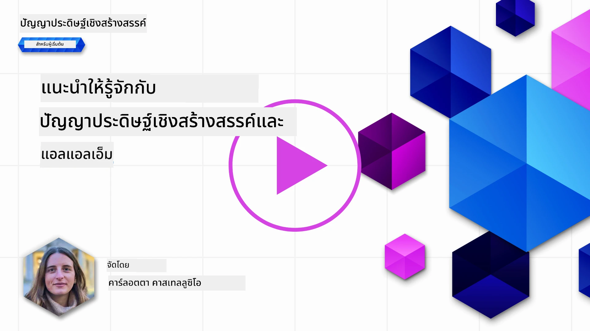
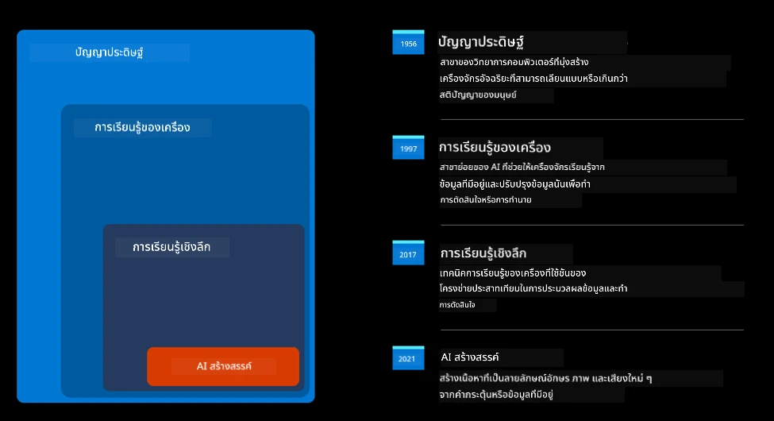
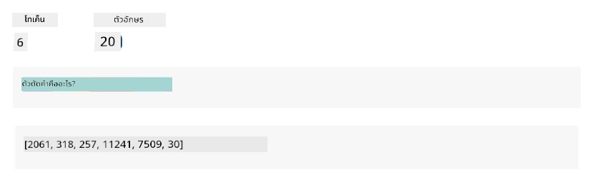
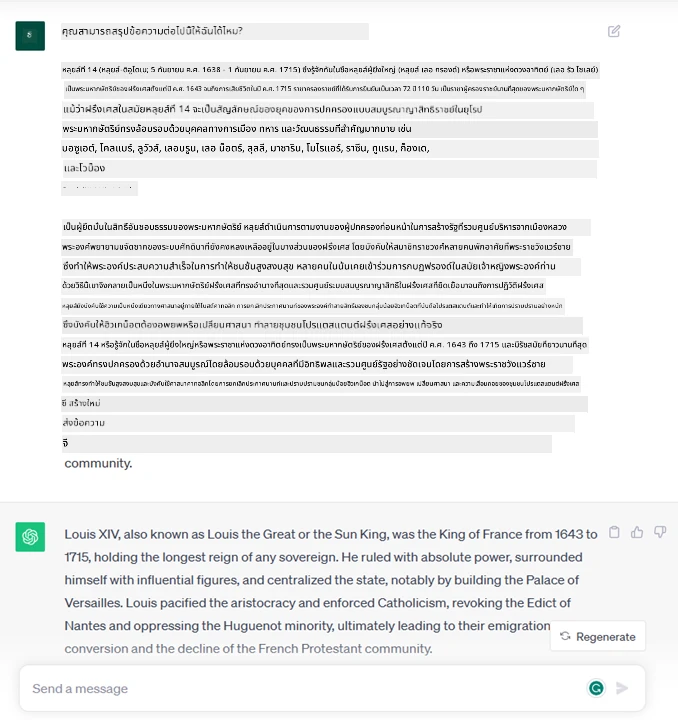
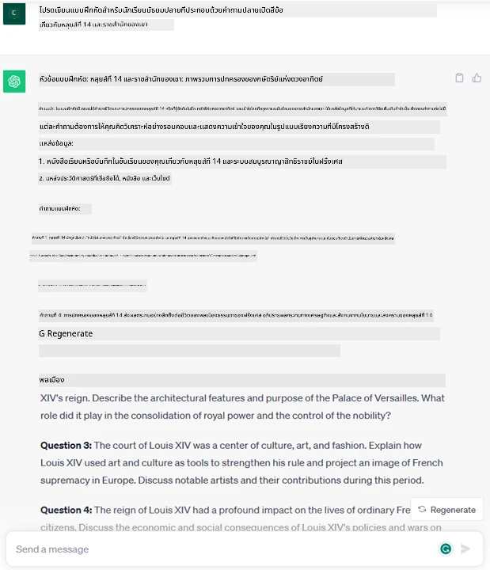
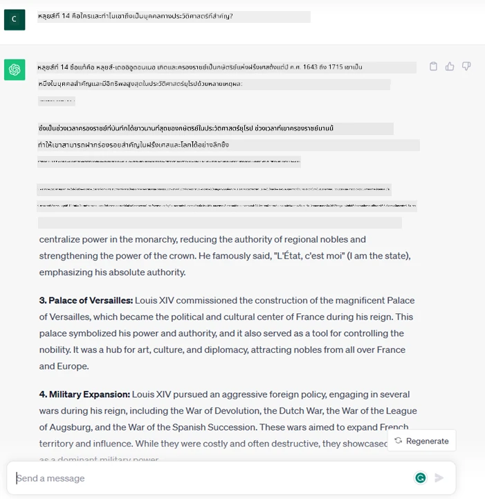
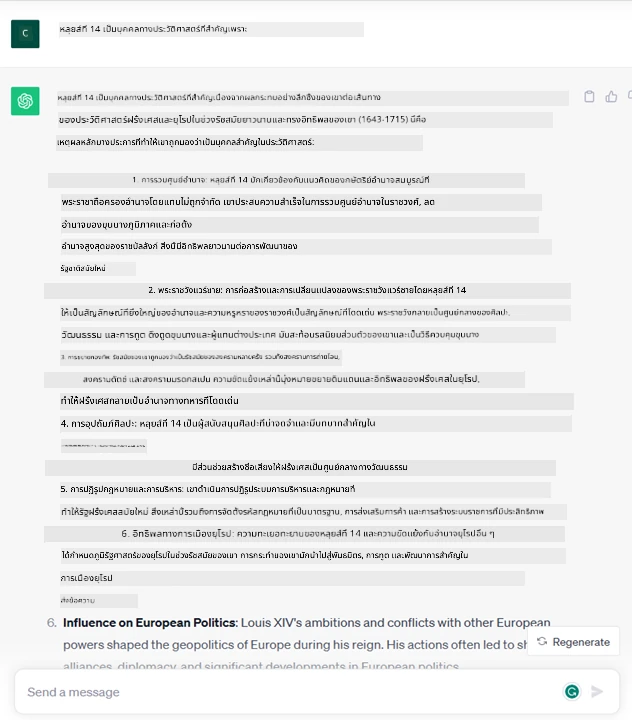
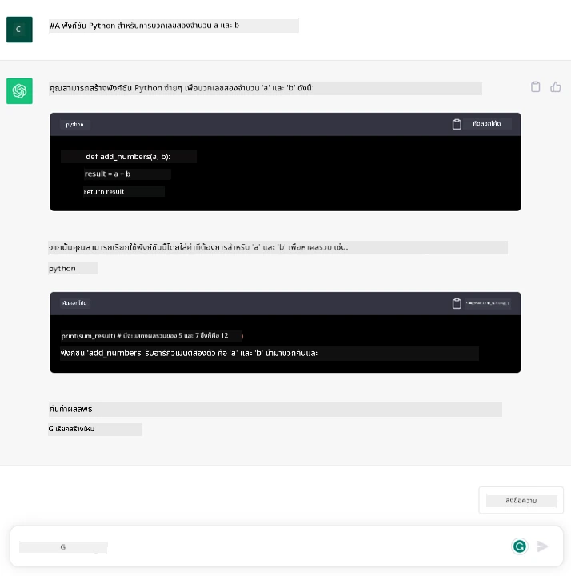

# บทนำสู่ปัญญาประดิษฐ์สร้างสรรค์และโมเดลภาษาขนาดใหญ่

_(คลิกที่ภาพด้านบนเพื่อดูวิดีโอของบทเรียนนี้)_

ปัญญาประดิษฐ์สร้างสรรค์ (Generative AI) คือปัญญาประดิษฐ์ที่สามารถสร้างข้อความ รูปภาพ และเนื้อหาประเภทอื่น ๆ สิ่งที่ทำให้มันเป็นเทคโนโลยีที่ยอดเยี่ยมคือการที่มันทำให้ AI เป็นประชาธิปไตย ทุกคนสามารถใช้มันได้ด้วยการพิมพ์ข้อความสั้น ๆ สักประโยคหนึ่งในภาษาธรรมชาติ โดยไม่จำเป็นต้องเรียนรู้ภาษาคอมพิวเตอร์เช่น Java หรือ SQL เพื่อให้งานสำเร็จ สิ่งที่คุณต้องทำคือใช้ภาษาของคุณเอง ระบุสิ่งที่ต้องการ แล้วจะได้ข้อเสนอแนะจากโมเดล AI โปรแกรมประยุกต์และผลกระทบของเทคโนโลยีนี้มีขนาดใหญ่มาก เช่น การเขียนหรือทำความเข้าใจรายงาน เขียนแอปพลิเคชัน และอีกมากมาย ทั้งหมดทำได้ในไม่กี่วินาที

ในหลักสูตรนี้ เราจะมาสำรวจว่า startup ของเรานำปัญญาประดิษฐ์สร้างสรรค์มาใช้ปลดล็อกสถานการณ์ใหม่ในโลกการศึกษาอย่างไร และเราจะแก้ไขปัญหาที่หลีกเลี่ยงไม่ได้ซึ่งเกี่ยวข้องกับผลกระทบทางสังคมจากการประยุกต์ใช้และข้อจำกัดของเทคโนโลยีนี้อย่างไร

## บทนำ

บทเรียนนี้จะครอบคลุม:

- บทนำสู่สถานการณ์ธุรกิจ: แนวคิดและพันธกิจของ startup ของเรา
- ปัญญาประดิษฐ์สร้างสรรค์และภูมิทัศน์เทคโนโลยีในปัจจุบันที่เราใช้งาน
- การทำงานภายในของโมเดลภาษาขนาดใหญ่
- ความสามารถหลักและกรณีใช้งานที่ใช้งานได้จริงของโมเดลภาษาขนาดใหญ่

## เป้าหมายการเรียนรู้

หลังจากเรียนจบบทเรียนนี้ คุณจะเข้าใจ:

- ปัญญาประดิษฐ์สร้างสรรค์คืออะไรและโมเดลภาษาขนาดใหญ่ทำงานอย่างไร
- วิธีที่คุณสามารถนำโมเดลภาษาขนาดใหญ่ไปใช้ในกรณีต่าง ๆ โดยเน้นในสถานการณ์ทางการศึกษา

## สถานการณ์: startup ด้านการศึกษาของเรา

ปัญญาประดิษฐ์สร้างสรรค์ (Generative Artificial Intelligence) แสดงถึงจุดสูงสุดของเทคโนโลยี AI ผลักดันขอบเขตสิ่งที่เคยคิดว่าเป็นไปไม่ได้ โมเดลปัญญาประดิษฐ์สร้างสรรค์มีความสามารถและการใช้งานหลากหลาย แต่ในหลักสูตรนี้เราจะสำรวจว่ามันปฏิวัติวงการการศึกษาอย่างไรผ่าน startup สมมติที่เราจะเรียกว่า _startup ของเรา_ ทีม startup ของเราทำงานในสาขาการศึกษาด้วยพันธกิจอันทะเยอทะยานว่า

> _การปรับปรุงการเข้าถึงการเรียนรู้ในระดับโลก เพื่อให้มั่นใจว่าการศึกษาเข้าถึงได้อย่างเท่าเทียมและมอบประสบการณ์การเรียนรู้เฉพาะตัวให้กับผู้เรียนแต่ละคนตามความต้องการ_

ทีม startup ของเราเข้าใจดีว่าเราไม่สามารถบรรลุเป้าหมายนี้ได้หากไม่ใช้เครื่องมือที่ทรงพลังที่สุดยุคนี้ – โมเดลภาษาขนาดใหญ่ (LLMs)

ปัญญาประดิษฐ์สร้างสรรค์คาดว่าจะปฏิวัติวิธีที่เราเรียนรู้และสอนในปัจจุบัน โดยที่นักเรียนสามารถมีครูเสมือนจริงที่พร้อมให้บริการตลอด 24 ชั่วโมงซึ่งให้ข้อมูลและตัวอย่างจำนวนมาก และครูเองก็สามารถใช้เครื่องมือที่ล้ำหน้าในการประเมินนักเรียนและให้คำติชม

เพื่อเริ่มต้น เรามากำหนดคำและแนวคิดพื้นฐานบางอย่างที่เราจะใช้ตลอดหลักสูตรนี้กันก่อน

## เราได้ปัญญาประดิษฐ์สร้างสรรค์มาได้อย่างไร?

แม้จะมีการฮือฮาอย่างมากที่เกิดขึ้นเมื่อไม่นานมานี้จากการประกาศโมเดลปัญญาประดิษฐ์สร้างสรรค์ เทคโนโลยีนี้ได้ผ่านการพัฒนามาหลายสิบปีโดยความพยายามด้านการวิจัยเริ่มตั้งแต่ทศวรรษ 60 ปัจจุบัน AI มีความสามารถทางปัญญาชนิดมนุษย์ เช่น การสนทนา อย่างที่เห็นได้จาก [OpenAI ChatGPT](https://openai.com/chatgpt) หรือ [Microsoft Copilot](https://copilot.microsoft.com/?WT.mc_id=academic-105485-koreyst) ซึ่งใช้โมเดล GPT เพื่อประสบการณ์การค้นหาบนเว็บแบบสนทนา

ย้อนกลับไปเล็กน้อย ต้นแบบแรกของ AI คือแชทบอทที่เขียนแบบพิมพ์ดีด โดยอิงฐานข้อมูลความรู้ที่ถูกสกัดจากกลุ่มผู้เชี่ยวชาญและถูกนำเสนอในรูปแบบคอมพิวเตอร์ คำตอบในฐานข้อมูลจะถูกเรียกใช้งานโดยคำหลักที่ปรากฏในข้อความนำเข้า
อย่างไรก็ตาม วิธีการใช้แชทบอทแบบพิมพ์ดีดนี้ไม่นำไปสู่การขยายตัวที่ดีนัก

### แนวทางสถิติต่อ AI: การเรียนรู้ของเครื่อง

จุดเปลี่ยนเกิดขึ้นในช่วงทศวรรษ 90 ด้วยการใช้แนวทางทางสถิติต่อการวิเคราะห์ข้อความ ส่งผลให้เกิดการพัฒนาอัลกอริทึมใหม่ ๆ – ที่เรียกว่าการเรียนรู้ของเครื่อง – ที่สามารถเรียนรู้รูปแบบจากข้อมูลโดยไม่ต้องถูกโปรแกรมอย่างชัดเจน แนวทางนี้ช่วยให้เครื่องจำลองความเข้าใจภาษาในมนุษย์: โมเดลทางสถิติถูกฝึกด้วยข้อความคู่กับป้ายกำกับ ทำให้โมเดลสามารถจัดประเภทข้อความที่ไม่รู้จักด้วยป้ายกำกับที่กำหนดไว้ล่วงหน้าแสดงความตั้งใจของข้อความ

### เครือข่ายประสาทและผู้ช่วยเสมือนสมัยใหม่

ในช่วงปีหลัง ๆ การพัฒนาทางเทคโนโลยีฮาร์ดแวร์ซึ่งสามารถจัดการข้อมูลจำนวนมากและคำนวณซับซ้อนได้มากขึ้น ส่งเสริมการวิจัยในด้าน AI นำไปสู่การพัฒนาอัลกอริทึมการเรียนรู้ของเครื่องขั้นสูงที่เรียกว่าเครือข่ายประสาทเทียมหรืออัลกอริทึมการเรียนรู้ลึก

เครือข่ายประสาทเทียม (โดยเฉพาะ Recurrent Neural Networks – RNNs) ช่วยยกระดับการประมวลผลภาษาธรรมชาติ ทำให้สามารถแทนความหมายของข้อความได้ชัดเจนขึ้นโดยคำนึงถึงบริบทของคำในประโยค

นี่คือเทคโนโลยีที่ใช้ในผู้ช่วยเสมือนที่เกิดขึ้นในทศวรรษแรกของศตวรรษใหม่ มีความชำนาญในการตีความภาษามนุษย์ ระบุความต้องการ และทำงานต่อเพื่อให้สอดคล้อง เช่น ตอบด้วยสคริปต์ที่กำหนดไว้ล่วงหน้าหรือใช้บริการของบุคคลที่สาม

### ปัจจุบัน: ปัญญาประดิษฐ์สร้างสรรค์

นี่คือวิธีที่เรามาถึงปัญญาประดิษฐ์สร้างสรรค์ในวันนี้ ซึ่งสามารถมองว่าเป็นส่วนหนึ่งของการเรียนรู้ลึก

หลังจากการวิจัยในสาขา AI มาหลายสิบปี สถาปัตยกรรมโมเดลใหม่ที่เรียกว่า _Transformer_ ได้ก้าวผ่านข้อจำกัดของ RNNs โดยสามารถรับข้อมูลข้อความต่อเนื่องที่ยาวกว่ามาก Transformers มีพื้นฐานมาจากกลไก attention ที่ช่วยให้โมเดลให้ความสำคัญแตกต่างกันกับข้อมูลนำเข้าที่ได้รับ โดย ‘ใส่ใจมากขึ้น’ ในจุดที่มีข้อมูลที่สำคัญที่สุดโดยไม่คำนึงถึงลำดับในข้อมูลข้อความที่ป้อนเข้า

โมเดลปัญญาประดิษฐ์สร้างสรรค์ส่วนใหญ่ล่าสุด – หรือโมเดลภาษาขนาดใหญ่ (LLMs) เนื่องจากทำงานกับข้อมูลข้อความทั้งนำเข้าและส่งออก – อิงสถาปัตยกรรมนี้ ความน่าสนใจของโมเดลเหล่านี้ที่ถูกฝึกด้วยข้อมูลจำนวนมหาศาลจากแหล่งต่าง ๆ เช่นหนังสือ บทความ และเว็บไซต์ คือพวกเขาสามารถปรับใช้กับงานหลากหลายและสร้างข้อความที่ถูกหลักไวยากรณ์ด้วยความคิดสร้างสรรค์บางส่วน ดังนั้นไม่เพียงแต่พวกเขาจะเพิ่มขีดความสามารถเครื่องจักรในการ ‘เข้าใจ’ ข้อความป้อนเข้าได้อย่างมาก แต่ยังทำให้พวกเขาสามารถสร้างคำตอบต้นฉบับในภาษามนุษย์ได้ด้วย

## โมเดลภาษาขนาดใหญ่มันทำงานอย่างไร?

ในบทถัดไปเราจะสำรวจโมเดลปัญญาประดิษฐ์สร้างสรรค์หลายประเภท แต่ตอนนี้เรามาดูว่ารูปแบบการทำงานของโมเดลภาษาขนาดใหญ่เป็นอย่างไร โดยเน้นที่โมเดล OpenAI GPT (Generative Pre-trained Transformer)

- **Tokenizer, ข้อความเป็นตัวเลข**: โมเดลภาษาขนาดใหญ่รับข้อความเป็นอินพุตและสร้างข้อความเป็นผลลัพธ์ อย่างไรก็ตาม เนื่องจากเป็นโมเดลเชิงสถิติ พวกมันทำงานได้ดีกับตัวเลขมากกว่าลำดับข้อความ นั่นคือเหตุผลที่ทุกข้อมูลป้อนเข้าถูกประมวลผลโดย tokenizer ก่อนนำไปใช้โดยโมเดลหลัก Token คือก้อนข้อความที่ประกอบด้วยจำนวนอักขระที่เปลี่ยนแปลงได้ ดังนั้นหน้าที่หลักของ tokenizer คือการแยกข้อความนำเข้าเป็นชุดของ tokens จากนั้นแต่ละ token จะถูกแมปกับดัชนี token ซึ่งเป็นการเข้ารหัสข้อความต้นฉบับในรูปแบบจำนวนเต็ม

- **การทำนาย token ผลลัพธ์**: เมื่อให้ token จำนวน n เป็นอินพุต (จำนวนสูงสุด n แตกต่างกันตามแต่ละโมเดล) โมเดลจะทำนาย token หนึ่งชิ้นเป็นผลลัพธ์ token นี้จะถูกนำไปรวมในอินพุตของรอบถัดไปในรูปแบบหน้าต่างขยาย ทำให้ประสบการณ์ผู้ใช้ได้รับข้อความคำตอบหนึ่งหรือหลายประโยค อธิบายได้ว่าทำไมถ้าคุณเคยเล่นกับ ChatGPT บางครั้งดูเหมือนว่าจะหยุดตรงกลางประโยค

- **กระบวนการเลือก การแจกแจงความน่าจะเป็น**: token ผลลัพธ์ที่ถูกเลือกโดยโมเดลจะขึ้นอยู่กับความน่าจะเป็นที่จะเกิดขึ้นหลังข้อความลำดับปัจจุบัน เพราะโมเดลทำนายการแจกแจงความน่าจะเป็นสำหรับ ‘token ถัดไป’ ทุกตัวที่เป็นไปได้โดยคำนวณจากการฝึกอบรม แต่ไม่จำเป็นต้องเลือก token ที่มีความน่าจะเป็นสูงสุดเสมอ มีการเพิ่มความสุ่มเข้ามาเพื่อให้โมเดลทำงานแบบไม่ตายตัวซึ่งทำให้เราไม่ได้คำตอบซ้ำกันทุกครั้ง ความสุ่มระดับนี้ช่วยเลียนแบบกระบวนการคิดสร้างสรรค์ และสามารถปรับแต่งได้ด้วยพารามิเตอร์โมเดลที่เรียกว่า temperature

## Startup ของเราใช้ประโยชน์จากโมเดลภาษาขนาดใหญ่ได้อย่างไร?

ตอนนี้ที่เราเข้าใจการทำงานภายในของโมเดลภาษาขนาดใหญ่แล้ว ลองดูตัวอย่างใช้งานจริงของงานที่พวกเขาทำได้ดี โดยมีโฟกัสในสถานการณ์ธุรกิจของเรา เราพูดถึงความสามารถหลักของโมเดลภาษาขนาดใหญ่ว่า _การสร้างข้อความใหม่ตั้งแต่ต้นเริ่มจากข้อความป้อนเข้าในภาษาธรรมชาติ_

ข้อความป้อนเข้าของโมเดลภาษาขนาดใหญ่เรียกว่า prompt ในขณะที่ผลลัพธ์เรียกว่า completion ซึ่งหมายถึงกลไกของโมเดลในการสร้าง token ถัดไปเพื่อเติมเต็มข้อความปัจจุบัน เราจะเจาะลึกว่า prompt คืออะไรและออกแบบอย่างไรเพื่อให้ได้ผลลัพธ์สูงสุดจากโมเดล แต่ตอนนี้ให้รู้ไว้ว่า prompt สามารถประกอบด้วย:

    
    
  
  2. การสร้างสรรค์ไอเดียและการออกแบบบทความ เรียงความ งานมอบหมาย หรืออื่น ๆ
      
     

  
  

  
  

  
  

หากคุณทำงานนี้ คุณอาจพร้อมสมัครเข้าร่วม Microsoft incubator, [Microsoft for Startups Founders Hub](https://www.microsoft.com/startups?WT.mc_id=academic-105485-koreyst) เรามอบเครดิตทั้ง Azure, OpenAI, การให้คำปรึกษา และอื่น ๆ มากมาย ลองดูนะ!

## การทดสอบความรู้

อะไรที่เป็นจริงเกี่ยวกับโมเดลภาษาขนาดใหญ่?

1. คุณจะได้คำตอบเดียวกันเป๊ะทุกครั้ง
1. มันทำงานได้อย่างสมบูรณ์แบบ ทำเลขเก่ง เขียนโค้ดได้อย่างมืออาชีพ ฯลฯ
1. คำตอบอาจแตกต่างแม้ใช้ prompt เดิม มันยังเก่งในการให้ร่างแรกของบางสิ่งบางอย่าง ไม่ว่าจะเป็นข้อความหรือโค้ด แต่คุณต้องปรับปรุงผลลัพธ์เอง

ก: 3, โมเดลภาษาขนาดใหญ่เป็นแบบไม่ตายตัว คำตอบจึงแตกต่างกัน แต่คุณสามารถควบคุมความแตกต่างนี้ด้วยการตั้งค่า temperature นอกจากนี้คุณไม่ควรคาดหวังให้มันทำงานสมบูรณ์แบบ เพราะมันมาช่วยทำงานหนักให้คุณซึ่งมักหมายถึงคุณจะได้ผลงานร่างแรกที่ดีซึ่งต้องพัฒนาต่อไป

## ทำได้ดีมาก! ต่อไปก็ดำเนินต่อไป

หลังจากจบบทเรียนนี้แล้ว เช็คชุดเรียนรู้ [Generative AI Learning collection](https://aka.ms/genai-collection?WT.mc_id=academic-105485-koreyst) เพื่อพัฒนาความรู้ด้านปัญญาประดิษฐ์สร้างสรรค์ของคุณต่อไป!

ไปที่บทเรียนที่ 2 ซึ่งเราจะดูวิธี [สำรวจและเปรียบเทียบ LLM ประเภทต่างๆ](../02-exploring-and-comparing-different-llms/README.md?WT.mc_id=academic-105485-koreyst)!

---

<!-- CO-OP TRANSLATOR DISCLAIMER START -->
**ปฏิเสธความรับผิดชอบ**:
เอกสารนี้ได้รับการแปลโดยใช้บริการแปลภาษา AI [Co-op Translator](https://github.com/Azure/co-op-translator) ขณะที่เราพยายามให้ความถูกต้อง โปรดทราบว่าการแปลโดยอัตโนมัติอาจมีข้อผิดพลาดหรือความไม่ถูกต้อง เอกสารต้นฉบับในภาษาต้นทางควรถูกพิจารณาเป็นแหล่งข้อมูลที่เชื่อถือได้ สำหรับข้อมูลที่สำคัญ แนะนำให้ใช้การแปลโดยมนุษย์มืออาชีพ เราไม่รับผิดชอบต่อความเข้าใจผิดหรือการตีความที่ผิดพลาดที่เกิดขึ้นจากการใช้การแปลนี้
<!-- CO-OP TRANSLATOR DISCLAIMER END -->