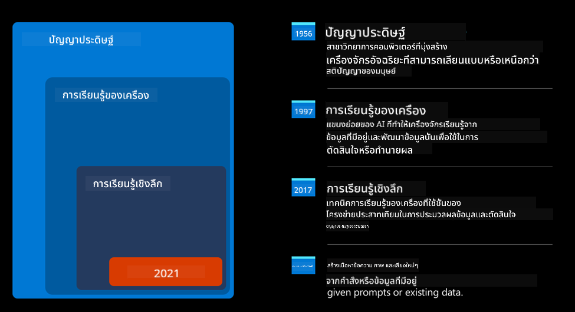
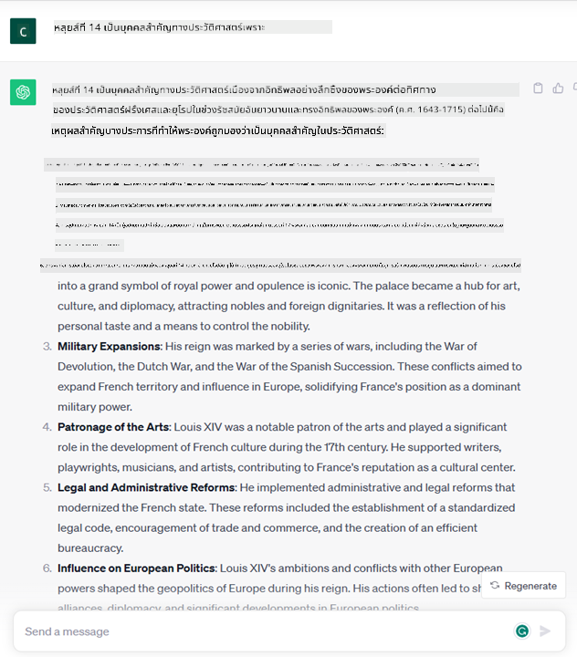

<!--
CO_OP_TRANSLATOR_METADATA:
{
  "original_hash": "f53ba0fa49164f9323043f1c6b11f2b1",
  "translation_date": "2025-07-09T07:53:39+00:00",
  "source_file": "01-introduction-to-genai/README.md",
  "language_code": "th"
}
-->
# บทนำสู่ Generative AI และ Large Language Models

_(คลิกที่ภาพด้านบนเพื่อดูวิดีโอของบทเรียนนี้)_

Generative AI คือปัญญาประดิษฐ์ที่สามารถสร้างข้อความ รูปภาพ และเนื้อหาประเภทอื่น ๆ ได้ สิ่งที่ทำให้เทคโนโลยีนี้น่าทึ่งคือมันทำให้ AI เป็นเรื่องที่ทุกคนเข้าถึงได้ง่าย เพียงแค่ใช้ข้อความสั้น ๆ หรือประโยคที่เขียนด้วยภาษาธรรมชาติ คุณไม่จำเป็นต้องเรียนรู้ภาษาโปรแกรมอย่าง Java หรือ SQL เพื่อทำสิ่งที่มีประโยชน์ สิ่งที่คุณต้องทำคือใช้ภาษาของคุณเอง บอกสิ่งที่ต้องการ แล้ว AI จะเสนอคำแนะนำออกมา แอปพลิเคชันและผลกระทบของเทคโนโลยีนี้มีมากมาย คุณสามารถเขียนหรือเข้าใจรายงาน เขียนแอปพลิเคชัน และอื่น ๆ ได้ในเวลาไม่กี่วินาที

ในหลักสูตรนี้ เราจะสำรวจว่า startup ของเราใช้ Generative AI อย่างไรเพื่อเปิดโอกาสใหม่ ๆ ในโลกการศึกษา และเราจะจัดการกับความท้าทายที่หลีกเลี่ยงไม่ได้ที่เกี่ยวข้องกับผลกระทบทางสังคมและข้อจำกัดของเทคโนโลยีนี้อย่างไร

## บทนำ

บทเรียนนี้จะครอบคลุม:

- แนะนำสถานการณ์ทางธุรกิจ: ไอเดียและพันธกิจของ startup ของเรา
- Generative AI และวิวัฒนาการของเทคโนโลยีในปัจจุบัน
- การทำงานภายในของ Large Language Model
- ความสามารถหลักและกรณีการใช้งานจริงของ Large Language Models

## เป้าหมายการเรียนรู้

หลังจากเรียนจบบทเรียนนี้ คุณจะเข้าใจ:

- Generative AI คืออะไร และ Large Language Models ทำงานอย่างไร
- วิธีใช้ Large Language Models ในกรณีการใช้งานต่าง ๆ โดยเน้นที่สถานการณ์ทางการศึกษา

## สถานการณ์: startup ทางการศึกษาของเรา

Generative Artificial Intelligence (AI) คือสุดยอดของเทคโนโลยี AI ที่ผลักดันขอบเขตของสิ่งที่เคยคิดว่าเป็นไปไม่ได้ โมเดล Generative AI มีความสามารถและการใช้งานหลากหลาย แต่ในหลักสูตรนี้เราจะสำรวจว่ามันเปลี่ยนแปลงวงการศึกษาอย่างไรผ่าน startup สมมติที่เราจะเรียกว่า _startup ของเรา_ Startup ของเราทำงานในด้านการศึกษาพร้อมพันธกิจที่ทะเยอทะยานว่า

> _พัฒนาการเข้าถึงการเรียนรู้ในระดับโลก เพื่อให้ทุกคนได้รับการศึกษาอย่างเท่าเทียม และมอบประสบการณ์การเรียนรู้ที่ปรับให้เหมาะกับผู้เรียนแต่ละคนตามความต้องการ_

ทีมงาน startup ของเราตระหนักดีว่าเราจะไม่สามารถบรรลุเป้าหมายนี้ได้หากไม่ใช้เครื่องมือที่ทรงพลังที่สุดในยุคนี้ – Large Language Models (LLMs)

Generative AI คาดว่าจะปฏิวัติวิธีการเรียนรู้และการสอนในปัจจุบัน โดยนักเรียนจะมีครูเสมือนที่พร้อมให้บริการตลอด 24 ชั่วโมง ให้ข้อมูลและตัวอย่างจำนวนมาก และครูสามารถใช้เครื่องมือใหม่ ๆ ในการประเมินนักเรียนและให้คำแนะนำได้

เริ่มต้นกันด้วยการกำหนดแนวคิดและคำศัพท์พื้นฐานที่เราจะใช้ตลอดหลักสูตรนี้

## Generative AI มาจากไหน?

แม้จะมีการพูดถึงอย่างมากในช่วงหลังจากการเปิดตัวโมเดล Generative AI เทคโนโลยีนี้ถูกพัฒนามานานหลายสิบปี โดยงานวิจัยแรกเริ่มย้อนกลับไปในยุค 60 ตอนนี้ AI มีความสามารถทางปัญญาเหมือนมนุษย์ เช่น การสนทนา ตัวอย่างเช่น [OpenAI ChatGPT](https://openai.com/chatgpt) หรือ [Bing Chat](https://www.microsoft.com/edge/features/bing-chat?WT.mc_id=academic-105485-koreyst) ซึ่งใช้โมเดล GPT สำหรับการค้นหาบนเว็บ Bing

ย้อนกลับไปในอดีต ต้นแบบแรกของ AI คือ chatbot ที่พิมพ์ข้อความตอบโต้ โดยอาศัยฐานความรู้ที่ได้จากกลุ่มผู้เชี่ยวชาญและถูกเก็บไว้ในคอมพิวเตอร์ คำตอบในฐานความรู้จะถูกเรียกใช้โดยคำสำคัญที่ปรากฏในข้อความที่ป้อนเข้าไป แต่ไม่นานก็พบว่าวิธีนี้ไม่สามารถขยายผลได้ดี

### วิธีการทางสถิติใน AI: Machine Learning

จุดเปลี่ยนเกิดขึ้นในยุค 90 เมื่อมีการนำวิธีการทางสถิติมาใช้วิเคราะห์ข้อความ ส่งผลให้เกิดอัลกอริทึมใหม่ ๆ ที่เรียกว่า machine learning ซึ่งสามารถเรียนรู้รูปแบบจากข้อมูลโดยไม่ต้องถูกโปรแกรมอย่างชัดเจน วิธีนี้ช่วยให้เครื่องจักรจำลองความเข้าใจภาษามนุษย์ได้: โมเดลสถิติถูกฝึกด้วยข้อความที่จับคู่กับป้ายกำกับ ทำให้โมเดลสามารถจัดประเภทข้อความที่ไม่รู้จักด้วยป้ายกำกับที่แสดงเจตนาของข้อความนั้น

### Neural networks และผู้ช่วยเสมือนสมัยใหม่

ในช่วงไม่กี่ปีที่ผ่านมา การพัฒนาฮาร์ดแวร์ที่สามารถจัดการข้อมูลจำนวนมากและการคำนวณที่ซับซ้อนมากขึ้น ส่งเสริมงานวิจัย AI จนเกิดอัลกอริทึม machine learning ขั้นสูงที่เรียกว่า neural networks หรือ deep learning

Neural networks (โดยเฉพาะ Recurrent Neural Networks – RNNs) ช่วยพัฒนาการประมวลผลภาษาธรรมชาติอย่างมาก ทำให้สามารถแสดงความหมายของข้อความได้อย่างลึกซึ้งขึ้น โดยคำนึงถึงบริบทของคำในประโยค

นี่คือเทคโนโลยีที่ขับเคลื่อนผู้ช่วยเสมือนที่เกิดขึ้นในทศวรรษแรกของศตวรรษใหม่ ซึ่งมีความสามารถในการตีความภาษามนุษย์ ระบุความต้องการ และดำเนินการตอบสนอง เช่น ตอบด้วยสคริปต์ที่กำหนดไว้ล่วงหน้าหรือเรียกใช้บริการจากภายนอก

### ปัจจุบัน Generative AI

นี่คือที่มาของ Generative AI ในปัจจุบัน ซึ่งถือเป็นส่วนหนึ่งของ deep learning

หลังจากงานวิจัยในวงการ AI มาหลายสิบปี สถาปัตยกรรมโมเดลใหม่ที่เรียกว่า _Transformer_ ได้ก้าวข้ามข้อจำกัดของ RNNs โดยสามารถรับข้อความที่ยาวขึ้นเป็นอินพุต Transformers ใช้กลไก attention ซึ่งช่วยให้โมเดลให้ความสำคัญกับข้อมูลที่เกี่ยวข้องมากที่สุดโดยไม่ขึ้นกับลำดับของข้อความ

โมเดล Generative AI ส่วนใหญ่ในปัจจุบัน หรือที่เรียกว่า Large Language Models (LLMs) ซึ่งทำงานกับข้อความทั้งอินพุตและเอาต์พุต ล้วนใช้สถาปัตยกรรมนี้ โมเดลเหล่านี้ถูกฝึกด้วยข้อมูลจำนวนมหาศาลที่ไม่มีป้ายกำกับจากแหล่งต่าง ๆ เช่น หนังสือ บทความ และเว็บไซต์ สิ่งที่น่าสนใจคือโมเดลเหล่านี้สามารถปรับใช้กับงานหลากหลายและสร้างข้อความที่ถูกต้องตามหลักไวยากรณ์พร้อมความคิดสร้างสรรค์ในระดับหนึ่ง ไม่เพียงแต่เพิ่มความสามารถของเครื่องจักรในการ ‘เข้าใจ’ ข้อความอินพุต แต่ยังช่วยให้สามารถสร้างคำตอบต้นฉบับในภาษามนุษย์ได้

## Large Language Models ทำงานอย่างไร?

ในบทถัดไปเราจะสำรวจโมเดล Generative AI ประเภทต่าง ๆ แต่ตอนนี้มาดูการทำงานของ Large Language Models โดยเน้นที่ OpenAI GPT (Generative Pre-trained Transformer)

- **Tokenizer, แปลงข้อความเป็นตัวเลข**: Large Language Models รับข้อความเป็นอินพุตและสร้างข้อความเป็นเอาต์พุต แต่เนื่องจากเป็นโมเดลสถิติ จึงทำงานได้ดีกับตัวเลขมากกว่าข้อความ ดังนั้นทุกอินพุตจะถูกประมวลผลโดย tokenizer ก่อนส่งให้โมเดลหลัก Token คือชิ้นส่วนของข้อความที่ประกอบด้วยตัวอักษรจำนวนหนึ่ง หน้าที่หลักของ tokenizer คือแยกข้อความอินพุตออกเป็นชุดของ tokens จากนั้นแต่ละ token จะถูกแมปกับ token index ซึ่งเป็นการเข้ารหัสเป็นจำนวนเต็มของข้อความต้นฉบับ

- **การทำนาย token เอาต์พุต**: เมื่อได้รับ n tokens เป็นอินพุต (โดย n สูงสุดจะแตกต่างกันไปในแต่ละโมเดล) โมเดลจะทำนาย token ตัวถัดไปเป็นเอาต์พุต token นี้จะถูกเพิ่มเข้าไปในอินพุตของรอบถัดไปในรูปแบบหน้าต่างที่ขยายออก ช่วยให้ผู้ใช้ได้รับคำตอบเป็นประโยคหนึ่งหรือหลายประโยค นี่คือเหตุผลที่ถ้าคุณเคยใช้ ChatGPT อาจสังเกตเห็นว่าบางครั้งมันหยุดกลางประโยค

- **กระบวนการเลือก token, การแจกแจงความน่าจะเป็น**: token เอาต์พุตถูกเลือกโดยโมเดลตามความน่าจะเป็นที่จะเกิดขึ้นหลังข้อความปัจจุบัน โมเดลจะทำนายการแจกแจงความน่าจะเป็นของ ‘token ถัดไป’ ทั้งหมดตามการฝึกฝน อย่างไรก็ตาม token ที่มีความน่าจะเป็นสูงสุดไม่ได้ถูกเลือกเสมอไป จะมีการเพิ่มความสุ่มในกระบวนการเลือกนี้ เพื่อให้โมเดลทำงานในลักษณะที่ไม่ตายตัว — เราจะไม่ได้ผลลัพธ์เหมือนกันทุกครั้งสำหรับอินพุตเดียวกัน ความสุ่มนี้ช่วยจำลองกระบวนการคิดสร้างสรรค์ และสามารถปรับได้ด้วยพารามิเตอร์ที่เรียกว่า temperature

## Startup ของเราจะใช้ Large Language Models อย่างไร?

เมื่อเราเข้าใจการทำงานภายในของ Large Language Model แล้ว มาดูตัวอย่างการใช้งานจริงที่พบบ่อย โดยเน้นที่สถานการณ์ทางธุรกิจของเรา

ความสามารถหลักของ Large Language Model คือ _การสร้างข้อความใหม่ตั้งแต่ต้น โดยเริ่มจากข้อความอินพุตที่เขียนด้วยภาษาธรรมชาติ_

แต่ข้อความอินพุตและเอาต์พุตแบบไหนล่ะ? อินพุตของโมเดลใหญ่เรียกว่า prompt ส่วนเอาต์พุตเรียกว่า completion ซึ่งหมายถึงกลไกของโมเดลในการสร้าง token ถัดไปเพื่อเติมข้อความอินพุตปัจจุบัน เราจะเจาะลึกว่า prompt คืออะไรและออกแบบอย่างไรเพื่อให้ได้ประโยชน์สูงสุดจากโมเดล แต่ตอนนี้ขอแค่บอกว่า prompt อาจประกอบด้วย:

- **คำสั่ง** ที่ระบุประเภทของเอาต์พุตที่เราคาดหวัง คำสั่งนี้บางครั้งอาจมีตัวอย่างหรือข้อมูลเพิ่มเติมแฝงอยู่

  1. สรุปบทความ หนังสือ รีวิวสินค้า และอื่น ๆ พร้อมทั้งสกัดข้อมูลเชิงลึกจากข้อมูลที่ไม่มีโครงสร้าง
    
    
  
  2. การสร้างสรรค์ไอเดียและออกแบบบทความ เรียงความ งานมอบหมาย หรืออื่น ๆ
      
     

- **คำถาม** ที่ถามในรูปแบบการสนทนากับตัวแทน
  
  

- ข้อความบางส่วนที่ต้องการให้เติมต่อ ซึ่งโดยนัยคือการขอความช่วยเหลือในการเขียน
  
  

- โค้ดบางส่วนพร้อมคำขอให้ช่วยอธิบายและจัดทำเอกสาร หรือคอมเมนต์ที่ขอให้สร้างโค้ดเพื่อทำงานเฉพาะ
  
  

ตัวอย่างข้างต้นเป็นเพียงตัวอย่างง่าย ๆ และไม่ได้แสดงศักยภาพทั้งหมดของ Large Language Models แต่มีจุดประสงค์เพื่อแสดงศักยภาพของ Generative AI โดยเฉพาะในบริบททางการศึกษา

อย่างไรก็ตาม ผลลัพธ์จากโมเดล Generative AI ไม่สมบูรณ์แบบ และบางครั้งความคิดสร้างสรรค์ของโมเดลอาจทำให้ผลลัพธ์ออกมาเป็นคำที่มนุษย์อาจตีความว่าเป็นการบิดเบือนความจริง หรืออาจมีเนื้อหาที่ไม่เหมาะสม Generative AI ไม่ใช่ปัญญาที่แท้จริง — อย่างน้อยในความหมายที่ครอบคลุมของปัญญา ซึ่งรวมถึงการคิดวิเคราะห์และสร้างสรรค์ หรือปัญญาทางอารมณ์ มันไม่ใช่ระบบที่ตายตัว และไม่ควรเชื่อถือได้เสมอไป เพราะอาจมีการสร้างข้อมูลเท็จ เช่น การอ้างอิงผิดพลาด เนื้อหา และคำกล่าวที่ผสมผสานกับข้อมูลที่ถูกต้องและนำเสนออย่างน่าเชื่อถือ ในบทเรียนถัดไป เราจะพูดถึงข้อจำกัดเหล่านี้และวิธีจัดการกับมัน

## การบ้าน

การบ้านของคุณคืออ่านเพิ่มเติมเกี่ยวกับ [generative AI](https://en.wikipedia.org/wiki/Generative_artificial_intelligence?WT.mc_id=academic-105485-koreyst) และลองหาว่ามีพื้นที่ใดบ้างที่คุณอยากเพิ่ม generative AI เข้าไปในวันนี้ซึ่งยังไม่มีผลกระทบอย่างชัดเจน ผลกระทบจะต่างจากวิธีเดิมอย่างไร คุณจะทำอะไรได้ที่ไม่เคยทำได้มาก่อน หรือทำได้เร็วขึ้น? เขียนสรุป 300 คำเกี่ยวกับ startup AI ในฝันของคุณ โดยใส่หัวข้อเช่น "ปัญหา", "วิธีใช้ AI", "ผลกระทบ" และถ้าต้องการสามารถเพิ่มแผนธุรกิจได้

ถ้าคุณทำงานนี้เสร็จแล้ว คุณอาจพร้อมสมัครเข้าร่วมโครงการบ่มเพาะของ Microsoft, [Microsoft for Startups Founders Hub](https://www.microsoft.com/startups?WT.mc_id=academic-105485-koreyst) ซึ่งเรามีเครดิตสำหรับ Azure, OpenAI, การให้คำปรึกษา และอื่น ๆ อีกมากมาย ลองดูได้เลย!

## แบบทดสอบความรู้

อะไรคือความจริงเกี่ยวกับ Large Language Models?

1. คุณจะได้คำตอบเหมือนเดิมทุกครั้ง
2. มันทำงานได้สมบูรณ์แบบ เช่น คำนวณเลขได้ดี สร้างโค้ดที่ใช้งานได้ ฯลฯ
3. คำตอบอาจเปลี่ยนแปลงได้แม้ใช้ prompt เดิม มันยังช่วยให้คุณได้ร่างแรกของข้อความหรือโค้ด แต่คุณต้องปรับปรุงผลลัพธ์ต่อไป

คำตอบ: 3, LLM เป็นระบบที่ไม่ตายตัว คำตอบจึงเปลี่ยนแปลงได้ แต่คุณสามารถควบคุมความแปรปรวนนี้ด้วยการตั้งค่า temperature คุณไม่ควรคาดหวังว่ามันจะทำงานได้สมบูรณ์แบบ มันถูกออกแบบมาเพื่อช่วยทำงานหนักให้คุณ ซึ่งมักหมายถึงคุณจะได้ร่างแรกที่ดีที่ต้องปรับปรุงต่อไป

## ทำได้ดีมาก! เดินหน้าต่อไป

หลังจากเรียนจบบทเรียนนี้แล้ว ลองดู [คอลเลกชันการเรียนรู้ Generative AI](https://aka.ms/genai-collection?WT.mc_id=academic-105485-koreyst) ของเราเพื่อพัฒนาความรู้ด้าน Generative AI ต่อไป!
ไปที่บทเรียนที่ 2 ซึ่งเราจะมาดูวิธี [สำรวจและเปรียบเทียบประเภท LLM ต่างๆ](../02-exploring-and-comparing-different-llms/README.md?WT.mc_id=academic-105485-koreyst)!

**ข้อจำกัดความรับผิดชอบ**:  
เอกสารนี้ได้รับการแปลโดยใช้บริการแปลภาษาอัตโนมัติ [Co-op Translator](https://github.com/Azure/co-op-translator) แม้เราจะพยายามให้ความถูกต้องสูงสุด แต่โปรดทราบว่าการแปลอัตโนมัติอาจมีข้อผิดพลาดหรือความไม่ถูกต้อง เอกสารต้นฉบับในภาษาต้นทางถือเป็นแหล่งข้อมูลที่เชื่อถือได้ สำหรับข้อมูลที่สำคัญ ขอแนะนำให้ใช้บริการแปลโดยผู้เชี่ยวชาญมนุษย์ เราไม่รับผิดชอบต่อความเข้าใจผิดหรือการตีความผิดใด ๆ ที่เกิดจากการใช้การแปลนี้