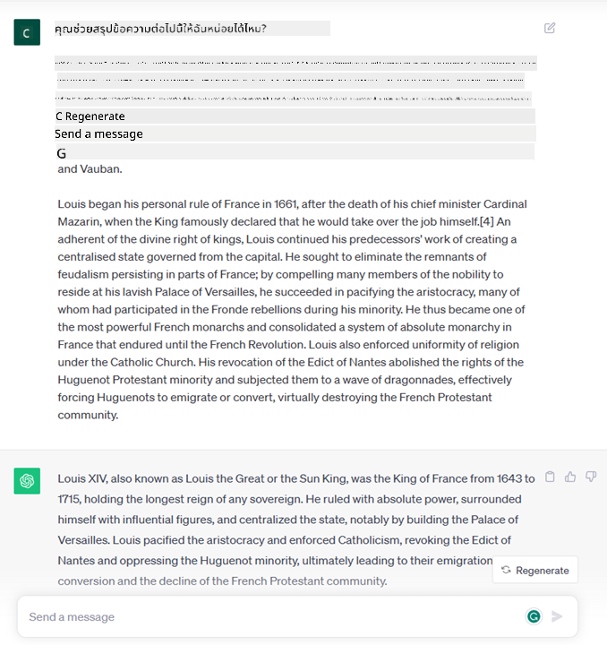
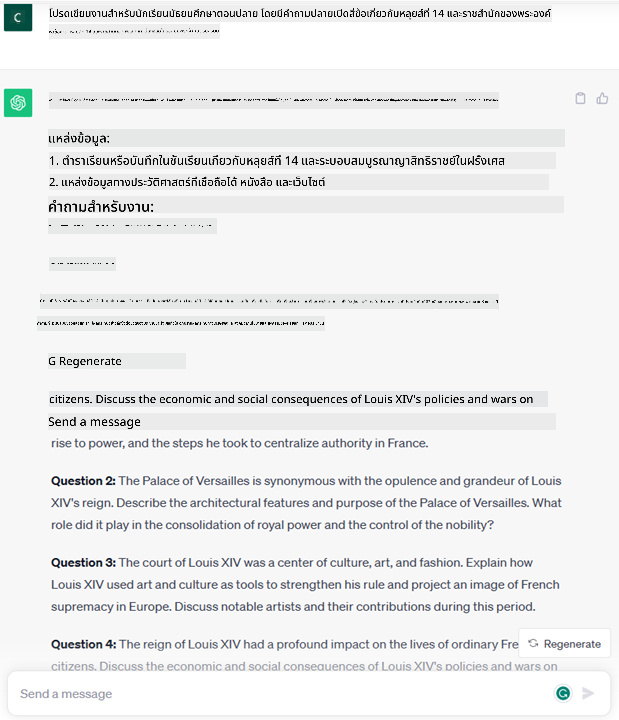

<!--
CO_OP_TRANSLATOR_METADATA:
{
  "original_hash": "bfb7901bdbece1ba3e9f35c400ca33e8",
  "translation_date": "2025-10-17T18:41:25+00:00",
  "source_file": "01-introduction-to-genai/README.md",
  "language_code": "th"
}
-->
# การแนะนำ AI สร้างสรรค์และโมเดลภาษาขนาดใหญ่

_(คลิกที่ภาพด้านบนเพื่อดูวิดีโอของบทเรียนนี้)_

AI สร้างสรรค์คือปัญญาประดิษฐ์ที่สามารถสร้างข้อความ รูปภาพ และเนื้อหาอื่น ๆ ได้ สิ่งที่ทำให้มันเป็นเทคโนโลยีที่ยอดเยี่ยมคือการที่มันทำให้ AI เข้าถึงได้ง่ายขึ้น ทุกคนสามารถใช้งานได้เพียงแค่ใช้ข้อความสั้น ๆ หรือประโยคที่เขียนในภาษาธรรมชาติ คุณไม่จำเป็นต้องเรียนรู้ภาษาโปรแกรมอย่าง Java หรือ SQL เพื่อทำสิ่งที่มีคุณค่า สิ่งที่คุณต้องทำคือใช้ภาษาของคุณ ระบุสิ่งที่คุณต้องการ และ AI จะเสนอคำแนะนำให้คุณ แอปพลิเคชันและผลกระทบของสิ่งนี้มีมากมาย เช่น การเขียนหรือทำความเข้าใจรายงาน การเขียนแอปพลิเคชัน และอื่น ๆ อีกมากมาย ทั้งหมดนี้ใช้เวลาเพียงไม่กี่วินาที

ในหลักสูตรนี้ เราจะสำรวจว่าเราใช้ AI สร้างสรรค์ในสตาร์ทอัพของเราเพื่อเปิดโอกาสใหม่ ๆ ในโลกการศึกษาอย่างไร และเราจะจัดการกับความท้าทายที่หลีกเลี่ยงไม่ได้ที่เกี่ยวข้องกับผลกระทบทางสังคมของการใช้งานและข้อจำกัดของเทคโนโลยีอย่างไร

## การแนะนำ

บทเรียนนี้จะครอบคลุม:

- การแนะนำสถานการณ์ธุรกิจ: ไอเดียและภารกิจของสตาร์ทอัพของเรา
- AI สร้างสรรค์และวิวัฒนาการของเทคโนโลยีในปัจจุบัน
- การทำงานภายในของโมเดลภาษาขนาดใหญ่
- ความสามารถหลักและกรณีการใช้งานจริงของโมเดลภาษาขนาดใหญ่

## เป้าหมายการเรียนรู้

หลังจากจบบทเรียนนี้ คุณจะเข้าใจ:

- AI สร้างสรรค์คืออะไรและโมเดลภาษาขนาดใหญ่ทำงานอย่างไร
- วิธีที่คุณสามารถใช้โมเดลภาษาขนาดใหญ่ในกรณีการใช้งานต่าง ๆ โดยเน้นไปที่สถานการณ์ในด้านการศึกษา

## สถานการณ์: สตาร์ทอัพด้านการศึกษาของเรา

AI สร้างสรรค์เป็นตัวแทนของเทคโนโลยี AI ที่ก้าวหน้าที่สุด ผลักดันขอบเขตของสิ่งที่เคยคิดว่าเป็นไปไม่ได้ โมเดล AI สร้างสรรค์มีความสามารถและการใช้งานหลากหลาย แต่สำหรับหลักสูตรนี้ เราจะสำรวจว่ามันเปลี่ยนแปลงการศึกษาอย่างไรผ่านสตาร์ทอัพสมมติ เราจะเรียกสตาร์ทอัพนี้ว่า _สตาร์ทอัพของเรา_ สตาร์ทอัพของเราทำงานในด้านการศึกษาด้วยภารกิจที่ทะเยอทะยานคือ

> _ปรับปรุงการเข้าถึงการเรียนรู้ในระดับโลก เพื่อให้การศึกษาเข้าถึงได้อย่างเท่าเทียม และมอบประสบการณ์การเรียนรู้ที่ปรับให้เหมาะสมกับความต้องการของผู้เรียนแต่ละคน_

ทีมของสตาร์ทอัพของเราตระหนักว่าเราจะไม่สามารถบรรลุเป้าหมายนี้ได้หากไม่ใช้หนึ่งในเครื่องมือที่ทรงพลังที่สุดในยุคปัจจุบัน – โมเดลภาษาขนาดใหญ่ (LLMs)

AI สร้างสรรค์คาดว่าจะเปลี่ยนแปลงวิธีการเรียนรู้และการสอนในปัจจุบัน โดยนักเรียนสามารถเข้าถึงครูเสมือนจริงได้ตลอด 24 ชั่วโมง ที่ให้ข้อมูลและตัวอย่างมากมาย และครูสามารถใช้เครื่องมือที่เป็นนวัตกรรมเพื่อประเมินนักเรียนและให้คำแนะนำ

เริ่มต้นกันด้วยการกำหนดแนวคิดและคำศัพท์พื้นฐานที่เราจะใช้ตลอดหลักสูตรนี้

## เราได้ AI สร้างสรรค์มาอย่างไร?

แม้จะมี _กระแส_ ที่เกิดขึ้นจากการประกาศโมเดล AI สร้างสรรค์เมื่อเร็ว ๆ นี้ แต่เทคโนโลยีนี้ได้ถูกพัฒนามาหลายทศวรรษ โดยมีการวิจัยครั้งแรกตั้งแต่ยุค 60s ตอนนี้เราอยู่ในจุดที่ AI มีความสามารถทางปัญญาของมนุษย์ เช่น การสนทนา อย่างที่เห็นได้จาก [OpenAI ChatGPT](https://openai.com/chatgpt) หรือ [Bing Chat](https://www.microsoft.com/edge/features/bing-chat?WT.mc_id=academic-105485-koreyst) ซึ่งใช้โมเดล GPT ในการค้นหาบนเว็บและสนทนา

ย้อนกลับไปเล็กน้อย โปรโตไทป์แรกของ AI ประกอบด้วยแชทบอทที่พิมพ์ข้อความ โดยอาศัยฐานความรู้ที่สกัดจากกลุ่มผู้เชี่ยวชาญและแสดงผลในคอมพิวเตอร์ คำตอบในฐานความรู้ถูกกระตุ้นโดยคำสำคัญที่ปรากฏในข้อความที่ป้อนเข้าไป อย่างไรก็ตาม ไม่นานก็เห็นได้ชัดว่าแนวทางนี้โดยใช้แชทบอทที่พิมพ์ข้อความไม่สามารถขยายตัวได้ดี

### แนวทางทางสถิติต่อ AI: การเรียนรู้ของเครื่อง

จุดเปลี่ยนเกิดขึ้นในช่วงยุค 90s ด้วยการประยุกต์ใช้แนวทางทางสถิติต่อการวิเคราะห์ข้อความ สิ่งนี้นำไปสู่การพัฒนาอัลกอริทึมใหม่ – ที่รู้จักกันในชื่อการเรียนรู้ของเครื่อง – ซึ่งสามารถเรียนรู้รูปแบบจากข้อมูลโดยไม่ต้องถูกโปรแกรมอย่างชัดเจน แนวทางนี้ช่วยให้เครื่องจำลองความเข้าใจภาษาของมนุษย์ได้: โมเดลทางสถิติถูกฝึกด้วยคู่ข้อความและป้ายกำกับ ทำให้โมเดลสามารถจัดประเภทข้อความที่ป้อนเข้ามาโดยไม่รู้จักด้วยป้ายกำกับที่กำหนดไว้ล่วงหน้า ซึ่งแสดงถึงเจตนาของข้อความ

### เครือข่ายประสาทและผู้ช่วยเสมือนในยุคปัจจุบัน

ในช่วงไม่กี่ปีที่ผ่านมา การพัฒนาทางเทคโนโลยีของฮาร์ดแวร์ที่สามารถจัดการข้อมูลจำนวนมากขึ้นและการคำนวณที่ซับซ้อนมากขึ้น ได้ส่งเสริมการวิจัยใน AI นำไปสู่การพัฒนาอัลกอริทึมการเรียนรู้ของเครื่องขั้นสูงที่รู้จักกันในชื่อเครือข่ายประสาทหรืออัลกอริทึมการเรียนรู้เชิงลึก

เครือข่ายประสาท (โดยเฉพาะเครือข่ายประสาทแบบวนซ้ำ – RNNs) ได้เพิ่มประสิทธิภาพการประมวลผลภาษาธรรมชาติอย่างมาก ทำให้สามารถแสดงความหมายของข้อความในรูปแบบที่มีความหมายมากขึ้น โดยให้ความสำคัญกับบริบทของคำในประโยค

นี่คือเทคโนโลยีที่ขับเคลื่อนผู้ช่วยเสมือนที่เกิดขึ้นในทศวรรษแรกของศตวรรษใหม่ ซึ่งมีความสามารถสูงในการตีความภาษาของมนุษย์ ระบุความต้องการ และดำเนินการเพื่อสนองความต้องการนั้น – เช่น การตอบกลับด้วยสคริปต์ที่กำหนดไว้ล่วงหน้าหรือการใช้บริการของบุคคลที่สาม

### ปัจจุบัน, AI สร้างสรรค์

และนี่คือวิธีที่เรามาถึง AI สร้างสรรค์ในปัจจุบัน ซึ่งสามารถมองว่าเป็นส่วนย่อยของการเรียนรู้เชิงลึก

หลังจากการวิจัยในด้าน AI มาหลายทศวรรษ สถาปัตยกรรมโมเดลใหม่ – ที่เรียกว่า _Transformer_ – ได้เอาชนะข้อจำกัดของ RNNs โดยสามารถรับลำดับข้อความที่ยาวขึ้นมากเป็นข้อมูลเข้า Transformers ใช้กลไกการให้ความสนใจ ทำให้โมเดลสามารถให้ความสำคัญกับข้อมูลที่ได้รับในระดับต่าง ๆ โดย ‘ให้ความสนใจมากขึ้น’ ในที่ที่ข้อมูลที่เกี่ยวข้องมากที่สุดถูกกระจายอยู่ โดยไม่คำนึงถึงลำดับของมันในลำดับข้อความ

โมเดล AI สร้างสรรค์ล่าสุดส่วนใหญ่ – ที่รู้จักกันในชื่อโมเดลภาษาขนาดใหญ่ (LLMs) เนื่องจากพวกมันทำงานกับข้อมูลเข้าและออกที่เป็นข้อความ – ล้วนใช้สถาปัตยกรรมนี้ สิ่งที่น่าสนใจเกี่ยวกับโมเดลเหล่านี้ – ที่ถูกฝึกด้วยข้อมูลจำนวนมหาศาลที่ไม่มีป้ายกำกับจากแหล่งข้อมูลหลากหลาย เช่น หนังสือ บทความ และเว็บไซต์ – คือพวกมันสามารถปรับให้เหมาะสมกับงานหลากหลายและสร้างข้อความที่ถูกต้องตามหลักไวยากรณ์พร้อมความสร้างสรรค์ในระดับหนึ่ง ดังนั้น ไม่เพียงแต่พวกมันเพิ่มความสามารถของเครื่องในการ ‘เข้าใจ’ ข้อความที่ป้อนเข้า แต่ยังเพิ่มความสามารถในการสร้างคำตอบต้นฉบับในภาษามนุษย์

## โมเดลภาษาขนาดใหญ่ทำงานอย่างไร?

ในบทถัดไป เราจะสำรวจประเภทต่าง ๆ ของโมเดล AI สร้างสรรค์ แต่สำหรับตอนนี้ มาดูกันว่าโมเดลภาษาขนาดใหญ่ทำงานอย่างไร โดยเน้นไปที่โมเดล GPT (Generative Pre-trained Transformer) ของ OpenAI

- **Tokenizer, ข้อความเป็นตัวเลข**: โมเดลภาษาขนาดใหญ่รับข้อความเป็นข้อมูลเข้าและสร้างข้อความเป็นข้อมูลออก อย่างไรก็ตาม เนื่องจากเป็นโมเดลทางสถิติ พวกมันทำงานได้ดีกว่ากับตัวเลขมากกว่าลำดับข้อความ นั่นคือเหตุผลที่ทุกข้อมูลเข้าของโมเดลถูกประมวลผลโดย tokenizer ก่อนที่จะถูกใช้โดยโมเดลหลัก Token คือส่วนของข้อความ – ประกอบด้วยจำนวนตัวอักษรที่เปลี่ยนแปลงได้ ดังนั้นงานหลักของ tokenizer คือการแบ่งข้อมูลเข้าออกเป็นอาร์เรย์ของ tokens จากนั้นแต่ละ token จะถูกจับคู่กับ token index ซึ่งเป็นการเข้ารหัสตัวเลขของส่วนข้อความต้นฉบับ

- **การทำนาย token ข้อมูลออก**: เมื่อได้รับ n tokens เป็นข้อมูลเข้า (โดย n สูงสุดจะแตกต่างกันไปในแต่ละโมเดล) โมเดลสามารถทำนาย token หนึ่งตัวเป็นข้อมูลออกได้ Token นี้จะถูกนำไปใช้ในข้อมูลเข้าของการวนซ้ำครั้งถัดไป ในรูปแบบหน้าต่างที่ขยายออก ทำให้ประสบการณ์ผู้ใช้ดีขึ้นในการได้รับหนึ่ง (หรือหลาย) ประโยคเป็นคำตอบ นี่อธิบายว่าทำไม หากคุณเคยเล่นกับ ChatGPT คุณอาจสังเกตเห็นว่าบางครั้งมันดูเหมือนหยุดกลางประโยค

- **กระบวนการเลือก, การแจกแจงความน่าจะเป็น**: Token ข้อมูลออกถูกเลือกโดยโมเดลตามความน่าจะเป็นที่จะเกิดขึ้นหลังจากลำดับข้อความปัจจุบัน นี่เป็นเพราะโมเดลทำนายการแจกแจงความน่าจะเป็นเหนือ ‘token ถัดไป’ ทั้งหมดที่เป็นไปได้ ซึ่งคำนวณจากการฝึกของมัน อย่างไรก็ตาม ไม่ใช่ทุกครั้งที่ token ที่มีความน่าจะเป็นสูงสุดถูกเลือกจากการแจกแจงที่ได้ มีการเพิ่มระดับของความสุ่มในตัวเลือกนี้ ในลักษณะที่โมเดลทำงานในรูปแบบที่ไม่กำหนดแน่นอน – เราจะไม่ได้รับข้อมูลออกที่เหมือนกันทุกครั้งสำหรับข้อมูลเข้าที่เหมือนกัน ระดับของความสุ่มนี้ถูกเพิ่มเพื่อจำลองกระบวนการคิดสร้างสรรค์ และสามารถปรับแต่งได้โดยใช้พารามิเตอร์ของโมเดลที่เรียกว่า temperature

## สตาร์ทอัพของเราสามารถใช้โมเดลภาษาขนาดใหญ่ได้อย่างไร?

ตอนนี้เราเข้าใจการทำงานภายในของโมเดลภาษาขนาดใหญ่แล้ว มาดูตัวอย่างการใช้งานจริงของงานที่พวกมันสามารถทำได้ดี โดยเน้นไปที่สถานการณ์ธุรกิจของเรา เรากล่าวว่าความสามารถหลักของโมเดลภาษาขนาดใหญ่คือ _การสร้างข้อความจากศูนย์ โดยเริ่มจากข้อมูลเข้าเป็นข้อความที่เขียนในภาษาธรรมชาติ_

แต่ข้อมูลเข้าและข้อมูลออกแบบไหนล่ะ?
ข้อมูลเข้าของโมเดลภาษาขนาดใหญ่เรียกว่า prompt ในขณะที่ข้อมูลออกเรียกว่า completion ซึ่งหมายถึงกลไกของโมเดลในการสร้าง token ถัดไปเพื่อเติมเต็มข้อมูลเข้าปัจจุบัน เราจะเจาะลึกว่า prompt คืออะไรและวิธีการออกแบบมันเพื่อให้ได้ประโยชน์สูงสุดจากโมเดลของเรา แต่สำหรับตอนนี้ มาดูกันว่า prompt อาจประกอบด้วยอะไรบ้าง:

- **คำแนะนำ** ที่ระบุประเภทของข้อมูลออกที่เราคาดหวังจากโมเดล คำแนะนำนี้บางครั้งอาจรวมตัวอย่างหรือข้อมูลเพิ่มเติมบางอย่าง

  1. การสรุปบทความ หนังสือ รีวิวสินค้า และอื่น ๆ พร้อมการสกัดข้อมูลเชิงลึกจากข้อมูลที่ไม่มีโครงสร้าง
    
    
  
  2. การสร้างสรรค์ไอเดียและการออกแบบบทความ เรียงความ งานเขียน หรืออื่น ๆ
      
     

- **คำถาม** ที่ถามในรูปแบบการสนทนากับตัวแทน
  
  

- ส่วนของ **ข้อความเพื่อเติมเต็ม** ซึ่งโดยนัยคือการขอความช่วยเหลือในการเขียน
  
  

- ส่วนของ **โค้ด** พร้อมกับการขอคำอธิบายและการจัดทำเอกสาร หรือความคิดเห็นที่ขอให้สร้างโค้ดที่ทำงานเฉพาะ
  
  

ตัวอย่างข้างต้นค่อนข้างง่ายและไม่ได้ตั้งใจให้เป็นการแสดงความสามารถของโมเดลภาษาขนาดใหญ่ที่ครบถ้วน พวกมันมีจุดประสงค์เพื่อแสดงศักยภาพของการใช้ AI สร้างสรรค์ โดยเฉพาะแต่ไม่จำกัดเฉพาะบริบทด้านการศึกษา

นอกจากนี้ ข้อมูลออกของโมเดล AI สร้างสรรค์ไม่สมบูรณ์แบบ และบางครั้งความสร้างสรรค์ของโมเดลอาจทำงานตรงข้ามกับมัน ส่งผลให้ข้อมูลออกเป็นการผสมผสานของคำที่ผู้ใช้มนุษย์สามารถตีความว่าเป็นการบิดเบือนความจริง หรืออาจเป็นการล่วงละเมิด AI สร้างสรรค์ไม่ใช่ปัญญา – อย่างน้อยในนิยามที่ครอบคลุมของปัญญา รวมถึงการให้เหตุผลเชิงวิพากษ์และสร้างสรรค์ หรือปัญญาทางอารมณ์; มันไม่ใช่ระบบที่กำหนดแน่นอน และมันไม่ใช่สิ่งที่เชื่อถือได้ เนื่องจากการสร้างข้อมูลที่ผิด เช่น การอ้างอิงที่ผิดพลาด เนื้อหา และข้อความ อาจถูกผสมกับข้อมูลที่ถูกต้อง และนำเสนอในลักษณะที่โน้มน้าวใจและมั่นใจ ในบทเรียนถัดไป เราจะจัดการกับข้อจำกัดเหล่านี้และดูว่าเราสามารถทำอะไรเพื่อบรรเทาพวกมัน

## งานที่ได้รับมอบหมาย

งานของคุณคือการอ่านเพิ่มเติมเกี่ยวกับ [AI สร้างสรรค์](https://en.wikipedia.org/wiki/Generative_artificial_intelligence?WT.mc_id=academic-105485-koreyst) และลองระบุพื้นที่ที่คุณจะเพิ่ม AI สร้างสรรค์ในวันนี้ที่ยังไม่มีมัน ผลกระทบจะต่างจากการทำแบบ "วิธีเดิม" อย่างไร คุณสามารถทำสิ่งที่ไม่เคยทำได้มาก่อน หรือคุณเร็วขึ้นหรือไม่? เขียนสรุป 300 คำเกี่ยวกับสิ่งที่สตาร์ทอัพ AI ในฝันของคุณจะมีลักษณะอย่างไร และรวมส่วนหัวเช่น "ปัญหา", "วิธีที่ฉันจะใช้ AI", "ผลกระทบ" และแผนธุรกิจ (ถ้ามี)

หากคุณทำงานนี้ คุณอาจพร้อมที่จะสมัครเข้าร่วมโครงการบ่มเพาะของ Microsoft, [Microsoft for Startups Founders Hub](https://www.microsoft.com/startups?WT.mc_id=academic-105485-koreyst) เรามีเครดิตสำหรับทั้ง Azure, OpenAI, การให้คำปรึกษา และอื่น ๆ อีกมากมาย ลองดูสิ!

## การตรวจสอบความรู้

อะไรที่เป็นจริงเกี่ยวกับโมเดลภาษาขนาดใหญ่?

1. คุณจะได้รับคำตอบเดิมทุกครั้ง
1. มันทำสิ่งต่าง ๆ ได้อย่างสมบูรณ์
ไปที่บทเรียนที่ 2 ซึ่งเราจะมาดูวิธี [สำรวจและเปรียบเทียบประเภท LLM ต่างๆ](../02-exploring-and-comparing-different-llms/README.md?WT.mc_id=academic-105485-koreyst)!

---

**ข้อจำกัดความรับผิดชอบ**:  
เอกสารนี้ได้รับการแปลโดยใช้บริการแปลภาษา AI [Co-op Translator](https://github.com/Azure/co-op-translator) แม้ว่าเราจะพยายามให้การแปลมีความถูกต้อง แต่โปรดทราบว่าการแปลโดยอัตโนมัติอาจมีข้อผิดพลาดหรือความไม่ถูกต้อง เอกสารต้นฉบับในภาษาดั้งเดิมควรถือเป็นแหล่งข้อมูลที่เชื่อถือได้ สำหรับข้อมูลสำคัญ แนะนำให้ใช้บริการแปลภาษามนุษย์ที่มีความเชี่ยวชาญ เราไม่รับผิดชอบต่อความเข้าใจผิดหรือการตีความผิดที่เกิดจากการใช้การแปลนี้