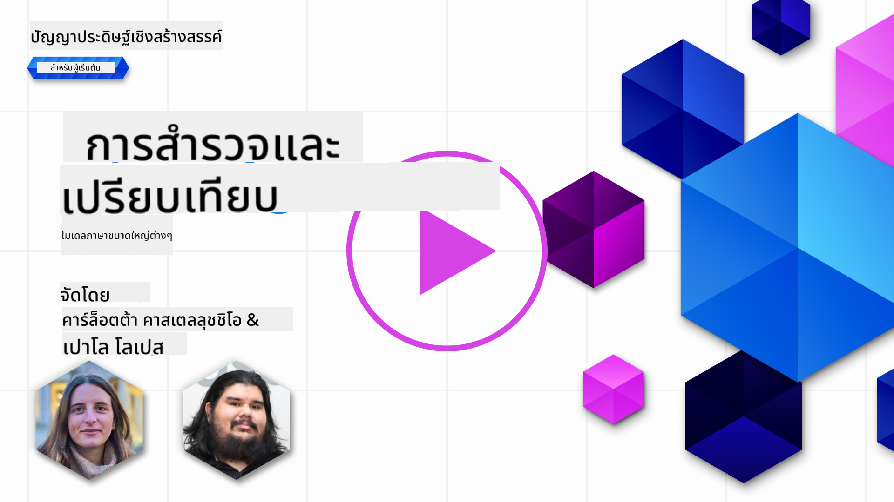
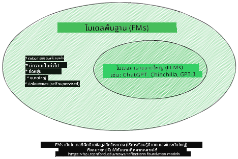
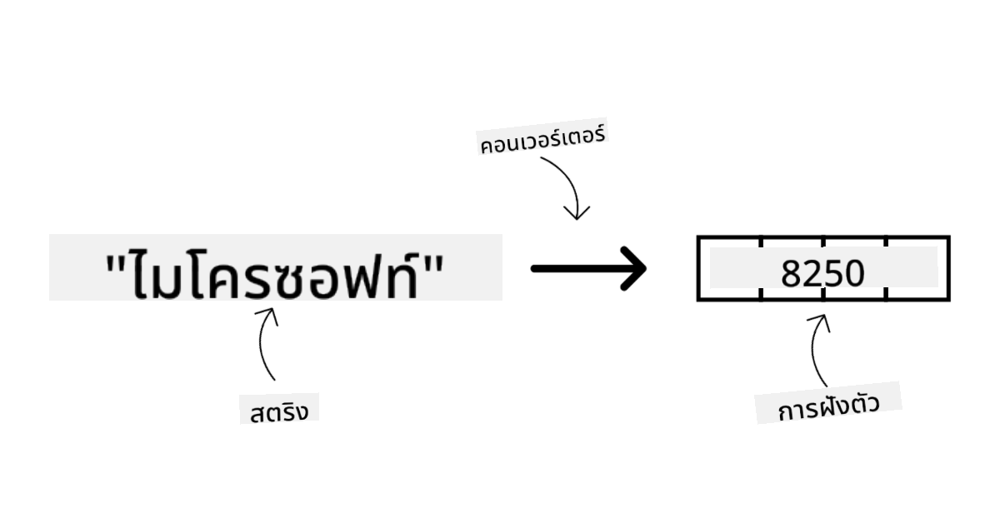
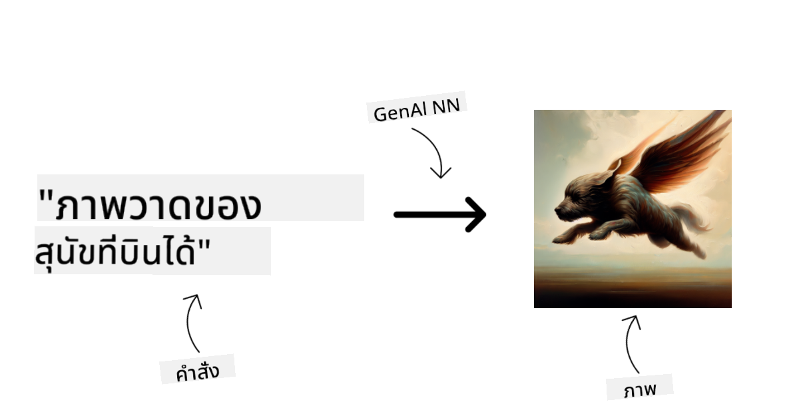
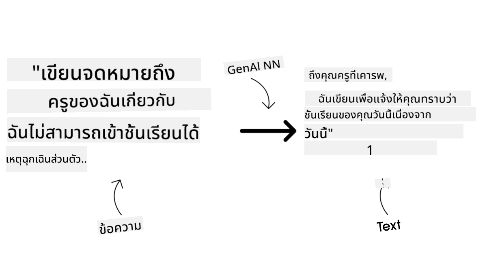
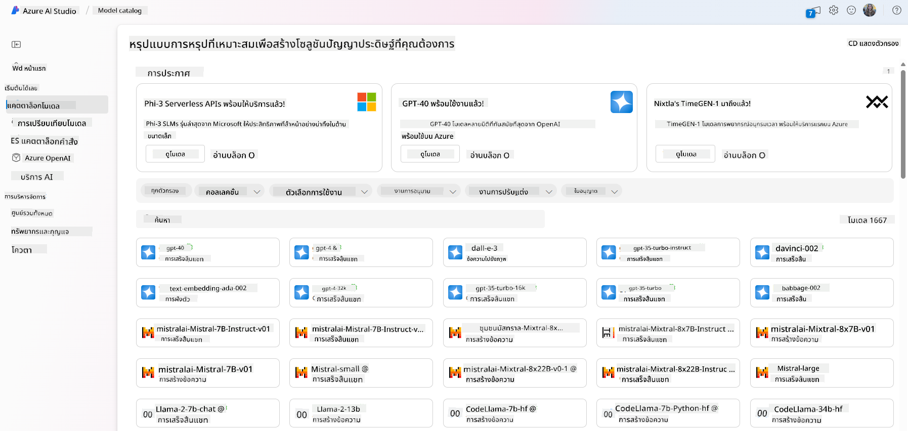
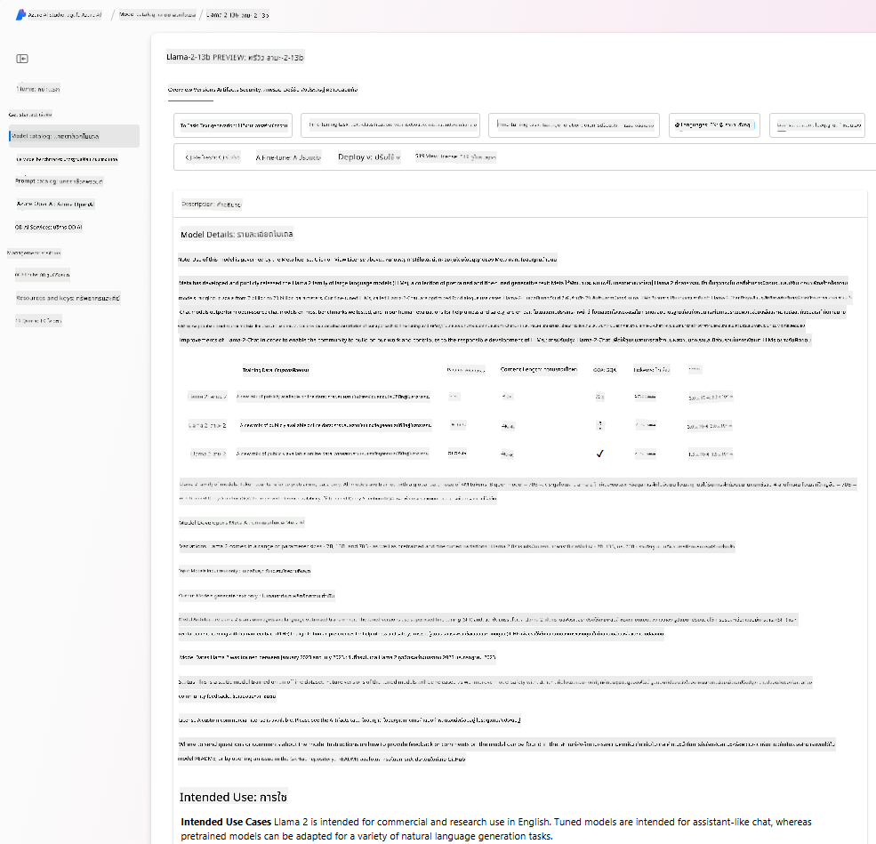
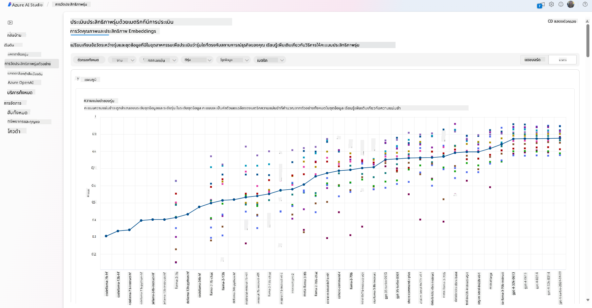
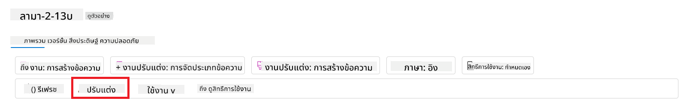
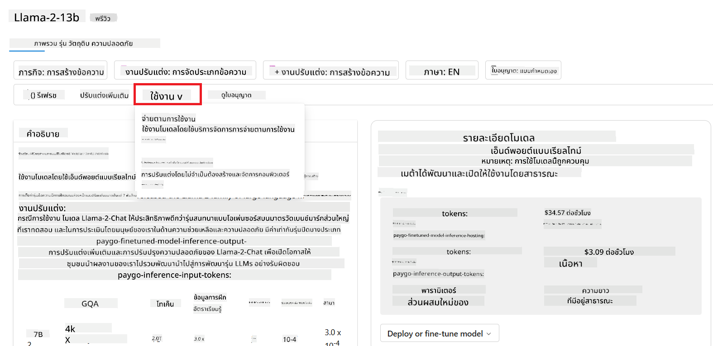

<!--
CO_OP_TRANSLATOR_METADATA:
{
  "original_hash": "e2f686f2eb794941761252ac5e8e090b",
  "translation_date": "2025-07-09T08:27:20+00:00",
  "source_file": "02-exploring-and-comparing-different-llms/README.md",
  "language_code": "th"
}
-->
# การสำรวจและเปรียบเทียบ LLMs ต่างๆ

> _คลิกที่ภาพด้านบนเพื่อดูวิดีโอของบทเรียนนี้_

จากบทเรียนก่อนหน้า เราได้เห็นว่า Generative AI กำลังเปลี่ยนแปลงภูมิทัศน์ทางเทคโนโลยีอย่างไร, LLMs ทำงานอย่างไร และธุรกิจอย่างสตาร์ทอัพของเราจะนำไปใช้กับกรณีใช้งานและเติบโตได้อย่างไร! ในบทนี้ เราจะเปรียบเทียบและวิเคราะห์ข้อดีข้อเสียของโมเดลภาษาใหญ่ (LLMs) ประเภทต่างๆ

ขั้นตอนถัดไปในเส้นทางของสตาร์ทอัพของเราคือการสำรวจภูมิทัศน์ปัจจุบันของ LLMs และทำความเข้าใจว่าโมเดลใดเหมาะสมกับกรณีใช้งานของเรา

## บทนำ

บทเรียนนี้จะครอบคลุม:

- ประเภทต่างๆ ของ LLMs ในภูมิทัศน์ปัจจุบัน
- การทดสอบ, การปรับปรุง และการเปรียบเทียบโมเดลต่างๆ สำหรับกรณีใช้งานของคุณใน Azure
- วิธีการนำ LLM ไปใช้งาน

## เป้าหมายการเรียนรู้

หลังจากเรียนบทนี้จบ คุณจะสามารถ:

- เลือกโมเดลที่เหมาะสมกับกรณีใช้งานของคุณ
- เข้าใจวิธีการทดสอบ, ปรับปรุง และเพิ่มประสิทธิภาพของโมเดล
- รู้วิธีที่ธุรกิจนำโมเดลไปใช้งาน

## ทำความเข้าใจประเภทต่างๆ ของ LLMs

LLMs สามารถแบ่งประเภทได้หลายแบบตามสถาปัตยกรรม, ข้อมูลที่ใช้ฝึก และกรณีใช้งาน การเข้าใจความแตกต่างเหล่านี้จะช่วยให้สตาร์ทอัพของเราเลือกโมเดลที่เหมาะสมกับสถานการณ์ และเข้าใจวิธีทดสอบ, ปรับปรุง และเพิ่มประสิทธิภาพ

มีโมเดล LLMs หลายประเภท การเลือกโมเดลขึ้นอยู่กับวัตถุประสงค์การใช้งาน, ข้อมูลของคุณ, งบประมาณ และปัจจัยอื่นๆ

ขึ้นอยู่กับว่าคุณต้องการใช้โมเดลสำหรับข้อความ, เสียง, วิดีโอ, การสร้างภาพ หรืออื่นๆ คุณอาจเลือกโมเดลที่แตกต่างกัน

- **การรู้จำเสียงและคำพูด** สำหรับวัตถุประสงค์นี้ โมเดลประเภท Whisper เป็นตัวเลือกที่ดีเพราะเป็นโมเดลทั่วไปที่เน้นการรู้จำคำพูด ฝึกด้วยข้อมูลเสียงหลากหลายและสามารถรู้จำคำพูดหลายภาษาได้ เรียนรู้เพิ่มเติมเกี่ยวกับ [โมเดลประเภท Whisper ที่นี่](https://platform.openai.com/docs/models/whisper?WT.mc_id=academic-105485-koreyst)

- **การสร้างภาพ** สำหรับการสร้างภาพ DALL-E และ Midjourney เป็นตัวเลือกที่รู้จักกันดี DALL-E ให้บริการโดย Azure OpenAI [อ่านเพิ่มเติมเกี่ยวกับ DALL-E ที่นี่](https://platform.openai.com/docs/models/dall-e?WT.mc_id=academic-105485-koreyst) และในบทที่ 9 ของหลักสูตรนี้

- **การสร้างข้อความ** โมเดลส่วนใหญ่ถูกฝึกเพื่อสร้างข้อความ และคุณมีตัวเลือกมากมายตั้งแต่ GPT-3.5 ถึง GPT-4 ซึ่งมีค่าใช้จ่ายต่างกัน โดย GPT-4 เป็นรุ่นที่แพงที่สุด ควรลองใช้ [Azure OpenAI playground](https://oai.azure.com/portal/playground?WT.mc_id=academic-105485-koreyst) เพื่อประเมินว่าโมเดลใดเหมาะกับความต้องการของคุณทั้งในด้านความสามารถและค่าใช้จ่าย

- **มัลติ-โมดัล** หากคุณต้องการจัดการข้อมูลหลายประเภททั้งอินพุตและเอาต์พุต คุณอาจสนใจโมเดลอย่าง [gpt-4 turbo with vision หรือ gpt-4o](https://learn.microsoft.com/azure/ai-services/openai/concepts/models#gpt-4-and-gpt-4-turbo-models?WT.mc_id=academic-105485-koreyst) ซึ่งเป็นโมเดลล่าสุดของ OpenAI ที่สามารถผสมผสานการประมวลผลภาษาธรรมชาติกับการเข้าใจภาพ ช่วยให้โต้ตอบผ่านอินเทอร์เฟซมัลติ-โมดัลได้

การเลือกโมเดลหมายถึงคุณจะได้ความสามารถพื้นฐานบางอย่าง ซึ่งอาจยังไม่เพียงพอเสมอไป บ่อยครั้งคุณมีข้อมูลเฉพาะของบริษัทที่ต้องการบอกกับ LLM มีหลายวิธีในการจัดการเรื่องนี้ ซึ่งจะกล่าวถึงในส่วนถัดไป

### Foundation Models กับ LLMs

คำว่า Foundation Model ถูก [ตั้งขึ้นโดยนักวิจัยจาก Stanford](https://arxiv.org/abs/2108.07258?WT.mc_id=academic-105485-koreyst) และนิยามว่าเป็นโมเดล AI ที่มีคุณสมบัติดังนี้:

- **ฝึกด้วยการเรียนรู้แบบไม่มีผู้สอนหรือการเรียนรู้ด้วยตนเอง** หมายความว่าโมเดลถูกฝึกด้วยข้อมูลมัลติ-โมดัลที่ไม่มีป้ายกำกับ และไม่ต้องการการติดป้ายหรือการระบุข้อมูลโดยมนุษย์ในกระบวนการฝึก
- **เป็นโมเดลขนาดใหญ่** โดยใช้โครงข่ายประสาทเทียมลึกที่มีพารามิเตอร์นับพันล้านตัว
- **โดยปกติใช้เป็น ‘ฐาน’ สำหรับโมเดลอื่นๆ** หมายความว่าสามารถใช้เป็นจุดเริ่มต้นสำหรับการสร้างโมเดลอื่นๆ โดยการปรับแต่งเพิ่มเติม

ที่มาของภาพ: [Essential Guide to Foundation Models and Large Language Models | โดย Babar M Bhatti | Medium](https://thebabar.medium.com/essential-guide-to-foundation-models-and-large-language-models-27dab58f7404)

เพื่อให้เข้าใจความแตกต่างนี้ชัดเจนขึ้น ลองดูตัวอย่าง ChatGPT ในการสร้างเวอร์ชันแรกของ ChatGPT โมเดลที่ชื่อ GPT-3.5 ถูกใช้เป็น Foundation Model ซึ่งหมายความว่า OpenAI ใช้ข้อมูลเฉพาะสำหรับแชทเพื่อสร้างเวอร์ชันที่ปรับแต่งของ GPT-3.5 ที่เชี่ยวชาญในการทำงานในสถานการณ์สนทนา เช่น แชทบอท

ที่มาของภาพ: [2108.07258.pdf (arxiv.org)](https://arxiv.org/pdf/2108.07258.pdf?WT.mc_id=academic-105485-koreyst)

### โมเดลโอเพนซอร์สกับโมเดลลิขสิทธิ์

อีกวิธีหนึ่งในการแบ่งประเภท LLMs คือแบ่งตามว่าเป็นโอเพนซอร์สหรือโมเดลลิขสิทธิ์

โมเดลโอเพนซอร์สคือโมเดลที่เปิดให้สาธารณชนใช้งานได้และใครก็ใช้ได้ มักถูกเผยแพร่โดยบริษัทผู้สร้างหรือชุมชนนักวิจัย โมเดลเหล่านี้สามารถตรวจสอบ, ปรับแต่ง และใช้งานในกรณีต่างๆ ได้ แต่ไม่เสมอไปที่จะเหมาะกับการใช้งานในระดับผลิต และอาจมีประสิทธิภาพต่ำกว่าโมเดลลิขสิทธิ์ นอกจากนี้ งบประมาณสำหรับโมเดลโอเพนซอร์สอาจจำกัด และอาจไม่ได้รับการดูแลหรืออัปเดตอย่างต่อเนื่อง ตัวอย่างโมเดลโอเพนซอร์สยอดนิยมได้แก่ [Alpaca](https://crfm.stanford.edu/2023/03/13/alpaca.html?WT.mc_id=academic-105485-koreyst), [Bloom](https://huggingface.co/bigscience/bloom) และ [LLaMA](https://llama.meta.com)

โมเดลลิขสิทธิ์คือโมเดลที่เป็นกรรมสิทธิ์ของบริษัทและไม่เปิดให้สาธารณชนใช้งาน มักถูกปรับแต่งให้เหมาะกับการใช้งานในระดับผลิต แต่ไม่อนุญาตให้ตรวจสอบ, ปรับแต่ง หรือใช้งานในกรณีต่างๆ ได้อย่างอิสระ นอกจากนี้ โมเดลเหล่านี้มักไม่ฟรี และอาจต้องสมัครสมาชิกหรือจ่ายเงินเพื่อใช้งาน ผู้ใช้จึงต้องไว้วางใจเจ้าของโมเดลในเรื่องความเป็นส่วนตัวของข้อมูลและการใช้ AI อย่างรับผิดชอบ ตัวอย่างโมเดลลิขสิทธิ์ยอดนิยมได้แก่ [OpenAI models](https://platform.openai.com/docs/models/overview?WT.mc_id=academic-105485-koreyst), [Google Bard](https://sapling.ai/llm/bard?WT.mc_id=academic-105485-koreyst) และ [Claude 2](https://www.anthropic.com/index/claude-2?WT.mc_id=academic-105485-koreyst)

### Embedding กับ การสร้างภาพ กับ การสร้างข้อความและโค้ด

LLMs ยังสามารถแบ่งตามประเภทของผลลัพธ์ที่สร้างได้

Embedding คือโมเดลที่แปลงข้อความเป็นรูปแบบตัวเลขที่เรียกว่า embedding ซึ่งเป็นตัวแทนเชิงตัวเลขของข้อความอินพุต Embedding ช่วยให้เครื่องเข้าใจความสัมพันธ์ระหว่างคำหรือประโยคได้ง่ายขึ้น และสามารถนำไปใช้เป็นอินพุตให้โมเดลอื่นๆ เช่น โมเดลจัดประเภท หรือโมเดลจัดกลุ่มที่ทำงานได้ดีขึ้นกับข้อมูลเชิงตัวเลข โมเดล embedding มักใช้ในงาน transfer learning ที่สร้างโมเดลสำหรับงานแทนที่มีข้อมูลมาก จากนั้นนำ embedding ที่ได้ไปใช้กับงานอื่น ตัวอย่างเช่น [OpenAI embeddings](https://platform.openai.com/docs/models/embeddings?WT.mc_id=academic-105485-koreyst)

โมเดลสร้างภาพคือโมเดลที่สร้างภาพ มักใช้สำหรับแก้ไขภาพ, สังเคราะห์ภาพ และแปลงภาพ โมเดลเหล่านี้มักถูกฝึกด้วยชุดข้อมูลภาพขนาดใหญ่ เช่น [LAION-5B](https://laion.ai/blog/laion-5b/?WT.mc_id=academic-105485-koreyst) และสามารถสร้างภาพใหม่หรือแก้ไขภาพที่มีอยู่ด้วยเทคนิค inpainting, super-resolution และ colorization ตัวอย่างเช่น [DALL-E-3](https://openai.com/dall-e-3?WT.mc_id=academic-105485-koreyst) และ [Stable Diffusion models](https://github.com/Stability-AI/StableDiffusion?WT.mc_id=academic-105485-koreyst)

โมเดลสร้างข้อความและโค้ดคือโมเดลที่สร้างข้อความหรือโค้ด มักใช้สำหรับสรุปข้อความ, แปลภาษา และตอบคำถาม โมเดลสร้างข้อความมักถูกฝึกด้วยชุดข้อมูลข้อความขนาดใหญ่ เช่น [BookCorpus](https://www.cv-foundation.org/openaccess/content_iccv_2015/html/Zhu_Aligning_Books_and_ICCV_2015_paper.html?WT.mc_id=academic-105485-koreyst) และสามารถสร้างข้อความใหม่หรือตอบคำถามได้ โมเดลสร้างโค้ด เช่น [CodeParrot](https://huggingface.co/codeparrot?WT.mc_id=academic-105485-koreyst) มักถูกฝึกด้วยชุดข้อมูลโค้ดขนาดใหญ่ เช่น GitHub และสามารถสร้างโค้ดใหม่หรือแก้ไขบั๊กในโค้ดที่มีอยู่ได้

### Encoder-Decoder กับ Decoder-only

เพื่อพูดถึงสถาปัตยกรรมต่างๆ ของ LLMs ลองใช้การเปรียบเทียบนี้

สมมติว่าผู้จัดการของคุณมอบหมายงานให้เขียนแบบทดสอบสำหรับนักเรียน คุณมีเพื่อนร่วมงานสองคน คนหนึ่งดูแลการสร้างเนื้อหา อีกคนดูแลการตรวจทาน

ผู้สร้างเนื้อหาเหมือนกับโมเดล Decoder-only พวกเขาสามารถดูหัวข้อและสิ่งที่คุณเขียนไว้แล้ว จากนั้นเขียนเนื้อหาตามนั้นได้ พวกเขาเก่งในการเขียนเนื้อหาที่น่าสนใจและให้ข้อมูล แต่ไม่เก่งในการเข้าใจหัวข้อและวัตถุประสงค์การเรียนรู้ ตัวอย่างโมเดล Decoder เช่น โมเดลในตระกูล GPT เช่น GPT-3

ผู้ตรวจทานเหมือนกับโมเดล Encoder-only พวกเขาดูเนื้อหาที่เขียนและคำตอบ สังเกตความสัมพันธ์และเข้าใจบริบท แต่ไม่เก่งในการสร้างเนื้อหา ตัวอย่างโมเดล Encoder-only เช่น BERT

ลองนึกภาพว่ามีคนที่สามารถสร้างและตรวจทานแบบทดสอบได้ นี่คือโมเดล Encoder-Decoder ตัวอย่างเช่น BART และ T5

### บริการกับโมเดล

ตอนนี้มาพูดถึงความแตกต่างระหว่างบริการกับโมเดล บริการคือผลิตภัณฑ์ที่ให้โดยผู้ให้บริการคลาวด์ มักเป็นการรวมกันของโมเดล, ข้อมูล และส่วนประกอบอื่นๆ โมเดลคือส่วนประกอบหลักของบริการ มักเป็น Foundation Model เช่น LLM

บริการมักถูกปรับแต่งให้เหมาะกับการใช้งานในระดับผลิต และใช้งานง่ายกว่าผ่านอินเทอร์เฟซกราฟิก อย่างไรก็ตาม บริการไม่ใช่ของฟรีเสมอไป และอาจต้องสมัครสมาชิกหรือจ่ายเงินเพื่อใช้งาน แลกกับการใช้ทรัพยากรและอุปกรณ์ของเจ้าของบริการ ช่วยประหยัดค่าใช้จ่ายและขยายระบบได้ง่าย ตัวอย่างบริการคือ [Azure OpenAI Service](https://learn.microsoft.com/azure/ai-services/openai/overview?WT.mc_id=academic-105485-koreyst) ที่มีแผนจ่ายตามการใช้งานจริง และยังมีความปลอดภัยระดับองค์กรและกรอบการใช้ AI อย่างรับผิดชอบบนพื้นฐานความสามารถของโมเดล

โมเดลคือโครงข่ายประสาทเทียมที่มีพารามิเตอร์และน้ำหนักต่างๆ อนุญาตให้บริษัทรันโมเดลได้ในเครื่องของตัวเอง แต่ต้องซื้ออุปกรณ์ สร้างโครงสร้างสำหรับขยายระบบ และซื้อไลเซนส์หรือใช้โมเดลโอเพนซอร์ส โมเดลอย่าง LLaMA สามารถใช้งานได้ แต่ต้องใช้พลังประมวลผลในการรันโมเดล

## วิธีทดสอบและปรับปรุงโมเดลต่างๆ เพื่อเข้าใจประสิทธิภาพบน Azure

เมื่อทีมของเราได้สำรวจภูมิทัศน์ LLMs ปัจจุบันและเลือกโมเดลที่เหมาะสมกับสถานการณ์แล้ว ขั้นตอนถัดไปคือการทดสอบโมเดลเหล่านั้นกับข้อมูลและภาระงานของเรา นี่เป็นกระบวนการทำซ้ำที่ทำผ่านการทดลองและวัดผล
โมเดลส่วนใหญ่ที่เราได้กล่าวถึงในย่อหน้าก่อนหน้า (โมเดล OpenAI, โมเดลโอเพนซอร์สอย่าง Llama2 และ Hugging Face transformers) สามารถหาได้ใน [Model Catalog](https://learn.microsoft.com/azure/ai-studio/how-to/model-catalog-overview?WT.mc_id=academic-105485-koreyst) ใน [Azure AI Studio](https://ai.azure.com/?WT.mc_id=academic-105485-koreyst)

[Azure AI Studio](https://learn.microsoft.com/azure/ai-studio/what-is-ai-studio?WT.mc_id=academic-105485-koreyst) คือแพลตฟอร์มคลาวด์ที่ออกแบบมาเพื่อให้นักพัฒนาสามารถสร้างแอปพลิเคชัน AI เชิงสร้างสรรค์และจัดการวงจรการพัฒนาทั้งหมด ตั้งแต่การทดลองจนถึงการประเมินผล โดยรวมบริการ Azure AI ทั้งหมดไว้ในที่เดียวพร้อมอินเทอร์เฟซที่ใช้งานง่าย Model Catalog ใน Azure AI Studio ช่วยให้ผู้ใช้สามารถ:

- ค้นหา Foundation Model ที่สนใจในแคตตาล็อก ไม่ว่าจะเป็นโมเดลที่เป็นกรรมสิทธิ์หรือโอเพนซอร์ส โดยกรองตามงาน ใบอนุญาต หรือชื่อ เพื่อเพิ่มความสะดวกในการค้นหา โมเดลจะถูกจัดกลุ่มเป็นคอลเลกชัน เช่น คอลเลกชัน Azure OpenAI, คอลเลกชัน Hugging Face และอื่นๆ

- ตรวจสอบ model card ซึ่งรวมถึงคำอธิบายรายละเอียดเกี่ยวกับการใช้งานที่ตั้งใจไว้และข้อมูลการฝึกอบรม ตัวอย่างโค้ด และผลการประเมินจากไลบรารีการประเมินภายใน

- เปรียบเทียบเกณฑ์มาตรฐานระหว่างโมเดลและชุดข้อมูลที่มีในอุตสาหกรรมเพื่อประเมินว่าโมเดลใดเหมาะสมกับสถานการณ์ทางธุรกิจ ผ่านแผง [Model Benchmarks](https://learn.microsoft.com/azure/ai-studio/how-to/model-benchmarks?WT.mc_id=academic-105485-koreyst)

- ปรับแต่งโมเดลด้วยข้อมูลฝึกอบรมเฉพาะเพื่อเพิ่มประสิทธิภาพในงานเฉพาะ โดยใช้ความสามารถในการทดลองและติดตามของ Azure AI Studio

- นำโมเดลที่ผ่านการฝึกอบรมล่วงหน้าหรือเวอร์ชันที่ปรับแต่งแล้วไปใช้งานบนระบบเรียลไทม์ระยะไกล - managed compute - หรือ serverless api endpoint - [pay-as-you-go](https://learn.microsoft.com/azure/ai-studio/how-to/model-catalog-overview#model-deployment-managed-compute-and-serverless-api-pay-as-you-go?WT.mc_id=academic-105485-koreyst) - เพื่อให้แอปพลิเคชันสามารถเรียกใช้งานได้

> [!NOTE]
> โมเดลทั้งหมดในแคตตาล็อกไม่ได้เปิดให้ปรับแต่งหรือใช้งานแบบ pay-as-you-go ได้ในขณะนี้ โปรดตรวจสอบ model card เพื่อดูรายละเอียดเกี่ยวกับความสามารถและข้อจำกัดของโมเดล

## การปรับปรุงผลลัพธ์ของ LLM

ทีมสตาร์ทอัพของเราได้ทดลองใช้ LLM หลายประเภทและแพลตฟอร์มคลาวด์ (Azure Machine Learning) ที่ช่วยให้เราสามารถเปรียบเทียบโมเดลต่างๆ ประเมินผลบนข้อมูลทดสอบ ปรับปรุงประสิทธิภาพ และนำไปใช้งานบนจุดให้บริการ inference

แต่เมื่อไหร่ควรพิจารณาปรับแต่งโมเดลแทนการใช้โมเดลที่ผ่านการฝึกอบรมล่วงหน้า? มีวิธีอื่นในการปรับปรุงประสิทธิภาพโมเดลในงานเฉพาะหรือไม่?

ธุรกิจสามารถใช้วิธีต่างๆ เพื่อให้ได้ผลลัพธ์ที่ต้องการจาก LLM คุณสามารถเลือกใช้โมเดลประเภทต่างๆ ที่มีระดับการฝึกอบรมแตกต่างกันเมื่อใช้งาน LLM ในการผลิต โดยมีความซับซ้อน ค่าใช้จ่าย และคุณภาพที่แตกต่างกัน นี่คือวิธีการต่างๆ:

- **การออกแบบ prompt พร้อมบริบท** แนวคิดคือการให้บริบทเพียงพอเมื่อส่ง prompt เพื่อให้ได้คำตอบที่ต้องการ

- **Retrieval Augmented Generation, RAG** ข้อมูลของคุณอาจอยู่ในฐานข้อมูลหรือเว็บเอนด์พอยต์ เพื่อให้ข้อมูลนี้หรือส่วนหนึ่งของข้อมูลถูกรวมอยู่ในเวลาส่ง prompt คุณสามารถดึงข้อมูลที่เกี่ยวข้องมาและทำให้เป็นส่วนหนึ่งของ prompt ของผู้ใช้

- **โมเดลที่ผ่านการปรับแต่ง** ในกรณีนี้ คุณได้ฝึกโมเดลเพิ่มเติมด้วยข้อมูลของคุณเอง ทำให้โมเดลมีความแม่นยำและตอบสนองความต้องการได้ดีขึ้น แต่ก็อาจมีค่าใช้จ่ายสูง

ที่มาภาพ: [Four Ways that Enterprises Deploy LLMs | Fiddler AI Blog](https://www.fiddler.ai/blog/four-ways-that-enterprises-deploy-llms?WT.mc_id=academic-105485-koreyst)

### การออกแบบ Prompt พร้อมบริบท

LLM ที่ผ่านการฝึกอบรมล่วงหน้าทำงานได้ดีมากกับงานภาษาธรรมชาติทั่วไป แม้เพียงแค่ส่ง prompt สั้นๆ เช่น ประโยคที่ต้องการเติมหรือคำถาม – เรียกว่า “zero-shot” learning

อย่างไรก็ตาม ยิ่งผู้ใช้สามารถกำหนดคำถามได้ละเอียดมากขึ้น พร้อมคำขอและตัวอย่าง – หรือที่เรียกว่า บริบท – คำตอบก็จะยิ่งแม่นยำและตรงกับความคาดหวังของผู้ใช้มากขึ้น ในกรณีนี้ เราเรียกว่า “one-shot” learning หาก prompt มีตัวอย่างเพียงหนึ่งตัวอย่าง และ “few-shot learning” หากมีหลายตัวอย่าง
การออกแบบ prompt พร้อมบริบทเป็นวิธีที่คุ้มค่าที่สุดในการเริ่มต้น

### Retrieval Augmented Generation (RAG)

LLM มีข้อจำกัดที่สามารถใช้ข้อมูลได้เฉพาะที่ใช้ในการฝึกอบรมเท่านั้นในการสร้างคำตอบ ซึ่งหมายความว่าโมเดลไม่ทราบข้อมูลหรือเหตุการณ์ที่เกิดขึ้นหลังจากการฝึกอบรม และไม่สามารถเข้าถึงข้อมูลที่ไม่เปิดเผยสู่สาธารณะ (เช่น ข้อมูลบริษัท)
ข้อจำกัดนี้สามารถแก้ไขได้ด้วย RAG ซึ่งเป็นเทคนิคที่เพิ่มข้อมูลภายนอกในรูปแบบของชิ้นส่วนเอกสารเข้าไปใน prompt โดยคำนึงถึงข้อจำกัดความยาวของ prompt เทคนิคนี้ได้รับการสนับสนุนโดยเครื่องมือฐานข้อมูลเวกเตอร์ (เช่น [Azure Vector Search](https://learn.microsoft.com/azure/search/vector-search-overview?WT.mc_id=academic-105485-koreyst)) ที่ดึงชิ้นส่วนข้อมูลที่เป็นประโยชน์จากแหล่งข้อมูลที่กำหนดไว้ล่วงหน้าและเพิ่มเข้าไปในบริบทของ prompt

เทคนิคนี้มีประโยชน์มากเมื่อธุรกิจไม่มีข้อมูลเพียงพอ เวลา หรือทรัพยากรในการปรับแต่ง LLM แต่ยังต้องการปรับปรุงประสิทธิภาพในงานเฉพาะและลดความเสี่ยงจากข้อมูลเท็จ เช่น การบิดเบือนความจริงหรือเนื้อหาที่เป็นอันตราย

### โมเดลที่ผ่านการปรับแต่ง

การปรับแต่ง (fine-tuning) เป็นกระบวนการที่ใช้การเรียนรู้ถ่ายโอน (transfer learning) เพื่อ ‘ปรับ’ โมเดลให้เหมาะกับงานเฉพาะหรือแก้ปัญหาเฉพาะ แตกต่างจาก few-shot learning และ RAG ที่จะได้โมเดลใหม่ที่มีน้ำหนักและไบแอสที่อัปเดต ต้องใช้ชุดตัวอย่างฝึกอบรมที่ประกอบด้วยอินพุตเดียว (prompt) และผลลัพธ์ที่เกี่ยวข้อง (completion)
วิธีนี้เหมาะสมหาก:

- **ใช้โมเดลที่ผ่านการปรับแต่ง** ธุรกิจต้องการใช้โมเดลที่ผ่านการปรับแต่งที่มีความสามารถน้อยกว่า (เช่น โมเดล embedding) แทนโมเดลประสิทธิภาพสูง เพื่อให้ได้ทางเลือกที่ประหยัดและรวดเร็วกว่า

- **พิจารณาความหน่วงเวลา (latency)** ความหน่วงเวลามีความสำคัญสำหรับกรณีใช้งานเฉพาะ จึงไม่สามารถใช้ prompt ที่ยาวมาก หรือจำนวนตัวอย่างที่โมเดลต้องเรียนรู้เกินขีดจำกัดความยาวของ prompt

- **ต้องการข้อมูลที่ทันสมัย** ธุรกิจมีข้อมูลคุณภาพสูงและป้ายกำกับความจริง (ground truth) จำนวนมาก รวมถึงทรัพยากรที่จำเป็นในการดูแลข้อมูลให้ทันสมัยอยู่เสมอ

### โมเดลที่ฝึกอบรมเอง

การฝึก LLM ตั้งแต่ต้นเป็นวิธีที่ยากและซับซ้อนที่สุด ต้องใช้ข้อมูลจำนวนมหาศาล ทรัพยากรที่มีทักษะ และกำลังประมวลผลที่เหมาะสม ตัวเลือกนี้ควรพิจารณาเฉพาะในกรณีที่ธุรกิจมีกรณีใช้งานเฉพาะด้านและข้อมูลเฉพาะด้านจำนวนมาก

## ตรวจสอบความรู้

วิธีใดเป็นวิธีที่ดีในการปรับปรุงผลลัพธ์ของ LLM completion?

1. การออกแบบ prompt พร้อมบริบท  
2. RAG  
3. โมเดลที่ผ่านการปรับแต่ง  

ตอบ: 3 หากคุณมีเวลา ทรัพยากร และข้อมูลคุณภาพสูง การปรับแต่งเป็นตัวเลือกที่ดีกว่าเพื่อให้ข้อมูลทันสมัย อย่างไรก็ตาม หากต้องการปรับปรุงและมีเวลาจำกัด ควรพิจารณาใช้ RAG ก่อน

## 🚀 ความท้าทาย

ศึกษาข้อมูลเพิ่มเติมเกี่ยวกับวิธีการ [ใช้ RAG](https://learn.microsoft.com/azure/search/retrieval-augmented-generation-overview?WT.mc_id=academic-105485-koreyst) สำหรับธุรกิจของคุณ

## ทำได้ดีมาก ต่อเนื่องกับการเรียนรู้ของคุณ

หลังจากเรียนบทนี้เสร็จแล้ว ลองดู [คอลเลกชันการเรียนรู้ Generative AI](https://aka.ms/genai-collection?WT.mc_id=academic-105485-koreyst) เพื่อพัฒนาความรู้ด้าน Generative AI ของคุณต่อไป!

ไปที่บทเรียนที่ 3 ซึ่งเราจะเรียนรู้วิธี [สร้างด้วย Generative AI อย่างรับผิดชอบ](../03-using-generative-ai-responsibly/README.md?WT.mc_id=academic-105485-koreyst)!

**ข้อจำกัดความรับผิดชอบ**:  
เอกสารนี้ได้รับการแปลโดยใช้บริการแปลภาษาอัตโนมัติ [Co-op Translator](https://github.com/Azure/co-op-translator) แม้เราจะพยายามให้ความถูกต้องสูงสุด แต่โปรดทราบว่าการแปลอัตโนมัติอาจมีข้อผิดพลาดหรือความไม่ถูกต้อง เอกสารต้นฉบับในภาษาต้นทางถือเป็นแหล่งข้อมูลที่เชื่อถือได้ สำหรับข้อมูลที่สำคัญ ขอแนะนำให้ใช้บริการแปลโดยผู้เชี่ยวชาญมนุษย์ เราไม่รับผิดชอบต่อความเข้าใจผิดหรือการตีความผิดใด ๆ ที่เกิดจากการใช้การแปลนี้