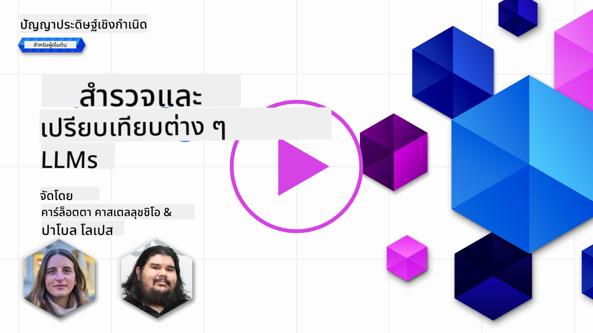
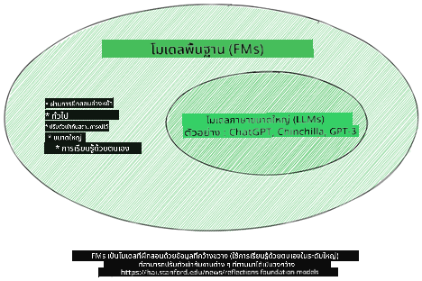
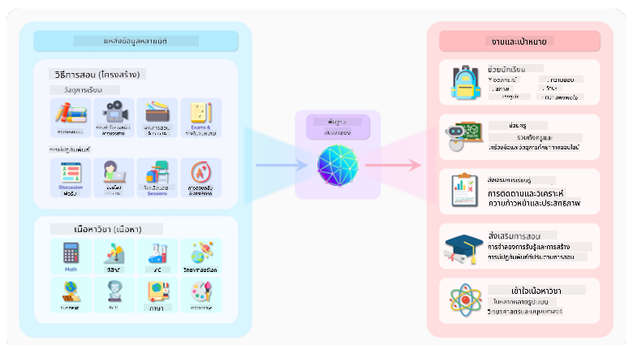
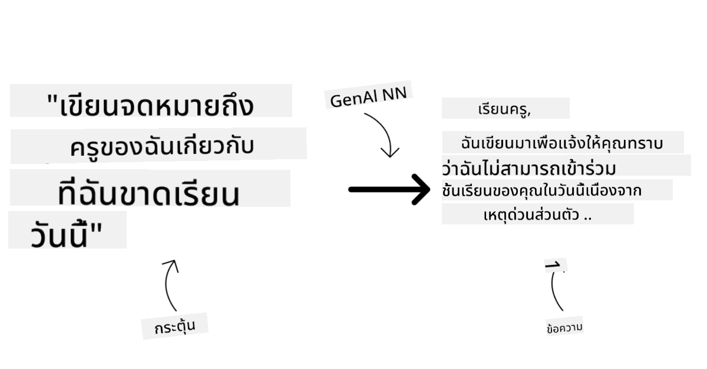
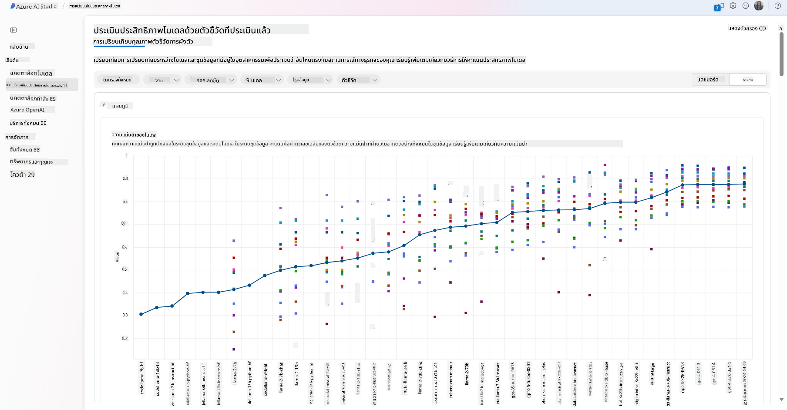
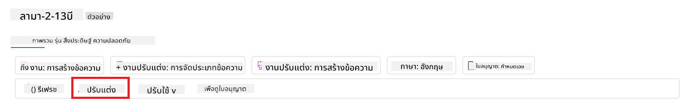
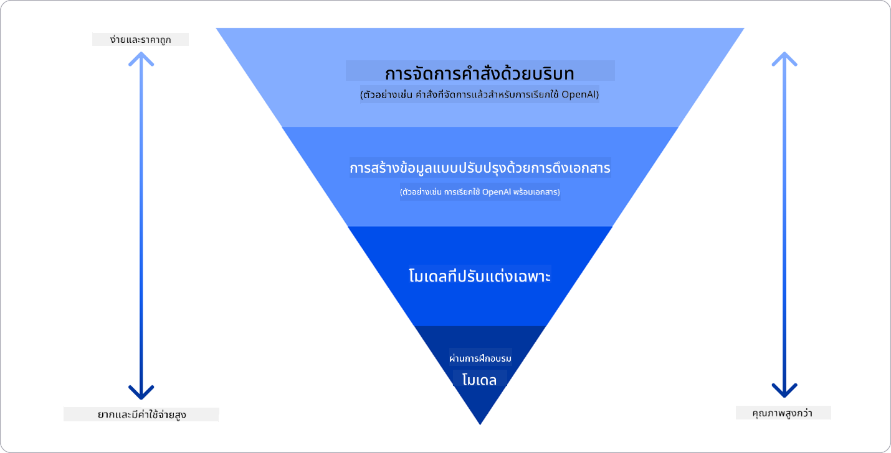

<!--
CO_OP_TRANSLATOR_METADATA:
{
  "original_hash": "e2f686f2eb794941761252ac5e8e090b",
  "translation_date": "2025-05-19T14:03:00+00:00",
  "source_file": "02-exploring-and-comparing-different-llms/README.md",
  "language_code": "th"
}
-->
# การสำรวจและเปรียบเทียบ LLMs ต่าง ๆ

> _คลิกที่ภาพด้านบนเพื่อดูวิดีโอของบทเรียนนี้_

ในบทเรียนก่อนหน้า เราได้เห็นแล้วว่า Generative AI กำลังเปลี่ยนแปลงวงการเทคโนโลยีอย่างไร, LLMs ทำงานอย่างไร และธุรกิจ เช่น สตาร์ทอัพของเรา สามารถนำไปใช้ในกรณีการใช้งานและเติบโตได้อย่างไร! ในบทนี้ เราจะมาเปรียบเทียบ LLMs ประเภทต่าง ๆ เพื่อเข้าใจข้อดีและข้อเสียของพวกมัน

ขั้นตอนต่อไปในการเดินทางของสตาร์ทอัพของเราคือการสำรวจสถานการณ์ปัจจุบันของ LLMs และทำความเข้าใจว่าแบบไหนเหมาะสมกับกรณีการใช้งานของเรา

## บทนำ

บทเรียนนี้จะครอบคลุม:

- ประเภทต่าง ๆ ของ LLMs ในสถานการณ์ปัจจุบัน
- การทดสอบ, การปรับปรุง, และการเปรียบเทียบโมเดลต่าง ๆ สำหรับกรณีการใช้งานของคุณใน Azure
- วิธีการปรับใช้ LLM

## เป้าหมายการเรียนรู้

หลังจากจบบทเรียนนี้ คุณจะสามารถ:

- เลือกโมเดลที่เหมาะสมสำหรับกรณีการใช้งานของคุณ
- เข้าใจวิธีการทดสอบ, ปรับปรุง, และพัฒนาประสิทธิภาพของโมเดลของคุณ
- รู้วิธีที่ธุรกิจปรับใช้โมเดล

## ทำความเข้าใจประเภทต่าง ๆ ของ LLMs

LLMs สามารถถูกจัดประเภทได้หลายแบบตามสถาปัตยกรรม, ข้อมูลการฝึก, และกรณีการใช้งาน การเข้าใจความแตกต่างเหล่านี้จะช่วยให้สตาร์ทอัพของเราเลือกโมเดลที่เหมาะสมสำหรับสถานการณ์ และเข้าใจวิธีการทดสอบ, ปรับปรุง, และพัฒนาประสิทธิภาพ

มีหลายประเภทของ LLMs ให้เลือก, การเลือกโมเดลขึ้นอยู่กับเป้าหมายการใช้งานของคุณ, ข้อมูลของคุณ, งบประมาณที่คุณพร้อมจ่าย และอื่น ๆ

ขึ้นอยู่กับว่าคุณต้องการใช้โมเดลสำหรับการสร้างข้อความ, เสียง, วิดีโอ, ภาพ หรืออื่น ๆ คุณอาจเลือกใช้โมเดลประเภทต่าง ๆ

- **การรู้จำเสียงและการพูด** สำหรับจุดประสงค์นี้ โมเดลประเภท Whisper เป็นตัวเลือกที่ดีเนื่องจากเป็นโมเดลทั่วไปที่มุ่งเน้นการรู้จำเสียง มันถูกฝึกบนข้อมูลเสียงที่หลากหลายและสามารถทำการรู้จำเสียงหลายภาษาได้ เรียนรู้เพิ่มเติมเกี่ยวกับ [Whisper type models ที่นี่](https://platform.openai.com/docs/models/whisper?WT.mc_id=academic-105485-koreyst)

- **การสร้างภาพ** สำหรับการสร้างภาพ, DALL-E และ Midjourney เป็นสองตัวเลือกที่เป็นที่รู้จักดี DALL-E มีให้บริการโดย Azure OpenAI [อ่านเพิ่มเติมเกี่ยวกับ DALL-E ที่นี่](https://platform.openai.com/docs/models/dall-e?WT.mc_id=academic-105485-koreyst) และในบทที่ 9 ของหลักสูตรนี้

- **การสร้างข้อความ** โมเดลส่วนใหญ่ถูกฝึกเพื่อการสร้างข้อความและมีตัวเลือกหลากหลายตั้งแต่ GPT-3.5 ถึง GPT-4 พวกมันมีค่าใช้จ่ายที่แตกต่างกัน โดย GPT-4 เป็นตัวที่แพงที่สุด ควรลองเข้าไปดูที่ [Azure OpenAI playground](https://oai.azure.com/portal/playground?WT.mc_id=academic-105485-koreyst) เพื่อประเมินว่าโมเดลไหนเหมาะสมกับความต้องการของคุณในแง่ของความสามารถและค่าใช้จ่าย

- **มัลติโมดาลิตี้** หากคุณต้องการจัดการกับข้อมูลหลายประเภทในอินพุตและเอาต์พุต คุณอาจต้องการดูโมเดลอย่าง [gpt-4 turbo with vision หรือ gpt-4o](https://learn.microsoft.com/azure/ai-services/openai/concepts/models#gpt-4-and-gpt-4-turbo-models?WT.mc_id=academic-105485-koreyst) - การเปิดตัวล่าสุดของโมเดล OpenAI - ซึ่งสามารถรวมการประมวลผลภาษาธรรมชาติกับความเข้าใจด้านภาพ ทำให้สามารถโต้ตอบผ่านอินเทอร์เฟซหลายโมดาลได้

การเลือกโมเดลหมายถึงคุณจะได้ความสามารถพื้นฐานบางอย่าง แต่ก็อาจจะไม่เพียงพอ คุณอาจมีข้อมูลเฉพาะของบริษัทที่คุณต้องบอก LLM มีวิธีการต่าง ๆ ที่จะเข้าถึงเรื่องนี้ จะมีการอธิบายเพิ่มเติมในส่วนถัดไป

### โมเดลพื้นฐานเทียบกับ LLMs

คำว่า โมเดลพื้นฐาน ถูก [บัญญัติโดยนักวิจัยจาก Stanford](https://arxiv.org/abs/2108.07258?WT.mc_id=academic-105485-koreyst) และถูกกำหนดให้เป็นโมเดล AI ที่มีเกณฑ์บางประการ เช่น:

- **พวกมันถูกฝึกด้วยการเรียนรู้แบบไม่ควบคุมหรือการเรียนรู้แบบควบคุมตนเอง** หมายความว่าพวกมันถูกฝึกบนข้อมูลหลายโมดาลที่ไม่มีการติดป้ายกำกับ และไม่ต้องการการติดป้ายกำกับหรือการระบุข้อมูลจากมนุษย์ในกระบวนการฝึก
- **พวกมันเป็นโมเดลขนาดใหญ่มาก** ใช้เครือข่ายประสาทลึกมากที่ถูกฝึกบนพารามิเตอร์นับพันล้าน
- **พวกมันมักจะถูกตั้งใจให้เป็น ‘พื้นฐาน’ สำหรับโมเดลอื่น ๆ** หมายความว่าสามารถใช้เป็นจุดเริ่มต้นสำหรับโมเดลอื่น ๆ ที่จะถูกสร้างขึ้น ซึ่งสามารถทำได้โดยการปรับแต่ง

ที่มาของภาพ: [Essential Guide to Foundation Models and Large Language Models | โดย Babar M Bhatti | Medium
](https://thebabar.medium.com/essential-guide-to-foundation-models-and-large-language-models-27dab58f7404)

เพื่อให้เข้าใจความแตกต่างนี้ชัดเจนขึ้น ลองพิจารณา ChatGPT เป็นตัวอย่าง ในการสร้าง ChatGPT เวอร์ชันแรก โมเดลที่เรียกว่า GPT-3.5 ถูกใช้เป็นโมเดลพื้นฐาน ซึ่งหมายความว่า OpenAI ใช้ข้อมูลเฉพาะสำหรับการสนทนาเพื่อสร้างเวอร์ชันที่ปรับแต่งของ GPT-3.5 ที่เชี่ยวชาญในการทำงานได้ดีในสถานการณ์การสนทนา เช่น แชทบอท

ที่มาของภาพ: [2108.07258.pdf (arxiv.org)](https://arxiv.org/pdf/2108.07258.pdf?WT.mc_id=academic-105485-koreyst)

### โมเดลโอเพ่นซอร์สเทียบกับโมเดลที่เป็นกรรมสิทธิ์

อีกวิธีหนึ่งในการจัดประเภท LLMs คือว่าเป็นโอเพ่นซอร์สหรือเป็นกรรมสิทธิ์

โมเดลโอเพ่นซอร์สคือโมเดลที่เปิดให้สาธารณะและสามารถใช้งานได้โดยทุกคน พวกมันมักจะถูกเปิดให้ใช้งานโดยบริษัทที่สร้างมัน หรือโดยชุมชนนักวิจัย โมเดลเหล่านี้สามารถตรวจสอบ, แก้ไข, และปรับแต่งได้สำหรับกรณีการใช้งานต่าง ๆ ใน LLMs อย่างไรก็ตาม พวกมันอาจไม่ถูกปรับแต่งให้เหมาะสมสำหรับการใช้งานในโปรดักชัน และอาจไม่ทำงานได้ดีเท่ากับโมเดลที่เป็นกรรมสิทธิ์ นอกจากนี้ การสนับสนุนทางการเงินสำหรับโมเดลโอเพ่นซอร์สอาจจำกัด และอาจไม่ได้รับการบำรุงรักษาระยะยาวหรืออาจไม่ได้รับการอัปเดตด้วยการวิจัยล่าสุด ตัวอย่างของโมเดลโอเพ่นซอร์สที่เป็นที่นิยมได้แก่ [Alpaca](https://crfm.stanford.edu/2023/03/13/alpaca.html?WT.mc_id=academic-105485-koreyst), [Bloom](https://huggingface.co/bigscience/bloom) และ [LLaMA](https://llama.meta.com)

โมเดลที่เป็นกรรมสิทธิ์คือโมเดลที่เป็นเจ้าของโดยบริษัทและไม่ได้เปิดให้สาธารณะ โมเดลเหล่านี้มักจะถูกปรับแต่งให้เหมาะสมสำหรับการใช้งานในโปรดักชัน อย่างไรก็ตาม พวกมันไม่สามารถตรวจสอบ, แก้ไข, หรือปรับแต่งได้สำหรับกรณีการใช้งานต่าง ๆ นอกจากนี้ พวกมันอาจไม่เปิดให้ใช้ฟรี และอาจต้องการการสมัครสมาชิกหรือการชำระเงินเพื่อใช้งาน นอกจากนี้ ผู้ใช้ไม่มีการควบคุมข้อมูลที่ใช้ในการฝึกโมเดล ซึ่งหมายความว่าพวกเขาต้องเชื่อถือเจ้าของโมเดลในการรับรองความมุ่งมั่นต่อความเป็นส่วนตัวของข้อมูลและการใช้งาน AI อย่างรับผิดชอบ ตัวอย่างของโมเดลที่เป็นกรรมสิทธิ์ที่เป็นที่นิยมได้แก่ [OpenAI models](https://platform.openai.com/docs/models/overview?WT.mc_id=academic-105485-koreyst), [Google Bard](https://sapling.ai/llm/bard?WT.mc_id=academic-105485-koreyst) หรือ [Claude 2](https://www.anthropic.com/index/claude-2?WT.mc_id=academic-105485-koreyst)

### การฝังเทียบกับการสร้างภาพเทียบกับการสร้างข้อความและโค้ด

LLMs ยังสามารถถูกจัดประเภทตามผลลัพธ์ที่พวกมันสร้างขึ้น

การฝังคือชุดของโมเดลที่สามารถแปลงข้อความเป็นรูปแบบตัวเลขที่เรียกว่าการฝัง ซึ่งเป็นการแสดงข้อมูลเชิงตัวเลขของข้อความที่ป้อน การฝังทำให้เครื่องเข้าใจความสัมพันธ์ระหว่างคำหรือประโยคได้ง่ายขึ้น และสามารถถูกใช้เป็นอินพุตโดยโมเดลอื่น ๆ เช่น โมเดลการจัดประเภท หรือโมเดลการจัดกลุ่มที่มีประสิทธิภาพดีกับข้อมูลเชิงตัวเลข โมเดลการฝังมักถูกใช้สำหรับการเรียนรู้การถ่ายโอน ซึ่งโมเดลถูกสร้างขึ้นสำหรับงานตัวแทนซึ่งมีข้อมูลมากมาย และจากนั้นน้ำหนักของโมเดล (การฝัง) จะถูกใช้ซ้ำสำหรับงานต่อเนื่องอื่น ๆ ตัวอย่างของหมวดหมู่นี้คือ [OpenAI embeddings](https://platform.openai.com/docs/models/embeddings?WT.mc_id=academic-105485-koreyst)

โมเดลการสร้างภาพคือโมเดลที่สร้างภาพ โมเดลเหล่านี้มักถูกใช้สำหรับการแก้ไขภาพ, การสังเคราะห์ภาพ, และการแปลภาพ โมเดลการสร้างภาพมักถูกฝึกบนชุดข้อมูลขนาดใหญ่ของภาพ เช่น [LAION-5B](https://laion.ai/blog/laion-5b/?WT.mc_id=academic-105485-koreyst) และสามารถใช้สร้างภาพใหม่หรือแก้ไขภาพที่มีอยู่ด้วยเทคนิคการเติมภาพ, การเพิ่มความละเอียด, และการลงสี ตัวอย่างได้แก่ [DALL-E-3](https://openai.com/dall-e-3?WT.mc_id=academic-105485-koreyst) และ [Stable Diffusion models](https://github.com/Stability-AI/StableDiffusion?WT.mc_id=academic-105485-koreyst)

โมเดลการสร้างข้อความและโค้ดคือโมเดลที่สร้างข้อความหรือโค้ด โมเดลเหล่านี้มักถูกใช้สำหรับการสรุปข้อความ, การแปล, และการตอบคำถาม โมเดลการสร้างข้อความมักถูกฝึกบนชุดข้อมูลขนาดใหญ่ของข้อความ เช่น [BookCorpus](https://www.cv-foundation.org/openaccess/content_iccv_2015/html/Zhu_Aligning_Books_and_ICCV_2015_paper.html?WT.mc_id=academic-105485-koreyst) และสามารถใช้สร้างข้อความใหม่ หรือเพื่อตอบคำถาม โมเดลการสร้างโค้ด เช่น [CodeParrot](https://huggingface.co/codeparrot?WT.mc_id=academic-105485-koreyst) มักถูกฝึกบนชุดข้อมูลขนาดใหญ่ของโค้ด เช่น GitHub และสามารถใช้สร้างโค้ดใหม่ หรือแก้ไขบัคในโค้ดที่มีอยู่

### การเข้ารหัส-ถอดรหัสเทียบกับเฉพาะการถอดรหัส

เพื่อพูดถึงประเภทต่าง ๆ ของสถาปัตยกรรมของ LLMs ลองใช้การเปรียบเทียบ

ลองจินตนาการว่าผู้จัดการของคุณมอบหมายงานให้คุณเขียนแบบทดสอบสำหรับนักเรียน คุณมีเพื่อนร่วมงานสองคน; คนหนึ่งดูแลการสร้างเนื้อหาและอีกคนดูแลการตรวจทาน

ผู้สร้างเนื้อหาเป็นเหมือนโมเดลเฉพาะการถอดรหัส พวกเขาสามารถดูหัวข้อและดูสิ่งที่คุณเขียนแล้ว จากนั้นพวกเขาสามารถเขียนหลักสูตรตามนั้นได้ พวกเขาเก่งในการเขียนเนื้อหาที่น่าสนใจและให้ข้อมูล แต่พวกเขาไม่เก่งในการเข้าใจหัวข้อและวัตถุประสงค์การเรียนรู้ ตัวอย่างของโมเดลการถอดรหัสคือโมเดลตระกูล GPT เช่น GPT-3

ผู้ตรวจทานเป็นเหมือนโมเดลเฉพาะการเข้ารหัส พวกเขามองดูหลักสูตรที่เขียนและคำตอบ สังเกตความสัมพันธ์ระหว่างพวกมันและเข้าใจบริบท แต่พวกเขาไม่เก่งในการสร้างเนื้อหา ตัวอย่างของโมเดลเฉพาะการเข้ารหัสคือ BERT

ลองจินตนาการว่าเรามีคนที่สามารถสร้างและตรวจทานแบบทดสอบได้ด้วย นี่คือโมเดลการเข้ารหัส-ถอดรหัส ตัวอย่างได้แก่ BART และ T5

### บริการเทียบกับโมเดล

ตอนนี้ มาพูดถึงความแตกต่างระหว่างบริการและโมเดล บริการคือผลิตภัณฑ์ที่เสนอโดยผู้ให้บริการคลาวด์ และมักเป็นการรวมกันของโมเดล, ข้อมูล, และส่วนประกอบอื่น ๆ โมเดลคือส่วนประกอบหลักของบริการ และมักเป็นโมเดลพื้นฐาน เช่น LLM

บริการมักถูกปรับแต่งให้เหมาะสมสำหรับการใช้งานในโปรดักชันและมักใช้งานง่ายกว่าด้วยอินเทอร์เฟซผู้ใช้แบบกราฟิก อย่างไรก็ตาม บริการอาจไม่เปิดให้ใช้ฟรี และอาจต้องการการสมัครสมาชิกหรือการชำระเงินเพื่อใช้งาน เพื่อแลกกับการใช้ทรัพยากรและอุปกรณ์ของเจ้าของบริการ ช่วยให้ประหยัดค่าใช้จ่ายและขยายได้ง่าย ตัวอย่างของบริการคือ [Azure OpenAI Service](https://learn.microsoft.com/azure/ai-services/openai/overview?WT.mc_id=academic-105485-koreyst) ซึ่งเสนอแผนการคิดค่าใช้จ่ายตามการใช้งานจริง หมายความว่าผู้ใช้จะถูกคิดค่าใช้จ่ายตามปริมาณการใช้งานของบริการ นอกจากนี้ Azure OpenAI Service ยังเสนอความปลอดภัยระดับองค์กรและกรอบการทำงาน AI ที่รับผิดชอบบนความสามารถของโมเดล

โมเดลคือแค่เครือข่ายประสาทเทียม ที่มีพารามิเตอร์, น้ำหนัก, และอื่น ๆ อนุญาตให้บริษัทดำเนินการในท้องถิ่น แต่จะต้องซื้ออุปกรณ์, สร้างโครงสร้างเพื่อขยาย และซื้อลิขสิทธิ์หรือใช้โมเดลโอเพ่นซอร์ส โมเดลอย่าง LLaMA สามารถใช้งานได้ ต้องการพลังคอมพิวเตอร์เพื่อรันโมเดล

## วิธีการทดสอบและปรับปรุงกับโมเดลต่าง ๆ เพื่อทำความเข้าใจประสิทธิภาพใน Azure

เมื่อทีมของเราได้สำรวจสถานการณ์ปัจจุบันของ LLMs และระบุผู้สมัครที่ดีสำหรับสถานการณ์ของพวกเขา ขั้นตอนต่อไปคือการทดสอบพวกมันกับข้อมูลและงานของพวกเขา นี่เป็นกระบวนการที่วนซ้ำ ทำโดยการทดลองและการวัดผล

โมเดลส่วนใหญ่ที่เรากล่าวถึงในย่อหน้าก่อนหน้า (OpenAI models, โมเดลโอเพ่นซอร์สเช่น Llama2, และ Hugging Face transformers) มีให้บริการใน [Model Catalog](https://learn.microsoft.com/azure/ai-studio/how-to/model-catalog-overview?WT.mc_id=academic-105485-koreyst) ใน [Azure AI Studio](https://ai.azure.com/?WT.mc_id=academic-105485-koreyst)

[Azure AI Studio](https://learn.microsoft.com/azure/ai-studio/what-is-ai-studio?WT.mc_id=academic-105485-koreyst) เป็นแพลตฟอร์มคลาวด์ที่ออกแบบมาสำหรับนักพัฒนาในการสร้างแอปพลิเคชัน AI แบบสร้างสรรค์และจัดการวงจรการพัฒนาทั้งหมด - ตั้งแต่การทดลองไปจนถึงการประเมิน - โดยรวมบริการ
- เปรียบเทียบ benchmarks ระหว่างโมเดลและชุดข้อมูลที่มีในอุตสาหกรรม เพื่อประเมินว่าอันไหนเหมาะกับสถานการณ์ธุรกิจ ผ่านทางหน้าต่าง [Model Benchmarks](https://learn.microsoft.com/azure/ai-studio/how-to/model-benchmarks?WT.mc_id=academic-105485-koreyst)

- ปรับแต่งโมเดลให้ตรงกับข้อมูลการฝึกอบรมเฉพาะ เพื่อปรับปรุงประสิทธิภาพของโมเดลในงานเฉพาะ โดยใช้ความสามารถในการทดลองและติดตามของ Azure AI Studio

- นำโมเดลที่ผ่านการฝึกอบรมล่วงหน้าหรือเวอร์ชันที่ปรับแต่งแล้วไปใช้ที่การทำนายแบบเรียลไทม์ระยะไกล - คอมพิวเตอร์ที่จัดการ - หรือจุดปลายทาง API แบบ serverless - [จ่ายตามการใช้งาน](https://learn.microsoft.com/azure/ai-studio/how-to/model-catalog-overview#model-deployment-managed-compute-and-serverless-api-pay-as-you-go?WT.mc_id=academic-105485-koreyst) - เพื่อให้แอปพลิเคชันสามารถใช้งานได้

> [!NOTE]
> ไม่ใช่ทุกโมเดลในแคตตาล็อกที่สามารถปรับแต่งและ/หรือใช้แบบจ่ายตามการใช้งานได้ในขณะนี้ ตรวจสอบการ์ดโมเดลเพื่อดูรายละเอียดเกี่ยวกับความสามารถและข้อจำกัดของโมเดล

## การปรับปรุงผลลัพธ์ของ LLM

เราได้สำรวจร่วมกับทีมสตาร์ทอัพของเราเกี่ยวกับ LLMs ประเภทต่างๆ และแพลตฟอร์มคลาวด์ (Azure Machine Learning) ที่ช่วยให้เราสามารถเปรียบเทียบโมเดลต่างๆ ประเมินผลบนข้อมูลทดสอบ ปรับปรุงประสิทธิภาพ และนำไปใช้ที่จุดทำนาย

แต่เมื่อไหร่ที่ควรพิจารณาปรับแต่งโมเดลแทนที่จะใช้โมเดลที่ฝึกอบรมล่วงหน้า? มีวิธีอื่นในการปรับปรุงประสิทธิภาพของโมเดลในงานเฉพาะหรือไม่?

มีหลายวิธีที่ธุรกิจสามารถใช้เพื่อให้ได้ผลลัพธ์ที่ต้องการจาก LLM คุณสามารถเลือกประเภทโมเดลที่ต่างกันพร้อมระดับการฝึกอบรมที่แตกต่างกันเมื่อนำ LLM ไปใช้ในผลิตภัณฑ์ โดยมีความซับซ้อน ต้นทุน และคุณภาพที่แตกต่างกัน นี่คือวิธีการต่างๆ:

- **การออกแบบ prompt ด้วยบริบท**. แนวคิดคือการให้บริบทเพียงพอเมื่อคุณ prompt เพื่อให้แน่ใจว่าคุณจะได้คำตอบที่ต้องการ

- **การสร้างแบบดึงข้อมูลเสริม, RAG**. ข้อมูลของคุณอาจอยู่ในฐานข้อมูลหรือจุดปลายทางเว็บ ตัวอย่างเช่น เพื่อให้แน่ใจว่าข้อมูลนี้หรือบางส่วนของมันถูกรวมอยู่ในขณะ prompt คุณสามารถดึงข้อมูลที่เกี่ยวข้องและทำให้เป็นส่วนหนึ่งของ prompt ของผู้ใช้

- **โมเดลที่ปรับแต่งแล้ว**. ในที่นี้ คุณฝึกอบรมโมเดลเพิ่มเติมด้วยข้อมูลของคุณเอง ซึ่งทำให้โมเดลมีความแม่นยำและตอบสนองต่อความต้องการของคุณมากขึ้น แต่ก็อาจมีค่าใช้จ่ายสูง

แหล่งที่มาของภาพ: [Four Ways that Enterprises Deploy LLMs | Fiddler AI Blog](https://www.fiddler.ai/blog/four-ways-that-enterprises-deploy-llms?WT.mc_id=academic-105485-koreyst)

### การออกแบบ Prompt ด้วยบริบท

LLMs ที่ผ่านการฝึกอบรมล่วงหน้าทำงานได้ดีมากในงานที่เกี่ยวกับภาษาธรรมชาติทั่วไป แม้จะเรียกด้วย prompt สั้นๆ เช่น ประโยคที่ต้องการให้เติมเต็มหรือคำถาม – สิ่งที่เรียกว่า “zero-shot” learning

อย่างไรก็ตาม ยิ่งผู้ใช้สามารถกำหนดคำถามของตนได้ดีขึ้น ด้วยคำขอที่ละเอียดและตัวอย่าง – บริบท – คำตอบก็จะยิ่งแม่นยำและตรงตามความคาดหวังของผู้ใช้มากขึ้น ในกรณีนี้ เราพูดถึง “one-shot” learning หาก prompt มีเพียงตัวอย่างเดียวและ “few-shot learning” หากมีหลายตัวอย่าง
การออกแบบ prompt ด้วยบริบทเป็นวิธีที่คุ้มค่าที่สุดในการเริ่มต้น

### การสร้างแบบดึงข้อมูลเสริม (RAG)

LLMs มีข้อจำกัดที่พวกเขาสามารถใช้ข้อมูลที่ใช้ในการฝึกอบรมเพื่อสร้างคำตอบเท่านั้น ซึ่งหมายความว่าพวกเขาไม่รู้เรื่องข้อเท็จจริงที่เกิดขึ้นหลังจากกระบวนการฝึกอบรม และไม่สามารถเข้าถึงข้อมูลที่ไม่เปิดเผยต่อสาธารณะ (เช่น ข้อมูลบริษัท)
สิ่งนี้สามารถแก้ไขได้ด้วย RAG ซึ่งเป็นเทคนิคที่เพิ่ม prompt ด้วยข้อมูลภายนอกในรูปแบบของชิ้นส่วนของเอกสาร โดยคำนึงถึงข้อจำกัดความยาวของ prompt ซึ่งได้รับการสนับสนุนโดยเครื่องมือฐานข้อมูลเวกเตอร์ (เช่น [Azure Vector Search](https://learn.microsoft.com/azure/search/vector-search-overview?WT.mc_id=academic-105485-koreyst)) ที่ดึงชิ้นส่วนที่มีประโยชน์จากแหล่งข้อมูลที่กำหนดไว้ล่วงหน้าหลากหลายและเพิ่มเข้าไปในบริบทของ prompt

เทคนิคนี้มีประโยชน์มากเมื่อธุรกิจไม่มีข้อมูลเพียงพอ ไม่มีเวลาเพียงพอ หรือทรัพยากรในการปรับแต่ง LLM แต่ยังคงต้องการปรับปรุงประสิทธิภาพในงานเฉพาะและลดความเสี่ยงของการปลอมแปลง เช่น การบิดเบือนความจริงหรือเนื้อหาที่เป็นอันตราย

### โมเดลที่ปรับแต่งแล้ว

การปรับแต่งเป็นกระบวนการที่ใช้การเรียนรู้แบบถ่ายโอนเพื่อ ‘ปรับ’ โมเดลให้เข้ากับงานต่อเนื่องหรือแก้ปัญหาเฉพาะ แตกต่างจากการเรียนรู้แบบ few-shot และ RAG มันส่งผลให้เกิดโมเดลใหม่ที่มีการปรับปรุงน้ำหนักและอคติ มันต้องการชุดของตัวอย่างการฝึกอบรมที่ประกอบด้วยอินพุตเดียว (prompt) และเอาต์พุตที่เกี่ยวข้อง (การเติมเต็ม)
นี่จะเป็นวิธีที่ต้องการหาก:

- **การใช้โมเดลที่ปรับแต่งแล้ว**. ธุรกิจต้องการใช้โมเดลที่ปรับแต่งแล้วที่มีความสามารถน้อยกว่า (เช่น โมเดล embedding) แทนที่จะใช้โมเดลที่มีประสิทธิภาพสูง ซึ่งส่งผลให้เป็นโซลูชันที่คุ้มค่าและรวดเร็วกว่า

- **พิจารณาความล่าช้า**. ความล่าช้ามีความสำคัญสำหรับกรณีการใช้งานเฉพาะ ดังนั้นจึงไม่สามารถใช้ prompt ที่ยาวมากได้หรือจำนวนตัวอย่างที่ควรเรียนรู้จากโมเดลไม่เหมาะสมกับข้อจำกัดความยาวของ prompt

- **การอัพเดทอยู่เสมอ**. ธุรกิจมีข้อมูลคุณภาพสูงจำนวนมากและป้ายกำกับความจริงพื้นฐานและทรัพยากรที่จำเป็นในการรักษาข้อมูลนี้ให้ทันสมัยอยู่เสมอ

### โมเดลที่ผ่านการฝึกอบรม

การฝึกอบรม LLM จากศูนย์เป็นวิธีที่ยากที่สุดและซับซ้อนที่สุดในการนำมาใช้ ต้องการข้อมูลจำนวนมาก ทรัพยากรที่มีความเชี่ยวชาญ และพลังการคำนวณที่เหมาะสม ตัวเลือกนี้ควรพิจารณาเฉพาะในสถานการณ์ที่ธุรกิจมีกรณีการใช้งานเฉพาะด้านและข้อมูลที่เน้นเฉพาะด้านจำนวนมาก

## การตรวจสอบความรู้

วิธีใดที่อาจเป็นวิธีที่ดีในการปรับปรุงผลลัพธ์การเติมเต็มของ LLM?

1. การออกแบบ prompt ด้วยบริบท
2. RAG
3. โมเดลที่ปรับแต่งแล้ว

ตอบ: 3, หากคุณมีเวลาและทรัพยากรและข้อมูลคุณภาพสูง การปรับแต่งเป็นตัวเลือกที่ดีกว่าในการอัพเดทอยู่เสมอ อย่างไรก็ตาม หากคุณกำลังมองหาการปรับปรุงและขาดเวลา ควรพิจารณา RAG ก่อน

## 🚀 ความท้าทาย

อ่านเพิ่มเติมเกี่ยวกับวิธีที่คุณสามารถ [ใช้ RAG](https://learn.microsoft.com/azure/search/retrieval-augmented-generation-overview?WT.mc_id=academic-105485-koreyst) สำหรับธุรกิจของคุณ

## ทำได้ดีมาก, เรียนรู้ต่อไป

หลังจากจบบทเรียนนี้ ตรวจสอบ [Generative AI Learning collection](https://aka.ms/genai-collection?WT.mc_id=academic-105485-koreyst) ของเราเพื่อเพิ่มพูนความรู้ด้าน Generative AI ของคุณ!

ไปที่บทเรียน 3 ที่เราจะดูวิธี [สร้างด้วย Generative AI อย่างรับผิดชอบ](../03-using-generative-ai-responsibly/README.md?WT.mc_id=academic-105485-koreyst)!

**คำปฏิเสธความรับผิดชอบ**:  
เอกสารนี้ได้รับการแปลโดยใช้บริการแปลภาษา AI [Co-op Translator](https://github.com/Azure/co-op-translator) แม้ว่าเราจะพยายามให้มีความถูกต้อง แต่โปรดทราบว่าการแปลอัตโนมัติอาจมีข้อผิดพลาดหรือความไม่ถูกต้อง เอกสารต้นฉบับในภาษาดั้งเดิมควรถือเป็นแหล่งข้อมูลที่เชื่อถือได้ สำหรับข้อมูลที่สำคัญ แนะนำให้ใช้บริการแปลภาษามนุษย์มืออาชีพ เราไม่รับผิดชอบต่อความเข้าใจผิดหรือการตีความที่ผิดพลาดซึ่งเกิดจากการใช้การแปลนี้