# การสำรวจและเปรียบเทียบ LLMs ที่แตกต่างกัน

[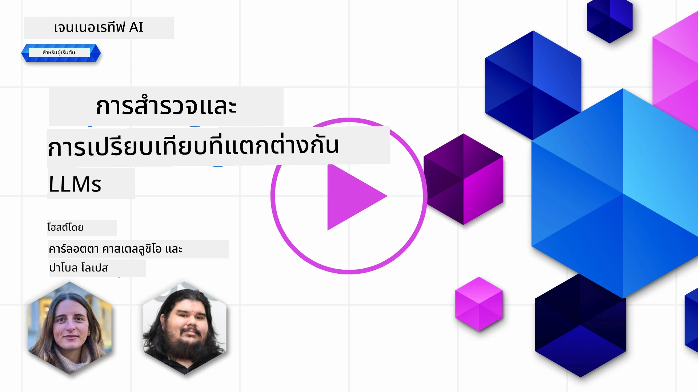](https://youtu.be/KIRUeDKscfI?si=8BHX1zvwzQBn-PlK)

> _คลิกที่ภาพด้านบนเพื่อดูวิดีโอของบทเรียนนี้_

จากบทเรียนก่อนหน้า เราได้เห็นว่า Generative AI กำลังเปลี่ยนแปลงภูมิทัศน์ของเทคโนโลยีอย่างไร LLMs ทำงานอย่างไร และธุรกิจอย่างสตาร์ทอัพของเราสามารถนำไปใช้กับกรณีการใช้งานและเติบโตได้อย่างไร ในบทนี้ เราจะพิจารณาเปรียบเทียบ LLMs ประเภทต่าง ๆ เพื่อเข้าใจข้อดีข้อเสียของแต่ละแบบ

ขั้นตอนถัดไปในการเดินทางของสตาร์ทอัพของเราคือการสำรวจภูมิทัศน์ปัจจุบันของ LLMs และทำความเข้าใจว่าแบบไหนเหมาะสมกับกรณีการใช้งานของเรา

## เกริ่นนำ

บทเรียนนี้จะครอบคลุม:

- ประเภทต่าง ๆ ของ LLMs ในภูมิทัศน์ปัจจุบัน
- การทดสอบ, การปรับปรุง และการเปรียบเทียบโมเดลต่าง ๆ สำหรับกรณีการใช้งานของคุณใน Azure
- วิธีการปรับใช้งาน LLM

## เป้าหมายการเรียนรู้

หลังจากจบบทเรียนนี้ คุณจะสามารถ:

- เลือกโมเดลที่เหมาะสมกับกรณีการใช้งานของคุณ
- เข้าใจวิธีการทดสอบ ปรับปรุง และพัฒนาประสิทธิภาพของโมเดล
- รู้วิธีที่ธุรกิจนำโมเดลไปใช้

## เข้าใจประเภทต่าง ๆ ของ LLMs

LLMs สามารถถูกแบ่งหมวดหมู่ตามสถาปัตยกรรม ข้อมูลการฝึก และกรณีการใช้งาน การเข้าใจความแตกต่างเหล่านี้จะช่วยให้สตาร์ทอัพของเราเลือกโมเดลที่เหมาะสมกับสถานการณ์ และเข้าใจวิธีการทดสอบ ปรับปรุง และพัฒนาประสิทธิภาพ

มี LLM หลายประเภท ซึ่งการเลือกขึ้นอยู่กับสิ่งที่คุณตั้งใจจะใช้ ข้อมูลของคุณ งบประมาณ และปัจจัยอื่น ๆ

ขึ้นอยู่กับว่าคุณตั้งใจจะใช้โมเดลสำหรับข้อความ, เสียง, วิดีโอ, การสร้างภาพ และอื่น ๆ คุณอาจเลือกโมเดลที่แตกต่างกัน

- **การรู้จำเสียงและคำพูด** โมเดลสไตล์ Whisper ยังคงเป็นโมเดลสำหรับรู้จำเสียงที่ใช้ได้ทั่วไป แต่ตัวเลือกสำหรับการผลิตในปัจจุบันรวมถึงโมเดล speech-to-text รุ่นใหม่ เช่น `gpt-4o-transcribe`, `gpt-4o-mini-transcribe`, และเวอร์ชัน diarization ให้ประเมินการครอบคลุมภาษา, การแบ่งแยกเสียง, การสนับสนุนแบบ real-time, ความหน่วงเวลา, และต้นทุนสำหรับสถานการณ์ของคุณ เรียนรู้เพิ่มเติมใน [เอกสาร OpenAI speech-to-text](https://platform.openai.com/docs/guides/speech-to-text?WT.mc_id=academic-105485-koreyst)

- **การสร้างภาพ** DALL-E และ Midjourney เป็นตัวเลือกสร้างภาพที่รู้จักกันดี แต่ API ภาพของ OpenAI ปัจจุบันมุ่งเน้นที่โมเดล GPT Image เช่น `gpt-image-2` ขณะที่ Stable Diffusion, Imagen, Flux และครอบครัวโมเดลอื่น ๆ ก็เป็นตัวเลือกที่นิยมเทียบกัน เช่น ความแม่นยำในการป้อนคำสั่ง, การสนับสนุนการแก้ไข, การควบคุมสไตล์, ความต้องการด้านความปลอดภัย, และลิขสิทธิ์ เรียนรู้เพิ่มเติมใน [คู่มือการสร้างภาพ OpenAI](https://platform.openai.com/docs/guides/images?WT.mc_id=academic-105485-koreyst) และบทที่ 9 ของหลักสูตรนี้

- **การสร้างข้อความ** โมเดลข้อความมีทั้งรุ่นแนวหน้าที่มีความเชี่ยวชาญ, โมเดลให้เหตุผล, โมเดลขนาดเล็กที่มีความหน่วงเวลาต่ำ, และโมเดลน้ำหนักเปิด ตัวอย่างปัจจุบัน ได้แก่ โมเดล OpenAI GPT-5.x, Anthropic Claude 4.x, Google Gemini 3.x, Meta Llama 4, และ Mistral อย่าเลือกแค่ตามวันที่วางจำหน่ายหรือต้นทุนเปรียบเทียบคุณภาพงาน, ความหน่วงเวลา, หน้าต่างบริบท, การใช้เครื่องมือ, พฤติกรรมด้านความปลอดภัย, ความพร้อมใช้งานตามภูมิภาค และต้นทุนทั้งหมด [Microsoft Foundry model catalog](https://ai.azure.com/catalog?WT.mc_id=academic-105485-koreyst) เป็นสถานที่ที่ดีในการเปรียบเทียบโมเดลที่มีอยู่บน Azure

- **มัลติโมดัลити** โมเดลปัจจุบันหลายตัวสามารถประมวลผลได้มากกว่าข้อความ บางตัวรองรับอินพุตภาพ, เสียง หรือวิดีโอ; บางตัวสามารถเรียกใช้เครื่องมือได้; และโมเดลเฉพาะสามารถสร้างภาพ, เสียง หรือวิดีโอ ตัวอย่างเช่น โมเดล OpenAI ปัจจุบันรองรับข้อความและภาพ, โมเดล Gemini รองรับข้อความ, โค้ด, ภาพ, เสียง, และวิดีโอตามแต่รุ่น, และ Llama 4 Scout กับ Maverick เป็นโมเดลน้ำหนักเปิดที่รองรับมัลติโมดัลแบบเนทีฟ ตรวจสอบการรองรับ modality อินพุตและเอาต์พุตในแต่ละโมเดลก่อนสร้างเวิร์กโฟลว์

การเลือกโมเดลหมายถึงคุณจะได้ความสามารถพื้นฐานบางอย่าง แต่อาจไม่เพียงพอ เพราะบ่อยครั้งคุณจะมีข้อมูลเฉพาะบริษัทที่ต้องการแจ้งให้ LLM รู้ มีตัวเลือกหลายแบบในการจัดการเรื่องนี้ ซึ่งจะกล่าวถึงในส่วนถัดไป

### Foundation Models กับ LLMs

คำว่า Foundation Model ถูก [บัญญัติขึ้นโดยนักวิจัยที่ Stanford](https://arxiv.org/abs/2108.07258?WT.mc_id=academic-105485-koreyst) และกำหนดเป็นโมเดล AI ที่มีลักษณะตามเกณฑ์ดังนี้:

- **โมเดลเหล่านี้ถูกฝึกด้วยการเรียนรู้แบบไม่เฝ้าติดตามหรือแบบเซลฟ์ซูเปอร์ไวส์** หมายถึงการฝึกบนข้อมูลมัลติโมดัลที่ไม่มีการกำกับป้ายกำกับ โดยไม่ต้องการการติดป้ายหรือคำอธิบายจากมนุษย์
- **เป็นโมเดลขนาดใหญ่มาก** โดยอิงตามโครงข่ายประสาทลึกที่มีพารามิเตอร์หลายพันล้านตัว
- **โดยปกติใช้เป็น ‘ฐานราก’ สำหรับโมเดลอื่นๆ** ซึ่งหมายถึงใช้เป็นจุดเริ่มต้นสำหรับการสร้างโมเดลอื่นโดยการปรับจูน

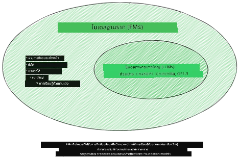

แหล่งที่มาของภาพ: [Essential Guide to Foundation Models and Large Language Models | โดย Babar M Bhatti | Medium
](https://thebabar.medium.com/essential-guide-to-foundation-models-and-large-language-models-27dab58f7404)

เพื่อชี้แจงความแตกต่างนี้เพิ่มเติม ให้ใช้ ChatGPT เป็นตัวอย่างทางประวัติศาสตร์ รุ่นแรกของ ChatGPT ใช้ GPT-3.5 เป็น Foundation Model หลังจากนั้น OpenAI ใช้ข้อมูลแชทและเทคนิคการจัดตำแหน่งเพื่อสร้างเวอร์ชันที่ปรับจูนและทำงานดีขึ้นในสถานการณ์สนทนา เช่น แชทบอท บริการ AI สมัยใหม่มักสลับใช้โมเดลหลายเวอร์ชัน ดังนั้นชื่อบริการและชื่อโมเดลพื้นฐานไม่จำเป็นต้องเหมือนกันเสมอไป

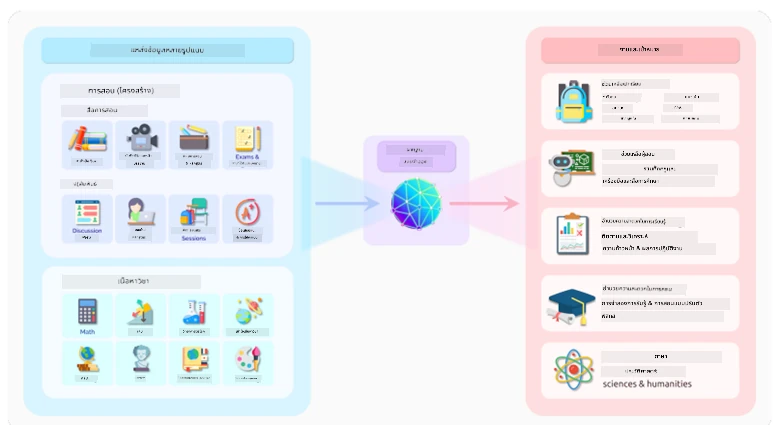

แหล่งที่มาของภาพ: [2108.07258.pdf (arxiv.org)](https://arxiv.org/pdf/2108.07258.pdf?WT.mc_id=academic-105485-koreyst)

### โมเดล Open-Weight/Open-Source กับ โมเดล Proprietary

อีกวิธีหนึ่งในการแบ่งปัน LLMs คือดูว่าเป็นแบบ open-weight, open-source หรือ proprietary

โมเดลโอเพนซอร์สและ open-weight เปิดให้ตรวจสอบ ดาวน์โหลด หรือปรับแต่ง artefacts ของโมเดลแต่ละรุ่นได้ แต่ลิขสิทธิ์จะแตกต่างกัน บางรุ่นเป็นโอเพนซอร์สเต็มรูปแบบ ขณะที่บางรุ่นเป็นโมเดล open-weight ที่มีข้อจำกัดการใช้งาน เหมาะสำหรับธุรกิจที่ต้องการควบคุมมากขึ้นในด้านการปรับใช้, ทำเลที่ตั้งข้อมูล, ต้นทุน หรือการจำแนก แต่ยังต้องตรวจสอบเงื่อนไขใบอนุญาต, ต้นทุนการให้บริการ, การบำรุงรักษา, การอัปเดตความปลอดภัย, และคุณภาพของการประเมินก่อนนำไปใช้งานจริง ตัวอย่างเช่น [Meta Llama 4](https://ai.meta.com/blog/llama-4-multimodal-intelligence/?WT.mc_id=academic-105485-koreyst), โมเดลบางรุ่นของ [Mistral](https://docs.mistral.ai/models/overview?WT.mc_id=academic-105485-koreyst), และโมเดลจำนวนมากที่โฮสต์บน [Hugging Face](https://huggingface.co/models?WT.mc_id=academic-105485-koreyst)

โมเดล proprietary เป็นโมเดลที่เป็นเจ้าของและโฮสต์โดยผู้ให้บริการ มักจะปรับแต่งเพื่อใช้งานในระบบการผลิตที่จัดการได้ดี และมีระบบสนับสนุน ความปลอดภัย การรวมเครื่องมือ และความสามารถในการขยายขนาดได้ อย่างไรก็ตาม ลูกค้ามักไม่สามารถตรวจสอบหรือแก้ไขน้ำหนักของโมเดล และต้องอ่านข้อกำหนดของผู้ให้บริการเกี่ยวกับความเป็นส่วนตัว การเก็บรักษา ข้อกำหนดในการปฏิบัติตาม และการใช้งานที่ยอมรับได้ ตัวอย่างเช่น [โมเดล OpenAI](https://platform.openai.com/docs/models?WT.mc_id=academic-105485-koreyst), [Google Gemini](https://deepmind.google/models/gemini/pro/?WT.mc_id=academic-105485-koreyst), และ [Anthropic Claude](https://platform.claude.com/docs/en/about-claude/models/overview?WT.mc_id=academic-105485-koreyst)

### การฝังตัว (Embedding) กับ การสร้างภาพ กับ การสร้างข้อความและโค้ด

LLMs ยังสามารถแบ่งประเภทตามผลลัพธ์ที่สร้างได้

Embeddings เป็นกลุ่มโมเดลที่สามารถแปลงข้อความเป็นรูปแบบตัวเลข เรียกว่า embedding ซึ่งเป็นการแทนตัวเลขของข้อความอินพุต Embeddings ช่วยให้เครื่องจักรเข้าใจความสัมพันธ์ระหว่างคำหรือประโยคได้ดีขึ้น และสามารถใช้เป็นอินพุตให้โมเดลอื่น ๆ เช่น โมเดลจัดหมวดหมู่ หรือโมเดลจัดกลุ่มที่มีประสิทธิภาพดีกับข้อมูลเชิงตัวเลข โมเดล embedding มักใช้สำหรับการเรียนรู้แบบถ่ายโอน (transfer learning) ซึ่งสร้างโมเดลดัชนีสำรองสำหรับงานที่มีข้อมูลจำนวนมาก และจากนั้นใช้น้ำหนักของโมเดล (embeddings) สำหรับงานอื่นๆ ตัวอย่างของกลุ่มนี้คือ [OpenAI embeddings](https://platform.openai.com/docs/models/embeddings?WT.mc_id=academic-105485-koreyst)

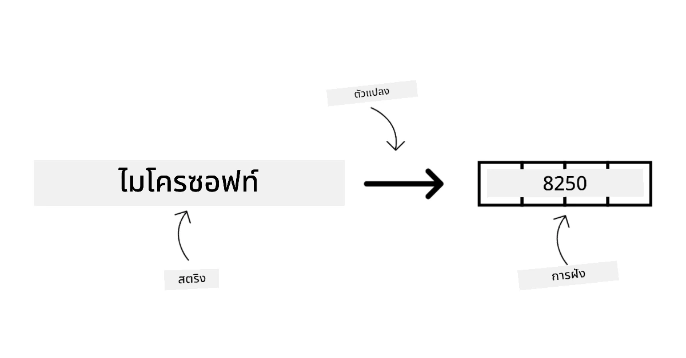

โมเดลสร้างภาพเป็นโมเดลที่สร้างภาพ โมเดลเหล่านี้มักใช้สำหรับแก้ไขภาพ, สังเคราะห์ภาพ, และแปลงภาพ โมเดลสร้างภาพมักถูกฝึกบนชุดข้อมูลภาพขนาดใหญ่ เช่น [LAION-5B](https://laion.ai/blog/laion-5b/?WT.mc_id=academic-105485-koreyst) และสามารถใช้สร้างภาพใหม่ หรือแก้ไขภาพที่มีอยู่ด้วยเทคนิค inpainting, super-resolution, และ colorization ตัวอย่าง ได้แก่ [โมเดล GPT Image](https://platform.openai.com/docs/guides/images?WT.mc_id=academic-105485-koreyst), [โมเดล Stable Diffusion](https://github.com/Stability-AI/StableDiffusion?WT.mc_id=academic-105485-koreyst), และโมเดล Imagen

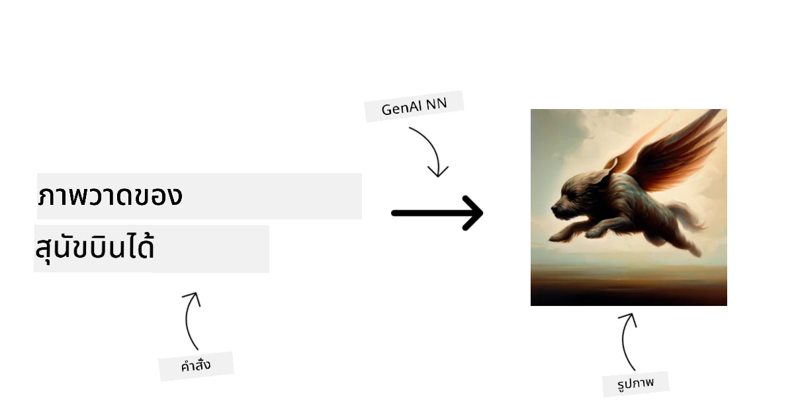

โมเดลสร้างข้อความและโค้ดเป็นโมเดลที่สร้างข้อความหรือโค้ด มักใช้สำหรับสรุปข้อความ, การแปลภาษา, และตอบคำถาม โมเดลสร้างข้อความมักถูกฝึกบนชุดข้อมูลข้อความขนาดใหญ่ เช่น [BookCorpus](https://www.cv-foundation.org/openaccess/content_iccv_2015/html/Zhu_Aligning_Books_and_ICCV_2015_paper.html?WT.mc_id=academic-105485-koreyst) และใช้สร้างข้อความใหม่ หรือการตอบคำถาม โมเดลสร้างโค้ด เช่น [CodeParrot](https://huggingface.co/codeparrot?WT.mc_id=academic-105485-koreyst) มักฝึกบนชุดข้อมูลโค้ดขนาดใหญ่ เช่น GitHub และสามารถใช้สร้างโค้ดใหม่ หรือแก้ไขบั๊กในโค้ดที่มีอยู่

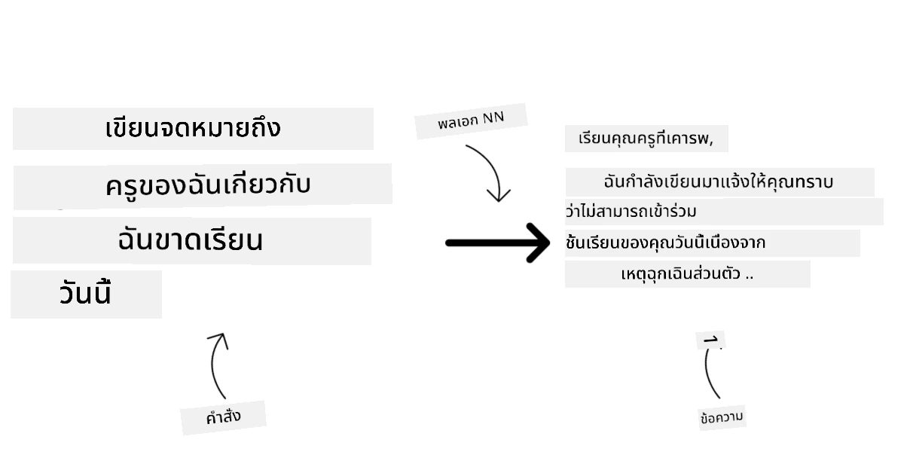

### Encoder-Decoder กับ Decoder-only

เพื่อพูดถึงสถาปัตยกรรมประเภทต่าง ๆ ของ LLMs ให้ใช้การเปรียบเทียบนี้

ลองจินตนาการว่าผู้จัดการของคุณให้ภารกิจเขียนแบบทดสอบสำหรับนักเรียน คุณมีเพื่อนร่วมงานสองคน คนหนึ่งดูแลสร้างเนื้อหาและอีกคนตรวจเนื้อหา

คนสร้างเนื้อหาเหมือนโมเดล decoder-only: เขาสามารถดูหัวข้อ, ดูสิ่งที่คุณเขียนไว้แล้ว แล้วสร้างเนื้อหาต่อจากบริบทนั้นได้ดี พวกเขาเก่งในการเขียนเนื้อหาที่น่าสนใจและให้ข้อมูล แต่ไม่ใช่ตัวเลือกที่ดีที่สุดถ้างานคือการจัดหมวดหมู่, ดึงข้อมูล หรือเข้ารหัสข้อมูล ตัวอย่างโมเดล decoder-only ได้แก่ GPT และ Llama

คนตรวจสอบเหมือนโมเดล Encoder-only: พวกเขาดูที่หลักสูตรและคำตอบเพื่อสังเกตความสัมพันธ์และเข้าใจบริบท แต่ไม่เก่งในการสร้างเนื้อหา ตัวอย่างโมเดล Encoder-only คือ BERT

ลองนึกว่ามีคนที่สามารถสร้างและตรวจสอบแบบทดสอบได้ นี่คือโมเดล Encoder-Decoder ตัวอย่างเช่น BART และ T5

### บริการกับโมเดล

ตอนนี้มาพูดถึงความแตกต่างระหว่างบริการกับโมเดล บริการคือผลิตภัณฑ์ที่ผู้ให้บริการคลาวด์เสนอ และมักเป็นการรวมกันของโมเดล, ข้อมูล และส่วนประกอบอื่นๆ โมเดลคือส่วนประกอบหลักของบริการ และมักเป็น Foundation Model เช่น LLMs

บริการมักได้รับการปรับแต่งเพื่อใช้งานจริงและใช้งานง่ายกว่าโมเดลผ่านอินเทอร์เฟซกราฟิก อย่างไรก็ตาม บริการไม่ได้ฟรีเสมอไป อาจต้องสมัครสมาชิกหรือชำระเงินเพื่อใช้งาน แลกกับการใช้ทรัพยากรและอุปกรณ์ของเจ้าของบริการ รวมถึงการจัดการค่าใช้จ่ายและขยายได้ง่าย ตัวอย่างบริการคือ [Azure OpenAI Service](https://learn.microsoft.com/azure/ai-foundry/openai/overview?WT.mc_id=academic-105485-koreyst) ที่ใช้แผนค่าใช้จ่ายตามการใช้งานจริง บริการนี้ยังมีความปลอดภัยระดับองค์กรและกรอบ AI ที่รับผิดชอบบนความสามารถของโมเดล

โมเดลคือ artefacts ของโครงข่ายประสาท เช่น พารามิเตอร์, น้ำหนัก, สถาปัตยกรรม, ตัวแยกคำ (tokenizer) และการตั้งค่าที่สนับสนุน การรันโมเดลภายในเครื่องหรือในสภาพแวดล้อมส่วนตัวต้องใช้ฮาร์ดแวร์ที่เหมาะสม, โครงสร้างพื้นฐานการให้บริการ, การตรวจสอบ และใบอนุญาตที่เหมาะสมทั้งแบบโอเพนซอร์ส/open-weight หรือแบบเชิงพาณิชย์ โมเดล open-weight เช่น Llama 4 หรือ Mistral สามารถโฮสต์เองได้แต่ยังต้องการพลังประมวลผลและความเชี่ยวชาญด้านการดำเนินงาน

## วิธีทดสอบและปรับปรุงกับโมเดลต่าง ๆ เพื่อเข้าใจประสิทธิภาพบน Azure

เมื่vทีมของเราสำรวจภูมิทัศน์ LLMs ปัจจุบันและระบุผู้สมัครที่ดีสำหรับสถานการณ์ของพวกเขา ขั้นตอนต่อไปคือการทดสอบพวกเขาบนข้อมูลของพวกเขาและภาระงานของพวกเขา นี่เป็นกระบวนการเชิงวนซ้ำ ซึ่งดำเนินการโดยการทดลองและการวัดผล
โมเดลส่วนใหญ่ที่เรากล่าวถึงในย่อหน้าก่อนหน้า (โมเดล OpenAI, โมเดลน้ำหนักเปิดเช่น Llama 4 และ Mistral, และโมเดล Hugging Face) มีให้ใช้งานใน [Microsoft Foundry Models](https://learn.microsoft.com/azure/foundry/concepts/foundry-models-overview?WT.mc_id=academic-105485-koreyst)

[Microsoft Foundry](https://learn.microsoft.com/azure/foundry/what-is-foundry?WT.mc_id=academic-105485-koreyst) ซึ่งเดิมชื่อ Azure AI Studio/Azure AI Foundry เป็นแพลตฟอร์ม Azure แบบรวมศูนย์สำหรับการสร้างแอป AI และตัวแทน AI ช่วยให้นักพัฒนาจัดการวงจรชีวิตตั้งแต่การทดลองและการประเมินไปจนถึงการนำไปใช้ การตรวจสอบ และการกำกับดูแล แคตตาล็อกโมเดลใน Microsoft Foundry ช่วยให้ผู้ใช้สามารถ:

- ค้นหาโมเดลพื้นฐานที่สนใจในแคตตาล็อก รวมถึงโมเดลที่จำหน่ายโดย Azure และโมเดลจากพันธมิตรและผู้ให้บริการในชุมชน ผู้ใช้สามารถกรองตามงาน ผู้ให้บริการ ใบอนุญาต ตัวเลือกการปรับใช้ หรือชื่อ

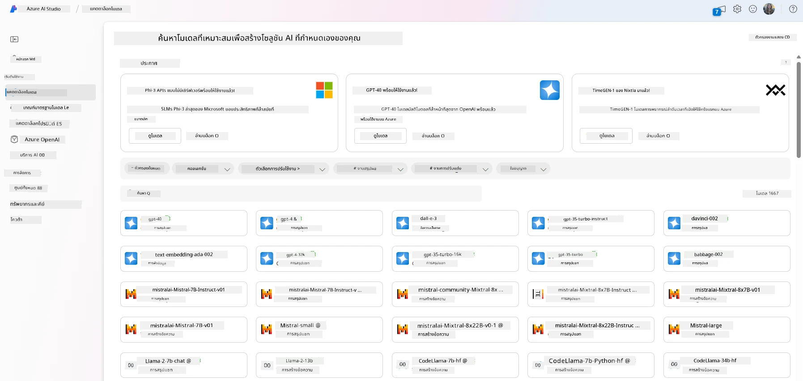

- ทบทวนบัตรโมเดล รวมถึงคำอธิบายโดยละเอียดเกี่ยวกับการใช้งานที่ตั้งใจไว้และข้อมูลการฝึกอบรม ตัวอย่างโค้ด และผลการประเมินในห้องสมุดประเมินภายใน

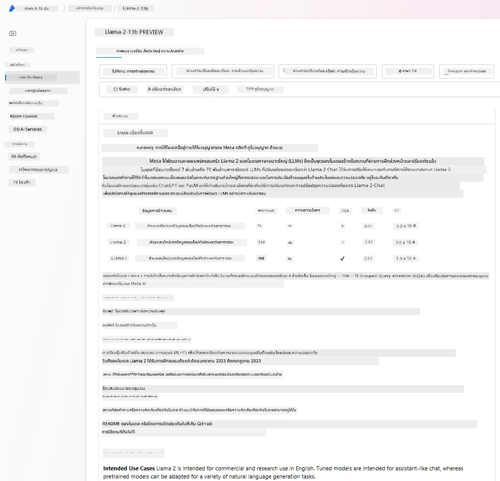

- เปรียบเทียบเกณฑ์มาตรฐานระหว่างโมเดลและชุดข้อมูลที่มีในอุตสาหกรรมเพื่อประเมินว่าโมเดลใดตอบโจทย์สถานการณ์ทางธุรกิจ ผ่านทางหน้าต่าง [Model Benchmarks](https://learn.microsoft.com/azure/ai-foundry/concepts/model-benchmarks?WT.mc_id=academic-105485-koreyst)

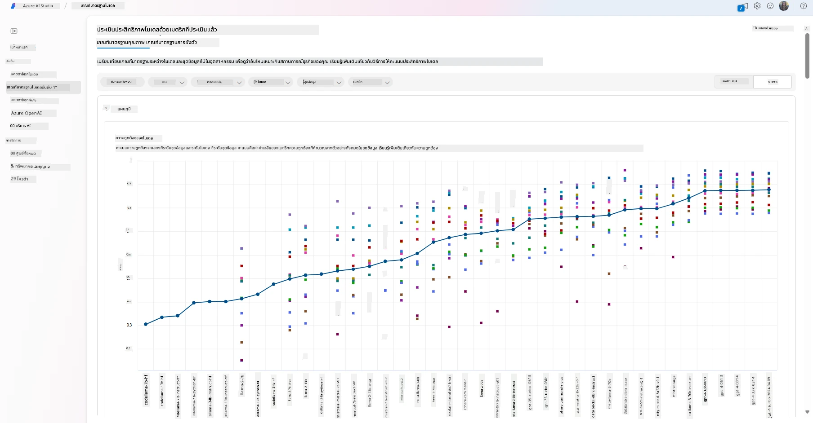

- ปรับแต่งโมเดลที่รองรับด้วยข้อมูลการฝึกอบรมที่กำหนดเองเพื่อปรับปรุงประสิทธิภาพของโมเดลในภาระงานเฉพาะ โดยใช้ความสามารถในการทดลองและติดตามของ Microsoft Foundry

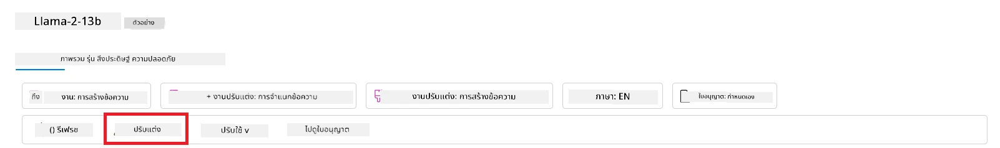

- นำโมเดลที่ฝึกอบรมไว้ล่วงหน้าหรือเวอร์ชันที่ปรับแต่งแล้วไปใช้งานที่จุดสิ้นสุดการอนุมานแบบเรียลไทม์ระยะไกล โดยใช้ตัวเลือกการปรับใช้แบบคำนวณที่บริหารจัดการหรือแบบไม่ใช้เซิร์ฟเวอร์ เพื่อให้อุปกรณ์หรือแอปพลิเคชันสามารถใช้งานโมเดลได้

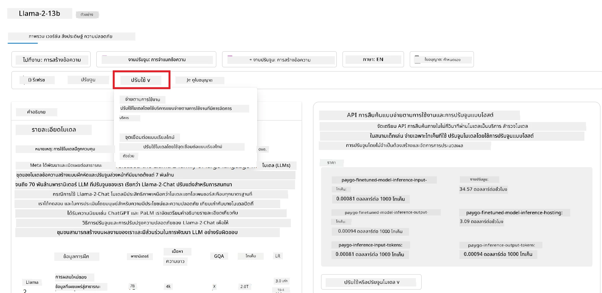

> [!NOTE]
> โมเดลทั้งหมดในแคตตาล็อกไม่สามารถปรับแต่งหรือ/และปรับใช้แบบจ่ายตามการใช้งานได้ในขณะนี้ โปรดตรวจสอบบัตรโมเดลเพื่อดูรายละเอียดเกี่ยวกับความสามารถและข้อจำกัดของโมเดล

## การปรับปรุงผลลัพธ์ LLM

เราได้สำรวจร่วมกับทีมสตาร์ทอัพของเราเกี่ยวกับ LLM ประเภทต่างๆ และแพลตฟอร์มคลาวด์ (Microsoft Foundry) ที่ช่วยให้เราสามารถเปรียบเทียบโมเดลต่างๆ ประเมินพวกเขาบนข้อมูลทดสอบ ปรับปรุงประสิทธิภาพ และนำไปปรับใช้บนจุดสิ้นสุดการอนุมาน

แต่เมื่อไรควรพิจารณาการปรับแต่งโมเดล แทนการใช้โมเดลที่ฝึกอบรมล่วงหน้า? มีแนวทางอื่นในการปรับปรุงประสิทธิภาพโมเดลในภาระงานเฉพาะหรือไม่?

มีหลายแนวทางที่ธุรกิจสามารถใช้เพื่อให้ได้ผลลัพธ์ที่ต้องการจาก LLM คุณสามารถเลือกโมเดลประเภทต่างๆ พร้อมระดับการฝึกอบรมที่แตกต่างกันเมื่อนำ LLM มาใช้งานจริง โดยมีระดับความซับซ้อน ต้นทุน และคุณภาพที่แตกต่างกัน ต่อไปนี้เป็นแนวทางต่างๆ:

- **วิศวกรรมพรอมต์พร้อมบริบท** แนวคิดคือการให้บริบทเพียงพอเมื่อคุณส่งพรอมต์เพื่อให้ได้รับคำตอบที่คุณต้องการ

- **Retrieval Augmented Generation, RAG** ข้อมูลของคุณอาจอยู่ในฐานข้อมูลหรือเว็บเอ็นด์พอยต์ ตัวอย่างเช่น เพื่อให้แน่ใจว่าข้อมูลดังกล่าว หรือส่วนย่อยของข้อมูลนั้น ถูกนำเข้าในเวลาส่งพรอมต์ คุณสามารถดึงข้อมูลที่เกี่ยวข้องมาและทำให้เป็นส่วนหนึ่งของพรอมต์ของผู้ใช้

- **โมเดลที่ปรับแต่งแล้ว** ที่นี่ คุณฝึกโมเดลเพิ่มเติมด้วยข้อมูลของคุณเอง ซึ่งทำให้โมเดลแม่นยำและตอบสนองความต้องการของคุณมากขึ้น แต่ก็อาจมีค่าใช้จ่ายสูง

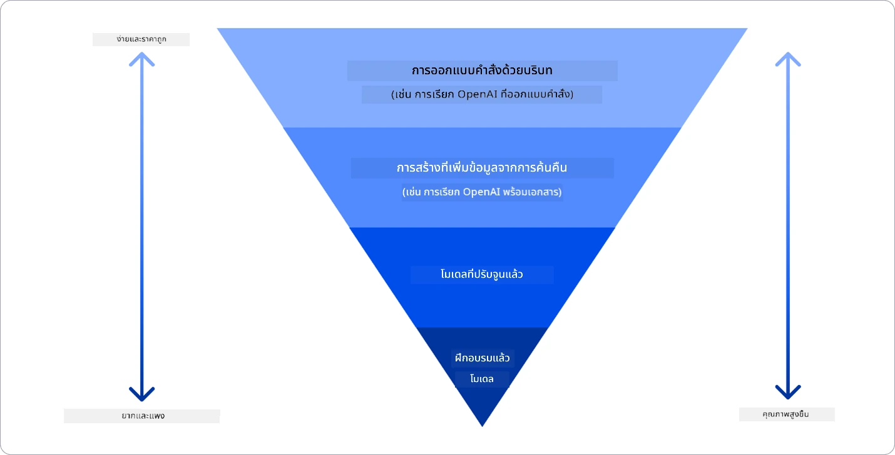

แหล่งที่มา: [Four Ways that Enterprises Deploy LLMs | Fiddler AI Blog](https://www.fiddler.ai/blog/four-ways-that-enterprises-deploy-llms?WT.mc_id=academic-105485-koreyst)

### วิศวกรรมพรอมต์พร้อมบริบท

LLM ที่ฝึกอบรมล่วงหน้าทำงานได้ดีมากในงานภาษาธรรมชาติที่ทั่วไป แม้แต่การเรียกใช้ด้วยพรอมต์สั้นๆ เช่น ประโยคเพื่อเติมเต็มหรือคำถาม — ที่เรียกว่า “zero-shot” learning

อย่างไรก็ตาม ยิ่งผู้ใช้สามารถกำหนดคำถามของตนได้โดยมีคำขอและตัวอย่างโดยละเอียด — บริบท — คำตอบก็จะยิ่งแม่นยำและใกล้เคียงกับที่ผู้ใช้คาดหวังมากขึ้น ในกรณีนี้ เราพูดถึง “one-shot” learning หากพรอมต์มีเพียงตัวอย่างเดียว และ “few shot learning” หากมีหลายตัวอย่าง
วิศวกรรมพรอมต์พร้อมบริบทเป็นแนวทางที่คุ้มค่าที่สุดสำหรับการเริ่มต้น

### Retrieval Augmented Generation (RAG)

LLM มีข้อจำกัดที่ว่า สามารถใช้ได้เฉพาะข้อมูลที่ใช้ในระหว่างการฝึกอบรมเพื่อสร้างคำตอบ ซึ่งหมายความว่าพวกเขาไม่ทราบเรื่องราวที่เกิดขึ้นหลังการฝึก และไม่สามารถเข้าถึงข้อมูลที่ไม่เปิดเผยต่อสาธารณะ (เช่น ข้อมูลของบริษัท) ได้
ข้อจำกัดนี้สามารถแก้ไขได้ด้วย RAG ซึ่งเป็นเทคนิคที่เสริมพรอมต์ด้วยข้อมูลภายนอกในรูปแบบของชิ้นส่วนเอกสาร โดยคำนึงถึงขีดจำกัดความยาวของพรอมต์ เทคนิครับการสนับสนุนโดยเครื่องมือฐานข้อมูลเวกเตอร์ (เช่น [Azure Vector Search](https://learn.microsoft.com/azure/search/vector-search-overview?WT.mc_id=academic-105485-koreyst)) ที่ดึงชิ้นส่วนที่มีประโยชน์จากแหล่งข้อมูลที่กำหนดไว้ล่วงหน้าและเพิ่มเข้าไปในบริบทของพรอมต์

เทคนิคนี้มีประโยชน์มากเมื่อธุรกิจไม่มีข้อมูลเพียงพอ ไม่มีกำลังเวลา หรือทรัพยากรในการปรับแต่ง LLM แต่ยังต้องการปรับปรุงประสิทธิภาพในภาระงานเฉพาะและลดความเสี่ยงของคำตอบที่ประดิษฐ์ขึ้น ผิดเวลา หรือไม่ได้รับการสนับสนุน

### โมเดลที่ปรับแต่งแล้ว

การปรับแต่งเป็นกระบวนการที่ใช้การเรียนรู้แบบถ่ายโอนเพื่อ ‘ปรับ’ โมเดลให้เหมาะกับงานหรืองานย่อยเฉพาะ แตกต่างจาก few-shot learning และ RAG มันทำให้เกิดโมเดลใหม่ที่มีค่าน้ำหนักและไบแอสที่อัปเดต ต้องการชุดตัวอย่างฝึกอบรมที่ประกอบด้วยอินพุตเดียว (คือพรอมต์) และผลลัพธ์ที่เกี่ยวข้อง (คือการเติมเต็ม)
นี่คือแนวทางที่แนะนำหาก:

- **ใช้โมเดลเฉพาะงานขนาดเล็กกว่า** ธุรกิจต้องการปรับแต่งโมเดลขนาดเล็กสำหรับงานเฉพาะแทนที่จะส่งพรอมต์ซ้ำกับโมเดลขนาดใหญ่มาก ทำให้ได้โซลูชันที่คุ้มค่าและเร็วกว่า

- **พิจารณาเรื่องความหน่วงเวลา** ความหน่วงเวลาสำคัญกับกรณีใช้งานเฉพาะ จึงไม่สามารถใช้พรอมต์ยาวมากหรือจำนวนตัวอย่างที่โมเดลควรเรียนรู้ไม่สอดคล้องกับขีดจำกัดความยาวพรอมต์

- **ปรับพฤติกรรมเสถียร** ธุรกิจมีตัวอย่างคุณภาพสูงจำนวนมากและต้องการให้โมเดลปฏิบัติตามรูปแบบงาน รูปแบบการแสดงผล น้ำเสียง หรือสไตล์เฉพาะโดเมนแบบสม่ำเสมอ หากปัญหาหลักคือข้อเท็จจริงใหม่หรือความรู้ส่วนตัวที่เปลี่ยนแปลงบ่อย ให้ใช้ RAG แทนการพึ่งพาการปรับแต่งเพียงอย่างเดียว

### โมเดลที่ฝึกอบรม

การฝึก LLM ใหม่ตั้งแต่ต้นโดยไม่มีข้อสงสัยเป็นแนวทางที่ยากและซับซ้อนที่สุด ต้องการข้อมูลจำนวนมาก ทรัพยากรที่มีทักษะ และพลังคำนวณที่เหมาะสม ตัวเลือกนี้ควรพิจารณาเฉพาะในกรณีที่ธุรกิจมีกรณีใช้งานเฉพาะโดเมนและมีข้อมูลในโดเมนเฉพาะจำนวนมาก

## การตรวจสอบความรู้

แนวทางที่ดีในการปรับปรุงผลลัพธ์การเติมเต็มของ LLM คืออะไร?

1. วิศวกรรมพรอมต์พร้อมบริบท
1. RAG
1. โมเดลที่ปรับแต่งแล้ว

ตอบ: ทั้งสามวิธีช่วยได้ เริ่มจากวิศวกรรมพรอมต์และบริบทเพื่อการปรับปรุงอย่างรวดเร็ว และใช้ RAG เมื่อโมเดลต้องการข้อเท็จจริงปัจจุบันหรือข้อมูลธุรกิจส่วนตัว เลือกการปรับแต่งเมื่อคุณมีตัวอย่างคุณภาพสูงเพียงพอและต้องการให้โมเดลปฏิบัติตามงาน รูปแบบ น้ำเสียง หรือรูปแบบโดเมนอย่างสม่ำเสมอ

## 🚀 ความท้าทาย

อ่านเพิ่มเติมเกี่ยวกับวิธีที่คุณสามารถ [ใช้ RAG](https://learn.microsoft.com/azure/search/retrieval-augmented-generation-overview?WT.mc_id=academic-105485-koreyst) สำหรับธุรกิจของคุณ

## ทำได้ดีมาก ดำเนินการเรียนรู้ต่อ

หลังจากจบบทเรียนนี้แล้ว ตรวจสอบ [คอลเลคชันการเรียนรู้ Generative AI](https://aka.ms/genai-collection?WT.mc_id=academic-105485-koreyst) ของเราเพื่อพัฒนาความรู้ Generative AI ของคุณให้สูงขึ้นไปอีก!

ไปที่บทเรียนที่ 3 ซึ่งเราจะดูวิธี [สร้างด้วย Generative AI อย่างรับผิดชอบ](../03-using-generative-ai-responsibly/README.md?WT.mc_id=academic-105485-koreyst)!

---

<!-- CO-OP TRANSLATOR DISCLAIMER START -->
**ปฏิเสธความรับผิดชอบ**:
เอกสารนี้ได้รับการแปลโดยใช้บริการแปลภาษา AI [Co-op Translator](https://github.com/Azure/co-op-translator) ขณะที่เราพยายามให้ความถูกต้อง โปรดทราบว่าการแปลโดยอัตโนมัติอาจมีข้อผิดพลาดหรือความไม่ถูกต้อง เอกสารต้นฉบับในภาษาต้นทางควรถูกพิจารณาเป็นแหล่งข้อมูลที่เชื่อถือได้ สำหรับข้อมูลที่สำคัญ แนะนำให้ใช้การแปลโดยมนุษย์มืออาชีพ เราไม่รับผิดชอบต่อความเข้าใจผิดหรือการตีความที่ผิดพลาดที่เกิดขึ้นจากการใช้การแปลนี้
<!-- CO-OP TRANSLATOR DISCLAIMER END -->