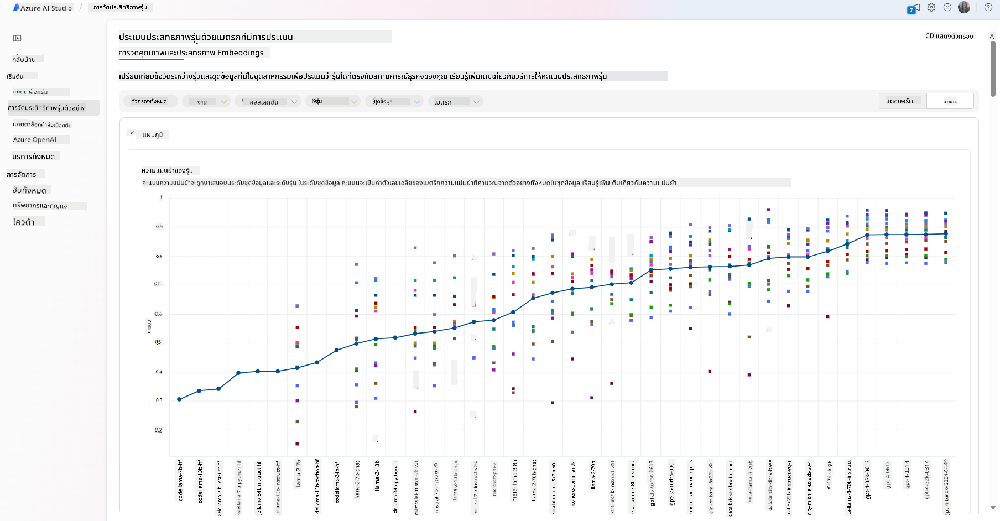
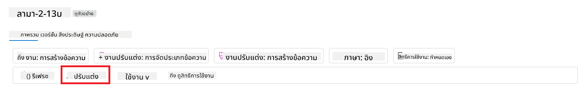
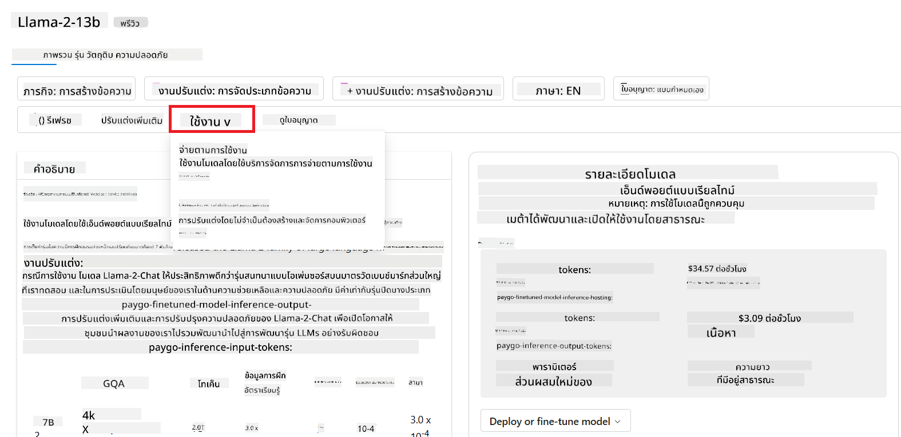
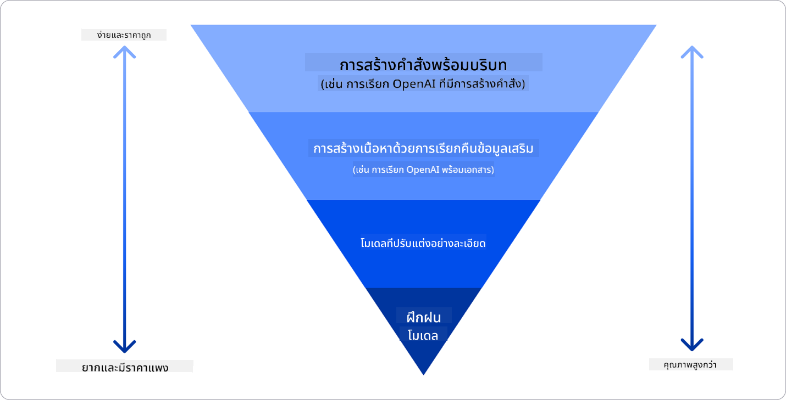

<!--
CO_OP_TRANSLATOR_METADATA:
{
  "original_hash": "e2f686f2eb794941761252ac5e8e090b",
  "translation_date": "2025-06-25T10:42:46+00:00",
  "source_file": "02-exploring-and-comparing-different-llms/README.md",
  "language_code": "th"
}
-->
# การสำรวจและเปรียบเทียบ LLMs ต่าง ๆ

> _คลิกที่ภาพด้านบนเพื่อชมวิดีโอของบทเรียนนี้_

จากบทเรียนก่อนหน้า เราได้เห็นว่า Generative AI กำลังเปลี่ยนแปลงภูมิทัศน์ของเทคโนโลยีอย่างไร และ Large Language Models (LLMs) ทำงานอย่างไร รวมถึงวิธีที่ธุรกิจ เช่น สตาร์ทอัพของเรา สามารถนำไปประยุกต์ใช้ในกรณีการใช้งานและเติบโตได้! ในบทนี้ เราจะเปรียบเทียบและพิจารณาประเภทต่าง ๆ ของ LLMs เพื่อทำความเข้าใจข้อดีและข้อเสียของพวกมัน

ขั้นตอนถัดไปในการเดินทางของสตาร์ทอัพของเราคือการสำรวจภูมิทัศน์ปัจจุบันของ LLMs และทำความเข้าใจว่าแบบไหนเหมาะสมกับกรณีการใช้งานของเรา

## บทนำ

บทเรียนนี้จะครอบคลุมถึง:

- ประเภทต่าง ๆ ของ LLMs ในภูมิทัศน์ปัจจุบัน
- การทดสอบ การทำซ้ำ และการเปรียบเทียบโมเดลต่าง ๆ สำหรับกรณีการใช้งานของคุณใน Azure
- วิธีการปรับใช้ LLM

## เป้าหมายการเรียนรู้

หลังจากจบบทเรียนนี้ คุณจะสามารถ:

- เลือกโมเดลที่เหมาะสมสำหรับกรณีการใช้งานของคุณ
- เข้าใจวิธีการทดสอบ ทำซ้ำ และปรับปรุงประสิทธิภาพของโมเดลของคุณ
- รู้ว่าธุรกิจปรับใช้โมเดลอย่างไร

## ทำความเข้าใจประเภทต่าง ๆ ของ LLMs

LLMs สามารถแบ่งประเภทได้หลายวิธีตามโครงสร้างข้อมูลการฝึกอบรม และกรณีการใช้งาน การทำความเข้าใจความแตกต่างเหล่านี้จะช่วยให้สตาร์ทอัพของเราเลือกโมเดลที่เหมาะสมสำหรับสถานการณ์ และเข้าใจวิธีการทดสอบ ทำซ้ำ และปรับปรุงประสิทธิภาพ

มีโมเดล LLM ที่แตกต่างกันมากมาย การเลือกโมเดลของคุณขึ้นอยู่กับสิ่งที่คุณต้องการใช้ ข้อมูลของคุณ จำนวนเงินที่คุณพร้อมจ่าย และอื่น ๆ

ขึ้นอยู่กับว่าคุณต้องการใช้โมเดลสำหรับการสร้างข้อความ เสียง วิดีโอ ภาพ และอื่น ๆ คุณอาจเลือกใช้โมเดลประเภทต่าง ๆ

- **การรู้จำเสียงและคำพูด** สำหรับวัตถุประสงค์นี้ โมเดลประเภท Whisper เป็นตัวเลือกที่ดีเพราะเป็นโมเดลที่ใช้งานทั่วไปและมุ่งเน้นการรู้จำคำพูด ได้รับการฝึกอบรมด้วยเสียงที่หลากหลายและสามารถทำการรู้จำคำพูดหลายภาษาได้ เรียนรู้เพิ่มเติมเกี่ยวกับ [Whisper type models here](https://platform.openai.com/docs/models/whisper?WT.mc_id=academic-105485-koreyst).

- **การสร้างภาพ** สำหรับการสร้างภาพ DALL-E และ Midjourney เป็นสองตัวเลือกที่รู้จักกันดี DALL-E มีให้บริการโดย Azure OpenAI [อ่านเพิ่มเติมเกี่ยวกับ DALL-E ที่นี่](https://platform.openai.com/docs/models/dall-e?WT.mc_id=academic-105485-koreyst) และยังมีในบทที่ 9 ของหลักสูตรนี้

- **การสร้างข้อความ** โมเดลส่วนใหญ่ได้รับการฝึกอบรมในการสร้างข้อความและคุณมีตัวเลือกมากมายตั้งแต่ GPT-3.5 ถึง GPT-4 โดยมีค่าใช้จ่ายต่างกัน GPT-4 เป็นตัวที่แพงที่สุด ควรตรวจสอบ [Azure OpenAI playground](https://oai.azure.com/portal/playground?WT.mc_id=academic-105485-koreyst) เพื่อประเมินว่าโมเดลใดที่เหมาะสมกับความต้องการของคุณในแง่ของความสามารถและค่าใช้จ่าย

- **หลายรูปแบบ** หากคุณต้องการจัดการกับข้อมูลหลายประเภทในการป้อนเข้าและผลลัพธ์ คุณอาจต้องดูโมเดลเช่น [gpt-4 turbo with vision หรือ gpt-4o](https://learn.microsoft.com/azure/ai-services/openai/concepts/models#gpt-4-and-gpt-4-turbo-models?WT.mc_id=academic-105485-koreyst) - การเปิดตัวล่าสุดของ OpenAI models - ซึ่งสามารถรวมการประมวลผลภาษาธรรมชาติกับความเข้าใจภาพ ทำให้สามารถโต้ตอบผ่านอินเทอร์เฟซหลายรูปแบบ

การเลือกโมเดลหมายความว่าคุณจะได้รับความสามารถพื้นฐานบางอย่าง ซึ่งอาจไม่เพียงพอเสมอไป บ่อยครั้งที่คุณมีข้อมูลเฉพาะของบริษัทที่คุณต้องบอกกับ LLM อย่างไรก็ตาม มีวิธีต่าง ๆ ในการเข้าถึงข้อมูลนั้นมากมาย ซึ่งจะมีในส่วนถัดไป

### Foundation Models กับ LLMs

คำว่า Foundation Model ถูก [บัญญัติโดยนักวิจัยจาก Stanford](https://arxiv.org/abs/2108.07258?WT.mc_id=academic-105485-koreyst) และกำหนดว่าเป็นโมเดล AI ที่ปฏิบัติตามเกณฑ์บางอย่าง เช่น:

- **ได้รับการฝึกอบรมโดยใช้การเรียนรู้แบบไม่มีการควบคุมหรือการเรียนรู้แบบมีการควบคุมตัวเอง** หมายความว่าพวกมันได้รับการฝึกอบรมด้วยข้อมูลหลายรูปแบบที่ไม่มีการระบุ และไม่ต้องการการกำหนดหรือการระบุข้อมูลโดยมนุษย์สำหรับกระบวนการฝึกอบรม
- **เป็นโมเดลที่ใหญ่มาก** โดยอิงจากเครือข่ายประสาทที่ลึกมากซึ่งได้รับการฝึกอบรมด้วยพารามิเตอร์หลายพันล้าน
- **โดยปกติแล้วจะมีจุดประสงค์เพื่อใช้เป็น 'พื้นฐาน' สำหรับโมเดลอื่น ๆ** หมายความว่าสามารถใช้เป็นจุดเริ่มต้นสำหรับโมเดลอื่น ๆ ที่จะสร้างต่อไปได้ ซึ่งสามารถทำได้โดยการปรับแต่ง

เพื่อทำให้ความแตกต่างนี้ชัดเจนขึ้น ลองดูตัวอย่าง ChatGPT ในการสร้าง ChatGPT เวอร์ชันแรก โมเดลที่เรียกว่า GPT-3.5 ทำหน้าที่เป็นโมเดลพื้นฐาน ซึ่งหมายความว่า OpenAI ใช้ข้อมูลเฉพาะของแชทบางอย่างเพื่อสร้างเวอร์ชันที่ปรับแต่งของ GPT-3.5 ที่มีความเชี่ยวชาญในการทำงานได้ดีในสถานการณ์การสนทนา เช่น แชทบอท

### โมเดลโอเพนซอร์สกับโมเดลที่เป็นกรรมสิทธิ์

อีกวิธีหนึ่งในการจัดหมวดหมู่ LLMs คือการพิจารณาว่าพวกมันเป็นโอเพนซอร์สหรือเป็นกรรมสิทธิ์

โมเดลโอเพนซอร์สเป็นโมเดลที่เปิดให้สาธารณชนใช้ได้ และสามารถใช้ได้โดยใครก็ได้ พวกมันมักจะถูกเปิดเผยโดยบริษัทที่สร้างพวกมัน หรือโดยชุมชนนักวิจัย โมเดลเหล่านี้สามารถถูกตรวจสอบ ปรับเปลี่ยน และปรับแต่งสำหรับกรณีการใช้งานต่าง ๆ ใน LLMs อย่างไรก็ตาม พวกมันไม่ใช่ทั้งหมดที่ได้รับการปรับให้เหมาะสมสำหรับการใช้งานในระดับผลิตและอาจไม่สามารถทำงานได้ดีเท่ากับโมเดลที่เป็นกรรมสิทธิ์ นอกจากนี้ การระดมทุนสำหรับโมเดลโอเพนซอร์สอาจมีจำกัด และพวกมันอาจไม่ได้รับการดูแลระยะยาวหรือไม่ได้รับการอัปเดตด้วยการวิจัยล่าสุด ตัวอย่างของโมเดลโอเพนซอร์สที่เป็นที่นิยม ได้แก่ [Alpaca](https://crfm.stanford.edu/2023/03/13/alpaca.html?WT.mc_id=academic-105485-koreyst), [Bloom](https://huggingface.co/bigscience/bloom) และ [LLaMA](https://llama.meta.com).

โมเดลที่เป็นกรรมสิทธิ์คือโมเดลที่เป็นของบริษัทและไม่ได้เปิดเผยให้สาธารณชนใช้ โมเดลเหล่านี้มักจะได้รับการปรับให้เหมาะสมสำหรับการใช้งานในระดับผลิต อย่างไรก็ตาม พวกมันไม่สามารถถูกตรวจสอบ ปรับเปลี่ยน หรือปรับแต่งสำหรับกรณีการใช้งานต่าง ๆ นอกจากนี้ พวกมันไม่ใช่ทั้งหมดที่เปิดให้ใช้ฟรี และอาจต้องการการสมัครสมาชิกหรือการชำระเงินเพื่อใช้ นอกจากนี้ ผู้ใช้ไม่มีการควบคุมข้อมูลที่ใช้ในการฝึกอบรมโมเดล ซึ่งหมายความว่าพวกเขาควรเชื่อถือเจ้าของโมเดลในการรักษาความเป็นส่วนตัวของข้อมูลและการใช้ AI อย่างรับผิดชอบ ตัวอย่างของโมเดลที่เป็นกรรมสิทธิ์ที่เป็นที่นิยม ได้แก่ [OpenAI models](https://platform.openai.com/docs/models/overview?WT.mc_id=academic-105485-koreyst), [Google Bard](https://sapling.ai/llm/bard?WT.mc_id=academic-105485-koreyst) หรือ [Claude 2](https://www.anthropic.com/index/claude-2?WT.mc_id=academic-105485-koreyst).

### การฝังตัวกับการสร้างภาพกับการสร้างข้อความและโค้ด

LLMs ยังสามารถจัดหมวดหมู่ตามผลลัพธ์ที่พวกมันสร้างขึ้นได้

การฝังตัวคือชุดของโมเดลที่สามารถแปลงข้อความเป็นรูปแบบตัวเลขที่เรียกว่าการฝังตัว ซึ่งเป็นการแสดงผลทางตัวเลขของข้อความป้อนเข้า การฝังตัวทำให้เครื่องจักรเข้าใจความสัมพันธ์ระหว่างคำหรือประโยคได้ง่ายขึ้น และสามารถถูกใช้เป็นป้อนเข้าโดยโมเดลอื่น ๆ เช่น โมเดลการจำแนกประเภท หรือโมเดลการจัดกลุ่มที่มีประสิทธิภาพดีกับข้อมูลตัวเลข โมเดลการฝังตัวมักถูกใช้ในการเรียนรู้การถ่ายโอน โดยที่โมเดลถูกสร้างขึ้นสำหรับงานตัวแทนที่มีข้อมูลมากมาย จากนั้นน้ำหนักของโมเดล (การฝังตัว) จะถูกนำไปใช้ใหม่สำหรับงานตามลำดับ ตัวอย่างของหมวดหมู่นี้คือ [OpenAI embeddings](https://platform.openai.com/docs/models/embeddings?WT.mc_id=academic-105485-koreyst).

โมเดลการสร้างภาพคือโมเดลที่สร้างภาพ โมเดลเหล่านี้มักถูกใช้ในการแก้ไขภาพ การสังเคราะห์ภาพ และการแปลภาพ โมเดลการสร้างภาพมักถูกฝึกอบรมด้วยชุดข้อมูลภาพขนาดใหญ่ เช่น [LAION-5B](https://laion.ai/blog/laion-5b/?WT.mc_id=academic-105485-koreyst) และสามารถใช้ในการสร้างภาพใหม่ หรือแก้ไขภาพที่มีอยู่ด้วยเทคนิคการวาดภาพซ้ำ การเพิ่มความละเอียด และการทำสี ตัวอย่างได้แก่ [DALL-E-3](https://openai.com/dall-e-3?WT.mc_id=academic-105485-koreyst) และ [Stable Diffusion models](https://github.com/Stability-AI/StableDiffusion?WT.mc_id=academic-105485-koreyst).

โมเดลการสร้างข้อความและโค้ดคือโมเดลที่สร้างข้อความหรือโค้ด โมเดลเหล่านี้มักถูกใช้ในการสรุปข้อความ การแปล และการตอบคำถาม โมเดลการสร้างข้อความมักถูกฝึกอบรมด้วยชุดข้อมูลข้อความขนาดใหญ่ เช่น [BookCorpus](https://www.cv-foundation.org/openaccess/content_iccv_2015/html/Zhu_Aligning_Books_and_ICCV_2015_paper.html?WT.mc_id=academic-105485-koreyst) และสามารถใช้ในการสร้างข้อความใหม่ หรือการตอบคำถาม โมเดลการสร้างโค้ด เช่น [CodeParrot](https://huggingface.co/codeparrot?WT.mc_id=academic-105485-koreyst) มักถูกฝึกอบรมด้วยชุดข้อมูลโค้ดขนาดใหญ่ เช่น GitHub และสามารถใช้ในการสร้างโค้ดใหม่ หรือแก้ไขข้อผิดพลาดในโค้ดที่มีอยู่

### Encoder-Decoder กับ Decoder-only

เพื่อพูดถึงประเภทต่าง ๆ ของสถาปัตยกรรมของ LLMs ลองใช้การเปรียบเทียบ

จินตนาการว่าผู้จัดการของคุณให้คุณทำงานในการเขียนแบบทดสอบสำหรับนักเรียน คุณมีเพื่อนร่วมงานสองคน; คนหนึ่งดูแลการสร้างเนื้อหาและอีกคนหนึ่งดูแลการตรวจสอบเนื้อหา

ผู้สร้างเนื้อหาเป็นเหมือนโมเดล Decoder เท่านั้น พวกเขาสามารถดูหัวข้อและดูสิ่งที่คุณเขียนไปแล้ว จากนั้นเขาสามารถเขียนหลักสูตรตามนั้นได้ พวกเขาเก่งมากในการเขียนเนื้อหาที่น่าสนใจและให้ข้อมูล แต่พวกเขาไม่เก่งในการทำความเข้าใจหัวข้อและวัตถุประสงค์การเรียนรู้ ตัวอย่างของโมเดล Decoder คือโมเดลตระกูล GPT เช่น GPT-3

ผู้ตรวจสอบเป็นเหมือนโมเดล Encoder เท่านั้น พวกเขามองไปที่หลักสูตรที่เขียนและคำตอบ สังเกตความสัมพันธ์ระหว่างพวกเขาและเข้าใจบริบท แต่พวกเขาไม่เก่งในการสร้างเนื้อหา ตัวอย่างของโมเดล Encoder เท่านั้นคือ BERT

จินตนาการว่าเราสามารถมีคนที่สามารถสร้างและตรวจสอบแบบทดสอบได้เช่นกัน นี่คือโมเดล Encoder-Decoder ตัวอย่างบางอย่างคือ BART และ T5

### บริการกับโมเดล

ตอนนี้ มาพูดถึงความแตกต่างระหว่างบริการและโมเดล บริการคือผลิตภัณฑ์ที่เสนอโดยผู้ให้บริการคลาวด์ และมักจะเป็นการรวมกันของโมเดล ข้อมูล และส่วนประกอบอื่น ๆ โมเดลคือส่วนประกอบหลักของบริการ และมักจะเป็นโมเดลพื้นฐาน เช่น LLM

บริการมักจะได้รับการปรับให้เหมาะสมสำหรับการใช้งานในระดับผลิตและมักจะใช้งานง่ายกว่าโมเดล ผ่านอินเทอร์เฟซผู้ใช้แบบกราฟิก อย่างไรก็ตาม บริการไม่ใช่ทั้งหมดที่เปิดให้ใช้ฟรี และอาจต้องการการสมัครสมาชิกหรือการชำระเงินเพื่อใช้ แลกกับการใช้ทรัพยากรและอุปกรณ์ของเจ้าของบริการเพื่อเพิ่มประสิทธิภาพค่าใช้จ่ายและขยายตัวได้ง่าย ตัวอย่างของบริการคือ [Azure OpenAI Service](https://learn.microsoft.com/azure/ai-services/openai/overview?WT.mc_id=academic-105485-koreyst) ซึ่งเสนอแผนการชำระเงินตามการใช้งาน หมายความว่าผู้ใช้จะถูกเรียกเก็บเงินตามปริมาณการใช้บริการ นอกจากนี้ Azure OpenAI Service ยังเสนอความปลอดภัยระดับองค์กรและกรอบการทำงาน AI ที่รับผิดชอบเหนือความสามารถของโมเดล

โมเดลคือเพียงแค่เครือข่ายประสาท พร้อมด้วยพารามิเตอร์ น้ำหนัก และอื่น ๆ อนุญาตให้บริษัทดำเนินการในท้องถิ่น อย่างไรก็ตาม จะต้องซื้ออุปกรณ์ สร้างโครงสร้างเพื่อขยายตัว และซื้อลิขสิทธิ์หรือใช้โมเดลโอเพนซอร์ส โมเดลอย่าง LLaMA สามารถใช้งานได้โดยต้องการพลังคำนวณในการดำเนินการโมเดล

## วิธีการทดสอบและทำซ้ำกับโมเดลต่าง ๆ เพื่อทำความเข้าใจประสิทธิภาพใน Azure

เมื่อทีมของเราได้สำรวจภูมิทัศน์ LLMs ปัจจุบันและระบุผู้สมัครที่ดีสำหรับสถานการณ์ของพวกเขา ขั้นตอนถัดไปคือการทดสอบพวกมันกับข้อมูลและงานของพวกเขา นี่เป็นกระบวนการที่ทำซ้ำได้ โดยการทดลองและวัดผล โมเดลส่วนใหญ่ที่เรากล่าวถึงในย่อหน้าก่อนหน้า (โมเดล OpenAI โมเดลโอเพนซอร์สเช่น Llama2 และ Hugging Face transformers) มีอยู่ใน [Model Catalog](https://learn.microsoft.com/azure/ai-studio/how-to/model-catalog-overview?WT.mc_id=academic-105485-koreyst) ใน [Azure AI Studio](https://ai.azure.com/?WT.mc_id=academic-105485-koreyst).

[Azure AI Studio](https://learn.microsoft.com/azure/ai-studio/what-is-ai-studio?WT.mc_id=academic-105485-koreyst) เป็นแพลตฟอร์มคลาวด์ที่ออกแบบมาสำหรับนักพัฒนาในการสร้างแอปพลิเคชัน AI เชิงกำเนิดและจัดการวงจรการพัฒนาทั้งหมด - จากการทดลองไปจนถึงการประเมิน - โดยการรวมบริการ AI ของ Azure ทั้งหมดไว้ในฮับเดียวพร้อมอินเทอร์เฟซผู้ใช้ที่สะดวก Model Catalog ใน Azure AI Studio ช่วยให้ผู้ใช้สามารถ:

- ค้นหา Foundation Model ที่สนใจในแคตตาล็อก - ไม่ว่าจะเป็นกรรมสิทธิ์หรือโอเพนซอร์ส กรองตามงาน ลิขสิทธิ์ หรือชื่อ เพื่อปรับปรุงการค้นหา โมเดลจะถูกจัดระเบียบเป็นคอลเลกชัน เช่น คอลเลกชัน Azure OpenAI คอลเลกชัน Hugging Face และอื่น ๆ

- ตรวจสอบการ์ดโมเดล รวมถึงคำอธิบายรายละเอียดของการใช้งานที่ตั้งใจและข้อมูลการฝึกอบรม ตัวอย่างโค้ด และผลการประเมินในการประเมินภายใน
- เปรียบเทียบมาตรฐานระหว่างโมเดลและชุดข้อมูลที่มีในอุตสาหกรรมเพื่อประเมินว่าอันไหนตอบโจทย์ธุรกิจได้ดีที่สุด ผ่านแผง [Model Benchmarks](https://learn.microsoft.com/azure/ai-studio/how-to/model-benchmarks?WT.mc_id=academic-105485-koreyst)

- ปรับแต่งโมเดลด้วยข้อมูลการฝึกอบรมเฉพาะเพื่อปรับปรุงประสิทธิภาพของโมเดลในงานเฉพาะ โดยใช้ความสามารถในการทดลองและติดตามของ Azure AI Studio

- นำโมเดลที่ผ่านการฝึกอบรมมาแล้วหรือเวอร์ชันที่ปรับแต่งไปใช้งานกับการทำนายผลแบบเรียลไทม์ที่ระยะไกล - การจัดการการคำนวณ - หรือจุดเชื่อมต่อ API แบบไร้เซิร์ฟเวอร์ - [จ่ายตามการใช้งาน](https://learn.microsoft.com/azure/ai-studio/how-to/model-catalog-overview#model-deployment-managed-compute-and-serverless-api-pay-as-you-go?WT.mc_id=academic-105485-koreyst) - เพื่อให้แอปพลิเคชันสามารถใช้งานได้

> [!NOTE]
> โมเดลทั้งหมดในแคตาล็อกอาจยังไม่สามารถปรับแต่งและ/หรือใช้งานแบบจ่ายตามการใช้งานได้ในขณะนี้ ตรวจสอบข้อมูลโมเดลสำหรับรายละเอียดเกี่ยวกับความสามารถและข้อจำกัดของโมเดล

## การปรับปรุงผลลัพธ์ของ LLM

เราได้สำรวจร่วมกับทีมสตาร์ทอัพของเราเกี่ยวกับ LLMs และแพลตฟอร์มคลาวด์ (Azure Machine Learning) ที่ช่วยให้เราสามารถเปรียบเทียบโมเดลต่างๆ ประเมินผลบนข้อมูลทดสอบ ปรับปรุงประสิทธิภาพ และนำไปใช้งานบนจุดทำนายผล

แต่เมื่อไหร่ที่พวกเขาควรพิจารณาปรับแต่งโมเดลแทนที่จะใช้โมเดลที่ผ่านการฝึกอบรมแล้ว? มีวิธีอื่นๆ ในการปรับปรุงประสิทธิภาพของโมเดลในงานเฉพาะหรือไม่?

มีหลายวิธีที่ธุรกิจสามารถใช้เพื่อให้ได้ผลลัพธ์ที่ต้องการจาก LLM คุณสามารถเลือกประเภทของโมเดลที่มีระดับการฝึกอบรมต่างกันเมื่อใช้งาน LLM ในการผลิต โดยมีระดับความซับซ้อน ค่าใช้จ่าย และคุณภาพที่แตกต่างกัน นี่คือบางวิธีที่แตกต่างกัน:

- **การจัดการคำสั่งพร้อมบริบท**. แนวคิดคือการให้บริบทเพียงพอเมื่อคุณให้คำสั่งเพื่อให้แน่ใจว่าคุณจะได้คำตอบที่ต้องการ

- **การสร้างข้อมูลที่ปรับปรุงด้วยการเรียกคืน, RAG**. ข้อมูลของคุณอาจมีอยู่ในฐานข้อมูลหรือจุดเชื่อมต่อเว็บ ตัวอย่างเช่น เพื่อให้แน่ใจว่าข้อมูลนี้หรือบางส่วนของมันรวมอยู่ในเวลาที่ให้คำสั่ง คุณสามารถเรียกข้อมูลที่เกี่ยวข้องและทำให้เป็นส่วนหนึ่งของคำสั่งของผู้ใช้

- **โมเดลที่ปรับแต่ง**. ในที่นี้คุณฝึกอบรมโมเดลเพิ่มเติมด้วยข้อมูลของคุณเองซึ่งทำให้โมเดลมีความแม่นยำและตอบสนองต่อความต้องการของคุณมากขึ้น แต่ก็อาจมีค่าใช้จ่ายสูง

แหล่งที่มาของภาพ: [Four Ways that Enterprises Deploy LLMs | Fiddler AI Blog](https://www.fiddler.ai/blog/four-ways-that-enterprises-deploy-llms?WT.mc_id=academic-105485-koreyst)

### การจัดการคำสั่งพร้อมบริบท

LLMs ที่ผ่านการฝึกอบรมมาแล้วทำงานได้ดีมากในงานภาษาธรรมชาติทั่วไป แม้กระทั่งการเรียกใช้ด้วยคำสั่งสั้นๆ เช่น ประโยคที่จะเติมเต็มหรือคำถาม - การเรียนรู้แบบ "zero-shot"

อย่างไรก็ตาม ยิ่งผู้ใช้สามารถกำหนดคำถามของตนได้มากขึ้น ด้วยคำขอที่ละเอียดและตัวอย่าง - บริบท - คำตอบก็จะยิ่งแม่นยำและใกล้เคียงกับความคาดหวังของผู้ใช้มากขึ้น ในกรณีนี้ เราพูดถึง "one-shot" learning ถ้าคำสั่งมีเพียงตัวอย่างเดียว และ "few-shot learning" ถ้ามีตัวอย่างหลายตัวอย่าง
การจัดการคำสั่งพร้อมบริบทเป็นวิธีที่คุ้มค่าที่สุดในการเริ่มต้น

### การสร้างข้อมูลที่ปรับปรุงด้วยการเรียกคืน (RAG)

LLMs มีข้อจำกัดที่พวกเขาสามารถใช้ได้เฉพาะข้อมูลที่ใช้ในการฝึกอบรมเพื่อสร้างคำตอบ ซึ่งหมายความว่าพวกเขาไม่รู้อะไรเกี่ยวกับข้อเท็จจริงที่เกิดขึ้นหลังจากกระบวนการฝึกอบรม และพวกเขาไม่สามารถเข้าถึงข้อมูลที่ไม่เปิดเผยต่อสาธารณะ (เช่น ข้อมูลบริษัท)
สามารถแก้ไขได้ด้วย RAG ซึ่งเป็นเทคนิคที่เพิ่มคำสั่งด้วยข้อมูลภายนอกในรูปแบบของเอกสารที่แบ่งออกเป็นชิ้นๆ โดยพิจารณาจากข้อจำกัดของความยาวคำสั่ง ซึ่งได้รับการสนับสนุนโดยเครื่องมือฐานข้อมูลเวกเตอร์ (เช่น [Azure Vector Search](https://learn.microsoft.com/azure/search/vector-search-overview?WT.mc_id=academic-105485-koreyst)) ที่เรียกคืนชิ้นข้อมูลที่มีประโยชน์จากแหล่งข้อมูลที่กำหนดไว้ล่วงหน้าและเพิ่มเข้าไปในบริบทคำสั่ง

เทคนิคนี้มีประโยชน์มากเมื่อธุรกิจไม่มีข้อมูลเพียงพอ ไม่มีเวลา หรือทรัพยากรในการปรับแต่ง LLM แต่ยังต้องการปรับปรุงประสิทธิภาพในงานเฉพาะและลดความเสี่ยงของการสร้างข้อมูลเท็จ เช่น การบิดเบือนความจริงหรือเนื้อหาที่เป็นอันตราย

### โมเดลที่ปรับแต่ง

การปรับแต่งเป็นกระบวนการที่ใช้การเรียนรู้การถ่ายโอนเพื่อ 'ปรับ' โมเดลให้เข้ากับงานที่ต้องทำหรือแก้ปัญหาเฉพาะ แตกต่างจากการเรียนรู้แบบ few-shot และ RAG มันส่งผลให้เกิดโมเดลใหม่ที่ถูกสร้างขึ้น พร้อมน้ำหนักและอคติที่ปรับปรุงแล้ว มันต้องการชุดตัวอย่างการฝึกอบรมที่ประกอบด้วยอินพุตเดียว (คำสั่ง) และผลลัพธ์ที่เกี่ยวข้อง (การเติมเต็ม)
นี่จะเป็นวิธีที่ควรเลือกถ้า:

- **การใช้โมเดลที่ปรับแต่ง**. ธุรกิจต้องการใช้โมเดลที่ปรับแต่งที่มีความสามารถน้อยกว่า (เช่น โมเดลฝังตัว) แทนที่จะใช้โมเดลที่มีประสิทธิภาพสูง ส่งผลให้เกิดโซลูชันที่คุ้มค่าและรวดเร็วกว่า

- **การพิจารณาความหน่วง**. ความหน่วงเป็นสิ่งสำคัญสำหรับกรณีใช้งานเฉพาะ ดังนั้นจึงไม่สามารถใช้คำสั่งที่ยาวมากหรือจำนวนตัวอย่างที่ควรเรียนรู้จากโมเดลไม่เข้ากับข้อจำกัดของความยาวคำสั่ง

- **การอัพเดทข้อมูล**. ธุรกิจมีข้อมูลคุณภาพสูงและป้ายกำกับความจริงพื้นฐานจำนวนมากและทรัพยากรที่จำเป็นในการรักษาข้อมูลนี้ให้ทันสมัยอยู่ตลอดเวลา

### โมเดลที่ผ่านการฝึกอบรม

การฝึกอบรม LLM จากศูนย์เป็นวิธีที่ยากที่สุดและซับซ้อนที่สุดในการนำไปใช้ ต้องการข้อมูลจำนวนมาก ทรัพยากรที่มีทักษะ และพลังการคำนวณที่เหมาะสม ตัวเลือกนี้ควรพิจารณาเฉพาะในกรณีที่ธุรกิจมีกรณีใช้งานเฉพาะทางและข้อมูลที่เน้นโดเมนจำนวนมาก

## การตรวจสอบความรู้

วิธีที่ดีในการปรับปรุงผลลัพธ์การเติมเต็มของ LLM คืออะไร?

1. การจัดการคำสั่งพร้อมบริบท
1. RAG
1. โมเดลที่ปรับแต่ง

A:3, ถ้าคุณมีเวลาและทรัพยากรและข้อมูลคุณภาพสูง การปรับแต่งเป็นตัวเลือกที่ดีกว่าในการรักษาความทันสมัย อย่างไรก็ตาม ถ้าคุณกำลังมองหาการปรับปรุงและคุณขาดเวลา ควรพิจารณา RAG ก่อน

## 🚀 ความท้าทาย

อ่านเพิ่มเติมเกี่ยวกับวิธีที่คุณสามารถ [ใช้ RAG](https://learn.microsoft.com/azure/search/retrieval-augmented-generation-overview?WT.mc_id=academic-105485-koreyst) สำหรับธุรกิจของคุณ

## งานดี, เรียนรู้ต่อไป

หลังจากจบบทเรียนนี้ ดูคอลเลกชัน [การเรียนรู้ AI สร้างสรรค์](https://aka.ms/genai-collection?WT.mc_id=academic-105485-koreyst) ของเราเพื่อเรียนรู้เพิ่มเติมเกี่ยวกับความรู้ AI สร้างสรรค์ของคุณ!

ไปยังบทเรียนที่ 3 ที่เราจะดูวิธี [สร้างด้วย AI สร้างสรรค์อย่างมีความรับผิดชอบ](../03-using-generative-ai-responsibly/README.md?WT.mc_id=academic-105485-koreyst)!

**ข้อจำกัดความรับผิดชอบ**:  
เอกสารนี้ได้รับการแปลโดยใช้บริการแปลภาษา AI [Co-op Translator](https://github.com/Azure/co-op-translator) แม้ว่าเราจะพยายามให้การแปลมีความถูกต้อง แต่โปรดทราบว่าการแปลอัตโนมัติอาจมีข้อผิดพลาดหรือความไม่ถูกต้อง เอกสารต้นฉบับในภาษาที่เป็นต้นฉบับควรถือเป็นแหล่งข้อมูลที่เชื่อถือได้ สำหรับข้อมูลสำคัญ ขอแนะนำให้ใช้การแปลโดยมนุษย์ที่เป็นมืออาชีพ เราจะไม่รับผิดชอบต่อความเข้าใจผิดหรือการตีความผิดที่เกิดจากการใช้การแปลนี้