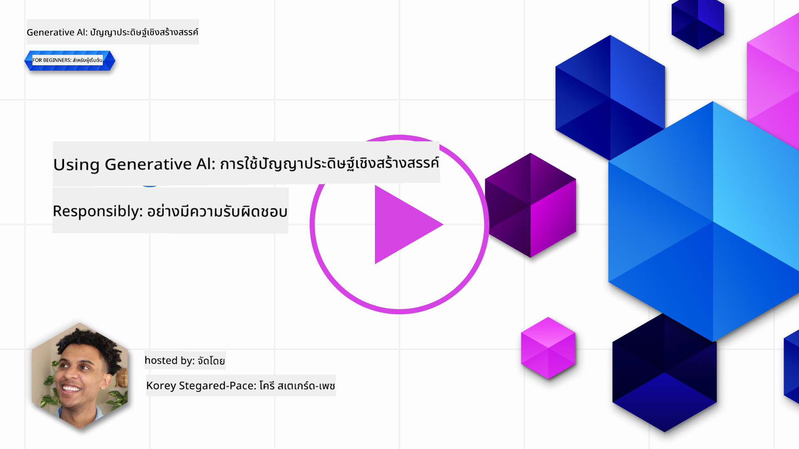
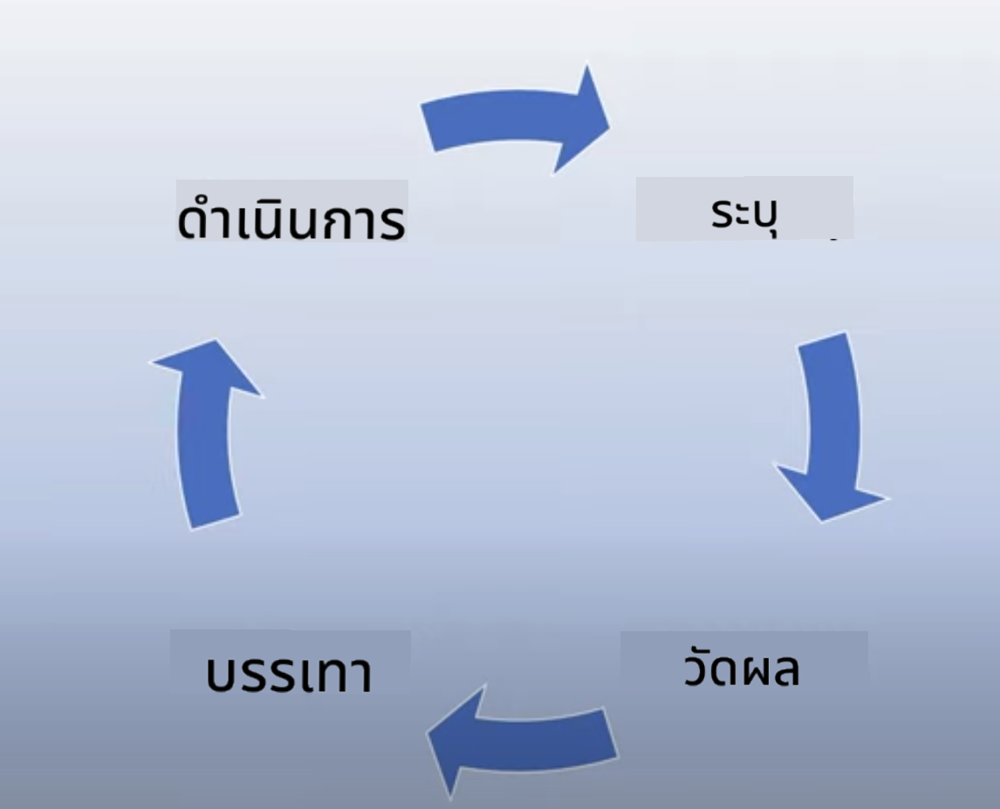
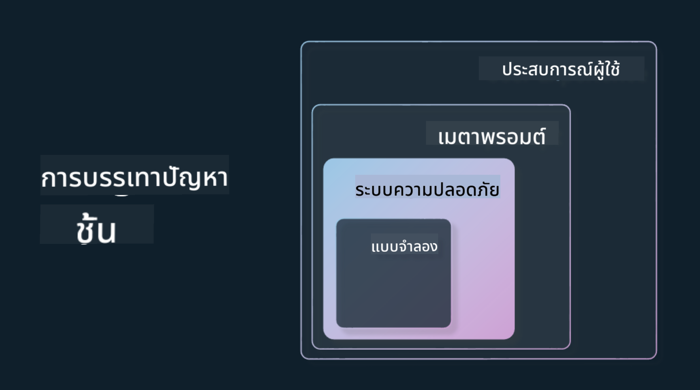

<!--
CO_OP_TRANSLATOR_METADATA:
{
  "original_hash": "7f8f4c11f8c1cb6e1794442dead414ea",
  "translation_date": "2025-07-09T08:56:42+00:00",
  "source_file": "03-using-generative-ai-responsibly/README.md",
  "language_code": "th"
}
-->
# การใช้ Generative AI อย่างรับผิดชอบ

> _คลิกที่ภาพด้านบนเพื่อดูวิดีโอบทเรียนนี้_

การที่เราหลงใหลใน AI โดยเฉพาะ Generative AI เป็นเรื่องง่าย แต่คุณต้องพิจารณาว่าจะใช้มันอย่างรับผิดชอบอย่างไร คุณต้องคำนึงถึงเรื่องต่างๆ เช่น วิธีการทำให้ผลลัพธ์เป็นธรรม ไม่ก่อให้เกิดอันตราย และอื่นๆ บทนี้มีเป้าหมายเพื่อให้บริบทที่กล่าวถึง สิ่งที่ควรพิจารณา และวิธีการดำเนินการอย่างจริงจังเพื่อพัฒนาการใช้งาน AI ของคุณ

## บทนำ

บทเรียนนี้จะครอบคลุม:

- เหตุผลที่คุณควรให้ความสำคัญกับ Responsible AI เมื่อสร้างแอปพลิเคชัน Generative AI
- หลักการสำคัญของ Responsible AI และความสัมพันธ์กับ Generative AI
- วิธีการนำหลักการ Responsible AI ไปใช้จริงผ่านกลยุทธ์และเครื่องมือ

## เป้าหมายการเรียนรู้

หลังจากเรียนบทเรียนนี้จบ คุณจะเข้าใจ:

- ความสำคัญของ Responsible AI เมื่อสร้างแอปพลิเคชัน Generative AI
- เมื่อใดควรคิดและนำหลักการสำคัญของ Responsible AI ไปใช้ในการสร้างแอปพลิเคชัน Generative AI
- เครื่องมือและกลยุทธ์ที่มีให้ใช้เพื่อปฏิบัติแนวคิด Responsible AI

## หลักการ Responsible AI

ความตื่นเต้นกับ Generative AI ไม่เคยสูงขนาดนี้มาก่อน ความตื่นเต้นนี้ได้นำพานักพัฒนารายใหม่ ความสนใจ และเงินทุนจำนวนมากเข้าสู่พื้นที่นี้ แม้ว่าจะเป็นเรื่องดีสำหรับใครก็ตามที่ต้องการสร้างผลิตภัณฑ์และบริษัทโดยใช้ Generative AI แต่ก็สำคัญที่เราจะต้องดำเนินการอย่างรับผิดชอบ

ตลอดหลักสูตรนี้ เราจะมุ่งเน้นการสร้างสตาร์ทอัพและผลิตภัณฑ์การศึกษาด้าน AI ของเรา เราจะใช้หลักการ Responsible AI ได้แก่ ความเป็นธรรม (Fairness), ความครอบคลุม (Inclusiveness), ความน่าเชื่อถือ/ความปลอดภัย (Reliability/Safety), ความมั่นคงและความเป็นส่วนตัว (Security & Privacy), ความโปร่งใส (Transparency) และความรับผิดชอบ (Accountability) ด้วยหลักการเหล่านี้ เราจะสำรวจว่ามันเกี่ยวข้องกับการใช้ Generative AI ในผลิตภัณฑ์ของเราอย่างไร

## ทำไมคุณควรให้ความสำคัญกับ Responsible AI

เมื่อสร้างผลิตภัณฑ์ การใช้แนวทางที่เน้นมนุษย์เป็นศูนย์กลางโดยคำนึงถึงประโยชน์สูงสุดของผู้ใช้จะนำไปสู่ผลลัพธ์ที่ดีที่สุด

ความพิเศษของ Generative AI คือพลังในการสร้างคำตอบ ข้อมูล คำแนะนำ และเนื้อหาที่เป็นประโยชน์สำหรับผู้ใช้ ซึ่งสามารถทำได้โดยไม่ต้องผ่านขั้นตอนด้วยมือมากมาย ทำให้ได้ผลลัพธ์ที่น่าประทับใจมาก แต่หากไม่มีการวางแผนและกลยุทธ์ที่เหมาะสม ก็อาจนำไปสู่ผลลัพธ์ที่เป็นอันตรายต่อผู้ใช้ ผลิตภัณฑ์ และสังคมโดยรวมได้

มาดูตัวอย่างบางส่วน (แต่ไม่ใช่ทั้งหมด) ของผลลัพธ์ที่อาจเป็นอันตรายเหล่านี้:

### Hallucinations

Hallucinations คือคำที่ใช้เรียกเมื่อ LLM สร้างเนื้อหาที่ไม่มีความหมายเลย หรือเป็นสิ่งที่เรารู้ว่าผิดจากข้อเท็จจริงตามแหล่งข้อมูลอื่น

สมมติว่าเราสร้างฟีเจอร์สำหรับสตาร์ทอัพของเราที่ให้นักเรียนถามคำถามเกี่ยวกับประวัติศาสตร์กับโมเดล นักเรียนถามคำถามว่า `ใครเป็นผู้รอดชีวิตเพียงคนเดียวจากเรือไททานิก?`

โมเดลตอบกลับด้วยคำตอบดังนี้:

> _(ที่มา: [Flying bisons](https://flyingbisons.com?WT.mc_id=academic-105485-koreyst))_

นี่เป็นคำตอบที่มั่นใจและละเอียดมาก แต่น่าเสียดายที่มันไม่ถูกต้อง แม้เพียงการค้นคว้าเล็กน้อยก็จะพบว่ามีผู้รอดชีวิตมากกว่าหนึ่งคนจากเหตุการณ์เรือไททานิก สำหรับนักเรียนที่เพิ่งเริ่มต้นศึกษาหัวข้อนี้ คำตอบนี้อาจโน้มน้าวให้เชื่อโดยไม่ตั้งคำถามและถือเป็นข้อเท็จจริง ผลลัพธ์นี้อาจทำให้ระบบ AI ไม่น่าเชื่อถือและส่งผลเสียต่อชื่อเสียงของสตาร์ทอัพของเรา

ในแต่ละเวอร์ชันของ LLM เราเห็นการพัฒนาประสิทธิภาพในการลด hallucinations แม้จะมีการพัฒนานี้ เราในฐานะผู้สร้างแอปและผู้ใช้ยังต้องตระหนักถึงข้อจำกัดเหล่านี้อยู่เสมอ

### เนื้อหาที่เป็นอันตราย

เราได้พูดถึงในส่วนก่อนหน้านี้เมื่อ LLM สร้างคำตอบที่ผิดหรือไม่มีความหมาย อีกความเสี่ยงที่ต้องระวังคือเมื่อโมเดลตอบกลับด้วยเนื้อหาที่เป็นอันตราย

เนื้อหาที่เป็นอันตรายหมายถึง:

- การให้คำแนะนำหรือสนับสนุนการทำร้ายตัวเองหรือผู้อื่นบางกลุ่ม
- เนื้อหาที่เกลียดชังหรือดูถูก
- การชี้แนะการวางแผนการโจมตีหรือการกระทำรุนแรงใดๆ
- การให้คำแนะนำในการค้นหาเนื้อหาที่ผิดกฎหมายหรือการกระทำผิดกฎหมาย
- การแสดงเนื้อหาทางเพศอย่างชัดเจน

สำหรับสตาร์ทอัพของเรา เราต้องมั่นใจว่าเรามีเครื่องมือและกลยุทธ์ที่เหมาะสมเพื่อป้องกันไม่ให้เนื้อหาประเภทนี้ถูกมองเห็นโดยนักเรียน

### ขาดความเป็นธรรม

ความเป็นธรรมหมายถึง “การทำให้ระบบ AI ปราศจากอคติและการเลือกปฏิบัติ และปฏิบัติต่อทุกคนอย่างเท่าเทียมและเป็นธรรม” ในโลกของ Generative AI เราต้องมั่นใจว่าโมเดลไม่เสริมสร้างมุมมองที่กีดกันกลุ่มคนชายขอบผ่านผลลัพธ์ที่สร้างขึ้น

ผลลัพธ์ประเภทนี้ไม่เพียงแต่ทำลายประสบการณ์การใช้ผลิตภัณฑ์ที่ดีสำหรับผู้ใช้ของเราเท่านั้น แต่ยังก่อให้เกิดความเสียหายต่อสังคมมากขึ้นอีกด้วย ในฐานะผู้สร้างแอป เราควรคำนึงถึงฐานผู้ใช้ที่กว้างและหลากหลายเสมอเมื่อสร้างโซลูชันด้วย Generative AI

## วิธีใช้ Generative AI อย่างรับผิดชอบ

เมื่อเราเข้าใจความสำคัญของ Responsible Generative AI แล้ว มาดู 4 ขั้นตอนที่เราสามารถทำได้เพื่อสร้างโซลูชัน AI อย่างรับผิดชอบ:

### วัดผลความเสี่ยงที่อาจเกิดขึ้น

ในการทดสอบซอฟต์แวร์ เราทดสอบการกระทำที่คาดหวังของผู้ใช้บนแอปพลิเคชัน ในทำนองเดียวกัน การทดสอบชุดคำถามที่หลากหลายซึ่งผู้ใช้น่าจะใช้บ่อยเป็นวิธีที่ดีในการวัดความเสี่ยงที่อาจเกิดขึ้น

เนื่องจากสตาร์ทอัพของเรากำลังสร้างผลิตภัณฑ์การศึกษา การเตรียมรายการคำถามที่เกี่ยวข้องกับการศึกษา เช่น หัวข้อวิชา ข้อเท็จจริงทางประวัติศาสตร์ และคำถามเกี่ยวกับชีวิตนักเรียน จะเป็นประโยชน์

### ลดความเสี่ยงที่อาจเกิดขึ้น

ถึงเวลาหาวิธีป้องกันหรือลดความเสี่ยงที่อาจเกิดจากโมเดลและคำตอบของมัน เราสามารถพิจารณาใน 4 ชั้นต่างๆ ดังนี้:

- **Model** เลือกโมเดลที่เหมาะสมกับกรณีการใช้งาน โมเดลที่ใหญ่และซับซ้อนกว่า เช่น GPT-4 อาจมีความเสี่ยงในการสร้างเนื้อหาที่เป็นอันตรายมากขึ้นเมื่อใช้กับกรณีการใช้งานที่เล็กและเฉพาะเจาะจง การใช้ข้อมูลฝึกอบรมของคุณเองเพื่อปรับแต่งโมเดลยังช่วยลดความเสี่ยงนี้ได้

- **Safety System** ระบบความปลอดภัยคือชุดเครื่องมือและการตั้งค่าบนแพลตฟอร์มที่ให้บริการโมเดลเพื่อช่วยลดความเสี่ยง ตัวอย่างเช่น ระบบกรองเนื้อหาบนบริการ Azure OpenAI ระบบเหล่านี้ควรตรวจจับการโจมตี jailbreak และกิจกรรมที่ไม่พึงประสงค์ เช่น คำขอจากบอท

- **Metaprompt** Metaprompt และ grounding คือวิธีที่เราสามารถกำหนดหรือจำกัดโมเดลตามพฤติกรรมและข้อมูลบางอย่าง เช่น การใช้ข้อมูลระบบเพื่อกำหนดขอบเขตของโมเดล นอกจากนี้ยังช่วยให้ผลลัพธ์มีความเกี่ยวข้องกับขอบเขตหรือโดเมนของระบบมากขึ้น

นอกจากนี้ยังสามารถใช้เทคนิคอย่าง Retrieval Augmented Generation (RAG) เพื่อให้โมเดลดึงข้อมูลเฉพาะจากแหล่งที่เชื่อถือได้เท่านั้น มีบทเรียนในหลักสูตรนี้เกี่ยวกับ [การสร้างแอปพลิเคชันค้นหา](../08-building-search-applications/README.md?WT.mc_id=academic-105485-koreyst)

- **User Experience** ชั้นสุดท้ายคือที่ที่ผู้ใช้โต้ตอบกับโมเดลผ่านอินเทอร์เฟซของแอปพลิเคชัน เราสามารถออกแบบ UI/UX เพื่อจำกัดประเภทของข้อมูลที่ผู้ใช้ส่งไปยังโมเดล รวมถึงข้อความหรือภาพที่แสดงให้ผู้ใช้เห็น เมื่อเปิดใช้งานแอป AI เราต้องโปร่งใสเกี่ยวกับสิ่งที่แอป Generative AI ของเราทำได้และทำไม่ได้

เรามีบทเรียนทั้งหมดที่อุทิศให้กับ [การออกแบบ UX สำหรับแอป AI](../12-designing-ux-for-ai-applications/README.md?WT.mc_id=academic-105485-koreyst)

- **ประเมินโมเดล** การทำงานกับ LLM อาจท้าทายเพราะเราไม่สามารถควบคุมข้อมูลที่ใช้ฝึกโมเดลได้เสมอไป อย่างไรก็ตาม เราควรประเมินประสิทธิภาพและผลลัพธ์ของโมเดลเสมอ การวัดความแม่นยำ ความคล้ายคลึง ความมีพื้นฐาน และความเกี่ยวข้องของผลลัพธ์ยังคงสำคัญ ซึ่งช่วยสร้างความโปร่งใสและความไว้วางใจให้กับผู้มีส่วนได้ส่วนเสียและผู้ใช้

### ดำเนินการโซลูชัน Generative AI อย่างรับผิดชอบ

การสร้างแนวปฏิบัติการใช้งานรอบด้านสำหรับแอป AI ของคุณคือขั้นตอนสุดท้าย ซึ่งรวมถึงการร่วมมือกับฝ่ายอื่นๆ ในสตาร์ทอัพ เช่น ฝ่ายกฎหมายและฝ่ายความปลอดภัย เพื่อให้มั่นใจว่าเราปฏิบัติตามนโยบายและกฎระเบียบทั้งหมด ก่อนเปิดตัว เรายังต้องวางแผนการส่งมอบ การจัดการเหตุการณ์ และการย้อนกลับเพื่อป้องกันความเสียหายที่อาจเกิดขึ้นกับผู้ใช้

## เครื่องมือ

แม้ว่าการพัฒนาโซลูชัน Responsible AI อาจดูเหมือนงานหนัก แต่เป็นงานที่คุ้มค่า เมื่อพื้นที่ Generative AI เติบโตขึ้น เครื่องมือที่ช่วยให้นักพัฒนาผสานความรับผิดชอบเข้ากับกระบวนการทำงานได้อย่างมีประสิทธิภาพก็จะพัฒนาไปด้วย เช่น [Azure AI Content Safety](https://learn.microsoft.com/azure/ai-services/content-safety/overview?WT.mc_id=academic-105485-koreyst) ที่ช่วยตรวจจับเนื้อหาและภาพที่เป็นอันตรายผ่านการเรียก API

## ตรวจสอบความรู้

มีสิ่งใดบ้างที่คุณต้องใส่ใจเพื่อให้การใช้ AI เป็นไปอย่างรับผิดชอบ?

1. คำตอบต้องถูกต้อง  
1. การใช้งานที่เป็นอันตราย ต้องไม่ใช้ AI เพื่อวัตถุประสงค์ทางอาชญากรรม  
1. ต้องมั่นใจว่า AI ปราศจากอคติและการเลือกปฏิบัติ

ตอบ: ข้อ 2 และ 3 ถูกต้อง Responsible AI ช่วยให้คุณพิจารณาวิธีลดผลกระทบที่เป็นอันตรายและอคติ รวมถึงเรื่องอื่นๆ

## 🚀 ความท้าทาย

อ่านเพิ่มเติมเกี่ยวกับ [Azure AI Content Safety](https://learn.microsoft.com/azure/ai-services/content-safety/overview?WT.mc_id=academic-105485-koreyst) และดูว่าคุณจะนำไปใช้กับการใช้งานของคุณได้อย่างไร

## ทำได้ดีมาก ต่อเนื่องการเรียนรู้ของคุณ

หลังจากเรียนบทเรียนนี้จบแล้ว ลองดู [คอลเลกชันการเรียนรู้ Generative AI](https://aka.ms/genai-collection?WT.mc_id=academic-105485-koreyst) เพื่อพัฒนาความรู้ด้าน Generative AI ของคุณให้สูงขึ้น!

ไปที่บทเรียนที่ 4 ซึ่งเราจะพูดถึง [พื้นฐานการออกแบบ Prompt](../04-prompt-engineering-fundamentals/README.md?WT.mc_id=academic-105485-koreyst)!

**ข้อจำกัดความรับผิดชอบ**:  
เอกสารนี้ได้รับการแปลโดยใช้บริการแปลภาษาอัตโนมัติ [Co-op Translator](https://github.com/Azure/co-op-translator) แม้เราจะพยายามให้ความถูกต้องสูงสุด แต่โปรดทราบว่าการแปลอัตโนมัติอาจมีข้อผิดพลาดหรือความไม่ถูกต้อง เอกสารต้นฉบับในภาษาต้นทางถือเป็นแหล่งข้อมูลที่เชื่อถือได้ สำหรับข้อมูลที่สำคัญ ขอแนะนำให้ใช้บริการแปลโดยผู้เชี่ยวชาญมนุษย์ เราไม่รับผิดชอบต่อความเข้าใจผิดหรือการตีความผิดใด ๆ ที่เกิดจากการใช้การแปลนี้