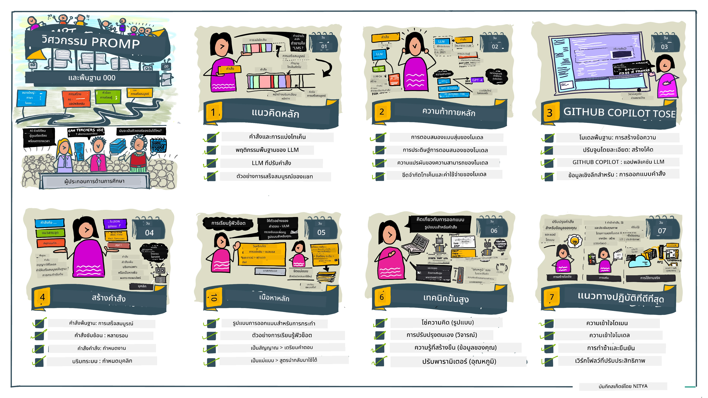
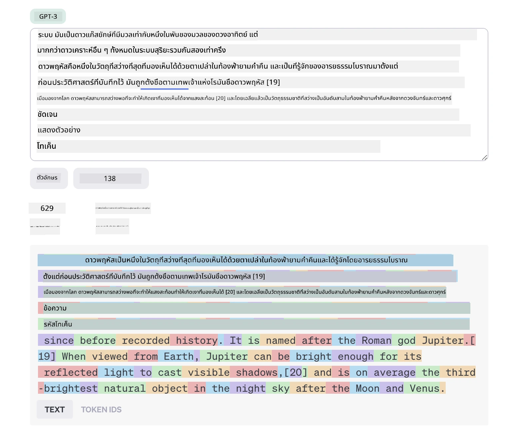
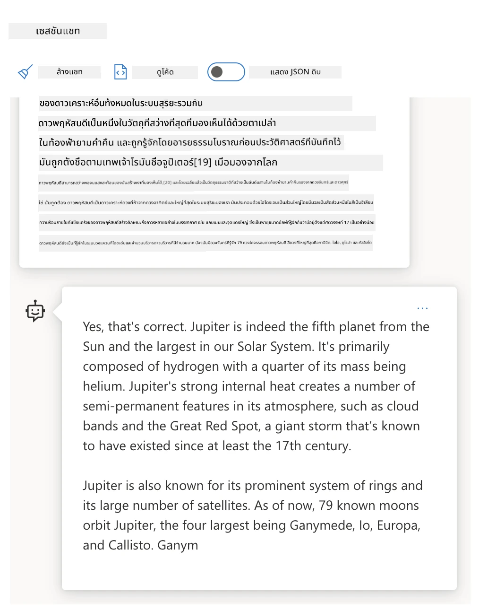
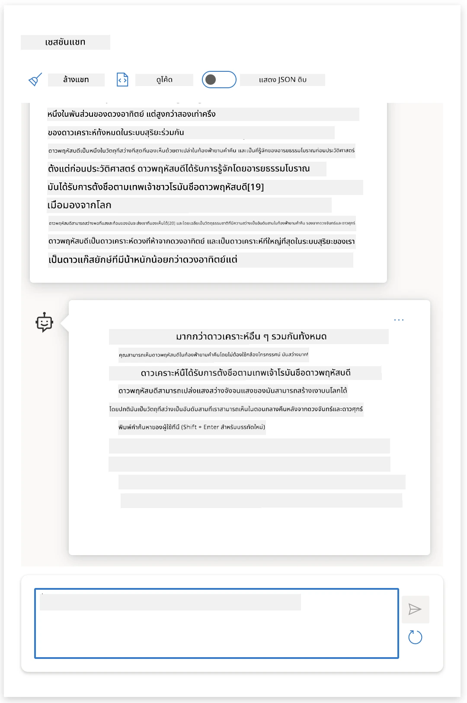
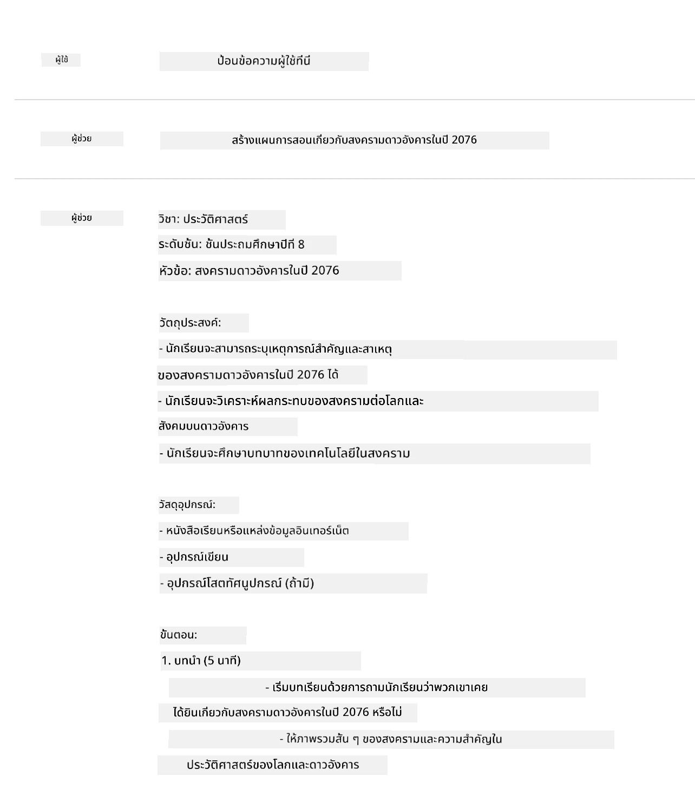
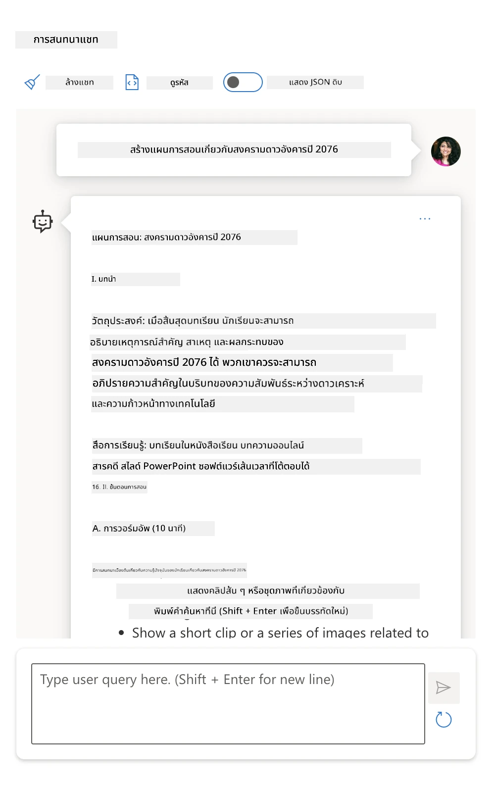
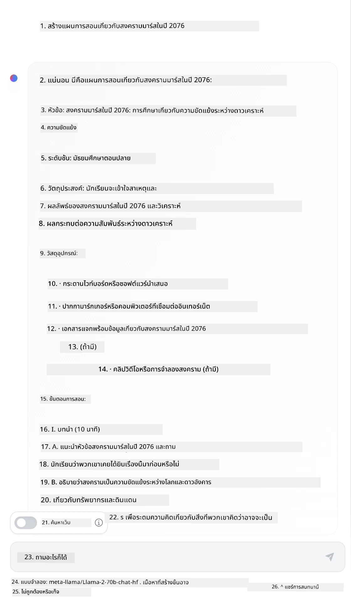

# หลักการพื้นฐานของการออกแบบพรอมต์

[](https://youtu.be/GElCu2kUlRs?si=qrXsBvXnCW12epb8)

## บทนำ
โมดูลนี้ครอบคลุมแนวคิดและเทคนิคสำคัญสำหรับการสร้างพรอมต์ที่มีประสิทธิภาพในโมเดล AI สร้างสรรค์ วิธีการเขียนพรอมต์ไปยัง LLM ก็มีความสำคัญเช่นกัน พรอมต์ที่ถูกออกแบบอย่างรอบคอบสามารถทำให้ได้คุณภาพการตอบสนองที่ดีกว่า แต่คำว่า _พรอมต์_ และ _การออกแบบพรอมต์_ หมายถึงอะไรกันแน่? และฉันจะปรับปรุงข้อมูล _อินพุตพรอมต์_ ที่ฉันส่งไปยัง LLM ได้อย่างไร? คำถามเหล่านี้เราจะพยายามตอบภายในบทนี้และบทถัดไป

_Generative AI_ มีความสามารถในการสร้างเนื้อหาใหม่ (เช่น ข้อความ, รูปภาพ, เสียง, โค้ด ฯลฯ) ตามคำร้องขอของผู้ใช้ โดยใช้ _โมเดลภาษาใหญ่ (LLMs)_ เช่น ซีรีส์ GPT ของ OpenAI ("Generative Pre-trained Transformer") ซึ่งได้รับการฝึกฝนเพื่อใช้ภาษาธรรมชาติและโค้ด

ผู้ใช้สามารถโต้ตอบกับโมเดลเหล่านี้ได้โดยใช้รูปแบบที่คุ้นเคย เช่น แชท โดยไม่จำเป็นต้องมีความเชี่ยวชาญทางเทคนิคหรือการฝึกอบรม โมเดลเหล่านี้เป็นแบบ _ขึ้นอยู่กับพรอมต์_ — ผู้ใช้ส่งข้อความอินพุต (พรอมต์) และได้รับการตอบกลับจาก AI (การเติมข้อมูล) จากนั้นสามารถ "แชทกับ AI" อย่างต่อเนื่องในบทสนทนาหลายรอบ ปรับพรอมต์จนกว่าคำตอบจะตรงกับความคาดหวัง

“พรอมต์” กลายเป็น _อินเทอร์เฟซโปรแกรมหลัก_ สำหรับแอป generative AI บอกโมเดลว่าจะทำอะไร และมีผลต่อคุณภาพของการตอบกลับ “การออกแบบพรอมต์” เป็นสาขาวิชาที่เติบโตอย่างรวดเร็วที่มุ่งเน้นที่ _การออกแบบและการปรับแต่ง_ พรอมต์เพื่อให้ได้การตอบสนองที่สม่ำเสมอและมีคุณภาพในระดับกว้าง

## เป้าหมายการเรียนรู้

ในบทเรียนนี้ เราจะเรียนรู้ว่า การออกแบบพรอมต์คืออะไร ทำไมจึงสำคัญ และเราจะสร้างพรอมต์ที่มีประสิทธิภาพมากขึ้นสำหรับโมเดลและวัตถุประสงค์แอปพลิเคชันได้อย่างไร เราจะเข้าใจแนวคิดหลักและแนวทางปฏิบัติที่ดีที่สุดสำหรับการออกแบบพรอมต์ — และเรียนรู้เกี่ยวกับสภาพแวดล้อม *sandbox* แบบโต้ตอบด้วย Jupyter Notebooks ซึ่งเราสามารถดูแนวคิดเหล่านี้ถูกใช้ในตัวอย่างจริง

เมื่อจบบทเรียนนี้ เราจะสามารถ:

1. อธิบายว่าการออกแบบพรอมต์คืออะไรและทำไมจึงสำคัญ
2. อธิบายส่วนประกอบของพรอมต์และวิธีการใช้งาน
3. เรียนรู้แนวปฏิบัติและเทคนิคที่ดีที่สุดสำหรับการออกแบบพรอมต์
4. นำเทคนิคที่เรียนรู้ไปใช้กับตัวอย่างจริงโดยใช้ OpenAI endpoint

## คำศัพท์สำคัญ

การออกแบบพรอมต์ (Prompt Engineering): การปฏิบัติในการออกแบบและปรับแต่งอินพุตเพื่อชี้นำโมเดล AI ให้ผลิตผลลัพธ์ตามที่ต้องการ  
การแยกหน่วยภาษา (Tokenization): กระบวนการแปลงข้อความเป็นหน่วยเล็ก ๆ ที่เรียกว่าโทเคน ซึ่งโมเดลสามารถเข้าใจและประมวลผลได้  
Instruction-Tuned LLMs: โมเดลภาษาใหญ่ที่ได้รับการฝึกเพิ่มเติมด้วยคำสั่งเฉพาะเพื่อปรับปรุงความแม่นยำและความเกี่ยวข้องของการตอบสนอง  

## Learning Sandbox

การออกแบบพรอมต์ในปัจจุบันยังถือว่าเป็นศิลปะมากกว่าวิทยาศาสตร์ วิธีที่ดีที่สุดในการปรับปรุงสัญชาตญาณของเราคือการ _ฝึกฝนมากขึ้น_ และใช้วิธีลองผิดลองถูก ซึ่งผสมผสานความเชี่ยวชาญในโดเมนการใช้งานกับเทคนิคแนะนำและการปรับแต่งเฉพาะโมเดล

Jupyter Notebook ที่แนบมาพร้อมบทเรียนนี้มีสภาพแวดล้อม _sandbox_ ที่คุณสามารถทดลองสิ่งที่เรียนรู้ไปแล้ว — ระหว่างเรียนหรือเป็นส่วนหนึ่งของความท้าทายโค้ดตอนท้าย ในการดำเนินแบบฝึกหัด คุณจะต้องมี:

1. **คีย์ API Azure OpenAI** — จุดเชื่อมต่อบริการสำหรับ LLM ที่ผ่านการปรับใช้  
2. **สภาพแวดล้อม Python Runtime** — สำหรับรัน Notebook  
3. **ตัวแปรสภาพแวดล้อมในเครื่อง** — _ทำตามขั้นตอน [SETUP](./../00-course-setup/02-setup-local.md?WT.mc_id=academic-105485-koreyst) ตอนนี้เพื่อเตรียมพร้อม_

โน้ตบุ๊คมาพร้อมแบบฝึกหัด _เริ่มต้น_ — แต่คุณสามารถเสริมส่วน _Markdown_ (คำอธิบาย) และ _Code_ (คำขอพรอมต์) ของคุณเองเพื่อทดลองตัวอย่างหรือไอเดียเพิ่มเติม — และสร้างสัญชาตญาณสำหรับการออกแบบพรอมต์

## คู่มือภาพประกอบ

ต้องการภาพรวมของสิ่งที่บทเรียนนี้ครอบคลุมก่อนเริ่มเรียนไหม? ลองดูคู่มือภาพประกอบนี้ ซึ่งจะช่วยให้เห็นหัวข้อหลักที่ครอบคลุมและแนวคิดสำคัญที่ควรคิดในแต่ละหัวข้อ แผนที่บทเรียนพาคุณจากการเข้าใจแนวคิดหลักและความท้าทาย ไปสู่การแก้ไขด้วยเทคนิคการออกแบบพรอมต์ที่เกี่ยวข้องและแนวปฏิบัติที่ดีที่สุด โปรดทราบว่าส่วน "เทคนิคขั้นสูง" ในคู่มือนี้ หมายถึงเนื้อหาที่ครอบคลุมในบทถัดไปของหลักสูตรนี้



## สตาร์ตอัพของเรา

ตอนนี้ มาพูดถึงว่า _หัวข้อนี้_ เกี่ยวข้องกับพันธกิจสตาร์ตอัพของเราที่ [นำพานวัตกรรม AI สู่การศึกษา](https://educationblog.microsoft.com/2023/06/collaborating-to-bring-ai-innovation-to-education?WT.mc_id=academic-105485-koreyst) อย่างไร เราต้องการสร้างแอป AI ที่ขับเคลื่อนการเรียนรู้ _แบบส่วนบุคคล_ — ลองคิดว่าผู้ใช้แต่ละกลุ่มของแอปเราจะ "ออกแบบ" พรอมต์กันอย่างไร:

- **ผู้ดูแลระบบ** อาจขอให้ AI _วิเคราะห์ข้อมูลหลักสูตรเพื่อระบุช่องว่างในเนื้อหา_ AI สามารถสรุปผลลัพธ์หรือแสดงผลเป็นภาพด้วยโค้ด  
- **ครูผู้สอน** อาจขอให้ AI _สร้างแผนการสอนสำหรับกลุ่มเป้าหมายและหัวข้อ_ AI จะสร้างแผนส่วนบุคคลในรูปแบบที่กำหนด  
- **นักเรียน** อาจขอให้ AI _ติวเตอร์พวกเขาในวิชาที่ยาก_ AI จะช่วยสอนด้วยบทเรียน คำแนะนำ และตัวอย่างที่เหมาะให้ตรงกับระดับของนักเรียน

นี่เป็นเพียงจุดเริ่มต้น ลองดูที่ [Prompts For Education](https://github.com/microsoft/prompts-for-edu/tree/main?WT.mc_id=academic-105485-koreyst) — ห้องสมุดพรอมต์โอเพ่นซอร์สที่คัดสรรโดยผู้เชี่ยวชาญทางการศึกษา — เพื่อเห็นขอบเขตความเป็นไปได้ที่กว้างขึ้น! _ลองรันพรอมต์เหล่านี้ใน sandbox หรือใช้ OpenAI Playground ดูว่าเกิดอะไรขึ้น!_

<!--
LESSON TEMPLATE:
This unit should cover core concept #1.
Reinforce the concept with examples and references.

CONCEPT #1:
Prompt Engineering.
Define it and explain why it is needed.
-->

## การออกแบบพรอมต์คืออะไร?

เราเริ่มบทเรียนนี้ด้วยการนิยาม **การออกแบบพรอมต์** ว่าเป็นกระบวนการ _ออกแบบและปรับแต่ง_ อินพุตข้อความ (พรอมต์) เพื่อให้ได้การตอบสนอง (completion) ที่สม่ำเสมอและมีคุณภาพสำหรับวัตถุประสงค์ของแอปและโมเดลที่กำหนด เราสามารถคิดเป็นขั้นตอน 2 ขั้นตอน:

- _ออกแบบ_ พรอมต์เริ่มต้นสำหรับโมเดลและวัตถุประสงค์ที่กำหนด  
- _ปรับแต่ง_ พรอมต์ซ้ำ ๆ เพื่อเพิ่มคุณภาพการตอบสนอง

นี่เป็นกระบวนการที่ต้องลองผิดลองถูก ซึ่งต้องใช้สัญชาตญาณและความพยายามจากผู้ใช้เพื่อให้ได้ผลลัพธ์ที่เหมาะสม แล้วทำไมมันถึงสำคัญ? คำตอบคือเราต้องเข้าใจสามแนวคิดนี้ก่อน:

- _Tokenization_ = โมเดล "มองเห็น" พรอมต์อย่างไร  
- _Base LLMs_ = โมเดลฐาน "ประมวลผล" พรอมต์อย่างไร  
- _Instruction-Tuned LLMs_ = โมเดลสามารถมองเห็น "งาน" ได้อย่างไร

### Tokenization

LLM มองพรอมต์เป็น _ลำดับของโทเคน_ ซึ่งโมเดลต่าง ๆ (หรือเวอร์ชันของโมเดล) สามารถแยกโทเคนของพรอมต์เดียวกันได้แตกต่างกัน เนื่องจาก LLM ถูกฝึกด้วยโทเคน (ไม่ใช่ข้อความดิบ) วิธีที่พรอมต์ถูกแบ่งโทเคนจึงส่งผลโดยตรงต่อคุณภาพของคำตอบที่สร้างขึ้น

เพื่อเข้าใจการทำงานของ Tokenization ให้ลองใช้เครื่องมืออย่าง [OpenAI Tokenizer](https://platform.openai.com/tokenizer?WT.mc_id=academic-105485-koreyst) ด้านล่างนี้ คัดลอกพรอมต์ของคุณเข้าไป แล้วดูว่ามันถูกแปลงเป็นโทเคนอย่างไร โดยสังเกตการจัดการช่องว่างและเครื่องหมายวรรคตอน โปรดทราบว่าตัวอย่างนี้แสดงโมเดล LLM รุ่นเก่า (GPT-3) ดังนั้นการลองกับโมเดลใหม่กว่าอาจให้ผลลัพธ์ต่างกัน



### แนวคิด: โมเดลฐาน

เมื่อพรอมต์ถูกแบ่งโทเคนแล้ว ฟังก์ชันหลักของ ["Base LLM"](https://blog.gopenai.com/an-introduction-to-base-and-instruction-tuned-large-language-models-8de102c785a6?WT.mc_id=academic-105485-koreyst) (หรือโมเดลฐาน) คือการทำนายโทเคนถัดไปในลำดับนั้น เนื่องจาก LLM ถูกฝึกบนชุดข้อมูลข้อความจำนวนมหาศาล ทำให้มันมีความเข้าใจเชิงสถิติของความสัมพันธ์ระหว่างโทเคนและสามารถทำนายได้อย่างมั่นใจ โปรดทราบว่ามันไม่เข้าใจ _ความหมาย_ ของคำในพรอมต์หรอโทเคน เพียงแค่เห็นรูปแบบที่สามารถ "เติมเต็ม" ด้วยการทำนายถัดไป โมเดลสามารถทำนายลำดับต่อเนื่องจนกว่าจะถูกหยุดโดยผู้ใช้หรือเงื่อนไขที่ตั้งไว้ล่วงหน้า

อยากเห็นว่าการเติมเนื้อหาด้วยพรอมต์ทำงานอย่างไร? ใส่พรอมต์ด้านบนใน Azure OpenAI Studio [_Chat Playground_](https://oai.azure.com/playground?WT.mc_id=academic-105485-koreyst) ด้วยการตั้งค่าพื้นฐาน ระบบถูกตั้งค่าให้ปฏิบัติต่อพรอมต์เป็นการขอข้อมูล — คุณจะเห็นการเติมเนื้อหาที่สอดคล้องกับบริบทนี้

แต่ถ้าผู้ใช้ต้องการเห็นบางสิ่งบางอย่างที่ตรงตามเกณฑ์หรือเป้าหมายของงานล่ะ? นี่คือที่ที่ _Instruction-tuned_ LLM เข้ามา



### แนวคิด: Instruction Tuned LLMs

[Instruction Tuned LLM](https://blog.gopenai.com/an-introduction-to-base-and-instruction-tuned-large-language-models-8de102c785a6?WT.mc_id=academic-105485-koreyst) เริ่มต้นด้วยโมเดลฐานและฝึกปรับแต่งเพิ่มเติมกับตัวอย่างหรือคู่ข้อมูลอินพุต/ผลลัพธ์ (เช่น "ข้อความ" หลายรอบ) ที่มีคำสั่งชัดเจน — และ AI พยายามตอบสนองให้สอดคล้องกับคำสั่งนั้น

ใช้เทคนิคอย่าง Reinforcement Learning with Human Feedback (RLHF) ที่ช่วยฝึกโมเดลให้ _ปฏิบัติตามคำสั่ง_ และ _เรียนรู้จากข้อเสนอแนะ_ เพื่อให้ได้การตอบสนองที่เหมาะสมกับแอปพลิเคชันจริงและเกี่ยวข้องกับวัตถุประสงค์ของผู้ใช้มากขึ้น

ลองทำดู — กลับไปที่พรอมต์ข้างต้น แต่เปลี่ยน _system message_ เพื่อให้คำสั่งต่อไปนี้เป็นบริบท:

> _สรุปเนื้อหาที่ได้รับให้กับนักเรียนชั้นประถมศึกษาปีที่ 2 จำกัดผลลัพธ์เป็นย่อหน้าเดียวพร้อมจุดย่อย 3-5 ข้อ_

ดูว่าผลลัพธ์ถูกปรับแต่งให้สะท้อนเป้าหมายและรูปแบบที่ต้องการอย่างไร ครูผู้สอนสามารถใช้งานตอบกลับนี้โดยตรงในสไลด์สำหรับชั้นเรียนได้



## ทำไมเราต้องการการออกแบบพรอมต์?

เมื่อเรารู้ว่า LLM ประมวลผลพรอมต์อย่างไร ต่อไปมาคุยกันว่า _ทำไม_ เราต้องการการออกแบบพรอมต์ คำตอบอยู่ที่ว่า LLM ปัจจุบันมีความท้าทายหลายประการซึ่งทำให้ _การเติมเนื้อหาที่เชื่อถือได้และสม่ำเสมอ_ ยากขึ้นหากไม่ใส่ความพยายามในการสร้างและปรับแต่งพรอมต์ เช่น:

1. **การตอบกลับของโมเดลมีความสุ่ม** _พรอมต์เดิม_ อาจให้ผลลัพธ์ต่างกันเมื่อใช้โมเดลต่างกันหรือเวอร์ชันต่างกัน และอาจให้ผลลัพธ์แตกต่างกันแม้แต่กับ _โมเดลเดียวกัน_ ในเวลาต่างกัน _เทคนิคการออกแบบพรอมต์ช่วยลดความแปรปรวนเหล่านี้โดยจัดกรอบการใช้งานได้ดีขึ้น_

1. **โมเดลอาจสร้างข้อมูลเท็จ** โมเดลได้รับการฝึกด้วยชุดข้อมูลที่ _ใหญ่แต่จำกัด_ หมายความว่ามันขาดความรู้ในเรื่องที่อยู่นอกขอบเขตการฝึก ดังนั้นมันจึงอาจสร้างคำตอบที่ไม่ถูกต้อง หรือนิทาน หรือขัดแย้งกับข้อเท็จจริงที่รู้ _เทคนิคการออกแบบพรอมต์ช่วยให้ผู้ใช้ระบุและลดผลกระทบจากสิ่งเหล่านี้ เช่น การขอให้ AI อ้างอิงหรือให้เหตุผล_

1. **ความสามารถของโมเดลจะแตกต่างกัน** โมเดลใหม่หรือรุ่นใหม่จะมีความสามารถมากขึ้น แต่ก็มีความลักษณะเฉพาะและข้อจำกัดที่แตกต่างกันในเรื่องต้นทุนและความซับซ้อน _การออกแบบพรอมต์ช่วยพัฒนาแนวปฏิบัติและเวิร์กโฟลว์ที่ซ่อนความแตกต่างและปรับให้เหมาะกับความต้องการเฉพาะของโมเดลได้อย่างราบรื่นและขยายได้_

ลองดูสิ่งนี้ใน OpenAI หรือ Azure OpenAI Playground:

- ใช้พรอมต์เดียวกันกับการปรับใช้ LLM ต่าง ๆ (เช่น OpenAI, Azure OpenAI, Hugging Face) — คุณเห็นความแตกต่างไหม?  
- ใช้พรอมต์เดียวกันซ้ำ ๆ กับการปรับใช้ LLM _เดียวกัน_ (เช่น Azure OpenAI playground) — ความแตกต่างเหล่านี้เป็นอย่างไร?

### ตัวอย่าง Fabrications

ในหลักสูตรนี้ เราใช้คำว่า **"fabrication"** เพื่ออ้างถึงปรากฏการณ์ที่ LLM บางครั้งสร้างข้อมูลที่ผิดพลาดเนื่องจากข้อจำกัดของการฝึกหรือข้อจำกัดอื่น ๆ คุณอาจเคยได้ยินคำนี้ในบทความหรือการวิจัยที่เรียกว่า _"hallucinations"_ อย่างไรก็ตาม เราแนะนำให้ใช้คำว่า _"fabrication"_ เพื่อไม่ให้พฤติกรรมถูกเข้าใจผิดว่าเป็นลักษณะของมนุษย์ซึ่งไม่เหมาะสมและเสริมแนวทาง [Responsible AI](https://www.microsoft.com/ai/responsible-ai?WT.mc_id=academic-105485-koreyst) ในแง่ของคำศัพท์ ซึ่งตัดคำที่อาจถือว่าไม่เหมาะสมหรือไม่ครอบคลุมในบางบริบทออก

อยากรู้ว่าการสร้างข้อมูลเท็จทำงานอย่างไร? ลองคิดพรอมต์ที่สั่งให้ AI สร้างเนื้อหาสำหรับหัวข้อที่ไม่มีอยู่จริง (เพื่อให้แน่ใจว่าไม่มีในชุดข้อมูลฝึก) ตัวอย่างเช่น — ฉันทดลองพรอมต์นี้:

> **พรอมต์:** สร้างแผนการสอนเกี่ยวกับสงครามดาวอังคารในปี 2076.
การค้นหาทางเว็บแสดงให้ฉันเห็นว่ามีเรื่องเล่าจินตนาการ (เช่น รายการโทรทัศน์หรือหนังสือ) เกี่ยวกับสงครามดาวอังคาร - แต่ไม่มีในปี 2076 สัญชาตญาณก็ยังบอกเราว่า 2076 อยู่ _ในอนาคต_ และดังนั้น ไม่สามารถเชื่อมโยงกับเหตุการณ์จริงได้

แล้วจะเกิดอะไรขึ้นเมื่อเรารันพรอมต์นี้กับผู้ให้บริการ LLM ต่างกัน?

> **คำตอบที่ 1**: OpenAI Playground (GPT-35)



> **คำตอบที่ 2**: Azure OpenAI Playground (GPT-35)



> **คำตอบที่ 3**: : Hugging Face Chat Playground (LLama-2)



ตามที่คาดไว้ แต่ละโมเดล (หรือเวอร์ชันของโมเดล) สร้างคำตอบที่แตกต่างกันเล็กน้อย เนื่องจากพฤติกรรมแบบสุ่มและความสามารถที่แตกต่างกันของโมเดล ตัวอย่างเช่น โมเดลหนึ่งมีเป้าหมายสำหรับผู้ฟังระดับมัธยมต้น ในขณะที่อีกโมเดลหนึ่งสมมติว่าผู้ใช้เป็นนักเรียนมัธยมปลาย แต่ทั้งสามโมเดลต่างก็สร้างคำตอบที่อาจโน้มน้าวให้ผู้ใช้ที่ไม่มีข้อมูลเชื่อว่าเหตุการณ์นั้นเป็นเรื่องจริง

เทคนิคการออกแบบพรอมต์ เช่น _metaprompting_ และ _temperature configuration_ อาจช่วยลดการสร้างข้อมูลเท็จของโมเดลได้ในระดับหนึ่ง สถาปัตยกรรมการออกแบบพรอมต์ใหม่ ๆ ยังผสานรวมเครื่องมือและเทคนิคใหม่ ๆ เข้าไปในลำดับพรอมต์อย่างราบรื่น เพื่อบรรเทาหรือช่วยลดผลกระทบบางส่วนเหล่านี้

## กรณีศึกษา: GitHub Copilot

เราจะสรุปส่วนนี้ด้วยการทำความเข้าใจว่าเทคนิคการออกแบบพรอมต์ถูกใช้ในโซลูชันในโลกจริงอย่างไร ผ่านการดูกรณีศึกษา: [GitHub Copilot](https://github.com/features/copilot?WT.mc_id=academic-105485-koreyst)

GitHub Copilot คือ "โปรแกรมเมอร์คู่ AI" ของคุณ - มันแปลงพรอมต์ข้อความเป็นโค้ดที่เติมเต็มและถูกรวมเข้ากับสภาพแวดล้อมการพัฒนาของคุณ (เช่น Visual Studio Code) เพื่อประสบการณ์ผู้ใช้ที่ราบรื่น ตามที่บันทึกในซีรีส์บทความด้านล่าง เวอร์ชันแรกสุดอิงจากโมเดล OpenAI Codex - โดยวิศวกรตระหนักได้อย่างรวดเร็วถึงความจำเป็นในการปรับแต่งโมเดลและพัฒนาเทคนิคการออกแบบพรอมต์ที่ดียิ่งขึ้น เพื่อปรับปรุงคุณภาพโค้ด ในเดือนกรกฎาคม พวกเขาได้ [เปิดตัวโมเดล AI ที่ปรับปรุงแล้วซึ่งก้าวข้าม Codex](https://github.blog/2023-07-28-smarter-more-efficient-coding-github-copilot-goes-beyond-codex-with-improved-ai-model/?WT.mc_id=academic-105485-koreyst) สำหรับคำแนะนำที่รวดเร็วขึ้น

อ่านโพสต์ตามลำดับเพื่อทำตามเส้นทางการเรียนรู้ของพวกเขา

- **พฤษภาคม 2023** | [GitHub Copilot กำลังเข้าใจโค้ดของคุณได้ดีขึ้น](https://github.blog/2023-05-17-how-github-copilot-is-getting-better-at-understanding-your-code/?WT.mc_id=academic-105485-koreyst)
- **พฤษภาคม 2023** | [เบื้องหลัง GitHub: การทำงานกับ LLMs เบื้องหลัง GitHub Copilot](https://github.blog/2023-05-17-inside-github-working-with-the-llms-behind-github-copilot/?WT.mc_id=academic-105485-koreyst)
- **มิถุนายน 2023** | [วิธีเขียนพรอมต์ที่ดีกว่าสำหรับ GitHub Copilot](https://github.blog/2023-06-20-how-to-write-better-prompts-for-github-copilot/?WT.mc_id=academic-105485-koreyst)
- **กรกฎาคม 2023** | [.. GitHub Copilot ก้าวข้าม Codex ด้วยโมเดล AI ที่ปรับปรุงแล้ว](https://github.blog/2023-07-28-smarter-more-efficient-coding-github-copilot-goes-beyond-codex-with-improved-ai-model/?WT.mc_id=academic-105485-koreyst)
- **กรกฎาคม 2023** | [คู่มือสำหรับนักพัฒนาเกี่ยวกับการออกแบบพรอมต์และ LLMs](https://github.blog/2023-07-17-prompt-engineering-guide-generative-ai-llms/?WT.mc_id=academic-105485-koreyst)
- **กันยายน 2023** | [วิธีสร้างแอป LLM สำหรับองค์กร: บทเรียนจาก GitHub Copilot](https://github.blog/2023-09-06-how-to-build-an-enterprise-llm-application-lessons-from-github-copilot/?WT.mc_id=academic-105485-koreyst)

คุณยังสามารถเรียกดู [บล็อกฝ่ายวิศวกรรม](https://github.blog/category/engineering/?WT.mc_id=academic-105485-koreyst) ของพวกเขาเพื่อดูโพสต์เพิ่มเติม เช่น [โพสต์นี้](https://github.blog/2023-09-27-how-i-used-github-copilot-chat-to-build-a-reactjs-gallery-prototype/?WT.mc_id=academic-105485-koreyst) ซึ่งแสดงให้เห็นว่าโมเดลและเทคนิคเหล่านี้ถูก _นำไปใช้_ อย่างไรเพื่อขับเคลื่อนแอปพลิเคชันในโลกจริง

---

<!--
LESSON TEMPLATE:
This unit should cover core concept #2.
Reinforce the concept with examples and references.

CONCEPT #2:
Prompt Design.
Illustrated with examples.
-->

## การสร้างพรอมต์

เราเห็นแล้วว่าทำไมการออกแบบพรอมต์จึงสำคัญ - ตอนนี้มาทำความเข้าใจวิธีที่พรอมต์ถูก _สร้าง_ ขึ้นเพื่อให้เราสามารถประเมินเทคนิคต่างๆ สำหรับการออกแบบพรอมต์ที่มีประสิทธิภาพมากขึ้นได้

### พรอมต์พื้นฐาน

เริ่มจากพรอมต์พื้นฐาน: ข้อความนำส่งไปยังโมเดลโดยไม่มีบริบทอื่น ๆ นี่คือตัวอย่าง - เมื่อเราส่งคำเปิดบทเพลงชาติสหรัฐไปยัง OpenAI [Completion API](https://platform.openai.com/docs/api-reference/completions?WT.mc_id=academic-105485-koreyst) โมเดลจะ _เติมคำตอบ_ ต่อด้วยคำถัดไปทันที แสดงพฤติกรรมการทำนายขั้นพื้นฐาน

| Prompt (Input)     | Completion (Output)                                                                                                                        |
| :----------------- | :----------------------------------------------------------------------------------------------------------------------------------------- |
| Oh say can you see | ฟังดูเหมือนคุณกำลังเริ่มต้นเนื้อเพลง "The Star-Spangled Banner" เพลงชาติของสหรัฐอเมริกา เนื้อเพลงเต็มมีว่า ... |

### พรอมต์ซับซ้อน

ตอนนี้เพิ่มบริบทและคำแนะนำลงในพรอมต์พื้นฐานนั้น [Chat Completion API](https://learn.microsoft.com/azure/ai-services/openai/how-to/chatgpt?WT.mc_id=academic-105485-koreyst) ช่วยให้เราสร้างพรอมต์ซับซ้อนได้จากชุด _ข้อความ_ ที่ประกอบด้วย:

- คู่ป้อนเข้า/ผลลัพธ์ที่สะท้อนถึงข้อมูลป้อนจาก _ผู้ใช้_ และคำตอบจาก _ผู้ช่วย_
- ข้อความระบบที่กำหนดบริบทสำหรับพฤติกรรมหรือบุคลิกของผู้ช่วย

คำขออยู่ในรูปแบบด้านล่าง โดยการ _ตัดคำ (tokenization)_ เก็บข้อมูลที่เกี่ยวข้องจากบริบทและบทสนทนาไว้ได้อย่างมีประสิทธิภาพ การเปลี่ยนบริบทของระบบสามารถส่งผลต่อคุณภาพคำตอบได้มากเท่ากับข้อมูลป้อนของผู้ใช้

```python
response = openai.chat.completions.create(
    model="gpt-3.5-turbo",
    messages=[
        {"role": "system", "content": "You are a helpful assistant."},
        {"role": "user", "content": "Who won the world series in 2020?"},
        {"role": "assistant", "content": "The Los Angeles Dodgers won the World Series in 2020."},
        {"role": "user", "content": "Where was it played?"}
    ]
)
```

### พรอมต์คำสั่ง

ในตัวอย่างข้างต้น พรอมต์ของผู้ใช้เป็นข้อความง่าย ๆ ที่สามารถตีความเป็นคำขอข้อมูลได้ ด้วยพรอมต์แบบ _คำสั่ง_ เราสามารถใช้ข้อความนั้นเพื่อระบุภารกิจอย่างละเอียดมากขึ้น ให้คำแนะนำที่ดีกว่าแก่ AI นี่คือตัวอย่าง:

| Prompt (Input)                                                                                                                                                                                                                         | Completion (Output)                                                                                                        | Instruction Type    |
| :------------------------------------------------------------------------------------------------------------------------------------------------------------------------------------------------------------------------------------- | :------------------------------------------------------------------------------------------------------------------------- | :------------------ |
| Write a description of the Civil War                                                                                                                                                                                                   | _คืนข้อความย่อหน้าเรียบง่าย_                                                                                              | ง่าย                |
| Write a description of the Civil War. Provide key dates and events and describe their significance                                                                                                                                     | _คืนข้อความย่อหน้าตามด้วยรายการวันที่สำคัญและคำอธิบายของเหตุการณ์_                                             | ซับซ้อน             |
| Write a description of the Civil War in 1 paragraph. Provide 3 bullet points with key dates and their significance. Provide 3 more bullet points with key historical figures and their contributions. Return the output as a JSON file | _คืนข้อมูลรายละเอียดมากขึ้นในกล่องข้อความในรูปแบบ JSON ที่คุณสามารถคัดลอก-วางลงในไฟล์และตรวจสอบได้ตามต้องการ_ | ซับซ้อน. มีรูปแบบ.   |

## เนื้อหาหลัก

ในตัวอย่างข้างต้น พรอมต์ยังคงเป็นแบบเปิดกว้างพอสมควร ทำให้ LLM ตัดสินใจเลือกส่วนใดของชุดข้อมูลที่โมเดลฝึกมาแล้วได้ว่าสำคัญ ด้วยรูปแบบการออกแบบ _เนื้อหาหลัก_ ข้อความนำเข้าจะแบ่งออกเป็นสองส่วน:

- คำสั่ง (การกระทำ)
- เนื้อหาที่เกี่ยวข้อง (ซึ่งมีผลต่อการกระทำ)

นี่คือตัวอย่างที่คำสั่งคือ "สรุปสิ่งนี้ใน 2 ประโยค"

| Prompt (Input)                                                                                                                                                                                                                                                                                                                                                                                                                                                                                                                                                                                                                                                                                      | Completion (Output)                                                                                                                                                                                                                                                                             |
| :-------------------------------------------------------------------------------------------------------------------------------------------------------------------------------------------------------------------------------------------------------------------------------------------------------------------------------------------------------------------------------------------------------------------------------------------------------------------------------------------------------------------------------------------------------------------------------------------------------------------------------------------------------------------------------------------------- | :---------------------------------------------------------------------------------------------------------------------------------------------------------------------------------------------------------------------------------------------------------------------------------------------- |
| Jupiter is the fifth planet from the Sun and the largest in the Solar System. It is a gas giant with a mass one-thousandth that of the Sun, but two-and-a-half times that of all the other planets in the Solar System combined. Jupiter is one of the brightest objects visible to the naked eye in the night sky, and has been known to ancient civilizations since before recorded history. It is named after the Roman god Jupiter.[19] When viewed from Earth, Jupiter can be bright enough for its reflected light to cast visible shadows,[20] and is on average the third-brightest natural object in the night sky after the Moon and Venus. <br/> **Summarize this in 2 short sentences** | ดาวพฤหัสบดี ซึ่งเป็นดาวเคราะห์ดวงที่ห้าจากดวงอาทิตย์ เป็นดาวเคราะห์ที่ใหญ่ที่สุดในระบบสุริยะ และเป็นที่รู้จักว่าเป็นหนึ่งในวัตถุที่สว่างที่สุดบนท้องฟ้ายามค่ำคืน ถูกตั้งชื่อตามเทพเจ้าพฤหัสบดีแห่งโรมัน เป็นดาวยักษ์แก๊สที่มีมวลหนักกว่าสองเท่าครึ่งของดาวเคราะห์ดวงอื่นทั้งหมดในระบบสุริยะรวมกัน |

ส่วนเนื้อหาหลักสามารถใช้ในหลายวิธีเพื่อขับเคลื่อนคำสั่งที่มีประสิทธิภาพมากขึ้น:

- **ตัวอย่าง** - แทนที่จะบอกโมเดลว่าให้ทำอะไรด้วยคำสั่งที่ชัดเจน ให้ตัวอย่างสิ่งที่ต้องทำและให้โมเดลสรุปรูปแบบ
- **สัญญาณ** - ตามคำสั่งด้วย "สัญญาณ" ที่เป็นตัวชี้นำคำตอบ เพื่อโน้มน้าวโมเดลไปยังคำตอบที่เกี่ยวข้องมากขึ้น
- **แม่แบบ** - นี่คือ 'สูตร' ที่ใช้ซ้ำได้สำหรับพรอมต์ที่มีที่ว่างสำหรับใส่ตัวแปร (variables) เพื่อปรับแต่งด้วยข้อมูลสำหรับกรณีการใช้งานเฉพาะ

เรามาสำรวจตัวอย่างเหล่านี้กัน

### การใช้ตัวอย่าง

นี่คือแนวทางที่คุณใช้เนื้อหาหลักเพื่อ "ป้อนโมเดล" ด้วยตัวอย่างของผลลัพธ์ที่ต้องการสำหรับคำสั่งที่กำหนด และปล่อยให้โมเดลสรุปรูปแบบสำหรับผลลัพธ์ที่ต้องการ ตามจำนวนตัวอย่างที่ให้ เราสามารถมี zero-shot prompting, one-shot prompting, few-shot prompting เป็นต้น

พรอมต์ประกอบด้วยสามองค์ประกอบ:

- คำอธิบายงาน
- ตัวอย่างผลลัพธ์ที่ต้องการไม่กี่ตัว
- จุดเริ่มต้นของตัวอย่างใหม่ (ซึ่งกลายเป็นคำอธิบายงานอย่างเงียบ ๆ)

| Learning Type | Prompt (Input)                                                                                                                                        | Completion (Output)         |
| :------------ | :---------------------------------------------------------------------------------------------------------------------------------------------------- | :-------------------------- |
| Zero-shot     | "The Sun is Shining". Translate to Spanish                                                                                                            | "El Sol está brillando".    |
| One-shot      | "The Sun is Shining" => ""El Sol está brillando". <br> "It's a Cold and Windy Day" =>                                                                 | "Es un día frío y ventoso". |
| Few-shot      | The player ran the bases => Baseball <br/> The player hit an ace => Tennis <br/> The player hit a six => Cricket <br/> The player made a slam-dunk => | Basketball                  |
|               |                                                                                                                                                       |                             |

สังเกตว่าต้องให้คำสั่งที่ชัดเจน ("Translate to Spanish") ในการ zero-shot prompting แต่คำสั่งนั้นจะถูกตีความเองในตัวอย่าง one-shot ตัวอย่าง few-shot แสดงให้เห็นว่าการเพิ่มตัวอย่างมากขึ้นช่วยให้โมเดลสามารถสรุปได้แม่นยำขึ้นโดยไม่ต้องเพิ่มคำสั่ง

### สัญญาณในพรอมต์

เทคนิคอีกอย่างสำหรับการใช้เนื้อหาหลักคือการให้ _สัญญาณ_ แทนการให้ตัวอย่าง ในกรณีนี้ เรากำลังโน้มน้าวโมเดลไปในทิศทางที่ถูกต้องโดยการ _เริ่มต้น_ ด้วยข้อความตัวอย่างที่สะท้อนรูปแบบคำตอบที่ต้องการ โมเดลจะ "รับสัญญาณ" และดำเนินต่อในแนวทางนั้น

| Number of Cues | Prompt (Input)                                                                                                                                                                                                                                                                                                                                                                                                                                               | Completion (Output)                                                                                                                                                                                                                                                                                       |
| :------------- | :----------------------------------------------------------------------------------------------------------------------------------------------------------------------------------------------------------------------------------------------------------------------------------------------------------------------------------------------------------------------------------------------------------------------------------------------------------- | :-------------------------------------------------------------------------------------------------------------------------------------------------------------------------------------------------------------------------------------------------------------------------------------------------------- |
| 0              | Jupiter is the fifth planet from the Sun and the largest in the Solar System. It is a gas giant with a mass one-thousandth that of the Sun, but two-and-a-half times that of all the other planets in the Solar System combined. Jupiter is one of the brightest objects visible to the naked eye in the night sky, and has been known to ancient civilizations since before recorded history. <br/>**Summarize This**                                       | ดาวพฤหัสบดีเป็นดาวเคราะห์ที่ใหญ่ที่สุดในระบบสุริยะของเราและอยู่ในลำดับที่ห้าจากดวงอาทิตย์ เป็นดาวยักษ์แก๊สที่มีมวลเท่ากับ 1/1000 ของดวงอาทิตย์ แต่มีน้ำหนักมากกว่าดาวเคราะห์อื่นทั้งหมดรวมกัน อารยธรรมโบราณรู้จักดาวพฤหัสบดีมานานแล้ว และสามารถมองเห็นได้อย่างชัดเจนในท้องฟ้ายามค่ำคืน |
| 1              | ดาวพฤหัสบดีเป็นดาวเคราะห์ดวงที่ห้าจากดวงอาทิตย์และเป็นดาวเคราะห์ที่ใหญ่ที่สุดในระบบสุริยะ มันเป็นดาวยักษ์ก๊าซที่มีมวลเพียงหนึ่งในพันของดวงอาทิตย์ แต่เป็นสองเท่าครึ่งของมวลรวมของดาวเคราะห์ทั้งหมดยกเว้นดาวพฤหัสบดี ดาวพฤหัสบดีเป็นหนึ่งในวัตถุที่สว่างที่สุดที่มองเห็นด้วยตาเปล่าในท้องฟ้ายามค่ำคืน และเป็นที่รู้จักของอารยธรรมโบราณตั้งแต่ก่อนประวัติศาสตร์บันทึกไว้ <br/>**สรุปสิ่งนี้** <br/> สิ่งที่เราได้เรียนรู้คือดาวพฤหัสบดี | เป็นดาวเคราะห์ดวงที่ห้าจากดวงอาทิตย์และเป็นดาวเคราะห์ที่ใหญ่ที่สุดในระบบสุริยะ มันเป็นดาวยักษ์ก๊าซที่มีมวลเพียงหนึ่งในพันของดวงอาทิตย์ แต่เป็นสองเท่าครึ่งของมวลรวมของดาวเคราะห์ทั้งหมดยกเว้นดาวพฤหัสบดี สามารถมองเห็นได้ง่ายด้วยตาเปล่า และเป็นที่รู้จักตั้งแต่สมัยโบราณ                        |
| 2              | ดาวพฤหัสบดีเป็นดาวเคราะห์ดวงที่ห้าจากดวงอาทิตย์และเป็นดาวเคราะห์ที่ใหญ่ที่สุดในระบบสุริยะ มันเป็นดาวยักษ์ก๊าซที่มีมวลเพียงหนึ่งในพันของดวงอาทิตย์ แต่เป็นสองเท่าครึ่งของมวลรวมของดาวเคราะห์ทั้งหมดยกเว้นดาวพฤหัสบดี ดาวพฤหัสบดีเป็นหนึ่งในวัตถุที่สว่างที่สุดที่มองเห็นด้วยตาเปล่าในท้องฟ้ายามค่ำคืน และเป็นที่รู้จักของอารยธรรมโบราณตั้งแต่ก่อนประวัติศาสตร์บันทึกไว้ <br/>**สรุปสิ่งนี้** <br/> 3 ข้อเท็จจริงสำคัญที่เราได้เรียนรู้:         | 1. ดาวพฤหัสบดีเป็นดาวเคราะห์ดวงที่ห้าจากดวงอาทิตย์และเป็นดาวเคราะห์ที่ใหญ่ที่สุดในระบบสุริยะ <br/> 2. มันเป็นดาวยักษ์ก๊าซที่มีมวลเพียงหนึ่งในพันของดวงอาทิตย์...<br/> 3. ดาวพฤหัสบดีสามารถมองเห็นได้ด้วยตาเปล่าตั้งแต่สมัยโบราณ ...                                                                       |
|                |                                                                                                                                                                                                                                                                                                                                                                                                                                                              |                                                                                                                                                                                                                                                                                                           |

### Prompt Templates

แม่แบบพรอมต์คือ _สูตรที่กำหนดไว้ล่วงหน้าสำหรับพรอมต์_ ที่สามารถเก็บและใช้งานซ้ำได้ตามต้องการ เพื่อให้ประสบการณ์ของผู้ใช้มีความสม่ำเสมอมากขึ้น ในรูปแบบที่ง่ายที่สุด มันเป็นเพียงชุดตัวอย่างพรอมต์เช่น [ตัวอย่างนี้จาก OpenAI](https://platform.openai.com/examples?WT.mc_id=academic-105485-koreyst) ที่มอบทั้งส่วนประกอบพรอมต์แบบโต้ตอบ (ข้อความผู้ใช้และระบบ) และรูปแบบคำขอที่ขับเคลื่อนด้วย API – เพื่อสนับสนุนการนำกลับมาใช้ใหม่

ในรูปแบบที่ซับซ้อนมากขึ้น เช่น [ตัวอย่างนี้จาก LangChain](https://python.langchain.com/docs/concepts/prompt_templates/?WT.mc_id=academic-105485-koreyst) จะมี _ตัวแปรช่องว่าง_ ที่สามารถแทนที่ด้วยข้อมูลจากแหล่งต่าง ๆ (ข้อมูลผู้ใช้, บริบทระบบ, แหล่งข้อมูลภายนอก ฯลฯ) เพื่อสร้างพรอมต์แบบไดนามิก ซึ่งช่วยให้เราสร้างคลังแม่แบบพรอมต์ที่นำกลับมาใช้ใหม่ได้ เพื่อมอบประสบการณ์ผู้ใช้ที่สม่ำเสมอแบบ **โปรแกรมเมติก** ในระดับใหญ่

สุดท้าย คุณค่าที่แท้จริงของแม่แบบอยู่ที่ความสามารถในการสร้างและเผยแพร่ _คลังแม่แบบพรอมต์_ สำหรับโดเมนแอปพลิเคชันเฉพาะ – โดยแม่แบบพรอมต์นั้นจะได้รับการ _ปรับแต่ง_ ให้สอดคล้องกับบริบทแอปพลิเคชันเฉพาะหรือมีตัวอย่างที่ทำให้การตอบสนองเหมาะสมและแม่นยำยิ่งขึ้นสำหรับกลุ่มผู้ใช้เป้าหมาย ตัวอย่างที่ดีคือ [Prompts For Edu](https://github.com/microsoft/prompts-for-edu?WT.mc_id=academic-105485-koreyst) ที่รวบรวมคลังแม่แบบพรอมต์สำหรับโดเมนการศึกษา โดยเน้นวัตถุประสงค์สำคัญ เช่น การวางแผนบทเรียน การออกแบบหลักสูตร การติวนักเรียน ฯลฯ

## Supporting Content

หากเรามองว่าการสร้างพรอมต์ประกอบด้วยคำสั่ง (งาน) และเป้าหมาย (เนื้อหาหลัก) แล้ว _เนื้อหารอง_ ก็เหมือนบริบทเพิ่มเติมที่เราให้เพื่อ **มีอิทธิพลต่อผลลัพธ์ในบางวิธี** อาจจะเป็นพารามิเตอร์ปรับแต่ง คำแนะนำรูปแบบ ต้นแบบหัวข้อ เป็นต้น ที่ช่วยให้โมเดล _ปรับคำตอบ_ ให้เหมาะสมกับวัตถุประสงค์หรือความคาดหวังของผู้ใช้

ตัวอย่างเช่น: หากมีแคตตาล็อกหลักสูตรที่มีข้อมูลเมต้ามากมาย (ชื่อ คำอธิบาย ระดับ ป้ายกำกับข้อมูลเมตา ผู้สอน ฯลฯ) ของหลักสูตรทั้งหมดในหลักสูตรการเรียนรู้:

- เราสามารถกำหนดคำสั่งให้ "สรุปแคตตาล็อกหลักสูตรสำหรับฤดูใบไม้ร่วง 2023"
- เราสามารถใช้เนื้อหาหลักเพื่อให้ตัวอย่างผลลัพธ์ที่ต้องการไม่กี่ตัวอย่าง
- เราสามารถใช้เนื้อหารองเพื่อระบุ 5 "แท็ก" ที่สนใจสูงสุด

ตอนนี้ โมเดลสามารถให้สรุปในรูปแบบที่แสดงโดยตัวอย่างเหล่านั้น – แต่ถ้าผลลัพธ์มีแท็กหลายแท็ก ก็สามารถจัดลำดับความสำคัญ 5 แท็กที่ระบุในเนื้อหารองได้

---

<!--
LESSON TEMPLATE:
หน่วยนี้ควรครอบคลุมแนวคิดหลัก #1
เสริมแนวคิดด้วยตัวอย่างและเอกสารอ้างอิง

CONCEPT #3:
เทคนิคการออกแบบพรอมต์
เทคนิคพื้นฐานบางอย่างในการออกแบบพรอมต์มีอะไรบ้าง?
ยกตัวอย่างพร้อมแบบฝึกหัดประกอบ
-->

## Prompting Best Practices

ตอนนี้ที่เรารู้ว่าพรอมต์สามารถ _สร้าง_ อย่างไร เราก็สามารถเริ่มคิดเกี่ยวกับการ _ออกแบบ_ พรอมต์เพื่อให้สะท้อนถึงแนวทางปฏิบัติที่ดีที่สุด เราสามารถแบ่งเป็นสองส่วน – มีทัศนคติที่ถูกต้องและใช้เทคนิคที่เหมาะสม

### Prompt Engineering Mindset

การออกแบบพรอมต์เป็นกระบวนการลองผิดลองถูก ดังนั้นให้คำนึงถึงปัจจัยนำทางกว้างๆ สามประการไว้เสมอ:

1. **ความเข้าใจโดเมนสำคัญ** ความแม่นยำและความเกี่ยวข้องของคำตอบขึ้นกับ _โดเมน_ ที่แอปพลิเคชันหรือผู้ใช้ทำงานอยู่ ใช้สัญชาตญาณและความเชี่ยวชาญโดเมนของคุณเพื่อ **ปรับแต่งเทคนิค** ให้เหมาะสม เช่น กำหนด _บุคลิกเฉพาะโดเมน_ ในพรอมต์ระบบของคุณ หรือใช้ _แม่แบบเฉพาะโดเมน_ ในพรอมต์ผู้ใช้ ให้เนื้อหารองสะท้อนบริบทเฉพาะโดเมน หรือใช้ _สัญญาณและตัวอย่างเฉพาะโดเมน_ เพื่อชักนำโมเดลไปสู่รูปแบบการใช้งานที่คุ้นเคย

2. **ความเข้าใจโมเดลสำคัญ** เรารู้ว่าโมเดลมีลักษณะสุ่มตามธรรมชาติ แต่การใช้งานโมเดลอาจแตกต่างกันตามชุดข้อมูลฝึกฝนที่ใช้ (ความรู้ที่ฝึกไว้ล่วงหน้า) ความสามารถที่ให้ (เช่น ผ่าน API หรือ SDK) และประเภทเนื้อหาที่ถูกปรับแต่ง (เช่น โค้ด กับ รูปภาพ กับ ข้อความ) เข้าใจจุดแข็งและข้อจำกัดของโมเดลที่คุณใช้ และใช้ความรู้นั้นเพื่อ _จัดลำดับความสำคัญงาน_ หรือสร้าง _แม่แบบปรับแต่ง_ ที่เหมาะกับความสามารถโมเดล

3. **การทำซ้ำและตรวจสอบสำคัญ** โมเดลพัฒนาอย่างรวดเร็ว และเทคนิคการออกแบบพรอมต์ก็เช่นกัน ในฐานะผู้เชี่ยวชาญโดเมนอาจมีบริบทหรือเกณฑ์อื่นที่ _แอปพลิเคชัน_ เฉพาะของคุณต้องการ ซึ่งอาจไม่เหมือนกับชุมชนทั่วไป ใช้เครื่องมือและเทคนิคการออกแบบพรอมต์เพื่อ "เริ่มต้น" การสร้างพรอมต์ แล้วทำซ้ำและตรวจสอบผลโดยใช้สัญชาตญาณและความเชี่ยวชาญโดเมนของคุณ บันทึกข้อมูลเชิงลึกและสร้าง **ฐานความรู้** (เช่น คลังแม่แบบพรอมต์) ที่คนอื่นสามารถใช้เป็นจุดเริ่มต้นใหม่ เพื่อการทำซ้ำที่รวดเร็วขึ้นในอนาคต

## Best Practices

ตอนนี้มาดูแนวทางปฏิบัติที่ดีที่สุดทั่วไปที่แนะนำโดย [OpenAI](https://help.openai.com/en/articles/6654000-best-practices-for-prompt-engineering-with-openai-api?WT.mc_id=academic-105485-koreyst) และผู้ปฏิบัติ [Azure OpenAI](https://learn.microsoft.com/azure/ai-services/openai/concepts/prompt-engineering#best-practices?WT.mc_id=academic-105485-koreyst)

| เรื่อง                            | เหตุผล                                                                                                                                                                                                                                             |
| :-------------------------------- | :------------------------------------------------------------------------------------------------------------------------------------------------------------------------------------------------------------------------------------------------ |
| ประเมินโมเดลล่าสุด                | เจเนอเรชันโมเดลใหม่มีแนวโน้มที่จะมีคุณลักษณะและคุณภาพที่ดีกว่า – แต่ก็อาจมีค่าใช้จ่ายสูงขึ้น ประเมินผลกระทบแล้วจึงตัดสินใจย้ายระบบ                                                                               |
| แยกคำสั่งและบริบท               | ตรวจสอบว่าผู้ให้บริการหรือโมเดลของคุณกำหนด _ตัวคั่น_ เพื่อแยกคำสั่ง เนื้อหาหลัก และเนื้อหารองอย่างชัดเจน วิธีนี้ช่วยให้โมเดลประเมินน้ำหนักของโทเคนได้แม่นยำขึ้น                                                                 |
| ระบุให้ชัดเจนและเจาะจง          | ให้รายละเอียดเพิ่มเกี่ยวกับบริบทที่ต้องการ ผลลัพธ์ ความยาว รูปแบบ สไตล์ ฯลฯ เพื่อปรับปรุงคุณภาพและความสม่ำเสมอของคำตอบ จัดเก็บสูตรในแม่แบบนำกลับมาใช้ใหม่ได้                                                                 |
| อธิบายพร้อมตัวอย่าง              | โมเดลอาจตอบสนองได้ดีกว่าด้วยวิธี "สาธิตพร้อมอธิบาย" เริ่มด้วยวิธี `zero-shot` ที่ให้คำสั่งโดยไม่มีตัวอย่าง จากนั้นลอง `few-shot` เป็นการปรับปรุง ให้ตัวอย่างผลลัพธ์ที่ต้องการเล็กน้อย ใช้อุปมาอุปไมยประกอบ                                         |
| ใช้สัญญาณกระตุ้นให้เริ่มต้น    | สนับสนุนให้โมเดลมุ่งสู่ผลลัพธ์โดยให้คำหรือตอนเริ่มที่เป็นจุดตั้งต้นสำหรับคำตอบ                                                                                                                                            |
| ทำซ้ำเพิ่มความชัดเจน            | บางครั้งคุณอาจต้องทำซ้ำคำสั่งให้โมเดล ฟังชั่นก่อนและหลังเนื้อหาหลัก ใช้คำสั่งและสัญญาณประกอบ ทำซ้ำและตรวจสอบเพื่อดูว่าวิธีใดใช้ได้                                                                                     |
| ลำดับมีผล                       | ลำดับที่คุณจัดข้อมูลให้โมเดลอาจส่งผลต่อผลลัพธ์ แม้ในตัวอย่างการเรียนรู้ เนื่องจากอคติข้อมูลล่าสุด ลองตัวเลือกต่าง ๆ เพื่อหาสิ่งที่เหมาะสมที่สุด                                                                             |
| ให้ทางเลือกสำหรับโมเดล         | ให้โมเดลมี _คำตอบสำรอง_ ที่จะตอบหากไม่สามารถทำงานได้ ลดโอกาสที่โมเดลจะสร้างคำตอบเท็จหรือบิดเบือน                                                                                                                         |
|                                   |                                                                                                                                                                                                                                                   |

เหมือนกับแนวทางปฏิบัติใด ๆ ให้จำไว้ว่า _ผลลัพธ์อาจแตกต่างกัน_ ขึ้นกับโมเดล งาน และโดเมนของคุณ ใช้สิ่งเหล่านี้เป็นจุดเริ่มต้น แล้วทำซ้ำเพื่อค้นหาสิ่งที่เหมาะกับคุณ ปรับปรุงกระบวนการออกแบบพรอมต์อย่างต่อเนื่องเมื่อมีโมเดลและเครื่องมือใหม่ ๆ พร้อมใช้งาน โดยเน้นที่ความสามารถในการเพิ่มขนาดกระบวนการและคุณภาพคำตอบ

<!--
LESSON TEMPLATE:
หน่วยนี้ควรมีแบบฝึกหัดโค้ดถ้ามี

CHALLENGE:
ลิงก์ไปยัง Jupyter Notebook ที่มีเฉพาะคำอธิบายโค้ดในคำสั่ง (ส่วนโค้ดว่าง)

SOLUTION:
ลิงก์ไปยังสำเนาของ Notebook นั้นที่เติมพรอมต์และรันแสดงตัวอย่างผลลัพธ์หนึ่ง
-->

## Assignment

ขอแสดงความยินดี! คุณมาถึงส่วนท้ายของบทเรียนแล้ว ถึงเวลาทดสอบแนวคิดและเทคนิคเหล่านั้นด้วยตัวอย่างจริง!

สำหรับงานนี้ เราจะใช้ Jupyter Notebook ที่มีแบบฝึกหัดให้คุณทำแบบโต้ตอบได้ คุณยังสามารถขยาย Notebook ด้วย Markdown และเซลล์โค้ดของคุณเองเพื่อสำรวจไอเดียและเทคนิคได้ด้วยตัวเอง

### เริ่มต้นโดย fork รีโป จากนั้น

- (แนะนำ) เปิดใช้งาน GitHub Codespaces
- (ทางเลือก) โคลนรีโปไปยังเครื่องของคุณและใช้กับ Docker Desktop
- (ทางเลือก) เปิด Notebook ด้วยสภาพแวดล้อมรันไทม์ Notebook ที่คุณชอบ

### ถัดไป กำหนดค่าตัวแปรสภาพแวดล้อมของคุณ

- คัดลอกไฟล์ `.env.copy` ที่โฟลเดอร์ root ของรีโปเป็น `.env` และกรอกค่า `AZURE_OPENAI_API_KEY`, `AZURE_OPENAI_ENDPOINT` และ `AZURE_OPENAI_DEPLOYMENT` กลับไปที่ส่วน [Learning Sandbox](../../../04-prompt-engineering-fundamentals) เพื่อศึกษาวิธีทำ

### ถัดไป เปิด Jupyter Notebook

- เลือกเคอร์เนลรันไทม์ หากใช้ตัวเลือกที่ 1 หรือ 2 ให้เลือกเคอร์เนล Python 3.10.x ที่จัดเตรียมโดย dev container

ตอนนี้คุณพร้อมที่จะรันแบบฝึกหัดแล้ว โปรดทราบว่าไม่มีคำตอบที่ _ถูกหรือผิด_ ในที่นี้ เพียงแต่สำรวจตัวเลือกด้วยวิธีลองผิดลองถูกและสร้างสัญชาตญาณว่าอะไรเหมาะกับโมเดลและโดเมนแอปพลิเคชัน

_ด้วยเหตุนี้ บทเรียนนี้จึงไม่มีส่วนคำตอบโค้ดแทนที่ Notebook จะมีเซลล์ Markdown ชื่อ "My Solution:" ที่แสดงตัวอย่างผลลัพธ์เพื่อเป็นข้อมูลอ้างอิง_

 <!--
LESSON TEMPLATE:
สรุปส่วนนี้พร้อมแหล่งข้อมูลสำหรับเรียนรู้ด้วยตนเอง
-->

## Knowledge check

คำถาม: ข้อใดต่อไปนี้เป็นพรอมต์ที่ดีตามแนวทางปฏิบัติที่เหมาะสม?

1. แสดงรูปภาพรถสีแดงให้ฉันดู
2. แสดงรูปภาพรถสีแดงยี่ห้อ Volvo รุ่น XC90 จอดอยู่ริมหน้าผาพร้อมดวงอาทิตย์ลับขอบฟ้า
3. แสดงรูปภาพรถสีแดงยี่ห้อ Volvo รุ่น XC90

คำตอบ: 2 ดีที่สุดเพราะให้รายละเอียดเกี่ยวกับ "อะไร" และลงลึกเฉพาะเจาะจง (ไม่ใช่แค่รถใดๆ แต่เป็นยี่ห้อและรุ่นเฉพาะ) และยังอธิบายฉากโดยรวม 3 เป็นลำดับถัดไปเพราะมีคำอธิบายมากเช่นกัน

## 🚀 Challenge

ลองใช้เทคนิค "สัญญาณ" กับพรอมต์: เติมประโยค "แสดงรูปภาพรถสีแดงยี่ห้อ Volvo และ " ดูว่ามันตอบอะไร และคุณจะปรับปรุงอย่างไร?

## Great Work! Continue Your Learning

ต้องการเรียนรู้แนวคิดการออกแบบพรอมต์อื่น ๆ เพิ่มเติมไหม? ไปที่ [หน้าการเรียนรู้ต่อเนื่อง](https://aka.ms/genai-collection?WT.mc_id=academic-105485-koreyst) เพื่อค้นหาแหล่งข้อมูลดี ๆ เพิ่มเติมในหัวข้อนี้

ไปดูบทเรียนที่ 5 ที่ซึ่งเราจะเรียนรู้เกี่ยวกับ [เทคนิคการออกแบบพรอมต์ขั้นสูง](../05-advanced-prompts/README.md?WT.mc_id=academic-105485-koreyst)!

---

<!-- CO-OP TRANSLATOR DISCLAIMER START -->
**ข้อจำกัดความรับผิดชอบ**:  
เอกสารนี้แปลโดยใช้บริการแปลภาษาด้วยปัญญาประดิษฐ์ [Co-op Translator](https://github.com/Azure/co-op-translator) แม้เราจะพยายามให้ความถูกต้องสูงสุด โปรดทราบว่าการแปลอัตโนมัติอาจมีข้อผิดพลาดหรือความไม่ถูกต้องได้ เอกสารต้นฉบับในภาษาต้นทางถือเป็นแหล่งข้อมูลที่ถูกต้องและเชื่อถือได้ สำหรับข้อมูลสำคัญ แนะนำให้ใช้บริการแปลโดยมนุษย์มืออาชีพ เราจะไม่รับผิดชอบต่อความเข้าใจผิดหรือการตีความผิดใด ๆ ที่เกิดจากการใช้การแปลนี้
<!-- CO-OP TRANSLATOR DISCLAIMER END -->