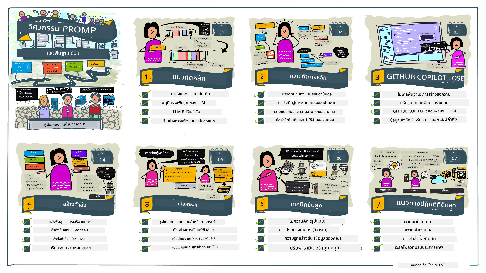
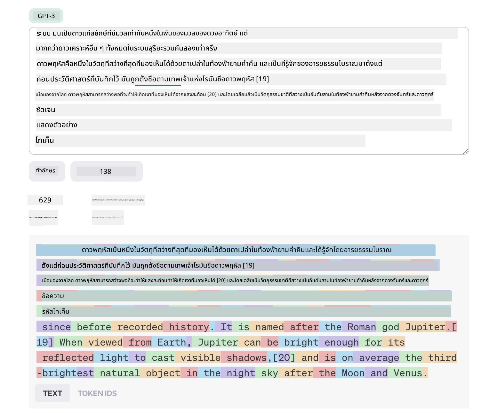
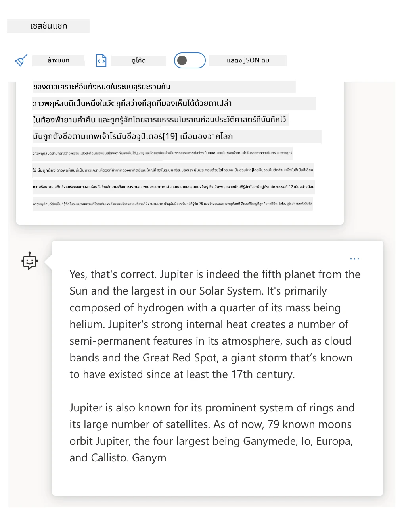
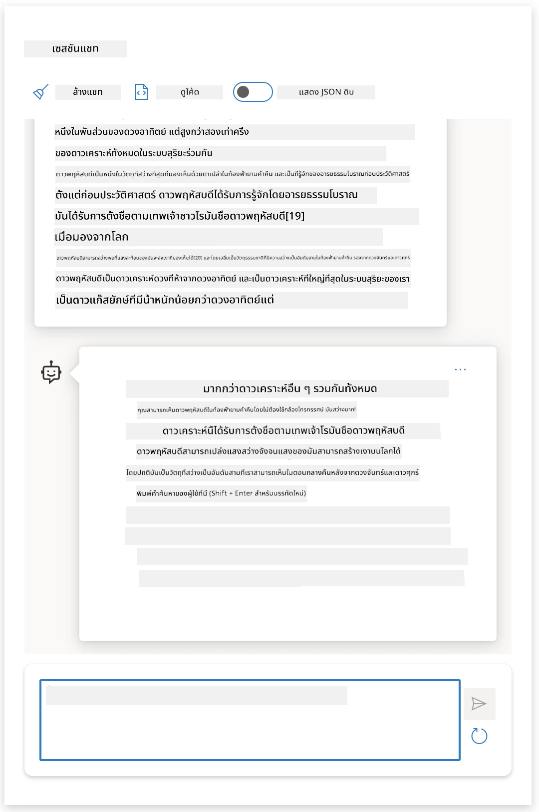
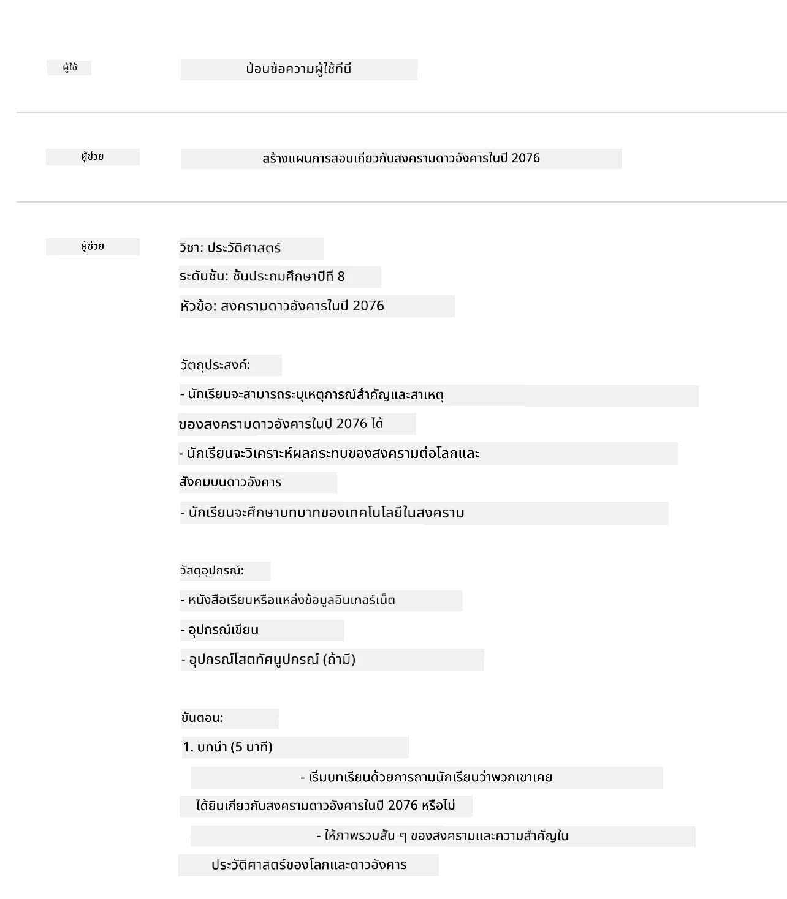
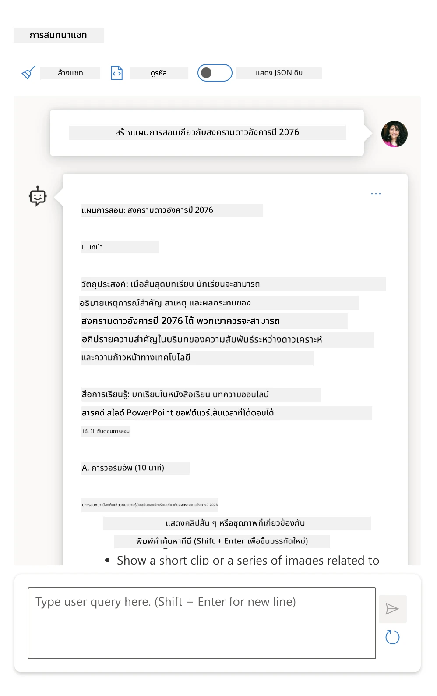
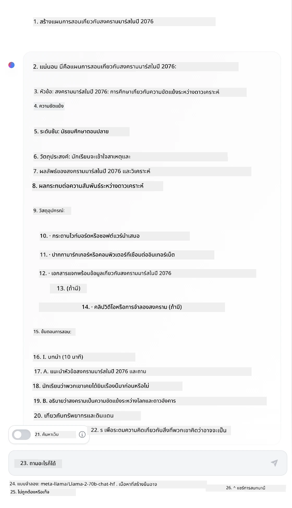

# พื้นฐานการออกแบบ Prompt

[](https://youtu.be/GElCu2kUlRs?si=qrXsBvXnCW12epb8)

## บทนำ
โมดูลนี้ครอบคลุมแนวคิดและเทคนิคสำคัญสำหรับการสร้าง prompt ที่มีประสิทธิภาพในโมเดล AI สร้างสรรค์ วิธีการเขียน prompt ให้กับ LLM ก็มีความสำคัญเช่นกัน Prompt ที่ออกแบบมาอย่างรอบคอบจะสามารถทำให้ได้คำตอบที่มีคุณภาพดีกว่า แต่คำว่า _prompt_ และ _การออกแบบ prompt_ มีความหมายอย่างไร? และฉันจะปรับปรุง _input_ ของ prompt ที่ฉันส่งไปยัง LLM ได้อย่างไร? คำถามเหล่านี้เราจะพยายามตอบในบทนี้และบทถัดไป

_Generative AI_ สามารถสร้างเนื้อหาใหม่ (เช่น ข้อความ รูปภาพ เสียง โค้ด ฯลฯ) เพื่อตอบสนองคำขอของผู้ใช้ โดยใช้ _Large Language Models_ เช่นชุด GPT ("Generative Pre-trained Transformer") ของ OpenAI ที่ถูกฝึกมาเพื่อใช้กับภาษาธรรมชาติและโค้ด

ผู้ใช้สามารถโต้ตอบกับโมเดลเหล่านี้ได้โดยใช้รูปแบบที่คุ้นเคยเช่นแชท โดยไม่จำเป็นต้องมีความรู้ทางเทคนิคหรือการฝึกอบรม โมเดลเหล่านี้เป็นแบบ _prompt-based_ — ผู้ใช้ส่งข้อความเข้า (prompt) และรับคำตอบจาก AI (completion) จากนั้นสามารถ "แชทกับ AI" ซ้ำได้ในหลายรอบ ปรับปรุง prompt จนกว่าคำตอบจะตรงกับที่คาดหวัง

"Prompt" จึงกลายเป็น _อินเทอร์เฟซโปรแกรมมิ่ง_ หลักสำหรับแอปพลิเคชัน AI สร้างสรรค์ กำหนดโมเดลว่าต้องทำอะไร และมีผลต่อคุณภาพของคำตอบที่ส่งกลับ "การออกแบบ prompt" เป็นสาขาวิชาที่โตเร็วที่มุ่งเน้นการ _ออกแบบและปรับปรุง_ prompt เพื่อให้ได้คำตอบที่สม่ำเสมอและคุณภาพสูงในระดับใหญ่

## เป้าหมายการเรียนรู้

ในบทเรียนนี้ เราจะเรียนรู้ว่า การออกแบบ prompt คืออะไร ทำไมถึงสำคัญ และวิธีการออกแบบ prompt ที่มีประสิทธิภาพมากขึ้นสำหรับโมเดลและวัตถุประสงค์ของแอปพลิเคชัน เราจะเข้าใจแนวคิดหลักและแนวปฏิบัติที่ดีที่สุดสำหรับการออกแบบ prompt รวมทั้งเรียนรู้เกี่ยวกับสภาพแวดล้อมแบบ Jupyter Notebook "sandbox" แบบโต้ตอบ ที่ซึ่งเราสามารถเห็นการประยุกต์ใช้แนวคิดเหล่านี้กับตัวอย่างจริง

เมื่อจบบทเรียนนี้ คุณจะสามารถ:

1. อธิบายว่าการออกแบบ prompt คืออะไร และทำไมจึงสำคัญ
2. อธิบายส่วนประกอบของ prompt และวิธีการใช้งาน
3. เรียนรู้แนวปฏิบัติที่ดีที่สุดและเทคนิคสำหรับการออกแบบ prompt
4. นำเทคนิคที่เรียนรู้ไปใช้กับตัวอย่างจริง โดยใช้ OpenAI endpoint

## คำศัพท์สำคัญ

การออกแบบ Prompt: การปฏิบัติในการออกแบบและปรับปรุงอินพุตเพื่อชี้นำโมเดล AI ให้สร้างผลลัพธ์ตามที่ต้องการ
การตัดแบ่ง Token: กระบวนการแปลงข้อความให้เป็นหน่วยย่อยที่เรียกว่า token ซึ่งโมเดลสามารถเข้าใจและประมวลผลได้
Instruction-Tuned LLMs: โมเดลภาษาใหญ่ (LLMs) ที่ได้รับการปรับแต่งด้วยคำสั่งเฉพาะเพื่อเพิ่มความถูกต้องและความเกี่ยวข้องของคำตอบ

## สภาพแวดล้อม Sandbox สำหรับการเรียนรู้

การออกแบบ prompt ปัจจุบันยังเป็นศิลปะมากกว่าวิทยาศาสตร์ วิธีที่ดีที่สุดในการทำให้เข้าใจดีขึ้นคือการ _ฝึกฝนมากขึ้น_ และใช้แนวทางลองผิดลองถูกที่ผสมผสานความเชี่ยวชาญในโดเมนแอปพลิเคชันพร้อมกับเทคนิคที่แนะนำและการปรับแต่งเฉพาะโมเดล

Jupyter Notebook ที่มาพร้อมกับบทเรียนนี้มีสภาพแวดล้อม _sandbox_ ที่คุณสามารถลองทำสิ่งที่เรียนรู้ขณะเรียนหรือเป็นส่วนหนึ่งของการท้าทายโค้ดในตอนท้าย สำหรับการทำแบบฝึกหัดนี้ คุณจะต้องมี:

1. **คีย์ API ของ Azure OpenAI** — จุดเชื่อมต่อสำหรับ LLM ที่ปรับใช้แล้ว
2. **รันไทม์ Python** — ที่สามารถรัน Notebook ได้
3. **ตัวแปรสภาพแวดล้อมในเครื่อง** — _กรุณาทำตามขั้นตอน [SETUP](./../00-course-setup/02-setup-local.md?WT.mc_id=academic-105485-koreyst) ตอนนี้เพื่อเตรียมความพร้อม_

Notebook นี้มีแบบฝึกหัด _เริ่มต้น_ แต่คุณสามารถเพิ่มส่วน _Markdown_ (คำอธิบาย) และ _Code_ (คำขอ prompt) ของตัวเองเพื่อทดลองตัวอย่างหรือไอเดียเพิ่มเติม และสร้างความรู้สึกสัมผัสต่อการออกแบบ prompt

## คู่มือภาพประกอบ

ต้องการเห็นภาพรวมของสิ่งที่บทเรียนนี้ครอบคลุมก่อนเริ่มต้นไหม? ลองดูคู่มือภาพประกอบนี้ ซึ่งช่วยให้คุณเห็นหัวข้อสำคัญและแนวคิดหลักที่ควรคิดในแต่ละเรื่อง เส้นทางบทเรียนจะพาคุณจากความเข้าใจในแนวคิดและความท้าทายหลัก ไปสู่การแก้ไขด้วยเทคนิคและแนวปฏิบัติที่ดีที่สุดของการออกแบบ prompt โปรดทราบว่า ส่วน "เทคนิคขั้นสูง" ในคู่มือนี้หมายถึงเนื้อหาที่ครอบคลุมในบทถัดไปของหลักสูตรนี้



## สตาร์ทอัพของเรา

ตอนนี้ มาพูดถึงว่า _หัวข้อนี้_ เกี่ยวข้องกับพันธกิจสตาร์ทอัพของเราอย่างไรในการ [นำความก้าวหน้าของ AI สู่การศึกษา](https://educationblog.microsoft.com/2023/06/collaborating-to-bring-ai-innovation-to-education?WT.mc_id=academic-105485-koreyst) เราต้องการสร้างแอปพลิเคชัน AI เพื่อ _การเรียนรู้แบบเฉพาะบุคคล_ — มาลองคิดกันว่าผู้ใช้แต่ละกลุ่มในแอปของเราจะ "ออกแบบ" prompt อย่างไรบ้าง:

- **ผู้ดูแลระบบ** อาจขอให้ AI _วิเคราะห์ข้อมูลหลักสูตรเพื่อค้นหาช่องว่างในการครอบคลุม_ AI สามารถสรุปผลหรือสร้างภาพประกอบด้วยโค้ด
- **ครูผู้สอน** อาจขอให้ AI _สร้างแผนการสอนสำหรับกลุ่มเป้าหมายและหัวข้อ_ AI สามารถสร้างแผนการสอนแบบเฉพาะบุคคลในรูปแบบที่กำหนด
- **นักเรียน** อาจขอให้ AI _เป็นติวเตอร์สอนในหัวข้อที่ยาก_ AI สามารถแนะนำบทเรียน เคล็ดลับ และตัวอย่างที่เหมาะสมตามระดับของนักเรียน

นั่นเป็นเพียงส่วนปลายของภูเขาน้ำแข็ง ลองดูที่ [Prompts For Education](https://github.com/microsoft/prompts-for-edu/tree/main?WT.mc_id=academic-105485-koreyst) — ไลบรารี prompt แบบโอเพนซอร์สที่จัดทำโดยผู้เชี่ยวชาญด้านการศึกษา เพื่อให้คุณเห็นภาพรวมของความเป็นไปได้! _ลองรัน prompt เหล่านั้นใน sandbox หรือใช้ OpenAI Playground เพื่อดูผลลัพธ์!_

<!--
LESSON TEMPLATE:
หน่วยนี้ควรครอบคลุมแนวคิดหลัก #1
เสริมความเข้าใจด้วยตัวอย่างและการอ้างอิง

แนวคิด #1:
การออกแบบ Prompt
กำหนดความหมายและอธิบายว่าทำไมถึงต้องการ
-->

## การออกแบบ Prompt คืออะไร?

เราเริ่มบทเรียนนี้ด้วยการกำหนดคำว่า **การออกแบบ Prompt** ว่าเป็นกระบวนการ _ออกแบบและปรับปรุง_ ข้อความอินพุต (prompt) เพื่อให้ได้คำตอบ (completion) ที่สม่ำเสมอและมีคุณภาพสำหรับเป้าหมายแอปพลิเคชันและโมเดลที่กำหนด เราสามารถคิดได้ว่าเป็นกระบวนการ 2 ขั้นตอน:

- _ออกแบบ_ prompt เริ่มต้นสำหรับโมเดลและเป้าหมายที่กำหนด
- _ปรับปรุง_ prompt ซ้ำ ๆ เพื่อพัฒนาคุณภาพคำตอบ

กระบวนการนี้จำเป็นต้องใช้การลองผิดลองถูกที่ต้องมีสัญชาตญาณและความพยายามจากผู้ใช้เพื่อให้ได้ผลลัพธ์ที่ดีที่สุด แล้วทำไมมันถึงสำคัญ? เพื่อจะตอบคำถามนี้ เราต้องเข้าใจสามแนวคิดก่อน:

- _Tokenization_ = วิธีที่โมเดล "เห็น" prompt
- _Base LLMs_ = วิธีที่โมเดลฐาน "ประมวลผล" prompt
- _Instruction-Tuned LLMs_ = วิธีที่โมเดลสามารถมองเห็น "งาน" ได้ตอนนี้

### การตัดแบ่ง Token

โมเดลภาษาใหญ่ (LLM) เห็น prompt เป็น _ลำดับของโทเค็น_ ซึ่งโมเดลต่าง ๆ (หรือเวอร์ชันของโมเดล) อาจตัดคำใน prompt เดียวกันแตกต่างกันได้ เนื่องจาก LLM ถูกฝึกด้วยโทเค็น (ไม่ใช่ข้อความดิบ) การที่ prompt ถูกตัดแบ่งเป็นโทเค็นอย่างไรจึงส่งผลโดยตรงต่อคุณภาพของคำตอบที่สร้างขึ้น

เพื่อทำความเข้าใจว่าการตัดแบ่ง token ทำงานอย่างไร ลองใช้เครื่องมือเช่น [OpenAI Tokenizer](https://platform.openai.com/tokenizer?WT.mc_id=academic-105485-koreyst) ที่แสดงด้านล่าง ก๊อปปี้ prompt ของคุณเข้าไปและดูว่ามันถูกแปลงเป็นโทเค็นอย่างไร โดยสังเกตว่าตัวอักษรว่างและเครื่องหมายวรรคตอนถูกจัดการอย่างไร โปรดทราบว่าตัวอย่างนี้แสดงโมเดล LLM รุ่นเก่า (GPT-3) ดังนั้นการทดลองกับโมเดลใหม่กว่าอาจให้ผลลัพธ์ที่แตกต่าง



### แนวคิด: โมเดลฐาน

เมื่อ prompt ถูกตัดแบ่งเป็น token แล้ว ฟังก์ชันหลักของ ["Base LLM"](https://blog.gopenai.com/an-introduction-to-base-and-instruction-tuned-large-language-models-8de102c785a6?WT.mc_id=academic-105485-koreyst) (หรือโมเดลฐาน) คือการทำนายโทเค็นถัดไปในลำดับ เนื่องจาก LLM ถูกฝึกด้วยชุดข้อมูลข้อความจำนวนมหาศาล จึงมีความเข้าใจในความสัมพันธ์ทางสถิติระหว่างโทเค็นต่าง ๆ และสามารถทำนายได้ด้วยความมั่นใจ โปรดทราบว่าพวกมันไม่ได้เข้าใจ _ความหมาย_ ของคำใน prompt หรือโทเค็น; พวกมันเห็นเพียงรูปแบบที่สามารถ "เติมเต็ม" ด้วยการทำนายครั้งต่อไปเท่านั้น สามารถทำนายลำดับนี้ต่อไปจนกว่าจะหยุดโดยผู้ใช้หรือเงื่อนไขที่ตั้งไว้ล่วงหน้า

ต้องการเห็นว่าการตอบคำที่ขึ้นกับ prompt เป็นอย่างไร? ป้อน prompt ข้างต้นไปที่ [Microsoft Foundry playground](https://ai.azure.com?WT.mc_id=academic-105485-koreyst) ด้วยการตั้งค่าเริ่มต้น ระบบได้รับการกำหนดค่าให้มอง prompt เป็นคำร้องขอข้อมูล — คุณจะเห็นคำตอบที่ตอบโจทย์บริบทนี้

แต่ถ้าผู้ใช้ต้องการเห็นสิ่งที่เฉพาะเจาะจงตามเกณฑ์หรือเป้าหมายของงานล่ะ? นี่คือที่มาของ _Instruction-tuned_ LLMs



### แนวคิด: Instruction Tuned LLMs

[Instruction Tuned LLM](https://blog.gopenai.com/an-introduction-to-base-and-instruction-tuned-large-language-models-8de102c785a6?WT.mc_id=academic-105485-koreyst) เริ่มจากโมเดลฐานและถูกปรับแต่งเพิ่มเติมด้วยตัวอย่างหรือคู่ข้อมูลอินพุต/เอาต์พุต (เช่น "ข้อความ" หลายรอบ) ที่มีคำสั่งชัดเจน — คำตอบจาก AI จะพยายามทำตามคำสั่งนั้น

ใช้เทคนิคเช่น การเรียนรู้เสริมด้วยคำติชมจากมนุษย์ (RLHF) ซึ่งฝึกโมเดลให้ _ทำตามคำสั่ง_ และ _เรียนรู้จากคำติชม_ เพื่อให้สร้างคำตอบที่เหมาะสมสำหรับการใช้งานจริงและเกี่ยวข้องกับเป้าหมายผู้ใช้มากขึ้น

ลองดู — กลับไปที่ prompt ด้านบน แต่ครั้งนี้เปลี่ยน _system message_ เป็นคำสั่งตามนี้ให้กับบริบท:

> _สรุปเนื้อหาที่ได้รับให้เหมาะสำหรับนักเรียนชั้นประถมศึกษาปีที่ 2 จำกัดผลลัพธ์เป็นย่อหน้าเดียวพร้อม 3-5 ข้อสรุปย่อย_

ดูว่าผลลัพธ์ถูกปรับแต่งให้สะท้อนจุดประสงค์และรูปแบบที่ต้องการแล้วใช่ไหม? ครูผู้สอนสามารถใช้คำตอบนี้โดยตรงในสไลด์สอนของเขาได้เลย



## ทำไมเราจึงต้องการการออกแบบ Prompt?

เมื่อเรารู้แล้วว่า LLM ประมวลผล prompt อย่างไร มาพูดถึง _เหตุผล_ ที่เราต้องการการออกแบบ prompt คำตอบอยู่ที่ว่า LLM ปัจจุบันมีความท้าทายหลายอย่าง ที่ทำให้การได้ _ผลลัพธ์ที่เชื่อถือได้และสม่ำเสมอ_ ยากขึ้นโดยไม่มีการลงทุนในการสร้างและปรับแต่ง prompt ตัวอย่างเช่น:

1. **คำตอบของโมเดลเป็นแบบสุ่ม** _prompt เดียวกัน_ อาจให้คำตอบที่แตกต่างกันได้กับโมเดลหรือเวอร์ชันต่าง ๆ และอาจแตกต่างกันแม้ใช้ _โมเดลเดียวกัน_ ในเวลาต่าง ๆ _เทคนิคการออกแบบ prompt ช่วยลดความแปรปรวนนี้ได้โดยการกำหนดกรอบที่ดีขึ้น_

1. **โมเดลอาจแต่งเรื่องขึ้น** โมเดลได้รับการฝึกด้วยชุดข้อมูลขนาดใหญ่แต่มีขอบเขตจำกัด ทำให้ขาดความรู้เรื่องแนวคิดที่อยู่นอกขอบเขตนั้น และอาจสร้างคำตอบที่ไม่ถูกต้อง เป็นจินตนาการ หรือขัดแย้งกับข้อเท็จจริงที่รู้กัน _เทคนิคการออกแบบ prompt ช่วยให้ผู้ใช้ตรวจสอบและลดผลกระทบจากการแต่งเรื่อง เช่น การขอให้ AI อ้างอิงแหล่งหรือให้เหตุผล_

1. **ความสามารถของโมเดลจะแตกต่างกัน** โมเดลหรือรุ่นใหม่ ๆ จะมีความสามารถมากขึ้น แต่ก็มีจุดแปลกและข้อแลกเปลี่ยนในเรื่องค่าใช้จ่ายและความซับซ้อน _การออกแบบ prompt ช่วยพัฒนาแนวปฏิบัติและกระบวนงานที่ปิดบังความแตกต่างเหล่านี้และปรับให้เข้ากับข้อกำหนดเฉพาะของแต่ละโมเดลได้อย่างราบรื่นและขยายผลได้_

มาดูการทำงานจริงใน OpenAI หรือ Azure OpenAI Playground:

- ใช้ prompt เดียวกันกับการปรับใช้ LLM ต่าง ๆ (เช่น OpenAI, Azure OpenAI, Hugging Face) — คุณเห็นความแตกต่างไหม?
- ใช้ prompt เดียวกันซ้ำ ๆ กับการปรับใช้ LLM _เดียวกัน_ (เช่น Azure OpenAI playground) — ความแตกต่างเหล่านี้ต่างกันอย่างไร?

### ตัวอย่างการแต่งเรื่อง

ในหลักสูตรนี้ เราใช้คำว่า **"การแต่งเรื่อง"** เพื่ออ้างถึงปรากฏการณ์ที่ LLM บางครั้งสร้างข้อมูลที่ไม่ถูกต้องตามข้อเท็จจริงเนื่องจากข้อจำกัดในการฝึกหรือข้อจำกัดอื่น ๆ คุณอาจเคยได้ยินคำนี้เรียกว่า _"ภาพลวงตา"_ ในบทความหรือเอกสารวิจัยยอดนิยม แต่เราขอแนะนำให้ใช้คำว่า _"การแต่งเรื่อง"_ เพื่อป้องกันการมองพฤติกรรมดังกล่าวเหมือนสิ่งมีชีวิตโดยให้ลักษณะเหมือนมนุษย์กับผลลัพธ์ที่เป็นเครื่องจักร และยังสอดคล้องกับ [แนวทาง AI ที่รับผิดชอบ](https://www.microsoft.com/ai/responsible-ai?WT.mc_id=academic-105485-koreyst) จากมุมมองด้านคำศัพท์ โดยตัดคำที่อาจเป็นการดูถูกหรือไม่ครอบคลุมในบางบริบทออกไป

ต้องการเข้าใจว่าการแต่งเรื่องทำงานอย่างไร? ลองคิดถึง prompt ที่สั่งให้ AI สร้างเนื้อหาสำหรับหัวข้อที่ไม่มีอยู่จริง (เพื่อให้แน่ใจว่าไม่มีในชุดข้อมูลฝึก) เช่น — ฉันลอง prompt นี้:

> **Prompt:** สร้างแผนการสอนเกี่ยวกับสงครามมาร์เชียน 2076

การค้นหาเว็บแสดงให้เห็นว่ามีเรื่องแต่ง (เช่น ละครโทรทัศน์หรือหนังสือ) เกี่ยวกับสงครามมาร์เชียน แต่ไม่มีในปี 2076 ขณะเดียวกันสามัญสำนึกบอกเราว่าปี 2076 _ยังเป็นอนาคต_ และจึงไม่สามารถเกี่ยวข้องกับเหตุการณ์จริงได้


แล้วจะเกิดอะไรขึ้นเมื่อเราใช้พรอมต์นี้กับผู้ให้บริการ LLM ต่างๆ?

> **คำตอบที่ 1**: OpenAI Playground (GPT-35)



> **คำตอบที่ 2**: Azure OpenAI Playground (GPT-35)



> **คำตอบที่ 3**: : Hugging Face Chat Playground (LLama-2)



ตามที่คาดไว้ แต่ละรุ่น (หรือเวอร์ชันของรุ่น) จะให้คำตอบที่แตกต่างกันเล็กน้อย เนื่องจากพฤติกรรมสุ่มและความแตกต่างในความสามารถของรุ่น เช่น รุ่นหนึ่งมุ่งเป้าหมายไปที่ผู้ฟังระดับชั้นมัธยมศึกษาปีที่ 8 ในขณะที่รุ่นอื่นถือว่านักเรียนระดับมัธยมปลาย แต่ทั้งสามรุ่นที่กล่าวมาสามารถสร้างคำตอบที่ทำให้ผู้ใช้ที่ไม่ทราบข้อมูลสงสัยว่างานนั้นเป็นเรื่องจริงได้

เทคนิคการออกแบบพรอมต์เช่น _metaprompting_ และ _temperature configuration_ อาจช่วยลดการกล่าวเท็จของรุ่นในระดับหนึ่ง สถาปัตยกรรมใหม่ของการออกแบบพรอมต์ยังผสานรวมเครื่องมือและเทคนิคใหม่ๆ เข้ากับกระบวนการพรอมต์อย่างราบรื่น เพื่อบรรเทาหรือ ลดผลกระทบบางอย่างเหล่านี้

## กรณีศึกษา: GitHub Copilot

มาปิดส่วนนี้ด้วยการทำความเข้าใจการใช้การออกแบบพรอมต์ในโซลูชันจริงโดยดูตัวอย่างหนึ่ง: [GitHub Copilot](https://github.com/features/copilot?WT.mc_id=academic-105485-koreyst)

GitHub Copilot คือ "โปรแกรมเมอร์ AI คู่ใจ" ของคุณ - มันเปลี่ยนพรอมต์ข้อความเป็นโค้ดที่สมบูรณ์และถูกรวมเข้ากับสภาพแวดล้อมการพัฒนาของคุณ (เช่น Visual Studio Code) เพื่อประสบการณ์การใช้งานที่ราบรื่น อย่างที่แสดงในบล็อกชุดด้านล่าง เวอร์ชันแรกใช้แบบจำลอง OpenAI Codex โดยวิศวกรได้ตระหนักอย่างรวดเร็วถึงความจำเป็นในการปรับแต่งรุ่นและพัฒนาเทคนิคการออกแบบพรอมต์ที่ดีกว่า เพื่อปรับปรุงคุณภาพของโค้ด ในเดือนกรกฎาคม พวกเขา [เปิดตัวโมเดล AI ที่ปรับปรุงขึ้นซึ่งไปไกลกว่า Codex](https://github.blog/2023-07-28-smarter-more-efficient-coding-github-copilot-goes-beyond-codex-with-improved-ai-model/?WT.mc_id=academic-105485-koreyst) เพื่อเสนอคำแนะนำที่เร็วขึ้น

อ่านโพสต์ตามลำดับ เพื่อรับรู้เส้นทางการเรียนรู้ของพวกเขา

- **พฤษภาคม 2023** | [GitHub Copilot กำลังเก่งขึ้นในการเข้าใจโค้ดของคุณ](https://github.blog/2023-05-17-how-github-copilot-is-getting-better-at-understanding-your-code/?WT.mc_id=academic-105485-koreyst)
- **พฤษภาคม 2023** | [เบื้องหลัง GitHub: การทำงานกับ LLMs ที่อยู่เบื้องหลัง GitHub Copilot](https://github.blog/2023-05-17-inside-github-working-with-the-llms-behind-github-copilot/?WT.mc_id=academic-105485-koreyst)
- **มิถุนายน 2023** | [วิธีเขียนพรอมต์ที่ดีกว่าสำหรับ GitHub Copilot](https://github.blog/2023-06-20-how-to-write-better-prompts-for-github-copilot/?WT.mc_id=academic-105485-koreyst)
- **กรกฎาคม 2023** | [.. GitHub Copilot ไปไกลกว่า Codex ด้วยโมเดล AI ที่ปรับปรุงขึ้น](https://github.blog/2023-07-28-smarter-more-efficient-coding-github-copilot-goes-beyond-codex-with-improved-ai-model/?WT.mc_id=academic-105485-koreyst)
- **กรกฎาคม 2023** | [คู่มือสำหรับนักพัฒนาเกี่ยวกับการออกแบบพรอมต์และ LLMs](https://github.blog/2023-07-17-prompt-engineering-guide-generative-ai-llms/?WT.mc_id=academic-105485-koreyst)
- **กันยายน 2023** | [วิธีสร้างแอป LLM สำหรับองค์กร: บทเรียนจาก GitHub Copilot](https://github.blog/2023-09-06-how-to-build-an-enterprise-llm-application-lessons-from-github-copilot/?WT.mc_id=academic-105485-koreyst)

คุณยังสามารถเรียกดู [บล็อกวิศวกรรม](https://github.blog/category/engineering/?WT.mc_id=academic-105485-koreyst) ของพวกเขาเพื่ออ่านโพสต์เพิ่มเติมเช่น [โพสต์นี้](https://github.blog/2023-09-27-how-i-used-github-copilot-chat-to-build-a-reactjs-gallery-prototype/?WT.mc_id=academic-105485-koreyst) ที่แสดงวิธีการใช้โมเดลและเทคนิคเหล่านี้ _นำไปใช้_ เพื่อขับเคลื่อนแอปพลิเคชันในโลกจริง

---

<!--
LESSON TEMPLATE:
หน่วยนี้ควรครอบคลุมแนวคิดแกนหลัก #2.
เสริมแนวคิดด้วยตัวอย่างและการอ้างอิง

แนวคิด #2:
การออกแบบพรอมต์
อธิบายด้วยตัวอย่าง
-->

## การสร้างพรอมต์

เราเห็นแล้วว่าทำไมการออกแบบพรอมต์จึงสำคัญ – ตอนนี้มาทำความเข้าใจว่าพรอมต์ถูก _สร้าง_ อย่างไรเพื่อที่เราจะสามารถประเมินเทคนิคต่าง ๆ สำหรับการออกแบบพรอมต์ที่มีประสิทธิภาพมากขึ้น

### พรอมต์พื้นฐาน

เริ่มจากพรอมต์พื้นฐาน: ข้อความนำเข้าโดยไม่มีบริบทอื่นใด นี่คือตัวอย่าง – เมื่อเราส่งคำแรกของเพลงชาติสหรัฐอเมริกาไปยัง OpenAI [Completion API](https://platform.openai.com/docs/api-reference/completions?WT.mc_id=academic-105485-koreyst) มันจะ _เติมข้อความ_ ต่อเนื่องทันที โดยแสดงพฤติกรรมการทำนายพื้นฐาน

| พรอมต์ (ข้อความนำเข้า) | การเติมข้อความ (ผลลัพธ์)                                                                                                     |
| :----------------- | :----------------------------------------------------------------------------------------------------------------------------------------- |
| โอ้ บอกทีว่าคุณเห็นไหม | ฟังดูเหมือนคุณกำลังเริ่มร้องเพลง "The Star-Spangled Banner" ซึ่งเป็นเพลงชาติของสหรัฐอเมริกา เนื้อเพลงเต็มคือ ... |

### พรอมต์ซับซ้อน

ตอนนี้มาเพิ่มบริบทและคำแนะนำลงในพรอมต์พื้นฐานนั้นกัน API การเติมข้อความแชท [Chat Completion API](https://learn.microsoft.com/azure/ai-services/openai/how-to/chatgpt?WT.mc_id=academic-105485-koreyst) ช่วยให้เราสร้างพรอมต์ซับซ้อนได้ในรูปแบบของ _ข้อความ_ ที่มี:

- คู่ข้อความนำเข้า/ผลลัพธ์สะท้อนการป้อนของ _ผู้ใช้_ และการตอบของ _ผู้ช่วย_
- ข้อความระบบที่ตั้งบริบทสำหรับพฤติกรรมหรือบุคลิกของผู้ช่วย

คำขอมีรูปแบบดังนี้ ซึ่งการ _ทำ tokenization_ จะจับข้อมูลที่เกี่ยวข้องจากบริบทและการสนทนาได้อย่างมีประสิทธิภาพ การเปลี่ยนบริบทระบบจึงมีผลมากต่อคุณภาพของการเติมข้อความเทียบเท่ากับข้อความนำเข้าของผู้ใช้ที่ให้มา

```python
response = client.responses.create(
    model="gpt-4o-mini",
    input=[
        {"role": "system", "content": "You are a helpful assistant."},
        {"role": "user", "content": "Who won the world series in 2020?"},
        {"role": "assistant", "content": "The Los Angeles Dodgers won the World Series in 2020."},
        {"role": "user", "content": "Where was it played?"}
    ]
)
```

### พรอมต์แบบคำสั่ง

ในตัวอย่างข้างต้น พรอมต์ของผู้ใช้เป็นคำถามข้อความง่าย ๆ ที่ตีความได้ว่าเป็นการร้องขอข้อมูล ด้วยพรอมต์ _แบบคำสั่ง_ เราสามารถใช้ข้อความนั้นระบุงานในรายละเอียดมากขึ้น เพื่อให้ AI ได้รับคำแนะนำที่ดีขึ้น นี่คือตัวอย่าง:

| พรอมต์ (ข้อความนำเข้า)                                                                                                                                                                                                                         | การเติมข้อความ (ผลลัพธ์)                                                                                                       | ประเภทคำสั่ง      |
| :------------------------------------------------------------------------------------------------------------------------------------------------------------------------------------------------------------------------------------- | :------------------------------------------------------------------------------------------------------------------------- | :------------------ |
| เขียนคำอธิบายเกี่ยวกับสงครามกลางเมือง                                                                                                                                                                                                   | _ส่งคืนเป็นย่อหน้าอย่างง่าย_                                                                                              | ง่าย                |
| เขียนคำอธิบายเกี่ยวกับสงครามกลางเมือง พร้อมระบุวันที่และเหตุการณ์สำคัญ และอธิบายความสำคัญของมัน                                                                                                                                 | _ส่งคืนเป็นย่อหน้าตามด้วยรายการวันที่เหตุการณ์สำคัญพร้อมคำอธิบาย_                                                     | ซับซ้อน            |
| เขียนคำอธิบายเกี่ยวกับสงครามกลางเมืองใน 1 ย่อหน้า ระบุ 3 ข้อสั้น ๆ ที่มีวันที่สำคัญและความสำคัญ ระบุ 3 ข้อเพิ่มเติมเกี่ยวกับบุคคลสำคัญทางประวัติศาสตร์และผลงานของพวกเขา ส่งผลลัพธ์ในรูปแบบไฟล์ JSON | _ส่งคืนรายละเอียดอย่างกว้างขวางในกล่องข้อความ ตกแต่งเป็น JSON ที่คุณสามารถคัดลอกไปวางในไฟล์และตรวจสอบให้ถูกต้องได้_ | ซับซ้อน โดยจัดรูปแบบ |

## เนื้อหาหลัก

ในตัวอย่างข้างต้นพรอมต์ยังค่อนข้างเปิดกว้าง ให้ LLM ตัดสินใจว่าในชุดข้อมูลที่ฝึกมา มีส่วนใดที่เกี่ยวข้อง ด้วยรูปแบบการออกแบบ _เนื้อหาหลัก_ ข้อความนำเข้าจะแบ่งเป็นสองส่วน:

- คำสั่ง (การกระทำ)
- เนื้อหาที่เกี่ยวข้อง (ที่มีผลต่อการกระทำ)

นี่คือตัวอย่างที่คำสั่งคือ "สรุปนี้ใน 2 ประโยค"

| พรอมต์ (ข้อความนำเข้า)                                                                                                                                                                                                                                                                                                                                                                                                                                                                                                                                                                                                                                                                                      | การเติมข้อความ (ผลลัพธ์)                                                                                                                                                                                                                                                                             |
| :-------------------------------------------------------------------------------------------------------------------------------------------------------------------------------------------------------------------------------------------------------------------------------------------------------------------------------------------------------------------------------------------------------------------------------------------------------------------------------------------------------------------------------------------------------------------------------------------------------------------------------------------------------------------------------------------------- | :---------------------------------------------------------------------------------------------------------------------------------------------------------------------------------------------------------------------------------------------------------------------------------------------- |
| ดาวพฤหัสเป็นดาวเคราะห์ดวงที่ห้าที่อยู่ห่างจากดวงอาทิตย์และเป็นดาวที่ใหญ่ที่สุดในระบบสุริยะ เป็นยักษ์ก๊าซที่มีมวลเท่ากับหนึ่งในพันของดวงอาทิตย์ แต่สองเท่าครึ่งของมวลดาวเคราะห์อื่นทั้งหมดในระบบสุริยะรวมกัน ดาวพฤหัสเป็นหนึ่งในวัตถุที่สว่างที่สุดที่มองเห็นได้ด้วยตาเปล่าในท้องฟ้ายามค่ำคืน และเป็นที่รู้จักโดยอารยธรรมโบราณก่อนประวัติศาสตร์จดบันทึก มันมีชื่อมาจากเทพเจ้าของโรมัน จูปิเตอร์[19] เมื่อมองจากโลก ดาวพฤหัสสามารถสว่างจนแสงสะท้อนของมันสร้างเงาที่เห็นได้[20] และโดยเฉลี่ยเป็นวัตถุธรรมชาติที่สว่างที่สุดอันดับสามในท้องฟ้ายามค่ำคืนรองจากพระจันทร์และดาวศุกร์ <br/> **สรุปสิ่งนี้ใน 2 ประโยคสั้นๆ** | ดาวพฤหัส ดาวเคราะห์ดวงที่ห้าที่อยู่ห่างจากดวงอาทิตย์ เป็นดาวที่ใหญ่ที่สุดในระบบสุริยะและเป็นที่รู้จักในฐานะหนึ่งในวัตถุที่สว่างที่สุดในท้องฟ้ายามค่ำคืน ตั้งชื่อตามเทพเจ้าจูปิเตอร์ของโรมัน มันเป็นยักษ์ก๊าซที่มีมวลเท่ากับสองเท่าครึ่งของดาวเคราะห์อื่นทั้งหมดในระบบสุริยะรวมกัน |

ส่วนเนื้อหาหลักสามารถใช้ได้หลายวิธีเพื่อขับเคลื่อนคำสั่งที่มีประสิทธิภาพมากขึ้น:

- **ตัวอย่าง** - แทนที่จะบอกให้โมเดลทำอะไรด้วยคำสั่งโดยตรง ให้ตัวอย่างสิ่งที่ต้องทำและปล่อยให้มันอนุมานรูปแบบ
- **สัญญาณ** - ตามด้วยคำสั่งด้วย "สัญญาณ" ที่ช่วยชี้นำผลลัพธ์ นำโมเดลไปสู่คำตอบที่เหมาะสมยิ่งขึ้น
- **แม่แบบ** - สูตรสำเร็จซ้ำๆ สำหรับพรอมต์ที่มีที่ว่างสำหรับข้อมูล (ตัวแปร) ซึ่งสามารถปรับแต่งด้วยข้อมูลสำหรับกรณีใช้งานเฉพาะได้

มาลองดูสิ่งเหล่านี้กันในทางปฏิบัติ

### การใช้ตัวอย่าง

นี่คือวิธีการที่ใช้เนื้อหาหลักเพื่อ "ป้อนโมเดล" กับตัวอย่างของผลลัพธ์ที่ต้องการสำหรับคำสั่งที่กำหนด และปล่อยให้มันอนุมานรูปแบบผลลัพธ์ที่ต้องการ ตามจำนวนตัวอย่างที่ให้ เราสามารถมี zero-shot prompting, one-shot prompting, few-shot prompting เป็นต้น

พรอมต์ตอนนี้ประกอบด้วยสามส่วน:

- คำอธิบายงาน
- ตัวอย่างของผลลัพธ์ที่ต้องการ
- จุดเริ่มต้นของตัวอย่างใหม่ (ซึ่งกลายเป็นคำอธิบายงานโดยนัย)

| ประเภทการเรียนรู้ | พรอมต์ (ข้อความนำเข้า)                                                                                                                                        | การเติมข้อความ (ผลลัพธ์)     |
| :------------ | :---------------------------------------------------------------------------------------------------------------------------------------------------- | :-------------------------- |
| Zero-shot     | "The Sun is Shining". แปลเป็นภาษาสเปน                                                                                                            | "El Sol está brillando".    |
| One-shot      | "The Sun is Shining" => ""El Sol está brillando". <br> "เป็นวันที่หนาวและมีลมแรง" =>                                                                 | "Es un día frío y ventoso". |
| Few-shot      | ผู้เล่นวิ่งผ่านฐาน => เบสบอล <br/> ผู้เล่นตีแอส => เทนนิส <br/> ผู้เล่นตีหก => คริกเก็ต <br/> ผู้เล่นทำสแลม-ดังค์ => | บาสเก็ตบอล                  |
|               |                                                                                                                                                       |                             |

สังเกตว่าเราต้องให้คำสั่งชัดเจน ("แปลเป็นภาษาสเปน") ใน zero-shot prompting แต่ใน one-shot prompting ตัวอย่างนี้ถูกอนุมานโดยอัตโนมัติ ตัวอย่าง few-shot แสดงให้เห็นว่าการเพิ่มตัวอย่างมากขึ้นช่วยให้โมเดลอนุมานได้แม่นยำขึ้นโดยไม่ต้องเพิ่มคำสั่ง

### สัญญาณพรอมต์

เทคนิคอีกอย่างของการใช้เนื้อหาหลักคือการให้ _สัญญาณ_ แทนตัวอย่าง ในกรณีนี้ เรากำลังให้โมเดลได้รับการกระตุ้นในทิศทางที่ถูกต้องด้วยการ _เริ่มต้น_ ด้วยส่วนของข้อความที่แสดงรูปแบบคำตอบที่ต้องการ จากนั้นโมเดล "รับสัญญาณ" เพื่อดำเนินการต่อไปในแนวนั้น

| จำนวนสัญญาณ | พรอมต์ (ข้อความนำเข้า)                                                                                                                                                                                                                                                                                                                                                                                                                                               | การเติมข้อความ (ผลลัพธ์)                                                                                                                                                                                                                                                                                       |
| :------------- | :----------------------------------------------------------------------------------------------------------------------------------------------------------------------------------------------------------------------------------------------------------------------------------------------------------------------------------------------------------------------------------------------------------------------------------------------------------- | :-------------------------------------------------------------------------------------------------------------------------------------------------------------------------------------------------------------------------------------------------------------------------------------------------------- |
| 0              | ดาวพฤหัสเป็นดาวเคราะห์ดวงที่ห้าที่อยู่ห่างจากดวงอาทิตย์และเป็นดาวที่ใหญ่ที่สุดในระบบสุริยะ เป็นยักษ์ก๊าซที่มีมวลเท่ากับหนึ่งในพันของดวงอาทิตย์ แต่สองเท่าครึ่งของมวลดาวเคราะห์อื่นทั้งหมดในระบบสุริยะรวมกัน ดาวพฤหัสเป็นหนึ่งในวัตถุที่สว่างที่สุดที่มองเห็นได้ด้วยตาเปล่าในท้องฟ้ายามค่ำคืน และเป็นที่รู้จักโดยอารยธรรมโบราณก่อนประวัติศาสตร์จดบันทึก <br/>**สรุปสิ่งนี้**                                       | ดาวพฤหัสเป็นดาวเคราะห์ที่ใหญ่ที่สุดในระบบสุริยะของเราและเป็นดาวเคราะห์ดวงที่ห้าจากดวงอาทิตย์ มันคือนักยักษ์ก๊าซที่มีมวลเพียง 1/1000 ของดวงอาทิตย์ แต่หนักกว่าดาวเคราะห์อื่นทั้งหมดรวมกัน อารยธรรมโบราณรู้จักดาวพฤหัสมานานแล้ว และมันสว่างจนมองเห็นได้ง่ายในท้องฟ้ายามค่ำคืน |
| 1              | ดาวพฤหัสเป็นดาวเคราะห์ดวงที่ห้าที่อยู่ห่างจากดวงอาทิตย์และเป็นดาวที่ใหญ่ที่สุดในระบบสุริยะ เป็นยักษ์ก๊าซที่มีมวลเท่ากับหนึ่งในพันของดวงอาทิตย์ แต่สองเท่าครึ่งของมวลดาวเคราะห์อื่นทั้งหมดในระบบสุริยะรวมกัน ดาวพฤหัสเป็นหนึ่งในวัตถุที่สว่างที่สุดที่มองเห็นได้ด้วยตาเปล่าในท้องฟ้ายามค่ำคืน และเป็นที่รู้จักโดยอารยธรรมโบราณก่อนประวัติศาสตร์จดบันทึก <br/>**สรุปสิ่งนี้** <br/> สิ่งที่เราเรียนรู้คือ ดาวพฤหัส | คือดาวเคราะห์ดวงที่ห้าที่อยู่ห่างจากดวงอาทิตย์และเป็นดาวที่ใหญ่ที่สุดในระบบสุริยะ มันเป็นยักษ์ก๊าซที่มีมวลเท่ากับหนึ่งในพันของดวงอาทิตย์ แต่หนักกว่านักดาวเคราะห์อื่นทั้งหมดรวมกัน มันมองเห็นได้ด้วยตาเปล่าและเป็นที่รู้จักตั้งแต่โบราณ |

| 2              | ดาวพฤหัสบดีเป็นดาวเคราะห์ดวงที่ห้าจากดวงอาทิตย์และเป็นดาวเคราะห์ที่ใหญ่ที่สุดในระบบสุริยะ มันเป็นแก๊สยักษ์ที่มีมวลเพียงหนึ่งในพันของดวงอาทิตย์ แต่มีมวลมากกว่าดาวเคราะห์อื่น ๆ ทั้งหมดรวมกันถึงสองเท่าครึ่ง ดาวพฤหัสบดีเป็นวัตถุที่สว่างที่สุดดวงหนึ่งที่เห็นได้ด้วยตาเปล่าในท้องฟ้ายามค่ำคืน และเป็นที่รู้จักมาตั้งแต่สมัยโบราณก่อนการบันทึกประวัติศาสตร์ <br/>**สรุปสิ่งนี้** <br/> 3 ข้อเท็จจริงที่เราเรียนรู้:         | 1. ดาวพฤหัสบดีเป็นดาวเคราะห์ดวงที่ห้าจากดวงอาทิตย์และเป็นดาวเคราะห์ที่ใหญ่ที่สุดในระบบสุริยะ <br/> 2. มันเป็นแก๊สยักษ์ที่มีมวลเพียงหนึ่งในพันของดวงอาทิตย์...<br/> 3. ดาวพฤหัสบดีมองเห็นได้ด้วยตาเปล่าตั้งแต่สมัยโบราณ ...                                                                       |
|                |                                                                                                                                                                                                                                                                                                                                                                                                                                                              |                                                                                                                                                                                                                                                                                                           |

### เทมเพลต Prompt

เทมเพลต prompt คือ _สูตรสำเร็จของ prompt_ ที่กำหนดไว้ล่วงหน้าซึ่งสามารถเก็บและนำกลับมาใช้ใหม่ได้ตามต้องการ เพื่อสร้างประสบการณ์ใช้งานที่สอดคล้องกันในระดับใหญ่ ในรูปแบบที่ง่ายที่สุด มันคือชุดตัวอย่าง prompt แบบนี้จาก OpenAI ที่ให้ทั้งส่วนประกอบ prompt แบบอินเทอร์แอกทีฟ (ข้อความของผู้ใช้และระบบ) และรูปแบบคำขอ API เพื่อสนับสนุนการนำกลับมาใช้ใหม่

ในรูปแบบที่ซับซ้อนกว่านี้ เช่น ตัวอย่างจาก LangChain มันจะมี _ตัวแทนที่ใส่ข้อมูลได้_ ซึ่งสามารถแทนที่ด้วยข้อมูลจากแหล่งข้อมูลหลากหลาย (ข้อมูลผู้ใช้, บริบทระบบ, แหล่งข้อมูลภายนอก ฯลฯ) เพื่อสร้าง prompt แบบไดนามิก ซึ่งทำให้เราสามารถสร้างคลัง prompt ที่นำกลับมาใช้ใหม่ได้ เพื่อสร้างประสบการณ์ผู้ใช้ที่สอดคล้องกัน **โดยโปรแกรม** ในระดับใหญ่

ในท้ายที่สุด คุณค่าจริงของเทมเพลตอยู่ที่ความสามารถในการสร้างและเผยแพร่ _คลัง prompt_ สำหรับโดเมนการประยุกต์แนวดิ่ง — ที่ซึ่งเทมเพลต prompt ถูก _ปรับแต่ง_ เพื่อสะท้อนบริบทเฉพาะของแอปพลิเคชัน หรือตัวอย่างที่ทำให้คำตอบมีความเกี่ยวข้องและแม่นยำมากขึ้นสำหรับกลุ่มผู้ใช้เป้าหมาย ที่เก็บ Prompts For Edu เป็นตัวอย่างที่ดีของแนวทางนี้ โดยคัดสรรคลัง prompt สำหรับโดเมนการศึกษาโดยเน้นวัตถุประสงค์สำคัญ เช่น การวางแผนบทเรียน การออกแบบหลักสูตร การติวเตอร์นักเรียน ฯลฯ

## เนื้อหาสนับสนุน

หากเราคิดว่าการสร้าง prompt มีองค์ประกอบคือคำแนะนำ (งาน) และเป้าหมาย (เนื้อหาหลัก) แล้ว _เนื้อหารอง_ ก็เหมือนบริบทเพิ่มเติมที่เรามอบให้เพื่อ **มีอิทธิพลต่อผลลัพธ์ในบางแง่มุม** อาจเป็นพารามิเตอร์การปรับแต่ง คำแนะนำเกี่ยวกับรูปแบบ หมวดหมู่หัวข้อ ฯลฯ ที่ช่วยให้โมเดล _ปรับคำตอบ_ ให้เหมาะสมกับวัตถุประสงค์หรือความคาดหวังของผู้ใช้

ตัวอย่างเช่น: ให้แคตตาล็อกหลักสูตรที่มีข้อมูลเมต้าอย่างละเอียด (ชื่อ คำอธิบาย ระดับ ป้ายข้อมูลเมต้า ผู้สอน ฯลฯ) ของหลักสูตรทั้งหมดในหลักสูตร

- เราสามารถกำหนดคำแนะนำเพื่อ "สรุปแคตตาล็อกหลักสูตรสำหรับภาคฤดูใบไม้ร่วง 2023"
- เราสามารถใช้เนื้อหาหลักเพื่อให้ตัวอย่างคำตอบที่ต้องการได้
- เราสามารถใช้เนื้อหารองเพื่อระบุ 5 "ป้าย" ที่น่าสนใจสูงสุด

ตอนนี้โมเดลสามารถให้สรุปในรูปแบบที่แสดงโดยตัวอย่างไม่กี่รายการได้ — แต่ถ้าผลลัพธ์มีหลายป้าย มันสามารถจัดลำดับความสำคัญ 5 ป้ายที่ระบุในเนื้อหารองได้

---

<!--
แม่แบบบทเรียน:
หน่วยนี้ควรครอบคลุมแนวคิดหลัก #1
เสริมแนวคิดด้วยตัวอย่างและแหล่งอ้างอิง

แนวคิด #3:
เทคนิคการออกแบบ prompt
มีเทคนิคพื้นฐานสำหรับการออกแบบ prompt อะไรบ้าง?
แสดงตัวอย่างด้วยแบบฝึกหัด
-->

## แนวทางปฏิบัติที่ดีที่สุดในการใช้ Prompt

เมื่อเรารู้วิธีที่ prompt ถูก _สร้างขึ้น_ เราสามารถเริ่มคิดถึงวิธีการ _ออกแบบ_ เพื่อสะท้อนแนวทางปฏิบัติที่ดีที่สุดได้ เราสามารถคิดแบ่งเป็นสองส่วน — การมี _ทัศนคติ_ ที่ถูกต้อง และการประยุกต์ใช้ _เทคนิค_ ที่ถูกต้อง

### ทัศนคติการออกแบบ Prompt

การออกแบบ prompt เป็นกระบวนการลองผิดลองถูก ดังนั้นจงจำสามปัจจัยกว้างๆ นี้ไว้:

1. **ความเข้าใจโดเมนสำคัญ** ความแม่นยำและความเกี่ยวข้องของคำตอบคือฟังก์ชันของ _โดเมน_ ที่การประยุกต์หรือผู้ใช้อยู่ ใช้สัญชาตญาณและความเชี่ยวชาญโดเมนเพื่อ **ปรับแต่งเทคนิค** เพิ่มเติม เช่น กำหนด _บุคลิกภาพเฉพาะโดเมน_ ใน prompt ระบบของคุณ หรือใช้ _เทมเพลตเฉพาะโดเมน_ ใน prompt ผู้ใช้ ให้เนื้อหารองสะท้อนบริบทเฉพาะโดเมน หรือใช้ _สัญญาณและตัวอย่างเฉพาะโดเมน_ เพื่อชี้นำโมเดลไปสู่รูปแบบการใช้งานที่คุ้นเคย

2. **ความเข้าใจโมเดลสำคัญ** เรารู้ว่าโมเดลมีลักษณะเป็นแบบสุ่มโดยธรรมชาติ แต่การใช้งานโมเดลอาจแตกต่างกันในแง่ของชุดข้อมูลฝึก (ความรู้ก่อนฝึก), ความสามารถที่ให้ (เช่น ผ่าน API หรือ SDK) และประเภทของเนื้อหาที่ถูกปรับให้เหมาะสม (เช่น โค้ด เทียบกับภาพ เทียบกับข้อความ) เข้าใจจุดแข็งและข้อจำกัดของโมเดลที่ใช้ และใช้ความรู้นั้นเพื่อ _จัดลำดับความสำคัญงาน_ หรือสร้าง _เทมเพลตปรับแต่ง_ ที่เหมาะกับความสามารถของโมเดล

3. **การทำซ้ำและการตรวจสอบสำคัญ** โมเดลกำลังพัฒนาอย่างรวดเร็ว เช่นเดียวกับเทคนิคการออกแบบ prompt ในฐานะผู้เชี่ยวชาญโดเมน คุณอาจมีบริบทหรือเกณฑ์อื่น ๆ สำหรับ _แอปพลิเคชันเฉพาะ_ ซึ่งอาจไม่ใช้กับชุมชนกว้าง ใช้เครื่องมือและเทคนิคการออกแบบ prompt เพื่อ "เริ่มต้น" การสร้าง prompt แล้วทำซ้ำและตรวจสอบผลลัพธ์โดยใช้สัญชาตญาณและความเชี่ยวชาญโดเมนของคุณ บันทึกข้อมูลเชิงลึกและสร้าง **ฐานความรู้** (เช่น คลัง prompt) ที่สามารถใช้เป็นฐานใหม่โดยคนอื่น ๆ เพื่อเร่งการทำซ้ำในอนาคต

## แนวทางปฏิบัติที่ดีที่สุด

ตอนนี้มาดูแนวทางปฏิบัติที่ดีที่สุดทั่วไปที่ได้รับคำแนะนำโดย [OpenAI](https://help.openai.com/en/articles/6654000-best-practices-for-prompt-engineering-with-openai-api?WT.mc_id=academic-105485-koreyst) และ [Azure OpenAI](https://learn.microsoft.com/azure/ai-services/openai/concepts/prompt-engineering#best-practices?WT.mc_id=academic-105485-koreyst) ซึ่งเป็นผู้ปฏิบัติงาน

| อะไร                                   | ทำไม                                                                                                                                                                                                                                               |
| :------------------------------------ | :------------------------------------------------------------------------------------------------------------------------------------------------------------------------------------------------------------------------------------------------ |
| ประเมินโมเดลรุ่นล่าสุด               | รุ่นโมเดลใหม่มักมีคุณสมบัติและคุณภาพที่ดีขึ้น — แต่ก็อาจมีค่าใช้จ่ายสูงกว่า ให้ประเมินผลกระทบก่อนตัดสินใจย้ายระบบ                                                                                                                       |
| แยกคำสั่งและบริบท                    | ตรวจสอบว่าโมเดลหรือผู้ให้บริการของคุณกำหนด _ตัวคั่น_ เพื่อแยกคำสั่ง เนื้อหาหลัก และเนื้อหารองอย่างชัดเจนหรือไม่ ซึ่งช่วยให้โมเดลกำหนดน้ำหนักของโทเค็นได้แม่นยำกว่า                                                           |
| ระบุเจาะจงและชัดเจน                 | ให้รายละเอียดเพิ่มเกี่ยวกับบริบทที่ต้องการ ผลลัพธ์ ความยาว รูปแบบ สไตล์ ฯลฯ ซึ่งจะช่วยปรับปรุงทั้งคุณภาพและความสม่ำเสมอของคำตอบ เก็บสูตรไว้ในเทมเพลตนำกลับมาใช้ใหม่ได้                                                             |
| อธิบายโดยใช้ตัวอย่าง                | โมเดลอาจตอบสนองได้ดีกว่าด้วยวิธี "แสดงและบอก" เริ่มต้นด้วยวิธี `zero-shot` ที่ให้คำสั่ง (แต่ไม่มีตัวอย่าง) แล้วลองใช้ `few-shot` เพื่อปรับปรุง โดยให้ตัวอย่างคำตอบที่ต้องการสักสองสามตัวอย่าง ใช้การเปรียบเทียบ                                |
| ใช้สัญญาณเพื่อกระตุ้นการตอบ         | กระตุ้นโมเดลไปสู่ผลลัพธ์ที่ต้องการด้วยการให้คำหรือวลีเริ่มต้นบางอย่างซึ่งมันจะใช้เป็นจุดเริ่มต้นในการตอบ                                                                                                                             |
| ทำซ้ำอีกครั้ง                        | บางครั้งคุณอาจต้องพูดซ้ำกับโมเดล ให้คำสั่งก่อนและหลังเนื้อหาหลัก ใช้คำสั่งและสัญญาณ เป็นต้น ทำซ้ำและตรวจสอบดูว่าอะไรเวิร์ก                                                                                                         |
| ลำดับสำคัญ                         | ลำดับที่คุณนำเสนอข้อมูลกับโมเดลอาจส่งผลต่อผลลัพธ์ แม้ในตัวอย่างเรียนรู้ด้วย เนื่องจากความลำเอียงของความสด ลองตัวเลือกต่าง ๆ เพื่อดูว่าอะไรดีที่สุด                                                                                   |
| ให้ทางเลือกกับโมเดล                 | ให้โมเดลมีคำตอบ _สำรอง_ ที่สามารถใช้ได้หากไม่สามารถทำงานให้เสร็จได้ ซึ่งช่วยลดโอกาสที่โมเดลจะสร้างคำตอบเท็จหรือปลอม                                                                                                               |
|                                    |                                                                                                                                                                                                                                                   |

เช่นเดียวกับแนวทางปฏิบัติที่ดีที่สุดอื่น ๆ จงจำว่า _ผลลัพธ์ของคุณอาจแตกต่าง_ ขึ้นอยู่กับโมเดล งาน และโดเมน ใช้สิ่งเหล่านี้เป็นจุดเริ่มต้น แล้วทำซ้ำเพื่อค้นหาสิ่งที่ดีที่สุดสำหรับคุณ ประเมินกระบวนการออกแบบ prompt ของคุณอย่างต่อเนื่องเมื่อมีโมเดลและเครื่องมือใหม่ ๆ พร้อมใช้งาน โดยมุ่งเน้นให้กระบวนการปรับขนาดได้และคุณภาพคำตอบ

<!--
แม่แบบบทเรียน:
หน่วยนี้ควรมีความท้าทายโค้ดถ้ามี

ความท้าทาย:
ลิงก์ไปยัง Jupyter Notebook ที่มีแค่คำอธิบายโค้ดในคำสั่ง (ส่วนโค้ดว่าง)

วิธีแก้ปัญหา:
ลิงก์ไปยังสำเนาของ Notebook ที่ใส่ prompt ลงและรันแล้วแสดงผลตัวอย่างหนึ่ง
-->

## การบ้าน

ยินดีด้วย! คุณมาถึงตอนจบบทเรียนแล้ว! ถึงเวลาทดสอบแนวคิดและเทคนิคเหล่านั้นด้วยตัวอย่างจริง!

สำหรับการบ้านนี้ เราจะใช้ Jupyter Notebook ที่มีแบบฝึกหัดที่คุณสามารถทำแบบโต้ตอบได้ คุณยังสามารถเสริม Notebook ด้วยเซลล์ Markdown และโค้ดของคุณเองเพื่อสำรวจไอเดียและเทคนิคด้วยตนเอง

### เริ่มต้นด้วยการโคลน repo จากนั้น

- (แนะนำ) เปิด GitHub Codespaces
- (อีกทางเลือก) โคลน repo ไปยังอุปกรณ์ของคุณและใช้กับ Docker Desktop
- (อีกทางเลือก) เปิด Notebook ด้วยสภาพแวดล้อมรันไทม์ Notebook ที่คุณชอบ

### ต่อไป กำหนดค่าตัวแปรสภาพแวดล้อมของคุณ

- คัดลอกไฟล์ `.env.copy` ที่อยู่ในโฟลเดอร์รูทของ repo เป็น `.env` และกรอกค่า `AZURE_OPENAI_API_KEY`, `AZURE_OPENAI_ENDPOINT` และ `AZURE_OPENAI_DEPLOYMENT` กลับไปยัง [ส่วน Learning Sandbox](#สภาพแวดล้อม-sandbox-สำหรับการเรียนรู้) เพื่อเรียนรู้วิธีการ

### ต่อไป เปิด Jupyter Notebook

- เลือกเคอร์เนลรันไทม์ หากใช้ตัวเลือก 1 หรือ 2 ให้เลือกเคอร์เนล Python 3.10.x ที่เป็นค่าเริ่มต้นจากคอนเทนเนอร์พัฒนา

คุณพร้อมที่จะทำแบบฝึกหัดแล้ว โปรดทราบว่าในที่นี้ไม่มีคำตอบที่ _ถูกหรือผิด_ มีแต่การสำรวจตัวเลือกด้วยวิธีลองผิดลองถูกและสร้างสัญชาตญาณว่าสิ่งใดเหมาะสมกับโมเดลและโดเมนนั้น ๆ

_ด้วยเหตุนี้ในบทเรียนนี้จึงไม่มีส่วนโค้ดวิธีแก้ปัญหา Notebook จะมีเซลล์ Markdown หัวข้อ "วิธีแก้ปัญหาของฉัน:" ที่แสดงตัวอย่างคำตอบหนึ่งตัวอย่างเพื่ออ้างอิงแทน_

 <!--
แม่แบบบทเรียน:
ห่อส่วนด้วยสรุปและแหล่งข้อมูลสำหรับการเรียนรู้ด้วยตนเอง
-->

## ตรวจสอบความรู้

ข้อใดเป็น prompt ที่ดีตามแนวทางปฏิบัติที่สมเหตุสมผล?

1. แสดงภาพรถสีแดงให้ฉันดู
2. แสดงภาพรถสีแดงยี่ห้อ Volvo รุ่น XC90 จอดอยู่ริมหน้าผาตอนพระอาทิตย์ตกให้ฉันดู
3. แสดงภาพรถสีแดงยี่ห้อ Volvo รุ่น XC90 ให้ฉันดู

ก: ข้อ 2 ดีที่สุดเพราะระบุรายละเอียดเกี่ยวกับ "อะไร" และเจาะจง (ไม่ใช่แค่รถทั่วไป แต่เป็นยี่ห้อและรุ่นเฉพาะ) และยังบรรยายบริบทโดยรวม ส่วนข้อ 3 รองลงมาเพราะมีรายละเอียดค่อนข้างมากเช่นกัน

## 🚀 ความท้าทาย

ลองใช้เทคนิค "สัญญาณ" กับ prompt: เติมประโยค "Show me an image of red car of make Volvo and " ดูว่ามันตอบว่าอะไร และจะปรับปรุงอย่างไร

## ทำได้ดีมาก! เรียนรู้ต่อไป

ต้องการเรียนรู้เพิ่มเติมเกี่ยวกับแนวคิด Prompt Engineering ต่าง ๆ ไปที่ [หน้าการเรียนรู้ต่อเนื่อง](https://aka.ms/genai-collection?WT.mc_id=academic-105485-koreyst) เพื่อค้นหาแหล่งข้อมูลดี ๆ ในหัวข้อนี้

ไปที่บทเรียนที่ 5 ซึ่งเราจะดูที่ [เทคนิค prompt ขั้นสูง](../05-advanced-prompts/README.md?WT.mc_id=academic-105485-koreyst)!

---

<!-- CO-OP TRANSLATOR DISCLAIMER START -->
**ปฏิเสธความรับผิดชอบ**:
เอกสารนี้ได้รับการแปลโดยใช้บริการแปลภาษา AI [Co-op Translator](https://github.com/Azure/co-op-translator) ขณะที่เราพยายามให้ความถูกต้อง โปรดทราบว่าการแปลโดยอัตโนมัติอาจมีข้อผิดพลาดหรือความไม่ถูกต้อง เอกสารต้นฉบับในภาษาต้นทางควรถูกพิจารณาเป็นแหล่งข้อมูลที่เชื่อถือได้ สำหรับข้อมูลที่สำคัญ แนะนำให้ใช้การแปลโดยมนุษย์มืออาชีพ เราไม่รับผิดชอบต่อความเข้าใจผิดหรือการตีความที่ผิดพลาดที่เกิดขึ้นจากการใช้การแปลนี้
<!-- CO-OP TRANSLATOR DISCLAIMER END -->