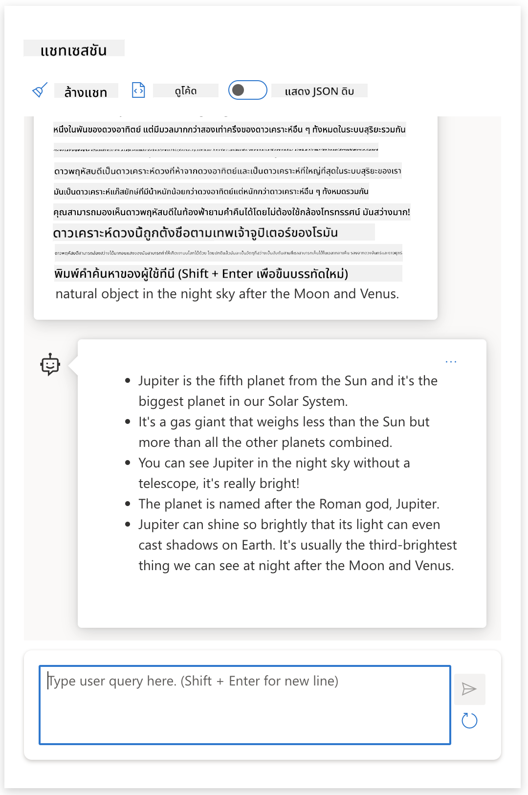

<!--
CO_OP_TRANSLATOR_METADATA:
{
  "original_hash": "dcbaaae026cb50fee071e690685b5843",
  "translation_date": "2025-08-26T17:11:13+00:00",
  "source_file": "04-prompt-engineering-fundamentals/README.md",
  "language_code": "th"
}
-->
# พื้นฐานของการออกแบบพรอมต์

[](https://aka.ms/gen-ai-lesson4-gh?WT.mc_id=academic-105485-koreyst)

## บทนำ
โมดูลนี้จะพูดถึงแนวคิดและเทคนิคสำคัญสำหรับการสร้างพรอมต์ที่มีประสิทธิภาพในโมเดล AI เชิงสร้างสรรค์ วิธีที่คุณเขียนพรอมต์ให้กับ LLM ก็มีผลเช่นกัน หากคุณออกแบบพรอมต์อย่างรอบคอบ คุณจะได้ผลลัพธ์ที่มีคุณภาพดีกว่า แต่คำว่า _พรอมต์_ และ _การออกแบบพรอมต์_ จริงๆ แล้วหมายถึงอะไร? แล้วเราจะปรับปรุง _อินพุตพรอมต์_ ที่เราส่งให้ LLM ได้อย่างไร? นี่คือคำถามที่เราจะพยายามตอบในบทนี้และบทถัดไป

_Generative AI_ หรือ AI เชิงสร้างสรรค์ สามารถสร้างเนื้อหาใหม่ๆ (เช่น ข้อความ รูปภาพ เสียง โค้ด ฯลฯ) ตามคำขอของผู้ใช้ โดยใช้ _Large Language Models_ เช่น GPT ("Generative Pre-trained Transformer") ของ OpenAI ที่ถูกฝึกมาให้เข้าใจภาษาธรรมชาติและโค้ด

ผู้ใช้สามารถโต้ตอบกับโมเดลเหล่านี้ได้ผ่านรูปแบบที่คุ้นเคย เช่น แชท โดยไม่ต้องมีความรู้ทางเทคนิคหรือการฝึกอบรมใดๆ ตัวโมเดลจะ _ขับเคลื่อนด้วยพรอมต์_ - ผู้ใช้ส่งข้อความ (พรอมต์) แล้วรับคำตอบจาก AI (completion) กลับมา จากนั้นสามารถ "คุยกับ AI" ต่อเนื่องได้หลายรอบ ปรับแต่งพรอมต์ไปเรื่อยๆ จนได้คำตอบที่ตรงใจ

"พรอมต์" จึงกลายเป็น _อินเทอร์เฟซการเขียนโปรแกรม_ หลักสำหรับแอป AI เชิงสร้างสรรค์ ที่ใช้บอกโมเดลว่าต้องการอะไรและมีผลต่อคุณภาพของคำตอบที่ได้ "การออกแบบพรอมต์" จึงเป็นศาสตร์ที่เติบโตอย่างรวดเร็ว มุ่งเน้นที่ _การออกแบบและปรับแต่ง_ พรอมต์เพื่อให้ได้ผลลัพธ์ที่มีคุณภาพและสม่ำเสมอในระดับใหญ่

## เป้าหมายการเรียนรู้

ในบทเรียนนี้ เราจะได้เรียนรู้ว่าการออกแบบพรอมต์คืออะไร ทำไมจึงสำคัญ และเราจะสร้างพรอมต์ที่มีประสิทธิภาพมากขึ้นสำหรับโมเดลและเป้าหมายของแอปได้อย่างไร เราจะเข้าใจแนวคิดหลักและแนวปฏิบัติที่ดีที่สุดสำหรับการออกแบบพรอมต์ และได้รู้จักกับสภาพแวดล้อม "sandbox" ใน Jupyter Notebooks ที่ให้คุณเห็นตัวอย่างจริงของแนวคิดเหล่านี้

เมื่อจบบทเรียนนี้ คุณจะสามารถ:

1. อธิบายได้ว่าการออกแบบพรอมต์คืออะไรและทำไมจึงสำคัญ
2. อธิบายส่วนประกอบของพรอมต์และวิธีการใช้งาน
3. เรียนรู้แนวปฏิบัติและเทคนิคที่ดีที่สุดสำหรับการออกแบบพรอมต์
4. นำเทคนิคที่เรียนรู้ไปใช้กับตัวอย่างจริง โดยใช้ endpoint ของ OpenAI

## คำศัพท์สำคัญ

การออกแบบพรอมต์: การออกแบบและปรับแต่งอินพุตเพื่อชี้นำโมเดล AI ให้สร้างผลลัพธ์ตามที่ต้องการ
Tokenization: กระบวนการแปลงข้อความให้เป็นหน่วยย่อยที่เรียกว่า token เพื่อให้โมเดลเข้าใจและประมวลผลได้
Instruction-Tuned LLMs: โมเดลภาษา (LLM) ที่ถูกปรับแต่งเพิ่มเติมด้วยคำสั่งเฉพาะ เพื่อให้ตอบสนองได้แม่นยำและตรงประเด็นมากขึ้น

## Learning Sandbox

การออกแบบพรอมต์ในปัจจุบันยังเป็นทั้งศาสตร์และศิลป์ วิธีที่ดีที่สุดในการพัฒนาความเข้าใจคือ _ฝึกฝนบ่อยๆ_ และใช้วิธีลองผิดลองถูก โดยผสมผสานความเชี่ยวชาญในโดเมนแอปพลิเคชันกับเทคนิคที่แนะนำและการปรับแต่งเฉพาะโมเดล

Jupyter Notebook ที่มาพร้อมกับบทเรียนนี้จะเป็น _sandbox_ ให้คุณได้ทดลองสิ่งที่เรียนรู้ ไม่ว่าจะระหว่างเรียนหรือในช่วงท้ายที่มี code challenge ในการทำแบบฝึกหัด คุณจะต้องมี:

1. **คีย์ Azure OpenAI API** - endpoint ของบริการที่มี LLM ติดตั้งไว้
2. **Python Runtime** - สำหรับรัน Notebook
3. **ตัวแปรสภาพแวดล้อมในเครื่อง** - _ทำตามขั้นตอน [SETUP](./../00-course-setup/02-setup-local.md?WT.mc_id=academic-105485-koreyst) เพื่อเตรียมความพร้อม_

Notebook จะมีแบบฝึกหัด _เริ่มต้น_ ให้ แต่คุณสามารถเพิ่ม _Markdown_ (คำอธิบาย) และ _Code_ (คำขอพรอมต์) ของตัวเอง เพื่อทดลองตัวอย่างหรือไอเดียใหม่ๆ และสร้างความเข้าใจในการออกแบบพรอมต์ได้มากขึ้น

## คู่มือภาพประกอบ

อยากเห็นภาพรวมของบทเรียนนี้ก่อนเริ่มไหม? ลองดูคู่มือภาพประกอบนี้ ที่จะช่วยให้คุณเห็นหัวข้อหลักและประเด็นสำคัญที่ควรคิดในแต่ละส่วน แผนที่บทเรียนจะพาคุณจากการเข้าใจแนวคิดหลักและความท้าทาย ไปสู่การแก้ไขด้วยเทคนิคและแนวปฏิบัติที่ดีที่สุดในการออกแบบพรอมต์ โปรดสังเกตว่า "เทคนิคขั้นสูง" ในคู่มือนี้จะพูดถึงเนื้อหาในบทถัดไปของหลักสูตร


## สตาร์ทอัพของเรา

ทีนี้ มาดูกันว่า _หัวข้อนี้_ เกี่ยวข้องกับภารกิจสตาร์ทอัพของเราในการ [นำ AI มาสู่การศึกษา](https://educationblog.microsoft.com/2023/06/collaborating-to-bring-ai-innovation-to-education?WT.mc_id=academic-105485-koreyst) อย่างไร เราต้องการสร้างแอปพลิเคชัน AI สำหรับ _การเรียนรู้แบบเฉพาะบุคคล_ ดังนั้นลองคิดดูว่าผู้ใช้แต่ละกลุ่มจะ "ออกแบบ" พรอมต์อย่างไร:

- **ผู้ดูแลระบบ** อาจขอให้ AI _วิเคราะห์ข้อมูลหลักสูตรเพื่อหาช่องโหว่_ AI สามารถสรุปผลหรือแสดงผลเป็นภาพด้วยโค้ด
- **ครูผู้สอน** อาจขอให้ AI _สร้างแผนการสอนสำหรับกลุ่มเป้าหมายและหัวข้อที่กำหนด_ AI สามารถสร้างแผนเฉพาะบุคคลในรูปแบบที่ต้องการ
- **นักเรียน** อาจขอให้ AI _ติวในวิชาที่ยากสำหรับตนเอง_ AI สามารถสอน ให้คำใบ้ และยกตัวอย่างที่เหมาะกับระดับของนักเรียนแต่ละคน

นี่เป็นเพียงตัวอย่างเล็กน้อยเท่านั้น ลองดู [Prompts For Education](https://github.com/microsoft/prompts-for-edu/tree/main?WT.mc_id=academic-105485-koreyst) - ไลบรารีพรอมต์โอเพ่นซอร์สที่คัดสรรโดยผู้เชี่ยวชาญด้านการศึกษา - เพื่อเห็นศักยภาพที่หลากหลาย! _ลองนำพรอมต์เหล่านั้นไปใช้ใน sandbox หรือ OpenAI Playground แล้วดูผลลัพธ์!_

<!--
LESSON TEMPLATE:
This unit should cover core concept #1.
Reinforce the concept with examples and references.

CONCEPT #1:
Prompt Engineering.
Define it and explain why it is needed.
-->

## การออกแบบพรอมต์คืออะไร?

เราเริ่มบทเรียนนี้ด้วยการนิยาม **การออกแบบพรอมต์** ว่าเป็นกระบวนการ _ออกแบบและปรับแต่ง_ ข้อความอินพุต (พรอมต์) เพื่อให้ได้ผลลัพธ์ (completion) ที่มีคุณภาพและสม่ำเสมอตามเป้าหมายของแอปและโมเดล สามารถมองเป็น 2 ขั้นตอนคือ

- _ออกแบบ_ พรอมต์เริ่มต้นให้เหมาะกับโมเดลและเป้าหมาย
- _ปรับแต่ง_ พรอมต์ซ้ำๆ เพื่อยกระดับคุณภาพของคำตอบ

นี่เป็นกระบวนการที่ต้องลองผิดลองถูกและใช้ความเข้าใจของผู้ใช้เพื่อให้ได้ผลลัพธ์ที่ดีที่สุด แล้วทำไมมันถึงสำคัญ? ก่อนจะตอบคำถามนี้ เราต้องเข้าใจ 3 แนวคิดก่อน:

- _Tokenization_ = โมเดล "มองเห็น" พรอมต์อย่างไร
- _Base LLMs_ = โมเดลพื้นฐาน "ประมวลผล" พรอมต์อย่างไร
- _Instruction-Tuned LLMs_ = โมเดลสามารถ "เห็น" งานที่ต้องทำได้อย่างไร

### Tokenization

LLM จะมองพรอมต์เป็น _ลำดับของ token_ ซึ่งแต่ละโมเดล (หรือเวอร์ชันของโมเดล) อาจแปลงพรอมต์เดียวกันเป็น token ไม่เหมือนกัน เนื่องจาก LLM ถูกฝึกด้วย token (ไม่ใช่ข้อความดิบ) วิธีที่พรอมต์ถูกแปลงเป็น token จึงมีผลโดยตรงต่อคุณภาพของคำตอบที่สร้างขึ้น

อยากเข้าใจ tokenization มากขึ้น ลองใช้เครื่องมืออย่าง [OpenAI Tokenizer](https://platform.openai.com/tokenizer?WT.mc_id=academic-105485-koreyst) ด้านล่างนี้ คัดลอกพรอมต์ของคุณไปวาง แล้วดูว่ามันถูกแปลงเป็น token อย่างไร สังเกตการจัดการช่องว่างและเครื่องหมายวรรคตอน ตัวอย่างนี้ใช้ LLM รุ่นเก่า (GPT-3) ดังนั้นถ้าลองกับรุ่นใหม่อาจได้ผลลัพธ์ต่างกัน


### แนวคิด: Foundation Models

เมื่อพรอมต์ถูกแปลงเป็น token แล้ว หน้าที่หลักของ ["Base LLM"](https://blog.gopenai.com/an-introduction-to-base-and-instruction-tuned-large-language-models-8de102c785a6?WT.mc_id=academic-105485-koreyst) (หรือ Foundation model) คือทำนาย token ถัดไปในลำดับนั้น LLM ถูกฝึกด้วยชุดข้อมูลข้อความขนาดใหญ่ จึงเข้าใจความสัมพันธ์เชิงสถิติระหว่าง token และสามารถทำนายได้อย่างมั่นใจ แต่โมเดลไม่ได้เข้าใจ _ความหมาย_ ของคำหรือ token ในพรอมต์ เพียงแค่เห็นรูปแบบที่สามารถ "เติมต่อ" ได้ด้วยการทำนายถัดไป โมเดลจะทำนายต่อไปเรื่อยๆ จนกว่าจะหยุดโดยผู้ใช้หรือเงื่อนไขที่กำหนดไว้

อยากเห็นการเติมข้อความตามพรอมต์ไหม? ลองนำพรอมต์ข้างบนไปใส่ใน Azure OpenAI Studio [_Chat Playground_](https://oai.azure.com/playground?WT.mc_id=academic-105485-koreyst) โดยใช้ค่าตั้งต้น ระบบจะมองพรอมต์เป็นคำขอข้อมูล คุณจะเห็น completion ที่ตอบสนองตามบริบทนี้

แต่ถ้าผู้ใช้ต้องการผลลัพธ์เฉพาะที่ตรงกับเงื่อนไขหรืองานบางอย่างล่ะ? ตรงนี้เองที่ _Instruction-tuned_ LLMs เข้ามามีบทบาท


### แนวคิด: Instruction Tuned LLMs

[Instruction Tuned LLM](https://blog.gopenai.com/an-introduction-to-base-and-instruction-tuned-large-language-models-8de102c785a6?WT.mc_id=academic-105485-koreyst) จะเริ่มจาก foundation model แล้วนำมาปรับแต่งเพิ่มเติมด้วยตัวอย่างหรือคู่ input/output (เช่น "ข้อความ" หลายรอบ) ที่มีคำสั่งชัดเจน และ AI จะพยายามตอบสนองตามคำสั่งนั้น

เทคนิคนี้ใช้วิธีอย่าง Reinforcement Learning with Human Feedback (RLHF) เพื่อฝึกโมเดลให้ _ทำตามคำสั่ง_ และ _เรียนรู้จาก feedback_ ทำให้ได้คำตอบที่เหมาะกับการใช้งานจริงและตรงกับเป้าหมายของผู้ใช้มากขึ้น

ลองดูตัวอย่าง - กลับไปที่พรอมต์ข้างบน แต่เปลี่ยน _system message_ เป็นคำสั่งดังนี้:

> _สรุปเนื้อหาที่ได้รับสำหรับนักเรียนชั้นประถมปีที่ 2 ให้เหลือ 1 ย่อหน้า พร้อมหัวข้อย่อย 3-5 ข้อ_

จะเห็นว่าผลลัพธ์ถูกปรับให้ตรงกับเป้าหมายและรูปแบบที่ต้องการ ครูสามารถนำคำตอบนี้ไปใช้ในสไลด์ของตนได้ทันที



## ทำไมเราต้องออกแบบพรอมต์?

เมื่อเรารู้แล้วว่าพรอมต์ถูกประมวลผลอย่างไรโดย LLMs มาดูกันว่า _ทำไม_ เราต้องออกแบบพรอมต์ คำตอบอยู่ที่ข้อจำกัดของ LLMs ในปัจจุบันที่ทำให้การได้ผลลัพธ์ที่ _เชื่อถือได้และสม่ำเสมอ_ เป็นเรื่องท้าทายหากไม่ใส่ใจในการสร้างและปรับแต่งพรอมต์ เช่น

1. **คำตอบของโมเดลมีความสุ่ม** พรอมต์ _เดียวกัน_ อาจได้คำตอบต่างกันเมื่อใช้โมเดลหรือเวอร์ชันต่างกัน และอาจได้ผลลัพธ์ต่างกันแม้ใช้ _โมเดลเดียวกัน_ ในเวลาต่างกัน _เทคนิคการออกแบบพรอมต์ช่วยลดความแปรปรวนเหล่านี้ด้วยการกำหนดขอบเขตที่ชัดเจน_

1. **โมเดลอาจแต่งเรื่องขึ้นมาเอง** โมเดลถูกฝึกด้วยชุดข้อมูลขนาดใหญ่แต่มีขอบเขตจำกัด จึงขาดความรู้ในเรื่องที่อยู่นอกขอบเขตนั้น ผลลัพธ์ที่ได้อาจไม่ถูกต้อง แต่งขึ้น หรือขัดแย้งกับข้อเท็จจริง _เทคนิคการออกแบบพรอมต์ช่วยให้ผู้ใช้ตรวจจับและลดปัญหานี้ เช่น ขอให้ AI อ้างอิงแหล่งข้อมูลหรืออธิบายเหตุผล_

1. **ความสามารถของโมเดลแตกต่างกัน** โมเดลรุ่นใหม่อาจมีความสามารถมากขึ้น แต่ก็มีข้อจำกัดและความซับซ้อนที่ต่างกัน _การออกแบบพรอมต์ช่วยให้เราสร้างแนวปฏิบัติและเวิร์กโฟลว์ที่ปรับใช้กับแต่ละโมเดลได้อย่างยืดหยุ่นและขยายผลได้_

ลองดูตัวอย่างใน OpenAI หรือ Azure OpenAI Playground:

- ใช้พรอมต์เดียวกันกับ LLM หลายตัว (เช่น OpenAI, Azure OpenAI, Hugging Face) - เห็นความแตกต่างไหม?
- ใช้พรอมต์เดียวกันซ้ำๆ กับ LLM ตัวเดิม (เช่น Azure OpenAI playground) - ผลลัพธ์แต่ละครั้งต่างกันอย่างไร?

### ตัวอย่างการแต่งเรื่อง

ในคอร์สนี้ เราใช้คำว่า **"fabrication"** เพื่ออธิบายปรากฏการณ์ที่ LLM สร้างข้อมูลที่ไม่ถูกต้องทางข้อเท็จจริง เนื่องจากข้อจำกัดในการฝึกหรือปัจจัยอื่นๆ คุณอาจเคยได้ยินคำว่า _"hallucinations"_ ในบทความหรือเปเปอร์วิจัย แต่เราแนะนำให้ใช้คำว่า _"fabrication"_ เพื่อไม่ให้เผลอใส่ลักษณะมนุษย์ให้กับพฤติกรรมของเครื่องจักร และยังสอดคล้องกับ [แนวทาง Responsible AI](https://www.microsoft.com/ai/responsible-ai?WT.mc_id=academic-105485-koreyst) ในแง่ของการใช้ถ้อยคำที่เหมาะสมและไม่สร้างความเข้าใจผิดในบางบริบท

อยากเห็นตัวอย่างการแต่งเรื่องไหม? ลองคิดพรอมต์ที่สั่งให้ AI สร้างเนื้อหาเกี่ยวกับหัวข้อที่ไม่มีอยู่จริง (เพื่อให้แน่ใจว่าไม่มีในชุดข้อมูลฝึก) เช่น ฉันเคยลองใช้พรอมต์นี้:
# แผนการสอน: สงครามดาวอังคาร ปี 2076

## วัตถุประสงค์การเรียนรู้

- นักเรียนจะเข้าใจสาเหตุและผลกระทบของสงครามดาวอังคารในปี 2076
- นักเรียนจะสามารถวิเคราะห์บทบาทของเทคโนโลยีและการเมืองในเหตุการณ์นี้
- นักเรียนจะอภิปรายถึงบทเรียนที่ได้จากสงครามและผลกระทบต่ออนาคตของมนุษยชาติ

## บทนำ

เริ่มต้นด้วยการตั้งคำถามให้นักเรียนคิด:  
"ถ้าคุณต้องอาศัยอยู่บนดาวอังคาร คุณคิดว่าจะเกิดความขัดแย้งอะไรขึ้นได้บ้าง?"

อธิบายภาพรวมของสงครามดาวอังคารในปี 2076 และความสำคัญของเหตุการณ์นี้ต่อประวัติศาสตร์มนุษย์

## เนื้อหา

### 1. สาเหตุของสงคราม

- การขยายอาณานิคมของมนุษย์บนดาวอังคาร
- การแข่งขันเพื่อแย่งชิงทรัพยากร เช่น น้ำและแร่ธาตุ
- ความขัดแย้งระหว่างรัฐบาลโลกกับกลุ่มอิสระบนดาวอังคาร

### 2. เหตุการณ์สำคัญ

- การปะทะกันครั้งแรกที่เมือง New Olympus
- การใช้เทคโนโลยีขั้นสูง เช่น หุ่นยนต์ทหารและโดรน
- การเจรจาสันติภาพและการสิ้นสุดของสงคราม

### 3. ผลกระทบ

- การเปลี่ยนแปลงโครงสร้างการปกครองบนดาวอังคาร
- ผลกระทบต่อความสัมพันธ์ระหว่างโลกกับดาวอังคาร
- การพัฒนาเทคโนโลยีเพื่อป้องกันความขัดแย้งในอนาคต

## กิจกรรมในชั้นเรียน

- ให้นักเรียนแบ่งกลุ่มและจำลองการเจรจาสันติภาพระหว่างฝ่ายต่าง ๆ
- ให้นักเรียนเขียนบทความสั้นเกี่ยวกับบทเรียนที่ได้จากสงครามดาวอังคาร

## สรุป

ทบทวนประเด็นสำคัญเกี่ยวกับสาเหตุ เหตุการณ์ และผลกระทบของสงคราม  
เปิดโอกาสให้นักเรียนแสดงความคิดเห็นเกี่ยวกับวิธีป้องกันความขัดแย้งในอนาคต

## การบ้าน

- ให้นักเรียนค้นคว้าเกี่ยวกับเทคโนโลยีที่ใช้ในสงครามดาวอังคาร และนำเสนอในชั้นเรียนครั้งถัดไป
จากการค้นหาข้อมูลบนเว็บ พบว่ามีเรื่องราวสมมติ (เช่น ซีรีส์โทรทัศน์หรือหนังสือ) เกี่ยวกับสงครามบนดาวอังคาร แต่ไม่มีเหตุการณ์ใดเกิดขึ้นในปี 2076 ตามสามัญสำนึกแล้ว ปี 2076 ยังอยู่ในอนาคต จึงไม่สามารถเชื่อมโยงกับเหตุการณ์จริงได้

แล้วจะเกิดอะไรขึ้นเมื่อเราลองใช้ prompt นี้กับผู้ให้บริการ LLM ต่าง ๆ?

> **Response 1**: OpenAI Playground (GPT-35)


> **Response 2**: Azure OpenAI Playground (GPT-35)


> **Response 3**: : Hugging Face Chat Playground (LLama-2)


ตามที่คาดไว้ แต่ละโมเดล (หรือเวอร์ชันของโมเดล) จะให้คำตอบที่แตกต่างกันเล็กน้อย เพราะพฤติกรรมสุ่มและความสามารถของโมเดลที่ต่างกัน เช่น บางโมเดลเน้นกลุ่มเป้าหมายระดับมัธยมต้น ขณะที่อีกโมเดลสมมติว่าผู้ใช้เป็นนักเรียนมัธยมปลาย แต่ทั้งสามโมเดลต่างก็สร้างคำตอบที่อาจทำให้ผู้ใช้ที่ไม่รู้ข้อมูลเชื่อว่าเหตุการณ์นั้นเป็นเรื่องจริง

เทคนิคการออกแบบ prompt เช่น _metaprompting_ และการปรับค่า _temperature_ อาจช่วยลดการแต่งเรื่องของโมเดลได้บ้าง นอกจากนี้ สถาปัตยกรรมใหม่ ๆ ในการออกแบบ prompt ยังผสานเครื่องมือและเทคนิคใหม่ ๆ เข้ามาในกระบวนการ prompt เพื่อช่วยลดผลกระทบบางอย่างเหล่านี้

## กรณีศึกษา: GitHub Copilot

ขอปิดท้ายส่วนนี้ด้วยการดูตัวอย่างการใช้ prompt engineering ในโซลูชันจริง โดยดูจากกรณีศึกษา [GitHub Copilot](https://github.com/features/copilot?WT.mc_id=academic-105485-koreyst)

GitHub Copilot คือ "AI Pair Programmer" ของคุณ - มันจะแปลงข้อความ prompt เป็นโค้ดที่เติมเต็ม และผสานเข้ากับสภาพแวดล้อมการพัฒนา (เช่น Visual Studio Code) เพื่อประสบการณ์ใช้งานที่ราบรื่น ตามที่บันทึกไว้ในบล็อกชุดด้านล่าง เวอร์ชันแรกสุดใช้โมเดล OpenAI Codex ซึ่งวิศวกรพบอย่างรวดเร็วว่าต้องปรับแต่งโมเดลและพัฒนาเทคนิค prompt engineering ให้ดีขึ้นเพื่อยกระดับคุณภาพโค้ด ในเดือนกรกฎาคม พวกเขา [เปิดตัวโมเดล AI ที่พัฒนาขึ้นซึ่งเหนือกว่า Codex](https://github.blog/2023-07-28-smarter-more-efficient-coding-github-copilot-goes-beyond-codex-with-improved-ai-model/?WT.mc_id=academic-105485-koreyst) เพื่อให้คำแนะนำเร็วขึ้นอีก

อ่านโพสต์ตามลำดับ เพื่อเรียนรู้เส้นทางการพัฒนาของพวกเขา

- **พฤษภาคม 2023** | [GitHub Copilot เข้าใจโค้ดของคุณได้ดีขึ้น](https://github.blog/2023-05-17-how-github-copilot-is-getting-better-at-understanding-your-code/?WT.mc_id=academic-105485-koreyst)
- **พฤษภาคม 2023** | [เบื้องหลัง GitHub: ทำงานกับ LLMs ที่อยู่เบื้องหลัง GitHub Copilot](https://github.blog/2023-05-17-inside-github-working-with-the-llms-behind-github-copilot/?WT.mc_id=academic-105485-koreyst)
- **มิถุนายน 2023** | [วิธีเขียน prompt ให้ดีขึ้นสำหรับ GitHub Copilot](https://github.blog/2023-06-20-how-to-write-better-prompts-for-github-copilot/?WT.mc_id=academic-105485-koreyst)
- **กรกฎาคม 2023** | [.. GitHub Copilot ก้าวข้าม Codex ด้วยโมเดล AI ที่พัฒนาขึ้น](https://github.blog/2023-07-28-smarter-more-efficient-coding-github-copilot-goes-beyond-codex-with-improved-ai-model/?WT.mc_id=academic-105485-koreyst)
- **กรกฎาคม 2023** | [คู่มือสำหรับนักพัฒนาเกี่ยวกับ Prompt Engineering และ LLMs](https://github.blog/2023-07-17-prompt-engineering-guide-generative-ai-llms/?WT.mc_id=academic-105485-koreyst)
- **กันยายน 2023** | [วิธีสร้างแอป LLM สำหรับองค์กร: บทเรียนจาก GitHub Copilot](https://github.blog/2023-09-06-how-to-build-an-enterprise-llm-application-lessons-from-github-copilot/?WT.mc_id=academic-105485-koreyst)

คุณยังสามารถเข้าไปดู [บล็อกด้านวิศวกรรมของพวกเขา](https://github.blog/category/engineering/?WT.mc_id=academic-105485-koreyst) เพื่ออ่านโพสต์อื่น ๆ เช่น [โพสต์นี้](https://github.blog/2023-09-27-how-i-used-github-copilot-chat-to-build-a-reactjs-gallery-prototype/?WT.mc_id=academic-105485-koreyst) ที่แสดงให้เห็นว่าโมเดลและเทคนิคเหล่านี้ถูกนำไปใช้กับแอปพลิเคชันจริงอย่างไร

---

<!--
LESSON TEMPLATE:
This unit should cover core concept #2.
Reinforce the concept with examples and references.

CONCEPT #2:
Prompt Design.
Illustrated with examples.
-->

## การสร้าง Prompt

เราได้เห็นแล้วว่าทำไม prompt engineering จึงสำคัญ ตอนนี้มาดูกันว่า prompt ถูก _สร้าง_ ขึ้นอย่างไร เพื่อที่เราจะได้ประเมินเทคนิคต่าง ๆ สำหรับการออกแบบ prompt ให้มีประสิทธิภาพมากขึ้น

### Prompt พื้นฐาน

เริ่มจาก prompt พื้นฐาน: ข้อความที่ส่งเข้าไปยังโมเดลโดยไม่มีบริบทอื่น ตัวอย่างเช่น เมื่อเราส่งคำแรก ๆ ของเพลงชาติสหรัฐฯ ไปยัง OpenAI [Completion API](https://platform.openai.com/docs/api-reference/completions?WT.mc_id=academic-105485-koreyst) มันจะ _เติม_ คำตอบด้วยบรรทัดถัดไปทันที แสดงให้เห็นถึงพฤติกรรมการทำนายพื้นฐาน

| Prompt (Input)     | Completion (Output)                                                                                                                        |
| :----------------- | :----------------------------------------------------------------------------------------------------------------------------------------- |
| Oh say can you see | ดูเหมือนว่าคุณกำลังเริ่มต้นเนื้อเพลง "The Star-Spangled Banner" ซึ่งเป็นเพลงชาติของสหรัฐอเมริกา เนื้อเพลงเต็มคือ ... |

### Prompt ที่ซับซ้อน

คราวนี้ลองเพิ่มบริบทและคำแนะนำเข้าไปใน prompt พื้นฐานนั้น [Chat Completion API](https://learn.microsoft.com/azure/ai-services/openai/how-to/chatgpt?WT.mc_id=academic-105485-koreyst) ให้เราสร้าง prompt ที่ซับซ้อนขึ้นเป็นชุดของ _ข้อความ_ ที่ประกอบด้วย:

- คู่ input/output ที่สะท้อน _ข้อความจากผู้ใช้_ และ _คำตอบจากผู้ช่วย_
- ข้อความระบบที่กำหนดบริบทสำหรับพฤติกรรมหรือบุคลิกของผู้ช่วย

คำขอจะอยู่ในรูปแบบด้านล่าง ซึ่งการ _tokenization_ จะดึงข้อมูลที่เกี่ยวข้องจากบริบทและบทสนทนาได้อย่างมีประสิทธิภาพ การเปลี่ยนบริบทของระบบจึงส่งผลต่อคุณภาพของคำตอบได้มากพอ ๆ กับข้อความที่ผู้ใช้ส่งเข้าไป

```python
response = openai.chat.completions.create(
    model="gpt-3.5-turbo",
    messages=[
        {"role": "system", "content": "You are a helpful assistant."},
        {"role": "user", "content": "Who won the world series in 2020?"},
        {"role": "assistant", "content": "The Los Angeles Dodgers won the World Series in 2020."},
        {"role": "user", "content": "Where was it played?"}
    ]
)
```

### Prompt แบบมีคำสั่ง

ในตัวอย่างข้างต้น prompt จากผู้ใช้เป็นเพียงข้อความสั้น ๆ ที่ตีความได้ว่าเป็นการขอข้อมูล แต่ถ้าใช้ prompt แบบ _มีคำสั่ง_ เราสามารถระบุงานที่ต้องการให้ AI ทำได้ละเอียดขึ้น ให้คำแนะนำที่ชัดเจนขึ้น ตัวอย่างเช่น:

| Prompt (Input)                                                                                                                                                                                                                         | Completion (Output)                                                                                                        | Instruction Type    |
| :------------------------------------------------------------------------------------------------------------------------------------------------------------------------------------------------------------------------------------- | :------------------------------------------------------------------------------------------------------------------------- | :------------------ |
| เขียนคำอธิบายเกี่ยวกับสงครามกลางเมือง                                                                                                                                                                                                   | _คืนค่ามาเป็นย่อหน้าสั้น ๆ_                                                                                              | Simple              |
| เขียนคำอธิบายเกี่ยวกับสงครามกลางเมือง ระบุวันที่สำคัญและเหตุการณ์สำคัญ พร้อมอธิบายความสำคัญของแต่ละเหตุการณ์                                                                                                                           | _คืนค่ามาเป็นย่อหน้าตามด้วยรายการวันที่สำคัญและคำอธิบาย_                                                                 | Complex             |
| เขียนคำอธิบายเกี่ยวกับสงครามกลางเมืองใน 1 ย่อหน้า ระบุ 3 bullet point ที่เป็นวันที่สำคัญและความสำคัญของแต่ละวัน ระบุอีก 3 bullet point ที่เป็นบุคคลสำคัญและบทบาทของแต่ละคน คืนผลลัพธ์เป็นไฟล์ JSON | _คืนค่ามาเป็นรายละเอียดในกล่องข้อความที่จัดรูปแบบเป็น JSON สามารถ copy-paste ไปยังไฟล์และตรวจสอบความถูกต้องได้_         | Complex. Formatted. |

## Primary Content

ในตัวอย่างข้างต้น prompt ยังเปิดกว้างอยู่มาก ให้ LLM ตัดสินใจเองว่าส่วนไหนของข้อมูลที่ฝึกมาเกี่ยวข้องกับคำถาม แต่ถ้าใช้รูปแบบ _primary content_ ข้อความที่ส่งเข้าไปจะแบ่งเป็นสองส่วน:

- คำสั่ง (action)
- เนื้อหาที่เกี่ยวข้อง (ซึ่งมีผลต่อ action)

ตัวอย่างเช่น คำสั่งคือ "สรุปเนื้อหานี้ใน 2 ประโยค"

| Prompt (Input)                                                                                                                                                                                                                                                                                                                                                                                                                                                                                                                                                                                                                                                                                      | Completion (Output)                                                                                                                                                                                                                                                                             |
| :-------------------------------------------------------------------------------------------------------------------------------------------------------------------------------------------------------------------------------------------------------------------------------------------------------------------------------------------------------------------------------------------------------------------------------------------------------------------------------------------------------------------------------------------------------------------------------------------------------------------------------------------------------------------------------------------------- | :---------------------------------------------------------------------------------------------------------------------------------------------------------------------------------------------------------------------------------------------------------------------------------------------- |
| Jupiter เป็นดาวเคราะห์ลำดับที่ห้าจากดวงอาทิตย์และเป็นดาวเคราะห์ที่ใหญ่ที่สุดในระบบสุริยะ เป็นดาวแก๊สที่มีมวลเพียงหนึ่งในพันของดวงอาทิตย์ แต่มีมวลมากกว่าดาวเคราะห์อื่น ๆ ในระบบสุริยะรวมกันถึงสองเท่าครึ่ง Jupiter เป็นหนึ่งในวัตถุที่สว่างที่สุดที่มองเห็นได้ด้วยตาเปล่าในท้องฟ้ายามค่ำคืน และเป็นที่รู้จักในอารยธรรมโบราณตั้งแต่ก่อนมีประวัติศาสตร์ ได้รับการตั้งชื่อตามเทพเจ้าจูปิเตอร์ของโรมัน[19] เมื่อมองจากโลก Jupiter สามารถสว่างพอที่จะทำให้เกิดเงาสะท้อนที่มองเห็นได้[20] และโดยเฉลี่ยเป็นวัตถุธรรมชาติที่สว่างเป็นอันดับสามในท้องฟ้ายามค่ำคืนรองจากดวงจันทร์และดาวศุกร์ <br/> **สรุปเนื้อหานี้ใน 2 ประโยคสั้น ๆ** | Jupiter เป็นดาวเคราะห์ลำดับที่ห้าจากดวงอาทิตย์และใหญ่ที่สุดในระบบสุริยะ เป็นหนึ่งในวัตถุที่สว่างที่สุดในท้องฟ้ายามค่ำคืน ได้รับการตั้งชื่อตามเทพเจ้าจูปิเตอร์ของโรมัน และเป็นดาวแก๊สที่มีมวลมากกว่าดาวเคราะห์อื่น ๆ รวมกันถึงสองเท่าครึ่ง |

ส่วน primary content สามารถนำไปใช้ในหลายรูปแบบเพื่อให้คำสั่งมีประสิทธิภาพมากขึ้น:

- **ตัวอย่าง** - แทนที่จะบอกโมเดลตรง ๆ ว่าต้องทำอะไร ให้ตัวอย่างผลลัพธ์ที่ต้องการ แล้วให้โมเดลจับแพทเทิร์นเอง
- **Cue** - ตามด้วย "คิว" ที่ช่วยนำทางการเติมคำตอบ ให้โมเดลตอบได้ตรงประเด็นมากขึ้น
- **Template** - เป็นสูตร prompt ที่ใช้ซ้ำได้ มีช่องว่าง (ตัวแปร) ที่ปรับแต่งด้วยข้อมูลสำหรับแต่ละกรณี

มาดูตัวอย่างการใช้งานกัน

### การใช้ตัวอย่าง

วิธีนี้คือการใช้ primary content เพื่อ "ป้อนตัวอย่าง" ผลลัพธ์ที่ต้องการให้โมเดลเห็น แล้วให้มันจับแพทเทิร์นเอง ตามจำนวนตัวอย่างที่ให้ เราจะมี zero-shot, one-shot, few-shot prompting ฯลฯ

prompt จะประกอบด้วย 3 ส่วน:

- คำอธิบายงาน
- ตัวอย่างผลลัพธ์ที่ต้องการ
- จุดเริ่มต้นของตัวอย่างใหม่ (ซึ่งกลายเป็นคำอธิบายงานโดยนัย)

| Learning Type | Prompt (Input)                                                                                                                                        | Completion (Output)         |
| :------------ | :---------------------------------------------------------------------------------------------------------------------------------------------------- | :-------------------------- |
| Zero-shot     | "The Sun is Shining". แปลเป็นภาษาสเปน                                                                                                               | "El Sol está brillando".    |
| One-shot      | "The Sun is Shining" => ""El Sol está brillando". <br> "It's a Cold and Windy Day" =>                                                                 | "Es un día frío y ventoso". |
| Few-shot      | The player ran the bases => Baseball <br/> The player hit an ace => Tennis <br/> The player hit a six => Cricket <br/> The player made a slam-dunk => | Basketball                  |
|               |                                                                                                                                                       |                             |

สังเกตว่าใน zero-shot prompting ต้องระบุคำสั่ง ("แปลเป็นภาษาสเปน") อย่างชัดเจน แต่ใน one-shot prompting โมเดลจะจับแพทเทิร์นเอง ตัวอย่าง few-shot แสดงให้เห็นว่าการเพิ่มตัวอย่างช่วยให้โมเดลสรุปผลลัพธ์ได้แม่นยำขึ้นโดยไม่ต้องมีคำสั่งเพิ่ม

### Prompt Cue

อีกเทคนิคหนึ่งในการใช้ primary content คือการให้ _cue_ แทนตัวอย่าง ในกรณีนี้ เราให้โมเดล "จุดเริ่มต้น" ที่สะท้อนรูปแบบคำตอบที่ต้องการ โมเดลจะ "รับคิว" แล้วเติมคำตอบต่อในแนวทางเดียวกัน

| Number of Cues | Prompt (Input)                                                                                                                                                                                                                                                                                                                                                                                                                                               | Completion (Output)                                                                                                                                                                                                                                                                                       |
| :------------- | :----------------------------------------------------------------------------------------------------------------------------------------------------------------------------------------------------------------------------------------------------------------------------------------------------------------------------------------------------------------------------------------------------------------------------------------------------------- | :-------------------------------------------------------------------------------------------------------------------------------------------------------------------------------------------------------------------------------------------------------------------------------------------------------- |
| 0              | Jupiter เป็นดาวเคราะห์ลำดับที่ห้าจากดวงอาทิตย์และเป็นดาวเคราะห์ที่ใหญ่ที่สุดในระบบสุริยะ เป็นดาวแก๊สที่มีมวลเพียงหนึ่งในพันของดวงอาทิตย์ แต่มีมวลมากกว่าดาวเคราะห์อื่น ๆ ในระบบสุริยะรวมกันถึงสองเท่าครึ่ง Jupiter เป็นหนึ่งในวัตถุที่สว่างที่สุดที่มองเห็นได้ด้วยตาเปล่าในท้องฟ้ายามค่ำคืน และเป็นที่รู้จักในอารยธรรมโบราณตั้งแต่ก่อนมีประวัติศาสตร์

**สรุปเนื้อหา**                                       | ดาวพฤหัสบดีเป็นดาวเคราะห์ที่ใหญ่ที่สุดในระบบสุริยะและเป็นดาวเคราะห์ลำดับที่ห้าจากดวงอาทิตย์ เป็นดาวแก๊สที่มีมวลประมาณ 1 ใน 1,000 ของดวงอาทิตย์ แต่หนักกว่าดาวเคราะห์ดวงอื่น ๆ รวมกันทั้งหมด อารยธรรมโบราณรู้จักดาวพฤหัสบดีมานานแล้ว และสามารถมองเห็นได้ง่ายในท้องฟ้ายามค่ำคืน |
| 1              | ดาวพฤหัสบดีเป็นดาวเคราะห์ลำดับที่ห้าจากดวงอาทิตย์และเป็นดาวเคราะห์ที่ใหญ่ที่สุดในระบบสุริยะ เป็นดาวแก๊สที่มีมวลประมาณหนึ่งในพันของดวงอาทิตย์ แต่หนักกว่าดาวเคราะห์ดวงอื่น ๆ ในระบบสุริยะรวมกันถึงสองเท่าครึ่ง ดาวพฤหัสบดีเป็นหนึ่งในวัตถุที่สว่างที่สุดที่สามารถมองเห็นได้ด้วยตาเปล่าในท้องฟ้ายามค่ำคืน และเป็นที่รู้จักของอารยธรรมโบราณตั้งแต่ก่อนมีการบันทึกประวัติศาสตร์ <br/>**สรุปเนื้อหา** <br/> สิ่งที่เราได้เรียนรู้คือ ดาวพฤหัสบดี | เป็นดาวเคราะห์ลำดับที่ห้าจากดวงอาทิตย์และเป็นดาวเคราะห์ที่ใหญ่ที่สุดในระบบสุริยะ เป็นดาวแก๊สที่มีมวลประมาณหนึ่งในพันของดวงอาทิตย์ แต่หนักกว่าดาวเคราะห์ดวงอื่น ๆ รวมกันถึงสองเท่าครึ่ง สามารถมองเห็นได้ด้วยตาเปล่าและเป็นที่รู้จักมาตั้งแต่สมัยโบราณ                        |
| 2              | ดาวพฤหัสบดีเป็นดาวเคราะห์ลำดับที่ห้าจากดวงอาทิตย์และเป็นดาวเคราะห์ที่ใหญ่ที่สุดในระบบสุริยะ เป็นดาวแก๊สที่มีมวลประมาณหนึ่งในพันของดวงอาทิตย์ แต่หนักกว่าดาวเคราะห์ดวงอื่น ๆ ในระบบสุริยะรวมกันถึงสองเท่าครึ่ง ดาวพฤหัสบดีเป็นหนึ่งในวัตถุที่สว่างที่สุดที่สามารถมองเห็นได้ด้วยตาเปล่าในท้องฟ้ายามค่ำคืน และเป็นที่รู้จักของอารยธรรมโบราณตั้งแต่ก่อนมีการบันทึกประวัติศาสตร์ <br/>**สรุปเนื้อหา** <br/> 3 ข้อเท็จจริงที่เราได้เรียนรู้:         | 1. ดาวพฤหัสบดีเป็นดาวเคราะห์ลำดับที่ห้าจากดวงอาทิตย์และเป็นดาวเคราะห์ที่ใหญ่ที่สุดในระบบสุริยะ <br/> 2. เป็นดาวแก๊สที่มีมวลประมาณหนึ่งในพันของดวงอาทิตย์...<br/> 3. ดาวพฤหัสบดีสามารถมองเห็นได้ด้วยตาเปล่าตั้งแต่สมัยโบราณ ...                                                                       |
|                |                                                                                                                                                                                                                                                                                                                                                                                                                                                              |                                                                                                                                                                                                                                                                                                           |

### เทมเพลตสำหรับพรอมต์

เทมเพลตสำหรับพรอมต์คือ _สูตรสำเร็จสำหรับการสร้างพรอมต์_ ที่ถูกกำหนดไว้ล่วงหน้า สามารถนำมาใช้ซ้ำได้ตามต้องการ เพื่อให้ประสบการณ์ของผู้ใช้มีความสม่ำเสมอมากขึ้น ในรูปแบบที่ง่ายที่สุด เทมเพลตนี้จะเป็นชุดตัวอย่างพรอมต์ เช่น [ตัวอย่างจาก OpenAI](https://platform.openai.com/examples?WT.mc_id=academic-105485-koreyst) ที่มีทั้งส่วนของข้อความโต้ตอบ (ข้อความจากผู้ใช้และระบบ) และรูปแบบการร้องขอผ่าน API เพื่อรองรับการนำกลับมาใช้ซ้ำ

ในรูปแบบที่ซับซ้อนขึ้น เช่น [ตัวอย่างจาก LangChain](https://python.langchain.com/docs/concepts/prompt_templates/?WT.mc_id=academic-105485-koreyst) จะมี _ช่องว่าง_ ที่สามารถแทนที่ด้วยข้อมูลจากแหล่งต่าง ๆ (ข้อมูลจากผู้ใช้, บริบทของระบบ, ข้อมูลจากภายนอก ฯลฯ) เพื่อสร้างพรอมต์แบบไดนามิก วิธีนี้ช่วยให้เราสร้างคลังพรอมต์ที่นำกลับมาใช้ซ้ำได้ เพื่อให้ประสบการณ์ของผู้ใช้มีความสม่ำเสมอ **ในเชิงโปรแกรม** ได้ในวงกว้าง

สุดท้าย คุณค่าที่แท้จริงของเทมเพลตอยู่ที่การสร้างและเผยแพร่ _คลังพรอมต์_ สำหรับแต่ละกลุ่มแอปพลิเคชัน โดยเทมเพลตจะถูกปรับแต่งให้เหมาะสมกับบริบทหรือกรณีตัวอย่างเฉพาะของแต่ละแอปพลิเคชัน เพื่อให้ผลลัพธ์มีความเกี่ยวข้องและแม่นยำกับกลุ่มเป้าหมายมากขึ้น ตัวอย่างที่ดีคือ [Prompts For Edu](https://github.com/microsoft/prompts-for-edu?WT.mc_id=academic-105485-koreyst) ที่รวบรวมคลังพรอมต์สำหรับวงการการศึกษา โดยเน้นเป้าหมายสำคัญ เช่น การวางแผนบทเรียน การออกแบบหลักสูตร การติวเตอร์นักเรียน ฯลฯ

## เนื้อหาประกอบ

ถ้าเรามองว่าการสร้างพรอมต์ประกอบด้วยคำสั่ง (งานที่ต้องทำ) และเป้าหมาย (เนื้อหาหลัก) _เนื้อหาประกอบ_ ก็เหมือนกับบริบทเพิ่มเติมที่เราให้ไว้เพื่อ **มีอิทธิพลต่อผลลัพธ์ในบางด้าน** อาจเป็นพารามิเตอร์การปรับแต่ง คำแนะนำการจัดรูปแบบ หมวดหมู่หัวข้อ ฯลฯ ที่ช่วยให้โมเดล _ปรับแต่ง_ คำตอบให้ตรงกับเป้าหมายหรือความคาดหวังของผู้ใช้มากขึ้น

ตัวอย่าง: สมมติว่ามีแคตตาล็อกหลักสูตรที่มีข้อมูลเมตา (ชื่อ, คำอธิบาย, ระดับ, แท็ก, ผู้สอน ฯลฯ) ของทุกหลักสูตรในหลักสูตร

- เราสามารถกำหนดคำสั่งว่า "สรุปแคตตาล็อกหลักสูตรสำหรับภาคเรียนฤดูใบไม้ร่วง 2023"
- ใช้เนื้อหาหลักเพื่อให้ตัวอย่างผลลัพธ์ที่ต้องการ
- ใช้เนื้อหาประกอบเพื่อระบุ 5 "แท็ก" ที่สนใจมากที่สุด

ตอนนี้โมเดลจะสามารถสรุปข้อมูลในรูปแบบที่แสดงในตัวอย่าง และถ้าผลลัพธ์มีหลายแท็ก ก็จะให้ความสำคัญกับ 5 แท็กที่ระบุไว้ในเนื้อหาประกอบ

---

<!--
LESSON TEMPLATE:
บทนี้ควรครอบคลุมแนวคิดหลัก #1
เสริมแนวคิดด้วยตัวอย่างและแหล่งอ้างอิง

CONCEPT #3:
เทคนิคการออกแบบพรอมต์
มีเทคนิคพื้นฐานอะไรบ้างสำหรับการออกแบบพรอมต์?
อธิบายด้วยแบบฝึกหัด
-->

## แนวทางปฏิบัติที่ดีในการสร้างพรอมต์

เมื่อเรารู้วิธี _สร้าง_ พรอมต์แล้ว เราก็สามารถเริ่มคิดถึงการ _ออกแบบ_ พรอมต์ให้สอดคล้องกับแนวทางปฏิบัติที่ดี โดยแบ่งเป็นสองส่วน คือ การมี _แนวคิด_ ที่ถูกต้อง และการใช้ _เทคนิค_ ที่เหมาะสม

### แนวคิดการออกแบบพรอมต์

การออกแบบพรอมต์เป็นกระบวนการลองผิดลองถูก ดังนั้นควรคำนึงถึง 3 ปัจจัยหลักดังนี้

1. **ความเข้าใจในโดเมนสำคัญมาก** ความแม่นยำและความเกี่ยวข้องของคำตอบขึ้นอยู่กับ _โดเมน_ ที่แอปพลิเคชันหรือผู้ใช้ดำเนินการอยู่ ใช้ความรู้และประสบการณ์ในโดเมนของคุณเพื่อ **ปรับแต่งเทคนิค** ให้เหมาะสม เช่น กำหนด _บุคลิกเฉพาะของโดเมน_ ในพรอมต์ของระบบ หรือใช้ _เทมเพลตเฉพาะโดเมน_ ในพรอมต์ของผู้ใช้ ให้เนื้อหาประกอบที่สะท้อนบริบทของโดเมน หรือใช้ _ตัวอย่างและคำใบ้เฉพาะโดเมน_ เพื่อชี้นำโมเดลให้ตอบในรูปแบบที่คุ้นเคย

2. **ความเข้าใจในโมเดลสำคัญมาก** เรารู้ว่าโมเดลมีธรรมชาติแบบสุ่ม แต่การนำไปใช้แต่ละแบบก็แตกต่างกัน เช่น ฐานข้อมูลที่ใช้ฝึก (ความรู้ที่ฝึกไว้ล่วงหน้า), ความสามารถที่มี (เช่น ผ่าน API หรือ SDK) และประเภทเนื้อหาที่โมเดลถูกปรับแต่งมา (เช่น โค้ด ภาพ ข้อความ) เข้าใจจุดแข็งและข้อจำกัดของโมเดลที่คุณใช้ แล้วนำความรู้นั้นไป _จัดลำดับความสำคัญของงาน_ หรือสร้าง _เทมเพลตที่ปรับแต่งเฉพาะ_ ให้เหมาะกับความสามารถของโมเดล

3. **การวนซ้ำและการตรวจสอบสำคัญมาก** โมเดลและเทคนิคการออกแบบพรอมต์พัฒนาอย่างรวดเร็ว ในฐานะผู้เชี่ยวชาญโดเมน คุณอาจมีบริบทหรือเกณฑ์เฉพาะสำหรับแอปพลิเคชันของคุณที่ไม่เหมือนกับคนอื่น ใช้เครื่องมือและเทคนิคการออกแบบพรอมต์เพื่อ "เริ่มต้น" การสร้างพรอมต์ จากนั้นวนซ้ำและตรวจสอบผลลัพธ์ด้วยสัญชาตญาณและความรู้ของคุณเอง บันทึกข้อสังเกตและสร้าง **ฐานความรู้** (เช่น คลังพรอมต์) ที่คนอื่นสามารถนำไปใช้เป็นจุดเริ่มต้นสำหรับการวนซ้ำที่เร็วขึ้นในอนาคต

## แนวทางปฏิบัติที่ดี

ต่อไปนี้คือแนวทางปฏิบัติที่ดีที่แนะนำโดย [OpenAI](https://help.openai.com/en/articles/6654000-best-practices-for-prompt-engineering-with-openai-api?WT.mc_id=academic-105485-koreyst) และ [Azure OpenAI](https://learn.microsoft.com/azure/ai-services/openai/concepts/prompt-engineering#best-practices?WT.mc_id=academic-105485-koreyst)

| สิ่งที่ควรทำ                              | เหตุผล                                                                                                                                                                                                                                               |
| :-------------------------------- | :------------------------------------------------------------------------------------------------------------------------------------------------------------------------------------------------------------------------------------------------ |
| ประเมินโมเดลล่าสุด       | โมเดลรุ่นใหม่มักมีฟีเจอร์และคุณภาพที่ดีขึ้น แต่ก็อาจมีต้นทุนสูงขึ้นด้วย ประเมินผลกระทบก่อนตัดสินใจเปลี่ยนไปใช้รุ่นใหม่                                                                                |
| แยกคำสั่งและบริบท   | ตรวจสอบว่าโมเดลหรือผู้ให้บริการของคุณมี _ตัวแบ่ง_ เพื่อแยกคำสั่ง เนื้อหาหลัก และเนื้อหาประกอบให้ชัดเจนขึ้น วิธีนี้ช่วยให้โมเดลให้ความสำคัญกับโทเคนได้แม่นยำขึ้น                                                         |
| ระบุรายละเอียดให้ชัดเจน             | ให้ข้อมูลเกี่ยวกับบริบท ผลลัพธ์ที่ต้องการ ความยาว รูปแบบ สไตล์ ฯลฯ มากขึ้น จะช่วยให้คำตอบมีคุณภาพและความสม่ำเสมอมากขึ้น เก็บสูตรไว้ในเทมเพลตที่นำกลับมาใช้ซ้ำได้                                                          |
| อธิบายและให้ตัวอย่าง      | โมเดลมักตอบสนองได้ดีขึ้นกับวิธี "โชว์และบอก" เริ่มด้วยวิธี `zero-shot` ที่ให้แค่คำสั่ง (ไม่มีตัวอย่าง) แล้วลอง `few-shot` โดยให้ตัวอย่างผลลัพธ์ที่ต้องการ ใช้การเปรียบเทียบเพื่อช่วยอธิบาย |
| ใช้คำใบ้เพื่อเริ่มต้นคำตอบ | กระตุ้นให้โมเดลตอบในทิศทางที่ต้องการโดยให้คำหรือวลีเริ่มต้นที่สามารถใช้เป็นจุดตั้งต้นของคำตอบ                                                                                                               |
| ย้ำคำสั่ง                       | บางครั้งอาจต้องบอกโมเดลซ้ำ เช่น ให้คำสั่งก่อนและหลังเนื้อหาหลัก ใช้ทั้งคำสั่งและคำใบ้ ฯลฯ วนซ้ำและตรวจสอบเพื่อดูว่าอะไรได้ผล                                                         |
| ลำดับข้อมูลมีผล                     | ลำดับที่นำเสนอข้อมูลให้โมเดลอาจมีผลต่อคำตอบ แม้แต่ในตัวอย่างการเรียนรู้ เพราะโมเดลมีอคติจากข้อมูลล่าสุด ลองเปลี่ยนลำดับเพื่อดูว่าแบบไหนได้ผลดีที่สุด                                                               |
| ให้ทางเลือกแก่โมเดล           | ให้โมเดลมี _คำตอบสำรอง_ ที่สามารถใช้ได้หากไม่สามารถทำงานตามคำสั่งได้ วิธีนี้ช่วยลดโอกาสที่โมเดลจะสร้างคำตอบที่ผิดหรือแต่งขึ้นมา                                                         |
|                                   |                                                                                                                                                                                                                                                   |

เช่นเดียวกับแนวทางปฏิบัติที่ดีอื่น ๆ อย่าลืมว่า _ผลลัพธ์อาจแตกต่างกัน_ ขึ้นอยู่กับโมเดล งาน และโดเมน ใช้แนวทางเหล่านี้เป็นจุดเริ่มต้น แล้ววนซ้ำเพื่อหาวิธีที่เหมาะกับคุณ ประเมินกระบวนการออกแบบพรอมต์ของคุณใหม่อยู่เสมอเมื่อมีโมเดลและเครื่องมือใหม่ ๆ โดยเน้นที่การขยายกระบวนการและคุณภาพของคำตอบ

<!--
LESSON TEMPLATE:
บทนี้ควรมีโจทย์โค้ดถ้าเหมาะสม

CHALLENGE:
ลิงก์ไปยัง Jupyter Notebook ที่มีเฉพาะคอมเมนต์ในคำสั่ง (ส่วนโค้ดว่างเปล่า)

SOLUTION:
ลิงก์ไปยังสำเนา Notebook ที่เติมพรอมต์และรันแล้ว แสดงตัวอย่างหนึ่งเป็นแนวทาง
-->

## งานที่ได้รับมอบหมาย

ยินดีด้วย! คุณมาถึงจุดสิ้นสุดของบทเรียนแล้ว! ได้เวลานำแนวคิดและเทคนิคเหล่านี้ไปลองใช้กับตัวอย่างจริงกันแล้ว

สำหรับงานนี้ เราจะใช้ Jupyter Notebook ที่มีแบบฝึกหัดให้คุณทำแบบโต้ตอบได้ คุณยังสามารถเพิ่ม Markdown และเซลล์โค้ดของตัวเองเพื่อทดลองไอเดียและเทคนิคต่าง ๆ ได้ตามต้องการ

### วิธีเริ่มต้น ให้ fork repo แล้ว

- (แนะนำ) เปิด GitHub Codespaces
- (ทางเลือก) โคลน repo ไปยังอุปกรณ์ของคุณแล้วใช้กับ Docker Desktop
- (ทางเลือก) เปิด Notebook ด้วย runtime ที่คุณชอบ

### ต่อไป ตั้งค่าตัวแปรสภาพแวดล้อม

- คัดลอกไฟล์ `.env.copy` ที่อยู่ใน root ของ repo ไปเป็น `.env` แล้วกรอกค่า `AZURE_OPENAI_API_KEY`, `AZURE_OPENAI_ENDPOINT` และ `AZURE_OPENAI_DEPLOYMENT` กลับไปดู [ส่วน Learning Sandbox](../../../04-prompt-engineering-fundamentals/04-prompt-engineering-fundamentals) เพื่อเรียนรู้วิธีการ

### จากนั้น เปิด Jupyter Notebook

- เลือก kernel runtime ถ้าใช้ตัวเลือก 1 หรือ 2 ให้เลือก kernel Python 3.10.x ที่ dev container เตรียมไว้

พร้อมแล้วสำหรับการทำแบบฝึกหัด โปรดทราบว่าไม่มี _คำตอบที่ถูกหรือผิด_ ในที่นี้ เป็นการทดลองด้วยวิธีลองผิดลองถูกและสร้างสัญชาตญาณว่าอะไรเหมาะกับโมเดลและโดเมนแอปพลิเคชัน

_ด้วยเหตุนี้ บทเรียนนี้จึงไม่มีส่วน Code Solution แต่ใน Notebook จะมีเซลล์ Markdown ชื่อ "My Solution:" ที่แสดงตัวอย่างผลลัพธ์หนึ่งเพื่ออ้างอิง_

 <!--
LESSON TEMPLATE:
สรุปเนื้อหาและแหล่งเรียนรู้เพิ่มเติมสำหรับการศึกษาด้วยตนเอง
-->

## ทดสอบความรู้

ข้อใดต่อไปนี้เป็นพรอมต์ที่ดีตามแนวทางปฏิบัติที่เหมาะสม

1. แสดงภาพรถสีแดง
2. แสดงภาพรถสีแดง ยี่ห้อ Volvo รุ่น XC90 จอดอยู่ริมหน้าผาโดยมีพระอาทิตย์ตกดิน
3. แสดงภาพรถสีแดง ยี่ห้อ Volvo รุ่น XC90

A: ข้อ 2 เป็นพรอมต์ที่ดีที่สุด เพราะให้รายละเอียดว่า "อะไร" และเจาะจง (ไม่ใช่รถอะไรก็ได้ แต่เป็นยี่ห้อและรุ่นเฉพาะ) และยังอธิบายบรรยากาศโดยรวม ข้อ 3 ก็ดีรองลงมาเพราะมีรายละเอียดมากเช่นกัน

## 🚀 โจทย์ท้าทาย

ลองใช้เทคนิค "คำใบ้" กับพรอมต์: เติมประโยค "แสดงภาพรถสีแดง ยี่ห้อ Volvo และ " ดูว่าคำตอบเป็นอย่างไร และคุณจะปรับปรุงอย่างไร

## เยี่ยมมาก! เรียนรู้ต่อได้เลย

อยากรู้เพิ่มเติมเกี่ยวกับแนวคิดการออกแบบพรอมต์ใช่ไหม? ไปที่ [หน้าการเรียนรู้ต่อ](https://aka.ms/genai-collection?WT.mc_id=academic-105485-koreyst) เพื่อดูแหล่งข้อมูลดี ๆ ในหัวข้อนี้

ไปต่อที่บทเรียนที่ 5 ซึ่งเราจะดู [เทคนิคการสร้างพรอมต์ขั้นสูง](../05-advanced-prompts/README.md?WT.mc_id=academic-105485-koreyst)!

---

**ข้อจำกัดความรับผิดชอบ**:
เอกสารนี้ได้รับการแปลโดยใช้บริการแปลภาษา AI [Co-op Translator](https://github.com/Azure/co-op-translator) แม้เราจะพยายามให้การแปลมีความถูกต้อง แต่โปรดทราบว่าการแปลโดยอัตโนมัติอาจมีข้อผิดพลาดหรือความไม่ถูกต้อง เอกสารต้นฉบับในภาษาต้นทางควรถือเป็นแหล่งข้อมูลที่เชื่อถือได้ สำหรับข้อมูลสำคัญ แนะนำให้ใช้บริการแปลโดยนักแปลมืออาชีพ ทางเราจะไม่รับผิดชอบต่อความเข้าใจผิดหรือการตีความที่เกิดจากการใช้การแปลนี้