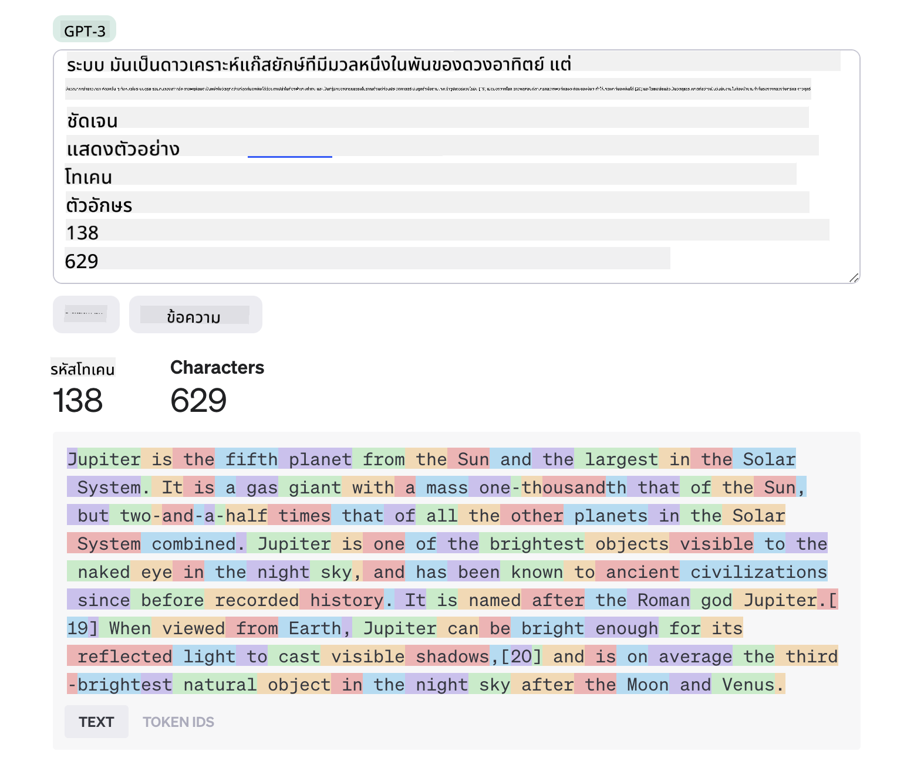
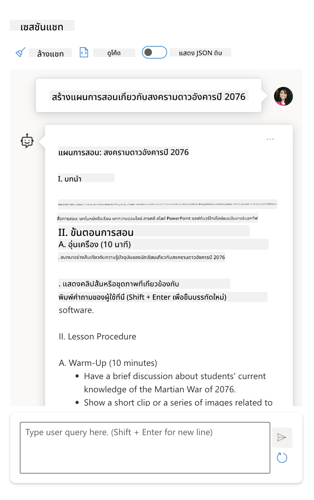
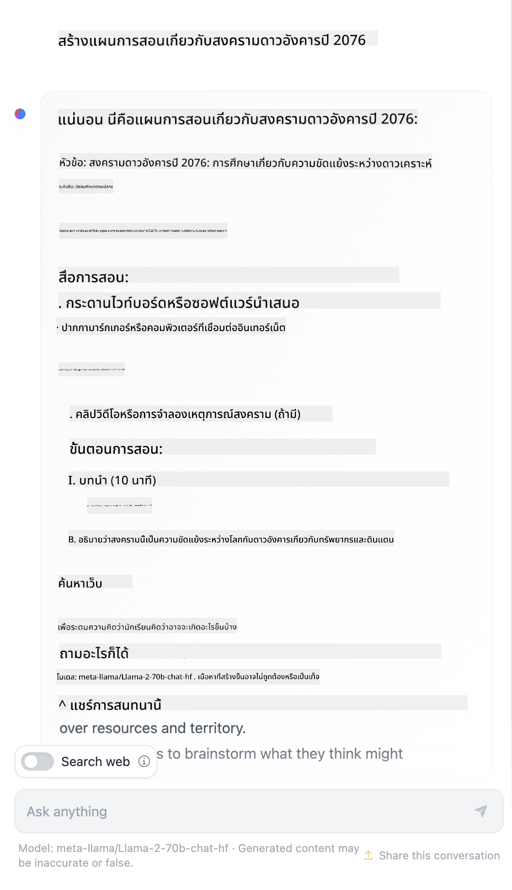

<!--
CO_OP_TRANSLATOR_METADATA:
{
  "original_hash": "a45c318dc6ebc2604f35b8b829f93af2",
  "translation_date": "2025-07-09T10:18:54+00:00",
  "source_file": "04-prompt-engineering-fundamentals/README.md",
  "language_code": "th"
}
-->
# พื้นฐานการออกแบบ Prompt

[](https://aka.ms/gen-ai-lesson4-gh?WT.mc_id=academic-105485-koreyst)

## บทนำ  
โมดูลนี้ครอบคลุมแนวคิดและเทคนิคสำคัญสำหรับการสร้าง prompt ที่มีประสิทธิภาพในโมเดล AI สร้างสรรค์ วิธีการเขียน prompt ให้กับ LLM ก็มีความสำคัญเช่นกัน Prompt ที่ถูกออกแบบอย่างรอบคอบจะช่วยให้ได้คำตอบที่มีคุณภาพดียิ่งขึ้น แต่คำว่า _prompt_ และ _prompt engineering_ นั้นหมายถึงอะไร? แล้วเราจะปรับปรุง _input_ ของ prompt ที่ส่งไปยัง LLM ได้อย่างไร? คำถามเหล่านี้คือสิ่งที่เราจะพยายามตอบในบทนี้และบทถัดไป

_Generative AI_ สามารถสร้างเนื้อหาใหม่ (เช่น ข้อความ รูปภาพ เสียง โค้ด ฯลฯ) ตามคำขอของผู้ใช้ โดยใช้ _Large Language Models_ เช่นชุด GPT ของ OpenAI ("Generative Pre-trained Transformer") ที่ถูกฝึกให้เข้าใจภาษาธรรมชาติและโค้ด

ผู้ใช้สามารถโต้ตอบกับโมเดลเหล่านี้ผ่านรูปแบบที่คุ้นเคย เช่น การแชท โดยไม่จำเป็นต้องมีความรู้ทางเทคนิคหรือการฝึกอบรม โมเดลเหล่านี้เป็นแบบ _prompt-based_ — ผู้ใช้ส่งข้อความ (prompt) และได้รับคำตอบจาก AI (completion) จากนั้นสามารถ "แชทกับ AI" แบบหลายรอบ ปรับแต่ง prompt ไปเรื่อยๆ จนกว่าคำตอบจะตรงกับความคาดหวัง

"Prompt" จึงกลายเป็น _อินเทอร์เฟซการเขียนโปรแกรม_ หลักสำหรับแอป AI สร้างสรรค์ บอกโมเดลว่าต้องทำอะไรและมีผลต่อคุณภาพของคำตอบที่ได้ "Prompt Engineering" คือสาขาที่เติบโตอย่างรวดเร็วซึ่งเน้นการ _ออกแบบและปรับแต่ง_ prompt เพื่อให้ได้คำตอบที่สม่ำเสมอและมีคุณภาพในระดับใหญ่

## เป้าหมายการเรียนรู้

ในบทเรียนนี้ เราจะเรียนรู้ว่า Prompt Engineering คืออะไร ทำไมจึงสำคัญ และเราจะสร้าง prompt ที่มีประสิทธิภาพมากขึ้นสำหรับโมเดลและวัตถุประสงค์ของแอปพลิเคชันได้อย่างไร เราจะเข้าใจแนวคิดหลักและแนวทางปฏิบัติที่ดีที่สุดสำหรับ prompt engineering รวมถึงเรียนรู้เกี่ยวกับสภาพแวดล้อม "sandbox" แบบโต้ตอบใน Jupyter Notebooks ที่เราสามารถเห็นแนวคิดเหล่านี้ถูกนำไปใช้กับตัวอย่างจริง

เมื่อจบบทเรียนนี้ เราจะสามารถ:

1. อธิบายว่า prompt engineering คืออะไรและทำไมจึงสำคัญ  
2. บรรยายส่วนประกอบของ prompt และวิธีการใช้งาน  
3. เรียนรู้แนวทางปฏิบัติที่ดีที่สุดและเทคนิคสำหรับ prompt engineering  
4. นำเทคนิคที่เรียนรู้ไปใช้กับตัวอย่างจริง โดยใช้ OpenAI endpoint

## คำศัพท์สำคัญ

Prompt Engineering: การออกแบบและปรับแต่ง input เพื่อชี้นำโมเดล AI ให้สร้างผลลัพธ์ที่ต้องการ  
Tokenization: กระบวนการแปลงข้อความเป็นหน่วยย่อยที่เรียกว่า tokens ซึ่งโมเดลสามารถเข้าใจและประมวลผลได้  
Instruction-Tuned LLMs: โมเดลภาษาใหญ่ (LLMs) ที่ถูกปรับแต่งเพิ่มเติมด้วยคำสั่งเฉพาะเพื่อเพิ่มความแม่นยำและความเกี่ยวข้องของคำตอบ

## Learning Sandbox

Prompt engineering ในปัจจุบันยังถือเป็นศิลปะมากกว่าวิทยาศาสตร์ วิธีที่ดีที่สุดในการพัฒนาสัญชาตญาณคือ _ฝึกฝนบ่อยๆ_ และใช้วิธีลองผิดลองถูกที่ผสมผสานความเชี่ยวชาญในโดเมนกับเทคนิคที่แนะนำและการปรับแต่งเฉพาะโมเดล

Jupyter Notebook ที่มาพร้อมบทเรียนนี้เป็นสภาพแวดล้อม _sandbox_ ที่คุณสามารถทดลองสิ่งที่เรียนรู้ได้ทันที หรือใช้เป็นส่วนหนึ่งของโจทย์โค้ดท้ายบท ในการทำแบบฝึกหัด คุณจะต้องมี:

1. **คีย์ Azure OpenAI API** — จุดเชื่อมต่อบริการสำหรับ LLM ที่ติดตั้งใช้งาน  
2. **Python Runtime** — สำหรับรัน Notebook  
3. **ตัวแปรสภาพแวดล้อมในเครื่อง** — _ทำตามขั้นตอน [SETUP](./../00-course-setup/SETUP.md?WT.mc_id=academic-105485-koreyst) เพื่อเตรียมความพร้อม_

Notebook มาพร้อมแบบฝึกหัด _เริ่มต้น_ แต่คุณสามารถเพิ่มส่วน _Markdown_ (คำอธิบาย) และ _Code_ (คำขอ prompt) ของตัวเองเพื่อทดลองตัวอย่างหรือไอเดียเพิ่มเติม และสร้างสัญชาตญาณในการออกแบบ prompt

## คู่มือภาพรวม

อยากเห็นภาพรวมของบทเรียนนี้ก่อนเริ่มใช่ไหม? ลองดูคู่มือภาพรวมนี้ ซึ่งจะช่วยให้คุณเข้าใจหัวข้อหลักและข้อคิดสำคัญที่ควรพิจารณาในแต่ละหัวข้อ แผนที่บทเรียนจะพาคุณจากการเข้าใจแนวคิดหลักและความท้าทาย ไปสู่การแก้ไขด้วยเทคนิค prompt engineering ที่เกี่ยวข้องและแนวทางปฏิบัติที่ดีที่สุด หมายเหตุว่า ส่วน "เทคนิคขั้นสูง" ในคู่มือนี้จะครอบคลุมเนื้อหาในบทถัดไปของหลักสูตรนี้


## สตาร์ทอัพของเรา

ตอนนี้ มาคุยกันว่า _หัวข้อนี้_ เกี่ยวข้องกับพันธกิจของสตาร์ทอัพเราอย่างไรในการ [นำ AI มาสู่นวัตกรรมการศึกษา](https://educationblog.microsoft.com/2023/06/collaborating-to-bring-ai-innovation-to-education?WT.mc_id=academic-105485-koreyst) เราต้องการสร้างแอป AI ที่ขับเคลื่อนการ _เรียนรู้แบบเฉพาะบุคคล_ ดังนั้นลองคิดดูว่าผู้ใช้แต่ละกลุ่มในแอปของเราอาจ "ออกแบบ" prompt อย่างไร:

- **ผู้ดูแลระบบ** อาจขอให้ AI _วิเคราะห์ข้อมูลหลักสูตรเพื่อหาช่องว่างในการสอน_ AI สามารถสรุปผลหรือแสดงภาพด้วยโค้ดได้  
- **ครูผู้สอน** อาจขอให้ AI _สร้างแผนการสอนสำหรับกลุ่มเป้าหมายและหัวข้อ_ AI สามารถสร้างแผนเฉพาะบุคคลในรูปแบบที่กำหนดได้  
- **นักเรียน** อาจขอให้ AI _สอนพิเศษในวิชาที่ยาก_ AI สามารถแนะนำบทเรียน คำแนะนำ และตัวอย่างที่เหมาะสมกับระดับของนักเรียนได้

นี่เป็นเพียงส่วนเล็กๆ ของศักยภาพ ลองดู [Prompts For Education](https://github.com/microsoft/prompts-for-edu/tree/main?WT.mc_id=academic-105485-koreyst) — ห้องสมุด prompt แบบโอเพนซอร์สที่คัดสรรโดยผู้เชี่ยวชาญด้านการศึกษา — เพื่อเห็นภาพรวมของความเป็นไปได้! _ลองรัน prompt เหล่านั้นใน sandbox หรือใช้ OpenAI Playground ดูผลลัพธ์กัน!_

<!--  
LESSON TEMPLATE:  
This unit should cover core concept #1.  
Reinforce the concept with examples and references.  

CONCEPT #1:  
Prompt Engineering.  
Define it and explain why it is needed.  
-->

## Prompt Engineering คืออะไร?

เราเริ่มบทเรียนนี้ด้วยการนิยาม **Prompt Engineering** ว่าเป็นกระบวนการ _ออกแบบและปรับแต่ง_ ข้อความ input (prompt) เพื่อให้ได้คำตอบ (completion) ที่สม่ำเสมอและมีคุณภาพสำหรับวัตถุประสงค์ของแอปและโมเดลที่กำหนด เราสามารถมองว่าเป็นกระบวนการ 2 ขั้นตอน:

- _ออกแบบ_ prompt เริ่มต้นสำหรับโมเดลและวัตถุประสงค์ที่กำหนด  
- _ปรับแต่ง_ prompt อย่างต่อเนื่องเพื่อพัฒนาคุณภาพคำตอบ

นี่เป็นกระบวนการลองผิดลองถูกที่ต้องใช้สัญชาตญาณและความพยายามของผู้ใช้เพื่อให้ได้ผลลัพธ์ที่ดีที่สุด แล้วทำไมถึงสำคัญ? เพื่อหาคำตอบ เราต้องเข้าใจสามแนวคิดนี้ก่อน:

- _Tokenization_ = โมเดล "มองเห็น" prompt อย่างไร  
- _Base LLMs_ = โมเดลพื้นฐาน "ประมวลผล" prompt อย่างไร  
- _Instruction-Tuned LLMs_ = โมเดลสามารถ "เข้าใจงาน" ได้อย่างไร

### Tokenization

LLM มอง prompt เป็น _ลำดับของ tokens_ ซึ่งโมเดลแต่ละตัว (หรือเวอร์ชันของโมเดล) อาจแบ่ง token ของ prompt เดียวกันแตกต่างกัน เนื่องจาก LLM ถูกฝึกด้วย tokens (ไม่ใช่ข้อความดิบ) วิธีการแบ่ง token ของ prompt จึงส่งผลโดยตรงต่อคุณภาพของคำตอบที่สร้างขึ้น

เพื่อเข้าใจการทำงานของ tokenization ลองใช้เครื่องมืออย่าง [OpenAI Tokenizer](https://platform.openai.com/tokenizer?WT.mc_id=academic-105485-koreyst) ที่แสดงด้านล่าง คัดลอก prompt ของคุณเข้าไป แล้วดูว่ามันถูกแปลงเป็น tokens อย่างไร ให้สังเกตการจัดการกับช่องว่างและเครื่องหมายวรรคตอน ตัวอย่างนี้ใช้ LLM รุ่นเก่า (GPT-3) ดังนั้นถ้าลองกับโมเดลใหม่อาจได้ผลลัพธ์ต่างกัน



### แนวคิด: โมเดลพื้นฐาน (Foundation Models)

เมื่อ prompt ถูกแบ่งเป็น tokens แล้ว ฟังก์ชันหลักของ ["Base LLM"](https://blog.gopenai.com/an-introduction-to-base-and-instruction-tuned-large-language-models-8de102c785a6?WT.mc_id=academic-105485-koreyst) (หรือโมเดลพื้นฐาน) คือการทำนาย token ถัดไปในลำดับนั้น เนื่องจาก LLM ถูกฝึกด้วยชุดข้อมูลข้อความขนาดใหญ่ จึงมีความเข้าใจในความสัมพันธ์เชิงสถิติระหว่าง tokens และสามารถทำนายได้อย่างมั่นใจ อย่างไรก็ตาม โมเดลไม่ได้เข้าใจ _ความหมาย_ ของคำใน prompt หรือ token เพียงแต่เห็นรูปแบบที่สามารถ "เติมเต็ม" ด้วยการทำนายถัดไปได้ พวกมันสามารถทำนายลำดับต่อไปได้เรื่อยๆ จนกว่าจะถูกหยุดโดยผู้ใช้หรือเงื่อนไขที่ตั้งไว้

อยากลองดูการทำงานของ prompt-based completion ไหม? ใส่ prompt ข้างต้นใน Azure OpenAI Studio [_Chat Playground_](https://oai.azure.com/playground?WT.mc_id=academic-105485-koreyst) ด้วยการตั้งค่าเริ่มต้น ระบบถูกตั้งค่าให้มอง prompt เป็นคำขอข้อมูล — ดังนั้นคุณจะเห็นคำตอบที่สอดคล้องกับบริบทนี้

แต่ถ้าผู้ใช้ต้องการคำตอบเฉพาะที่ตรงตามเกณฑ์หรืองานล่ะ? นี่คือจุดที่ _instruction-tuned_ LLMs เข้ามามีบทบาท


### แนวคิด: Instruction Tuned LLMs

[Instruction Tuned LLM](https://blog.gopenai.com/an-introduction-to-base-and-instruction-tuned-large-language-models-8de102c785a6?WT.mc_id=academic-105485-koreyst) เริ่มจากโมเดลพื้นฐานและปรับแต่งเพิ่มเติมด้วยตัวอย่างหรือคู่ input/output (เช่น "ข้อความ" หลายรอบ) ที่มีคำสั่งชัดเจน — และคำตอบจาก AI จะพยายามปฏิบัติตามคำสั่งนั้น

เทคนิคนี้ใช้ Reinforcement Learning with Human Feedback (RLHF) ที่ช่วยฝึกโมเดลให้ _ปฏิบัติตามคำสั่ง_ และ _เรียนรู้จากข้อเสนอแนะ_ เพื่อให้ได้คำตอบที่เหมาะสมกับการใช้งานจริงและตรงกับวัตถุประสงค์ของผู้ใช้มากขึ้น

ลองดูสิ — กลับไปที่ prompt ข้างต้น แต่เปลี่ยน _system message_ เพื่อให้คำสั่งนี้เป็นบริบท:

> _สรุปเนื้อหาที่ได้รับสำหรับนักเรียนชั้นประถมศึกษาปีที่ 2 ให้ผลลัพธ์เป็นย่อหน้าเดียวพร้อม 3-5 ข้อสั้นๆ_

ดูว่าผลลัพธ์ถูกปรับแต่งให้ตรงกับเป้าหมายและรูปแบบที่ต้องการอย่างไร? ครูผู้สอนสามารถใช้คำตอบนี้โดยตรงในสไลด์สำหรับชั้นเรียนได้เลย


## ทำไมเราต้องมี Prompt Engineering?

เมื่อเรารู้แล้วว่า LLM ประมวลผล prompt อย่างไร มาคุยกันว่า _ทำไม_ เราต้องมี prompt engineering คำตอบอยู่ที่ว่า LLM ปัจจุบันมีความท้าทายหลายอย่างที่ทำให้การได้คำตอบที่ _น่าเชื่อถือและสม่ำเสมอ_ เป็นเรื่องยากหากไม่ใส่ใจในการสร้างและปรับแต่ง prompt เช่น:

1. **คำตอบของโมเดลมีความสุ่ม** _Prompt เดียวกัน_ อาจให้คำตอบต่างกันกับโมเดลหรือเวอร์ชันต่างๆ และอาจให้ผลลัพธ์ต่างกันแม้ใช้โมเดลเดียวกันในเวลาต่างกัน _เทคนิค prompt engineering ช่วยลดความแปรปรวนเหล่านี้ด้วยการกำหนดกรอบที่ชัดเจนขึ้น_

2. **โมเดลอาจสร้างคำตอบที่ไม่ถูกต้อง** โมเดลถูกฝึกด้วยชุดข้อมูล _ขนาดใหญ่แต่จำกัด_ หมายความว่าโมเดลไม่มีความรู้เกี่ยวกับข้อมูลนอกขอบเขตการฝึก จึงอาจสร้างคำตอบที่ผิดพลาด จินตนาการ หรือขัดแย้งกับข้อเท็จจริง _เทคนิค prompt engineering ช่วยให้ผู้ใช้ตรวจจับและลดปัญหานี้ เช่น การขอให้ AI อ้างอิงแหล่งที่มา หรือให้เหตุผล_

3. **ความสามารถของโมเดลแตกต่างกัน** โมเดลรุ่นใหม่หรือรุ่นถัดไปจะมีความสามารถมากขึ้น แต่ก็มีลักษณะเฉพาะและข้อแลกเปลี่ยนในเรื่องต้นทุนและความซับซ้อน _prompt engineering ช่วยพัฒนาแนวทางปฏิบัติและเวิร์กโฟลว์ที่ปรับตัวเข้ากับความแตกต่างของโมเดลได้อย่างราบรื่นและขยายผลได้_

ลองดูตัวอย่างใน OpenAI หรือ Azure OpenAI Playground:

- ใช้ prompt เดียวกันกับการติดตั้ง LLM ต่างๆ (เช่น OpenAI, Azure OpenAI, Hugging Face) — คุณเห็นความแตกต่างไหม?  
- ใช้ prompt เดียวกันซ้ำๆ กับการติดตั้ง LLM เดียวกัน (เช่น Azure OpenAI playground) — ความแตกต่างเหล่านี้เป็นอย่างไร?

### ตัวอย่าง Fabrications

ในหลักสูตรนี้ เราใช้คำว่า **"fabrication"** เพื่ออ้างถึงปรากฏการณ์ที่ LLM บางครั้งสร้างข้อมูลที่ไม่ถูกต้องทางข้อเท็จจริง เนื่องจากข้อจำกัดในการฝึกหรือข้อจำกัดอื่นๆ คุณอาจเคยได้ยินคำว่า _"hallucinations"_ ในบทความหรืองานวิจัยทั่วไป แต่เราแนะนำให้ใช้คำว่า _"fabrication"_ เพื่อหลีกเลี่ยงการให้ความหมายเหมือนมนุษย์กับพฤติกรรมของเครื่องจักร และยังสอดคล้องกับ [แนวทาง Responsible AI](https://www.microsoft.com/ai/responsible-ai?WT.mc_id=academic-105485-koreyst) ในแง่ของคำศัพท์ โดยตัดคำที่อาจถูกมองว่าไม่เหมาะสมหรือไม่ครอบคลุมในบางบริบทออก

อยากเข้าใจว่า fabrication ทำงานอย่างไร? ลองคิดถึง prompt ที่สั่งให้ AI สร้างเนื้อหาสำหรับหัวข้อที่ไม่มีอยู่จริง (เพื่อให้แน่ใจว่าไม่มีในชุดข้อมูลฝึก) เช่น — ฉันได้ลองใช้ prompt นี้:
# แผนการสอน: สงครามดาวอังคารปี 2076

## วัตถุประสงค์ของบทเรียน
- เข้าใจสาเหตุและผลกระทบของสงครามดาวอังคารปี 2076
- วิเคราะห์บทบาทของฝ่ายต่าง ๆ ในสงคราม
- ประเมินผลกระทบทางสังคมและเทคโนโลยีที่เกิดขึ้นหลังสงคราม

## เนื้อหาบทเรียน
1. ภูมิหลังและสาเหตุของสงคราม
2. เหตุการณ์สำคัญในช่วงสงคราม
3. ฝ่ายที่เกี่ยวข้องและกลยุทธ์ที่ใช้
4. ผลลัพธ์และผลกระทบหลังสงคราม

## กิจกรรมการเรียนรู้
- การอภิปรายกลุ่มเกี่ยวกับสาเหตุของสงคราม
- การวิเคราะห์เอกสารและภาพถ่ายจากสงคราม
- การจำลองสถานการณ์การเจรจาสันติภาพ
- การเขียนรายงานสรุปผลกระทบของสงคราม

## สื่อและอุปกรณ์
- เอกสารประกอบการสอน
- วิดีโอสารคดีเกี่ยวกับสงครามดาวอังคาร
- แผนที่และไทม์ไลน์ของเหตุการณ์

## การประเมินผล
- แบบทดสอบความเข้าใจเนื้อหา
- การนำเสนอผลงานกลุ่ม
- การเขียนเรียงความวิเคราะห์สงคราม

## หมายเหตุ
- เน้นการคิดวิเคราะห์และการทำงานร่วมกันเป็นทีม
- สนับสนุนให้นักเรียนตั้งคำถามและแสดงความคิดเห็นอย่างสร้างสรรค์
การค้นหาเว็บแสดงให้เห็นว่ามีเรื่องเล่าจินตนาการ (เช่น ซีรีส์โทรทัศน์หรือหนังสือ) เกี่ยวกับสงครามบนดาวอังคาร – แต่ไม่มีเรื่องใดที่เกิดขึ้นในปี 2076 ข้อเท็จจริงทั่วไปยังบอกเราว่า 2076 คือ _อนาคต_ ดังนั้นจึงไม่สามารถเชื่อมโยงกับเหตุการณ์จริงได้

แล้วจะเกิดอะไรขึ้นเมื่อเรารันพรอมต์นี้กับผู้ให้บริการ LLM ต่างๆ?

> **Response 1**: OpenAI Playground (GPT-35)


> **Response 2**: Azure OpenAI Playground (GPT-35)



> **Response 3**: : Hugging Face Chat Playground (LLama-2)



ตามที่คาดไว้ แต่ละโมเดล (หรือเวอร์ชันของโมเดล) ให้คำตอบที่แตกต่างกันเล็กน้อย เนื่องจากพฤติกรรมแบบสุ่มและความสามารถของโมเดลที่แตกต่างกัน ตัวอย่างเช่น โมเดลหนึ่งมุ่งเป้าไปที่ผู้ฟังระดับชั้นประถมศึกษาปีที่ 8 ขณะที่อีกโมเดลหนึ่งสมมติว่าผู้ฟังเป็นนักเรียนมัธยมปลาย แต่ทั้งสามโมเดลต่างก็สร้างคำตอบที่สามารถโน้มน้าวผู้ใช้ที่ไม่มีข้อมูลมาก่อนว่าเหตุการณ์นั้นเป็นเรื่องจริงได้

เทคนิคการออกแบบพรอมต์ เช่น _metaprompting_ และ _การตั้งค่า temperature_ อาจช่วยลดการสร้างข้อมูลเท็จของโมเดลได้ในระดับหนึ่ง สถาปัตยกรรมการออกแบบพรอมต์ใหม่ๆ ยังผสานรวมเครื่องมือและเทคนิคใหม่ๆ เข้าไปในกระบวนการพรอมต์อย่างราบรื่น เพื่อบรรเทาหรือช่วยลดผลกระทบบางอย่างเหล่านี้

## กรณีศึกษา: GitHub Copilot

มาปิดท้ายส่วนนี้ด้วยการทำความเข้าใจว่าการออกแบบพรอมต์ถูกนำไปใช้ในโซลูชันจริงอย่างไร โดยดูจากกรณีศึกษา: [GitHub Copilot](https://github.com/features/copilot?WT.mc_id=academic-105485-koreyst)

GitHub Copilot คือ "โปรแกรมเมอร์คู่ใจ AI" ของคุณ – มันแปลงพรอมต์ข้อความเป็นโค้ดที่สมบูรณ์และถูกรวมเข้ากับสภาพแวดล้อมการพัฒนาของคุณ (เช่น Visual Studio Code) เพื่อประสบการณ์ใช้งานที่ราบรื่น ตามที่บันทึกไว้ในชุดบล็อกด้านล่าง เวอร์ชันแรกสุดสร้างขึ้นบนโมเดล OpenAI Codex โดยวิศวกรได้ตระหนักอย่างรวดเร็วถึงความจำเป็นในการปรับแต่งโมเดลและพัฒนาเทคนิคการออกแบบพรอมต์ที่ดีกว่า เพื่อปรับปรุงคุณภาพโค้ด ในเดือนกรกฎาคม พวกเขา [เปิดตัวโมเดล AI ที่พัฒนาขึ้นซึ่งก้าวข้าม Codex](https://github.blog/2023-07-28-smarter-more-efficient-coding-github-copilot-goes-beyond-codex-with-improved-ai-model/?WT.mc_id=academic-105485-koreyst) เพื่อให้คำแนะนำที่รวดเร็วขึ้น

อ่านโพสต์ตามลำดับเพื่อเข้าใจเส้นทางการเรียนรู้ของพวกเขา

- **พฤษภาคม 2023** | [GitHub Copilot กำลังเข้าใจโค้ดของคุณได้ดีขึ้น](https://github.blog/2023-05-17-how-github-copilot-is-getting-better-at-understanding-your-code/?WT.mc_id=academic-105485-koreyst)
- **พฤษภาคม 2023** | [เบื้องหลัง GitHub: การทำงานกับ LLMs ที่อยู่เบื้องหลัง GitHub Copilot](https://github.blog/2023-05-17-inside-github-working-with-the-llms-behind-github-copilot/?WT.mc_id=academic-105485-koreyst)
- **มิถุนายน 2023** | [วิธีเขียนพรอมต์ที่ดีกว่าสำหรับ GitHub Copilot](https://github.blog/2023-06-20-how-to-write-better-prompts-for-github-copilot/?WT.mc_id=academic-105485-koreyst)
- **กรกฎาคม 2023** | [.. GitHub Copilot ก้าวข้าม Codex ด้วยโมเดล AI ที่พัฒนาขึ้น](https://github.blog/2023-07-28-smarter-more-efficient-coding-github-copilot-goes-beyond-codex-with-improved-ai-model/?WT.mc_id=academic-105485-koreyst)
- **กรกฎาคม 2023** | [คู่มือสำหรับนักพัฒนาเกี่ยวกับการออกแบบพรอมต์และ LLMs](https://github.blog/2023-07-17-prompt-engineering-guide-generative-ai-llms/?WT.mc_id=academic-105485-koreyst)
- **กันยายน 2023** | [วิธีสร้างแอป LLM สำหรับองค์กร: บทเรียนจาก GitHub Copilot](https://github.blog/2023-09-06-how-to-build-an-enterprise-llm-application-lessons-from-github-copilot/?WT.mc_id=academic-105485-koreyst)

คุณยังสามารถเยี่ยมชม [บล็อกวิศวกรรม](https://github.blog/category/engineering/?WT.mc_id=academic-105485-koreyst) ของพวกเขาเพื่ออ่านโพสต์เพิ่มเติม เช่น [โพสต์นี้](https://github.blog/2023-09-27-how-i-used-github-copilot-chat-to-build-a-reactjs-gallery-prototype/?WT.mc_id=academic-105485-koreyst) ที่แสดงให้เห็นว่าโมเดลและเทคนิคเหล่านี้ถูก _นำไปใช้_ อย่างไรในการขับเคลื่อนแอปพลิเคชันในโลกจริง

---

<!--
LESSON TEMPLATE:
หน่วยนี้ควรครอบคลุมแนวคิดหลักข้อที่ 2
เสริมแนวคิดด้วยตัวอย่างและแหล่งอ้างอิง

CONCEPT #2:
การออกแบบพรอมต์
แสดงด้วยตัวอย่าง
-->

## การสร้างพรอมต์

เราได้เห็นแล้วว่าทำไมการออกแบบพรอมต์จึงสำคัญ – ตอนนี้มาทำความเข้าใจว่าพรอมต์ถูก _สร้าง_ ขึ้นอย่างไร เพื่อที่เราจะได้ประเมินเทคนิคต่างๆ สำหรับการออกแบบพรอมต์ที่มีประสิทธิภาพมากขึ้น

### พรอมต์พื้นฐาน

เริ่มต้นด้วยพรอมต์พื้นฐาน: ข้อความอินพุตที่ส่งไปยังโมเดลโดยไม่มีบริบทอื่น นี่คือตัวอย่าง – เมื่อเราส่งคำแรกๆ ของเพลงชาติสหรัฐอเมริกาไปยัง OpenAI [Completion API](https://platform.openai.com/docs/api-reference/completions?WT.mc_id=academic-105485-koreyst) มันจะ _เติมเต็ม_ คำตอบด้วยบรรทัดถัดไปทันที แสดงพฤติกรรมการทำนายพื้นฐาน

| Prompt (Input)     | Completion (Output)                                                                                                                        |
| :----------------- | :----------------------------------------------------------------------------------------------------------------------------------------- |
| Oh say can you see | ฟังดูเหมือนคุณกำลังเริ่มร้องเพลง "The Star-Spangled Banner" เพลงชาติของสหรัฐอเมริกา เนื้อเพลงเต็มคือ ... |

### พรอมต์ซับซ้อน

ตอนนี้เพิ่มบริบทและคำสั่งลงในพรอมต์พื้นฐานนั้น [Chat Completion API](https://learn.microsoft.com/azure/ai-services/openai/how-to/chatgpt?WT.mc_id=academic-105485-koreyst) ช่วยให้เราสร้างพรอมต์ซับซ้อนได้ในรูปแบบของ _ข้อความ_ หลายข้อความที่ประกอบด้วย:

- คู่ของอินพุต/เอาต์พุตที่สะท้อนการป้อนข้อมูลของ _ผู้ใช้_ และการตอบกลับของ _ผู้ช่วย_
- ข้อความระบบที่ตั้งค่าบริบทสำหรับพฤติกรรมหรือบุคลิกภาพของผู้ช่วย

คำขอจะอยู่ในรูปแบบด้านล่างนี้ ซึ่ง _tokenization_ จะจับข้อมูลที่เกี่ยวข้องจากบริบทและการสนทนาได้อย่างมีประสิทธิภาพ การเปลี่ยนบริบทของระบบจึงมีผลต่อคุณภาพของคำตอบได้มากเท่ากับอินพุตของผู้ใช้ที่ให้มา

```python
response = openai.chat.completions.create(
    model="gpt-3.5-turbo",
    messages=[
        {"role": "system", "content": "You are a helpful assistant."},
        {"role": "user", "content": "Who won the world series in 2020?"},
        {"role": "assistant", "content": "The Los Angeles Dodgers won the World Series in 2020."},
        {"role": "user", "content": "Where was it played?"}
    ]
)
```

### พรอมต์คำสั่ง

ในตัวอย่างข้างต้น พรอมต์ของผู้ใช้เป็นเพียงข้อความคำถามง่ายๆ ที่สามารถตีความได้ว่าเป็นการขอข้อมูล ด้วยพรอมต์ _คำสั่ง_ เราสามารถใช้ข้อความนั้นเพื่อระบุงานอย่างละเอียดขึ้น ให้คำแนะนำที่ดีกว่าแก่ AI นี่คือตัวอย่าง:

| Prompt (Input)                                                                                                                                                                                                                         | Completion (Output)                                                                                                        | Instruction Type    |
| :------------------------------------------------------------------------------------------------------------------------------------------------------------------------------------------------------------------------------------- | :------------------------------------------------------------------------------------------------------------------------- | :------------------ |
| Write a description of the Civil War                                                                                                                                                                                                   | _ส่งคืนย่อหน้าง่ายๆ_                                                                                                     | ง่าย                |
| Write a description of the Civil War. Provide key dates and events and describe their significance                                                                                                                                     | _ส่งคืนย่อหน้าตามด้วยรายการวันที่เหตุการณ์สำคัญพร้อมคำอธิบาย_                                                           | ซับซ้อน             |
| Write a description of the Civil War in 1 paragraph. Provide 3 bullet points with key dates and their significance. Provide 3 more bullet points with key historical figures and their contributions. Return the output as a JSON file | _ส่งคืนรายละเอียดที่มากขึ้นในกล่องข้อความในรูปแบบ JSON ที่คุณสามารถคัดลอกไปวางในไฟล์และตรวจสอบได้ตามต้องการ_           | ซับซ้อน. มีรูปแบบ    |

## เนื้อหาหลัก

ในตัวอย่างข้างต้น พรอมต์ยังค่อนข้างเปิดกว้าง ให้ LLM ตัดสินใจเองว่าส่วนใดของชุดข้อมูลที่ผ่านการฝึกฝนมาก่อนนั้นเกี่ยวข้อง ด้วยรูปแบบการออกแบบ _เนื้อหาหลัก_ ข้อความอินพุตจะแบ่งออกเป็นสองส่วน:

- คำสั่ง (การกระทำ)
- เนื้อหาที่เกี่ยวข้อง (ซึ่งมีผลต่อการกระทำ)

นี่คือตัวอย่างที่คำสั่งคือ "สรุปสิ่งนี้ใน 2 ประโยคสั้นๆ"

| Prompt (Input)                                                                                                                                                                                                                                                                                                                                                                                                                                                                                                                                                                                                                                                                                      | Completion (Output)                                                                                                                                                                                                                                                                             |
| :-------------------------------------------------------------------------------------------------------------------------------------------------------------------------------------------------------------------------------------------------------------------------------------------------------------------------------------------------------------------------------------------------------------------------------------------------------------------------------------------------------------------------------------------------------------------------------------------------------------------------------------------------------------------------------------------------- | :---------------------------------------------------------------------------------------------------------------------------------------------------------------------------------------------------------------------------------------------------------------------------------------------- |
| Jupiter is the fifth planet from the Sun and the largest in the Solar System. It is a gas giant with a mass one-thousandth that of the Sun, but two-and-a-half times that of all the other planets in the Solar System combined. Jupiter is one of the brightest objects visible to the naked eye in the night sky, and has been known to ancient civilizations since before recorded history. It is named after the Roman god Jupiter.[19] When viewed from Earth, Jupiter can be bright enough for its reflected light to cast visible shadows,[20] and is on average the third-brightest natural object in the night sky after the Moon and Venus. <br/> **Summarize this in 2 short sentences** | ดาวพฤหัสบดี ดาวเคราะห์ดวงที่ห้าจากดวงอาทิตย์ เป็นดาวเคราะห์ที่ใหญ่ที่สุดในระบบสุริยะและเป็นหนึ่งในวัตถุที่สว่างที่สุดในท้องฟ้ายามค่ำคืน ตั้งชื่อตามเทพเจ้าชาวโรมันชื่อจูปิเตอร์ เป็นดาวแก๊สยักษ์ที่มีมวลมากกว่าดาวเคราะห์อื่นๆ ในระบบสุริยะรวมกันถึงสองเท่าครึ่ง |

ส่วนเนื้อหาหลักสามารถใช้ในรูปแบบต่างๆ เพื่อขับเคลื่อนคำสั่งที่มีประสิทธิภาพมากขึ้น:

- **ตัวอย่าง** – แทนที่จะบอกโมเดลว่าต้องทำอะไรด้วยคำสั่งชัดเจน ให้ตัวอย่างสิ่งที่ต้องทำและปล่อยให้โมเดลสรุปรูปแบบเอง
- **สัญญาณนำ** – ตามคำสั่งด้วย "สัญญาณนำ" ที่ช่วยกระตุ้นการตอบกลับ นำทางโมเดลไปสู่คำตอบที่เกี่ยวข้องมากขึ้น
- **แม่แบบ** – เป็น 'สูตร' ที่ใช้ซ้ำได้สำหรับพรอมต์ที่มีตัวแปร (placeholders) ซึ่งสามารถปรับแต่งด้วยข้อมูลสำหรับกรณีใช้งานเฉพาะ

มาดูตัวอย่างการใช้งานกัน

### การใช้ตัวอย่าง

นี่คือวิธีที่ใช้เนื้อหาหลักเพื่อ "ป้อนตัวอย่าง" ให้โมเดลเห็นรูปแบบผลลัพธ์ที่ต้องการสำหรับคำสั่งที่กำหนด และปล่อยให้โมเดลสรุปรูปแบบผลลัพธ์ที่ต้องการ จากจำนวนตัวอย่างที่ให้ เราสามารถมี zero-shot prompting, one-shot prompting, few-shot prompting เป็นต้น

พรอมต์ตอนนี้ประกอบด้วยสามส่วน:

- คำอธิบายงาน
- ตัวอย่างผลลัพธ์ที่ต้องการบางส่วน
- จุดเริ่มต้นของตัวอย่างใหม่ (ซึ่งกลายเป็นคำอธิบายงานโดยนัย)

| Learning Type | Prompt (Input)                                                                                                                                        | Completion (Output)         |
| :------------ | :---------------------------------------------------------------------------------------------------------------------------------------------------- | :-------------------------- |
| Zero-shot     | "The Sun is Shining". Translate to Spanish                                                                                                            | "El Sol está brillando".    |
| One-shot      | "The Sun is Shining" => ""El Sol está brillando". <br> "It's a Cold and Windy Day" =>                                                                 | "Es un día frío y ventoso". |
| Few-shot      | The player ran the bases => Baseball <br/> The player hit an ace => Tennis <br/> The player hit a six => Cricket <br/> The player made a slam-dunk => | Basketball                  |
|               |                                                                                                                                                       |                             |

สังเกตว่าใน zero-shot prompting เราต้องให้คำสั่งชัดเจน ("Translate to Spanish") แต่ใน one-shot prompting คำสั่งนั้นถูกสรุปได้เองจากตัวอย่าง ตัวอย่าง few-shot แสดงให้เห็นว่าการเพิ่มตัวอย่างมากขึ้นช่วยให้โมเดลสรุปได้แม่นยำขึ้นโดยไม่ต้องเพิ่มคำสั่ง

### สัญญาณนำของพรอมต์

อีกเทคนิคหนึ่งในการใช้เนื้อหาหลักคือการให้ _สัญญาณนำ_ แทนตัวอย่าง ในกรณีนี้ เราให้โมเดลได้รับการกระตุ้นในทิศทางที่ถูกต้องโดย _เริ่มต้น_ ด้วยข้อความตัวอย่างที่สะท้อนรูปแบบคำตอบที่ต้องการ โมเดลจึง "รับสัญญาณ" และดำเนินการต่อในแนวนั้น

| Number of Cues | Prompt (Input)                                                                                                                                                                                                                                                                                                                                                                                                                                               | Completion (Output)                                                                                                                                                                                                                                                                                       |
| :------------- | :----------------------------------------------------------------------------------------------------------------------------------------------------------------------------------------------------------------------------------------------------------------------------------------------------------------------------------------------------------------------------------------------------------------------------------------------------------- | :-------------------------------------------------------------------------------------------------------------------------------------------------------------------------------------------------------------------------------------------------------------------------------------------------------- |
| 0              | Jupiter is the fifth planet from the Sun and the largest in the Solar System. It is a gas giant with a mass one-thousandth that of the Sun, but two-and-a-half times that of all the other planets in the Solar System combined. Jupiter is one of the brightest objects visible to the naked eye in the night sky, and has been known to ancient civilizations since before recorded history.

**สรุปสิ่งนี้**                                       | ดาวพฤหัสบดีเป็นดาวเคราะห์ที่ใหญ่ที่สุดในระบบสุริยะของเราและเป็นดาวเคราะห์ดวงที่ห้าจากดวงอาทิตย์ เป็นดาวแก๊สยักษ์ที่มีมวลประมาณ 1/1000 ของดวงอาทิตย์ แต่มีน้ำหนักมากกว่าดาวเคราะห์ดวงอื่น ๆ รวมกัน อารยธรรมโบราณรู้จักดาวพฤหัสบดีมานานแล้ว และสามารถมองเห็นได้ง่ายในท้องฟ้ายามค่ำคืน.. |
| 1              | ดาวพฤหัสบดีเป็นดาวเคราะห์ดวงที่ห้าจากดวงอาทิตย์และเป็นดาวเคราะห์ที่ใหญ่ที่สุดในระบบสุริยะ เป็นดาวแก๊สยักษ์ที่มีมวลประมาณหนึ่งในพันของดวงอาทิตย์ แต่มีมวลมากกว่าดาวเคราะห์ดวงอื่น ๆ รวมกันถึงสองเท่าครึ่ง ดาวพฤหัสบดีเป็นหนึ่งในวัตถุที่สว่างที่สุดที่มองเห็นได้ด้วยตาเปล่าในท้องฟ้ายามค่ำคืน และเป็นที่รู้จักของอารยธรรมโบราณตั้งแต่ก่อนมีบันทึกทางประวัติศาสตร์ <br/>**สรุปสิ่งนี้** <br/> สิ่งที่เราได้เรียนรู้คือ ดาวพฤหัสบดี | เป็นดาวเคราะห์ดวงที่ห้าจากดวงอาทิตย์และใหญ่ที่สุดในระบบสุริยะ เป็นดาวแก๊สยักษ์ที่มีมวลประมาณหนึ่งในพันของดวงอาทิตย์ แต่มีมวลมากกว่าดาวเคราะห์ดวงอื่น ๆ รวมกันถึงสองเท่าครึ่ง มองเห็นได้ง่ายด้วยตาเปล่าและเป็นที่รู้จักตั้งแต่สมัยโบราณ                        |
| 2              | ดาวพฤหัสบดีเป็นดาวเคราะห์ดวงที่ห้าจากดวงอาทิตย์และเป็นดาวเคราะห์ที่ใหญ่ที่สุดในระบบสุริยะ เป็นดาวแก๊สยักษ์ที่มีมวลประมาณหนึ่งในพันของดวงอาทิตย์ แต่มีมวลมากกว่าดาวเคราะห์ดวงอื่น ๆ รวมกันถึงสองเท่าครึ่ง ดาวพฤหัสบดีเป็นหนึ่งในวัตถุที่สว่างที่สุดที่มองเห็นได้ด้วยตาเปล่าในท้องฟ้ายามค่ำคืน และเป็นที่รู้จักของอารยธรรมโบราณตั้งแต่ก่อนมีบันทึกทางประวัติศาสตร์ <br/>**สรุปสิ่งนี้** <br/> 3 ข้อเท็จจริงสำคัญที่เราได้เรียนรู้:         | 1. ดาวพฤหัสบดีเป็นดาวเคราะห์ดวงที่ห้าจากดวงอาทิตย์และใหญ่ที่สุดในระบบสุริยะ <br/> 2. เป็นดาวแก๊สยักษ์ที่มีมวลประมาณหนึ่งในพันของดวงอาทิตย์...<br/> 3. ดาวพฤหัสบดีมองเห็นได้ด้วยตาเปล่าตั้งแต่สมัยโบราณ ...                                                                       |
|                |                                                                                                                                                                                                                                                                                                                                                                                                                                                              |                                                                                                                                                                                                                                                                                                           |

### Prompt Templates

เทมเพลตพรอมต์คือ _สูตรสำเร็จที่กำหนดไว้ล่วงหน้าสำหรับพรอมต์_ ที่สามารถเก็บไว้และนำกลับมาใช้ใหม่ได้ตามต้องการ เพื่อสร้างประสบการณ์ผู้ใช้ที่สม่ำเสมอในวงกว้าง ในรูปแบบที่ง่ายที่สุด มันคือชุดตัวอย่างพรอมต์เช่น [ตัวอย่างนี้จาก OpenAI](https://platform.openai.com/examples?WT.mc_id=academic-105485-koreyst) ที่ให้ทั้งส่วนประกอบพรอมต์แบบโต้ตอบ (ข้อความผู้ใช้และระบบ) และรูปแบบคำขอที่ขับเคลื่อนด้วย API - เพื่อสนับสนุนการนำกลับมาใช้ใหม่

ในรูปแบบที่ซับซ้อนขึ้น เช่น [ตัวอย่างนี้จาก LangChain](https://python.langchain.com/docs/concepts/prompt_templates/?WT.mc_id=academic-105485-koreyst) จะมี _ตัวแทนที่ว่าง_ ที่สามารถแทนที่ด้วยข้อมูลจากแหล่งต่าง ๆ (ข้อมูลผู้ใช้, บริบทของระบบ, แหล่งข้อมูลภายนอก ฯลฯ) เพื่อสร้างพรอมต์แบบไดนามิก ซึ่งช่วยให้เราสร้างคลังพรอมต์ที่นำกลับมาใช้ใหม่ได้ เพื่อขับเคลื่อนประสบการณ์ผู้ใช้ที่สม่ำเสมอ **ในเชิงโปรแกรม** ในวงกว้าง

สุดท้าย คุณค่าที่แท้จริงของเทมเพลตอยู่ที่ความสามารถในการสร้างและเผยแพร่ _คลังพรอมต์_ สำหรับโดเมนแอปพลิเคชันเฉพาะทาง - โดยที่เทมเพลตพรอมต์จะถูก _ปรับให้เหมาะสม_ เพื่อสะท้อนบริบทหรือ ตัวอย่างเฉพาะของแอปพลิเคชันที่ทำให้คำตอบมีความเกี่ยวข้องและแม่นยำมากขึ้นสำหรับกลุ่มผู้ใช้เป้าหมาย ตัวอย่างที่ดีของแนวทางนี้คือคลัง [Prompts For Edu](https://github.com/microsoft/prompts-for-edu?WT.mc_id=academic-105485-koreyst) ที่รวบรวมคลังพรอมต์สำหรับโดเมนการศึกษาโดยเน้นวัตถุประสงค์หลัก เช่น การวางแผนบทเรียน การออกแบบหลักสูตร การติวเตอร์นักเรียน ฯลฯ

## Supporting Content

ถ้าเราคิดว่าการสร้างพรอมต์ประกอบด้วยคำสั่ง (งาน) และเป้าหมาย (เนื้อหาหลัก) แล้ว _เนื้อหารอง_ ก็เหมือนบริบทเพิ่มเติมที่เราให้เพื่อ **มีอิทธิพลต่อผลลัพธ์ในบางทาง** อาจเป็นพารามิเตอร์การปรับแต่ง คำแนะนำการจัดรูปแบบ หมวดหมู่หัวข้อ ฯลฯ ที่ช่วยให้โมเดล _ปรับแต่ง_ การตอบสนองให้เหมาะสมกับวัตถุประสงค์หรือความคาดหวังของผู้ใช้

ตัวอย่างเช่น: เมื่อมีแคตตาล็อกหลักสูตรที่มีเมตาดาต้าครบถ้วน (ชื่อ, คำอธิบาย, ระดับ, แท็กเมตาดาต้า, ผู้สอน ฯลฯ) ของหลักสูตรทั้งหมดในหลักสูตรการเรียน:

- เราสามารถกำหนดคำสั่งว่า "สรุปแคตตาล็อกหลักสูตรสำหรับฤดูใบไม้ร่วง 2023"
- เราสามารถใช้เนื้อหาหลักเพื่อให้ตัวอย่างผลลัพธ์ที่ต้องการ
- เราสามารถใช้เนื้อหารองเพื่อระบุ 5 แท็กที่น่าสนใจสูงสุด

ตอนนี้ โมเดลสามารถให้สรุปในรูปแบบที่แสดงโดยตัวอย่างไม่กี่ตัว - แต่ถ้าผลลัพธ์มีหลายแท็ก มันสามารถจัดลำดับความสำคัญ 5 แท็กที่ระบุในเนื้อหารองได้

---

<!--
LESSON TEMPLATE:
หน่วยนี้ควรครอบคลุมแนวคิดหลัก #1
เสริมแนวคิดด้วยตัวอย่างและแหล่งอ้างอิง

CONCEPT #3:
เทคนิคการสร้างพรอมต์
มีเทคนิคพื้นฐานอะไรบ้างสำหรับการสร้างพรอมต์?
ยกตัวอย่างพร้อมแบบฝึกหัด
-->

## แนวทางปฏิบัติที่ดีที่สุดสำหรับการสร้างพรอมต์

ตอนนี้ที่เรารู้ว่าพรอมต์สามารถ _สร้างขึ้น_ ได้อย่างไร เราสามารถเริ่มคิดถึงการ _ออกแบบ_ เพื่อสะท้อนแนวทางปฏิบัติที่ดีที่สุดได้ เราสามารถแบ่งเป็นสองส่วน คือ มี _ทัศนคติ_ ที่ถูกต้อง และใช้ _เทคนิค_ ที่เหมาะสม

### ทัศนคติในการสร้างพรอมต์

การสร้างพรอมต์เป็นกระบวนการลองผิดลองถูก ดังนั้นจงจำปัจจัยกว้าง ๆ สามประการนี้ไว้:

1. **ความเข้าใจโดเมนสำคัญ** ความแม่นยำและความเกี่ยวข้องของคำตอบขึ้นอยู่กับ _โดเมน_ ที่แอปพลิเคชันหรือผู้ใช้ทำงานอยู่ ใช้สัญชาตญาณและความเชี่ยวชาญในโดเมนเพื่อ **ปรับแต่งเทคนิค** ให้เหมาะสมยิ่งขึ้น เช่น กำหนด _บุคลิกเฉพาะโดเมน_ ในพรอมต์ระบบของคุณ หรือใช้ _เทมเพลตเฉพาะโดเมน_ ในพรอมต์ผู้ใช้ ให้เนื้อหารองที่สะท้อนบริบทเฉพาะโดเมน หรือใช้ _สัญญาณและตัวอย่างเฉพาะโดเมน_ เพื่อชี้นำโมเดลไปสู่รูปแบบการใช้งานที่คุ้นเคย

2. **ความเข้าใจโมเดลสำคัญ** เรารู้ว่าโมเดลมีลักษณะสุ่มโดยธรรมชาติ แต่การใช้งานโมเดลอาจแตกต่างกันในแง่ของชุดข้อมูลฝึกอบรมที่ใช้ (ความรู้ที่ฝึกมาแล้ว), ความสามารถที่ให้มา (เช่น ผ่าน API หรือ SDK) และประเภทเนื้อหาที่โมเดลถูกปรับแต่ง (เช่น โค้ด, รูปภาพ, ข้อความ) เข้าใจจุดแข็งและข้อจำกัดของโมเดลที่คุณใช้ และใช้ความรู้นั้นเพื่อ _จัดลำดับความสำคัญงาน_ หรือสร้าง _เทมเพลตที่ปรับแต่ง_ ให้เหมาะสมกับความสามารถของโมเดล

3. **การทำซ้ำและการตรวจสอบสำคัญ** โมเดลพัฒนาอย่างรวดเร็ว เช่นเดียวกับเทคนิคการสร้างพรอมต์ ในฐานะผู้เชี่ยวชาญโดเมน คุณอาจมีบริบทหรือเกณฑ์เฉพาะสำหรับ _แอปพลิเคชัน_ ของคุณที่อาจไม่เหมือนกับชุมชนกว้าง ใช้เครื่องมือและเทคนิคการสร้างพรอมต์เพื่อ "เริ่มต้น" การสร้างพรอมต์ จากนั้นทำซ้ำและตรวจสอบผลลัพธ์โดยใช้สัญชาตญาณและความเชี่ยวชาญของคุณ บันทึกข้อสังเกตและสร้าง **ฐานความรู้** (เช่น คลังพรอมต์) ที่สามารถใช้เป็นฐานใหม่สำหรับผู้อื่น เพื่อเร่งการทำซ้ำในอนาคต

## แนวทางปฏิบัติที่ดีที่สุด

มาดูแนวทางปฏิบัติที่แนะนำโดยผู้เชี่ยวชาญจาก [OpenAI](https://help.openai.com/en/articles/6654000-best-practices-for-prompt-engineering-with-openai-api?WT.mc_id=academic-105485-koreyst) และ [Azure OpenAI](https://learn.microsoft.com/azure/ai-services/openai/concepts/prompt-engineering#best-practices?WT.mc_id=academic-105485-koreyst)

| สิ่งที่ควรทำ                     | เหตุผล                                                                                                                                                                                                                                            |
| :-------------------------------- | :------------------------------------------------------------------------------------------------------------------------------------------------------------------------------------------------------------------------------------------------ |
| ประเมินโมเดลรุ่นล่าสุด           | รุ่นโมเดลใหม่มักมีฟีเจอร์และคุณภาพที่ดีขึ้น - แต่ก็อาจมีค่าใช้จ่ายสูงขึ้นด้วย ประเมินผลกระทบก่อนตัดสินใจย้ายระบบ                                                                                                                                |
| แยกคำสั่งและบริบท               | ตรวจสอบว่าโมเดล/ผู้ให้บริการของคุณกำหนด _ตัวคั่น_ เพื่อแยกคำสั่ง เนื้อหาหลัก และเนื้อหารองอย่างชัดเจนหรือไม่ ซึ่งช่วยให้โมเดลกำหนดน้ำหนักของโทเค็นได้แม่นยำขึ้น                                                                                   |
| ระบุชัดเจนและเจาะจง             | ให้รายละเอียดเกี่ยวกับบริบท ผลลัพธ์ ความยาว รูปแบบ สไตล์ ฯลฯ มากขึ้น ซึ่งจะช่วยปรับปรุงคุณภาพและความสม่ำเสมอของคำตอบ จดบันทึกสูตรในเทมเพลตที่นำกลับมาใช้ใหม่ได้                                                                                   |
| อธิบายและใช้ตัวอย่าง            | โมเดลอาจตอบสนองได้ดีขึ้นกับวิธี "แสดงและบอก" เริ่มด้วยวิธี `zero-shot` ที่ให้คำสั่งโดยไม่มีตัวอย่าง จากนั้นลอง `few-shot` เพื่อปรับปรุงโดยให้ตัวอย่างผลลัพธ์ที่ต้องการ ใช้การเปรียบเทียบประกอบ                                                                 |
| ใช้สัญญาณเพื่อเริ่มต้นคำตอบ    | กระตุ้นให้โมเดลไปสู่ผลลัพธ์ที่ต้องการโดยให้คำหรือวลีเริ่มต้นที่โมเดลสามารถใช้เป็นจุดเริ่มต้นของคำตอบ                                                                                                                                            |
| ทำซ้ำ                           | บางครั้งคุณอาจต้องพูดซ้ำกับโมเดล ให้คำสั่งก่อนและหลังเนื้อหาหลัก ใช้คำสั่งและสัญญาณร่วมกัน ทำซ้ำและตรวจสอบเพื่อดูว่าวิธีใดได้ผล                                                                                                               |
| ลำดับมีความสำคัญ               | ลำดับการนำเสนอข้อมูลให้โมเดลอาจส่งผลต่อผลลัพธ์ แม้แต่ในตัวอย่างการเรียนรู้ เนื่องจากอคติเรื่องความสดใหม่ ลองตัวเลือกต่าง ๆ เพื่อหาวิธีที่ดีที่สุด                                                                                                   |
| ให้ทางเลือกกับโมเดล            | ให้โมเดลมี _คำตอบสำรอง_ ที่สามารถใช้ได้หากไม่สามารถทำงานให้เสร็จสมบูรณ์ด้วยเหตุผลใด ๆ วิธีนี้ช่วยลดโอกาสที่โมเดลจะสร้างคำตอบผิดหรือแต่งขึ้นมา                                                                                                      |
|                                 |                                                                                                                                                                                                                                                   |

เหมือนกับแนวทางปฏิบัติใด ๆ โปรดจำไว้ว่า _ผลลัพธ์อาจแตกต่างกัน_ ขึ้นอยู่กับโมเดล งาน และโดเมน ใช้สิ่งเหล่านี้เป็นจุดเริ่มต้น และทำซ้ำเพื่อหาวิธีที่เหมาะสมกับคุณ ปรับปรุงกระบวนการสร้างพรอมต์อย่างต่อเนื่องเมื่อมีโมเดลและเครื่องมือใหม่ ๆ พร้อมใช้งาน โดยเน้นที่ความสามารถในการขยายกระบวนการและคุณภาพของคำตอบ

<!--
LESSON TEMPLATE:
หน่วยนี้ควรมีแบบฝึกหัดโค้ดถ้ามี

CHALLENGE:
ลิงก์ไปยัง Jupyter Notebook ที่มีเฉพาะคอมเมนต์โค้ดในคำแนะนำ (ส่วนโค้ดว่าง)

SOLUTION:
ลิงก์ไปยังสำเนาของ Notebook ที่เติมพรอมต์และรันแล้ว แสดงตัวอย่างคำตอบหนึ่งตัวอย่าง
-->

## การบ้าน

ยินดีด้วย! คุณมาถึงตอนท้ายของบทเรียนแล้ว ถึงเวลาทดสอบแนวคิดและเทคนิคเหล่านั้นด้วยตัวอย่างจริง!

สำหรับการบ้าน เราจะใช้ Jupyter Notebook ที่มีแบบฝึกหัดให้คุณทำแบบโต้ตอบได้ คุณยังสามารถเพิ่มเซลล์ Markdown และโค้ดของคุณเองเพื่อสำรวจไอเดียและเทคนิคต่าง ๆ ได้ด้วยตัวเอง

### เริ่มต้นโดยการ fork รีโป จากนั้น

- (แนะนำ) เปิดใช้งาน GitHub Codespaces
- (ทางเลือก) โคลนรีโปไปยังอุปกรณ์ของคุณและใช้กับ Docker Desktop
- (ทางเลือก) เปิด Notebook ด้วยสภาพแวดล้อมรันไทม์ Notebook ที่คุณชอบ

### ต่อไป ตั้งค่าตัวแปรสภาพแวดล้อม

- คัดลอกไฟล์ `.env.copy` ในโฟลเดอร์หลักของรีโปเป็น `.env` และกรอกค่า `AZURE_OPENAI_API_KEY`, `AZURE_OPENAI_ENDPOINT` และ `AZURE_OPENAI_DEPLOYMENT` กลับไปที่ [ส่วน Learning Sandbox](../../../04-prompt-engineering-fundamentals/04-prompt-engineering-fundamentals) เพื่อเรียนรู้วิธีทำ

### ต่อไป เปิด Jupyter Notebook

- เลือกเคอร์เนลรันไทม์ หากใช้ตัวเลือก 1 หรือ 2 ให้เลือกเคอร์เนล Python 3.10.x ที่มาพร้อมกับ dev container

คุณพร้อมที่จะทำแบบฝึกหัดแล้ว โปรดทราบว่าไม่มีคำตอบที่ _ถูกหรือผิด_ ในที่นี้ — เป็นการสำรวจตัวเลือกด้วยการลองผิดลองถูกและสร้างสัญชาตญาณว่าวิธีใดเหมาะกับโมเดลและโดเมนแอปพลิเคชันนั้น ๆ

_ด้วยเหตุนี้ บทเรียนนี้จึงไม่มีส่วนโค้ดตัวอย่างคำตอบ แต่ใน Notebook จะมีเซลล์ Markdown ชื่อ "My Solution:" ที่แสดงตัวอย่างคำตอบหนึ่งตัวอย่างเพื่อเป็นแนวทาง_

 <!--
LESSON TEMPLATE:
สรุปเนื้อหาและแหล่งเรียนรู้ด้วยตนเอง
-->

## การตรวจสอบความรู้

ข้อใดต่อไปนี้เป็นพรอมต์ที่ดีตามแนวทางปฏิบัติที่เหมาะสม?

1. แสดงภาพรถสีแดงให้ฉันดู
2. แสดงภาพรถสีแดงยี่ห้อ Volvo รุ่น XC90 จอดอยู่ริมหน้าผาพร้อมพระอาทิตย์ตก
3. แสดงภาพรถสีแดงยี่ห้อ Volvo รุ่น XC90

ตอบ: ข้อ 2 เป็นพรอมต์ที่ดีที่สุดเพราะให้รายละเอียดว่า "อะไร" และเจาะจงมาก (ไม่ใช่แค่รถใด ๆ แต่เป็นยี่ห้อและรุ่นเฉพาะ) และยังบรรยายสภาพแวดล้อมโดยรวม ข้อ 3 เป็นอันดับถัดไปเพราะมีคำอธิบายมากเช่นกัน

## 🚀 ความท้าทาย

ลองใช้เทคนิค "สัญญาณ" กับพรอมต์นี้: เติมประโยค "แสดงภาพรถสีแดงยี่ห้อ Volvo และ " โมเดลตอบอะไร และคุณจะปรับปรุงอย่างไร?

## ทำได้ดีมาก! เรียนรู้ต่อไป

อยากเรียนรู้เพิ่มเติมเกี่ยวกับแนวคิดการสร้างพรอมต์ต่าง ๆ หรือไม่? ไปที่ [หน้าการเรียนรู้ต่อเนื่อง](https://aka.ms/genai-collection?WT.mc_id=academic-105485-koreyst) เพื่อค้นหาแหล่งข้อมูลดี ๆ เพิ่มเติมในหัวข้อนี้

ไปที่บทเรียนที่ 5 ซึ่งเราจะดูที่ [เทคนิคการสร้างพรอมต์ขั้นสูง](../05-advanced-prompts/README.md?WT.mc_id=academic-105485-koreyst)!

**ข้อจำกัดความรับผิดชอบ**:  
เอกสารนี้ได้รับการแปลโดยใช้บริการแปลภาษาอัตโนมัติ [Co-op Translator](https://github.com/Azure/co-op-translator) แม้เราจะพยายามให้ความถูกต้องสูงสุด แต่โปรดทราบว่าการแปลอัตโนมัติอาจมีข้อผิดพลาดหรือความไม่ถูกต้อง เอกสารต้นฉบับในภาษาต้นทางถือเป็นแหล่งข้อมูลที่เชื่อถือได้ สำหรับข้อมูลที่สำคัญ ขอแนะนำให้ใช้บริการแปลโดยผู้เชี่ยวชาญมนุษย์ เราไม่รับผิดชอบต่อความเข้าใจผิดหรือการตีความผิดใด ๆ ที่เกิดจากการใช้การแปลนี้