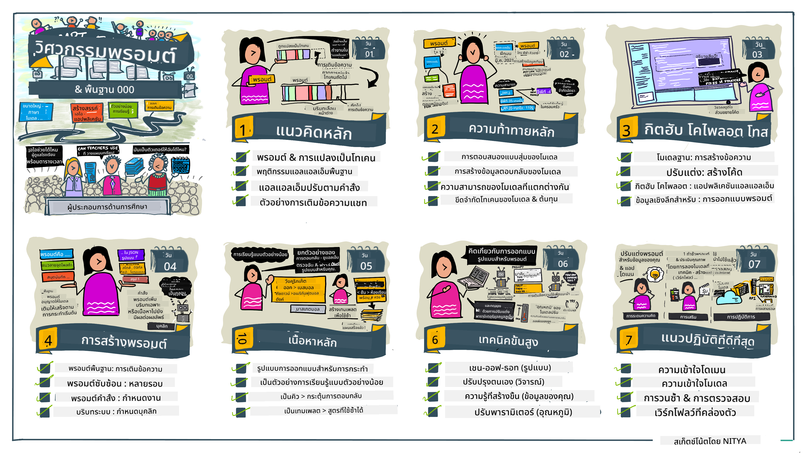
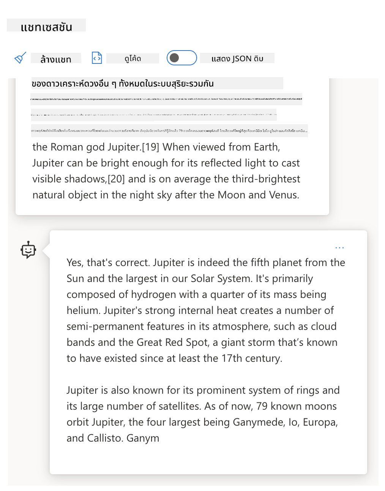
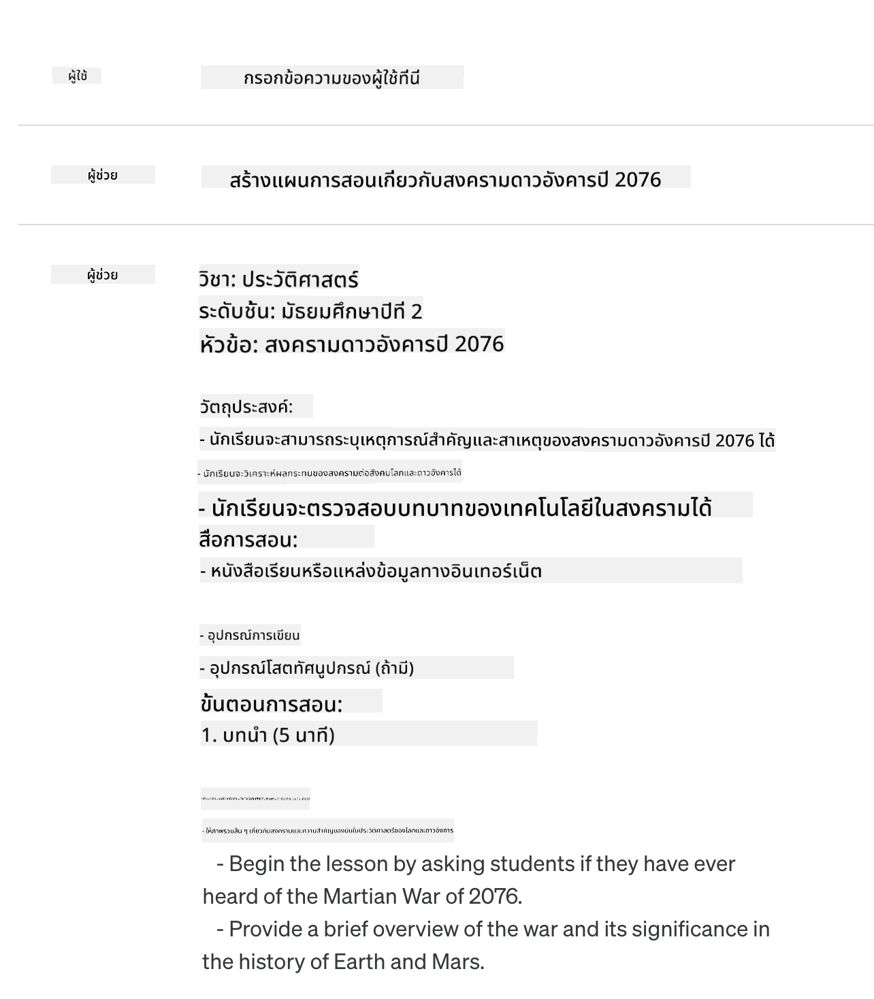

<!--
CO_OP_TRANSLATOR_METADATA:
{
  "original_hash": "0135e6c271f3ece8699050d4debbce88",
  "translation_date": "2025-10-17T18:42:04+00:00",
  "source_file": "04-prompt-engineering-fundamentals/README.md",
  "language_code": "th"
}
-->
# พื้นฐานการออกแบบคำสั่ง (Prompt Engineering)

[](https://youtu.be/GElCu2kUlRs?si=qrXsBvXnCW12epb8)

## บทนำ
โมดูลนี้ครอบคลุมแนวคิดและเทคนิคสำคัญสำหรับการสร้างคำสั่งที่มีประสิทธิภาพในโมเดล AI เชิงสร้างสรรค์ วิธีการเขียนคำสั่งให้กับ LLM มีความสำคัญมาก คำสั่งที่ถูกออกแบบมาอย่างดีสามารถให้ผลลัพธ์ที่มีคุณภาพดีกว่า แต่คำว่า _คำสั่ง_ และ _การออกแบบคำสั่ง_ หมายถึงอะไร? และเราจะปรับปรุงคำสั่ง _อินพุต_ ที่เราส่งไปยัง LLM ได้อย่างไร? นี่คือคำถามที่เราจะพยายามตอบในบทนี้และบทถัดไป

_Generative AI_ สามารถสร้างเนื้อหาใหม่ (เช่น ข้อความ รูปภาพ เสียง โค้ด ฯลฯ) ตามคำขอของผู้ใช้ โดยใช้ _Large Language Models_ เช่น GPT ("Generative Pre-trained Transformer") ของ OpenAI ซึ่งได้รับการฝึกฝนให้ใช้ภาษาธรรมชาติและโค้ด

ผู้ใช้สามารถโต้ตอบกับโมเดลเหล่านี้ได้โดยใช้รูปแบบที่คุ้นเคย เช่น การแชท โดยไม่จำเป็นต้องมีความเชี่ยวชาญทางเทคนิคหรือการฝึกอบรม โมเดลเหล่านี้เป็น _โมเดลที่ใช้คำสั่ง_ - ผู้ใช้ส่งข้อความอินพุต (คำสั่ง) และได้รับการตอบกลับจาก AI (ผลลัพธ์) จากนั้นผู้ใช้สามารถ "แชทกับ AI" อย่างต่อเนื่องในบทสนทนาแบบหลายรอบ ปรับแต่งคำสั่งจนกว่าผลลัพธ์จะตรงกับความคาดหวัง

"คำสั่ง" กลายเป็น _อินเทอร์เฟซการเขียนโปรแกรม_ หลักสำหรับแอปพลิเคชัน AI เชิงสร้างสรรค์ โดยบอกโมเดลว่าต้องทำอะไรและมีผลต่อคุณภาพของผลลัพธ์ที่ได้ "การออกแบบคำสั่ง" เป็นสาขาการศึกษาที่เติบโตอย่างรวดเร็ว ซึ่งมุ่งเน้นไปที่ _การออกแบบและการปรับแต่ง_ คำสั่งเพื่อให้ได้ผลลัพธ์ที่มีคุณภาพและสม่ำเสมอในระดับใหญ่

## เป้าหมายการเรียนรู้

ในบทเรียนนี้ เราจะเรียนรู้ว่า การออกแบบคำสั่งคืออะไร ทำไมมันถึงสำคัญ และเราจะสร้างคำสั่งที่มีประสิทธิภาพมากขึ้นสำหรับโมเดลและเป้าหมายแอปพลิเคชันได้อย่างไร เราจะเข้าใจแนวคิดหลักและแนวปฏิบัติที่ดีที่สุดสำหรับการออกแบบคำสั่ง - และเรียนรู้เกี่ยวกับสภาพแวดล้อม "sandbox" ใน Jupyter Notebooks ที่เราสามารถเห็นการประยุกต์ใช้แนวคิดเหล่านี้กับตัวอย่างจริง

เมื่อจบบทเรียนนี้ เราจะสามารถ:

1. อธิบายว่า การออกแบบคำสั่งคืออะไร และทำไมมันถึงสำคัญ
2. อธิบายส่วนประกอบของคำสั่งและวิธีการใช้งาน
3. เรียนรู้แนวปฏิบัติและเทคนิคที่ดีที่สุดสำหรับการออกแบบคำสั่ง
4. ประยุกต์ใช้เทคนิคที่เรียนรู้กับตัวอย่างจริง โดยใช้ OpenAI endpoint

## คำศัพท์สำคัญ

การออกแบบคำสั่ง: การปฏิบัติในการออกแบบและปรับแต่งอินพุตเพื่อชี้นำโมเดล AI ให้สร้างผลลัพธ์ตามที่ต้องการ  
การแปลงข้อความเป็นโทเค็น: กระบวนการแปลงข้อความเป็นหน่วยย่อยที่เรียกว่าโทเค็น ซึ่งโมเดลสามารถเข้าใจและประมวลผลได้  
Instruction-Tuned LLMs: โมเดลภาษาใหญ่ (LLMs) ที่ได้รับการปรับแต่งด้วยคำสั่งเฉพาะเพื่อปรับปรุงความแม่นยำและความเกี่ยวข้องของการตอบสนอง  

## Learning Sandbox

การออกแบบคำสั่งในปัจจุบันยังคงเป็นศิลปะมากกว่าวิทยาศาสตร์ วิธีที่ดีที่สุดในการพัฒนาสัญชาตญาณสำหรับมันคือ _ฝึกฝนมากขึ้น_ และใช้วิธีการลองผิดลองถูกที่ผสมผสานความเชี่ยวชาญในโดเมนแอปพลิเคชันกับเทคนิคที่แนะนำและการปรับแต่งเฉพาะโมเดล

Jupyter Notebook ที่มาพร้อมกับบทเรียนนี้ให้สภาพแวดล้อม _sandbox_ ที่คุณสามารถลองสิ่งที่คุณเรียนรู้ - ขณะเรียนหรือเป็นส่วนหนึ่งของการท้าทายโค้ดในตอนท้าย ในการดำเนินการแบบฝึกหัด คุณจะต้อง:

1. **Azure OpenAI API key** - endpoint บริการสำหรับโมเดล LLM ที่ปรับใช้แล้ว  
2. **Python Runtime** - ที่สามารถรัน Notebook ได้  
3. **ตัวแปรในสภาพแวดล้อมท้องถิ่น** - _ทำตามขั้นตอน [SETUP](./../00-course-setup/02-setup-local.md?WT.mc_id=academic-105485-koreyst) ตอนนี้เพื่อเตรียมตัว_  

Notebook มาพร้อมกับแบบฝึกหัด _เริ่มต้น_ - แต่คุณได้รับการสนับสนุนให้เพิ่มส่วน _Markdown_ (คำอธิบาย) และ _Code_ (คำขอคำสั่ง) ของคุณเองเพื่อทดลองตัวอย่างหรือไอเดียเพิ่มเติม - และสร้างสัญชาตญาณสำหรับการออกแบบคำสั่ง

## คู่มือภาพประกอบ

ต้องการเห็นภาพรวมของสิ่งที่บทเรียนนี้ครอบคลุมก่อนที่จะเริ่มต้นใช่ไหม? ลองดูคู่มือภาพประกอบนี้ ซึ่งให้ความเข้าใจเกี่ยวกับหัวข้อหลักที่ครอบคลุมและประเด็นสำคัญที่คุณควรพิจารณาในแต่ละหัวข้อ แผนที่บทเรียนจะนำคุณจากการทำความเข้าใจแนวคิดและความท้าทายหลักไปสู่การแก้ไขด้วยเทคนิคและแนวปฏิบัติที่ดีที่สุดสำหรับการออกแบบคำสั่ง โปรดทราบว่าส่วน "เทคนิคขั้นสูง" ในคู่มือนี้อ้างถึงเนื้อหาที่ครอบคลุมในบทถัดไปของหลักสูตรนี้



## สตาร์ทอัพของเรา

ตอนนี้ มาพูดถึงว่า _หัวข้อนี้_ เกี่ยวข้องกับภารกิจสตาร์ทอัพของเราในการ [นำ AI มาสู่การศึกษา](https://educationblog.microsoft.com/2023/06/collaborating-to-bring-ai-innovation-to-education?WT.mc_id=academic-105485-koreyst) อย่างไร เราต้องการสร้างแอปพลิเคชันที่ขับเคลื่อนด้วย AI สำหรับ _การเรียนรู้แบบเฉพาะบุคคล_ - ดังนั้นลองคิดดูว่าผู้ใช้ต่างๆ ของแอปพลิเคชันของเราอาจ "ออกแบบ" คำสั่งอย่างไร:

- **ผู้ดูแลระบบ** อาจขอให้ AI _วิเคราะห์ข้อมูลหลักสูตรเพื่อระบุช่องว่างในเนื้อหา_ AI สามารถสรุปผลลัพธ์หรือแสดงภาพด้วยโค้ด  
- **ครู** อาจขอให้ AI _สร้างแผนการสอนสำหรับกลุ่มเป้าหมายและหัวข้อเฉพาะ_ AI สามารถสร้างแผนการสอนเฉพาะบุคคลในรูปแบบที่กำหนด  
- **นักเรียน** อาจขอให้ AI _สอนพวกเขาในวิชาที่ยาก_ AI สามารถแนะนำบทเรียน คำใบ้ และตัวอย่างที่ปรับให้เหมาะกับระดับของนักเรียน  

นี่เป็นเพียงจุดเริ่มต้นเท่านั้น ลองดู [Prompts For Education](https://github.com/microsoft/prompts-for-edu/tree/main?WT.mc_id=academic-105485-koreyst) - ไลบรารีคำสั่งโอเพ่นซอร์สที่คัดสรรโดยผู้เชี่ยวชาญด้านการศึกษา - เพื่อให้เข้าใจถึงความเป็นไปได้ที่กว้างขึ้น! _ลองรันคำสั่งเหล่านั้นใน sandbox หรือใช้ OpenAI Playground เพื่อดูผลลัพธ์!_

## การออกแบบคำสั่งคืออะไร?

เราเริ่มบทเรียนนี้ด้วยการนิยาม **การออกแบบคำสั่ง** ว่าเป็นกระบวนการ _ออกแบบและปรับแต่ง_ ข้อความอินพุต (คำสั่ง) เพื่อให้ได้ผลลัพธ์ที่สม่ำเสมอและมีคุณภาพ (ผลลัพธ์) สำหรับเป้าหมายแอปพลิเคชันและโมเดลที่กำหนด เราสามารถคิดว่านี่เป็นกระบวนการ 2 ขั้นตอน:

- _ออกแบบ_ คำสั่งเริ่มต้นสำหรับโมเดลและเป้าหมายที่กำหนด  
- _ปรับแต่ง_ คำสั่งอย่างต่อเนื่องเพื่อปรับปรุงคุณภาพของผลลัพธ์  

นี่เป็นกระบวนการลองผิดลองถูกที่จำเป็นซึ่งต้องใช้สัญชาตญาณและความพยายามของผู้ใช้เพื่อให้ได้ผลลัพธ์ที่ดีที่สุด แล้วทำไมมันถึงสำคัญ? เพื่อที่จะตอบคำถามนั้น เราต้องเข้าใจแนวคิดสามประการก่อน:

- _การแปลงข้อความเป็นโทเค็น_ = วิธีที่โมเดล "มองเห็น" คำสั่ง  
- _Base LLMs_ = วิธีที่โมเดลพื้นฐาน "ประมวลผล" คำสั่ง  
- _Instruction-Tuned LLMs_ = วิธีที่โมเดลสามารถมองเห็น "งาน"  

### การแปลงข้อความเป็นโทเค็น

LLM มองคำสั่งเป็น _ลำดับของโทเค็น_ ซึ่งโมเดลต่างๆ (หรือเวอร์ชันของโมเดล) อาจแปลงคำสั่งเดียวกันเป็นโทเค็นในรูปแบบที่แตกต่างกัน เนื่องจาก LLMs ได้รับการฝึกฝนด้วยโทเค็น (ไม่ใช่ข้อความดิบ) วิธีที่คำสั่งถูกแปลงเป็นโทเค็นมีผลโดยตรงต่อคุณภาพของผลลัพธ์ที่สร้างขึ้น

เพื่อให้เข้าใจถึงวิธีการทำงานของการแปลงข้อความเป็นโทเค็น ลองใช้เครื่องมือเช่น [OpenAI Tokenizer](https://platform.openai.com/tokenizer?WT.mc_id=academic-105485-koreyst) ที่แสดงด้านล่าง คัดลอกคำสั่งของคุณลงไป - และดูว่ามันถูกแปลงเป็นโทเค็นอย่างไร โดยสังเกตว่าตัวอักษรเว้นวรรคและเครื่องหมายวรรคตอนถูกจัดการอย่างไร โปรดทราบว่าตัวอย่างนี้แสดง LLM รุ่นเก่า (GPT-3) - ดังนั้นการลองใช้กับโมเดลใหม่กว่าอาจให้ผลลัพธ์ที่แตกต่างออกไป


### แนวคิด: โมเดลพื้นฐาน

เมื่อคำสั่งถูกแปลงเป็นโทเค็น ฟังก์ชันหลักของ ["Base LLM"](https://blog.gopenai.com/an-introduction-to-base-and-instruction-tuned-large-language-models-8de102c785a6?WT.mc_id=academic-105485-koreyst) (หรือโมเดลพื้นฐาน) คือการทำนายโทเค็นในลำดับนั้น เนื่องจาก LLMs ได้รับการฝึกฝนด้วยชุดข้อมูลข้อความขนาดใหญ่ พวกเขามีความเข้าใจที่ดีเกี่ยวกับความสัมพันธ์ทางสถิติระหว่างโทเค็นและสามารถทำนายได้ด้วยความมั่นใจบางประการ โปรดทราบว่าพวกเขาไม่ได้เข้าใจ _ความหมาย_ ของคำในคำสั่งหรือโทเค็น; พวกเขาเพียงแค่เห็นรูปแบบที่พวกเขาสามารถ "เติมเต็ม" ด้วยการทำนายครั้งต่อไป พวกเขาสามารถทำนายลำดับต่อไปได้จนกว่าจะถูกยุติโดยการแทรกแซงของผู้ใช้หรือเงื่อนไขที่กำหนดไว้ล่วงหน้า

ต้องการเห็นวิธีการทำงานของการเติมเต็มคำสั่งใช่ไหม? ป้อนคำสั่งด้านบนลงใน Azure OpenAI Studio [_Chat Playground_](https://oai.azure.com/playground?WT.mc_id=academic-105485-koreyst) ด้วยการตั้งค่าเริ่มต้น ระบบถูกกำหนดค่าให้ปฏิบัติต่อคำสั่งเป็นคำขอข้อมูล - ดังนั้นคุณควรเห็นผลลัพธ์ที่ตอบสนองบริบทนี้

แต่ถ้าผู้ใช้ต้องการเห็นบางสิ่งที่เฉพาะเจาะจงซึ่งตรงกับเกณฑ์หรือเป้าหมายของงานล่ะ? นี่คือจุดที่ _Instruction-Tuned LLMs_ เข้ามามีบทบาท



### แนวคิด: Instruction-Tuned LLMs

[Instruction-Tuned LLM](https://blog.gopenai.com/an-introduction-to-base-and-instruction-tuned-large-language-models-8de102c785a6?WT.mc_id=academic-105485-koreyst) เริ่มต้นด้วยโมเดลพื้นฐานและปรับแต่งด้วยตัวอย่างหรือคู่ข้อมูลอินพุต/เอาต์พุต (เช่น "ข้อความ" หลายรอบ) ที่สามารถมีคำสั่งที่ชัดเจน - และการตอบสนองจาก AI พยายามปฏิบัติตามคำสั่งนั้น

สิ่งนี้ใช้เทคนิคเช่น Reinforcement Learning with Human Feedback (RLHF) ที่สามารถฝึกโมเดลให้ _ปฏิบัติตามคำสั่ง_ และ _เรียนรู้จากข้อเสนอแนะ_ เพื่อให้ได้ผลลัพธ์ที่เหมาะสมกับการใช้งานจริงและเกี่ยวข้องกับเป้าหมายของผู้ใช้มากขึ้น

ลองดู - กลับไปที่คำสั่งด้านบน แต่ตอนนี้เปลี่ยน _ข้อความระบบ_ เพื่อให้คำสั่งต่อไปนี้เป็นบริบท:

> _สรุปเนื้อหาที่คุณได้รับสำหรับนักเรียนชั้นประถมศึกษาปีที่ 2 ให้ผลลัพธ์เป็นหนึ่งย่อหน้าพร้อมหัวข้อย่อย 3-5 ข้อ_

ดูว่าผลลัพธ์ตอนนี้ถูกปรับให้สะท้อนเป้าหมายและรูปแบบที่ต้องการหรือไม่? ครูสามารถใช้ผลลัพธ์นี้ในสไลด์สำหรับชั้นเรียนได้โดยตรง


## ทำไมเราถึงต้องการการออกแบบคำสั่ง?

ตอนนี้เรารู้แล้วว่าคำสั่งถูกประมวลผลโดย LLMs อย่างไร มาพูดถึง _ทำไม_ เราถึงต้องการการออกแบบคำสั่ง คำตอบอยู่ในข้อเท็จจริงที่ว่า LLMs ในปัจจุบันมีความท้าทายหลายประการที่ทำให้ _การเติมเต็มที่เชื่อถือได้และสม่ำเสมอ_ ยากขึ้นที่จะบรรลุผลโดยไม่ต้องใช้ความพยายามในการสร้างและปรับแต่งคำสั่ง ตัวอย่างเช่น:

1. **การตอบสนองของโมเดลเป็นแบบสุ่ม** คำสั่ง _เดียวกัน_ อาจให้ผลลัพธ์ที่แตกต่างกันกับโมเดลหรือเวอร์ชันโมเดลที่แตกต่างกัน และอาจให้ผลลัพธ์ที่แตกต่างกันแม้กับ _โมเดลเดียวกัน_ ในเวลาที่ต่างกัน _เทคนิคการออกแบบคำสั่งสามารถช่วยลดความแปรปรวนเหล่านี้โดยการให้กรอบการทำงานที่ดีขึ้น_

1. **โมเดลสามารถสร้างข้อมูลที่ผิดพลาด** โมเดลได้รับการฝึกฝนด้วยชุดข้อมูล _ขนาดใหญ่แต่มีขอบเขตจำกัด_ ซึ่งหมายความว่าพวกเขาขาดความรู้เกี่ยวกับแนวคิดที่อยู่นอกเหนือขอบเขตการฝึกฝนนั้น ส่งผลให้พวกเขาสามารถสร้างผลลัพธ์ที่ไม่ถูกต้อง จินตนาการ หรือขัดแย้งกับข้อเท็จจริงที่ทราบ _เทคนิคการออกแบบคำสั่งช่วยให้ผู้ใช้ระบุและลดการสร้างข้อมูลที่ผิดพลาด เช่น โดยการขอการอ้างอิงหรือเหตุผลจาก AI_

1. **ความสามารถของโมเดลจะแตกต่างกัน** โมเดลใหม่หรือรุ่นใหม่จะมีความสามารถที่หลากหลายมากขึ้น แต่ก็มีลักษณะเฉพาะและข้อแลกเปลี่ยนในด้านต้นทุนและความซับซ้อน _การออกแบบคำสั่งสามารถช่วยพัฒนาแนวปฏิบัติและกระบวนการทำงานที่ดีที่สุดที่ลดความแตกต่างและปรับให้เข้ากับข้อกำหนดเฉพาะของโมเดลในวิธีที่ปรับขนาดได้และราบรื่น_

ลองดูตัวอย่างนี้ใน OpenAI หรือ Azure OpenAI Playground:

- ใช้คำสั่งเดียวกันกับการปรับใช้ LLM ต่างๆ (เช่น OpenAI, Azure OpenAI, Hugging Face) - คุณเห็นความแตกต่างหรือไม่?  
- ใช้คำสั่งเดียวกันซ้ำๆ กับการปรับใช้ LLM _เดียวกัน_ (เช่น Azure OpenAI Playground) - ความแตกต่างเหล่านี้แตกต่างกันอย่างไร?  

### ตัวอย่างการสร้างข้อมูลที่ผิดพลาด

ในหลักสูตรนี้ เราใช้คำว่า **"การสร้างข้อมูลที่ผิดพลาด"** เพื่ออ้างถึงปรากฏการณ์ที่ LLMs บางครั้งสร้างข้อมูลที่ไม่ถูกต้องเนื่องจาก
การค้นหาเว็บแสดงให้เห็นว่ามีเรื่องราวสมมติ (เช่น ซีรีส์โทรทัศน์หรือหนังสือ) เกี่ยวกับสงครามบนดาวอังคาร - แต่ไม่มีในปี 2076 สามัญสำนึกยังบอกเราว่าปี 2076 เป็น _อนาคต_ ดังนั้นจึงไม่สามารถเชื่อมโยงกับเหตุการณ์จริงได้

แล้วจะเกิดอะไรขึ้นเมื่อเราทดลองใช้คำสั่งนี้กับผู้ให้บริการ LLM ต่างๆ?

> **คำตอบที่ 1**: OpenAI Playground (GPT-35)



> **คำตอบที่ 2**: Azure OpenAI Playground (GPT-35)


> **คำตอบที่ 3**: Hugging Face Chat Playground (LLama-2)


ตามที่คาดไว้ แต่ละโมเดล (หรือเวอร์ชันของโมเดล) สร้างคำตอบที่แตกต่างกันเล็กน้อยเนื่องจากพฤติกรรมสุ่มและความสามารถของโมเดลที่แตกต่างกัน ตัวอย่างเช่น โมเดลหนึ่งมุ่งเป้าไปที่ผู้เรียนระดับมัธยมต้น ในขณะที่อีกโมเดลหนึ่งสมมติว่าผู้ใช้เป็นนักเรียนมัธยมปลาย แต่ทั้งสามโมเดลก็สร้างคำตอบที่สามารถโน้มน้าวผู้ใช้ที่ไม่มีข้อมูลว่าเหตุการณ์นั้นเป็นเรื่องจริงได้

เทคนิคการออกแบบคำสั่ง เช่น _metaprompting_ และ _temperature configuration_ อาจช่วยลดการสร้างข้อมูลเท็จของโมเดลได้ในระดับหนึ่ง สถาปัตยกรรมการออกแบบคำสั่งใหม่ยังรวมเครื่องมือและเทคนิคใหม่ๆ เข้ากับกระบวนการคำสั่งอย่างไร้รอยต่อ เพื่อบรรเทาหรือลดผลกระทบบางประการเหล่านี้

## กรณีศึกษา: GitHub Copilot

เรามาสรุปส่วนนี้ด้วยการทำความเข้าใจว่าเทคนิคการออกแบบคำสั่งถูกนำไปใช้ในโซลูชันจริงอย่างไร โดยดูจากกรณีศึกษา: [GitHub Copilot](https://github.com/features/copilot?WT.mc_id=academic-105485-koreyst)

GitHub Copilot คือ "AI คู่หูโปรแกรมเมอร์" ของคุณ - มันแปลงคำสั่งข้อความเป็นการเติมโค้ด และถูกรวมเข้ากับสภาพแวดล้อมการพัฒนาของคุณ (เช่น Visual Studio Code) เพื่อประสบการณ์การใช้งานที่ไร้รอยต่อ ตามที่ได้บันทึกไว้ในชุดบล็อกด้านล่าง เวอร์ชันแรกสุดนั้นอิงจากโมเดล OpenAI Codex - โดยวิศวกรได้ตระหนักถึงความจำเป็นในการปรับแต่งโมเดลและพัฒนาเทคนิคการออกแบบคำสั่งที่ดียิ่งขึ้น เพื่อปรับปรุงคุณภาพของโค้ด ในเดือนกรกฎาคม พวกเขา [เปิดตัวโมเดล AI ที่ปรับปรุงใหม่ซึ่งเหนือกว่า Codex](https://github.blog/2023-07-28-smarter-more-efficient-coding-github-copilot-goes-beyond-codex-with-improved-ai-model/?WT.mc_id=academic-105485-koreyst) เพื่อการแนะนำที่รวดเร็วยิ่งขึ้น

อ่านโพสต์ตามลำดับเพื่อติดตามเส้นทางการเรียนรู้ของพวกเขา

- **พฤษภาคม 2023** | [GitHub Copilot กำลังพัฒนาความสามารถในการเข้าใจโค้ดของคุณ](https://github.blog/2023-05-17-how-github-copilot-is-getting-better-at-understanding-your-code/?WT.mc_id=academic-105485-koreyst)
- **พฤษภาคม 2023** | [ภายใน GitHub: การทำงานกับ LLMs ที่อยู่เบื้องหลัง GitHub Copilot](https://github.blog/2023-05-17-inside-github-working-with-the-llms-behind-github-copilot/?WT.mc_id=academic-105485-koreyst).
- **มิถุนายน 2023** | [วิธีเขียนคำสั่งที่ดีกว่าสำหรับ GitHub Copilot](https://github.blog/2023-06-20-how-to-write-better-prompts-for-github-copilot/?WT.mc_id=academic-105485-koreyst).
- **กรกฎาคม 2023** | [.. GitHub Copilot ก้าวข้าม Codex ด้วยโมเดล AI ที่ปรับปรุงใหม่](https://github.blog/2023-07-28-smarter-more-efficient-coding-github-copilot-goes-beyond-codex-with-improved-ai-model/?WT.mc_id=academic-105485-koreyst)
- **กรกฎาคม 2023** | [คู่มือสำหรับนักพัฒนาเกี่ยวกับการออกแบบคำสั่งและ LLMs](https://github.blog/2023-07-17-prompt-engineering-guide-generative-ai-llms/?WT.mc_id=academic-105485-koreyst)
- **กันยายน 2023** | [วิธีสร้างแอป LLM สำหรับองค์กร: บทเรียนจาก GitHub Copilot](https://github.blog/2023-09-06-how-to-build-an-enterprise-llm-application-lessons-from-github-copilot/?WT.mc_id=academic-105485-koreyst)

คุณยังสามารถเรียกดู [บล็อกด้านวิศวกรรม](https://github.blog/category/engineering/?WT.mc_id=academic-105485-koreyst) ของพวกเขาเพื่อดูโพสต์เพิ่มเติม เช่น [โพสต์นี้](https://github.blog/2023-09-27-how-i-used-github-copilot-chat-to-build-a-reactjs-gallery-prototype/?WT.mc_id=academic-105485-koreyst) ที่แสดงให้เห็นว่าโมเดลและเทคนิคเหล่านี้ถูก _นำไปใช้_ เพื่อขับเคลื่อนแอปพลิเคชันในโลกจริงอย่างไร

---

## การสร้างคำสั่ง

เราได้เห็นแล้วว่าทำไมการออกแบบคำสั่งจึงสำคัญ - ตอนนี้เรามาทำความเข้าใจว่าคำสั่งถูก _สร้างขึ้น_ อย่างไร เพื่อที่เราจะสามารถประเมินเทคนิคต่างๆ สำหรับการออกแบบคำสั่งที่มีประสิทธิภาพมากขึ้น

### คำสั่งพื้นฐาน

เริ่มต้นด้วยคำสั่งพื้นฐาน: ข้อความที่ส่งไปยังโมเดลโดยไม่มีบริบทอื่นใด นี่คือตัวอย่าง - เมื่อเราส่งคำแรกของเพลงชาติสหรัฐอเมริกาไปยัง OpenAI [Completion API](https://platform.openai.com/docs/api-reference/completions?WT.mc_id=academic-105485-koreyst) มันจะ _เติมเต็ม_ คำตอบทันทีด้วยคำถัดไป แสดงให้เห็นถึงพฤติกรรมการคาดการณ์พื้นฐาน

| คำสั่ง (Input)     | การเติมเต็ม (Output)                                                                                                                        |
| :----------------- | :----------------------------------------------------------------------------------------------------------------------------------------- |
| Oh say can you see | ดูเหมือนว่าคุณกำลังเริ่มต้นเนื้อเพลง "The Star-Spangled Banner" ซึ่งเป็นเพลงชาติของสหรัฐอเมริกา เนื้อเพลงทั้งหมดคือ ... |

### คำสั่งที่ซับซ้อน

ตอนนี้เรามาเพิ่มบริบทและคำแนะนำลงในคำสั่งพื้นฐานนั้น [Chat Completion API](https://learn.microsoft.com/azure/ai-services/openai/how-to/chatgpt?WT.mc_id=academic-105485-koreyst) ช่วยให้เราสร้างคำสั่งที่ซับซ้อนเป็นชุดของ _ข้อความ_ โดยมี:

- คู่ข้อความสะท้อนถึง _การป้อนข้อมูลของผู้ใช้_ และ _การตอบสนองของผู้ช่วย_
- ข้อความระบบที่ตั้งค่าบริบทสำหรับพฤติกรรมหรือบุคลิกภาพของผู้ช่วย

คำขอจะอยู่ในรูปแบบด้านล่าง ซึ่ง _การแปลงเป็นโทเค็น_ จะจับข้อมูลที่เกี่ยวข้องจากบริบทและการสนทนาได้อย่างมีประสิทธิภาพ การเปลี่ยนบริบทของระบบสามารถส่งผลกระทบต่อคุณภาพของการเติมเต็มได้มากพอๆ กับข้อมูลที่ผู้ใช้ให้มา

```python
response = openai.chat.completions.create(
    model="gpt-3.5-turbo",
    messages=[
        {"role": "system", "content": "You are a helpful assistant."},
        {"role": "user", "content": "Who won the world series in 2020?"},
        {"role": "assistant", "content": "The Los Angeles Dodgers won the World Series in 2020."},
        {"role": "user", "content": "Where was it played?"}
    ]
)
```

### คำสั่งแบบมีคำแนะนำ

ในตัวอย่างด้านบน คำสั่งของผู้ใช้ยังคงเป็นข้อความสอบถามง่ายๆ ที่สามารถตีความได้ว่าเป็นคำขอข้อมูล ด้วยคำสั่งแบบมีคำแนะนำ เราสามารถใช้ข้อความนั้นเพื่อระบุงานในรายละเอียดเพิ่มเติม โดยให้คำแนะนำที่ดีกับ AI นี่คือตัวอย่าง:

| คำสั่ง (Input)                                                                                                                                                                                                                         | การเติมเต็ม (Output)                                                                                                        | ประเภทคำสั่ง       |
| :------------------------------------------------------------------------------------------------------------------------------------------------------------------------------------------------------------------------------------- | :------------------------------------------------------------------------------------------------------------------------- | :------------------ |
| เขียนคำอธิบายเกี่ยวกับสงครามกลางเมือง                                                                                                                                                                                                   | _ส่งคืนย่อหน้าเรียบง่าย_                                                                                              | เรียบง่าย              |
| เขียนคำอธิบายเกี่ยวกับสงครามกลางเมือง ระบุวันที่และเหตุการณ์สำคัญและอธิบายความสำคัญของมัน                                                                                                                                     | _ส่งคืนย่อหน้าตามด้วยรายการวันที่เหตุการณ์สำคัญพร้อมคำอธิบาย_                                             | ซับซ้อน             |
| เขียนคำอธิบายเกี่ยวกับสงครามกลางเมืองใน 1 ย่อหน้า ระบุ 3 จุดสำคัญพร้อมวันที่และความสำคัญของมัน ระบุอีก 3 จุดสำคัญเกี่ยวกับบุคคลสำคัญทางประวัติศาสตร์และการมีส่วนร่วมของพวกเขา ส่งคืนผลลัพธ์ในรูปแบบไฟล์ JSON | _ส่งคืนรายละเอียดเพิ่มเติมในกล่องข้อความที่จัดรูปแบบเป็น JSON ซึ่งคุณสามารถคัดลอก-วางลงในไฟล์และตรวจสอบได้ตามต้องการ_ | ซับซ้อน. มีรูปแบบ. |

## เนื้อหาหลัก

ในตัวอย่างด้านบน คำสั่งยังคงเปิดกว้างมาก โดยให้ LLM ตัดสินใจว่าข้อมูลส่วนใดในชุดข้อมูลที่ได้รับการฝึกอบรมมีความเกี่ยวข้อง ด้วยรูปแบบการออกแบบเนื้อหาหลัก ข้อความที่ป้อนจะถูกแบ่งออกเป็นสองส่วน:

- คำแนะนำ (การกระทำ)
- เนื้อหาที่เกี่ยวข้อง (ที่มีอิทธิพลต่อการกระทำ)

นี่คือตัวอย่างที่คำแนะนำคือ "สรุปสิ่งนี้ใน 2 ประโยค"

| คำสั่ง (Input)                                                                                                                                                                                                                                                                                                                                                                                                                                                                                                                                                                                                                                                                                      | การเติมเต็ม (Output)                                                                                                                                                                                                                                                                             |
| :-------------------------------------------------------------------------------------------------------------------------------------------------------------------------------------------------------------------------------------------------------------------------------------------------------------------------------------------------------------------------------------------------------------------------------------------------------------------------------------------------------------------------------------------------------------------------------------------------------------------------------------------------------------------------------------------------- | :---------------------------------------------------------------------------------------------------------------------------------------------------------------------------------------------------------------------------------------------------------------------------------------------- |
| ดาวพฤหัสบดีเป็นดาวเคราะห์ดวงที่ห้าจากดวงอาทิตย์และเป็นดาวเคราะห์ที่ใหญ่ที่สุดในระบบสุริยะ มันเป็นดาวแก๊สยักษ์ที่มีมวลหนึ่งในพันของดวงอาทิตย์ แต่มีมวลมากกว่าดาวเคราะห์อื่นๆ ในระบบสุริยะรวมกันสองเท่าครึ่ง ดาวพฤหัสบดีเป็นหนึ่งในวัตถุที่สว่างที่สุดที่มองเห็นได้ด้วยตาเปล่าในท้องฟ้ายามค่ำคืน และเป็นที่รู้จักในอารยธรรมโบราณตั้งแต่ก่อนประวัติศาสตร์ มันถูกตั้งชื่อตามเทพเจ้าดาวพฤหัสบดีของโรมัน [19] เมื่อมองจากโลก ดาวพฤหัสบดีสามารถสว่างพอที่จะสะท้อนแสงจนเกิดเงาที่มองเห็นได้ [20] และโดยเฉลี่ยเป็นวัตถุธรรมชาติที่สว่างที่สุดอันดับสามในท้องฟ้ายามค่ำคืนรองจากดวงจันทร์และดาวศุกร์ <br/> **สรุปสิ่งนี้ใน 2 ประโยคสั้นๆ** | ดาวพฤหัสบดีเป็นดาวเคราะห์ดวงที่ห้าจากดวงอาทิตย์และเป็นดาวเคราะห์ที่ใหญ่ที่สุดในระบบสุริยะ และเป็นหนึ่งในวัตถุที่สว่างที่สุดในท้องฟ้ายามค่ำคืน มันถูกตั้งชื่อตามเทพเจ้าดาวพฤหัสบดีของโรมัน และเป็นดาวแก๊สยักษ์ที่มีมวลมากกว่าดาวเคราะห์อื่นๆ รวมกันสองเท่าครึ่ง |

ส่วนเนื้อหาหลักสามารถใช้ในรูปแบบต่างๆ เพื่อขับเคลื่อนคำแนะนำที่มีประสิทธิภาพมากขึ้น:

- **ตัวอย่าง** - แทนที่จะบอกโมเดลว่าต้องทำอะไรด้วยคำแนะนำที่ชัดเจน ให้ตัวอย่างสิ่งที่ต้องทำและให้มันอนุมานรูปแบบ
- **คำใบ้** - ตามคำแนะนำด้วย "คำใบ้" ที่กระตุ้นการเติมเต็ม นำทางโมเดลไปสู่คำตอบที่เกี่ยวข้องมากขึ้น
- **แม่แบบ** - นี่คือ 'สูตร' สำหรับคำสั่งที่สามารถปรับแต่งด้วยข้อมูลสำหรับกรณีการใช้งานเฉพาะ

เรามาสำรวจสิ่งเหล่านี้ในทางปฏิบัติ

### การใช้ตัวอย่าง

นี่คือวิธีที่คุณใช้เนื้อหาหลักเพื่อ "ป้อนโมเดล" ตัวอย่างของผลลัพธ์ที่ต้องการสำหรับคำแนะนำที่กำหนด และให้มันอนุมานรูปแบบสำหรับผลลัพธ์ที่ต้องการ ตามจำนวนตัวอย่างที่ให้มา เราสามารถมีการออกแบบคำสั่งแบบ zero-shot, one-shot, few-shot เป็นต้น

คำสั่งตอนนี้ประกอบด้วยสามส่วน:

- คำอธิบายงาน
- ตัวอย่างผลลัพธ์ที่ต้องการบางส่วน
- จุดเริ่มต้นของตัวอย่างใหม่ (ซึ่งกลายเป็นคำอธิบายงานโดยปริยาย)

| ประเภทการเรียนรู้ | คำสั่ง (Input)                                                                                                                                        | การเติมเต็ม (Output)         |
| :------------ | :---------------------------------------------------------------------------------------------------------------------------------------------------- | :-------------------------- |
| Zero-shot     | "The Sun is Shining". แปลเป็นภาษาสเปน                                                                                                            | "El Sol está brillando".    |
| One-shot      | "The Sun is Shining" => ""El Sol está brillando". <br> "It's a Cold and Windy Day" =>                                                                 | "Es un día frío y ventoso". |
| Few-shot      | ผู้เล่นวิ่งรอบฐาน => เบสบอล <br/> ผู้เล่นตีเอซ => เทนนิส <br/> ผู้เล่นตีหก => คริกเก็ต <br/> ผู้เล่นทำสแลมดังก์ => | บาสเกตบอล                  |
|               |                                                                                                                                                       |                             |

สังเกตว่าเราต้องให้คำแนะนำที่ชัดเจน ("แปลเป็นภาษาสเปน") ในการออกแบบคำสั่งแบบ zero-shot แต่คำแนะนำจะถูกอนุมานในตัวอย่างการออกแบบคำสั่งแบบ one-shot ตัวอย่าง few-shot แสดงให้เห็นว่าการเพิ่มตัวอย่างมากขึ้นช่วยให้โมเดลทำการอนุมานได้แม่นยำขึ้นโดยไม่ต้องเพิ่มคำแนะนำ

### คำใบ้ในคำสั่ง

อีกเทคนิคหนึ่งสำหรับการใช้เนื้อหาหลักคือการให้ _คำใบ้_ แทนตัวอย่าง ในกรณีนี้ เรากำลังให้โมเดลเริ่มต้นด้วย _ส่วนหนึ่ง_ ที่สะท้อนรูปแบบผลลัพธ์ที่ต้องการ โมเดลจะ "รับคำใบ้" และดำเนินการต่อในรูปแบบนั้น

| จำนวนคำใบ้ | คำสั่ง (Input)                                                                                                                                                                                                                                                                                                                                                                                                                                               | การเติมเต็ม (Output)                                                                                                                                                                                                                                                                                       |
| :------------- | :----------------------------------------------------------------------------------------------------------------------------------------------------------------------------------------------------------------------------------------------------------------------------------------------------------------------------------------------------------------------------------------------------------------------------------------------------------- | :-------------------------------------------------------------------------------------------------------------------------------------------------------------------------------------------------------------------------------------------------------------------------------------------------------- |
| 0              | ดาวพฤหัสบดีเป็นดาวเคราะห์ดวงที่ห้าจากดวงอาทิตย์และเป็นดาวเคราะห์ที่ใหญ่ที่สุดในระบบสุริยะ มันเป็นดาวแก๊สยักษ์ที่มีมวลหนึ่งในพันของดวงอาทิตย์ แต่มีมวลมากกว่าดาวเคราะห์อื่นๆ ในระบบสุริยะรวมกันสองเท่าครึ่ง ดาวพฤหัสบดีเป็นหนึ่งในวัตถุที่สว่างที่สุดที่มองเห็นได้ด้วยตาเปล่าในท้องฟ้ายามค่ำคืน และเป็นที่รู้จักในอารยธรรมโบราณตั้งแต่ก่อนประวัติศาสตร์ <br/>**สรุปสิ่งนี้**                                       | ดาวพฤหัสบดีเป็นดาวเคราะห์ที่ใหญ่ที่สุดในระบบสุริยะและเป็นดาวเคราะห์ดวงที่ห้าจากดวงอาทิตย์ มันเป็นดาวแก๊สยักษ์ที่มีมวล 1/1000 ของดวงอาทิตย์ แต่มีมวลมากกว่าดาวเคราะห์อื่นๆ รวมกันสองเท่าครึ่ง อารยธรรมโบราณรู้จักดาวพฤหัสบดีมานาน และมันสามารถมองเห็นได้ง่ายในท้องฟ้ายามค่ำคืน.. |
| 1              | ดาวพฤหัสบดีเป็นดาวเคราะห์ลำดับที่ห้าจากดวงอาทิตย์และเป็นดาวเคราะห์ที่ใหญ่ที่สุดในระบบสุริยะ เป็นดาวเคราะห์แก๊สยักษ์ที่มีมวลเพียงหนึ่งในพันของดวงอาทิตย์ แต่มีมวลมากกว่าดาวเคราะห์อื่นๆ ในระบบสุริยะรวมกันถึงสองเท่าครึ่ง ดาวพฤหัสบดีเป็นหนึ่งในวัตถุที่สว่างที่สุดที่สามารถมองเห็นได้ด้วยตาเปล่าในท้องฟ้ายามค่ำคืน และเป็นที่รู้จักในอารยธรรมโบราณตั้งแต่ก่อนมีการบันทึกประวัติศาสตร์ <br/>**สรุป** <br/> สิ่งที่เราเรียนรู้คือ ดาวพฤหัสบดี | เป็นดาวเคราะห์ลำดับที่ห้าจากดวงอาทิตย์และเป็นดาวเคราะห์ที่ใหญ่ที่สุดในระบบสุริยะ เป็นดาวเคราะห์แก๊สยักษ์ที่มีมวลเพียงหนึ่งในพันของดวงอาทิตย์ แต่มีมวลมากกว่าดาวเคราะห์อื่นๆ รวมกันถึงสองเท่าครึ่ง สามารถมองเห็นได้ง่ายด้วยตาเปล่าและเป็นที่รู้จักมาตั้งแต่สมัยโบราณ                        |
| 2              | ดาวพฤหัสบดีเป็นดาวเคราะห์ลำดับที่ห้าจากดวงอาทิตย์และเป็นดาวเคราะห์ที่ใหญ่ที่สุดในระบบสุริยะ เป็นดาวเคราะห์แก๊สยักษ์ที่มีมวลเพียงหนึ่งในพันของดวงอาทิตย์ แต่มีมวลมากกว่าดาวเคราะห์อื่นๆ ในระบบสุริยะรวมกันถึงสองเท่าครึ่ง ดาวพฤหัสบดีเป็นหนึ่งในวัตถุที่สว่างที่สุดที่สามารถมองเห็นได้ด้วยตาเปล่าในท้องฟ้ายามค่ำคืน และเป็นที่รู้จักในอารยธรรมโบราณตั้งแต่ก่อนมีการบันทึกประวัติศาสตร์ <br/>**สรุป** <br/> 3 ข้อที่เราเรียนรู้:         | 1. ดาวพฤหัสบดีเป็นดาวเคราะห์ลำดับที่ห้าจากดวงอาทิตย์และเป็นดาวเคราะห์ที่ใหญ่ที่สุดในระบบสุริยะ <br/> 2. เป็นดาวเคราะห์แก๊สยักษ์ที่มีมวลเพียงหนึ่งในพันของดวงอาทิตย์...<br/> 3. ดาวพฤหัสบดีสามารถมองเห็นได้ด้วยตาเปล่าตั้งแต่สมัยโบราณ ...                                                                       |
|                |                                                                                                                                                                                                                                                                                                                                                                                                                                                              |                                                                                                                                                                                                                                                                                                           |

### แม่แบบคำสั่ง

แม่แบบคำสั่งคือ _สูตรที่กำหนดไว้ล่วงหน้าสำหรับคำสั่ง_ ซึ่งสามารถจัดเก็บและนำกลับมาใช้ใหม่ได้ตามต้องการ เพื่อสร้างประสบการณ์ผู้ใช้ที่สม่ำเสมอในระดับใหญ่ ในรูปแบบที่ง่ายที่สุด มันเป็นเพียงการรวบรวมตัวอย่างคำสั่ง เช่น [ตัวอย่างนี้จาก OpenAI](https://platform.openai.com/examples?WT.mc_id=academic-105485-koreyst) ที่ให้ทั้งส่วนประกอบคำสั่งแบบโต้ตอบ (ข้อความผู้ใช้และข้อความระบบ) และรูปแบบคำขอที่ขับเคลื่อนด้วย API - เพื่อสนับสนุนการนำกลับมาใช้ใหม่

ในรูปแบบที่ซับซ้อนมากขึ้น เช่น [ตัวอย่างนี้จาก LangChain](https://python.langchain.com/docs/concepts/prompt_templates/?WT.mc_id=academic-105485-koreyst) มันมี _ตัวแปรที่สามารถแทนที่ด้วยข้อมูลจากแหล่งต่างๆ_ (ข้อมูลผู้ใช้ บริบทระบบ แหล่งข้อมูลภายนอก ฯลฯ) เพื่อสร้างคำสั่งแบบไดนามิก สิ่งนี้ช่วยให้เราสร้างห้องสมุดของคำสั่งที่สามารถนำมาใช้เพื่อสร้างประสบการณ์ผู้ใช้ที่สม่ำเสมอ **ในระดับโปรแกรม** ได้

สุดท้าย คุณค่าที่แท้จริงของแม่แบบอยู่ที่ความสามารถในการสร้างและเผยแพร่ _ห้องสมุดคำสั่ง_ สำหรับโดเมนแอปพลิเคชันเฉพาะ - ซึ่งแม่แบบคำสั่งได้รับการ _ปรับแต่ง_ เพื่อสะท้อนบริบทหรือตัวอย่างเฉพาะของแอปพลิเคชันที่ทำให้การตอบสนองมีความเกี่ยวข้องและแม่นยำมากขึ้นสำหรับกลุ่มเป้าหมายผู้ใช้ ตัวอย่างที่ดีของวิธีการนี้คือ [Prompts For Edu](https://github.com/microsoft/prompts-for-edu?WT.mc_id=academic-105485-koreyst) ซึ่งเป็นที่เก็บรวบรวมคำสั่งสำหรับโดเมนการศึกษา โดยเน้นวัตถุประสงค์สำคัญ เช่น การวางแผนบทเรียน การออกแบบหลักสูตร การสอนนักเรียน ฯลฯ

## เนื้อหาสนับสนุน

หากเราคิดว่าการสร้างคำสั่งมีคำแนะนำ (งาน) และเป้าหมาย (เนื้อหาหลัก) _เนื้อหารอง_ ก็เหมือนบริบทเพิ่มเติมที่เรามอบให้เพื่อ **มีอิทธิพลต่อผลลัพธ์ในบางวิธี** มันอาจเป็นพารามิเตอร์การปรับแต่ง คำแนะนำการจัดรูปแบบ การจัดหมวดหมู่หัวข้อ ฯลฯ ที่สามารถช่วยให้โมเดล _ปรับแต่ง_ การตอบสนองให้เหมาะสมกับวัตถุประสงค์หรือความคาดหวังของผู้ใช้ที่ต้องการ

ตัวอย่างเช่น: เมื่อมีแคตตาล็อกหลักสูตรที่มีเมตาดาต้าขนาดใหญ่ (ชื่อ คำอธิบาย ระดับ แท็กเมตาดาต้า ผู้สอน ฯลฯ) เกี่ยวกับหลักสูตรทั้งหมดในหลักสูตร:

- เราสามารถกำหนดคำแนะนำเพื่อ "สรุปแคตตาล็อกหลักสูตรสำหรับฤดูใบไม้ร่วง 2023"
- เราสามารถใช้เนื้อหาหลักเพื่อให้ตัวอย่างบางส่วนของผลลัพธ์ที่ต้องการ
- เราสามารถใช้เนื้อหารองเพื่อระบุแท็ก "5 อันดับแรก" ที่น่าสนใจ

ตอนนี้ โมเดลสามารถให้สรุปในรูปแบบที่แสดงโดยตัวอย่างบางส่วน - แต่ถ้าผลลัพธ์มีหลายแท็ก มันสามารถจัดลำดับความสำคัญของ 5 แท็กที่ระบุในเนื้อหารองได้

---

<!--
แม่แบบบทเรียน:
หน่วยนี้ควรครอบคลุมแนวคิดหลัก #1
เสริมแนวคิดด้วยตัวอย่างและการอ้างอิง

แนวคิด #3:
เทคนิคการออกแบบคำสั่ง
เทคนิคพื้นฐานบางอย่างสำหรับการออกแบบคำสั่งคืออะไร?
แสดงให้เห็นด้วยแบบฝึกหัดบางอย่าง
-->

## แนวทางปฏิบัติที่ดีที่สุดในการออกแบบคำสั่ง

ตอนนี้เรารู้แล้วว่าคำสั่งสามารถ _สร้างขึ้น_ ได้อย่างไร เราสามารถเริ่มคิดเกี่ยวกับวิธีการ _ออกแบบ_ ให้สะท้อนถึงแนวทางปฏิบัติที่ดีที่สุด เราสามารถแบ่งออกเป็นสองส่วน - การมี _ทัศนคติ_ ที่ถูกต้องและการใช้ _เทคนิค_ ที่เหมาะสม

### ทัศนคติในการออกแบบคำสั่ง

การออกแบบคำสั่งเป็นกระบวนการลองผิดลองถูก ดังนั้นควรคำนึงถึงปัจจัยสำคัญสามประการ:

1. **ความเข้าใจในโดเมนมีความสำคัญ** ความแม่นยำและความเกี่ยวข้องของการตอบสนองเป็นผลมาจาก _โดเมน_ ที่แอปพลิเคชันหรือผู้ใช้ดำเนินการ ใช้สัญชาตญาณและความเชี่ยวชาญในโดเมนของคุณเพื่อ **ปรับแต่งเทคนิค** ให้เหมาะสมยิ่งขึ้น ตัวอย่างเช่น กำหนด _บุคลิกเฉพาะโดเมน_ ในคำสั่งระบบของคุณ หรือใช้ _แม่แบบเฉพาะโดเมน_ ในคำสั่งผู้ใช้ ให้เนื้อหารองที่สะท้อนบริบทเฉพาะโดเมน หรือใช้ _ตัวชี้นำและตัวอย่างเฉพาะโดเมน_ เพื่อแนะนำโมเดลไปสู่รูปแบบการใช้งานที่คุ้นเคย

2. **ความเข้าใจในโมเดลมีความสำคัญ** เรารู้ว่าโมเดลมีลักษณะสุ่มโดยธรรมชาติ แต่การใช้งานโมเดลอาจแตกต่างกันไปในแง่ของชุดข้อมูลการฝึกอบรมที่ใช้ (ความรู้ที่ผ่านการฝึกอบรม) ความสามารถที่มีให้ (เช่น ผ่าน API หรือ SDK) และประเภทของเนื้อหาที่ได้รับการปรับแต่ง (เช่น โค้ด รูปภาพ หรือข้อความ) เข้าใจจุดแข็งและข้อจำกัดของโมเดลที่คุณใช้ และใช้ความรู้นั้นเพื่อ _จัดลำดับความสำคัญของงาน_ หรือสร้าง _แม่แบบที่ปรับแต่ง_ ซึ่งได้รับการปรับแต่งให้เหมาะสมกับความสามารถของโมเดล

3. **การทำซ้ำและการตรวจสอบมีความสำคัญ** โมเดลกำลังพัฒนาอย่างรวดเร็ว และเทคนิคการออกแบบคำสั่งก็เช่นกัน ในฐานะผู้เชี่ยวชาญในโดเมน คุณอาจมีบริบทหรือเกณฑ์อื่นๆ ที่ _แอปพลิเคชันของคุณ_ โดยเฉพาะ ซึ่งอาจไม่สามารถใช้ได้กับชุมชนในวงกว้าง ใช้เครื่องมือและเทคนิคการออกแบบคำสั่งเพื่อ "เริ่มต้น" การสร้างคำสั่ง จากนั้นทำซ้ำและตรวจสอบผลลัพธ์โดยใช้สัญชาตญาณและความเชี่ยวชาญในโดเมนของคุณ บันทึกข้อมูลเชิงลึกของคุณและสร้าง **ฐานความรู้** (เช่น ห้องสมุดคำสั่ง) ที่สามารถใช้เป็นพื้นฐานใหม่โดยผู้อื่น เพื่อการทำซ้ำที่รวดเร็วขึ้นในอนาคต

## แนวทางปฏิบัติที่ดีที่สุด

ตอนนี้มาดูแนวทางปฏิบัติที่ดีที่สุดที่แนะนำโดย [OpenAI](https://help.openai.com/en/articles/6654000-best-practices-for-prompt-engineering-with-openai-api?WT.mc_id=academic-105485-koreyst) และผู้เชี่ยวชาญจาก [Azure OpenAI](https://learn.microsoft.com/azure/ai-services/openai/concepts/prompt-engineering#best-practices?WT.mc_id=academic-105485-koreyst)

| สิ่งที่ควรทำ                     | เหตุผล                                                                                                                                                                                                                                               |
| :-------------------------------- | :------------------------------------------------------------------------------------------------------------------------------------------------------------------------------------------------------------------------------------------------ |
| ประเมินโมเดลล่าสุด               | รุ่นใหม่ของโมเดลมีแนวโน้มที่จะมีคุณสมบัติและคุณภาพที่ดีขึ้น - แต่ก็อาจมีค่าใช้จ่ายสูงขึ้นด้วย ประเมินผลกระทบ แล้วตัดสินใจว่าจะย้ายไปใช้หรือไม่                                                                                              |
| แยกคำแนะนำและบริบท              | ตรวจสอบว่าโมเดล/ผู้ให้บริการของคุณกำหนด _ตัวแบ่ง_ เพื่อแยกคำแนะนำ เนื้อหาหลัก และเนื้อหารองได้ชัดเจนขึ้นหรือไม่ สิ่งนี้สามารถช่วยให้โมเดลกำหนดน้ำหนักให้กับโทเค็นได้แม่นยำขึ้น                                                         |
| ระบุให้ชัดเจนและเจาะจง          | ให้รายละเอียดเพิ่มเติมเกี่ยวกับบริบท ผลลัพธ์ ความยาว รูปแบบ สไตล์ ฯลฯ ที่ต้องการ สิ่งนี้จะช่วยปรับปรุงทั้งคุณภาพและความสม่ำเสมอของการตอบสนอง บันทึกสูตรในแม่แบบที่นำกลับมาใช้ได้                                                          |
| อธิบายและใช้ตัวอย่าง            | โมเดลอาจตอบสนองได้ดีขึ้นกับวิธี "แสดงและบอก" เริ่มต้นด้วยวิธี `zero-shot` ที่คุณให้คำแนะนำ (แต่ไม่มีตัวอย่าง) แล้วลอง `few-shot` เป็นการปรับปรุง โดยให้ตัวอย่างบางส่วนของผลลัพธ์ที่ต้องการ ใช้การเปรียบเทียบ                              |
| ใช้ตัวชี้นำเพื่อเริ่มต้นการตอบสนอง | ชี้นำไปยังผลลัพธ์ที่ต้องการโดยให้คำหรือวลีเริ่มต้นที่สามารถใช้เป็นจุดเริ่มต้นสำหรับการตอบสนอง                                                                                                               |
| ย้ำคำแนะนำ                       | บางครั้งคุณอาจต้องย้ำคำแนะนำกับโมเดล ให้คำแนะนำก่อนและหลังเนื้อหาหลัก ใช้คำแนะนำและตัวชี้นำ ฯลฯ ทำซ้ำและตรวจสอบเพื่อดูว่าอะไรได้ผล                                                                                                         |
| ลำดับมีความสำคัญ                 | ลำดับที่คุณนำเสนอข้อมูลต่อโมเดลอาจส่งผลต่อผลลัพธ์ แม้กระทั่งในตัวอย่างการเรียนรู้ เนื่องจากอคติจากความใหม่ ลองตัวเลือกต่างๆ เพื่อดูว่าอะไรได้ผลดีที่สุด                                                               |
| ให้โมเดลมีทางเลือก               | ให้โมเดลมีคำตอบสำรองที่สามารถให้ได้หากไม่สามารถทำงานให้เสร็จได้ด้วยเหตุผลใดก็ตาม สิ่งนี้สามารถลดโอกาสที่โมเดลจะสร้างคำตอบที่ผิดหรือแต่งขึ้นมาได้                                                         |
|                                   |                                                                                                                                                                                                                                                   |

เช่นเดียวกับแนวทางปฏิบัติที่ดีที่สุดใดๆ จำไว้ว่า _ผลลัพธ์ของคุณอาจแตกต่างกัน_ ขึ้นอยู่กับโมเดล งาน และโดเมน ใช้สิ่งเหล่านี้เป็นจุดเริ่มต้น และทำซ้ำเพื่อค้นหาสิ่งที่เหมาะสมที่สุดสำหรับคุณ ประเมินกระบวนการออกแบบคำสั่งของคุณอย่างต่อเนื่องเมื่อมีโมเดลและเครื่องมือใหม่ๆ พร้อมใช้งาน โดยมุ่งเน้นที่ความสามารถในการปรับขนาดของกระบวนการและคุณภาพของการตอบสนอง

<!--
แม่แบบบทเรียน:
หน่วยนี้ควรมีความท้าทายด้านโค้ดหากมี

ความท้าทาย:
ลิงก์ไปยัง Jupyter Notebook ที่มีเพียงคำอธิบายโค้ดในคำแนะนำ (ส่วนโค้ดว่างเปล่า)

คำตอบ:
ลิงก์ไปยังสำเนา Notebook ที่มีคำสั่งเติมเต็มและรันแล้ว แสดงตัวอย่างหนึ่งที่เป็นไปได้
-->

## งานที่ได้รับมอบหมาย

ยินดีด้วย! คุณมาถึงจุดสิ้นสุดของบทเรียนแล้ว! ถึงเวลาทดสอบแนวคิดและเทคนิคเหล่านั้นกับตัวอย่างจริง!

สำหรับงานที่ได้รับมอบหมาย เราจะใช้ Jupyter Notebook พร้อมแบบฝึกหัดที่คุณสามารถทำได้แบบโต้ตอบ คุณยังสามารถขยาย Notebook ด้วยเซลล์ Markdown และโค้ดของคุณเองเพื่อสำรวจแนวคิดและเทคนิคด้วยตัวเอง

### เพื่อเริ่มต้น ให้ fork repo แล้ว

- (แนะนำ) เปิด GitHub Codespaces
- (ทางเลือก) Clone repo ไปยังอุปกรณ์ของคุณและใช้กับ Docker Desktop
- (ทางเลือก) เปิด Notebook ด้วยสภาพแวดล้อมการรัน Notebook ที่คุณต้องการ

### จากนั้น ตั้งค่าตัวแปรสภาพแวดล้อมของคุณ

- คัดลอกไฟล์ `.env.copy` ใน repo root ไปยัง `.env` และเติมค่า `AZURE_OPENAI_API_KEY`, `AZURE_OPENAI_ENDPOINT` และ `AZURE_OPENAI_DEPLOYMENT` กลับมาที่ [ส่วน Learning Sandbox](../../../04-prompt-engineering-fundamentals/04-prompt-engineering-fundamentals) เพื่อเรียนรู้วิธีการ

### ต่อไป เปิด Jupyter Notebook

- เลือก kernel ที่จะรัน หากใช้ตัวเลือกที่ 1 หรือ 2 เพียงเลือก kernel Python 3.10.x ที่เป็นค่าเริ่มต้นที่ dev container มีให้

คุณพร้อมที่จะรันแบบฝึกหัดแล้ว โปรดทราบว่าไม่มีคำตอบที่ _ถูกหรือผิด_ ในที่นี้ - เพียงแค่สำรวจตัวเลือกด้วยการลองผิดลองถูกและสร้างสัญชาตญาณสำหรับสิ่งที่เหมาะสมกับโมเดลและโดเมนแอปพลิเคชันที่กำหนด

_ด้วยเหตุนี้จึงไม่มีส่วน Code Solution ในบทเรียนนี้ แต่ Notebook จะมีเซลล์ Markdown ที่ชื่อว่า "My Solution:" ซึ่งแสดงตัวอย่างผลลัพธ์หนึ่งสำหรับการอ้างอิง_

 <!--
แม่แบบบทเรียน:
สรุปส่วนนี้ด้วยบทสรุปและแหล่งข้อมูลสำหรับการเรียนรู้ด้วยตนเอง
-->

## การตรวจสอบความรู้

คำสั่งใดต่อไปนี้เป็นคำสั่งที่ดีตามแนวทางปฏิบัติที่เหมาะสม?

1. แสดงภาพรถสีแดง
2. แสดงภาพรถสีแดงยี่ห้อ Volvo รุ่น XC90 จอดอยู่ริมหน้าผาในขณะที่พระอาทิตย์ตกดิน
3. แสดงภาพรถสีแดงยี่ห้อ Volvo รุ่น XC90

คำตอบ: 2 เป็นคำสั่งที่ดีที่สุดเนื่องจากให้รายละเอียดเกี่ยวกับ "อะไร" และลงลึกในรายละเอียด (ไม่ใช่แค่รถคันใดคันหนึ่ง แต่เป็นยี่ห้อและรุ่นเฉพาะ) และยังอธิบายถึงบรรยากาศโดยรวม 3 เป็นคำสั่งที่ดีรองลงมาเนื่องจากมีคำอธิบายมากเช่นกัน

## 🚀 ความท้าทาย

ลองใช้เทคนิค "ตัวชี้นำ" กับคำสั่ง: เติมประโยค "แสดงภาพรถสีแดงยี่ห้อ Volvo และ " โมเดลตอบสนองอย่างไร และคุณจะปรับปรุงมันอย่างไร?

## ทำได้ดีมาก! เรียนรู้ต่อไป

ต้องการเรียนรู้เพิ่มเติมเกี่ยวกับแนวคิดการออกแบบคำสั่งต่างๆ หรือไม่? ไปที่ [หน้าการเรียนรู้ต่อเนื่อง](https://aka.ms/genai-collection?WT.mc_id=academic-105485-koreyst) เพื่อค้นหาแหล่งข้อมูลดีๆ อื่นๆ ในหัวข้อนี้

ไปที่บทเรียนที่ 5 ซึ่งเราจะดู [เทคนิคการออกแบบคำสั่งขั้นสูง](../05-advanced-prompts/README.md?WT.mc_id=academic-105485-koreyst)!

---

**ข้อจำกัดความรับผิดชอบ**:  
เอกสารนี้ได้รับการแปลโดยใช้บริการแปลภาษา AI [Co-op Translator](https://github.com/Azure/co-op-translator) แม้ว่าเราจะพยายามให้การแปลมีความถูกต้อง แต่โปรดทราบว่าการแปลอัตโนมัติอาจมีข้อผิดพลาดหรือความไม่ถูกต้อง เอกสารต้นฉบับในภาษาดั้งเดิมควรถือเป็นแหล่งข้อมูลที่เชื่อถือได้ สำหรับข้อมูลที่สำคัญ ขอแนะนำให้ใช้บริการแปลภาษามืออาชีพ เราจะไม่รับผิดชอบต่อความเข้าใจผิดหรือการตีความผิดที่เกิดจากการใช้การแปลนี้