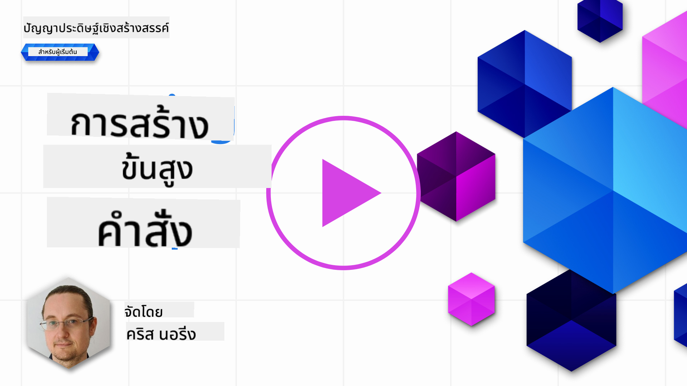

<!--
CO_OP_TRANSLATOR_METADATA:
{
  "original_hash": "b2651fb16bcfbc62b8e518751ed90fdb",
  "translation_date": "2025-10-17T18:32:46+00:00",
  "source_file": "05-advanced-prompts/README.md",
  "language_code": "th"
}
-->
# การสร้างคำสั่งขั้นสูง

[](https://youtu.be/BAjzkaCdRok?si=NmUIyRf7-cDgbjtt)

มาทบทวนสิ่งที่เราเรียนรู้จากบทก่อนหน้านี้:

> การ _ออกแบบคำสั่ง_ คือกระบวนการที่เรา **นำทางโมเดลไปสู่การตอบสนองที่เกี่ยวข้องมากขึ้น** โดยการให้คำแนะนำหรือบริบทที่มีประโยชน์มากขึ้น

การเขียนคำสั่งมีสองขั้นตอน: การสร้างคำสั่งโดยการให้บริบทที่เกี่ยวข้อง และ _การปรับปรุง_ ซึ่งเป็นการปรับคำสั่งให้ดีขึ้นเรื่อยๆ

ณ จุดนี้ เรามีความเข้าใจพื้นฐานเกี่ยวกับการเขียนคำสั่ง แต่เราต้องเจาะลึกลงไปอีก ในบทนี้ คุณจะได้เรียนรู้วิธีการสร้างคำสั่งโดยใช้เทคนิคพื้นฐานที่สามารถนำไปใช้กับ LLM ใดๆ ได้

## บทนำ

ในบทนี้ เราจะครอบคลุมหัวข้อดังต่อไปนี้:

- ขยายความรู้เกี่ยวกับการออกแบบคำสั่งโดยการใช้เทคนิคต่างๆ กับคำสั่งของคุณ
- การปรับแต่งคำสั่งเพื่อให้ผลลัพธ์แตกต่างกัน

## เป้าหมายการเรียนรู้

หลังจากจบบทเรียนนี้ คุณจะสามารถ:

- ใช้เทคนิคการออกแบบคำสั่งที่ช่วยปรับปรุงผลลัพธ์ของคำสั่ง
- ดำเนินการเขียนคำสั่งที่มีความหลากหลายหรือมีความแน่นอน

## การออกแบบคำสั่ง

การออกแบบคำสั่งคือกระบวนการสร้างคำสั่งที่ให้ผลลัพธ์ตามที่ต้องการ การออกแบบคำสั่งไม่ได้เป็นเพียงการเขียนข้อความคำสั่งเท่านั้น แต่เป็นชุดของเทคนิคที่คุณสามารถนำไปใช้เพื่อให้ได้ผลลัพธ์ตามที่ต้องการ

### ตัวอย่างของคำสั่ง

ลองดูตัวอย่างคำสั่งพื้นฐานนี้:

> สร้างคำถามเกี่ยวกับภูมิศาสตร์ 10 ข้อ

ในคำสั่งนี้ คุณกำลังใช้ชุดเทคนิคการออกแบบคำสั่งที่แตกต่างกัน

มาดูรายละเอียดกัน:

- **บริบท** คุณระบุว่าควรเกี่ยวกับ "ภูมิศาสตร์"
- **จำกัดผลลัพธ์** คุณต้องการคำถามไม่เกิน 10 ข้อ

### ข้อจำกัดของการเขียนคำสั่งแบบง่าย

คุณอาจจะได้ผลลัพธ์ที่ต้องการหรือไม่ก็ได้ คุณอาจได้คำถามที่สร้างขึ้นมา แต่เนื่องจากภูมิศาสตร์เป็นหัวข้อที่กว้าง คุณอาจไม่ได้สิ่งที่คุณต้องการเนื่องจากเหตุผลดังต่อไปนี้:

- **หัวข้อกว้าง** คุณไม่รู้ว่ามันจะเกี่ยวกับประเทศ เมืองหลวง แม่น้ำ หรืออื่นๆ
- **รูปแบบ** ถ้าคุณต้องการให้คำถามมีรูปแบบเฉพาะล่ะ?

ดังที่คุณเห็น มีหลายสิ่งที่ต้องพิจารณาเมื่อสร้างคำสั่ง

จนถึงตอนนี้ เราได้เห็นตัวอย่างคำสั่งง่ายๆ แต่ AI เชิงสร้างสรรค์สามารถทำอะไรได้มากกว่านั้นเพื่อช่วยเหลือผู้คนในหลากหลายบทบาทและอุตสาหกรรม ลองสำรวจเทคนิคพื้นฐานบางอย่างต่อไป

### เทคนิคการเขียนคำสั่ง

ก่อนอื่น เราต้องเข้าใจว่าการเขียนคำสั่งเป็นคุณสมบัติ _ที่เกิดขึ้นเอง_ ของ LLM หมายความว่านี่ไม่ใช่ฟีเจอร์ที่ถูกสร้างขึ้นในโมเดล แต่เป็นสิ่งที่เราค้นพบเมื่อเราใช้โมเดล

มีเทคนิคพื้นฐานบางอย่างที่เราสามารถใช้เพื่อเขียนคำสั่งใน LLM ลองสำรวจกัน:

- **Zero-shot prompting** นี่คือรูปแบบการเขียนคำสั่งที่ง่ายที่สุด เป็นคำสั่งเดียวที่ขอการตอบสนองจาก LLM โดยอิงจากข้อมูลการฝึกอบรมเท่านั้น
- **Few-shot prompting** การเขียนคำสั่งประเภทนี้ช่วยนำทาง LLM โดยการให้ตัวอย่าง 1 หรือมากกว่าที่สามารถใช้เป็นแนวทางในการสร้างคำตอบ
- **Chain-of-thought** การเขียนคำสั่งประเภทนี้บอก LLM ว่าจะแบ่งปัญหาออกเป็นขั้นตอนอย่างไร
- **Generated knowledge** เพื่อปรับปรุงการตอบสนองของคำสั่ง คุณสามารถให้ข้อเท็จจริงหรือความรู้เพิ่มเติมในคำสั่งของคุณ
- **Least to most** คล้ายกับ chain-of-thought เทคนิคนี้เกี่ยวกับการแบ่งปัญหาออกเป็นชุดของขั้นตอนและขอให้ดำเนินการตามลำดับ
- **Self-refine** เทคนิคนี้เกี่ยวกับการวิจารณ์ผลลัพธ์ของ LLM และขอให้ปรับปรุง
- **Maieutic prompting** สิ่งที่คุณต้องการคือการทำให้แน่ใจว่าคำตอบของ LLM ถูกต้อง และคุณขอให้มันอธิบายส่วนต่างๆ ของคำตอบ นี่เป็นรูปแบบหนึ่งของ self-refine

### Zero-shot prompting

รูปแบบการเขียนคำสั่งนี้ง่ายมาก ประกอบด้วยคำสั่งเดียว เทคนิคนี้อาจเป็นสิ่งที่คุณใช้เมื่อเริ่มเรียนรู้เกี่ยวกับ LLM นี่คือตัวอย่าง:

- คำสั่ง: "Algebra คืออะไร?"
- คำตอบ: "Algebra เป็นสาขาของคณิตศาสตร์ที่ศึกษาสัญลักษณ์ทางคณิตศาสตร์และกฎสำหรับการจัดการสัญลักษณ์เหล่านี้"

### Few-shot prompting

รูปแบบการเขียนคำสั่งนี้ช่วยโมเดลโดยการให้ตัวอย่างบางส่วนพร้อมกับคำขอ ประกอบด้วยคำสั่งเดียวพร้อมข้อมูลเฉพาะงานเพิ่มเติม นี่คือตัวอย่าง:

- คำสั่ง: "เขียนบทกวีในสไตล์ของ Shakespeare นี่คือตัวอย่างของ sonnet ของ Shakespeare:
  Sonnet 18: 'Shall I compare thee to a summer's day? Thou art more lovely and more temperate...'
  Sonnet 116: 'Let me not to the marriage of true minds Admit
ตามที่เห็น ผลลัพธ์มีความหลากหลายอย่างมาก

> โปรดทราบว่ายังมีพารามิเตอร์อื่นๆ ที่คุณสามารถปรับเปลี่ยนเพื่อให้ผลลัพธ์แตกต่างกัน เช่น top-k, top-p, repetition penalty, length penalty และ diversity penalty แต่สิ่งเหล่านี้อยู่นอกเหนือขอบเขตของหลักสูตรนี้

## แนวทางปฏิบัติที่ดี

มีหลายวิธีที่คุณสามารถนำไปใช้เพื่อให้ได้ผลลัพธ์ตามที่ต้องการ คุณจะค้นพบสไตล์ของตัวเองเมื่อคุณใช้การตั้งคำถามมากขึ้นเรื่อยๆ

นอกเหนือจากเทคนิคที่เราได้กล่าวถึงแล้ว ยังมีแนวทางปฏิบัติที่ดีบางประการที่ควรพิจารณาเมื่อใช้การตั้งคำถามกับ LLM

นี่คือแนวทางปฏิบัติที่ดีที่ควรพิจารณา:

- **ระบุบริบท** บริบทมีความสำคัญ ยิ่งคุณสามารถระบุได้มาก เช่น โดเมน หัวข้อ ฯลฯ ก็จะยิ่งดีขึ้น
- จำกัดผลลัพธ์ หากคุณต้องการจำนวนรายการที่เฉพาะเจาะจงหรือความยาวที่เฉพาะเจาะจง ให้ระบุไว้
- **ระบุทั้งสิ่งที่ต้องการและวิธีการ** อย่าลืมระบุทั้งสิ่งที่คุณต้องการและวิธีการที่คุณต้องการ เช่น "สร้าง Python Web API ที่มี routes สำหรับ products และ customers แบ่งออกเป็น 3 ไฟล์"
- **ใช้เทมเพลต** บ่อยครั้ง คุณอาจต้องการเพิ่มข้อมูลจากบริษัทของคุณลงในคำถาม ใช้เทมเพลตเพื่อทำสิ่งนี้ เทมเพลตสามารถมีตัวแปรที่คุณแทนที่ด้วยข้อมูลจริง
- **สะกดคำให้ถูกต้อง** LLM อาจให้คำตอบที่ถูกต้องแก่คุณ แต่ถ้าคุณสะกดคำถูกต้อง คุณจะได้รับคำตอบที่ดียิ่งขึ้น

## งานที่ได้รับมอบหมาย

นี่คือโค้ดใน Python ที่แสดงวิธีสร้าง API แบบง่ายๆ โดยใช้ Flask:

```python
from flask import Flask, request

app = Flask(__name__)

@app.route('/')
def hello():
    name = request.args.get('name', 'World')
    return f'Hello, {name}!'

if __name__ == '__main__':
    app.run()
```

ใช้ผู้ช่วย AI เช่น GitHub Copilot หรือ ChatGPT และใช้เทคนิค "self-refine" เพื่อปรับปรุงโค้ด

## วิธีแก้ไข

โปรดลองแก้ไขงานโดยเพิ่มคำถามที่เหมาะสมลงในโค้ด

> [!TIP]
> ตั้งคำถามเพื่อขอให้ปรับปรุง เป็นความคิดที่ดีที่จะจำกัดจำนวนการปรับปรุง คุณยังสามารถขอให้ปรับปรุงในลักษณะเฉพาะ เช่น สถาปัตยกรรม ประสิทธิภาพ ความปลอดภัย ฯลฯ

[วิธีแก้ไข](../../../05-advanced-prompts/python/aoai-solution.py)

## การตรวจสอบความรู้

ทำไมฉันถึงใช้ chain-of-thought prompting? แสดงคำตอบที่ถูกต้อง 1 ข้อ และคำตอบที่ไม่ถูกต้อง 2 ข้อ

1. เพื่อสอน LLM วิธีแก้ปัญหา
1. B, เพื่อสอน LLM ให้ค้นหาข้อผิดพลาดในโค้ด
1. C, เพื่อสั่งให้ LLM คิดวิธีแก้ปัญหาที่แตกต่างกัน

A: 1, เพราะ chain-of-thought เกี่ยวกับการแสดงให้ LLM เห็นวิธีแก้ปัญหาโดยการให้ขั้นตอนต่างๆ และปัญหาที่คล้ายกันพร้อมวิธีแก้ไข

## 🚀 ความท้าทาย

คุณเพิ่งใช้เทคนิค self-refine ในงานที่ได้รับมอบหมาย ลองนำโปรแกรมใดๆ ที่คุณสร้างขึ้นมาพิจารณาว่าคุณต้องการปรับปรุงอะไรบ้าง จากนั้นใช้เทคนิค self-refine เพื่อปรับปรุงตามที่เสนอ คุณคิดว่าผลลัพธ์ดีขึ้นหรือแย่ลง?

## ทำได้ดีมาก! เรียนรู้ต่อไป

หลังจากจบบทเรียนนี้ ลองดู [Generative AI Learning collection](https://aka.ms/genai-collection?WT.mc_id=academic-105485-koreyst) เพื่อเพิ่มพูนความรู้เกี่ยวกับ Generative AI ของคุณ!

ไปที่บทเรียนที่ 6 ซึ่งเราจะนำความรู้เกี่ยวกับ Prompt Engineering ไปใช้โดย [สร้างแอปพลิเคชันการสร้างข้อความ](../06-text-generation-apps/README.md?WT.mc_id=academic-105485-koreyst)

---

**ข้อจำกัดความรับผิดชอบ**:  
เอกสารนี้ได้รับการแปลโดยใช้บริการแปลภาษา AI [Co-op Translator](https://github.com/Azure/co-op-translator) แม้ว่าเราจะพยายามให้การแปลมีความถูกต้อง แต่โปรดทราบว่าการแปลอัตโนมัติอาจมีข้อผิดพลาดหรือความไม่ถูกต้อง เอกสารต้นฉบับในภาษาดั้งเดิมควรถือเป็นแหล่งข้อมูลที่เชื่อถือได้ สำหรับข้อมูลที่สำคัญ ขอแนะนำให้ใช้บริการแปลภาษามืออาชีพ เราไม่รับผิดชอบต่อความเข้าใจผิดหรือการตีความผิดที่เกิดจากการใช้การแปลนี้